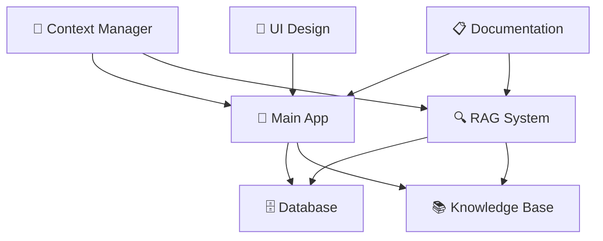

# 🤖 Project Agents Overview

Visual directory of all specialized agents in the Ultraterrestrial project, organized by function and color-coded for easy identification.

## 🏗️ Infrastructure & Core Systems
*Foundation layer agents managing data, context, and knowledge*

| Agent | Icon | Color | Role | Workspace |
|-------|------|-------|------|-----------|
| **context-manager** | 🧠 | **#2563eb** | Cross-agent coordination | Global |
| **packages-db-agent** | 🗄️ | **#1e40af** | Database operations & Xata | `/packages/db/` |
| **packages-knowledge-base** | 📚 | **#3730a3** | Knowledge management | `/packages/knowledge-base/` |

## ⚡ Application Layer
*User-facing application and processing systems*

| Agent | Icon | Color | Role | Workspace |
|-------|------|-------|------|-----------|
| **apps-app-agent** | 🎯 | **#16a34a** | Main UI & UX | `/apps/app/` |
| **apps-disclosure-rag-agent** | 🔍 | **#059669** | RAG processing | `/apps/disclosure-rag/` |

## 📝 Content & Documentation
*Documentation, design, and content creation*

| Agent | Icon | Color | Role | Workspace |
|-------|------|-------|------|-----------|
| **documentation-agent** | 📋 | **#ea580c** | Technical docs | Global |
| **archival-design-agent** | 🎨 | **#dc2626** | Vintage UI & archival design | Design assets |

---

## Agent Interaction Flow

## Color Palette Reference

### Infrastructure & Core (Blue Family)
- `#2563eb` - Context management (blue-600)
- `#1e40af` - Database operations (blue-700)
- `#3730a3` - Knowledge systems (indigo-700)

### Application Layer (Green Family)
- `#16a34a` - Main application (green-600)
- `#059669` - RAG processing (emerald-600)

### Content & Documentation (Warm Family)
- `#ea580c` - Documentation (orange-600)
- `#dc2626` - Design specialist (red-600)

---

## Usage Guidelines

### Agent Selection
- **🧠 Context Manager**: For multi-agent coordination and complex workflows
- **🗄️ Database**: For schema changes, queries, and data operations
- **📚 Knowledge Base**: For document management and knowledge synthesis
- **🎯 Main App**: For UI/UX, React components, and user features
- **🔍 RAG System**: For AI processing, vector operations, and search
- **📋 Documentation**: For technical writing and project documentation
- **🎨 Archival Design**: For authentic vintage UI components and classified aesthetics

### Color Usage
- Use agent colors in commit messages: `🎯 feat(app): new mindmap feature`
- Reference colors in documentation for clarity
- Apply color coding in development tools and dashboards
- Use for visual project organization and team communication

---

*Last updated: $(date)*