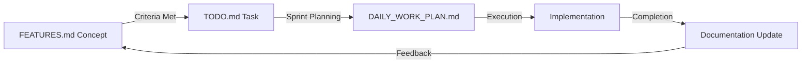

# Three-Tier Project Management Integration

**Generated**: January 20, 2025
**Purpose**: Seamless integration with existing three-tier project management system
**Project**: Ultraterrestrial Resurrection

---

## 📊 Three-Tier System Overview

### System Architecture
```
┌─────────────────────────────────────────┐
│   Tier 1: FEATURES.md (Strategic)       │
│   - High-level concepts                 │
│   - Architectural decisions             │
│   - Long-term vision                    │
└────────────────┬────────────────────────┘
                 ▼
┌─────────────────────────────────────────┐
│   Tier 2: TODO.md (Actionable)         │
│   - Ready-to-implement tasks           │
│   - Clear success criteria             │
│   - Estimated timelines                │
└────────────────┬────────────────────────┘
                 ▼
┌─────────────────────────────────────────┐
│   Tier 3: DAILY_WORK_PLAN.md (Tactical)│
│   - Current sprint execution           │
│   - Daily progress tracking            │
│   - Immediate priorities               │
└─────────────────────────────────────────┘
```

---

## 🔄 Context Integration Points

### Tier 1: Strategic Planning Integration

**File**: `docs/plans/FEATURES.md`
**Context Role**: Long-term vision and architectural decisions

```yaml
context_extraction:
  strategic_features:
    - External Web Resources RAG (Priority 1)
    - Database Infrastructure Modernization (Priority 2)
    - Prometheus API Consolidation (Priority 3)
    - Unified Mindmap Architecture (Priority 4)

  architectural_decisions:
    - Tool-based architecture approach
    - Firecrawl pre-ingestion strategy
    - API consolidation boundaries
    - Three-tier project management

  feature_maturation:
    ready_for_todo:
      - External Web RAG (all criteria met)
      - API Consolidation (architecture complete)
      - Prompts System (design finalized)
    needs_refinement:
      - Deep Research (technical approach needed)
      - Natural Language Tours (post-MVP)
```

### Tier 2: Actionable Tickets Integration

**File**: `docs/plans/TODO.md`
**Context Role**: Sprint planning and task prioritization

```yaml
context_extraction:
  total_tasks: 30
  current_focus: "Tasks 6-8: Unified Mindmap Foundation"

  task_groups:
    infrastructure: Tasks 1-5 (Database & Foundation)
    mindmap_unified: Tasks 6-8 (Current Sprint)
    research_canvas: Tasks 9-14 (Next Sprint)
    design_system: Tasks 15-17 (UI/UX)
    advanced_features: Tasks 18-21 (Integration)

  progress_tracking:
    completed: [1, 2, 3, 4, 5]
    in_progress: [6]
    pending: [7, 8, 9-30]

  dependencies:
    task_7: "Depends on Task 6 (API consolidation)"
    task_8: "Depends on Task 7 (State management)"
    task_9: "Depends on Task 8 (Enhanced nodes)"
```

### Tier 3: Daily Execution Integration

**File**: `DAILY_WORK_PLAN.md`
**Context Role**: Current sprint execution and daily tracking

```yaml
context_extraction:
  sprint_info:
    name: "Unified Mindmap Foundation Architecture"
    duration: "7 days (January 15-21, 2025)"
    tasks: "6-8 from TODO.md"

  daily_breakdown:
    day_1_2: "Task 6 - Replace mock entity extraction"
    day_3_5: "Task 7 - Unified state management"
    day_6_7: "Task 8 - Enhanced node standardization"

  current_status:
    day: 6
    active_task: "Task 6 completion"
    next_task: "Task 7 initialization"
    blockers: []

  success_metrics:
    api_consolidation: "50% reduction target"
    response_time: "<500ms target"
    node_consistency: "100% enhanced adoption"
```

---

## 🎯 Automated Context Flows

### Feature Maturation Flow


### Daily Context Update Flow
```yaml
morning_standup:
  - Check DAILY_WORK_PLAN.md for day's objectives
  - Review TODO.md for task dependencies
  - Update session context with priorities

midday_check:
  - Log progress in DAILY_WORK_PLAN.md
  - Check for blockers
  - Update task status in context

end_of_day:
  - Update TODO.md task status
  - Document decisions in FEATURES.md if needed
  - Prepare next day's context
```

### Command Context Flow
```typescript
class ThreeTierContextManager {
  async loadFullContext() {
    const features = await this.loadStrategic();
    const todos = await this.loadActionable();
    const daily = await this.loadTactical();

    return {
      vision: features.currentPriorities,
      tasks: todos.activeSprintTasks,
      today: daily.currentDayObjectives,
      metrics: this.calculateProgress(todos, daily)
    };
  }

  updateTier(tier: 'strategic' | 'actionable' | 'tactical', update: any) {
    switch(tier) {
      case 'strategic':
        this.updateFeatures(update); // Architectural decisions
        break;
      case 'actionable':
        this.updateTodos(update); // Task completion
        break;
      case 'tactical':
        this.updateDaily(update); // Progress tracking
        break;
    }
  }
}
```

---

## 📋 Context Synchronization Rules

### Rule 1: Upward Information Flow
```yaml
information_flow:
  daily_to_todo:
    trigger: "Task completion in DAILY_WORK_PLAN.md"
    action: "Mark task complete in TODO.md"
    validation: "Success criteria met"

  todo_to_features:
    trigger: "Major architectural decision during implementation"
    action: "Log decision in FEATURES.md architectural log"
    validation: "Impact assessment completed"
```

### Rule 2: Downward Task Flow
```yaml
task_flow:
  features_to_todo:
    trigger: "Feature meets all 7 readiness criteria"
    action: "Create actionable tasks in TODO.md"
    validation: "Clear success metrics defined"

  todo_to_daily:
    trigger: "Sprint planning session"
    action: "Break tasks into daily objectives"
    validation: "2-4 hour work chunks identified"
```

### Rule 3: Cross-Tier Validation
```yaml
validation_checks:
  consistency:
    - "Task in DAILY must exist in TODO.md"
    - "TODO.md tasks must align with FEATURES.md priorities"
    - "Progress in DAILY must update TODO.md status"

  completeness:
    - "All strategic features have maturation status"
    - "All TODO tasks have success criteria"
    - "All DAILY objectives have time estimates"
```

---

## 🚀 Implementation Patterns

### Context Loading Pattern
```typescript
// On session start
async function initializeProjectContext() {
  const context = new ThreeTierContextManager();

  // Load all three tiers
  await context.loadFullContext();

  // Establish current focus
  const sprint = context.getCurrentSprint();
  const todaysTasks = context.getTodaysObjectives();

  // Set command defaults
  CommandEnhancer.setDefaults({
    project: 'Ultraterrestrial Resurrection',
    sprint: sprint,
    tasks: todaysTasks,
    tiers: context.getTierStatus()
  });

  return context;
}
```

### Progress Update Pattern
```typescript
// During work session
async function updateProgress(taskId: string, status: string) {
  const context = await loadContext();

  // Update tactical tier (DAILY_WORK_PLAN.md)
  context.updateTier('tactical', {
    task: taskId,
    status: status,
    timestamp: new Date()
  });

  // If task complete, update actionable tier (TODO.md)
  if (status === 'completed') {
    context.updateTier('actionable', {
      task: taskId,
      completedAt: new Date(),
      metrics: gatherMetrics()
    });
  }

  // If architectural decision made, update strategic tier
  if (hasArchitecturalImpact(taskId)) {
    context.updateTier('strategic', {
      decision: getDecisionDetails(),
      rationale: getDecisionRationale(),
      impact: assessImpact()
    });
  }
}
```

### Decision Documentation Pattern
```yaml
architectural_decision:
  location: "FEATURES.md > Architectural Decisions Log"
  format:
    date: "ISO 8601"
    context: "What prompted the decision"
    decision: "What was decided"
    rationale: "Why this approach"
    impact: "Expected effects"
    status: "Approved/Pending/Rejected"

  example:
    date: "2025-01-20"
    context: "Entity extraction has mock implementations"
    decision: "Copy sophisticated NER from disclosure/chat"
    rationale: "Reuse working code vs. rebuild"
    impact: "Faster delivery, proven reliability"
    status: "Approved"
```

---

## 📊 Integration Success Metrics

### Tier Synchronization
- **Update Latency**: <1 minute between tier updates
- **Consistency Score**: 100% alignment across tiers
- **Decision Tracking**: All architectural decisions logged
- **Progress Accuracy**: Real-time reflection of work state

### Context Effectiveness
- **Load Time**: <500ms for full three-tier context
- **Command Accuracy**: 95% correct tier references
- **Update Propagation**: Automatic tier updates
- **Session Continuity**: Zero context loss between sessions

### Developer Experience
- **Context Switches**: 50% reduction in manual lookups
- **Decision Speed**: 30% faster with clear tier guidance
- **Progress Visibility**: 100% transparency across tiers
- **Collaboration**: Consistent understanding across team

---

## 🔗 Quick Reference Commands

### Tier Navigation
```bash
# View strategic planning
cat docs/plans/FEATURES.md | grep "Priority"

# Check actionable tasks
cat docs/plans/TODO.md | grep "Task [6-8]"

# See daily execution
head -50 DAILY_WORK_PLAN.md

# Full context load
/load .context/three-tier-integration.md
```

### Progress Updates
```bash
# Update daily progress
echo "Task 6: 75% complete" >> DAILY_WORK_PLAN.md

# Mark TODO complete
sed -i 's/Task 6.*/Task 6 ✅ COMPLETE/' docs/plans/TODO.md

# Log architectural decision
echo "Decision: [details]" >> docs/plans/FEATURES.md
```

---

## 🎯 Best Practices

### Daily Workflow
1. **Start**: Load three-tier context
2. **Plan**: Review daily objectives from DAILY_WORK_PLAN.md
3. **Execute**: Implement with tier awareness
4. **Update**: Progress in appropriate tier
5. **Document**: Decisions and blockers

### Sprint Planning
1. **Review**: FEATURES.md for priorities
2. **Select**: Tasks from TODO.md
3. **Break Down**: Into DAILY_WORK_PLAN.md
4. **Validate**: Dependencies and timelines
5. **Commit**: To sprint objectives

### Feature Maturation
1. **Conceive**: In FEATURES.md
2. **Refine**: Until criteria met
3. **Actionize**: Move to TODO.md
4. **Schedule**: In sprint planning
5. **Execute**: Via DAILY_WORK_PLAN.md

---

*This integration ensures seamless coordination between the three-tier project management system and Claude Code's context awareness, enabling efficient sprint execution and consistent project progress.*