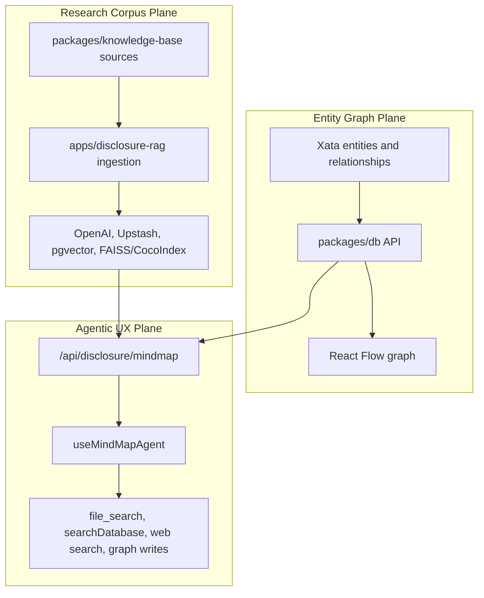

# AI Data Engineering Audit Plan

## Objective
Produce a comprehensive architecture audit for `packages/db`, `packages/knowledge-base`, `apps/disclosure-rag`, and `apps/app`, applying AI data-engineering, visual-explainer, AI UX patterns, and AI chat interface lenses. The output will be a knowledge base for choosing the platform architecture that replaces Xata and brings the app back online.

## Confirmed Starting Point
- Workspace root confirmed: `/Users/liamellis/Desktop/01_ACTIVE/ultraterrestrial-resurrection`.
- Current branch: `dev`.
- `packages/db` is the Xata-heavy data API surface, especially through `askXata`, `askXataWithAi`, `searchXata`, `xataToXYFlow`, and generated model exports.
- `packages/knowledge-base` is primarily a static filesystem corpus and metadata package, not a live retrieval service.
- `apps/disclosure-rag` contains ingestion, entity extraction, and multiple vector/indexing experiments, including OpenAI, Upstash, Xata, pgvector, FAISS/CocoIndex-related paths.
- `apps/app` consumes data both through CRUD/query flows and agentic mindmap flows, with the live path centered on `apps/app/src/app/api/disclosure/mindmap/route.ts` and `apps/app/src/features/mindmap/hooks/use-mindmap-agent.ts`.

## Exact Audit Targets
- `packages/db`
  - Entry points: [`packages/db/index.ts`](packages/db/index.ts), [`packages/db/registry.ts`](packages/db/registry.ts), [`packages/db/src/xata-typescript-sdk/api/ask.ts`](packages/db/src/xata-typescript-sdk/api/ask.ts), [`packages/db/src/xata-typescript-sdk/api/search.ts`](packages/db/src/xata-typescript-sdk/api/search.ts), [`packages/db/src/xata-typescript-sdk/api/xata-to-xyflow.ts`](packages/db/src/xata-typescript-sdk/api/xata-to-xyflow.ts).
  - Focus: schema surface, CRUD helpers, Xata Ask/search/vector coupling, React Flow transformations, provider registry viability.

- `packages/knowledge-base`
  - Entry points: [`packages/knowledge-base/index.ts`](packages/knowledge-base/index.ts), [`packages/knowledge-base/package.json`](packages/knowledge-base/package.json), `packages/knowledge-base/sources`, `packages/knowledge-base/metadata`, and package docs.
  - Focus: static corpus layout, metadata contracts, `sources/files` vs legacy `case_files` drift, exports, whether it is actually queryable by runtime code.

- `apps/disclosure-rag`
  - Entry points: [`apps/disclosure-rag/README.md`](apps/disclosure-rag/README.md), [`apps/disclosure-rag/lib/unified_rag_orchestrator.py`](apps/disclosure-rag/lib/unified_rag_orchestrator.py), [`apps/disclosure-rag/lib/knowledge_base_service.py`](apps/disclosure-rag/lib/knowledge_base_service.py), [`apps/disclosure-rag/lib/xata_search.py`](apps/disclosure-rag/lib/xata_search.py), [`apps/disclosure-rag/lib/storage/pgvector_library.py`](apps/disclosure-rag/lib/storage/pgvector_library.py), [`apps/disclosure-rag/api/unified_search.py`](apps/disclosure-rag/api/unified_search.py).
  - Focus: ingestion, entity extraction, vectorization, OpenAI vector store bridge, Upstash, pgvector, FAISS/CocoIndex paths, API/CLI entry points, and config/secrets risk.

- `apps/app`
  - Entry points: [`apps/app/src/app/(site)/research-canvas/page.tsx`](apps/app/src/app/(site)/research-canvas/page.tsx), [`apps/app/src/app/api/disclosure/mindmap/route.ts`](apps/app/src/app/api/disclosure/mindmap/route.ts), [`apps/app/src/features/mindmap/hooks/use-mindmap-agent.ts`](apps/app/src/features/mindmap/hooks/use-mindmap-agent.ts), [`apps/app/src/features/mindmap/graph.tsx`](apps/app/src/features/mindmap/graph.tsx), [`apps/app/src/features/research-canvas`](apps/app/src/features/research-canvas), [`apps/app/src/features/mindmap/components/menus/mindmap-bottom-menu`](apps/app/src/features/mindmap/components/menus/mindmap-bottom-menu), [`apps/app/src/services/ai/openai/tools/search-database.ts`](apps/app/src/services/ai/openai/tools/search-database.ts).
  - Focus: live render path, SSE tool-call UX, graph materialization, CRUD dependencies, research-canvas shell, bottom-menu AI affordances, mocks/stale paths to avoid.

## Subagent Team Plan
- For each backend section, run a paired read-only review:
  - `database-architect`: schema, storage, query contract, migration surface, platform replacement implications.
  - `AI Engineer` or `ai-engineer`: RAG, embeddings, retrieval, agent tool use, evaluation, vectorization flow.
- For `apps/app`, run frontend-focused read-only reviews:
  - `ui-ux-designer` or `frontend-architect`: AI UX patterns, chat/tool-call state, bottom menu, research-canvas surface.
  - `ai-engineer`: client/server agent contract, SSE stream semantics, retrieval/tool evidence model.
- Preserve the main context for synthesis and final document shaping.

## Visual Explainer Deliverables
Create a documentation bundle under `docs/architecture/ai-data-engineering-audit/`:

- `AiDataEngineeringAudit_PSEUDOCODE.md`
  - Planning/pseudocode artifact for the audit workflow, per your documentation convention.

- `AiDataEngineeringXataReplacementAudit.md`
  - Main narrative audit with architecture findings, risks, recommendations, and a Xata replacement decision matrix.

- `PackagesDbArchitecture.html`
  - Visual explainer for `packages/db`: exports, model/API surface, Xata coupling, CRUD and graph query paths.

- `KnowledgeBaseArchitecture.html`
  - Visual explainer for `packages/knowledge-base`: static corpus, metadata, exports, ingestion consumers, path drift.

- `DisclosureRagArchitecture.html`
  - Visual explainer for `apps/disclosure-rag`: ingestion-to-vector pipeline, entity extraction, competing vector stores, runtime/API status, security/config findings.

- `AppAgenticUxArchitecture.html`
  - Visual explainer for `apps/app`: research canvas render path, mindmap agent SSE loop, tool events, graph writes, bottom-menu/chat UX improvements.

- `XataReplacementDecisionMap.html`
  - Cross-system visual explainer comparing likely replacement architectures: Postgres + pgvector, Postgres + external search, dedicated vector DB + relational DB, or managed backend replacement.

## Architecture Lens
The audit will separate three currently conflated planes:

## Audit Method
1. Inventory exact imports, exports, environment variables, data contracts, and file boundaries.
2. Trace the live app flow from `research-canvas/page.tsx` to `MindMap`, `Graph`, `useMindMapAgent`, `/api/disclosure/mindmap`, `searchDatabase`, and graph writes.
3. Map the backend RAG flow from `packages/knowledge-base/sources` through `apps/disclosure-rag` indexing/vector layers and compare it to the app’s OpenAI/Xata path.
4. Identify hard Xata dependencies and classify them as CRUD, full-text search, vector search, Ask/AI, graph layout, or generated types.
5. Identify non-production or stale surfaces, especially mock adapters and dead/ghost mindmap routes, so the replacement design does not inherit false assumptions.
6. Apply AI UX and building-AI-chat standards to recommend how the frontend should expose retrieval evidence, tool progress, citations, retries, context state, and graph mutations.
7. Produce platform replacement options with migration implications and minimum viable architecture for restoring the app.

## Key Risks To Include
- `apps/disclosure-rag/lib/upstash/vector.py` appears to contain a hardcoded Upstash Vector credential. The audit will redact it, flag it as a secret exposure, and recommend rotation/removal.
- `apps/app/src/features/ai/knowledge/adapters/local-files-adapter.ts` and `xata-adapter.ts` contain mock data paths that should not be treated as critical retrieval logic.
- Xata replacement affects multiple distinct contracts: CRUD, search, Ask/AI, vector search, generated types, and React Flow graph hydration.
- The app’s live mindmap path uses OpenAI vector store plus Xata search, while `packages/knowledge-base` and `apps/disclosure-rag` are parallel rather than unified.

## Verification Plan
- Run read-only grep/import inventory and include command summaries in the audit.
- Validate every architecture diagram against concrete source paths.
- Run docs-only quality checks where available, likely a markdown/link sanity review rather than application tests.
- No application code will be changed in this audit unless you explicitly expand scope after reviewing the docs.

## Proposed Outcome
By the end, you will have a visual and textual architecture dossier that answers:
- What does each section actually do today?
- Which parts are real production paths vs stale, mock, or aspirational paths?
- Where exactly does Xata keep the app online?
- What platform capabilities must replace Xata before the app can recover?
- How should the frontend agentic UX represent retrieval, uncertainty, citations, tool progress, and graph mutations?