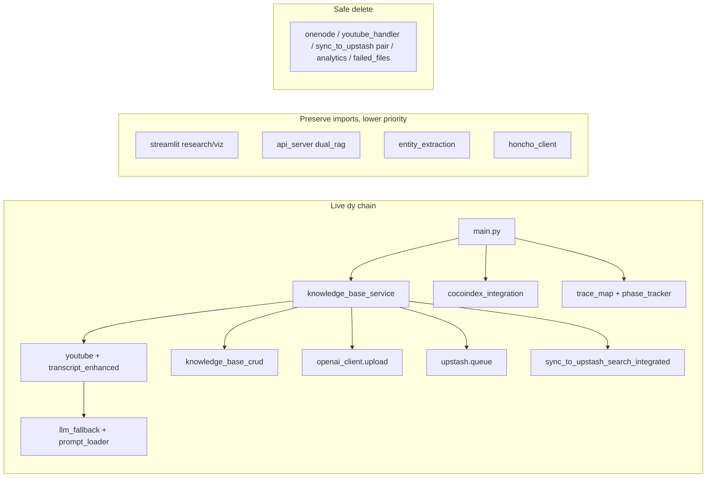

# Non-breaking cleanup of `apps/disclosure-rag/lib`

## Current state

~45 top-level modules + 10 packages; ~14k lines in flat `lib/*.py` alone. The live ingestion path (`dy` → [`main.py`](apps/disclosure-rag/main.py) → [`knowledge_base_service.py`](apps/disclosure-rag/lib/knowledge_base_service.py)) only needs a small core. Everything else is Streamlit/API/agent/alt-main/docs residue, or already-deleted ghosts still referenced in tests/docs.



## Safety rules (non-breaking)

- Do **not** rename or move anything on the `dy` chain without leaving a same-path re-export stub.
- Do **not** delete modules imported by [`main.py`](apps/disclosure-rag/main.py), [`main.sh`](apps/disclosure-rag/main.sh), [`scripts/playlist_ingestion.py`](apps/disclosure-rag/scripts/playlist_ingestion.py), or green tests.
- Prefer **delete orphans → quarantine → organize with shims**. No big-bang package rewrite.
- After each phase: `python -m pytest tests/test_main.py tests/test_trace_map.py tests/test_rag_prompt_pipeline_wiring.py` (narrow) then fuller `tests/` if phase 2+ touches entity/search.

---

## Phase 0 — Hygiene (zero risk)

- Delete orphan `__pycache__` for missing sources: `local_rag`, `xata_search`, `triple_rag_schema_adapter`, `enhanced_main_integration`, `hybrid_vector_manager`.
- Ensure `lib/**/__pycache__/` and `lib/entity_extraction/utils/.cache/` stay gitignored.
- Move or gitignore the 2.2MB runtime artifact [`lib/entity_extraction/entity_index.json`](apps/disclosure-rag/lib/entity_extraction/entity_index.json) (belongs under `data/`, not `lib/`).

---

## Phase 1 — Delete proven orphans (no Python importers outside themselves/docs)

Safe to delete (confirmed: only self-refs, graft/docs, or existence checks):

| Path | Why |
| ------ | ----- |
| [`lib/onenode_integration.py`](apps/disclosure-rag/lib/onenode_integration.py) | No importers |
| [`lib/simple_unified_search.py`](apps/disclosure-rag/lib/simple_unified_search.py) | Docs only |
| [`lib/youtube_handler.py`](apps/disclosure-rag/lib/youtube_handler.py) | Superseded by `youtube.py` + `youtube_transcript_enhanced.py`; only mentioned in docs / `fix_disclosure_rag.py` existence check |
| [`lib/analytics/document_analytics.py`](apps/disclosure-rag/lib/analytics/document_analytics.py) (+ empty package) | No importers |
| [`lib/openai_client/failed_files.py`](apps/disclosure-rag/lib/openai_client/failed_files.py) | Hardcoded one-off list |
| [`lib/openai_client/remove_failed_files.py`](apps/disclosure-rag/lib/openai_client/remove_failed_files.py) | Broken relative import; unused |
| [`lib/openai_client/vector_store_query.py`](apps/disclosure-rag/lib/openai_client/vector_store_query.py) | No importers |
| [`lib/upstash/document_library.py`](apps/disclosure-rag/lib/upstash/document_library.py) | No importers |
| [`lib/storage/pgvector_library.py`](apps/disclosure-rag/lib/storage/pgvector_library.py) | Self-only |
| [`lib/cocoindex/setup_cocoindex.py`](apps/disclosure-rag/lib/cocoindex/setup_cocoindex.py) | Superseded; live uses `cocoindex_integration` + `cocoindex_flows` |
| [`lib/cocoindex/setup_cocoindex_flow.py`](apps/disclosure-rag/lib/cocoindex/setup_cocoindex_flow.py) | Same |
| [`lib/connectors/ultraterrestrial_db.ts`](apps/disclosure-rag/lib/connectors/ultraterrestrial_db.ts) | Misplaced TS in Python tree; only TS test/docs |
| [`lib/sync_to_upstash.py`](apps/disclosure-rag/lib/sync_to_upstash.py) | Zero importers; superseded by `sync_to_upstash_search_integrated` (live path). Graft/doc filename mirrors only |
| [`lib/sync_to_upstash_search.py`](apps/disclosure-rag/lib/sync_to_upstash_search.py) | Same — no callers; not worth Phase-3 shim wrappers |

Also delete the empty `analytics/` package after the module goes.

**Keep for now (look orphaned but have callers):** `simple_backup_vector` (`scripts/main_simple.py`), `data_formatter` (benchmark), `state_manager` (`process_entities.py`), `knowledge_base.py` (`utils/tools.py`, `knowledge_base_ui.py`), entire `database_explorer/` (self-contained Streamlit entry).

---

## Phase 2 — Quarantine secondary surfaces (imports preserved via move + stub)

Move packages that are **not** on the `dy` chain into [`lib/_legacy/`](apps/disclosure-rag/lib/_legacy/) **and** leave thin re-export stubs at the old paths so existing imports keep working:

- [`lib/database_explorer/`](apps/disclosure-rag/lib/database_explorer/) — Streamlit DB explorer only
- [`lib/visualization/`](apps/disclosure-rag/lib/visualization/) — Streamlit NER/geo
- [`lib/connectors/`](apps/disclosure-rag/lib/connectors/) — migration helper (`ultraterrestrial_db.py`); real importer: [`scripts/import-xata-to-postgres.py`](apps/disclosure-rag/scripts/import-xata-to-postgres.py) (`sys.path.append('../lib'); from connectors.ultraterrestrial_db import UltraterrestrialDB`)
- [`lib/research_manager.py`](apps/disclosure-rag/lib/research_manager.py) + [`lib/research_queue_manager.py`](apps/disclosure-rag/lib/research_queue_manager.py) — Streamlit / entity UI only
- [`lib/honcho_client.py`](apps/disclosure-rag/lib/honcho_client.py) — chat demos only, not `dy`
- [`lib/unified_rag_orchestrator.py`](apps/disclosure-rag/lib/unified_rag_orchestrator.py) + [`lib/adapters/`](apps/disclosure-rag/lib/adapters/) — `api_server` / unified search UI (already broken partially: imports missing `triple_rag_schema_adapter`)
- [`lib/storage/local_vector_library.py`](apps/disclosure-rag/lib/storage/local_vector_library.py) — only via orchestrator

Stub patterns:

```python
# Flat module — lib/honcho_client.py
from lib._legacy.honcho_client import *  # noqa: F401,F403
```

**Multi-file packages need a stub per importable path**, not only a package `__init__`. For `connectors/` (the only quarantine target that is a multi-file package with an external importer):

```python
# lib/connectors/__init__.py — keep package importable
# (re-export public names if any, or leave empty)

# lib/connectors/ultraterrestrial_db.py — required for:
#   scripts/import-xata-to-postgres.py → from connectors.ultraterrestrial_db import ...
from lib._legacy.connectors.ultraterrestrial_db import *  # noqa: F401,F403
```

Same rule for `database_explorer/`, `visualization/`, and `adapters/` if anything imports a submodule by path (not just the package root).

Optional later: delete stubs once callers are updated or alt entrypoints are retired.

Move planning docs out of code: [`lib/entity_extraction/docs/`](apps/disclosure-rag/lib/entity_extraction/docs/) → `apps/disclosure-rag/docs/archive/entity-extraction/` (no import impact).

---

## Phase 3 — Ghost-import hygiene (no sync shims)

`sync_to_upstash.py` / `sync_to_upstash_search.py` are Phase 1 deletes (zero importers). Canonical live sync remains [`sync_to_upstash_search_integrated.py`](apps/disclosure-rag/lib/sync_to_upstash_search_integrated.py). No shim wrappers for those two.

Leave related live modules as-is (no merge):

- [`youtube.py`](apps/disclosure-rag/lib/youtube.py) + [`youtube_transcript_enhanced.py`](apps/disclosure-rag/lib/youtube_transcript_enhanced.py) — both on `dy` chain
- [`knowledge_base_service.py`](apps/disclosure-rag/lib/knowledge_base_service.py) + [`knowledge_base_crud.py`](apps/disclosure-rag/lib/knowledge_base_crud.py); keep [`knowledge_base.py`](apps/disclosure-rag/lib/knowledge_base.py) until Agno/tools callers die
- [`llm_fallback.py`](apps/disclosure-rag/lib/llm_fallback.py) + [`llm_router.py`](apps/disclosure-rag/lib/llm_router.py) — router still used by fallback

Fix broken ghost imports (non-breaking = make tests skip or import-guard, do not resurrect deleted modules unless needed):

- [`lib/unified_rag_orchestrator.py`](apps/disclosure-rag/lib/unified_rag_orchestrator.py) imports missing `triple_rag_schema_adapter` / optional backends — already try/except; leave or harden.
- [`agents/entity_extraction_agent.py`](apps/disclosure-rag/agents/entity_extraction_agent.py) / tests referencing deleted `lib.xata_search` / `lib.local_rag` — mark tests skip or remove dead imports (outside `lib/` but required for honesty).

---

## Phase 4 — Light organization of the live core (optional, still shimmed)

Only if Phases 1–3 are stable. Group by domain **with stubs at old top-level paths**:

```
lib/
  kb/          # knowledge_base_service, knowledge_base_crud, kb_root, enrichment_status
  youtube/     # youtube.py, youtube_transcript_enhanced.py, transcript_fidelity.py
  llm/         # llm_fallback, llm_router, prompt_loader
  ingest/      # phase_tracker, trace_map, terminal_display, mem0_integration
  openai_client/, upstash/, cocoindex/, db/, entity_extraction/  # already packaged
  _legacy/     # quarantined Phase 2
```

Each old path (`lib/youtube.py`, etc.) becomes a one-line re-export. **`dy` and CALL_CHAIN stay valid.**

Skip this phase if you only want deletions — Phases 0–2 already make the tree readable.

---

## What stays untouched (live core)

Do not delete or relocate without shims:

- [`knowledge_base_service.py`](apps/disclosure-rag/lib/knowledge_base_service.py), [`knowledge_base_crud.py`](apps/disclosure-rag/lib/knowledge_base_crud.py), [`kb_root.py`](apps/disclosure-rag/lib/kb_root.py)
- [`youtube.py`](apps/disclosure-rag/lib/youtube.py), [`youtube_transcript_enhanced.py`](apps/disclosure-rag/lib/youtube_transcript_enhanced.py)
- [`openai_client/upload.py`](apps/disclosure-rag/lib/openai_client/upload.py), [`upstash/queue.py`](apps/disclosure-rag/lib/upstash/queue.py), [`upstash/upstash.py`](apps/disclosure-rag/lib/upstash/upstash.py)
- [`sync_to_upstash_search_integrated.py`](apps/disclosure-rag/lib/sync_to_upstash_search_integrated.py)
- [`cocoindex_integration.py`](apps/disclosure-rag/lib/cocoindex_integration.py), [`cocoindex_flows.py`](apps/disclosure-rag/lib/cocoindex_flows.py), [`cocoindex/`](apps/disclosure-rag/lib/cocoindex/) backends used by factory
- [`mem0_integration.py`](apps/disclosure-rag/lib/mem0_integration.py), [`terminal_display.py`](apps/disclosure-rag/lib/terminal_display.py), [`phase_tracker.py`](apps/disclosure-rag/lib/phase_tracker.py), [`enrichment_status.py`](apps/disclosure-rag/lib/enrichment_status.py)
- [`trace_map.py`](apps/disclosure-rag/lib/trace_map.py), [`transcript_fidelity.py`](apps/disclosure-rag/lib/transcript_fidelity.py)
- [`llm_fallback.py`](apps/disclosure-rag/lib/llm_fallback.py), [`llm_router.py`](apps/disclosure-rag/lib/llm_router.py), [`prompt_loader.py`](apps/disclosure-rag/lib/prompt_loader.py)
- [`entity_extraction/processors/interactive_entity_processor.py`](apps/disclosure-rag/lib/entity_extraction/processors/interactive_entity_processor.py) (+ core creator used by pipeline)
- [`db/postgres_client.py`](apps/disclosure-rag/lib/db/postgres_client.py)

---

## Verification checklist

1. `python -c "from lib.knowledge_base_service import kb_service; from lib.youtube import generate_transcript"`
2. `python -m pytest tests/test_main.py tests/test_trace_map.py tests/test_rag_prompt_pipeline_wiring.py tests/test_schema_strict_mode.py`
3. Smoke: `./main.sh --help` / dry-run if available
4. Confirm no remaining imports of deleted modules: `rg 'onenode_integration|youtube_handler|simple_unified_search|document_analytics|failed_files|setup_cocoindex|sync_to_upstash[^_]|sync_to_upstash_search[^_]' --glob '*.py'`
5. After Phase 2 connectors quarantine: `python -c "import sys; sys.path.insert(0,'lib'); from connectors.ultraterrestrial_db import UltraterrestrialDB"` (mirrors the script import style)

## Out of scope (unless you ask)

- Deleting alt entrypoints (`main_fixed.py`, `main_unified.py`, `streamlit_app.py`, etc.)
- Rewriting CALL_CHAIN / skill docs (update only if Phase 4 moves files)
- Resurrecting Triple RAG / Xata / `local_rag`
- Merging `knowledge_base_service` + CRUD into one file (high churn, low gain)
