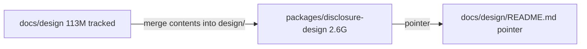

# Move docs/design into packages/disclosure-design

This **replaces** the parked vault-into-kit promotion. `@repo/disclosure-ui` is untouched.

**Package name (binding):** [`packages/disclosure-design`](packages/disclosure-design) / `@repo/disclosure-design`. Do **not** rename to `disclosure-design-lab`.

**Facts on disk now:**

- [`docs/design`](docs/design) was the git-tracked design tree: **113M**, **202 tracked files**. `mock-ups/` already deleted on disk (58 index `D`). No `package.json`.
- [`packages/disclosure-design`](packages/disclosure-design) is the 2.6G visual lab (old name `disclosure-design-references`). Nested empty `.git` deleted as part of this move.
- [`packages/disclosure-design/design`](packages/disclosure-design/design) already overlapped `docs/design` (same folder names, not identical). Vault brand-bible is newer. Docs `design-lab/` held the heavy art the vault dirs left empty. Vault holds mock-ups + `Archive.zip`.
- Root workspaces already include `"packages/*"`. Adding a `package.json` is enough for bun/pnpm. There is no `pnpm-workspace.yaml` and no `turbo.json`.

**Calls already made:**

- Package name: `disclosure-design` (`@repo/disclosure-design`)
- Delete the nested `.git`
- Git tracks only what `docs/design` already tracked, plus `package.json` / `README.md` / `.gitignore`. Gitignore stills, `_corpus/`, `Archive.zip`, extraction binaries.

## Recommended move shape: contents, not the folder

Do **not** replace the vault root with `docs/design`. The vault root is the lab (language, extractions, prompts, scripts). `docs/design` is the same *subtree* as `packages/disclosure-design/design/`.

Land at [`packages/disclosure-design/canon/`](packages/disclosure-design/canon/). Do **not** merge into vault [`packages/disclosure-design/design/`](packages/disclosure-design/design/).

- Docs-only files move (`tour-narrative-canon.md`, `paper/*.png`, filled `design-lab` binaries).
- Vault-only files stay (`mock-ups/`, `Archive.zip`, `vision/`).
- Overlap + identical: drop the docs copy.
- Overlap + differ: **keep vault** (newer brand-bible). Do not overwrite.
- Empty vault dirs that docs filled: move docs content in.

`docs/design` then becomes a stub README only. Living canon in [`docs/README.md`](docs/README.md) and [`AGENTS.md`](AGENTS.md) points at [`packages/disclosure-design/canon/`](packages/disclosure-design/canon/). Identity canon stays in [`docs/vision/`](docs/vision/) — that is not this move.

## Workspace package (not a runtime kit)

New [`packages/disclosure-design/package.json`](packages/disclosure-design/package.json), modeled on [`packages/disclosure-ui/package.json`](packages/disclosure-ui/package.json) but **private lab**, not React:

- `"name": "@repo/disclosure-design"`
- `"private": true`, `"type": "module"`
- Minimal exports: `./canon/*` for tracked brand-bible / lab files. No export of `extractions/`, `_corpus/`, or vault `design/`.
- Scripts wrapping existing on-disk Python (`visual_language.py`) so the package is invokable locally even if those scripts stay untracked.
- **Do not** add it as a dependency of `apps/app`. Workspace membership is enough.

Package [`.gitignore`](packages/disclosure-design/.gitignore):

- `_corpus/`
- `extractions/**/*.{png,jpg,jpeg,webp,gif}`
- `design/Archive.zip`
- `workers/`
- `.git/`
- large root stills (`*.png` at package root)

Parent [`.gitignore`](.gitignore) gets a matching safety net so `git add packages/` cannot ingest 2.6G.

Note: root `.gitignore` already has a bare `AGENTS.md`, so package `AGENTS.md` exists on disk but stays untracked unless force-added. Written anyway; global ignore unchanged.

Rewrite vault [`README.md`](packages/disclosure-design/README.md) title from `disclosure-design-references` to `disclosure-design`.

## Docs retarget (pointer only)

[`docs/design/README.md`](docs/design/README.md):

- Design lab lives at [`packages/disclosure-design`](packages/disclosure-design)
- Brand bible / design-lab / paper: [`packages/disclosure-design/canon/`](packages/disclosure-design/canon/)
- Runtime kit remains [`packages/disclosure-ui`](packages/disclosure-ui)
- Vision canon remains [`docs/vision/`](docs/vision/)

Update pointers in:

- [`docs/README.md`](docs/README.md) (spine row 4 + tree)
- [`AGENTS.md`](AGENTS.md) identity canon + learned facts
- [`.agents/rules/DOC_MAINTENANCE.md`](.agents/rules/DOC_MAINTENANCE.md) "where new docs go"
- [`CONTEXT.md`](CONTEXT.md) one-liner
- T-064 in [`docs/plans/TODO.md`](docs/plans/TODO.md) · notes: [`docs/PLANS/DisclosureDesignWorkspace.md`](docs/PLANS/DisclosureDesignWorkspace.md)

Do not rewrite every historical `docs/design/` mention in `.specstory/` or archive.

## Git procedure

1. Filesystem merge (move, do not copy).
2. `git add` only:
   - previously tracked `docs/design/**` at their new `packages/disclosure-design/canon/**` paths
   - `packages/disclosure-design/package.json`
   - `packages/disclosure-design/README.md`
   - `packages/disclosure-design/.gitignore`
   - `docs/design/README.md` stub
   - pointer files listed above
3. Confirm `git status` does **not** stage `extractions/`, `_corpus/`, `Archive.zip`, or the nested git objects.
4. `bun install` (or `pnpm install`) and confirm `@repo/disclosure-design` appears in the workspace list.

No commit unless asked.

## Out of scope

- Promoting gold components into [`packages/disclosure-ui`](packages/disclosure-ui) (old T-064)
- Committing `language/`, `prompts/`, `references/`, `concepts/`
- Making `apps/app` import the lab
- `turbo.json`
- Renaming to `disclosure-design-lab`

## Risks

- **HIGH — 2.6G accidental add.** Mitigated by package + root gitignore and selective `git add`.
- **MEDIUM — brand-bible forks.** Vault wins on diffs; docs extras still move if they have no vault twin.
- **MEDIUM — broken links.** Only living-canon files get retargeted. Old `docs/design/reference-prototype` path is already missing on disk; stub will say so.
- **LOW — bun/pnpm both declared.** Register with whichever lockfile the repo currently uses for workspace membership; do not switch package managers.
