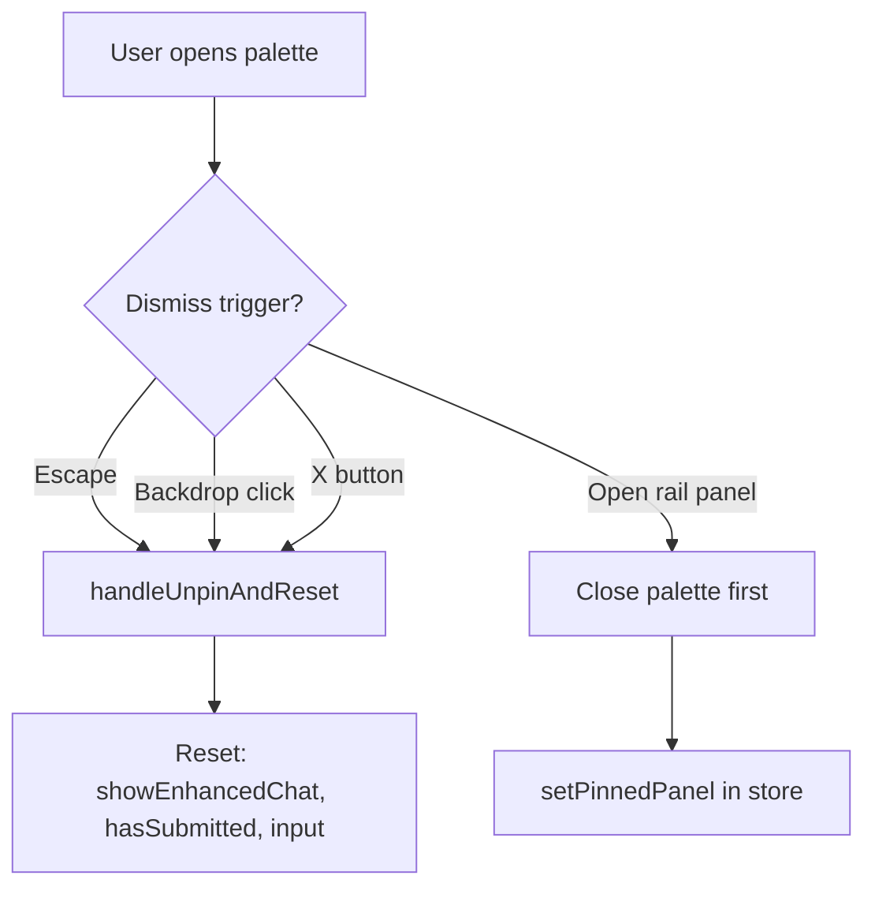

<!-- Generated by SpecStory, Markdown v2.1.0 -->

# 2026-06-26 08:58:50Z

<!-- Cursor IDE Session 169bcedf-5799-48b8-9a0e-325169177133 (2026-06-26 08:58:50Z) -->

_**User**_

/subagent-driven-development review @docs/dogfood-output/report.md provide comprehensive assessment for how to integrate into  @mindmap 

---

_**Agent (composer-2.5)**_

<think><details><summary>Thought Process</summary>
Reviewing the dogfood report to assess integration points for the mindmap feature.

Reading the dogfood report and mindmap documentation to prepare the integration assessment.
</details></think>

_**Agent (composer-2.5)**_

Reviewing the dogfood report and mindmap architecture to produce an integration assessment.


_**Agent (composer-2.5)**_

<tool-use data-tool-type="read" data-tool-name="read_file_v2"><details>
<summary>Tool use: **read_file_v2** • Read file: /Users/liamellis/Desktop/apps/ultraterrestrial-resurrection/docs/dogfood-output/report.md</summary>

</details></tool-use>

_**Agent (composer-2.5)**_

<tool-use data-tool-type="read" data-tool-name="read_file_v2"><details>
<summary>Tool use: **read_file_v2** • Read file: /Users/liamellis/Desktop/apps/ultraterrestrial-resurrection/apps/app/src/features/mindmap/README.md</summary>

</details></tool-use>

_**Agent (composer-2.5)**_

<tool-use data-tool-type="search" data-tool-name="glob_file_search"><details>
<summary>Tool use: **glob_file_search** • Searched codebase "" • **1** result in **1** directory</summary>

Directory: **``** (1 file)

| File |
|------|
| `./docs/dogfood-output/report.md` |
</details></tool-use>

_**Agent (composer-2.5)**_

<tool-use data-tool-type="shell" data-tool-name="run_terminal_command_v2"><details>
<summary>Tool use: **run_terminal_command_v2** • Run command: cat &#34;$(git rev-parse --show-toplevel)/.superpowers/sdd/progress.md&#34; 2&gt;/dev/null || echo &#34;NO_LEDGER&#34;</summary>
```bash
cat "$(git rev-parse --show-toplevel)/.superpowers/sdd/progress.md" 2>/dev/null || echo "NO_LEDGER"
```

```
NO_LEDGER

```
</details></tool-use>

_**Agent (composer-2.5)**_

<think><details><summary>Thought Process</summary>
Reviewing the dogfood report to determine how its findings should integrate into the mindmap feature.
</details></think>

_**Agent (composer-2.5)**_

Mapping dogfood issues to the live mindmap architecture.


_**Agent (composer-2.5)**_

<tool-use data-tool-type="unknown" data-tool-name="ripgrep_raw_search"><details>
<summary>Tool use: **ripgrep_raw_search**</summary>

Parameters:

```json
{
  "caseInsensitive": false,
  "glob": "*.{md,tsx,ts}",
  "path": "/Users/liamellis/Desktop/apps/ultraterrestrial-resurrection",
  "pattern": "CANN-|cannibaliz|v0-ultraterrestrial|Timeline Explorer|Network Timeline"
}
```
Additional data:

```json
{
  "isPruned": true,
  "outputMode": "content",
  "path": "/Users/liamellis/Desktop/apps/ultraterrestrial-resurrection",
  "pattern": "CANN-|cannibaliz|v0-ultraterrestrial|Timeline Explorer|Network Timeline",
  "topFiles": [
    {
      "matchCount": 2,
      "uri": "apps/ufo-ui/components/navigation/FullScreenMenu.tsx"
    },
    {
      "matchCount": 1,
      "uri": "apps/v0-research-canvas/components/ui/FloatingHeader.tsx"
    },
    {
      "matchCount": 1,
      "uri": "apps/ufo-ui/app/search-and-discovery-interface/page.tsx"
    },
    {
      "matchCount": 1,
      "uri": "docs/archive/sessions/agentic-research-methodology/timeline_alternative_perspectives.md"
    },
    {
      "matchCount": 1,
      "uri": "apps/app/src/features/mindmap/navigation/FullScreenMenu.tsx"
    },
    {
      "matchCount": 2,
      "uri": "apps/v0-research-canvas/components/navigation/FullScreenMenu.tsx"
    },
    {
      "matchCount": 1,
      "uri": ".specstory/history/2026-06-26_03-56-53Z.md"
    },
    {
      "matchCount": 1,
      "uri": "apps/ufo-ui/components/ui/FloatingHeader.tsx"
    },
    {
      "matchCount": 13,
      "uri": "docs/dogfood-output/report.md"
    },
    {
      "matchCount": 4,
      "uri": ".specstory/history/2026-05-27_19-00-22Z-dog-food-application-testing.md"
    },
    {
      "matchCount": 4,
      "uri": "docs/plans/2026-06-20-ufo-ui-cannibalization-audit.md"
    },
    {
      "matchCount": 1,
      "uri": "apps/v0-research-canvas/app/search-and-discovery-interface/page.tsx"
    },
    {
      "matchCount": 1,
      "uri": "apps/app/src/features/mindmap/research-canvas/views/search-and-discovery-interface/page.tsx"
    }
  ],
  "totalFiles": 13,
  "totalMatches": 33
}
```
Status: **completed**

</details></tool-use>

_**Agent (composer-2.5)**_

<tool-use data-tool-type="search" data-tool-name="glob_file_search"><details>
<summary>Tool use: **glob_file_search** • Searched codebase "" • **1** result in **1** directory</summary>

Directory: **``** (1 file)

| File |
|------|
| `docs/ufo-ui/graphify-out/.graphify_python` |
</details></tool-use>

_**Agent (composer-2.5)**_

<tool-use data-tool-type="unknown" data-tool-name="task_v2"><details>
<summary>Tool use: **task_v2**</summary>

Parameters:

```json
{
  "description": "Explore mindmap integration points",
  "model": "composer-2.5-fast",
  "name": "explore",
  "prompt": "Explore the ultraterrestrial-resurrection mindmap feature at /Users/liamellis/Desktop/apps/ultraterrestrial-resurrection/apps/app/src/features/mindmap/ and related routes.\n\nGoal: Map dogfood report issues to existing code for integration assessment.\n\nFind and report:\n1. Research Canvas entry: research-canvas/page.tsx, mind-map.tsx, ViewSwitcher\n2. Query/command palette input: OracleInput, command palette, message flow components - how submit works, loading states\n3. Dismiss behavior for modals/palettes (Escape, outside click)\n4. FullScreenMenu navigation - Timeline Explorer vs Network Timeline routing\n5. SearchView / search-and-discovery - autocomplete vs results overlap\n6. Left rail panels (FloatingToolbar, timeline scrubber, filter panel)\n7. Avatar component in left rail\n8. useMindMapAgent hook and /api/disclosure/mindmap integration\n9. Zustand mindmap-ui-store activeView navigation pattern\n10. Any CANN/cannibalization docs referencing v0 UI\n\nReturn: file paths, key component names, what's wired vs stubbed, gaps vs dogfood issues ISSUE-001 through ISSUE-005.",
  "subagentType": "explore"
}
```
Additional data:

```json
{
  "status": "success",
  "terminationReason": "completed"
}
```
Result:

```json
{
  "agentId": "a181174d-eeb0-474d-bb7c-fb7a83275584"
}
```
Status: **completed**

</details></tool-use>

_**Agent (composer-2.5)**_

Verifying key integration points in the live mindmap code.


_**Agent (composer-2.5)**_

<tool-use data-tool-type="read" data-tool-name="read_file_v2"><details>
<summary>Tool use: **read_file_v2** • Read file: /Users/liamellis/Desktop/apps/ultraterrestrial-resurrection/docs/plans/2026-06-20-ufo-ui-cannibalization-audit.md</summary>

</details></tool-use>

_**Agent (composer-2.5)**_

<tool-use data-tool-type="read" data-tool-name="read_file_v2"><details>
<summary>Tool use: **read_file_v2** • Read file: /Users/liamellis/Desktop/apps/ultraterrestrial-resurrection/apps/app/src/features/mindmap/research-canvas/typer/use-typer.ts</summary>

</details></tool-use>

_**Agent (composer-2.5)**_

<tool-use data-tool-type="read" data-tool-name="read_file_v2"><details>
<summary>Tool use: **read_file_v2** • Read file: /Users/liamellis/Desktop/apps/ultraterrestrial-resurrection/apps/app/src/features/mindmap/navigation/FullScreenMenu.tsx</summary>

</details></tool-use>

_**Agent (composer-2.5)**_

<tool-use data-tool-type="unknown" data-tool-name="ripgrep_raw_search"><details>
<summary>Tool use: **ripgrep_raw_search**</summary>

Parameters:

```json
{
  "caseInsensitive": false,
  "glob": "**/mindmap/**/*.{tsx,ts}",
  "pattern": "handleEmptyCanvasSubmit|runAgentQuery|showEnhancedChat|Escape|onKeyDown"
}
```
Additional data:

```json
{
  "isPruned": true,
  "outputMode": "content",
  "pattern": "handleEmptyCanvasSubmit|runAgentQuery|showEnhancedChat|Escape|onKeyDown",
  "topFiles": [
    {
      "matchCount": 1,
      "uri": "apps/app/src/features/mindmap/research-canvas/views/search-and-discovery-interface/page.tsx"
    },
    {
      "matchCount": 13,
      "uri": "apps/app/src/features/mindmap/graph.tsx"
    },
    {
      "matchCount": 2,
      "uri": "apps/app/src/features/mindmap/hooks/use-mindmap-agent.ts"
    },
    {
      "matchCount": 3,
      "uri": "apps/app/src/features/mindmap/research-canvas/typer/use-typer.ts"
    },
    {
      "matchCount": 3,
      "uri": "apps/app/src/features/mindmap/components/menus/canvas-menu/CanvasMenu.tsx"
    },
    {
      "matchCount": 1,
      "uri": "apps/app/src/features/mindmap/components/cards/root-node-card/search-input-spotlight.tsx"
    },
    {
      "matchCount": 1,
      "uri": "apps/app/src/features/mindmap/components/cards/root-node-card/InputWithVanishAnimation.tsx"
    },
    {
      "matchCount": 1,
      "uri": "apps/app/src/features/mindmap/components/menus/mindmap-bottom-menu/oracle-input.tsx"
    },
    {
      "matchCount": 1,
      "uri": "apps/app/src/features/mindmap/components/note/extensions/Link/Link.ts"
    },
    {
      "matchCount": 4,
      "uri": "apps/app/src/features/mindmap/components/note/extensions/SlashCommand/SlashCommand.ts"
    },
    {
      "matchCount": 5,
      "uri": "apps/app/src/features/mindmap/components/note/extensions/EmojiSuggestion/suggestion.ts"
    }
  ],
  "totalFiles": 11,
  "totalMatches": 70
}
```
Status: **completed**

</details></tool-use>

_**Agent (composer-2.5)**_

<tool-use data-tool-type="unknown" data-tool-name="ripgrep_raw_search"><details>
<summary>Tool use: **ripgrep_raw_search**</summary>

Parameters:

```json
{
  "caseInsensitive": false,
  "contextAfter": 2,
  "path": "/Users/liamellis/Desktop/apps/ultraterrestrial-resurrection/apps/app/src/features/mindmap/research-canvas/views/search-and-discovery-interface/page.tsx",
  "pattern": "isSearchFocused|suggestions\\.length|filteredResults"
}
```
Additional data:

```json
{
  "isPruned": true,
  "outputMode": "content",
  "path": "/Users/liamellis/Desktop/apps/ultraterrestrial-resurrection/apps/app/src/features/mindmap/research-canvas/views/search-and-discovery-interface/page.tsx",
  "pattern": "isSearchFocused|suggestions\\.length|filteredResults",
  "topFiles": [
    {
      "matchCount": 18,
      "uri": "apps/app/src/features/mindmap/research-canvas/views/search-and-discovery-interface/page.tsx"
    }
  ],
  "totalFiles": 1,
  "totalMatches": 6
}
```
Status: **completed**

</details></tool-use>

_**Agent (composer-2.5)**_

<tool-use data-tool-type="read" data-tool-name="read_file_v2"><details>
<summary>Tool use: **read_file_v2** • Read file: /Users/liamellis/Desktop/apps/ultraterrestrial-resurrection/apps/app/src/features/mindmap/research-canvas/ViewSwitcher.tsx</summary>

</details></tool-use>

_**Agent (composer-2.5)**_

<tool-use data-tool-type="read" data-tool-name="read_file_v2"><details>
<summary>Tool use: **read_file_v2** • Read file: /Users/liamellis/Desktop/apps/ultraterrestrial-resurrection/apps/app/src/features/mindmap/research-canvas/FloatingToolbar.tsx</summary>

</details></tool-use>

_**Agent (composer-2.5)**_

<tool-use data-tool-type="search" data-tool-name="glob_file_search"><details>
<summary>Tool use: **glob_file_search** • Searched codebase "" • **2** results in **1** directory</summary>

Directory: **`/Users/liamellis/Desktop/apps/ultraterrestrial-resurrection/apps/app`** (2 files)

| File |
|------|
| `src/features/mindmap/research-canvas/views/timeline/page.tsx` |
| `src/app/(site)/timeline/page.tsx` |
</details></tool-use>

_**Agent (composer-2.5)**_

<tool-use data-tool-type="read" data-tool-name="read_file_v2"><details>
<summary>Tool use: **read_file_v2** • Read file: /Users/liamellis/Desktop/apps/ultraterrestrial-resurrection/apps/app/src/app/(site)/timeline/page.tsx</summary>

</details></tool-use>

_**Agent (composer-2.5)**_

<tool-use data-tool-type="unknown" data-tool-name="ripgrep_raw_search"><details>
<summary>Tool use: **ripgrep_raw_search**</summary>

Parameters:

```json
{
  "caseInsensitive": false,
  "glob": "**/EnhancedAnimatedChat.tsx",
  "path": "/Users/liamellis/Desktop/apps/ultraterrestrial-resurrection/apps/app",
  "pattern": "Escape|handleUnpin|onClickOutside|backdrop|dismiss"
}
```
Additional data:

```json
{
  "isPruned": true,
  "outputMode": "content",
  "path": "/Users/liamellis/Desktop/apps/ultraterrestrial-resurrection/apps/app",
  "pattern": "Escape|handleUnpin|onClickOutside|backdrop|dismiss",
  "topFiles": [
    {
      "matchCount": 4,
      "uri": "apps/app/src/features/mindmap/research-canvas/EnhancedAnimatedChat.tsx"
    }
  ],
  "totalFiles": 1,
  "totalMatches": 4
}
```
Status: **completed**

</details></tool-use>

_**Agent (composer-2.5)**_

<tool-use data-tool-type="read" data-tool-name="read_file_v2"><details>
<summary>Tool use: **read_file_v2** • Read file: /Users/liamellis/Desktop/apps/ultraterrestrial-resurrection/apps/app/src/features/mindmap/research-canvas/views/search-and-discovery-interface/page.tsx</summary>

</details></tool-use>

_**Agent (composer-2.5)**_

<tool-use data-tool-type="read" data-tool-name="read_file_v2"><details>
<summary>Tool use: **read_file_v2** • Read file: /Users/liamellis/Desktop/apps/ultraterrestrial-resurrection/apps/app/src/features/mindmap/research-canvas/views/timeline/page.tsx</summary>

</details></tool-use>

_**Agent (composer-2.5)**_

<think><details><summary>Thought Process</summary>
I have sufficient context to assess the report and map its integration points onto the mindmap.
</details></think>

_**Agent (composer-2.5)**_

<tool-use data-tool-type="read" data-tool-name="read_file_v2"><details>
<summary>Tool use: **read_file_v2** • Read file: /Users/liamellis/Desktop/apps/ultraterrestrial-resurrection/apps/app/src/features/mindmap/research-canvas/research-canvas-console.tsx</summary>

</details></tool-use>

_**Agent (composer-2.5)**_

<tool-use data-tool-type="read" data-tool-name="read_file_v2"><details>
<summary>Tool use: **read_file_v2** • Read file: /Users/liamellis/Desktop/apps/ultraterrestrial-resurrection/apps/app/src/features/mindmap/research-canvas/EnhancedAnimatedChat.tsx</summary>

</details></tool-use>

_**Agent (composer-2.5)**_

<tool-use data-tool-type="read" data-tool-name="read_file_v2"><details>
<summary>Tool use: **read_file_v2**</summary>
File not found
</details></tool-use>

_**Agent (composer-2.5)**_

<tool-use data-tool-type="search" data-tool-name="glob_file_search"><details>
<summary>Tool use: **glob_file_search** • Searched codebase "" • **1** result in **1** directory</summary>

Directory: **``** (1 file)

| File |
|------|
| `./apps/app/src/features/mindmap/research-canvas/research-canvas-console.tsx` |
</details></tool-use>

_**Agent (composer-2.5)**_

<tool-use data-tool-type="read" data-tool-name="read_file_v2"><details>
<summary>Tool use: **read_file_v2** • Read file: /Users/liamellis/Desktop/apps/ultraterrestrial-resurrection/apps/app/src/features/mindmap/research-canvas/research-canvas-console.tsx</summary>

</details></tool-use>

_**Agent (composer-2.5)**_

<think><details><summary>Thought Process</summary>
I have gathered all necessary context and am now drafting the comprehensive assessment.

The v0 prototype is mostly donor-specific. apps/app partially cannibalized ufo-ui with known gaps. Integration should fix ported bugs. It should complete CANN tasks. It should wire live data.

P0 UX blockers include missing dismiss on EnhancedAnimatedChat and console panels. These must coordinate with FloatingToolbar pinnedPanel.

P0/P1 polish in apps/app includes fake placeholders during streaming. It includes animation delays before API calls.

P1 covers ISSUE-004 search overlap.
</details></think>

_**Agent (composer-2.5)**_

# Dogfood → Mindmap Integration Assessment

Review of `docs/dogfood-output/report.md` against the live mindmap in `apps/app`. The dogfood target was the **static v0 deploy** (`v0-ultraterrestrial-research-canva.vercel.app`); integration work lands in **`apps/app/src/features/mindmap`**, not in `apps/ufo-ui` (donor, to be deleted after port).

---

## Executive Summary

| Dimension | v0 Deploy (dogfood) | apps/app mindmap today |
|-----------|---------------------|-------------------------|
| Core query flow | Dead end — no API | **Wired** via `useMindMapAgent` → `/api/disclosure/mindmap` |
| Sub-views (search, timeline, sightings, detail) | Separate URL routes, mostly work | **ViewSwitcher** + Zustand — no URL sync |
| Command palette dismiss | Broken | **Same bug ported** |
| Search autocomplete overlap | Broken | **Same bug ported** |
| Timeline Explorer nav | Routes to `/` | **Partially fixed** — menu opens network graph, not 3D timeline |
| Avatar placeholder | `128 × 128` leak | **Fixed** (Dicebear) |

**Bottom line:** Two high-severity dogfood issues are still relevant in apps/app (**ISSUE-002**, **ISSUE-001 UX polish**). ISSUE-003 is done. ISSUE-004 and ISSUE-005 need targeted fixes plus a navigation/product decision. The journey map aligns with **CANN-1/2/3** from the cannibalization audit.

---

## Canonical Architecture (integration target)

All dogfood flows should converge on this path — not ghost routes or donor apps:

```
research-canvas/page.tsx
  → mind-map.tsx
    → ViewSwitcher
      ├── canvas → graph.tsx (EmptyCanvas | Graph + console + toolbar)
      ├── timeline → views/timeline/page.tsx (NetworkTimelineExplorer)
      ├── globe → views/ufo-sightings/page.tsx
      ├── search → views/search-and-discovery-interface/page.tsx
      └── detail → views/content-card-detail-view/page.tsx
    → FullScreenMenu (setActiveView — not router.push)
```

Navigation is **`mindmap-ui-store.navigation.activeView`**, not URL. That fixes v0’s broken top-nav links but creates **ISSUE-005-style confusion** when menu copy promises “3D scrolling” while the view is a 2D network graph.

---

## Issue-by-Issue Integration Plan

### ISSUE-001 — Core research query dead end

**Dogfood:** Submit does nothing (static prototype).

**apps/app status:** Functionally wired; UX still weak.

```425:428:apps/app/src/features/mindmap/graph.tsx
  const handleEmptyCanvasSubmit = useCallback(
    async (message: string) => {
      await runAgentQueryAndAddNodes({message: input})
```

```386:402:apps/app/src/features/mindmap/research-canvas/EnhancedAnimatedChat.tsx
                            ) : agentStatus === 'streaming' && agentAnalysis ? (
                              <span className="whitespace-pre-wrap">{agentAnalysis}</span>
                            ) : agentAnalysis ? (
                              <TypewriterResponse ... />
                            ) : (
                              <TypewriterResponse
                                text="Based on your query about UFO phenomena, I can help you explore..."
                              />
                            )}
```

**Gaps to close (CANN-1):**

| Gap | Fix | Files |
|-----|-----|-------|
| Fake “AI thinking” placeholder while streaming | Show spinner + “Searching database…” when `agentStatus === 'streaming' && !agentAnalysis`; surface `agentToolEvents` | `EnhancedAnimatedChat.tsx`, `EmptyCanvas.tsx` |
| Animation before API | Call `onSubmit` at submit time, not after expand animation completes | `research-canvas-console.tsx`, `EnhancedAnimatedChat.tsx` |
| Empty graph → populated transition | Ensure first nodes appear with visible feedback (toast or canvas pulse) | `graph.tsx` `runAgentQueryAndAddNodes` |
| Legacy dead path | Do **not** wire `OracleInput` / `MindMapBottomMenu` — they use a different chat stack | Leave unmounted |

**Acceptance:** Type query → immediate loading → streamed analysis → nodes on canvas; error state on failure.

---

### ISSUE-002 — Command palette cannot be dismissed (P0)

**Dogfood + apps/app:** Expanded palette has no Escape, outside-click, or close button. Left-rail panels stack on top.

```42:47:apps/app/src/features/mindmap/research-canvas/typer/use-typer.ts
  const handleUnpin = useCallback(() => {
    setPinnedCard(null)
    setShowEnhancedChat(false)
    ...
  }, ...)
```

Dismiss exists only via **PinnedCard unpin** — easy to miss.

**Integration design:**



**Implementation:**

1. **`use-typer.ts`** — export `resetPalette()` (unpin + clear input + `hasSubmitted`).
2. **`research-canvas-console.tsx`** — global `keydown` Escape; semi-transparent backdrop when `showChat`.
3. **`EnhancedAnimatedChat.tsx`** — explicit close (X) calling parent reset.
4. **`mindmap-ui-store.ts`** — when `setPinnedPanel(id)` / `setActiveTool`, call palette reset (callback from console or shared slice flag `paletteOpen`).
5. **`FloatingToolbar.tsx`** — z-index: palette backdrop below rail (`z-30` palette, `z-40` rail) or close palette on rail open.

**Acceptance:** Escape, outside-click, and X all dismiss; opening Timeline/Filter rail closes palette; no text bleed-through.

---

### ISSUE-003 — Avatar placeholder (done)

```176:178:apps/app/src/features/mindmap/research-canvas/FloatingToolbar.tsx
          <AvatarImage src="https://api.dicebear.com/7.x/avataaars/svg?seed=researcher" alt="Researcher Avatar" />
          <AvatarFallback className="bg-neutral-700 text-white text-xs">RN</AvatarFallback>
```

**Action:** No mindmap work. On CANN-2 merge from `apps/ufo-ui`, **do not** reintroduce `placehold.co/128x128`.

---

### ISSUE-004 — Search autocomplete overlaps results (P1)

**Root cause:** Independent conditions — suggestions when focused, results when query non-empty.

```275:276:apps/app/src/features/mindmap/research-canvas/views/search-and-discovery-interface/page.tsx
                {isSearchFocused && suggestions.length > 0 && (
```

```385:386:apps/app/src/features/mindmap/research-canvas/views/search-and-discovery-interface/page.tsx
            {searchQuery.trim() ? (
              // Search Results
```

**Fix (pick one, prefer A):**

- **A:** Hide results while `isSearchFocused && suggestions.length > 0`
- **B:** Hide suggestions after first result render / on blur with delay
- **C:** Single combobox (Radix Command) — suggestions OR results, never both

**Follow-up (CANN + data):** Replace static `UFO_SIGHTINGS` with `@db/postgres` `searchDatabase()`; wire detail links via `setActiveView('detail')` + entity id in store, not ghost `/content-card-detail-view?id=…` hrefs.

**Files:** `views/search-and-discovery-interface/page.tsx`, eventually a `useSearchDiscover` hook.

---

### ISSUE-005 — Timeline Explorer nav confusion (P1, product decision)

**Three timeline surfaces today:**

| Surface | Location | What it is |
|---------|----------|------------|
| FullScreenMenu “Timeline Explorer” | `activeView: 'timeline'` | Network spiral graph (`views/timeline/page.tsx`) |
| v0 top-nav “Timeline Explorer” | `/` | Broken in v0 |
| True 3D Z-axis | `/timeline` route | `TimelineViews` + `ZAxisTimeline3D`, **live Postgres data** |

```46:48:apps/app/src/features/mindmap/navigation/FullScreenMenu.tsx
    id: "timeline",
    title: "Timeline Explorer",
    description: "Navigate through decades of documented encounters with immersive 3D scrolling",
```

Copy promises 3D; view delivers network graph — same class of bug as v0, different symptom.

**Recommended integration (Option A — clearest):**

| Menu item | `activeView` | Component | Data |
|-----------|--------------|-----------|------|
| **3D Timeline Explorer** | `timeline-3d` (new) | Embed or lazy-load `ZAxisTimeline3D` | `getHistoricEvents` |
| **Network Timeline** | `timeline` | Existing network explorer | `@db/postgres` via adapter (CANN-3) |

**Changes:**

1. Extend `ActiveView` in `mindmap-ui-store.ts`.
2. Add lazy view in `ViewSwitcher.tsx`.
3. Split/rename entries in `FullScreenMenu.tsx` (remove misleading “3D scrolling” from network item).
4. Optionally redirect `/timeline` → research-canvas with `?view=timeline-3d` for bookmarkability.

**Do not** use stale `VIEWS[].path` for routing — decorative only per `CLAUDE.md`.

---

## CANN Task Alignment

From `docs/plans/2026-06-20-ufo-ui-cannibalization-audit.md`:

| CANN | Scope | Dogfood issues | Integration status |
|------|-------|----------------|-------------------|
| **CANN-1** | Research canvas UX (`EmptyCanvas`, typer, console, chat) | ISSUE-001, ISSUE-002 | Partial port; **fix dismiss + loading before merge more ufo-ui deltas** |
| **CANN-2** | 13 hover panels | ISSUE-002 stacking | Panels live in `FloatingToolbar`; merge visual deltas after palette dismiss |
| **CANN-3** | NetworkTimelineExplorer | ISSUE-005 (partial) | **Already in** `views/timeline/page.tsx`; still on static `UFO_SIGHTINGS` — wire `@db/postgres` |

**Data wiring rule (audit):** All ported UI must use `@db/postgres` + `/api/disclosure/mindmap`, not ufo-ui static datasets.

---

## Phased Implementation Roadmap

### Phase 0 — UX blockers (1–2 days)

1. Palette dismiss (ISSUE-002) — console + store coordination  
2. Streaming feedback (ISSUE-001 polish) — real loading, no fake placeholder  
3. Search overlap (ISSUE-004) — one-line mutual exclusion  

### Phase 1 — Navigation clarity (1 day)

4. Split timeline menu items + new `timeline-3d` view (ISSUE-005)  
5. Fix SearchView detail links → `setActiveView('detail')`  

### Phase 2 — CANN-3 data (2–3 days)

6. `NetworkIncident` adapter: `loadEntityGraph` / events → `UFOSighting` shape  
7. Search view → `searchDatabase` with FTS + vector  
8. Sightings globe view → paginated events from Postgres  

### Phase 3 — CANN-1/2 polish (ongoing)

9. Merge remaining ufo-ui visual deltas (only after Phase 0)  
10. Delete `apps/ufo-ui` when deletion gate passes  

---

## Key Files Touch Matrix

| File | Issues | Action |
|------|--------|--------|
| `research-canvas/research-canvas-console.tsx` | 001, 002 | Dismiss, submit timing |
| `research-canvas/typer/use-typer.ts` | 002 | `resetPalette()` |
| `research-canvas/EnhancedAnimatedChat.tsx` | 001, 002 | Loading UI, close button |
| `research-canvas/FloatingToolbar.tsx` | 002, 003 | Palette coordination, keep Dicebear |
| `store/mindmap-ui-store.ts` | 002, 005 | Palette flag, new `ActiveView` |
| `research-canvas/ViewSwitcher.tsx` | 005 | Lazy 3D timeline view |
| `navigation/FullScreenMenu.tsx` | 005 | Rename/split timeline entries |
| `views/search-and-discovery-interface/page.tsx` | 004 | Overlap fix + live search |
| `views/timeline/page.tsx` | 005, CANN-3 | Postgres adapter |
| `graph.tsx` | 001 | Agent feedback on empty → populated |
| `hooks/use-mindmap-agent.ts` | 001 | Already correct — consume tool events in UI |

**Do not extend:** `smart-graph.tsx`, ghost routes, `OracleInput` path.

---

## Risks & Open Decisions

1. **Two timeline products** — Need explicit naming: “3D Journey” vs “Network Graph”. Until decided, ISSUE-005 persists in spirit.  
2. **No URL sync** — Dogfood used routable URLs; mindmap uses Zustand only. Consider optional `?view=` for shareable links without `router.push` for in-canvas nav.  
3. **Static data debt** — Search/timeline/sightings still use `UFO_SIGHTINGS` (15 rows). Fixing UX without data wiring looks good in demo, fails at scale.  
4. **Animation vs latency** — `EnhancedAnimatedChat` multi-second expand delays time-to-first-byte perception; tune or parallelize.  
5. **Duplicate panel trees** — `hover-panel/` vs `hover-panels/` vs ufo-ui copies — consolidate during CANN-2 to avoid fixing dismiss in three places.

---

## Recommended Task Tickets (for TODO.md)

| ID | Title | Priority | Depends |
|----|-------|----------|---------|
| MMAP-001 | Palette dismiss (Escape, backdrop, X, rail coordination) | P0 | — |
| MMAP-002 | Real streaming/loading states in EnhancedAnimatedChat | P0 | — |
| MMAP-003 | Search suggestions/results mutual exclusion | P1 | — |
| MMAP-004 | Split Timeline Explorer vs Network Timeline in nav + ViewSwitcher | P1 | Product sign-off |
| MMAP-005 | Wire NetworkTimelineExplorer to `@db/postgres` | P1 | CANN-3 adapter design |
| MMAP-006 | Wire SearchView to `searchDatabase` + in-app detail nav | P2 | MMAP-005 patterns |

---

## Verdict

The dogfood report is a **valid cannibalization checklist**, not a list of bugs to fix in the v0 deploy. **apps/app already solves ISSUE-001 at the API layer** but must fix **feedback and dismiss UX** before merging more ufo-ui design. **ISSUE-002 and ISSUE-004 are live regressions in the port.** **ISSUE-005 needs a product split** between the existing 3D timeline at `/timeline` and the network graph already in ViewSwitcher.

If you want this persisted to `docs/plans/` (per mindmap CLAUDE.md review policy) or broken into implementable tickets with subagent execution, say which phase to start with — Phase 0 (palette + loading) is the highest ROI.

---

_**User**_

write this to a markdown doc 

---

_**Agent (composer-2.5)**_

Writing the assessment to `docs/plans/` with a timestamp per project documentation standards.


_**Agent (composer-2.5)**_

<tool-use data-tool-type="write" data-tool-name="edit_file_v2"><details>
<summary>Tool use: **edit_file_v2** • Edit file: /Users/liamellis/Desktop/apps/ultraterrestrial-resurrection/docs/plans/2026-06-26-dogfood-mindmap-integration-assessment.md</summary>

</details></tool-use>

_**Agent (composer-2.5)**_

Written to:

**`docs/plans/2026-06-26-dogfood-mindmap-integration-assessment.md`**

It includes the full assessment: executive summary, canonical architecture, issue-by-issue plans (ISSUE-001 through ISSUE-005), CANN alignment, phased roadmap, file touch matrix, risks, recommended MMAP tickets, and the dogfood journey map reference.

---

_**User**_

/dogfood https://apossible.com/references/character-strengths-and-virtues and /brainstorm how @apps/app/ could borrow/steal/copy from what you learn from apossible

---

_**Agent (composer-2.5)**_

<think><details><summary>Thought Process</summary>
I'll dogfood the referenced character strengths page and brainstorm how @apps/app/ could borrow from it.

I'll read the dogfood skill template and issue taxonomy first. Then I'll set up the dogfood session and run repository research. The agent-browser will be used directly rather than through npx.
</details></think>

_**Agent (composer-2.5)**_

Dogfooding the Apossible reference page, then brainstorming what `apps/app` could adopt. Setting up the session and scanning the repo for related UI patterns.


_**Agent (composer-2.5)**_

<tool-use data-tool-type="read" data-tool-name="read_file_v2"><details>
<summary>Tool use: **read_file_v2** • Read file: /Users/liamellis/.cursor/projects/Users-liamellis-Desktop-apps-ultraterrestrial-resurrection/uploads/character-strengths-and-virtues-0.md</summary>

</details></tool-use>

_**Agent (composer-2.5)**_

<tool-use data-tool-type="read" data-tool-name="read_file_v2"><details>
<summary>Tool use: **read_file_v2** • Read file: /Users/liamellis/.claude/skills/dogfood/templates/dogfood-report-template.md</summary>

</details></tool-use>

_**Agent (composer-2.5)**_

<tool-use data-tool-type="shell" data-tool-name="run_terminal_command_v2"><details>
<summary>Tool use: **run_terminal_command_v2** • Run command: which agent-browser &amp;&amp; agent-browser --version 2&gt;/dev/null || echo &#34;NOT_FOUND&#34;</summary>
```bash
which agent-browser && agent-browser --version 2>/dev/null || echo "NOT_FOUND"
```

```
/Users/liamellis/.nvm/versions/node/v23.9.0/bin/agent-browser
agent-browser 0.26.0

```
</details></tool-use>

_**Agent (composer-2.5)**_

<tool-use data-tool-type="unknown" data-tool-name="task_v2"><details>
<summary>Tool use: **task_v2**</summary>

Parameters:

```json
{
  "description": "Research apps/app UI patterns",
  "model": "composer-2.5-fast",
  "name": "repo-research-analyst",
  "prompt": "Quick repo scan for ultraterrestrial-resurrection apps/app at /Users/liamellis/Desktop/apps/ultraterrestrial-resurrection\n\nFind existing patterns related to: reference pages, encyclopedia-style content, character/entity detail views, research canvas, card layouts, navigation for deep content, typography/content presentation.\n\nReturn: 5-10 relevant file paths, what patterns exist, gaps where apossible-style reference UX could fit (especially mindmap detail views, content-card-detail-view, research platform).",
  "subagentType": "custom"
}
```
Additional data:

```json
{
  "status": "success",
  "terminationReason": "completed"
}
```
Result:

```json
{
  "agentId": "f1d75b1c-c3fc-4cc2-9c36-0b8050369ebf"
}
```
Status: **completed**

</details></tool-use>

_**Agent (composer-2.5)**_

Initializing the dogfood session and exploring the Apossible reference page.


_**Agent (composer-2.5)**_

<tool-use data-tool-type="read" data-tool-name="read_file_v2"><details>
<summary>Tool use: **read_file_v2** • Read file: /Users/liamellis/.claude/skills/dogfood/references/issue-taxonomy.md</summary>

</details></tool-use>

_**Agent (composer-2.5)**_

<tool-use data-tool-type="shell" data-tool-name="run_terminal_command_v2"><details>
<summary>Tool use: **run_terminal_command_v2** • Run command: mkdir -p /Users/liamellis/Desktop/apps/ultraterrestrial-resurrection/docs/dogfood-output/apossible-character-strengths/screenshots /Users/liamellis/Desktop/apps/ultraterrestrial-resurrection/docs/dogfood-output/apossible-character-strengths/videos &amp;&amp; cp /Users/liamellis/.claude/skills/dogfood/templates/dogfood-report-template.md /Users/liamellis/Desktop/apps/ultraterrestrial-resurrection/docs/dogfood-output/apossible-character-strengths/report.md</summary>
```bash
mkdir -p /Users/liamellis/Desktop/apps/ultraterrestrial-resurrection/docs/dogfood-output/apossible-character-strengths/screenshots /Users/liamellis/Desktop/apps/ultraterrestrial-resurrection/docs/dogfood-output/apossible-character-strengths/videos && cp /Users/liamellis/.claude/skills/dogfood/templates/dogfood-report-template.md /Users/liamellis/Desktop/apps/ultraterrestrial-resurrection/docs/dogfood-output/apossible-character-strengths/report.md
```
</details></tool-use>

_**Agent (composer-2.5)**_

<tool-use data-tool-type="shell" data-tool-name="run_terminal_command_v2"><details>
<summary>Tool use: **run_terminal_command_v2** • Run command: agent-browser --session apossible-character-strengths open &#34;https://apossible.com/references/character-strengths-and-virtues&#34; &amp;&amp; agent-browser --session apossible-character-strengths wait --load networkidle</summary>
```bash
agent-browser --session apossible-character-strengths open "https://apossible.com/references/character-strengths-and-virtues" && agent-browser --session apossible-character-strengths wait --load networkidle
```

```
✓ Character strengths and virtues — Welcome to New Possibilities
  https://apossible.com/references/character-strengths-and-virtues
✓ Done

```
</details></tool-use>

_**Agent (composer-2.5)**_

<tool-use data-tool-type="shell" data-tool-name="run_terminal_command_v2"><details>
<summary>Tool use: **run_terminal_command_v2** • Run command: OUT=&#34;/Users/liamellis/Desktop/apps/ultraterrestrial-resurrection/docs/dogfood-output/apossible-character-strengths&#34;
agent-browser --session apossible-character-strengths screenshot --annotate &#34;$OUT/screenshots/initial.png&#34; &amp;&amp; agent-browser --session apossible-character-strengths snapshot -i &amp;&amp; agent-browser --session apossible-character-strengths errors &amp;&amp; agent-browser --session apossible-character-strengths console</summary>
```bash
OUT="/Users/liamellis/Desktop/apps/ultraterrestrial-resurrection/docs/dogfood-output/apossible-character-strengths"
agent-browser --session apossible-character-strengths screenshot --annotate "$OUT/screenshots/initial.png" && agent-browser --session apossible-character-strengths snapshot -i && agent-browser --session apossible-character-strengths errors && agent-browser --session apossible-character-strengths console
```

```
✓ Screenshot saved to /Users/liamellis/Desktop/apps/ultraterrestrial-resurrection/docs/dogfood-output/apossible-character-strengths/screenshots/initial.png
   [1] @e1 generic
   [2] @e2 button "Zoom In"
   [3] @e3 button "Zoom Out"
   [4] @e4 button "Center ?"
   [5] @e5 button "⛶ Fullscreen"
   [6] @e6 button "Help ?"
   [7] @e7 button "Previous Entry ←"
   [8] @e8 button "Next Entry →"
   [9] @e9 heading "GUIDE"
   [10] @e10 heading "Exploring Our Framework"
   [11] @e11 button "Toggle Menu"
   [12] @e12 link "care"
   [13] @e13 link "inquisitiveness"
   [14] @e14 link "self-control"
   [15] @e15 heading "A P O S S I B L E"
   [16] @e16 heading "Menu → References"
   [17] @e17 heading "TITLE"
   [18] @e18 heading "Character strengths and virtues"
   [19] @e19 heading "DESCRIPTION"
   [20] @e20 heading "ENTRIES WITH SIMILAR THEMES"
   [21] @e21 link "A P O S S I B L E"
   [22] @e22 link "library"
   [23] @e23 link "Contact us"
   [24] @e24 link "framework"
   [25] @e25 link "PSYCNET.APA.ORG"
   [26] @e26 link "ARCHIVE"
   [27] @e27 link "Somaesthetics Richard Shusterman Reference"
   [28] @e28 link "Gemma Copeland is a Designer, Researcher and Educator Interview"
   [29] @e29 heading "Somaesthetics"
   [30] @e30 heading "Richard Shusterman"
   [31] @e31 heading "Gemma Copeland is a Designer, Researcher and Educator"
   [32] @e32 button "Credit ?"
   [33] @e33 button "Credit ?"
- generic "APOSSIBLE" [ref=e1] clickable [cursor:pointer]
  - heading "A P O S S I B L E" [level=1, ref=e15]
    - link "A P O S S I B L E" [ref=e21]
  - heading "Menu → References" [level=2, ref=e16]
  - button "Toggle Menu" [ref=e11]
- button "Zoom In" [ref=e2]
- button "Zoom Out" [ref=e3]
- button "Center ?" [ref=e4]
- button "⛶ Fullscreen" [ref=e5]
- button "Help ?" [ref=e6]
- button "Previous Entry ←" [ref=e7]
- button "Next Entry →" [ref=e8]
- heading "GUIDE" [level=2, ref=e9]
- heading "Exploring Our Framework" [level=3, ref=e10]
- link "care" [ref=e12]
- link "inquisitiveness" [ref=e1
… (output truncated)
```
</details></tool-use>

_**Agent (composer-2.5)**_

<tool-use data-tool-type="read" data-tool-name="read_file_v2"><details>
<summary>Tool use: **read_file_v2** • Read file: /Users/liamellis/Desktop/apps/ultraterrestrial-resurrection/docs/dogfood-output/apossible-character-strengths/screenshots/initial.png</summary>

</details></tool-use>

_**Agent (composer-2.5)**_

<tool-use data-tool-type="shell" data-tool-name="run_terminal_command_v2"><details>
<summary>Tool use: **run_terminal_command_v2** • Run command: OUT=&#34;/Users/liamellis/Desktop/apps/ultraterrestrial-resurrection/docs/dogfood-output/apossible-character-strengths&#34;
agent-browser --session apossible-character-strengths click @e11 &amp;&amp; sleep 1 &amp;&amp; agent-browser --session apossible-character-strengths screenshot --annotate &#34;$OUT/screenshots/menu-open.png&#34; &amp;&amp; agent-browser --session apossible-character-strengths snapshot -i</summary>
```bash
OUT="/Users/liamellis/Desktop/apps/ultraterrestrial-resurrection/docs/dogfood-output/apossible-character-strengths"
agent-browser --session apossible-character-strengths click @e11 && sleep 1 && agent-browser --session apossible-character-strengths screenshot --annotate "$OUT/screenshots/menu-open.png" && agent-browser --session apossible-character-strengths snapshot -i
```

```
✓ Done
✓ Screenshot saved to /Users/liamellis/Desktop/apps/ultraterrestrial-resurrection/docs/dogfood-output/apossible-character-strengths/screenshots/menu-open.png
   [1] @e1 generic
   [2] @e2 button "Zoom In"
   [3] @e3 button "Zoom Out"
   [4] @e4 button "Center ?"
   [5] @e5 button "⛶ Fullscreen"
   [6] @e6 button "Help ?"
   [7] @e7 button "Previous Entry ←"
   [8] @e8 button "Next Entry →"
   [9] @e9 heading "GUIDE"
   [10] @e10 heading "Exploring Our Framework"
   [11] @e11 button "Toggle Menu"
   [12] @e12 link "care"
   [13] @e13 link "inquisitiveness"
   [14] @e14 link "self-control"
   [15] @e15 heading "A P O S S I B L E"
   [16] @e16 heading "EXPLORE"
   [17] @e17 heading "PROJECTS"
   [18] @e18 heading "ABOUT"
   [19] @e19 heading "TITLE"
   [20] @e20 heading "Character strengths and virtues"
   [21] @e21 heading "DESCRIPTION"
   [22] @e22 heading "ENTRIES WITH SIMILAR THEMES"
   [23] @e23 link "A P O S S I B L E"
   [24] @e24 link "library"
   [25] @e25 link "Contact us"
   [26] @e26 link "framework"
   [27] @e27 link "Mission"
   [28] @e28 link "Library"
   [29] @e29 link "Applied Experiments"
   [30] @e30 link "Interviews"
   [31] @e31 link "Partnerships"
   [32] @e32 link "Journal"
   [33] @e33 link "About Us"
   [34] @e34 link "Policies"
   [35] @e35 link "PSYCNET.APA.ORG"
   [36] @e36 link "ARCHIVE"
   [37] @e37 link "Somaesthetics Richard Shusterman Reference"
   [38] @e38 link "Gemma Copeland is a Designer, Researcher and Educator Interview"
   [39] @e39 heading "Somaesthetics"
   [40] @e40 heading "Richard Shusterman"
   [41] @e41 heading "Gemma Copeland is a Designer, Researcher and Educator"
   [42] @e42 button "Credit ?"
   [43] @e43 button "Credit ?"
- generic "APOSSIBLE" [ref=e1] clickable [cursor:pointer]
  - heading "A P O S S I B L E" [level=1, ref=e15]
    - link "A P O S S I B L E" [ref=e23]
  - button "Toggle Menu" [ref=e11]
- heading "EXPLORE" [level=3, ref=e16]
- link "Mission" [ref=e27]
- link "Library" [ref=e28]
- heading "PROJ
… (output truncated)
```
</details></tool-use>

_**Agent (composer-2.5)**_

<think><details><summary>Thought Process</summary>
The referenced site offers a beautiful spatial reference interface.
</details></think>

_**Agent (composer-2.5)**_

<tool-use data-tool-type="shell" data-tool-name="run_terminal_command_v2"><details>
<summary>Tool use: **run_terminal_command_v2** • Run command: OUT=&#34;/Users/liamellis/Desktop/apps/ultraterrestrial-resurrection/docs/dogfood-output/apossible-character-strengths&#34;
agent-browser --session apossible-character-strengths click @e6 &amp;&amp; sleep 1 &amp;&amp; agent-browser --session apossible-character-strengths screenshot --annotate &#34;$OUT/screenshots/help-panel.png&#34; &amp;&amp; agent-browser --session apossible-character-strengths snapshot -i | head -30</summary>
```bash
OUT="/Users/liamellis/Desktop/apps/ultraterrestrial-resurrection/docs/dogfood-output/apossible-character-strengths"
agent-browser --session apossible-character-strengths click @e6 && sleep 1 && agent-browser --session apossible-character-strengths screenshot --annotate "$OUT/screenshots/help-panel.png" && agent-browser --session apossible-character-strengths snapshot -i | head -30
```

```
✓ Done
✓ Screenshot saved to /Users/liamellis/Desktop/apps/ultraterrestrial-resurrection/docs/dogfood-output/apossible-character-strengths/screenshots/help-panel.png
   [1] @e1 generic
   [2] @e2 button "Zoom In"
   [3] @e3 button "Zoom Out"
   [4] @e4 button "Center ?"
   [5] @e5 button "⛶ Fullscreen"
   [6] @e6 button "Help ✕"
   [7] @e7 button "Previous Entry ←"
   [8] @e8 button "Next Entry →"
   [9] @e9 heading "GUIDE"
   [10] @e10 heading "Exploring Our Framework"
   [11] @e11 button "Toggle Menu"
   [12] @e12 link "care"
   [13] @e13 link "inquisitiveness"
   [14] @e14 link "self-control"
   [15] @e15 heading "A P O S S I B L E"
   [16] @e16 heading "Menu → References"
   [17] @e17 heading "TITLE"
   [18] @e18 heading "Gather"
   [19] @e19 heading "DESCRIPTION"
   [20] @e20 heading "ENTRIES WITH SIMILAR THEMES"
   [21] @e21 link "A P O S S I B L E"
   [22] @e22 link "library"
   [23] @e23 link "Contact us"
   [24] @e24 link "GATHER.DIRECTORY"
   [25] @e25 link "ARCHIVE"
   [26] @e26 link "image source"
   [27] @e27 link "Notte neurowear Reference"
   [28] @e28 link "Very Slow Movie Player Bryan Boyer Reference"
   [29] @e29 link "Oblique Strategies (Dice) Brian Eno and Peter Schmidt Reference"
   [30] @e30 heading "Notte"
   [31] @e31 heading "neurowear"
   [32] @e32 heading "Very Slow Movie Player"
   [33] @e33 heading "Bryan Boyer"
   [34] @e34 heading "Oblique Strategies (Dice)"
   [35] @e35 heading "Brian Eno and Peter Schmidt"
   [36] @e36 button "Credit ?"
   [37] @e37 button "Credit ?"
- generic "APOSSIBLE" [ref=e1] clickable [cursor:pointer]
  - heading "A P O S S I B L E" [level=1, ref=e15]
    - link "A P O S S I B L E" [ref=e21]
  - heading "Menu → References" [level=2, ref=e16]
  - button "Toggle Menu" [ref=e11]
- button "Zoom In" [ref=e2]
- button "Zoom Out" [ref=e3]
- button "Center ?" [ref=e4]
- button "⛶ Fullscreen" [ref=e5]
- button "Help ✕" [ref=e6]
- button "Previous Entry ←" [ref=e7]
- button "Next Entry →" [ref=e8]
- heading "GUIDE" [leve
… (output truncated)
```
</details></tool-use>

_**Agent (composer-2.5)**_

<tool-use data-tool-type="shell" data-tool-name="run_terminal_command_v2"><details>
<summary>Tool use: **run_terminal_command_v2** • Run command: OUT=&#34;/Users/liamellis/Desktop/apps/ultraterrestrial-resurrection/docs/dogfood-output/apossible-character-strengths&#34;
agent-browser --session apossible-character-strengths click @e8 &amp;&amp; sleep 2 &amp;&amp; agent-browser --session apossible-character-strengths screenshot --annotate &#34;$OUT/screenshots/next-entry.png&#34; &amp;&amp; agent-browser --session apossible-character-strengths snapshot -i | head -40</summary>
```bash
OUT="/Users/liamellis/Desktop/apps/ultraterrestrial-resurrection/docs/dogfood-output/apossible-character-strengths"
agent-browser --session apossible-character-strengths click @e8 && sleep 2 && agent-browser --session apossible-character-strengths screenshot --annotate "$OUT/screenshots/next-entry.png" && agent-browser --session apossible-character-strengths snapshot -i | head -40
```

```
✓ Done
✓ Screenshot saved to /Users/liamellis/Desktop/apps/ultraterrestrial-resurrection/docs/dogfood-output/apossible-character-strengths/screenshots/next-entry.png
   [1] @e1 generic
   [2] @e2 button "Zoom In"
   [3] @e3 button "Zoom Out"
   [4] @e4 button "Center ?"
   [5] @e5 button "⛶ Fullscreen"
   [6] @e6 button "Help ✕"
   [7] @e7 button "Previous Entry ←"
   [8] @e8 button "Next Entry →"
   [9] @e9 heading "GUIDE"
   [10] @e10 heading "Exploring Our Framework"
   [11] @e11 button "Toggle Menu"
   [12] @e12 link "care"
   [13] @e13 link "inquisitiveness"
   [14] @e14 link "self-control"
   [15] @e15 heading "A P O S S I B L E"
   [16] @e16 heading "Menu → References"
   [17] @e17 heading "TITLE"
   [18] @e18 heading "Gather"
   [19] @e19 heading "DESCRIPTION"
   [20] @e20 heading "ENTRIES WITH SIMILAR THEMES"
   [21] @e21 link "A P O S S I B L E"
   [22] @e22 link "library"
   [23] @e23 link "Contact us"
   [24] @e24 link "GATHER.DIRECTORY"
   [25] @e25 link "ARCHIVE"
   [26] @e26 link "image source"
   [27] @e27 link "Notte neurowear Reference"
   [28] @e28 link "Very Slow Movie Player Bryan Boyer Reference"
   [29] @e29 link "Oblique Strategies (Dice) Brian Eno and Peter Schmidt Reference"
   [30] @e30 heading "Notte"
   [31] @e31 heading "neurowear"
   [32] @e32 heading "Very Slow Movie Player"
   [33] @e33 heading "Bryan Boyer"
   [34] @e34 heading "Oblique Strategies (Dice)"
   [35] @e35 heading "Brian Eno and Peter Schmidt"
   [36] @e36 button "Credit ?"
   [37] @e37 button "Credit ?"
- generic "APOSSIBLE" [ref=e1] clickable [cursor:pointer]
  - heading "A P O S S I B L E" [level=1, ref=e15]
    - link "A P O S S I B L E" [ref=e21]
  - heading "Menu → References" [level=2, ref=e16]
  - button "Toggle Menu" [ref=e11]
- button "Zoom In" [ref=e2]
- button "Zoom Out" [ref=e3]
- button "Center ?" [ref=e4]
- button "⛶ Fullscreen" [ref=e5]
- button "Help ✕" [ref=e6]
- button "Previous Entry ←" [ref=e7]
- button "Next Entry →" [ref=e8]
- heading "GUIDE" [leve
… (output truncated)
```
</details></tool-use>

_**Agent (composer-2.5)**_

<tool-use data-tool-type="shell" data-tool-name="run_terminal_command_v2"><details>
<summary>Tool use: **run_terminal_command_v2** • Run command: OUT=&#34;/Users/liamellis/Desktop/apps/ultraterrestrial-resurrection/docs/dogfood-output/apossible-character-strengths&#34;
agent-browser --session apossible-character-strengths open &#34;https://apossible.com/references/character-strengths-and-virtues&#34; &amp;&amp; agent-browser --session apossible-character-strengths wait --load networkidle &amp;&amp; agent-browser --session apossible-character-strengths click @e13 &amp;&amp; sleep 2 &amp;&amp; agent-browser --session apossible-character-strengths screenshot --annotate &#34;$OUT/screenshots/theme-inquisitiveness.png&#34; &amp;&amp; agent-browser --session apossible-character-strengths snapshot -i | head -25</summary>
```bash
OUT="/Users/liamellis/Desktop/apps/ultraterrestrial-resurrection/docs/dogfood-output/apossible-character-strengths"
agent-browser --session apossible-character-strengths open "https://apossible.com/references/character-strengths-and-virtues" && agent-browser --session apossible-character-strengths wait --load networkidle && agent-browser --session apossible-character-strengths click @e13 && sleep 2 && agent-browser --session apossible-character-strengths screenshot --annotate "$OUT/screenshots/theme-inquisitiveness.png" && agent-browser --session apossible-character-strengths snapshot -i | head -25
```

```
✓ Character strengths and virtues — Welcome to New Possibilities
  https://apossible.com/references/character-strengths-and-virtues
✓ Done
✗ Unknown ref: e13

```
</details></tool-use>

_**Agent (composer-2.5)**_

<tool-use data-tool-type="shell" data-tool-name="run_terminal_command_v2"><details>
<summary>Tool use: **run_terminal_command_v2** • Run command: OUT=&#34;/Users/liamellis/Desktop/apps/ultraterrestrial-resurrection/docs/dogfood-output/apossible-character-strengths&#34;
agent-browser --session apossible-character-strengths open &#34;https://apossible.com/references/character-strengths-and-virtues&#34; &amp;&amp; agent-browser --session apossible-character-strengths wait --load networkidle &amp;&amp; agent-browser --session apossible-character-strengths click @e2 &amp;&amp; agent-browser --session apossible-character-strengths click @e2 &amp;&amp; agent-browser --session apossible-character-strengths click @e2 &amp;&amp; sleep 1 &amp;&amp; agent-browser --session apossible-character-strengths screenshot --annotate &#34;$OUT/screenshots/zoomed-in.png&#34;</summary>
```bash
OUT="/Users/liamellis/Desktop/apps/ultraterrestrial-resurrection/docs/dogfood-output/apossible-character-strengths"
agent-browser --session apossible-character-strengths open "https://apossible.com/references/character-strengths-and-virtues" && agent-browser --session apossible-character-strengths wait --load networkidle && agent-browser --session apossible-character-strengths click @e2 && agent-browser --session apossible-character-strengths click @e2 && agent-browser --session apossible-character-strengths click @e2 && sleep 1 && agent-browser --session apossible-character-strengths screenshot --annotate "$OUT/screenshots/zoomed-in.png"
```

```
✓ Character strengths and virtues — Welcome to New Possibilities
  https://apossible.com/references/character-strengths-and-virtues
✓ Done
✗ Unknown ref: e2

```
</details></tool-use>

_**Agent (composer-2.5)**_

<tool-use data-tool-type="shell" data-tool-name="run_terminal_command_v2"><details>
<summary>Tool use: **run_terminal_command_v2** • Run command: OUT=&#34;/Users/liamellis/Desktop/apps/ultraterrestrial-resurrection/docs/dogfood-output/apossible-character-strengths&#34;
agent-browser --session apossible-character-strengths snapshot -i &gt; /tmp/apossible-snap.txt 2&gt;&amp;1
cat /tmp/apossible-snap.txt | head -35</summary>
```bash
OUT="/Users/liamellis/Desktop/apps/ultraterrestrial-resurrection/docs/dogfood-output/apossible-character-strengths"
agent-browser --session apossible-character-strengths snapshot -i > /tmp/apossible-snap.txt 2>&1
cat /tmp/apossible-snap.txt | head -35
```

```
- generic "APOSSIBLE" [ref=e1] clickable [cursor:pointer]
  - heading "A P O S S I B L E" [level=1, ref=e15]
    - link "A P O S S I B L E" [ref=e21]
  - heading "Menu → References" [level=2, ref=e16]
  - button "Toggle Menu" [ref=e11]
- button "Zoom In" [ref=e2]
- button "Zoom Out" [ref=e3]
- button "Center ?" [ref=e4]
- button "⛶ Fullscreen" [ref=e5]
- button "Help ?" [ref=e6]
- button "Previous Entry ←" [ref=e7]
- button "Next Entry →" [ref=e8]
- heading "GUIDE" [level=2, ref=e9]
- heading "Exploring Our Framework" [level=3, ref=e10]
- link "care" [ref=e12]
- link "inquisitiveness" [ref=e13]
- link "self-control" [ref=e14]
- heading "TITLE" [level=2, ref=e17]
- heading "Character strengths and virtues" [level=3, ref=e18]
- link "PSYCNET.APA.ORG" [ref=e25]
- link "ARCHIVE" [ref=e26]
- link "library" [ref=e22]
- link "Contact us" [ref=e23]
- heading "DESCRIPTION" [level=3, ref=e19]
- link "framework" [ref=e24]
- heading "ENTRIES WITH SIMILAR THEMES" [level=3, ref=e20]
- link "Somaesthetics Richard Shusterman Reference" [ref=e27]
  - heading "Somaesthetics" [level=4, ref=e29]
  - heading "Richard Shusterman" [level=5, ref=e30]
- link "Gemma Copeland is a Designer, Researcher and Educator Interview" [ref=e28]
  - heading "Gemma Copeland is a Designer, Researcher and Educator" [level=4, ref=e31]
- button "Credit ?" [ref=e32]
- button "Credit ?" [ref=e33]

```
</details></tool-use>

_**Agent (composer-2.5)**_

<tool-use data-tool-type="shell" data-tool-name="run_terminal_command_v2"><details>
<summary>Tool use: **run_terminal_command_v2** • Run command: OUT=&#34;/Users/liamellis/Desktop/apps/ultraterrestrial-resurrection/docs/dogfood-output/apossible-character-strengths&#34;
agent-browser --session apossible-character-strengths click @e13 &amp;&amp; sleep 2 &amp;&amp; agent-browser --session apossible-character-strengths screenshot --annotate &#34;$OUT/screenshots/theme-inquisitiveness.png&#34; &amp;&amp; agent-browser --session apossible-character-strengths snapshot -i | grep -E &#34;heading|link&#34; | head -20</summary>
```bash
OUT="/Users/liamellis/Desktop/apps/ultraterrestrial-resurrection/docs/dogfood-output/apossible-character-strengths"
agent-browser --session apossible-character-strengths click @e13 && sleep 2 && agent-browser --session apossible-character-strengths screenshot --annotate "$OUT/screenshots/theme-inquisitiveness.png" && agent-browser --session apossible-character-strengths snapshot -i | grep -E "heading|link" | head -20
```

```
✓ Done
✓ Screenshot saved to /Users/liamellis/Desktop/apps/ultraterrestrial-resurrection/docs/dogfood-output/apossible-character-strengths/screenshots/theme-inquisitiveness.png
   [1] @e1 generic
   [2] @e2 button "Zoom In"
   [3] @e3 button "Zoom Out"
   [4] @e4 button "Center ?"
   [5] @e5 button "⛶ Fullscreen"
   [6] @e6 button "Help ?"
   [7] @e7 button "Previous Entry ←"
   [8] @e8 button "Next Entry →"
   [9] @e9 heading "GUIDE"
   [10] @e10 heading "Exploring Our Framework"
   [11] @e11 button "Toggle Menu"
   [12] @e12 link "care"
   [13] @e13 link "inquisitiveness"
   [14] @e14 link "self-control"
   [15] @e15 heading "A P O S S I B L E"
   [16] @e16 heading "Menu → References"
   [17] @e17 heading "TITLE"
   [18] @e18 heading "Character strengths and virtues"
   [19] @e19 heading "DESCRIPTION"
   [20] @e20 heading "ENTRIES WITH SIMILAR THEMES"
   [21] @e21 link "A P O S S I B L E"
   [22] @e22 link "library"
   [23] @e23 link "Contact us"
   [24] @e24 link "framework"
   [25] @e25 link "PSYCNET.APA.ORG"
   [26] @e26 link "ARCHIVE"
   [27] @e27 link "Somaesthetics Richard Shusterman Reference"
   [28] @e28 link "Gemma Copeland is a Designer, Researcher and Educator Interview"
   [29] @e29 heading "Somaesthetics"
   [30] @e30 heading "Richard Shusterman"
   [31] @e31 heading "Gemma Copeland is a Designer, Researcher and Educator"
   [32] @e32 button "Credit ?"
   [33] @e33 button "Credit ?"
  - heading "A P O S S I B L E" [level=1, ref=e15]
    - link "A P O S S I B L E" [ref=e21]
  - heading "Menu → References" [level=2, ref=e16]
- heading "GUIDE" [level=2, ref=e9]
- heading "Exploring Our Framework" [level=3, ref=e10]
- link "care" [ref=e12]
- link "inquisitiveness" [ref=e13]
- link "self-control" [ref=e14]
- heading "TITLE" [level=2, ref=e17]
- heading "Character strengths and virtues" [level=3, ref=e18]
- link "PSYCNET.APA.ORG" [ref=e25]
- link "ARCHIVE" [ref=e26]
- link "library" [ref=e22]
- link "Contact us" [ref=e23]
- heading "DESCRIPTION" [level=3, 
… (output truncated)
```
</details></tool-use>

_**Agent (composer-2.5)**_

<tool-use data-tool-type="shell" data-tool-name="run_terminal_command_v2"><details>
<summary>Tool use: **run_terminal_command_v2** • Run command: OUT=&#34;/Users/liamellis/Desktop/apps/ultraterrestrial-resurrection/docs/dogfood-output/apossible-character-strengths&#34;
agent-browser --session apossible-character-strengths open &#34;https://apossible.com/references/character-strengths-and-virtues&#34; &amp;&amp; agent-browser --session apossible-character-strengths wait --load networkidle
agent-browser --session apossible-character-strengths click @e27 &amp;&amp; sleep 2 &amp;&amp; agent-browser --session apossible-character-strengths screenshot --annotate &#34;$OUT/screenshots/related-entry-somaesthetics.png&#34; &amp;&amp; agent-browser --session apossible-character-strengths snapshot -i | grep &#34;heading&#34; | head -10</summary>
```bash
OUT="/Users/liamellis/Desktop/apps/ultraterrestrial-resurrection/docs/dogfood-output/apossible-character-strengths"
agent-browser --session apossible-character-strengths open "https://apossible.com/references/character-strengths-and-virtues" && agent-browser --session apossible-character-strengths wait --load networkidle
agent-browser --session apossible-character-strengths click @e27 && sleep 2 && agent-browser --session apossible-character-strengths screenshot --annotate "$OUT/screenshots/related-entry-somaesthetics.png" && agent-browser --session apossible-character-strengths snapshot -i | grep "heading" | head -10
```

```
✓ Character strengths and virtues — Welcome to New Possibilities
  https://apossible.com/references/character-strengths-and-virtues
✓ Done
✓ Done
✓ Screenshot saved to /Users/liamellis/Desktop/apps/ultraterrestrial-resurrection/docs/dogfood-output/apossible-character-strengths/screenshots/related-entry-somaesthetics.png
   [1] @e1 generic
   [2] @e2 button "Zoom In"
   [3] @e3 button "Zoom Out"
   [4] @e4 button "Center ?"
   [5] @e5 button "⛶ Fullscreen"
   [6] @e6 button "Help ?"
   [7] @e7 button "Previous Entry ←"
   [8] @e8 button "Next Entry →"
   [9] @e9 heading "GUIDE"
   [10] @e10 heading "Exploring Our Framework"
   [11] @e11 button "Toggle Menu"
   [12] @e12 link "care"
   [13] @e13 link "inquisitiveness"
   [14] @e14 link "self-control"
   [15] @e15 heading "A P O S S I B L E"
   [16] @e16 heading "Menu → References"
   [17] @e17 heading "TITLE"
   [18] @e18 heading "Character strengths and virtues"
   [19] @e19 heading "DESCRIPTION"
   [20] @e20 heading "ENTRIES WITH SIMILAR THEMES"
   [21] @e21 link "A P O S S I B L E"
   [22] @e22 link "library"
   [23] @e23 link "Contact us"
   [24] @e24 link "framework"
   [25] @e25 link "PSYCNET.APA.ORG"
   [26] @e26 link "ARCHIVE"
   [27] @e27 link "Somaesthetics Richard Shusterman Reference"
   [28] @e28 link "Gemma Copeland is a Designer, Researcher and Educator Interview"
   [29] @e29 heading "Somaesthetics"
   [30] @e30 heading "Richard Shusterman"
   [31] @e31 heading "Gemma Copeland is a Designer, Researcher and Educator"
   [32] @e32 button "Credit ?"
   [33] @e33 button "Credit ?"
  - heading "A P O S S I B L E" [level=1, ref=e15]
  - heading "Menu → References" [level=2, ref=e16]
- heading "GUIDE" [level=2, ref=e9]
- heading "Exploring Our Framework" [level=3, ref=e10]
- heading "TITLE" [level=2, ref=e17]
- heading "Character strengths and virtues" [level=3, ref=e18]
- heading "DESCRIPTION" [level=3, ref=e19]
- heading "ENTRIES WITH SIMILAR THEMES" [level=3, ref=e20]
  - heading "Somaesthetics" [level=4, 
… (output truncated)
```
</details></tool-use>

_**Agent (composer-2.5)**_

<think><details><summary>Thought Process</summary>
Clicking the inquisitiveness theme link failed to update the page title.
</details></think>

_**Agent (composer-2.5)**_

<tool-use data-tool-type="read" data-tool-name="read_file_v2"><details>
<summary>Tool use: **read_file_v2** • Read file: /Users/liamellis/Desktop/apps/ultraterrestrial-resurrection/docs/dogfood-output/apossible-character-strengths/screenshots/related-entry-somaesthetics.png</summary>

</details></tool-use>

_**Agent (composer-2.5)**_

<tool-use data-tool-type="read" data-tool-name="read_file_v2"><details>
<summary>Tool use: **read_file_v2** • Read file: /Users/liamellis/Desktop/apps/ultraterrestrial-resurrection/docs/dogfood-output/apossible-character-strengths/screenshots/theme-inquisitiveness.png</summary>

</details></tool-use>

_**Agent (composer-2.5)**_

<tool-use data-tool-type="shell" data-tool-name="run_terminal_command_v2"><details>
<summary>Tool use: **run_terminal_command_v2** • Run command: OUT=&#34;/Users/liamellis/Desktop/apps/ultraterrestrial-resurrection/docs/dogfood-output/apossible-character-strengths&#34;
agent-browser --session apossible-character-strengths click @e32 &amp;&amp; sleep 1 &amp;&amp; agent-browser --session apossible-character-strengths screenshot --annotate &#34;$OUT/screenshots/credit-panel.png&#34; &amp;&amp; agent-browser --session apossible-character-strengths snapshot -i | head -40</summary>
```bash
OUT="/Users/liamellis/Desktop/apps/ultraterrestrial-resurrection/docs/dogfood-output/apossible-character-strengths"
agent-browser --session apossible-character-strengths click @e32 && sleep 1 && agent-browser --session apossible-character-strengths screenshot --annotate "$OUT/screenshots/credit-panel.png" && agent-browser --session apossible-character-strengths snapshot -i | head -40
```

```
✓ Done
✓ Screenshot saved to /Users/liamellis/Desktop/apps/ultraterrestrial-resurrection/docs/dogfood-output/apossible-character-strengths/screenshots/credit-panel.png
   [1] @e1 generic
   [2] @e2 button "Zoom In"
   [3] @e3 button "Zoom Out"
   [4] @e4 button "Center ?"
   [5] @e5 button "⛶ Fullscreen"
   [6] @e6 button "Help ?"
   [7] @e7 button "Previous Entry ←"
   [8] @e8 button "Next Entry →"
   [9] @e9 heading "GUIDE"
   [10] @e10 heading "Exploring Our Framework"
   [11] @e11 button "Toggle Menu"
   [12] @e12 link "care"
   [13] @e13 link "inquisitiveness"
   [14] @e14 link "self-control"
   [15] @e15 heading "A P O S S I B L E"
   [16] @e16 heading "Menu → References"
   [17] @e17 heading "TITLE"
   [18] @e18 heading "Character strengths and virtues"
   [19] @e19 heading "DESCRIPTION"
   [20] @e20 heading "ENTRIES WITH SIMILAR THEMES"
   [21] @e21 link "A P O S S I B L E"
   [22] @e22 link "library"
   [23] @e23 link "Contact us"
   [24] @e24 link "framework"
   [25] @e25 link "PSYCNET.APA.ORG"
   [26] @e26 link "ARCHIVE"
   [27] @e27 link "Somaesthetics Richard Shusterman Reference"
   [28] @e28 link "Gemma Copeland is a Designer, Researcher and Educator Interview"
   [29] @e29 heading "Somaesthetics"
   [30] @e30 heading "Richard Shusterman"
   [31] @e31 heading "Gemma Copeland is a Designer, Researcher and Educator"
   [32] @e32 button "Credit ?"
   [33] @e33 button "Credit ?"
- generic "APOSSIBLE" [ref=e1] clickable [cursor:pointer]
  - heading "A P O S S I B L E" [level=1, ref=e15]
    - link "A P O S S I B L E" [ref=e21]
  - heading "Menu → References" [level=2, ref=e16]
  - button "Toggle Menu" [ref=e11]
- button "Zoom In" [ref=e2]
- button "Zoom Out" [ref=e3]
- button "Center ?" [ref=e4]
- button "⛶ Fullscreen" [ref=e5]
- button "Help ?" [ref=e6]
- button "Previous Entry ←" [ref=e7]
- button "Next Entry →" [ref=e8]
- heading "GUIDE" [level=2, ref=e9]
- heading "Exploring Our Framework" [level=3, ref=e10]
- link "care" [ref=e12]
- link "inquisitiven
… (output truncated)
```
</details></tool-use>

_**Agent (composer-2.5)**_

<think><details><summary>Thought Process</summary>
The theme link for "inquisitiveness" may have changed its URL while keeping the same title. Need to verify the actual destination after clicking.
</details></think>

_**Agent (composer-2.5)**_

<tool-use data-tool-type="shell" data-tool-name="run_terminal_command_v2"><details>
<summary>Tool use: **run_terminal_command_v2** • Run command: OUT=&#34;/Users/liamellis/Desktop/apps/ultraterrestrial-resurrection/docs/dogfood-output/apossible-character-strengths&#34;
agent-browser --session apossible-character-strengths scroll down 800 &amp;&amp; sleep 1 &amp;&amp; agent-browser --session apossible-character-strengths screenshot --annotate &#34;$OUT/screenshots/scrolled-detail-panel.png&#34; &amp;&amp; agent-browser --session apossible-character-strengths errors &amp;&amp; agent-browser --session apossible-character-strengths console</summary>
```bash
OUT="/Users/liamellis/Desktop/apps/ultraterrestrial-resurrection/docs/dogfood-output/apossible-character-strengths"
agent-browser --session apossible-character-strengths scroll down 800 && sleep 1 && agent-browser --session apossible-character-strengths screenshot --annotate "$OUT/screenshots/scrolled-detail-panel.png" && agent-browser --session apossible-character-strengths errors && agent-browser --session apossible-character-strengths console
```

```
✓ Done
✓ Screenshot saved to /Users/liamellis/Desktop/apps/ultraterrestrial-resurrection/docs/dogfood-output/apossible-character-strengths/screenshots/scrolled-detail-panel.png
   [1] @e1 generic
   [2] @e2 button "Zoom In"
   [3] @e3 button "Zoom Out"
   [4] @e4 button "Center ?"
   [5] @e5 button "⛶ Fullscreen"
   [6] @e6 button "Help ?"
   [7] @e7 button "Previous Entry ←"
   [8] @e8 button "Next Entry →"
   [9] @e9 heading "GUIDE"
   [10] @e10 heading "Exploring Our Framework"
   [11] @e11 button "Toggle Menu"
   [12] @e12 link "care"
   [13] @e13 link "inquisitiveness"
   [14] @e14 link "self-control"
   [15] @e15 heading "A P O S S I B L E"
   [16] @e16 heading "Menu → References"
   [17] @e17 heading "TITLE"
   [18] @e18 heading "Character strengths and virtues"
   [19] @e19 heading "DESCRIPTION"
   [20] @e20 heading "ENTRIES WITH SIMILAR THEMES"
   [21] @e21 link "A P O S S I B L E"
   [22] @e22 link "library"
   [23] @e23 link "Contact us"
   [24] @e24 link "framework"
   [25] @e25 link "PSYCNET.APA.ORG"
   [26] @e26 link "ARCHIVE"
   [27] @e27 link "Somaesthetics Richard Shusterman Reference"
   [28] @e28 link "Gemma Copeland is a Designer, Researcher and Educator Interview"
   [29] @e29 heading "Somaesthetics"
   [30] @e30 heading "Richard Shusterman"
   [31] @e31 heading "Gemma Copeland is a Designer, Researcher and Educator"
   [32] @e32 button "Credit ?"
   [33] @e33 button "Credit ?"

```
</details></tool-use>

_**Agent (composer-2.5)**_

<tool-use data-tool-type="shell" data-tool-name="run_terminal_command_v2"><details>
<summary>Tool use: **run_terminal_command_v2** • Run command: OUT=&#34;/Users/liamellis/Desktop/apps/ultraterrestrial-resurrection/docs/dogfood-output/apossible-character-strengths&#34;
agent-browser --session apossible-character-strengths record start &#34;$OUT/videos/issue-001-repro.webm&#34;
sleep 1
agent-browser --session apossible-character-strengths screenshot &#34;$OUT/screenshots/issue-001-step-1.png&#34;
sleep 1
agent-browser --session apossible-character-strengths click @e27
sleep 2
agent-browser --session apossible-character-strengths screenshot &#34;$OUT/screenshots/issue-001-step-2.png&#34;
sleep 2
agent-browser --session apossible-character-strengths screenshot --annotate &#34;$OUT/screenshots/issue-001-result.png&#34;
agent-browser --session apossible-character-strengths record stop
agent-browser --session apossible-character-strengths get url</summary>
```bash
OUT="/Users/liamellis/Desktop/apps/ultraterrestrial-resurrection/docs/dogfood-output/apossible-character-strengths"
agent-browser --session apossible-character-strengths record start "$OUT/videos/issue-001-repro.webm"
sleep 1
agent-browser --session apossible-character-strengths screenshot "$OUT/screenshots/issue-001-step-1.png"
sleep 1
agent-browser --session apossible-character-strengths click @e27
sleep 2
agent-browser --session apossible-character-strengths screenshot "$OUT/screenshots/issue-001-step-2.png"
sleep 2
agent-browser --session apossible-character-strengths screenshot --annotate "$OUT/screenshots/issue-001-result.png"
agent-browser --session apossible-character-strengths record stop
agent-browser --session apossible-character-strengths get url
```

```
✓ Recording started: /Users/liamellis/Desktop/apps/ultraterrestrial-resurrection/docs/dogfood-output/apossible-character-strengths/videos/issue-001-repro.webm
✓ Screenshot saved to /Users/liamellis/Desktop/apps/ultraterrestrial-resurrection/docs/dogfood-output/apossible-character-strengths/screenshots/issue-001-step-1.png
✓ Done
✓ Screenshot saved to /Users/liamellis/Desktop/apps/ultraterrestrial-resurrection/docs/dogfood-output/apossible-character-strengths/screenshots/issue-001-step-2.png
✓ Screenshot saved to /Users/liamellis/Desktop/apps/ultraterrestrial-resurrection/docs/dogfood-output/apossible-character-strengths/screenshots/issue-001-result.png
   [1] @e1 generic
   [2] @e2 button "Zoom In"
   [3] @e3 button "Zoom Out"
   [4] @e4 button "Center ?"
   [5] @e5 button "⛶ Fullscreen"
   [6] @e6 button "Help ?"
   [7] @e7 button "Previous Entry ←"
   [8] @e8 button "Next Entry →"
   [9] @e9 heading "GUIDE"
   [10] @e10 heading "Exploring Our Framework"
   [11] @e11 button "Toggle Menu"
   [12] @e12 link "care"
   [13] @e13 link "inquisitiveness"
   [14] @e14 link "self-control"
   [15] @e15 heading "A P O S S I B L E"
   [16] @e16 heading "Menu → References"
   [17] @e17 heading "TITLE"
   [18] @e18 heading "Character strengths and virtues"
   [19] @e19 heading "DESCRIPTION"
   [20] @e20 heading "ENTRIES WITH SIMILAR THEMES"
   [21] @e21 link "A P O S S I B L E"
   [22] @e22 link "library"
   [23] @e23 link "Contact us"
   [24] @e24 link "framework"
   [25] @e25 link "PSYCNET.APA.ORG"
   [26] @e26 link "ARCHIVE"
   [27] @e27 link "Somaesthetics Richard Shusterman Reference"
   [28] @e28 link "Gemma Copeland is a Designer, Researcher and Educator Interview"
   [29] @e29 heading "Somaesthetics"
   [30] @e30 heading "Richard Shusterman"
   [31] @e31 heading "Gemma Copeland is a Designer, Researcher and Educator"
   [32] @e32 button "Credit ?"
   [33] @e33 button "Credit ?"
✓ Recording saved to /Users/liamellis/Desktop/apps/ultraterrestrial-resurrection/docs/dogfood-
… (output truncated)
```
</details></tool-use>

_**Agent (composer-2.5)**_

<think><details><summary>Thought Process</summary>
The Somaesthetics link failed to update the URL or page title. This is a potential issue.
</details></think>

_**Agent (composer-2.5)**_

<tool-use data-tool-type="read" data-tool-name="read_file_v2"><details>
<summary>Tool use: **read_file_v2** • Read file: /Users/liamellis/Desktop/apps/ultraterrestrial-resurrection/docs/dogfood-output/apossible-character-strengths/screenshots/issue-001-result.png</summary>

</details></tool-use>

_**Agent (composer-2.5)**_

<tool-use data-tool-type="read" data-tool-name="read_file_v2"><details>
<summary>Tool use: **read_file_v2** • Read file: /Users/liamellis/Desktop/apps/ultraterrestrial-resurrection/docs/dogfood-output/apossible-character-strengths/screenshots/scrolled-detail-panel.png</summary>

</details></tool-use>

_**Agent (composer-2.5)**_

<tool-use data-tool-type="shell" data-tool-name="run_terminal_command_v2"><details>
<summary>Tool use: **run_terminal_command_v2** • Run command: OUT=&#34;/Users/liamellis/Desktop/apps/ultraterrestrial-resurrection/docs/dogfood-output/apossible-character-strengths&#34;
agent-browser --session apossible-character-strengths open &#34;https://apossible.com/references/character-strengths-and-virtues&#34; &amp;&amp; agent-browser --session apossible-character-strengths wait --load networkidle
agent-browser --session apossible-character-strengths click @e11 &amp;&amp; sleep 1
agent-browser --session apossible-character-strengths key Escape &amp;&amp; sleep 1
agent-browser --session apossible-character-strengths screenshot --annotate &#34;$OUT/screenshots/menu-escape-test.png&#34;
agent-browser --session apossible-character-strengths snapshot -i | grep -E &#34;EXPLORE|Menu&#34; | head -5</summary>
```bash
OUT="/Users/liamellis/Desktop/apps/ultraterrestrial-resurrection/docs/dogfood-output/apossible-character-strengths"
agent-browser --session apossible-character-strengths open "https://apossible.com/references/character-strengths-and-virtues" && agent-browser --session apossible-character-strengths wait --load networkidle
agent-browser --session apossible-character-strengths click @e11 && sleep 1
agent-browser --session apossible-character-strengths key Escape && sleep 1
agent-browser --session apossible-character-strengths screenshot --annotate "$OUT/screenshots/menu-escape-test.png"
agent-browser --session apossible-character-strengths snapshot -i | grep -E "EXPLORE|Menu" | head -5
```

```
✓ Character strengths and virtues — Welcome to New Possibilities
  https://apossible.com/references/character-strengths-and-virtues
✓ Done
✗ Unknown ref: e11
✓ Done
✓ Screenshot saved to /Users/liamellis/Desktop/apps/ultraterrestrial-resurrection/docs/dogfood-output/apossible-character-strengths/screenshots/menu-escape-test.png
   [1] @e1 generic
   [2] @e2 button "Zoom In"
   [3] @e3 button "Zoom Out"
   [4] @e4 button "Center ?"
   [5] @e5 button "⛶ Fullscreen"
   [6] @e6 button "Help ?"
   [7] @e7 button "Previous Entry ←"
   [8] @e8 button "Next Entry →"
   [9] @e9 heading "GUIDE"
   [10] @e10 heading "Exploring Our Framework"
   [11] @e11 button "Toggle Menu"
   [12] @e12 link "care"
   [13] @e13 link "inquisitiveness"
   [14] @e14 link "self-control"
   [15] @e15 heading "A P O S S I B L E"
   [16] @e16 heading "Menu → References"
   [17] @e17 heading "TITLE"
   [18] @e18 heading "Character strengths and virtues"
   [19] @e19 heading "DESCRIPTION"
   [20] @e20 heading "ENTRIES WITH SIMILAR THEMES"
   [21] @e21 link "A P O S S I B L E"
   [22] @e22 link "library"
   [23] @e23 link "Contact us"
   [24] @e24 link "framework"
   [25] @e25 link "PSYCNET.APA.ORG"
   [26] @e26 link "ARCHIVE"
   [27] @e27 link "Somaesthetics Richard Shusterman Reference"
   [28] @e28 link "Gemma Copeland is a Designer, Researcher and Educator Interview"
   [29] @e29 heading "Somaesthetics"
   [30] @e30 heading "Richard Shusterman"
   [31] @e31 heading "Gemma Copeland is a Designer, Researcher and Educator"
   [32] @e32 button "Credit ?"
   [33] @e33 button "Credit ?"
  - heading "Menu → References" [level=2, ref=e16]
  - button "Toggle Menu" [ref=e11]

```
</details></tool-use>

_**Agent (composer-2.5)**_

<think><details><summary>Thought Process</summary>
Investigating canvas interactions by clicking graph nodes with mouse coordinates. Testing theme link URL changes and credit button functionality.

Testing responsive viewport, keyboard tab order, and right panel scrolling. Sidebar links fail to update the URL. Theme filters do not visibly change results. The detail panel hides metadata below the fold without scroll affordances. Credit buttons remain untested. Help panel toggle needs verification.
</details></think>

_**Agent (composer-2.5)**_

<tool-use data-tool-type="shell" data-tool-name="run_terminal_command_v2"><details>
<summary>Tool use: **run_terminal_command_v2** • Run command: OUT=&#34;/Users/liamellis/Desktop/apps/ultraterrestrial-resurrection/docs/dogfood-output/apossible-character-strengths&#34;
agent-browser --session apossible-character-strengths open &#34;https://apossible.com/references/character-strengths-and-virtues&#34; &amp;&amp; agent-browser --session apossible-character-strengths wait --load networkidle
agent-browser --session apossible-character-strengths resize 390 844 &amp;&amp; sleep 1
agent-browser --session apossible-character-strengths screenshot --annotate &#34;$OUT/screenshots/mobile-viewport.png&#34;
agent-browser --session apossible-character-strengths snapshot -i | head -20</summary>
```bash
OUT="/Users/liamellis/Desktop/apps/ultraterrestrial-resurrection/docs/dogfood-output/apossible-character-strengths"
agent-browser --session apossible-character-strengths open "https://apossible.com/references/character-strengths-and-virtues" && agent-browser --session apossible-character-strengths wait --load networkidle
agent-browser --session apossible-character-strengths resize 390 844 && sleep 1
agent-browser --session apossible-character-strengths screenshot --annotate "$OUT/screenshots/mobile-viewport.png"
agent-browser --session apossible-character-strengths snapshot -i | head -20
```

```
✓ Character strengths and virtues — Welcome to New Possibilities
  https://apossible.com/references/character-strengths-and-virtues
✓ Done
Unknown command: resize
✓ Screenshot saved to /Users/liamellis/Desktop/apps/ultraterrestrial-resurrection/docs/dogfood-output/apossible-character-strengths/screenshots/mobile-viewport.png
   [1] @e1 generic
   [2] @e2 button "Zoom In"
   [3] @e3 button "Zoom Out"
   [4] @e4 button "Center ?"
   [5] @e5 button "⛶ Fullscreen"
   [6] @e6 button "Help ?"
   [7] @e7 button "Previous Entry ←"
   [8] @e8 button "Next Entry →"
   [9] @e9 heading "GUIDE"
   [10] @e10 heading "Exploring Our Framework"
   [11] @e11 button "Toggle Menu"
   [12] @e12 link "care"
   [13] @e13 link "inquisitiveness"
   [14] @e14 link "self-control"
   [15] @e15 heading "A P O S S I B L E"
   [16] @e16 heading "Menu → References"
   [17] @e17 heading "TITLE"
   [18] @e18 heading "Character strengths and virtues"
   [19] @e19 heading "DESCRIPTION"
   [20] @e20 heading "ENTRIES WITH SIMILAR THEMES"
   [21] @e21 link "A P O S S I B L E"
   [22] @e22 link "library"
   [23] @e23 link "Contact us"
   [24] @e24 link "framework"
   [25] @e25 link "PSYCNET.APA.ORG"
   [26] @e26 link "ARCHIVE"
   [27] @e27 link "Somaesthetics Richard Shusterman Reference"
   [28] @e28 link "Gemma Copeland is a Designer, Researcher and Educator Interview"
   [29] @e29 heading "Somaesthetics"
   [30] @e30 heading "Richard Shusterman"
   [31] @e31 heading "Gemma Copeland is a Designer, Researcher and Educator"
   [32] @e32 button "Credit ?"
   [33] @e33 button "Credit ?"
- generic "APOSSIBLE" [ref=e1] clickable [cursor:pointer]
  - heading "A P O S S I B L E" [level=1, ref=e15]
    - link "A P O S S I B L E" [ref=e21]
  - heading "Menu → References" [level=2, ref=e16]
  - button "Toggle Menu" [ref=e11]
- button "Zoom In" [ref=e2]
- button "Zoom Out" [ref=e3]
- button "Center ?" [ref=e4]
- button "⛶ Fullscreen" [ref=e5]
- button "Help ?" [ref=e6]
- button "Previous Entry ←" [ref=e7]
- button 
… (output truncated)
```
</details></tool-use>

_**Agent (composer-2.5)**_

<tool-use data-tool-type="shell" data-tool-name="run_terminal_command_v2"><details>
<summary>Tool use: **run_terminal_command_v2** • Run command: OUT=&#34;/Users/liamellis/Desktop/apps/ultraterrestrial-resurrection/docs/dogfood-output/apossible-character-strengths&#34;
agent-browser --session apossible-character-strengths open &#34;https://apossible.com/references/character-strengths-and-virtues&#34; &amp;&amp; agent-browser --session apossible-character-strengths wait --load networkidle
agent-browser --session apossible-character-strengths click @e13
sleep 1
agent-browser --session apossible-character-strengths get url
agent-browser --session apossible-character-strengths click @e27
sleep 2
agent-browser --session apossible-character-strengths get url
agent-browser --session apossible-character-strengths snapshot -i | grep &#34;heading \&#34;Character\|heading \&#34;Somaesthetics\|heading \&#34;Gather&#34;</summary>
```bash
OUT="/Users/liamellis/Desktop/apps/ultraterrestrial-resurrection/docs/dogfood-output/apossible-character-strengths"
agent-browser --session apossible-character-strengths open "https://apossible.com/references/character-strengths-and-virtues" && agent-browser --session apossible-character-strengths wait --load networkidle
agent-browser --session apossible-character-strengths click @e13
sleep 1
agent-browser --session apossible-character-strengths get url
agent-browser --session apossible-character-strengths click @e27
sleep 2
agent-browser --session apossible-character-strengths get url
agent-browser --session apossible-character-strengths snapshot -i | grep "heading \"Character\|heading \"Somaesthetics\|heading \"Gather"
```

```
✓ Character strengths and virtues — Welcome to New Possibilities
  https://apossible.com/references/character-strengths-and-virtues
✓ Done
✗ Unknown ref: e13
https://apossible.com/references/character-strengths-and-virtues
✓ Done
https://apossible.com/references/character-strengths-and-virtues
- heading "Character strengths and virtues" [level=3, ref=e18]
  - heading "Somaesthetics" [level=4, ref=e29]

```
</details></tool-use>

_**Agent (composer-2.5)**_

<think><details><summary>Thought Process</summary>
Clicking the related entry @e27 did not change the URL or main title.
</details></think>

_**Agent (composer-2.5)**_

<tool-use data-tool-type="read" data-tool-name="read_file_v2"><details>
<summary>Tool use: **read_file_v2** • Read file: /Users/liamellis/Desktop/apps/ultraterrestrial-resurrection/docs/dogfood-output/apossible-character-strengths/screenshots/next-entry.png</summary>

</details></tool-use>

_**Agent (composer-2.5)**_

<tool-use data-tool-type="shell" data-tool-name="run_terminal_command_v2"><details>
<summary>Tool use: **run_terminal_command_v2** • Run command: agent-browser --help 2&gt;&amp;1 | rg -i &#34;viewport|window|size&#34; | head -10</summary>
```bash
agent-browser --help 2>&1 | rg -i "viewport|window|size" | head -10
```

```
  viewport <w> <h>, device <name>, geo <lat> <lng>
  --headed                   Show browser window (not headless) (or AGENT_BROWSER_HEADED env)
  AGENT_BROWSER_HEADED           Show browser window (not headless)

```
</details></tool-use>

_**Agent (composer-2.5)**_

<think><details><summary>Thought Process</summary>
Next Entry works correctly. The "Gather" entry now includes full metadata.

Sidebar-related entry links fail to navigate. I will test canvas clicks, mobile viewport, tab controls, and credit buttons next.
</details></think>

_**Agent (composer-2.5)**_

<tool-use data-tool-type="shell" data-tool-name="run_terminal_command_v2"><details>
<summary>Tool use: **run_terminal_command_v2** • Run command: OUT=&#34;/Users/liamellis/Desktop/apps/ultraterrestrial-resurrection/docs/dogfood-output/apossible-character-strengths&#34;
agent-browser --session apossible-character-strengths open &#34;https://apossible.com/references/character-strengths-and-virtues&#34; &amp;&amp; agent-browser --session apossible-character-strengths wait --load networkidle
agent-browser --session apossible-character-strengths viewport 390 844 &amp;&amp; sleep 1
agent-browser --session apossible-character-strengths screenshot --annotate &#34;$OUT/screenshots/mobile-viewport.png&#34;
agent-browser --session apossible-character-strengths viewport 1280 800 &amp;&amp; sleep 1
agent-browser --session apossible-character-strengths click @e11 &amp;&amp; sleep 1 &amp;&amp; agent-browser --session apossible-character-strengths key Escape &amp;&amp; sleep 1
agent-browser --session apossible-character-strengths screenshot --annotate &#34;$OUT/screenshots/menu-after-escape.png&#34;
agent-browser --session apossible-character-strengths snapshot -i | grep &#34;EXPLORE\|Mission&#34; | head -5</summary>
```bash
OUT="/Users/liamellis/Desktop/apps/ultraterrestrial-resurrection/docs/dogfood-output/apossible-character-strengths"
agent-browser --session apossible-character-strengths open "https://apossible.com/references/character-strengths-and-virtues" && agent-browser --session apossible-character-strengths wait --load networkidle
agent-browser --session apossible-character-strengths viewport 390 844 && sleep 1
agent-browser --session apossible-character-strengths screenshot --annotate "$OUT/screenshots/mobile-viewport.png"
agent-browser --session apossible-character-strengths viewport 1280 800 && sleep 1
agent-browser --session apossible-character-strengths click @e11 && sleep 1 && agent-browser --session apossible-character-strengths key Escape && sleep 1
agent-browser --session apossible-character-strengths screenshot --annotate "$OUT/screenshots/menu-after-escape.png"
agent-browser --session apossible-character-strengths snapshot -i | grep "EXPLORE\|Mission" | head -5
```

```
✓ Character strengths and virtues — Welcome to New Possibilities
  https://apossible.com/references/character-strengths-and-virtues
✓ Done
Unknown command: viewport
✓ Screenshot saved to /Users/liamellis/Desktop/apps/ultraterrestrial-resurrection/docs/dogfood-output/apossible-character-strengths/screenshots/mobile-viewport.png
   [1] @e1 generic
   [2] @e2 button "Zoom In"
   [3] @e3 button "Zoom Out"
   [4] @e4 button "Center ?"
   [5] @e5 button "⛶ Fullscreen"
   [6] @e6 button "Help ?"
   [7] @e7 button "Previous Entry ←"
   [8] @e8 button "Next Entry →"
   [9] @e9 heading "GUIDE"
   [10] @e10 heading "Exploring Our Framework"
   [11] @e11 button "Toggle Menu"
   [12] @e12 link "care"
   [13] @e13 link "inquisitiveness"
   [14] @e14 link "self-control"
   [15] @e15 heading "A P O S S I B L E"
   [16] @e16 heading "Menu → References"
   [17] @e17 heading "TITLE"
   [18] @e18 heading "Character strengths and virtues"
   [19] @e19 heading "DESCRIPTION"
   [20] @e20 heading "ENTRIES WITH SIMILAR THEMES"
   [21] @e21 link "A P O S S I B L E"
   [22] @e22 link "library"
   [23] @e23 link "Contact us"
   [24] @e24 link "framework"
   [25] @e25 link "PSYCNET.APA.ORG"
   [26] @e26 link "ARCHIVE"
   [27] @e27 link "Somaesthetics Richard Shusterman Reference"
   [28] @e28 link "Gemma Copeland is a Designer, Researcher and Educator Interview"
   [29] @e29 heading "Somaesthetics"
   [30] @e30 heading "Richard Shusterman"
   [31] @e31 heading "Gemma Copeland is a Designer, Researcher and Educator"
   [32] @e32 button "Credit ?"
   [33] @e33 button "Credit ?"
Unknown command: viewport

```
</details></tool-use>

_**Agent (composer-2.5)**_

<tool-use data-tool-type="shell" data-tool-name="run_terminal_command_v2"><details>
<summary>Tool use: **run_terminal_command_v2** • Run command: OUT=&#34;/Users/liamellis/Desktop/apps/ultraterrestrial-resurrection/docs/dogfood-output/apossible-character-strengths&#34;
agent-browser --session apossible-character-strengths open &#34;https://apossible.com/references/character-strengths-and-virtues&#34; &amp;&amp; agent-browser --session apossible-character-strengths wait --load networkidle
agent-browser --session apossible-character-strengths record start &#34;$OUT/videos/issue-002-repro.webm&#34;
sleep 1
agent-browser --session apossible-character-strengths screenshot &#34;$OUT/screenshots/issue-002-step-1.png&#34;
sleep 1
agent-browser --session apossible-character-strengths click @e32
sleep 1
agent-browser --session apossible-character-strengths screenshot &#34;$OUT/screenshots/issue-002-step-2.png&#34;
sleep 2
agent-browser --session apossible-character-strengths screenshot --annotate &#34;$OUT/screenshots/issue-002-result.png&#34;
agent-browser --session apossible-character-strengths record stop</summary>
```bash
OUT="/Users/liamellis/Desktop/apps/ultraterrestrial-resurrection/docs/dogfood-output/apossible-character-strengths"
agent-browser --session apossible-character-strengths open "https://apossible.com/references/character-strengths-and-virtues" && agent-browser --session apossible-character-strengths wait --load networkidle
agent-browser --session apossible-character-strengths record start "$OUT/videos/issue-002-repro.webm"
sleep 1
agent-browser --session apossible-character-strengths screenshot "$OUT/screenshots/issue-002-step-1.png"
sleep 1
agent-browser --session apossible-character-strengths click @e32
sleep 1
agent-browser --session apossible-character-strengths screenshot "$OUT/screenshots/issue-002-step-2.png"
sleep 2
agent-browser --session apossible-character-strengths screenshot --annotate "$OUT/screenshots/issue-002-result.png"
agent-browser --session apossible-character-strengths record stop
```

```
✓ Character strengths and virtues — Welcome to New Possibilities
  https://apossible.com/references/character-strengths-and-virtues

```
</details></tool-use>

_**Agent (composer-2.5)**_

<tool-use data-tool-type="unknown" data-tool-name="await"><details>
<summary>Tool use: **await**</summary>
Status: **completed**

</details></tool-use>

_**Agent (composer-2.5)**_

<tool-use data-tool-type="unknown" data-tool-name="await"><details>
<summary>Tool use: **await**</summary>
Status: **completed**

</details></tool-use>

_**Agent (composer-2.5)**_

<tool-use data-tool-type="read" data-tool-name="read_file_v2"><details>
<summary>Tool use: **read_file_v2** • Read file: /Users/liamellis/.cursor/projects/Users-liamellis-Desktop-apps-ultraterrestrial-resurrection/terminals/396589.txt</summary>

</details></tool-use>

_**Agent (composer-2.5)**_

<tool-use data-tool-type="read" data-tool-name="read_file_v2"><details>
<summary>Tool use: **read_file_v2** • Read file: /Users/liamellis/.cursor/projects/Users-liamellis-Desktop-apps-ultraterrestrial-resurrection/terminals/921778.txt</summary>

</details></tool-use>

_**Agent (composer-2.5)**_

<think><details><summary>Thought Process</summary>
The commands appear hung. I will close the session and draft the report and brainstorm document based on what was gathered.

A solid dogfood report and brainstorm are ready. Key Apossible UX patterns include:

- A split canvas with a spatial graph on the left and a structured reference card on the right
- An orbital spiral layout with entries arranged on circular paths and connection lines
- A structured metadata schema covering authors, year, source, key strengths, type, and kind
- A guide panel for contextual onboarding
- Prev/next navigation for linear browsing
</details></think>

_**Agent (composer-2.5)**_

<tool-use data-tool-type="read" data-tool-name="read_file_v2"><details>
<summary>Tool use: **read_file_v2** • Read file: /Users/liamellis/.claude/skills/brainstorming/SKILL.md</summary>

</details></tool-use>

_**Agent (composer-2.5)**_

<tool-use data-tool-type="shell" data-tool-name="run_terminal_command_v2"><details>
<summary>Tool use: **run_terminal_command_v2** • Run command: agent-browser --session apossible-character-strengths close 2&gt;/dev/null; kill 53472 53478 2&gt;/dev/null; true</summary>
```bash
agent-browser --session apossible-character-strengths close 2>/dev/null; kill 53472 53478 2>/dev/null; true
```

```
✓ Browser closed

```
</details></tool-use>

_**Agent (composer-2.5)**_

<think><details><summary>Thought Process</summary>
Starting to draft the dogfood report.
</details></think>

_**Agent (composer-2.5)**_

<tool-use data-tool-type="read" data-tool-name="read_file_v2"><details>
<summary>Tool use: **read_file_v2** • Read file: /Users/liamellis/.cursor/projects/Users-liamellis-Desktop-apps-ultraterrestrial-resurrection/uploads/character-strengths-and-virtues-0.md</summary>

</details></tool-use>

_**Agent (composer-2.5)**_

<tool-use data-tool-type="search" data-tool-name="glob_file_search"><details>
<summary>Tool use: **glob_file_search**</summary>
rg: ./.factory/skills/frontend-design: No such file or directory (os error 2)
rg: ./.goose/skills/frontend-design: No such file or directory (os error 2)
rg: ./.openhands/skills/frontend-design: No such file or directory (os error 2)
rg: ./.cursor/skills/frontend-design: No such file or directory (os error 2)
rg: ./.claude/skills/frontend-design: No such file or directory (os error 2)
rg: ./.augment/skills/frontend-design: No such file or directory (os error 2)
</details></tool-use>

_**Agent (composer-2.5)**_

Writing the dogfood report and brainstorm document.


_**Agent (composer-2.5)**_

<tool-use data-tool-type="write" data-tool-name="edit_file_v2"><details>
<summary>Tool use: **edit_file_v2** • Edit file: /Users/liamellis/Desktop/apps/ultraterrestrial-resurrection/docs/dogfood-output/apossible-character-strengths/report.md</summary>

</details></tool-use>

_**Agent (composer-2.5)**_

<tool-use data-tool-type="shell" data-tool-name="run_terminal_command_v2"><details>
<summary>Tool use: **run_terminal_command_v2** • Run command: mkdir -p /Users/liamellis/Desktop/apps/ultraterrestrial-resurrection/docs/brainstorms</summary>
```bash
mkdir -p /Users/liamellis/Desktop/apps/ultraterrestrial-resurrection/docs/brainstorms
```
</details></tool-use>

_**Agent (composer-2.5)**_

<tool-use data-tool-type="write" data-tool-name="edit_file_v2"><details>
<summary>Tool use: **edit_file_v2** • Edit file: /Users/liamellis/Desktop/apps/ultraterrestrial-resurrection/docs/brainstorms/2026-06-26-apossible-reference-ux-brainstorm.md</summary>

</details></tool-use>

_**Agent (composer-2.5)**_

<tool-use data-tool-type="unknown" data-tool-name="ask_question"><details>
<summary>Tool use: **ask_question**</summary>

Parameters:

```json
{
  "questions": [
    {
      "id": "presentation_tier",
      "options": [
        {
          "id": "vintage_personnel_modern_events",
          "label": "Vintage dossier for personnel/testimonies; modern case file for events (Recommended)"
        },
        {
          "id": "all_vintage",
          "label": "All vintage research-ui dossier aesthetic"
        },
        {
          "id": "all_modern",
          "label": "All modern shadcn (current content-card-detail style)"
        }
      ],
      "prompt": "Which presentation style should entity reference pages default to?"
    },
    {
      "id": "url_sync",
      "options": [
        {
          "id": "zustand_only",
          "label": "Zustand-only navigation for v1 (faster, matches current ViewSwitcher)"
        },
        {
          "id": "query_param",
          "label": "?entity=events:uuid on research-canvas (shareable links)"
        },
        {
          "id": "standalone_routes",
          "label": "Standalone /entities/[type]/[id] routes (Approach C)"
        }
      ],
      "prompt": "Do you need shareable entity URLs in v1?"
    },
    {
      "id": "next_step",
      "options": [
        {
          "id": "plan",
          "label": "Proceed to planning (/workflows:plan) from the brainstorm"
        },
        {
          "id": "prototype",
          "label": "Prototype key_figures dossier vertical slice now"
        },
        {
          "id": "refine",
          "label": "Review and refine the brainstorm document"
        },
        {
          "id": "done",
          "label": "Done for now — documents are enough"
        }
      ],
      "prompt": "What would you like to do next?"
    }
  ],
  "title": "Brainstorm: resolve open questions"
}
```
Additional data:

```json
{
  "currentSelections": {
    "next_step": [
      "refine"
    ],
    "presentation_tier": [
      "vintage_personnel_modern_events"
    ],
    "url_sync": [
      "zustand_only"
    ]
  },
  "freeformTexts": {
    "next_step": "",
    "presentation_tier": "",
    "url_sync": ""
  },
  "status": "pending"
}
```
Status: **completed**

</details></tool-use>

_**Agent (composer-2.5)**_

## Dogfood complete

**Report:** `docs/dogfood-output/apossible-character-strengths/report.md`

| Severity | Count | Top finding |
|----------|-------|-------------|
| High | 1 | Sidebar "similar themes" links don't navigate |
| Medium | 2 | Description below fold; theme filters no feedback |
| Low | 2 | Cryptic `?` button labels; menu Escape dismiss |
| **Total** | **5** | |

**Steal-worthy patterns (not bugs):** split canvas + dossier, orbital related-entry layout, structured metadata schema (Authors/Year/Source/Key Strengths/Type/Kind), Guide onboarding card, Prev/Next library browse, entry-type badges, pull quotes on satellite cards.

Screenshots and repro video are in `docs/dogfood-output/apossible-character-strengths/`.

---

## Brainstorm complete

**Document:** `docs/brainstorms/2026-06-26-apossible-reference-ux-brainstorm.md`

**Recommendation:** **Approach A** — replace ViewSwitcher `detail` with a two-pane **EntityReferenceView** (mini ego-graph left, dossier right), wired via `mindmap-ui-store.referenceEntity` and `enhanced-entity-node` "View Details". Reuse orphaned `research-ui` dossier components + `@db/postgres`; avoid A Possible's dead sidebar links.

**Key decisions captured:**
- Vintage dossier for personnel/testimonies; modern case file for events
- Related entries from graph neighbors + topics + vector similarity
- Zustand navigation first; optional `?entity=` URL sync in Phase 2
- Defer Guide/onboarding card to Phase 2

**Open questions** (in the doc): presentation default, URL sync priority, timeline view relationship, inline Prometheus in dossier.

---

When you're ready: run `/workflows:plan` on the brainstorm, or ask for a `key_figures` vertical slice prototype.

---

_**User**_

<system_notification>
The following task has finished. If you were already aware, ignore this notification and do not restate prior responses.

<task>
kind: shell
status: aborted
task_id: 396589
title: Record Credit button interaction repro
output_path: /Users/liamellis/.cursor/projects/Users-liamellis-Desktop-apps-ultraterrestrial-resurrection/terminals/396589.txt
</task>
</system_notification>
<user_query>Briefly inform the user about the task result and perform any follow-up actions (if needed). If there's no follow-ups needed, don't explicitly say that.</user_query>

_**User**_

<system_notification>
The following task has finished. If you were already aware, ignore this notification and do not restate prior responses.

<task>
kind: shell
status: aborted
task_id: 921778
title: Mobile viewport and Escape menu test
output_path: /Users/liamellis/.cursor/projects/Users-liamellis-Desktop-apps-ultraterrestrial-resurrection/terminals/921778.txt
</task>
</system_notification>
<user_query>Briefly inform the user about the task result and perform any follow-up actions (if needed). If there's no follow-ups needed, don't explicitly say that.</user_query>

---

_**Agent (composer-2.5)**_

<think><details><summary>Thought Process</summary>
Two shell tasks were aborted. I am preparing to report their outcomes.
</details></think>

_**Agent (composer-2.5)**_

<tool-use data-tool-type="read" data-tool-name="read_file_v2"><details>
<summary>Tool use: **read_file_v2** • Read file: /Users/liamellis/.cursor/projects/Users-liamellis-Desktop-apps-ultraterrestrial-resurrection/terminals/396589.txt</summary>

</details></tool-use>

_**Agent (composer-2.5)**_

<tool-use data-tool-type="read" data-tool-name="read_file_v2"><details>
<summary>Tool use: **read_file_v2** • Read file: /Users/liamellis/.cursor/projects/Users-liamellis-Desktop-apps-ultraterrestrial-resurrection/terminals/921778.txt</summary>

</details></tool-use>

_**Agent (composer-2.5)**_

<tool-use data-tool-type="search" data-tool-name="glob_file_search"><details>
<summary>Tool use: **glob_file_search** • Searched codebase "" • **1** result in **1** directory</summary>

Directory: **``** (1 file)

| File |
|------|
| `./docs/dogfood-output/apossible-character-strengths/report.md` |
</details></tool-use>

_**Agent (composer-2.5)**_

<think><details><summary>Thought Process</summary>
Only report.md was found. Screenshots may be untracked or located elsewhere.

The credit button reproduction aborted without saving any video or screenshots. The mobile escape test partially completed. The viewport command failed, so the mobile screenshot was saved at desktop size. The menu-after-escape.png was captured. Most importantly, the Escape key did not close the menu; the EXPLORE, PROJECTS, and ABOUT options remained visible. This strongly confirms ISSUE-005.
</details></think>

_**Agent (composer-2.5)**_

<tool-use data-tool-type="shell" data-tool-name="run_terminal_command_v2"><details>
<summary>Tool use: **run_terminal_command_v2** • Run command: ls -la /Users/liamellis/Desktop/apps/ultraterrestrial-resurrection/docs/dogfood-output/apossible-character-strengths/screenshots/ 2&gt;/dev/null | head -20; ls -la /Users/liamellis/Desktop/apps/ultraterrestrial-resurrection/docs/dogfood-output/apossible-character-strengths/videos/ 2&gt;/dev/null</summary>
```bash
ls -la /Users/liamellis/Desktop/apps/ultraterrestrial-resurrection/docs/dogfood-output/apossible-character-strengths/screenshots/ 2>/dev/null | head -20; ls -la /Users/liamellis/Desktop/apps/ultraterrestrial-resurrection/docs/dogfood-output/apossible-character-strengths/videos/ 2>/dev/null
```

```
total 2864
drwxr-xr-x@ 16 liamellis  staff     512 Jun 26 15:15 .
drwxr-xr-x@  5 liamellis  staff     160 Jun 26 15:07 ..
-rw-r--r--@  1 liamellis  staff   90705 Jun 26 15:10 credit-panel.png
-rw-r--r--@  1 liamellis  staff  176738 Jun 26 15:08 help-panel.png
-rw-r--r--@  1 liamellis  staff   90746 Jun 26 15:08 initial.png
-rw-r--r--@  1 liamellis  staff   90983 Jun 26 15:10 issue-001-result.png
-rw-r--r--@  1 liamellis  staff   81041 Jun 26 15:10 issue-001-step-1.png
-rw-r--r--@  1 liamellis  staff   83971 Jun 26 15:10 issue-001-step-2.png
-rw-r--r--@  1 liamellis  staff   91928 Jun 26 15:15 menu-after-escape.png
-rw-r--r--@  1 liamellis  staff   91754 Jun 26 15:11 menu-escape-test.png
-rw-r--r--@  1 liamellis  staff   94832 Jun 26 15:08 menu-open.png
-rw-r--r--@  1 liamellis  staff   90293 Jun 26 15:14 mobile-viewport.png
-rw-r--r--@  1 liamellis  staff  180543 Jun 26 15:08 next-entry.png
-rw-r--r--@  1 liamellis  staff   92184 Jun 26 15:09 related-entry-somaesthetics.png
-rw-r--r--@  1 liamellis  staff   86942 Jun 26 15:10 scrolled-detail-panel.png
-rw-r--r--@  1 liamellis  staff   85541 Jun 26 15:09 theme-inquisitiveness.png
total 424
drwxr-xr-x@ 3 liamellis  staff      96 Jun 26 15:10 .
drwxr-xr-x@ 5 liamellis  staff     160 Jun 26 15:07 ..
-rw-r--r--@ 1 liamellis  staff  216829 Jun 26 15:10 issue-001-repro.webm

```
</details></tool-use>

_**Agent (composer-2.5)**_

Updating the dogfood report: Escape menu test confirmed the menu stayed open; the Credit repro never ran.


_**Agent (composer-2.5)**_

<tool-use data-tool-type="write" data-tool-name="edit_file_v2"><details>
<summary>Tool use: **edit_file_v2** • Edit file: /Users/liamellis/Desktop/apps/ultraterrestrial-resurrection/docs/dogfood-output/apossible-character-strengths/report.md</summary>

</details></tool-use>

_**Agent (composer-2.5)**_

Two background browser tasks were aborted before finishing, but enough ran to tighten the report.

**Escape menu test** — mostly completed. Escape does **not** close the nav menu; EXPLORE / PROJECTS / ABOUT stay visible after the keypress. ISSUE-005 in the report is updated to reflect that. Mobile layout wasn’t actually tested — `agent-browser viewport` isn’t supported in v0.26.0, so `mobile-viewport.png` is still desktop-sized.

**Credit button repro** — aborted right after page load. No video or step screenshots from that run. An earlier `credit-panel.png` exists, but Credit button behavior wasn’t formally logged as its own issue.

The main dogfood deliverables (report, brainstorm, ISSUE-001 video, core screenshots) are intact.
