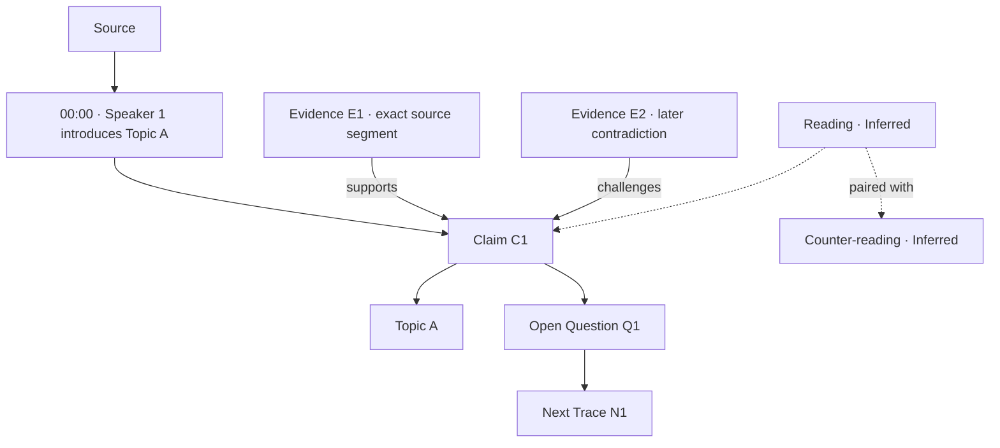

<!-- Generated by SpecStory, Markdown v2.1.0 -->

# 2026-08-09 16:58:24Z

<!-- Claude Code Session b69b3609-8c57-485c-b851-0b5b07c03070 (2026-08-09 16:58:24Z) -->

_**User (2026-08-09 16:58:24Z)**_

<command-name>/clear</command-name>
            <command-message>clear</command-message>
            <command-args></command-args>

---

_**User (2026-08-09 16:58:25Z)**_

<local-command-caveat>Caveat: The messages below were generated by the user while running local commands. DO NOT respond to these messages or otherwise consider them in your response unless the user explicitly asks you to.</local-command-caveat>

---

_**User (2026-08-09 16:58:34Z)**_

<command-name>/model</command-name>
            <command-message>model</command-message>
            <command-args></command-args>

---

_**User (2026-08-09 16:58:34Z)**_

<local-command-stdout>Set model to Opus 5 and saved as your default for new sessions</local-command-stdout>

---

_**User (2026-08-09 16:58:34Z)**_

<local-command-caveat>Caveat: The messages below were generated by the user while running local commands. DO NOT respond to these messages or otherwise consider them in your response unless the user explicitly asks you to.</local-command-caveat>

---

_**User (2026-08-09 18:22:33Z)**_

Policy fix (your correction): docs/agents/ops/issue-tracker.md, CLAUDE.md, and docs/plans/TODO.md's T-040 entry all now state TODO.md and Linear are kept in parity going forward, not that TODO.md is a frozen historical ledger.

New workspace tickets, ground-truthed by two parallel agents, not assumed:
- T-051 — packages/openai-vector-store-mcp: actually booted the server and called both tools live (search("Roswell") → 10 real results, fetch → 168K chars of real text). It works, but it's untracked in git and registered only in .cursor/mcp.json — Claude Code can't reach it, only Cursor can. Also caught a real latent bug: pyproject.toml floors fastmcp>=2.0 but the code is v3-only. Linear DMGD-218 already existed; updated it with the verification evidence rather than duplicating.
- T-052 — apps/disclosure-lab: confirmed zero code exists, plan is decision-locked but Q11 ("Close") is still marked pending in the plan file itself. Linear DMGD-216 already existed, state Todo. Flagged the cross-lane hazard: it'll read/write the same live Neon DB that Lane A's T-048 populates.

CLAUDE.md architecture section now names both workspaces explicitly (with their actual unwired/unbuilt state) so the next agent reading the mandatory-first file doesn't repeat my mistake of assuming nothing's new.

Verified: grepped for stale "historical ledger only" language across live docs — none left; no T-number collisions; all three policy docs agree.

Next up per your earlier direction: the disclosure-rag ingestion pipeline ticket (T-048).
---
Lets begin a slow, step by step code along through the 'dy {url}' feature

---

_**Agent (claude-opus-5 2026-08-09 18:22:46Z)**_

I'll start by loading the skill that governs this pipeline, then we'll walk the code together.

_**Agent (claude-opus-5 2026-08-09 18:22:46Z)**_

<tool-use data-tool-type="generic" data-tool-name="Skill"><details>
<summary>Tool use: **Skill**</summary>

**Input:**

- args: `code-along walkthrough of the `dy {url}` feature`
- skill: `disclosure-rag-processor`

</details></tool-use>

---

_**User (2026-08-09 18:22:46Z)**_

Base directory for this skill: /Users/liamellis/.claude/skills/disclosure-rag-processor

# Disclosure RAG Processor

Process UFO/UAP research content through a multi-stage pipeline: content extraction, knowledge base storage, entity extraction, knowledge graph construction, and contextual memory.

## Working Directory

All commands run from `apps/disclosure-rag/`. Prefer `./main.sh` / `dy` (they export `.venv` + `source .env` correctly). If invoking Python directly:

```bash
cd apps/disclosure-rag && set -a && source .env && set +a
.venv/bin/python main.py --status
```

Do **not** rely on `source .venv/bin/activate` alone — `main.py` imports Upstash modules that require env vars already in the process. Required: `OPENAI_API_KEY`, `UFO_DATA_STORE_ID`. Optional: `UPSTASH_SEARCH_URL`/`UPSTASH_SEARCH_TOKEN`, `MEM0_API_KEY`, `MEM0_USER_ID`.

**Canonical skill copy:** this directory (`apps/disclosure-rag/disclosure-rag-processor/`). Keep `~/.claude/skills/disclosure-rag-processor/` in sync with it.

## CLI Entry Points

### main.py -- Primary Processor

```bash
.venv/bin/python main.py <URL_OR_FILE> [--upload] [--no-kb] [--status] [--dry-run]
```

Auto-detects content type (YouTube / web / file). `--upload` sends to OpenAI vector store. `--status` shows all integration backends. `--dry-run` prints the plan without writing.

### main.sh -- Shell Wrapper (preferred; `dy` alias)

```bash
./main.sh process-url <URL> [--upload]    # Single URL
./main.sh process-file <FILE> [--upload]  # Single file
./main.sh process-urls <URL_FILE>         # Batch from file (loops main.py per URL)
./main.sh process-playlist <PL_URL> [...] # YouTube playlist(s) → playlist_ingestion.py
./main.sh search "Phoenix Lights"         # Search KB (heredoc → KnowledgeBaseCRUD)
./main.sh stats                           # KB statistics (heredoc → KnowledgeBaseCRUD)
./main.sh chat                            # disclosure_chat.py
./main.sh setup                           # Install dependencies
```

**Dead branches (do not use):** `./main.sh ui` and `./main.sh sync-rag` call `main.py --ui` / `--sync-rag`, which argparse does not define → exit 2. For Streamlit use `.venv/bin/python -m streamlit run streamlit_app.py` instead. Trace: `docs/DY_COMMAND_CALL_CHAIN.md`.

Auto-creates `.venv` if missing, loads `.env`, validates env vars. The user's global `dy` alias points at this script, so `dy process-playlist <URL>` works anywhere; bare playlist URLs (`dy "https://youtube.com/playlist?list=..."`) auto-route to the playlist pipeline (any URL containing `/playlist` or `list=`, including watch URLs inside a playlist).

### cli.py -- Interactive TUI (use for bulk ingestion & research chat)

```bash
python cli.py
```

Menu: **Search KB** | **Bulk Ingestion** (folder → all PDFs/DOCX/TXT/MD) | **Research Chat** | **Entity Analysis** | **Geospatial Analysis** | **Reports**. Uses Charm tools (gum/glow/glamour); falls back to plain input if not installed.

### run.sh -- Alternative Runner

```bash
./run.sh chat | agno-chat | agno-chat-files
./run.sh process-url --url <URL> --upload
./run.sh process-yt --url <YT_URL> --upload
./run.sh test | lint | format | clean
```

## Processing Pipeline

```
Input (URL/YouTube/File)
  |-> Content Extraction
  |     YouTube: lib/youtube.py / youtube_transcript_enhanced
  |     Web: processing/web_content_processor.py scraping
  |     File: direct read (supports .md, .pdf, .txt — NOT .docx; use bulk ingestion for docx)
  |
  |-> RagPromptPipeline (processing/rag_prompt_pipeline.py via content_analysis.py)
  |     document_classification → content_analysis → rag_ingestion
  |     → disclosure.ner → validation
  |     Writes *_rag_pipeline.json; Evidence-only chunks (ADR-0001)
  |
  |-> Knowledge Base Storage (lib/knowledge_base_crud.py)
  |     Indexes content, assigns doc_id (filesystem + index.json — not Neon yet)
  |
  |-> Upstash Search Sync (lib/sync_to_upstash_search_integrated.py)
  |     Optional; if UPSTASH_SEARCH_* configured
  |
  |-> Entity Extraction (lib/entity_extraction/)
  |     NER + entity matching (legacy Xata client still present in some paths;
  |     platform truth is Neon via @db/postgres — T-048 H2 bridge)
  |
  |-> CocoIndex Knowledge Graph (lib/cocoindex_integration.py)  [OPTIONAL]
  |     Fault-tolerant; skip if cocoindex / Neo4j unavailable
  |
  |-> Mem0 Contextual Memory (lib/mem0_integration.py)  [OPTIONAL]
  |
  |-> Upstash Queue (lib/upstash/queue.py)  [OPTIONAL]
       QStash async processing for downstream consumers
```

Each optional stage is fault-tolerant — failures log warnings but never block the pipeline. Live writes today: **filesystem archive + `metadata/index.json` + optional Upstash Search**. Neon writes are T-048 H2 work, not this skill's default path. This Python pipeline does **not** feed the Next.js mindmap/Prometheus routes.

## Key Modules

| Module | Purpose |
|--------|---------|
| `lib/knowledge_base_service.py` | Orchestrates KB indexing + Upstash sync |
| `lib/knowledge_base_crud.py` | Full CRUD -- see API section below |
| `lib/terminal_display.py` | Animated spinners, styled headers, progress output |
| `processing/rag_prompt_pipeline.py` | Registry-backed classify → chunk → NER → validate (ADR-0001) |
| `processing/content_analysis.py` | `ContentAnalysisEngine.process_for_rag()` wraps RagPromptPipeline |
| `lib/entity_extraction/processors/interactive_entity_processor.py` | NER with `process_summary_file_interactive()` |
| `lib/cocoindex_integration.py` | Optional KG; `process_document_knowledge_graph()` |
| `lib/mem0_integration.py` | Optional memory functions -- see API section below |
| `lib/unified_rag_orchestrator.py` | `UnifiedRAGOrchestrator` -- multi-backend search (local/OpenAI) |
| `lib/transcript_fidelity.py` | Playlist fidelity scoring + quarantine gate |
| `processing/web_content_processor.py` | `WebContentProcessor` for web scraping |
| `scripts/bulk_folder_ingestion.py` | `BulkFolderIngestion` -- multi-format batch processing |
| `scripts/playlist_ingestion.py` | Playlist enumerate → fidelity → `main.process_url` |
| `agents/` | Specialized research agents (see Agents section) |
| `api_server.py` | FastAPI REST server with RAG search endpoints |

## RagPromptPipeline (ADR-0001)

Wired into YouTube (`lib/youtube.py`), web (`web_content_processor` / knowledge_base_service), and file (`main.process_file` → `ContentAnalysisEngine.process_for_rag`). Prompts resolve from `packages/ai/prompts` via `lib/prompt_loader.py`.

```
source text
  → document_classification
  → disclosure.content_analysis
  → rag_ingestion                 (Evidence chunks only)
  → disclosure.ner (per chunk)
  → validation
  → embeddable_texts              (safe_for_rag_index only)
```

```python
from processing.rag_prompt_pipeline import process_document_for_rag
from processing.content_analysis import ContentAnalysisEngine

result = process_document_for_rag(text, provenance="https://example.com/doc")
# or
result = ContentAnalysisEngine().process_for_rag(text, provenance="file.pdf")
# result: { status, classification, analysis, chunks, ner_results, embeddable_texts, ... }
# status: ok | hold | rejected | error
```

Artifacts land as `<stem>_rag_pipeline.json` beside the transcript/summary. Chunk bodies must remain Evidence-only — never embed agent Inference (ADR-0001).

**Known gap:** `upload_file_to_openai()` still uploads the raw file in some paths; curated `embeddable_texts` are not always what gets vectorized. Prefer inspecting `*_rag_pipeline.json` after ingest. Smoke (no LLM): `python -m pytest tests/test_rag_prompt_pipeline_wiring.py -q`.

Env: `RAG_PIPELINE_PROVIDER`, `RAG_PIPELINE_MAX_NER_CHUNKS` (8), `RAG_PIPELINE_MAX_SOURCE_CHARS` (24000), `RAG_PIPELINE_CHUNK_TOKENS` (512).

## KnowledgeBaseCRUD Full API

```python
from lib.knowledge_base_crud import KnowledgeBaseCRUD
kb = KnowledgeBaseCRUD()

kb.create_document(title, content, source, doc_type, metadata, tags)  # returns Document
kb.get_document(doc_id)              # returns Optional[Document]
kb.list_documents(doc_type, tags, limit, offset)  # returns List[Document]
kb.search_documents(query, limit)    # returns List[Dict] with score/snippet
kb.update_document(doc_id, title, content, metadata, tags)
kb.delete_document(doc_id)          # returns bool
kb.bulk_import(directory, doc_type)  # returns List[Document]
kb.export_document(doc_id, output_dir)
kb.get_statistics()                  # returns {total_documents, total_tags, documents_by_type, popular_tags, last_updated}
```

`doc_type` values: `'case_file'`, `'transcript'`, `'article'`, `'research'`

Storage paths: transcripts → `sources/transcripts/`, articles → `sources/web/`, files → `sources/files/`, research → `research/`

## Mem0 Full API

```python
from lib.mem0_integration import (
    add_memory(messages, user_id, agent_id, metadata)     # core add
    search_memories(query, user_id, limit)                # semantic search
    add_youtube_summary_memory(title, video_url, video_id, summary, tags)
    add_web_article_memory(title, url, content, summary, tags)
    add_file_content_memory(title, file_path, content, file_type, tags)
    add_entity_extraction_memory(doc_id, entities, total_matches, processing_results)
    add_knowledge_graph_memory(doc_id, entities_processed, relationships_processed, kg_results)
    add_processing_summary_memory(doc_id, title, content_type, processing_steps, final_status)
    contextual_add(user_id, text, metadata)               # direct contextual storage
    search_context(user_id, query, top_k)                 # retrieve context
)
```

Env: `MEM0_API_KEY` or `NEXT_PUBLIC_MEM0_API_KEY`. Disable with `MEM0_ENABLE=false`. Agent ID: `MEM0_AGENT_ID` (default: `disclosure-rag-agent`).

## Entity Extraction -- Entity Types

9 entity types extracted from UAP content:

| Type | Key Fields |
|------|-----------|
| `PERSON` | role, credibility(1-10), authority(1-10), bio |
| `EVENT` | title, datetime, location(coordinates), metadata |
| `ORGANIZATION` | title, specialization, image |
| `LOCATION` | coordinates, google_maps_id, city/state |
| `TESTIMONY` | claim, source, documentation[] |
| `TOPIC` | title, summary, photos |
| `DOCUMENT` | embedding(1536d), url, file[] |
| `ARTIFACT` | name, origin, images |
| `SIGHTING` | shape, duration_seconds, media_link, location |

Confidence levels: High (0.9-1.0) → direct DB insert, Medium (0.6-0.8) → flag for review, Low (0.3-0.5) → archive.

Some matcher code still references retired **Xata**; treat entity→platform DB writes as partial until T-048 H2 lands. Do not invent Neo4j/Xata as required for a successful ingest.

```python
from lib.entity_extraction.processors.interactive_entity_processor import process_summary_file_interactive
results = process_summary_file_interactive(
    summary_file_path,   # path to text file
    video_id,            # doc_id to associate
    interactive=False    # True for human review mode
)
# returns: { total_entities, total_matches, entities, status }
```

## Specialized Research Agents (`agents/`)

14 agents in `agents/` directory, built on Agno framework:

| Agent | File | Purpose |
|-------|------|---------|
| `UFOYouTubeAgent` | `ufo_youtube_agent.py` | Timestamp-based UFO event extraction from video |
| `UAPDeepResearchAgent` | `uap_deep_research_agent.py` | Multi-source cross-referencing |
| `DisclosureAssistant` | `disclosure_assistant.py` | General Q&A over KB |
| `ClaimsEvidenceAgent` | `claims_evidence_agent.py` | Claim verification |
| `EntityExtractionAgent` | `entity_extraction_agent.py` | Standalone entity extraction |
| `HistoricalAgent` | `historical_agent.py` | Timeline and historical context |
| `HistoricalTimelineAgent` | `historical_timeline_agent.py` | Chronological ordering |
| `TestimonyAgent` | `testimony_agent.py` | Witness testimony analysis |
| `TheoryAgent` | `theory_agent.py` | Hypothesis generation |
| `ContentAnalysisAgent` | `content_analysis_agent.py` | Content classification |
| `DeepKnowledgeAgent` | `deep_knowledge.py` | Iterative research synthesis |
| `ResearchCrew` | `research_crew.py` | Multi-agent orchestration |
| `UltraterrestrialNERAgent` | `ultraterrestrial_domain_ner_agent.py` | Domain-specific NER |
| `BaseResearchAgent` | `base_research_agent.py` | Base class |

## FastAPI Server (`api_server.py`)

```bash
python api_server.py  # default port 8000
```

REST endpoints:

| Method | Path | Purpose |
|--------|------|---------|
| GET | `/` | Root info |
| GET | `/health` | Health check |
| GET | `/stats` | KB statistics |
| GET | `/documents` | List documents (paginated) |
| GET | `/documents/{id}` | Get single document |
| GET | `/search` | Keyword search |
| GET | `/tags` | All tags |
| GET | `/categories` | Document categories |
| POST | `/rag/search` | Vector RAG search |
| GET | `/rag/status` | RAG system status |
| POST | `/rag/index` | Index a document |
| WS | `/ws` | WebSocket connection |

## Unified RAG Search

```python
from lib.unified_rag_orchestrator import UnifiedRAGOrchestrator
import asyncio

rag = UnifiedRAGOrchestrator(openai_api_key, vector_store_id)
results = asyncio.run(rag.search(
    query="Phoenix Lights",
    max_results=10,
    system_preference='auto'  # 'auto', 'openai', 'local'
))
status = rag.get_system_status()   # { openai: RAGSystemStatus, local: RAGSystemStatus }
```

## Bulk Ingestion (`scripts/bulk_folder_ingestion.py`)

Supports PDF, DOCX, TXT, MD files. Extracts text and creates multi-backend documents for local indexing (historically labeled "triple-RAG" in this script — treat as local batch ingest, not a product retrieval architecture).

**CLI entry point — choose one:**

```bash
# Option A: Interactive TUI (recommended for first use)
.venv/bin/python cli.py
# → Select "Bulk Ingestion" from menu → enter folder path when prompted

# Option B: Run script directly (non-interactive)
.venv/bin/python scripts/bulk_folder_ingestion.py
# Note: no built-in CLI flags — configure folder_path in the script or use Option C

# Option C: Python one-liner
.venv/bin/python -c "
from scripts.bulk_folder_ingestion import BulkFolderIngestion
b = BulkFolderIngestion('/path/to/folder')
docs = b.discover_documents()
print(f'Found {len(docs)} files')
for d in docs: b.create_triple_rag_document(d, b.extract_text_content(d))
"
```

**Python API:**

```python
from scripts.bulk_folder_ingestion import BulkFolderIngestion

ingestion = BulkFolderIngestion(folder_path, output_dir="ingestion_results")
docs = ingestion.discover_documents()           # find all supported files
for doc in docs:
    text = ingestion.extract_text_content(doc)  # PDF/DOCX/TXT/MD
    rag_doc = ingestion.create_triple_rag_document(doc, text)
```

## Playlist Ingestion (`scripts/playlist_ingestion.py`)

Batch-ingest one or more YouTube podcast playlists end-to-end. Each episode flows through: enumeration → transcript fetch → parse/clean → **fidelity review** (quality gate) → `main.process_url()` (KB storage, RagPromptPipeline sidecars, NER, optional vectorization / CocoIndex / Mem0).

```bash
# One or more playlist URLs (plain video URLs also accepted)
.venv/bin/python scripts/playlist_ingestion.py "https://www.youtube.com/playlist?list=PL..." [MORE_URLS...]

# From a file (one URL per line, # comments allowed), with vector store upload
.venv/bin/python scripts/playlist_ingestion.py --from-file playlists.txt --upload

# Preview a new playlist's caption quality without ingesting
.venv/bin/python scripts/playlist_ingestion.py <URL> --limit 5 --dry-run

# Stricter gate + LLM coherence pass (FIDELITY_REVIEW_MODEL, default gpt-5.5)
.venv/bin/python scripts/playlist_ingestion.py <URL> --min-fidelity 0.6 --llm-review
```

Flags: `--upload` (OpenAI vector store), `--no-kb`, `--limit N` (per playlist), `--force` (reprocess done episodes), `--dry-run`, `--min-fidelity 0.45`, `--llm-review`, `--delay 2.0` (seconds between episodes), `--state-file PATH`.

**Resume is automatic**: state is checkpointed to `data/playlist_ingestion/state.json` after every episode; re-runs skip `ingested`/`quarantined`/`unavailable` episodes and retry `failed`/`no_transcript`/`blocked` ones. After `YT_BLOCKED_ABORT_THRESHOLD` consecutive IP blocks (default 3), the run aborts.

**Fidelity review** (`lib/transcript_fidelity.py`) scores each transcript 0–1 from coverage, speech density (wpm), caption gaps, artifact ratio, and repetition; verdicts: `pass` ≥ 0.7, `review` ≥ 0.45, `fail` < 0.45. Failing/below-threshold episodes are **quarantined** (transcript + fidelity JSON kept on disk, not ingested). Artifacts: cleaned transcripts in `data/playlist_ingestion/transcripts/`, per-episode fidelity reports and per-run markdown summaries in `data/playlist_ingestion/reports/`.

See [Playlist ingestion details](references/playlist-ingestion.md) for stage internals, state schema, quarantine review workflow, and tuning.

## Content Type Detection

YouTube: URL contains `youtube.com` or `youtu.be`. Web: starts with `http(s)://`. File: everything else (validated with `os.path.exists`).

## Extending the Pipeline

Add stages in `process_url()` or `process_file()` following this pattern:

```python
if result and result.get('doc_id'):
    try:
        processing_steps.append("New stage")
        # ... processing logic ...
    except Exception as e:
        logger.warning(f"New stage skipped: {e}")
```

## File Relocation

Processed files from `data/processing_queue/` auto-move to `packages/knowledge-base/sources/files/`.

## Troubleshooting

- **Module not found**: Use `.venv/bin/python`, run `pip install -r requirements.txt` inside the venv
- **API key / Upstash import errors**: Prefer `./main.sh` / `dy`, or `set -a; source .env; set +a` before bare Python
- **`dy ui` / `dy sync-rag` exit 2**: Dead — `main.py` has no `--ui`/`--sync-rag`. Streamlit: `.venv/bin/python -m streamlit run streamlit_app.py`
- **CocoIndex unavailable**: Optional stage; install only if you need KG. Pipeline continues without it
- **Mem0 disabled**: Set `MEM0_API_KEY` or leave unset (stage skipped)
- **Upstash sync skipped**: Set `UPSTASH_SEARCH_URL` + `UPSTASH_SEARCH_TOKEN`
- **Playlist IP blocks**: State marks `blocked`; run aborts after consecutive threshold — wait / rotate network, then re-run (resume skips terminal statuses)

## References

- [Pipeline architecture details](references/pipeline-architecture.md) -- module relationships, data flow, and integration points
- [Playlist ingestion details](references/playlist-ingestion.md) -- playlist pipeline stages, fidelity scoring, state/resume, quarantine workflow
- `docs/DY_COMMAND_CALL_CHAIN.md` -- verified `dy` → main.sh → main.py / playlist nesting
- `processing/RagPromptPipeline.md` -- ADR-0001 pipeline wiring notes
- Lane A roadmap: `docs/plans/2026-08-01-ingestion-hardening.md` (T-048)

ARGUMENTS: code-along walkthrough of the `dy {url}` feature

---

_**Agent (claude-opus-5 2026-08-09 18:22:50Z)**_

Skill loaded. Let me orient in the actual code before we start walking.

_**Agent (claude-opus-5 2026-08-09 18:22:53Z)**_

<tool-use data-tool-type="shell" data-tool-name="Bash"><details>
<summary>Tool use: **Bash**</summary>
List disclosure-rag dir and find dy alias

`cd /Users/liamellis/Desktop/apps/ultraterrestrial-resurrection/apps/disclosure-rag && ls -la && echo "---ALIAS---" && grep -rn "alias dy" ~/.zshrc ~/.zprofile ~/.bashrc 2>/dev/null`

```text
total 1552
-rw-r--r--   1 liamellis  staff      0 May  5  2025 __init__.py
drwxr-xr-x  11 liamellis  staff    352 Aug  9 11:17 __pycache__
drwxr-xr-x@ 84 liamellis  staff   2688 Aug  9 11:59 .
drwxr-xr-x   6 liamellis  staff    192 Aug  9 11:27 ..
drwxr-xr-x   4 liamellis  staff    128 Jul 23 17:20 .claude
-rw-r--r--@  1 liamellis  staff  14340 Jul 25 20:10 .DS_Store
drwxr-xr-x   4 liamellis  staff    128 May  5  2025 .dvc
-rw-r--r--@  1 liamellis  staff  17247 Aug  7 19:05 .env
-rw-r--r--@  1 liamellis  staff  16916 Aug  7 19:05 .env.bak-20260807
drwxr-xr-x   3 liamellis  staff     96 Jun 29  2025 .github
-rw-r--r--   1 liamellis  staff     13 Aug  6 08:44 .gitignore
drwxr-xr-x   6 liamellis  staff    192 Jul 12 11:56 .pytest_cache
drwxr-xr-x   5 liamellis  staff    160 Jul 16 19:55 .ruff_cache
drwxr-xr-x@ 10 liamellis  staff    320 Sep 18  2025 .venv
drwxr-xr-x   3 liamellis  staff     96 Aug 12  2025 .xata
-rw-r--r--   1 liamellis  staff  22071 Aug 31  2025 activate_agno.py
-rw-r--r--   1 liamellis  staff   8154 Aug 25  2025 AgentBaseRefactor_PSUEDOCODE.md
-rw-r--r--   1 liamellis  staff   9432 Aug 25  2025 AgentBaseRefactor.md
drwxr-xr-x  20 liamellis  staff    640 Jul  8 01:38 agents
-rw-r--r--   1 liamellis  staff  14499 Aug 25  2025 AGNO_INTEGRATION_ROADMAP.md
-rw-r--r--   1 liamellis  staff   7209 Aug 25  2025 AGNO_NEXT_ACTIONS.md
-rw-r--r--   1 liamellis  staff  15486 Sep 18  2025 AGNO_ROADMAP.md
drwxr-xr-x   3 liamellis  staff     96 Aug 31  2025 api
-rw-r--r--   1 liamellis  staff  21244 Jul 12 09:23 api_server.py
-rw-r--r--   1 liamellis  staff   9203 Aug  9 11:15 ARCHITECTURE.md
-rw-r--r--   1 liamellis  staff   7401 Aug  9 11:16 CLAUDE.md
-rw-r--r--   1 liamellis  staff   4519 Jul 25  2025 clean_and_seed.sql
-rw-r--r--   1 liamellis  staff  21797 Sep  3  2025 cli.py
drwxr-xr-x   6 liamellis  staff    192 Sep  4  2025 components
-rw-r--r--   1 liamellis  staff  18115 Sep  3  2025 COMPREHENSIVE_RAG_DOCUMENTATION.md
drwxr-xr-x   5 liamellis  staff    160 Jul  8 01:38 config
-rwxr-xr-x   1 liamellis  staff    182 Jun 29  2025 connect_db.sh
drwxr-xr-x@  5 liamellis  staff    160 Aug  6 08:45 corpus
-rw-r--r--   1 liamellis  staff   4371 Sep  5  2025 CRUSH.md
drwxr-xr-x   3 liamellis  staff     96 Aug  6 19:45 data
-rw-r--r--@  1 liamellis  staff  13451 Mar 13 03:12 disclosure_chat_with_memory.py
-rw-r--r--   1 liamellis  staff  21314 Aug 11  2025 disclosure_chat.py
drwxr-xr-x@  4 liamellis  staff    128 Aug  6 08:44 disclosure-rag-processor
drwxr-xr-x  26 liamellis  staff    832 Aug  9 11:59 docs
-rwxr-xr-x   1 liamellis  staff   9638 Sep 18  2025 fix_disclosure_rag.py
-rwxr-xr-x   1 liamellis  staff   2689 Aug 31  2025 fix_youtube.sh
-rw-r--r--@  1 liamellis  staff  13048 Mar 13 03:12 HONCHO_INTEGRATION.md
-rw-r--r--@  1 liamellis  staff  10809 Mar 13 03:12 HONCHO_QUICK_START.md
-rw-r--r--@  1 liamellis  staff   9112 Mar 13 03:12 HONCHO_SETUP_COMPLETE.md
-rw-r--r--   1 liamellis  staff  14194 Aug 14  2025 index_knowledge_base.py
drwxr-xr-x   3 liamellis  staff     96 Aug  8 04:08 knowledge
-rw-r--r--   1 liamellis  staff  31889 Aug 13  2025 knowledge_base_ui.py
-rwxr-xr-x   1 liamellis  staff    754 Jun 29  2025 launch_api.sh
-rwxr-xr-x   1 liamellis  staff   2117 Jun 29  2025 launch_dashboard.sh
drwxr-xr-x  43 liamellis  staff   1376 Aug  8 20:18 lib
-rw-r--r--   1 liamellis  staff  37445 Sep 18  2025 main_enhanced.py
-rw-r--r--   1 liamellis  staff  29500 Sep 18  2025 main_fixed.py
-rw-r--r--   1 liamellis  staff   8199 Aug 13  2025 MAIN_PY_ANALYSIS_LOG.md
-rw-r--r--   1 liamellis  staff  16426 Jul  9 16:21 main_unified.py
-rw-r--r--@  1 liamellis  staff  54232 Aug  9 11:17 main.py
-rwxr-xr-x@  1 liamellis  staff  11799 Aug  8 21:07 main.sh
-rw-r--r--   1 liamellis  staff  25185 Aug 25  2025 PHASE_1_IMPLEMENTATION_PLAN.md
-rw-r--r--   1 liamellis  staff  14801 Aug 26  2025 PHASE_1_STATUS_REPORT.md
-rw-r--r--   1 liamellis  staff      0 Jun 17  2025 points.csv
-rw-r--r--   1 liamellis  staff   8743 Jul 25  2025 process_entities.py
drwxr-xr-x  12 liamellis  staff    384 Aug  8 21:11 processing
-rw-r--r--@  1 liamellis  staff   3787 Aug  6 08:45 pyproject.toml
-rwxr-xr-x   1 liamellis  staff   2301 Sep  3  2025 quick_resume.sh
drwxr-xr-x@  4 liamellis  staff    128 Jul  2  2025 rag_index
-rw-r--r--   1 liamellis  staff  14570 Aug  9 11:15 README.md
-rw-r--r--   1 liamellis  staff    145 Jun 29  2025 requirements_api.txt
-rw-r--r--   1 liamellis  staff    961 Jun 29  2025 requirements_local.txt
-rw-r--r--   1 liamellis  staff    349 Jun 29  2025 requirements_streamlit.txt
-rw-r--r--   1 liamellis  staff    879 Aug  7 05:35 requirements.txt
drwxr-xr-x   5 liamellis  staff    160 Sep 19  2025 research
-rw-r--r--@  1 liamellis  staff   4380 Jun 29  2025 run.sh
drwxr-xr-x  47 liamellis  staff   1504 Aug  8 21:20 scripts
-rw-r--r--   1 liamellis  staff   6289 Sep  3  2025 SESSION_RESUME_20250831.md
drwxr-xr-x   3 liamellis  staff     96 Jul 25  2025 setup
-rw-r--r--   1 liamellis  staff   6180 Jul 25  2025 setup_cocoindex_kg.py
-rwxr-xr-x   1 liamellis  staff   4954 Jun 29  2025 setup.sh
-rw-r--r--   1 liamellis  staff  13281 Aug  9 11:15 STATUS.md
-rw-r--r--   1 liamellis  staff  39983 Jul 12 09:44 streamlit_app.py
-rw-r--r--@  1 liamellis  staff   3251 Mar 13 03:12 test_honcho_integration.py
-rw-r--r--   1 liamellis  staff  11684 Aug 15  2025 test_optimization_improvements.py
drwxr-xr-x  18 liamellis  staff    576 Aug  6 08:45 tests
drwxr-xr-x   6 liamellis  staff    192 Jun 18  2025 utils
drwxr-xr-x   6 liamellis  staff    192 Aug 31  2025 vector_storage
drwxr-xr-x   8 liamellis  staff    256 Jun 25  2025 venv
---ALIAS---
/Users/liamellis/.zshrc:135:alias dy='/Users/liamellis/Desktop/apps/ultraterrestrial-resurrection/apps/disclosure-rag/main.sh'
```
</details></tool-use>

_**Agent (claude-opus-5 2026-08-09 18:22:54Z)**_

<tool-use data-tool-type="shell" data-tool-name="Bash"><details>
<summary>Tool use: **Bash**</summary>
Locate DY call chain doc

`ls docs/DY_COMMAND_CALL_CHAIN.md apps/disclosure-rag/docs/DY_COMMAND_CALL_CHAIN.md 2>&1 | head -20`

```text
ls: docs/DY_COMMAND_CALL_CHAIN.md: No such file or directory
apps/disclosure-rag/docs/DY_COMMAND_CALL_CHAIN.md
```
</details></tool-use>

_**Agent (claude-opus-5 2026-08-09 18:22:58Z)**_

`dy` → `apps/disclosure-rag/main.sh`. Let me read the wrapper and the existing call-chain trace.

_**Agent (claude-opus-5 2026-08-09 18:22:59Z)**_

<tool-use data-tool-type="read" data-tool-name="Read"><details>
<summary>Tool use: **Read**</summary>
 `./apps/disclosure-rag/main.sh`

```text
1	#!/bin/bash
2	
3	# Disclosure RAG Main Script
4	# Enhanced functionality for processing various content types
5	
6	# Color codes for output.
7	#
8	# $'...' makes bash interpret the escapes at assignment time, so these hold real
9	# ESC bytes. With plain '...' they held the 7 literal characters \033[0;34m, which
10	# `echo -e` re-interpreted but the show_help heredoc did not — help output printed
11	# raw escape text (DY-BENCH B1.1). Real ESC bytes render correctly in both.
12	RED=$'\033[0;31m'
13	GREEN=$'\033[0;32m'
14	YELLOW=$'\033[1;33m'
15	BLUE=$'\033[0;34m'
16	NC=$'\033[0m' # No Color
17	
18	# Script directory
19	SCRIPT_DIR="$( cd "$( dirname "${BASH_SOURCE[0]}" )" && pwd )"
20	
21	# Check for python3
22	if ! command -v python3 &> /dev/null; then
23	    echo -e "${RED}Error: python3 is required but not installed.${NC}"
24	    exit 1
25	fi
26	
27	VENV_DIR="$SCRIPT_DIR/.venv"
28	VENV_PYTHON="$VENV_DIR/bin/python"
29	
30	# Check if virtual environment exists
31	if [ ! -x "$VENV_PYTHON" ]; then
32	    echo -e "${YELLOW}Virtual environment not found or missing python. Creating...${NC}"
33	    python3 -m venv "$VENV_DIR"
34	    if [ $? -ne 0 ]; then
35	        echo -e "${RED}Failed to create virtual environment${NC}"
36	        exit 1
37	    fi
38	    "$VENV_PYTHON" -m pip install --upgrade pip
39	    "$VENV_PYTHON" -m pip install -r "$SCRIPT_DIR/requirements.txt"
40	fi
41	
42	# Do not rely on .venv/bin/activate here: this repo has been moved before, and
43	# activate scripts hard-code absolute paths. Route every Python call through the
44	# venv interpreter directly so shell aliases/conda cannot hijack execution.
45	export VIRTUAL_ENV="$VENV_DIR"
46	export PATH="$VENV_DIR/bin:$PATH"
47	
48	# Load environment variables.
49	#
50	# .env supplies DEFAULTS, not overrides. Previously this sourced .env with
51	# `set -a` and nothing else, so every value in the file clobbered whatever the
52	# caller had exported — `OPENAI_API_KEY=... dy <url>` silently ran with the .env
53	# key instead, and no per-invocation override of any credential or setting was
54	# possible. This snapshots the caller's exported environment first and re-applies
55	# it after sourcing, so explicit caller values win (python-dotenv's own default
56	# is override=False for the same reason).
57	if [ -f "$SCRIPT_DIR/.env" ]; then
58	    _CALLER_ENV="$(export -p)"
59	    set -a  # Enable auto-export
60	    source "$SCRIPT_DIR/.env"
61	    set +a  # Disable auto-export
62	    eval "$_CALLER_ENV" 2>/dev/null
63	    unset _CALLER_ENV
64	else
65	    echo -e "${YELLOW}Warning: .env file not found. Some features may not work.${NC}"
66	    echo -e "${YELLOW}Create a .env file with your API keys:${NC}"
67	    echo -e "${YELLOW}  OPENAI_API_KEY=your_key${NC}"
68	    echo -e "${YELLOW}  UFO_DATA_STORE_ID=your_vector_store_id${NC}"
69	fi
70	
71	# Verify critical environment variables
72	if [ -z "$OPENAI_API_KEY" ]; then
73	    echo -e "${YELLOW}Warning: OPENAI_API_KEY not set${NC}"
74	fi
75	
76	if [ -z "$UFO_DATA_STORE_ID" ]; then
77	    echo -e "${YELLOW}Warning: UFO_DATA_STORE_ID not set (vector store uploads will not work)${NC}"
78	fi
79	
80	# Function to display help
81	show_help() {
82	    cat << EOF
83	${BLUE}Disclosure RAG - UFO/UAP Research Toolkit${NC}
84	
85	Usage: $0 [command] [options]
86	
87	${GREEN}Commands:${NC}
88	  setup              Install/update dependencies
89	  process-url        Process a web article or YouTube video
90	  process-file       Process a local file
91	  process-urls       Process multiple URLs from a file
92	  process-playlist   Ingest every episode of YouTube playlist(s) (fidelity-gated)
93	  playlist           Alias for process-playlist
94	  ui                 Launch the Knowledge Base UI
95	  chat               Launch the chat interface
96	  sync-rag           Sync knowledge base to local RAG
97	  search             Search the knowledge base
98	  stats              Show knowledge base statistics
99	  help               Show this help message
100	
101	${GREEN}Examples:${NC}
102	  $0 process-url https://example.com/ufo-article
103	  $0 process-url https://youtube.com/watch?v=... --upload
104	  $0 process-file /path/to/document.md
105	  $0 process-urls urls.txt --upload
106	  $0 process-playlist "https://youtube.com/playlist?list=..." --upload
107	  $0 process-playlist "https://youtube.com/playlist?list=..." --limit 5 --dry-run
108	  $0 ui
109	  $0 search "Phoenix Lights"
110	
111	${GREEN}Options:${NC}
112	  --upload          Upload to OpenAI after processing
113	  --no-kb           Don't add to knowledge base
114	  --help            Show this help message
115	
116	EOF
117	}
118	
119	# Function to setup/update dependencies
120	setup() {
121	    echo -e "${BLUE}Setting up Disclosure RAG...${NC}"
122	    
123	    # Update pip
124	    "$VENV_PYTHON" -m pip install --upgrade pip
125	    
126	    # Install requirements
127	    "$VENV_PYTHON" -m pip install -r "$SCRIPT_DIR/requirements.txt"
128	    
129	    # Install additional dependencies for new features
130	    "$VENV_PYTHON" -m pip install streamlit sentence-transformers faiss-cpu
131	    
132	    echo -e "${GREEN}Setup complete!${NC}"
133	}
134	
135	# Function to process URL
136	process_url() {
137	    local url=$1
138	    shift
139	    
140	    if [ -z "$url" ]; then
141	        echo -e "${RED}Error: URL required${NC}"
142	        echo "Usage: $0 process-url <URL> [options]"
143	        exit 1
144	    fi
145	    
146	    echo -e "${BLUE}Processing URL: $url${NC}"
147	    "$VENV_PYTHON" "$SCRIPT_DIR/main.py" "$url" "$@"
148	}
149	
150	# Function to process file
151	process_file() {
152	    local file=$1
153	    shift
154	    
155	    if [ -z "$file" ]; then
156	        echo -e "${RED}Error: File path required${NC}"
157	        echo "Usage: $0 process-file <FILE> [options]"
158	        exit 1
159	    fi
160	    
161	    if [ ! -f "$file" ]; then
162	        echo -e "${RED}Error: File not found: $file${NC}"
163	        exit 1
164	    fi
165	    
166	    echo -e "${BLUE}Processing file: $file${NC}"
167	    "$VENV_PYTHON" "$SCRIPT_DIR/main.py" "$file" "$@"
168	}
169	
170	# Function to process multiple URLs
171	process_urls() {
172	    local file=$1
173	    shift
174	
175	    if [ -z "$file" ]; then
176	        echo -e "${RED}Error: URL file required${NC}"
177	        echo "Usage: $0 process-urls <FILE> [options]"
178	        exit 1
179	    fi
180	
181	    if [ ! -f "$file" ]; then
182	        echo -e "${RED}Error: File not found: $file${NC}"
183	        exit 1
184	    fi
185	
186	    # main.py takes one input per invocation (no --url-file flag), so loop
187	    # over the file, skipping blank lines and # comments.
188	    echo -e "${BLUE}Processing URLs from: $file${NC}"
189	    local url
190	    while IFS= read -r url || [ -n "$url" ]; do
191	        url="${url%%#*}"
192	        url="$(echo "$url" | xargs)"
193	        [ -z "$url" ] && continue
194	        echo -e "${BLUE}--- $url${NC}"
195	        "$VENV_PYTHON" "$SCRIPT_DIR/main.py" "$url" "$@"
196	    done < "$file"
197	}
198	
199	# Function to ingest YouTube playlist(s) through the fidelity-gated pipeline
200	process_playlist() {
201	    if [ -z "$1" ]; then
202	        echo -e "${RED}Error: Playlist URL required${NC}"
203	        echo "Usage: $0 process-playlist <PLAYLIST_URL> [PLAYLIST_URL...] [--upload] [--limit N] [--dry-run] [--force] [--min-fidelity 0.45] [--llm-review]"
204	        exit 1
205	    fi
206	
207	    echo -e "${BLUE}Processing playlist(s) via fidelity-gated pipeline...${NC}"
208	    "$VENV_PYTHON" "$SCRIPT_DIR/scripts/playlist_ingestion.py" "$@"
209	}
210	
211	# Function to launch UI
212	#
213	# Previously called `main.py --ui`, a flag main.py's argparse never defined, so
214	# this printed "Access the UI at ..." and then died on argument parsing without
215	# ever starting a server (DY-BENCH B1.7). The UI is a Streamlit app; launch it.
216	launch_ui() {
217	    if [ ! -f "$SCRIPT_DIR/knowledge_base_ui.py" ]; then
218	        echo -e "${RED}Error: knowledge_base_ui.py not found${NC}" >&2
219	        return 1
220	    fi
221	    if ! "$VENV_PYTHON" -c "import streamlit" 2>/dev/null; then
222	        echo -e "${RED}Error: streamlit is not installed in the venv.${NC}" >&2
223	        echo -e "${YELLOW}Install it with: $0 setup${NC}" >&2
224	        return 1
225	    fi
226	    echo -e "${BLUE}Launching Knowledge Base UI...${NC}"
227	    echo -e "${YELLOW}Access the UI at: http://localhost:8501${NC}"
228	    "$VENV_PYTHON" -m streamlit run "$SCRIPT_DIR/knowledge_base_ui.py" \
229	        --server.port 8501 "$@"
230	}
231	
232	# Function to launch chat
233	launch_chat() {
234	    echo -e "${BLUE}Launching chat interface...${NC}"
235	    
236	    # Check if disclosure_chat.py exists
237	    if [ -f "$SCRIPT_DIR/disclosure_chat.py" ]; then
238	        "$VENV_PYTHON" "$SCRIPT_DIR/disclosure_chat.py"
239	    else
240	        echo -e "${YELLOW}Chat interface not found. Using UI chat instead...${NC}"
241	        launch_ui
242	    fi
243	}
244	
245	# Function to sync RAG
246	#
247	# Previously called `main.py --sync-rag`, a flag main.py never defined, so this
248	# always died on argument parsing (DY-BENCH B1.7). The real implementation is
249	# lib/sync_to_upstash_search_integrated.py, which has its own argparse main().
250	sync_rag() {
251	    echo -e "${BLUE}Syncing knowledge base to search index...${NC}"
252	    "$VENV_PYTHON" -m lib.sync_to_upstash_search_integrated "$@"
253	}
254	
255	# Function to search knowledge base
256	search_kb() {
257	    local query=$1
258	    
259	    if [ -z "$query" ]; then
260	        echo -e "${RED}Error: Search query required${NC}"
261	        echo "Usage: $0 search <QUERY>"
262	        exit 1
263	    fi
264	    
265	    echo -e "${BLUE}Searching for: $query${NC}"
266	    
267	    # Create a temporary Python script for search
268	    "$VENV_PYTHON" << EOF
269	import sys
270	sys.path.append("$SCRIPT_DIR")
271	from lib.knowledge_base_crud import KnowledgeBaseCRUD
272	
273	kb = KnowledgeBaseCRUD()
274	results = kb.search_documents("$query")
275	
276	if results:
277	    print(f"\nFound {len(results)} results:\n")
278	    for i, result in enumerate(results, 1):
279	        print(f"{i}. {result['title']} (Score: {result['score']})")
280	        print(f"   Type: {result['doc_type']}")
281	        print(f"   {result['snippet']}\n")
282	else:
283	    print("No results found.")
284	EOF
285	}
286	
287	# Function to show statistics
288	show_stats() {
289	    echo -e "${BLUE}Knowledge Base Statistics${NC}"
290	    
291	    "$VENV_PYTHON" << EOF
292	import sys
293	sys.path.append("$SCRIPT_DIR")
294	from lib.knowledge_base_crud import KnowledgeBaseCRUD
295	
296	kb = KnowledgeBaseCRUD()
297	stats = kb.get_statistics()
298	
299	print(f"\nTotal Documents: {stats['total_documents']}")
300	print(f"Total Tags: {stats['total_tags']}")
301	print(f"Last Updated: {stats['last_updated'][:19] if stats['last_updated'] else 'Never'}")
302	
303	print("\nDocuments by Type:")
304	for doc_type, count in stats['documents_by_type'].items():
305	    print(f"  {doc_type}: {count}")
306	
307	if stats['popular_tags']:
308	    print("\nPopular Tags:")
309	    for tag, count in stats['popular_tags'][:5]:
310	        print(f"  {tag}: {count}")
311	EOF
312	}
313	
314	# Main command handling
315	case "$1" in
316	    setup)
317	        setup
318	        ;;
319	    process-url)
320	        shift
321	        process_url "$@"
322	        ;;
323	    process-file)
324	        shift
325	        process_file "$@"
326	        ;;
327	    process-urls)
328	        shift
329	        process_urls "$@"
330	        ;;
331	    process-playlist|playlist)
332	        shift
333	        process_playlist "$@"
334	        ;;
335	    ui)
336	        shift
337	        launch_ui "$@"
338	        ;;
339	    chat)
340	        launch_chat
341	        ;;
342	    sync-rag)
343	        shift
344	        sync_rag "$@"
345	        ;;
346	    search)
347	        shift
348	        search_kb "$@"
349	        ;;
350	    stats)
351	        show_stats
352	        ;;
353	    --help|help)
354	        show_help
355	        ;;
356	    *)
357	        # Auto-detect URL or file path for direct processing
358	        if [[ "$1" == http* && ( "$1" == *"/playlist"* || "$1" == *"list="* ) ]]; then
359	            # Playlist URLs would be treated as a single (id-less) video by
360	            # main.py — route them to the playlist pipeline instead.
361	            echo -e "${BLUE}Auto-detected YouTube playlist: $1${NC}"
362	            process_playlist "$@"
363	        elif [[ "$1" == http* ]]; then
364	            echo -e "${BLUE}Auto-detected URL: $1${NC}"
365	            "$VENV_PYTHON" "$SCRIPT_DIR/main.py" "$@"
366	        elif [[ -f "$1" ]]; then
367	            echo -e "${BLUE}Auto-detected file: $1${NC}"
368	            "$VENV_PYTHON" "$SCRIPT_DIR/main.py" "$@"
369	        elif [[ "$1" == --* ]]; then
370	            # Legacy support - if first argument looks like a flag, pass to main.py
371	            "$VENV_PYTHON" "$SCRIPT_DIR/main.py" "$@"
372	        else
373	            echo -e "${RED}Unknown command: $1${NC}"
374	            show_help
375	            exit 1
376	        fi
377	        ;;
378	esac
```
</details></tool-use>

_**Agent (claude-opus-5 2026-08-09 18:22:59Z)**_

<tool-use data-tool-type="read" data-tool-name="Read"><details>
<summary>Tool use: **Read**</summary>
 `./apps/disclosure-rag/docs/DY_COMMAND_CALL_CHAIN.md`

```text
1	# `dy` — Call Chain Explainer
2	
3	**What this documents:** every code path reached when the shell command `dy` is run, across
4	`apps/disclosure-rag/main.sh`, `main.py`, and `scripts/playlist_ingestion.py`.
5	
6	**Written:** 2026-08-08 · **Lane:** A — Corpus & Ingestion · **Method:** static trace. No `dy`
7	invocation was executed (it ingests, writes the KB, uploads to OpenAI, POSTs to QStash, and
8	`shutil.move`s files out of `processing_queue`). Every arrow below is anchored to `file:line`.
9	
10	---
11	
12	## 0. `dy` is a machine-local alias
13	
14	```
15	~/.zshrc:135
16	alias dy='/Users/liamellis/Desktop/apps/ultraterrestrial-resurrection/apps/disclosure-rag/main.sh'
17	```
18	
19	It is **not** in the repo. `dy <args>` is exactly `apps/disclosure-rag/main.sh <args>`. On any other
20	machine, substitute `./main.sh`. Everything below applies identically to both.
21	
22	---
23	
24	## 1. The single most important structural fact
25	
26	The directive frames `main.py` and `playlist_ingestion.py` as two chains. They are **one chain with a
27	fan-out wrapper**. `playlist_ingestion.py` sits *above* `main.py`, not beside it:
28	
29	```
30	playlist_ingestion.py:287    from main import process_url
31	playlist_ingestion.py:288    result = process_url(url, upload=args.upload, add_to_kb=not args.no_kb)
32	```
33	
34	Every playlist episode re-enters the same `main.process_url()` that a bare `dy <video-url>` calls
35	directly. The difference is only **depth of entry**, chosen by a substring test in bash.
36	
37	The citation that this nesting is deliberate is `main.py:86–93`:
38	
39	> *"Idempotent so it's safe to call from `main()`, `process_url()`, and `process_file()` alike — the
40	> latter two are also imported directly by `scripts/playlist_ingestion.py` (`from main import
41	> process_url`), which never calls `main()` and would otherwise hit NameError on these globals."*
42	
43	`_import_heavy_dependencies()` (`main.py:86`) is the mechanical seam that makes the nesting work:
44	`playlist_ingestion.py` skips `main()` entirely, so `process_url()` must bootstrap its own globals.
45	
46	---
47	
48	## 2. Pre-flight — runs on *every* `dy`, before any dispatch
49	
50	| Step | Lines | Behaviour |
51	|---|---|---|
52	| Resolve script dir | `main.sh:14` | `SCRIPT_DIR` via `BASH_SOURCE` |
53	| Require `python3` | `main.sh:17–20` | hard exit 1 if absent |
54	| Bootstrap venv if missing | `main.sh:26–35` | creates `.venv`, upgrades pip, installs `requirements.txt` |
55	| Export venv, **not** `activate` | `main.sh:37–41` | `export VIRTUAL_ENV` + `PATH` prepend |
56	| Load `.env` | `main.sh:44–53` | `set -a; source .env; set +a` — auto-exports every var |
57	| Soft credential warnings | `main.sh:56–62` | warns on empty `OPENAI_API_KEY`, `UFO_DATA_STORE_ID`; does **not** exit |
58	
59	**Design note worth preserving** (`main.sh:37–39`): `.venv/bin/activate` is deliberately *not*
60	sourced. The repo has been moved before and `activate` hard-codes absolute paths; every Python call
61	is routed through `$VENV_PYTHON` directly so shell aliases / conda cannot hijack execution.
62	
63	---
64	
65	## 3. Dispatch table — where each `dy <arg>` lands
66	
67	Dispatch is the `case "$1"` at `main.sh:279–339`.
68	
69	| `dy` invocation | Branch | Lands in |
70	|---|---|---|
71	| *(no args)* | `*)` — all tests fail | `show_help` + **exit 1** (`main.sh:335–337`) |
72	| `setup` | `main.sh:280` | pip install loop (`main.sh:102–115`) |
73	| `process-url <url>` | `main.sh:283` | `main.py <url>` (`main.sh:129`) |
74	| `process-file <path>` | `main.sh:287` | `main.py <path>` (`main.sh:149`) |
75	| `process-urls <file>` | `main.sh:291` | bash `while read` → **`main.py` once per line** (`main.sh:172–178`) |
76	| `process-playlist` \| `playlist <url>` | `main.sh:295` | `scripts/playlist_ingestion.py` (`main.sh:190`) |
77	| `ui` | `main.sh:299` | `main.py --ui` → **DEAD**, see §10 |
78	| `chat` | `main.sh:302` | `disclosure_chat.py` (file exists; else falls back to `launch_ui`) |
79	| `sync-rag` | `main.sh:305` | `main.py --sync-rag` → **DEAD**, see §10 |
80	| `search <query>` | `main.sh:308` | inline heredoc Python — **never touches `main.py`** (`main.sh:232–248`) |
81	| `stats` | `main.sh:312` | inline heredoc Python — **never touches `main.py`** (`main.sh:255–275`) |
82	| `--help` \| `help` | `main.sh:315` | `show_help` |
83	| bare `http*` **and** (`list=` or `/playlist`) | `main.sh:320` | `playlist_ingestion.py` |
84	| bare `http*` | `main.sh:325` | `main.py <url>` |
85	| bare existing file | `main.sh:328` | `main.py <path>` |
86	| bare `--*` | `main.sh:331` | `main.py` (legacy flag passthrough) |
87	| anything else | `main.sh:334` | error + help + **exit 1** |
88	
89	### The fork that matters
90	
91	`main.sh:320` is the whole reason the two Python entry points exist as separate depths:
92	
93	```bash
94	if [[ "$1" == http* && ( "$1" == *"/playlist"* || "$1" == *"list="* ) ]]; then
95	```
96	
97	Its own comment (`main.sh:321–322`) states why: *"Playlist URLs would be treated as a single
98	(id-less) video by `main.py` — route them to the playlist pipeline instead."*
99	
100	---
101	
102	## 4. Diagram 1 — the router
103	
104	```mermaid
105	flowchart TD
106	    A["dy &lt;args&gt;<br/>(alias → main.sh)"] --> P["Pre-flight<br/>venv · PATH · source .env<br/>main.sh:14-62"]
107	    P --> C{"case $1<br/>main.sh:279"}
108	
109	    C -->|"process-url / process-file"| M["main.py<br/>single input"]
110	    C -->|"process-urls FILE"| L["bash while-read loop<br/>main.sh:172-178"]
111	    L -->|"once per line"| M
112	    C -->|"process-playlist / playlist"| PL["scripts/playlist_ingestion.py"]
113	    C -->|"search / stats"| H["inline heredoc Python<br/>KnowledgeBaseCRUD<br/>main.sh:232-275"]
114	    C -->|"chat"| CH["disclosure_chat.py"]
115	    C -->|"setup"| S["pip install"]
116	    C -->|"ui / sync-rag"| D["main.py --ui / --sync-rag<br/>DEAD — argparse exit 2"]
117	
118	    C -->|"*) fallthrough"| AD{"auto-detect<br/>main.sh:318-339"}
119	    AD -->|"http* AND (list= or /playlist)"| PL
120	    AD -->|"http*"| M
121	    AD -->|"existing file"| M
122	    AD -->|"--flag"| M
123	    AD -->|"else"| ERR["help + exit 1"]
124	
125	    PL -->|"from main import process_url<br/>playlist_ingestion.py:287"| M
126	
127	    style PL fill:#2d3f5f,stroke:#7aa2f7,color:#fff
128	    style M fill:#3f5f2d,stroke:#9ece6a,color:#fff
129	    style D fill:#5f2d2d,stroke:#f7768e,color:#fff
130	    style ERR fill:#5f2d2d,stroke:#f7768e,color:#fff
131	```
132	
133	---
134	
135	## 5. Depth A — `main.py`, one input per invocation
136	
137	Reached by `dy <url>`, `dy <file>`, `dy process-url …`, `dy process-file …`, each line of
138	`dy process-urls …`, and **each episode of a playlist run**.
139	
140	### 5.1 `main()` — `main.py:960–1121`
141	
142	| Order | Step | Lines |
143	|---|---|---|
144	| 1 | `argparse` — accepts only `input`, `--upload`, `--no-kb`, `--status`, `--dry-run` | `main.py:962–976` |
145	| 2 | `_import_heavy_dependencies()` — deferred so `--help`/bad args cost nothing (`main.py:975`) | `main.py:978` |
146	| 3 | `display.print_header()` | `main.py:981` |
147	| 4 | `--status` → integration report, then `return` | `main.py:983–1052` |
148	| 5 | missing input → help + **exit 1** | `main.py:1055–1058` |
149	| 6 | `_validate_credentials(require_upload=args.upload)` | `main.py:1064` |
150	| 7 | `--dry-run` → print plan from `_build_dry_run_plan()`, then `return` (**genuinely inert**) | `main.py:1066–1072` |
151	| 8 | hard credential errors → **exit 1** | `main.py:1074–1078` |
152	| 9 | route: `http(s)://` → `process_url()`, else → `process_file()` | `main.py:1082–1088` |
153	| 10 | `None` result → `❌ Processing failed!` + **exit 1** | `main.py:1090–1092` |
154	| 11 | banner + `_print_stage_report()`; any `failed` stage → **exit 1** | `main.py:1101–1120` |
155	
156	`_validate_credentials` (`main.py:838`) does presence/shape checks only and never logs key material.
157	Missing `OPENAI_API_KEY` is a **hard error** (`main.py:851–855`); a malformed-looking key is only a
158	warning, because a *revoked but well-formed* key is undetectable without an API call
159	(`main.py:856–861`).
160	
161	### 5.2 `process_url()` — `main.py:312–431`
162	
163	```
164	process_url(url, upload, add_to_kb)
165	├─ _import_heavy_dependencies()                                  main.py:314
166	├─ is_youtube_url(url)  ← hostname parse, NOT substring          main.py:154-166
167	├─ try:
168	│    youtube → process_youtube_url_enhanced(url, upload, add_to_kb)   main.py:331
169	│    else    → process_web_url_enhanced(url, upload, add_to_kb)       main.py:333
170	│  except → stage(extraction, failed) and return {stage_report}       main.py:334-337
171	├─ [web only] mem0 add_web_article_memory                        main.py:345-357
172	├─ [YouTube only] trigger_cocoindex_processing(doc_id)           main.py:365-411
173	│    └─ + mem0 add_knowledge_graph_memory                        main.py:383-393
174	├─ mem0 add_processing_summary_memory                            main.py:415-428
175	└─ result['stage_report'] = stages ; return result               main.py:430-431
176	```
177	
178	**The CocoIndex asymmetry** — the knowledge-graph pass at `main.py:365` is gated on `and youtube`.
179	Comment at `main.py:360–364`: `process_web_with_enhanced_workflow()` already runs CocoIndex
180	internally (`knowledge_base_service.py:~735–785`), so triggering it here for web results ran a
181	second, global `cocoindex update` on every web ingestion. **The two branches of `process_url` emit
182	different stage lists.** This is the single most commonly misread part of the chain.
183	
184	`is_youtube_url` (`main.py:154`) parses the hostname rather than substring-matching, so
185	`https://evil.com/?x=youtube.com/watch` is correctly rejected.
186	
187	### 5.3 Into `lib/` — the YouTube branch
188	
189	```
190	process_youtube_url_enhanced()                 lib/knowledge_base_service.py:1135
191	└─ KnowledgeBaseService.process_youtube_with_enhanced_workflow()   :303-508
192	   ├─ generate_transcript(url)                 lib/youtube.py:200      (:310 in workflow)
193	   │   ├─ get_video_info_and_transcript(url)   lib/youtube.py:132
194	   │   ├─ analyzer.analyze_content(transcript)          ← OpenAI
195	   │   ├─ analyzer.process_for_rag(...)                 ← classification → chunk → NER → validate
196	   │   ├─ write_transcript_to_file() ×2 (transcript + summary)   lib/youtube.py:157
197	   │   ├─ write <name>_rag_pipeline.json
198	   │   └─ mem0 add_youtube_summary_memory
199	   ├─ upload_file_to_openai(file_path)         [--upload only]         :413
200	   ├─ add_processed_content_to_queue(...)      QStash → vector upload   :444
201	   ├─ self.add_youtube_to_knowledge_base(data, file_paths)              :464 → :71
202	   └─ search_syncer.sync_document_to_search(doc)                        :486
203	```
204	
205	### 5.4 `process_file()` — `main.py:434–835`
206	
207	Reached by `dy <path>` / `dy process-file`. Never reached from a playlist run.
208	
209	| Stage | Lines |
210	|---|---|
211	| PDF text extraction (`PyPDF2`) or UTF-8 read | `main.py:452–467` |
212	| Title from filename, or first `#` heading for `.md` | `main.py:470–476` |
213	| `ContentAnalysisEngine().process_for_rag(...)` → writes `<stem>_rag_pipeline.json` | `main.py:498–518` |
214	| `upload_file_to_openai` + QStash enqueue *(PDF → temp UTF-8 file, then unlinked)* | `main.py:541–587` |
215	| `add_to_knowledge_base(data, doc_type)` — `research` for PDF, else `case_file` | `main.py:591–606` |
216	| mem0 `add_file_content_memory` | `main.py:609–620` |
217	| `process_summary_file_interactive(..., interactive=False)` — entity extraction (Xata match path is dead) | `main.py:623–712` |
218	| `trigger_cocoindex_processing(doc_id)` — knowledge graph | `main.py:715–764` |
219	| **File relocation**: `processing_queue/` → `packages/knowledge-base/sources/files/` | `main.py:766–801` |
220	| mem0 `add_processing_summary_memory` | `main.py:803–817` |
221	
222	Relocation containment is checked on the **resolved** path and the move operates on the resolved
223	path too (`main.py:766–772`) — moving the raw argument would relocate a symlink instead of the
224	queued file.
225	
226	---
227	
228	## 6. Diagram 2 — one input through `main.py` (the CocoIndex asymmetry made visible)
229	
230	```mermaid
231	flowchart TD
232	    E["main.py main&#40;&#41;<br/>main.py:960"] --> V{"input starts with http?<br/>main.py:1082"}
233	    V -->|no| PF["process_file&#40;&#41;<br/>main.py:434"]
234	    V -->|yes| PU["process_url&#40;&#41;<br/>main.py:312"]
235	
236	    PU --> YT{"is_youtube_url&#40;&#41;<br/>hostname parse<br/>main.py:154"}
237	
238	    YT -->|YouTube| Y1["process_youtube_url_enhanced<br/>knowledge_base_service.py:1135"]
239	    Y1 --> Y2["generate_transcript<br/>lib/youtube.py:200"]
240	    Y2 --> Y3["analyze_content + process_for_rag<br/>OpenAI"]
241	    Y3 --> Y4["write transcript / summary / rag_pipeline.json"]
242	    Y4 --> Y5["upload_file_to_openai<br/>--upload only"]
243	    Y5 --> Y6["QStash enqueue + vector upload"]
244	    Y6 --> Y7["add_youtube_to_knowledge_base<br/>:71"]
245	    Y7 --> Y8["search_syncer.sync_document_to_search"]
246	    Y8 --> KG["trigger_cocoindex_processing<br/>main.py:365 — GATED ON youtube"]
247	
248	    YT -->|web| W1["process_web_url_enhanced<br/>knowledge_base_service.py:1140"]
249	    W1 --> W2["web extraction + AI summary + KB write"]
250	    W2 --> W3["CocoIndex runs INTERNALLY here<br/>knowledge_base_service.py ~735-785"]
251	    W3 --> WM["mem0 add_web_article_memory<br/>main.py:345"]
252	
253	    PF --> F1["PDF/UTF-8 read → process_for_rag<br/>main.py:452-518"]
254	    F1 --> F2["upload + QStash<br/>main.py:541-587"]
255	    F2 --> F3["add_to_knowledge_base<br/>main.py:599"]
256	    F3 --> F4["entity extraction<br/>main.py:651"]
257	    F4 --> F5["trigger_cocoindex_processing<br/>main.py:721"]
258	    F5 --> F6["relocate processing_queue → knowledge-base/sources/files<br/>main.py:787"]
259	
260	    KG --> SR["stage_report attached<br/>main.py:430"]
261	    WM --> SR
262	    F6 --> SR
263	    SR --> OUT{"any stage failed?<br/>main.py:1102"}
264	    OUT -->|yes| X1["'completed with failures' + exit 1"]
265	    OUT -->|no| X0["'Processing complete!' + exit 0"]
266	
267	    style KG fill:#4a3a1f,stroke:#e0af68,color:#fff
268	    style W3 fill:#4a3a1f,stroke:#e0af68,color:#fff
269	    style X1 fill:#5f2d2d,stroke:#f7768e,color:#fff
270	```
271	
272	The two amber nodes are the same capability reached two different ways — that is the asymmetry.
273	
274	---
275	
276	## 7. Depth B — `scripts/playlist_ingestion.py`, the fan-out wrapper
277	
278	Reached by `dy process-playlist <url>`, `dy playlist <url>`, or a bare URL containing `list=` /
279	`/playlist`. All args pass through untouched (`main.sh:190`).
280	
281	### 7.1 Its own CLI — `playlist_ingestion.py:351–367`
282	
283	`playlists` (nargs `*`), `--from-file`, `--upload`, `--no-kb`, `--limit`, `--force`, `--dry-run`,
284	`--min-fidelity` (default `0.45`), `--llm-review`, `--delay` (default `2.0`), `--state-file`.
285	
286	### 7.2 Per-playlist loop — `playlist_ingestion.py:388–446`
287	
288	```
289	for playlist_url in urls:                                          :388
290	  enumerate_playlist(url)                                          :87
291	    ├─ yt_dlp flat extraction (extract_flat="in_playlist")          :95-113
292	    │    NOTE process=False must NOT be used — it returns an
293	    │    unresolved stub whose PLAYLIST id gets mistaken for a
294	    │    video id (:107-112)
295	    ├─ is_video_id() guard — exactly 11 chars [A-Za-z0-9_-]         :80-84
296	    └─ fallback: pytube Playlist                                    :143-153
297	  for video in videos:                                             :401
298	    ├─ skip if state[status] in DONE_STATUSES and not --force      :404
299	    ├─ stop if --limit reached                                     :408
300	    ├─ process_episode(...)                                        :413 → :241
301	    ├─ save_state() after EVERY episode  ← checkpoint              :416
302	    ├─ blocked-breaker bookkeeping                                 :427-442
303	    └─ time.sleep(--delay)                                         :444
304	write_run_report(runs, counts, reports_dir)                        :448 → :325
305	```
306	
307	### 7.3 `process_episode()` — `playlist_ingestion.py:241–320`
308	
309	| Step | Call | Lines |
310	|---|---|---|
311	| 1 | `fetch_transcript(url)` → `get_metadata_and_transcript_api_first` (`lib/youtube_transcript_enhanced.py:433`) | `:199–213` |
312	| 2 | on failure → `REASON_STATUS` map → `blocked` / `unavailable` / `no_transcript` | `:250–253` |
313	| 3 | `clean_transcript(raw)` (`lib/transcript_fidelity.py:48`) → write `transcripts/<vid>.txt` | `:256–259` |
314	| 4 | `review_transcript(...)` (`lib/transcript_fidelity.py:175`), optional LLM pass via `--llm-review` → write `reports/<vid>.fidelity.json` | `:261–270` |
315	| 5 | **quality gate**: `verdict == "fail"` or `score < --min-fidelity` → `quarantined` | `:274–278` |
316	| 6 | `--dry-run` → record `dry_run`, return | `:280–283` |
317	| 7 | **`from main import process_url`** → full pipeline for this episode | `:287–288` |
318	| 8 | `_enrichment_outcome(result)` → `enrichment_failed` unless `ok`/`unknown` | `:296–308` |
319	| 9 | success → `ingested` with `doc_id` + `rag_status` | `:309–312` |
320	
321	### 7.4 Episode state machine
322	
323	`ingested` · `quarantined` · `unavailable` · `blocked` · `no_transcript` · `dry_run` ·
324	`enrichment_failed` · `failed` · `skipped` · `enumeration_failed`
325	
326	`DONE_STATUSES = {"ingested", "quarantined", "unavailable"}` (`:57`) are terminal without `--force`.
327	`unavailable` is terminal by design (`:54–56`): a private/deleted video does not come back, and
328	re-listing it spends a request against the same quota that gets the IP blocked.
329	
330	`record()` (`:184`) clears `_OUTCOME_KEYS` before every write (`:181`) so a later failed attempt
331	cannot inherit an earlier success's `fidelity`/`doc_id` — a `no_transcript` retry was previously
332	leaving a prior run's `doc_id` in place, reading as though a fetch that never happened had produced
333	a document.
334	
335	### 7.5 The IP-block circuit breaker — `playlist_ingestion.py:422–442`
336	
337	`BLOCKED_ABORT_THRESHOLD` (env `YT_BLOCKED_ABORT_THRESHOLD`, default `3`). Only `blocked` increments
338	the counter; only a status *other than* `blocked` **and** `unavailable` resets it. The comment at
339	`:422–426` is the reason: a private video fails before any transcript request, so treating it as
340	evidence that egress works would let a playlist with private episodes sprinkled through it reset the
341	breaker forever while every real fetch fails. On trip, the run aborts with a remedy message
342	(proxy rotation vs. `YT_WEBSHARE_PROXY_*`) and **exit 2**.
343	
344	---
345	
346	## 8. Diagram 3 — playlist fan-out and its re-entry into `main.py`
347	
348	```mermaid
349	sequenceDiagram
350	    participant U as User
351	    participant SH as main.sh
352	    participant PI as playlist_ingestion.py
353	    participant YTA as youtube_transcript_enhanced
354	    participant TF as transcript_fidelity
355	    participant MP as main.py process_url
356	    participant KBS as knowledge_base_service
357	    participant LY as lib/youtube.py
358	
359	    U->>SH: dy "…?list=PL…"
360	    SH->>SH: venv + source .env (:14-62)
361	    SH->>PI: playlist_ingestion.py "$@" (:190)
362	    PI->>PI: enumerate_playlist — yt-dlp flat (:87)
363	
364	    loop each episode (checkpointed after every one)
365	        PI->>YTA: get_metadata_and_transcript_api_first (:207)
366	        YTA-->>PI: (result, reason)
367	        PI->>TF: clean_transcript + review_transcript (:256,:261)
368	        TF-->>PI: FidelityReport(score, verdict)
369	        alt verdict==fail or score < --min-fidelity
370	            PI->>PI: record status=quarantined (:275)
371	        else --dry-run
372	            PI->>PI: record status=dry_run (:281)
373	        else
374	            PI->>MP: process_url(url, upload, add_to_kb) (:288)
375	            MP->>KBS: process_youtube_url_enhanced
376	            KBS->>LY: generate_transcript
377	            LY-->>KBS: file_paths + rag_pipeline
378	            KBS-->>MP: result{doc_id, stage_report}
379	            MP-->>PI: result
380	            PI->>PI: _enrichment_outcome → ingested / enrichment_failed (:296)
381	        end
382	        PI->>PI: save_state (:416)
383	    end
384	
385	    PI->>PI: write_run_report (:448)
386	    PI-->>U: summary + exit 0 / 1 / 2
387	```
388	
389	---
390	
391	## 9. How status travels — the load-bearing part
392	
393	This repo's Definition of Done is about honest reporting, and the `dy` chain implements that in
394	code. Status is not decoration; it is the payload that crosses the `main.py` ↔ `playlist_ingestion.py`
395	boundary.
396	
397	```
398	main.py stage helpers                              main.py:219-234
399	  _stage(name, ok, detail)      → success | failed
400	  _skipped(name, reason)        → skipped
401	  _unknown(name, reason)        → unknown   ← used when an upstream dict's
402	                                              shape isn't recognized, rather
403	                                              than guessing ✅
404	        │
405	        ├─ _summarize_queue_result()               main.py:262-285
406	        │    reconciles TWO disagreeing shapes: the real
407	        │    lib/upstash/queue.py returns {"qstash_response":…} with no
408	        │    top-level "success"; the not-configured fallback returns
409	        │    {"success": False, "skipped": True}. A naive .get('success')
410	        │    is falsy for a SUCCESSFUL real call.
411	        ├─ _call_mem0()                            main.py:237-259
412	        │    checks _is_enabled() first so "skipped, not configured" is
413	        │    distinguishable from "attempted"
414	        ▼
415	result['stage_report'] = [ {name,status,detail}, … ]      main.py:430 / :819
416	        │
417	        ├── consumed by main() ────────────────────────────► banner + exit code
418	        │     failed_stages = [s for s if status=='failed']  main.py:1102
419	        │     "⚠️ completed with failures" + sys.exit(1)     main.py:1104,1119
420	        │
421	        └── consumed by playlist_ingestion._enrichment_outcome()   :216-238
422	              searches THREE containers for rag_pipeline.status
423	                  result / result['metadata'] / result['file_metadata']
424	              then falls back to scanning stage_report for
425	                  "RAG prompt pipeline"  (success→ok, failed→error)
426	              returns "unknown" when no signal exists — reporting
427	              `ingested` on absence is precisely how a run whose
428	              enrichment had 401'd got recorded as successful (:224-227)
429	                          │
430	                          ▼
431	              rag_status not in ("ok","unknown") → status=enrichment_failed  :297
432	```
433	
434	**Why `unknown` exists at both ends:** a `doc_id` only proves the transcript was stored. LLM
435	enrichment (classification, NER, embeddable texts) fails independently — and did, silently, for a
436	whole run when `OPENAI_API_KEY` was revoked (`playlist_ingestion.py:290–295`). Both files refuse to
437	print ✅ for a stage they have no positive evidence for.
438	
439	Note the same principle inside `main.py`: RAG pipeline `status` is `ok | hold | rejected | error`
440	and only `ok` prints ✅ (`main.py:520–535`); entity extraction `status` is
441	`completed | no_entities | error`, and `no_entities` is deliberately *not* a success because an
442	invalid OpenAI key surfaces there as `no_entities` rather than as an exception
443	(`main.py:657–680`).
444	
445	---
446	
447	## 10. Dead and half-dead branches (verified, not inferred)
448	
449	| Branch | Status | Evidence |
450	|---|---|---|
451	| `dy ui` → `main.py --ui` (`main.sh:197`) | **DEAD** | `main.py` argparse defines no `--ui` (`main.py:962–973`). `.venv/bin/python main.py --ui` → `error: unrecognized arguments: --ui`, **exit 2** |
452	| `dy sync-rag` → `main.py --sync-rag` (`main.sh:216`) | **DEAD** | same; `error: unrecognized arguments: --sync-rag`, **exit 2** |
453	| `dy chat` fallback → `launch_ui` (`main.sh:208–209`) | dead *fallback* | only reached if `disclosure_chat.py` is missing; it exists today, so the live path is fine |
454	| `dy search "…"` | fragile | the query is string-interpolated into heredoc Python source (`main.sh:238`), so a `"` or newline in the query breaks the generated script |
455	
456	`argparse` exits before `_import_heavy_dependencies()` (`main.py:975`), which is why these two
457	failures are instant and cost nothing — and why they were easy to miss.
458	
459	---
460	
461	## 11. Exit codes
462	
463	| Code | From | Meaning |
464	|---|---|---|
465	| `1` | `main.sh:19` | `python3` not on PATH |
466	| `1` | `main.sh:337` | unknown command |
467	| `1` | `main.sh:125/139/145/160/166/187` | required argument missing / file not found |
468	| `1` | `main.py:1058` | no input and no `--status` |
469	| `1` | `main.py:1078` | hard credential error (`OPENAI_API_KEY` unset) |
470	| `1` | `main.py:1092` | pipeline returned `None` |
471	| `1` | `main.py:1120` | at least one stage reported `failed` |
472	| `2` | argparse | unrecognized flag (see §10) |
473	| `0` | `playlist_ingestion.py:453` | run finished, no `failed` episodes |
474	| `1` | `playlist_ingestion.py:453` | run finished with ≥1 `failed` episode |
475	| `2` | `playlist_ingestion.py:452` | aborted by the IP-block breaker |
476	
477	`dy process-urls` is the exception: the bash `while` loop (`main.sh:172–178`) does not check per-URL
478	exit status, so the command's overall status is that of the **last** URL only.
479	
480	---
481	
482	## 12. Traps
483	
484	1. **`--dry-run` is safe in `main.py` and NOT safe in `playlist_ingestion.py`.**
485	   `main.py` returns at `:1072` before touching anything. `playlist_ingestion.py` checks
486	   `args.dry_run` at `:280` — *after* `fetch_transcript()` (`:249`) and `review_transcript()`
487	   (`:261`). A playlist dry run therefore hits YouTube, writes `transcripts/<vid>.txt` and
488	   `reports/<vid>.fidelity.json`, can burn quota, and can trip the IP block.
489	2. **`dy <playlist-url>` and `dy process-url <playlist-url>` do different things.** The explicit
490	   `process-url` subcommand bypasses the `list=` auto-detect at `main.sh:320` and hands the playlist
491	   URL straight to `main.py`, which treats it as one id-less video.
492	3. **A green `ingested` needs two signals, not one.** `doc_id` plus `rag_status == "ok"`. A row with
493	   `rag_status: unknown` in the run report is *not* a confirmed enrichment (`:305–308`).
494	4. **`dy` is machine-local.** On another machine use `./main.sh` from `apps/disclosure-rag/`.
495	5. **Every `dy` sources `.env` with `set -a`** (`main.sh:45–47`), so everything in that file becomes
496	   an exported environment variable for the Python process — including `YT_BLOCKED_ABORT_THRESHOLD`
497	   and the `YT_WEBSHARE_PROXY_*` credentials the breaker's remedy message refers to.
498	
499	---
500	
501	## 13. Evidence
502	
503	| Claim | Command | Output |
504	|---|---|---|
505	| `dy` is a zsh alias to `main.sh` | `grep -n "\bdy\b" ~/.zshrc` | `135:alias dy='…/apps/disclosure-rag/main.sh'` |
506	| `main.py --ui` is dead | `.venv/bin/python main.py --ui; echo $?` | `main.py: error: unrecognized arguments: --ui` / `2` |
507	| `main.py --sync-rag` is dead | `.venv/bin/python main.py --sync-rag; echo $?` | `main.py: error: unrecognized arguments: --sync-rag` / `2` |
508	| File sizes traced | `wc -l main.py scripts/playlist_ingestion.py` | `1124` / `457` |
509	
510	**Not done:** no `dy` run was executed end-to-end, so no runtime trace confirms the deeper
511	`lib/knowledge_base_service.py` → `lib/youtube.py` arrows — those are read from source. The
512	`--ui`/`--sync-rag` findings above are the only claims here backed by execution. Diagrams were
513	authored but not visually reviewed in a renderer; treat their layout (not their content, which is
514	line-anchored) as **UNVERIFIED**.
515
```
</details></tool-use>

_**Agent (claude-opus-5 2026-08-09 18:24:35Z)**_

Before we start: the existing trace doc (`docs/DY_COMMAND_CALL_CHAIN.md`) has drifted from the source — I'll verify every line anchor as we go rather than quote it. Getting real anchors first:

_**Agent (claude-opus-5 2026-08-09 18:24:37Z)**_

<tool-use data-tool-type="shell" data-tool-name="Bash"><details>
<summary>Tool use: **Bash**</summary>
Get real top-level defs in main.py

`cd /Users/liamellis/Desktop/apps/ultraterrestrial-resurrection/apps/disclosure-rag && grep -n "^def \|^class \|^async def " main.py`

```text
73:def _queue_not_configured(*args: Any, **kwargs: Any) -> Dict[str, bool]:
86:def _import_heavy_dependencies() -> None:
171:def is_youtube_url(url: str) -> bool:
186:def trigger_cocoindex_processing(doc_id: str, force_update: bool = False) -> Optional[Dict[str, Any]]:
222:def _detail(value: Any, limit: int = 200) -> str:
236:def _stage(name: str, ok: bool, detail: Any = "") -> Dict[str, str]:
240:def _skipped(name: str, reason: Any = "") -> Dict[str, str]:
244:def _unknown(name: str, reason: Any = "") -> Dict[str, str]:
254:def _call_mem0(name: str, fn, *args, **kwargs) -> Dict[str, str]:
279:def _summarize_queue_result(queue_result: Optional[Dict[str, Any]]) -> Dict[str, str]:
308:def _print_stage_report(stages: List[Dict[str, str]]) -> None:
329:def process_url(url: str, upload: bool = False, add_to_kb: bool = True) -> Optional[Dict[str, Any]]:
451:def process_file(file_path: str, upload: bool = False, add_to_kb: bool = True) -> Optional[Dict[str, Any]]:
853:def _validate_credentials(require_upload: bool) -> List[Dict[str, str]]:
889:def _print_credential_issues(issues: List[Dict[str, str]]) -> None:
898:def _build_dry_run_plan(input_path: str, upload: bool, add_to_kb: bool) -> List[str]:
975:def main():
```
</details></tool-use>

_**Agent (claude-opus-5 2026-08-09 18:25:11Z)**_

Anchors confirmed drifted (~17 lines): `process_url` is at **329**, not 312. `main()` at **975**, not 960. `is_youtube_url` at **171**, not 154. So the doc is a good map, a bad citation — I'll read source for everything.

---

# The route we're walking

`dy https://some-url` — one URL, one invocation. The spine is:

```
zsh alias  →  main.sh  →  main.py  →  process_url()  →  fork: YouTube | web
```

Two things to fix in your head before we start, so neither of us wanders:

**Decoys.** `main_enhanced.py`, `main_fixed.py`, `main_unified.py` all sit right next to `main.py`. `main.sh` only ever calls `$SCRIPT_DIR/main.py` (lines 147, 167, 195, 365, 368, 371). The other three are never reached by `dy`. Ignore them the whole way down.

**Playlist is a sibling, not our path.** `dy "…?list=PL…"` forks off in the *same* `case` arm we're about to read, into `scripts/playlist_ingestion.py`. I'll point at the fork when we get there and we can descend into it later if you want, but it's a different depth.

---

# Step 1 — `dy` is a machine-local alias, and everything before dispatch

```
~/.zshrc:135
alias dy='/Users/liamellis/Desktop/apps/ultraterrestrial-resurrection/apps/disclosure-rag/main.sh'
```

Not in the repo. `dy <args>` is *literally* `apps/disclosure-rag/main.sh <args>` — on any other machine it's `./main.sh`. Nothing else about the chain changes.

Now, `main.sh` runs four things on **every** invocation, before it even looks at your arguments. Three of them are load-bearing and one of them is subtle.

### 1a. Colors — and why they use `$'...'` (`main.sh:12-16`)

```bash
RED=$'\033[0;31m'
GREEN=$'\033[0;32m'
```

The comment above it (lines 7-11) is a bug postmortem worth reading:

> `$'...'` makes bash interpret the escapes at assignment time, so these hold real ESC bytes. With plain `'...'` they held the 7 literal characters `\033[0;34m`, which `echo -e` re-interpreted but the show_help heredoc did not — help output printed raw escape text (DY-BENCH B1.1).

That's the general shape of this file: most odd-looking lines have a comment explaining the failure that produced them.

### 1b. venv bootstrap, and the deliberate refusal to `activate` (`main.sh:27-46`)

```bash
VENV_DIR="$SCRIPT_DIR/.venv"
VENV_PYTHON="$VENV_DIR/bin/python"

if [ ! -x "$VENV_PYTHON" ]; then      # note: -x, not -d — a venv dir with no
    python3 -m venv "$VENV_DIR"       # working interpreter still gets rebuilt
    "$VENV_PYTHON" -m pip install -r "$SCRIPT_DIR/requirements.txt"
fi

export VIRTUAL_ENV="$VENV_DIR"
export PATH="$VENV_DIR/bin:$PATH"
```

It sets `VIRTUAL_ENV` and `PATH` **but never sources `.venv/bin/activate`**. Line 42-44:

> The repo has been moved before, and activate scripts hard-code absolute paths. Route every Python call through the venv interpreter directly so shell aliases/conda cannot hijack execution.

Which is why every Python call downstream is `"$VENV_PYTHON" …` and never bare `python`.

### 1c. The subtle one — `.env` supplies *defaults*, not overrides (`main.sh:57-63`)

This is the part the trace doc gets backwards, so read the actual code:

```bash
if [ -f "$SCRIPT_DIR/.env" ]; then
    _CALLER_ENV="$(export -p)"     # 1. snapshot what the caller exported
    set -a
    source "$SCRIPT_DIR/.env"      # 2. .env auto-exports everything
    set +a
    eval "$_CALLER_ENV" 2>/dev/null # 3. replay caller's values ON TOP
    unset _CALLER_ENV
fi
```

Three steps, and step 3 is the whole point. Comment at 49-56:

> Previously this sourced `.env` with `set -a` and nothing else, so every value in the file clobbered whatever the caller had exported — `OPENAI_API_KEY=... dy <url>` silently ran with the `.env` key instead… python-dotenv's own default is `override=False` for the same reason.

**Practical consequence:** `OPENAI_API_KEY=sk-test dy <url>` works today and overrides `.env`. Under the old code it silently did not. If you ever need to run one invocation against a different key or a different `YT_BLOCKED_ABORT_THRESHOLD`, this is the line that makes it possible.

### 1d. Credential checks are warnings, not gates (`main.sh:72-78`)

```bash
if [ -z "$OPENAI_API_KEY" ]; then
    echo -e "${YELLOW}Warning: OPENAI_API_KEY not set${NC}"
fi
```

Note: **warns and continues**. The hard failure for a missing `OPENAI_API_KEY` happens later, in Python (`main.py:853` `_validate_credentials`) — we'll hit it in step 3. The shell layer is deliberately permissive because `dy stats` and `dy search` don't need a key at all.

---

**Two doc-drift items to note now** (your call whether to fix them, I'm not folding it into the walkthrough):

- The skill and `DY_COMMAND_CALL_CHAIN.md` both say `dy ui` and `dy sync-rag` are **dead** (`main.py --ui` → argparse exit 2). They aren't anymore — `main.sh:216-230` runs Streamlit directly, `main.sh:250-253` runs `lib.sync_to_upstash_search_integrated`. Both have "previously called…" fix comments.
- Related conflict: the skill says the Streamlit app is `streamlit_app.py`; `main.sh:228` launches `knowledge_base_ui.py`. Two different files, both exist. Not resolving that silently — flagging it.

---

Next step is the `case` dispatch at `main.sh:315` — how `dy <url>` with no subcommand finds its way to `main.py`, and where the playlist fork sits. Say go and I'll walk it.

---

_**User (2026-08-09 19:09:55Z)**_

mark those unused main_enhanced.py, main_* for deletion. Im getting so tired of all the unused code i left in this app. Ok - so now what we're going to do is I am going to run the dy command is there a way you can watch it or we can watch its call stack together?

---

_**Agent (claude-opus-5 2026-08-09 19:10:15Z)**_

Two things: verify the dead `main_*` files before marking (so I'm not marking something that's actually imported), and build a live tracer you can run.

_**Agent (claude-opus-5 2026-08-09 19:10:20Z)**_

<tool-use data-tool-type="shell" data-tool-name="Bash"><details>
<summary>Tool use: **Bash**</summary>
Find any references to the main_* variants

`echo "=== references to main_enhanced / main_fixed / main_unified anywhere in repo ===" && grep -rn --include=*.py --include=*.sh --include=*.md --include=*.toml --include=*.json --include=*.txt -E "main_enhanced|main_fixed|main_unified" . 2>/dev/null | grep -v "/.venv/" | grep -v "/venv/" | grep -v "__pycache__" | head -40`

```text
=== references to main_enhanced / main_fixed / main_unified anywhere in repo ===
(eval):1: no matches found: --include=*.py
```
</details></tool-use>

_**Agent (claude-opus-5 2026-08-09 19:10:20Z)**_

<tool-use data-tool-type="shell" data-tool-name="Bash"><details>
<summary>Tool use: **Bash**</summary>
Check git status and history of main variants

`cd /Users/liamellis/Desktop/apps/ultraterrestrial-resurrection/apps/disclosure-rag && echo "=== git tracked? ===" && git ls-files main_enhanced.py main_fixed.py main_unified.py main.py && echo "=== last commit touching each ===" && for f in main_enhanced.py main_fixed.py main_unified.py; do printf "%-22s " "$f"; git log -1 --format="%ad %h %s" --date=short -- "$f"; done && echo "=== sizes ===" && wc -l main.py main_enhanced.py main_fixed.py main_unified.py`

```text
=== git tracked? ===
main.py
main_enhanced.py
main_fixed.py
main_unified.py
=== last commit touching each ===
main_enhanced.py       2025-09-19 a303da4b update
main_fixed.py          2025-09-19 a303da4b update
main_unified.py        2026-07-12 d74feaea feat: add new feature
=== sizes ===
    1139 main.py
     954 main_enhanced.py
     661 main_fixed.py
     487 main_unified.py
    3241 total
```
</details></tool-use>

_**Agent (claude-opus-5 2026-08-09 19:10:23Z)**_

The zsh glob ate my grep flags. Retrying quoted:

_**Agent (claude-opus-5 2026-08-09 19:10:26Z)**_

<tool-use data-tool-type="shell" data-tool-name="Bash"><details>
<summary>Tool use: **Bash**</summary>
Search code references to main variants, quoted globs

`grep -rn -E "main_enhanced|main_fixed|main_unified" --include="*.py" --include="*.sh" --include="*.toml" --include="*.json" --include="*.cfg" . 2>/dev/null | grep -v "/.venv/" | grep -v "/venv/" | grep -v "__pycache__" | grep -v ".specstory" | head -30; echo "=== EXIT: $? (1 = no matches) ==="`

```text
apps/disclosure-rag/main_fixed.py:13:  python main_fixed.py "https://youtube.com/watch?v=..." [--upload]
apps/disclosure-rag/main_fixed.py:14:  python main_fixed.py "https://example.com/article" [--upload]
apps/disclosure-rag/main_fixed.py:15:  python main_fixed.py /path/to/document.pdf [--upload]
apps/disclosure-rag/main_fixed.py:16:  python main_fixed.py --status
apps/disclosure-rag/main_enhanced.py:15:  python main_enhanced.py "https://youtube.com/watch?v=..." [--upload]
apps/disclosure-rag/main_enhanced.py:16:  python main_enhanced.py "https://example.com/article" [--upload]
apps/disclosure-rag/main_enhanced.py:17:  python main_enhanced.py /path/to/document.pdf [--upload]
apps/disclosure-rag/main_enhanced.py:18:  python main_enhanced.py --status
apps/disclosure-rag/main_unified.py:10:  python main_unified.py "https://youtube.com/watch?v=..." [--upload]
apps/disclosure-rag/main_unified.py:11:  python main_unified.py "https://some-article.com" [--upload]
apps/disclosure-rag/main_unified.py:12:  python main_unified.py /path/to/document.pdf [--upload]
apps/disclosure-rag/main.py:8:  python main_enhanced.py "https://youtube.com/watch?v=..."
apps/disclosure-rag/main.py:9:  python main_enhanced.py "https://some-article.com"
apps/disclosure-rag/main.py:10:  python main_enhanced.py /path/to/document.pdf --upload
apps/disclosure-rag/tests/test_dimension_consistency.py:141:        from main_unified import UnifiedVectorStorage
=== EXIT: 0 (1 = no matches) ===
```
</details></tool-use>

_**Agent (claude-opus-5 2026-08-09 19:10:59Z)**_

<tool-use data-tool-type="shell" data-tool-name="Bash"><details>
<summary>Tool use: **Bash**</summary>
Read the test that imports main_unified

`cd /Users/liamellis/Desktop/apps/ultraterrestrial-resurrection/apps/disclosure-rag && sed -n '125,165p' tests/test_dimension_consistency.py`

```text
        assert embedding.shape[0] == 384, f"Expected 384 dimensions, got {embedding.shape[0]}"
        return True
        
    except ImportError:
        print("⚠️  LocalRAG not available, skipping test")
        return True
    except Exception as e:
        print(f"❌ LocalRAG test failed: {e}")
        return False

async def test_unified_storage():
    """Test UnifiedVectorStorage with 384 dimensions"""
    print("\n🔍 Testing UnifiedVectorStorage...")
    
    try:
        from main_unified import UnifiedVectorStorage
        
        storage = UnifiedVectorStorage()
        
        # Test embedding model
        test_text = "Test document for unified storage"
        embedding = storage.model.encode(test_text)
        
        print(f"✅ UnifiedVectorStorage model: {storage.model}")
        print(f"✅ Embedding dimensions: {embedding.shape[0]}")
        print(f"✅ Expected: 384")
        print(f"✅ Match: {embedding.shape[0] == 384}")
        
        assert embedding.shape[0] == 384, f"Expected 384 dimensions, got {embedding.shape[0]}"
        return True
        
    except Exception as e:
        print(f"❌ UnifiedVectorStorage test failed: {e}")
        return False

async def test_triple_rag_adapter():
    """Test TripleRAGAdapter with 384 dimensions"""
    print("\n🔍 Testing TripleRAGAdapter...")
    
    try:
```
</details></tool-use>

_**Agent (claude-opus-5 2026-08-09 19:11:28Z)**_

<tool-use data-tool-type="unknown" data-tool-name="ToolSearch"><details>
<summary>Tool use: **ToolSearch**</summary>

**Input:**

- max_results: `2`
- query: `select:TaskCreate,TaskUpdate`

**Result:**

```

```
</details></tool-use>

_**Agent (claude-opus-5 2026-08-09 19:11:34Z)**_

<tool-use data-tool-type="unknown" data-tool-name="TaskCreate"><details>
<summary>Tool use: **TaskCreate**</summary>
apps/disclosure-rag/main_enhanced.py, main_fixed.py, main_unified.py are unreachable from dy. Add deprecation headers + a DEAD_CODE ledger. Note: tests/test_dimension_consistency.py:140 imports UnifiedVectorStorage from main_unified — must resolve before actual deletion.

```text
Task #1 created successfully: Mark dead main_*.py variants for deletion
```
</details></tool-use>

_**Agent (claude-opus-5 2026-08-09 19:11:36Z)**_

<tool-use data-tool-type="unknown" data-tool-name="TaskCreate"><details>
<summary>Tool use: **TaskCreate**</summary>
Write a sitecustomize/wrapper that emits a real-time indented call trace (module:function:line) scoped to disclosure-rag source, so a live `dy {url}` run can be watched and the trace file read afterward.

```text
Task #2 created successfully: Build live call-stack tracer for dy runs
```
</details></tool-use>

_**Agent (claude-opus-5 2026-08-09 19:12:00Z)**_

<tool-use data-tool-type="shell" data-tool-name="Bash"><details>
<summary>Tool use: **Bash**</summary>
Read headers of the three dead main variants

`cd /Users/liamellis/Desktop/apps/ultraterrestrial-resurrection/apps/disclosure-rag && for f in main_enhanced.py main_fixed.py main_unified.py; do echo "=========== $f (first 22 lines) ==========="; sed -n '1,22p' "$f"; done`

```text
=========== main_enhanced.py (first 22 lines) ===========
#!/usr/bin/env python3
"""
Enhanced Main Processor for Disclosure RAG
Combines clean async architecture with comprehensive feature integration

Features:
- Clean async architecture with modular processors
- Comprehensive integrations (Mem0, CocoIndex, Entity Extraction)
- Configuration management (no hardcoded paths)
- Rich terminal feedback with progress tracking
- Robust error handling and recovery
- Single responsibility functions

Usage:
  python main_enhanced.py "https://youtube.com/watch?v=..." [--upload]
  python main_enhanced.py "https://example.com/article" [--upload]
  python main_enhanced.py /path/to/document.pdf [--upload]
  python main_enhanced.py --status
"""

import argparse
import asyncio
=========== main_fixed.py (first 22 lines) ===========
#!/usr/bin/env python3
"""
Fixed Enhanced Main Processor for Disclosure RAG
Addresses async/sync integration issues and restores rich UI features

Key Fixes:
- Proper async/sync integration for entity extraction
- Maintains rich terminal UI from original
- Uses existing processing pipeline without breaking it
- Configuration management without hardcoded paths

Usage:
  python main_fixed.py "https://youtube.com/watch?v=..." [--upload]
  python main_fixed.py "https://example.com/article" [--upload]
  python main_fixed.py /path/to/document.pdf [--upload]
  python main_fixed.py --status
"""

import argparse
import os
import sys
import logging
=========== main_unified.py (first 22 lines) ===========
#!/usr/bin/env python3
"""
Unified Data Ingestion System for Disclosure RAG
Implements the dy command functionality with multi-backend vector storage

Date: January 9, 2025
Author: Disclosure RAG Team

Usage:
  python main_unified.py "https://youtube.com/watch?v=..." [--upload]
  python main_unified.py "https://some-article.com" [--upload]
  python main_unified.py /path/to/document.pdf [--upload]
  
Vector Storage Strategy:
  - Always: Save files locally, store in Upstash, store in PostgreSQL via CocoIndex
  - With --upload: Also upload to OpenAI Vector Store
"""

import argparse
import os
import sys
import json
```
</details></tool-use>

_**Agent (claude-opus-5 2026-08-09 19:12:07Z)**_

Confirmed dead. Now marking them — with one real caveat I found:

_**Agent (claude-opus-5 2026-08-09 19:12:08Z)**_

<tool-use data-tool-type="read" data-tool-name="Read"><details>
<summary>Tool use: **Read**</summary>
 `./apps/disclosure-rag/main_enhanced.py`

```text
1	#!/usr/bin/env python3
2	"""
3	Enhanced Main Processor for Disclosure RAG
4	Combines clean async architecture with comprehensive feature integration
```
</details></tool-use>

_**Agent (claude-opus-5 2026-08-09 19:12:09Z)**_

<tool-use data-tool-type="read" data-tool-name="Read"><details>
<summary>Tool use: **Read**</summary>
 `./apps/disclosure-rag/main_fixed.py`

```text
1	#!/usr/bin/env python3
2	"""
3	Fixed Enhanced Main Processor for Disclosure RAG
4	Addresses async/sync integration issues and restores rich UI features
```
</details></tool-use>

_**Agent (claude-opus-5 2026-08-09 19:12:10Z)**_

<tool-use data-tool-type="read" data-tool-name="Read"><details>
<summary>Tool use: **Read**</summary>
 `./apps/disclosure-rag/main_unified.py`

```text
1	#!/usr/bin/env python3
2	"""
3	Unified Data Ingestion System for Disclosure RAG
4	Implements the dy command functionality with multi-backend vector storage
```
</details></tool-use>

_**Agent (claude-opus-5 2026-08-09 19:12:17Z)**_

<tool-use data-tool-type="write" data-tool-name="Edit"><details>
<summary>Tool use: **Edit**</summary>

```text
The file /Users/liamellis/Desktop/apps/ultraterrestrial-resurrection/apps/disclosure-rag/main_enhanced.py has been updated successfully. (file state is current in your context — no need to Read it back)
```
</details></tool-use>

_**Agent (claude-opus-5 2026-08-09 19:12:20Z)**_

<tool-use data-tool-type="write" data-tool-name="Edit"><details>
<summary>Tool use: **Edit**</summary>

```text
The file /Users/liamellis/Desktop/apps/ultraterrestrial-resurrection/apps/disclosure-rag/main_fixed.py has been updated successfully. (file state is current in your context — no need to Read it back)
```
</details></tool-use>

_**Agent (claude-opus-5 2026-08-09 19:12:24Z)**_

<tool-use data-tool-type="write" data-tool-name="Edit"><details>
<summary>Tool use: **Edit**</summary>

```text
The file /Users/liamellis/Desktop/apps/ultraterrestrial-resurrection/apps/disclosure-rag/main_unified.py has been updated successfully. (file state is current in your context — no need to Read it back)
```
</details></tool-use>

_**Agent (claude-opus-5 2026-08-09 19:12:33Z)**_

Pyright errors above are pre-existing in those dead files (my edit shifted line numbers, surfacing them) — more evidence they're unmaintained. Now the ledger:

_**Agent (claude-opus-5 2026-08-09 19:12:50Z)**_

<tool-use data-tool-type="write" data-tool-name="Write"><details>
<summary>Tool use: **Write**</summary>

````md
# Dead Code Ledger — `apps/disclosure-rag/`

**Created:** 2026-08-09 · **Lane:** A — Corpus & Ingestion

Files confirmed unreachable from the live `dy` entry point, marked with a
`DEAD CODE — MARKED FOR DELETION` header but **not yet deleted**. Each row states
the evidence for deadness and any blocker that must clear before `git rm`.

## How deadness was established

`dy` is a zsh alias to `apps/disclosure-rag/main.sh` (`~/.zshrc:135`). Every
Python invocation in that script is enumerable:

```
$ grep -n 'VENV_PYTHON"' main.sh
```

Every content-processing branch runs `"$SCRIPT_DIR/main.py"` — lines 147, 167,
195, 365, 368, 371. No branch reaches any other `main_*.py`.

Import search (excluding `.venv/`, `venv/`, `__pycache__`, `.specstory/`):

```
$ grep -rn -E "main_enhanced|main_fixed|main_unified" --include="*.py" --include="*.sh" --include="*.toml" --include="*.json" --include="*.cfg" .
```

Result: every hit is a file's own usage docstring, **except one** — see the
`main_unified.py` blocker below.

## Marked for deletion

| File | Lines | Last commit | Blocker |
|---|---|---|---|
| `main_enhanced.py` | 954 | `a303da4b` 2025-09-19 | none — safe to `git rm` |
| `main_fixed.py` | 661 | `a303da4b` 2025-09-19 | none — safe to `git rm` |
| `main_unified.py` | 487 | `d74feaea` 2026-07-12 | **YES** — see below |

### `main_unified.py` blocker

```
tests/test_dimension_consistency.py:140
    from main_unified import UnifiedVectorStorage
```

`test_unified_storage()` asserts a 384-dimension embedding. That contradicts the
platform lock of `text-embedding-3-small` @ **1536** dims (`CLAUDE.md`), so the
test is exercising a storage path the product does not use.

Resolve by one of:

1. Retire `test_unified_storage()` along with the module (likely correct — the
   384-dim path is not the shipped embedding contract), or
2. Relocate `UnifiedVectorStorage` into `lib/` if anything still needs it.

Until then `main_unified.py` deletion breaks the test file.

Note: the `main_unified.py` docstring claims it "implements the dy command
functionality". It does not, and never did on this branch — `dy` has only ever
routed to `main.py`. Treat that docstring as the reason this file survived.

### Pre-existing type errors

All three files carry unresolved Pyright errors (missing attributes on
`InteractiveEntityProcessor` / `KnowledgeBaseCRUD`, `None` passed where a
concrete type is required). They reference APIs that have since changed shape —
independent corroboration that these files have not been run in a long time.

## Not yet swept

This ledger covers only the `main_*.py` family. `apps/disclosure-rag/` has other
deletion candidates not yet verified (`fix_disclosure_rag.py`, `fix_youtube.sh`,
`venv/` alongside `.venv/`, several `*_PSUEDOCODE.md` and dated status docs).
Do not treat their absence here as evidence they are live.

````

```text
File created successfully at: /Users/liamellis/Desktop/apps/ultraterrestrial-resurrection/apps/disclosure-rag/docs/DEAD_CODE.md (file state is current in your context — no need to Read it back)
```
</details></tool-use>

_**Agent (claude-opus-5 2026-08-09 19:12:54Z)**_

<tool-use data-tool-type="unknown" data-tool-name="TaskUpdate"><details>
<summary>Tool use: **TaskUpdate**</summary>

```text
Updated task #1 status
```
</details></tool-use>

_**Agent (claude-opus-5 2026-08-09 19:12:54Z)**_

<tool-use data-tool-type="unknown" data-tool-name="TaskUpdate"><details>
<summary>Tool use: **TaskUpdate**</summary>

```text
Updated task #2 status
```
</details></tool-use>

_**Agent (claude-opus-5 2026-08-09 19:13:32Z)**_

Now the tracer. Checking `main.py`'s entry guard first so the wrapper invokes it correctly:

_**Agent (claude-opus-5 2026-08-09 19:13:34Z)**_

<tool-use data-tool-type="shell" data-tool-name="Bash"><details>
<summary>Tool use: **Bash**</summary>
Read main.py entry guard and argparse

`cd /Users/liamellis/Desktop/apps/ultraterrestrial-resurrection/apps/disclosure-rag && tail -8 main.py && echo "=== argparse block ===" && sed -n '975,1000p' main.py`

```text
    _print_stage_report(stage_report)

    if failed_stages:
        sys.exit(1)


if __name__ == "__main__":
    main()
=== argparse block ===
def main():
    """Main function with enhanced integration"""
    parser = argparse.ArgumentParser(
        description="Enhanced Disclosure RAG Content Processor")
    parser.add_argument("input", nargs="?", help="URL or file path to process")
    parser.add_argument("--upload", action="store_true",
                        help="Upload to OpenAI vector store")
    parser.add_argument("--no-kb", action="store_true",
                        help="Skip adding to knowledge base")
    parser.add_argument("--status", action="store_true",
                        help="Show integration status")
    parser.add_argument("--dry-run", action="store_true",
                        help="Print the processing plan without writing files, "
                             "uploading to OpenAI, or enqueueing to QStash")

    # argparse exits here for --help / bad args, before any heavy import runs.
    args = parser.parse_args()

    _import_heavy_dependencies()

    # Show cool header
    display.print_header()

    if args.status:
        status = kb_service.get_integration_status()
        print(f"\n🔧 Integration Status:")
```
</details></tool-use>

_**Agent (claude-opus-5 2026-08-09 19:14:15Z)**_

<tool-use data-tool-type="write" data-tool-name="Write"><details>
<summary>Tool use: **Write**</summary>

```python
#!/usr/bin/env python3
"""
Live call-stack tracer for the `dy` pipeline.

Runs main.py under sys.setprofile and prints an indented, real-time trace of
every call into first-party disclosure-rag code — so a `dy <url>` run can be
watched as it descends main.py -> lib/ -> processing/.

Third-party frames (.venv, site-packages, stdlib) are filtered out: the point is
to see OUR call graph, not openai's HTTP retry internals.

Usage (from apps/disclosure-rag/, via the venv so .env is loaded the same way
main.sh loads it):

    ./main.sh --help                       # normal dy, for comparison
    .venv/bin/python scripts/trace_dy.py <URL_OR_FILE> [main.py flags...]

Recommended first run — proves the tracer without touching the network or
writing anything (main.py returns before any side effect on --dry-run):

    set -a; source .env; set +a
    .venv/bin/python scripts/trace_dy.py "https://example.com/x" --dry-run

Options (consumed by the tracer, everything else passes through to main.py):

    --trace-out PATH   write the full trace here (default: data/traces/<ts>.log)
    --trace-depth N    only print frames at depth <= N (default: unlimited)
    --trace-args       show truncated argument values on each call
    --trace-quiet      write the trace file but do not print to stderr

Exit code is main.py's own exit code, so this is a drop-in for a real run.
"""

from __future__ import annotations

import os
import runpy
import sys
import threading
import time
from pathlib import Path

# apps/disclosure-rag/ — everything under here is "first party" for the trace.
APP_DIR = Path(__file__).resolve().parent.parent

# Frames from these are noise: the venv, any site-packages, and the tracer.
_EXCLUDED_PARTS = ("/.venv/", "/venv/", "/site-packages/", "/__pycache__/")
_SELF = str(Path(__file__).resolve())


class Tracer:
    def __init__(self, out_path, max_depth=None, show_args=False, quiet=False):
        self.out = open(out_path, "w", encoding="utf-8")
        self.max_depth = max_depth
        self.show_args = show_args
        self.quiet = quiet
        self.depth = 0
        self.calls = 0
        self.started = time.perf_counter()
        # Per-frame start times, keyed by id(frame), for elapsed-time reporting.
        self._t = {}

    # -- filtering ---------------------------------------------------------

    def _is_first_party(self, filename: str) -> bool:
        if not filename or filename[0] == "<":
            return False  # <string>, <frozen importlib...>, etc.
        if filename == _SELF:
            return False
        if any(part in filename for part in _EXCLUDED_PARTS):
            return False
        return filename.startswith(str(APP_DIR))

    # -- output ------------------------------------------------------------

    def _emit(self, line: str) -> None:
        self.out.write(line + "\n")
        if not self.quiet:
            sys.stderr.write(line + "\n")
            sys.stderr.flush()

    def _format_args(self, frame) -> str:
        if not self.show_args:
            return ""
        code = frame.f_code
        names = code.co_varnames[: code.co_argcount]
        parts = []
        for name in names:
            if name == "self":
                continue
            try:
                value = repr(frame.f_locals.get(name))
            except Exception:
                value = "<unreprable>"
            if len(value) > 60:
                value = value[:57] + "..."
            parts.append(f"{name}={value}")
        return "(" + ", ".join(parts) + ")" if parts else "()"

    # -- the profile hook --------------------------------------------------

    def __call__(self, frame, event, arg):
        if event not in ("call", "return"):
            return  # c_call / c_return / c_exception: not our code

        code = frame.f_code
        if not self._is_first_party(code.co_filename):
            return

        rel = os.path.relpath(code.co_filename, APP_DIR)

        if event == "call":
            self.calls += 1
            self._t[id(frame)] = time.perf_counter()
            if self.max_depth is None or self.depth <= self.max_depth:
                elapsed = time.perf_counter() - self.started
                indent = "│  " * self.depth
                self._emit(
                    f"{elapsed:7.2f}s {indent}→ {code.co_name}"
                    f"{self._format_args(frame)}  [{rel}:{frame.f_lineno}]"
                )
            self.depth += 1

        else:  # return
            self.depth = max(0, self.depth - 1)
            start = self._t.pop(id(frame), None)
            if self.max_depth is None or self.depth <= self.max_depth:
                took = f"{(time.perf_counter() - start) * 1000:.0f}ms" if start else "?"
                summary = ""
                try:
                    if arg is not None:
                        summary = repr(arg)
                        if len(summary) > 70:
                            summary = summary[:67] + "..."
                        summary = f" = {summary}"
                except Exception:
                    summary = " = <unreprable>"
                elapsed = time.perf_counter() - self.started
                indent = "│  " * self.depth
                self._emit(
                    f"{elapsed:7.2f}s {indent}← {code.co_name} ({took}){summary}"
                )

    def close(self, exit_code) -> None:
        total = time.perf_counter() - self.started
        footer = (
            f"\n--- trace complete: {self.calls} first-party calls "
            f"in {total:.2f}s, exit code {exit_code} ---"
        )
        self._emit(footer)
        self.out.close()


def _split_argv(argv):
    """Peel off --trace-* flags; everything else belongs to main.py."""
    opts = {"out": None, "depth": None, "args": False, "quiet": False}
    passthrough = []
    i = 0
    while i < len(argv):
        a = argv[i]
        if a == "--trace-out":
            opts["out"] = argv[i + 1]
            i += 2
        elif a == "--trace-depth":
            opts["depth"] = int(argv[i + 1])
            i += 2
        elif a == "--trace-args":
            opts["args"] = True
            i += 1
        elif a == "--trace-quiet":
            opts["quiet"] = True
            i += 1
        else:
            passthrough.append(a)
            i += 1
    return opts, passthrough


def main() -> int:
    opts, passthrough = _split_argv(sys.argv[1:])

    out_path = opts["out"]
    if out_path is None:
        traces_dir = APP_DIR / "data" / "traces"
        traces_dir.mkdir(parents=True, exist_ok=True)
        out_path = traces_dir / f"{time.strftime('%Y%m%d-%H%M%S')}.log"

    tracer = Tracer(
        out_path,
        max_depth=opts["depth"],
        show_args=opts["args"],
        quiet=opts["quiet"],
    )

    target = str(APP_DIR / "main.py")

    # main.py resolves sibling modules (lib/, processing/) by relative import
    # position, so it must run with APP_DIR importable and as cwd.
    sys.path.insert(0, str(APP_DIR))
    os.chdir(APP_DIR)

    # main.py's argparse reads sys.argv[1:] — hand it only the passthrough args.
    sys.argv = [target] + passthrough

    header = (
        f"--- tracing: {target} {' '.join(passthrough)}\n"
        f"--- first-party root: {APP_DIR}\n"
        f"--- trace file: {out_path}\n"
    )
    tracer._emit(header)

    exit_code = 0
    # threading.setprofile catches worker threads started after this point;
    # sys.setprofile only covers the main thread.
    threading.setprofile(tracer)
    sys.setprofile(tracer)
    try:
        runpy.run_path(target, run_name="__main__")
    except SystemExit as e:  # main.py calls sys.exit() on failed stages
        exit_code = e.code if isinstance(e.code, int) else 0
    finally:
        sys.setprofile(None)
        threading.setprofile(None)
        tracer.close(exit_code)

    return exit_code


if __name__ == "__main__":
    sys.exit(main())

```

```text
File created successfully at: /Users/liamellis/Desktop/apps/ultraterrestrial-resurrection/apps/disclosure-rag/scripts/trace_dy.py (file state is current in your context — no need to Read it back)
```
</details></tool-use>

_**Agent (claude-opus-5 2026-08-09 19:14:18Z)**_

Testing it on the safest possible path (`--dry-run` returns before any side effect):

_**Agent (claude-opus-5 2026-08-09 19:14:40Z)**_

<tool-use data-tool-type="shell" data-tool-name="Bash"><details>
<summary>Tool use: **Bash**</summary>
Smoke test tracer on dry-run

`cd /Users/liamellis/Desktop/apps/ultraterrestrial-resurrection/apps/disclosure-rag && set -a && source .env && set +a && .venv/bin/python scripts/trace_dy.py "https://example.com/test-article" --dry-run --trace-quiet --trace-out /private/tmp/claude-501/-Users-liamellis-Desktop-apps-ultraterrestrial-resurrection/b69b3609-8c57-485c-b851-0b5b07c03070/scratchpad/dryrun.log 2>&1 | tail -20; echo "=== EXIT $? ==="; echo "=== TRACE ==="; cat /private/tmp/claude-501/-Users-liamellis-Desktop-apps-ultraterrestrial-resurrection/b69b3609-8c57-485c-b851-0b5b07c03070/scratchpad/dryrun.log`

```text
2026-08-09 14:14:28,536 - faiss.loader - INFO - Successfully loaded faiss.
2026-08-09 14:14:28,547 - faiss - INFO - Failed to load GPU Faiss: name 'GpuIndexIVFFlat' is not defined. Will not load constructor refs for GPU indexes. This is only an error if you're trying to use GPU Faiss.
2026-08-09 14:14:39,647 - __main__ - INFO - Enhanced CocoIndex available
2026-08-09 14:14:39,649 - lib.cocoindex_integration - WARNING - CocoIndex not available - install with: pip install cocoindex
2026-08-09 14:14:39,649 - __main__ - WARNING - CocoIndex knowledge graph module imported, but the `cocoindex` package is not installed - graph writes will fail

╔═══════════════════════════════════════════════════════════════╗
║                  🛸 DISCLOSURE RAG PROCESSOR 🛸                ║
║                     Enhanced with AI Analysis                 ║
╚═══════════════════════════════════════════════════════════════╝


🧪 **DRY RUN - no files will be written, nothing will be uploaded, nothing will be queued.

   • Input: https://example.com/test-article (detected as web URL)
   • Would run: Web content extraction
   • Would write: knowledge base entry + summary/metadata files under packages/knowledge-base/
   • Would run: entity extraction (OpenAI)
   • CocoIndex knowledge graph: runs internally as part of web content extraction above, not a separate step
   • Would write: mem0 contextual memory entries (if MEM0_API_KEY set)
=== EXIT 0 ===
=== TRACE ===
--- tracing: /Users/liamellis/Desktop/apps/ultraterrestrial-resurrection/apps/disclosure-rag/main.py https://example.com/test-article --dry-run
--- first-party root: /Users/liamellis/Desktop/apps/ultraterrestrial-resurrection/apps/disclosure-rag
--- trace file: /private/tmp/claude-501/-Users-liamellis-Desktop-apps-ultraterrestrial-resurrection/b69b3609-8c57-485c-b851-0b5b07c03070/scratchpad/dryrun.log

   0.01s → <module>  [main.py:0]
   0.34s │  → main  [main.py:975]
   0.35s │  │  → _import_heavy_dependencies  [main.py:86]
   0.35s │  │  │  → <module>  [processing/__init__.py:0]
   0.35s │  │  │  │  → <module>  [processing/content_analysis.py:0]
   2.35s │  │  │  │  │  → <module>  [lib/__init__.py:0]
   2.35s │  │  │  │  │  ← <module> (0ms)
   2.35s │  │  │  │  │  → <module>  [lib/prompt_loader.py:0]
   2.35s │  │  │  │  │  │  → _resolve_prompts_dir  [lib/prompt_loader.py:11]
   2.35s │  │  │  │  │  │  ← _resolve_prompts_dir (0ms) = PosixPath('/Users/liamellis/Desktop/apps/ultraterrestrial-resurrect...
   2.39s │  │  │  │  │  ← <module> (38ms)
   2.39s │  │  │  │  │  → <module>  [processing/rag_prompt_pipeline.py:0]
   2.39s │  │  │  │  │  │  → <module>  [lib/llm_fallback.py:0]
   2.39s │  │  │  │  │  │  │  → Tier  [lib/llm_fallback.py:72]
   2.39s │  │  │  │  │  │  │  ← Tier (0ms)
   2.39s │  │  │  │  │  │  │  → LLMResult  [lib/llm_fallback.py:213]
   2.39s │  │  │  │  │  │  │  ← LLMResult (0ms)
   2.39s │  │  │  │  │  │  │  → AllProvidersFailed  [lib/llm_fallback.py:224]
   2.39s │  │  │  │  │  │  │  ← AllProvidersFailed (0ms) = <cell at 0x10a4ff280: empty>
   2.39s │  │  │  │  │  │  │  → BudgetExhausted  [lib/llm_fallback.py:233]
   2.39s │  │  │  │  │  │  │  ← BudgetExhausted (0ms)
   2.39s │  │  │  │  │  │  │  → LLMFallback  [lib/llm_fallback.py:282]
   2.39s │  │  │  │  │  │  │  ← LLMFallback (0ms)
   2.39s │  │  │  │  │  │  ← <module> (2ms)
   2.68s │  │  │  │  │  │  → RagPipelineResult  [processing/rag_prompt_pipeline.py:34]
   2.68s │  │  │  │  │  │  ← RagPipelineResult (0ms)
   2.68s │  │  │  │  │  │  → RagPromptPipeline  [processing/rag_prompt_pipeline.py:75]
   2.68s │  │  │  │  │  │  ← RagPromptPipeline (0ms)
   2.68s │  │  │  │  │  ← <module> (291ms)
   3.18s │  │  │  │  │  → AssistantResponse  [processing/content_analysis.py:37]
   3.18s │  │  │  │  │  ← AssistantResponse (0ms)
   3.18s │  │  │  │  │  → ContentAnalysisEngine  [processing/content_analysis.py:41]
   3.18s │  │  │  │  │  ← ContentAnalysisEngine (0ms)
   3.18s │  │  │  │  ← <module> (2827ms)
   3.18s │  │  │  ← <module> (2828ms)
   3.18s │  │  │  → <module>  [processing/web_content_processor.py:0]
   4.82s │  │  │  │  → WebContentProcessor  [processing/web_content_processor.py:31]
   4.82s │  │  │  │  ← WebContentProcessor (0ms)
   4.82s │  │  │  ← <module> (1648ms)
   4.84s │  │  │  → <module>  [lib/openai_client/__init__.py:0]
   4.84s │  │  │  ← <module> (0ms)
   4.84s │  │  │  → <module>  [lib/openai_client/upload.py:0]
   5.76s │  │  │  ← <module> (913ms)
   5.76s │  │  │  → <module>  [lib/knowledge_base_service.py:0]
   5.76s │  │  │  │  → <module>  [lib/knowledge_base_crud.py:0]
   5.76s │  │  │  │  │  → Document  [lib/knowledge_base_crud.py:21]
   5.76s │  │  │  │  │  ← Document (0ms)
   5.76s │  │  │  │  │  → KnowledgeBaseCRUD  [lib/knowledge_base_crud.py:73]
   5.76s │  │  │  │  │  ← KnowledgeBaseCRUD (1ms)
   5.76s │  │  │  │  ← <module> (2ms)
   5.76s │  │  │  │  → <module>  [lib/sync_to_upstash_search_integrated.py:0]
   5.76s │  │  │  │  │  → IntegratedUpstashSyncer  [lib/sync_to_upstash_search_integrated.py:34]
   5.76s │  │  │  │  │  ← IntegratedUpstashSyncer (0ms)
   5.76s │  │  │  │  ← <module> (1ms)
   5.76s │  │  │  │  → <module>  [lib/terminal_display.py:0]
   5.76s │  │  │  │  │  → TerminalDisplay  [lib/terminal_display.py:13]
   5.76s │  │  │  │  │  ← TerminalDisplay (0ms)
   5.76s │  │  │  │  │  → __init__  [lib/terminal_display.py:16]
   5.76s │  │  │  │  │  ← __init__ (0ms)
   5.76s │  │  │  │  ← <module> (0ms)
   5.76s │  │  │  │  → __init__  [lib/terminal_display.py:16]
   5.76s │  │  │  │  ← __init__ (0ms)
   5.76s │  │  │  │  → KnowledgeBaseService  [lib/knowledge_base_service.py:46]
   5.76s │  │  │  │  ← KnowledgeBaseService (0ms)
   5.76s │  │  │  │  → __init__  [lib/knowledge_base_service.py:49]
   5.76s │  │  │  │  │  → __init__  [lib/knowledge_base_crud.py:76]
   5.76s │  │  │  │  │  │  → _init_index  [lib/knowledge_base_crud.py:106]
   5.77s │  │  │  │  │  │  ← _init_index (3ms)
   5.77s │  │  │  │  │  ← __init__ (4ms)
   5.77s │  │  │  │  │  → _init_search_syncer  [lib/knowledge_base_service.py:54]
   5.77s │  │  │  │  │  ← _init_search_syncer (0ms)
   5.77s │  │  │  │  ← __init__ (4ms)
   5.77s │  │  │  ← <module> (9ms)
   5.77s │  │  │  → <module>  [lib/cocoindex/__init__.py:0]
   5.77s │  │  │  │  → <module>  [lib/cocoindex/backends/base.py:0]
   5.93s │  │  │  │  │  → Document  [lib/cocoindex/backends/base.py:12]
   5.93s │  │  │  │  │  ← Document (0ms)
   5.93s │  │  │  │  │  → SearchResult  [lib/cocoindex/backends/base.py:23]
   5.93s │  │  │  │  │  ← SearchResult (0ms)
   5.93s │  │  │  │  │  → BackendStats  [lib/cocoindex/backends/base.py:32]
   5.93s │  │  │  │  │  ← BackendStats (0ms)
   5.94s │  │  │  │  │  → BackendInterface  [lib/cocoindex/backends/base.py:43]
   5.94s │  │  │  │  │  ← BackendInterface (0ms)
   5.94s │  │  │  │  │  → BackendFactory  [lib/cocoindex/backends/base.py:119]
   5.94s │  │  │  │  │  ← BackendFactory (0ms)
   5.94s │  │  │  │  ← <module> (167ms)
   5.94s │  │  │  │  → <module>  [lib/cocoindex/backends/faiss_backend.py:0]
  17.02s │  │  │  │  │  → FAISSBackend  [lib/cocoindex/backends/faiss_backend.py:24]
  17.02s │  │  │  │  │  ← FAISSBackend (0ms)
  17.02s │  │  │  │  ← <module> (11087ms)
  17.02s │  │  │  │  → <module>  [lib/cocoindex/backends/postgresql_backend.py:0]
  17.07s │  │  │  │  │  → PostgreSQLBackend  [lib/cocoindex/backends/postgresql_backend.py:22]
  17.07s │  │  │  │  │  ← PostgreSQLBackend (0ms)
  17.07s │  │  │  │  ← <module> (41ms)
  17.07s │  │  │  │  → <module>  [lib/cocoindex/live_updates.py:0]
  17.08s │  │  │  │  │  → FileChangeHandler  [lib/cocoindex/live_updates.py:38]
  17.08s │  │  │  │  │  ← FileChangeHandler (0ms)
  17.08s │  │  │  │  │  → LiveUpdater  [lib/cocoindex/live_updates.py:83]
  17.08s │  │  │  │  │  ← LiveUpdater (0ms)
  17.08s │  │  │  │  │  → LiveCocoIndex  [lib/cocoindex/live_updates.py:418]
  17.08s │  │  │  │  │  ← LiveCocoIndex (0ms)
  17.08s │  │  │  │  ← <module> (16ms)
  17.08s │  │  │  │  → register_backend  [lib/cocoindex/backends/base.py:124]
  17.08s │  │  │  │  ← register_backend (0ms)
  17.08s │  │  │  │  → register_backend  [lib/cocoindex/backends/base.py:124]
  17.08s │  │  │  │  ← register_backend (0ms)
  17.08s │  │  │  ← <module> (11315ms)
  17.08s │  │  │  → <module>  [lib/cocoindex_integration.py:0]
  17.08s │  │  │  │  → CocoIndexProcessor  [lib/cocoindex_integration.py:18]
  17.08s │  │  │  │  ← CocoIndexProcessor (0ms)
  17.08s │  │  │  │  → __init__  [lib/cocoindex_integration.py:21]
  17.08s │  │  │  │  │  → _check_cocoindex_availability  [lib/cocoindex_integration.py:26]
  17.08s │  │  │  │  │  ← _check_cocoindex_availability (0ms) = False
  17.08s │  │  │  │  │  → _check_neo4j_availability  [lib/cocoindex_integration.py:51]
  17.08s │  │  │  │  │  ← _check_neo4j_availability (0ms) = False
  17.08s │  │  │  │  ← __init__ (1ms)
  17.08s │  │  │  ← <module> (1ms)
  17.09s │  │  │  → <module>  [lib/upstash/queue.py:0]
  17.13s │  │  │  │  → <module>  [lib/upstash/vector.py:0]
  17.16s │  │  │  │  ← <module> (23ms)
  17.16s │  │  │  ← <module> (72ms)
  17.16s │  │  │  → __init__  [processing/web_content_processor.py:32]
  17.16s │  │  │  │  → setup_storage_directories  [processing/web_content_processor.py:55]
  17.16s │  │  │  │  ← setup_storage_directories (0ms)
  17.16s │  │  │  ← __init__ (1ms)
  17.16s │  │  ← _import_heavy_dependencies (16809ms)
  17.16s │  │  → print_header  [lib/terminal_display.py:20]
  17.16s │  │  ← print_header (0ms)
  17.16s │  │  → _validate_credentials  [main.py:853]
  17.16s │  │  ← _validate_credentials (0ms) = []
  17.16s │  │  → _build_dry_run_plan  [main.py:898]
  17.16s │  │  │  → is_youtube_url  [main.py:171]
  17.16s │  │  │  ← is_youtube_url (0ms) = False
  17.16s │  │  ← _build_dry_run_plan (0ms) = ['Input: https://example.com/test-article (detected as web URL)', '...
  17.16s │  │  → _print_credential_issues  [main.py:889]
  17.16s │  │  ← _print_credential_issues (0ms)
  17.16s │  ← main (16814ms)
  17.16s ← <module> (17144ms)

--- trace complete: 69 first-party calls in 17.16s, exit code 0 ---
```
</details></tool-use>

_**Agent (claude-opus-5 2026-08-09 19:14:51Z)**_

Tracer works. One finding it surfaced immediately, before we even reach the pipeline:

**`_import_heavy_dependencies` is 16.8s of a 17.2s run** — and **11.1s of that is a single line**, `lib/cocoindex/backends/faiss_backend.py`. Every `dy` invocation pays 11 seconds to import a FAISS backend, on a system where `_check_cocoindex_availability()` returns `False` two frames later.

Let me check my approach before you run the live one:

_**Agent (claude-opus-5 2026-08-09 19:15:55Z)**_

Advisor caught a real gap: my smoke test only exercised import frames — `--dry-run` returns before `process_url` ever runs, so the actual pipeline is unproven. Fixing three things before you run it.

_**Agent (claude-opus-5 2026-08-09 19:15:57Z)**_

<tool-use data-tool-type="shell" data-tool-name="Bash"><details>
<summary>Tool use: **Bash**</summary>
Check gitignore coverage for trace output

`cd /Users/liamellis/Desktop/apps/ultraterrestrial-resurrection/apps/disclosure-rag && echo "=== .gitignore ===" && cat .gitignore && echo "=== is data/traces ignored? ===" && git check-ignore -v data/traces/test.log 2>&1 || echo "NOT IGNORED — would be committed"`

```text
=== .gitignore ===
/venv/
.env

=== is data/traces ignored? ===
.gitignore:239:traces/	data/traces/test.log
```
</details></tool-use>

_**Agent (claude-opus-5 2026-08-09 19:16:01Z)**_

Trace output is already gitignored (root `.gitignore:239` has `traces/`). Now three fixes to the tracer:

_**Agent (claude-opus-5 2026-08-09 19:16:05Z)**_

<tool-use data-tool-type="write" data-tool-name="Edit"><details>
<summary>Tool use: **Edit**</summary>

```text
The file /Users/liamellis/Desktop/apps/ultraterrestrial-resurrection/apps/disclosure-rag/scripts/trace_dy.py has been updated successfully. (file state is current in your context — no need to Read it back)
```
</details></tool-use>

_**Agent (claude-opus-5 2026-08-09 19:16:08Z)**_

<tool-use data-tool-type="write" data-tool-name="Edit"><details>
<summary>Tool use: **Edit**</summary>

```text
The file /Users/liamellis/Desktop/apps/ultraterrestrial-resurrection/apps/disclosure-rag/scripts/trace_dy.py has been updated successfully. (file state is current in your context — no need to Read it back)
```
</details></tool-use>

_**Agent (claude-opus-5 2026-08-09 19:16:20Z)**_

<tool-use data-tool-type="write" data-tool-name="Edit"><details>
<summary>Tool use: **Edit**</summary>

```text
The file /Users/liamellis/Desktop/apps/ultraterrestrial-resurrection/apps/disclosure-rag/scripts/trace_dy.py has been updated successfully. (file state is current in your context — no need to Read it back)
```
</details></tool-use>

_**Agent (claude-opus-5 2026-08-09 19:16:26Z)**_

<tool-use data-tool-type="write" data-tool-name="Edit"><details>
<summary>Tool use: **Edit**</summary>

```text
The file /Users/liamellis/Desktop/apps/ultraterrestrial-resurrection/apps/disclosure-rag/scripts/trace_dy.py has been updated successfully. (file state is current in your context — no need to Read it back)
```
</details></tool-use>

_**Agent (claude-opus-5 2026-08-09 19:16:30Z)**_

Now the same treatment for return values (currently unbounded `repr(arg)` — a returned transcript dict would dump into the trace):

_**Agent (claude-opus-5 2026-08-09 19:16:32Z)**_

<tool-use data-tool-type="write" data-tool-name="Edit"><details>
<summary>Tool use: **Edit**</summary>

```text
The file /Users/liamellis/Desktop/apps/ultraterrestrial-resurrection/apps/disclosure-rag/scripts/trace_dy.py has been updated successfully. (file state is current in your context — no need to Read it back)
```
</details></tool-use>

_**Agent (claude-opus-5 2026-08-09 19:16:35Z)**_

Now proving it on a path that actually enters `process_url` — a local file, so no network and no YouTube quota:

_**Agent (claude-opus-5 2026-08-09 19:16:57Z)**_

<tool-use data-tool-type="shell" data-tool-name="Bash"><details>
<summary>Tool use: **Bash**</summary>
Test tracer with --trace-args on a file input

`cd /Users/liamellis/Desktop/apps/ultraterrestrial-resurrection/apps/disclosure-rag && SCRATCH=/private/tmp/claude-501/-Users-liamellis-Desktop-apps-ultraterrestrial-resurrection/b69b3609-8c57-485c-b851-0b5b07c03070/scratchpad && printf '# Tracer Smoke Test\n\nNot real research content. Written only to exercise trace_dy.py.\n' > "$SCRATCH/tracer-smoke.md" && set -a && source .env && set +a && timeout 300 .venv/bin/python scripts/trace_dy.py "$SCRATCH/tracer-smoke.md" --no-kb --dry-run --trace-quiet --trace-args --trace-out "$SCRATCH/file-dryrun.log" >/dev/null 2>&1; echo "EXIT=$?"; echo "=== last 25 trace lines ==="; tail -25 "$SCRATCH/file-dryrun.log"`

```text
EXIT=0
=== last 25 trace lines ===
  16.43s │  │  │  │  │  → _check_neo4j_availability()  [lib/cocoindex_integration.py:51]
  16.43s │  │  │  │  │  ← _check_neo4j_availability (0ms) = False
  16.43s │  │  │  │  ← __init__ (1ms)
  16.43s │  │  │  ← <module> (1ms)
  16.43s │  │  │  → <module>()  [lib/upstash/queue.py:0]
  16.48s │  │  │  │  → <module>()  [lib/upstash/vector.py:0]
  16.50s │  │  │  │  ← <module> (25ms)
  16.50s │  │  │  ← <module> (75ms)
  16.50s │  │  │  → __init__(enable_media_extraction=True, max_images=10)  [processing/web_content_processor.py:32]
  16.50s │  │  │  │  → setup_storage_directories()  [processing/web_content_processor.py:55]
  16.50s │  │  │  │  ← setup_storage_directories (0ms)
  16.50s │  │  │  ← __init__ (1ms)
  16.50s │  │  ← _import_heavy_dependencies (16115ms)
  16.50s │  │  → print_header()  [lib/terminal_display.py:20]
  16.50s │  │  ← print_header (0ms)
  16.50s │  │  → _validate_credentials(require_upload=False)  [main.py:853]
  16.50s │  │  ← _validate_credentials (0ms) = <list len=0>
  16.50s │  │  → _build_dry_run_plan(input_path=<str len=147>, upload=False, add_to_kb=False)  [main.py:898]
  16.50s │  │  ← _build_dry_run_plan (0ms) = <list len=3>
  16.50s │  │  → _print_credential_issues(issues=<list len=0>)  [main.py:889]
  16.50s │  │  ← _print_credential_issues (0ms)
  16.50s │  ← main (16121ms)
  16.50s ← <module> (16490ms)

--- trace complete: 68 first-party calls in 16.50s, exit code 0 ---
```
</details></tool-use>

_**Agent (claude-opus-5 2026-08-09 19:17:11Z)**_

`--dry-run` returns before the pipeline by design, so deep frames are still unproven — that's what your live run will show. Giving you a one-command wrapper that loads `.env` exactly the way `main.sh` does:

_**Agent (claude-opus-5 2026-08-09 19:17:20Z)**_

<tool-use data-tool-type="write" data-tool-name="Write"><details>
<summary>Tool use: **Write**</summary>

```sh
#!/bin/bash
#
# dy-trace — run the real `dy` pipeline under the call-stack tracer.
#
#   ./scripts/dy-trace.sh <URL_OR_FILE> [main.py flags] [--trace-* flags]
#
# Identical to `dy <url>` except that main.py runs under scripts/trace_dy.py,
# which prints an indented live call trace to stderr and writes the full trace
# to data/traces/<timestamp>.log.
#
# Mirrors main.sh's pre-flight (venv interpreter, .env as DEFAULTS not
# overrides) so a traced run and a normal run see the same environment.
#
# NOTE: this always goes to main.py. Playlist URLs (containing `list=` or
# `/playlist`) are routed by main.sh to scripts/playlist_ingestion.py instead
# and are NOT traceable through this wrapper — it would hand the playlist URL
# to main.py, which treats it as one id-less video.

SCRIPT_DIR="$( cd "$( dirname "${BASH_SOURCE[0]}" )/.." && pwd )"
VENV_PYTHON="$SCRIPT_DIR/.venv/bin/python"

if [ ! -x "$VENV_PYTHON" ]; then
    echo "Error: $VENV_PYTHON not found. Run ./main.sh setup first." >&2
    exit 1
fi

export VIRTUAL_ENV="$SCRIPT_DIR/.venv"
export PATH="$SCRIPT_DIR/.venv/bin:$PATH"

# Same caller-precedence rule as main.sh:48-63 — .env supplies defaults, an
# explicitly exported value from the caller wins.
if [ -f "$SCRIPT_DIR/.env" ]; then
    _CALLER_ENV="$(export -p)"
    set -a
    source "$SCRIPT_DIR/.env"
    set +a
    eval "$_CALLER_ENV" 2>/dev/null
    unset _CALLER_ENV
fi

exec "$VENV_PYTHON" "$SCRIPT_DIR/scripts/trace_dy.py" "$@"

```

```text
File created successfully at: /Users/liamellis/Desktop/apps/ultraterrestrial-resurrection/apps/disclosure-rag/scripts/dy-trace.sh (file state is current in your context — no need to Read it back)
```
</details></tool-use>

_**Agent (claude-opus-5 2026-08-09 19:17:25Z)**_

<tool-use data-tool-type="shell" data-tool-name="Bash"><details>
<summary>Tool use: **Bash**</summary>
Verify wrapper is executable and passes through to main.py

`cd /Users/liamellis/Desktop/apps/ultraterrestrial-resurrection/apps/disclosure-rag && chmod +x scripts/dy-trace.sh && ./scripts/dy-trace.sh --help 2>&1 | tail -12; echo "=== EXIT ${PIPESTATUS[0]} ==="`

```text
Enhanced Disclosure RAG Content Processor

positional arguments:
  input       URL or file path to process

options:
  -h, --help  show this help message and exit
  --upload    Upload to OpenAI vector store
  --no-kb     Skip adding to knowledge base
  --status    Show integration status
  --dry-run   Print the processing plan without writing files, uploading to
              OpenAI, or enqueueing to QStash
=== EXIT  ===
```
</details></tool-use>

_**Agent (claude-opus-5 2026-08-09 19:17:28Z)**_

<tool-use data-tool-type="unknown" data-tool-name="TaskUpdate"><details>
<summary>Tool use: **TaskUpdate**</summary>

```text
Updated task #2 status
```
</details></tool-use>

_**Agent (claude-opus-5 2026-08-09 19:17:48Z)**_

Both done. Here's where we are.

## 1. Dead `main_*` files — marked

Each got a `DEAD CODE — MARKED FOR DELETION` header, plus a ledger at `apps/disclosure-rag/docs/DEAD_CODE.md` recording the evidence.

| File | Lines | Last touched | Safe to `git rm`? |
|---|---|---|---|
| `main_enhanced.py` | 954 | 2025-09-19 | yes |
| `main_fixed.py` | 661 | 2025-09-19 | yes |
| `main_unified.py` | 487 | 2026-07-12 | **no — blocker** |

I marked rather than deleted because one is load-bearing for a test:

```
tests/test_dimension_consistency.py:140
    from main_unified import UnifiedVectorStorage
```

That test asserts **384-dim** embeddings — which contradicts the platform's locked `text-embedding-3-small` @ **1536**. So it's testing a storage path the product doesn't use. My read: retire the test with the module. Your call, and it's the one thing standing between you and deleting all three.

Also worth knowing: `main_unified.py`'s docstring says it "implements the dy command functionality." It doesn't and never did — that sentence is probably why the file survived this long.

## 2. Watching a live run

Two new files. The tracer hooks `sys.setprofile` and prints an indented call graph, filtered to disclosure-rag source only (venv/site-packages/stdlib stripped out — you see *your* call graph, not openai's retry internals).

```bash
cd apps/disclosure-rag
./scripts/dy-trace.sh "https://your-url-here"
```

That's `dy <url>` exactly, except main.py runs under the tracer. Live trace to stderr, full trace to `data/traces/<timestamp>.log` (already gitignored). Flags: `--trace-args` shows argument values, `--trace-depth N` caps nesting if it's too noisy, `--trace-quiet` writes the file without the stderr firehose. Every line is flushed immediately, so if the run hangs or you Ctrl-C it, the trace up to that point survives.

Caveat: it always goes to `main.py`. A playlist URL through this wrapper would be mis-handled as a single id-less video — same trap as `dy process-url <playlist-url>`.

**Verified:** `--dry-run` on both a web URL and a file, plus `--help` passthrough (exit 0, output above). **Not verified:** everything below `process_url` — `--dry-run` returns before the pipeline by design. Your live run is what proves those frames.

## One thing the smoke test already found

```
16.50s │  │  ← _import_heavy_dependencies (16115ms)
17.02s │  │  │  │  ← <module> (11087ms)   [lib/cocoindex/backends/faiss_backend.py]
```

**Every `dy` invocation spends ~16s importing, ~11s of it on the FAISS backend** — and two frames later `_check_cocoindex_availability()` returns `False`, because `cocoindex` isn't installed. So it's 11 seconds of import cost for a backend that then reports itself unavailable. `dy --status` and `dy --dry-run` pay it too.

That's a separate fix from the walkthrough, but it'll be the most visible thing in your live trace, so I'd rather you know it's expected than think the run is hung.

Fire when ready — paste the trace or just tell me it's running and I'll read the log.

---

_**User (2026-08-09 20:57:55Z)**_

is there a way that you can execute this bash command for me and type it into our chat so we can watch the output together? dy “https://youtu.be/q0N33jb7Bhk?is=bif_8QGJPX8dZ4ws”

---

_**Agent (claude-opus-5 2026-08-09 20:58:21Z)**_

Yes — I'll run it in the background and paste the trace here as it goes. Two notes before I hit enter:

- Your URL has smart quotes (`“ ”`) from the copy; I'm using straight quotes so the shell doesn't choke.
- The param is `?is=` — YouTube share links normally use `?si=`. Probably a typo, but the video id `q0N33jb7Bhk` is what gets parsed, so I'm passing it through **exactly as you wrote it**. If the code mishandles it, that's a finding worth seeing.

This is a real ingestion run: it writes to the KB, calls OpenAI, and can enqueue to QStash. Running it traced so we can see every frame.

_**Agent (claude-opus-5 2026-08-09 20:58:28Z)**_

<tool-use data-tool-type="shell" data-tool-name="Bash"><details>
<summary>Tool use: **Bash**</summary>
Run dy on the YouTube URL under the tracer

`cd /Users/liamellis/Desktop/apps/ultraterrestrial-resurrection/apps/disclosure-rag && TRACE="data/traces/live-$(date +%Y%m%d-%H%M%S).log" && echo "$TRACE" > /private/tmp/claude-501/-Users-liamellis-Desktop-apps-ultraterrestrial-resurrection/b69b3609-8c57-485c-b851-0b5b07c03070/scratchpad/current-trace-path.txt && ./scripts/dy-trace.sh "https://youtu.be/q0N33jb7Bhk?is=bif_8QGJPX8dZ4ws" --trace-quiet --trace-out "$TRACE" 2>&1 | tee /private/tmp/claude-501/-Users-liamellis-Desktop-apps-ultraterrestrial-resurrection/b69b3609-8c57-485c-b851-0b5b07c03070/scratchpad/dy-stdout.log`

```text
Command running in background with ID: b9koadja0. Output is being written to: /private/tmp/claude-501/-Users-liamellis-Desktop-apps-ultraterrestrial-resurrection/fa9c99fb-1008-4b54-849d-7951b2ab7c6e/tasks/b9koadja0.output. You will be notified when it completes. To check interim output, use Read on that file path.
Session cwd remains /Users/liamellis/Desktop/apps/ultraterrestrial-resurrection; directory changes made by the backgrounded command do not apply to subsequent commands.
```
</details></tool-use>

_**Agent (claude-opus-5 2026-08-09 20:58:35Z)**_

Running. Let me watch it — first the import phase (~16s of FAISS tax we predicted):

_**Agent (claude-opus-5 2026-08-09 20:58:57Z)**_

<tool-use data-tool-type="shell" data-tool-name="Bash"><details>
<summary>Tool use: **Bash**</summary>
Check trace progress past import phase

`sleep 20; cd /Users/liamellis/Desktop/apps/ultraterrestrial-resurrection/apps/disclosure-rag && TRACE=$(cat /private/tmp/claude-501/-Users-liamellis-Desktop-apps-ultraterrestrial-resurrection/b69b3609-8c57-485c-b851-0b5b07c03070/scratchpad/current-trace-path.txt) && echo "=== trace: $TRACE ===" && wc -l "$TRACE" 2>/dev/null && echo "=== frames past _import_heavy_dependencies ===" && awk '/_import_heavy_dependencies \(/{found=1} found' "$TRACE" 2>/dev/null | head -40`

```text
=== trace: data/traces/live-20260809-155828.log ===
     206 data/traces/live-20260809-155828.log
=== frames past _import_heavy_dependencies ===
  15.84s │  │  ← _import_heavy_dependencies (15427ms)
  15.84s │  │  → print_header  [lib/terminal_display.py:20]
  15.84s │  │  ← print_header (0ms)
  15.84s │  │  → _validate_credentials  [main.py:853]
  15.84s │  │  ← _validate_credentials (0ms) = <list len=0>
  15.84s │  │  → _print_credential_issues  [main.py:889]
  15.84s │  │  ← _print_credential_issues (0ms)
  15.84s │  │  → is_youtube_url  [main.py:171]
  15.84s │  │  ← is_youtube_url (0ms) = True
  15.84s │  │  → print_url_detected  [lib/terminal_display.py:30]
  15.84s │  │  ← print_url_detected (0ms)
  15.84s │  │  → process_url  [main.py:329]
  15.84s │  │  │  → _import_heavy_dependencies  [main.py:86]
  15.84s │  │  │  ← _import_heavy_dependencies (0ms)
  15.84s │  │  │  → is_youtube_url  [main.py:171]
  15.84s │  │  │  ← is_youtube_url (0ms) = True
  15.84s │  │  │  → process_youtube_url_enhanced  [lib/knowledge_base_service.py:1136]
  15.84s │  │  │  │  → process_youtube_with_enhanced_workflow  [lib/knowledge_base_service.py:303]
  15.84s │  │  │  │  │  → <module>  [lib/youtube.py:0]
  16.80s │  │  │  │  │  ← <module> (957ms)
  16.80s │  │  │  │  │  → _get_queue_adapter  [lib/knowledge_base_service.py:25]
  16.80s │  │  │  │  │  ← _get_queue_adapter (0ms) = <function add_processed_content_to_queue at 0x12ca5a3e0>
  16.80s │  │  │  │  │  → print_stage  [lib/terminal_display.py:83]
  16.80s │  │  │  │  │  ← print_stage (0ms)
  16.80s │  │  │  │  │  → start_spinner  [lib/terminal_display.py:42]
  16.80s │  │  │  │  │  │  → spin  [lib/terminal_display.py:47]
  16.80s │  │  │  │  │  │  ← start_spinner (0ms)
  16.80s │  │  │  │  │  │  → generate_transcript  [lib/youtube.py:200]
  16.80s │  │  │  │  │  │  │  → get_video_info_and_transcript  [lib/youtube.py:132]
  16.80s │  │  │  │  │  │  │  │  → <module>  [lib/youtube_transcript_enhanced.py:0]
  17.14s │  │  │  │  │  │  │  │  ← <module> (346ms)
  17.14s │  │  │  │  │  │  │  │  → get_video_info_and_transcript_enhanced  [lib/youtube_transcript_enhanced.py:510]
  17.14s │  │  │  │  │  │  │  │  │  → should_use_transcript_api_first  [lib/youtube_transcript_enhanced.py:499]
  17.14s │  │  │  │  │  │  │  │  │  ← should_use_transcript_api_first (0ms) = True
  17.14s │  │  │  │  │  │  │  │  │  → get_metadata_and_transcript_api_first  [lib/youtube_transcript_enhanced.py:433]
  17.14s │  │  │  │  │  │  │  │  │  │  → extract_video_id  [lib/youtube_transcript_enhanced.py:165]
  17.14s │  │  │  │  │  │  │  │  │  │  ← extract_video_id (0ms) = 'q0N33jb7Bhk'
  17.14s │  │  │  │  │  │  │  │  │  │  → fetch_transcript_with_reason  [lib/youtube_transcript_enhanced.py:315]
  17.14s │  │  │  │  │  │  │  │  │  │  │  → _fetch_once  [lib/youtube_transcript_enhanced.py:356]
  17.14s │  │  │  │  │  │  │  │  │  │  │  │  → _api  [lib/youtube_transcript_enhanced.py:149]
```
</details></tool-use>

_**Agent (claude-opus-5 2026-08-09 20:59:02Z)**_

It's live and deep in the pipeline. Watching the fetch — and one thing already answered:

```
17.14s → extract_video_id  [lib/youtube_transcript_enhanced.py:165]
17.14s ← extract_video_id (0ms) = 'q0N33jb7Bhk'
```

The `?is=` typo was harmless — the parser pulled the id off the path, not the query string. Continuing:

_**Agent (claude-opus-5 2026-08-09 20:59:05Z)**_

<tool-use data-tool-type="shell" data-tool-name="Bash"><details>
<summary>Tool use: **Bash**</summary>
Watch trace progress during transcript fetch

`sleep 30; cd /Users/liamellis/Desktop/apps/ultraterrestrial-resurrection/apps/disclosure-rag && TRACE=$(cat /private/tmp/claude-501/-Users-liamellis-Desktop-apps-ultraterrestrial-resurrection/b69b3609-8c57-485c-b851-0b5b07c03070/scratchpad/current-trace-path.txt) && wc -l "$TRACE" && echo "=== tail 45 ===" && tail -45 "$TRACE"`

```text
<tool_use_error>Blocked: sleep 30 followed by: cd /Users/liamellis/Desktop/apps/ultraterrestrial-resurrection/apps/disclosure-rag TRACE=$(cat /private/tmp/claude-501/-Users-liamellis-Desktop-apps-ultraterrestrial-resurrection/b69b3609-8c57-485c-b851-0b5b07c03070/scratchpad/current-trace-path.txt) wc -l "$TRACE" echo "=== tail 45 ===" tail -45 "$TRACE". To wait for a condition, use Monitor with an until-loop (e.g. `until <check>; do sleep 2; done`). To wait for a command you started, use run_in_background: true. Do not chain shorter sleeps to work around this block.</tool_use_error>
```
</details></tool-use>

_**Agent (claude-opus-5 2026-08-09 20:59:20Z)**_

<tool-use data-tool-type="shell" data-tool-name="Bash"><details>
<summary>Tool use: **Bash**</summary>
Check current trace tail

`cd /Users/liamellis/Desktop/apps/ultraterrestrial-resurrection/apps/disclosure-rag && TRACE=$(cat /private/tmp/claude-501/-Users-liamellis-Desktop-apps-ultraterrestrial-resurrection/b69b3609-8c57-485c-b851-0b5b07c03070/scratchpad/current-trace-path.txt) && wc -l "$TRACE" && echo "=== tail 45 ===" && tail -45 "$TRACE"`

```text
     206 data/traces/live-20260809-155828.log
=== tail 45 ===
  17.14s │  │  │  │  │  │  │  │  │  → should_use_transcript_api_first  [lib/youtube_transcript_enhanced.py:499]
  17.14s │  │  │  │  │  │  │  │  │  ← should_use_transcript_api_first (0ms) = True
  17.14s │  │  │  │  │  │  │  │  │  → get_metadata_and_transcript_api_first  [lib/youtube_transcript_enhanced.py:433]
  17.14s │  │  │  │  │  │  │  │  │  │  → extract_video_id  [lib/youtube_transcript_enhanced.py:165]
  17.14s │  │  │  │  │  │  │  │  │  │  ← extract_video_id (0ms) = 'q0N33jb7Bhk'
  17.14s │  │  │  │  │  │  │  │  │  │  → fetch_transcript_with_reason  [lib/youtube_transcript_enhanced.py:315]
  17.14s │  │  │  │  │  │  │  │  │  │  │  → _fetch_once  [lib/youtube_transcript_enhanced.py:356]
  17.14s │  │  │  │  │  │  │  │  │  │  │  │  → _api  [lib/youtube_transcript_enhanced.py:149]
  17.14s │  │  │  │  │  │  │  │  │  │  │  │  │  → _build_proxy_config  [lib/youtube_transcript_enhanced.py:126]
  17.14s │  │  │  │  │  │  │  │  │  │  │  │  │  ← _build_proxy_config (0ms)
  17.14s │  │  │  │  │  │  │  │  │  │  │  │  ← _api (0ms) = <youtube_transcript_api._api.YouTubeTranscriptApi object at 0x12cdb...
  18.38s │  │  │  │  │  │  │  │  │  │  │  │  → _candidates  [lib/youtube_transcript_enhanced.py:256]
  18.38s │  │  │  │  │  │  │  │  │  │  │  │  │  → take  [lib/youtube_transcript_enhanced.py:265]
  18.38s │  │  │  │  │  │  │  │  │  │  │  │  │  ← take (0ms) = <tuple len=2>
  18.38s │  │  │  │  │  │  │  │  │  │  │  │  ← _candidates (0ms) = <tuple len=2>
  18.53s │  │  │  │  │  │  │  │  │  │  │  │  → _candidates  [lib/youtube_transcript_enhanced.py:297]
  18.53s │  │  │  │  │  │  │  │  │  │  │  │  ← _candidates (0ms)
  18.53s │  │  │  │  │  │  │  │  │  │  │  ← _fetch_once (1385ms) = <tuple len=2>
  18.53s │  │  │  │  │  │  │  │  │  │  ← fetch_transcript_with_reason (1385ms) = <tuple len=2>
  18.53s │  │  │  │  │  │  │  │  │  │  → format_transcript_segments  [lib/youtube_transcript_enhanced.py:404]
  18.53s │  │  │  │  │  │  │  │  │  │  ← format_transcript_segments (3ms) = <str len=60574>
  18.53s │  │  │  │  │  │  │  │  │  │  → fetch_oembed_metadata  [lib/youtube_transcript_enhanced.py:209]
  18.53s │  │  │  │  │  │  │  │  │  │  │  → extract_video_id  [lib/youtube_transcript_enhanced.py:165]
  18.53s │  │  │  │  │  │  │  │  │  │  │  ← extract_video_id (0ms) = 'q0N33jb7Bhk'
  18.64s │  │  │  │  │  │  │  │  │  │  ← fetch_oembed_metadata (111ms) = <dict len=6>
  18.64s │  │  │  │  │  │  │  │  │  ← get_metadata_and_transcript_api_first (1499ms) = <dict len=11>
  18.64s │  │  │  │  │  │  │  │  ← get_video_info_and_transcript_enhanced (1499ms) = <dict len=13>
  18.64s │  │  │  │  │  │  │  ← get_video_info_and_transcript (1846ms) = <dict len=13>
  18.64s │  │  │  │  │  │  │  → get_analyzer  [lib/youtube.py:27]
  18.64s │  │  │  │  │  │  │  │  → __init__  [processing/content_analysis.py:42]
  18.68s │  │  │  │  │  │  │  │  ← __init__ (32ms)
  18.68s │  │  │  │  │  │  │  ← get_analyzer (32ms) = <processing.content_analysis.ContentAnalysisEngine object at 0x12dd...
  18.68s │  │  │  │  │  │  │  → analyze_content  [processing/content_analysis.py:238]
  18.68s │  │  │  │  │  │  │  │  → get_fallback  [lib/llm_fallback.py:457]
  18.68s │  │  │  │  │  │  │  │  │  → __init__  [lib/llm_fallback.py:285]
  18.68s │  │  │  │  │  │  │  │  │  ← __init__ (0ms)
  18.68s │  │  │  │  │  │  │  │  ← get_fallback (0ms) = <lib.llm_fallback.LLMFallback object at 0x12e05b860>
  18.68s │  │  │  │  │  │  │  │  → complete  [lib/llm_fallback.py:374]
  18.68s │  │  │  │  │  │  │  │  │  → api_key  [lib/llm_fallback.py:98]
  18.68s │  │  │  │  │  │  │  │  │  ← api_key (0ms) = <str len=73>
  18.68s │  │  │  │  │  │  │  │  │  → _invoke  [lib/llm_fallback.py:331]
  18.68s │  │  │  │  │  │  │  │  │  │  → _client  [lib/llm_fallback.py:316]
  18.68s │  │  │  │  │  │  │  │  │  │  │  → api_key  [lib/llm_fallback.py:98]
  18.68s │  │  │  │  │  │  │  │  │  │  │  ← api_key (0ms) = <str len=73>
  18.68s │  │  │  │  │  │  │  │  │  │  ← _client (7ms) = <openai.OpenAI object at 0x12e05b2f0>
```
</details></tool-use>

_**Agent (claude-opus-5 2026-08-09 20:59:27Z)**_

Transcript landed — **60,574 chars**, fetched in 1.4s. Now it's blocked inside `_invoke` waiting on the OpenAI completion. Watching for that to return:

_**Agent (claude-opus-5 2026-08-09 21:00:20Z)**_

<tool-use data-tool-type="shell" data-tool-name="Bash"><details>
<summary>Tool use: **Bash**</summary>
Wait for OpenAI call to return, then show trace

`cd /Users/liamellis/Desktop/apps/ultraterrestrial-resurrection/apps/disclosure-rag && TRACE=$(cat /private/tmp/claude-501/-Users-liamellis-Desktop-apps-ultraterrestrial-resurrection/b69b3609-8c57-485c-b851-0b5b07c03070/scratchpad/current-trace-path.txt) && START=$(wc -l < "$TRACE") && until [ "$(wc -l < "$TRACE")" -gt "$((START+8))" ] || ! pgrep -f trace_dy.py > /dev/null; do sleep 5; done; echo "=== lines now: $(wc -l < "$TRACE") ==="; tail -30 "$TRACE"`

```text
=== lines now:      285 ===
  58.07s │  │  │  │  │  │  │  │  │  │  │  │  │  → _client  [lib/llm_fallback.py:316]
  58.07s │  │  │  │  │  │  │  │  │  │  │  │  │  ← _client (0ms) = <openai.OpenAI object at 0x12e05b2f0>
  65.11s │  │  │  │  │  │  │  │  │  │  │  │  ← _invoke (7046ms) = <str len=745>
  65.11s │  │  │  │  │  │  │  │  │  │  │  ← complete (7047ms) = LLMResult(text='{\n  "content_type": "mixed",\n  "primary_record_hi...
  65.11s │  │  │  │  │  │  │  │  │  │  ← _call_llm (7047ms) = <str len=745>
  65.11s │  │  │  │  │  │  │  │  │  │  → _extract_json_payload  [processing/rag_prompt_pipeline.py:51]
  65.12s │  │  │  │  │  │  │  │  │  │  ← _extract_json_payload (2ms) = <dict len=10>
  65.12s │  │  │  │  │  │  │  │  │  ← _run_prompt_json (7108ms) = <dict len=11>
  65.12s │  │  │  │  │  │  │  │  │  → _run_prompt_json  [processing/rag_prompt_pipeline.py:123]
  65.18s │  │  │  │  │  │  │  │  │  │  → _call_llm  [processing/rag_prompt_pipeline.py:103]
  65.18s │  │  │  │  │  │  │  │  │  │  │  → complete  [lib/llm_fallback.py:374]
  65.18s │  │  │  │  │  │  │  │  │  │  │  │  → api_key  [lib/llm_fallback.py:98]
  65.18s │  │  │  │  │  │  │  │  │  │  │  │  ← api_key (0ms) = <str len=73>
  65.18s │  │  │  │  │  │  │  │  │  │  │  │  → _invoke  [lib/llm_fallback.py:331]
  65.18s │  │  │  │  │  │  │  │  │  │  │  │  │  → _client  [lib/llm_fallback.py:316]
  65.18s │  │  │  │  │  │  │  │  │  │  │  │  │  ← _client (0ms) = <openai.OpenAI object at 0x12e05b2f0>
 107.00s │  │  │  │  │  │  │  │  │  │  │  │  ← _invoke (41814ms) = <str len=12729>
 107.00s │  │  │  │  │  │  │  │  │  │  │  ← complete (41815ms) = LLMResult(text='```json\n{\n  "content_assessment": {\n    "content...
 107.00s │  │  │  │  │  │  │  │  │  │  ← _call_llm (41815ms) = <str len=12729>
 107.00s │  │  │  │  │  │  │  │  │  │  → _extract_json_payload  [processing/rag_prompt_pipeline.py:51]
 107.00s │  │  │  │  │  │  │  │  │  │  ← _extract_json_payload (1ms) = <dict len=2>
 107.00s │  │  │  │  │  │  │  │  │  ← _run_prompt_json (41885ms) = <dict len=3>
 107.00s │  │  │  │  │  │  │  │  │  → _run_prompt_json  [processing/rag_prompt_pipeline.py:123]
 107.07s │  │  │  │  │  │  │  │  │  │  → _call_llm  [processing/rag_prompt_pipeline.py:103]
 107.07s │  │  │  │  │  │  │  │  │  │  │  → complete  [lib/llm_fallback.py:374]
 107.07s │  │  │  │  │  │  │  │  │  │  │  │  → api_key  [lib/llm_fallback.py:98]
 107.07s │  │  │  │  │  │  │  │  │  │  │  │  ← api_key (0ms) = <str len=73>
 107.07s │  │  │  │  │  │  │  │  │  │  │  │  → _invoke  [lib/llm_fallback.py:331]
 107.07s │  │  │  │  │  │  │  │  │  │  │  │  │  → _client  [lib/llm_fallback.py:316]
 107.07s │  │  │  │  │  │  │  │  │  │  │  │  │  ← _client (0ms) = <openai.OpenAI object at 0x12e05b2f0>
```
</details></tool-use>

_**Agent (claude-opus-5 2026-08-09 21:00:27Z)**_

We're inside `RagPromptPipeline` now, and the trace is showing each ADR-0001 stage as a discrete LLM call:

| Stage | `_run_prompt_json` | Took | Response |
|---|---|---|---|
| 1 — `document_classification` | rag_prompt_pipeline.py:123 | **7.0s** | 745 chars |
| 2 — `disclosure.content_analysis` | :123 | **41.8s** | 12,729 chars |
| 3 — `rag_ingestion` | :123 | *running* | — |

That 41.8s call is the content analysis over your 60K-char transcript. Then it chunks, and NER runs per chunk. Continuing to watch:

_**Agent (claude-opus-5 2026-08-09 21:01:23Z)**_

<tool-use data-tool-type="shell" data-tool-name="Bash"><details>
<summary>Tool use: **Bash**</summary>
Watch RagPromptPipeline stages progress

`cd /Users/liamellis/Desktop/apps/ultraterrestrial-resurrection/apps/disclosure-rag && TRACE=$(cat /private/tmp/claude-501/-Users-liamellis-Desktop-apps-ultraterrestrial-resurrection/b69b3609-8c57-485c-b851-0b5b07c03070/scratchpad/current-trace-path.txt) && START=$(wc -l < "$TRACE") && until [ "$(wc -l < "$TRACE")" -gt "$((START+20))" ] || ! pgrep -f trace_dy.py > /dev/null; do sleep 10; done; echo "=== lines now: $(wc -l < "$TRACE") ==="; tail -32 "$TRACE"`

```text
=== lines now:      637 ===
 173.87s │  │  │  │  │  │  │  │  │  │  ← <genexpr> (0ms) = 0
 173.87s │  │  │  │  │  │  │  │  │  │  → <genexpr>  [lib/entity_extraction/processors/interactive_entity_processor.py:145]
 173.87s │  │  │  │  │  │  │  │  │  │  ← <genexpr> (0ms) = 0
 173.87s │  │  │  │  │  │  │  │  │  │  → <genexpr>  [lib/entity_extraction/processors/interactive_entity_processor.py:145]
 173.87s │  │  │  │  │  │  │  │  │  │  ← <genexpr> (0ms) = 0
 173.87s │  │  │  │  │  │  │  │  │  │  → <genexpr>  [lib/entity_extraction/processors/interactive_entity_processor.py:145]
 173.87s │  │  │  │  │  │  │  │  │  │  ← <genexpr> (0ms) = 0
 173.87s │  │  │  │  │  │  │  │  │  │  → <genexpr>  [lib/entity_extraction/processors/interactive_entity_processor.py:145]
 173.87s │  │  │  │  │  │  │  │  │  │  ← <genexpr> (0ms)
 173.87s │  │  │  │  │  │  │  │  │  │  → <genexpr>  [lib/entity_extraction/processors/interactive_entity_processor.py:146]
 173.87s │  │  │  │  │  │  │  │  │  │  ← <genexpr> (0ms) = 0
 173.87s │  │  │  │  │  │  │  │  │  │  → <genexpr>  [lib/entity_extraction/processors/interactive_entity_processor.py:146]
 173.87s │  │  │  │  │  │  │  │  │  │  ← <genexpr> (0ms) = 0
 173.87s │  │  │  │  │  │  │  │  │  │  → <genexpr>  [lib/entity_extraction/processors/interactive_entity_processor.py:146]
 173.87s │  │  │  │  │  │  │  │  │  │  ← <genexpr> (0ms) = 0
 173.87s │  │  │  │  │  │  │  │  │  │  → <genexpr>  [lib/entity_extraction/processors/interactive_entity_processor.py:146]
 173.87s │  │  │  │  │  │  │  │  │  │  ← <genexpr> (0ms) = 0
 173.87s │  │  │  │  │  │  │  │  │  │  → <genexpr>  [lib/entity_extraction/processors/interactive_entity_processor.py:146]
 173.87s │  │  │  │  │  │  │  │  │  │  ← <genexpr> (0ms) = 0
 173.87s │  │  │  │  │  │  │  │  │  │  → <genexpr>  [lib/entity_extraction/processors/interactive_entity_processor.py:146]
 173.87s │  │  │  │  │  │  │  │  │  │  ← <genexpr> (0ms) = 0
 173.87s │  │  │  │  │  │  │  │  │  │  → <genexpr>  [lib/entity_extraction/processors/interactive_entity_processor.py:146]
 173.87s │  │  │  │  │  │  │  │  │  │  ← <genexpr> (0ms) = 0
 173.87s │  │  │  │  │  │  │  │  │  │  → <genexpr>  [lib/entity_extraction/processors/interactive_entity_processor.py:146]
 173.87s │  │  │  │  │  │  │  │  │  │  ← <genexpr> (0ms)
 173.87s │  │  │  │  │  │  │  │  │  │  → _save_entity_results  [lib/entity_extraction/processors/interactive_entity_processor.py:491]
 173.87s │  │  │  │  │  │  │  │  │  │  ← _save_entity_results (2ms)
 173.87s │  │  │  │  │  │  │  │  │  │  → _update_entity_index  [lib/entity_extraction/processors/interactive_entity_processor.py:655]
 173.91s │  │  │  │  │  │  │  │  │  │  ← _update_entity_index (34ms)
 173.91s │  │  │  │  │  │  │  │  │  ← process_summary_file (432ms) = <dict len=9>
 173.91s │  │  │  │  │  │  │  │  ← process_summary_file_interactive (442ms) = <dict len=9>
 173.91s │  │  │  │  │  │  │  │  → _save_index  [lib/knowledge_base_crud.py:115]
```
</details></tool-use>

_**Agent (claude-opus-5 2026-08-09 21:01:28Z)**_

Past the LLM stages, entity extraction done, now writing the KB index. Let me pull the structural summary rather than more raw lines:

_**Agent (claude-opus-5 2026-08-09 21:01:34Z)**_

<tool-use data-tool-type="shell" data-tool-name="Bash"><details>
<summary>Tool use: **Bash**</summary>
Extract slowest frames from trace

`cd /Users/liamellis/Desktop/apps/ultraterrestrial-resurrection/apps/disclosure-rag && TRACE=$(cat /private/tmp/claude-501/-Users-liamellis-Desktop-apps-ultraterrestrial-resurrection/b69b3609-8c57-485c-b851-0b5b07c03070/scratchpad/current-trace-path.txt) && echo "=== all frames slower than 400ms (the real cost centers) ===" && grep -E "← " "$TRACE" | grep -oE "^ *[0-9.]+s.*← [a-zA-Z_<>]+ \([0-9]+ms\)" | awk '{for(i=1;i<=NF;i++) if($i ~ /^\([0-9]+ms\)$/){gsub(/[()ms]/,"",$i); if($i+0>400) print $i"ms\t"$0}}' | sort -rn | head -20`

```text
=== all frames slower than 400ms (the real cost centers) ===
174951ms	174.96s ← <module> 174951
174558ms	174.96s │ ← main 174558
159126ms	174.96s │ │ ← process_url 159126
159016ms	174.85s │ │ │ ← process_youtube_url_enhanced 159016
159016ms	174.85s │ │ │ │ ← process_youtube_with_enhanced_workflow 159016
153047ms	169.84s │ │ │ │ │ │ ← spin 153047
153018ms	169.81s │ │ │ │ │ │ ← generate_transcript 153018
108232ms	166.24s │ │ │ │ │ │ │ ← process_for_rag 108232
108227ms	166.23s │ │ │ │ │ │ │ │ ← process 108227
59223ms	166.22s │ │ │ │ │ │ │ │ │ ← _run_prompt_json 59223
59149ms	166.22s │ │ │ │ │ │ │ │ │ │ ← _call_llm 59149
59148ms	166.22s │ │ │ │ │ │ │ │ │ │ │ ← complete 59148
59147ms	166.22s │ │ │ │ │ │ │ │ │ │ │ │ ← _invoke 59147
41885ms	107.00s │ │ │ │ │ │ │ │ │ ← _run_prompt_json 41885
41815ms	107.00s │ │ │ │ │ │ │ │ │ │ ← _call_llm 41815
41815ms	107.00s │ │ │ │ │ │ │ │ │ │ │ ← complete 41815
41814ms	107.00s │ │ │ │ │ │ │ │ │ │ │ │ ← _invoke 41814
39331ms	58.01s │ │ │ │ │ │ │ ← analyze_content 39331
39331ms	58.01s │ │ │ │ │ │ │ │ ← complete 39331
39331ms	58.01s │ │ │ │ │ │ │ │ │ ← _invoke 39331
```
</details></tool-use>

_**Agent (claude-opus-5 2026-08-09 21:01:38Z)**_

It finished — exit 0. Let me pull the actual output and the tail of the trace:

_**Agent (claude-opus-5 2026-08-09 21:01:40Z)**_

<tool-use data-tool-type="shell" data-tool-name="Bash"><details>
<summary>Tool use: **Bash**</summary>
Show dy stdout output

`cat /private/tmp/claude-501/-Users-liamellis-Desktop-apps-ultraterrestrial-resurrection/b69b3609-8c57-485c-b851-0b5b07c03070/scratchpad/dy-stdout.log | grep -vE "^\s*$" | tail -60`

```text
  loop = asyncio.get_event_loop()

⠙ 📊 Adding to local vectorized database...
⠙ 🔍 Extracting entities and searching Xata database...
⠹ 📊 Adding to local vectorized database...
⠹ 🔍 Extracting entities and searching Xata database...
⠸ 📊 Adding to local vectorized database...
⠸ 🔍 Extracting entities and searching Xata database...
⠼ 📊 Adding to local vectorized database...2026-08-09 16:01:22,078 - httpx - INFO - HTTP Request: POST https://api.openai.com/v1/chat/completions "HTTP/1.1 401 Unauthorized"
2026-08-09 16:01:22,079 - agents.entity_extraction_agent - ERROR - Error in entity extraction: Error code: 401 - {'error': {'message': 'Incorrect API key provided: sk-proj-********************************************************************************************************************************************************TDgA. You can find your API key at https://platform.openai.com/account/api-keys.', 'type': 'invalid_request_error', 'code': 'invalid_api_key', 'param': None}, 'status': 401}
2026-08-09 16:01:22,079 - agents.entity_extraction_agent - INFO - Extraction complete: {'total_entities_extracted': 0, 'relationships_extracted': 0, 'entities_above_threshold': 0, 'entities_found_in_database': 0, 'confidence_threshold': 0.5, 'domain_context': 'UAP/UFO research'}
⠼ ✅ Entity extraction complete
            🔍 Extracted Entities             
┏━━━━━━━━━━━━━━━━━━━━━━┳━━━━━━━━━━┳━━━━━━━━━━┓
┃ Entity Type          ┃  Count   ┃ Entities ┃
┡━━━━━━━━━━━━━━━━━━━━━━╇━━━━━━━━━━╇━━━━━━━━━━┩
└──────────────────────┴──────────┴──────────┘
╭───────────────── Database Search ─────────────────╮
│ 🔍 Optimized Batch Xata Search                    │
│ Searching all entity types using batch operations │
╰───────────────────────────────────────────────────╯
📊 Optimized Search Results: ✅ 0 found, ❌ 0 not found
   ⚡ Cache hit rate: 0% | Operations: 0
✅ All entities already exist in database
💾 Results saved to: 
/Users/liamellis/Desktop/apps/ultraterrestrial-resurrection/packages/knowledge-b
ase/sources/transcripts/2026-08-09/q0N33jb7Bhk/entity_processing_results.json

⠼ 🔍 Extracting entities and searching Xata database...\n📊 Entity index updated: 
/Users/liamellis/Desktop/apps/ultraterrestrial-resurrection/apps/disclosure-rag/
lib/entity_extraction/entity_index.json
   📈 Total processed files: 97
   🔍 Total extracted entities: 404
   ✅ Total matched entities: 593

⠴ 📊 Adding to local vectorized database...
⠴ 🔍 Extracting entities and searching Xata database...
⠦ 📊 Adding to local vectorized database...
⠦ 🔍 Extracting entities and searching Xata database...
⠧ 📊 Adding to local vectorized database...
⠧ 🔍 Extracting entities and searching Xata database...
⠇ 📊 Adding to local vectorized database...
⠇ 🔍 Extracting entities and searching Xata database...
⠏ 📊 Adding to local vectorized database...
⠏ 🔍 Extracting entities and searching Xata database...
⠋ 📊 Adding to local vectorized database...
⠋ 🔍 Extracting entities and searching Xata database...
⠙ 📊 Adding to local vectorized database...
⠙ 🔍 Extracting entities and searching Xata database...
⠹ 📊 Adding to local vectorized database...
✅ ✅ Extracted 0 entities, found 0 Xata matches2026-08-09 16:01:23,032 - lib.knowledge_base_service - INFO - Entity processing complete: completed
2026-08-09 16:01:23,032 - lib.knowledge_base_service - INFO - Extracted 0 entities, found 0 Xata matches
2026-08-09 16:01:23,032 - lib.knowledge_base_service - INFO - YouTube content indexed: q0N33jb7Bhk - Robert Bigelow and George Knapp discuss UFO disclosure

✅ ✅ Added to local knowledge base2026-08-09 16:01:23,087 - lib.knowledge_base_service - INFO - YouTube processing complete: Robert Bigelow and George Knapp discuss UFO disclosure
============================================================
🎉 PROCESSING COMPLETE!
============================================================
📺 **Title: Robert Bigelow and George Knapp discuss UFO disclosure
🔗 **Source: https://youtu.be/q0N33jb7Bhk?is=bif_8QGJPX8dZ4ws
🆔 **Document ID: q0N33jb7Bhk
📁 **Files Created:
   📄 robertBigelowAndGeorgeKnappDiscussUfoDisclosure.txt
   📄 robertBigelowAndGeorgeKnappDiscussUfoDisclosureSummary.txt
   📄 robertBigelowAndGeorgeKnappDiscussUfoDisclosure_metadata.json
   📄 robertBigelowAndGeorgeKnappDiscussUfoDisclosure_rag_pipeline.json
   📄 {'status': 'error', 'classification': {'content_type': 'mixed', 'primary_record_hints': ['Testimony', 'KeyFigure', 'Event', 'Topic'], 'hynek_scaffold': None, 'classification_marks_detected': ['TS/SCI', 'SAPs', 'unacknowledged SAPs', 'AATIP', 'DIA'], 'language': 'English', 'ocr_quality': 'good', 'sensitivity': 'sensitive', 'ingestion_recommendation': 'proceed_with_caution', 'rationale': "Transcript of an interview between Robert Bigelow and George Knapp discussing UFO disclosure, Bigelow's meeting with the President, and classified programs. Contains firsthand testimony mixed with media interview format, including extraordinary claims about unacknowledged SAPs and non-human intelligence.", 'confidence': 0.85}, 'analysis': {'content_assessment': {'content_type': 'Media', 'source_description': 'Transcript of a video/audio interview (YouTube-linked) featuring Robert Bigelow discussing his Oval Office meeting with President Trump regarding UAP disclosure. Interviewer unidentified in transcript.', 'provenance': {'origin_url': 'https://youtu.be/q0N33jb7Bhk', 'publishing_entity': 'Unverified (YouTube video, channel not identified in transcript)', 'date_of_source': "Unverified — references events from 'earlier this year' relative to recording; no explicit date in transcript", 'custody_status': 'Unverified — no independent confirmation of the Oval Office meeting or its contents'}, 'credibility_grade': 'PARTIAL', 'admissibility': 'PARTIAL', 'redaction_ocr_risk': 'Transcript contains [clears throat], [snorts], [laughter], [music], and [TRUNCATED_FOR_PIPELINE] markers. Speaker attribution is implicit (interviewer vs. Bigelow). Some spans are fragmented.', 'duplicate_recycling_flag': 'Contains well-known case narratives (Roswell, Phoenix Lights, Belgium flap, Clinton/Webb Hubbell anecdote) without new primary material. The core new claim is the alleged Oval Office meeting.', 'sensationalism_framing': 'Moderate. Interview is conversational rather than sensational, but claims of direct presidential access and proposed disclosure statements carry high significance if true.', 'attribution_chain': 'Primary source is Robert Bigelow speaking in first person about his own actions. Secondary anecdotes (Harry Reid/Clinton, Sappho Henderson, General De Brouwer, Fife Symington) are relayed by Bigelow without independent verification in this document.', 'banned_language_check': "No instances of 'proves' or absolute 'confirmed' in source text. Bigelow uses 'confirmation' in the context of what a presidential statement would constitute, not as an established fact.", 'prosaic_readings_exhausted': "The Oval Office meeting claim is plausible given Bigelow's known political donations and access; however, the specific content discussed cannot be verified from this source alone. The proposed disclosure statement is Bigelow's own composition, not a government statement. Anecdotes about Clinton, Reid, and Henderson are hearsay relayed by Bigelow.", 'notes': "INFERERENCE: Bigelow's account of the meeting is internally consistent but unverifiable from this transcript. The claim that presidents are routinely denied access to unacknowledged SAPs is a recurring assertion in UAP discourse but is not demonstrated here with documentary evidence."}, 'extracted_data': {'primary_claims': ["Bigelow states he met with President Trump in the Oval Office on 'Jan- or February the 6th' to deliver seven reports, one of which covered 'UAPs, ET, and disclosure.'", 'Bigelow states William Schärf (staff secretary, spelled S C H A R F) and Susie Wiles were present, and that Wiles advised him to give Trump all seven reports.', "Bigelow states the meeting lasted approximately 'an hour and 15 or 20 minutes.'", "Bigelow states he proposed Trump say verbatim: 'A non-human intelligent presence has been on Earth for a very long time. Using spacecraft and with performances completely beyond our capabilities and our human physics.'", "Bigelow states he advised Trump to deliver this statement informally, e.g., while boarding Air Force One, and 'say nothing else.'", "Bigelow states 'Harry Reid verified with Bill Clinton that he didn't know about the subject' during Clinton's second term.", "Bigelow states Clinton told an aide (identified by interviewer as Webb Hubbell) he wanted to know 'What the hell is the UFO subject all about? And who really killed JFK?' before leaving office.", "Bigelow states presidents 'will not know anything about unacknowledged SAPs' and that TS/SCI clearance is 'not even remotely close enough' to access such programs.", "Bigelow states he believes 'Bush senior knew quite a bit because he was a head of CIA,' and that Nixon and Eisenhower also knew.", 'Bigelow states he included in his briefing document the Belgium triangular UFO flap (approximately 18 months), the Phoenix Lights case (1997), and the 1950s White House/Capitol overflights.', "Bigelow states General De Brouwer (chief of Belgian Air Force) told him the intercept attempts were 'burning fuel' and yielding no useful information.", "Bigelow states Fife Symington (governor of Arizona) was 'an actual witness' to the Phoenix Lights craft but 'made a joke of it' on stage out of fear, and confessed to being an eyewitness ten years later.", "Bigelow states he held a Top Secret clearance for the AATIP program under DIA and that it was 'the largest accumulation of UFO info of any government-funded UFO program ever.'", "Bigelow states he chose not to brief Trump on his AATIP/Skinwalker Ranch experiences because 'it wasn't credible enough, I felt, for him.'", "Bigelow states 'we have no ability to control anything' regarding UAPs over the past 80 years.", "Bigelow states Sappho Henderson told him her husband, 'Pappy' Henderson, was 'one of the pilots of one of the cargo planes taking from Roswell in the crash retrieval of Roswell in '47.'"], 'key_findings': [{'finding': 'Alleged Oval Office meeting date: January or February 6 (year implied as during Trump presidency, likely first term given context)', 'actors': ['Robert Bigelow', 'Donald Trump', 'William Schärf', 'Susie Wiles']}, {'finding': 'Bigelow prepared seven topic reports; UAP/ET/disclosure was one topic', 'actors': ['Robert Bigelow']}, {'finding': "Proposed disclosure statement uses term 'non-human intelligent presence' rather than 'ET' or 'alien'", 'actors': ['Robert Bigelow']}, {'finding': 'Bigelow references his AATIP/DIA clearance and Skinwalker Ranch involvement as personal experience he chose not to share with Trump', 'actors': ['Robert Bigelow'], 'programs_referenced': ['AATIP', 'DIA', 'Skinwalker Ranch']}, {'finding': 'Classification levels discussed: TS/SCI described as insufficient for unacknowledged SAP access', 'classification_marks_referenced': ['TS/SCI', 'Unacknowledged SAPs', 'Acknowledged SAPs']}, {'finding': 'Historical cases cited in briefing document: Belgium flap (triangular craft, ~18 months), Phoenix Lights (1997, Fife Symington), 1950s White House/Capitol overflights, Roswell (1947)', 'actors': ['General De Brouwer', 'Fife Symington', 'Pappy Henderson', 'Sappho Henderson']}, {'finding': "Harry Reid relayed as intermediary who verified Clinton's lack of knowledge; Webb Hubbell identified by interviewer as Clinton's aide who investigated UFOs", 'actors': ['Harry Reid', 'Bill Clinton', 'Webb Hubbell']}], 'supporting_evidence': ["Bigelow's first-person account of the meeting, including specific names (Schärf, Wiles), location (Oval Office, Resolute Desk), and duration (~75 minutes).", "Bigelow's direct quotation of the proposed disclosure statement, presented as his own composition.", 'Reference to a book (unidentified in transcript) containing the Clinton-Hubbell UFO/JFK anecdote, which Bigelow states he showed to Harry Reid, who then verified it with Clinton.', "Bigelow's reference to General De Brouwer as a named source for the Belgium flap account.", "Bigelow's reference to Sappho Henderson as a named source for the Roswell pilot claim."], 'contradictory_evidence': ["Bigelow explicitly states he cannot reveal what Trump said or whether Trump had been previously briefed: 'I can't comment really on body language or comments that he said.'", "Bigelow states his AATIP/Skinwalker experiences were 'not credible enough' for Trump, which undercuts the evidentiary weight of those personal experiences even by his own assessment.", 'The Sappho Henderson anecdote is self-undermined within the narrative: Pappy Henderson retracted his disclosure after realizing the magazine article was not a legitimate exposé (described as akin to Weekly World News).', 'No documentary, photographic, or third-party corroboration of the Oval Office meeting or its contents is presented in this transcript.'], 'follow_up_needed': ['Verify whether White House visitor logs or press records confirm a Bigelow-Trump Oval Office meeting on or around February 6 during the Trump presidency, and whether William Schärf and Susie Wiles are documented as present.', "Independently verify the Harry Reid–Bill Clinton conversation about UFOs; check whether Reid publicly confirmed this account or whether it appears in Reid's archived papers or interviews.", 'Cross-reference the Webb Hubbell book reference to confirm the Clinton UFO/JFK quotation and its exact wording and page number.', "Verify General De Brouwer's public statements on the Belgium flap to confirm Bigelow's paraphrase of his remarks about fuel expenditure and lack of useful data.", "Assess whether Bigelow's AATIP/DIA clearance claims are consistent with publicly available DIA documentation and Senate/IG reports."], 'entities_mentioned': [{'name': 'Robert Bigelow', 'role': 'Interviewee; claims TS/SCI clearance, AATIP participant, Oval Office visitor'}, {'name': 'Donald Trump', 'role': 'President of the United States (contextual); alleged meeting recipient'}, {'name': 'William Schärf', 'role': 'Staff secretary, allegedly present at Oval Office meeting'}, {'name': 'Susie Wiles', 'role': 'Allegedly present; advised Bigelow to deliver all reports'}, {'name': 'Harry Reid', 'role': "Former U.S. Senator; described as Bigelow's friend and intermediary to Clinton"}, {'name': 'Bill Clinton', 'role': 'Former President; alleged to have expressed interest in UFOs without receiving answers'}, {'name': 'Webb Hubbell', 'role': 'Clinton aide; identified by interviewer as assigned to investigate UFOs/JFK'}, {'name': 'George H.W. Bush', 'role': "Former President and former CIA Director; Bigelow infers he 'knew quite a bit'"}, {'name': 'Richard Nixon', 'role': 'Former President; Bigelow infers he knew about the subject'}, {'name': 'Dwight Eisenhower', 'role': 'Former President; Bigelow infers he knew about the subject'}, {'name': 'General De Brouwer', 'role': 'Chief of Belgian Air Force during triangular UFO flap'}, {'name': 'Fife Symington', 'role': 'Former Governor of Arizona; described as eyewitness to Phoenix Lights'}, {'name': 'Pappy Henderson', 'role': 'Alleged cargo plane pilot in Roswell crash retrieval (per his wife Sappho Henderson)'}, {'name': 'Sappho Henderson', 'role': 'Wife of Pappy Henderson; relayed Roswell pilot anecdote to Bigelow'}, {'name': 'AATIP', 'type': 'Program', 'context': 'DIA-affiliated UFO study program; Bigelow claims TS/SCI clearance under it'}, {'name': 'Skinwalker Ranch', 'type': 'Location/Program', 'context': "Private research site; Bigelow references 'hitchhiker' phenomena"}, {'name': 'DIA', 'type': 'Agency', 'context': 'Defense Intelligence Agency; AATIP operating authority'}], 'temporal_markers': ["Late 1980s: Bigelow and interviewer first knew each other; disclosure considered 'far-off concept'", '1947: Roswell crash retrieval (per Henderson anecdote)', '1950s: UFO overflights of White House and Capitol referenced', 'Second Clinton term: Clinton allegedly expressed UFO interest to aide', '1997: Phoenix Lights incident; Fife Symington eyewitness', 'Belgium flap: ~18 months duration (1989-1990 period, not explicitly dated in transcript)', 'February 6 (year unspecified): Alleged Oval Office meeting', "'Earlier this year' (relative to recording): President issued directive to release information"], 'anomalous_claims_flagged': ["Non-human intelligent presence on Earth 'for a very long time' using spacecraft 'beyond our capabilities and our human physics' — Bigelow's proposed statement, not an established fact.", "'Hitchhikers' phenomena following personnel home from Skinwalker Ranch — Bigelow's personal claim, withheld from Trump.", "Humans reportedly on board craft with 'free reign' — speculative, unsourced in this transcript.", "Roswell crash retrieval and Pappy Henderson's role — relayed via spousal hearsay, self-retracted within the anecdote."]}}, 'ingestion': {}, 'chunks': [], 'ner_results': [], 'embeddable_texts': [], 'metadata': {'provenance': 'https://youtu.be/q0N33jb7Bhk?is=bif_8QGJPX8dZ4ws', 'filename_hint': 'Robert Bigelow and George Knapp discuss UFO disclosure', 'prompts_dir': '/Users/liamellis/Desktop/apps/ultraterrestrial-resurrection/packages/ai/prompts'}, 'errors': ["Expecting ',' delimiter: line 69 column 6 (char 8455)"], 'prompts_used': ['document_classification', 'disclosure.content_analysis', 'rag_ingestion']}
   📄 []
🔍 **Search Integration:
   🔗 Synced to Upstash Search
🚀 Ready for frontend access at /documents
============================================================
🕸️ 🕸️ KNOWLEDGE GRAPH

⠋ 📊 Building knowledge graph with CocoIndex...2026-08-09 16:01:23,088 - __main__ - INFO - Triggering CocoIndex knowledge graph processing for document: q0N33jb7Bhk
2026-08-09 16:01:23,088 - lib.cocoindex_integration - WARNING - CocoIndex not available, skipping knowledge graph processing
2026-08-09 16:01:23,088 - __main__ - INFO - CocoIndex processing skipped: cocoindex_not_available

✅ ⚠️ Knowledge graph processing skipped: cocoindex_not_available2026-08-09 16:01:23,196 - lib.mem0_integration - WARNING - Failed to initialize mem0 client: 'dict' object has no attribute 'custom_fact_extraction_prompt'
✅ Processing complete!
   Title: Robert Bigelow and George Knapp discuss UFO disclosure
   Source: https://youtu.be/q0N33jb7Bhk?is=bif_8QGJPX8dZ4ws
   Document ID: q0N33jb7Bhk
📋 **Pipeline stages:
   ✅ YouTube transcript extraction
   ⚠️ Knowledge graph construction: cocoindex_not_available
   ✅ Mem0 processing summary memory
```
</details></tool-use>

_**Agent (claude-opus-5 2026-08-09 21:01:44Z)**_

<tool-use data-tool-type="shell" data-tool-name="Bash"><details>
<summary>Tool use: **Bash**</summary>
Show trace after transcript generation

`cd /Users/liamellis/Desktop/apps/ultraterrestrial-resurrection/apps/disclosure-rag && TRACE=$(cat /private/tmp/claude-501/-Users-liamellis-Desktop-apps-ultraterrestrial-resurrection/b69b3609-8c57-485c-b851-0b5b07c03070/scratchpad/current-trace-path.txt) && echo "=== TRACE TAIL (post-transcript stages) ===" && awk '/← generate_transcript/{f=1} f' "$TRACE" | grep -vE "genexpr|<listcomp>|<dictcomp>" | head -60`

```text
=== TRACE TAIL (post-transcript stages) ===
 169.81s │  │  │  │  │  │  ← generate_transcript (153018ms) = <dict len=6>
 169.82s │  │  │  │  │  │  → stop_spinner  [lib/terminal_display.py:58]
 169.84s │  │  │  │  │  │  ← spin (153047ms)
 169.84s │  │  │  │  │  ← stop_spinner (29ms)
 169.84s │  │  │  │  │  → print_stage  [lib/terminal_display.py:83]
 169.84s │  │  │  │  │  ← print_stage (0ms)
 169.84s │  │  │  │  │  → start_spinner  [lib/terminal_display.py:42]
 169.84s │  │  │  │  │  │  → spin  [lib/terminal_display.py:47]
 169.84s │  │  │  │  │  ← start_spinner (0ms)
 169.84s │  │  │  │  │  │  → stop_spinner  [lib/terminal_display.py:58]
 169.95s │  │  │  │  │  │  ← spin (109ms)
 169.95s │  │  │  │  │  ← stop_spinner (108ms)
 169.95s │  │  │  │  │  → print_file_created  [lib/terminal_display.py:103]
 169.95s │  │  │  │  │  ← print_file_created (0ms)
 169.95s │  │  │  │  │  → start_spinner  [lib/terminal_display.py:42]
 169.95s │  │  │  │  │  │  → spin  [lib/terminal_display.py:47]
 169.95s │  │  │  │  │  │  ← start_spinner (0ms)
 169.95s │  │  │  │  │  │  → stop_spinner  [lib/terminal_display.py:58]
 170.06s │  │  │  │  │  │  ← spin (107ms)
 170.06s │  │  │  │  │  ← stop_spinner (107ms)
 170.06s │  │  │  │  │  → print_file_created  [lib/terminal_display.py:103]
 170.06s │  │  │  │  │  ← print_file_created (0ms)
 170.06s │  │  │  │  │  → print_file_created  [lib/terminal_display.py:103]
 170.06s │  │  │  │  │  ← print_file_created (0ms)
 170.06s │  │  │  │  │  → print_success  [lib/terminal_display.py:87]
 170.06s │  │  │  │  │  ← print_success (0ms)
 170.06s │  │  │  │  │  → print_stage  [lib/terminal_display.py:83]
 170.06s │  │  │  │  │  ← print_stage (0ms)
 170.06s │  │  │  │  │  → start_spinner  [lib/terminal_display.py:42]
 170.06s │  │  │  │  │  │  → spin  [lib/terminal_display.py:47]
 170.06s │  │  │  │  │  ← start_spinner (0ms)
 170.06s │  │  │  │  │  │  → add_processed_content_to_queue  [lib/upstash/queue.py:7]
 170.06s │  │  │  │  │  │  │  → upload_to_vector_db  [lib/upstash/vector.py:19]
 170.06s │  │  │  │  │  │  │  │  → generate_vector_id  [lib/upstash/vector.py:14]
 170.06s │  │  │  │  │  │  │  │  ← generate_vector_id (0ms) = 'doc_20260809_160118'
 170.06s │  │  │  │  │  │  │  │  → generate_vector_id  [lib/upstash/vector.py:14]
 170.06s │  │  │  │  │  │  │  │  ← generate_vector_id (0ms) = 'sum_20260809_160118'
 170.30s │  │  │  │  │  │  │  ← upload_to_vector_db (234ms) = <dict len=4>
 170.95s │  │  │  │  │  │  ← add_processed_content_to_queue (893ms) = <dict len=2>
 170.95s │  │  │  │  │  │  → stop_spinner  [lib/terminal_display.py:58]
 171.04s │  │  │  │  │  │  ← spin (975ms)
 171.04s │  │  │  │  │  ← stop_spinner (82ms)
 171.04s │  │  │  │  │  → print_stage  [lib/terminal_display.py:83]
 171.04s │  │  │  │  │  ← print_stage (0ms)
 171.04s │  │  │  │  │  → start_spinner  [lib/terminal_display.py:42]
 171.04s │  │  │  │  │  │  → spin  [lib/terminal_display.py:47]
 171.04s │  │  │  │  │  │  ← start_spinner (2ms)
 171.04s │  │  │  │  │  │  → add_youtube_to_knowledge_base  [lib/knowledge_base_service.py:71]
 171.04s │  │  │  │  │  │  │  → _save_index  [lib/knowledge_base_crud.py:115]
 171.89s │  │  │  │  │  │  │  ← _save_index (845ms)
 171.89s │  │  │  │  │  │  │  → print_stage  [lib/terminal_display.py:83]
 171.89s │  │  │  │  │  │  │  ← print_stage (0ms)
 171.89s │  │  │  │  │  │  │  → <module>  [lib/entity_extraction/__init__.py:0]
 171.89s │  │  │  │  │  │  │  │  → <module>  [lib/entity_extraction/core/__init__.py:0]
 171.89s │  │  │  │  │  │  │  │  │  → <module>  [lib/entity_extraction/core/entity_creator.py:0]
 171.89s │  │  │  │  │  │  │  │  │  │  → <module>  [lib/xata_search.py:0]
 171.91s │  │  │  │  │  │  │  │  │  │  ← <module> (14ms)
 171.91s │  │  │  │  │  │  │  │  │  │  → EntityCreator  [lib/entity_extraction/core/entity_creator.py:34]
 171.91s │  │  │  │  │  │  │  │  │  │  ← EntityCreator (1ms)
 171.91s │  │  │  │  │  │  │  │  │  ← <module> (15ms)
```
</details></tool-use>

_**Agent (claude-opus-5 2026-08-09 21:01:54Z)**_

Run completed — **exit 0, and that exit code is lying to you.** Here's what actually happened.

_**Agent (claude-opus-5 2026-08-09 21:02:00Z)**_

<tool-use data-tool-type="shell" data-tool-name="Bash"><details>
<summary>Tool use: **Bash**</summary>
Inspect the rag_pipeline sidecar artifact

```bash
F="packages/knowledge-base/sources/transcripts/2026-08-09/q0N33jb7Bhk" && ls -la "$F" 2>/dev/null && echo "=== rag_pipeline.json key fields ===" && .venv/bin/python3 -c "
import json,glob
p=glob.glob('$F/*_rag_pipeline.json')
print('files matched:',p)
if p:
    d=json.load(open(p[0]))
    print('status      :',d.get('status'))
    print('errors      :',d.get('errors'))
    print('chunks      :',len(d.get('chunks') or []))
    print('ner_results :',len(d.get('ner_results') or []))
    print('embeddable  :',len(d.get('embeddable_texts') or []))
    print('prompts_used:',d.get('prompts_used'))
" 2>/dev/null || python3 -c "
import json,glob
p=glob.glob('$F/*_rag_pipeline.json')
print('files matched:',p)
if p:
    d=json.load(open(p[0]))
    for k in ('status','errors'): print(k,':',d.get(k))
    for k in ('chunks','ner_results','embeddable_texts'): print(k,':',len(d.get(k) or []))
    print('prompts_used:',d.get('prompts_used'))
"
```

```text
total 216
drwxr-xr-x@ 8 liamellis  staff    256 Aug  9 16:01 .
drwxr-xr-x@ 3 liamellis  staff     96 Aug  9 16:01 ..
-rw-r--r--@ 1 liamellis  staff    794 Aug  9 16:01 entity_processing_results.json
-rw-r--r--@ 1 liamellis  staff    413 Aug  9 16:01 robertBigelowAndGeorgeKnappDiscussUfoDisclosure_metadata.json
-rw-r--r--@ 1 liamellis  staff  15258 Aug  9 16:01 robertBigelowAndGeorgeKnappDiscussUfoDisclosure_rag_pipeline.json
-rw-r--r--@ 1 liamellis  staff  60683 Aug  9 16:01 robertBigelowAndGeorgeKnappDiscussUfoDisclosure.txt
-rw-r--r--@ 1 liamellis  staff  11152 Aug  9 16:01 robertBigelowAndGeorgeKnappDiscussUfoDisclosureSummary.md
-rw-r--r--@ 1 liamellis  staff  11152 Aug  9 16:01 robertBigelowAndGeorgeKnappDiscussUfoDisclosureSummary.txt
=== rag_pipeline.json key fields ===
files matched: ['packages/knowledge-base/sources/transcripts/2026-08-09/q0N33jb7Bhk/robertBigelowAndGeorgeKnappDiscussUfoDisclosure_rag_pipeline.json']
status : error
errors : ["Expecting ',' delimiter: line 69 column 6 (char 8455)"]
chunks : 0
ner_results : 0
embeddable_texts : 0
prompts_used: ['document_classification', 'disclosure.content_analysis', 'rag_ingestion']
```
</details></tool-use>

_**Agent (claude-opus-5 2026-08-09 21:02:28Z)**_

We watched a real ingest end to end. The pipeline shape is exactly as traced — and the run surfaced three genuine bugs.

## What ran

175s total. Cost breakdown from the trace:

```
174.96s ← <module>
174.56s │ ← main
159.13s │ │ ← process_url
159.02s │ │ │ ← process_youtube_url_enhanced
153.02s │ │ │ │ ← generate_transcript          [lib/youtube.py:200]
108.23s │ │ │ │ │ ← process_for_rag             ← RagPromptPipeline, 3 LLM calls
 39.33s │ │ │ │ │ ← analyze_content             ← separate 4th LLM call
```

Transcript fetch itself was **1.4s** (60,574 chars, video id parsed correctly as `q0N33jb7Bhk` — your `?is=` typo was harmless, `extract_video_id` reads the path). Everything else is LLM latency: 4 sequential calls at 39s + 7s + 42s + 59s.

Files written, KB indexed, Upstash synced, `doc_id = q0N33jb7Bhk`.

## Bug 1 — the pipeline failed and the run reported success

```
status : error
errors : ["Expecting ',' delimiter: line 69 column 6 (char 8455)"]
chunks : 0     ner_results : 0     embeddable_texts : 0
```

The `rag_ingestion` stage returned malformed JSON, so **zero chunks were produced, zero NER ran, and nothing is embeddable**. The document is in the KB as a transcript, but the enrichment that makes it *retrievable* doesn't exist.

Yet the terminal printed `🎉 PROCESSING COMPLETE!`, the stage report showed only `✅ YouTube transcript extraction`, and the process exited **0**.

This is precisely the failure mode the call-chain doc says the design prevents (`§9`: "Both files refuse to print ✅ for a stage they have no positive evidence for"). On the **playlist** path it would be caught — `_enrichment_outcome` reads `rag_pipeline.status` and marks the episode `enrichment_failed`. On the **direct `dy <url>`** path, nothing reads that status. The safety net exists one layer up from where you just ran.

## Bug 2 — `OPENAI_API_KEY` is invalid, and only one stage noticed

```
HTTP Request: POST https://api.openai.com/v1/chat/completions "HTTP/1.1 401 Unauthorized"
Incorrect API key provided: sk-proj-****...TDgA
```

Entity extraction 401'd → `0 entities`, printed as `✅ Entity extraction complete` with an empty table. The four `RagPromptPipeline` LLM calls *succeeded*, so they're using a **different provider/key** via `lib/llm_fallback.py` than `agents/entity_extraction_agent.py` uses. Your memory note on this ("a `/models` 200 ≠ a working key") is the same class of problem, one layer deeper.

Worth noting the sequencing: the 401 landed at 16:01:22, and 700ms later the run declared complete.

## Bug 3 — cosmetic but ugly

The "Files Created" list printed the **entire 15KB pipeline result dict** as if it were a filename, then `[]` as another. Something is iterating a list of mixed types and formatting each as a path.

Two things also confirmed-as-expected, not bugs: CocoIndex skipped (`cocoindex_not_available`, honestly reported ⚠️), and mem0 failed to init (`'dict' object has no attribute 'custom_fact_extraction_prompt'`).

## Where this leaves the walkthrough

We've now traversed the whole spine live — `main.sh` → `main.py:975 main()` → `process_url:329` → `is_youtube_url:171` → `process_youtube_url_enhanced` → `generate_transcript` → `process_for_rag` → KB write → Upstash. The remaining unwalked piece is the fork at `main.sh:315` we never got to formally, and the web branch.

My suggestion: park the walkthrough and fix Bug 1 first — it's the one that silently corrupts your corpus. Every direct `dy <url>` ingest since this broke has been recorded as successful with zero chunks, and you'd have no way to know which documents are hollow. I'd want to check how many of the 97 processed files in your entity index are in that state.

Want me to (a) dig into the malformed-JSON cause in `rag_ingestion`, (b) wire the `status: error` check into `main.py`'s stage report so this can't pass silently again, or (c) audit the existing corpus for hollow documents first?

---

_**User (2026-08-09 21:06:42Z)**_

what part of the call chain is hitting the openai completions endpoint?

---

_**Agent (claude-opus-5 2026-08-09 21:06:50Z)**_

Good question — the trace answers it precisely. Let me pull every OpenAI call site out of it and match to source.

_**Agent (claude-opus-5 2026-08-09 21:06:59Z)**_

<tool-use data-tool-type="shell" data-tool-name="Bash"><details>
<summary>Tool use: **Bash**</summary>
Extract all LLM invocation frames from trace

`cd /Users/liamellis/Desktop/apps/ultraterrestrial-resurrection/apps/disclosure-rag && TRACE=$(cat /private/tmp/claude-501/-Users-liamellis-Desktop-apps-ultraterrestrial-resurrection/b69b3609-8c57-485c-b851-0b5b07c03070/scratchpad/current-trace-path.txt) && echo "=== every _invoke return (each = one HTTP POST to a provider) ===" && grep -nE "← _invoke \(" "$TRACE" && echo && echo "=== every caller frame that leads into complete() ===" && grep -nE "→ (analyze_content|_call_llm|_run_prompt_json|complete|process_for_rag|process) " "$TRACE" | head -30`

```text
=== every _invoke return (each = one HTTP POST to a provider) ===
207:  58.01s │  │  │  │  │  │  │  │  │  ← _invoke (39331ms) = <str len=10903>
258:  65.11s │  │  │  │  │  │  │  │  │  │  │  │  ← _invoke (7046ms) = <str len=745>
272: 107.00s │  │  │  │  │  │  │  │  │  │  │  │  ← _invoke (41814ms) = <str len=12729>
286: 166.22s │  │  │  │  │  │  │  │  │  │  │  │  ← _invoke (59147ms) = <str len=12052>

=== every caller frame that leads into complete() ===
194:  18.68s │  │  │  │  │  │  │  → analyze_content  [processing/content_analysis.py:238]
199:  18.68s │  │  │  │  │  │  │  │  → complete  [lib/llm_fallback.py:374]
210:  58.01s │  │  │  │  │  │  │  → process_for_rag  [processing/content_analysis.py:284]
247:  58.01s │  │  │  │  │  │  │  │  → process  [processing/rag_prompt_pipeline.py:151]
250:  58.01s │  │  │  │  │  │  │  │  │  → _run_prompt_json  [processing/rag_prompt_pipeline.py:123]
251:  58.07s │  │  │  │  │  │  │  │  │  │  → _call_llm  [processing/rag_prompt_pipeline.py:103]
252:  58.07s │  │  │  │  │  │  │  │  │  │  │  → complete  [lib/llm_fallback.py:374]
264:  65.12s │  │  │  │  │  │  │  │  │  → _run_prompt_json  [processing/rag_prompt_pipeline.py:123]
265:  65.18s │  │  │  │  │  │  │  │  │  │  → _call_llm  [processing/rag_prompt_pipeline.py:103]
266:  65.18s │  │  │  │  │  │  │  │  │  │  │  → complete  [lib/llm_fallback.py:374]
278: 107.00s │  │  │  │  │  │  │  │  │  → _run_prompt_json  [processing/rag_prompt_pipeline.py:123]
279: 107.07s │  │  │  │  │  │  │  │  │  │  → _call_llm  [processing/rag_prompt_pipeline.py:103]
280: 107.07s │  │  │  │  │  │  │  │  │  │  │  → complete  [lib/llm_fallback.py:374]
```
</details></tool-use>

_**Agent (claude-opus-5 2026-08-09 21:07:00Z)**_

<tool-use data-tool-type="shell" data-tool-name="Bash"><details>
<summary>Tool use: **Bash**</summary>
Read llm_fallback invocation internals

`cd /Users/liamellis/Desktop/apps/ultraterrestrial-resurrection/apps/disclosure-rag && echo "=== llm_fallback: _client + _invoke ===" && sed -n '310,345p' lib/llm_fallback.py && echo "=== api_key property ===" && sed -n '92,110p' lib/llm_fallback.py`

```text
=== llm_fallback: _client + _invoke ===
        if not enabled:
            return "no enabled tiers"
        return " -> ".join(t.id for t in enabled)

    # -- clients ----------------------------------------------------------

    def _client(self, tier: Tier):
        if tier.id in self._clients:
            return self._clients[tier.id]
        key = tier.api_key()
        if tier.kind == "anthropic":
            from anthropic import Anthropic

            client = Anthropic(api_key=key)
        else:
            from openai import OpenAI

            client = OpenAI(api_key=key, base_url=tier.base_url) if tier.base_url else OpenAI(api_key=key)
        self._clients[tier.id] = client
        return client

    def _invoke(
        self,
        tier: Tier,
        system_prompt: str,
        user_content: str,
        temperature: float,
        max_tokens: int,
    ) -> str:
        client = self._client(tier)
        if tier.kind == "anthropic":
            message = client.messages.create(
                model=tier.model,
                max_tokens=max_tokens,
                temperature=temperature,
                system=system_prompt,
=== api_key property ===
    #: return finish_reason="length" with EMPTY content at max_tokens=16, and
    #: the correct answer at 800 — the reasoning ate the entire budget. Without
    #: a floor this looks exactly like a broken provider. (Same class of trap
    #: as Gemini's thinkingBudget in the TS chain.)
    reasoning: bool = False

    def api_key(self) -> Optional[str]:
        for key in self.env_keys:
            value = os.environ.get(key)
            if value:
                return value
        return None


#: Extra budget *added* for reasoning tiers so chain-of-thought cannot starve
#: the answer.
#:
#: This was a `max(max_tokens, 2048)` floor until 2026-08-07. A floor is the
#: wrong shape: it caps CoT and answer under one ceiling, so a caller asking
```
</details></tool-use>

_**Agent (claude-opus-5 2026-08-09 21:07:09Z)**_

<tool-use data-tool-type="shell" data-tool-name="Bash"><details>
<summary>Tool use: **Bash**</summary>
Read the tier ladder definition

`cd /Users/liamellis/Desktop/apps/ultraterrestrial-resurrection/apps/disclosure-rag && echo "=== TIERS definition (which provider/key each uses) ===" && grep -n "Tier(" -A 10 lib/llm_fallback.py | sed -n '1,70p'`

```text
=== TIERS definition (which provider/key each uses) ===
128:    Tier(
129-        # Endpoint verified 200 on 2026-08-07. Serves `z-ai/glm-5.2`.
130-        # Key lives in the repo-root .env and was invisible here until it was
131-        # copied into apps/disclosure-rag/.env — this app calls bare
132-        # load_dotenv(), whose find_dotenv() stops at the first .env going up.
133-        id="openrouter/glm-5.2",
134-        provider="GLM-5.2 (OpenRouter)",
135-        env_keys=("OPENROUTER_API_KEY",),
136-        model="z-ai/glm-5.2",
137-        base_url="https://openrouter.ai/api/v1",
138-        max_retries=1,
--
141:    Tier(
142-        # Endpoint verified 200 on 2026-08-07. Serves `zai-org/GLM-5.2`.
143-        # Credential is currently **ambient shell state only** — exported in
144-        # the user's profile, absent from every .env in the repo. That means
145-        # this tier is live for an interactive `dy` run and silently skipped
146-        # under cron/CI, which is exactly the kind of environment-dependent
147-        # behaviour that makes a fallback chain untrustworthy. Move it into
148-        # apps/disclosure-rag/.env to make it real everywhere.
149-        id="huggingface/glm-5.2",
150-        provider="GLM-5.2 (HuggingFace Router)",
151-        env_keys=("HUGGINGFACE_ACCESS_TOKEN", "HF_TOKEN", "HUGGINGFACE_API_KEY"),
--
157:    Tier(
158-        # Endpoint verified 200 on 2026-08-07. Serves bare `glm-5.2`.
159-        # Same ambient-only caveat as the HuggingFace tier: exported from
160-        # ~/.zshrc, not present in any .env.
161-        id="ollama-cloud/glm-5.2",
162-        provider="GLM-5.2 (Ollama Cloud)",
163-        env_keys=("OLLAMA_API_KEY",),
164-        model="glm-5.2",
165-        base_url="https://ollama.com/v1",
166-        max_retries=1,
167-        reasoning=True,
--
169:    Tier(
170-        # Live 2026-08-07. First tier on a different vendor + credential.
171-        id="deepseek/deepseek-v4-pro",
172-        provider="DeepSeek V4 Pro",
173-        env_keys=("DEEPSEEK_API_KEY",),
174-        model="deepseek-v4-pro",
175-        base_url="https://api.deepseek.com",
176-        max_retries=1,
177-        reasoning=True,
178-    ),
179:    Tier(
180-        # Live 2026-08-07. Third distinct vendor.
181-        id="together/kimi-k3",
182-        provider="Kimi K3 (Together)",
183-        env_keys=("TOGETHERAI_API_KEY", "TOGETHER_API_KEY"),
184-        model="moonshotai/Kimi-K3",
185-        base_url="https://api.together.xyz/v1",
186-        max_retries=1,
187-        reasoning=True,
188-    ),
189:    Tier(
190-        # Key returned 401 on 2026-08-07. Retained: costs one attempt per
191-        # process, activates when fixed. `openai/gpt-oss-120b` is an
192-        # open-weight model served by Groq — it uses a Groq credential and
193-        # bills Groq, so it is not OpenAI API usage despite the model name.
194-        id="groq/gpt-oss-120b",
195-        provider="GPT-OSS 120B (Groq)",
196-        env_keys=("GROQ_API_KEY",),
197-        model="openai/gpt-oss-120b",
198-        base_url="https://api.groq.com/openai/v1",
199-    ),
200:    Tier(
201-        # No ZHIPU_API_KEY/GLM_API_KEY in this app's env — skipped for free,
202-        # present so parity with the TS chain is explicit rather than an
```
</details></tool-use>

_**Agent (claude-opus-5 2026-08-09 21:07:16Z)**_

Now the key discriminator — which of those tiers actually served your run, and where the 401 came from:

_**Agent (claude-opus-5 2026-08-09 21:07:22Z)**_

<tool-use data-tool-type="shell" data-tool-name="Bash"><details>
<summary>Tool use: **Bash**</summary>
Identify which provider hosts were actually called

`cd /Users/liamellis/Desktop/apps/ultraterrestrial-resurrection/apps/disclosure-rag && echo "=== provider chosen per call (from stdout log) ===" && grep -iE "llm_fallback|tier|provider|Attempting|succeeded|falling back" /private/tmp/claude-501/-Users-liamellis-Desktop-apps-ultraterrestrial-resurrection/b69b3609-8c57-485c-b851-0b5b07c03070/scratchpad/dy-stdout.log | head -25 && echo && echo "=== ALL openai.com HTTP requests in the run ===" && grep -nE "HTTP Request: POST https://api\.openai\.com" /private/tmp/claude-501/-Users-liamellis-Desktop-apps-ultraterrestrial-resurrection/b69b3609-8c57-485c-b851-0b5b07c03070/scratchpad/dy-stdout.log && echo && echo "=== non-openai provider hosts hit ===" && grep -oE "HTTP Request: POST https://[a-z0-9.-]+" /private/tmp/claude-501/-Users-liamellis-Desktop-apps-ultraterrestrial-resurrection/b69b3609-8c57-485c-b851-0b5b07c03070/scratchpad/dy-stdout.log | sort | uniq -c`

```text
=== provider chosen per call (from stdout log) ===

=== ALL openai.com HTTP requests in the run ===
112:
⠙ 📊 Adding to local vectorized database...
⠙ 🔍 Extracting entities and searching Xata database...
⠹ 📊 Adding to local vectorized database...
⠹ 🔍 Extracting entities and searching Xata database...
⠸ 📊 Adding to local vectorized database...
⠸ 🔍 Extracting entities and searching Xata database...
⠼ 📊 Adding to local vectorized database...2026-08-09 16:01:22,078 - httpx - INFO - HTTP Request: POST https://api.openai.com/v1/chat/completions "HTTP/1.1 401 Unauthorized"

=== non-openai provider hosts hit ===
   1 HTTP Request: POST https://api.openai.com
   1 HTTP Request: POST https://known-bobcat-28794-us1-vector.upstash.io
   4 HTTP Request: POST https://openrouter.ai
   1 HTTP Request: POST https://qstash.upstash.io
```
</details></tool-use>

_**Agent (claude-opus-5 2026-08-09 21:07:44Z)**_

That's the answer, and it's cleaner than I implied earlier.

## Two separate LLM paths, two different providers

**Path A — the four pipeline calls went to OpenRouter, not OpenAI.**

```
4 × POST https://openrouter.ai
1 × POST https://api.openai.com     ← the 401
```

The chain for all four:

```
process_youtube_with_enhanced_workflow      lib/knowledge_base_service.py:303
└─ generate_transcript                       lib/youtube.py:200
   ├─ analyze_content                        processing/content_analysis.py:238
   │  └─ complete                            lib/llm_fallback.py:374
   │     └─ _invoke → client.chat.completions.create   :331
   │        (39.3s, 10,903 chars)
   └─ process_for_rag                        processing/content_analysis.py:284
      └─ RagPromptPipeline.process           processing/rag_prompt_pipeline.py:151
         └─ _run_prompt_json  ×3             :123
            └─ _call_llm                     :103
               └─ complete                   lib/llm_fallback.py:374
                  └─ _invoke                 :331
                     ├─ document_classification    7.0s →    745 chars
                     ├─ disclosure.content_analysis 41.8s → 12,729 chars
                     └─ rag_ingestion              59.1s → 12,052 chars  ← malformed JSON
```

`_invoke` (`llm_fallback.py:331`) is the single choke point — every pipeline LLM call funnels through it. It resolved to tier #1, `openrouter/glm-5.2` (`z-ai/glm-5.2`), on all four. It never fell through to a second tier, so the ladder below it was never exercised this run.

Note the `api_key = <str len=73>` in the trace: that's the **OpenRouter** key, not your OpenAI one. `_client` builds an `openai.OpenAI` object with `base_url="https://openrouter.ai/api/v1"` — the SDK is OpenAI's, the endpoint isn't. Easy to misread as an OpenAI call in the trace, which is what I did.

**Path B — entity extraction bypasses the fallback entirely and hits OpenAI directly.**

```
add_youtube_to_knowledge_base            lib/knowledge_base_service.py:71
└─ process_summary_file_interactive      lib/entity_extraction/processors/interactive_entity_processor.py
   └─ agents/entity_extraction_agent.py
      └─ POST https://api.openai.com/v1/chat/completions  →  401
```

This is the only thing in the run that touched `api.openai.com`, and it's the only thing that failed on credentials. It constructs its own client from `OPENAI_API_KEY` instead of going through `LLMFallback`, so it gets no tier ladder, no fallback, and no retry against a different vendor.

## What that means

Your `OPENAI_API_KEY` in `apps/disclosure-rag/.env` is **dead** (401, key ending `TDgA`). It didn't stop the run because everything except entity extraction has already been migrated onto `llm_fallback.py`. Entity extraction is the straggler still on the old direct-client pattern.

So the corrected picture on my earlier Bug 2: it's not "two keys, one works." It's **one migrated path and one unmigrated path**, and the unmigrated one is pinned to a credential that expired.

That also revises Bug 1's cause. The malformed JSON at `rag_ingestion` — `Expecting ',' delimiter: line 69 column 6 (char 8455)` — came out of **GLM-5.2 via OpenRouter** truncating or malforming a 12,052-char response, not from OpenAI. `_extract_json_payload` (`rag_prompt_pipeline.py:51`) couldn't parse it, so chunks/NER/embeddable all came back empty while the process still exited 0.

Worth knowing: the `Tier` comments in `llm_fallback.py:141-167` flag that the HuggingFace and Ollama tiers live in **ambient shell state only** — exported from your `~/.zshrc`, absent from every `.env`. Those tiers are live for an interactive `dy` run and silently missing under cron or CI. Didn't matter here (tier 1 answered every time), but it means a traced interactive run and a scheduled run don't have the same fallback ladder.

---

_**User (2026-08-09 21:12:05Z)**_

Okay. So I don't have the code in front of me, but I'm I'm trying to figure out why. I still I still don't understand what the specific call to the open AI chat completions endpoint is for. it looks like it's the entity extraction agent is calling it. So is it... are we asking an open AI model from an open AI endpoint? Let what entities are mentioned in the the payload that we're sending it? because that seems like in something we could very easily assign to an open router. Model.

---

_**Agent (claude-opus-5 2026-08-09 21:12:08Z)**_

Let me read the actual call site rather than infer it.

_**Agent (claude-opus-5 2026-08-09 21:12:11Z)**_

<tool-use data-tool-type="shell" data-tool-name="Bash"><details>
<summary>Tool use: **Bash**</summary>
Find OpenAI call sites in entity extraction agent

`cd /Users/liamellis/Desktop/apps/ultraterrestrial-resurrection/apps/disclosure-rag && echo "=== openai client construction + chat.completions calls in entity_extraction_agent.py ===" && grep -nE "OpenAI\(|chat\.completions|model=|api_key|import openai|from openai" agents/entity_extraction_agent.py`

```text
=== openai client construction + chat.completions calls in entity_extraction_agent.py ===
14:    from openai import OpenAI
185:            api_key = os.getenv("ANTHROPIC_API_KEY")
186:            if not api_key:
189:            return Anthropic(api_key=api_key)
191:            api_key = os.getenv("OPENAI_API_KEY")
192:            if not api_key:
195:            return OpenAI(api_key=api_key)
415:                response = self.client.chat.completions.create(
416:                    model=self.model,
441:                    model=self.model,
521:                provider=ai_provider, model=model)
637:                    model=model
```
</details></tool-use>

_**Agent (claude-opus-5 2026-08-09 21:12:16Z)**_

<tool-use data-tool-type="shell" data-tool-name="Bash"><details>
<summary>Tool use: **Bash**</summary>
Find all direct chat.completions call sites

`cd /Users/liamellis/Desktop/apps/ultraterrestrial-resurrection/apps/disclosure-rag && echo "=== all direct OpenAI chat.completions call sites across the app (excluding venv/dead files) ===" && grep -rn "chat.completions.create" --include="*.py" . 2>/dev/null | grep -v "/.venv/" | grep -v "/venv/" | grep -v "__pycache__" | grep -vE "main_enhanced|main_fixed|main_unified"`

```text
=== all direct OpenAI chat.completions call sites across the app (excluding venv/dead files) ===
disclosure_chat.py:141:                    response = self.client.chat.completions.create(
disclosure_chat.py:150:                response = self.client.chat.completions.create(
disclosure_chat_with_memory.py:196:        response = self.client.chat.completions.create(
activate_agno.py:177:                response = openai_client.chat.completions.create(
activate_agno.py:247:                response = openai_client.chat.completions.create(
activate_agno.py:392:                response = openai_client.chat.completions.create(
processing/content_analysis.py:77:        stream = self.deepseek_client_openai.chat.completions.create(
processing/content_analysis.py:104:        completion = self.deepseek_client_groq.chat.completions.create(
processing/content_analysis.py:138:        stream = self.deepseek_client_openai.chat.completions.create(
processing/content_analysis.py:209:            resp = self.deepseek_client_openai.chat.completions.create(
processing/content_analysis.py:225:            resp = self.openai_client.chat.completions.create(
processing/enhanced_content_analysis.py:246:            response = self.openai_client.chat.completions.create(
processing/enhanced_content_analysis.py:264:            response = self.deepseek_client.chat.completions.create(
agents/entity_extraction_agent.py:415:                response = self.client.chat.completions.create(
.venv/lib/python3.11/site-packages/langsmith/_expect.py:17:            response = oai_client.chat.completions.create(
.venv/lib/python3.11/site-packages/langsmith/testing/_internal.py:172:                response = oai_client.chat.completions.create(
.venv/lib/python3.11/site-packages/langsmith/testing/_internal.py:192:                response = oai_client.chat.completions.create(
.venv/lib/python3.11/site-packages/langsmith/testing/_internal.py:1236:                response = oai_client.chat.completions.create(
.venv/lib/python3.11/site-packages/langsmith/testing/_internal.py:1250:                    grade = oai_client.chat.completions.create(
.venv/lib/python3.11/site-packages/langsmith/wrappers/_openai.py:378:            completion = client.chat.completions.create(
.venv/lib/python3.11/site-packages/langsmith/wrappers/_openai.py:397:    client.chat.completions.create = _get_wrapper(  # type: ignore[method-assign]
.venv/lib/python3.11/site-packages/langsmith/wrappers/_openai.py:398:        client.chat.completions.create,
.venv/lib/python3.11/site-packages/langsmith/evaluation/_runner.py:696:        ...     completion = wrapped_client.chat.completions.create(
.venv/lib/python3.11/site-packages/langsmith/evaluation/_runner.py:760:        ...     completion = openai.Client().chat.completions.create(
.venv/lib/python3.11/site-packages/huggingface_hub/inference/_client.py:555:        The `client.chat_completion` method is aliased as `client.chat.completions.create` for compatibility with OpenAI's client.
.venv/lib/python3.11/site-packages/huggingface_hub/inference/_client.py:691:        output = client.chat.completions.create(
.venv/lib/python3.11/site-packages/huggingface_hub/inference/_client.py:745:        >>> output = client.chat.completions.create(
.venv/lib/python3.11/site-packages/huggingface_hub/inference/_mcp/mcp_client.py:261:        response = await self.client.chat.completions.create(
.venv/lib/python3.11/site-packages/huggingface_hub/inference/_generated/_async_client.py:589:        The `client.chat_completion` method is aliased as `client.chat.completions.create` for compatibility with OpenAI's client.
.venv/lib/python3.11/site-packages/huggingface_hub/inference/_generated/_async_client.py:728:        output = await client.chat.completions.create(
.venv/lib/python3.11/site-packages/huggingface_hub/inference/_generated/_async_client.py:783:        >>> output = await client.chat.completions.create(
.venv/lib/python3.11/site-packages/sentry_sdk/consts.py:492:    COHERE_CHAT_COMPLETIONS_CREATE = "ai.chat_completions.create.cohere"
.venv/lib/python3.11/site-packages/sentry_sdk/consts.py:522:    OPENAI_CHAT_COMPLETIONS_CREATE = "ai.chat_completions.create.openai"
.venv/lib/python3.11/site-packages/sentry_sdk/consts.py:525:        "ai.chat_completions.create.huggingface_hub"
.venv/lib/python3.11/site-packages/sentry_sdk/consts.py:531:    LANGCHAIN_CHAT_COMPLETIONS_CREATE = "ai.chat_completions.create.langchain"
.venv/lib/python3.11/site-packages/langchain_community/chat_models/premai.py:53:    from premai.api.chat_completions.v1_chat_completions_create import (
.venv/lib/python3.11/site-packages/langchain_community/chat_models/premai.py:528:        response = llm.client.chat.completions.create(
.venv/lib/python3.11/site-packages/langchain_community/chat_models/azureml_endpoint.py:315:        for chunk in client.chat.completions.create(messages=message_dicts, **params):
.venv/lib/python3.11/site-packages/langchain_community/chat_models/azureml_endpoint.py:370:        async for chunk in await async_client.chat.completions.create(
.venv/lib/python3.11/site-packages/langchain_community/chat_models/perplexity.py:326:        stream_resp = self.client.chat.completions.create(
.venv/lib/python3.11/site-packages/langchain_community/chat_models/perplexity.py:398:        response = self.client.chat.completions.create(messages=message_dicts, **params)
.venv/lib/python3.11/site-packages/langchain_community/chat_models/friendli.py:131:        stream = self.client.chat.completions.create(
.venv/lib/python3.11/site-packages/langchain_community/chat_models/friendli.py:149:        stream = await self.async_client.chat.completions.create(
.venv/lib/python3.11/site-packages/langchain_community/chat_models/friendli.py:173:        response = self.client.chat.completions.create(
.venv/lib/python3.11/site-packages/langchain_community/chat_models/friendli.py:203:        response = await self.async_client.chat.completions.create(
.venv/lib/python3.11/site-packages/langchain_openai/chat_models/azure.py:108:    ``openai.AzureOpenAI.chat.completions.create(...)`` API every time to the model is
.venv/lib/python3.11/site-packages/langchain_openai/chat_models/azure.py:119:            openai.AzureOpenAI(..).chat.completions.create(..., logprobs=True)
.venv/lib/python3.11/site-packages/langchain_openai/chat_models/base.py:1897:        ``openai.OpenAI.chat.completions.create(...)`` API every time to the model is
.venv/lib/python3.11/site-packages/langchain_openai/chat_models/base.py:1909:            openai.OpenAI(..).chat.completions.create(..., frequency_penalty=0.2)
.venv/lib/python3.11/site-packages/agno/models/groq/groq.py:258:            return self.get_client().chat.completions.create(
.venv/lib/python3.11/site-packages/agno/models/groq/groq.py:286:            return await self.get_async_client().chat.completions.create(
.venv/lib/python3.11/site-packages/agno/models/groq/groq.py:314:            return self.get_client().chat.completions.create(
.venv/lib/python3.11/site-packages/agno/models/groq/groq.py:344:            stream = await self.get_async_client().chat.completions.create(
.venv/lib/python3.11/site-packages/agno/models/meta/llama.py:200:        return self.get_client().chat.completions.create(
.venv/lib/python3.11/site-packages/agno/models/meta/llama.py:217:        return await self.get_async_client().chat.completions.create(
.venv/lib/python3.11/site-packages/agno/models/meta/llama.py:235:            yield from self.get_client().chat.completions.create(
.venv/lib/python3.11/site-packages/agno/models/meta/llama.py:257:            async_stream = await self.get_async_client().chat.completions.create(
.venv/lib/python3.11/site-packages/agno/models/huggingface/huggingface.py:236:            return self.get_client().chat.completions.create(
.venv/lib/python3.11/site-packages/agno/models/huggingface/huggingface.py:260:                return await client.chat.completions.create(
.venv/lib/python3.11/site-packages/agno/models/huggingface/huggingface.py:283:            yield from self.get_client().chat.completions.create(
.venv/lib/python3.11/site-packages/agno/models/huggingface/huggingface.py:309:                stream = await client.chat.completions.create(
.venv/lib/python3.11/site-packages/agno/models/openai/chat.py:328:            return self.get_client().chat.completions.create(
.venv/lib/python3.11/site-packages/agno/models/openai/chat.py:388:            return await self.get_async_client().chat.completions.create(
.venv/lib/python3.11/site-packages/agno/models/openai/chat.py:449:            yield from self.get_client().chat.completions.create(
.venv/lib/python3.11/site-packages/agno/models/openai/chat.py:512:            async_stream = await self.get_async_client().chat.completions.create(
.venv/lib/python3.11/site-packages/agno/models/cerebras/cerebras.py:212:        return self.get_client().chat.completions.create(
.venv/lib/python3.11/site-packages/agno/models/cerebras/cerebras.py:234:        return await self.get_async_client().chat.completions.create(
.venv/lib/python3.11/site-packages/agno/models/cerebras/cerebras.py:256:        yield from self.get_client().chat.completions.create(
.venv/lib/python3.11/site-packages/agno/models/cerebras/cerebras.py:279:        async_stream = await self.get_async_client().chat.completions.create(
.venv/lib/python3.11/site-packages/posthog/ai/utils.py:327:    call_method: the llm call method (e.g. openai.chat.completions.create)
.venv/lib/python3.11/site-packages/composio/tools/local/imageanalyser/actions/image_analyser.py:83:            response = client.chat.completions.create(model=model, messages=messages)
.venv/lib/python3.11/site-packages/phi/llm/fireworks/fireworks.py:16:        yield from self.get_client().chat.completions.create(
.venv/lib/python3.11/site-packages/phi/llm/azure/openai_chat.py:57:        yield from self.get_client().chat.completions.create(
.venv/lib/python3.11/site-packages/phi/llm/groq/groq.py:155:        return self.client.chat.completions.create(
.venv/lib/python3.11/site-packages/phi/llm/groq/groq.py:162:        yield from self.client.chat.completions.create(
.venv/lib/python3.11/site-packages/phi/llm/openai/chat.py:218:        return self.get_client().chat.completions.create(
.venv/lib/python3.11/site-packages/phi/llm/openai/chat.py:225:        return await self.get_async_client().chat.completions.create(
.venv/lib/python3.11/site-packages/phi/llm/openai/chat.py:232:        yield from self.get_client().chat.completions.create(
.venv/lib/python3.11/site-packages/phi/llm/openai/chat.py:241:        async_stream = await self.get_async_client().chat.completions.create(
.venv/lib/python3.11/site-packages/phi/model/groq/groq.py:282:        return self.get_client().chat.completions.create(
.venv/lib/python3.11/site-packages/phi/model/groq/groq.py:298:        return await self.get_async_client().chat.completions.create(
.venv/lib/python3.11/site-packages/phi/model/groq/groq.py:314:        yield from self.get_client().chat.completions.create(
.venv/lib/python3.11/site-packages/phi/model/groq/groq.py:331:        async_stream = await self.get_async_client().chat.completions.create(
.venv/lib/python3.11/site-packages/phi/model/fireworks/fireworks.py:38:        yield from self.get_client().chat.completions.create(
.venv/lib/python3.11/site-packages/phi/model/huggingface/hf.py:282:        return self.get_client().chat.completions.create(
.venv/lib/python3.11/site-packages/phi/model/huggingface/hf.py:298:        return await self.get_async_client().chat.completions.create(
.venv/lib/python3.11/site-packages/phi/model/huggingface/hf.py:314:        yield from self.get_client().chat.completions.create(
.venv/lib/python3.11/site-packages/phi/model/huggingface/hf.py:332:        async_stream = await self.get_async_client().chat.completions.create(
.venv/lib/python3.11/site-packages/phi/model/openai/chat.py:351:        return self.get_client().chat.completions.create(
.venv/lib/python3.11/site-packages/phi/model/openai/chat.py:380:        return await self.get_async_client().chat.completions.create(
.venv/lib/python3.11/site-packages/phi/model/openai/chat.py:396:        yield from self.get_client().chat.completions.create(
.venv/lib/python3.11/site-packages/phi/model/openai/chat.py:414:        async_stream = await self.get_async_client().chat.completions.create(
.venv/lib/python3.11/site-packages/openai/_models.py:113:        completion = await client.chat.completions.create(...)
.venv/lib/python3.11/site-packages/openai/resources/beta/chat/completions.py:102:        """Wrapper over the `client.chat.completions.create()` method that provides richer integrations with Python specific types
.venv/lib/python3.11/site-packages/openai/resources/beta/chat/completions.py:249:        """Wrapper over the `client.chat.completions.create(stream=True)` method that provides a more granular event API
.venv/lib/python3.11/site-packages/openai/resources/beta/chat/completions.py:277:            self._client.chat.completions.create,
.venv/lib/python3.11/site-packages/openai/resources/beta/chat/completions.py:381:        """Wrapper over the `client.chat.completions.create()` method that provides richer integrations with Python specific types
.venv/lib/python3.11/site-packages/openai/resources/beta/chat/completions.py:528:        """Wrapper over the `client.chat.completions.create(stream=True)` method that provides a more granular event API
.venv/lib/python3.11/site-packages/openai/resources/beta/chat/completions.py:557:        api_request = self._client.chat.completions.create(
.venv/lib/python3.11/site-packages/openai/resources/chat/completions/completions.py:2360:            "You tried to pass a `BaseModel` class to `chat.completions.create()`; You must use `beta.chat.completions.parse()` instead"
.venv/lib/python3.11/site-packages/openai/cli/_api/chat/completions.py:26:    sub = subparser.add_parser("chat.completions.create")
.venv/lib/python3.11/site-packages/openai/cli/_api/chat/completions.py:126:        completion = get_client().chat.completions.create(**params)
.venv/lib/python3.11/site-packages/openai/cli/_api/chat/completions.py:144:            Stream[ChatCompletionChunk], get_client().chat.completions.create(**params)
.venv/lib/python3.11/site-packages/openai/lib/streaming/chat/_completions.py:303:    stream = client.chat.completions.create(..., stream=True)
.venv/lib/python3.12/site-packages/langsmith/_expect.py:17:            response = oai_client.chat.completions.create(
.venv/lib/python3.12/site-packages/langsmith/testing/_internal.py:177:                response = oai_client.chat.completions.create(
.venv/lib/python3.12/site-packages/langsmith/testing/_internal.py:195:                response = oai_client.chat.completions.create(
.venv/lib/python3.12/site-packages/langsmith/testing/_internal.py:215:                response = oai_client.chat.completions.create(
.venv/lib/python3.12/site-packages/langsmith/testing/_internal.py:1321:                response = oai_client.chat.completions.create(
.venv/lib/python3.12/site-packages/langsmith/testing/_internal.py:1335:                    grade = oai_client.chat.completions.create(
.venv/lib/python3.12/site-packages/langsmith/wrappers/_openai.py:378:            completion = client.chat.completions.create(
.venv/lib/python3.12/site-packages/langsmith/wrappers/_openai.py:397:    client.chat.completions.create = _get_wrapper(  # type: ignore[method-assign]
.venv/lib/python3.12/site-packages/langsmith/wrappers/_openai.py:398:        client.chat.completions.create,
.venv/lib/python3.12/site-packages/langsmith/evaluation/_runner.py:719:        ...     completion = wrapped_client.chat.completions.create(
.venv/lib/python3.12/site-packages/langsmith/evaluation/_runner.py:783:        ...     completion = openai.Client().chat.completions.create(
.venv/lib/python3.12/site-packages/huggingface_hub/inference/_client.py:554:        The `client.chat_completion` method is aliased as `client.chat.completions.create` for compatibility with OpenAI's client.
.venv/lib/python3.12/site-packages/huggingface_hub/inference/_client.py:690:        output = client.chat.completions.create(
.venv/lib/python3.12/site-packages/huggingface_hub/inference/_client.py:744:        >>> output = client.chat.completions.create(
.venv/lib/python3.12/site-packages/huggingface_hub/inference/_mcp/mcp_client.py:261:        response = await self.client.chat.completions.create(
.venv/lib/python3.12/site-packages/huggingface_hub/inference/_generated/_async_client.py:588:        The `client.chat_completion` method is aliased as `client.chat.completions.create` for compatibility with OpenAI's client.
.venv/lib/python3.12/site-packages/huggingface_hub/inference/_generated/_async_client.py:727:        output = await client.chat.completions.create(
.venv/lib/python3.12/site-packages/huggingface_hub/inference/_generated/_async_client.py:782:        >>> output = await client.chat.completions.create(
.venv/lib/python3.12/site-packages/langchain_community/chat_models/premai.py:53:    from premai.api.chat_completions.v1_chat_completions_create import (
.venv/lib/python3.12/site-packages/langchain_community/chat_models/premai.py:528:        response = llm.client.chat.completions.create(
.venv/lib/python3.12/site-packages/langchain_community/chat_models/azureml_endpoint.py:315:        for chunk in client.chat.completions.create(messages=message_dicts, **params):
.venv/lib/python3.12/site-packages/langchain_community/chat_models/azureml_endpoint.py:370:        async for chunk in await async_client.chat.completions.create(
.venv/lib/python3.12/site-packages/langchain_community/chat_models/perplexity.py:326:        stream_resp = self.client.chat.completions.create(
.venv/lib/python3.12/site-packages/langchain_community/chat_models/perplexity.py:398:        response = self.client.chat.completions.create(messages=message_dicts, **params)
.venv/lib/python3.12/site-packages/langchain_community/chat_models/friendli.py:131:        stream = self.client.chat.completions.create(
.venv/lib/python3.12/site-packages/langchain_community/chat_models/friendli.py:149:        stream = await self.async_client.chat.completions.create(
.venv/lib/python3.12/site-packages/langchain_community/chat_models/friendli.py:173:        response = self.client.chat.completions.create(
.venv/lib/python3.12/site-packages/langchain_community/chat_models/friendli.py:203:        response = await self.async_client.chat.completions.create(
.venv/lib/python3.12/site-packages/langchain_openai/chat_models/azure.py:108:        ``openai.AzureOpenAI.chat.completions.create(...)`` API every time to the model is
.venv/lib/python3.12/site-packages/langchain_openai/chat_models/azure.py:122:            openai.AzureOpenAI(..).chat.completions.create(..., logprobs=True)
.venv/lib/python3.12/site-packages/langchain_openai/chat_models/base.py:2118:            ``openai.OpenAI.chat.completions.create(...)`` API every time to the model is
.venv/lib/python3.12/site-packages/langchain_openai/chat_models/base.py:2130:                openai.OpenAI(..).chat.completions.create(..., frequency_penalty=0.2)
.venv/lib/python3.12/site-packages/agno/tools/models/morph.py:117:            response = client.chat.completions.create(
.venv/lib/python3.12/site-packages/agno/models/meta/llama.py:202:        return self.get_client().chat.completions.create(
.venv/lib/python3.12/site-packages/agno/models/meta/llama.py:219:        return await self.get_async_client().chat.completions.create(
.venv/lib/python3.12/site-packages/agno/models/meta/llama.py:237:            yield from self.get_client().chat.completions.create(
.venv/lib/python3.12/site-packages/agno/models/meta/llama.py:259:            async_stream = await self.get_async_client().chat.completions.create(
.venv/lib/python3.12/site-packages/agno/models/groq/groq.py:261:            return self.get_client().chat.completions.create(
.venv/lib/python3.12/site-packages/agno/models/groq/groq.py:289:            return await self.get_async_client().chat.completions.create(
.venv/lib/python3.12/site-packages/agno/models/groq/groq.py:317:            return self.get_client().chat.completions.create(
.venv/lib/python3.12/site-packages/agno/models/groq/groq.py:347:            stream = await self.get_async_client().chat.completions.create(
.venv/lib/python3.12/site-packages/agno/models/cerebras/cerebras.py:214:        return self.get_client().chat.completions.create(
.venv/lib/python3.12/site-packages/agno/models/cerebras/cerebras.py:236:        return await self.get_async_client().chat.completions.create(
.venv/lib/python3.12/site-packages/agno/models/cerebras/cerebras.py:258:        yield from self.get_client().chat.completions.create(
.venv/lib/python3.12/site-packages/agno/models/cerebras/cerebras.py:281:        async_stream = await self.get_async_client().chat.completions.create(
.venv/lib/python3.12/site-packages/agno/models/huggingface/huggingface.py:239:            return self.get_client().chat.completions.create(
.venv/lib/python3.12/site-packages/agno/models/huggingface/huggingface.py:263:                return await client.chat.completions.create(
.venv/lib/python3.12/site-packages/agno/models/huggingface/huggingface.py:286:            yield from self.get_client().chat.completions.create(
.venv/lib/python3.12/site-packages/agno/models/huggingface/huggingface.py:312:                stream = await client.chat.completions.create(
.venv/lib/python3.12/site-packages/agno/models/openai/chat.py:333:            return self.get_client().chat.completions.create(
.venv/lib/python3.12/site-packages/agno/models/openai/chat.py:393:            return await self.get_async_client().chat.completions.create(
.venv/lib/python3.12/site-packages/agno/models/openai/chat.py:454:            yield from self.get_client().chat.completions.create(
.venv/lib/python3.12/site-packages/agno/models/openai/chat.py:517:            async_stream = await self.get_async_client().chat.completions.create(
.venv/lib/python3.12/site-packages/mem0/llms/azure_openai_structured.py:90:        response = self.client.chat.completions.create(**params)
.venv/lib/python3.12/site-packages/mem0/llms/lmstudio.py:113:        response = self.client.chat.completions.create(**params)
.venv/lib/python3.12/site-packages/mem0/llms/deepseek.py:106:        response = self.client.chat.completions.create(**params)
.venv/lib/python3.12/site-packages/mem0/llms/openai.py:138:        response = self.client.chat.completions.create(**params)
.venv/lib/python3.12/site-packages/mem0/llms/together.py:87:        response = self.client.chat.completions.create(**params)
.venv/lib/python3.12/site-packages/mem0/llms/vllm.py:106:        response = self.client.chat.completions.create(**params)
.venv/lib/python3.12/site-packages/mem0/llms/groq.py:87:        response = self.client.chat.completions.create(**params)
.venv/lib/python3.12/site-packages/mem0/llms/azure_openai.py:140:        response = self.client.chat.completions.create(**params)
.venv/lib/python3.12/site-packages/mem0/llms/xai.py:51:        response = self.client.chat.completions.create(**params)
.venv/lib/python3.12/site-packages/posthog/ai/utils.py:241:    call_method: the llm call method (e.g. openai.chat.completions.create)
.venv/lib/python3.12/site-packages/composio/core/provider/_openai.py:77:                        openai.OpenAI.chat.completions.create function call
.venv/lib/python3.12/site-packages/phi/llm/azure/openai_chat.py:57:        yield from self.get_client().chat.completions.create(
.venv/lib/python3.12/site-packages/phi/llm/groq/groq.py:155:        return self.client.chat.completions.create(
.venv/lib/python3.12/site-packages/phi/llm/groq/groq.py:162:        yield from self.client.chat.completions.create(
.venv/lib/python3.12/site-packages/phi/llm/fireworks/fireworks.py:16:        yield from self.get_client().chat.completions.create(
.venv/lib/python3.12/site-packages/phi/llm/openai/chat.py:218:        return self.get_client().chat.completions.create(
.venv/lib/python3.12/site-packages/phi/llm/openai/chat.py:225:        return await self.get_async_client().chat.completions.create(
.venv/lib/python3.12/site-packages/phi/llm/openai/chat.py:232:        yield from self.get_client().chat.completions.create(
.venv/lib/python3.12/site-packages/phi/llm/openai/chat.py:241:        async_stream = await self.get_async_client().chat.completions.create(
.venv/lib/python3.12/site-packages/phi/model/fireworks/fireworks.py:38:        yield from self.get_client().chat.completions.create(
.venv/lib/python3.12/site-packages/phi/model/groq/groq.py:282:        return self.get_client().chat.completions.create(
.venv/lib/python3.12/site-packages/phi/model/groq/groq.py:298:        return await self.get_async_client().chat.completions.create(
.venv/lib/python3.12/site-packages/phi/model/groq/groq.py:314:        yield from self.get_client().chat.completions.create(
.venv/lib/python3.12/site-packages/phi/model/groq/groq.py:331:        async_stream = await self.get_async_client().chat.completions.create(
.venv/lib/python3.12/site-packages/phi/model/huggingface/hf.py:282:        return self.get_client().chat.completions.create(
.venv/lib/python3.12/site-packages/phi/model/huggingface/hf.py:298:        return await self.get_async_client().chat.completions.create(
.venv/lib/python3.12/site-packages/phi/model/huggingface/hf.py:314:        yield from self.get_client().chat.completions.create(
.venv/lib/python3.12/site-packages/phi/model/huggingface/hf.py:332:        async_stream = await self.get_async_client().chat.completions.create(
.venv/lib/python3.12/site-packages/phi/model/openai/chat.py:351:        return self.get_client().chat.completions.create(
.venv/lib/python3.12/site-packages/phi/model/openai/chat.py:380:        return await self.get_async_client().chat.completions.create(
.venv/lib/python3.12/site-packages/phi/model/openai/chat.py:396:        yield from self.get_client().chat.completions.create(
.venv/lib/python3.12/site-packages/phi/model/openai/chat.py:414:        async_stream = await self.get_async_client().chat.completions.create(
.venv/lib/python3.12/site-packages/openai/_models.py:114:        completion = await client.chat.completions.create(...)
.venv/lib/python3.12/site-packages/openai/resources/chat/completions/completions.py:127:        """Wrapper over the `client.chat.completions.create()` method that provides richer integrations with Python specific types
.venv/lib/python3.12/site-packages/openai/resources/chat/completions/completions.py:1424:        """Wrapper over the `client.chat.completions.create(stream=True)` method that provides a more granular event API
.venv/lib/python3.12/site-packages/openai/resources/chat/completions/completions.py:1566:        """Wrapper over the `client.chat.completions.create()` method that provides richer integrations with Python specific types
.venv/lib/python3.12/site-packages/openai/resources/chat/completions/completions.py:2863:        """Wrapper over the `client.chat.completions.create(stream=True)` method that provides a more granular event API
.venv/lib/python3.12/site-packages/openai/resources/chat/completions/completions.py:3054:            "You tried to pass a `BaseModel` class to `chat.completions.create()`; You must use `chat.completions.parse()` instead"
.venv/lib/python3.12/site-packages/openai/lib/streaming/chat/_completions.py:303:    stream = client.chat.completions.create(..., stream=True)
.venv/lib/python3.12/site-packages/openai/cli/_api/chat/completions.py:26:    sub = subparser.add_parser("chat.completions.create")
.venv/lib/python3.12/site-packages/openai/cli/_api/chat/completions.py:126:        completion = get_client().chat.completions.create(**params)
.venv/lib/python3.12/site-packages/openai/cli/_api/chat/completions.py:144:            Stream[ChatCompletionChunk], get_client().chat.completions.create(**params)
lib/llm_fallback.py:349:        response = client.chat.completions.create(
```
</details></tool-use>

_**Agent (claude-opus-5 2026-08-09 21:12:19Z)**_

Let me read the actual call site and the prompt it sends.

_**Agent (claude-opus-5 2026-08-09 21:12:23Z)**_

<tool-use data-tool-type="shell" data-tool-name="Bash"><details>
<summary>Tool use: **Bash**</summary>
Read entity agent model and client init

`cd /Users/liamellis/Desktop/apps/ultraterrestrial-resurrection/apps/disclosure-rag && echo "=== model selection + client init (lines 150-200) ===" && sed -n '150,200p' agents/entity_extraction_agent.py`

```text
=== model selection + client init (lines 150-200) ===
            task = self.search_entity(entity)
            search_tasks.append((entity.type, task))

        results_by_type = {}
        for entity_type, task in search_tasks:
            try:
                search_results = await task
                if entity_type not in results_by_type:
                    results_by_type[entity_type] = []
                results_by_type[entity_type].extend(search_results)
            except Exception as e:
                logger.error(f"Error in batch search for {entity_type}: {e}")

        return results_by_type


class AIEntityExtractor:
    """AI-powered entity extraction using structured output"""

    def __init__(self, provider: str = "openai", model: str = None):
        self.provider = provider.lower()
        self.model = model or self._get_default_model()
        self.client = self._initialize_client()

    def _get_default_model(self) -> str:
        """Get default model for provider"""
        defaults = {
            "openai": "gpt-4.1",
            "anthropic": "claude-sonnet-4.5-20250514"
        }
        return defaults.get(self.provider, "gpt-4.1")

    def _initialize_client(self):
        """Initialize AI client based on provider"""
        if self.provider == "anthropic" and ANTHROPIC_AVAILABLE:
            api_key = os.getenv("ANTHROPIC_API_KEY")
            if not api_key:
                raise ValueError(
                    "ANTHROPIC_API_KEY environment variable required")
            return Anthropic(api_key=api_key)
        elif self.provider == "openai" and OPENAI_AVAILABLE:
            api_key = os.getenv("OPENAI_API_KEY")
            if not api_key:
                raise ValueError(
                    "OPENAI_API_KEY environment variable required")
            return OpenAI(api_key=api_key)
        else:
            raise ValueError(
                f"Provider {self.provider} not available or not supported")

    def _create_entity_schema(self) -> Dict[str, Any]:
```
</details></tool-use>

_**Agent (claude-opus-5 2026-08-09 21:12:23Z)**_

<tool-use data-tool-type="shell" data-tool-name="Bash"><details>
<summary>Tool use: **Bash**</summary>
Read the chat.completions call site

`cd /Users/liamellis/Desktop/apps/ultraterrestrial-resurrection/apps/disclosure-rag && echo "=== the actual call, lines 400-450 ===" && sed -n '400,450p' agents/entity_extraction_agent.py`

```text
=== the actual call, lines 400-450 ===
- Organizational hierarchies and relationships
- Physical evidence and artifacts
- UAP sighting characteristics (shape, duration, witnesses)
- Entity relationships (works_for, witnessed, investigated_by, etc.)

Maintain high precision - only extract entities that are clearly identifiable."""

        user_prompt = f"""Extract entities from this {domain_context} content:

{text}

Return a structured JSON object with all identified entities organized by type."""

        try:
            if self.provider == "openai":
                response = self.client.chat.completions.create(
                    model=self.model,
                    messages=[
                        {"role": "system", "content": system_prompt},
                        {"role": "user", "content": user_prompt}
                    ],
                    functions=[{
                        "name": "extract_entities",
                        "description": "Extract structured entities from text",
                        "parameters": self._create_entity_schema()
                    }],
                    function_call={"name": "extract_entities"},
                    temperature=0.1
                )

                function_call = response.choices[0].message.function_call
                if function_call:
                    extracted_data = json.loads(function_call.arguments)
                else:
                    raise ValueError("No function call in response")

            elif self.provider == "anthropic":
                # For Anthropic, we'll use a structured prompt and parse JSON
                full_prompt = f"{system_prompt}\n\n{user_prompt}\n\nRespond with a valid JSON object matching this schema:\n{json.dumps(self._create_entity_schema(), indent=2)}"

                response = self.client.messages.create(
                    model=self.model,
                    max_tokens=4000,
                    temperature=0.1,
                    messages=[{"role": "user", "content": full_prompt}]
                )

                content = response.content[0].text if response.content else ""
                # Extract JSON from response
                json_start = content.find('{')
                json_end = content.rfind('}') + 1
```
</details></tool-use>

_**Agent (claude-opus-5 2026-08-09 21:12:46Z)**_

Now I can answer both parts precisely.

## What the call is for

It's **NER — extracting named entities from the transcript**. Not "which entities are mentioned in the payload"; the payload *is* the transcript, and the model's job is to pull structured records out of it.

`agents/entity_extraction_agent.py:415`, class `AIEntityExtractor`:

```python
system_prompt: "...Maintain high precision - only extract entities
                that are clearly identifiable."
user_prompt:   f"Extract entities from this {domain_context} content:\n\n{text}"
```

with `domain_context = "UAP/UFO research"` and `text` = the 60K-char Bigelow/Knapp transcript. It asks for your 9 entity types — PERSON, EVENT, ORGANIZATION, LOCATION, TESTIMONY, TOPIC, DOCUMENT, ARTIFACT, SIGHTING — plus relationships (`works_for`, `witnessed`, `investigated_by`).

Model: **`gpt-4.1`**, hardcoded as the OpenAI default at line 177.

The result feeds the downstream steps we watched — `_save_entity_results`, `_update_entity_index`, and the Xata match pass. When it 401'd, all of that ran over an empty list, which is why you saw an empty entity table and "✅ All entities already exist in database."

## Why it can't trivially move to OpenRouter

You're right that it *should*, but there's a specific blocker, and it's the reason this one call site never got migrated:

```python
functions=[{ "name": "extract_entities",
             "parameters": self._create_entity_schema() }],
function_call={"name": "extract_entities"},
```

It uses **OpenAI's legacy function-calling API** to force schema-shaped output — the model must return `extract_entities(...)` arguments, and the code reads `response.choices[0].message.function_call` directly. That's a hard structured-output guarantee.

`lib/llm_fallback.py:349` has no equivalent. Its `_invoke` is plain text in, plain text out:

```python
response = client.chat.completions.create(...)   # no tools, no schema
```

Which is exactly why `rag_ingestion` blew up on `Expecting ',' delimiter` — the pipeline path *asks politely for JSON in a prompt* and parses whatever comes back with `_extract_json_payload`. Bug 1 and this question are the same architectural gap seen from two sides: **one path has schema enforcement and a dead key; the other has a live key and no schema enforcement.**

So the migration isn't a config change. Either:

1. **Teach `LLMFallback` structured output** — add a `schema=` parameter that emits `tools`/`response_format` per tier and validates the return. Fixes entity extraction *and* Bug 1 in one move, since `rag_ingestion` would stop hand-parsing JSON. GLM-5.2 via OpenRouter supports tool calling, so tier 1 can honor it.
2. **Point `AIEntityExtractor` at OpenRouter directly** — pass `base_url` + `OPENROUTER_API_KEY` into its `OpenAI()` constructor. ~5 lines, keeps function-calling, but leaves it outside the fallback ladder with no failover.

Also worth flagging while we're here: `_get_default_model()` hardcodes `gpt-4.1` and `claude-sonnet-4.5-20250514`. Your frontier-models-only policy and `lib/llm_fallback.py`'s tier ladder both exist to prevent exactly that kind of stranded model pin — this file predates the ladder and never got folded in.

My recommendation is (1). It's the real fix, it closes Bug 1, and it removes the last direct-to-OpenAI dependency in the ingest path. (2) is the 5-minute unblock if you just want entity extraction working again today.

Which do you want, or should I dig into what `_create_entity_schema()` actually demands first so we know what a tier-agnostic version has to support?

---

_**User (2026-08-09 21:16:40Z)**_

Okay. Good. So this is why I wanted to dig in on this because... and walk throughs together because I know and suspect further that there's a a lot of this kind of shit. Why are we using ChatGPT four point one, right, as you pointed out? I'm sure that there's a fair amount of legacy or deprecated processes that are... that need to be fixed. I assume also that system prompts, and even the neuroschema that we're using, all all this needs to improve. The... I wanna improve everything. Right? So let's not be too verbose, but let's be thorough. Um, Yeah. Let's fix that. Let's let's fix that. But let's do this in a very elegant way. Right? So I want to simplify the call chain. Um, I want, you know, functions named intuitively and, uh, not just, like, one lettered, you know, difference between the next. I got lost in all the function calls because they all sound the same. Um, I'm getting ahead of myself. First and foremost, yeah, let's fix that. Let's update the models. Um, let's take a look at the, you know, what our best practices, um, or just standard operating procedure for text classification and entity extraction. We don't need to reinvent the wheel. We just need to customize it.

---

_**Agent (claude-opus-5 2026-08-09 21:16:49Z)**_

Right — and I suspect the same thing. Let me ground-truth the pieces before proposing anything, because I already see a possible duplication: the RagPromptPipeline runs `disclosure.ner` *and* this agent does NER separately.

_**Agent (claude-opus-5 2026-08-09 21:16:52Z)**_

<tool-use data-tool-type="shell" data-tool-name="Bash"><details>
<summary>Tool use: **Bash**</summary>
Read the entity schema definition

`cd /Users/liamellis/Desktop/apps/ultraterrestrial-resurrection/apps/disclosure-rag && echo "=== _create_entity_schema (full) ===" && sed -n '/def _create_entity_schema/,/def [a-z_]*(self/p' agents/entity_extraction_agent.py | head -80`

```text
=== _create_entity_schema (full) ===
    def _create_entity_schema(self) -> Dict[str, Any]:
        """Create the structured schema for entity extraction"""
        return {
            "type": "object",
            "properties": {
                "topics": {
                    "type": "array",
                    "items": {
                        "type": "object",
                        "properties": {
                            "name": {"type": "string", "description": "Topic name or subject"},
                            "confidence": {"type": "number", "minimum": 0, "maximum": 1},
                            "context": {"type": "string", "description": "Context where topic was mentioned"},
                            "metadata": {"type": "object", "description": "Additional topic metadata"}
                        },
                        "required": ["name", "confidence", "context"]
                    }
                },
                "personnel": {
                    "type": "array",
                    "items": {
                        "type": "object",
                        "properties": {
                            "name": {"type": "string", "description": "Person's full name"},
                            "confidence": {"type": "number", "minimum": 0, "maximum": 1},
                            "context": {"type": "string", "description": "Context where person was mentioned"},
                            "metadata": {
                                "type": "object",
                                "properties": {
                                    "role": {"type": "string"},
                                    "organization": {"type": "string"},
                                    "rank": {"type": "string"},
                                    "title": {"type": "string"}
                                }
                            }
                        },
                        "required": ["name", "confidence", "context"]
                    }
                },
                "events": {
                    "type": "array",
                    "items": {
                        "type": "object",
                        "properties": {
                            "name": {"type": "string", "description": "Event name or description"},
                            "confidence": {"type": "number", "minimum": 0, "maximum": 1},
                            "context": {"type": "string", "description": "Context where event was mentioned"},
                            "metadata": {
                                "type": "object",
                                "properties": {
                                    "date": {"type": "string"},
                                    "location": {"type": "string"},
                                    "category": {"type": "string"},
                                    "description": {"type": "string"}
                                }
                            }
                        },
                        "required": ["name", "confidence", "context"]
                    }
                },
                "organizations": {
                    "type": "array",
                    "items": {
                        "type": "object",
                        "properties": {
                            "name": {"type": "string", "description": "Organization name"},
                            "confidence": {"type": "number", "minimum": 0, "maximum": 1},
                            "context": {"type": "string", "description": "Context where organization was mentioned"},
                            "metadata": {
                                "type": "object",
                                "properties": {
                                    "type": {"type": "string"},
                                    "specialization": {"type": "string"},
                                    "role": {"type": "string"}
                                }
                            }
                        },
                        "required": ["name", "confidence", "context"]
                    }
                },
```
</details></tool-use>

_**Agent (claude-opus-5 2026-08-09 21:16:54Z)**_

<tool-use data-tool-type="shell" data-tool-name="Bash"><details>
<summary>Tool use: **Bash**</summary>
Locate NER prompts in registry

`echo "=== prompt registry files ===" && ls packages/ai/prompts/ 2>/dev/null | head -30 && echo "=== ner prompt location ===" && find packages/ai/prompts -iname "*ner*" -o -iname "*entity*" 2>/dev/null | head`

```text
=== prompt registry files ===
__pycache__
00_DEEP_RESEARCH_META_PROMPT.md
01_LEAD_RESEARCH_AGENT_SYSTEM_INSTRUCTIONS.md
02_SUB_RESEARCH_AGENT_SYSTEM_INSTRUCTIONS.md
ai-youtube-playlist-video-analyst-chatbot-workflow.json
alternative_ufo_chronology_perspectives.md
better-prompt.prompt.md
conductor.yaml
config.yaml
CONTEXT.md
DEEP_RESEARCH_AGENT_IMPLEMENTATION_SUMMARY.md
DEEP_RESEARCH_CONTENT_ANALYSIS_REVIEW.md
deep_think.yaml
DisclosureResearcherPreSubmissionMethodology_PSEUDOCODE.md
DisclosureResearcherPreSubmissionMethodology.md
DisclosureResearcherPreSubmissionMethodologyWork.md
enhanced_research_prompt.py
enhanced_ufo_prompts.py
expanded_perspectives.md
extraction-prompt.md
index.ts
index.yaml
methodology
named_entity_recognition_prompt.py
ner_summary_to_xata_table_prompt.py
ner-prompt.py
ner-response-structure.prompt.md
NLP.md
orchestration.md
package.json
=== ner prompt location ===
packages/ai/prompts/ner-prompt.py
packages/ai/prompts/ner_summary_to_xata_table_prompt.py
packages/ai/prompts/named_entity_recognition_prompt.py
packages/ai/prompts/ner-response-structure.prompt.md
packages/ai/prompts/methodology/RagNerDocumentProcessing_PSUEDOCODE.md
packages/ai/prompts/methodology/RagNerDocumentProcessing.md
packages/ai/prompts/methodology/NER_EXTRACTION_PROTOCOL.md
packages/ai/prompts/__pycache__/named_entity_recognition_prompt.cpython-312.pyc
packages/ai/prompts/__pycache__/named_entity_recognition_prompt.cpython-313.pyc
packages/ai/prompts/schemas/enhancedNER.schema.json
```
</details></tool-use>

_**Agent (claude-opus-5 2026-08-09 21:16:58Z)**_

Four competing NER prompt files. Let me confirm which one the live pipeline actually loads, and whether we're paying for NER twice.

_**Agent (claude-opus-5 2026-08-09 21:17:11Z)**_

<tool-use data-tool-type="shell" data-tool-name="Bash"><details>
<summary>Tool use: **Bash**</summary>
Read prompt loader resolution logic

`cd /Users/liamellis/Desktop/apps/ultraterrestrial-resurrection/apps/disclosure-rag && echo "=== prompt_loader resolution ===" && sed -n '1,60p' lib/prompt_loader.py`

```text
=== prompt_loader resolution ===
"""Bridge to packages/ai/prompts YAML registry for disclosure-rag."""
from __future__ import annotations

import os
import sys
from pathlib import Path

_REPO_ROOT = Path(__file__).resolve().parents[3]


def _resolve_prompts_dir() -> Path:
    env = os.getenv("PROMPTS_DIR")
    if env:
        return Path(env)

    candidates = [
        _REPO_ROOT / "packages" / "ai" / "prompts",
        _REPO_ROOT / "packages" / "prompts",  # legacy
    ]
    for cand in candidates:
        if cand.exists() and (cand / "registry.yaml").exists():
            return cand

    # Prefer ai/prompts even if missing so import errors are clear
    return _REPO_ROOT / "packages" / "ai" / "prompts"


_PROMPTS_DIR = _resolve_prompts_dir()
if str(_PROMPTS_DIR) not in sys.path:
    sys.path.insert(0, str(_PROMPTS_DIR))

from prompt_helpers import get_prompt, get_prompt_with_schema  # noqa: E402
from yaml_loader import list_prompts  # noqa: E402

__all__ = ["get_prompt", "get_prompt_with_schema",
           "PROMPTS_DIR", "list_registered_prompts"]

PROMPTS_DIR = _PROMPTS_DIR


def list_registered_prompts():
    """Return registry entries from packages/ai/prompts."""
    return list_prompts(str(PROMPTS_DIR))
```
</details></tool-use>

_**Agent (claude-opus-5 2026-08-09 21:17:11Z)**_

<tool-use data-tool-type="shell" data-tool-name="Bash"><details>
<summary>Tool use: **Bash**</summary>
Read pipeline process stages

`cd /Users/liamellis/Desktop/apps/ultraterrestrial-resurrection/apps/disclosure-rag && echo "=== RagPromptPipeline.process stages ===" && sed -n '151,240p' processing/rag_prompt_pipeline.py`

```text
=== RagPromptPipeline.process stages ===
    def process(
        self,
        source_text: str,
        *,
        provenance: str = "",
        filename_hint: str = "",
        content_type_override: Optional[str] = None,
        skip_ner: bool = False,
    ) -> RagPipelineResult:
        result = RagPipelineResult(status="ok")
        result.metadata = {
            "provenance": provenance,
            "filename_hint": filename_hint,
            "prompts_dir": str(
                __import__("lib.prompt_loader", fromlist=[
                           "PROMPTS_DIR"]).PROMPTS_DIR
            ),
        }

        if not source_text or not source_text.strip():
            result.status = "error"
            result.errors.append("empty source_text")
            return result

        text = self._truncate(source_text.strip())

        try:
            # --- Stage 1: classification ---
            result.prompts_used.append("document_classification")
            classification = self._run_prompt_json(
                "document_classification",
                {
                    "source_text": text,
                    "filename_hint": filename_hint or "",
                },
            )
            classification.pop("_raw_text", None)
            result.classification = classification

            recommendation = str(
                classification.get("ingestion_recommendation") or "proceed"
            ).lower()
            content_type = content_type_override or classification.get(
                "content_type") or "unknown"

            if recommendation == "reject":
                result.status = "rejected"
                return result
            if recommendation == "hold_for_human_review":
                result.status = "hold"

            # --- Stage 2: content analysis ---
            result.prompts_used.append("disclosure.content_analysis")
            analysis = self._run_prompt_json(
                "disclosure.content_analysis",
                {
                    "content_type": content_type,
                    "context_hint": provenance or "",
                    "source_text": text,
                },
            )
            analysis.pop("_raw_text", None)
            result.analysis = analysis

            # --- Stage 3: rag ingestion / chunking ---
            result.prompts_used.append("rag_ingestion")
            ingestion = self._run_prompt_json(
                "rag_ingestion",
                {
                    "source_text": text,
                    "provenance": provenance or "",
                    "content_type": content_type,
                    "target_chunk_tokens": DEFAULT_CHUNK_TOKENS,
                },
            )
            ingestion.pop("_raw_text", None)
            result.ingestion = ingestion

            raw_chunks = ingestion.get("chunks") or []
            chunks: List[Dict[str, Any]] = []
            for chunk in raw_chunks:
                if not isinstance(chunk, dict):
                    continue
                body = (chunk.get("text") or "").strip()
                skip_reasons = chunk.get("do_not_embed_reasons") or []
                if not body or skip_reasons:
                    continue
                chunks.append(chunk)
            result.chunks = chunks
```
</details></tool-use>

_**Agent (claude-opus-5 2026-08-09 21:17:25Z)**_

<tool-use data-tool-type="shell" data-tool-name="Bash"><details>
<summary>Tool use: **Bash**</summary>
Read prompt registry entries

`echo "=== registry entries (names + models if pinned) ===" && grep -nE "^  [a-z_.]+:|model:|schema:" packages/ai/prompts/registry.yaml 2>/dev/null | head -60`

```text
=== registry entries (names + models if pinned) ===
8:    schema: schemas/output/entity.schema.json
16:    schema: schemas/output/analysis.schema.json
```
</details></tool-use>

_**Agent (claude-opus-5 2026-08-09 21:17:25Z)**_

<tool-use data-tool-type="shell" data-tool-name="Bash"><details>
<summary>Tool use: **Bash**</summary>
Read pipeline NER stage

`cd /Users/liamellis/Desktop/apps/ultraterrestrial-resurrection/apps/disclosure-rag && echo "=== stage 4 NER in pipeline ===" && sed -n '240,300p' processing/rag_prompt_pipeline.py`

```text
=== stage 4 NER in pipeline ===

            # --- Stage 4: NER + validation ---
            ner_results: List[Dict[str, Any]] = []
            if self.run_ner and not skip_ner:
                for chunk in chunks[: self.max_ner_chunks]:
                    chunk_id = chunk.get(
                        "chunk_id") or f"c{len(ner_results)+1:02d}"
                    heading = chunk.get("heading_path") or ""
                    context = " | ".join(x for x in [provenance, heading] if x)
                    entry: Dict[str, Any] = {"chunk_id": chunk_id}

                    try:
                        result.prompts_used.append("disclosure.ner")
                        ner = self._run_prompt_json(
                            "disclosure.ner",
                            {
                                "source_text": chunk.get("text") or "",
                                "context_hint": context,
                            },
                        )
                        ner.pop("_raw_text", None)
                        entry["ner"] = ner
                    except Exception as exc:
                        entry["ner_error"] = str(exc)
                        result.errors.append(f"ner:{chunk_id}:{exc}")

                    if self.run_validation and "ner" in entry:
                        try:
                            result.prompts_used.append("validation")
                            qa = self._run_prompt_json(
                                "validation",
                                {
                                    "target": json.dumps(entry["ner"], ensure_ascii=False),
                                    "source_excerpt": (chunk.get("text") or "")[:2000],
                                    "schema_name": "entity",
                                },
                            )
                            qa.pop("_raw_text", None)
                            entry["validation"] = qa
                        except Exception as exc:
                            entry["validation_error"] = str(exc)
                            result.errors.append(
                                f"validation:{chunk_id}:{exc}")

                    ner_results.append(entry)

            result.ner_results = ner_results

            # --- Stage 5: embeddable Evidence texts ---
            blocked_ids = {
                e["chunk_id"]
                for e in ner_results
                if isinstance(e.get("validation"), dict)
                and e["validation"].get("safe_for_rag_index") is False
            }
            embeddable = []
            for chunk in chunks:
                cid = chunk.get("chunk_id")
                if cid in blocked_ids:
                    continue
                embeddable.append(chunk.get("text") or "")
```
</details></tool-use>

_**Agent (claude-opus-5 2026-08-09 21:17:36Z)**_

Confirmed. Two independent NER systems, and neither is aware of the other. Before I propose a design, let me check current best practice rather than invent one:

_**Agent (claude-opus-5 2026-08-09 21:17:53Z)**_

<tool-use data-tool-type="shell" data-tool-name="Bash"><details>
<summary>Tool use: **Bash**</summary>
Resolve OpenAI docs library id

`npx ctx7@latest library "OpenAI structured outputs JSON schema for entity extraction and text classification" 2>&1 | head -30`

```text
npm warn exec The following package was not found and will be installed: ctx7@0.5.7
✖ Invalid API key. Please check your API key. API keys should start with 'ctx7sk' prefix.
```
</details></tool-use>

_**Agent (claude-opus-5 2026-08-09 21:17:57Z)**_

<tool-use data-tool-type="unknown" data-tool-name="ToolSearch"><details>
<summary>Tool use: **ToolSearch**</summary>

**Input:**

- max_results: `2`
- query: `select:mcp__plugin_context7_context7__resolve-library-id,mcp__plugin_context7_context7__query-docs`

**Result:**

```

```
</details></tool-use>

_**Agent (claude-opus-5 2026-08-09 21:18:04Z)**_

<tool-use data-tool-type="unknown" data-tool-name="mcp__plugin_context7_context7__resolve-library-id"><details>
<summary>Tool use: **mcp__plugin_context7_context7__resolve-library-id**</summary>

```text
Invalid API key. Please check your API key. API keys should start with 'ctx7sk' prefix.
```
</details></tool-use>

_**Agent (claude-opus-5 2026-08-09 21:18:14Z)**_

<tool-use data-tool-type="generic" data-tool-name="Skill"><details>
<summary>Tool use: **Skill**</summary>

**Input:**

- args: `structured output / tool-use schema enforcement for entity extraction`
- skill: `claude-api`

</details></tool-use>

---

_**User (2026-08-09 21:18:14Z)**_

Base directory for this skill: /private/tmp/claude-501/bundled-skills/2.1.226/731b41d875cd059142db8e4941a55a38/claude-api

# Building LLM-Powered Applications with Claude

This skill helps you build LLM-powered applications with Claude. Choose the right surface based on your needs, detect the project language, then read the relevant language-specific documentation.

## Before You Start

Scan the target file (or, if no target file, the prompt and project) for non-Anthropic provider markers — `import openai`, `from openai`, `langchain_openai`, `OpenAI(`, `gpt-4`, `gpt-5`, file names like `agent-openai.py` or `*-generic.py`, or any explicit instruction to keep the code provider-neutral. If you find any, stop and tell the user that this skill produces Claude/Anthropic SDK code; ask whether they want to switch the file to Claude or want a non-Claude implementation. Do not edit a non-Anthropic file with Anthropic SDK calls. (Exception: the `prompt-audit` subcommand is non-interactive and does not stop here — it records non-Anthropic provider markers in its report's stated assumptions and never proposes switching a non-Anthropic file to the Anthropic SDK.)

## Output Requirement

When the user asks you to add, modify, or implement a Claude feature, your code must call Claude through one of:

1. **The official Anthropic SDK** for the project's language (`anthropic`, `@anthropic-ai/sdk`, `com.anthropic.*`, etc.). This is the default whenever a supported SDK exists for the project.
2. **Raw HTTP** (`curl`, `requests`, `fetch`, `httpx`, etc.) — only when the user explicitly asks for cURL/REST/raw HTTP, the project is a shell/cURL project, or the language has no official SDK.

Never mix the two — don't reach for `requests`/`fetch` in a Python or TypeScript project just because it feels lighter. Never fall back to OpenAI-compatible shims.

**Never guess SDK usage.** Function names, class names, namespaces, method signatures, and import paths must come from explicit documentation — either the `{lang}/` files in this skill or the official SDK repositories or documentation links listed in `shared/live-sources.md`. If the binding you need is not explicitly documented in the skill files, WebFetch the relevant SDK repo from `shared/live-sources.md` before writing code. Do not infer Ruby/Java/Go/PHP/C# APIs from cURL shapes or from another language's SDK.

**If WebFetch or repository access fails** (network restricted, timeouts, clone blocked): do not keep retrying — write code from the patterns and namespace/package tables in the `{lang}/` file, run the compiler or interpreter on it, and iterate on the error output. For statically-typed SDKs (C#, Java, Go) a compile-fix loop against local errors reaches working code faster than blocked network research.

## Defaults

Unless the user requests otherwise:

For the Claude model version, please use Claude Opus 5, which you can access via the exact model string `claude-opus-5`. Please default to using adaptive thinking (`thinking: {type: "adaptive"}`) for anything remotely complicated. And finally, please default to streaming for any request that may involve long input, long output, or high `max_tokens` — it prevents hitting request timeouts. Use the SDK's `.get_final_message()` / `.finalMessage()` helper to get the complete response if you don't need to handle individual stream events

## ⚠️ API Drift — Your Training Prior May Be Stale

Several common Claude API shapes changed in 2025–2026. If you recall a pattern from training, verify it against the `{lang}/` files in this skill before writing — the rows below are the most frequent drift points:

| Area | Stale prior | Current API |
|---|---|---|
| Extended thinking | `thinking: {type: "enabled", budget_tokens: N}` | On Claude 4.6+ models: `thinking: {type: "adaptive"}`. `budget_tokens` is deprecated on Opus 4.6 / Sonnet 4.6 and **rejected with a 400** on Fable 5 / Sonnet 5 / Opus 5 / 4.8 / 4.7. Pre-4.6 models still use `budget_tokens`. |
| Web search / web fetch tool type | `web_search_20250305`, `web_fetch_20250910` | `web_search_20260209`, `web_fetch_20260209` (dynamic filtering) on Opus 5/4.8/4.7/4.6, Sonnet 5, and Sonnet 4.6. Older models keep the basic variants; on Vertex AI only basic `web_search_20250305` is available (web fetch is not on Vertex) — see the Server Tools QR below. |
| PHP parameter names | snake_case wire names as named args (`max_tokens`) | Top-level named args are camelCase (`maxTokens`). Nested array keys vary by feature (e.g. `'taskBudget'`, `'skillID'`, `'mcp_server_name'`) — copy the exact key from the documented example; do not bulk-convert. |
| Managed Agents credentials | Keep secrets host-side via custom tools (the only option before vaults shipped) | Vault `environment_variable` credentials — stored by Anthropic, substituted at egress, never visible in the sandbox (`shared/managed-agents-tools.md` → Vaults). Host-side custom tools remain the fallback for self-hosted sandboxes. |

The `{lang}/` files in this skill are authoritative over recalled patterns.

---

## Subcommands

If the User Request at the bottom of this prompt is a bare subcommand string (no prose), search every **Subcommands** table in this document — including any in sections appended below — and follow the matching Action column directly. This lets users invoke specific flows via `/claude-api <subcommand>`. If no table in the document matches, treat the request as normal prose.

| Subcommand | Action |
|---|---|
| `migrate` | Migrate existing Claude API code to a newer model. **Read `shared/model-migration.md` immediately** and follow it in order: Step 0 (confirm scope — ask which files/directories before any edit), Step 1 (classify each file), then the per-target breaking-changes section. Do not summarize the guide — execute it. If the user did not name a target model, ask which model to migrate to in the same turn as the scope question. After the per-target changes are applied, audit the in-scope prompt text, tool descriptions, and request code against `shared/prompt-audit.md` — prompting written for the source model is part of every migration, and it does not announce itself. |
| `prompt-audit` | Audit existing prompts, skills, and tool descriptions for dated patterns ("cruft") written for older models. **Read `shared/prompt-audit.md` immediately** and follow it in order: Step 0 (establish scope and target model from the request and the repository — state the assumptions in the report, do not stop to ask), inventory, provenance, then the pattern scan. Produce both deliverables in full — the audit report (findings with `file:line`, pattern, why it's obsolete for the target model, confidence) and a proposed diff — without pausing for confirmation; apply edits only if the request explicitly asked for them. Do not summarize the guide — execute it. |

---

## Language Detection

Before reading code examples, determine which language the user is working in (exception: for the `prompt-audit` subcommand, skip this section's ask steps — the audit is non-interactive and its inventory is language-agnostic; when no language is inferable, proceed without asking and state the assumption in the report):

1. **Look at project files** to infer the language:

   - `*.py`, `requirements.txt`, `pyproject.toml`, `setup.py`, `Pipfile` → **Python** — read from `python/`
   - `*.ts`, `*.tsx`, `package.json`, `tsconfig.json` → **TypeScript** — read from `typescript/`
   - `*.js`, `*.jsx` (no `.ts` files present) → **TypeScript** — JS uses the same SDK, read from `typescript/`
   - `*.java`, `pom.xml`, `build.gradle` → **Java** — read from `java/`
   - `*.kt`, `*.kts`, `build.gradle.kts` → **Java** — Kotlin uses the Java SDK, read from `java/`
   - `*.scala`, `build.sbt` → **Java** — Scala uses the Java SDK, read from `java/`
   - `*.go`, `go.mod` → **Go** — read from `go/`
   - `*.rb`, `Gemfile` → **Ruby** — read from `ruby/`
   - `*.cs`, `*.csproj` → **C#** — read from `csharp/`
   - `*.php`, `composer.json` → **PHP** — read from `php/`

2. **If multiple languages detected** (e.g., both Python and TypeScript files):

   - Check which language the user's current file or question relates to
   - If still ambiguous, ask: "I detected both Python and TypeScript files. Which language are you using for the Claude API integration?"

3. **If language can't be inferred** (empty project, no source files, or unsupported language):

   - Use AskUserQuestion with options: Python, TypeScript, Java, Go, Ruby, cURL/raw HTTP, C#, PHP
   - If AskUserQuestion is unavailable, default to Python examples and note: "Showing Python examples. Let me know if you need a different language."

4. **If unsupported language detected** (Rust, Swift, C++, Elixir, etc.):

   - Suggest cURL/raw HTTP examples from `curl/` and note that community SDKs may exist
   - Offer to show Python or TypeScript examples as reference implementations

5. **If user needs cURL/raw HTTP examples**, read from `curl/`.

### Language-Specific Feature Support

Every SDK language above supports both the beta Tool Runner and Managed Agents (beta) — Python (`@beta_tool` decorator), TypeScript (`betaZodTool` + Zod), Java (annotated classes), Go (`BetaToolRunner` in the `toolrunner` pkg), Ruby (`BaseTool` + `tool_runner`), C# (`BetaToolRunner` + raw JSON schema), PHP (`BetaRunnableTool` + `toolRunner()`); code entry points are in the Tool Use Patterns quick reference below. cURL is raw HTTP (no SDK features) and supports Managed Agents.

> **Managed Agents code examples**: see the reading guide in the `## Managed Agents (Beta)` section below.

---

## Which Surface Should I Use?

> **Start simple.** Default to the simplest tier that meets your needs. Single API calls and workflows handle most use cases — only reach for agents when the task genuinely requires open-ended, model-driven exploration. "Simplest" means the least code you own: for a hosted, scheduled, or memory-backed agent, Managed Agents is usually the simplest option (no loop code, no state files, no scheduler), even though it's a bigger platform.

| Use Case                                        | Tier            | Recommended Surface       | Why                                                          |
| ----------------------------------------------- | --------------- | ------------------------- | ------------------------------------------------------------ |
| Classification, summarization, extraction, Q&A  | Single LLM call | **Claude API**            | One request, one response                                    |
| Batch processing or embeddings                  | Single LLM call | **Claude API**            | Specialized endpoints                                        |
| Multi-step pipelines with code-controlled logic | Workflow        | **Claude API + tool use** | You orchestrate the loop                                     |
| Custom agent with your own tools                | Agent           | **Claude API + tool use** | Maximum flexibility                                          |
| Server-managed stateful agent with workspace    | Agent           | **Managed Agents**        | Anthropic runs the loop and hosts the tool-execution sandbox |
| Persisted, versioned agent configs              | Agent           | **Managed Agents**        | Agents are stored objects; sessions pin to a version         |
| Long-running multi-turn agent with file mounts  | Agent           | **Managed Agents**        | Per-session containers, SSE event stream, Skills + MCP       |
| Agent that runs on a schedule (cron, "every night") | Agent       | **Managed Agents** — scheduled deployments | Deployments fire sessions autonomously; no client-side scheduler |

> **Note:** Managed Agents is the right choice when you want Anthropic to run the agent loop *and* host the container where tools execute — file ops, bash, code execution all run in the per-session workspace. If you want to host the compute yourself or run your own custom tool runtime, Claude API + tool use is the right choice — use the tool runner for the agentic loop — its per-turn hooks still give you approval gates, logging, error interception, and conditional execution (see `shared/tool-use-concepts.md`) — or the manual loop when you want to own the entire loop yourself.

> **Cloud-provider access.** **Claude Platform on AWS** is Anthropic-operated with same-day API parity — see `shared/claude-platform-on-aws.md` for client setup. For per-feature availability on **Claude Platform on AWS**, **Amazon Bedrock**, **Google Vertex AI**, and **Microsoft Foundry**, see `shared/platform-availability.md` — that table is the single source of truth in this skill; do not infer availability from anywhere else.

### Building an Agent: Four Approaches

Once you've decided you actually need an agent (open-ended, model-driven tool use), there are four distinct ways to build one. Two independent questions separate them: **who supplies the harness** (the agent loop + context management) and **who supplies the deployment** (the infra the agent runs on). The Tool Runner and the Claude Agent SDK both supply a *harness only* — you still host and deploy them yourself — which is why they're easy to conflate. Managed Agents (CMA) is the only option that supplies **both** the harness *and* managed deployment; the manual loop supplies neither.

| # | Approach | You write | Harness & deployment | Tools available | Use when |
|---|----------|-----------|----------------------|-----------------|----------|
| 1 | **Claude API — manual loop** | The `while stop_reason == "tool_use"` loop yourself | You build the harness; you host | Only tools you define | You want to own the *entire* loop — no beta dependency, or a control flow the Tool Runner's per-turn hooks don't fit |
| 2 | **Claude API — Tool Runner** (`client.beta.messages.tool_runner` + `@beta_tool` / `betaZodTool`) | Just the tool functions | SDK supplies the loop (**harness only**); you host | Only tools you define | A custom-tool agent without hand-writing the loop (most cases). Per-turn hooks still give you approval gates, error interception, result modification (e.g. `cache_control`), retries, streaming, and compaction |
| 3 | **Managed Agents** (REST, beta) | Agent config + your tool results | Anthropic supplies the harness **and** hosts a per-session sandbox (**harness + deployment**) | Anthropic-hosted sandbox (bash, files, code exec) + Skills/MCP + your tools | You want Anthropic to run the loop *and* host the per-session workspace; persisted/versioned configs; long-running sessions |
| 4 | **Claude Agent SDK** — *separate product* (`claude-agent-sdk` / `@anthropic-ai/claude-agent-sdk`) | A prompt + options | SDK supplies the Claude Code harness + built-in tools (**harness only**); you host | Built-in Read/Write/Edit/Bash/Glob/Grep/WebSearch/WebFetch + MCP + subagents | You want a batteries-included coding/filesystem agent running on your own infra |

The harness/deployment split is the key mental model: options 1, 2, and 4 all **leave deployment to you**; only option 3 (CMA) adds managed deployment. Options 1–3 are what this skill generates; option 4 is a different library with its own docs — see the disambiguation below.

> **Tool Runner ≠ Claude Agent SDK.** These sound alike but are different packages:
> - **Tool Runner** is part of the regular Anthropic API SDK (`anthropic` / `@anthropic-ai/sdk`), reached via `client.beta.messages.tool_runner`. It automates the request → execute → loop cycle *for tools you define*. No built-in tools, no filesystem access, no sandbox — you supply every tool and host the compute. It is option 2 above, a thin helper over `POST /v1/messages`.
> - **Claude Agent SDK** (`claude-agent-sdk` / `@anthropic-ai/claude-agent-sdk`) is Claude Code packaged as a library. It ships built-in tools (file read/write/edit, bash, grep, web search), the full agent loop, context management, hooks, subagents, permissions, and sessions. You call `query(prompt, options)` and it drives everything.
>
> Both are **harness-only — you host and deploy them.** The difference is scope of harness: the Tool Runner loops over tools *you* define (with per-turn hooks for approval, interception, result modification, and retries — but no built-in tools); the Agent SDK is the full Claude Code harness with built-in tools. Neither provides managed deployment — that's what **Managed Agents (CMA)** adds (Anthropic hosts the loop and a per-session sandbox).
>
> **This skill covers the Claude API and Managed Agents (options 1–3); it does not generate Claude Agent SDK code.** If the user actually wants the Claude Agent SDK, point them to its docs (`code.claude.com/docs/en/agent-sdk`) — don't substitute the API Tool Runner for it, or vice-versa.

### Should I Build an Agent?

Before choosing the agent tier, check all four criteria:

- **Complexity** — Is the task multi-step and hard to fully specify in advance? (e.g., "turn this design doc into a PR" vs. "extract the title from this PDF")
- **Value** — Does the outcome justify higher cost and latency?
- **Viability** — Is Claude capable at this task type?
- **Cost of error** — Can errors be caught and recovered from? (tests, review, rollback)

If the answer is "no" to any of these, stay at a simpler tier (single call or workflow).

---

## Architecture

Everything goes through `POST /v1/messages`. Tools and output constraints are features of this single endpoint — not separate APIs.

**User-defined tools** — You define tools (via decorators, Zod schemas, or raw JSON), and the SDK's tool runner handles calling the API, executing your functions, and looping until Claude is done. For full control, you can write the loop manually.

**Server-side tools** — Anthropic-hosted tools that run on Anthropic's infrastructure. Code execution is fully server-side (declare it in `tools`, Claude runs code automatically). Computer use can be server-hosted or self-hosted.

**Structured outputs** — Constrains the Messages API response format (`output_config.format`) and/or tool parameter validation (`strict: true`). The recommended approach is `client.messages.parse()` which validates responses against your schema automatically. Note: the old `output_format` parameter is deprecated; use `output_config: {format: {...}}` on `messages.create()`.

**Supporting endpoints** — Batches (`POST /v1/messages/batches`), Files (`POST /v1/files`), Token Counting (`POST /v1/messages/count_tokens` — see `shared/token-counting.md`), and Models (`GET /v1/models`, `GET /v1/models/{id}` — live capability/context-window discovery) feed into or support Messages API requests.

---

## Current Models (cached: 2026-06-24)

| Model             | Model ID            | Context        | Input $/1M | Output $/1M |
| ----------------- | ------------------- | -------------- | ---------- | ----------- |
| Claude Fable 5    | `claude-fable-5`      | 1M             | $10.00     | $50.00      |
| Claude Mythos 5 (Project Glasswing only) | `claude-mythos-5` | 1M | $10.00     | $50.00      |
| Claude Opus 5     | `claude-opus-5`       | 1M             | $5.00      | $25.00      |
| Claude Opus 4.8 | `claude-opus-4-8`  | 1M             | $5.00      | $25.00      |
| Claude Opus 4.7   | `claude-opus-4-7`   | 1M             | $5.00      | $25.00      |
| Claude Opus 4.6   | `claude-opus-4-6`   | 1M             | $5.00      | $25.00      |
| Claude Sonnet 5   | `claude-sonnet-5`   | 1M             | $3.00 ($2.00 intro through 2026-08-31) | $15.00 ($10.00 intro) |
| Claude Sonnet 4.6 | `claude-sonnet-4-6` | 1M             | $3.00      | $15.00      |
| Claude Haiku 4.5  | `claude-haiku-4-5`  | 200K           | $1.00      | $5.00       |

**Partner pricing:** The prices above are Anthropic first-party API rates — they also apply to Claude on Microsoft Foundry, which is billed through the Microsoft Marketplace at standard API rates. Claude on Amazon Bedrock and Vertex AI is partner-operated with separate pricing — see [Bedrock](https://aws.amazon.com/bedrock/pricing/) or [Vertex AI](https://cloud.google.com/vertex-ai/generative-ai/pricing#claude-models). For WebFetch, use the Pricing row in `shared/live-sources.md`.

**ALWAYS use `claude-opus-5` unless the user explicitly names a different model.** This is non-negotiable. Do not use `claude-sonnet-5`, `claude-sonnet-4-6`, or any other model unless the user literally says "use sonnet" or "use haiku". Never downgrade for cost — that's the user's decision, not yours. Use `claude-fable-5` only when the user explicitly asks for Claude Fable 5, "fable", or Anthropic's most capable model — it has different API behavior than the Opus family (see below) and pricing that exceeds Opus-tier. **Use only the exact model ID strings from the table — they are complete as-is; never append date suffixes** (`claude-sonnet-4-6`, never `claude-sonnet-4-6-20251114` or any other date-suffixed variant you might recall from training data). If the user requests an older model not in the table (e.g., "opus 4.5", "sonnet 3.7"), read `shared/models.md` for the exact ID — do not construct one yourself.

### Claude Fable 5 (`claude-fable-5`) — most capable widely released model

Claude Fable 5 is Anthropic's most capable widely released model, for the most demanding reasoning and long-horizon agentic work; everything below also applies to **Claude Mythos 5** (`claude-mythos-5`, Project Glasswing — same capabilities, pricing, and API surface; successor to the invitation-only `claude-mythos-preview`). 1M context window (the maximum is also the default), 128K max output. Key API differences from Opus-tier — see `shared/model-migration.md` → Migrating to Claude Fable 5 for details:

- **Thinking is always on** — omit the `thinking` parameter entirely (or send `{type: "adaptive"}`). Any other explicit configuration is rejected: `{type: "disabled"}` and `{type: "enabled", budget_tokens: N}` both return a 400. Control depth with `output_config.effort` (supports `low` through `xhigh` and `max`).
- **The raw chain of thought is never returned** — responses carry regular `thinking` blocks (not `redacted_thinking`): `display: "summarized"` returns a readable summary, `"omitted"` (the default) leaves the `thinking` field as an empty string. Replay rules: pass thinking blocks back unchanged on the same model; other models drop them silently (unbilled — nothing to strip); details in `shared/model-migration.md`.
- **Tokenizer** — same tokenizer as Opus 4.8 (introduced with Opus 4.7). Token counts are roughly unchanged when migrating from Opus 4.7/4.8; per-token pricing differs. Coming from Opus 4.6, Sonnet, Haiku, or older, re-baseline with `count_tokens` (the Opus 4.7 tokenizer uses ~1×–1.35× as many tokens).
- **`refusal` stop reason — handle it, and opt into fallbacks by default** — safety classifiers may decline a request (HTTP 200, `stop_reason: "refusal"`, with a `stop_details` category); always check `stop_reason` before reading `content`. **When you write `claude-fable-5` or `claude-opus-5` code, include the server-side `fallbacks` parameter by default.** Simplest form: `betas: ["server-side-fallback-2026-07-01"]` + `fallbacks: "default"`, which routes by refusal category so you never maintain a model list. (The older array form — `betas: ["server-side-fallback-2026-06-01"]` + `fallbacks: [{"model": "claude-opus-4-8"}]` — still works; Claude API only — everywhere else, incl. Claude Platform on AWS, Bedrock, Vertex and Foundry, use the SDKs' client-side `BetaRefusalFallbackMiddleware` + `BetaFallbackState`). Tell the user you've enabled it; drop it only if they decline. Full semantics (billing, mid-stream refusals, credit repricing) in `shared/model-migration.md` → refusal section. **Per-language code examples in `{lang}/claude-api/README.md` § Refusal Fallbacks cover the array form only** — for the `"default"` mode, follow the raw-HTTP shape in `shared/model-migration.md` → Migrating to Claude Opus 5 → New API features and swap `fallbacks: [{...}]` for `fallbacks: "default"` plus the `-2026-07-01` header; the rest of the request is unchanged.
- **No assistant prefill** — same as the rest of the 4.6+ family.
- **30-day data retention required** — Claude Fable 5 is not available under zero data retention; requests from an org whose retention configuration doesn't meet the requirement return `400 invalid_request_error`.
- **Longer turns, different prompting** — single requests on hard tasks can run many minutes (plan timeouts/streaming/progress UX); effort sweeps should include low/medium for routine work; prompts written for prior models are often too prescriptive and reduce output quality. See `shared/model-migration.md` → Migrating to Claude Fable 5 → Behavioral shifts (prompt-tunable) for the recommended prompt snippets.

If any model strings above look unfamiliar, that just means they were released after your training data cutoff — they are real models.

**Live capability lookup:** The table above is cached. When the user asks "what's the context window for X", "does X support vision/thinking/effort", or "which models support Y", query the Models API (`client.models.retrieve(id)` / `client.models.list()`) — see `shared/models.md` for the field reference and capability-filter examples.

---

## Authentication (Quick Reference)

**An unset `ANTHROPIC_API_KEY` does NOT mean there are no credentials.** The SDKs and the `ant` CLI resolve credentials in this order (first match wins): `ANTHROPIC_API_KEY` → `ANTHROPIC_AUTH_TOKEN` → the `ANTHROPIC_PROFILE`-selected or active OAuth profile from `ant auth login` → Workload Identity Federation env vars → the default profile on disk. A bare `Anthropic()` / `new Anthropic()` / `anthropic.NewClient()` works after `ant auth login` with no env var set.

**When you need to call the API and `ANTHROPIC_API_KEY` is unset, don't ask the user for a key.** First run `ant auth status` — it shows which credential source and profile is active. If it reports an active profile:

- **SDK code or `ant` CLI:** just run it. The zero-arg client constructor and every `ant …` subcommand pick up the profile automatically — no env var needed.
- **Raw `curl` / HTTP:** get a short-lived token with `ant auth print-credentials --access-token` and send it as `Authorization: Bearer <token>` **plus** the header `anthropic-beta: oauth-2025-04-20` (OAuth tokens go on `Authorization: Bearer`, not `x-api-key:` — converting a curl from an API key is a header change, not a key swap). Always pass `--access-token`; the no-flag form prints JSON, not a bare token.

Only ask the user for a key if `ant auth status` reports no active credential source (or `ant` itself isn't installed). Suggest `ant auth login` as the first option — it stores a profile under `~/.config/anthropic/` that the SDKs read automatically — and an exported `ANTHROPIC_API_KEY` as the alternative.

Full auth details (named profiles, scopes, the API-key-shadows-profile trap, refresh-token expiry): `shared/anthropic-cli.md`.

---

## Thinking & Effort (Quick Reference)

Use adaptive thinking (`thinking: {type: "adaptive"}`) on every current model — Claude dynamically decides when and how much to think. Per-model rules:

| Model | Thinking config | Omitting `thinking` | `budget_tokens` | Sampling (`temperature`/`top_p`/`top_k`) | Effort levels |
|---|---|---|---|---|---|
| Fable 5 | `{type: "adaptive"}` or omit; explicit `{type: "disabled"}` returns 400 — omit the param instead | Runs adaptive (thinking is always on) | Removed — `{type: "enabled", budget_tokens: N}` returns 400 | Removed — 400 | `low`/`medium`/`high`/`xhigh`/`max` |
| Claude Opus 5 | `{type: "adaptive"}` or omit; `{type: "disabled"}` accepted **only at effort `high` or below** — 400 at `xhigh`/`max`, and see the disabled-thinking pitfall below | Runs **adaptive** (thinking is on by default — unlike Opus 4.8/4.7) | Removed — 400 | Removed — 400 | `low`–`max` (all five) |
| Opus 4.8 / 4.7 | `{type: "adaptive"}` is the only on-mode; `{type: "disabled"}` accepted | Runs **without** thinking — set `{type: "adaptive"}` explicitly | Removed — 400 | Removed — 400 | `low`/`medium`/`high`/`xhigh`/`max` |
| Sonnet 5 | `{type: "adaptive"}` is the only on-mode; `{type: "disabled"}` accepted | Runs adaptive | Removed — 400 | Removed — 400 | `low`/`medium`/`high`/`xhigh`/`max` |
| Opus 4.6 / Sonnet 4.6 | `{type: "adaptive"}` (recommended; auto-enables interleaved thinking, no beta header) | Set `{type: "adaptive"}` explicitly | Deprecated — do not use in new code; transitional escape hatch only (see below) | Allowed | `low`/`medium`/`high`/`max` (`xhigh` arrived with Opus 4.7) |
| Older (Sonnet 4.5, Haiku 4.5, …) — only if explicitly requested | `{type: "enabled", budget_tokens: N}` | No thinking | Required for thinking; must be less than `max_tokens`, minimum 1024 — errors otherwise | Allowed | `effort` works on Opus 4.5 (`low`/`medium`/`high` only — no `xhigh`/`max`); errors on Sonnet 4.5 / Haiku 4.5 |

Opus 4.8 keeps the same request surface as 4.7 (no new breaking changes) — see `shared/model-migration.md` → Migrating to Opus 4.8 for the behavioral re-tuning, and → Migrating to Opus 4.7 for the full breaking-change list when coming from 4.6 or earlier. With `thinking` disabled, Opus 4.8 may write longer reasoning into the visible response — leave adaptive thinking on, or add a final-answer-only instruction (see the migration guide).

- **Effort (GA, no beta header):** `output_config: {effort: "low"|"medium"|"high"|"xhigh"|"max"}` — inside `output_config`, not top-level; default `high` (equivalent to omitting it). Controls thinking depth and overall token spend; combine with adaptive thinking for the best cost-quality tradeoffs. `xhigh` (added on Opus 4.7, between `high` and `max`) is the best setting for most coding and agentic use cases on Fable 5 / Opus 4.7/4.8 / Sonnet 5, and the default in Claude Code; effort matters more on those models than on any prior model in their tier — re-tune it when migrating, and run long-horizon/agentic tasks at `high`/`xhigh` with the full task spec given up front. Use a minimum of `high` for intelligence-sensitive work, `max` when correctness matters more than cost, and `low` for subagents or simple tasks — lower effort means fewer and more-consolidated tool calls, less preamble, and terser confirmations (`high` is often the sweet spot balancing quality and token efficiency).
- **Thinking display — `"omitted"` by default on Fable 5 / Mythos 5 / Opus 5 / 4.8 / 4.7 / Sonnet 5:** `display: "summarized"` returns a readable summary of the reasoning; `"omitted"` (the default on all six — a silent change from Opus 4.6 and Sonnet 4.6, where it was `"summarized"`) streams `thinking` blocks with empty text. `display` controls visibility only — thinking happens and is billed the same under every setting; the raw chain of thought is never exposed on any model. If you stream reasoning to users, the default looks like a long pause before output — set `thinking: {type: "adaptive", display: "summarized"}` explicitly. (Independent of display, echo thinking blocks back unchanged when continuing on the same model; other models silently ignore them — see the migration guide.)
- **When the user asks for "extended thinking", a "thinking budget", or `budget_tokens`:** always use Fable 5, Opus 5, 4.8, 4.7, or 4.6 with `thinking: {type: "adaptive"}` — the fixed thinking-token-budget concept is deprecated and adaptive thinking replaces it. Do NOT use `budget_tokens` for new 4.6/4.7/4.8 code and do NOT switch to an older model just because the user mentions it. *Gradual-migration carve-out:* `budget_tokens` is still functional on Opus 4.6 and Sonnet 4.6 only, as a transitional escape hatch for existing code that needs a hard token ceiling before you've tuned `effort` — see `shared/model-migration.md` → Transitional escape hatch. It is fully removed on Fable 5, Opus 5/4.7/4.8, and Sonnet 5.

---

## Compaction (Quick Reference)

**Beta, Fable 5, Opus 5, Opus 4.8, Opus 4.7, Opus 4.6, Sonnet 5, and Sonnet 4.6.** For long-running conversations that may exceed the 1M context window, enable server-side compaction. The API automatically summarizes earlier context when it approaches the trigger threshold (default: 150K tokens). Requires beta header `compact-2026-01-12`.

**Critical:** Append `response.content` (not just the text) back to your messages on every turn. Compaction blocks in the response must be preserved — the API uses them to replace the compacted history on the next request. Extracting only the text string and appending that will silently lose the compaction state.

See `{lang}/claude-api/README.md` (Compaction section) for code examples. Full docs via WebFetch in `shared/live-sources.md`.

---

## Prompt Caching (Quick Reference)

**Prefix match.** Any byte change anywhere in the prefix invalidates everything after it. Render order is `tools` → `system` → `messages`. Keep stable content first (frozen system prompt, deterministic tool list), put volatile content (timestamps, per-request IDs, varying questions) after the last `cache_control` breakpoint.

**Mid-conversation operator instructions** (Claude Opus 5, Claude Opus 4.8, Claude Fable 5, Claude Mythos 5; not Claude Sonnet 5; no beta header): append `{"role": "system", ...}` to `messages[]` instead of editing top-level `system`. Preserves the cached history prefix and is the prompt-injection-safe operator channel. See `shared/prompt-caching.md` § Mid-conversation system messages.

**Top-level auto-caching** (`cache_control: {type: "ephemeral"}` on `messages.create()`) is the simplest option when you don't need fine-grained placement. Max 4 breakpoints per request. Minimum cacheable prefix is ~1024 tokens — shorter prefixes silently won't cache.

**Verify with `usage.cache_read_input_tokens`** — if it's zero across repeated requests, a silent invalidator is at work (`datetime.now()` in system prompt, unsorted JSON, varying tool set).

For placement patterns, architectural guidance, and the silent-invalidator audit checklist: read `shared/prompt-caching.md`. Language-specific syntax: `{lang}/claude-api/README.md` (Prompt Caching section).

---

## Fast Mode (Quick Reference)

**Research preview, Claude Opus 5 / Opus 4.8 only** — Claude API and Managed Agents, not Bedrock / Google Cloud / Foundry. Opus 4.7 fast mode has been removed: `speed: "fast"` on 4.7 returns an error. Fast mode on Claude Opus 5 is priced at $10 / $50 per MTok. Fast mode runs the same model at up to 2.5x higher output tokens per second, at premium pricing. Three things are required on every request: use the **beta** messages endpoint (`client.beta.messages.…`), pass the beta flag `fast-mode-2026-02-01`, and set `speed: "fast"` as a top-level request parameter (not a header, not in `extra_body`).

```python
client.beta.messages.create(
    model="claude-opus-5", max_tokens=4096,
    speed="fast", betas=["fast-mode-2026-02-01"],
    messages=[...],
)
```

| Language | Beta flag | Speed parameter |
|---|---|---|
| Python | `betas=["fast-mode-2026-02-01"]` | `speed="fast"` |
| TypeScript / Ruby | `betas: ["fast-mode-2026-02-01"]` | `speed: "fast"` |
| Go | `[]anthropic.AnthropicBeta{anthropic.AnthropicBetaFastMode2026_02_01}` | `Speed: anthropic.BetaMessageNewParamsSpeedFast` |
| Java | `.addBeta(AnthropicBeta.FAST_MODE_2026_02_01)` | `.speed(MessageCreateParams.Speed.FAST)` |
| C# | `Betas = ["fast-mode-2026-02-01"]` | `Speed = Speed.Fast` (`Anthropic.Models.Beta.Messages`) |
| PHP | `betas: ['fast-mode-2026-02-01']` | `speed: 'fast'` |
| cURL | `anthropic-beta: fast-mode-2026-02-01` header | `"speed": "fast"` in body |

`response.usage.speed` reports which speed was used. Fast mode has its own rate limit separate from standard Opus; on 429, either retry after the `retry-after` delay or drop `speed` and fall back to standard (note: switching speed invalidates prompt cache). Not available with Batch API, Priority Tier, Claude Platform on AWS, or third-party platforms.

**Priority Tier does not cover Claude Opus 5.** It is supported on every other current model, including Claude Fable 5 and Opus 4.8, but Claude Opus 5, Claude Sonnet 5, Claude Mythos 5, and Mythos Preview are excluded — a Priority Tier request naming one of them fails validation.

---

## Task Budgets (Quick Reference)

**Beta, Claude Opus 5 / Fable 5 / Sonnet 5 / Opus 4.8 / 4.7.** A task budget gives Claude a token ceiling for an agentic loop so it paces itself and finishes gracefully instead of being cut off — distinct from `max_tokens`, which is an enforced per-response ceiling the model is not aware of. Minimum `total`: 20,000. Set `task_budget` inside `output_config` on `client.beta.messages.stream(...)` with beta flag `task-budgets-2026-03-13` — use streaming so the large `max_tokens` doesn't hit HTTP timeouts (full details: `shared/model-migration.md` → Task Budgets):

```python
with client.beta.messages.stream(
    model="claude-opus-5", max_tokens=128000,
    output_config={"effort": "high", "task_budget": {"type": "tokens", "total": 64000}},
    betas=["task-budgets-2026-03-13"],
    messages=[...], tools=[...],
) as stream:
    response = stream.get_final_message()
```

`task_budget` fields: `type` (always `"tokens"`), `total`, and optional `remaining` (defaults to `total`). The server injects a countdown marker Claude sees during generation; the budget counts what Claude generates and the tool results it reads this turn — **not** the full history you resend each request. Not the same thing as **Managed Agents session budgets** — those are hard, dollar-denominated, platform-enforced caps on one CMA session (`shared/managed-agents-core.md` § Session budgets); a task budget is advisory and token-denominated.

**Observing spend:** accumulate `response.usage.output_tokens` (plus the token count of the tool-result blocks you append) across loop iterations if you want to display progress. Leave `remaining` unset in the normal loop — the server tracks the countdown itself, and passing a client-computed `remaining` while also resending full history under-reports the budget. **Only pass `remaining`** when you compact or rewrite history between requests and the server can no longer derive prior spend.

---

## Provider Clients (Quick Reference)

When targeting Claude on a third-party platform, use that platform's dedicated client class — not the first-party `Anthropic()` client with a `base_url` override. After construction the client exposes the same `messages.create` / `.stream` surface as the first-party SDK.

### Amazon Bedrock

Use the **Mantle** client (Messages-API Bedrock endpoint). Bedrock model IDs take an `anthropic.` prefix (e.g. `"anthropic.claude-opus-5"`). Region is required.

| Language | Client |
|---|---|
| Python | `from anthropic import AnthropicBedrockMantle` → `AnthropicBedrockMantle(aws_region="…")` |
| TypeScript | `import { AnthropicBedrockMantle } from "@anthropic-ai/bedrock-sdk"` → `new AnthropicBedrockMantle({ awsRegion: "…" })` |
| Go | `bedrock.NewMantleClient(ctx, bedrock.MantleClientConfig{ AWSRegion: "…" })` |
| Java | `AnthropicOkHttpClient.builder().backend(BedrockMantleBackend.fromEnv()).build()` (from `com.anthropic.bedrock.backends`) |
| C# | `new AnthropicBedrockMantleClient(new() { AwsRegion = "…" })` (package `Anthropic.Bedrock`) |
| PHP | `use Anthropic\Bedrock\MantleClient;` → `new MantleClient(awsRegion: '…')` |
| Ruby | `Anthropic::BedrockMantleClient.new(aws_region: "…")` |

`AnthropicBedrock` / `BedrockClient` / `BedrockBackend` (without `Mantle`) are the legacy `bedrock-runtime` InvokeModel path — prefer the Mantle client for new code.

### Microsoft Foundry

| Language | Client |
|---|---|
| Python | `from anthropic import AnthropicFoundry` → `AnthropicFoundry(api_key=…, resource="…")` |
| TypeScript | `import AnthropicFoundry from "@anthropic-ai/foundry-sdk"` → `new AnthropicFoundry({ … })` |
| Java | `AnthropicOkHttpClient.builder().backend(FoundryBackend.fromEnv()).build()` (from `com.anthropic.foundry.backends`) |
| C# | `new AnthropicFoundryClient(new AnthropicFoundryApiKeyCredentials(…))` (package `Anthropic.Foundry`) |
| PHP | `Foundry\Client::withCredentials(…)` |

The Go and Ruby SDKs do not currently support Foundry. For Ruby, use the standard `Anthropic::Client.new(base_url: "<foundry endpoint>")` as a fallback (Entra ID auth is not built in). For Claude Platform on AWS, see `shared/claude-platform-on-aws.md`.

### Google Cloud Vertex AI

Two required constructor args: GCP `project_id` and `region`. Vertex model IDs take **no prefix** — current-generation models (Opus 4.8/4.7/4.6, Sonnet 5, Sonnet 4.6) use the bare first-party ID (e.g. `"claude-opus-5"`); dated-snapshot models use an `@` version separator (e.g. `claude-opus-4-5@20251101`, **not** `claude-opus-4-5-20251101`). Auth is GCP ADC (`gcloud auth application-default login`); no Anthropic API key. `region` can be `"global"` (recommended), a multi-region (`"us"`/`"eu"`), or a specific region. After construction, use the same `messages.create` / `.stream` surface.

| Language | Client |
|---|---|
| Python | `from anthropic import AnthropicVertex` → `AnthropicVertex(project_id="…", region="…")` (install `"anthropic[vertex]"`) |
| TypeScript | `import { AnthropicVertex } from "@anthropic-ai/vertex-sdk"` → `new AnthropicVertex({ projectId, region })` |
| Go | `import "github.com/anthropics/anthropic-sdk-go/vertex"` → `anthropic.NewClient(vertex.WithGoogleAuth(ctx, region, projectID))` |
| Java | `AnthropicOkHttpClient.builder().backend(VertexBackend.builder().region("…").project("…").build()).build()` (from `com.anthropic.vertex.backends`) |
| C# | `new AnthropicClient { Backend = new VertexBackend(projectId, region) }` (package `Anthropic.Vertex`) |
| PHP | `use Anthropic\Vertex;` → `Vertex\Client::fromEnvironment(location: '…', projectId: '…')` — note `location`, not `region` |
| Ruby | `Anthropic::VertexClient.new(region: "…", project_id: "…")` |

---

## Context Editing (Quick Reference)

**Beta.** Context editing **clears** old tool results or thinking blocks from the conversation before the model sees it; it is **not compaction** (which summarizes). On `client.beta.messages.*` with beta `context-management-2025-06-27`, pass `context_management.edits` with a strategy type:

```python
client.beta.messages.create(
    model="claude-opus-5", max_tokens=4096,
    betas=["context-management-2025-06-27"],
    context_management={"edits": [{"type": "clear_tool_uses_20250919"}]},
    tools=[...], messages=[...],
)
```

Strategy types: `clear_tool_uses_20250919` (clears old tool results; optional `clear_tool_inputs: true` also clears the tool_use params) and `clear_thinking_20251015` (clears thinking blocks). Do **not** use `compact_20260112` or beta `compact-2026-01-12` — those are the separate compaction feature.

---

## Mid-Conversation System Messages (Quick Reference)

**Claude Opus 5, Claude Opus 4.8, Claude Fable 5, and Claude Mythos 5; not Claude Sonnet 5; no beta header.** Append `{"role": "system", "content": "…"}` to the `messages` array (not the top-level `system` field) to add an operator instruction mid-conversation without invalidating the cached prefix. Use the regular `client.messages.create` — there is no beta. A mid-conversation system message must follow a `user` message (or an `assistant` message ending in server-tool use), and must be either the last entry in `messages` or be followed by an `assistant` turn — it cannot be `messages[0]`. Availability: `shared/platform-availability.md`. See `shared/prompt-caching.md` § Mid-conversation system messages.

---

## Managed Agents (Beta)

**Managed Agents** is a third surface: server-managed stateful agents with Anthropic-hosted tool execution. You create a persisted, versioned Agent config (`POST /v1/agents`), then start Sessions that reference it. Each session provisions a container as the agent's workspace — bash, file ops, and code execution run there; the agent loop itself runs on Anthropic's orchestration layer and acts on the container via tools. The session streams events; you send messages and tool results back.

Availability: `shared/platform-availability.md`. For agents on Bedrock / Vertex / Foundry (where Managed Agents is unsupported), use Claude API + tool use.

**Mandatory flow:** Agent (once) → Session (every run). `model`/`system`/`tools` live on the agent, never the session. See `shared/managed-agents-overview.md` for the full reading guide, beta headers, and pitfalls.

**Beta headers:** `managed-agents-2026-04-01` — the SDK sets this automatically for all `client.beta.{agents,environments,sessions,vaults,memory_stores,deployments,deployment_runs}.*` calls. Skills API uses `skills-2025-10-02` and Files API uses `files-api-2025-04-14`, but you don't need to explicitly pass those in for endpoints other than `/v1/skills` and `/v1/files`.

**Subcommands** — invoke directly with `/claude-api <subcommand>`:

| Subcommand | Action |
|---|---|
| `managed-agents-onboard` | Walk the user through setting up a Managed Agent from scratch. **Read `shared/managed-agents-onboarding.md` immediately** and follow its interview script: **describe → configure the agent (propose, don't interrogate) → environment → session** (same arc as the Console quickstart, auth deferred to the session step) — defaults and inline suggestions do the work, with a silent viability gate (job vs tools/credentials/data) before any code is emitted. Do not summarize — run the interview. |

**Reading guide:** Start with `shared/managed-agents-overview.md`, then the topical `shared/managed-agents-*.md` files (core, environments, tools, events, outcomes, multiagent, webhooks, memory, scheduled-deployments, client-patterns, onboarding, api-reference). For Python, TypeScript, Go, Ruby, PHP, and Java, read `{lang}/managed-agents/README.md` for code examples. For cURL, read `curl/managed-agents.md`. **Agents are persistent — create once, reference by ID.** Define agents and environments as version-controlled YAML applied with the `ant` CLI — this is the recommended flow (see `shared/anthropic-cli.md`): the CLI owns the control plane (creating and updating agents), your code owns the data plane (`sessions.create` with the stored agent ID). Call `agents.create()` in code only when you must provision programmatically; either way, store the returned agent ID and pass it to every subsequent `sessions.create`; never call `agents.create()` in the request path. If a binding you need isn't shown in the language README, WebFetch the relevant entry from `shared/live-sources.md` rather than guess. C# has beta Managed Agents support via `client.Beta.Agents` and related namespaces — see `csharp/claude-api/README.md` for details, or `curl/managed-agents.md` for raw HTTP reference.

**When the user wants to set up a Managed Agent from scratch** (e.g. "how do I get started", "walk me through creating one", "set up a new agent"): read `shared/managed-agents-onboarding.md` and run its interview — same flow as the `managed-agents-onboard` subcommand.

**When the user asks "how do I write the client code for X":** reach for `shared/managed-agents-client-patterns.md` — covers lossless stream reconnect, `processed_at` queued/processed gate, interrupt, `tool_confirmation` round-trip, the correct idle/terminated break gate, post-idle status race, stream-first ordering, file-mount gotchas, etc. For credentials, lead with vault `environment_variable` credentials — the first-class mechanism; secrets are substituted at egress and never enter the sandbox (`shared/managed-agents-tools.md` → Vaults). Keeping credentials host-side via custom tools is the fallback where vault credentials don't fit (e.g. self-hosted sandboxes).

**When the user wants the agent to run on a schedule** (cron, "every night", "weekly report"): read `shared/managed-agents-scheduled-deployments.md` — deployments fire sessions autonomously on a cron cadence, with per-firing run records and lifecycle controls (pause/unpause/archive).

**When the agent's work fans out** (research across several sources, per-file or per-record work, "look into N things, then summarize") **or one loop would fill its context with reading:** read `shared/managed-agents-multiagent.md` and recommend a multiagent session — start with just `{"type": "self"}` in the roster so the agent can delegate to copies of itself, then move reading-heavy sub-tasks to a cheaper worker agent (e.g. Claude Haiku 4.5) referenced by ID.

---

## Server Tools (Quick Reference)

Server-side tools run on Anthropic's infrastructure — no client-side execution loop. Declare in `tools`; results arrive as content blocks in the same response. **No beta header** unless noted. **Prefer the latest type variant your model supports.** The `_20260209` web search / web fetch variants below (dynamic filtering) require Opus 5/4.8/4.7/4.6, Sonnet 5, or Sonnet 4.6; the basic variants for older models are listed after the table.

| Tool | `type` | `name` | Key optional params | Result block type |
|---|---|---|---|---|
| Web search | `web_search_20260209` | `web_search` | `max_uses`, `allowed_domains`/`blocked_domains`, `user_location` | `web_search_tool_result` → `.content` is a list of `web_search_result` |
| Web fetch | `web_fetch_20260209` | `web_fetch` | `max_uses`, `allowed_domains`/`blocked_domains`, `citations`, `max_content_tokens` | `web_fetch_tool_result` → `.content` is a `web_fetch_result` with a `document` block |
| Code execution | `code_execution_20260521` | `code_execution` | none | `bash_code_execution_tool_result` → `.content.stdout` / `.stderr` / `.return_code` |
| Tool search (regex) | `tool_search_tool_regex_20251119` | `tool_search_tool_regex` | mark other tools `defer_loading: true` | `tool_search_tool_result` |
| Tool search (BM25) | `tool_search_tool_bm25_20251119` | `tool_search_tool_bm25` | mark other tools `defer_loading: true` | `tool_search_tool_result` |

`web_search_20260209` / `web_fetch_20260209` have built-in dynamic filtering — code execution runs under the hood, so do **not** separately declare `code_execution` in `tools` (a second execution environment confuses the model). For models older than Opus 4.6 / Sonnet 4.6, use the basic variants `web_search_20250305` / `web_fetch_20250910` instead; on Vertex AI only basic `web_search_20250305` is available. `code_execution_20260120` (REPL persistence + programmatic tool calling) runs on Opus 4.5+ / Sonnet 4.5+. **Go SDK only**: `code_execution_20260521` lives under `client.Beta.Messages.New` with `Betas: []anthropic.AnthropicBeta{"code-execution-2025-08-25"}` (other languages use plain `client.messages.create`); `code_execution_20260120` uses the non-beta `client.Messages.New` in Go like everywhere else. Web fetch only fetches URLs already present in the conversation. Provider availability varies by tool — see `shared/platform-availability.md`. See `shared/tool-use-concepts.md` for `pause_turn` handling.

## Document & File Input (Quick Reference)

**PDF (base64, no beta):** `{"type": "document", "source": {"type": "base64", "media_type": "application/pdf", "data": <b64 string>}}` in user content, placed before the text block. Base64 string must have no newlines. Limits: 32 MB request, 600 pages (100 for 200k-context models). Java: `ContentBlockParam.ofDocument(DocumentBlockParam... Base64PdfSource.builder().data(...))`.

**Files API (beta `files-api-2025-04-14`):** upload via `client.beta.files.upload(...)` → response `id` is the `file_id`. Reference it as `{"type": "document", "source": {"type": "file", "file_id": "..."}}` for PDF/text, or `{"type": "image", ...}` for images — the content-block type must match the file's MIME type. The beta header is required on **both** the upload and the `messages.create` that references the file. Availability: `shared/platform-availability.md`.

**Citations (no beta):** set `citations: {enabled: true}` on each `document` content block (all or none). Response splits into multiple `text` blocks; cited blocks carry a `citations` array. Each citation has `cited_text`, `document_index`, `document_title`, and a location by `type`: `char_location` (`start_char_index`/`end_char_index`) for plain text, `page_location` (`start_page_number`/`end_page_number`, 1-indexed) for PDF, `content_block_location` for custom content. Incompatible with `output_config.format` (returns a 400).

## Tool Use Patterns (Quick Reference)

**Strict tool use (no beta):** set `strict: true` as a top-level field on the tool definition (alongside `name`/`description`/`input_schema`), **not** on `tool_choice`. Schema must have `additionalProperties: false` + `required`. Guarantees `tool_use.input` validates exactly. Go: `Strict: anthropic.Bool(true)` + `additionalProperties` via `InputSchema.ExtraFields`; Java: `.strict(true)` + `.putAdditionalProperty("additionalProperties", JsonValue.from(false))`.

**Parallel tool use (default on):** one assistant message may contain multiple `tool_use` blocks. Execute them concurrently, then return **all** `tool_result` blocks in a **single** user message — splitting them across multiple messages silently trains Claude to stop making parallel calls. For a failed tool, return `tool_result` with `is_error: true` — don't drop it.

**Tool Runner (SDK beta helper):** drives the tool-call loop for you via `client.beta.messages.*`. Python: `@beta_tool` decorator + `client.beta.messages.tool_runner(...)` → `runner.until_done()`. TypeScript: `betaZodTool({...})` from `@anthropic-ai/sdk/helpers/beta/zod` + `client.beta.messages.toolRunner(...)` → `await runner`. Go: `toolrunner.NewBetaToolFromJSONSchema(...)` + `client.Beta.Messages.NewToolRunner(...)` → `.RunToCompletion(ctx)`. Java requires `.addBeta("structured-outputs-2025-11-13")`. Ruby: `Anthropic::BaseTool` subclass + `client.beta.messages.tool_runner(...)`. PHP: `BetaRunnableTool` + `->toolRunner(...)`. C#: raw JSON-schema tools + `BetaToolRunner` via `client.Beta.Messages.ToolRunner(...)`.

**Programmatic tool calling (no beta header):** Claude calls your custom tool from inside code execution. Add `{"type": "code_execution_20260120", "name": "code_execution"}` **and** set `"allowed_callers": ["code_execution_20260120"]` on your custom tool. Opus 4.5+ / Sonnet 4.5+ (availability: `shared/platform-availability.md`). When responding to a pending programmatic call, the user message must contain **only** `tool_result` blocks (no text). Not compatible with `strict: true`, `disable_parallel_tool_use`, forced `tool_choice`, or MCP tools.

## Other API Surfaces (Quick Reference)

**Message Batches (no beta; availability: `shared/platform-availability.md`):** `client.messages.batches.create(requests=[{custom_id, params}, ...])` → poll `client.messages.batches.retrieve(id).processing_status` until `"ended"` → stream `client.messages.batches.results(id)`. Each result has `.custom_id` + `.result.type` (`succeeded`/`errored`/`canceled`/`expired`); on success read `.result.message.content`. Python wraps requests as `Request(custom_id=..., params=MessageCreateParamsNonStreaming(...))`. Results arrive in **any order** — key by `custom_id`, never by position.

**Models API (no beta; availability: `shared/platform-availability.md`):** `client.models.list()` (auto-paginates) and `client.models.retrieve("claude-opus-5")`. Each model object has `id`, `display_name`, `created_at`, and — since Mar 2026 — `max_input_tokens` (the context window), `max_tokens` (the output cap), and `capabilities`. There is no `context_window` field.

**Stop details (GA, Opus 4.7+):** `response.stop_details` is populated **only when `stop_reason == "refusal"`** (fields: `type: "refusal"`, `category` — an open set, e.g. `"cyber"`, `"bio"`, `"reasoning_extraction"`, `"frontier_llm"`, or `null`; see the docs for the full list — and `explanation`). It is `null` for every other `stop_reason` (`end_turn`, `max_tokens`, `tool_use`, `pause_turn`, …) — always guard before reading.

**Client config (no beta):** `timeout` default 10 min; **units differ by SDK** — Python/Ruby: seconds; TypeScript: **milliseconds**; Go `option.WithRequestTimeout(time.Duration)`; Java `Duration`; C# `TimeSpan`. TS scales the default up to 60 min for large `max_tokens` on non-streaming requests; Java does so for streaming requests (Java non-streaming scales 30s–10 min). `max_retries`/`maxRetries` default 2 (retries 408/409/429/5xx + connection errors). `base_url` (or `ANTHROPIC_BASE_URL` env). Per-request override: Python `client.with_options(timeout=5.0).messages.create(...)`; TS `client.messages.create({...}, {timeout: 5_000})`; Ruby `request_options: {timeout: 5}`. Timeouts are retried — wall-clock can reach `timeout × (max_retries+1)`.

## Workload Identity Federation (Quick Reference)

**GA, no beta header.** Construct the normal zero-arg client (`Anthropic()` / `new Anthropic()` / `anthropic.NewClient()` / `AnthropicOkHttpClient.fromEnv()`); the SDK auto-detects WIF when **all** of `ANTHROPIC_FEDERATION_RULE_ID`, `ANTHROPIC_ORGANIZATION_ID`, `ANTHROPIC_SERVICE_ACCOUNT_ID`, and `ANTHROPIC_IDENTITY_TOKEN_FILE` (or `ANTHROPIC_IDENTITY_TOKEN`) are set, exchanges the JWT at `/v1/oauth/token`, and auto-refreshes. `ANTHROPIC_WORKSPACE_ID` does not gate activation — required only when the federation rule spans multiple workspaces (else 400 `workspace_id_required`), optional for single-workspace rules. `ANTHROPIC_API_KEY` or `ANTHROPIC_AUTH_TOKEN` (even empty) outrank WIF, and a set `ANTHROPIC_PROFILE` also wins over the federation env vars (a missing named profile is an error, not a fall-through) — unset all three.

---

## Reference Documentation

The relevant documentation for your detected language is included below in `<doc>` tags. Each tag has a `path` attribute showing its original file path. Use this to find the right section:

### Quick Task Reference

> All SDK languages use the same per-language `claude-api/` directory layout (cURL: `curl/examples.md`). Not every language has every file — if a file is absent, that feature's example is not yet documented for that language; fall back to the cURL shape or WebFetch the SDK repo.

**Single text classification/summarization/extraction/Q&A:**
→ Refer to `typescript/claude-api/README.md`

**Chat UI or real-time response display:**
→ Refer to `typescript/claude-api/README.md` + `typescript/claude-api/streaming.md`

**Long-running conversations (may exceed context window):**
→ Refer to `typescript/claude-api/README.md` — see Compaction section

**Migrating to a newer model or replacing a retired model:**
→ Refer to `shared/model-migration.md`

**Prompt caching / optimize caching / "why is my cache hit rate low":**
→ Refer to `shared/prompt-caching.md` + `typescript/claude-api/README.md` (Prompt Caching section)

**Audit / clean up prompts, skills, or tool descriptions for outdated patterns ("cruft"):**
→ Refer to `shared/prompt-audit.md`

**Count tokens in a file / prompt / diff ("how many tokens is X"):**
→ Refer to `shared/token-counting.md` — use `messages.count_tokens`, never `tiktoken`

**Function calling / tool use / agents:**
→ Refer to `typescript/claude-api/README.md` + `shared/tool-use-concepts.md` + `typescript/claude-api/tool-use.md`

**Batch processing (non-latency-sensitive):**
→ Refer to `typescript/claude-api/README.md` + `typescript/claude-api/batches.md`

**File uploads across multiple requests:**
→ Refer to `typescript/claude-api/README.md` + `typescript/claude-api/files-api.md`

**Agent design (tool surface, context management, caching strategy):**
→ Refer to `shared/agent-design.md`

**Anthropic CLI (`ant`) — terminal access, version-controlled agent/environment YAML, scripting:**
→ Refer to `shared/anthropic-cli.md`

**Managed Agents (server-managed stateful agents):**
→ Refer to `shared/managed-agents-overview.md` and the rest of the `shared/managed-agents-*.md` files. For Python, TypeScript, Go, Ruby, PHP, and Java, read the `managed-agents/README.md` in the language folder for code examples. For cURL, read `curl/managed-agents.md`. C# has beta Managed Agents support — use `curl/managed-agents.md` as the wire-level reference (the C# SDK mirrors it via `client.Beta.Agents`; see `csharp/claude-api/README.md`).

**Error handling:**
→ Refer to `shared/error-codes.md`

**Latest docs via WebFetch:**
→ Refer to `shared/live-sources.md` for URLs

---

## Included Documentation

<doc path="shared/agent-design.md">
# Agent Design Patterns

This file covers decision heuristics for building agents on the Claude API: which primitives to reach for, how to design your tool surface, and how to manage context and cost over long runs. For per-tool mechanics and code examples, see `tool-use-concepts.md` and the language-specific folders.

---

## Model Parameters

| Parameter | When to use it | What to expect |
| --- | --- | --- |
| **Adaptive thinking** (`thinking: {type: "adaptive"}`) | When you want Claude to control when and how much to think. | Claude determines thinking depth per request and automatically interleaves thinking between tool calls. No token budget to tune. |
| **Effort** (`output_config: {effort: ...}`) | When adjusting the tradeoff between thoroughness and token efficiency. | Lower effort → fewer and more-consolidated tool calls, less preamble, terser confirmations. `medium` is often a favorable balance. Use `max` when correctness matters more than cost. |

See `SKILL.md` §Thinking & Effort for model support and parameter details.

---

## Designing Your Tool Surface

### Bash vs. dedicated tools

Claude doesn't know your application's security boundary, approval policy, or UX surface. Claude emits tool calls; your harness handles them. The shape of those tool calls determines what the harness can do.

A **bash tool** gives Claude broad programmatic leverage — it can perform almost any action. But it gives the harness only an opaque command string, the same shape for every action. Promoting an action to a **dedicated tool** gives the harness an action-specific hook with typed arguments it can intercept, gate, render, or audit.

**When to promote an action to a dedicated tool:**

- **Security boundary.** Actions that require gating are natural candidates. Reversibility is a useful criterion: hard-to-reverse actions (external API calls, sending messages, deleting data) can be gated behind user confirmation. A `send_email` tool is easy to gate; `bash -c "curl -X POST ..."` is not.
- **Staleness checks.** A dedicated `edit` tool can reject writes if the file changed since Claude last read it. Bash can't enforce that invariant.
- **Rendering.** Some actions benefit from custom UI. Claude Code promotes question-asking to a tool so it can render as a modal, present options, and block the agent loop until answered.
- **Scheduling.** Read-only tools like `glob` and `grep` can be marked parallel-safe. When the same actions run through bash, the harness can't tell a parallel-safe `grep` from a parallel-unsafe `git push`, so it must serialize.

**Rule of thumb:** Start with bash for breadth. Promote to dedicated tools when you need to gate, render, audit, or parallelize the action.

---

## Anthropic-Provided Tools

| Tool | Side | When to use it | What to expect |
| --- | --- | --- | --- |
| **Bash** | Client | Claude needs to execute shell commands. | Claude emits commands; your harness executes them. Reference implementation provided. |
| **Text editor** | Client | Claude needs to read or edit files. | Claude views, creates, and edits files via your implementation. Reference implementation provided. |
| **Computer use** | Client or Server | Claude needs to interact with GUIs, web apps, or visual interfaces. | Claude takes screenshots and issues mouse/keyboard commands. Can be self-hosted (you run the environment) or Anthropic-hosted. |
| **Code execution** | Server | Claude needs to run code in a sandbox you don't want to manage. | Anthropic-hosted container with built-in file and bash sub-tools. No client-side execution. |
| **Web search / fetch** | Server | Claude needs information past its training cutoff (news, current events, recent docs) or the content of a specific URL. | Claude issues a query or URL; Anthropic executes it and returns results with citations. |
| **Memory** | Client | Claude needs to save context across sessions. | Claude reads/writes a `/memories` directory. You implement the storage backend. |

**Client-side** tools are defined by Anthropic (name, schema, Claude's usage pattern) but executed by your harness. Anthropic provides reference implementations. **Server-side** tools run entirely on Anthropic infrastructure — declare them in `tools` and Claude handles the rest.

---

## Composing Tool Calls: Programmatic Tool Calling

With standard tool use, each tool call is a round trip: Claude calls the tool, the result lands in Claude's context, Claude reasons about it, then calls the next tool. Three sequential actions (read profile → look up orders → check inventory) means three round trips. Each adds latency and tokens, and most of the intermediate data is never needed again.

**Programmatic tool calling (PTC)** lets Claude compose those calls into a script instead. The script runs in the code execution container. When the script calls a tool, the container pauses, the call is executed (client-side or server-side), and the result returns to the running code — not to Claude's context. The script processes it with normal control flow (loops, filters, branches). Only the script's final output returns to Claude.

| When to use it | What to expect |
| --- | --- |
| Many sequential tool calls, or large intermediate results you want filtered before they hit the context window. | Claude writes code that invokes tools as functions. Runs in the code execution container. Token cost scales with final output, not intermediate results. |

---

## Scaling the Tool and Instruction Set

| Feature | When to use it | What to expect |
| --- | --- | --- |
| **Tool search** | Many tools available, but only a few relevant per request. Don't want all schemas in context upfront. | Claude searches the tool set and loads only relevant schemas. Tool definitions are appended, not swapped — preserves cache (see Caching below). |
| **Skills** | Task-specific instructions Claude should load only when relevant. | Each skill is a folder with a `SKILL.md`. The skill's description sits in context by default; Claude reads the full file when the task calls for it. |

Both patterns keep the fixed context small and load detail on demand.

---

## Long-Running Agents: Managing Context

| Pattern | When to use it | What to expect |
| --- | --- | --- |
| **Context editing** | Context grows stale over many turns (old tool results, completed thinking). | Tool results and thinking blocks are cleared based on configurable thresholds. Keeps the transcript lean without summarizing. |
| **Compaction** | Conversation likely to reach or exceed the context window limit. | Earlier context is summarized into a compaction block server-side. See `SKILL.md` §Compaction for the critical `response.content` handling. |
| **Memory** | State must persist across sessions (not just within one conversation). | Claude reads/writes files in a memory directory. Survives process restarts. |

**Choosing between them:** Context editing and compaction operate within a session — editing prunes stale turns, compaction summarizes when you're near the limit. Memory is for cross-session persistence. Many long-running agents use all three.

---

## Caching for Agents

**Read `prompt-caching.md` first.** It covers the prefix-match invariant, breakpoint placement, the silent-invalidator audit, and why changing tools or models mid-session breaks the cache. This section covers only the agent-specific workarounds for those constraints.

| Constraint (from `prompt-caching.md`) | Agent-specific workaround |
| --- | --- |
| Editing the system prompt mid-session invalidates the cache. | Append a `{"role": "system", ...}` message to `messages[]` instead (no beta header; on supporting models — see `prompt-caching.md` § Mid-conversation system messages). The cached prefix stays intact, and the model treats it as an operator-authority instruction rather than user text. On models that don't support it, fall back to a `<system-reminder>` text block in the user turn. |
| Switching models mid-session invalidates the cache. | Spawn a **subagent** with the cheaper model for the sub-task; keep the main loop on one model. On Managed Agents that is a `multiagent` roster entry — see `managed-agents-multiagent.md`. |
| Adding/removing tools mid-session invalidates the cache. | Use **tool search** for dynamic discovery — it appends tool schemas rather than swapping them, so the existing prefix is preserved. |

For multi-turn breakpoint placement, use top-level auto-caching — see `prompt-caching.md` §Placement patterns.

---

For live documentation on any of these features, see `live-sources.md`.
</doc>

<doc path="shared/anthropic-cli.md">
# Anthropic CLI (`ant`)

The `ant` CLI exposes every Claude API resource as a shell subcommand. Compared to `curl`: request bodies are built from typed flags or piped YAML instead of hand-written JSON, `@path` inlines file contents into any string field, `--transform` extracts fields with a GJSON path (no `jq`), list endpoints auto-paginate (cap total results with `--max-items N`; `--limit` only sets the server page size), and the `beta:` prefix auto-sets the right `anthropic-beta` header.

## When to use the CLI vs the SDK

**CLI for the control plane, SDK for the data plane.** Agents and environments are relatively static resources you define, configure, and debug with `ant` — check the YAML into your repo, apply from CI, inspect from a terminal. Sessions are dynamic and driven by your application through the SDK — create per task, stream events, react to tool calls, integrate into your product. Both hit the same API; the split is about where the call lives, not what's possible.

| | Control plane → `ant` | Data plane → SDK |
|---|---|---|
| Resources | agents, environments, skills, vaults, files | sessions, events |
| Cadence | Once per deploy / ad-hoc | Every task / every turn |
| Lives in | `*.yaml` in your repo + CI + terminal | Application code |
| Typical calls | `create < agent.yaml`, `update --version N`, `list`, `retrieve`, `archive`, `--debug` | `sessions.create()`, `events.stream()`, `events.send()` |

## Install and auth

```sh
# macOS
brew install anthropics/tap/ant
xattr -d com.apple.quarantine "$(brew --prefix)/bin/ant"

# Linux / WSL — pick the release from github.com/anthropics/anthropic-cli/releases
curl -fsSL "https://github.com/anthropics/anthropic-cli/releases/download/v${VERSION}/ant_${VERSION}_$(uname -s | tr A-Z a-z)_$(uname -m | sed -e s/x86_64/amd64/ -e s/aarch64/arm64/).tar.gz" \
  | sudo tar -xz -C /usr/local/bin ant

# Or from source (Go 1.22+)
go install github.com/anthropics/anthropic-cli/cmd/ant@latest
```

**Auth** — the CLI resolves credentials the same way the SDKs do (first match wins): explicit flags, then `ANTHROPIC_API_KEY`, then `ANTHROPIC_AUTH_TOKEN`, then the `ANTHROPIC_PROFILE`-selected or active profile, then Workload Identity Federation env vars, then the default profile on disk. Override the host with `ANTHROPIC_BASE_URL` or `--base-url`.

- **API key**: set `ANTHROPIC_API_KEY` in the environment.
- **OAuth profile** (no static key to manage): `ant auth login` opens a browser, exchanges for a short-lived token, and stores a profile under `$ANTHROPIC_CONFIG_DIR` (default `~/.config/anthropic/` on Linux/macOS, `%APPDATA%\Anthropic` on Windows — `configs/<profile>.json` for settings, `credentials/<profile>.json` for tokens). Subsequent `ant` (and SDK) calls pick it up automatically — a bare `Anthropic()` client works after login, but scripts that read `ANTHROPIC_API_KEY` directly do not. Claude Code and the Claude Agent SDK honor the same profile resolution. `ant auth status` shows which credential source and profile won (it reports status only — don't script against its exit code as a health check); `ant auth logout` clears the active profile (`--all` for every profile). On a remote host without a browser, `ant auth login --no-browser` prints the authorize URL and accepts the code back in the terminal.
- **Non-interactive workloads** (CI, servers, containers): interactive login is for development on your own machine — use Workload Identity Federation instead (see the authentication docs via `shared/live-sources.md`).

> **The #1 auth trap:** profiles are only consulted when no API key is set. A stale exported `ANTHROPIC_API_KEY` silently overrides every profile — requests hit whatever org/workspace that key is scoped to. `ant auth status` shows which source won; unset the key (or per-command: `env -u ANTHROPIC_API_KEY ant …`) before relying on a profile. Truly **unset** it — an empty `ANTHROPIC_API_KEY=""` still wins its precedence slot and authenticates with an empty key. The same shadowing applies in reverse to Claude Code: after `ant auth login`, Claude Code may warn about an auth conflict between the profile and its own `/login` credential — keep one (use the profile and `/logout` in Claude Code, or `ant auth logout` to keep Claude Code's own login).

**Named profiles** — an interactive-login token is bound to a single org+workspace, and the API only shows resources belonging to that workspace. If an agent, session, or file you created "disappears", the usual cause is a token scoped to a different workspace than the one that created it (`ant auth status` shows the active workspace). Multi-workspace work means one profile per workspace:

```sh
ant auth login --profile <name>                  # creates the profile if it doesn't exist; org/workspace picker in browser
ant auth login --profile <name> --workspace-id wrkspc_01...   # bind directly, skip the picker
ant profile activate <name>                      # switch the default profile
ant --profile <name> models list                 # one-off; equivalent: ANTHROPIC_PROFILE=<name> ant models list
ant profile list                                 # inspect
ant profile set workspace_id wrkspc_01... --profile <name>    # edit config keys (workspace_id, base_url, organization_id, …)
```

`ant profile set` edits an existing profile's config — it never creates one, and it does **not** rebind already-issued credentials; run `ant auth login` again under that profile to mint a token for the new target. Pointing `ANTHROPIC_PROFILE` at a profile that doesn't exist is an error, not a fall-through. Refresh tokens eventually hard-expire (they don't slide with use) — when a previously working profile starts failing auth, re-run `ant auth login` before debugging anything else.

**Scopes** — a profile's OAuth scope set is requested at login (`--scope`) and persists on the profile (`scope` is also a `profile set` config key; like other config edits, changing it requires a fresh `ant auth login` to take effect). Privileged scopes — e.g. `org:admin` for organization-administration endpoints — are **not** in the default scope set: pass the full set you want explicitly (`ant auth login --profile admin --scope "... org:admin"`), and the server grants a privileged scope only if your role actually has it. Because the scope set rides on every token the profile mints, keep privileged work on a dedicated profile (`admin` vs `default`) and do day-to-day inference on the unprivileged one, switching with `--profile`/`ANTHROPIC_PROFILE`. Check `ant auth login --help` for the current scope list, and `ant auth status` to see what the active token carries.

To hand the active credential to a subprocess or raw-HTTP script:

```sh
# Bare access token — for curl's Authorization header
curl https://api.anthropic.com/v1/messages \
  -H "Authorization: Bearer $(ant auth print-credentials --access-token)" \
  -H "anthropic-version: 2023-06-01" \
  -H "anthropic-beta: oauth-2025-04-20" \
  -H "content-type: application/json" \
  -d '{"model": "claude-opus-5", "max_tokens": 1024, "messages": [{"role": "user", "content": "Hello"}]}'

# .env format — sets ANTHROPIC_AUTH_TOKEN (and ANTHROPIC_BASE_URL if the profile has one).
# Output is bare KEY=value (no `export`), so use `set -a` to auto-export for child processes:
set -a; eval "$(ant auth print-credentials --env)"; set +a
python my_script.py   # SDK picks up ANTHROPIC_AUTH_TOKEN
```

OAuth tokens go on `Authorization: Bearer` (not `x-api-key:`) **plus the `anthropic-beta: oauth-2025-04-20` header** — converting a raw curl/httpx script from an API key is a header change, not a key swap. The beta header requirement is endpoint-dependent (some endpoints happen to work without it; `/v1/messages` does not) — always send it so requests don't break when you switch endpoints. The token is short-lived and not auto-refreshed when passed via env var, so re-run `print-credentials` before it expires for long-running scripts (`print-credentials` itself refreshes the token if needed). If both `ANTHROPIC_API_KEY` and `ANTHROPIC_AUTH_TOKEN` are set, the SDKs send both and the API rejects the request — unset `ANTHROPIC_API_KEY` before `eval`ing the `--env` output.

**Foot-gun:** `ant auth print-credentials` with **no flags** prints the entire credentials JSON, not the bare token — putting that in an `Authorization` header yields an empty response or HTTP/2 protocol error. Always use `--access-token` for headers (it always reads the named/active profile; a set `ANTHROPIC_API_KEY` doesn't override credential printing).

## Command structure

```
ant <resource>[:<subresource>] <action> [flags]
```

Beta resources (agents, sessions, environments, deployments, skills, vaults, memory stores) live under `beta:` — the CLI auto-sends the right `anthropic-beta` header, so don't pass it yourself unless overriding with `--beta <header>`. For self-hosted environments, `ant beta:worker poll/run` and `ant beta:environments:work stats/stop` drive and monitor the work queue — see `shared/managed-agents-self-hosted-sandboxes.md`.

```sh
ant models list
ant messages create --model claude-opus-5 --max-tokens 1024 --message '{role: user, content: "Hello"}'
ant beta:agents retrieve --agent-id agent_01...
ant beta:sessions:events list --session-id session_01...
```

`ant --help` lists resources; append `--help` to any subcommand for its flags.

## Global flags

| Flag | Purpose |
| --- | --- |
| `--format` | `auto` (default: pretty if TTY, compact if piped), `json`, `jsonl`, `yaml`, `pretty`, `raw`, `explore` (interactive TUI) |
| `--transform` | GJSON path applied to the response (per-item on list endpoints). Not applied when `--format raw`. |
| `-r`, `--raw-output` | If the transformed result is a string, print it without quotes (jq semantics). Pair with `--transform` for scalar capture. |
| `--max-items` | Cap total results returned from auto-paginating list endpoints (distinct from `--limit`, which is the server page size). |
| `--format-error` / `--transform-error` | Same as `--format`/`--transform`, applied to error responses. `-r` does not apply to the error path — use `--format-error yaml` for unquoted error scalars. |
| `--base-url` | Override API host |
| `--debug` | Print full HTTP request + response to stderr (API key redacted) |

## Output — `--transform` + `--format`

`--transform` takes a [GJSON path](https://github.com/tidwall/gjson/blob/master/SYNTAX.md). On list endpoints it runs **per item**, not on the envelope.

```sh
ant beta:agents list --transform '{id,name,model}' --format jsonl
```

**Extract a scalar for shell use:** pair `--transform` with `-r` (`--raw-output` — prints strings unquoted, jq-style):

```sh
AGENT_ID=$(ant beta:agents create --name "My Agent" --model '{id: claude-sonnet-5}' \
  --transform id -r)
```

## Input — flags, stdin, `@file`

**Flags** — scalar fields map directly. Structured fields accept relaxed-YAML syntax (unquoted keys) or strict JSON. Repeatable flags build arrays (each `--tool`, `--event`, `--message` appends one element):

```sh
ant beta:agents create \
  --name "Research Agent" \
  --model '{id: claude-opus-5}' \
  --tool '{type: agent_toolset_20260401}' \
  --tool '{type: custom, name: search_docs, input_schema: {type: object, properties: {query: {type: string}}}}'
```

**Stdin** — pipe a full JSON or YAML body. Merged with flags; flags win on conflict (for array fields, any flag **replaces** the stdin array entirely — it does not append). Quote the heredoc delimiter (`<<'YAML'`) to disable shell expansion inside the body:

```sh
ant beta:agents create <<'YAML'
name: Research Agent
model: claude-opus-5
system: |
  You are a research assistant. Cite sources for every claim.
tools:
  - type: agent_toolset_20260401
YAML
```

**`@file` references** — inline a file's contents into any string-valued field. Inside structured flag values, quote the path. Binary files are auto-base64'd; force with `@file://` (text) or `@data://` (base64). Escape a literal leading `@` as `\@`.

```sh
ant beta:agents create --name "Researcher" --model '{id: claude-sonnet-5}' --system @./prompts/researcher.txt

ant messages create --model claude-opus-5 --max-tokens 1024 \
  --message '{role: user, content: [
    {type: document, source: {type: base64, media_type: application/pdf, data: "@./scan.pdf"}},
    {type: text, text: "Extract the text from this scanned document."}
  ]}' \
  --transform 'content.0.text' -r
```

Flags that natively take a file path (e.g. `--file` on `beta:files upload`) accept a bare path without `@`.

## Version-controlled Managed Agents resources

This is the recommended flow for defining agents and environments — check the YAML into your repo and sync via `create` (first time) / `update` (thereafter). See `shared/managed-agents-core.md` for the field reference.

```yaml
# summarizer.agent.yaml
name: Summarizer
model: claude-sonnet-5
system: |
  You are a helpful assistant that writes concise summaries.
tools:
  - type: agent_toolset_20260401
```

```sh
# Create (once) — capture the ID
AGENT_ID=$(ant beta:agents create < summarizer.agent.yaml --transform id -r)

# Update (CI) — needs ID + current version (optimistic lock)
ant beta:agents update --agent-id "$AGENT_ID" --version 1 < summarizer.agent.yaml
```

Same pattern for environments (`ant beta:environments create|update < env.yaml`), then start a session with both IDs:

```sh
ant beta:sessions create --agent "$AGENT_ID" --environment-id "$ENV_ID" --title "Task"
ant beta:sessions:events send --session-id "$SID" \
  --event '{type: user.message, content: [{type: text, text: "Summarize X"}]}'
ant beta:sessions:events list --session-id "$SID" --transform 'content.0.text' -r
ant beta:sessions:events stream --session-id "$SID"   # live event stream
```

### Interactive session loop (stream-before-send)

`ant beta:sessions:events stream` only delivers events emitted *after* the stream opens — so open it **before** sending the kickoff to avoid missing early events. Use process substitution to hold the stream on a file descriptor, send, then read:

```sh
exec {stream}< <(ant beta:sessions:events stream --session-id "$SID" \
  --transform '{type,text:content.#(type=="text").text,err:error.message}' --format yaml)

ant beta:sessions:events send --session-id "$SID" > /dev/null <<'YAML'
events:
  - type: user.message
    content:
      - type: text
        text: Summarize the repo README
YAML

type=
while IFS= read -r -u "$stream" line; do
  case "$line" in
    type:\ session.status_idle) break ;;
    type:\ session.error)
      IFS= read -r -u "$stream" next || next=
      case "$next" in err:\ *) msg=${next#err: } ;; *) msg=unknown ;; esac
      printf '\n[Error: %s]\n' "$msg"; break ;;
    type:\ *) type=${line#type: } ;;
    text:*)
      [[ $type == agent.message ]] || continue
      val=${line#text: }
      case "$val" in '|-'|'|') ;; *) printf '%s' "$val" ;; esac ;;
    \ \ *)
      if [[ $type == agent.message ]]; then printf '%s\n' "${line#  }"; fi ;;
  esac
done
exec {stream}<&-
```

This works for interactive exploration and demos. For application code that needs to react to `agent.tool_use` / `agent.custom_tool_use` events, reconnect after drops, or dedup against `events.list`, use the SDK — see `shared/managed-agents-client-patterns.md`.

## Scripting patterns

`--transform id -r` on a list endpoint emits one bare ID per line — compose with `xargs`, or use `--max-items N` to bound the result set without piping through `head`:

```sh
FIRST=$(ant beta:agents list --transform id -r --max-items 1)
ant beta:agents:versions list --agent-id "$FIRST" --transform '{version,created_at}' --format jsonl
```

Error shaping mirrors the success path (note: `-r` does not apply to error output — use `--format-error yaml` for an unquoted scalar here):

```sh
ant beta:agents retrieve --agent-id bogus --transform-error error.message --format-error yaml 2>&1
```

Shell completion: `ant @completion {zsh|bash|fish|powershell}`.

For the full, always-current reference (including per-endpoint flags), WebFetch the **Anthropic CLI** URL in `shared/live-sources.md`.
</doc>

<doc path="shared/claude-platform-on-aws.md">
# Claude Platform on AWS

**Anthropic-operated** access to the Claude Developer Platform through AWS infrastructure — SigV4 authentication, AWS IAM access control, and AWS Marketplace billing. Because Anthropic operates it, **the API surface matches first-party with same-day parity** — for per-feature exceptions, see `shared/platform-availability.md` (the single source of truth; do not rely on an inline exception list here). Model IDs are the bare first-party strings (`claude-opus-5`, `claude-sonnet-5`) — **no provider prefix**.

> **Not the same as Amazon Bedrock.** Bedrock is partner-operated (AWS runs the service; release schedules vary, feature subset, `anthropic.`-prefixed model IDs). Claude Platform on AWS and Bedrock coexist; pick by whether you need AWS-native IAM/billing with full Anthropic API parity (this page) vs. Bedrock's own ecosystem.

---

## Client & install

| Language | Install | Client |
|---|---|---|
| Python | `pip install -U "anthropic[aws]"` | `from anthropic import AnthropicAWS` → `AnthropicAWS()` |
| TypeScript | `npm install @anthropic-ai/aws-sdk` | `import AnthropicAws from "@anthropic-ai/aws-sdk"` → `new AnthropicAws()` |
| Go | `go get github.com/anthropics/anthropic-sdk-go` | `import anthropicaws "github.com/anthropics/anthropic-sdk-go/aws"` → `anthropicaws.NewClient(ctx, anthropicaws.ClientConfig{})` |
| C# | `dotnet add package Anthropic.Aws` | `new AnthropicAwsClient()` |
| Java | See SDK repo in `shared/live-sources.md` | See SDK repo in `shared/live-sources.md` |
| Ruby | `gem install anthropic aws-sdk-core` | See SDK repo in `shared/live-sources.md` |
| PHP | `composer require anthropic-ai/sdk aws/aws-sdk-php` | See SDK repo in `shared/live-sources.md` |

After construction, **use the client exactly as you would `Anthropic()`** — `client.messages.create(...)`, `client.beta.sessions.*`, etc., with bare model IDs.

```python
from anthropic import AnthropicAWS

client = AnthropicAWS()  # region + workspace_id from env; see below
client.messages.create(
    model="claude-opus-5",
    max_tokens=1024,
    messages=[{"role": "user", "content": "Hello"}],
)
```

---

## Required configuration

Two values must be available (constructor args or environment) — **there is no default fallback** for either:

| Value | Env var | Notes |
|---|---|---|
| AWS region | `AWS_REGION` | Required. Unlike `AnthropicBedrock`, there is no `us-east-1` fallback. |
| Workspace ID | `ANTHROPIC_AWS_WORKSPACE_ID` | Required. Routes requests to your Claude workspace. |

Endpoint pattern: `https://aws-external-anthropic.{region}.api.aws/v1/...`. Requests are SigV4-signed with service name `aws-external-anthropic`.

## Authentication

The client resolves AWS credentials via the standard precedence chain: explicit constructor args → environment (`AWS_ACCESS_KEY_ID`/`AWS_SECRET_ACCESS_KEY`/`AWS_SESSION_TOKEN`) → shared profile → assumed role / instance metadata.

**Short-term API keys** are also supported for cases where SigV4 isn't practical (e.g., browser, simple scripts). Mint one with the per-language token-generator package; pass it as `api_key` on the client. Lifetime is the **lesser of** the requested duration, the underlying credential's expiry, and **12 hours**. For package names and IAM details, WebFetch the Claude Platform on AWS page in `shared/live-sources.md`.

---

## What to tell users

- Treat it as first-party: every section of this skill applies unchanged. Do **not** apply Bedrock's feature-availability mask.
- Model IDs are bare (`claude-opus-5`). Do **not** add an `anthropic.` prefix.
- A missing region or `workspace_id` throws at client-construction time (no request is sent). A **403** means the request reached the server — check for a **wrong** `workspace_id` or a missing IAM action on the principal. See the IAM actions reference in `shared/live-sources.md`.
</doc>

<doc path="shared/error-codes.md">
# HTTP Error Codes Reference

This file documents HTTP error codes returned by the Claude API, their common causes, and how to handle them. For language-specific error handling examples, see the `python/` or `typescript/` folders.

## Error Code Summary

| Code | Error Type              | Retryable | Common Cause                         |
| ---- | ----------------------- | --------- | ------------------------------------ |
| 400  | `invalid_request_error` | No        | Invalid request format or parameters |
| 401  | `authentication_error`  | No        | Invalid or missing API key           |
| 403  | `permission_error`      | No        | API key lacks permission             |
| 404  | `not_found_error`       | No        | Invalid endpoint or model ID         |
| 413  | `request_too_large`     | No        | Request exceeds size limits          |
| 429  | `rate_limit_error`      | Yes       | Too many requests                    |
| 500  | `api_error`             | Yes       | Anthropic service issue              |
| 529  | `overloaded_error`      | Yes       | API is temporarily overloaded        |

## Detailed Error Information

### 400 Bad Request

**Causes:**

- Malformed JSON in request body
- Missing required parameters (`model`, `max_tokens`, `messages`)
- Invalid parameter types (e.g., string where integer expected)
- Empty messages array
- Messages not alternating user/assistant

**Example error:**

```json
{
  "type": "error",
  "error": {
    "type": "invalid_request_error",
    "message": "messages: roles must alternate between \"user\" and \"assistant\""
  },
  "request_id": "req_011CSHoEeqs5C35K2UUqR7Fy"
}
```

**Fix:** Validate request structure before sending. Check that:

- `model` is a valid model ID
- `max_tokens` is a positive integer
- `messages` array is non-empty and alternates correctly

---

### 401 Unauthorized

**Causes:**

- Missing `x-api-key` header or `Authorization` header
- Invalid API key format
- Revoked or deleted API key
- OAuth bearer token sent via `x-api-key` instead of `Authorization: Bearer`
- Both `ANTHROPIC_API_KEY` and `ANTHROPIC_AUTH_TOKEN` set — the SDK sends both headers and the API rejects the request

**Fix:** Set `ANTHROPIC_API_KEY`, or run `ant auth login` and leave the client constructor empty. For raw HTTP with an OAuth token, use `Authorization: Bearer <token>` (not `x-api-key:`).

---

### 403 Forbidden

**Causes:**

- API key doesn't have access to the requested model
- Organization-level restrictions
- Attempting to access beta features without beta access

**Fix:** Check your API key permissions in the Console. You may need a different API key or to request access to specific features.

---

### 404 Not Found

**Causes:**

- Typo in model ID (e.g., `claude-sonnet-4.6` instead of `claude-sonnet-4-6`)
- Using deprecated model ID
- Invalid API endpoint

**Fix:** Use exact model IDs from the models documentation. You can use aliases (e.g., `claude-opus-5`).

---

### 413 Request Too Large

**Causes:**

- Request body exceeds maximum size
- Too many tokens in input
- Image data too large

**Fix:** Reduce input size — truncate conversation history, compress/resize images, or split large documents into chunks.

---

### 400 Validation Errors

Some 400 errors are specifically related to parameter validation:

- `max_tokens` exceeds model's limit
- Invalid `temperature` value (must be 0.0-1.0)
- `budget_tokens` >= `max_tokens` in extended thinking
- Invalid tool definition schema

**Model-specific 400s on Claude Opus 5 / Fable 5 / Opus 4.8 / 4.7:**

- `temperature`, `top_p`, `top_k` are removed — sending any of them returns 400. Delete the parameter; see `shared/model-migration.md` → Per-SDK Syntax Reference.
- `thinking: {type: "enabled", budget_tokens: N}` is removed — sending it returns 400. Use `thinking: {type: "adaptive"}` instead.
- **Claude Opus 5:** `thinking: {type: "disabled"}` returns 400 when `effort` is `xhigh` or `max` — it is accepted at `high` or below. Thinking is on by default, so omitting the param runs adaptive rather than disabling it.
- **Fable 5 only:** an explicit `thinking: {type: "disabled"}` returns 400 at any effort (it is accepted on Opus 4.8/4.7). Omit the `thinking` param entirely instead.
- **Fable 5 only:** if the organization is set to zero data retention (ZDR) — or any retention below the required 30 days — then **all** Fable 5 requests return `400 invalid_request_error`, even with a perfectly valid payload. Check the org's retention configuration before debugging the request body.

**Common mistake with extended thinking on older models (Opus 4.6 and earlier):**

```
# Wrong: budget_tokens must be < max_tokens
thinking: budget_tokens=10000, max_tokens=1000  → Error!

# Correct
thinking: budget_tokens=10000, max_tokens=16000
```

---

### 429 Rate Limited

**Causes:**

- Exceeded requests per minute (RPM)
- Exceeded tokens per minute (TPM)
- Exceeded tokens per day (TPD)

**Headers to check:**

- `retry-after`: Seconds to wait before retrying
- `x-ratelimit-limit-*`: Your limits
- `x-ratelimit-remaining-*`: Remaining quota

**Fix:** The Anthropic SDKs automatically retry 429 and 5xx errors with exponential backoff (default: `max_retries=2`). For custom retry behavior, see the language-specific error handling examples.

---

### 500 Internal Server Error

**Causes:**

- Temporary Anthropic service issue
- Bug in API processing

**Fix:** Retry with exponential backoff. If persistent, check [status.anthropic.com](https://status.anthropic.com).

---

### 529 Overloaded

**Causes:**

- High API demand
- Service capacity reached

**Fix:** Retry with exponential backoff. Consider using a different model (Haiku is often less loaded), spreading requests over time, or implementing request queuing.

---

## Common Mistakes and Fixes

| Mistake                         | Error            | Fix                                                     |
| ------------------------------- | ---------------- | ------------------------------------------------------- |
| `temperature`/`top_p`/`top_k` on Claude Opus 5 / Fable 5 / Opus 4.8 / 4.7 | 400 | Remove the parameter (see `shared/model-migration.md`)  |
| `budget_tokens` on Claude Opus 5 / Fable 5 / Opus 4.8 / 4.7 | 400  | Use `thinking: {type: "adaptive"}`                      |
| `thinking: {type: "disabled"}` on Fable 5 | 400    | Omit the `thinking` param entirely (accepted on Opus 4.8/4.7) |
| Org set to ZDR / retention below 30 days (Fable 5) | 400 on every request | Fix the org's data-retention configuration — the payload isn't the problem |
| `budget_tokens` >= `max_tokens` (older models) | 400 | Ensure `budget_tokens` < `max_tokens`                  |
| Typo in model ID                | 404              | Use valid model ID like `claude-opus-5`               |
| First message is `assistant`    | 400              | First message must be `user`                            |
| Consecutive same-role messages  | 400              | Alternate `user` and `assistant`                        |
| API key in code                 | 401 (leaked key) | Use environment variable                                |
| Custom retry needs              | 429/5xx          | SDK retries automatically; customize with `max_retries` |

## Typed Exceptions in SDKs

**Always use the SDK's typed exception classes** instead of checking error messages with string matching. Each HTTP status code maps to a specific exception class per SDK.

### Exception class names by language

| HTTP | Python (`anthropic.*`) / TypeScript (`Anthropic.*`) | Ruby (`Anthropic::Errors::*`) | Java (`com.anthropic.errors.*`) | C# | PHP (`Anthropic\Core\Exceptions\*`) |
|---|---|---|---|---|---|
| 400 | `BadRequestError` | `BadRequestError` | `BadRequestException` | `AnthropicBadRequestException` | `BadRequestException` |
| 401 | `AuthenticationError` | `AuthenticationError` | `UnauthorizedException` | `AnthropicUnauthorizedException` | `AuthenticationException` |
| 403 | `PermissionDeniedError` | `PermissionDeniedError` | `PermissionDeniedException` | `AnthropicForbiddenException` | `PermissionDeniedException` |
| 404 | `NotFoundError` | `NotFoundError` | `NotFoundException` | `AnthropicNotFoundException` | `NotFoundException` |
| 422 | `UnprocessableEntityError` | `UnprocessableEntityError` | `UnprocessableEntityException` | `AnthropicUnprocessableEntityException` | `UnprocessableEntityException` |
| 429 | `RateLimitError` | `RateLimitError` | `RateLimitException` | `AnthropicRateLimitException` | `RateLimitException` |
| ≥500 | `InternalServerError` | `InternalServerError` | `InternalServerException` | `Anthropic5xxException` | `InternalServerException` |
| net | `APIConnectionError` | `APIConnectionError` | `AnthropicIoException` | `AnthropicIOException` | `APIConnectionException` |
| base | `APIError` (both); `APIStatusError` (Python only) | `APIStatusError` / `APIError` | `AnthropicServiceException` | `AnthropicApiException` | `APIStatusException` / `APIException` |

The Ruby and PHP classes live in a dedicated errors namespace — write `Anthropic::Errors::RateLimitError` and `Anthropic\Core\Exceptions\RateLimitException` (not bare `Anthropic::RateLimitError`). All 4xx C# exceptions also inherit from `Anthropic4xxException`.

### Catch most-specific first, in a chain

Order `catch`/`except`/`rescue` clauses from the most specific subclass to the base class, with a separate clause for each category you handle differently — retryable (429, ≥500, network) vs. non-retryable (4xx). The SDK defines a distinct class per status for exactly this reason; a single broad catch-all discards that information.

```python
try:
    msg = client.messages.create(...)
except anthropic.NotFoundError as e:          # 404 — e.g. bad model ID
    ...
except anthropic.RateLimitError as e:         # 429 — back off and retry
    ...
except anthropic.APIStatusError as e:         # any other non-2xx HTTP response
    print(e.status_code, e.message)
except anthropic.APIConnectionError as e:     # network failure before a response
    ...
```

The same chain shape applies in every SDK: TypeScript `instanceof Anthropic.NotFoundError` → `RateLimitError` → `APIConnectionError` → `APIError` (check `APIConnectionError` before `APIError` — in the TypeScript SDK it's a subclass of `APIError`, unlike Python where it's a sibling); Ruby `rescue Anthropic::Errors::NotFoundError` → `…::RateLimitError` → `…::APIStatusError`; Java `catch (NotFoundException) … catch (RateLimitException) … catch (AnthropicServiceException)`; C# `catch (AnthropicNotFoundException) … catch (AnthropicRateLimitException) … catch (AnthropicApiException)`; PHP `catch (NotFoundException) … catch (RateLimitException) … catch (APIStatusException)`.

### Go — `errors.As` then branch on status

The Go SDK returns a single `*anthropic.Error` for all non-2xx responses. Unwrap it with `errors.As`, then branch on `StatusCode`:

```go
_, err := client.Messages.New(ctx, params)
if err != nil {
    var apierr *anthropic.Error
    if errors.As(err, &apierr) {
        switch apierr.StatusCode {
        case 404:
            // bad model ID / resource
        case 429:
            // back off and retry
        default:
            // other API error — apierr.StatusCode, apierr.RequestID
        }
    } else {
        // transport-level error (*url.Error wrapping *net.OpError, etc.)
    }
}
```

### Error `.type` Field

All `APIStatusError` subclasses now expose a `.type` property (Python: `.type`, TypeScript: `.type`, Java: `.errorType()`, Go: `.Type()`, Ruby: `.type`, PHP: `.type`) that returns the API error type string (e.g., `"invalid_request_error"`, `"authentication_error"`, `"rate_limit_error"`, `"overloaded_error"`). Use this for programmatic error classification when you need finer granularity than the HTTP status code — for example, distinguishing `"billing_error"` from `"permission_error"` (both map to 403).

```python
except anthropic.APIStatusError as e:
    if e.type == "rate_limit_error":
        # handle rate limiting
    elif e.type == "overloaded_error":
        # handle overload
```
</doc>

<doc path="shared/live-sources.md">
# Live Documentation Sources

This file contains WebFetch URLs for fetching current information from platform.claude.com and Agent SDK repositories. Use these when users need the latest data that may have changed since the cached content was last updated.

## When to Use WebFetch

- User explicitly asks for "latest" or "current" information
- Cached data seems incorrect
- User asks about features not covered in cached content
- User needs specific API details or examples

## Claude API Documentation URLs

### Models & Pricing

| Topic           | URL                                                                          | Extraction Prompt                                                               |
| --------------- | ---------------------------------------------------------------------------- | ------------------------------------------------------------------------------- |
| Models Overview | `https://platform.claude.com/docs/en/about-claude/models/overview.md`        | "Extract current model IDs, context windows, and pricing for all Claude models" |
| Migration Guide | `https://platform.claude.com/docs/en/about-claude/models/migration-guide.md` | "Extract breaking changes, deprecated parameters, and per-model migration steps when moving to a newer Claude model" |
| Introducing Claude Fable 5 | `https://platform.claude.com/docs/en/about-claude/models/introducing-claude-fable-5.md` | "Extract capabilities, API changes, and availability stages for Claude Fable 5 and Claude Mythos 5" |
| Pricing         | `https://platform.claude.com/docs/en/pricing.md`                             | "Extract current pricing per million tokens for input and output"               |

### Core Features

| Topic             | URL                                                                          | Extraction Prompt                                                                      |
| ----------------- | ---------------------------------------------------------------------------- | -------------------------------------------------------------------------------------- |
| Extended Thinking | `https://platform.claude.com/docs/en/build-with-claude/extended-thinking.md` | "Extract extended thinking parameters, budget_tokens requirements, and usage examples" |
| Adaptive Thinking | `https://platform.claude.com/docs/en/build-with-claude/adaptive-thinking.md` | "Extract adaptive thinking setup, effort levels, and Claude Opus 5 usage examples"         |
| Effort Parameter  | `https://platform.claude.com/docs/en/build-with-claude/effort.md`            | "Extract effort levels, cost-quality tradeoffs, and interaction with thinking"        |
| Tool Use          | `https://platform.claude.com/docs/en/agents-and-tools/tool-use/overview.md`  | "Extract tool definition schema, tool_choice options, and handling tool results"       |
| Streaming         | `https://platform.claude.com/docs/en/build-with-claude/streaming.md`         | "Extract streaming event types, SDK examples, and best practices"                      |
| Prompt Caching    | `https://platform.claude.com/docs/en/build-with-claude/prompt-caching.md`    | "Extract cache_control usage, pricing benefits, and implementation examples"           |

### Media & Files

| Topic       | URL                                                                    | Extraction Prompt                                                 |
| ----------- | ---------------------------------------------------------------------- | ----------------------------------------------------------------- |
| Vision      | `https://platform.claude.com/docs/en/build-with-claude/vision.md`      | "Extract supported image formats, size limits, and code examples" |
| PDF Support | `https://platform.claude.com/docs/en/build-with-claude/pdf-support.md` | "Extract PDF handling capabilities, limits, and examples"         |

### API Operations

| Topic            | URL                                                                         | Extraction Prompt                                                                                       |
| ---------------- | --------------------------------------------------------------------------- | ------------------------------------------------------------------------------------------------------- |
| Batch Processing | `https://platform.claude.com/docs/en/build-with-claude/batch-processing.md` | "Extract batch API endpoints, request format, and polling for results"                                  |
| Files API        | `https://platform.claude.com/docs/en/build-with-claude/files.md`            | "Extract file upload, download, and referencing in messages, including supported types and beta header" |
| Token Counting   | `https://platform.claude.com/docs/en/build-with-claude/token-counting.md`   | "Extract token counting API usage and examples"                                                         |
| Rate Limits      | `https://platform.claude.com/docs/en/api/rate-limits.md`                    | "Extract current rate limits by tier and model"                                                         |
| Errors           | `https://platform.claude.com/docs/en/api/errors.md`                         | "Extract HTTP error codes, meanings, and retry guidance"                                                |
| Amazon Bedrock   | `https://platform.claude.com/docs/en/build-with-claude/claude-on-amazon-bedrock.md` | "Extract the AnthropicBedrockMantle client per language, `anthropic.`-prefixed model IDs, auth paths, feature availability, and regions" |
| Claude Platform on AWS | `https://platform.claude.com/docs/en/build-with-claude/claude-platform-on-aws.md` | "Extract the AnthropicAWS client per language, SigV4 auth, credential precedence, short-term API keys, workspace_id, and region requirements" |
| Claude Platform on AWS — IAM actions | `https://platform.claude.com/docs/en/api/claude-platform-on-aws-iam-actions.md` | "Extract the IAM action names, resource ARNs, and policy examples required for each API capability" |

### Tools

| Topic          | URL                                                                                    | Extraction Prompt                                                                        |
| -------------- | -------------------------------------------------------------------------------------- | ---------------------------------------------------------------------------------------- |
| Code Execution | `https://platform.claude.com/docs/en/agents-and-tools/tool-use/code-execution-tool.md` | "Extract code execution tool setup, file upload, container reuse, and response handling" |
| Computer Use   | `https://platform.claude.com/docs/en/agents-and-tools/tool-use/computer-use.md`        | "Extract computer use tool setup, capabilities, and implementation examples"             |
| Bash Tool      | `https://platform.claude.com/docs/en/agents-and-tools/tool-use/bash-tool.md`           | "Extract bash tool schema, reference implementation, and security considerations"        |
| Text Editor    | `https://platform.claude.com/docs/en/agents-and-tools/tool-use/text-editor-tool.md`    | "Extract text editor tool commands, schema, and reference implementation"                |
| Memory Tool    | `https://platform.claude.com/docs/en/agents-and-tools/tool-use/memory-tool.md`         | "Extract memory tool commands, directory structure, and implementation patterns"         |
| Tool Search    | `https://platform.claude.com/docs/en/agents-and-tools/tool-use/tool-search-tool.md`    | "Extract tool search setup, when to use, and cache interaction"                          |
| Programmatic Tool Calling | `https://platform.claude.com/docs/en/agents-and-tools/tool-use/programmatic-tool-calling.md` | "Extract PTC setup, script execution model, and tool invocation from code"    |
| Skills         | `https://platform.claude.com/docs/en/agents-and-tools/skills.md`                       | "Extract skill folder structure, SKILL.md format, and loading behavior"                  |

### Advanced Features

| Topic              | URL                                                                           | Extraction Prompt                                   |
| ------------------ | ----------------------------------------------------------------------------- | --------------------------------------------------- |
| Structured Outputs | `https://platform.claude.com/docs/en/build-with-claude/structured-outputs.md` | "Extract output_config.format usage and schema enforcement"                           |
| Compaction         | `https://platform.claude.com/docs/en/build-with-claude/compaction.md`         | "Extract compaction setup, trigger config, and streaming with compaction"             |
| Context Editing    | `https://platform.claude.com/docs/en/build-with-claude/context-editing.md`    | "Extract context editing thresholds, what gets cleared, and configuration"            |
| Citations          | `https://platform.claude.com/docs/en/build-with-claude/citations.md`          | "Extract citation format and implementation"        |
| Context Windows    | `https://platform.claude.com/docs/en/build-with-claude/context-windows.md`    | "Extract context window sizes and token management" |

### Managed Agents

Use these when a managed-agents binding, behavior, or wire-level detail isn't covered in the cached `shared/managed-agents-*.md` concept files or in `{lang}/managed-agents/README.md`.

| Topic                 | URL                                                                              | Extraction Prompt                                                                               |
| --------------------- | -------------------------------------------------------------------------------- | ----------------------------------------------------------------------------------------------- |
| Overview              | `https://platform.claude.com/docs/en/managed-agents/overview.md`                 | "Extract the high-level architecture and how agents/sessions/environments/vaults fit together" |
| Quickstart            | `https://platform.claude.com/docs/en/managed-agents/quickstart.md`               | "Extract the minimal end-to-end agent → environment → session → stream code path"              |
| Agent Setup           | `https://platform.claude.com/docs/en/managed-agents/agent-setup.md`              | "Extract agent create/update/list-versions/archive lifecycle and parameters"                   |
| Define Outcomes       | `https://platform.claude.com/docs/en/managed-agents/define-outcomes.md`          | "Extract outcome definitions, evaluation hooks, and success criteria configuration"             |
| Sessions              | `https://platform.claude.com/docs/en/managed-agents/sessions.md`                 | "Extract session lifecycle, status transitions, idle/terminated semantics, and resume rules"    |
| Environments          | `https://platform.claude.com/docs/en/managed-agents/environments.md`             | "Extract environment config (cloud/networking), management endpoints, and reuse model"          |
| Self-Hosted Sandboxes | `https://platform.claude.com/docs/en/managed-agents/self-hosted-sandboxes.md`    | "Extract config:{type:self_hosted}, ANTHROPIC_ENVIRONMENT_KEY, EnvironmentWorker.run/run_one, beta_agent_toolset, ant beta:worker poll/run, webhook-driven wake" |
| Self-Hosted Sandboxes — Security | `https://platform.claude.com/docs/en/managed-agents/self-hosted-sandboxes-security.md` | "Extract what the customer owns (hardening, egress, key custody, trust boundaries) vs what Anthropic cannot do" |
| Events and Streaming  | `https://platform.claude.com/docs/en/managed-agents/events-and-streaming.md`     | "Extract event stream types, stream-first ordering, reconnect/dedupe, and steering patterns"    |
| Tools                 | `https://platform.claude.com/docs/en/managed-agents/tools.md`                    | "Extract built-in toolset, custom tool definitions, and tool result wire format"                |
| Files                 | `https://platform.claude.com/docs/en/managed-agents/files.md`                    | "Extract file upload, mount paths, session resources, and listing/downloading session outputs"  |
| Permission Policies   | `https://platform.claude.com/docs/en/managed-agents/permission-policies.md`      | "Extract permission policy types (allow/deny/confirm) and per-tool config"                     |
| Multi-Agent           | `https://platform.claude.com/docs/en/managed-agents/multiagent-orchestration.md` | "Extract multi-agent composition patterns, sub-agent invocation, and result handoff"            |
| Observability         | `https://platform.claude.com/docs/en/managed-agents/observability.md`            | "Extract logging, tracing, and usage telemetry exposed by managed agents"                       |
| Webhooks              | `https://platform.claude.com/docs/en/managed-agents/webhooks.md`                 | "Extract webhook endpoint registration, HMAC signature verification, supported event types, and delivery semantics" |
| GitHub                | `https://platform.claude.com/docs/en/managed-agents/github.md`                   | "Extract github_repository resource shape, multi-repo mounting, and token rotation"             |
| MCP Connector         | `https://platform.claude.com/docs/en/managed-agents/mcp-connector.md`            | "Extract MCP server declaration on agents and vault-based credential injection at session"     |
| Vaults                | `https://platform.claude.com/docs/en/managed-agents/vaults.md`                   | "Extract vault create, credential add/rotate, OAuth refresh shape, and archive"                 |
| Skills                | `https://platform.claude.com/docs/en/managed-agents/skills.md`                   | "Extract skill packaging and loading model for managed agents"                                  |
| Memory                | `https://platform.claude.com/docs/en/managed-agents/memory.md`                   | "Extract memory resource shape, scoping, and lifecycle"                                         |
| Onboarding            | `https://platform.claude.com/docs/en/managed-agents/onboarding.md`               | "Extract first-run setup, prerequisites, and account/region requirements"                      |
| Cloud Containers      | `https://platform.claude.com/docs/en/managed-agents/cloud-containers.md`         | "Extract cloud container runtime, image config, and network/storage knobs"                     |
| Migration             | `https://platform.claude.com/docs/en/managed-agents/migration.md`                | "Extract migration paths from earlier APIs/preview shapes to GA managed agents"                 |

### Anthropic CLI

The `ant` CLI provides terminal access to the Claude API. Every API resource is exposed as a subcommand. It is the recommended way to create agents and environments from version-controlled YAML (`ant beta:agents create < agent.yaml` — see `shared/anthropic-cli.md`), and also exposes sessions and every other API resource for scripting and interactive inspection.

| Topic         | URL                                                     | Extraction Prompt                                                                                  |
| ------------- | ------------------------------------------------------- | -------------------------------------------------------------------------------------------------- |
| Anthropic CLI | `https://platform.claude.com/docs/en/api/sdks/cli.md`   | "Extract CLI install, authentication, command structure, and the beta:agents/environments/sessions commands" |
| Authentication overview | `https://platform.claude.com/docs/en/manage-claude/authentication.md` | "Extract the credential options (API keys, interactive OAuth login, Workload Identity Federation) and when to use each" |
| WIF reference | `https://platform.claude.com/docs/en/manage-claude/wif-reference.md`  | "Extract credential precedence order, the profile configuration file schema, and the configuration directory layout" |

---

## Claude API SDK Repositories

WebFetch these when a binding (class, method, namespace, field) isn't covered in the cached `{lang}/` skill files or in the managed-agents docs above. The SDKs include beta managed-agents support for `/v1/agents`, `/v1/sessions`, `/v1/environments`, and related resources — search the repo for `BetaManagedAgents`, `beta.agents`, `beta.sessions`, or the equivalent namespace for that language.

| SDK        | URL                                                      | Extraction Prompt                                                                                                       |
| ---------- | -------------------------------------------------------- | ----------------------------------------------------------------------------------------------------------------------- |
| Python     | `https://github.com/anthropics/anthropic-sdk-python`     | "Extract beta managed-agents namespaces, classes, and method signatures (`client.beta.agents`, `client.beta.sessions`)" |
| TypeScript | `https://github.com/anthropics/anthropic-sdk-typescript` | "Extract beta managed-agents namespaces, classes, and method signatures (`client.beta.agents`, `client.beta.sessions`)" |
| Java       | `https://github.com/anthropics/anthropic-sdk-java`       | "Extract beta managed-agents classes, builders, and method signatures (`client.beta().agents()`, `BetaManagedAgents*`)" |
| Go         | `https://github.com/anthropics/anthropic-sdk-go`         | "Extract beta managed-agents types and method signatures (`client.Beta.Agents`, `BetaManagedAgents*` event types)"      |
| Ruby       | `https://github.com/anthropics/anthropic-sdk-ruby`       | "Extract beta managed-agents methods and parameter shapes (`client.beta.agents`, `client.beta.sessions`)"               |
| C#         | `https://github.com/anthropics/anthropic-sdk-csharp`     | "Extract beta managed-agents classes and method signatures (NuGet package, `BetaManagedAgents*` types)"                 |
| PHP        | `https://github.com/anthropics/anthropic-sdk-php`        | "Extract beta managed-agents classes and method signatures (`$client->beta->agents`, `BetaManagedAgents*` params)"      |

Each SDK repo also ships runnable programs under `examples/` — including the refusal-fallback / `fallbacks` examples (client-side middleware registration, fallback state, server-side `fallbacks` param). Fetch those for exact per-language syntax instead of translating another language's example.

---

## Fallback Strategy

If WebFetch fails (network issues, URL changed):

1. Use cached content from the language-specific files (note the cache date)
2. Inform user the data may be outdated
3. Suggest they check platform.claude.com or the GitHub repos directly
</doc>

<doc path="shared/managed-agents-api-reference.md">
# Managed Agents — Endpoint Reference

All endpoints require `x-api-key` and `anthropic-version: 2023-06-01` headers. Managed Agents endpoints additionally require the `anthropic-beta` header.

> Most users should define agents and environments as version-controlled YAML applied with the `ant` CLI — see `shared/anthropic-cli.md`. The endpoints below are the underlying API that the CLI and SDKs drive.

## Beta Headers

```
anthropic-beta: managed-agents-2026-04-01
```

The SDK adds this header automatically for all `client.beta.{agents,environments,sessions,vaults,memory_stores,deployments,deployment_runs}.*` calls. Skills endpoints use `skills-2025-10-02`; Files endpoints use `files-api-2025-04-14`.

---

## SDK Method Reference

All resources are under the `beta` namespace. Python and TypeScript share identical method names.

| Resource | Python / TypeScript (`client.beta.*`) | Go (`client.Beta.*`) |
| --- | --- | --- |
| Agents | `agents.create` / `retrieve` / `update` / `list` / `archive` | `Agents.New` / `Get` / `Update` / `List` / `Archive` |
| Agent Versions | `agents.versions.list` | `Agents.Versions.List` |
| Environments | `environments.create` / `retrieve` / `update` / `list` / `delete` / `archive` | `Environments.New` / `Get` / `Update` / `List` / `Delete` / `Archive` |
| Environment Work (self-hosted) | `environments.work.poller` / `stats` / `stop` | See `shared/managed-agents-self-hosted-sandboxes.md` |
| Sessions | `sessions.create` / `retrieve` / `update` / `list` / `delete` / `archive` | `Sessions.New` / `Get` / `Update` / `List` / `Delete` / `Archive` |
| Session Events | `sessions.events.list` / `send` / `stream` | `Sessions.Events.List` / `Send` / `StreamEvents` |
| Session Threads | `sessions.threads.list` / `retrieve` / `archive`; `sessions.threads.events.list` / `stream` | `Sessions.Threads.List` / `Get` / `Archive`; `Sessions.Threads.Events.List` / `StreamEvents` |
| Session Resources | `sessions.resources.add` / `retrieve` / `update` / `list` / `delete` | `Sessions.Resources.Add` / `Get` / `Update` / `List` / `Delete` |
| Deployments | `deployments.create` / `update` / `pause` / `unpause` / `archive` / `run` | Not yet documented — WebFetch the SDK repo (`shared/live-sources.md`) |
| Deployment Runs | `deployment_runs.list` / `retrieve` (TS: `deploymentRuns.*`) | Not yet documented — WebFetch the SDK repo (`shared/live-sources.md`) |
| Vaults | `vaults.create` / `retrieve` / `update` / `list` / `delete` / `archive` | `Vaults.New` / `Get` / `Update` / `List` / `Delete` / `Archive` |
| Credentials | `vaults.credentials.create` / `retrieve` / `update` / `list` / `delete` / `archive` / `mcp_oauth_validate` | `Vaults.Credentials.New` / `Get` / `Update` / `List` / `Delete` / `Archive` / `McpOauthValidate` |
| Memory Stores | `memory_stores.create` / `retrieve` / `update` / `list` / `delete` / `archive` | `MemoryStores.New` / `Get` / `Update` / `List` / `Delete` / `Archive` |
| Memories | `memory_stores.memories.create` / `retrieve` / `update` / `list` / `delete` | `MemoryStores.Memories.New` / `Get` / `Update` / `List` / `Delete` |
| Memory Versions | `memory_stores.memory_versions.list` / `retrieve` / `redact` | `MemoryStores.MemoryVersions.List` / `Get` / `Redact` |

**Naming quirks to watch for:**
- Agents and Session Threads have **no delete** — only `archive`. Archive is **permanent**: the agent becomes read-only, new sessions cannot reference it, and there is no unarchive. Confirm with the user before archiving a production agent. Environments, Sessions, Vaults, Credentials, and Memory Stores have both `delete` and `archive`; Session Resources, Files, Skills, and Memories are `delete`-only; Memory Versions have neither — only `redact`.
- Session resources use `add` (not `create`).
- Go's event stream is `StreamEvents` (not `Stream`).
- The self-hosted worker is **not** under `client.beta.*` — it's `EnvironmentWorker` from `anthropic.lib.environments` / `@anthropic-ai/sdk/helpers/beta/environments`; only `environments.work.poller/stats/stop` are client methods.

**Agent shorthand:** `agent` on session create accepts three forms — a bare string (`agent="agent_abc123"`, latest version), a pinned reference `{type: "agent", id, version}`, or `{type: "agent_with_overrides", id, version?, model?, system?, tools?, mcp_servers?, skills?}` to override those fields for this session only (see `shared/managed-agents-core.md` → Override agent configuration for a session).

**Model shorthand:** `model` on agent create accepts either a bare string (`model="claude-opus-5"` — uses `standard` speed) or the full config object, which takes `speed`, `effort`, and `inference_geo` alongside `id`: `{id: "claude-opus-5", speed: "fast"}`, `{id: "claude-opus-5", effort: "high"}`, `{id: "claude-opus-5", inference_geo: "us"}`. `effort` accepts a level string (`low`/`medium`/`high`/`xhigh`/`max`) or `{type: "<level>"}`, and is **agent-configuration only** — an `effort` inside a per-session `model` override is ignored. `inference_geo` (`"us"` | `"global"`) pins the geography serving the agent's model requests, and unlike `effort` **is** applied in a per-session `model` override. See `shared/managed-agents-core.md` → Effort on the agent model / Pinning inference geography. Note: `speed: "fast"` is supported on Claude Opus 5 and Opus 4.8 — on the Claude API only, which includes Managed Agents but not Amazon Bedrock, Google Cloud, or Microsoft Foundry. Opus 4.7 fast mode has been removed; `speed: "fast"` on Opus 4.7 returns an error.

---

## Agents

**Step one of every flow.** Sessions require a pre-created agent — there is no inline agent config under `managed-agents-2026-04-01`.

| Method   | Path                                             | Operation        | Description                              |
| -------- | ------------------------------------------------ | ---------------- | ---------------------------------------- |
| `GET` | `/v1/agents` | ListAgents | List agents |
| `POST` | `/v1/agents` | CreateAgent | Create a saved agent configuration |
| `GET` | `/v1/agents/{agent_id}` | GetAgent | Get agent details |
| `POST` | `/v1/agents/{agent_id}` | UpdateAgent | Update agent configuration. `version` is **optional**: supply it (≥ 1) for optimistic concurrency — a mismatch returns 409 — or omit it for an unconditional last-write-wins update. |
| `POST` | `/v1/agents/{agent_id}/archive` | ArchiveAgent | Archive an agent. Makes it **read-only**; existing sessions continue, new sessions cannot reference it. No unarchive — this is the terminal state. |
| `GET` | `/v1/agents/{agent_id}/versions` | ListAgentVersions | List agent versions |

## Sessions

| Method   | Path                                             | Operation        | Description                              |
| -------- | ------------------------------------------------ | ---------------- | ---------------------------------------- |
| `GET` | `/v1/sessions` | ListSessions | List sessions (paginated) |
| `POST` | `/v1/sessions` | CreateSession | Create a new session |
| `GET` | `/v1/sessions/{session_id}` | GetSession | Get session details |
| `POST` | `/v1/sessions/{session_id}` | UpdateSession | Update session `metadata`/`title`, `agent.tools`/`agent.mcp_servers` (session-local override; session must be `idle`), or `budget` — change the cap (higher or lower; the new value must exceed the consumed list cost) or remove it with `null`; removal is one-way, and a budget can never be added post-create. `vault_ids` is create-only (rejected on update). See `shared/managed-agents-core.md` → Updating the agent configuration mid-session / Session budgets. |
| `DELETE` | `/v1/sessions/{session_id}` | DeleteSession | Delete a session |
| `POST` | `/v1/sessions/{session_id}/archive` | ArchiveSession | Archive a session |

## Events

| Method   | Path                                             | Operation        | Description                              |
| -------- | ------------------------------------------------ | ---------------- | ---------------------------------------- |
| `GET` | `/v1/sessions/{session_id}/events` | ListEvents | List events (polling, paginated) |
| `POST` | `/v1/sessions/{session_id}/events` | SendEvents | Send events (user message, tool result) |
| `GET` | `/v1/sessions/{session_id}/events/stream` | StreamEvents | Stream events via SSE. Optional `event_deltas[]=agent.message` / `agent.thinking` opts in to live-preview `event_start`/`event_delta` events — see `shared/managed-agents-events.md` § Live previews. |

## Session Threads

Per-subagent event streams in multiagent sessions. See `shared/managed-agents-multiagent.md`.

| Method   | Path                                             | Operation        | Description                              |
| -------- | ------------------------------------------------ | ---------------- | ---------------------------------------- |
| `GET` | `/v1/sessions/{session_id}/threads` | ListThreads | List threads (paginated) |
| `GET` | `/v1/sessions/{session_id}/threads/{thread_id}` | GetThread | Retrieve one thread (carries `agent` snapshot, `status`, `parent_thread_id`, `stats`, `usage`) |
| `POST` | `/v1/sessions/{session_id}/threads/{thread_id}/archive` | ArchiveThread | Archive a thread |
| `GET` | `/v1/sessions/{session_id}/threads/{thread_id}/events` | ListThreadEvents | List past events for one thread (paginated) |
| `GET` | `/v1/sessions/{session_id}/threads/{thread_id}/stream` | StreamThreadEvents | Stream one thread via SSE (SDK: `threads.events.stream`) |

## Session Resources

| Method   | Path                                                    | Operation        | Description                              |
| -------- | ------------------------------------------------------- | ---------------- | ---------------------------------------- |
| `GET` | `/v1/sessions/{session_id}/resources` | ListResources | List resources attached to session |
| `POST` | `/v1/sessions/{session_id}/resources` | AddResource | Attach `file` or `github_repository` resource (SDK method: `add`, not `create`). `memory_store` resources attach at session-create time only. |
| `GET` | `/v1/sessions/{session_id}/resources/{resource_id}` | GetResource | Get a single resource |
| `POST` | `/v1/sessions/{session_id}/resources/{resource_id}` | UpdateResource | Update resource |
| `DELETE` | `/v1/sessions/{session_id}/resources/{resource_id}` | DeleteResource | Remove resource from session |

## Environments

| Method   | Path                                                             | Operation            | Description                         |
| -------- | ---------------------------------------------------------------- | -------------------- | ----------------------------------- |
| `POST`   | `/v1/environments`                                     | CreateEnvironment    | Create environment                  |
| `GET`    | `/v1/environments`                                     | ListEnvironments     | List environments                   |
| `GET`    | `/v1/environments/{environment_id}`                    | GetEnvironment       | Get environment details             |
| `POST`   | `/v1/environments/{environment_id}`                    | UpdateEnvironment    | Update environment                  |
| `DELETE` | `/v1/environments/{environment_id}`                    | DeleteEnvironment    | Delete environment. Returns 204. |
| `POST`   | `/v1/environments/{environment_id}/archive`            | ArchiveEnvironment   | Archive environment. Makes it **read-only**; existing sessions continue, new sessions cannot reference it. No unarchive — this is the terminal state. |
| `GET`    | `/v1/environments/{environment_id}/work/stats`         | WorkQueueStats       | Self-hosted work-queue depth/pending/workers. `x-api-key` auth. See `shared/managed-agents-self-hosted-sandboxes.md`. |
| `POST`   | `/v1/environments/{environment_id}/work/{work_id}/stop` | StopWork            | Self-hosted: stop a claimed work item. `x-api-key` auth. |

For `type: "self_hosted"`, `config` is the bare `{"type": "self_hosted"}` — `networking` and `packages` do not apply.

## Deployments

Scheduled deployments (`depl_` IDs) run an agent on a recurring cron schedule — each firing creates a session. See `shared/managed-agents-scheduled-deployments.md` for the conceptual guide (cron/DST semantics, failure behavior, lifecycle).

| Method   | Path                                             | Operation        | Description                              |
| -------- | ------------------------------------------------ | ---------------- | ---------------------------------------- |
| `POST`   | `/v1/deployments`                                | CreateDeployment | Create a scheduled deployment            |
| `POST`   | `/v1/deployments/{deployment_id}`                | UpdateDeployment | Update deployment configuration (see `shared/managed-agents-scheduled-deployments.md`) |
| `POST`   | `/v1/deployments/{deployment_id}/pause`          | PauseDeployment  | Suppress scheduled triggers (reversible; manual runs still allowed) |
| `POST`   | `/v1/deployments/{deployment_id}/unpause`        | UnpauseDeployment | Resume from the next occurrence (no backfill) |
| `POST`   | `/v1/deployments/{deployment_id}/archive`        | ArchiveDeployment | **Terminal** — schedule stops, deployment becomes immutable |
| `POST`   | `/v1/deployments/{deployment_id}/run`            | RunDeployment    | Trigger a manual run immediately (`trigger_context.type: "manual"`); works while paused |

## Deployment Runs

Each trigger attempt (scheduled or manual) writes a `deployment_run` record (`drun_` IDs) carrying either the created `session_id` or an `error.type` (`environment_archived`, `agent_archived`, `vault_not_found`, `session_rate_limited`, `service_unavailable`).

| Method   | Path                                             | Operation        | Description                              |
| -------- | ------------------------------------------------ | ---------------- | ---------------------------------------- |
| `GET`    | `/v1/deployment_runs?deployment_id=...`          | ListDeploymentRuns | List runs for a deployment (paginated; filter failures with `has_error=true`) |
| `GET`    | `/v1/deployment_runs/{deployment_run_id}`        | GetDeploymentRun   | Retrieve a single run by ID (a `deployment_run.*` webhook event carries this as `data.id`) |

## Vaults

Vaults store credentials that Anthropic manages on your behalf — MCP credentials (OAuth with auto-refresh, or static bearer tokens) and `environment_variable` credentials substituted into outbound requests at egress. Attach to sessions via `vault_ids`. See `managed-agents-tools.md` §Vaults for the conceptual guide and credential shapes.

| Method   | Path                                             | Operation        | Description                              |
| -------- | ------------------------------------------------ | ---------------- | ---------------------------------------- |
| `POST`   | `/v1/vaults`                                     | CreateVault      | Create a vault                           |
| `GET`    | `/v1/vaults`                                     | ListVaults       | List vaults                              |
| `GET`    | `/v1/vaults/{vault_id}`                          | GetVault         | Get vault details                        |
| `POST`   | `/v1/vaults/{vault_id}`                          | UpdateVault      | Update vault                             |
| `DELETE` | `/v1/vaults/{vault_id}`                          | DeleteVault      | Delete vault                             |
| `POST`   | `/v1/vaults/{vault_id}/archive`                  | ArchiveVault     | Archive vault                            |

## Credentials

Credentials are individual secrets stored inside a vault.

| Method   | Path                                                              | Operation          | Description                  |
| -------- | ----------------------------------------------------------------- | ------------------ | ---------------------------- |
| `POST`   | `/v1/vaults/{vault_id}/credentials`                               | CreateCredential   | Create a credential          |
| `GET`    | `/v1/vaults/{vault_id}/credentials`                               | ListCredentials    | List credentials in vault    |
| `GET`    | `/v1/vaults/{vault_id}/credentials/{credential_id}`               | GetCredential      | Get credential metadata      |
| `POST`   | `/v1/vaults/{vault_id}/credentials/{credential_id}`               | UpdateCredential   | Update credential            |
| `DELETE` | `/v1/vaults/{vault_id}/credentials/{credential_id}`               | DeleteCredential   | Delete credential            |
| `POST`   | `/v1/vaults/{vault_id}/credentials/{credential_id}/archive`       | ArchiveCredential  | Archive credential           |
| `POST`   | `/v1/vaults/{vault_id}/credentials/{credential_id}/mcp_oauth_validate` | McpOauthValidate | Validate an MCP OAuth credential |

## Memory Stores

Workspace-scoped persistent memory that survives across sessions. Attach to a session via a `{"type": "memory_store", "memory_store_id": ...}` entry in `resources[]` (session-create time only). See `shared/managed-agents-memory.md` for the conceptual guide, the FUSE-mount agent interface, preconditions, and versioning.

| Method   | Path                                             | Operation          | Description                              |
| -------- | ------------------------------------------------ | ------------------ | ---------------------------------------- |
| `POST`   | `/v1/memory_stores`                              | CreateMemoryStore  | Create a store (`name`, `description`, `metadata`) |
| `GET`    | `/v1/memory_stores`                              | ListMemoryStores   | List stores (`include_archived`, `created_at_{gte,lte}`) |
| `GET`    | `/v1/memory_stores/{memory_store_id}`            | GetMemoryStore     | Get store details                        |
| `POST`   | `/v1/memory_stores/{memory_store_id}`            | UpdateMemoryStore  | Update store                             |
| `DELETE` | `/v1/memory_stores/{memory_store_id}`            | DeleteMemoryStore  | Delete store                             |
| `POST`   | `/v1/memory_stores/{memory_store_id}/archive`    | ArchiveMemoryStore | Archive store. Makes it **read-only**; existing sessions continue, new sessions cannot reference it. No unarchive. |

## Memories

Individual text documents inside a store (≤ 100KB each). `create` creates at a `path` and returns `409` (`memory_path_conflict_error`, with `conflicting_memory_id`) if the path is occupied; `update` mutates by `mem_...` ID (rename and/or content). Only `update` accepts a `precondition` (`{"type": "content_sha256", "content_sha256": ...}`) — on mismatch returns `409` (`memory_precondition_failed_error`). List endpoints accept `view: "basic"|"full"` (controls whether `content` is populated; `retrieve` defaults to `full`).

| Method   | Path                                                              | Operation      | Description                              |
| -------- | ----------------------------------------------------------------- | -------------- | ---------------------------------------- |
| `GET`    | `/v1/memory_stores/{memory_store_id}/memories`                    | ListMemories   | Returns `Memory \| MemoryPrefix`; filter by `path_prefix`, `depth` |
| `POST`   | `/v1/memory_stores/{memory_store_id}/memories`                    | CreateMemory   | Create at `path` (SDK: `memories.create`); `409 memory_path_conflict_error` if occupied |
| `GET`    | `/v1/memory_stores/{memory_store_id}/memories/{memory_id}`        | GetMemory      | Read one memory (defaults to `view="full"`) |
| `PATCH`  | `/v1/memory_stores/{memory_store_id}/memories/{memory_id}`        | UpdateMemory   | Change `content`, `path`, or both by ID; optional `precondition` |
| `DELETE` | `/v1/memory_stores/{memory_store_id}/memories/{memory_id}`        | DeleteMemory   | Delete (optional `expected_content_sha256`) |

## Memory Versions

Immutable per-mutation snapshots (`memver_...`) — the audit and rollback surface. `operation` ∈ `created` / `modified` / `deleted`.

| Method   | Path                                                                          | Operation             | Description                              |
| -------- | ----------------------------------------------------------------------------- | --------------------- | ---------------------------------------- |
| `GET`    | `/v1/memory_stores/{memory_store_id}/memory_versions`                         | ListMemoryVersions    | Newest-first; filter by `memory_id`, `operation`, `session_id`, `api_key_id`, `created_at_{gte,lte}` |
| `GET`    | `/v1/memory_stores/{memory_store_id}/memory_versions/{version_id}`            | GetMemoryVersion      | List fields + full `content`             |
| `POST`   | `/v1/memory_stores/{memory_store_id}/memory_versions/{version_id}/redact`     | RedactMemoryVersion   | Clear `content`/`content_sha256`/`content_size_bytes`/`path`; preserve actor + timestamps |

## Files

| Method   | Path                                             | Operation        | Description                              |
| -------- | ------------------------------------------------ | ---------------- | ---------------------------------------- |
| `POST`   | `/v1/files`                            | UploadFile       | Upload a file                            |
| `GET`    | `/v1/files`                            | ListFiles        | List files                               |
| `GET`    | `/v1/files/{file_id}`                  | GetFile          | Get file metadata (SDK method: `retrieve_metadata`) |
| `GET`    | `/v1/files/{file_id}/content`          | DownloadFile     | Download file content                    |
| `DELETE` | `/v1/files/{file_id}`                  | DeleteFile       | Delete a file                            |

## Skills

| Method   | Path                                                            | Operation          | Description                  |
| -------- | --------------------------------------------------------------- | ------------------ | ---------------------------- |
| `POST`   | `/v1/skills`                                          | CreateSkill        | Create a skill               |
| `GET`    | `/v1/skills`                                          | ListSkills         | List skills                  |
| `GET`    | `/v1/skills/{skill_id}`                               | GetSkill           | Get skill details            |
| `DELETE` | `/v1/skills/{skill_id}`                               | DeleteSkill        | Delete a skill               |
| `POST`   | `/v1/skills/{skill_id}/versions`                      | CreateVersion      | Create skill version         |
| `GET`    | `/v1/skills/{skill_id}/versions`                      | ListVersions       | List skill versions          |
| `GET`    | `/v1/skills/{skill_id}/versions/{version}`            | GetVersion         | Get skill version            |
| `DELETE` | `/v1/skills/{skill_id}/versions/{version}`            | DeleteVersion      | Delete skill version         |

---

## Request/Response Schema Quick Reference

### CreateAgent Request Body

**Always start here.** `model`, `system`, `tools`, `mcp_servers`, `skills` are top-level fields on this object — they do NOT go on the session.

```json
{
  "name": "string (required, 1-256 chars)",
  "model": "claude-opus-5 (required — bare string, or {id, speed?, effort?, inference_geo?} object)",
  "description": "string (optional, up to 2048 chars)",
  "system": "string (optional, up to 100,000 chars)",
  "tools": [
    { "type": "agent_toolset_20260401" }
  ],
  "skills": [
    { "type": "anthropic", "skill_id": "xlsx" },
    { "type": "custom", "skill_id": "skill_abc123", "version": "1" }
  ],
  "mcp_servers": [
    {
      "type": "url",
      "name": "github",
      "url": "https://api.githubcopilot.com/mcp/"
    }
  ],
  "multiagent": {
    "type": "coordinator",
    "agents": [
      "agent_abc123",
      { "type": "agent", "id": "agent_def456", "version": 4 },
      { "type": "self" }
    ]
  },
  "metadata": {
    "key": "value (max 16 pairs, keys ≤64 chars, values ≤512 chars)"
  }
}
```

> Limits: `tools` max 128, `skills` max 20, `mcp_servers` max 20 (unique names). `multiagent.agents` 1–20 entries (string ID | `{type:"agent",id,version?}` | `{type:"self"}` | `{type:"advisor",model}`, at most one advisor) — see `shared/managed-agents-multiagent.md`.

### CreateSession Request Body

```json
{
  "agent": "agent_abc123 (required — string shorthand for latest version, or {type: \"agent\", id, version} object)",
  "environment_id": "env_abc123 (required)",
  "title": "string (optional)",
  "resources": [
    {
      "type": "github_repository",
      "url": "https://github.com/owner/repo (required)",
      "authorization_token": "ghp_... (required)",
      "mount_path": "/workspace/repo (optional — defaults to /workspace/<repo-name>)",
      "checkout": { "type": "branch", "name": "main" }
    }
  ],
  "initial_events": [
    { "type": "user.message", "content": [{ "type": "text", "text": "Review the auth module." }] }
  ],
  "vault_ids": ["vlt_abc123 (optional — vault credentials: MCP auth + environment variables)"],
  "budget": {
    "type": "limit",
    "max_list_cost": { "amount": "2500", "currency": "USD" }
  },
  "metadata": {
    "key": "value"
  }
}
```

> The `agent` field accepts a string ID, `{type: "agent", id, version}`, or `{type: "agent_with_overrides", id, version?, ...}` for session-local overrides of `model`/`system`/`tools`/`mcp_servers`/`skills`. Outside the overrides form, those fields live on the agent, not here. An `effort` inside a `model` override is ignored — set it on the agent. An `inference_geo` inside a `model` override **is** applied (omitting it clears the agent's pin for this session).
>
> **`budget`** (optional, create-only) is a hard dollar cap on the session's list-priced spend; `amount` is an integer string in minor units (cents — `"2500"` = $25.00), `USD` only. It can be changed or removed later via session update, never added. See `shared/managed-agents-core.md` → Session budgets.
>
> **`initial_events`** (optional, max 50) sends events at creation and starts the agent loop in the same call. Only `user.message` and `user.define_outcome` are accepted — no `system.message`, and none of the tool-result kinds. Validation is all-or-nothing. See `shared/managed-agents-core.md` → Seeding a session with `initial_events`.
>
> **`checkout`** accepts `{type: "branch", name: "..."}` or `{type: "commit", sha: "..."}`. Omit for the repo's default branch.

### CreateEnvironment Request Body

```json
{
  "name": "string (required)",
  "description": "string (optional)",
  "config": {
    "type": "cloud | self_hosted",
    "networking": {
      "type": "unrestricted | limited (union — see SDK types)"
    },
    "packages": { }
  },
  "metadata": { "key": "value" }
}
```

### CreateDeployment Request Body

```json
{
  "name": "Weekly compliance scan",
  "agent": "agent_abc123 (required — same shapes as CreateSession)",
  "environment_id": "env_abc123 (required)",
  "initial_events": [
    { "type": "user.message", "content": [{ "type": "text", "text": "Run the weekly compliance scan." }] }
  ],
  "schedule": {
    "type": "cron",
    "expression": "0 20 * * 5",
    "timezone": "America/New_York"
  }
}
```

> Optional session config (`resources`, `vault_ids`, etc.) is supported the same way as on CreateSession, including `budget` — copied onto each fired session; unlike a session's, it can be added where none exists and re-added after clearing (see `shared/managed-agents-scheduled-deployments.md` § Deployment budgets). Response includes `status`, `paused_reason`, and `schedule.upcoming_runs_at` (next fire times). See `shared/managed-agents-scheduled-deployments.md`.

### SendEvents Request Body

```json
{
  "events": [
    {
      "type": "user.message",
      "content": [
        {
          "type": "text",
          "text": "Hello"
        }
      ]
    }
  ]
}
```

> `system.message` events (append system-level context for this turn and later ones) use the same envelope with `type: "system.message"` — supported on Claude Opus 5, Claude Opus 4.8, Claude Sonnet 5, Claude Fable 5, and Claude Mythos 5, checked against the agent's *primary* model only; see `shared/managed-agents-events.md` § Adding system context mid-session.

### Define Outcome Event

```json
{
  "type": "user.define_outcome",
  "description": "Build a DCF model for Costco in .xlsx",
  "rubric": { "type": "file", "file_id": "file_01..." },
  "max_iterations": 5
}
```

> `rubric` is required: `{type: "text", content}` or `{type: "file", file_id}`. `max_iterations` default 3, max 20. Echoed back with `outcome_id` + `processed_at`. See `shared/managed-agents-outcomes.md`.

### Tool Result Event

```json
{
  "type": "user.custom_tool_result",
  "custom_tool_use_id": "sevt_abc123",
  "content": [{ "type": "text", "text": "Result data" }],
  "is_error": false
}
```

---

## Error Handling

Managed Agents endpoints use the standard Anthropic API error format. Errors are returned with an HTTP status code and a JSON body containing `type`, `error`, and `request_id`:

```json
{
  "type": "error",
  "error": {
    "type": "invalid_request_error",
    "message": "Description of what went wrong"
  },
  "request_id": "req_011CRv1W3XQ8XpFikNYG7RnE"
}
```

Include the `request_id` when reporting issues to Anthropic — it lets us trace the request end-to-end. The inner `error.type` is one of the following:

| Status | Error type | Description |
|---|---|---|
| 400 | `invalid_request_error` | The request was malformed or missing required parameters |
| 401 | `authentication_error` | Invalid or missing API key |
| 403 | `permission_error` | The API key doesn't have permission for this operation |
| 404 | `not_found_error` | The requested resource doesn't exist |
| 409 | `invalid_request_error` | The request conflicts with the resource's current state (e.g., sending to an archived session) |
| 413 | `request_too_large` | The request body exceeds the maximum allowed size |
| 429 | `rate_limit_error` | Too many requests — check rate limit headers for retry timing |
| 500 | `api_error` | An internal server error occurred |
| 529 | `overloaded_error` | The service is temporarily overloaded — retry with backoff |

Note that `409 Conflict` carries `error.type: "invalid_request_error"` (there is no separate `conflict_error` type); inspect both the HTTP status and the `message` to distinguish conflicts from other invalid requests.

---

## Pagination

Most Managed Agents list endpoints use the `page` / `next_page` cursor scheme:

| Field | Where | Notes |
|---|---|---|
| `limit` | query | Max items per page |
| `page` | query | Opaque cursor from a previous response — pass a `next_page` or `prev_page` value here |
| `order` | query | `asc` / `desc` on endpoints that support sorting. A cursor encodes the `order` of the request that produced it — reusing it with a different `order` returns 400. Other params (filters, `limit`) can change between paginated requests. |
| `next_page` | response | Cursor for the next page; `null` when there are no more results |
| `prev_page` | response | Cursor for the previous page on endpoints that support backward pagination — currently **only `GET /v1/sessions`**. `null` on the first page. On endpoints that don't support it, the field is **absent** (not `null`). |

Every SDK exposes an auto-paginating iterator that follows `next_page`. In Python and TypeScript, iterate the list result directly; the other SDKs expose the iterator via a separate method (iterating the plain list result returns one page). SDK auto-pagination is **forward-only** — to go back a page, read `prev_page` from the response and pass it back as the `page` parameter yourself.

> ⚠️ Some endpoints use a **different** cursor scheme: Message Batches, Files, Models, and several Admin API endpoints take `after_id`/`before_id` and return `has_more`/`first_id`/`last_id` instead of `page`/`next_page`. Some `page`-scheme endpoints (e.g. `GET /v1/skills`) also return a `has_more` boolean alongside `next_page`. Check the endpoint's reference page for its exact pagination fields.

---

## Rate Limits

Managed Agents endpoints have per-organization request-per-minute (RPM) limits, separate from your [Messages API token limits](https://platform.claude.com/docs/en/api/rate-limits). Model inference inside a session still draws from your organization's standard ITPM/OTPM limits.

| Endpoint group | Scope | RPM | Max concurrent |
|---|---|---|---|
| Create operations (Agents, Sessions, Vaults) | organization | 300 | — |
| All other operations (Agents, Sessions, Vaults) | organization | 600 | — |
| All operations (Environments) | organization | 60 | 5 |

Files and Skills endpoints use the standard tier-based [rate limits](https://platform.claude.com/docs/en/api/rate-limits).

When a limit is exceeded the API returns `429` with a `rate_limit_error` (see [Error Handling](#error-handling) for the response envelope) and a `retry-after` header indicating how many seconds to wait before retrying. The Anthropic SDK reads this header and retries automatically.
</doc>

<doc path="shared/managed-agents-client-patterns.md">
# Managed Agents — Common Client Patterns

Patterns you'll write on the client side when driving a Managed Agent session, grounded in working SDK examples.

Code samples are TypeScript — other languages follow the same shape; see `{lang}/managed-agents/README.md` (cURL and C#: `curl/managed-agents.md`) for equivalents.

---

## 1. Lossless stream reconnect

**Problem:** SSE has no replay. If the connection drops mid-session, a naive reconnect re-opens the stream from "now" and you silently miss every event emitted in between.

**Solution:** on reconnect, fetch the full event history via `events.list()` *before* consuming the live stream, and dedupe on event ID as the live stream catches up.

```ts
const seenEventIds = new Set<string>()
const stream = await client.beta.sessions.events.stream(session.id)

// Stream is now open and buffering server-side. Read history first.
for await (const event of client.beta.sessions.events.list(session.id)) {
  seenEventIds.add(event.id)
  handle(event)
}

// Tail the live stream. Dedupe only gates handle() — terminal checks must run
// even for already-seen events, or a terminal event that was in the history
// response gets skipped by `continue` and the loop never exits.
for await (const event of stream) {
  if (!seenEventIds.has(event.id)) {
    seenEventIds.add(event.id)
    handle(event)
  }
  if (event.type === 'session.status_terminated') break
  if (event.type === 'session.status_idle' && event.stop_reason.type !== 'requires_action') break
}
```

---

## 2. `processed_at` — queued vs processed

Every event on the stream carries `processed_at` (ISO 8601), set when the event finishes processing. For client-sent events (`user.message`, `user.interrupt`, `user.tool_confirmation`) it's `null` while the event is queued behind earlier ones, and populated once the agent processes it — so the same event appears on the stream twice, once with `null` and once with a timestamp. (Exception: a `user.interrupt` sent while the session is paused at its budget is accepted and ignored — it never appears at all; see `shared/managed-agents-events.md` § Reaching a session budget.)

**Three event types skip the queued phase:** `user.define_outcome`, `user.custom_tool_result`, and `user.tool_result` are processed on receipt and echoed back with `processed_at` already populated. A pending → acknowledged UI that assumes "first sighting is always `null`" will never clear for these — treat a populated `processed_at` on first sighting as immediately acknowledged.

```ts
for await (const event of stream) {
  if (event.type === 'user.message') {
    if (event.processed_at == null) onQueued(event.id)
    else onProcessed(event.id, event.processed_at)
  }
}
```

Use this to drive pending → acknowledged UI state for anything you send. How you map a locally-rendered optimistic message to the server-assigned `event.id` is application-specific (typically via the return value of `events.send()` or FIFO ordering).

---

## 3. Interrupt a running session

Send `user.interrupt` as a normal event. The session keeps running until it reaches a safe boundary, then goes idle.

```ts
await client.beta.sessions.events.send(session.id, {
  events: [{ type: 'user.interrupt' }],
})

// Drain until the session is truly done — see Pattern 5 for the full gate.
for await (const event of stream) {
  if (event.type === 'session.status_terminated') break
  if (
    event.type === 'session.status_idle' &&
    event.stop_reason.type !== 'requires_action'
  ) break
}
```

Reference: `interrupt.ts` — sends the interrupt the moment it sees `span.model_request_start`, drains to idle, then verifies via `sessions.retrieve()`.

---

## 4. `tool_confirmation` round-trip

When the agent has `permission_policy: { type: 'always_ask' }`, any call to that tool fires an `agent.tool_use` event with `evaluated_permission === 'ask'` and the session goes idle waiting for a decision. Respond with `user.tool_confirmation`.

```ts
for await (const event of stream) {
  if (event.type === 'agent.tool_use' && event.evaluated_permission === 'ask') {
    await client.beta.sessions.events.send(session.id, {
      events: [{
        type: 'user.tool_confirmation',
        tool_use_id: event.id,         // not a toolu_ id — use event.id
        result: 'allow',               // or 'deny'
        // deny_message: '...',        // optional, only with result: 'deny'
      }],
    })
  }
}
```

Key points:
- `tool_use_id` is `event.id` (typically `sevt_...`), **not** a `toolu_...` ID.
- `result` is `'allow' | 'deny'`. Use `deny_message` to tell the model *why* you denied — it gets surfaced back to the agent.
- Multiple pending tools: respond once per `agent.tool_use` event with `evaluated_permission === 'ask'`.

Reference: `tool-permissions.ts`.

---

## 5. Correct idle-break gate

Do not break on `session.status_idle` alone. The session goes idle transiently — e.g. between parallel tool executions, while waiting for a `user.tool_confirmation`, or while awaiting a `user.custom_tool_result`. Break when idle with a non-`requires_action` `stop_reason` (terminal, or `budget_reached` — resumable only by a budget update, so break unless you intend to change or remove the budget), or on `session.status_terminated`.

```ts
for await (const event of stream) {
  handle(event)
  if (event.type === 'session.status_terminated') break
  if (event.type === 'session.status_idle') {
    if (event.stop_reason.type === 'requires_action') continue // waiting on you — handle it
    break // end_turn, retries_exhausted, or budget_reached — see list below
  }
}
```

`stop_reason.type` values on `session.status_idle`:
- `requires_action` — agent is waiting on a client-side event (tool confirmation, custom tool result). Handle it, don't break.
- `retries_exhausted` — terminal failure. Break, then check `sessions.retrieve()` for the error state.
- `end_turn` — normal completion.
- `budget_reached` — the session hit its spend cap and paused. Not terminal and not resumable by any event: change (typically raise) or remove the session's `budget` to resume, or treat it as done. A `session.usage` event with the final cost immediately precedes this idle. See `shared/managed-agents-core.md` § Session budgets.

---

## 6. Post-idle status-write race

The SSE stream emits `session.status_idle` slightly before the session's queryable status reflects it. Clients that break on idle and immediately call `sessions.delete()` or `sessions.archive()` will intermittently 400 with "cannot delete/archive while running."

Poll before cleanup:

```ts
let s
for (let i = 0; i < 10; i++) {
  s = await client.beta.sessions.retrieve(session.id)
  if (s.status !== 'running') break
  await new Promise(r => setTimeout(r, 200))
}
if (s?.status !== 'running') {
  await client.beta.sessions.archive(session.id)
} // else: still running after 2s — don't archive, let it settle or escalate
```

---

## 7. Stream-first, then send

Always open the stream **before** sending the kickoff event. Otherwise the agent may process the event and emit the first events before your consumer is attached, and you'll miss them.

```ts
const stream = await client.beta.sessions.events.stream(session.id)
await client.beta.sessions.events.send(session.id, {
  events: [{ type: 'user.message', content: [{ type: 'text', text: 'Hello' }] }],
})
for await (const event of stream) { /* ... */ }
```

The `Promise.all([stream, send])` shape works too, but stream-first is simpler and has the same effect — the stream starts buffering the moment it's opened.

---

## 8. File-mount gotchas

**The mounted resource has a different `file_id` than the file you uploaded.** Session creation makes a session-scoped copy.

```ts
const uploaded = await client.beta.files.upload({ file, purpose: 'agent_resource' })
// uploaded.id         → the original file
const session = await client.beta.sessions.create({
  /* ... */
  resources: [{ type: 'file', file_id: uploaded.id, mount_path: '/workspace/data.csv' }],
})
// session.resources[0].file_id !== uploaded.id  ← different IDs
```

Delete the original via `files.delete(uploaded.id)`; the session-scoped copy is garbage-collected with the session. `mount_path` must be absolute — see `shared/managed-agents-environments.md`.

---

## 9. Secrets for non-MCP APIs and CLIs — keep them host-side via custom tools

**Problem:** you want the agent to call a third-party API or run a CLI that needs a secret (API key, token, service-account credential), but you can't or don't want to hand the secret to a vault.

**First check:** for cloud environments, the first-class answer is now a vault `environment_variable` credential — the agent's shell sees an opaque placeholder and the real secret is substituted at egress. See `shared/managed-agents-tools.md` → Vaults. Use this pattern instead when that doesn't fit: **self-hosted sandboxes** (env-var credentials not yet supported there), clients that reject the placeholder via local format validation, secrets that must never leave your infrastructure, or calls that need host-side binaries.

**Solution:** move the authenticated call to your side. Declare a custom tool on the agent; when the agent emits `agent.custom_tool_use`, your orchestrator (the process reading the SSE stream) executes the call with its own credentials and responds with `user.custom_tool_result`. The container never sees the key.

```ts
// Agent template: declare the tool, no credentials
tools: [{ type: 'custom', name: 'linear_graphql', input_schema: { /* query, vars */ } }]

// Orchestrator: handle the call with host-side creds
for await (const event of stream) {
  if (event.type === 'agent.custom_tool_use' && event.name === 'linear_graphql') {
    const result = await linear.request(event.input.query, event.input.vars) // host's key
    await client.beta.sessions.events.send(session.id, {
      events: [{
        type: 'user.custom_tool_result',
        custom_tool_use_id: event.id,
        content: [{ type: 'text', text: JSON.stringify(result) }],
      }],
    })
  }
}
```

Same shape works for `gh` CLI, local eval scripts, or anything else that needs host-side auth or binaries.

**Security note:** this does not expose a public endpoint. `agent.custom_tool_use` arrives on the SSE stream your orchestrator already holds open with your Anthropic API key, and `user.custom_tool_result` goes back via `events.send()` under the same key. Your orchestrator is a client, not a server — nothing unauthenticated is listening.

**Do not embed API keys in the system prompt or user messages as a workaround.** Prompts and messages are stored in the session's event history, returned by `events.list()`, and included in compaction summaries — a secret placed there is durably persisted and readable via the API for the life of the session.
</doc>

<doc path="shared/managed-agents-core.md">
# Managed Agents — Core Concepts

## Architecture

Managed Agents is built around four core concepts:

| Concept | Endpoint | What it is |
|---|---|---|
| **Agent** | `/v1/agents` | A persisted, versioned object defining the agent's capabilities and persona: model, system prompt, tools, MCP servers, skills. **Must be created before starting a session.** See the Agents section below. |
| **Session** | `/v1/sessions` | A stateful interaction with an agent. References a pre-created agent by ID + an environment + initial instructions. Produces an event stream. |
| **Environment** | `/v1/environments` | A template defining the configuration for container provisioning. |
| **Container** | N/A | An isolated compute instance where the agent's **tools** execute (bash, file ops, code). The agent loop does not run here — it runs on Anthropic's orchestration layer and acts on the container via tool calls. |

```
                       ┌─────────────────────────────────────┐
                       │  Anthropic orchestration layer      │
Agent (config) ───────▶│  (agent loop: Claude + tool calls)  │
                       └──────────────┬──────────────────────┘
                                      │ tool calls
                                      ▼
Environment (template) ──▶ Container (tool execution workspace)
                                 │
                         Session ─┤
                                 ├── Resources (files, repos, memory stores — attached at startup)
                                 ├── Vault IDs (MCP credential references)
                                 └── Conversation (event stream in/out)
```

> **Agent creation is a prerequisite.** Sessions reference a pre-created agent by ID — `model`/`system`/`tools` live on the agent object, never on the session. Every flow starts with `POST /v1/agents`.

---

## Session Lifecycle

```
rescheduling → running ↔ idle → terminated
```

| Status         | Description                                                        |
| -------------- | ------------------------------------------------------------------ |
| `idle` | Agent has finished the current task, and is awaiting input. It's either waiting for input to continue working via a `user.message`, blocked awaiting a `user.custom_tool_result` or `user.tool_confirmation`, or paused because the session budget cap was reached. The `stop_reason` attached contains more information about why the Agent has stopped working. |
| `running` | Session has starting running, and the Agent is actively doing work. |
| `rescheduling` | Session is (re)scheduling after a retryable error has occurred, ready to be picked up by the orchestration system. |
| `terminated` | Session has ended and is in an irreversible, unusable state — **either on completion or because of an unrecoverable error**. Terminated does not by itself mean failure; fetch the session to tell the two apart. |

- Events can be sent when the session is `running` or `idle`. Messages are queued and processed in order. Exception: a session paused at its budget (`stop_reason: budget_reached`) accepts only **settle events** — events that resolve work already in progress (`user.tool_confirmation`, `user.tool_result`, `user.custom_tool_result`, `user.interrupt`) rather than starting new work — see § Session budgets.
- The agent transitions `idle → running` when it receives a new event, then back to `idle` when done.
- Errors surface as `session.error` events in the stream, not as a status value.

Every session has a live trace view in the Anthropic Console at `https://platform.claude.com/workspaces/{workspace}/sessions/{session_id}`. Print this URL immediately after creating a session so the user can watch tool calls and messages stream in real time. **`{workspace}` is the workspace the API key belongs to** — use `default` only when that's the org's Default workspace. The session response does **not** include a workspace field and the Console has no workspace-agnostic session route, so for non-default workspaces substitute the workspace's ID (visible in the Console URL bar, or expose it as a config value alongside the API key). A `default` link to a session that lives in another workspace lands on a **"Session not found"** page — the **Search workspaces** button there will locate it, but it is not an automatic redirect.

### Built-in session features

- **Context compaction** — if you approach max context, the API automatically condenses session history to keep the interaction going
- **Prompt caching** — historical repeated tokens are cached, reducing processing time and cost
- **Extended thinking** — on by default; `agent.thinking` events signal thinking progress and carry no thinking content

### Session operations

| Operation | Notes |
|---|---|
| List / fetch | Paginated list or single resource by ID |
| Update | `title`, `metadata`, and the session-local `agent.tools`/`agent.mcp_servers` can be overridden (see § Updating the agent configuration mid-session). `budget` can only be changed or removed (see § Session budgets). `vault_ids` is create-only — update requests setting it are rejected. |
| Archive | Session becomes **read-only**. Not reversible. |
| Delete | Permanently deletes session, event history, container, and checkpoints. |

These are ops/inspection calls — typically made from a terminal, not application code. From the shell (see `shared/anthropic-cli.md`):

```sh
ant beta:sessions list --transform '{id,title,status,created_at}' --format jsonl
ant beta:sessions retrieve --session-id "$SID"
ant beta:sessions:events stream --session-id "$SID"   # watch events live
ant beta:sessions archive  --session-id "$SID"
ant beta:sessions delete   --session-id "$SID"
```

---

## Sessions

A session is a running agent instance inside an environment.

### Session Object

Key fields returned by the API:

| Field           | Type     | Description                                         |
| --------------- | -------- | --------------------------------------------------- |
| `type` | string | Always `"session"` |
| `id` | string | Unique session ID |
| `title` | string | Human-readable title |
| `status` | string | `idle`, `running`, `rescheduling`, `terminated` |
| `created_at` | string | ISO 8601 timestamp |
| `updated_at` | string | ISO 8601 timestamp |
| `archived_at` | string | ISO 8601 timestamp (nullable) |
| `environment_id` | string | Environment ID |
| `agent` | object | Agent configuration |
| `resources` | array | Attached files, repos, and memory stores |
| `metadata` | object | User-provided key-value pairs (max 8 keys) |
| `usage` | object | Cumulative usage: token counts, `server_tool_use` (web search/fetch request counts), `list_cost` (consumption priced at public list rates, as `{amount, currency}` with the amount an integer string in minor units — cents), and `active_seconds` (time with ≥1 thread running; concurrent-thread overlap counted once — unlike `stats.active_seconds`, which sums per-thread time) |
| `budget` | object | The session's spend cap, when one was set at creation — see § Session budgets |
| `stats` | object | Timing statistics — `stats.active_seconds` sums per-thread time, unlike `usage.active_seconds` |

### Creating a session

**A session is meaningless without an agent.** Sessions reference a pre-created agent by ID. Create the agent first via `agents.create()`, then reference it:

```ts
// 1. Create the agent (reusable, versioned)
const agent = await client.beta.agents.create(
  {
    name: "Coding Assistant",
    model: "claude-opus-5",
    system: "You are a helpful coding agent.",
    tools: [{ type: "agent_toolset_20260401"}],
  },
);

// 2. Start a session that references it
const session = await client.beta.sessions.create(
  {
    agent: agent.id,  // string shorthand → latest version. Or: { type: "agent", id: agent.id, version: agent.version }
    environment_id: environmentId,
    title: "Hello World Session",
  },
);
```

> 💡 **Watch it live in Console.** While developing, print a link so you can click through to the session UI instead of parsing the event stream: `https://platform.claude.com/workspaces/{workspace}/sessions/{session.id}`. Use `default` for `{workspace}` only when the API key belongs to the org's Default workspace; otherwise substitute the workspace's ID (the session response does not carry it — read it from the Console URL bar or make it a config value). Include this `print`/`console.log` in code you generate for users who are iterating locally.

**Session creation parameters:**

| Field           | Type     | Required | Description                                    |
| --------------- | -------- | -------- | ---------------------------------------------- |
| `agent`         | string or object | **Yes** | Three forms: string shorthand `"agent_abc123"` (latest version); pinned `{type: "agent", id, version}`; or `{type: "agent_with_overrides", id, version?, ...}` to override `model`/`system`/`tools`/`mcp_servers`/`skills` for this session only — see § Override agent configuration for a session |
| `environment_id`| string   | **Yes**  | Environment ID                                 |
| `title`         | string   | No       | Human-readable name (appears in logs/dashboards) |
| `resources`     | array    | No       | Files, GitHub repos, or memory stores, attached to the container at startup. Memory stores are session-create-only (not addable via `resources.add()`). |
| `initial_events`| array    | No       | Events to send at creation, processed in order — collapses create + first send into one call. See § Seeding a session with `initial_events` below. |
| `vault_ids`     | array    | No       | Vault IDs (`vlt_*`) — MCP credentials with auto-refresh + `environment_variable` secrets substituted at egress. See `shared/managed-agents-tools.md` → Vaults. |
| `budget`        | object   | No       | Hard dollar cap on the session's spend: `{type: "limit", max_list_cost: {amount, currency}}`. **Create-only** — can be changed or removed later, never added. See § Session budgets. |
| `metadata`      | object   | No       | User-provided key-value pairs                  |

#### Seeding a session with `initial_events`

Creating a session without `initial_events` registers the session in `idle` and starts no work; the sandbox is provisioned when the session first needs it. Passing a **non-empty** `initial_events` array starts the agent loop in the same call — the session is **created directly in `running`**, never passing through `idle`. A client that waits for an `idle → running` transition to know work began will wait forever; check `status` on the create response instead.

```python
session = client.beta.sessions.create(
    agent=AGENT_ID,
    environment_id=ENVIRONMENT_ID,
    initial_events=[
        {"type": "user.message", "content": [{"type": "text", "text": "Review the auth module."}]},
    ],
)
```

- **Only `user.message` and `user.define_outcome` are accepted**, max **50** events. The tool-result kinds (`user.tool_confirmation`, `user.tool_result`, `user.custom_tool_result`) are rejected because no agent turn exists yet, and `user.interrupt` because there is no turn to stop. Unlike a scheduled deployment's `initial_events`, a session's does **not** accept `system.message`.
- Each event is validated and persisted before the create response returns, in list order, with a server-assigned ID — exactly as if you had posted it to the send-events endpoint immediately after creation. Per-event content rules are the same as on that endpoint.
- **The events are not echoed on the create response.** Read them back with `sessions.events.list(session.id)` if you need their server-assigned IDs.
- **Validation is all-or-nothing:** if any event fails, the whole request is rejected and no session is created. An empty list is equivalent to omitting the field.
- Rejections: more than one `user.define_outcome` → 400; a `user.define_outcome` without a `rubric` → 400; more than 100 file-sourced `document` content blocks across the whole list → 400; a request body over 32 MB → 413.

An outcome-driven session is therefore a single call — pass one `user.define_outcome` in `initial_events` instead of creating the session and then sending the event (see `shared/managed-agents-outcomes.md`).

**Agent configuration fields** (passed to `agents.create()`, not `sessions.create()`):

| Field         | Type     | Required | Description                                    |
| ------------- | -------- | -------- | ---------------------------------------------- |
| `name`        | string   | **Yes**  | Human-readable name (1-256 chars)              |
| `model`       | string or object | **Yes** | Claude model ID (bare string, or an object taking `id`, `speed`, `effort`, and `inference_geo`). All Claude 4.5+ models supported. See § Effort on the agent model and § Pinning inference geography below. |
| `system`      | string   | No       | System prompt — defines the agent's behavior (up to 100K chars) |
| `tools`       | array    | No       | Encompasses three kinds: (1) pre-built Claude Agent tools (`agent_toolset_20260401`), (2) MCP tools (`mcp_toolset`), and (3) custom client-side tools. Max 128. |
| `mcp_servers` | array    | No       | MCP server connections — standardized third-party capabilities (e.g. GitHub, Asana). Max 20, unique names. See `shared/managed-agents-tools.md` → MCP Servers. |
| `skills`      | array    | No       | Customized "best-practices" context with progressive disclosure. Max 20. See `shared/managed-agents-tools.md` → Skills. |
| `description` | string   | No       | Description of the agent (up to 2048 chars)    |
| `multiagent`  | object   | No       | `{type: "coordinator", agents: [...]}` — roster this agent may delegate to. See `shared/managed-agents-multiagent.md`. |
| `metadata`    | object   | No       | Arbitrary key-value pairs (max 16, keys ≤64 chars, values ≤512 chars) |

### Session budgets

A **session budget** is an optional hard spend ceiling set at session creation. The platform continuously prices everything the session consumes at **public list rates** (the session's **list cost**) and stops issuing new model requests once that total reaches the cap. A session at its budget **pauses and goes `idle` with `stop_reason: budget_reached`** — it is not terminated; history and sandbox are preserved, and changing or removing the budget resumes the paused work automatically.

```python
session = client.beta.sessions.create(
    agent=AGENT_ID,
    environment_id=ENVIRONMENT_ID,
    budget={
        "type": "limit",
        "max_list_cost": {"amount": "2500", "currency": "USD"},  # minor units: "2500" = $25.00
    },
)
```

- `type` is always `"limit"`. `max_list_cost.amount` is the amount in **minor units of the currency (cents), as an integer string** with no leading zeros, > 0 — `"2500"` is $25.00, `"50"` is fifty cents. A string rather than a number so no float rounding is ever applied; decimal forms such as `"25.00"` are rejected. `max_list_cost.currency` is uppercase ISO-4217; **`USD` is the only supported currency.**
- **What counts toward list cost:** model tokens at each served model's list price, web searches at $10 per 1,000, and session running time at $0.08/hour. List cost is *not* your contracted price — with negotiated discounts, the session hits the cap when the list-price total does, and billed spend may be lower.
- **Enforcement is a pre-request gate:** before every model request the platform checks whether consumed list cost has reached the cap and pauses the thread if it has; the request that crosses the cap completes, so the final figure can exceed the cap by at most one model request per running thread. Treat the budget as a bound on new work, not an exact stop.
- The reported `list_cost` is **rounded to the nearest cent** while enforcement compares exact amounts — rounding can move the reported figure up to half a cent in either direction from the exact amount, so a session whose reported `list_cost` equals its cap may not yet be paused. Treat `stop_reason: budget_reached` (or the 400 on `user.message`), not the reported figure, as the signal that the cap was reached.
- **Create-only.** Adding a budget to a session created without one is a 400. Updates accept exactly two changes: **change the cap** (the new value can be higher or lower than the old cap, but must be strictly greater than the consumed list cost, else 400: `budget.max_list_cost must be greater than the session's consumed list cost`) or **remove** (`budget: null` — the `session.updated` event carries `budget: null` rather than a separate flag). Because the consumed cost usually sits a fraction past the old cap when the session pauses, base the new value on the session's reported `usage.list_cost`, not the old `max_list_cost`. **Removal is one-way**: a removed budget can never be re-added; to keep a cap, change it instead.
- **At the cap, only settle events are accepted** — events that resolve work already in progress rather than starting new work: `user.tool_confirmation`, `user.tool_result`, `user.custom_tool_result`, `user.interrupt`. A `user.interrupt` sent while the session is paused at its budget (all threads paused at the cap) is accepted and ignored: it does not appear in the event list and changes nothing. Raise or remove the budget to continue. Anything that starts new work (e.g. `user.message`) is a 400 naming that list. No event resumes the session — only a budget change/removal does.
- **Multiagent:** one budget shared across all threads, no per-thread caps. Threads pause independently; each thread's consumption is priced at its own served model. A pending tool ask outranks the cap: a session with one thread at `requires_action` and another at `budget_reached` reports `requires_action` at the session level — answer it as usual (settle events aren't blocked).
- **Models without a list price can't be budgeted:** a budgeted create whose agent (or any roster agent, including the advisor's model) uses an unpriced model is a 400. If a running budgeted session's usage comes to include one, changing the budget is rejected — remove the budget to resume.
- Stream behavior at the cap and the `session.usage` event: `shared/managed-agents-events.md` § Reaching a session budget.
- Scheduled deployments can carry a budget too — copied onto each fired session, with different update semantics (clearable and re-addable): `shared/managed-agents-scheduled-deployments.md` § Deployment budgets.

> **Not the same thing as Messages-API task budgets.** Session budgets are hard, dollar-denominated, platform-enforced caps on one session. `task_budget` on the Messages API is an advisory, token-denominated budget the model uses to pace itself within one agentic loop.

---

## Agents

**This is where every Managed Agents flow begins.** The agent object is a persisted, versioned configuration — you create it once, then reference it by ID every time you start a session. No agent → no session.

### Agent Object

The API is **flat** — `model`, `system`, `tools` etc. are top-level fields, not wrapped in an `agent:{}` sub-object.

| Field              | Type     | Required | Description                                        |
| ------------------ | -------- | -------- | -------------------------------------------------- |
| `name`             | string   | Yes      | Human-readable name                                |
| `model`            | string or object | Yes | Claude model ID — bare string, or `{id, speed?, effort?, inference_geo?}` |
| `system`           | string   | No       | System prompt                                      |
| `tools`            | array    | No       | Agent toolset / MCP toolset / custom tools         |
| `mcp_servers`      | array    | No       | MCP server connections                             |
| `skills`           | array    | No       | Skill references (max 20)                          |
| `description`      | string   | No       | Description of the agent                           |
| `multiagent`       | object   | No       | Coordinator roster — see `shared/managed-agents-multiagent.md` |
| `metadata`         | object   | No       | Arbitrary key-value pairs                          |

### Lifecycle: create once, run many, update in place

The agent is a **persistent resource**, not a per-run parameter. The intended pattern:

```
┌─ setup (once) ─────────┐     ┌─ runtime (every invocation) ─┐
│ agents.create()        │     │ sessions.create(             │
│   → store agent_id     │ ──→ │   agent={type:..., id: ID}   │
│     in config/env/db   │     │ )                            │
└────────────────────────┘     └──────────────────────────────┘
```

**Anti-pattern:** calling `agents.create()` at the top of every script run. This accumulates orphaned agent objects, pays create latency on every invocation, and defeats the versioning model. If you see `agents.create()` in a function that's called per-request or per-cron-tick, that's wrong — hoist it to one-time setup and persist the ID.

> **Recommended — define agents and environments as YAML + apply via the `ant` CLI.** The split is **CLI for the control plane, SDK for the data plane**: agents and environments are relatively static resources you manage with `ant` (version-controlled YAML, applied from CI); sessions are dynamic and driven by your application through the SDK. See `shared/anthropic-cli.md` → *Version-controlled Managed Agents resources* for the `ant beta:agents create < agent.yaml` / `update --version N` flow. The SDK `agents.create()` call shown elsewhere in this doc is the in-code equivalent — use it when you need to provision programmatically, but prefer the YAML flow for anything a human maintains.

### Effort on the agent model

Pass `model` as an object to set the effort level: `{"id": "claude-opus-5", "effort": "high"}`. `effort` accepts a level string (`low`, `medium`, `high`, `xhigh`, `max`) or an object such as `{"type": "high"}`. The create/update response echoes it in object form and fills in omitted `model` fields with their defaults.

> ⚠️ **Effort is agent configuration only.** An `effort` set inside a per-session `model` override is **not applied** — the session runs at the agent's effort. To change effort you must update the agent (or point the session at a different agent). This is the one field where the override form silently does nothing rather than erroring.

The same object form carries `speed` for fast mode: `{"id": "claude-opus-5", "speed": "fast"}`.

### Pinning inference geography (`inference_geo`)

The `model` object also takes `inference_geo` to pin the geography that serves the agent's model requests: `{"id": "claude-opus-5", "inference_geo": "us"}`. Accepts `"us"` or `"global"` — and unlike the Messages API, where `inference_geo` is a top-level request parameter, here it is always nested inside `model`, never top-level. When unset, each model request follows the workspace's default inference geo at the time it's served.

- **Validated at every stage:** the pin is checked against the workspace's `allowed_inference_geos` when the agent is saved, when a session is created from it, and on every turn the session serves. If the workspace allowlist later narrows so the pin is no longer allowed, new sessions can't be created from the agent and **running sessions refuse further turns** — pins are never grandfathered (workspaces rely on them for compliance).
- Setting `inference_geo` on a model that doesn't support geographic inference pinning returns a 400.
- **Fixed for a session's lifetime** — the pin can't change mid-session. Set it on the agent, or set/clear it for one session with a `model` override at session create (see § Override agent configuration for a session).
- **Multiagent rosters must be geo-uniform:** the coordinator's pin and every roster member's must all be the same value or all be unset — see `shared/managed-agents-multiagent.md`.
- Unlike `effort`, an `inference_geo` inside a per-session `model` override **is applied** — and because overrides replace the `model` object in full, an override that *omits* `inference_geo` clears the agent's pin for that session.

### Versioning

Each `POST /v1/agents/{id}` (update) creates a new immutable version — a sequential integer, starting at 1 and incrementing on each update. The agent's history is append-only — you can't edit a past version.

**`version` on update is optional.** Supply it for optimistic concurrency, or omit it to apply the update unconditionally:

| `version` | Behavior | Fits |
|---|---|---|
| Supplied (must be ≥ 1) | 409 if it doesn't match the agent's current version — **even when the fields you send already equal the stored values**. Re-read and retry. | Interactive callers; the recommended default |
| Omitted | Applies unconditionally. The most recent update silently replaces any concurrent one, with no error to either caller. | Declarative apply loops — e.g. a CI job syncing checked-in agent definitions, where the loop owns the agent |

**Update semantics.** Omitted fields are preserved. Scalar fields (`model`, `system`, `name`, `description`) are replaced; `system` and `description` can be cleared with `null`, while `model` and `name` cannot. Array fields (`tools`, `mcp_servers`, `skills`) are replaced wholesale — `null` or `[]` clears them. **`effort` is the sole exception inside a `model` object you supply:** if the model `id` is unchanged, omitting `effort` leaves the stored level alone; if you change the `id`, an omitted `effort` resets to the new model's default. Other `model` fields are replaced along with the object — **supplying `model` without `inference_geo` clears the agent's inference geo pin.**

**Why version:**
- **Reproducibility** — pin a session to a known-good config: `{type: "agent", id, version: 3}`
- **Safe iteration** — update the agent without breaking sessions already running on the old version
- **Rollback** — if a new system prompt regresses, pin new sessions back to the prior version while you debug

**`version` is optional.** Omit it (or use the string shorthand `agent="agent_abc123"`) to get the latest version at session-creation time. Pass it explicitly (`{type: "agent", id, version: N}`) to pin for reproducibility.

**Getting the version to pin:** `agents.create()` and `agents.update()` both return `version` in the response. Store it alongside `agent_id`. To fetch the current latest for an existing agent: `GET /v1/agents/{id}` → `.version`.

**When to update vs create new:** Update (`POST /v1/agents/{id}`) when it's conceptually the same agent with tweaked behavior (better prompt, extra tool). Create a new agent when it's a different persona/purpose. Rule of thumb: if you'd give it the same `name`, update.

### Agent Endpoints

| Operation        | Method   | Path                                  |
| ---------------- | -------- | ------------------------------------- |
| Create           | `POST`   | `/v1/agents`                          |
| List             | `GET`    | `/v1/agents`                          |
| Get              | `GET`    | `/v1/agents/{id}`                     |
| Update           | `POST`   | `/v1/agents/{id}`                     |
| Archive          | `POST`   | `/v1/agents/{id}/archive`             |

> ⚠️ **Archive is permanent.** Archiving makes the agent read-only: existing sessions continue to run, but **new sessions cannot reference it**, and there is no unarchive. Since agents have no `delete`, this is the terminal lifecycle state. Never archive a production agent as routine cleanup — confirm with the user first.

### Using an Agent in a Session

Reference the agent by string ID (latest version) or by object with an explicit version:

```python
# String shorthand — uses the agent's latest version
session = client.beta.sessions.create(
    agent=agent.id,
    environment_id=environment_id,
)

# Or pin to a specific version (int)
session = client.beta.sessions.create(
    agent={"type": "agent", "id": agent.id, "version": agent.version},
    environment_id=environment_id,
)
```

### Override agent configuration for a session

The third `agent` form, `agent_with_overrides`, replaces parts of the agent's configuration for **a single session** — try a different model or grant an extra tool without versioning the agent. Pass `id` (and optionally `version`; omitted = latest, same default as the other two forms) plus any of `model`, `system`, `tools`, `mcp_servers`, `skills`:

```python
session = client.beta.sessions.create(
    agent={
        "type": "agent_with_overrides",
        "id": agent.id,
        "model": "claude-opus-5",   # replace the agent's model for this session
        "system": None,           # clear the system prompt for this session
    },
    environment_id=environment_id,
)
```

Each overridable field follows tri-state rules:
- **Omit** → the session inherits the value from the referenced agent version.
- **`null` (or `[]` for list fields)** → the session runs with that field cleared. Applies in full to `system` and `skills`. Three exceptions: `model` is never clearable (`model: null` → 400 `agent_model_required`); clearing `tools` returns 400 when the session's effective `skills` is non-empty (skills require the `read` tool); and clearing `mcp_servers` returns 400 when the effective `tools` still contains an `mcp_toolset` referencing one of the agent's servers — override `tools` in the same request to drop those entries, then clear `mcp_servers`.
- **A value** → replaces the agent's value **in full**. Overrides never merge — a `tools` override must list every tool the session should have. One exception: an `effort` level inside a `model` override is **not applied** (set it on the agent instead — see § Effort on the agent model). An `inference_geo` inside a `model` override **is** applied — and because the object is replaced in full, an override that omits it clears the agent's pin, so the session follows the workspace's default inference geo. The overridden value is validated against the workspace's `allowed_inference_geos` at session create.

Overrides are session-local: they do **not** modify the agent resource or create a new agent version. The response's `agent` object reflects the post-override configuration, while its `id` and `version` still identify the base agent — so you can trace a session back to its base. In multiagent sessions, overrides apply to the coordinator and its `{type: "self"}` copies; roster agents referenced by ID always use their own as-created configuration (see `shared/managed-agents-multiagent.md`).

### Updating the agent configuration mid-session

`sessions.update()` can change `agent.tools` and `agent.mcp_servers` (including permission policies) on an **existing** session. This is a **session-local override** — it does not create a new agent version and does not propagate back to the agent object. The provided arrays are **full replacements**; to append one tool, `GET` the session, modify, and `POST` back. The session must be `idle` — interrupt first if running. `vault_ids` is **create-only**: the update param exists in the SDK but is rejected by the API ("Not yet supported") — attach vaults when you create the session.

Among the agent-configuration fields, only `tools` and `mcp_servers` can change after a session is created — to run with a `model`, `system`, or `skills` other than the agent's values, use `agent_with_overrides` at create time (above). (`title`, `metadata`, and `budget` have their own session-update paths — see § Session operations / § Session budgets.) The agent's model configuration — including its `inference_geo` pin — and its configured `system` field are fixed for the session's lifetime; you can still **append system-level context between turns** by sending a `system.message` event (see `shared/managed-agents-events.md` § Adding system context mid-session).

```python
client.beta.sessions.update(
    session.id,
    agent={
        "tools": [
            {"type": "agent_toolset_20260401"},
            {"type": "mcp_toolset", "mcp_server_name": "linear"},
        ],
        "mcp_servers": [{"type": "url", "name": "linear", "url": "https://mcp.linear.app/sse"}],
    },
)
```
</doc>

<doc path="shared/managed-agents-environments.md">
# Managed Agents — Environments & Resources

## Environments

Creating a session requires an `environment_id`. Environments are **reusable configuration templates** for spinning up containers in Anthropic's infrastructure — you might create different environments for different use cases (e.g. data visualization vs web development, with different package sets). Anthropic handles scaling, container lifecycle, and work orchestration.

**Environment names must be unique.** Creating an environment with an existing name returns 409.

### Networking

| Network Policy   | Description                                                   |
| ---------------- | ------------------------------------------------------------- |
| `unrestricted`   | Full egress (except legal blocklist)                          |
| `limited`        | Deny-by-default; opt in via `allowed_hosts` / `allow_package_managers` / `allow_mcp_servers` |

```json
{
  "networking": {
    "type": "limited",
    "allow_package_managers": true,
    "allow_mcp_servers": true,
    "allowed_hosts": ["api.example.com"]
  }
}
```

All three `limited` fields are optional. `allow_package_managers` (default `false`) permits PyPI/npm/etc.; `allow_mcp_servers` (default `false`) permits the agent's configured MCP server endpoints without listing them in `allowed_hosts`.

**MCP caveat:** Under `limited` networking, either set `allow_mcp_servers: true` or add each MCP server domain to `allowed_hosts`. Otherwise the container can't reach them and tools silently fail.

### Creating an environment

The SDK adds `managed-agents-2026-04-01` automatically. TypeScript:

```ts
const env = await client.beta.environments.create({
  name: "my_env",
  config: {
    type: "cloud",
    networking: { type: "unrestricted" },
  },
});
```

### Self-hosted sandboxes

To run tool execution in **your own infrastructure** instead of Anthropic's, set `config: {type: "self_hosted"}` — the agent loop stays on Anthropic's side, but `bash` / file ops / code execute in a container you control via an outbound-polling worker. The `networking` block does not apply (you control egress). Resource mounting (`file`, `github_repository`) and memory stores behave differently — see `shared/managed-agents-self-hosted-sandboxes.md` for the worker, credentials, and cloud-vs-self-hosted comparison.

### Environment CRUD

| Operation        | Method   | Path                                       | Notes |
| ---------------- | -------- | ------------------------------------------ | ----- |
| Create           | `POST`   | `/v1/environments`                         | |
| List             | `GET`    | `/v1/environments`                         | Paginated (`limit`, `after_id`, `before_id`) |
| Get              | `GET`    | `/v1/environments/{id}`                    | |
| Update           | `POST`   | `/v1/environments/{id}`                    | Changes apply only to **new** containers; existing sessions keep their original config |
| Delete           | `DELETE` | `/v1/environments/{id}`                    | Returns 204. |
| Archive          | `POST`   | `/v1/environments/{id}/archive`            | Makes it **read-only**; existing sessions continue, new sessions cannot reference it. No unarchive — terminal state. |

---

## Resources

Attach files, GitHub repositories, and memory stores to a session. Resources are resolved during session creation, so a bad `file_id` or an unreachable repo surfaces on the create call rather than mid-run. Creating a session does **not** by itself start work or provision the sandbox — without `initial_events` the session is only registered, and the sandbox comes up when the session first needs it (see `shared/managed-agents-core.md` → Seeding a session with `initial_events`). Max **999 file resources** per session. Multiple GitHub repositories per session are supported. For `type: "memory_store"` resources (persistent cross-session memory — max 8 per session), see `shared/managed-agents-memory.md`.

### File Uploads (input — host → agent)

Upload a file first via the Files API, then reference by `file_id` + `mount_path`:

```ts
// 1. Upload
const file = await client.beta.files.upload({
  file: fs.createReadStream("data.csv"),
  purpose: "agent",
});

// 2. Attach as a session resource
const session = await client.beta.sessions.create({
  agent: agent.id,
  environment_id: envId,
  resources: [
    { type: "file", file_id: file.id, mount_path: "/workspace/data.csv" }
  ],
});
```

**`mount_path` is required** and must be absolute. Parent directories are created automatically. Agent working directory defaults to `/workspace`. Files are mounted read-only — the agent writes modified versions to new paths.

### Session outputs (output — agent → host)

The agent can write files to `/mnt/session/outputs/` during a session. These are automatically captured by the Files API and can be listed and downloaded afterwards:

```ts
// After the turn completes, list output files scoped to this session:
for await (const f of client.beta.files.list({
  scope_id: session.id,
  betas: ["managed-agents-2026-04-01"],
})) {
  console.log(f.filename, f.size_bytes);
  const resp = await client.beta.files.download(f.id);
  const text = await resp.text();
}
```

**Requirements:**
- The `write` tool (or `bash`) must be enabled for the agent to create output files.
- Session-scoped `files.list` / `files.download` captures outputs written to `/mnt/session/outputs/`.
- The filter parameter is **`scope_id`** (REST query param `?scope_id=<session_id>`). The SDK's files resource auto-adds only the `files-api-2025-04-14` header, so pass `betas: ["managed-agents-2026-04-01"]` explicitly (or both headers on raw HTTP) — without it the API may reject `scope_id` as an unknown field. Requires `@anthropic-ai/sdk` ≥ 0.88.0 / `anthropic` (Python) ≥ 0.92.0 — older versions don't type `scope_id`. The `ant` CLI does **not** expose this flag yet; use the SDK or curl.
- Pass the session ID returned by `sessions.create()` verbatim (e.g. `sesn_011CZx...`) — the API validates the prefix.
- There's a brief indexing lag (~1–3s) between `session.status_idle` and output files appearing in `files.list`. Retry once or twice if empty.

> **Fallback when `scope_id` filtering is unavailable** (older SDK, or endpoint returns an error): send a follow-up `user.message` asking the agent to `read` each file under `/mnt/session/outputs/` and return the contents. The agent streams the file bodies back as `agent.message` text. This works for text files only and costs output tokens — use it to unblock, not as the primary path.

This gives you a bidirectional file bridge: upload reference data in, download agent artifacts out.

### GitHub Repositories

Clones a GitHub repository into the session container during initialization, before the agent begins execution. The agent can read, edit, commit, and push via `bash` (`git`). Multiple repositories per session are supported — add one `resources` entry per repo. Repositories are cached, so future sessions that use the same repository start faster.

Mounting a repository also loads any skills stored in its root `.claude/skills` directory — discovered once per session, from the repository state checked out at session start (cloud sandboxes only). See `shared/managed-agents-tools.md` → Skills from a GitHub repository.

Repositories are attached for the lifetime of the session — to change which repositories are mounted, create a new session. You **can** rotate a repository's `authorization_token` on a running session via `client.beta.sessions.resources.update(resource_id, {session_id, authorization_token})`; the resource `id` is returned at session creation and by `resources.list()`.

**Fields:**

| Field | Required | Notes |
|---|---|---|
| `type` | ✅ | `"github_repository"` |
| `url` | ✅ | The GitHub repository URL |
| `authorization_token` | ✅ | GitHub Personal Access Token with repository access. **Never echoed in API responses.** |
| `mount_path` | ❌ | Path where the repository will be cloned. Defaults to `/workspace/<repo-name>`. |
| `checkout` | ❌ | `{type: "branch", name: "..."}` or `{type: "commit", sha: "..."}`. Defaults to the repo's default branch. |

**Token permission levels** (fine-grained PATs):
- `Contents: Read` — clone only
- `Contents: Read and write` — push changes and create pull requests

**How auth works:** `authorization_token` is never placed inside the container. `git pull` / `git push` and GitHub REST calls against the attached repository are routed through an Anthropic-side git proxy that injects the token after the request leaves the sandbox. Code running in the container — including anything the agent writes — cannot read or exfiltrate it.

> ‼️ **To generate pull requests** you also need GitHub **MCP server** access — the `github_repository` resource gives filesystem + git access only. See `shared/managed-agents-tools.md` → MCP Servers. The PR workflow is: edit files in the mounted repo → push branch via `bash` (authenticated via the git proxy using `authorization_token`) → create PR via the MCP `create_pull_request` tool (authenticated via the vault).

**TypeScript:**

```ts
// 1. Create the agent — declare GitHub MCP (no auth here)
const agent = await client.beta.agents.create(
  {
    name: 'GitHub Agent',
    model: 'claude-opus-5',
    mcp_servers: [
      { type: 'url', name: 'github', url: 'https://api.githubcopilot.com/mcp/' },
    ],
    tools: [
      { type: 'agent_toolset_20260401', default_config: { enabled: true } },
      { type: 'mcp_toolset', mcp_server_name: 'github' },
    ],
  },
);

// 2. Start a session — attach vault for MCP auth + mount the repo
const session = await client.beta.sessions.create({
  agent: agent.id,
  environment_id: envId,
  vault_ids: [vaultId],  // vault contains the GitHub MCP OAuth credential
  resources: [
    {
      type: 'github_repository',
      url: 'https://github.com/owner/repo',
      authorization_token: process.env.GITHUB_TOKEN,  // repo clone token (≠ MCP auth)
      checkout: { type: 'branch', name: 'main' },
    },
  ],
});
```

**Python:**

```python
import os

agent = client.beta.agents.create(
    name="GitHub Agent",
    model="claude-opus-5",
    mcp_servers=[{
        "type": "url",
        "name": "github",
        "url": "https://api.githubcopilot.com/mcp/",
    }],
    tools=[
        {"type": "agent_toolset_20260401", "default_config": {"enabled": True}},
        {"type": "mcp_toolset", "mcp_server_name": "github"},
    ],
)

session = client.beta.sessions.create(
    agent=agent.id,
    environment_id=env_id,
    vault_ids=[vault_id],  # vault contains the GitHub MCP OAuth credential
    resources=[{
        "type": "github_repository",
        "url": "https://github.com/owner/repo",
        "authorization_token": os.environ["GITHUB_TOKEN"],  # repo clone token (≠ MCP auth)
        "checkout": {"type": "branch", "name": "main"},
    }],
)
```

---

## Files API

Upload and manage files for use as session resources, and download files the agent wrote to `/mnt/session/outputs/`.

| Operation        | Method   | Path                                  | SDK |
| ---------------- | -------- | ------------------------------------- | --- |
| Upload           | `POST`   | `/v1/files`                           | `client.beta.files.upload({ file })` |
| List             | `GET`    | `/v1/files?scope_id=...`              | `client.beta.files.list({ scope_id, betas: ["managed-agents-2026-04-01"] })` |
| Get Metadata     | `GET`    | `/v1/files/{id}`                      | `client.beta.files.retrieveMetadata(id)` |
| Download         | `GET`    | `/v1/files/{id}/content`              | `client.beta.files.download(id)` → `Response` |
| Delete           | `DELETE` | `/v1/files/{id}`                      | `client.beta.files.delete(id)` |

The `scope_id` filter on List scopes the results to files written to `/mnt/session/outputs/` by that session. Without the filter, you get all files uploaded to your account.
</doc>

<doc path="shared/managed-agents-events.md">
# Managed Agents — Events & Steering

## Events

### Sending Events

Send events to a session via `POST /v1/sessions/{id}/events`.

| Event Type                | When to Send                                        |
| ------------------------- | --------------------------------------------------- |
| `user.message`            | Send a user message |
| `user.interrupt`          | Interrupt the agent while it's running |
| `user.tool_confirmation`  | Approve/deny a tool call (when `always_ask` policy) |
| `user.custom_tool_result` | Provide result for a custom tool call |
| `user.define_outcome`     | Start a rubric-graded iterate loop — see `shared/managed-agents-outcomes.md` |
| `system.message`          | Append privileged system-level context for this turn and every turn after it; see § Adding system context mid-session |

#### Adding system context mid-session (`system.message`)

The `system` field on the agent definition sets the top-level system prompt and is fixed for the session's lifetime. A `system.message` event **appends** to the session's system context as a `role: "system"` turn — it does not replace that prompt. The content applies to the accompanying turn and all subsequent turns. Use it for a different persona, revised constraints, or runtime-fetched context that should shape behavior going forward:

```python
client.beta.sessions.events.send(
    session.id,
    events=[
        {
            "type": "system.message",
            "content": [
                {"type": "text", "text": "The user's current timezone is America/New_York."},
            ],
        },
    ],
)
```

Constraints:

- **Model-gated: Claude Opus 5, Claude Opus 4.8, Claude Sonnet 5, Claude Fable 5, and Claude Mythos 5.** Only the agent's **primary** model is checked — `system.message` lands on the primary thread only, so subagent models are not considered. On an unsupported primary model the event is rejected with a `model_does_not_support_mid_conversation_system` validation error.
- **While the session is idle with `stop_reason: requires_action`** (blocked on `user.custom_tool_result` / `user.tool_confirmation`), a `system.message` is accepted **only when it trails a tool result event in the same request**. Sent on its own — or alongside a `user.message` — it is rejected until the pending tool events are resolved.
- `content` accepts 1–1000 text items.

### Receiving Events

Three methods:

1. **Streaming (SSE)**: `GET /v1/sessions/{id}/events/stream` — real-time Server-Sent Events. **Long-lived** — the server sends periodic heartbeats to keep the connection alive.
2. **Polling**: `GET /v1/sessions/{id}/events` — paginated event list (query params: `limit` default 1000, `page`). **Returns immediately** — this is a plain paginated GET, not a long-poll.
3. **Webhooks**: Anthropic POSTs session state transitions to your HTTPS endpoint — thin payloads (IDs only), HMAC-signed, Console-registered. See `shared/managed-agents-webhooks.md`.

All **persisted** events carry `id`, `type`, and `processed_at` (ISO 8601), set when the event finishes processing. On events you send, `processed_at` is `null` while the event is still queued behind earlier ones — **except** `user.define_outcome`, `user.custom_tool_result`, and `user.tool_result`, which are processed on receipt and echoed back with `processed_at` already populated. The stream-only `event_start` / `event_delta` preview events (see § Live previews) carry only the `id` of the event they preview.

> ⚠️ **Robust polling (raw HTTP).** If you bypass the SDK and roll your own poll loop, don't rely on `requests` or `httpx` timeouts as wall-clock caps — they're **per-chunk** read timeouts, reset every time a byte arrives. A trickling response (heartbeats, a wedged chunked-encoding body, a misbehaving proxy) can keep the call blocked indefinitely even with `timeout=(5, 60)` or `httpx.Timeout(120)`. Neither library has a "total wall-clock" timeout built in. For a hard deadline: track `time.monotonic()` at the loop level and break/cancel if a single request exceeds your budget (e.g. via a watchdog thread, or `asyncio.wait_for()` around async httpx). **Prefer the SDK** — `client.beta.sessions.events.stream()` and `client.beta.sessions.events.list()` handle timeout + retry sanely.
>
> If `GET /v1/sessions/{id}/events` (paginated) ever hangs after headers, you've likely hit `GET /v1/sessions/{id}/events/stream` by mistake or a server-side stall — report it; don't treat it as a client-config problem.

### Event Types (Received)

Event types use dot notation, grouped by namespace:

| Event Type | Description |
| --- | --- |
| `agent.message` | Agent text output |
| `agent.thinking` | Progress signal that the agent is thinking — it does **not** carry the thinking content |
| `agent.tool_use` | Agent used a built-in tool (`agent_toolset_20260401`) |
| `agent.tool_result` | Result from a built-in tool |
| `agent.mcp_tool_use` | Agent used an MCP tool |
| `agent.mcp_tool_result` | Result from an MCP tool |
| `agent.custom_tool_use` | Agent invoked a custom tool — session goes idle, you respond with `user.custom_tool_result` |
| `agent.thread_context_compacted` | Conversation context was compacted |
| `session.status_idle` | Agent has finished the current task, and is awaiting input. It's either waiting for input to continue working via a `user.message`, blocked awaiting a `user.custom_tool_result` or `user.tool_confirmation`, or paused because the session budget cap was reached. The `stop_reason` attached contains more information about why the Agent has stopped working. |
| `session.status_running` | Session has starting running, and the Agent is actively doing work. |
| `session.status_rescheduled` | Session is (re)scheduling after a retryable error has occurred, ready to be picked up by the orchestration system. |
| `session.status_terminated` | Session ended and is irreversibly unusable — **on completion or on error**, not error-only. |
| `session.updated` | A session update changed at least one field — carries only the changed fields (a budget removal carries `budget: null`) |
| `session.usage` | Snapshot of the session's cumulative usage and tracked list cost — see § Reaching a session budget below |
| `session.error` | Error occurred during processing |
| `span.model_request_start` | Model inference started |
| `span.model_request_end` | Model inference completed |
| `span.outcome_evaluation_start` / `_ongoing` / `_end` | Grader progress for outcome-oriented sessions — see `shared/managed-agents-outcomes.md` |
| `session.thread_created` | Subagent thread spawned (multiagent), or an advisor consultation started (thread name `anthropic.advisor`) — see `shared/managed-agents-multiagent.md` |
| `session.thread_status_running` / `_idle` / `_rescheduled` / `_terminated` | Thread status transitions — mostly seen in multiagent sessions, but a single-agent session's primary thread also emits `_idle` when pausing at a session budget (§ Reaching a session budget). `_idle` carries `stop_reason`. |
| `agent.thread_message_sent` / `_received` | Cross-thread message, carries `to_session_thread_id` / `from_session_thread_id` (multiagent) |

The stream also echoes back user-sent events (`user.message`, `user.interrupt`, `user.tool_confirmation`, `user.tool_result`, `user.custom_tool_result`, `user.define_outcome`) — except a `user.interrupt` sent while the session is paused at its budget, which is accepted and ignored and never appears (§ Reaching a session budget).

Stream-only delta preview events (`event_start`, `event_delta`) are the one exception to the `{domain}.{action}` naming convention — see § Live previews below; they never appear in `GET /v1/sessions/{id}/events`.

---

## Live previews

By default, assistant text reaches the stream as buffered `agent.message` events — emitted only after the model request that produced them finishes. **Live previews** let you render that text incrementally while the model is still generating. The buffered `agent.message` is always the authoritative record; a client that ignores previews still receives a complete, correct stream. The wire format is **not** Messages-API streaming: the delta type is `content_delta`, not `content_block_delta`, so Messages-API accumulator code does not carry over unchanged.

**Opt in per stream connection** by adding the `event_deltas[]` query parameter, repeated once per event type to preview. Accepted values: `agent.message`, `agent.thinking` — any other value returns a 400, as does a request with more than 100 values. **Both stream endpoints accept it:** the session-level stream (`GET /v1/sessions/{id}/events/stream`) and each session thread's own stream (`GET /v1/sessions/{sid}/threads/{tid}/stream`). In a shell, quote the URL or percent-encode the brackets as `%5B%5D` — bare `[]` is a glob pattern.

**Previews are thread-scoped.** A connection previews only the thread it is reading. A child thread's previews are delivered on that child's stream and are *never* cross-posted to the session-level stream, whose previews stay scoped to the primary thread. To watch a subagent's text as the model generates it, open that subagent's thread stream — see `shared/managed-agents-multiagent.md`. Run one accumulator instance per connection.

```python
stream = client.beta.sessions.events.stream(
    session_id=session.id,
    event_deltas=["agent.message"],
)
```

When a previewed event begins, the stream emits an `event_start` carrying the upcoming event's `type` and `id`; for `agent.message` it's followed by `event_delta` events carrying incremental text:

```json
{"type": "event_start", "event": {"type": "agent.message", "id": "sevt_01abc..."}}
{"type": "event_delta", "event_id": "sevt_01abc...", "delta": {"type": "content_delta", "index": 0, "content": {"type": "text", "text": "Here is the summary"}}}
```

`event_start` and `event_delta` have no `id` or `processed_at` of their own — the only identifier they carry is the `id` of the event they preview. For `agent.thinking`, **only** the `event_start` is emitted (a "thinking has started" signal) — no deltas follow, and the buffered `agent.thinking` that concludes the preview carries no thinking content either. It is a progress signal, not a content carrier; there is nothing to read out of it.

**Accumulate-and-reconcile pattern.** Treat the preview as a scratch buffer keyed by `(event_id, index)`. On `event_start`, create an empty entry for the announced `id`. On each `event_delta`, append `delta.content.text` to `(event_id, delta.index)` and render the running text. When the buffered `agent.message` arrives, match it by `id`, **discard the accumulated preview**, and render the message's content instead. The identifiers always line up: `event_start.event.id`, every `event_delta.event_id`, and the buffered event's `id` are the same value. On a normal turn the order is fixed: `session.status_running` → `span.model_request_start` → `event_start` → `event_delta`* → buffered `agent.message` → `span.model_request_end`. If the turn errors or is interrupted the buffered event may never arrive, but `span.model_request_end` still does — close any unreconciled preview when you see it. Python/TypeScript/Go SDKs ship an accumulator helper that implements this; in other SDKs apply the manual pattern to the generated event types.

**Two guarantees the pattern relies on:** concatenating a preview's deltas in arrival order, keyed by `(event_id, index)`, yields a *prefix* of `content[index].text` in the buffered event (a prefix, not necessarily the whole text — deltas may be shed under load); and a connection emits at most one `event_start` per `event_id`, with the buffered event as the last thing that connection delivers for that `id`.

**Limitations:**
- **Best effort** — under load the server may shed deltas for an event; you receive a contiguous prefix and then no further deltas for that event. The buffered `agent.message` still arrives complete. Never treat an accumulated preview as final.
- **No replay on reconnect** — deltas are delivered only to the connection that opted in, while it's open; this holds for the session-level stream and each thread stream alike. A connection opened after a model request started receives no deltas for that in-flight event. After a drop, follow the consolidation pattern in § Reconnecting after a dropped stream — the history fetch returns any buffered events emitted during the gap; missed deltas cannot be re-requested.
- **One thread, text only** — previews cover assistant text on the thread the connection is reading. Tool use, tool results, MCP results, and activity on any *other* thread are never previewed on that connection.
- **Never persisted** — `event_start` / `event_delta` exist only on the live SSE stream, never in `GET /v1/sessions/{id}/events` or any thread's event history.

**Troubleshooting:**

| You see | What it means |
| --- | --- |
| Buffered events but no `event_start` / `event_delta` | This connection didn't opt in (`event_deltas[]` is per connection, not per session), or the turn ran on a different thread. List `GET /v1/sessions/{sid}/threads` to find which one ran. |
| 404 on the stream URL | Wrong path or ID, or the request carries no managed-agents beta header — the thread endpoints are beta-gated, so without it they don't exist. The thread path is `/threads/{tid}/stream`, **not** `/threads/{tid}/events/stream` (which doesn't exist) and not `/events/stream` (session level only). |
| 400 naming `event_deltas` | Only `agent.message` and `agent.thinking` are accepted, max 100 values. |

---

## Steering Patterns

Practical patterns for driving a session via the events surface.

### Stream-first ordering

**Open the stream before sending events.** The stream only delivers events that occur *after* it's opened — it does not replay current state or historical events. If you send a message first and open the stream second, early events (including fast status transitions) arrive buffered in a single batch and you lose the ability to react to them in real time.

```ts
// ✅ Correct — stream and send concurrently
const [response] = await Promise.all([
  streamEvents(sessionId),   // opens SSE connection
  sendMessage(sessionId, text),
]);

// ❌ Wrong — events before stream opens arrive as a single buffered batch
await sendMessage(sessionId, text);
const response = await streamEvents(sessionId);
```

**For full history,** use `GET /v1/sessions/{id}/events` (paginated list) — the stream only gives you live events from connection onward.

### Reconnecting after a dropped stream

**The SSE stream has no replay.** If your connection drops (httpx read timeout, network blip) and you reconnect, you only get events emitted *after* reconnection. Any events emitted during the gap are lost from the stream.

**The consolidation pattern:** on every (re)connect, overlap the stream with a history fetch and dedupe by event ID:

```python
def connect_with_consolidation(client, session_id):
    # 1. Open the SSE stream first
    stream = client.beta.sessions.events.stream(session_id=session_id)

    # 2. Fetch history to cover any gap
    history = client.beta.sessions.events.list(
        session_id=session_id,
    )

    # 3. Yield history first, then stream — dedupe by event.id
    seen = set()
    for ev in history.data:
        seen.add(ev.id)
        yield ev
    for ev in stream:
        if ev.id not in seen:
            seen.add(ev.id)
            yield ev
```

### Message queuing

**You don't have to wait for a response before sending the next message.** User events are queued server-side and processed in order. This is useful for chat bridges where the user sends rapid follow-ups:

```ts
// All three go into one session; agent processes them in order
await sendMessage(sessionId, "Summarize the README");
await sendMessage(sessionId, "Actually also check the CONTRIBUTING guide");
await sendMessage(sessionId, "And compare the two");
// Stream once — agent responds to all three as a coherent turn
```

Events can be sent up to the Session at any time. There is no need to wait on a specific session status to enqueue new events via `client.beta.sessions.events.send()`. One exception: a session paused at its budget (`stop_reason: budget_reached`) accepts only settle events — a `user.message` there is a 400. See § Reaching a session budget.

### Interrupt

A `user.interrupt` event **jumps the queue** (ahead of any pending user messages) and forces the session into `idle`. Exception: while the session is paused at its budget, an interrupt is accepted and ignored — it is never persisted and changes nothing (§ Reaching a session budget). Use this for "stop" / "nevermind" / "cancel" commands:

```ts
await client.beta.sessions.events.send(sessionId, {
  events: [{ type: 'user.interrupt' }],
});
```

The agent stops mid-task. It does not see the interrupt as a message — it just halts. Send a follow-up `user` event to explain what to do instead. If an outcome is active, the interrupt also marks `span.outcome_evaluation_end.result: "interrupted"` (see `shared/managed-agents-outcomes.md`) — though not at a budget pause, where the interrupt is accepted and ignored (see § Reaching a session budget).

**The interrupted turn ends with `stop_reason: end_turn`** — the same value a turn that finishes on its own carries. There is no interruption-specific stop reason, so a drain loop can't distinguish the two from `stop_reason` alone; track that you sent the interrupt.

**In a multiagent session, omitting `session_thread_id` interrupts every non-archived thread, including the primary** — it is not primary-only. Pass `session_thread_id` to stop one thread. See `shared/managed-agents-multiagent.md`.

> **Note**: Interrupt events may have empty IDs in the current implementation. When troubleshooting, use the `processed_at` timestamp along with surrounding event IDs. (Not applicable to an interrupt sent at the budget cap — that event is never persisted, so there is nothing to locate.)

### Reaching a session budget

A session created with a budget (see `shared/managed-agents-core.md` § Session budgets) pauses instead of overspending. Before every model request the platform checks whether consumed list cost has reached the cap and pauses the thread if it has, and the session goes idle with `stop_reason: budget_reached` rather than terminating. On the stream, the pause arrives as three events, in order:

1. `session.thread_status_idle` with `stop_reason: budget_reached`, for each thread as it pauses. When a thread's final request both crosses the cap and finishes its turn, that thread reports `stop_reason: end_turn` while the session still reports `budget_reached` — key on the **session-level** `stop_reason`, not thread-level ones, to detect the pause.
2. `session.usage` — a snapshot of the session's cumulative usage and tracked list cost.
3. `session.status_idle` with `stop_reason: budget_reached`. The `session.usage` event always immediately precedes this idle.

While at the cap the session accepts **only settle events** (`user.tool_confirmation`, `user.tool_result`, `user.custom_tool_result`, `user.interrupt`); anything that starts new work, including `user.message`, is a 400 naming that list. A `user.interrupt` sent while the session is paused at its budget (all threads paused at the cap) is accepted and ignored: it does not appear in the event list and changes nothing. Raise or remove the budget to continue. When one thread waits on a tool ask and another is paused at the cap, the session-level `stop_reason` is `requires_action`, not `budget_reached` — settling the ask doesn't trigger a model request, so respond as usual.

**No event resumes a session paused at its cap.** Update the session's budget instead: change it to a value above the consumed list cost (higher or lower than the old cap), or remove it with `"budget": null`. An accepted update resumes the paused work automatically.

**`session.usage`** carries the session's cumulative token totals, `list_cost` (`{amount, currency}`, rounded to the nearest cent), `active_seconds` (concurrent-thread overlap counted once — the figure runtime cost is priced on), `server_tool_use` counts (`web_search_requests`, and `web_fetch_requests` — informational, currently always 0 since web fetch is not metered), and an echo of the session's `budget` when one is set. It appears in the events list and the session stream — a stream reader sees the final cost of the work that hit the cap without an extra fetch; child threads' own streams do not carry it. The same totals live on the session object's `usage` field, and each thread's own `usage` carries per-thread `list_cost` and `active_seconds` — but per-thread costs do **not** sum to the session total: the session figure additionally includes session running time and each figure is rounded independently, so the session figure is the authoritative one. To enforce a spend limit, set a budget rather than polling usage and interrupting the session yourself — the platform's gate runs before each model request.

### Event payloads

some events carry useful metadata beyond the status change itself:

`session.status_idle` — includes a `stop_reason` field which elaborates on why the session stopped and what type of further action is required by the user.
```json
{
  "id": "sevt_456",
  "processed_at": "2026-04-07T04:27:43.197Z",
  "stop_reason": {
    "event_ids": [
      "sevt_123"
    ],
    "type": "requires_action"
  },
  "type": "status_idle"
}
```

`span.model_request_end` contains a `model_usage` field for cost tracking and efficiency analysis:

```json
{
  "type": "span.model_request_end",
  "id": "sevt_456",
  "is_error": false,
  "model_request_start_id": "sevt_123",
  "model_usage": {
    "cache_creation_input_tokens": 0,
    "cache_read_input_tokens": 6656,
    "input_tokens": 3571,
    "output_tokens": 727
  },
  "processed_at": "2026-04-07T04:11:32.189Z"
}
```

**`agent.thread_context_compacted`** — emitted when the conversation history was summarized to fit context. Includes `pre_compaction_tokens` so you know how much was squeezed:

```json
{
  "id": "sevt_abc123",
  "processed_at": "2026-03-24T14:05:15.787Z",
  "type": "agent.thread_context_compacted"
}
```

### Archive

When done with a session, archive it to free resources:

```ts
await client.beta.sessions.archive(sessionId);
```

> Archiving a **session** is routine cleanup — sessions are per-run and disposable. **Do not generalize this to agents or environments**: those are persistent, reusable resources, and archiving them is permanent (no unarchive; new sessions cannot reference them). See `shared/managed-agents-overview.md` → Common Pitfalls.
</doc>

<doc path="shared/managed-agents-memory.md">
# Managed Agents — Memory Stores

> **Public beta.** Memory stores ship under the `managed-agents-2026-04-01` beta header; the SDK sets it automatically on all `client.beta.memory_stores.*` calls. If `client.beta.memory_stores` is missing, upgrade to the latest SDK release.

Sessions are ephemeral by default — when one ends, anything the agent learned is gone. A **memory store** is a workspace-scoped collection of small text documents that persists across sessions. When a store is attached to a session (via `resources[]`), it is mounted into the container as a filesystem directory; the agent reads and writes it with the ordinary file tools, and a system-prompt note tells it the mount is there.

Every mutation to a memory produces an immutable **memory version** (`memver_...`), giving you an audit trail and point-in-time rollback/redact.

> ⚠️ **Never store credentials, API keys, or tokens in memory stores.** Memories persist across sessions and are returned verbatim into future contexts — a key written once is replayed into every later session that mounts the store. Use vault `environment_variable` credentials instead (`shared/managed-agents-tools.md` → Vaults). If a secret has already been written, delete the memory and redact the affected versions (see "Redact a version" below).

## Object model

| Object | ID prefix | Scope | Notes |
| --- | --- | --- | --- |
| Memory store | `memstore_...` | Workspace | Attach to sessions via `resources[]` |
| Memory | `mem_...` | Store | One text file, addressed by `path` (≤ 100KB each — prefer many small files) |
| Memory version | `memver_...` | Memory | Immutable snapshot per mutation; `operation` ∈ `created` / `modified` / `deleted` |

## Create a store

`description` is passed to the agent so it knows what the store contains — write it for the model, not for humans.

```python
store = client.beta.memory_stores.create(
    name="User Preferences",
    description="Per-user preferences and project context.",
)
print(store.id)  # memstore_01Hx...
```

Other SDKs: TypeScript `client.beta.memoryStores.create({...})`; Go `client.Beta.MemoryStores.New(ctx, ...)`. See `shared/managed-agents-api-reference.md` → SDK Method Reference for the full per-language table.

Stores support `retrieve` / `update` / `list` (with `include_archived`, `created_at_{gte,lte}` filters) / `delete` / **`archive`**. Archive makes the store read-only — existing session attachments continue, new sessions cannot reference it; no unarchive.

### Seed with content (optional)

Pre-load reference material before any session runs. `memories.create` creates a memory at the given `path`; if a memory already exists there the call returns `409` (`memory_path_conflict_error`, with the `conflicting_memory_id`). The store ID is the first positional argument.

```python
client.beta.memory_stores.memories.create(
    store.id,
    path="/formatting_standards.md",
    content="All reports use GAAP formatting. Dates are ISO-8601...",
)
```

## Attach to a session

Memory stores go in the session's `resources[]` array alongside `file` and `github_repository` resources (see `shared/managed-agents-environments.md` → Resources). Memory stores attach at **session create time only** — `sessions.resources.add()` does not accept `memory_store`.

```python
session = client.beta.sessions.create(
    agent=agent.id,
    environment_id=environment.id,
    resources=[
        {
            "type": "memory_store",
            "memory_store_id": store.id,
            "access": "read_write",  # or "read_only"; default is "read_write"
            "instructions": "User preferences and project context. Check before starting any task.",
        }
    ],
)
```

| Field | Required | Notes |
| --- | --- | --- |
| `type` | ✅ | `"memory_store"` |
| `memory_store_id` | ✅ | `memstore_...` |
| `access` | — | `"read_write"` (default) or `"read_only"` — enforced at the filesystem level on the mount |
| `instructions` | — | Session-specific guidance for this store, in addition to the store's `name`/`description`. ≤ 4,096 chars. |

**Max 8 memory stores per session.** Attach multiple when different slices of memory have different owners or lifecycles — e.g. one read-only shared-reference store plus one read-write per-user store, or one store per end-user/team/project sharing a single agent config.

### How the agent sees it (FUSE mount)

Each attached store is mounted in the session container at `/mnt/memory/<store-name>/`. The agent interacts with it using the standard file tools (`bash`, `read`, `write`, `edit`, `glob`, `grep`) — there are no dedicated memory tools. `access: "read_only"` makes the mount read-only at the filesystem level; `"read_write"` allows the agent to create, edit, and delete files under it. A short description of each mount (name, path, `instructions`, access) is automatically injected into the system prompt so the agent knows the store exists without you having to mention it.

Writes the agent makes under the mount are persisted back to the store and produce memory versions just like host-side `memories.update` calls.

## Manage memories directly (host-side)

Use these for review workflows, correcting bad memories, or seeding stores out-of-band.

### List

Returns `Memory | MemoryPrefix` entries — a `MemoryPrefix` (`type: "memory_prefix"`, just a `path`) is a directory-like node when listing hierarchically. Use `path_prefix` to scope (include a trailing slash: `"/notes/"` matches `/notes/a.md` but not `/notes_backup/old.md`) and `depth` to bound the tree walk. Pass `view="full"` to include `content` in each item; the default `"basic"` returns metadata only.

```python
for m in client.beta.memory_stores.memories.list(store.id, path_prefix="/"):
    if m.type == "memory":
        print(f"{m.path}  ({m.content_size_bytes} bytes, sha={m.content_sha256[:8]})")
    else:  # "memory_prefix"
        print(f"{m.path}/")
```

### Read

```python
mem = client.beta.memory_stores.memories.retrieve(memory_id, memory_store_id=store.id)
print(mem.content)
```

`retrieve` defaults to `view="full"` (content included); `view` matters mainly on list endpoints.

### Create vs. update

| Operation | Addressed by | Semantics |
| --- | --- | --- |
| `memories.create(store_id, path=..., content=...)` | **Path** | Create at `path`. `409` (`memory_path_conflict_error`, includes `conflicting_memory_id`) if the path is already occupied. |
| `memories.update(mem_id, memory_store_id=..., path=..., content=...)` | **`mem_...` ID** | Mutate existing memory. Change `content`, `path` (rename), or both. Renaming onto an occupied path returns the same `409 memory_path_conflict_error`. |

```python
mem = client.beta.memory_stores.memories.create(
    store.id,
    path="/preferences/formatting.md",
    content="Always use tabs, not spaces.",
)

client.beta.memory_stores.memories.update(
    mem.id,
    memory_store_id=store.id,
    path="/archive/2026_q1_formatting.md",  # rename
)
```

### Optimistic concurrency (precondition on `update`)

`memories.update` accepts a `precondition` so you can read → modify → write back without clobbering a concurrent writer. The only supported type is `content_sha256`. On mismatch the API returns `409` (`memory_precondition_failed_error`) — re-read and retry against fresh state.

```python
client.beta.memory_stores.memories.update(
    mem.id,
    memory_store_id=store.id,
    content="CORRECTED: Always use 2-space indentation.",
    precondition={"type": "content_sha256", "content_sha256": mem.content_sha256},
)
```

### Delete

```python
client.beta.memory_stores.memories.delete(mem.id, memory_store_id=store.id)
```

Pass `expected_content_sha256` for a conditional delete.

## Audit and rollback — memory versions

Every mutation creates an immutable `memver_...` snapshot. Versions accumulate for the lifetime of the parent memory; `memories.retrieve` always returns the current head, the version endpoints give you history.

| Operation that triggers it | `operation` field on the version |
| --- | --- |
| `memories.create` at a new path | `"created"` |
| `memories.update` changing `content`, `path`, or both (or an agent-side write to the mount) | `"modified"` |
| `memories.delete` | `"deleted"` |

Each version also records `created_by` — an actor object with `type` ∈ `session_actor` / `api_actor` / `user_actor` — and, after redaction, `redacted_at` + `redacted_by`.

### List versions

Newest-first, paginated. Filter by `memory_id`, `operation`, `session_id`, `api_key_id`, or `created_at_gte` / `created_at_lte`. Pass `view="full"` to include `content`; default is metadata-only.

```python
for v in client.beta.memory_stores.memory_versions.list(store.id, memory_id=mem.id):
    print(f"{v.id}: {v.operation}")
```

### Retrieve a version

```python
version = client.beta.memory_stores.memory_versions.retrieve(
    version_id, memory_store_id=store.id
)
print(version.content)
```

### Redact a version

Scrubs content from a historical version while preserving the audit trail (actor + timestamps). Clears `content`, `content_sha256`, `content_size_bytes`, and `path`; everything else stays. Use for leaked secrets, PII, or user-deletion requests.

```python
client.beta.memory_stores.memory_versions.redact(version_id, memory_store_id=store.id)
```

## Endpoint reference

See `shared/managed-agents-api-reference.md` → Memory Stores / Memories / Memory Versions for the full HTTP method/path tables. Raw HTTP base path:

```
POST   /v1/memory_stores
POST   /v1/memory_stores/{memory_store_id}/archive
GET    /v1/memory_stores/{memory_store_id}/memories
PATCH  /v1/memory_stores/{memory_store_id}/memories/{memory_id}
GET    /v1/memory_stores/{memory_store_id}/memory_versions
POST   /v1/memory_stores/{memory_store_id}/memory_versions/{version_id}/redact
```

For cURL examples and the CLI (`ant beta:memory-stores ...`), WebFetch the Memory URL in `shared/live-sources.md` → Managed Agents.
</doc>

<doc path="shared/managed-agents-multiagent.md">
# Managed Agents — Multiagent Sessions

A coordinator agent can delegate to other agents within one session. All agents **share the container and filesystem**; each runs in its own **thread** — a context-isolated event stream with its own conversation history, model, system prompt, tools, MCP servers, and skills (from that agent's own config). Threads are persistent: the coordinator can send a follow-up to a subagent it called earlier and that subagent retains its prior turns.

The SDK sets the `managed-agents-2026-04-01` beta header automatically on all `client.beta.{agents,sessions}.*` calls; no additional header is required for multiagent.

---

## When to use it — start with `self`, then add cheaper workers

**If the agent's work splits into independent pieces** — several sources to research, many files or records to process, anything shaped like "look into N things, then summarize" — or one piece would fill its context with reading, **use a multiagent session instead of one long single-threaded loop.** Each delegated piece runs in its own thread with a fresh context window, threads run in parallel in the same container, and only each subagent's report comes back, so the coordinator's context stays small. There is no orchestration code to write: the coordinator is given delegation tools automatically and decides when to use them, and your client still creates one session and reads one stream.

**Step 1 — the smallest useful roster is the agent itself.** Add a `multiagent` block whose only entry is `{"type": "self"}`. The coordinator can then hand self-contained sub-tasks to copies of itself — same model, system prompt, and tools, minus the ability to delegate further — and combine what they report. Nothing else changes.

```python
agent = client.beta.agents.create(
    name="Research assistant",
    description="Researches a question end to end. A copy can be spawned to own one well-scoped sub-question.",
    model="claude-opus-5",
    system="You are a research assistant. When a request splits into independent sub-questions, delegate each to a copy of yourself, one self-contained task per copy, then verify and combine their reports.",
    tools=[{"type": "agent_toolset_20260401"}],
    multiagent={"type": "coordinator", "agents": [{"type": "self"}]},  # the only change vs. a single agent
)

session = client.beta.sessions.create(agent=agent.id, environment_id=env.id)  # unchanged
```

**Step 2 — move the reading-heavy work to a cheaper model.** Delegated research work is mostly searching, reading, and extracting: many input tokens, little hard reasoning. Create a second agent on a smaller model with a narrow `system` prompt and only the tools it needs, and list it next to `self`. A roster entry is only a reference: the worker runs on its own `model`, `system`, and `tools`, and its tokens are billed at its own model's rates. The large model spends its tokens on planning, checking, and synthesis; the small model does the bulk reading.

```python
worker = client.beta.agents.create(
    name="Web researcher",
    description="Fast, low-cost, read-only researcher. Give it one well-scoped question; it searches, reads, and reports findings with sources.",
    model="claude-haiku-4-5",
    system="Answer exactly the question you are given. Search and read as much as you need, then report concise findings with a source URL or file path for every claim.",
    tools=[{
        "type": "agent_toolset_20260401",
        "default_config": {"enabled": False},
        "configs": [{"name": n, "enabled": True} for n in ("read", "glob", "grep", "web_fetch", "web_search")],
    }],
)

lead = client.beta.agents.create(
    name="Research lead",
    description="Plans and synthesizes research. A copy can be spawned to own one large sub-analysis.",
    model="claude-opus-5",
    system="Plan the work. Delegate each independent, reading-heavy question to Web researcher, one self-contained task per spawn, several in parallel. Keep verification and the final synthesis for yourself; spawn a copy of yourself only for a sub-analysis that needs your full capability.",
    tools=[{"type": "agent_toolset_20260401"}],
    multiagent={"type": "coordinator", "agents": [worker.id, {"type": "self"}]},
)
```

**Step 3 — add dedicated specialists.** When the sub-tasks call for different skills, give each its own agent — its own model, a narrow `system` prompt, and only the tools it needs — and roster them by ID next to `self`. Here the lead makes a change itself, sends the same review brief to several read-only reviewer threads for independent passes (one rostered agent can be spawned many times), and hands a test writer a self-contained brief; it then de-duplicates the findings, checks each against the code, and keeps the fix and the summary for itself.

```python
reviewer = client.beta.agents.create(
    name="Concurrency reviewer",
    description="Read-only reviewer for race conditions, deadlocks, lost updates, and retry/idempotency bugs. Give it the changed file paths and the invariants that must hold; it reports findings with file:line evidence. Spawn several on the same change for independent reviews.",
    model="claude-sonnet-5",
    system="Review only the files you are pointed at. Look for concurrency bugs: unsynchronized shared state, lock ordering, non-atomic read-modify-write, retries without idempotency. Report each finding as file:line, the interleaving that triggers it, and a suggested fix; say plainly if you found none.",
    tools=[{"type": "agent_toolset_20260401", "default_config": {"enabled": False},
            "configs": [{"name": n, "enabled": True} for n in ("read", "glob", "grep")]}],
)
test_writer = client.beta.agents.create(
    name="Test writer",
    description="Writes and runs tests. Give it the module path, the behavior to pin down, and the test command; it adds test files, runs them, and reports results with output.",
    model="claude-sonnet-5",
    system="Write focused tests for the behavior you are given, run them with the command you are given, and report pass/fail, the relevant output, and the paths of files you added. Do not edit non-test code; if the code under test looks wrong, report that instead.",
    tools=[{"type": "agent_toolset_20260401", "default_config": {"enabled": True},
            "configs": [{"name": n, "enabled": False} for n in ("web_fetch", "web_search")]}],
)
lead = client.beta.agents.create(
    name="Engineering lead",
    description="Plans and makes code changes and integrates specialist reports. A copy can be spawned to own one independent change.",
    model="claude-opus-5",
    system="Make the change yourself. Then, in parallel, send the changed paths and invariants to three Concurrency reviewers and the module path and test command to Test writer. Merge and de-duplicate the reviewers' findings, check each against the code before acting on it, fix, and have Test writer re-run. Keep design decisions and the final summary for yourself.",
    tools=[{"type": "agent_toolset_20260401"}],
    multiagent={"type": "coordinator", "agents": [reviewer.id, test_writer.id, {"type": "self"}]},
)
```

The same shape fits a pipeline of different specialists: a fast document extractor (for example on Claude Haiku 4.5) that writes one JSON file per input document, a verifier that checks each file against its source, and a lead that applies the corrections and writes the final table to `/mnt/session/outputs/`. Put the input and output paths in every task: threads share the container's filesystem, not each other's conversation.

- **Good fits:** parallel research across sources; reading large amounts of material without filling the coordinator's context; specialists with narrow prompts and tool sets rather than one agent carrying every tool. **Poor fit:** a small single-step task — every delegation costs a round-trip and a re-briefing.
- **Write `name` and `description` for the coordinator to read.** The coordinator chooses whom to spawn from each roster entry's name and description (the `self` entry is listed under the coordinator's own name), so say what each agent is good at and what to hand it. Names must be unique across the roster; don't name an agent `self`.
- **Say how to delegate in the coordinator's `system` prompt** — what to hand off and to whom, how many at once, what to keep for itself, and what is too small to be worth delegating (the *Delegating to subagents* sample prompt in `shared/model-migration.md` is a starting point). Subagents see none of the coordinator's conversation, so each task must carry the paths, constraints, and report format it needs. Spawning returns immediately; the subagent's report arrives in a later coordinator turn.
- **Limits:** 1–20 roster entries (at most one `self`; each rostered agent can be spawned many times), one level of delegation (a roster member must not have its own `multiagent`), and at most 25 concurrent threads per session — archive finished threads if a long session needs more (see *Interrupting and archiving threads* below).

The sections below are the reference for rosters, threads, events, and client-side handling; the platform guide is `https://platform.claude.com/docs/en/managed-agents/multiagent-orchestration.md`.

---

## Declare the roster on the coordinator

`multiagent` is a **top-level field** on `agents.create()` / `agents.update()` — **not** a `tools[]` entry. `agents` lists 1–20 roster entries. Nothing changes on `sessions.create()` — the roster is resolved from the coordinator's config.

```python
orchestrator = client.beta.agents.create(
    name="Engineering lead",
    model="claude-opus-5",
    system="You coordinate engineering work. Delegate code review to the reviewer and test writing to the test agent.",
    tools=[{"type": "agent_toolset_20260401"}],
    multiagent={
        "type": "coordinator",
        "agents": [
            reviewer.id,                                            # bare string — latest version
            {"type": "agent", "id": test_writer.id, "version": 4},  # pinned version
            {"type": "self"},                                       # the coordinator itself
        ],
    },
)

session = client.beta.sessions.create(agent=orchestrator.id, environment_id=env.id)
```

| Roster entry | Shape | Notes |
|---|---|---|
| String shorthand | `"agent_abc123"` | References the latest version of a stored agent. |
| Agent reference | `{type: "agent", id, version?}` | Omit `version` to pin the latest at coordinator save time. |
| Self | `{type: "self"}` | The coordinator can spawn copies of itself. |
| Advisor | `{type: "advisor", model}` | A model the session's primary thread can consult mid-turn. At most one per roster. See § Advisor below. |

If the session was created with `agent_with_overrides` (see `shared/managed-agents-core.md` → Override agent configuration for a session), those overrides apply to the **coordinator and its `self` copies**. Roster agents referenced by ID always use their own as-created configuration — overrides do not propagate to them.

The coordinator's thread receives delegation tools for working the roster: `list_agents` (see the roster) and `send_to_agent` (task or message a member). Up to **20 unique agents** in the roster; the coordinator may spawn **multiple copies** of each. **One level of delegation only** — and it is enforced rather than silently flattened: rostering an agent that itself carries a `multiagent.agents` roster fails the create or update with a validation error.

**Inference geo pins must be roster-uniform.** When agents pin an inference geography (`model.inference_geo` — see `shared/managed-agents-core.md` § Pinning inference geography), the coordinator's pin and every roster member's must all be the same value or all be unset. A mismatched roster is a 400 validation error, both when the agent is saved and when a session-create `model` override changes any of the pins.

---

## Threads

The session-level event stream is the **primary thread** — it shows the coordinator's trace plus a condensed view of subagent activity (thread status transitions and cross-thread messages, not every subagent tool call). Drill into a specific subagent via the per-thread endpoints:

| Operation | HTTP | SDK (`client.beta.sessions.threads.*`) |
|---|---|---|
| List threads | `GET /v1/sessions/{sid}/threads` | `.list(session_id)` |
| Retrieve one | `GET /v1/sessions/{sid}/threads/{tid}` | `.retrieve(thread_id, session_id=...)` |
| Archive | `POST /v1/sessions/{sid}/threads/{tid}/archive` | `.archive(thread_id, session_id=...)` |
| List thread events | `GET /v1/sessions/{sid}/threads/{tid}/events` | `.events.list(thread_id, session_id=...)` |
| Stream thread events | `GET /v1/sessions/{sid}/threads/{tid}/stream` | `.events.stream(thread_id, session_id=...)` |

Each `SessionThread` carries `id`, `status` (`running` | `idle` | `rescheduling` | `terminated`), `agent` (a resolved snapshot of the agent config — `id`, `name`, `model`, `system`, `tools`, `skills`, `mcp_servers`, `version` — except advisor threads, whose `agent` is the two-field advisor form `{"type": "advisor", "model": ...}` — see § Advisor), `parent_thread_id` (null for the primary thread, which is included in the list), `archived_at`, and optional `stats`/`usage`. Per-thread `usage.list_cost` figures do **not** sum to the session total — the session figure additionally includes session running time and each figure is rounded independently; the session-level `usage.list_cost` is authoritative. **Session status aggregates thread statuses** — if any thread is `running`, `session.status` is `running`. Max **25 concurrent threads** (advisor threads are exempt — see § Advisor). When draining a per-thread stream, break on `session.thread_status_idle` (and check its `stop_reason` as you would for the session-level idle).

**A session budget is one shared cap across all threads** — no per-thread caps. Each thread's consumption is priced at its own served model, and threads pause independently (`stop_reason: budget_reached`) as the shared cap is reached; one thread can pause while another finishes its in-flight request. A thread waiting on `requires_action` outranks the cap at the session level. See `shared/managed-agents-core.md` § Session budgets.

---

## Multiagent events (on the session stream)

| Event | Payload highlights | Meaning |
|---|---|---|
| `session.thread_created` | `session_thread_id`, `agent_name` | A new thread was created. |
| `session.thread_status_running` | `session_thread_id`, `agent_name` | Thread started activity. |
| `session.thread_status_idle` | `session_thread_id`, `agent_name`, **`stop_reason`** | Thread is awaiting input — or paused at the session's shared budget (`stop_reason: budget_reached`). Inspect `stop_reason` (same shape as `session.status_idle.stop_reason`). |
| `session.thread_status_rescheduled` | `session_thread_id`, `agent_name` | Thread is rescheduling after a retryable error. |
| `session.thread_status_terminated` | `session_thread_id`, `agent_name` | Thread ended — completed its work and self-terminated (advisor consultation threads — see § Advisor), was archived, or hit a terminal error. |
| `agent.thread_message_sent` | `to_session_thread_id`, `to_agent_name`, `content` | *This* thread sent a message to another thread. On the primary stream: the coordinator sent a task or follow-up to an agent. |
| `agent.thread_message_received` | `from_session_thread_id`, `from_agent_name`, `content` | A message arrived on *this* thread from another. On the primary stream: an agent sent a report or question to the coordinator. |

> **Direction is relative to the thread whose stream carries the event**, not to the coordinator. The same delegated task is an `agent.thread_message_sent` on the primary stream and an `agent.thread_message_received` on the child's own stream. Reading `_received` as "a subagent finished" is wrong once you're reading a child stream.

---

## Previewing a subagent's text

Each thread's stream accepts the same `event_deltas[]` parameter as the session-level stream, so you can watch a subagent's text as the model generates it:

```
GET /v1/sessions/{sid}/threads/{tid}/stream?event_deltas%5B%5D=agent.message
```

**Previews are thread-scoped.** A child's previews are delivered only on that child's stream and never cross-posted to the session-level stream, whose previews stay scoped to the primary thread. So watching a subagent live means opening its thread stream — the session stream will not show it, no matter what you pass.

> ⚠️ **Only plain assistant text previews.** A subagent's *reply to its coordinator* rides `agent.thread_message_sent` and is never previewed. A worker that does nothing but report back therefore streams no deltas at all, even with a correct opt-in on the right thread. To get a live preview out of a subagent, its prompt has to make it write the answer as a plain assistant message in its own thread first, and only then report to the coordinator. Run one accumulator per connection, and exit the read loop on `session.thread_status_idle`. Opt-in, accumulate, and reconcile details: `shared/managed-agents-events.md` → Live previews.

---

## Advisor

An `{"type": "advisor", "model": "<model id>"}` roster entry gives the session's **primary thread** an advisor: a model it can consult mid-turn for strategic guidance (planning an approach, getting unstuck, reviewing work before finishing). The entry has exactly two fields — `type` and `model` — and can sit alongside any other roster forms; a roster with no other entries works too. The advisor is also available as a server tool on the Messages API (`advisor_20260301` — see `shared/tool-use-concepts.md` → Advisor); the Managed Agents surface differs in configuration and delivery: the roster entry has **no `max_uses`, `max_tokens`, or `caching` fields**, and advice arrives through thread events rather than `advisor_tool_result` blocks.

```python
agent = client.beta.agents.create(
    name="Backend engineer",
    model="claude-sonnet-5",
    system="You implement backend features end to end.",
    multiagent={
        "type": "coordinator",
        "agents": [{"type": "advisor", "model": "claude-opus-5"}],
    },
)
```

(Claude Opus 5 is the default advisor choice. It is a redacted advisor — the agent reads its advice server-side, but the client sees `[{"type": "redacted"}]`; see *Plaintext vs redacted delivery* below. For client-readable advice, a plaintext advisor such as `claude-opus-4-8` is valid only when the agent's own model is `claude-opus-4-8` or below — agents on Claude Opus 5, Claude Fable 5, or Claude Mythos 5 can only pair with redacted advisors, so client-readable advice is not available for them (pairing table: `shared/tool-use-concepts.md`).)

**Rules:**
- **At most one advisor entry per roster.** The entry occupies the reserved roster name `anthropic.advisor` — a roster that also lists a member literally named `anthropic.advisor` is a 400. In responses, the advisor entry is echoed **last** in the roster regardless of submitted position.
- **Pairing is validated at agent save:** the advisor model must meet a minimum capability bar, and the agent's own model must not be more capable than its advisor (equals can pair). Invalid pairing → 400. The valid pairs mirror the Messages advisor tool's executor↔advisor table (`shared/tool-use-concepts.md`) — except Claude Fable 5, which is temporarily unavailable as a Managed Agents advisor; use claude-opus-5 instead. Claude Mythos 5 advisors are unaffected — the unavailability is specific to claude-fable-5, despite the two models' shared capabilities.
- **Only the primary thread consults it.** The advisor is not a roster agent: invisible to the coordinator's `list_agents` tool, unreachable via `send_to_agent`, and roster agents cannot consult it.

**How consultations work.** Each consultation runs as a platform-spawned thread named `anthropic.advisor` that terminates itself when done; the advice is delivered to the primary thread as an `agent.thread_message_received` event. Typical event order (the reserved name rides `agent_name` on lifecycle events and `from_agent_name` on the delivery):

1. `session.thread_created`
2. `session.thread_status_running`
3. `agent.thread_message_received` — the advice
4. `session.thread_status_idle` (`stop_reason: end_turn`)
5. `session.thread_status_terminated`

No `agent.tool_use` and no `agent.thread_message_sent` are emitted for a consultation, and **the advice delivery is not guaranteed to precede the advisor thread's idle/terminated events** — don't treat those as "advice already delivered."

**Plaintext vs redacted delivery.** Whether your client can read the advice is the advisor model's policy, mirroring the Messages advisor tool's result variants: models that return plaintext there deliver readable text content here; models that return redacted results deliver `[{"type": "redacted"}]` as the message content on every client surface, while the agent still reads the full advice server-side. Advisor thinking is never surfaced. Clients cannot send `redacted` blocks themselves — an event containing one is a 400.

**Failure and interruption.** A failed consultation — or one abandoned via a `user.interrupt` carrying the advisor thread's `session_thread_id` — never fails the agent's turn: the agent continues after a generic notice. A session-level `user.interrupt` during a consultation halts the whole session as usual (every thread, primary included), terminating the advisor thread with no advice delivered.

**Threads, billing, caching.** Advisor threads are **exempt from the 25-concurrent-thread limit**. They appear in the session's thread list with `agent` set to the advisor form as configured (`{"type": "advisor", "model": ...}`) and `parent_thread_id` set to the primary thread. Consultations are billed at the advisor model's rates; their tokens appear in the advisor thread's usage and the session's totals. Advisor-side prompt caching is automatic — nothing to configure.

**Removing the advisor:** update the agent with a roster that omits the entry; if the advisor is the roster's only entry, clear the roster with `"multiagent": null`.

---

## Tool permissions and custom tools from subagent threads

When a subagent needs your client (an `always_ask` confirmation, or a custom tool result), the request is **cross-posted to the primary thread** with `session_thread_id` identifying the originating thread — so you only need to watch the session stream. Reply with `user.tool_confirmation` (carrying `tool_use_id`) or `user.custom_tool_result` (carrying `custom_tool_use_id`), and **echo the `session_thread_id` from the originating event** (the SDK param type and docstring expect it). The server also routes by the tool-use ID, so the echo is belt-and-suspenders rather than load-bearing — but include it.

```python
for event_id in stop.event_ids:
    pending = events_by_id[event_id]
    confirmation = {
        "type": "user.tool_confirmation",
        "tool_use_id": event_id,
        "result": "allow",
    }
    if pending.session_thread_id is not None:
        confirmation["session_thread_id"] = pending.session_thread_id
    client.beta.sessions.events.send(session.id, events=[confirmation])
```

The same pattern applies to `user.custom_tool_result`.

---

## Interrupting and archiving threads

- **`user.interrupt` without `session_thread_id` interrupts every non-archived thread in the session, including the primary** — it is not a primary-only stop. Pass `session_thread_id` to target one thread.
- **Against a child thread blocked on `requires_action`**, the interrupt closes each pending tool call with an *error* tool result (`"Tool execution was interrupted before completion. Please retry."`) and re-emits `session.thread_status_idle` with `stop_reason: end_turn` directly — the model is not sampled. Against a thread already `idle`, the interrupt is a no-op.
- **Archive requires the thread to be idle, and `requires_action` counts as idle** — a thread parked on a pending tool call can be archived directly. Only a *running* thread must be interrupted first.

---

## Pitfalls

- **Don't put the roster on `sessions.create()` or in `tools[]`.** `multiagent` is a top-level agent field; update the coordinator, then start a session that references it.
- **Don't assume shared context.** Threads share the filesystem but not conversation history or tools. If the coordinator needs a subagent to act on something, it must say so in the delegated message (or write it to disk).
- **Depth > 1 is a validation error.** Rostering an agent that itself carries a `multiagent.agents` roster fails the create or update — only the session's coordinator delegates.

For per-language bindings beyond Python, WebFetch `https://platform.claude.com/docs/en/managed-agents/multiagent-orchestration.md` (see `shared/live-sources.md`).
</doc>

<doc path="shared/managed-agents-onboarding.md">
# Managed Agents — Onboarding Flow

> **Invoked via `/claude-api managed-agents-onboard`?** You're in the right place. Run the interview below — don't summarize it back to the user, ask the questions.

Claude Managed Agents is a hosted agent: Anthropic runs the agent loop and provisions a sandboxed container per session where the agent's tools execute (or your own worker, with a `self_hosted` environment — see `shared/managed-agents-self-hosted-sandboxes.md`). You supply an **agent config** (tools, skills, model, system prompt — reusable, versioned) and an **environment config** (the sandbox — reusable across agents). Each run is a **session**.

The flow is four beats — **describe → agent → environment → session** — the same arc as the Console quickstart, and the same philosophy: **value before credentials**. The user goes from idea to a runnable session before any auth ask; each credential is *flagged* at the moment the design makes it relevant (§2) and *collected* once, at session setup (§4), where it binds (`sessions.create()`) and gets exercised (smoke-test). Read `shared/managed-agents-core.md` alongside this — it has full detail for each knob; this doc is the interview script.

---

## 1. Describe the task

**Open with a one-breath signpost and a single open prompt — don't guess, don't questionnaire.** In your own words:

> Managed Agents is hosted — Anthropic runs the agent loop, the sandbox, and the infrastructure; you just define the agent. We'll do this in three moves: the agent, the environment it runs in, then a live test session. So: describe the agent you want — what should it do, and what kicks it off (a person, an event, a schedule)?

Let them answer in full before configuring anything.

## 2. Configure the agent — propose, don't interrogate

Their description does the interview's work. Draft the agent config from it and **present it as a proposal with your suggestions inline** — the user reacts to a concrete config instead of answering a question list. At most one batched follow-up for true gaps. Suggest where the description gives you an opening:

- **Tools** — enable the full prebuilt toolset by default (`agent_toolset_20260401`: `bash`, `read`, `write`, `edit`, `glob`, `grep`, `web_fetch`, `web_search`). **Suggest MCP servers** for any third-party service the job names (GitHub, Linear, Slack, …) — and flag the credential each one implies as you suggest it ("Linear MCP → you'll need a Linear API token at kickoff"), so §4's auth step is a formality, not a surprise. Collection itself waits for §4. Custom tools only if the user's own app must answer calls (name, description, input schema — their handler code is theirs; don't generate it).
- **Skills** — **suggest** prebuilt `xlsx`/`docx`/`pptx`/`pdf` when the job produces those artifacts; custom by `skill_id` (max 20 total per agent, prebuilt + custom combined).
- **Outcome** — if the description implies checkable "done" criteria (or you can elicit them in the follow-up: not "a good report" but "a CSV with a numeric `price` column per SKU"), **suggest an Outcome kickoff** — the harness grades and iterates against a rubric (`shared/managed-agents-outcomes.md`).
- **On-hand resources** — repos on disk (`github_repository`: URL, optional `mount_path`/`checkout`; token comes in §4), files to seed (Files API upload → `{type: "file", file_id, mount_path}`; read-only), if the job references them.
- **Model** — default `claude-opus-5`; `claude-fable-5` for the hardest long-horizon work (`shared/model-migration.md` → Migrating to Claude Fable 5).

> ‼️ **PR creation needs the GitHub MCP server too** — a `github_repository` mount is filesystem-only. Edit in the mount → push branch via `bash` → open the PR via the MCP `create_pull_request` tool.

Full detail per knob: `shared/managed-agents-tools.md` (toolset, MCP, custom tools, skills), `shared/managed-agents-environments.md` (repos, files).

## 3. Environment

Usually zero or one question:

- **Reuse or create?** Environments are shared across agents — check for an existing one first.
- **Networking** — default unrestricted egress. Switch to `limited` only if the user wants egress control — then set `allow_mcp_servers: true` or list every MCP server domain in `allowed_hosts`, or those tools fail silently.
- **Suggest `self_hosted`** when the signals are there: tools must run on their own infra, secrets can't leave it, or they need binaries/data the cloud container won't have (`shared/managed-agents-self-hosted-sandboxes.md`; not available on Claude Platform on AWS). Otherwise `cloud` — don't raise it unprompted for simple jobs.

## 4. Session — auth, then test run

**Auth happens here — collect the credentials flagged in §2, now that the config is settled:** a vault (existing or `vaults.create()`) + `vaults.credentials.create()` for each MCP server declared in §2, `environment_variable` credentials for API keys the job uses (substituted at egress; the sandbox sees a placeholder), and the `authorization_token` for each repo mount. Credentials are write-only; MCP credentials match servers by URL and auto-refresh. See `shared/managed-agents-tools.md` → Vaults.

**Silent viability gate — run this yourself before emitting anything; surface only the gaps.** Walk the job clause by clause: every verb maps to an enabled tool or MCP server ("open a PR" → GitHub MCP, not just the mount); every MCP server and repo mount has its credential from the auth step; every external host is reachable under the networking choice; every file/repo/dataset the job references is mounted; "done" is checkable. If something's missing, say so and resolve it — don't emit a config you already know is under-resourced.

**Kickoff — pick one, never both:**
- `user.message` — conversational.
- `user.define_outcome` + rubric — when §2 settled on an Outcome; the harness iterates and grades until the rubric passes.
- **Scheduled shape?** Skip per-session kickoff entirely — create a **deployment** (`deployments.create()` with `schedule` + `initial_events`); each firing creates the session autonomously. See `shared/managed-agents-scheduled-deployments.md`.

Mechanics to bake into the runtime code: session creation resolves resources (a bad mount surfaces there, before tokens) but does not itself provision the sandbox; open the event stream *before* sending the kickoff; break on `session.status_terminated`, or `session.status_idle` with any non-`requires_action` `stop_reason` — terminal, or `budget_reached`, which is not terminal (only a budget change/removal resumes it) (`shared/managed-agents-client-patterns.md` Pattern 5); usage lands on `span.model_request_end`; artifacts land in `/mnt/session/outputs/` (`files.list({scope_id: session.id, ...})`).

## 5. Integrate — emit the code

Go straight from the last answer to the code — no preamble, no lecture about setup-vs-runtime; the two-block structure shows it. Generate **two clearly-separated blocks**:

**Block 1 — Setup (run once, store the IDs).** Prefer **YAML files + `ant` CLI** — agents and environments are version-controlled definitions users should check in and apply from CI:

1. `<name>.agent.yaml` (flat: `name`, `model`, `system`, `tools`, `mcp_servers`, `skills`) and `<name>.environment.yaml`
2. ```sh
   AGENT_ID=$(ant beta:agents create < <name>.agent.yaml --transform id -r)
   ENV_ID=$(ant beta:environments create < <name>.environment.yaml --transform id -r)
   # CI sync: ant beta:agents update --agent-id "$AGENT_ID" --version N < <name>.agent.yaml
   ```

SDK fallback if the user asks — and **required on Claude Platform on AWS**, where auth is SigV4 and the `ant` CLI has no SigV4 mode (use the platform client from `shared/claude-platform-on-aws.md`): label it `# ONE-TIME SETUP — run once, save the IDs` and call `environments.create()` → `agents.create()`.

> ⚠️ **Deployments are newer than the rest of the MA surface.** Before emitting `ant beta:deployments …` or `client.beta.deployments` / `client.beta.deployment_runs` calls, verify the user's installed CLI/SDK exposes them (`ant beta:deployments --help`; `hasattr(client.beta, "deployments")`). If not, emit raw HTTP against `POST /v1/deployments` with the `managed-agents-2026-04-01` beta header (plus `oauth-2025-04-20` when authenticating with a Bearer token from `ant auth print-credentials`), and leave an upgrade note marking what simplifies to SDK calls.

**Scheduled shape? The deployment is setup, not runtime.** Create it in Block 1, after the agent/environment IDs exist (`deployments.create()` with `schedule` + `initial_events`). Block 2 is then **not** a session loop — there is no per-run kickoff to send. Emit instead: a manual-run trigger (`POST /v1/deployments/{id}/run`) so the user can test now rather than wait for the first firing — the manual run doubles as the smoke test — plus a fetch helper (latest `deployment_runs` entry → `session_id` → Console URL + `files.list(scope_id=session_id)` for the artifacts).

**Block 2 — Runtime (every invocation; conversational and Outcome shapes).** SDK code in the detected language (Python/TS/cURL — SKILL.md → Language Detection); don't emit shell loops here:

1. Load `agent_id` + `env_id` from config/env
2. `sessions.create(agent=AGENT_ID, environment_id=ENV_ID, resources=[...], vault_ids=[...])`, then print the Console URL so the user can watch live: `https://platform.claude.com/workspaces/default/sessions/{session.id}` (swap `default` for their workspace slug)
3. **Smoke-test when the job depends on MCP servers, credentials, or locked-down hosts** — those failures don't surface at `sessions.create()`, only on first use. One cheap probe turn ("Confirm you can reach <service> and list 1–2 items; don't start the task"), verify, then send the real kickoff. Skip when there are no external dependencies.
4. Open stream → send the §4 kickoff → loop with the terminal gate from §4.

> ⚠️ **Never emit `agents.create()` and `sessions.create()` in the same unguarded block** — that teaches creating a new agent per run, the #1 anti-pattern. Single-script requests: wrap creation in `if not os.getenv("AGENT_ID"):`.

Pull exact syntax from `{lang}/managed-agents/README.md` for your detected language (cURL and C#: use `curl/managed-agents.md` as the wire-level reference). Don't invent field names.
</doc>

<doc path="shared/managed-agents-outcomes.md">
# Managed Agents — Outcomes

An **outcome** elevates a session from *conversation* to *work*: you state what "done" looks like, and the harness runs an iterate → grade → revise loop until the artifact meets the rubric, hits `max_iterations`, or is interrupted. A separate **grader** (independent context window) scores each iteration against your rubric and feeds per-criterion gaps back to the agent.

The SDK sets the `managed-agents-2026-04-01` beta header automatically on all `client.beta.sessions.*` calls; no additional header is required for outcomes.

---

## The `user.define_outcome` event

Outcomes are not a field on `sessions.create()`. You create a normal session, then send a `user.define_outcome` event. The agent starts working on receipt — **do not also send a `user.message`** to kick it off.

You can collapse both calls into one by passing a single `user.define_outcome` in the session's `initial_events` array — same event, same rules, one round trip (see `shared/managed-agents-core.md` → Seeding a session with `initial_events`). More than one `user.define_outcome` in that array, or one without a `rubric`, rejects the whole create with a 400.

```python
session = client.beta.sessions.create(
    agent=AGENT_ID,
    environment_id=ENVIRONMENT_ID,
    title="Financial analysis on Costco",
)

client.beta.sessions.events.send(
    session_id=session.id,
    events=[
        {
            "type": "user.define_outcome",
            "description": "Build a DCF model for Costco in .xlsx",
            "rubric": {"type": "text", "content": RUBRIC_MD},
            # or: "rubric": {"type": "file", "file_id": rubric.id}
            "max_iterations": 5,  # optional; default 3, max 20
        }
    ],
)
```

| Field | Type | Notes |
|---|---|---|
| `type` | `"user.define_outcome"` | |
| `description` | string | The task. This is what the agent works toward — no separate `user.message` needed. |
| `rubric` | `{type: "text", content}` \| `{type: "file", file_id}` | **Required.** Markdown with explicit, independently gradeable criteria. Upload once via `client.beta.files.upload(...)` (beta `files-api-2025-04-14`) to reuse across sessions. |
| `max_iterations` | int | Optional. Default **3**, max **20**. |

The event is echoed back on the stream with a server-assigned `outcome_id` and `processed_at`.

> **Writing rubrics.** Use explicit, gradeable criteria ("CSV has a numeric `price` column"), not vibes ("data looks good") — the grader scores each criterion independently, so vague criteria produce noisy loops. If you don't have a rubric, have Claude analyze a known-good artifact and turn that analysis into one.

---

## Outcome-specific events

These appear on the standard event stream (`sessions.events.stream` / `.list`) alongside the usual `agent.*` / `session.*` events.

| Event | Payload highlights | Meaning |
|---|---|---|
| `span.outcome_evaluation_start` | `outcome_id`, `iteration` (0-indexed) | Grader began scoring iteration *N*. |
| `span.outcome_evaluation_ongoing` | `outcome_id` | Heartbeat while the grader runs. Grader reasoning is opaque — you see *that* it's working, not *what* it's thinking. |
| `span.outcome_evaluation_end` | `outcome_evaluation_start_id`, `outcome_id`, `iteration`, `result`, `explanation`, `usage` | Grader finished one iteration. `result` drives what happens next (table below). |

### `span.outcome_evaluation_end.result`

| `result` | Next |
|---|---|
| `satisfied` | Session → `idle`. Terminal for this outcome. |
| `needs_revision` | Agent starts another iteration. |
| `max_iterations_reached` | No further grader cycles. Agent may run one final revision, then session → `idle`. |
| `failed` | Session → `idle`. Rubric fundamentally doesn't match the task (e.g. description and rubric contradict). |
| `interrupted` | Emitted whenever a `user.interrupt` arrives while an outcome is active — **even if evaluation hadn't started**. In that case `outcome_evaluation_start_id` is an empty string rather than an event ID, so don't use it as a lookup key without checking. (Except an interrupt sent while paused at the session budget, which is accepted and ignored — see `shared/managed-agents-events.md` § Reaching a session budget.) |

```json
{
  "type": "span.outcome_evaluation_end",
  "id": "sevt_01jkl...",
  "outcome_evaluation_start_id": "sevt_01def...",
  "outcome_id": "outc_01a...",
  "result": "satisfied",
  "explanation": "All 12 criteria met: revenue projections use 5 years of historical data, ...",
  "iteration": 0,
  "usage": { "input_tokens": 2400, "output_tokens": 350, "cache_creation_input_tokens": 0, "cache_read_input_tokens": 1800 },
  "processed_at": "2026-03-25T14:03:00Z"
}
```

---

## Checking status & retrieving deliverables

**Status** — either watch the stream for `span.outcome_evaluation_end`, or poll the session and read `outcome_evaluations`:

```python
session = client.beta.sessions.retrieve(session.id)
for ev in session.outcome_evaluations:
    print(f"{ev.outcome_id}: {ev.result}")  # outc_01a...: satisfied
```

**Deliverables** — the agent writes to `/mnt/session/outputs/`. Once idle, fetch via the Files API with `scope_id=session.id`. This is the same session-outputs mechanism documented in `shared/managed-agents-environments.md` → Session outputs (including the dual-beta-header requirement on `files.list`).

---

## Interaction rules & pitfalls

- **One outcome at a time.** Chain by sending the next `user.define_outcome` only after the previous one's terminal `span.outcome_evaluation_end` (`satisfied` / `max_iterations_reached` / `failed` / `interrupted`). The session retains history across chained outcomes.
- **Steering is allowed but optional.** You *may* send `user.message` events mid-outcome to nudge direction, but the agent already knows to keep working until terminal — don't send "keep going" prompts. (Exception: a session paused at its budget (`stop_reason: budget_reached`) accepts only settle events — a steering `user.message`, or a chained `user.define_outcome`, is a 400 there; see `shared/managed-agents-events.md` § Reaching a session budget.)
- **`user.interrupt` pauses the current outcome** — it marks `result: "interrupted"` and leaves the session `idle`, ready for a new outcome or conversational turn. (Exception: sent while paused at the session budget, the interrupt is accepted and ignored and the outcome stays active — see `shared/managed-agents-events.md` § Reaching a session budget.)
- **After terminal, the session is reusable** — continue conversationally or define a new outcome.
- **Outcome ≠ session-create field.** Don't put `outcome`, `rubric`, or `description` on `sessions.create()` — outcomes are always sent as a `user.define_outcome` event.
- **Idle-break gate is unchanged.** In your drain loop, keep using `event.type === 'session.status_idle' && event.stop_reason?.type !== 'requires_action'` — do **not** gate on `span.outcome_evaluation_end` alone (on `needs_revision` the session keeps running). See `shared/managed-agents-client-patterns.md` Pattern 5.

For the raw HTTP shapes and per-language SDK bindings beyond Python, WebFetch `https://platform.claude.com/docs/en/managed-agents/define-outcomes.md` (see `shared/live-sources.md`).
</doc>

<doc path="shared/managed-agents-overview.md">
# Managed Agents — Overview

Managed Agents provisions a container per session as the agent's workspace. The agent loop runs on Anthropic's orchestration layer; the container is where the agent's *tools* execute — bash commands, file operations, code. You create a persisted **Agent** config (model, system prompt, tools, MCP servers, skills), then start **Sessions** that reference it. The session streams events back to you; you send user messages and tool results in.

## ⚠️ THE MANDATORY FLOW: Agent (once) → Session (every run)

**Why agents are separate objects: versioning.** An agent is a persisted, versioned config — every update creates a new immutable version, and sessions pin to a version at creation time. This lets you iterate on the agent (tweak the prompt, add a tool) without breaking sessions already running, roll back if a change regresses, and A/B test versions side-by-side. None of that works if you `agents.create()` fresh on every run.

Every session references a pre-created `/v1/agents` object. Create the agent once, store the ID, and reuse it across runs.

| Step | Call | Frequency |
|---|---|---|
| 1 | `POST /v1/agents` — `model`, `system`, `tools`, `mcp_servers`, `skills` live here | **ONCE.** Store `agent.id` **and** `agent.version`. |
| 2 | `POST /v1/sessions` — `agent: "agent_abc123"` or `{type: "agent", id, version}` | **Every run.** String shorthand uses latest version. |

If you're about to write `sessions.create()` with `model`, `system`, or `tools` on the session body — **stop**. Those fields live on `agents.create()`. The session takes a *pointer* only.

**When generating code, separate setup from runtime.** `agents.create()` belongs in a setup script (or a guarded `if agent_id is None:` block), not at the top of the hot path. If the user's code calls `agents.create()` on every invocation, they're accumulating orphaned agents and paying the create latency for nothing. The correct shape is: define the agent as a version-controlled YAML manifest, apply it once with `ant beta:agents create < agent.yaml` (or a guarded setup script — see `shared/anthropic-cli.md`), persist the returned ID (config file, env var, secrets manager), and have every run load the ID and call `sessions.create()`.

**To change the agent's behavior, use `POST /v1/agents/{id}` — don't create a new one.** Each update bumps the version; running sessions keep their pinned version, new sessions get the latest (or pin explicitly via `{type: "agent", id, version}`). See `shared/managed-agents-core.md` → Agents → Versioning. To change `tools`/`mcp_servers` on **one running session** without touching the agent object, use `sessions.update()` (`vault_ids` attaches at session create only) — see `shared/managed-agents-core.md` → Updating the agent configuration mid-session.

## Beta Headers

Managed Agents is in beta. The SDK sets required beta headers automatically:

| Beta Header                    | What it enables                                      |
| ------------------------------ | ---------------------------------------------------- |
| `managed-agents-2026-04-01`    | Agents, Environments, Sessions, Events, Session Resources, Session Threads, Outcomes, Multiagent, Vaults, Credentials, Memory Stores, Deployments |
| `skills-2025-10-02`            | Skills API (for managing custom skill definitions)   |
| `files-api-2025-04-14`         | Files API for file uploads                           |

**Which beta header goes where:** The SDK sets `managed-agents-2026-04-01` automatically on `client.beta.{agents,environments,sessions,vaults,memory_stores,deployments,deployment_runs}.*` calls, and `files-api-2025-04-14` / `skills-2025-10-02` automatically on `client.beta.files.*` / `client.beta.skills.*` calls. You do NOT need to add the Skills or Files beta header when calling Managed Agents endpoints. On raw HTTP the Managed Agents header **grants Files API access on its own**, so uploading a file for use as a session resource does not need `files-api-2025-04-14` alongside it. (Direct Skills API calls over cURL do still need `skills-2025-10-02`; the `ant` CLI and the SDKs send it for you.) **Exception — session-scoped file listing:** `client.beta.files.list({scope_id: session.id})` is a Files endpoint that takes a Managed Agents parameter, so it needs **both** headers. Pass `betas: ["managed-agents-2026-04-01"]` explicitly on that call (the SDK adds the Files header; you add the Managed Agents one). See `shared/managed-agents-environments.md` → Session outputs.


## Reading Guide

| User wants to...                       | Read these files                                        |
| -------------------------------------- | ------------------------------------------------------- |
| **Get started from scratch / "help me set up an agent"** | `shared/managed-agents-onboarding.md` — guided interview (WHERE→WHO→WHAT→WATCH), then emit code |
| Understand how the API works           | `shared/managed-agents-core.md`                         |
| See the full endpoint reference        | `shared/managed-agents-api-reference.md`                |
| **Create an agent** (required first step) | `shared/managed-agents-core.md` (Agents section) + language file |
| Update/version an agent                | `shared/managed-agents-core.md` (Agents → Versioning) — update, don't re-create |
| Create a session                       | `shared/managed-agents-core.md` + `{lang}/managed-agents/README.md` (cURL/C#: `curl/managed-agents.md`) |
| Configure tools and permissions        | `shared/managed-agents-tools.md`                        |
| Set up MCP servers                     | `shared/managed-agents-tools.md` (MCP Servers section)  |
| Stream events / handle tool_use        | `shared/managed-agents-events.md` + language file       |
| Get notified of session state changes via webhook (no polling) | `shared/managed-agents-webhooks.md` — Console-registered endpoint, HMAC verify, thin payload + fetch |
| Define an outcome / rubric-graded iterate loop | `shared/managed-agents-outcomes.md` — `user.define_outcome` event, grader, `span.outcome_evaluation_*` events |
| Coordinate multiple agents / subagents / threads | `shared/managed-agents-multiagent.md` — `multiagent: {type: "coordinator", agents: [...]}` on the agent, session threads, cross-posted tool confirmations |
| Set up environments                    | `shared/managed-agents-environments.md` + language file |
| Run tool execution in your own infra / VPC (self-hosted sandbox) | `shared/managed-agents-self-hosted-sandboxes.md` — `config:{type:"self_hosted"}`, `ANTHROPIC_ENVIRONMENT_KEY`, `EnvironmentWorker.run()` / `ant beta:worker poll` |
| Upload files / attach repos            | `shared/managed-agents-environments.md` (Resources)     |
| Give agents persistent memory across sessions | `shared/managed-agents-memory.md` — memory stores, `memory_store` session resource, preconditions, versions/redact |
| Define agents/environments as version-controlled YAML; drive the API from the shell | `shared/anthropic-cli.md` — `ant beta:agents create < agent.yaml`, `--transform`, `@file` inlining |
| Store credentials (MCP auth, API keys for CLIs/SDKs) | `shared/managed-agents-tools.md` (Vaults section) — `mcp_oauth` / `static_bearer` / `environment_variable` |
| Call a non-MCP API / CLI that needs a secret | `shared/managed-agents-tools.md` (Vaults section) — `environment_variable` credential, substituted at egress. If that doesn't fit (e.g. self-hosted sandboxes), `shared/managed-agents-client-patterns.md` Pattern 9 keeps the secret host-side via a custom tool |
| Run an agent on a recurring cron schedule | `shared/managed-agents-scheduled-deployments.md` — deployments, deployment runs, pause/auto-pause |
| Cap a session's spend with a hard dollar budget | `shared/managed-agents-core.md` (§ Session budgets) — `budget` at session create, `budget_reached` pause, change/remove to resume. Deployments: `shared/managed-agents-scheduled-deployments.md` § Deployment budgets |
| Pin where model inference runs (data residency) | `shared/managed-agents-core.md` (§ Pinning inference geography) — `model.inference_geo` on the agent, per-session override, roster uniformity |
| Load skills from the codebase instead of uploading | `shared/managed-agents-tools.md` (§ Skills from a GitHub repository) — root `.claude/skills` discovery at session start |
| Give the session an advisor to consult mid-turn | `shared/managed-agents-multiagent.md` (§ Advisor) — `{type: "advisor", model}` roster entry, consultation threads, plaintext vs redacted delivery |

## Common Pitfalls

- **Agent FIRST, then session — NO EXCEPTIONS** — the session's `agent` field accepts **only** a string ID or `{type: "agent", id, version}`. `model`, `system`, `tools`, `mcp_servers`, `skills` are **top-level fields on `POST /v1/agents`**, never on `sessions.create()`. If the user hasn't created an agent, that is step zero of every example.
- **Agent ONCE, not every run** — `agents.create()` is a setup step. Store the returned `agent_id` and reuse it; don't call `agents.create()` at the top of your hot path. If the agent's config needs to change, `POST /v1/agents/{id}` — each update creates a new version, and sessions can pin to a specific version for reproducibility.
- **MCP auth goes through vaults** — the agent's `mcp_servers` array declares `{type, name, url}` only (no auth). Credentials live in vaults (`client.beta.vaults.credentials.create`) and attach to sessions via `vault_ids`. Anthropic auto-refreshes OAuth tokens using the stored refresh token. Vaults also hold `environment_variable` credentials for non-MCP services (CLIs, SDKs, direct API calls) — substituted at egress, never visible in the sandbox.
- **Reconcile resources before the first run** — a session with a clear ask but a missing tool, credential, data mount, or context will discover the gap mid-run, then flail and give up. Before creating the session, check that every action in the task maps to a configured tool/MCP server, every MCP server has a vault credential, and every referenced file/host is mounted/reachable. When helping a user set one up, run the reconciliation in `shared/managed-agents-onboarding.md` → §3 Pre-flight viability check.
- **Stream to get events** — `GET /v1/sessions/{id}/events/stream` is the primary way to receive agent output in real-time.
- **SSE stream has no replay — reconnect with consolidation** — if the stream drops while a `agent.tool_use`, `agent.mcp_tool_use`, or `agent.custom_tool_use` is pending resolution (`user.tool_confirmation` for the first two, `user.custom_tool_result` for the last one), the session deadlocks (client disconnects → session idles → reconnect happens → no client resolution happens). On every (re)connect: open stream with `GET /v1/sessions/{id}/events/stream` , fetch `GET /v1/sessions/{id}/events`, dedupe by event ID, then proceed. See `shared/managed-agents-events.md` → Reconnecting after a dropped stream.
- **Don't trust HTTP-library timeouts as wall-clock caps** — `requests` `timeout=(c, r)` and `httpx.Timeout(n)` are *per-chunk* read timeouts; they reset every byte, so a trickling connection can block indefinitely. For a hard deadline on raw-HTTP polling, track `time.monotonic()` at the loop level and bail explicitly. Prefer the SDK's `sessions.events.stream()` / `sessions.events.list()` over hand-rolled HTTP. See `shared/managed-agents-events.md` → Receiving Events.
- **Messages queue** — you can send events while the session is `running` or `idle`; they're processed in order. No need to wait for a response before sending the next message. Exception: a session paused at its budget (`stop_reason: budget_reached`) accepts only settle events — change or remove the budget to resume (`shared/managed-agents-core.md` § Session budgets).
- **Environment `config.type` is `"cloud"` or `"self_hosted"`** — `cloud` runs the container on Anthropic's infrastructure; `self_hosted` moves tool execution to your own (see `shared/managed-agents-self-hosted-sandboxes.md`).
- **Archive is permanent on every resource** — archiving an agent, environment, session, vault, credential, or memory store makes it read-only with no unarchive. For agents, environments, and memory stores specifically, archived resources cannot be referenced by new sessions (existing sessions continue). Do not call `.archive()` on a production agent, environment, or memory store as cleanup — **always confirm with the user before archiving**.
</doc>

<doc path="shared/managed-agents-scheduled-deployments.md">
# Managed Agents — Scheduled Deployments

A **scheduled deployment** runs an agent on a recurring cron schedule — each firing creates a session autonomously. Use it for predictable-cadence work: nightly triage, weekly compliance scans, hourly monitors.

Requires the `managed-agents-2026-04-01` beta header (the SDK sets it automatically for `client.beta.deployments.*` / `client.beta.deployment_runs.*` calls).

## Create a deployment

A deployment bundles everything a session needs (agent, environment, optional files / GitHub / memory stores / vaults) plus a `schedule` and the `initial_events` that kick off each run:

- `agent` and `environment_id` are required — same shapes as `sessions.create` (see `shared/managed-agents-core.md`).
- `initial_events` must contain at least one starting event — a `user.message` **or** a `user.define_outcome`. (A deployment's `initial_events` also accepts `system.message`, which a session's does not.)
- `schedule` takes a cron `expression` and an IANA `timezone`. Minute-level granularity is the maximum.

```bash
curl -fsSL https://api.anthropic.com/v1/deployments \
  -H "x-api-key: $ANTHROPIC_API_KEY" \
  -H "anthropic-version: 2023-06-01" \
  -H "anthropic-beta: managed-agents-2026-04-01" \
  -H "content-type: application/json" \
  -d @- <<EOF
{
  "name": "Weekly compliance scan",
  "agent": "$AGENT_ID",
  "environment_id": "$ENVIRONMENT_ID",
  "initial_events": [
    {"type": "user.message", "content": [{"type": "text", "text": "Run the weekly compliance scan."}]}
  ],
  "schedule": {
    "type": "cron",
    "expression": "0 20 * * 5",
    "timezone": "America/New_York"
  }
}
EOF
```

```python
deployment = client.beta.deployments.create(
    name="Weekly compliance scan",
    agent=agent.id,
    environment_id=environment.id,
    initial_events=[
        {
            "type": "user.message",
            "content": [{"type": "text", "text": "Run the weekly compliance scan."}],
        },
    ],
    schedule={
        "type": "cron",
        "expression": "0 20 * * 5",
        "timezone": "America/New_York",
    },
)
```

The response is a deployment object (`depl_` ID prefix). Check `schedule.upcoming_runs_at` — the next fire times — to confirm the schedule parses the way you intended:

```json
{
  "id": "depl_01xyz",
  "status": "active",
  "paused_reason": null,
  "schedule": {
    "type": "cron",
    "expression": "0 20 * * 5",
    "timezone": "America/New_York",
    "last_run_at": null,
    "upcoming_runs_at": ["2026-05-09T00:00:00Z", "2026-05-16T00:00:00Z", "2026-05-23T00:00:00Z"]
  }
}
```

`upcoming_runs_at` reflects the exact configured schedule, but **execution is jittered to distribute load: up to 15% of the interval between runs, floored at 5 seconds and capped at 9 minutes.** An hourly deployment can therefore fire up to 9 minutes late; don't build a downstream deadline that assumes the listed timestamp. Maximum **1000 scheduled deployments per organization** (contact Anthropic support for more).

### Cron and timezone semantics

- **Expression:** standard POSIX cron (`minute hour day-of-month month day-of-week`).
- **Timezone:** IANA identifier (e.g. `"America/Los_Angeles"`).
- **DST:** literal wall-clock matching — `"0 20 * * *"` in `America/New_York` fires at 8:00 PM local regardless of EST/EDT.

> ⚠️ **DST edge:** wall-clock times that don't exist on a spring-forward day (e.g. 2AM) are **skipped**; times that occur twice on a fall-back day **fire twice**. Schedule outside the 1–3AM local window, or use UTC, when missed or duplicate executions are unacceptable.

## Deployment budgets

A deployment accepts the same `budget` object as a session (`{type: "limit", max_list_cost: {amount, currency}}` — minor-unit cents string, `USD` only; see `shared/managed-agents-core.md` § Session budgets). The cap is **copied onto each session at fire time**, and that session then behaves exactly like any budgeted session.

Deployment budget update semantics differ from a session's:

- `budget` is accepted on **create and update** — it is not create-only.
- `budget: null` on update **clears** it, and a cleared budget **can be re-added later** — there is no one-way door.
- A change applies **from the next fired session** — sessions already running keep the cap they were created with (change those via their own session update).

## Deployment runs

Every trigger attempt — successful or not — writes a **deployment run** record (`drun_` prefix), so you can audit failures independent of the session lifecycle. A successful run carries the created `session_id`; follow that session via the event stream (`shared/managed-agents-events.md`) or webhooks (`shared/managed-agents-webhooks.md`) as usual. A failed run carries an `error` whose `type` explains why session creation was rejected.

```python
# All runs for a deployment
for run in client.beta.deployment_runs.list(deployment_id=deployment.id):
    print(run.created_at, run.session_id or run.error.type)

# Failures only
for run in client.beta.deployment_runs.list(deployment_id=deployment.id, has_error=True):
    print(run.created_at, run.error.type, run.error.message)
```

```typescript
for await (const run of client.beta.deploymentRuns.list({
  deployment_id: deployment.id,
  has_error: true,
})) {
  console.log(run.created_at, run.error?.type, run.error?.message);
}
```

Raw HTTP: `GET /v1/deployment_runs?deployment_id=...&has_error=true`. To retrieve a single run by ID, `GET /v1/deployment_runs/{deployment_run_id}` (SDK: `client.beta.deployment_runs.retrieve(run_id)`) — a `deployment_run.*` webhook event carries the run ID as its `data.id`.

A failed run looks like:

```json
{
  "type": "deployment_run",
  "id": "drun_01abc124",
  "deployment_id": "depl_01xyz",
  "trigger_context": { "type": "schedule", "scheduled_at": "2026-05-09T00:00:00Z" },
  "session_id": null,
  "error": { "type": "environment_archived", "message": "environment `env_01abc` is archived" },
  "agent": { "type": "agent", "id": "agent_01ghi789", "version": 3 },
  "created_at": "2026-05-09T00:00:01Z"
}
```

Error types include `environment_archived`, `agent_archived`, `vault_not_found`, `session_rate_limited`, and `service_unavailable`.

The outcome of each **scheduled** run (started/succeeded/failed) and each deployment lifecycle change (created/updated/paused/unpaused/archived/deleted) is also delivered as a webhook event — see `shared/managed-agents-webhooks.md` for the `deployment.*` and `deployment_run.*` event types — so you can react without polling. Manual runs do **not** emit `deployment_run.*` webhook events.

## Lifecycle: pause / unpause / archive

| Operation | SDK | Effect |
|---|---|---|
| Pause | `client.beta.deployments.pause(id)` | Suppresses scheduled triggers go-forward. Sessions already running continue. **Manual runs are still permitted while paused.** Sets `paused_reason: {"type": "manual"}`. |
| Unpause | `client.beta.deployments.unpause(id)` | Resumes from the next scheduled occurrence. **Missed triggers are not backfilled.** Clears `paused_reason`. |
| Archive | `client.beta.deployments.archive(id)` | **Terminal** — the schedule stops and the deployment can no longer be modified. Use pause for anything reversible. |

Raw HTTP: `POST /v1/deployments/{deployment_id}/pause` (likewise `/unpause`, `/archive`).

### Failure behavior

- **Rate-limited:** recorded immediately as a `session_rate_limited` run, **no retry** — the schedule simply tries again at the next occurrence. (Rate limits on API calls *inside* a session are handled by the session itself.)
- **Other failed runs** (e.g. `environment_archived`, `vault_not_found`, `service_unavailable`): the run records the `error.type` — monitor runs and fix the referenced resource, or pause the deployment.
- **Agent archived:** the deployment is automatically **archived** (terminal) in the same operation. **Agent deleted:** the next scheduled trigger detects the missing agent and archives the deployment then. Either way no deployment run is recorded, and no further sessions are created.

## Manual runs

`POST /v1/deployments/{deployment_id}/run` (SDK: `client.beta.deployments.run(id)`) creates a session immediately and writes a run with `trigger_context.type: "manual"`. Use it to **test a deployment before committing to the schedule** — and remember it works even while the deployment is paused.
</doc>

<doc path="shared/managed-agents-self-hosted-sandboxes.md">
# Managed Agents — Self-Hosted Sandboxes

With `config.type: "self_hosted"`, the **agent loop stays on Anthropic's orchestration layer** but **tool execution moves to infrastructure you control** — bash, file ops, and code run inside your container, so filesystem contents and network egress never leave your environment. Contrast with `config.type: "cloud"`, where Anthropic runs the container. Connectivity is **outbound-only**: your worker long-polls Anthropic's work queue; Anthropic never dials into your network.

## Flow

```
1. Create environment:      config: {type: "self_hosted"}        → env_...
2. Generate environment key (Console, on the environment page)   → sk-ant-oat01-...  as ANTHROPIC_ENVIRONMENT_KEY
3. Run a worker:            EnvironmentWorker.run()  or  ant beta:worker poll
4. Sessions reference       environment_id=env_... exactly as for cloud
```

## Create the environment

```python
client = anthropic.Anthropic()

environment = client.beta.environments.create(
    name="self-hosted", config={"type": "self_hosted"}
)
```

`{"type": "self_hosted"}` is the entire config — there are no pool, capacity, or networking sub-fields; you control those on your side.

## Run a worker — SDK (primary path)

`EnvironmentWorker` wraps the poll → dispatch → tool-execute loop. `.run()` is the always-on loop; `.run_one()` / `.runOne()` handles one work item (for webhook-driven wake).

**Python — always-on:**

```python
import asyncio
import os
from anthropic import AsyncAnthropic
from anthropic.lib.environments import EnvironmentWorker


async def main() -> None:
    environment_key = os.environ["ANTHROPIC_ENVIRONMENT_KEY"]
    environment_id = os.environ["ANTHROPIC_ENVIRONMENT_ID"]
    async with AsyncAnthropic(auth_token=environment_key) as client:
        await EnvironmentWorker(
            client,
            environment_id=environment_id,
            environment_key=environment_key,
            workdir="/workspace",
        ).run()


asyncio.run(main())
```

**TypeScript — always-on:**

```typescript
import Anthropic from "@anthropic-ai/sdk";
import { EnvironmentWorker } from "@anthropic-ai/sdk/helpers/beta/environments";

const environmentKey = process.env.ANTHROPIC_ENVIRONMENT_KEY!;
const environmentId = process.env.ANTHROPIC_ENVIRONMENT_ID!;
const client = new Anthropic({ authToken: environmentKey });
const ctrl = new AbortController();
process.once("SIGTERM", () => ctrl.abort());

await new EnvironmentWorker({
  client,
  environmentId,
  environmentKey,
  workdir: "/workspace",
  signal: ctrl.signal
}).run();
```

**Customizing tools.** `EnvironmentWorker` runs the built-in toolset by default. To add or replace tools, use `AgentToolContext(workdir=, client=, session_id=)` with `beta_agent_toolset(env)` / `betaAgentToolset(env)` and pass the resulting tools to the lower-level `tool_runner()`. Skills attached to the agent are downloaded into `{workdir}/skills/<name>/` before tool calls begin (`AgentToolContext` handles this when given `client` and `session_id`). Downloaded skill files are marked executable automatically by the CLI and SDK; if you implement skills download yourself, you set permissions.

> **Runtime deps:** the SDK helpers require `/bin/bash` at that exact path. The TypeScript SDK additionally requires `unzip`, `tar`, and Node.js 22+. These are resolved at fixed paths and do **not** respect `PATH` overrides.

## Run a worker — `ant` CLI (fixed tools)

The `ant` CLI ships a worker with the fixed built-in toolset (`bash`, `read`, `write`, `edit`, `glob`, `grep`). Install per `shared/anthropic-cli.md`, then:

```sh
export ANTHROPIC_ENVIRONMENT_KEY=sk-ant-oat01-...
ant beta:worker poll --environment-id env_... --workdir /workspace
```

- `--workdir` is the directory tools operate in (default `.`); tool calls are sandboxed to it.
- `--environment-key` overrides the env var.
- `--on-work <script>` runs your script per work item (e.g. to spin a fresh container per session — see Container orchestration below).
- `--unrestricted-paths`, `--max-idle` (default `60s`), `--log-format` — see `ant beta:worker poll --help`.
- Flags fall back to env vars (`ANTHROPIC_ENVIRONMENT_ID`, `ANTHROPIC_ENVIRONMENT_KEY`).
- Exits cleanly on SIGTERM/SIGINT after draining in-flight work.
- **Fixed toolset** — for custom tools, use the SDK worker above.

Inside an `--on-work` container, run `ant beta:worker run --workdir <dir>` as the entrypoint.

## Webhook-driven wake (instead of always-on)

Register a webhook for `session.status_run_started` (see `shared/managed-agents-webhooks.md`), verify the delivery, then drain one work item with `.run_one()`:

```python
import os
import anthropic
from anthropic.lib.environments import EnvironmentWorker

environment_key = os.environ["ANTHROPIC_ENVIRONMENT_KEY"]
environment_id = os.environ["ANTHROPIC_ENVIRONMENT_ID"]
client = anthropic.AsyncAnthropic(
    auth_token=environment_key,
)  # reads ANTHROPIC_WEBHOOK_SIGNING_KEY from env for webhooks.unwrap()


async def handle(raw: bytes, headers: dict[str, str]) -> dict:
    event = client.beta.webhooks.unwrap(raw.decode(), headers=headers)
    if event.data.type != "session.status_run_started":
        return {"status": "ignored"}
    await EnvironmentWorker(
        client,
        environment_id=environment_id,
        environment_key=environment_key,
        workdir="/workspace",
    ).run_one()
    return {"status": "ok"}
```

TypeScript: same shape with `client.beta.webhooks.unwrap(body, {headers})` and `new EnvironmentWorker({...}).runOne()`.

## Container orchestration (mid-level)

`EnvironmentWorker.run()` polls and executes tools in the same process. To run each session in its **own** container, use the mid-level poller in a thin orchestrator — Python `client.beta.environments.work.poller(environment_id=, environment_key=, drain=, block_ms=, reclaim_older_than_ms=, auto_stop=)`; TypeScript `new WorkPoller({client, environmentId, environmentKey, autoStop})` from `@anthropic-ai/sdk/helpers/beta/environments` — and, for each yielded `work` item, start a fresh container with these env vars injected, whose entrypoint runs `ant beta:worker run` or an `EnvironmentWorker(...).run_one()`. `block_ms` is 1–999 (or `None` for non-blocking); `reclaim_older_than_ms` re-claims items leased to a dead worker; `drain` stops once the queue is empty; `auto_stop` posts a stop signal after the iterator exits (set `False` when the launched container owns the stop call). **Go's poller has no `auto_stop` opt-out** — it calls `work.Stop` when the handler returns, so block in the handler until the session completes rather than detaching.

| Env var | Value |
|---|---|
| `ANTHROPIC_SESSION_ID` | `work.data.id` |
| `ANTHROPIC_WORK_ID` | `work.id` |
| `ANTHROPIC_ENVIRONMENT_ID` | `work.environment_id` |
| `ANTHROPIC_ENVIRONMENT_KEY` | pass through |
| `ANTHROPIC_BASE_URL` | pass through |

Skip items where `work.data.type != "session"`.

## Monitoring & control

These are **control-plane** calls — authenticate with `x-api-key` (not the environment key); `managed-agents-2026-04-01` beta header. **Call them from outside the worker host** — setting `ANTHROPIC_API_KEY` on the worker host exposes an organization-scoped credential to agent tool calls.

| SDK (`client.beta.environments.work.*`) | REST | CLI | Returns |
|---|---|---|---|
| `stats(environment_id)` | `GET /v1/environments/{id}/work/stats` | `ant beta:environments:work stats` | `{type:"work_queue_stats", depth, pending, oldest_queued_at, workers_polling}` |
| `stop(work_id, environment_id=)` | `POST /v1/environments/{id}/work/{work_id}/stop` | `ant beta:environments:work stop` | `work.state` |

## What changes vs `cloud`

| Concern | `cloud` | `self_hosted` |
|---|---|---|
| Container lifecycle, hardening, networking | Anthropic | **You** — run non-root, read-only rootfs, drop caps; egress is whatever your VPC/firewall allows |
| `file` / `github_repository` resource mounting | Anthropic mounts into the container | **You** — pass pointers via `sessions.create(metadata={...})` and have your orchestrator fetch/clone before dispatch |
| `memory_store` resources | Supported | **Not yet supported** |
| Vault `environment_variable` credentials | Supported (substituted at Anthropic-managed egress) | **Not yet supported** — egress is yours, so there's nowhere to substitute the secret. Use MCP credentials or a host-side custom tool (`shared/managed-agents-client-patterns.md` Pattern 9) |
| Built-in tools | Via `agent_toolset_20260401` | Supplied by your worker (`EnvironmentWorker` default / `beta_agent_toolset(env)` / `ant` CLI fixed set) |
| Skills download | Automatic | `EnvironmentWorker` / `AgentToolContext` fetch into `{workdir}/skills/` (needs `client` + `session_id`) |
| Claude Platform on AWS | Supported | **Not available** |
| SDK worker helpers | All SDKs | **Python, TypeScript, Go only** (`EnvironmentWorker` / poller not in Java, Ruby, PHP, or C#) — use one of those three or the `ant` CLI |

## Credentials

| Credential | Format | Scope |
|---|---|---|
| `ANTHROPIC_ENVIRONMENT_KEY` | `sk-ant-oat01-...` | One environment's work queue. Generate in Console ("Generate environment key"). Pass as `auth_token=` / `authToken` on the client **and** as `environment_key=` / `environmentKey` on `EnvironmentWorker`. Store in a secrets manager; rotate on exposure. |
| `ANTHROPIC_WEBHOOK_SIGNING_KEY` | `whsec_...` | Webhook signature verification (if using webhook-driven wake). The SDK reads this env var automatically for `client.beta.webhooks.unwrap()`. |

## Security — what you own

Container hardening; egress restriction (there is no default); `ANTHROPIC_ENVIRONMENT_KEY` custody and rotation; one workspace + environment per trust boundary when running untrusted code; least-privilege for the tool process; log retention and redaction. **Anthropic cannot**: fast-revoke a leaked environment key, verify your image or supply chain, sandbox tool execution inside your container, or enforce retention after tool output reaches your infrastructure. See the Self-Hosted Sandboxes Security page in `shared/live-sources.md` for the full checklist.
</doc>

<doc path="shared/managed-agents-tools.md">
# Managed Agents — Tools & Skills

## Tools

### Server tools vs client tools

| Type | Who runs it | How it works |
|---|---|---|
| **Prebuilt Claude Agent tools** (`agent_toolset_20260401`) | Anthropic, on the session's container (for `cloud` envs; for `self_hosted`, **your** worker supplies and runs them — see `shared/managed-agents-self-hosted-sandboxes.md`) | File ops, bash, web search, etc. Enable all at once or configure individually with `enabled: true/false`. |
| **MCP tools** (`mcp_toolset`) | Anthropic's orchestration layer | Capabilities exposed by connected MCP servers. Grant access per-server via the toolset. |
| **Custom tools** | **You** — your application handles the call and returns results | Agent emits a `agent.custom_tool_use` event, session goes `idle`, you send back a `user.custom_tool_result` event. |

**Recommendation:** Enable all prebuilt tools via `agent_toolset_20260401`, then disable individually as needed.

**Versioning:** The toolset is a versioned, static resource. When underlying tools change, a new toolset version is created (hence `_20260401`) so you always know exactly what you're getting.

### Agent Toolset

The `agent_toolset_20260401` provides these built-in tools:

| Tool                   | Description                              |
| ---------------------- | ---------------------------------------- |
| `bash` | Execute bash commands in a shell session |
| `read` | Read a file from the local filesystem, including text, images, PDFs, and Jupyter notebooks |
| `write` | Write a file to the local filesystem |
| `edit` | Perform string replacement in a file |
| `glob` | Fast file pattern matching using glob patterns |
| `grep` | Text search using regex patterns |
| `web_fetch` | Fetch content from a URL |
| `web_search` | Search the web for information |

Enable the full toolset:

```json
{
  "tools": [
    { "type": "agent_toolset_20260401" }
  ]
}
```

### Per-Tool Configuration

Override defaults for individual tools. This example enables everything except bash:

```json
{
  "tools": [
    {
      "type": "agent_toolset_20260401",
      "default_config": { "enabled": true },
      "configs": [
        { "name": "bash", "enabled": false }
      ]
    }
  ]
}
```

| Field | Required | Description |
|---|---|---|
| `type` | ✅ | `"agent_toolset_20260401"` |
| `default_config` | ❌ | Applied to all tools. `{ "enabled": bool, "permission_policy": {...} }` |
| `configs` | ❌ | Per-tool overrides: `[{ "name": "...", "enabled": bool, "permission_policy": {...} }]` |

### Permission Policies

Control when server-executed tools (agent toolset + MCP) run automatically vs wait for approval. Does not apply to custom tools.

| Policy | Behavior |
|---|---|
| `always_allow` | Tool executes automatically (default) |
| `always_ask` | Session emits `session.status_idle` and pauses until you send a `user.tool_confirmation` event |

```json
{
  "type": "agent_toolset_20260401",
  "default_config": {
    "enabled": true,
    "permission_policy": { "type": "always_allow" }
  },
  "configs": [
    { "name": "bash", "permission_policy": { "type": "always_ask" } }
  ]
}
```

**Responding to `always_ask`:** Send a `user.tool_confirmation` event with `tool_use_id` from the triggering `agent_tool_use`/`mcp_tool_use` event:

```json
{ "type": "user.tool_confirmation", "tool_use_id": "sevt_abc123", "result": "allow" }
{ "type": "user.tool_confirmation", "tool_use_id": "sevt_def456", "result": "deny", "message": "Read .env.example instead" }
```

The optional `message` on a deny is delivered to the agent so it can adjust its approach.

To enable only specific tools, flip the default off and opt-in per tool:

```json
{
  "tools": [
    {
      "type": "agent_toolset_20260401",
      "default_config": { "enabled": false },
      "configs": [
        { "name": "bash", "enabled": true },
        { "name": "read", "enabled": true }
      ]
    }
  ]
}
```

### Custom Tools (Client-Side)

Custom tools are executed by **your application**, not Anthropic. The flow:

1. Agent decides to use the tool → session emits a `agent.custom_tool_use` event with inputs
2. Session goes `idle` waiting for you
3. Your application executes the tool
4. You send back a `user.custom_tool_result` event with the output
5. Session resumes `running`

No permission policy needed — you're the one executing.

```json
{
  "tools": [
    {
      "type": "custom",
      "name": "get_weather",
      "description": "Fetch current weather for a city.",
      "input_schema": {
        "type": "object",
        "properties": {
          "city": { "type": "string", "description": "City name" }
        },
        "required": ["city"]
      }
    }
  ]
}
```

### MCP Servers

MCP (Model Context Protocol) servers expose standardized third-party capabilities (e.g. Asana, GitHub, Linear). **Configuration is split across agent and vault:**

1. **Agent creation** declares which servers to connect to (`type`, `name`, `url` — no auth). The agent's `mcp_servers` array has no auth field.
2. **Vault** stores the OAuth credentials. Attach via `vault_ids` on session create.

This keeps secrets out of reusable agent definitions. Each vault credential is tied to one MCP server URL; Anthropic matches credentials to servers by URL.

**Agent side — declare servers (no auth):**

| Field | Required | Description |
|---|---|---|
| `type` | ✅ | `"url"` |
| `name` | ✅ | Unique name — referenced by `mcp_toolset.mcp_server_name` |
| `url` | ✅ | The MCP server's endpoint URL (Streamable HTTP transport) |

```json
{
  "mcp_servers": [
    { "type": "url", "name": "linear", "url": "https://mcp.linear.app/mcp" }
  ],
  "tools": [
    { "type": "mcp_toolset", "mcp_server_name": "linear" }
  ]
}
```

**Session side — attach vault:**

```json
{
  "agent": "agent_abc123",
  "environment_id": "env_abc123",
  "vault_ids": ["vlt_abc123"]
}
```

> 💡 **Per-tool enablement (empirical):** `mcp_toolset` has been observed accepting `default_config: {enabled: false}` + `configs: [{name, enabled: true}]` for an allowlist pattern. The API ref shows only the minimal `{type, mcp_server_name}` form.

> 💡 **Changing tools/MCP servers on a running session:** `sessions.update()` can replace `agent.tools` and `agent.mcp_servers` while the session is `idle` — a session-local override that doesn't touch the agent object. `vault_ids` is create-only. See `shared/managed-agents-core.md` → Updating the agent configuration mid-session.

**Large tool outputs.** If a tool returns more than **100,000 characters (roughly 25,000 tokens)**, the output is automatically offloaded to a file in the sandbox — the agent receives a truncated preview plus the file path and can `read` the full content. No configuration required. The threshold is in *characters*, not tokens, and applies to built-in agent tools as well as MCP tools.

**Invalid vault credentials don't block session creation.** If a vault credential is invalid for a declared MCP server, the session still creates successfully; a `session.error` event describes the MCP auth failure, and auth retries on the next `session.status_idle` → `session.status_running` transition.

> ⚠️ **MCP auth tokens ≠ REST API tokens.** Hosted MCP servers (`mcp.notion.com`, `mcp.linear.app`, etc.) typically require **OAuth bearer tokens**, not the service's native API keys. A Notion `ntn_` integration token authenticates against Notion's REST API but will **not** work as a vault credential for the Notion MCP server. These are different auth systems.

### Vaults — the credential store

**Vaults** store credentials that Anthropic manages on your behalf. Two credential categories:

- **MCP credentials** (`mcp_oauth`, `static_bearer`) — keyed by `mcp_server_url`. When the agent connects to a server at that URL, the token is injected automatically. **Matching is normalized, not byte-exact:** scheme and host are lowercased, and default ports and trailing slashes are stripped, so host casing, an explicit default port, or a trailing slash won't break the match. A different path, subdomain, or *non-default* port will. If nothing matches, the connection is attempted unauthenticated. `mcp_oauth` tokens are auto-refreshed via the standard OAuth 2.0 `refresh_token` grant. This is the only way to authenticate MCP servers.
- **Environment variables** (`environment_variable`) — keyed by `secret_name` (the env var name). The sandbox sees only an **opaque placeholder**; the real secret is substituted into the outbound request **at egress**. Use this for any service that authenticates through an environment variable: CLIs (`aws`, `gcloud`, `stripe`), SDKs, or direct `curl` calls from the `bash` tool.

Secret fields you supply (`token`, `access_token`, `refresh_token`, `client_secret`, `secret_value`) are write-only — never returned in API responses.

#### Credentials and the sandbox

Vaults store credentials; those credentials **never enter the sandbox**. This is a deliberate security boundary — code running in the sandbox (including anything the agent writes) cannot read or exfiltrate a vaulted credential, even under prompt injection. Instead, credentials are injected by Anthropic-side proxies **after** a request leaves the sandbox:

- **MCP tool calls** are routed through an Anthropic-side proxy that fetches the credential from the vault and adds it to the outbound request.
- **Git operations on attached GitHub repositories** (`git pull`, `git push`, GitHub REST calls) are routed through a git proxy that injects the `github_repository` resource's `authorization_token` the same way.
- **Environment-variable credentials** appear in the sandbox as an opaque placeholder; the real value replaces the placeholder at egress, on requests to the credential's allowed hosts only. Substitution covers request **headers and body only** — a secret embedded in the **URL path** is never substituted, so path-secret endpoints (e.g. Slack incoming-webhook URLs) can't be vaulted; use header-based auth instead (for Slack: a bot token in `Authorization` via `chat.postMessage`).

**When vault credentials don't fit** (e.g. self-hosted sandboxes — `environment_variable` is not yet supported there), **register a custom tool:** the agent emits `agent.custom_tool_use`, your orchestrator (which already holds the credential) executes the call and returns `user.custom_tool_result` over the same authenticated event stream. No public endpoint is exposed; the sandbox never sees the secret. See `shared/managed-agents-client-patterns.md` → Pattern 9.

**Do not put API keys in the system prompt or user messages as a workaround** — they persist in the session's event history.

> Formerly known internally as TATs (Tool/Tenant Access Tokens).

**Flow:**

1. Create a vault (`client.beta.vaults.create(...)`) — one per tenant/user, or one shared, depending on your model
2. Add credentials to it (`client.beta.vaults.credentials.create(...)`) — MCP credentials are keyed by MCP server URL; environment-variable credentials by `secret_name`
3. Reference the vault on session create via `vault_ids: ["vlt_..."]`
4. Anthropic auto-refreshes OAuth tokens before they expire and substitutes secrets at runtime

**MCP OAuth credential shape**:

```json
{
  "display_name": "Notion (workspace-foo)",
  "auth": {
    "type": "mcp_oauth",
    "mcp_server_url": "https://mcp.notion.com/mcp",
    "access_token": "<current access token>",
    "expires_at": "2026-04-02T14:00:00Z",
    "refresh": {
      "refresh_token": "<refresh token>",
      "client_id": "<your OAuth client_id>",
      "token_endpoint": "https://api.notion.com/v1/oauth/token",
      "token_endpoint_auth": { "type": "none" }
    }
  }
}
```

The `refresh` block is what enables auto-refresh — `token_endpoint` is where Anthropic posts the `refresh_token` grant. `token_endpoint_auth` is a discriminated union:

| `type` | Shape | Use when |
|---|---|---|
| `"none"` | `{type: "none"}` | Public OAuth client (no secret) |
| `"client_secret_basic"` | `{type: "client_secret_basic", client_secret: "..."}` | Confidential client, secret via HTTP Basic auth |
| `"client_secret_post"` | `{type: "client_secret_post", client_secret: "..."}` | Confidential client, secret in request body |

Omit `refresh` entirely if you only have an access token with no refresh capability — it'll work until it expires, then the agent loses access.

> 💡 **Getting an OAuth token.** How you obtain the initial access and refresh tokens depends on the MCP server — consult its documentation. Once you have them, store them in a vault credential using the shape above; Anthropic auto-refreshes via the `refresh.token_endpoint` from there.

**Environment-variable credential shape**:

```json
{
  "display_name": "Twilio API key for sandbox",
  "auth": {
    "type": "environment_variable",
    "secret_name": "TWILIO_API_KEY",
    "secret_value": "sk-your-secret-here",
    "networking": {
      "type": "limited",
      "allowed_hosts": ["api.twilio.com", "*.twilio.com"]
    }
  }
}
```

`networking.allowed_hosts` controls which outbound hosts the secret can be substituted for — `{"type": "limited", "allowed_hosts": [...]}` or `{"type": "unrestricted"}` if you can't enumerate the domains in advance. Limiting is strongly recommended: it prevents the key from ever being sent to unauthorized hosts.

**`injection_location`** (optional, sibling of `networking`) controls **where** in the outbound request the secret is substituted — `{header: bool, body: bool}`. The two are independent: `allowed_hosts` scopes *which hosts* a substituted request can target; `injection_location` scopes *which parts of the request* the secret is substituted into across all of those hosts. Most services read an API key from a request header, so `{"header": true}` is the narrower configuration — request bodies are often assembled from content the agent is working with, making the body the broader exposure surface. A placeholder in a disabled location is **neither substituted nor stripped** — the literal opaque placeholder string is sent to the third party in that location.

| Operation | `injection_location` semantics |
|---|---|
| Create credential | Omit the field entirely → both locations enabled. Provide the object → any field you omit defaults to `false` (`{"header": true}` creates a header-only credential). |
| Update credential | Fields **merge individually** — `{"body": false}` disables body substitution and leaves `header` unchanged. For a running session, the update takes effect on the session's next operation. |

A credential must have at least one location enabled; a create or update that would disable both returns 400, as does explicit `null` for the object or either field (omit instead). The response always returns both fields with their resolved values.

> ⚠️ **Credentials created in the Console are header-only by default** — unlike the API, where omitting the field enables both. If your client sends the secret in the request body (a form-encoded token request, for example), the placeholder passes through literally and the service rejects it with its own authentication error. Tick body injection in the Console form, or `POST` the credential with `{"injection_location": {"body": true}}`.

> ⚠️ **Two networking layers, both required.** `networking.allowed_hosts` on the credential controls which requests *use the secret*, not which requests are *allowed*. The agent must also be able to reach the domain at the **environment level** (`unrestricted`, or the host listed in the environment's `allowed_hosts` — see `shared/managed-agents-environments.md`). A domain missing from either layer means the secret-substituted request fails.

> ⚠️ **Client-side validation caveat.** Substitution happens at egress, not inside the sandbox — clients that validate the credential *format* locally before making a network request (e.g. a CLI that checks the key starts with `sk-`) will see the opaque placeholder and may fail at startup. If a client rejects the credential before any network call, that's why.

> 💡 **Scope the key minimally.** The agent can do anything the key allows; a key with broader permissions than the task needs increases the blast radius if the agent behaves unexpectedly.

**Not supported with self-hosted sandboxes** — `environment_variable` credentials require Anthropic-managed egress. See `shared/managed-agents-self-hosted-sandboxes.md`.

**Constraints (all credential types):**

- **Unique key per vault.** `mcp_server_url` (MCP credentials) and `secret_name` (environment-variable credentials) must be unique among active credentials in a vault; duplicates return a 409.
- **Keys are immutable.** Secret values, `display_name`, and (on environment-variable credentials) `injection_location` can be updated; to change `mcp_server_url`, `secret_name`, `token_endpoint`, or `client_id`, archive the credential and create a new one. Archiving purges the secret and frees the key for a replacement.
- **Maximum 20 credentials per vault.**
- Credentials are stored as provided and **not validated until session runtime** — an invalid credential surfaces as an authentication or downstream error during the session, which is emitted but does not block the session from continuing.

**Scoping:** Vaults are workspace-scoped. Anyone with developer+ role in the API workspace can create, read (metadata only — secrets are write-only), and attach vaults. `vault_ids` can be set at session **create** time but not via session update (the SDK docstring says "Not yet supported; requests setting this field are rejected").

---

## Skills

Skills are reusable, filesystem-based resources that provide your agent with domain-specific expertise: workflows, context, and best practices that transform general-purpose agents into specialists. Unlike prompts (conversation-level instructions for one-off tasks), skills load on-demand and eliminate the need to repeatedly provide the same guidance across multiple conversations.

Skills reach the agent two ways: **attached** through the agent's `skills` array, or **loaded from a GitHub repository** mounted on the session (see § Skills from a GitHub repository below). The agent automatically uses them when relevant to the task at hand:

| Type | What it is |
|---|---|
| **Pre-built Anthropic skills** | Common document tasks (PowerPoint, Excel, Word, PDF). Reference by name (e.g. `xlsx`). |
| **Custom skills** | Skills you've created in your organization via the Skills API. Reference by `skill_id` + optional `version`. |

**Max 20 skills per agent.** Agent creation uses `managed-agents-2026-04-01`; the separate Skills API (for managing custom skill definitions) uses `skills-2025-10-02`.

### Enabling skills on a session

Skills are attached to the **agent** definition via `agents.create()`:

```ts
const agent = await client.beta.agents.create(
  {
    name: "Financial Agent",
    model: "claude-opus-5",
    system: "You are a financial analysis agent.",
    skills: [
      { type: "anthropic", skill_id: "xlsx" },
      { type: "custom", skill_id: "skill_abc123", version: "latest" },
    ],
  }
);
```

Python:

```python
agent = client.beta.agents.create(
    name="Financial Agent",
    model="claude-opus-5",
    system="You are a financial analysis agent.",
    skills=[
        {"type": "anthropic", "skill_id": "xlsx"},
        {"type": "custom", "skill_id": "skill_abc123", "version": "latest"},
    ]
)
```

**Skill reference fields:**

| Field | Anthropic skill | Custom skill |
|---|---|---|
| `type` | `"anthropic"` | `"custom"` |
| `skill_id` | Skill name (e.g. `"xlsx"`, `"docx"`, `"pptx"`, `"pdf"`) | Skill ID from Skills API (e.g. `"skill_abc123"`) |
| `version` | `"latest"` or a specific version number | `"latest"` or a specific version number |

`version` is optional on **both** kinds and defaults to `"latest"` — it is not custom-skill-only.

### Skills from a GitHub repository

Skills can also live in your codebase. When a session mounts a repository via the `github_repository` resource (see `shared/managed-agents-environments.md` → GitHub Repositories), the repository's root `.claude/skills` directory is scanned at session start, and each skill found becomes available to the agent: it sees each discovered skill's name, description, and sandbox path, and reads the skill's `SKILL.md` (plus any scripts/resources it ships) when a task matches.

**The agent can discover any skill in `.claude/skills/<skill-name>/`** — one directory level deep at the repository root. Skills in the following locations are not discoverable: a bare `.claude/skills/SKILL.md` (no skill directory), anything nested deeper (`.claude/skills/tools/code-review/SKILL.md`), a `skills/` directory outside `.claude`, or a `.claude/skills` inside a package subdirectory (though those can still surface when the agent reads files under that subtree). The `SKILL.md` format is the same as uploaded custom skills.

> ⚠️ **Repository skills are agent instructions — treat them as part of your trust boundary.** Anyone who can commit to a mounted repository (a merged external PR, a compromised dependency, a contributor) can add or edit `.claude/skills/` content, and the platform loads it at session start with no review step — where session tools like `bash` and `web_fetch` give injected instructions real capability. Only mount repositories you trust, and audit `.claude/skills/` before mounting one with external contributors.

Rules:
- **Cloud sandboxes only** — self-hosted sandboxes don't support `github_repository` resources, so they can't load repository skills.
- **Scanned once, at session start**, from the repository state checked out then (the resource's `checkout` branch/commit, else the default branch). Commits pushed mid-session are not picked up — start a new session for updated skills. Repositories added to a *running* session are not scanned either.
- **Coexists with attached skills.** If a repository skill shares a name with an attached skill (or a skill from another mounted repo), both are available, each announced with its own path.

### Skills API

| Operation             | Method   | Path                                            |
| --------------------- | -------- | ----------------------------------------------- |
| Create Skill          | `POST`   | `/v1/skills`                                    |
| List Skills           | `GET`    | `/v1/skills`                                    |
| Get Skill             | `GET`    | `/v1/skills/{id}`                               |
| Delete Skill          | `DELETE` | `/v1/skills/{id}`                               |
| Create Version        | `POST`   | `/v1/skills/{id}/versions`                      |
| List Versions         | `GET`    | `/v1/skills/{id}/versions`                      |
| Get Version           | `GET`    | `/v1/skills/{id}/versions/{version}`            |
| Delete Version        | `DELETE` | `/v1/skills/{id}/versions/{version}`            |
</doc>

<doc path="shared/managed-agents-webhooks.md">
# Managed Agents — Webhooks

Anthropic can POST to your HTTPS endpoint when a Managed Agents resource changes state — an alternative to holding an SSE stream or polling. Payloads are **thin** (event type + resource IDs only); on receipt, fetch the resource for current state. Every delivery is HMAC-signed.

> **Direction matters.** This page covers *Anthropic → you* notifications about session/vault state. It does **not** cover *third-party → you* webhooks that *trigger* a session (e.g. a GitHub push handler that calls `sessions.create()`) — that's ordinary application code on your side with no Anthropic-specific wire format.

---

## Register an endpoint (Console only)

Console → **Manage → Webhooks**. There is no programmatic endpoint-management API yet. Secret rotation is supported from the same page.

| Field | Constraint |
|---|---|
| URL | HTTPS on port 443, publicly resolvable hostname |
| Event types | Subscribe per `data.type` — an endpoint receives only the types it is subscribed to |
| Signing secret | `whsec_`-prefixed, 32 bytes, **shown once at creation** — store it |

---

## Verify the signature

Every delivery carries the `webhook-id`, `webhook-timestamp`, and `webhook-signature` headers. **Use the SDK's `client.beta.webhooks.unwrap()`** — it verifies the signature, rejects payloads more than ~5 minutes old, and returns the parsed event. It reads the `whsec_` secret from `ANTHROPIC_WEBHOOK_SIGNING_KEY`. Pass the headers through untouched; don't hand-roll verification against a single `X-Webhook-Signature` header, which is not the wire format.

```python
import anthropic
from flask import Flask, request

client = anthropic.Anthropic()  # reads ANTHROPIC_WEBHOOK_SIGNING_KEY from env
app = Flask(__name__)


@app.route("/webhook", methods=["POST"])
def webhook():
    try:
        event = client.beta.webhooks.unwrap(
            request.get_data(as_text=True),
            headers=dict(request.headers),
        )
    except Exception:
        return "invalid signature", 400

    if event.id in seen_event_ids:  # dedupe retries — id is per-event, not per-delivery
        return "", 204
    seen_event_ids.add(event.id)

    match event.data.type:
        case "session.status_idled":
            session = client.beta.sessions.retrieve(event.data.id)
            notify_user(session)
        case "vault_credential.refresh_failed":
            alert_oncall(event.data.id)

    return "", 204
```

Pass the **raw request body** to `unwrap()` — frameworks that re-serialize JSON (Express `.json()`, Flask `.get_json()`) change the bytes and break the MAC. For other languages, look up the `beta.webhooks.unwrap` binding in the SDK repo (`shared/live-sources.md`); don't hand-roll verification.

---

## Payload envelope

```json
{
  "type": "event",
  "id": "whe_9d5c1f7e...",
  "created_at": "2026-03-18T14:05:22Z",
  "data": {
    "type": "session.status_idled",
    "id": "session_01XYZ...",
    "organization_id": "8a3d2f1e-...",
    "workspace_id": "c7b0e4d9-..."
  }
}
```

Switch on `data.type`, fetch the resource by `data.id`, return any **2xx** to acknowledge. `created_at` is when the *event occurred*, not when the delivery was attempted — the `webhook-timestamp` header is the clock for the attempt (see Delivery behavior).

The top-level `id` is the same value as the `webhook-id` header, and it is per *event*, not per delivery — every retry carries it unchanged. Dedupe on it.

---

## Supported `data.type` values

| `data.type` | Fires when |
|---|---|
| `session.status_scheduled` | Session created and ready to accept events |
| `session.status_run_started` | Agent execution kicked off (every transition to `running`) |
| `session.status_idled` | Agent awaiting input (tool approval, custom tool result, or next message) — or paused at its session budget. The webhook payload is thin — list the session's events and check the latest `session.status_idle` event's `stop_reason` (the session object itself has no `stop_reason` field): if it is `budget_reached`, further `user.message` events return a 400 and only a budget change/removal resumes the session (`shared/managed-agents-core.md` § Session budgets) |
| `session.status_rescheduled` | A transient error occurred; the session is retrying automatically |
| `session.status_terminated` | Session ended — **on completion or on error**, not error-only |
| `session.thread_created` | Multiagent: coordinator opened a new subagent thread, or the session's advisor is being consulted (`shared/managed-agents-multiagent.md` → Advisor) |
| `session.thread_idled` | Child threads only: a subagent thread is waiting for input — or paused because the session reached its budget cap. When the whole session pauses at the cap, a `session.status_idled` webhook also fires and the stream's `session.status_idle` event carries `stop_reason: budget_reached` — unless another thread is waiting on a tool ask, which outranks the cap at the session level (`shared/managed-agents-core.md` § Session budgets). |
| `session.thread_terminated` | A thread ended — child completed its work, or the thread was archived. **Child threads only**; the primary thread's end surfaces as `session.status_terminated` |
| `session.outcome_evaluation_ended` | Outcome grader finished one iteration |
| `session.updated` | Session properties changed (name, configuration) |
| `session.deleted` | Session permanently deleted — no object left to fetch; treat the event itself as final |
| `vault.archived` | Vault was archived |
| `vault.created` | Vault was created |
| `vault.deleted` | Vault was deleted — a `vault_credential.deleted` also fires per underlying credential. No object left to fetch; treat the event itself as final |
| `vault_credential.archived` | Credential archived, directly or via vault archival |
| `vault_credential.created` | Vault credential was created |
| `vault_credential.deleted` | Credential deleted, directly or via vault deletion. No object left to fetch; treat the event itself as final |
| `vault_credential.refresh_failed` | MCP OAuth vault credential failed to refresh |
| `agent.created` | Agent created |
| `agent.updated` | A new agent version was published. Updates that do not create a new version do **not** fire this. |
| `agent.archived` | Agent archived |
| `agent.deleted` | Agent permanently deleted — no object left to fetch; treat the event itself as final |
| `deployment.created` | Scheduled deployment created |
| `deployment.updated` | Deployment properties changed (e.g. schedule edited) |
| `deployment.paused` | Deployment paused — by request, or automatically when a scheduled run fails with a **non-recoverable** error (archived agent, missing environment). Recoverable failures, including rate limits, do **not** auto-pause. |
| `deployment.unpaused` | Deployment unpaused; schedule resumes |
| `deployment.archived` | Deployment archived — directly, or as a result of agent archival/deletion |
| `deployment.deleted` | Deployment permanently deleted — no object left to fetch; treat the event itself as final |
| `deployment_run.started` | A **scheduled** run started. Manual runs do **not** emit `deployment_run.*` events. |
| `deployment_run.succeeded` | Scheduled run created its session. Same `data.id` (the run ID) as the run's `.started` event — fetch the deployment run for its `session_id`, then subscribe to the session events to follow the work. |
| `deployment_run.failed` | Scheduled run did not create a session. Same `data.id` as the run's `.started` event — fetch the deployment run for `error.type` / `error.message`. |
| `environment.created` | Environment created |
| `environment.updated` | Environment updated with at least one changed field. A no-op update emits nothing. |
| `environment.archived` | Environment archived. Re-archiving an already-archived environment emits nothing. |
| `environment.deleted` | Environment deleted, including delete of an already-archived one. No object left to fetch; treat the event itself as final |
| `memory_store.created` | Memory store created — by you, or by an Anthropic-operated process that clones one of your stores |
| `memory_store.archived` | Memory store archived. Re-archiving an already-archived store emits nothing. |
| `memory_store.deleted` | Memory store deleted, including delete of an already-archived one. Cascades to its memories and versions **without** per-memory events — this single event is the signal. No object left to fetch; treat it as final |

> **There is deliberately no `memory_store.updated`.** Individual memories and memory versions emit no webhook events at all, and neither do an environment's self-hosted work items. If you need per-memory change tracking, poll the memory-versions endpoints (`shared/managed-agents-memory.md`).

> These are **webhook** `data.type` values — a separate namespace from SSE event types (`session.status_idle`, `span.outcome_evaluation_end`, etc. in `shared/managed-agents-events.md`). Don't reuse SSE constants in webhook handlers.

---

## Delivery behavior & pitfalls

- **Duplicates.** An endpoint can receive the same event more than once; every attempt carries the same top-level `event.id` (= the `webhook-id` header). Dedupe on it.
- **Subscription scope.** An event reaches only endpoints subscribed to its type **at the moment it is emitted**. An event emitted while nothing was subscribed is never delivered, and subscribing later does not backfill — subscribe before you need the type.
- **No ordering guarantee.** Events are not delivered in occurrence order: `session.status_idled` may arrive before `session.outcome_evaluation_ended`, and a `.deleted` can arrive before the `.archived` for the same resource. **Drive state from the resource you fetch, not from arrival order.**
- **Retries: up to three attempts** per endpoint per event, with jittered exponential backoff between 5 and 120 seconds. A response that triggers auto-disable is never retried. **After the last attempt fails the event is dropped** — not queued, and with no signal that it was lost. Webhooks are not a durable log: if you must observe every transition, reconcile by listing or fetching the resource.
- **`webhook-timestamp` is re-stamped on every attempt**, so retries don't fail the SDK's five-minute freshness check. It times the *delivery attempt*; use the payload's `created_at` for when the event occurred.
- **Auto-disable — three triggers**, each setting `disabled_reason`, all reversible from Console (events emitted while disabled are **not** replayed):
  - A `3xx` response. Redirects are never followed; disables immediately, on the first attempt. Reason: `auto-disabled: endpoint URL returned a redirect (3xx)`.
  - The URL resolves to a non-public IP at connect time. Disables immediately. Reason: `auto-disabled: endpoint URL resolved to an invalid address`.
  - Continuous failure for a sustained period. Reason: `auto-disabled after sustained delivery failures`. **The trigger is duration, not a delivery count** — a single `2xx` resets the window, so one flaky event can't disable the endpoint.
- **Thin payload is intentional.** Don't expect `stop_reason` (list the session's events for that — the session object has no `stop_reason` field), `outcome_evaluations`, credential secrets, etc. on the webhook body — fetch the resource.
</doc>

<doc path="shared/model-migration.md">
# Model Migration Guide

> **If you arrived via `/claude-api migrate`:** this is the right file. Execute the steps below in order — do not summarize them back to the user. Start with Step 0 (confirm scope) before touching any file.

How to move existing code to newer Claude models. Covers breaking changes, deprecated parameters, and drop-in replacements for retired models.

For the latest, authoritative version (with code samples in every supported language), WebFetch the **Migration Guide** URL from `shared/live-sources.md`. Use this file for the consolidated, skill-resident reference; fall back to the live docs whenever a model launch or breaking change may have shifted the picture.

**This file is large.** Use the section names below to jump (or `Grep` this file for the heading text). Read Step 0 and Step 1 first — they apply to every migration. Then read only the per-target section for the model you are migrating to.

| Section | When you need it |
|---|---|
| Step 0: Confirm the migration scope | Always — before any edits |
| Step 1: Classify each file | Always — decides whether to swap, add-alongside, or skip |
| Per-SDK Syntax Reference | Translate the Python examples in this guide to TypeScript / Go / Ruby / Java / C# / PHP |
| Destination Models / Retired Model Replacements | Picking a target model |
| Breaking Changes by Source Model | Migrating to Opus 4.6 / Sonnet 4.6 |
| Migrating to Opus 4.7 | Migrating to Opus 4.7 (breaking changes, silent defaults, behavioral shifts) |
| Opus 4.7 Migration Checklist | The required vs optional items for 4.7, tagged `[BLOCKS]` / `[TUNE]` |
| Migrating to Opus 4.8 | Migrating to Opus 4.8 (no new breaking changes; mid-session system prompts; behavioral re-tuning) |
| Opus 4.8 Migration Checklist | The required vs optional items for 4.8, tagged `[BLOCKS]` / `[TUNE]` |
| Migrating to Claude Opus 5 | Migrating Opus 4.8 → Claude Opus 5 (thinking-disabled effort-gated; mid-conversation tool changes; per-turn effort and task budget; verbosity, over-verification, and scope re-tuning) |
| Claude Opus 5 Migration Checklist | The required vs optional items for Claude Opus 5, tagged `[BLOCKS]` / `[TUNE]` |
| Migrating to Claude Sonnet 5 | Migrating Sonnet 4.6 → Claude Sonnet 5 (adaptive thinking on by default; non-default sampling params 400; new tokenizer; `xhigh` effort for coding/agentic; high-res vision; behavioral re-tuning) |
| Claude Sonnet 5 Migration Checklist | The required vs optional items, tagged `[BLOCKS]` / `[TUNE]` |
| Migrating to Claude Fable 5 | Migrating to Claude Fable 5 or Claude Mythos 5 (always-on thinking, raw chain of thought never returned, refusal handling, data retention, behavioral shifts + prompting guidance) |
| Claude Fable 5 Migration Checklist | The required vs optional items for Claude Fable 5, tagged `[BLOCKS]` / `[TUNE]` |
| Verify the Migration | After edits — runtime spot-check |

**TL;DR:** Change the model ID string. If you were using `budget_tokens`, switch to `thinking: {type: "adaptive"}`. If you were using assistant prefills, they 400 on both Opus 4.6 and Sonnet 4.6 — switch to one of the prefill replacements (most often `output_config.format`; see the table in Breaking Changes by Source Model). If you're moving from Sonnet 4.5 to Sonnet 4.6, set `effort` explicitly — 4.6 defaults to `high`. Remove the `effort-2025-11-24` and `fine-grained-tool-streaming-2025-05-14` beta headers (GA on 4.6); remove `interleaved-thinking-2025-05-14` once you're on adaptive thinking (keep it only while using the transitional `budget_tokens` escape hatch). Then drop back from `client.beta.messages.create` to `client.messages.create`. Dial back any aggressive "CRITICAL: YOU MUST" tool instructions; 4.6 follows the system prompt much more closely.

---

## Step 0: Confirm the migration scope

**Before any Write, Edit, or MultiEdit call, confirm the scope.** If the user's request does not explicitly name a single file, a specific directory, or an explicit file list, **ask first — do not start editing**. This is non-negotiable: even imperative-sounding requests like "migrate my codebase", "move my project to X", "upgrade to Sonnet 4.6", or bare "migrate to Opus 4.7" leave the scope ambiguous and require a clarifying question. Phrases like "my project", "my code", "my codebase", "the whole thing", "everywhere", or "across the repo" are **ambiguous, not directive** — they tell you *what* to do but not *where*. Ask before doing.

Offer the common scopes explicitly and wait for the answer before touching any file:

1. The entire working directory
2. A specific subdirectory (e.g. `src/`, `app/`, `services/billing/`)
3. A specific file or a list of files

Surface this as a single clarifying question so the user can answer in one turn. **Proceed without asking only when the scope is already unambiguous** — the user named an exact file ("migrate `extract.py` to Sonnet 4.6"), pointed at a specific directory ("migrate everything under `services/billing/` to Opus 4.6"), listed specific files ("update `a.py` and `b.py`"), or already answered the scope question in an earlier turn. If you can answer the question "which files is this change going to touch?" with a precise list from the prompt alone, proceed. If not, ask.

**Worked example.** If the user says *"Move my project to Opus 4.6. I want adaptive thinking everywhere it makes sense."* you do not know whether "my project" means the whole working directory, just `src/`, just the production code, or something else — the `everywhere` makes the intent clear (update every call site *within scope*) but the scope itself is still not defined. Do not start editing. Respond with:

> Before I start editing, can you confirm the scope? I can migrate:
> 1. Every `.py` file in the working directory
> 2. Just the files under `src/` (production code)
> 3. A specific subdirectory or list of files you name
>
> Which one?

Then wait for the answer. The same applies to *"Migrate to Opus 4.7"* and bare *"Help me upgrade to Sonnet 4.6"* — ask before editing.

**Sizing the scope question (large repos).** Before asking, get a per-directory count so the user can pick concretely:

```sh
rg -l "<old-model-id>" --type-not md | cut -d/ -f1 | sort | uniq -c | sort -rn
```

Present the breakdown in your scope question (e.g. *"Found 217 references across 3 directories: api/ (130), api-go/ (62), routing/ (25). Which to migrate?"*). Also confirm `git status` is clean before surveying — unexpected modifications mean a concurrent process; stop and investigate before proceeding.

---

## Step 1: Classify each file

Not every file that contains the old model ID is a **caller** of the API. Before editing, classify each file into one of these buckets — the right action differs:

| # | Bucket | What it looks like | Action |
|---|---|---|---|
| 1 | **Calls the API/SDK** | `client.messages.create(model=…)`, `anthropic.Anthropic()`, request payloads | Swap the model ID **and** apply the breaking-change checklist for the target version (below). |
| 2 | **Defines or serves the model** | Model registries, OpenAPI specs, routing/queue configs, model-policy enums, generated catalogs | The old entry **stays** (the model is still served). Ask whether to (a) add the new model alongside, (b) leave alone, or (c) retire the old model — never blind-replace. **If you can't ask, default to (a): add the new model alongside and flag it** — replacing would de-register a model that's still in production. |
| 3 | **References the ID as an opaque string** | UI fallback constants, capability-gate substring checks, generic test fixtures, label parsers, env defaults | Usually swap the string and verify any parser/regex/substring match handles the new ID — but check the sub-cases below first. |
| 4 | **Suffixed variant ID** | `claude-<model>-<suffix>` like `-fast`, `-1024k`, `-200k`, `[1m]`, dated snapshots | These are deployment/routing identifiers, not the public model ID. **Do not assume a new-model equivalent exists.** Verify in the registry first; if absent, leave the string alone and flag it. **Exception: `-fast` strings (e.g. `claude-opus-4-6-fast`) are handled by the Fast Mode section below**, which rewrites them to Opus 4.8 plus `speed="fast"` and the `fast-mode-2026-02-01` beta rather than leaving them in place. |

**Bucket 3 sub-cases — before swapping a string reference, check:**

- **Capability gate** (e.g. `if 'opus-4-6' in model_id:` enables a feature) → **add the new ID alongside**, don't replace. The old model is still served and still has the capability, so replacing would silently disable the feature for any old-model traffic that still flows through. If you know no old-model traffic will hit this gate (single-caller codebase fully migrating), replacing is fine; if unsure, add alongside.
- **Registry-assert test** (e.g. `assert "claude-X" in supported_models`, `test_X_has_N_clusters`) → **add an assertion for the new model alongside; keep the old one.** The old model is still served, so its assertion stays valid — but the registry should also include the new model, so assert that too. Heuristic: if the test references multiple model versions in a list, it's a registry test; if one model in a struct compared only to itself, it's a generic fixture.
- **Frozen / generated snapshot** → **regenerate**, don't hand-edit.
- **Coupled to a definer** (e.g. an integration test that passes model authorization via a shared `conftest` seed list, or asserts on a billing-tier / rate-limit-group enum or a generated SKU/pricing catalog) → **verify the definer has a new-model entry first.** If not, add a seed entry (reusing the nearest existing tier as a placeholder); if you can't confidently do that, ask the user how to populate the definer. **Do not skip the test.** Swapping without populating the definer will make the test fail at runtime.

When migrating tests specifically: breaking parameters (`temperature`, `top_p`, `budget_tokens`) are usually absent — test fixtures rarely set sampling params on placeholder models. The breaking-change scan is still required, but expect mostly clean results.

**Find intentionally-flagged sync points first.** Many codebases tag spots that must change at every model launch with comment markers like `MODEL LAUNCH`, `KEEP IN SYNC`, `@model-update`, or similar. Grep for whatever convention the repo uses *before* the broad model-ID grep — those markers point at the load-bearing changes.

---

## Per-SDK Syntax Reference

Code examples in this guide are Python. **The same fields exist in every official Anthropic SDK** — Stainless generates all 7 from the same OpenAPI spec, so JSON field names map 1:1 with only case-convention differences. Use the rows below to translate the Python examples to the SDK you are migrating.

> **Verify type and method names against the SDK source before writing them into customer code.** WebFetch the relevant repository from the SDK source-code table in `shared/live-sources.md` (one row per SDK) and confirm the exact symbol — particularly for typed SDKs (Go, Java, C#) where union/builder names can differ from the JSON shape. Do not guess type names that aren't in the table below or in `<lang>/claude-api/README.md`.


### `thinking` — `budget_tokens` → adaptive

| SDK | Before | After |
|---|---|---|
| Python | `thinking={"type": "enabled", "budget_tokens": N}` | `thinking={"type": "adaptive"}` |
| TypeScript | `thinking: { type: 'enabled', budget_tokens: N }` | `thinking: { type: 'adaptive' }` |
| Go | `Thinking: anthropic.ThinkingConfigParamOfEnabled(N)` | `Thinking: anthropic.ThinkingConfigParamUnion{OfAdaptive: &anthropic.ThinkingConfigAdaptiveParam{}}` |
| Ruby | `thinking: { type: "enabled", budget_tokens: N }` | `thinking: { type: "adaptive" }` |
| Java | `.thinking(ThinkingConfigEnabled.builder().budgetTokens(N).build())` | `.thinking(ThinkingConfigAdaptive.builder().build())` |
| C# | `Thinking = new ThinkingConfigEnabled { BudgetTokens = N }` | `Thinking = new ThinkingConfigAdaptive()` |
| PHP | `thinking: ['type' => 'enabled', 'budget_tokens' => N]` | `thinking: ['type' => 'adaptive']` |

### Sampling parameters — `temperature` / `top_p` / `top_k`

(Remove the field entirely on Opus 4.7; on Claude 4.x keep at most one of `temperature` or `top_p`.)

| SDK | Field(s) to remove |
|---|---|
| Python | `temperature=…`, `top_p=…`, `top_k=…` |
| TypeScript | `temperature: …`, `top_p: …`, `top_k: …` |
| Go | `Temperature: anthropic.Float(…)`, `TopP: anthropic.Float(…)`, `TopK: anthropic.Int(…)` |
| Ruby | `temperature: …`, `top_p: …`, `top_k: …` |
| Java | `.temperature(…)`, `.topP(…)`, `.topK(…)` |
| C# | `Temperature = …`, `TopP = …`, `TopK = …` |
| PHP | `temperature: …`, `topP: …`, `topK: …` |

### Prefill replacement — structured outputs via `output_config.format`

| SDK | Remove (last assistant turn) | Add |
|---|---|---|
| Python | `{"role": "assistant", "content": "…"}` | `output_config={"format": {"type": "json_schema", "schema": SCHEMA}}` |
| TypeScript | `{ role: 'assistant', content: '…' }` | `output_config: { format: { type: 'json_schema', schema: SCHEMA } }` |
| Go | trailing `anthropic.MessageParam{Role: "assistant", …}` | `OutputConfig: anthropic.OutputConfigParam{Format: anthropic.JSONOutputFormatParam{…}}` |
| Ruby | `{ role: "assistant", content: "…" }` | `output_config: { format: { type: "json_schema", schema: SCHEMA } }` |
| Java | trailing `Message.builder().role(ASSISTANT)…` | `.outputConfig(OutputConfig.builder().format(JsonOutputFormat.builder()…build()).build())` |
| C# | trailing `new Message { Role = "assistant", … }` | `OutputConfig = new OutputConfig { Format = new JsonOutputFormat { … } }` |
| PHP | trailing `['role' => 'assistant', 'content' => '…']` | `outputConfig: ['format' => ['type' => 'json_schema', 'schema' => $SCHEMA]]` |

### `thinking.display` — opt back into summarized reasoning (Opus 4.7)

| SDK | Add |
|---|---|
| Python | `thinking={"type": "adaptive", "display": "summarized"}` |
| TypeScript | `thinking: { type: 'adaptive', display: 'summarized' }` |
| Go | `Thinking: anthropic.ThinkingConfigParamUnion{OfAdaptive: &anthropic.ThinkingConfigAdaptiveParam{Display: anthropic.ThinkingConfigAdaptiveDisplaySummarized}}` |
| Ruby | `thinking: { type: "adaptive", display: "summarized" }` (or `display_:` when constructing the model class directly) |
| Java | `.thinking(ThinkingConfigAdaptive.builder().display(ThinkingConfigAdaptive.Display.SUMMARIZED).build())` |
| C# | `Thinking = new ThinkingConfigAdaptive { Display = Display.Summarized }` |
| PHP | `thinking: ['type' => 'adaptive', 'display' => 'summarized']` |

For any field not in these tables, the JSON key in the Python example translates directly: `snake_case` for Python/TypeScript/Ruby, `camelCase` named args for PHP, `PascalCase` struct fields for Go/C#, `camelCase` builder methods for Java.

---

## Explain every change you make

Migration edits often look arbitrary to a user who hasn't read the release notes — a removed `temperature`, a deleted prefill, a rewritten system-prompt sentence. **For each edit, tell the user what you changed and why**, tied to the specific API or behavioral change that motivates it. Do this in your summary as you work, not just at the end.

Be especially explicit about **system-prompt edits**. Users are rightly protective of their prompts, and prompt-tuning changes are judgment calls (not hard API requirements). For any prompt edit:

- Quote the before and after text.
- State the behavioral shift that motivates it (e.g. *"Opus 4.7 calibrates response length to task complexity, so I added an explicit length instruction"*, or *"4.6 follows instructions more literally, so 'CRITICAL: YOU MUST use the search tool' will now overtrigger — softened to 'Use the search tool when…'"*).
- Make clear which prompt edits are **optional tuning** (tone, length, subagent guidance) versus which code edits are **required to avoid a 400** (sampling params, `budget_tokens`, prefills). Never present an optional prompt change as mandatory.

If you're applying several prompt-tuning edits at once, offer them as a short list the user can accept or decline item-by-item rather than silently rewriting their system prompt.

---

## Before You Migrate

1. **Confirm the target model ID.** Use only the exact strings from `shared/models.md` — do not append date suffixes to aliases (`claude-opus-4-6`, not `claude-opus-4-6-20251101`). Guessing an ID will 404.
2. **Check which features your code uses** with this checklist:
   - `thinking: {type: "enabled", budget_tokens: N}` → migrate to adaptive thinking on Opus 4.6 / Sonnet 4.6 (still functional but deprecated)
   - Assistant-turn prefills (`messages` ending with `role: "assistant"`) → must change on Opus 4.6 / Sonnet 4.6 (returns 400)
   - `output_format` parameter on `messages.create()` → must change on all models (deprecated API-wide)
   - `max_tokens > ~16000` → must stream on any model (above ~16K risks SDK HTTP timeouts). When streaming, every current model reaches 128K except Haiku 4.5, which caps at 64K
   - Beta headers `effort-2025-11-24`, `fine-grained-tool-streaming-2025-05-14`, `interleaved-thinking-2025-05-14` → GA on 4.6, remove them and switch from `client.beta.messages.create` to `client.messages.create`
   - Moving Sonnet 4.5 → Sonnet 4.6 with no `effort` set → 4.6 defaults to `high`, which may change your latency/cost profile
   - System prompts with `CRITICAL`, `MUST`, `If in doubt, use X` language → likely to overtrigger on 4.6 (see Prompt-Behavior Changes)
   - Coming from 3.x / 4.0 / 4.1: also check sampling params (`temperature` + `top_p`), tool versions (`text_editor_20250728`), `refusal` + `model_context_window_exceeded` stop reasons, trailing-newline tool-param handling
3. **Test on a single request first.** Run one call against the new model, inspect the response, then roll out.

---

## Destination Models (recommended targets)

| If you're on…                         | Migrate to         | Why                                               |
| ------------------------------------- | ------------------ | ------------------------------------------------- |
| Claude Mythos Preview (`claude-mythos-preview`) | `claude-mythos-5` (Project Glasswing successor) or `claude-fable-5` (GA) | Same tokenizer family — mostly a model-ID swap; remove `thinking` config and prefill; see Migrating to Claude Fable 5 |
| Opus 4.8                              | `claude-opus-5` | The current Opus. Two breaking changes (thinking on by default; disabling thinking capped at `high` effort) plus prompt re-tuning — see Migrating to Claude Opus 5 |
| Opus 4.7                              | `claude-opus-5` | Apply the Opus 4.8 section (prompt re-tuning, no new breaking changes), then the Claude Opus 5 section |
| Opus 4.6                              | `claude-opus-5` | Apply the Opus 4.7 breaking changes, then 4.8 re-tuning, then the Claude Opus 5 section |
| Opus 4.0 / 4.1 / 4.5 / Opus 3         | `claude-opus-5` | Apply 4.6 → 4.7 → 4.8 → Claude Opus 5 in order (adaptive thinking, drop sampling params, then re-tune) |
| Sonnet 4.6                            | `claude-sonnet-5` | Near-Opus quality on agentic and coding work at Sonnet cost; adaptive thinking on by default; see Migrating to Claude Sonnet 5 |
| Sonnet 4.0 / 4.5 / 3.7 / 3.5          | `claude-sonnet-5` | Apply the Sonnet 4.6 changes first, then the Claude Sonnet 5 section |
| Haiku 3 / 3.5                         | `claude-haiku-4-5` | Fastest and most cost-effective                   |

Default to the latest Opus for the caller's tier unless they explicitly chose otherwise. The Opus migrations layer: if you're on Opus 4.6 or older, apply each version's section in order up to your target (e.g. 4.5 → 4.8 means the 4.6, 4.7, and 4.8 sections in sequence). A 4.7 → 4.8 move has no new breaking changes — see Migrating to Opus 4.8 below.

---

## Retired Model Replacements

These models return 404 — update immediately:

| Retired model                 | Retired       | Drop-in replacement  |
| ----------------------------- | ------------- | -------------------- |
| `claude-3-7-sonnet-20250219`  | Feb 19, 2026  | `claude-sonnet-5` |
| `claude-3-5-haiku-20241022`   | Feb 19, 2026  | `claude-haiku-4-5`   |
| `claude-3-opus-20240229`      | Jan 5, 2026   | `claude-opus-4-8`    |
| `claude-3-5-sonnet-20241022`  | Oct 28, 2025  | `claude-sonnet-5` |
| `claude-3-5-sonnet-20240620`  | Oct 28, 2025  | `claude-sonnet-5` |
| `claude-3-sonnet-20240229`    | Jul 21, 2025  | `claude-sonnet-5` |
| `claude-2.1`, `claude-2.0`    | Jul 21, 2025  | `claude-sonnet-5` |

## Deprecated Models (retiring soon)

| Model                         | Retires       | Replacement          |
| ----------------------------- | ------------- | -------------------- |
| `claude-3-haiku-20240307`     | Apr 19, 2026  | `claude-haiku-4-5`   |
| `claude-opus-4-20250514`      | June 15, 2026 | `claude-opus-4-8`    |
| `claude-sonnet-4-20250514`    | June 15, 2026 | `claude-sonnet-5` |

---

## Breaking Changes by Source Model

### Migrating from Sonnet 4.5 to Sonnet 4.6 (effort default change)

Sonnet 4.5 had no `effort` parameter; Sonnet 4.6 defaults to `high`. If you just switch the model string and do nothing else, you may see noticeably higher latency and token usage. Set `effort` explicitly.

**Recommended starting points:**

| Workload                                          | Start at       | Notes                                                                                                    |
| ------------------------------------------------- | -------------- | -------------------------------------------------------------------------------------------------------- |
| Chat, classification, content generation          | `low`          | With `thinking: {"type": "disabled"}` you'll see similar or better performance vs. Sonnet 4.5 no-thinking |
| Most applications (balanced)                      | `medium`       | The default sweet spot for quality vs. cost                                                              |
| Agentic coding, tool-heavy workflows              | `medium`       | Pair with adaptive thinking and a generous `max_tokens` (up to 128K with streaming — Sonnet 4.6's ceiling) |
| Autonomous multi-step agents, long-horizon loops  | `high`         | Scale down to `medium` if latency/tokens become a concern                                                 |
| Computer-use agents                               | `high` + adaptive | Sonnet 4.6's best computer-use accuracy is on adaptive + high                                          |

For non-thinking chat workloads specifically:

```python
client.messages.create(
    model="claude-sonnet-4-6",
    max_tokens=8192,
    thinking={"type": "disabled"},
    output_config={"effort": "low"},
    messages=[{"role": "user", "content": "..."}],
)
```

**When to use Opus 4.6 instead:** hardest and longest-horizon problems — large code migrations, deep research, extended autonomous work. Sonnet 4.6 wins on fast turnaround and cost efficiency.

### Migrating to Opus 4.6 / Sonnet 4.6 (from any older model)

**1. Manual extended thinking is deprecated — use adaptive thinking.**

`thinking: {type: "enabled", budget_tokens: N}` (manual extended thinking with a fixed token budget) is deprecated on Opus 4.6 and Sonnet 4.6. Replace it with `thinking: {type: "adaptive"}`, which lets Claude decide when and how much to think. Adaptive thinking also enables interleaved thinking automatically (no beta header needed).

```python
# Old (still works on older models, deprecated on 4.6)
response = client.messages.create(
    model="claude-sonnet-4-5",
    max_tokens=16000,
    thinking={"type": "enabled", "budget_tokens": 8000},
    messages=[...]
)

# New (Opus 4.6 / Sonnet 4.6)
response = client.messages.create(
    model="claude-opus-4-6",  # or "claude-sonnet-4-6"
    max_tokens=16000,
    thinking={"type": "adaptive"},
    output_config={"effort": "high"},  # optional: low | medium | high | max
    messages=[...]
)
```

Adaptive thinking is the long-term target, and on internal evaluations it outperforms manual extended thinking. Move when you can.

**Transitional escape hatch:** manual extended thinking is still *functional* on Opus 4.6 and Sonnet 4.6 (deprecated, will be removed in a future release). If you need a hard ceiling while migrating — for example, to bound token spend on a runaway workload before you've tuned `effort` — you can keep `budget_tokens` around alongside an explicit `effort` value, then remove it in a follow-up. `budget_tokens` must be strictly less than `max_tokens`:

```python
# Transitional only — deprecated, plan to remove
client.messages.create(
    model="claude-sonnet-4-6",
    max_tokens=16384,
    thinking={"type": "enabled", "budget_tokens": 8192},  # must be < max_tokens
    output_config={"effort": "medium"},
    messages=[...],
)
```

If the user asks for a "thinking budget" on 4.6, the preferred answer is `effort` — use `low`, `medium`, `high`, or `max` rather than a token count.

**2. Effort parameter (Opus 4.5, Opus 4.6, Sonnet 4.6 only).**

Controls thinking depth and overall token spend. Goes inside `output_config`, not top-level. Default is `high`. `max` is supported on Fable 5, Opus 4.6 and later, Sonnet 5, and Sonnet 4.6 — it errors on Sonnet 4.5 and Haiku 4.5.

```python
output_config={"effort": "medium"}  # often the best cost / quality balance
```

### Migrating to the 4.6 family (Opus 4.6 and Sonnet 4.6)

**3. Assistant-turn prefills return 400 (Opus 4.6 and Sonnet 4.6).**

Prefilled responses on the final assistant turn are no longer supported on either Opus 4.6 or Sonnet 4.6 — both return a 400. Adding assistant messages *elsewhere* in the conversation (e.g., for few-shot examples) still works. Pick the replacement that matches what the prefill was doing:

| Prefill was used for                               | Replacement                                                                                                                               |
| -------------------------------------------------- | ----------------------------------------------------------------------------------------------------------------------------------------- |
| Forcing JSON / YAML / schema output                | `output_config.format` with a `json_schema` — see example below                                                                           |
| Forcing a classification label                     | Tool with an enum field containing valid labels, or structured outputs                                                                    |
| Skipping preambles (`Here is the summary:\n`)      | System prompt instruction: *"Respond directly without preamble. Do not start with phrases like 'Here is...' or 'Based on...'."*           |
| Steering around bad refusals                       | Usually no longer needed — 4.6 refuses far more appropriately. Plain user-turn prompting is sufficient.                                   |
| Continuing an interrupted response                 | Move continuation into the user turn: *"Your previous response was interrupted and ended with `[last text]`. Continue from there."*     |
| Injecting reminders / context hydration            | Inject into the user turn instead. For complex agent harnesses, expose context via a tool call or during compaction.                      |

```python
# Old (fails on Opus 4.6 / Sonnet 4.6) — prefill forcing JSON shape
messages=[
    {"role": "user", "content": "Extract the name."},
    {"role": "assistant", "content": "{\"name\": \""},
]

# New — structured outputs replace the prefill
response = client.messages.create(
    model="claude-opus-4-6",
    max_tokens=1024,
    output_config={"format": {"type": "json_schema", "schema": {...}}},
    messages=[{"role": "user", "content": "Extract the name."}],
)
```

**4. Stream for `max_tokens > ~16K` (all models); only Haiku 4.5 caps lower, at 64K.**

Non-streaming requests hit SDK HTTP timeouts at high `max_tokens`, regardless of model — stream for anything above ~16K output. The streamable ceiling is 128K for every current model except Haiku 4.5, which caps at 64K.

```python
with client.messages.stream(model="claude-opus-4-6", max_tokens=64000, ...) as stream:
    message = stream.get_final_message()
```

**5. Tool-call JSON escaping may differ (Opus 4.6 and Sonnet 4.6).**

Both 4.6 models can produce tool call `input` fields with Unicode or forward-slash escaping. Always parse with `json.loads()` / `JSON.parse()` — never raw-string-match the serialized input.

### All models

**6. `output_format` → `output_config.format` (API-wide).**

The old top-level `output_format` parameter on `messages.create()` is deprecated. Use `output_config.format` instead. This is not 4.6-specific — applies to every model.

---

## Beta Headers to Remove on 4.6

Several beta headers that were required on 4.5 are now GA on 4.6 and should be removed. Leaving them in is harmless but misleading; removing them also lets you move from `client.beta.messages.create(...)` back to `client.messages.create(...)`.

| Header                                    | Status on 4.6                                              | Action                                                  |
| ----------------------------------------- | ---------------------------------------------------------- | ------------------------------------------------------- |
| `effort-2025-11-24`                       | Effort parameter is GA                                     | Remove                                                  |
| `fine-grained-tool-streaming-2025-05-14`  | GA                                                         | Remove                                                  |
| `interleaved-thinking-2025-05-14`         | Adaptive thinking enables interleaved thinking automatically | Remove when using adaptive thinking; still functional on Sonnet 4.6 *with* manual extended thinking, but that path is deprecated |
| `token-efficient-tools-2025-02-19`        | Built in to all Claude 4+ models                           | Remove (no effect)                                      |
| `output-128k-2025-02-19`                  | Built in to Claude 4+ models                               | Remove (no effect)                                      |

Once you remove all of these and finish moving to adaptive thinking, you can switch the SDK call site from the beta namespace back to the regular one:

```python
# Before
response = client.beta.messages.create(
    model="claude-opus-4-5",
    betas=["interleaved-thinking-2025-05-14", "effort-2025-11-24"],
    ...
)

# After
response = client.messages.create(
    model="claude-opus-4-6",
    thinking={"type": "adaptive"},
    output_config={"effort": "high"},
    ...
)
```

---

## Additional Changes When Coming from 3.x / 4.0 / 4.1 → 4.6

If you're jumping from Opus 4.1, Sonnet 4, Sonnet 3.7, or an older Claude 3.x model directly to 4.6, apply everything above *plus* the items in this section. Users already on Opus 4.5 / Sonnet 4.5 can skip this.

**1. Sampling parameters: `temperature` OR `top_p`, not both.**

Passing both will error on every Claude 4+ model:

```python
# Old (3.x only — errors on 4+)
client.messages.create(temperature=0.7, top_p=0.9, ...)

# New
client.messages.create(temperature=0.7, ...)  # or top_p, not both
```

**2. Update tool versions.**

Legacy tool versions are not supported on 4+. **Both the `type` and the `name` field change** — `text_editor_20250728` and `str_replace_based_edit_tool` are a pair; updating one without the other 400s. Also remove the `undo_edit` command from your text-editor integration:

| Old                                               | New                                                     |
| ------------------------------------------------- | ------------------------------------------------------- |
| `text_editor_20250124` + `str_replace_editor`     | `text_editor_20250728` + `str_replace_based_edit_tool`  |
| `code_execution_*` (earlier versions)             | `code_execution_20260521`                               |
| `undo_edit` command                               | *(no longer supported — delete call sites)*             |

```python
# Before
tools = [{"type": "text_editor_20250124", "name": "str_replace_editor"}]

# After — BOTH fields change
tools = [{"type": "text_editor_20250728", "name": "str_replace_based_edit_tool"}]
```

**3. Handle the `refusal` stop reason.**

Claude 4+ can return `stop_reason: "refusal"` on the response. If your code only handles `end_turn` / `tool_use` / `max_tokens`, add a branch:

```python
if response.stop_reason == "refusal":
    # Surface the refusal to the user; do not retry with the same prompt
    ...
```

**4. Handle the `model_context_window_exceeded` stop reason (4.5+).**

Distinct from `max_tokens`: it means the model hit the *context window* limit, not the requested output cap. Handle both:

```python
if response.stop_reason == "model_context_window_exceeded":
    # Context window exhausted — compact or split the conversation
    ...
elif response.stop_reason == "max_tokens":
    # Requested output cap hit — retry with higher max_tokens or stream
    ...
```

**5. Trailing newlines preserved in tool call string parameters (4.5+).**

4.5 and 4.6 preserve trailing newlines that older models stripped. If your tool implementations do exact string matching against tool-call `input` values (e.g., `if name == "foo"`), verify they still match when the model sends `"foo\n"`. Normalizing with `.rstrip()` on the receiving side is usually the simplest fix.

**6. Haiku: rate limits reset between generations.**

Haiku 4.5 has its own rate-limit pool separate from Haiku 3 / 3.5. If you're ramping traffic as you migrate, check your tier's Haiku 4.5 limits at [API rate limits](https://platform.claude.com/docs/en/api/rate-limits) — a quota that comfortably served Haiku 3.5 traffic may need a tier bump for the same volume on 4.5.

---

## Prompt-Behavior Changes (Opus 4.5 / 4.6, Sonnet 4.6)

These don't break your code, but prompts that worked on 4.5-and-earlier may over- or under-trigger on 4.6. Tune as needed. For a standing, model-general audit of dated prompt text beyond this migration — skills and tool descriptions included — read `shared/prompt-audit.md` (or invoke `/claude-api prompt-audit`).

**1. Aggressive instructions cause overtriggering.** Opus 4.5 and 4.6 follow the system prompt much more closely than earlier models. Prompts written to *overcome* the old reluctance are now too aggressive:

| Before (worked on 4.0 / 4.5)                | After (use on 4.6)                        |
| ------------------------------------------- | ----------------------------------------- |
| `CRITICAL: You MUST use this tool when...`  | `Use this tool when...`                   |
| `Default to using [tool]`                   | `Use [tool] when it would improve X`      |
| `If in doubt, use [tool]`                   | *(delete — no longer needed)*             |

If the model is now overtriggering a tool or skill, the fix is almost always to dial back the language, not to add more guardrails.

**2. Overthinking and excessive exploration (Opus 4.6).** At higher `effort` settings, Opus 4.6 explores more before answering. If that burns too many thinking tokens, lower `effort` first (`medium` is often the sweet spot) before adding prose instructions to constrain reasoning.

**3. Overeager subagent spawning (Opus 4.6).** Opus 4.6 has a strong preference for delegating to subagents. If you see it spawning a subagent for something a direct `grep` or `read` would solve, add guidance: *"Use subagents only for parallel or independent workstreams. For single-file reads or sequential operations, work directly."*

**4. Overengineering (Opus 4.5 / 4.6).** Both models may add extra files, abstractions, or defensive error handling beyond what was asked. If you want minimal changes, prompt for it explicitly: *"Only make changes directly requested. Don't add helpers, abstractions, or error handling for scenarios that can't happen."*

**5. LaTeX math output (Opus 4.6).** Opus 4.6 defaults to LaTeX (`\frac{}{}`, `$...$`) for math and technical content. If you need plain text, instruct it explicitly: *"Format all math as plain text — no LaTeX, no `$`, no `\frac{}{}`. Use `/` for division and `^` for exponents."*

**6. Skipped verbal summaries (4.6 family).** The 4.6 models are more concise and may skip the summary paragraph after a tool call, jumping straight to the next action. If you rely on those summaries for visibility, add: *"After completing a task that involves tool use, provide a brief summary of what you did."*

**7. "Think" as a trigger word (Opus 4.5 with thinking disabled).** When `thinking` is off, Opus 4.5 is particularly sensitive to the word *think* and may reason more than you want. Use `consider`, `evaluate`, or `reason through` instead.

---

## Model-ID Rename Quick Reference

| Old string (migration source)  | New string         |
| ------------------------------ | ------------------ |
| `claude-opus-4-8`              | `claude-opus-5`     |
| `claude-opus-4-7`              | `claude-opus-5`     |
| `claude-opus-4-6`              | `claude-opus-5`     |
| `claude-opus-4-5`              | `claude-opus-5`     |
| `claude-opus-4-1`              | `claude-opus-5`     |
| `claude-opus-4-0`              | `claude-opus-5`     |
| `claude-mythos-preview`        | `claude-mythos-5` (Project Glasswing) or `claude-fable-5` |
| `claude-sonnet-4-6`            | `claude-sonnet-5`|
| `claude-sonnet-4-5`            | `claude-sonnet-5`|
| `claude-sonnet-4-0`            | `claude-sonnet-5`|

Older aliases (`claude-opus-4-7`, `claude-opus-4-6`, `claude-opus-4-5`, `claude-sonnet-4-6`, `claude-sonnet-4-5`, etc.) are still active and can be pinned if you need time before upgrading — see `shared/models.md` for the full legacy list.

### Amazon Bedrock model IDs

If the code uses the `AnthropicBedrockMantle` client (Python `anthropic[bedrock]`, TypeScript `@anthropic-ai/bedrock-sdk`, Java `BedrockMantleBackend`, Go `bedrock.NewMantleClient`, etc.) or targets `https://bedrock-mantle.{region}.api.aws/anthropic`, it is running on **Claude in Amazon Bedrock**. All breaking changes in this guide apply unchanged there — it serves the same Messages API shape — but model IDs carry an `anthropic.` provider prefix:

| First-party ID | Bedrock ID |
|---|---|
| `claude-opus-4-8` | `anthropic.claude-opus-4-8` |
| `claude-opus-5` | `anthropic.claude-opus-5` |
| `claude-opus-4-7` | `anthropic.claude-opus-4-7` |
| `claude-sonnet-5` | `anthropic.claude-sonnet-5` |
| `claude-haiku-4-5` | `anthropic.claude-haiku-4-5` |

When migrating a Bedrock file, apply the same rename-table row as first-party, then keep/add the `anthropic.` prefix. Do **not** generate a first-party `claude-*` ID for a Bedrock client — it will 400.

**Skip for Bedrock:** the `code_execution_*` tool-version checklist item and the **Task Budgets** section — neither is available on Bedrock (see `shared/platform-availability.md` for the per-feature table). Everything else in this guide — `effort`, adaptive/extended thinking, `output_config.format`, `thinking.display`, fine-grained tool streaming, token counting — is available on Bedrock.

> **Out of scope:** the legacy Amazon Bedrock integration (`InvokeModel` / `Converse` APIs with ARN-versioned IDs like `anthropic.claude-3-5-sonnet-20241022-v2:0`) uses a different request shape and model-ID format. This guide does not cover it; WebFetch the Bedrock page in `shared/live-sources.md` if the user is migrating between the two Bedrock integrations.

### Claude Platform on AWS

If the code uses `AnthropicAWS` / `AnthropicAws` / `anthropicaws.NewClient` / `AnthropicAwsClient` (or targets `https://aws-external-anthropic.{region}.api.aws`), it is running on **Claude Platform on AWS** — Anthropic-operated, same-day API parity. Model IDs are **bare first-party** strings; apply the rename table above **verbatim** and every breaking-change section in this guide unchanged. There is nothing to skip. Do **not** add an `anthropic.` prefix (that's Amazon Bedrock, a separate offering). See `shared/claude-platform-on-aws.md` for client/auth details.

---

## Migration Checklist

Every item is tagged: **`[BLOCKS]`** items cause a 400 error, infinite loop, silent timeout, or wrong tool selection if missed — apply these as code edits, not as suggestions. **`[TUNE]`** items are quality/cost adjustments.

For each file that calls `messages.create()` / equivalent SDK method:

- [ ] **[BLOCKS]** Update the `model=` string to the new alias
- [ ] **[BLOCKS]** Replace `budget_tokens` with `thinking={"type": "adaptive"}` (deprecated on Opus 4.6 / Sonnet 4.6)
- [ ] **[BLOCKS]** Move `format` from top-level `output_format` into `output_config.format`
- [ ] **[BLOCKS]** Remove any assistant-turn prefills if targeting Opus 4.6 or Sonnet 4.6 (see the prefill replacement table)
- [ ] **[BLOCKS]** Switch to streaming if `max_tokens > ~16000` (otherwise SDK HTTP timeout)
- [ ] **[TUNE]** Verify tool-input handling parses JSON rather than raw-string-matching the serialized input (4.6 may escape Unicode / forward slashes differently; most SDKs already expose `block.input` as a parsed object)
- [ ] **[TUNE]** Set `output_config={"effort": "..."}` explicitly — especially when moving Sonnet 4.5 → Sonnet 4.6 (4.6 defaults to `high`)
- [ ] **[TUNE]** Remove GA beta headers: `effort-2025-11-24`, `fine-grained-tool-streaming-2025-05-14`, `token-efficient-tools-2025-02-19`, `output-128k-2025-02-19`; remove `interleaved-thinking-2025-05-14` once on adaptive thinking
- [ ] **[TUNE]** Switch `client.beta.messages.create(...)` → `client.messages.create(...)` once all betas are removed
- [ ] **[TUNE]** Review system prompt for aggressive tool language (`CRITICAL:`, `MUST`, `If in doubt`) and dial it back

**Extra items when coming from 3.x / 4.0 / 4.1:**
- [ ] **[BLOCKS]** Remove either `temperature` or `top_p` (passing both 400s on Claude 4+)
- [ ] **[BLOCKS]** Update text-editor tool `type` to `text_editor_20250728`
- [ ] **[BLOCKS]** Update text-editor tool `name` to `str_replace_based_edit_tool` — **changing only the `type` and keeping `name: "str_replace_editor"` returns a 400**
- [ ] **[BLOCKS]** Update code-execution tool to `code_execution_20260521`
- [ ] **[BLOCKS]** Delete any `undo_edit` command call sites
- [ ] **[TUNE]** Add handling for `stop_reason == "refusal"`
- [ ] **[TUNE]** Add handling for `stop_reason == "model_context_window_exceeded"` (4.5+)
- [ ] **[TUNE]** Verify tool-param string matching tolerates trailing newlines (preserved on 4.5+)
- [ ] **[TUNE]** If moving to Haiku 4.5: review rate-limit tier (separate pool from Haiku 3.x)

**Verification:**
- [ ] Run one test request and inspect `response.stop_reason`, `response.usage`, and whether tool-use / thinking behavior matches expectations

For cached prompts: the render order and hash inputs did not change, so existing `cache_control` breakpoints keep working. However, **changing the model string invalidates the existing cache** — the first request on the new model will write the cache fresh.

---

## Migrating to Opus 4.7

> **Model ID `claude-opus-4-7` is authoritative as written here.** When the user asks to migrate to Opus 4.7, write `model="claude-opus-4-7"` exactly. Do **not** WebFetch to verify — this guide is the source of truth for migration target IDs. The corresponding entry exists in `shared/models.md`.

Claude Opus 4.7 was Anthropic's most capable model at its launch and is now the previous-generation Opus (Opus 4.8 is current — see Migrating to Opus 4.8 below). It is highly autonomous and performs exceptionally well on long-horizon agentic work, knowledge work, vision tasks, and memory tasks. This section summarizes everything that was new at the 4.7 launch and remains the layered breaking-change path for callers coming from Opus 4.6 or older. It is layered on top of the 4.6 migration above — if the caller is jumping from Opus 4.5 or older, apply the 4.6 changes first, then this section, then the 4.8 section.

**TL;DR for someone already on Opus 4.6:** update the model ID to `claude-opus-4-7`, strip any remaining `budget_tokens` and sampling parameters (both 400 on Opus 4.7), give `max_tokens` extra headroom and re-baseline with `count_tokens()` against the new model, opt back into `thinking.display: "summarized"` if reasoning is surfaced to users, and re-tune `effort` — it matters more on 4.7 than on any prior Opus.

### Breaking changes (will 400 on Opus 4.7)

**Extended thinking removed.**

`thinking: {type: "enabled", budget_tokens: N}` is no longer supported on Claude Opus 4.7 or later models and returns a 400 error. Switch to adaptive thinking (`thinking: {type: "adaptive"}`) and use the effort parameter to control thinking depth. Adaptive thinking is **off by default** on Claude Opus 4.7: requests with no `thinking` field run without thinking, matching Opus 4.6 behavior. Set `thinking: {type: "adaptive"}` explicitly to enable it.

```python
# Before (Opus 4.6)
client.messages.create(
    model="claude-opus-4-6",
    max_tokens=64000,
    thinking={"type": "enabled", "budget_tokens": 32000},
    messages=[{"role": "user", "content": "..."}],
)

# After (Opus 4.7)
client.messages.create(
    model="claude-opus-4-7",
    max_tokens=64000,
    thinking={"type": "adaptive"},
    output_config={"effort": "high"},  # or "max", "xhigh", "medium", "low"
    messages=[{"role": "user", "content": "..."}],
)
```

If the caller wasn't using extended thinking, no change is required — thinking is off by default, or can be set explicitly with `thinking={"type": "disabled"}`.

Delete `budget_tokens` plumbing entirely. For the replacement `effort` value, see **Choosing an effort level on Opus 4.7** below — there is no exact 1:1 mapping from `budget_tokens`.

**Sampling parameters removed.**

The `temperature`, `top_p`, and `top_k` parameters are no longer accepted on Claude Opus 4.7. Requests that include them return a 400 error. Remove these fields from your request payloads. Prompting is the recommended way to guide model behavior on Claude Opus 4.7. If you were using `temperature = 0` for determinism, note that it never guaranteed identical outputs on prior models.

```python
# Before — errors on Opus 4.7
client.messages.create(temperature=0.7, top_p=0.9, ...)

# After
client.messages.create(...)  # no sampling params
```

- **If the intent was determinism** — use `effort: "low"` with a tighter prompt.
- **If the intent was creative variance** — the prompt replacement depends on the use case; **ask the user** how they want variance elicited. If you can't ask, add a use-case-appropriate instruction along the lines of *"choose something off-distribution and interesting"* — e.g. for text generation, *"Vary your phrasing and structure across responses"*; for frontend/design, use the propose-4-directions approach under **Design and frontend coding** below.

### Choosing an effort level on Opus 4.7

`budget_tokens` controlled how much to *think*; `effort` controls how much to think *and* act, so there is no exact 1:1 mapping. **Use `xhigh` for best results in coding and agentic use cases, and a minimum of `high` for most intelligence-sensitive use cases.** Experiment with other levels to further tune token usage and intelligence:

| Level | Use when | Notes |
| --- | --- | --- |
| `max` | Intelligence-demanding tasks worth testing at the ceiling | Can deliver gains in some use cases but may show diminishing returns from increased token usage; can be prone to overthinking |
| `xhigh` | **Most coding and agentic use cases** | The best setting for these; used as the default in Claude Code |
| `high` | Intelligence-sensitive use cases generally | Balances token usage and intelligence; recommended minimum for most intelligence-sensitive work |
| `medium` | Cost-sensitive use cases that need to reduce token usage while trading off intelligence | |
| `low` | Short, scoped tasks and latency-sensitive workloads that are not intelligence-sensitive | |

### Silent default changes (no error, but behavior differs)

**Thinking content omitted by default.**

Thinking blocks still appear in the response stream on Claude Opus 4.7, but their `thinking` field is empty unless you explicitly opt in. This is a silent change from Claude Opus 4.6, where the default was to return summarized thinking text. To restore summarized thinking content on Claude Opus 4.7, set `thinking.display` to `"summarized"`. **The block-field name is unchanged** — it is still `block.thinking` on a `thinking`-type block; do not rename it.

**Detect this:** any code that reads `block.thinking` (or equivalent) from a `thinking`-type block and renders it in a UI, log, or trace. **The fix is the request parameter, not the response handling** — add `display: "summarized"` to the `thinking` parameter:

```python
thinking={"type": "adaptive", "display": "summarized"}  # "display" is new on Opus 4.7; values: "omitted" (default) | "summarized"
```

The default is `"omitted"` on Claude Opus 4.7. If thinking content was never surfaced anywhere, no change needed. If your product streams reasoning to users, the new default appears as a long pause before output begins; set `display: "summarized"` to restore visible progress during thinking.

**Updated token counting.**

Claude Opus 4.7 and Claude Opus 4.6 count tokens differently. The same input text produces a higher token count on Claude Opus 4.7 than on Claude Opus 4.6, and `/v1/messages/count_tokens` will return a different number of tokens for Claude Opus 4.7 than it did for Claude Opus 4.6. The token efficiency of Claude Opus 4.7 can vary by workload shape. Prompting interventions, `task_budget`, and `effort` can help control costs and ensure appropriate token usage. Keep in mind that these controls may trade off model intelligence. **Update your `max_tokens` parameters to give additional headroom, including compaction triggers.** Claude Opus 4.7 provides a 1M context window at standard API pricing with no long-context premium.

What else to check:

- Client-side token estimators (tiktoken-style approximations) calibrated against 4.6
- Cost calculators that multiply tokens by a fixed per-token rate
- Rate-limit retry thresholds keyed to measured token counts

Re-baseline by re-running `client.messages.count_tokens()` against `claude-opus-4-7` on a representative sample of the caller's prompts. Do not apply a blanket multiplier. For cost-sensitive workloads, consider reducing `effort` by one level (e.g. `high` → `medium`). For agentic loops, consider adopting Task Budgets (below).

### New feature: Task Budgets (beta)

Opus 4.7 introduces **task budgets** — tell Claude how many tokens it has for a full agentic loop (thinking + tool calls + final output). The model sees a running countdown and uses it to prioritize work and wrap up gracefully as the budget is consumed.

This is a **suggestion the model is aware of**, not a hard cap. It is distinct from `max_tokens`, which remains the enforced per-response limit and is *not* surfaced to the model. Use `task_budget` when you want the model to self-moderate; use `max_tokens` as a hard ceiling to cap usage.

Requires beta header `task-budgets-2026-03-13`:

```python
client.beta.messages.create(
    betas=["task-budgets-2026-03-13"],
    model="claude-opus-4-7",
    max_tokens=64000,
    thinking={"type": "adaptive"},
    output_config={
        "effort": "high",
        "task_budget": {"type": "tokens", "total": 128000},
    },
    messages=[...],
)
```

Set a generous budget for open-ended agentic tasks and tighten it for latency-sensitive ones. **Minimum `task_budget.total` is 20,000 tokens.** If the budget is too restrictive for the task, the model may complete it less thoroughly, referencing its budget as the constraint. **Do not add `task_budget` during a migration unless you are sure the budget value is right** — if you can run the workload and measure, do so; otherwise ask the user for the value rather than guessing. This is the primary lever for offsetting the token-counting shift on agentic workloads.

### Capability improvements

**High-resolution vision.** Opus 4.7 is the first Claude model with high-resolution image support. Maximum image resolution is **2576 pixels on the long edge** (up from 1568px on Opus 4.6 and prior). This unlocks gains on vision-heavy workloads, especially computer use and screenshot/artifact/document understanding. Coordinates returned by the model now map 1:1 to actual image pixels, so no scale-factor math is needed.

High-res support is **automatic on Opus 4.7** — no beta header, no client-side opt-in required. The model accepts larger inputs and returns pixel-accurate coordinates out of the box.

**Token cost.** Full-resolution images on Opus 4.7 can use up to ~3× more image tokens than on prior models (up to ~4784 tokens per image, vs. the previous ~1,600-token cap). If the extra fidelity isn't needed, downsample client-side before sending to control cost — but **do not add downsampling by default during a migration**. If you're not sure whether the pipeline needs the fidelity, ask the user rather than guessing. Use `count_tokens()` on representative images on Opus 4.7 to re-baseline before reacting to any measured cost shift.

Beyond resolution, Opus 4.7 also improves on low-level perception (pointing, measuring, counting) and natural-image bounding-box localization and detection.

**Knowledge work.** Meaningful gains on tasks where the model visually verifies its own output — `.docx` redlining, `.pptx` editing, and programmatic chart/figure analysis (e.g. pixel-level data transcription via image-processing libraries). If prompts have scaffolding like *"double-check the slide layout before returning"*, try removing it and re-baselining.

**Memory.** Opus 4.7 is better at writing and using file-system-based memory. If an agent maintains a scratchpad, notes file, or structured memory store across turns, that agent should improve at jotting down notes to itself and leveraging its notes in future tasks.

**User-facing progress updates.** Opus 4.7 provides more regular, higher-quality interim updates during long agentic traces. If the system prompt has scaffolding like *"After every 3 tool calls, summarize progress"*, try removing it to avoid excessive user-facing text. If the length or contents of Opus 4.7's updates are not well-calibrated to your use case, explicitly describe what these updates should look like in the prompt and provide examples.

### Real-time cybersecurity safeguards

Requests that involve prohibited or high-risk topics may lead to refusals.

### Fast Mode: Claude Opus 5 / Opus 4.8 only

Fast mode is available on Claude Opus 5 and Opus 4.8. Only surface this if the caller's code actually uses fast mode (e.g. `model="claude-opus-4-6-fast"`, or `speed="fast"` on an unsupported model); if the word "fast" does not appear in the code, say nothing about Fast Mode.

When you see `model="claude-opus-4-6-fast"` (or any retired `-fast` model string), **the migration edit is** to move the fast-mode traffic onto Claude Opus 5, the current fast-capable default (Opus 4.8 also works if the caller is staying on that tier):

```python
# Request fast mode on Claude Opus 5.
client.beta.messages.create(
    model="claude-opus-5", max_tokens=4096,
    speed="fast", betas=["fast-mode-2026-02-01"],
    messages=[...],
)
```

That is: switch the model to Claude Opus 5 (or Opus 4.8) and request fast mode the supported way, using the beta `client.beta.messages.…` endpoint, the `fast-mode-2026-02-01` beta flag, and `speed="fast"` as a top-level request parameter (per-language form in SKILL.md § Fast Mode). Opus 4.7 fast mode has also been removed, so do not land on Opus 4.7 either. Do **not** leave the code on a retired `-fast` model string — the failure mode differs by version: `claude-opus-4-6-fast` is retired and the API **silently falls back** to standard Opus 4.6 (no error — the caller loses fast-mode speed without noticing); `claude-opus-4-7-fast` and `speed="fast"` on Opus 4.7 instead return an **API error** (hard failure — requests break outright rather than degrading). Either way, migrate to Opus 4.8 fast mode now.

### Behavioral shifts (prompt-tunable)

These don't break anything, but prompts tuned for Opus 4.6 may land differently. Opus 4.7 is more steerable than 4.6, so small prompt nudges usually close the gap.

**More literal instruction following.** Claude Opus 4.7 interprets prompts more literally and explicitly than Claude Opus 4.6, particularly at lower effort levels. It will not silently generalize an instruction from one item to another, and it will not infer requests you didn't make. The upside of this literalism is precision and less thrash. It generally performs better for API use cases with carefully tuned prompts, structured extraction, and pipelines where you want predictable behavior. A prompt and harness review may be especially helpful for migration to Claude Opus 4.7.

**Verbosity calibrates to task complexity.** Opus 4.7 scales response length to how complex it judges the task to be, rather than defaulting to a fixed verbosity — shorter answers on simple lookups, much longer on open-ended analysis. If the product depends on a particular length or style, tune the prompt explicitly. To reduce verbosity:

> *"Provide concise, focused responses. Skip non-essential context, and keep examples minimal."*

If you see specific kinds of over-verbosity (e.g. over-explaining), add instructions targeting those. Positive examples showing the desired level of concision tend to be more effective than negative examples or instructions telling the model what not to do. Do **not** assume existing "be concise" instructions should be removed — test first.

**Tone and writing style.** Opus 4.7 is more direct and opinionated, with less validation-forward phrasing and fewer emoji than Opus 4.6's warmer style. As with any new model, prose style on long-form writing may shift. If the product relies on a specific voice, re-evaluate style prompts against the new baseline. If a warmer or more conversational voice is wanted, specify it:

> *"Use a warm, collaborative tone. Acknowledge the user's framing before answering."*

**`effort` matters more than on any prior Opus.** Opus 4.7 respects `effort` levels more strictly, especially at the low end. At `low` and `medium` it scopes work to what was asked rather than going above and beyond — good for latency and cost, but on moderate tasks at `low` there is some risk of under-thinking.

- If shallow reasoning shows up on complex problems, raise `effort` to `high` or `xhigh` rather than prompting around it.
- If `effort` must stay `low` for latency, add targeted guidance: *"This task involves multi-step reasoning. Think carefully through the problem before responding."*
- **At `xhigh` or `max`, set a large `max_tokens`** so the model has room to think and act across tool calls and subagents. Start at 64K and tune from there. (`xhigh` is a new effort level on Opus 4.7, between `high` and `max`.)

Adaptive-thinking triggering is also steerable. If the model thinks more often than wanted — which can happen with large or complex system prompts — add: *"Thinking adds latency and should only be used when it will meaningfully improve answer quality — typically for problems that require multi-step reasoning. When in doubt, respond directly."*

**Uses tools less often by default.** Opus 4.7 tends to use tools less often than 4.6 and to use reasoning more. This produces better results in most cases, but for products that rely on tools (search/retrieval, function-calling, computer-use steps), it can drop tool-use rate. Two levers:

- **Raise `effort`** — `high` or `xhigh` show substantially more tool usage in agentic search and coding, and are especially useful for knowledge work.
- **Prompt for it** — be explicit in tool descriptions or the system prompt about when and how to use the tool, and encourage the model to err on the side of using it more often:

> *"When the answer depends on information not present in the conversation, you MUST call the `search` tool before answering — do not answer from prior knowledge."*

**Fewer subagents by default.** Opus 4.7 tends to spawn fewer subagents than 4.6. This is steerable — give explicit guidance on when delegation is desirable. For a coding agent, for example:

> *"Do NOT spawn a subagent for work you can complete directly in a single response (e.g. refactoring a function you can already see). Spawn multiple subagents in the same turn when fanning out across items or reading multiple files."*

**Design and frontend coding.** Opus 4.7 has stronger design instincts than 4.6, with a consistent default house style: warm cream/off-white backgrounds (around `#F4F1EA`), serif display type (Georgia, Fraunces, Playfair), italic word-accents, and a terracotta/amber accent. This reads well for editorial, hospitality, and portfolio briefs, but will feel off for dashboards, dev tools, fintech, healthcare, or enterprise apps — and it appears in slide decks as well as web UIs.

The default is persistent. Generic instructions ("don't use cream," "make it clean and minimal") tend to shift the model to a different fixed palette rather than producing variety. Two approaches work reliably:

1. **Specify a concrete alternative.** The model follows explicit specs precisely — give exact hex values, typefaces, and layout constraints.
2. **Have the model propose options before building.** This breaks the default and gives the user control:

   > *"Before building, propose 4 distinct visual directions tailored to this brief (each as: bg hex / accent hex / typeface — one-line rationale). Ask the user to pick one, then implement only that direction."*

If the caller previously relied on `temperature` for design variety, use approach (2) — it produces meaningfully different directions across runs.

Opus 4.7 also requires less frontend-design prompting than previous models to avoid generic "AI slop" aesthetics. Where earlier models needed a lengthy anti-slop snippet, Opus 4.7 generates distinctive, creative frontends with a much shorter nudge. This snippet works well alongside the variety approaches above:

> *"NEVER use generic AI-generated aesthetics like overused font families (Inter, Roboto, Arial, system fonts), cliched color schemes (particularly purple gradients on white or dark backgrounds), predictable layouts and component patterns, and cookie-cutter design that lacks context-specific character. Use unique fonts, cohesive colors and themes, and animations for effects and micro-interactions."*

**Interactive coding products.** Opus 4.7's token usage and behavior can differ between autonomous, asynchronous coding agents with a single user turn and interactive, synchronous coding agents with multiple user turns. Specifically, it tends to use more tokens in interactive settings, primarily because it reasons more after user turns. This can improve long-horizon coherence, instruction following, and coding capabilities in long interactive coding sessions, but also comes with more token usage. To maximize both performance and token efficiency in coding products, use `effort: "xhigh"` or `"high"`, add autonomous features (like an auto mode), and reduce the number of human interactions required from users.

When limiting required user interactions, specify the task, intent, and relevant constraints upfront in the first human turn. Well-specified, clear, and accurate task descriptions upfront help maximize autonomy and intelligence while minimizing extra token usage after user turns — because Opus 4.7 is more autonomous than prior models, this usage pattern helps to maximize performance. In contrast, ambiguous or underspecified prompts conveyed progressively over multiple user turns tend to reduce token efficiency and sometimes performance.

**Code review.** Opus 4.7 is meaningfully better at finding bugs than prior models, with both higher recall and precision. However, if a code-review harness was tuned for an earlier model, it may initially show *lower* recall — this is likely a harness effect, not a capability regression. When a review prompt says "only report high-severity issues," "be conservative," or "don't nitpick," Opus 4.7 follows that instruction more faithfully than earlier models did: it investigates just as thoroughly, identifies the bugs, and then declines to report findings it judges to be below the stated bar. Precision rises, but measured recall can fall even though underlying bug-finding has improved.

Recommended prompt language:

> *"Report every issue you find, including ones you are uncertain about or consider low-severity. Do not filter for importance or confidence at this stage — a separate verification step will do that. Your goal here is coverage: it is better to surface a finding that later gets filtered out than to silently drop a bug. For each finding, include your confidence level and an estimated severity so a downstream filter can rank them."*

This can be used without an actual second step, but moving confidence filtering out of the finding step often helps. If the harness has a separate verification/dedup/ranking stage, tell the model explicitly that its job at the finding stage is coverage, not filtering. If single-pass self-filtering is wanted, be concrete about the bar rather than using qualitative terms like "important" — e.g. *"report any bugs that could cause incorrect behavior, a test failure, or a misleading result; only omit nits like pure style or naming preferences."* Iterate on prompts against a subset of evals to validate recall or F1 gains.

**Computer use.** Computer use works across resolutions up to the new 2576px / 3.75MP maximum. Sending images at **1080p** provides a good balance of performance and cost. For particularly cost-sensitive workloads, **720p** or **1366×768** are lower-cost options with strong performance. Test to find the ideal settings for the use case; experimenting with `effort` can also help tune behavior.

---

## Opus 4.7 Migration Checklist

Every item is tagged: **`[BLOCKS]`** items cause a 400 error, infinite loop, silent truncation, or empty output if missed — apply these as code edits, not as suggestions. **`[TUNE]`** items are quality/cost adjustments — surface them to the user as recommendations.

`[BLOCKS]` items prefixed with **"If…"** or **"At…"** are conditional. Before working through the list, **scan the file** for the conditions: does it surface thinking text to a UI/log? Does it set `output_config.effort` to `"x-high"` or `"max"`? Is it a security workload? Is it a multi-turn agentic loop? Apply only the items whose condition matches.

- [ ] **[BLOCKS]** Replace `thinking: {type: "enabled", budget_tokens: N}` with `thinking: {type: "adaptive"}` + `output_config.effort`; delete `budget_tokens` plumbing entirely
- [ ] **[BLOCKS]** Strip `temperature`, `top_p`, `top_k` from request construction
- [ ] **[BLOCKS]** If thinking content is surfaced to users or stored in logs: add `thinking.display: "summarized"` (otherwise the rendered text is empty)
- [ ] **[BLOCKS]** At `output_config.effort` of `xhigh` or `max`: set `max_tokens` ≥ 64000 (otherwise output truncates mid-thought)
- [ ] **[TUNE]** Give `max_tokens` and compaction triggers extra headroom; re-run `count_tokens()` against `claude-opus-4-7` on representative prompts to re-baseline (no blanket multiplier)
- [ ] **[TUNE]** Re-baseline cost and rate-limit dashboards *before* reacting to measured shifts
- [ ] **[TUNE]** Re-evaluate `effort` per route — use `xhigh` for coding/agentic and a minimum of `high` for most intelligence-sensitive work; it matters more on 4.7 than any prior Opus
- [ ] **[TUNE]** Multi-turn agentic loops: adopt the API-native Task Budgets (`output_config.task_budget`, beta `task-budgets-2026-03-13`, minimum 20k tokens) — this is for capping *cumulative* spend across a loop; per-turn depth is `effort`
- [ ] **[TUNE]** Check for ambiguous or underspecified instructions that relied on 4.6 generalizing intent, and update them to be clearer or more precise — 4.7 follows them literally
- [ ] **[TUNE]** Tool-use workloads: add explicit when/how-to-use guidance to tool descriptions (4.7 reaches for tools less often)
- [ ] **[TUNE]** Verbosity: test existing length instructions before changing them — 4.7 calibrates length to task complexity, so tune for the desired output rather than assuming a direction
- [ ] **[TUNE]** Remove forced-progress-update scaffolding (*"after every N tool calls…"*)
- [ ] **[TUNE]** Remove knowledge-work verification scaffolding (*"double-check the slide layout…"*) and re-baseline
- [ ] **[TUNE]** Add tone instruction if a warmer / more conversational voice is needed; re-evaluate style prompts on writing-heavy routes
- [ ] **[TUNE]** Subagent tool present: add explicit spawn / don't-spawn guidance
- [ ] **[TUNE]** Frontend/design output: specify a concrete palette/typeface, or have the model propose 4 visual directions before building (the default cream/serif house style is persistent)
- [ ] **[TUNE]** Interactive coding products: use `effort: "xhigh"` or `"high"`, add autonomous features (e.g. an auto mode) to reduce human interactions, and specify task/intent/constraints upfront in the first turn
- [ ] **[TUNE]** Code-review harnesses: remove or loosen "only report high-severity" / "be conservative" filters and have the model report every finding with confidence + severity; move filtering to a downstream step (4.7 follows severity filters more literally, which can depress measured recall)
- [ ] **[TUNE]** Vision-heavy pipelines (screenshots, charts, document understanding): leave images at native resolution up to 2576px long edge for the accuracy gain; remove any scale-factor math from coordinate handling (coords are now 1:1 with pixels). No beta header / opt-in needed — high-res is automatic on Opus 4.7.
- [ ] **[TUNE]** Computer-use pipelines: send screenshots at 1080p for a good performance/cost balance (720p or 1366×768 for cost-sensitive workloads); experiment with `effort` to tune behavior
- [ ] **[TUNE]** Cost-sensitive image pipelines: full-res images on 4.7 use up to ~4784 tokens vs ~1,600 on prior models (~3×). Downsampling client-side before upload avoids the increase, but **do not downsample by default** — if you're unsure whether fidelity is needed, ask the user. Re-baseline with `count_tokens()` on representative images before reacting to cost shifts.

---

## Migrating to Opus 4.8

> **Model ID `claude-opus-4-8` is authoritative as written here.** When the user asks to migrate to Opus 4.8, write `model="claude-opus-4-8"` exactly. Do **not** WebFetch to verify — this guide is the source of truth for migration target IDs. The corresponding entry exists in `shared/models.md`.

Claude Opus 4.8 is our most capable Opus-tier model — highly autonomous, with state-of-the-art long-horizon agentic execution, knowledge work, and memory. It is layered on top of the Opus 4.7 migration above. If the caller is jumping from Opus 4.6 or older, apply the 4.6 and 4.7 sections first, then this one.

**No new breaking changes.** Opus 4.8 keeps the same request surface as Opus 4.7. The same calls that already work on 4.7 work unchanged on 4.8 — adaptive thinking only (`thinking: {type: "enabled", budget_tokens: N}` still 400s; use `{type: "adaptive"}`), sampling parameters (`temperature`, `top_p`, `top_k`) still rejected, last-assistant-turn prefills still 400, `thinking.display` still defaults to `"omitted"`, and the `low`/`medium`/`high`/`xhigh`/`max` effort levels, Task Budgets (beta), and high-resolution vision all behave as on 4.7. A 4.7 → 4.8 migration is therefore **the model-ID swap plus prompt re-tuning** — there is no required code edit beyond the model string.

**TL;DR for someone already on Opus 4.7:** swap the model ID to `claude-opus-4-8`. Nothing else is required to avoid an error. Then re-tune prompts for the behavioral shifts: 4.8 narrates *more* than 4.7 (add a silence-default if you want 4.7-like terseness), writes in a warmer, less hedged voice, is more deliberate and asks more often (add autonomy guidance to claw back ask-rate), and is more conservative about reaching for search, subagents, file-based memory, and custom tools (add explicit "when to use this" triggering). For long-horizon agentic work, give the full task specification up front in one well-specified turn and run at high effort.

### No new API breaking changes (inherited from 4.7)

These all carry over from Opus 4.7 unchanged — apply them only if the caller is coming from Opus 4.6 or earlier (see the **Migrating to Opus 4.7** section above for the before/after and the SDK-specific syntax):

- `thinking: {type: "enabled", budget_tokens: N}` → 400. Use `thinking: {type: "adaptive"}` + `output_config.effort`.
- `temperature`, `top_p`, `top_k` → 400. Remove them; steer with prompting.
- Last-assistant-turn prefills → 400. Use `output_config.format` (structured outputs) or a system-prompt instruction.
- `thinking.display` defaults to `"omitted"`; set `"summarized"` if you surface reasoning to users.

If the caller is already on Opus 4.7 and these are clean, there is nothing to change here.

### New API feature: mid-session system prompts

You can deliver trusted instructions partway through a session by placing `{"role": "system", ...}` entries directly in the `messages` array — without editing the top-level system prompt and invalidating your prompt cache. Use it for things the application learns mid-session: the user delivered async context, a mode toggled (auto-approve enabled), files changed on disk, the remaining token budget dropped.

```python
messages=[
    {"role": "user", "content": [{"type": "tool_result", "tool_use_id": "...", "content": "..."}]},
    {"role": "system", "content": "This project's codebase is Go. Write code in Go."},
]
```

Phrase these as **context, not commands**. State the fact and let Claude act on it; avoid override-style language ("ignore what the user said", "regardless of the user's request", "disregard the previous instruction"). Claude is trained to protect users from instructions that appear to work against them, and that protection applies to the system role too. No beta header is required; available on Claude Opus 4.8. For cache-placement details and the older-model `<system-reminder>` fallback, see `shared/prompt-caching.md` and `shared/agent-design.md`.

### Capability improvements

**Long-horizon agentic execution.** Opus 4.8 is state-of-the-art at long, autonomous agentic work — complex refactors and overnight coding runs that complete without human correction. To get the most out of it, **give the full task specification up front in a single well-specified initial turn and run at high effort** (`effort: "high"` or `"xhigh"`). Its long-horizon coherence comes partly from reasoning more at each step; combined with a clear up-front goal, that more-intelligent planning often produces more efficient *and* more accurate output than prior frontier models. The "clear goal up front" principle maps to two product surfaces: in Claude Code, `/goal` sets direction for the run; with **Managed Agents (CMA)**, state what "done" looks like via an **Outcome** (`user.define_outcome` with a gradeable rubric — the harness runs an iterate → grade → revise loop), see `shared/managed-agents-outcomes.md`.

**Effort is a dimension to test, not a fixed setting.** On prior models many reached for `xhigh` reflexively to maximize intelligence. Opus 4.8 has a higher intelligence ceiling, so **start at `high` as the default and iterate** rather than defaulting to `xhigh`. Sweep `medium`, `high`, and `xhigh` on your own eval set and weigh the intelligence ↔ latency ↔ cost tradeoff per route — the relationship isn't monotonic: higher effort up front often *reduces* turn count and total cost on agentic work, while for some tasks `medium` delivers equally good results in less time. Reserve `max` for extremely hard, latency-insensitive cases. The per-level effort table in the **Migrating to Opus 4.7** section above applies unchanged on 4.8.

**Writing voice and clarity.** Testers consistently describe 4.8's prose as clearer, warmer, and less hedged than prior models, with fewer measurable AI vocal tics — especially at higher effort, where it approaches expert-level prose and structure. This is roughly the **opposite** direction from the 4.7 shift (4.7 was more clipped, direct, and less validation-forward). If you added style prompts to counter 4.7's terseness or to inject warmth, re-evaluate them against the new baseline before keeping them — they may now overcorrect. 4.8 is also a stronger thought partner: more thoughtful, more willing to push back, and more likely to infer the right answer from context.

**Code review and debugging.** Stronger real-bug finding and clearer explanations than 4.7 — one-shot fixes where 4.7 needed more, and correctly identifying intermittent flakes rather than declaring "fixed" after one clean run. The 4.7 caveat still applies: if a review harness says "only report high-severity issues" or "be conservative", 4.8 follows it literally and measured recall can drop even though underlying bug-finding improved. Tell the model to report everything and filter downstream (or review a second time) — see the **Code review** guidance in the 4.7 section for the recommended prompt.

### Behavioral shifts (prompt-tunable)

None of these break code, but prompts tuned for Opus 4.7 may land differently. 4.8 follows instructions well, so small, explicit nudges close the gap.

**Tool triggering is surface-dependent (search & knowledge).** 4.8's tool-triggering is more surface-dependent than in prior models: with a system prompt present it is high-precision / low-recall — web search triggers slightly more often but runs fewer rounds per trigger, while knowledge-retrieval tools (Drive, project knowledge, connected files) trigger *less* often. It searches when it's confident search is needed and otherwise answers from context, which can lower research depth on tasks that need it. Recover should-search rate with an explicit search-first instruction:

> ```
> <search_first>
> For questions where current information would change the answer (recent events, current roles or prices, version-specific behavior, or anything the user flags as time-sensitive) search before answering rather than answering from memory. For open-ended research requests, begin searching immediately; do not ask a scoping question first unless the request is genuinely ambiguous about what to research.
> </search_first>
> ```

**Under-utilization of subagents, memory, and custom tools.** Separately from search, 4.8 is conservative about reaching for capabilities that need an explicit "decide to use this" step — file-based memory, subagent delegation, custom tools. It won't reach for complex or expensive capabilities unless reasonably sure they're needed. This is steerable since 4.8 follows instructions well — say *when* each capability applies, not just that it exists:

> *"Before any task longer than a few turns, check your memory file for relevant prior context and write new findings to it as you go. When a task fans out across independent items (many files to read, many tests to run, many candidates to check), delegate to subagents rather than iterating serially."*

The same lever works at the **tool-description** level, not just the system prompt: prescriptive descriptions that state *when* to call a tool (e.g. "Call this when the user asks about current prices or recent events") give meaningful lift on 4.8 over descriptions that only state what the tool does. Make the trigger condition part of each capability's own `description`.

**More user-facing narration.** 4.8 narrates more than 4.7 — more text between tool calls in long tool-calling sessions, and longer, more detailed end-of-task wrap-ups by default. If you previously added scaffolding to force interim status ("after every 3 tool calls, summarize progress"), **remove it** — 4.8 does this on its own. If the narration is too verbose for a coding agent, an explicit silence-default makes it behave like 4.7 with no loss of quality:

> *"Default to silence between tool calls. Only write text when you find something, change direction, or hit a blocker — one sentence each. Do not narrate routine actions ('Now I'll...', 'Let me check...', 'Looking at...'). When done: one or two sentences on the outcome. Do not recap every file or test — the user has been following along."*

For knowledge-work deliverables (reports, analysis readouts), verbosity responds very well to instructions in user preferences or the user turn — expose a verbosity preference rather than hard-coding a length.

**More deliberate — asks more often.** 4.8 is more deliberate than prior Opus models. On minor decisions it would previously just make (a variable name, a default value, which of two equivalent approaches), it tends to pause and ask, and it often closes a completed task with "Want me to also…?" rather than doing the obvious next step or stopping cleanly. This is preferred for high-stakes or unfamiliar codebases, but bugs users when uncalibrated. Grant autonomy on the small stuff while keeping caution where it matters (in Claude Code testing this cut ask-rate by ~12 percentage points with no increase in over-reach):

> *"For minor choices (naming, formatting, default values, which approach among equivalents), pick a reasonable option and note it rather than asking. For scope changes or destructive actions, still ask first."*

**Verbose reasoning when thinking is disabled.** With `thinking: {type: "disabled"}`, 4.8 occasionally writes longer explanations of its reasoning into the visible response, which reads as verbose when the user wants a fast, quick answer. The simplest fix is to leave adaptive thinking on — set `thinking: {type: "adaptive"}` (the recommended setting; it adjusts how much to think per task). Note adaptive is **not** on when the field is omitted — like Opus 4.7, a request with no `thinking` field runs without thinking, so set it explicitly. If you need thinking off for latency or cost, scope it in the system prompt:

> *"Respond only with your final answer. Do not include exploratory reasoning, intermediate drafts, diffs you considered but rejected, or meta-commentary about your process."*

### Opus 4.8 Migration Checklist

Every item is tagged: **`[BLOCKS]`** items cause a 400 error if missed; **`[TUNE]`** items are quality/cost adjustments — surface them to the user as recommendations.

For a caller **already on Opus 4.7**, only the first item is required; everything else is `[TUNE]`. The conditional `[BLOCKS]` item applies only when coming from Opus 4.6 or earlier.

- [ ] **[BLOCKS]** Update the `model=` string to `claude-opus-4-8`
- [ ] **[BLOCKS]** *(only if coming from Opus 4.6 or earlier)* Apply the **Migrating to Opus 4.7** breaking changes first — `budget_tokens` → adaptive thinking, strip `temperature`/`top_p`/`top_k`, remove last-assistant-turn prefills. These already 400 on 4.7 and continue to 400 on 4.8.
- [ ] **[TUNE]** Long-horizon / agentic work: put the full task spec in one well-specified first turn and run at `high` or `xhigh` effort (Claude Code: `/goal`; Managed Agents: an Outcome with a gradeable rubric)
- [ ] **[TUNE]** Effort: sweep `medium` / `high` / `xhigh` on your eval set and pick per route by the intelligence ↔ latency ↔ cost tradeoff (default `high`, `xhigh` for coding/agentic)
- [ ] **[TUNE]** Research depth & tool use: add a search-first instruction; add explicit triggering guidance for subagents, file-based memory, and custom tools (4.8 under-reaches for these by default) — in the system prompt *and* in each tool's own `description` (prescriptive "call this when…" descriptions give measurable lift)
- [ ] **[TUNE]** Narration: remove forced-progress scaffolding (*"after every N tool calls…"*); add a silence-default if a coding agent is too chatty
- [ ] **[TUNE]** Autonomy: add small-decisions-don't-ask guidance to cut ask-rate, while keeping caution on scope changes / destructive actions
- [ ] **[TUNE]** Writing voice: re-evaluate style prompts added to counter 4.7's directness — 4.8 is warmer and less hedged by default; re-baseline before keeping them
- [ ] **[TUNE]** Code-review harnesses: keep the report-everything-filter-downstream pattern (4.8 follows "only high-severity" / "be conservative" filters literally, which can depress measured recall)
- [ ] **[TUNE]** Thinking-disabled paths: add a final-answer-only instruction if reasoning leaks into the visible response
- [ ] **[TUNE]** Consider mid-session system messages (`role:"system"` in `messages`; no beta header) for context the app learns mid-session, instead of rebuilding the top-level system prompt and invalidating the cache

---

## Migrating to Claude Opus 5

> **Model ID `claude-opus-5` is authoritative as written here.** When the user asks to migrate to Claude Opus 5, write `model="claude-opus-5"` exactly. Do **not** WebFetch to verify — this guide is the source of truth for migration target IDs. The corresponding entry exists in `shared/models.md`.

Claude Opus 5 is the successor to Claude Opus 4.8 in the Opus line, and is strongest on long-horizon agentic work and coding. It is layered on top of the Opus 4.8 migration above; if the caller is coming from Opus 4.7 or older, apply those sections first. Like Claude Fable 5, it ships with **elevated cybersecurity safeguards, and its safety classifiers can decline a request**: you get a normal HTTP 200 with `stop_reason: "refusal"` and a `stop_details` category, not an error. Benign security and life-sciences work occasionally trips them, so **check `stop_reason` before reading `response.content`** — code that indexes `content[0]` unconditionally breaks on a refusal. Cyber-category refusals route to Opus 4.8 as the recommended fallback, so a fallback strategy genuinely recovers the request rather than just relabelling the failure. The full refusal semantics (pre-output vs mid-stream billing, retry strategies, fallback credit) are in the Claude Fable 5 section below and apply here unchanged.

Existing prompts and evals should carry over with strong out-of-the-box performance. **It is a drop-in upgrade at Opus 4.8's pricing** — $5 per million input tokens, $25 per million output — with the same feature set: 1M context (default, no beta header), 128K max output, adaptive thinking, prompt caching, batch processing, the Files API, PDF support, vision, and the full server-side and client-side tool set. `claude-opus-5` is a fixed ID with no date suffix, same scheme as `claude-opus-4-8`.

The migration is **the model-ID swap plus prompt re-tuning**, with two breaking changes covered below.

**Availability at launch:** Claude API (`claude-opus-5`), Amazon Bedrock (`anthropic.claude-opus-5`), Google Cloud (`claude-opus-5`), and Microsoft Foundry. Opus 4.8 stays available on all four.

**Rate limits are a separate bucket.** Opus 4.8/4.7/4.6/4.5 share one combined Opus limit; Claude Opus 5 does **not** draw from it. Shifting traffic over neither frees headroom on the old bucket nor inherits it — check your tier's Claude Opus 5 limits before moving volume.

**TL;DR for someone already on Claude Opus 4.8:** swap the model ID. Then re-tune: Claude Opus 5 writes longer user-facing responses and longer files on disk (add explicit conciseness and deliverable-length instructions — `effort` does not reliably shorten visible output), verifies its own work without being told (**delete** your verification instructions and harness verification steps), and can expand task scope (add a scope-discipline instruction). Run a fresh effort sweep — `low` and `medium` are unusually strong here and are the primary cost/latency lever.

### Breaking change 1: thinking is on by default

A request that omits the `thinking` parameter **thinks** on Claude Opus 5, unlike Claude Opus 4.8 and Opus 4.7 where omitting it meant no thinking. `thinking: {type: "adaptive"}` remains valid and is equivalent to the default — the wire value didn't change, the default did.

This is a silent cost and truncation change, not just a behavior one: **`max_tokens` is a hard cap on thinking *plus* response text.** A workload that ran without thinking on Opus 4.8 and sized `max_tokens` tightly around its answer can now truncate mid-response. Revisit `max_tokens` on every route that never set `thinking`. To keep the old behavior, pass `thinking: {type: "disabled"}` — subject to the effort cap below.

Raw thinking tokens are **never returned** on Claude Opus 5; `display` defaults to `"omitted"`, and `display: "summarized"` gets you a summary. This also means a fallback model cannot read Claude Opus 5's thinking.

### Breaking change 2: disabling thinking is capped at `high` effort

Disabling thinking is available only at effort **`high` or lower**; `thinking: {type: "disabled"}` combined with `xhigh` or `max` returns a 400. Opus 4.8 accepts that combination, so audit any route that disables thinking before migrating.

**The check is per request.** Effort and thinking are validated independently on every call, so a later request that raises effort to `xhigh` while thinking is still disabled is rejected even though earlier requests in the same conversation succeeded.

```python
# 400 on Claude Opus 5 — disabled thinking above `high`
client.messages.create(
    model="claude-opus-5",
    max_tokens=4096,
    thinking={"type": "disabled"},
    output_config={"effort": "xhigh"},
    messages=[...],
)
```

**Migrating:** either enable thinking at `xhigh`/`max`, or lower effort to `high` or below. Given how well Claude Opus 5 performs at `low` and `medium`, a latency-sensitive route that previously ran `xhigh` + disabled thinking is usually better served by `medium` with thinking on than by keeping the disabled path.

Everything else from the Opus 4.7/4.8 request surface is unchanged: `budget_tokens` still 400s (use `output_config.effort`), sampling parameters (`temperature`, `top_p`, `top_k`) are still rejected, last-assistant-turn prefills still 400, and `thinking.display` still defaults to `"omitted"`.

### Two failure modes when thinking is disabled

**Are you affected?** Only if you explicitly set `thinking: {type: "disabled"}`. Thinking is on by default on Claude Opus 5 (see Breaking change 1 above), so an unmodified request never hits either of these — but code carrying a disabled-thinking setting forward from Opus 4.8, where it was the default behaviour, does.

Both are specific to `thinking: {type: "disabled"}` on Claude Opus 5, and for both the **primary recommendation is the same: turn thinking back on and use a lower `effort` to control cost and verbosity instead.** Disabling thinking is the more expensive lever in every sense — it is what triggers these, and `low`/`medium` effort already gets you most of the token and latency saving (see § Effort below).

**1. Tool calls can arrive as plain text.** The model occasionally writes a tool call into its user-facing text rather than emitting a structured `tool_use` block. **The turn completes normally and the call never runs** — there is no error and no `tool_use` block to catch, so a harness sees a successful turn that silently did nothing. Worse in an agentic loop: the bogus text stays in conversation history and skews later turns. Most common on tool-heavy workloads such as search.

If you cannot enable thinking, give the model explicit permission to talk first — the failure appears to come from suppressing the preamble it wants to write:

> *"You may say a brief sentence before using a tool."*

**2. `<thinking>` tags can leak into the visible response.** The model may emit `<thinking>` or other internal XML in its user-facing output.

If you cannot enable thinking, there are two counterintuitive rules here:

- **Delete any instruction telling the model not to think or not to reason.** That kind of rule *increases* tag leakage rather than suppressing it.
- **Write the instruction generically, and do not name thinking tags.** Calling them out by name is measurably less effective than the general form:

> *"Do not include internal or system XML tags in your response."*

### New API features

Two additions, each behind its own beta header. Both are optional — a migrated request works without them.

**1. `fallbacks: "default"` — recommended for every caller.** Claude Opus 5's safety classifiers can decline a request; the `fallbacks` parameter re-runs a declined request on another model server-side instead of returning the refusal to you. Previously you named the substitute yourself (`"fallbacks": [{"model": "claude-opus-4-8"}]`). The new `"default"` mode picks Anthropic's recommended fallback automatically, routed **by refusal category** — cyber-category refusals go to Claude Opus 4.8.

```http
POST /v1/messages
anthropic-beta: server-side-fallback-2026-07-01

{"model": "claude-opus-5", "fallbacks": "default", "max_tokens": 1024,
 "messages": [{"role": "user", "content": "Say OK."}]}
```

**Prefer `"default"` over pinning a model.** Different fallback models carry different classifiers, so the right substitute depends on *why* the request was declined — and `"default"` removes the migration you would otherwise owe when a pinned fallback model is deprecated. Note the header is `server-side-fallback-2026-07-01`, distinct from the `-2026-06-01` header that gates the array form; the array form's semantics (content blocks, `usage.iterations`, sticky routing) are unchanged and documented in the Claude Fable 5 refusal section below.

**2. Mid-conversation tool changes (beta `mid-conversation-tool-changes-2026-07-01`).** Change a conversation's tool set between turns without invalidating the prompt cache. Previously `tools` was fixed for the conversation's lifetime and any edit re-billed the whole prefix. Append a `{"role": "system", "content": [...]}` message carrying a `tool_addition` or `tool_removal` block:

```python
messages = [
    {"role": "user", "content": "What tools do you have for weather in Paris?"},
    {"role": "system", "content": [
        {"type": "tool_addition", "tool": {"type": "tool_reference", "name": "get_forecast"}},
    ]},
]
```

The added tool must already be declared in `tools[]` with `"defer_loading": True` — declared up front, but not loaded into context until a `tool_addition` surfaces it. A `tool_removal` block must sit either immediately before an assistant message or at the end of `messages`. To *change* a tool's definition, remove the old one on one request, then send the updated entry in `tools[]` on the next. See `shared/tool-use-concepts.md` § Mid-conversation tool changes.

> ⚠️ Earlier previews of this feature used a different beta header and different block shapes. Both are deprecated — if the code you're migrating carries anything other than `mid-conversation-tool-changes-2026-07-01` with `tool_addition` / `tool_removal` / `tool_reference`, update the header and the shapes together.


> **SDK typings lag these blocks.** Pass them as plain dicts in Python (the SDK forwards unknown keys unchanged) or add a `@ts-expect-error` in TypeScript until the types catch up. `extra_body` / `extra_headers` work on `.stream()` exactly as on `.create()`.

### Capability improvements

**Agentic coding.** Claude Opus 5 is a workhorse for agentic coding and is strongest on *difficult* tasks — multi-file features, larger refactors, end-to-end feature work. It completes tasks rather than leaving stubs or placeholders. The gap over prior models is smaller on easy single-turn edits, so evaluate it on the hard end of your workload. To get the most out of it, give the complete task specification up front and let it run; longer autonomous sessions with more parallel agents show the strongest results, short interactive edits the least.

**Code review and bug-finding.** High precision *and* high recall — a high rate of real bugs per pass, with the extra findings mostly real rather than false positives. It stays accurate at lower effort, which makes a cheap fast pass at review time plus a thorough pass later a practical pattern.

**Effort: the full ladder, and where to start.** Claude Opus 5 supports all five levels — `low`, `medium`, `high`, `xhigh`, `max` — with no beta header. The API default is `high`.

The published starting points and the model's measured behavior pull in slightly different directions, and both are worth knowing:

- **Start at `xhigh` for coding and agentic work, `high` for other intelligence-sensitive workloads.** That's the documented recommendation, and `max` is the explicit top tier for the deepest reasoning — worth testing where capability matters more than spend, though it can show diminishing returns and overthink simpler tasks.
- **Then sweep downward, because `low` and `medium` punch well above their weight on this model** — strong quality at a fraction of the tokens and latency on many workloads. Step down only where your evals show quality holds, but do run the sweep: effort defaults carried over from a prior model are usually not the right setting here.

At `xhigh` or `max`, **set a large `max_tokens`** so the model has room to think and act across tool calls and subagents. Start at 64K and tune.

**Lower prompt-cache minimum.** The minimum cacheable prompt is **512 tokens** on Claude Opus 5, down from 1024 on Opus 4.8. Prompts previously too short to cache now create entries with no code change — worth re-checking any prompt you'd written off as uncacheable. See `shared/prompt-caching.md`.

**Fast mode.** `speed: "fast"` (beta header `fast-mode-2026-02-01`) is supported on Claude Opus 5, priced at $10 / $50 per MTok. It is a research preview on the **Claude API only** — including Managed Agents — and is **not** available on Amazon Bedrock, Google Cloud, or Microsoft Foundry. Fast mode draws on dedicated rate limits separate from the standard Opus pools.

**Vision — give it tools, not more thinking.** Stronger on chart, document, and diagram understanding, and on UI and frontend visual replication. The highest-leverage change is **giving it tools to iteratively analyze, crop, and visually verify its own work**: on this model tool use is a markedly more cost-effective lever than raising thinking alone. Claude Opus 5 sits in the high-resolution tier alongside Opus 4.8 — 2576 px on the long edge, up to 4784 visual tokens per image — so coordinates map 1:1 to pixels and no scale-factor math is needed. Any prompt-side workaround you added for a prior model's vision limitations should be re-validated; several are now counterproductive.

**Long context.** 1M-token context window as both the default *and* the maximum. Instruction following, tool calling, and reasoning stay strong across the full window.

**Office and document tasks.** Generates and edits complex multi-sheet Excel files with non-trivial formulas, and visually strong PowerPoint decks that follow slide-design best practices. It can be prompted to adhere to a specific style or template when one is required.

**Multi-agent coordination.** Coordinates teams of subagents well — few cases of agents overwriting each other's work, and effective use of writer-verifier patterns. Workloads that benefit from multi-agent patterns are good fits. **Cost-sensitive workloads should cap multi-agent usage** — see the delegation section below, because this model reaches for subagents more readily than its predecessors.

### Behavioral shifts (prompt-tunable)

**Longer user-facing responses.** Default response text is longer than on prior models. **`effort` is not the lever here** — changing it may move thinking volume without reliably changing visible output length. Prompting is: in testing, a short conciseness instruction cut user-facing response length by ~20%.

> *"Keep responses focused, brief, and concise to avoid overwhelming the person. Disclaimers and caveats are brief, with most of the response on the main answer; when asked to explain something, give a high-level summary unless an in-depth one is specifically requested."*

For a long system prompt, pair that with a one-line reminder near the end:

> ```
> <tone_preference>
> Keep outputs reasonably concise.
> </tone_preference>
> ```

**More narration in agentic sessions** (the lever runs both ways — the same explicit-description technique tunes narration *up* or restyles it, if your product wants more). Claude Opus 5 narrates what it is about to do, and its per-message output in agentic sessions is longer than prior models'. It responds well to explicit guidance on *how* to communicate during a task rather than just *how much*. For coding agents, this block calibrates it:

> ```
> # Communicating with the user
> Your text output is what the user reads between tool calls; they usually can't see your thinking or the raw tool results. Write it for a teammate who stepped away and is catching up, not for a log file: they don't know the codenames or shorthand you created along the way, and they didn't watch your process unfold. Before your first tool call, say in a sentence what you're about to do; while working, give brief updates when you find something load-bearing or change direction.
>
> Lead with the outcome. Your first sentence after finishing should answer "what happened" or "what did you find" — the thing the user would ask for if they said "just give me the TLDR." Supporting detail and reasoning should come after, for readers who want them.
>
> Being readable and being concise are different things, and readable matters more. If the user has to reread your summary or ask you to explain, any time saved by brevity is gone. The way to keep output short is to be selective about what you include (drop details that don't change what the reader would do next), not to compress the writing into fragments, abbreviations, arrow chains like `A → B → fails`, or jargon. What you do include, write in complete sentences with the technical terms spelled out. Don't make the reader cross-reference labels or numbering you invented earlier; say what you mean in place.
>
> Match the response to the question: a simple question should be answered with a direct answer in prose, not headers and sections. Use tables only for short enumerable facts, with explanations in the surrounding prose rather than the cells. Calibrate to the user — a bit tighter for an expert, more explanatory for someone newer.
>
> Write code that reads like the surrounding code: match its comment density, naming, and idiom.
>
> Only write a code comment to state a constraint the code itself can't show — never to say where it came from, what the next line does, or why your change is correct; that's you talking to the reviewer, not the next reader, and it's noise the moment the PR merges.
> ```

**Longer written deliverables.** Separate from conversational verbosity: files Claude Opus 5 writes to disk — reports, Markdown documents, summaries — are often longer than on prior models. If your product ships Claude-authored documents, calibrate length explicitly:

> *"Match the length of written deliverables (especially Markdown files) to what the task needs: cover the substance, but do not pad documents with filler sections, redundant summaries, or boilerplate."*

**Self-check instructions are the same trap.** Beyond harness scaffolding, per-prompt re-check phrasing — *"double-check your answer"*, *"re-verify before responding"* — triggers the same extra work. Note this **inverts a standard prompting best practice**: "ask Claude to self-check" is generally sound advice and is wrong here, so a prompt library that applies it uniformly needs a carve-out for this model rather than a global rule.

**Over-verification — delete your verification scaffolding.** Claude Opus 5 verifies its own work without being asked. Instructions that *tell* it to verify ("include a final verification step for virtually any non-trivial task", "use a subagent to verify") now cause over-verification. **Removing them reduces over-verification with no capability regression** — this is a delete, not a rewrite. The same applies to harness-level scaffolding: separate verification steps carried over from prior models are likely redundant now.

**Task scope expansion.** It can add steps the user didn't request, or apply its own judgment about what the task should be without making that clear. In testing, this instruction reduced scope changes to nearly zero without producing excessive clarifying questions:

> *"Deliver what the user asked for, at the scope they intended. Interpret ambiguity the way a careful colleague would: make routine judgment calls yourself, and check in only when different readings would lead to materially different work. If you conclude the ask is mistaken or a better approach exists, say so in a sentence and keep going with the task as asked — don't quietly narrow, widen, or transform it. Finish the whole task, not just the easy part of it - only report completion when it's fully done. If you genuinely can't complete something, do the rest and state plainly what's missing and why. Stop short of actions or changes that are clearly beyond what the user's ask implies."*

The revised wording adds a **finish-the-whole-task** clause — report completion only when the work is actually done, and if something genuinely can't be finished, do the rest and say plainly what is missing. That covers premature "done" claims, which scope-discipline wording alone did not.

**Delegates to subagents more readily — the opposite of Opus 4.8.** This is a direction change worth flagging: Opus 4.8 *under*-reached for subagents and needed prompting to delegate. Claude Opus 5 reaches for them freely, which multiplies cost and latency — each subagent re-establishes context, re-explores, reports back, and then the coordinator re-reads the report. If your harness supports subagents, **any "delegate more" guidance you added for Opus 4.8 should come out**, and you likely want an explicit cap. A deterministic ceiling on spawn count is the reliable lever; this block reduces delegation and token spend:

> ```
> ## Delegating to subagents
> Subagents multiply cost and time: each one re-establishes context, re-explores, and reports back, and you then re-read its report. Delegate rarely and only when the payoff clearly exceeds that overhead.
>
> Do use subagents for:
> - Large tasks that are genuinely independent and parallelizable. For example, wide multi-file investigations.
>
> Do NOT use subagents for:
> - Work you could finish yourself in a handful of tool calls. For example: a few file reads, a handful of edits, a simple search task, relatively simple verification.
> - Review, verification, or to double check your work. Verification belongs in your main agent loop.
>
> Use of parallel or multiple subagents:
> - Do not use multiple subagents on a single small task. Parallel subagents are for genuinely independent, sizeable tracks (unrelated modules, a wide multi-file investigation), not for splitting one modest job into pieces.
> - If the task can be completed with one subagent, choose one subagent over multiple subagents. Keep spawn counts low.
> - Never use more than 20 parallel agents unless the user explicitly requests it.
>
> When delegating to subagents:
> - Brief the subagent precisely the first time. Avoid launching, waiting, and re-briefing.
> - If you delegate, commit to the delegation. Never redo the subagent's work and do not re-derive its findings once it reports back.
> - If you launch multiple agents for independent work, send them in a single message with multiple tool uses so they run concurrently.
> ```

Note the interaction with over-verification below: "do not use subagents to verify" and "delete your verification scaffolding" are the same underlying fix seen from two angles.

**Narrates self-corrections more than prior models.** It flags and explains its own earlier mistakes at length, which reads as thrash in a user-facing product. Scope corrections to the ones that actually change the user's outcome:

> ```
> # Corrections
> Avoid unnecessary or excessive self-correction. Only correct an earlier statement in your user-facing text when the error would change the user's code, conclusions, or decisions. State corrections plainly and concisely, and continue the task; combine multiple corrections rather than enumerating them all. For slips that change nothing for the user, simply make the correction and move on - no need to note it explicitly. Don't add apologies or preambles, don't be overly self-critical, and don't ruminate or give a detailed account of the mistake or tally past errors. Sometimes, other agents will report incorrect or misleading results - don't always take them at face value immediately. If other agents correct your statements and they are right, then simply update your approach without narrating too much about the correction to the user. This instruction does not apply to thinking blocks.
>
> A follow-up question about your earlier work is not, by itself, a signal that you got something wrong — answer what was asked. A statement that was accurate needs no correction: don't re-audit how you phrased it, how you verified it, or limits you already stated. When the user does point to a real error, correct it plainly as above.
> ```

The second paragraph matters as much as the first: a plain follow-up question can otherwise trigger a re-audit of work that was correct.

**Severity filters still depress measured recall.** Unchanged from 4.7/4.8: if a review harness says "only report high-severity issues" or "be conservative", Claude Opus 5 follows it literally. Ask it to report everything with confidence and severity, and filter in a separate pass — see the **Code review** guidance in the Opus 4.7 section for the recommended prompt.

### Claude Opus 5 Migration Checklist

**`[BLOCKS]`** items cause a 400 error if missed; **`[TUNE]`** items are quality/cost adjustments — surface them to the user as recommendations.

- [ ] **[BLOCKS]** Update the `model=` string to `claude-opus-5`
- [ ] **[BLOCKS]** Any route combining `thinking: {type: "disabled"}` with `effort` of `xhigh` or `max`: enable thinking, or lower effort to `high` or below. Validated per request, so audit every call site, not just the first
- [ ] **[BLOCKS]** Every route that never set `thinking`: it now thinks, and `max_tokens` caps thinking + response text together. Raise `max_tokens` or pass `thinking: {type: "disabled"}` at effort `high` or below — otherwise responses truncate mid-answer
- [ ] **[BLOCKS]** *(only if coming from Opus 4.7 or earlier)* Apply the **Migrating to Opus 4.7** breaking changes first — `budget_tokens` → adaptive thinking, strip `temperature`/`top_p`/`top_k`, remove last-assistant-turn prefills
- [ ] **[TUNE]** Effort: start `xhigh` for coding/agentic and `high` elsewhere, then sweep down — `low`/`medium` are unusually strong here, and prior-model defaults rarely transfer. At `xhigh`/`max`, set `max_tokens` to at least 64K
- [ ] **[TUNE]** Re-check prompts you'd written off as uncacheable — the minimum drops to 512 tokens (from 1024 on Opus 4.8)
- [ ] **[TUNE]** Rate limits: Claude Opus 5 is a separate bucket from the combined Opus 4.x pool — confirm your tier's limits before shifting volume
- [ ] **[TUNE]** Fast mode (`speed: "fast"`, `fast-mode-2026-02-01`, $10/$50) is Claude-API-only — drop it on Bedrock, Google Cloud, and Foundry routes
- [ ] **[TUNE]** Verbosity: add a conciseness instruction (and a `<tone_preference>` tag for long system prompts). Do **not** try to shorten output by lowering `effort` — it doesn't reliably work
- [ ] **[TUNE]** Agentic sessions: add a "Communicating with the user" block to calibrate inter-tool-call narration
- [ ] **[TUNE]** Claude-authored files: add a deliverable-length instruction
- [ ] **[TUNE]** **Delete** verification instructions from prompts and verification steps from the harness — including per-prompt *"double-check your answer"* phrasing, which inverts the usual self-check best practice on this model
- [ ] **[TUNE]** Add the scope-discipline instruction if the model expands task scope
- [ ] **[TUNE]** Vision pipelines: re-validate prompt-side workarounds written for a prior model's vision limitations
- [ ] **[TUNE]** Consider mid-conversation tool changes (`mid-conversation-tool-changes-2026-07-01`) — changes the tool set between turns without invalidating the prompt cache. Note per-turn `effort` / `task_budget` are **not** in this launch; both stay request-level
- [ ] **[TUNE]** Subagent-capable harnesses: this model delegates *more* readily than Opus 4.8 — remove any "delegate more" guidance you added for 4.8 and add an explicit cap
- [ ] **[TUNE]** User-facing products: add the corrections instruction if self-correction narration reads as thrash
- [ ] **[TUNE]** Any route running `thinking: {type: "disabled"}`: prefer turning thinking on at `low`/`medium` effort. Disabled thinking can emit tool calls as plain text (the call silently never runs) and leak `<thinking>` tags into output. If you must stay thinking-off, add *"You may say a brief sentence before using a tool"*, delete any don't-think/don't-reason rule, and use a generic *"no internal or system XML tags"* instruction
- [ ] **[TUNE]** Vision pipelines: give it crop/analyze/verify tools — cheaper and more effective than raising thinking
- [ ] **[TUNE]** Handle `stop_reason: "refusal"` before reading `content`, and opt into `fallbacks: "default"` (`server-side-fallback-2026-07-01`) rather than pinning a model — cyber-category refusals route to Claude Opus 4.8
- [ ] **[TUNE]** Long-horizon / agentic work: give the complete task spec up front in one turn rather than building it up across interactive turns

---

## Migrating to Claude Sonnet 5

> **Model ID `claude-sonnet-5` is authoritative as written here.** When the user asks to migrate to Claude Sonnet 5, write `model="claude-sonnet-5"` exactly. Do **not** WebFetch to verify — this guide is the source of truth for migration target IDs. The corresponding entry exists in `shared/models.md`.

Claude Sonnet 5 substantially improves on Sonnet 4.6 for coding and agentic work, reaching what was previously Opus-tier quality on many tasks. Its API surface aligns with Opus 4.7/4.8: manual extended thinking is removed (adaptive or disabled only, adaptive is the default), and non-default sampling parameters are rejected. This section is layered on top of the Sonnet 4.6 migration above — if the caller is jumping from Sonnet 4.5 or older, apply the 4.6 changes first, then this one.

**TL;DR for someone already on Sonnet 4.6:** swap the model ID to `claude-sonnet-5`. Replace any remaining `thinking: {type: "enabled", budget_tokens: N}` with `thinking: {type: "adaptive"}` (the transitional escape hatch is gone — it now 400s), and note that omitting `thinking` now runs adaptive (4.6 ran thinking-off). Strip non-default `temperature`/`top_p`/`top_k`. Re-run `count_tokens()` against `claude-sonnet-5` — the new tokenizer produces ~30% more tokens for the same text, so token-budgeted limits and cost baselines shift even though per-token pricing is unchanged. `effort` defaults to `high`, the same as Sonnet 4.6 — raise to `xhigh` for the hardest coding and agentic tasks (Claude Sonnet 5 supports the full `low`/`medium`/`high`/`xhigh`/`max` range), and give `max_tokens` headroom at `xhigh`/`max` (the new tokenizer means a Sonnet-4.6-tuned `max_tokens` may truncate equivalent output). Then re-tune prompts: Claude Sonnet 5 interprets instructions more literally than 4.6 — holdover style/tone directives now apply at face value; it is more agentic by default and reaches for tools and self-verification loops more readily (with thinking disabled it is less tool-eager — add an explicit nudge); it gives better in-progress updates by default (drop forced "summarize every N tool calls" scaffolding); and code-review harnesses with conservative-reporting instructions may see lower recall (tell it to report everything and filter downstream).

### Breaking changes (will 400 on Claude Sonnet 5)

These bring the Sonnet line onto the same request surface as Opus 4.7/4.8. See the **Per-SDK Syntax Reference** above for the language-specific spelling of each.

**1. Extended thinking removed — adaptive only.** `thinking: {type: "enabled", budget_tokens: N}` returns a 400. The transitional escape hatch that still worked on Sonnet 4.6 is gone. Use adaptive thinking with an effort hint:

```python
# Before — deprecated on Sonnet 4.6, now errors on Claude Sonnet 5
thinking={"type": "enabled", "budget_tokens": 10000}

# After
thinking={"type": "adaptive"},
output_config={"effort": "high"},  # or "xhigh" for the hardest coding/agentic tasks
```

To turn thinking off entirely, set `thinking: {type: "disabled"}` — but see *Adaptive vs. disabled* below before doing so.

**2. Sampling parameters rejected.** Setting `temperature`, `top_p`, or `top_k` to a non-default value returns a 400; omitting the parameter, or passing its default, is still accepted. The safest migration is to omit them entirely and steer with prompting. If the caller was relying on `temperature=0` for determinism, note in the migration comment that it never guaranteed identical outputs.

```python
# Before
client.messages.create(model="claude-sonnet-4-6", temperature=0.2, ...)

# After — omit entirely
client.messages.create(model="claude-sonnet-5", ...)
```

**3. Bedrock only: forced `tool_choice` requires `thinking: {type: "disabled"}`.** On Amazon Bedrock, pass `thinking: {type: "disabled"}` alongside `tool_choice: {type: "tool", name: ...}` or `tool_choice: {type: "any"}`. The Claude API and Vertex AI do not require this.

**Not a request-shape error, but handle it: cybersecurity safeguards.** Claude Sonnet 5 is substantially more cyber-capable than Sonnet 4.6, so — like Opus 4.7/4.8 — requests touching prohibited or high-risk topics may be refused. Handle it as a content outcome (see the `refusal` stop-reason guidance in the Claude Fable 5 section if the caller needs a fallback path).

**Unchanged from Sonnet 4.6:** assistant-turn prefills still return a 400 (use `output_config.format` or a system-prompt instruction); the 1M-token context window, the 128k max-output ceiling, prompt caching, batch processing, the Files API, PDF support, vision, and the full server- and client-side tool set all carry over.

### Silent default change: adaptive thinking on when `thinking` is omitted

On Sonnet 4.6, a request with no `thinking` field runs **without** thinking. On Claude Sonnet 5, the same request runs with **adaptive thinking**. This is not an error — but callers who never set `thinking` will now see thinking output (and spend thinking tokens) where they didn't before. `max_tokens` is a hard limit on total output (thinking + response text), so a workload that ran thinking-off on Sonnet 4.6 by omission may now truncate. Either set `thinking: {type: "disabled"}` explicitly to keep the old behavior, or revisit `max_tokens` to leave room for thinking.

### Silent default change: `thinking.display` defaults to `"omitted"`

`thinking.display` defaults to `"omitted"` on Claude Sonnet 5 (matching Opus 4.7/4.8 and Claude Fable 5); on Sonnet 4.6 it defaulted to `"summarized"`. With the default, `thinking` blocks stream with empty text — to a streaming UI this looks like a long pause before output. Combined with the adaptive-on-by-default change above, a Sonnet 4.6 caller who omits `thinking` entirely now gets adaptive thinking *and* empty-text thinking blocks. If you stream reasoning to users, set `thinking: {type: "adaptive", display: "summarized"}` explicitly. `display` controls visibility only — thinking happens and is billed the same under every setting.

### New tokenizer (~30% more tokens)

Claude Sonnet 5 uses the same new tokenizer as Opus 4.7/4.8. The same input text produces approximately 30% more tokens than on Sonnet 4.6. No request/response shape changes and no code edits are required, but **everything measured or budgeted in tokens shifts**: `usage` fields and `count_tokens()` results for the same text are higher, the 1M context window holds less text, and a `max_tokens` limit tuned for Sonnet 4.6 may truncate equivalent output. Per-token pricing is unchanged at the $3/$15 sticker (introductory $2/$10 per MTok applies through 2026-08-31), so the cost of an equivalent request can differ. Re-run `count_tokens()` against `claude-sonnet-5` rather than reusing counts measured against earlier models, and re-baseline cost dashboards before reacting to measured shifts.

### Choosing an effort level on Claude Sonnet 5

`effort` defaults to `high` when not set (same as Sonnet 4.6 and Opus 4.8). Claude Sonnet 5 supports the full `low`/`medium`/`high`/`xhigh`/`max` range — the first Sonnet-tier model with `xhigh`. **Keep the `high` default for most work and raise to `xhigh` for the hardest coding and agentic tasks**:

| Level    | When to use on Claude Sonnet 5 |
| -------- | ----- |
| `max`    | Tasks needing the absolute highest capability with no token constraint. Can deliver gains in some use cases but may show diminishing returns and is sometimes prone to overthinking — test before committing |
| `xhigh`  | The hardest coding and agentic use cases — the recommended setting for those |
| `high`   | The default; balances token usage and intelligence for most use cases |
| `medium` | Cost-saving step-down from the default — comparable to Sonnet 4.6 at `high` |
| `low`    | Short, scoped tasks and latency-sensitive workloads that aren't intelligence-sensitive (chat, simple lookups) |

As a rough cross-model mapping when migrating: Claude Sonnet 5 at `medium` is comparable in intelligence to Sonnet 4.6 at `high`, and Claude Sonnet 5 at `high` is comparable to Sonnet 4.6 at `max`. When benchmarking, match by observed thinking length rather than effort name.

Claude Sonnet 5 **respects effort levels strictly, especially at the low end**. At `low` and `medium` it scopes its work to what was asked rather than going above and beyond — good for latency and cost, but on moderately complex tasks at `low` there is some risk of under-thinking. If you observe shallow reasoning on complex problems, **raise effort to `high` or `xhigh` rather than prompting around it**. If you must keep effort at `low` for latency, add targeted guidance:

> *"This task involves multi-step reasoning. Think carefully through the problem before responding."*

**Leave `max_tokens` headroom at `xhigh`/`max`.** Set a large output token budget (up to the 128k cap, unchanged from Sonnet 4.6) so the model has room for thinking and tool calls. On long tasks, adaptive thinking can use a large share of the budget; if the budget is tight you may see a response that is almost entirely thinking followed by a truncated answer and `stop_reason: "max_tokens"` — raise `max_tokens` or drop to `medium`. Because Claude Sonnet 5 uses the new tokenizer (~30% more tokens for the same text), `max_tokens` limits tuned for Sonnet 4.6 may truncate equivalent output.

### Adaptive vs. disabled thinking

Leave adaptive thinking on. Claude Sonnet 5 calibrates thinking spend to task complexity; the small added latency is usually worth the quality gain. If the caller was running Sonnet 4.6 with thinking off, **try adaptive + `effort: "low"` first** rather than `thinking: {type: "disabled"}`.

The triggering behavior for adaptive thinking is steerable. If the model emits thinking blocks more often than wanted (which can happen with large or complex system prompts), prompt it directly — and measure the effect on quality:

> *"Thinking adds latency and should only be used when it will meaningfully improve answer quality, typically for problems that require multi-step reasoning. When in doubt, respond directly."*

Conversely, if you're running hard workloads at `medium` and seeing under-thinking, the first lever is to raise effort; if you need finer control, prompt for it directly.

### Capability improvements

**Coding and agentic tasks.** The largest gains over Sonnet 4.6 are in coding and agentic tasks. Claude Sonnet 5 performs well out of the box on existing Sonnet 4.6 prompts.

**High-resolution vision.** Claude Sonnet 5 is the first Sonnet-tier model with high-resolution image support: maximum **2576 pixels on the long edge** (up from 1568px on Sonnet 4.6). High-res images can use up to ~3× more image tokens than on Sonnet 4.6 (4784 vs 1568 tokens per image at the limit) — if the added fidelity isn't needed, downsample before sending to control token costs. No beta header or opt-in required.

**Computer use.** Supports the `computer_20251124` tool version (beta header `computer-use-2025-11-24`). Capability works across resolutions up to the 2576px / 3.75MP maximum; sending screenshots at **1080p** provides a good balance of performance and cost. For particularly cost-sensitive workloads, **720p** or **1366×768** are lower-cost options with strong performance. Test to find the ideal settings for the use case; experimenting with `effort` can also help tune behavior.

### Behavioral shifts (prompt-tunable)

None of these break code, but prompts tuned for Sonnet 4.6 may land differently. Claude Sonnet 5 follows instructions closely, so small explicit directives close the gap.

**Response length and verbosity.** Claude Sonnet 5 calibrates response length to task complexity rather than defaulting to a fixed verbosity — usually shorter on simple lookups, longer on open-ended analysis. If a product depends on a particular verbosity, tune the prompt. To decrease verbosity:

> *"Provide concise, focused responses. Skip non-essential context, and keep examples minimal."*

If you see specific kinds of verbosity (e.g. over-explaining), add targeted instructions to prevent them. Positive examples showing the desired concision tend to be more effective than telling the model what not to do.

**Tool use triggering.** Claude Sonnet 5 is more agentic than Sonnet 4.6 by default and will reach for tools and run self-verification loops more readily. **With thinking disabled**, the model is less likely to reach for tools or consider searching — if the harness relies on tool calls with thinking off, add an explicit nudge in the system prompt. `effort` is also a lever: `high` and `xhigh` show substantially more tool usage in agentic search and coding. For scenarios where you want more tool use, also explicitly instruct when and how to use the tools (e.g. if web-search is under-used, describe in the prompt why and how it should be called).

**User-facing progress updates.** Claude Sonnet 5 provides regular, higher-quality updates to the user throughout long agentic traces by default. If the harness has scaffolding to force interim status messages ("After every 3 tool calls, summarize progress"), **try removing it**. If the length or content of the updates isn't well-calibrated to the use case, describe what they should look like in the prompt and provide an example.

**More literal instruction following.** Claude Sonnet 5 interprets prompts literally and explicitly, particularly at lower effort levels. It does not silently generalize an instruction from one item to another, and it does not infer requests that weren't made. The upside is precision — better for carefully tuned prompts, structured extraction, and pipelines that need predictable behavior. If an instruction should apply broadly, **state the scope explicitly** ("Apply this formatting to every section, not just the first one"). The same literalism means style/tone directives carried over from Sonnet 4.6 may now over-apply — re-baseline holdover lines like "be concise" before keeping them.

**Tone and writing style.** Prose style on long-form writing may shift. If a product relies on a specific voice, re-evaluate style prompts against the new baseline. For a warmer or more conversational voice:

> *"Use a warm, collaborative tone. Acknowledge the user's framing before answering."*

Because `temperature`/`top_p`/`top_k` are not accepted on Claude Sonnet 5, callers who previously relied on `temperature` for stylistic variety must use system-prompt instructions instead.

**Code review harnesses.** A review harness tuned for an earlier model may initially see lower recall on Claude Sonnet 5. This is likely a harness effect, not a capability regression: when a review prompt says "only report high-severity issues" / "be conservative" / "don't nitpick," Claude Sonnet 5 follows that instruction more faithfully than earlier models did — it investigates just as thoroughly, identifies the bugs, and then doesn't report findings it judges below the stated bar. Precision typically rises, but measured recall can fall even though underlying bug-finding ability has improved. Recommended prompt language:

> *"Report every issue you find, including ones you are uncertain about or consider low-severity. Do not filter for importance or confidence at this stage — a separate verification step will do that. Your goal here is coverage: it is better to surface a finding that later gets filtered out than to silently drop a real bug. For each finding, include your confidence level and an estimated severity so a downstream filter can rank them."*

This works even without an actual second step, but moving confidence filtering out of the finding stage often helps. If you do want single-pass self-filtering, be concrete about where the bar is rather than using qualitative terms like "important" — e.g. "report any bugs that could cause incorrect behavior, a test failure, or a misleading result; only omit nits like pure style or naming preferences." Iterate against a subset of evals to validate recall/F1 gains.

**Design and frontend defaults.** Claude Sonnet 5 may settle into a consistent default visual style on open-ended frontend and design briefs. Generic instructions ("don't use that color," "make it clean and minimal") tend to shift it to a different fixed palette rather than producing variety. Two approaches work reliably: **specify a concrete alternative** (the model follows explicit specs precisely — give the palette, typography, layout, and spacing), or **have the model propose options before building** (e.g. "Before building, propose 4 distinct visual directions tailored to this brief — bg hex / accent hex / typeface plus a one-line rationale — ask the user to pick one, then implement only that direction"). Because `temperature` isn't accepted on Claude Sonnet 5, the propose-then-pick approach is the recommended way to get meaningfully different design directions across runs. To steer away from generic AI-aesthetic patterns, a short directive in the system prompt also helps:

> *"NEVER use generic AI-generated aesthetics like overused font families (Inter, Roboto, Arial, system fonts), cliched color schemes (particularly purple gradients on white or dark backgrounds), predictable layouts and component patterns, and cookie-cutter design that lacks context-specific character. Use unique fonts, cohesive colors and themes, and animations for effects and micro-interactions."*

**Interactive coding products.** Token usage and behavior can differ between autonomous, asynchronous coding agents (single user turn) and interactive, synchronous coding agents (multiple user turns). To maximize both performance and token efficiency, use `effort: "xhigh"` or `"high"`, add autonomous features like an auto mode, and reduce the number of human interactions required. Specify task, intent, and constraints upfront in the first turn — well-specified initial prompts maximize autonomy and intelligence while minimizing extra token usage after user turns; ambiguous or progressively-revealed prompts tend to reduce token efficiency and sometimes performance.

### Claude Sonnet 5 Migration Checklist

Every item is tagged: **`[BLOCKS]`** items cause a 400 error or truncated output if missed; **`[TUNE]`** items are quality/cost adjustments — surface them to the user as recommendations.

- [ ] **[BLOCKS]** Update the `model=` string to `claude-sonnet-5`
- [ ] **[BLOCKS]** Replace `thinking: {type: "enabled", budget_tokens: N}` with `thinking: {type: "adaptive"}` + `output_config.effort` — the Sonnet 4.6 transitional escape hatch is gone
- [ ] **[BLOCKS]** Strip `temperature`, `top_p`, `top_k` from request construction (use system-prompt instructions for tone/variety instead)
- [ ] **[BLOCKS]** Bedrock only: pass `thinking: {type: "disabled"}` alongside forced `tool_choice` (`{type: "tool"}` / `{type: "any"}`) — not required on the Claude API or Vertex AI
- [ ] **[BLOCKS]** At `effort: "xhigh"` or `"max"`: set a large `max_tokens` (up to 128k, unchanged from Sonnet 4.6) so the model has room for thinking and tool calls — Sonnet-4.6-tuned limits may truncate equivalent output under the new tokenizer (symptom: `stop_reason: "max_tokens"`)
- [ ] **[TUNE]** Thinking-field omitted: adaptive is now the default (4.6 ran thinking-off) — either set `thinking: {type: "disabled"}` to preserve the old behavior, or revisit `max_tokens` for the added thinking spend
- [ ] **[TUNE]** `thinking.display` defaults to `"omitted"` (4.6 defaulted to `"summarized"`): if you stream reasoning to users, set `thinking: {type: "adaptive", display: "summarized"}` explicitly — the default streams empty-text thinking blocks (long pause before output)
- [ ] **[TUNE]** New tokenizer: re-run `count_tokens()` against `claude-sonnet-5` (~30% more tokens for the same text); revisit `max_tokens` and compaction triggers sized close to expected output length; re-baseline cost dashboards before reacting (per-token pricing unchanged)
- [ ] **[TUNE]** Effort: keep the `high` default; raise to `xhigh` for the hardest coding/agentic tasks; `medium` is a cost-saving step-down (≈ Sonnet 4.6 at `high`); reserve `low` for short, latency-sensitive, non-intelligence-sensitive tasks. If shallow reasoning shows up at `low`/`medium`, raise effort rather than prompting around it
- [ ] **[TUNE]** Thinking-off callers: try `thinking: {type: "adaptive"}` + `effort: "low"` instead of `disabled`; if `disabled` must stay, add an explicit tool-triggering nudge (the model is less tool-eager with thinking off)
- [ ] **[TUNE]** Tool usage: more agentic than 4.6 by default (reaches for tools and self-verification more readily) — `effort` is a lever (`high`/`xhigh` for more tool use); add explicit when/how triggering instructions for under-used tools
- [ ] **[TUNE]** Drop forced progress-update scaffolding ("after every N tool calls, summarize") — the default updates are higher quality; describe the desired update shape if it still needs tuning
- [ ] **[TUNE]** Re-baseline holdover style/tone/scope directives — instructions are followed literally; state the scope explicitly when one should apply broadly
- [ ] **[TUNE]** Verbosity-sensitive routes: tune response length via prompt (positive examples > "don't" instructions)
- [ ] **[TUNE]** Code-review harnesses with conservative-reporting instructions ("only high-severity", "don't nitpick"): switch to a coverage-first prompt (report everything with confidence + severity) and filter downstream — measured recall can otherwise fall even though bug-finding improved
- [ ] **[TUNE]** Open-ended frontend/design briefs: specify a concrete spec, or have the model propose 3–4 visual directions and pick one (the recommended substitute for `temperature`-driven variety)
- [ ] **[TUNE]** Interactive coding products: use `effort: "xhigh"`/`"high"`, add autonomous features (e.g. auto mode), and put task/intent/constraints in the first turn
- [ ] **[TUNE]** Vision-heavy / computer-use pipelines: leave images at native resolution up to 2576px long edge for the accuracy gain (downsample to control image-token cost if fidelity isn't needed); for computer use, 1080p screenshots are a good performance/cost balance with `computer_20251124`
- [ ] **[TUNE]** Security workloads: add handling for safeguard refusals (cyber-capable topics may now be declined where Sonnet 4.6 answered)

---

## Migrating to Claude Fable 5

> **Model IDs `claude-fable-5` and `claude-mythos-5` are authoritative as written here.** When the user asks to migrate to Claude Fable 5, write `model="claude-fable-5"` exactly; a Mythos Preview migrator in Project Glasswing writes `model="claude-mythos-5"` (everyone else: `claude-fable-5`). Do **not** WebFetch to verify — this guide is the source of truth for migration target IDs. The corresponding entries exist in `shared/models.md`.

Claude Fable 5 is Anthropic's most capable widely released model — for the most demanding reasoning and long-horizon agentic work. **Claude Mythos 5** (`claude-mythos-5`) offers the same capabilities, pricing, and API behavior through Project Glasswing (participation is the only way to access it), and succeeds the invitation-only **Claude Mythos Preview** (`claude-mythos-preview`). Everything in this section applies to both models — only the ID differs. Mythos Preview migrators in Project Glasswing target `claude-mythos-5`; everyone else targets `claude-fable-5`. 1M token context window by default (the maximum is also the default), up to 128K output tokens per request.

**Migrate to Claude Fable 5 only when the user explicitly chose it.** It is not the default Opus upgrade path — pricing is above Opus-tier. For "upgrade to the latest model" requests, the target remains `claude-opus-5`.

### Breaking changes (vs Opus-tier and Mythos Preview)

1. **Thinking is always on — remove all `thinking` configuration.** Adaptive thinking applies automatically whenever the `thinking` parameter is unset (an explicit `{type: "adaptive"}` is also accepted). Any other configuration is rejected: `thinking: {type: "disabled"}` and `{type: "enabled", budget_tokens: N}` both return a 400. `budget_tokens` has no replacement — the `output_config.effort` parameter is a separate output-level control, not a thinking budget.

   ```python
   # Before (Mythos Preview / older models)
   client.messages.create(
       model="claude-mythos-preview",
       max_tokens=16000,
       thinking={"type": "enabled", "budget_tokens": 10000},
       messages=[...],
   )

   # After (Claude Fable 5) — no thinking field at all
   client.messages.create(
       model="claude-fable-5",
       max_tokens=16000,
       output_config={"effort": "high"},
       messages=[...],
   )
   ```

2. **Assistant prefill is not supported.** Replace last-assistant-turn prefills with structured outputs (`output_config.format`) or system prompt instructions — same replacement patterns as the 4.6-family prefill removal above. (One exception: the fallback-credit prefill claim — the server accepts the echoed assistant message when redeeming a credit; see the refusal section below.)

3. **Interleaved scratchpad is not supported** (Mythos Preview migrators only). Inter-tool reasoning is returned in thinking blocks instead, which adaptive thinking produces automatically between tool calls.

### Thinking output on Claude Fable 5 and Claude Mythos 5

On Claude Fable 5 and Claude Mythos 5, the raw chain of thought is never returned. What you receive are **regular `thinking` blocks**, not encrypted blobs or `redacted_thinking`: `display: "summarized"` returns a readable summary of the reasoning, and with `"omitted"` — the default, same as Opus 4.8/4.7 — responses still include `thinking` blocks but the `thinking` field is an empty string. `display` controls visibility only; thinking happens and is billed the same under every setting. When continuing a conversation on the same model, pass thinking blocks back to the API **unchanged** (the standard multi-turn pattern; dropping or editing them breaks the turn).

When continuing on the same model, pass each thinking block back **exactly as received — including blocks whose `thinking` text is empty**. The API rejects blocks whose content has been *modified*, not blocks you have read; displaying the summary is fine, editing or reconstructing blocks is not.

Regular thinking blocks aren't origin-locked — they replay across models fine (the server renders them into the target model's prompt). Claude Fable 5/Claude Mythos 5 thinking is the exception: a thinking block from these models replayed to a different model is **dropped from the prompt** rather than rendered — typically silently (early-access builds hard-rejected with `invalid_request_error`; that broke workflows and was reverted before launch, but the new behavior is still rolling out, so don't build logic that depends on either outcome). The drop happens before the prompt is priced, so a dropped block **lowers `usage.input_tokens`** — you aren't billed for it, and there's nothing to strip for cost. Don't strip *regular* thinking blocks either: removing them can trigger ordering/signature 400s. Two rules for replay bodies stand regardless: fallback-credit retries must echo the refused body **unchanged**, and `fallback` blocks from a mid-output fallback stay where they appeared.

Related: a request that tries to elicit the model's internal reasoning *in the response text* can be refused with `stop_details.category: "reasoning_extraction"` — applications needing reasoning visibility should read the summarized `thinking` blocks instead of prompting for reasoning.

### Tokenizer — unchanged from Opus 4.8

Claude Fable 5 uses the **same tokenizer as Claude Opus 4.8** (the tokenizer introduced with Opus 4.7). Token counts are roughly unchanged when migrating from Opus 4.7/4.8 or from `claude-mythos-preview`; per-token pricing differs.

- Coming **from Opus 4.7/4.8 or `claude-mythos-preview`**: token counts are roughly unchanged. Re-baseline cost and latency on your own workloads for the per-token price difference.
- Coming **from Opus 4.6, Sonnet, Haiku, or older**: the Opus 4.7 tokenizer tokenizes the same content to roughly 1×–1.35× as many tokens (varies by content and workload shape). Do not reuse token counts, context-window budgets, or `max_tokens` settings measured on the old model; re-baseline with `count_tokens`.

To measure the difference on your own prompts, call `count_tokens` once with your current model and once with `model: "claude-fable-5"`, and compare the two `input_tokens` values.

### `refusal` stop reason — handle before reading content

Claude Fable 5 runs safety classifiers on incoming requests, targeting research biology and most cybersecurity content (Claude Fable 5 is not intended for those domains); benign adjacent work — security tooling, life-sciences tasks — can occasionally trigger false positives, which is why the fallback patterns below matter even for legitimate workloads. (Most Claude consumer surfaces ship with built-in Opus 4.8 fallbacks; API callers configure their own.) A declined request returns a **successful HTTP 200** with `stop_reason: "refusal"`, plus a `stop_details` object with the policy category (values such as `"cyber"`, `"bio"`, `"reasoning_extraction"`, `"frontier_llm"`, or `null` — treat `null` as a permanent valid state; see the refusal category table in the public docs for the full set). **Branch on `stop_reason`, never on `stop_details`** — `stop_details` is informational and can be `null` even on a refusal, and `explanation` is not guaranteed present. Note that classifier blocks and ordinary model refusals (the model itself declining) both surface as `stop_reason: "refusal"`; `stop_details.category` tells you which class you're handling, and therefore whether retrying on a fallback model is the right response. The classifier can fire **before any output** (empty `content` array; not billed at all — no input or output tokens, no rate-limit consumption) or **mid-stream** after partial output (already-streamed output is billed at normal rates — discard the partial output rather than treating it as complete). Code that reads `response.content[0]` unconditionally will break — check `stop_reason` first:

```python
response = client.messages.create(model="claude-fable-5", max_tokens=1024, messages=[...])
if response.stop_reason == "refusal":
    # classifiers declined; content is empty (pre-output) or partial (mid-stream)
    handle_refusal()
else:
    print(response.content[0].text)
```

**Default to opting in.** Fallbacks are not automatic on the API — a request without them simply stops on a refusal. Migrated and new Claude Fable 5 code should ship with pattern 1 below (pattern 2 on providers without server-side support) from day one, not as a later hardening step: emit the opt-in in the code, tell the user it's there, and remove it only if they decline.

Three ways to retry a refused request on another model, in order of preference:

**1. Server-side `fallbacks` parameter (beta; **Claude API only** — Claude Platform on AWS support is still being validated, so don't assume it) — preferred.** One round trip, a plain client, no client-side logic. Name substitute models (the only supported fallback target at launch is `claude-opus-4-8`, expansion expected); on a policy decline the API runs the next model on the same request and returns its answer, with credit-style repricing applied automatically. A `stop_reason: "refusal"` on the final response means the whole chain refused.

```python
response = client.beta.messages.create(
    model="claude-fable-5",
    max_tokens=1024,
    betas=["server-side-fallback-2026-06-01"],
    fallbacks=[{"model": "claude-opus-4-8"}],
    messages=[{"role": "user", "content": "Hello, Claude"}],
)

# Switch points: one fallback block per model that ran and declined this turn
for block in response.content:
    if block.type == "fallback":
        print(f"{block.from_.model} declined; {block.to.model} continued")

# Served-by signal: a fallback_message in usage.iterations means a fallback model
# ran; pair it with stop_reason to confirm the fallback served the response
# (a fallback model can also refuse). Covers sticky turns too.
fallback_ran = any(
    entry.type == "fallback_message" for entry in response.usage.iterations or []
)
if fallback_ran and response.stop_reason != "refusal":
    print(f"Served by {response.model}")
```

Key semantics:

- **Header depends on the form you use.** The **array** form (`fallbacks: [{...}]`) requires exactly `server-side-fallback-2026-06-01` — other `server-side-fallback-*` values reject it with a 400, and that header carries the *earliest* date of the series (`-2026-06-09` and `-2026-06-02` were earlier previews), so do not "correct" it to a newer-looking date. The **`"default"` scalar** form uses `server-side-fallback-2026-07-01` instead — see § New API features under Migrating to Claude Opus 5. Pairing either header with the other form 400s. Rejected on the Batches API; not available on Amazon Bedrock, Vertex AI, or Microsoft Foundry (use pattern 2 there — the SDK middleware). Entries may override `max_tokens` per hop (bounding that attempt's own output independently of the top-level `max_tokens`); `thinking`, `output_config`, and `speed` overrides are rolling out (`speed` additionally requires its beta) — until your requests accept them, include only `model` and `max_tokens` in each entry. Entries must be distinct and must be in the requested model's `allowed_fallback_models` (published on `/v1/models` when the `server-side-fallback-2026-06-01` beta header is set — not yet visible under the `fallback-credit-*` header alone, and not exposed on Amazon Bedrock, Vertex AI, or Microsoft Foundry). The request *with an entry's overrides merged in* must be valid as a direct request to that entry's model.
- **Triggers on policy declines only** — rate limits, overloads, and server errors on the requested model are returned as-is, never falling back.
- **Reading the response:** a `fallback` content block (`{"type": "fallback", "from": {"model": ...}, "to": {"model": ...}}`) marks each switch point in `content`; the served-by signal is a `fallback_message` entry in `usage.iterations` (don't rely on the block — sticky-served turns have none). Top-level `model` names the model that produced the message.
- **Billing:** `usage.iterations` is the per-attempt source of truth; top-level `usage` covers only the attempt that produced the returned message. Declined-before-output attempts are reported but not billed; fallback attempts bill at the fallback model's rates. Each attempt claims the rate limits of the model that ran it — if the fallback model is rate-limited or overloaded, the fallback attempt is not made and the preceding refusal is returned instead with `stop_details.recommended_model` naming a model to retry directly (the recommendation is a hint, not a guarantee, and is `null` when no recommendation is available) — size fallback-model limits for expected refusal volume.
- **Sticky routing:** once a conversation falls back, later non-streaming requests with `fallbacks` are served directly by the fallback model for ~1 hour (best-effort; org-scoped content-hash record, not message content; not recorded for ZDR orgs). Handle the requested model being tried again at any time.
- **Echoing fallback turns back:** after a mid-output fallback, omit `thinking`, `redacted_thinking`, and `tool_use` blocks — plus any `server_tool_use` block without its matching `server_tool_result`, and any other unrecognized model-internal block type — that appear *before* the final `fallback` block; text blocks, paired server-tool blocks, and everything after the boundary echo normally. The `fallback` block itself is an ignored audit marker (keep or drop). Streaming: the retry happens on the same stream and already-received content is never invalidated — a pre-output block is seamless (`message_start` names the fallback model; the `fallback` block arrives as an ordinary `content_block_start`, first in `content` — there is no special SSE event type; note `message_start` arrives only after the declined attempt, so time-to-first-byte includes it), and a mid-stream block keeps the partial, marks the boundary with the block, and continues — only the partial's `text` blocks are passed to the fallback model as continuation context (other block types stay in `content` but aren't part of it). Sticky routing is **not consulted on streaming requests** in the initial release, so on streams the `fallback` block check is the complete signal; non-streaming mid-output declines omit the declined partial entirely.

**2. SDK client-side middleware — for providers without server-side fallbacks (Amazon Bedrock, Vertex AI, Microsoft Foundry).** Register it on the client and every `client.beta.messages` request (streaming included) retries refusals automatically, splicing the fallback model's events onto the open stream in the same wire shape as pattern 1 (a `fallback` content block at each boundary, per-hop `usage.iterations`). It is also a beta surface: the middleware sends the `fallback-credit-2026-06-01` header by default so retries are repriced via credit tokens (override with its `betas` option). `BetaFallbackState` pins follow-up turns to the model that accepted (the client-side analog of sticky routing) — reuse one state object per conversation:

```python
from anthropic import Anthropic, BetaFallbackState, BetaRefusalFallbackMiddleware

client = Anthropic(middleware=[BetaRefusalFallbackMiddleware([{"model": "claude-opus-4-8"}])])
state = BetaFallbackState()  # pins follow-ups to the model that accepted
with state:
    response = client.beta.messages.create(model="claude-fable-5", max_tokens=1024, messages=messages)
```

Create **one state per conversation** — it is the pinning scope; sharing one across conversations pins unrelated threads together, and a conversation without a state is never pinned. Per-language naming (from the GA SDK examples — don't improvise):

- **TypeScript**: `betaRefusalFallbackMiddleware([...])` in the client's `middleware` array; pass `{ fallbackState: state }` (a `BetaFallbackState`) as a request option.
- **Go**: `option.WithMiddleware(betafallback.BetaRefusalFallbackMiddleware([]anthropic.BetaFallbackParam{{Model: ...}}))` (package `lib/betafallback`); state via `betafallback.WithBetaFallbackState(&betafallback.BetaFallbackState{})` passed as a request option. Server-side equivalents: `Fallbacks: []anthropic.BetaFallbackParam{...}` + `anthropic.AnthropicBetaServerSideFallback2026_06_01`.
- **C#**: it's a *handler* — `new AnthropicClient { Handlers = [new BetaRefusalFallbackHandler { Fallbacks = [new(Model.ClaudeOpus4_8)] }] }` (namespace `Anthropic.Helpers`); state via `BetaFallbackState.Create()` scoped per call with `using (fallbackState.Use()) { ... }`. Server-side equivalents: `Fallbacks = [new(Model.ClaudeOpus4_8)]` + `AnthropicBeta.ServerSideFallback2026_06_01`.

For languages not listed (Java, Ruby, PHP) — or for a full runnable program in any language — each public SDK repo ships a fallbacks example under `examples/` (e.g. `examples/fallbacks.py`, `examples/refusal-fallback/`): WebFetch the repo from `shared/live-sources.md` § SDK Repositories rather than improvising the binding.

**3. Hand-rolled retry + fallback credit (raw HTTP, or SDKs without the middleware).** Detect the refusal via `stop_reason` and re-send the conversation as-is on a model with broader availability such as `claude-opus-4-8` (Claude Fable 5's thinking blocks are silently ignored by other models — no stripping required); keep using the fallback model for subsequent turns. **Fallback credit** (beta: Claude API, Claude Platform on AWS, Amazon Bedrock, Vertex AI, and Microsoft Foundry) makes those retries cheaper. Prompt caches are per-model, so a plain retry pays cold cache-writes on the new model. With the `fallback-credit-2026-06-01` beta header (send it on both the original request and the retry), a refusal's `stop_details` carries `fallback_credit_token` (opaque; `null` when unavailable) and `fallback_has_prefill_claim`. Echo the token as the top-level `fallback_credit_token` request parameter on the retry (typed in the GA SDKs; on a pre-GA SDK pass it via `extra_body`) and the previously-cached span bills at cache-read rates — the retry costs what it would have if the conversation had been on that model all along. Rules: the retry body must match the refused request **exactly** in every prompt-shaping field (`system`, `messages`, `tools`, `tool_choice`, `thinking` — do **not** strip thinking blocks when redeeming a credit — the server handles them); the retry model must be in the refused model's `allowed_fallback_models`; the token expires in 5 minutes; Batches results carry no tokens. If `fallback_has_prefill_claim` is `true`, append one assistant message echoing the refused response's `content` — the retry model continues from where the refused model stopped (and completed server-tool work isn't re-run). When echoing, strip trailing whitespace from a final `text` block (the prefill validator rejects it; the credit match tolerates that edit), after omitting any unpaired `tool_use` blocks. On a 400, fall back to the unchanged body with the token; on a 400 naming `fallback_credit_token`, retry without it (credit forfeited).

**Migrating code built on the v1 preview.** If the code you're editing carries any of these markers, it targets the discontinued early-access surface — migrate it to the v2 shapes above, and ship the header and parameter changes together (the v1 parameter shape under the v2 header is a 400):

| v1 marker (replace) | v2 |
|---|---|
| `server-side-fallback-2026-06-09` / `-2026-06-02` header | `server-side-fallback-2026-06-01` (array form; the `"default"` scalar form uses `-2026-07-01`) |
| `fallback: {model, on_partial}` single object | `fallbacks: [{model, ...}]` array (1–3); `on_partial` no longer exists — partial-output behavior is fixed (streams keep the partial; non-streaming omits it). Unknown keys in an entry are a 400 |
| Top-level `response.fallback` object (`from_model`, `reason`) | Never emitted — read `fallback` content blocks (switch points, no `reason` field) and `usage.iterations` (served-by) |
| `event: fallback` SSE with discard indices | No dedicated event; streamed content is never invalidated — the switch arrives as an ordinary `content_block_start`/`stop` pair of type `fallback` |
| `fallback_primary` / `fallback_retry` iteration types | Blocked attempts are plain `message` entries; the serving attempt is `fallback_message` |
| `reason: "sticky"` | No reason field — sticky turns carry no block; detect via `fallback_message` in `usage.iterations` + `response.model` |
| `recommended_model` meaning "primary served the refusal" | Now populated only when the fallback attempt *couldn't run* (rate-limited/overloaded) — its presence means a direct retry on that model may succeed, not that it refused too |

### Data retention requirement

Claude Fable 5 requires **30-day data retention** and is not available under zero data retention. Requests from an organization whose data-retention configuration doesn't meet the requirement return `400 invalid_request_error` — if a migration suddenly 400s with no obvious request problem, check the org's retention configuration before debugging the payload. On Amazon Bedrock, Google Vertex AI, and Microsoft Foundry, data-retention requirements are set by each platform.

### What carries over unchanged

Same Messages API and tool-use patterns as Opus-tier and Mythos Preview. Supported at launch: `output_config.effort` (`low`/`medium`/`high`/`xhigh`/`max`), Task Budgets (beta, `task-budgets-2026-03-13` header), compaction (beta, `compact-2026-01-12` header), the memory tool, tool-call clearing via context editing, and high-resolution vision (no downscaling cap, as on Opus 4.7+).

### Behavioral shifts (prompt-tunable)

None of these are API-breaking, but they're where migrated workloads feel different. Claude Fable 5's biggest gains are on work *above* what prior models could do (long-horizon autonomous runs, first-shot implementations of well-specified systems, end-to-end enterprise deliverables — financial analysis, spreadsheets, slides, docs — code review/debugging and repository-history search, vision on dense or degraded images — it's explicitly trained to use bash and crop tools on flipped/blurry/noisy inputs — navigating ambiguity, parallel sub-agent delegation and collaboration — it reliably sustains ongoing communications with long-running sub-agents and peer agents; note bug-finding gains exclude security-focused analysis, where the cyber classifiers apply) — don't evaluate it only on workloads older models already handled.

**Longer turns by default — the biggest structural shift.** Individual requests on hard tasks can run many minutes at higher effort (a 15-minute single request is normal when the task involves gathering context, building, and self-verifying). Before migrating, plan timeouts, streaming, and user-facing progress indicators; structure work so callers check in on runs asynchronously rather than blocking inside one request. On ambiguous tasks Claude Fable 5 may need a small nudge to avoid overplanning:

> When you have enough information to act, act. Do not re-derive facts already established in the conversation, re-litigate a decision the user has already made, or narrate options you will not pursue in user-facing messages. If you are weighing a choice, give a recommendation, not an exhaustive survey. This does not apply to thinking blocks.

**Consider all effort levels.** `output_config.effort` is the primary intelligence/latency/cost control. Recommended defaults: `high` for most tasks, `xhigh` for the most capability-sensitive workloads, `medium`/`low` for routine work. Lower effort settings — including `low` — still perform very well on Claude Fable 5, often exceeding the `xhigh` or even `max` performance of previous models. Reduce effort if a task completes correctly but takes longer than necessary, or for a quicker interactive working style. At higher effort on routine work, Claude Fable 5 can gather context and deliberate beyond what the task needs (the flip side: higher effort buys excellent verification behavior and the most rigorous outputs). To prevent unrequested tidying or refactoring at higher effort:

> Don't add features, refactor, or introduce abstractions beyond what the task requires. A bug fix doesn't need surrounding cleanup and a one-shot operation usually doesn't need a helper. Don't design for hypothetical future requirements - do the simplest thing that works well. Avoid premature abstraction. Avoid half-finished implementations either. Don't add error handling, fallbacks, or validation for scenarios that cannot happen. Trust internal code and framework guarantees. Only validate at system boundaries (user input, external APIs). Don't use feature flags or backwards-compatibility shims when you can just change the code.

**Instruction following is strong — use it.** Claude Fable 5 is very responsive to explicit communication-style sections in system prompts; invest in them rather than fighting output style downstream. Un-steered — especially at higher effort — it can elaborate beyond what the task needs: heavily-structured PR descriptions, sections on alternatives that weren't chosen, comments narrating what the next line does. You don't need to enumerate these behaviors by name; a brief instruction is just as effective:

> Lead with the outcome. Your first sentence after finishing should answer "what happened" or "what did you find" — the thing the user would ask for if they said "just give me the TLDR." Supporting detail and reasoning come after. Being readable and being concise are different things, and readability matters more. The way to keep output short is to be selective about what you include (drop details that don't change what the reader would do next), not to compress the writing into fragments, abbreviations, arrow chains like A → B → fails, or jargon.

**Ground progress claims on long runs.** Require progress claims to be audited against tool results — in testing this nearly eliminated fabricated status reports on tasks designed to elicit them:

> Before reporting progress, audit each claim against a tool result from this session. Only report work you can point to evidence for; if something is not yet verified, say so explicitly. Report outcomes faithfully: if tests fail, say so with the output; if a step was skipped, say that; when something is done and verified, state it plainly without hedging.

**State boundaries explicitly.** Claude Fable 5 sometimes takes unrequested-but-adjacent actions (e.g. composing an email straight to drafts, creating backup git branches). Define what it should *not* do:

> When the user is describing a problem, asking a question, or thinking out loud rather than requesting a change, the deliverable is your assessment. Report your findings and stop. Don't apply a fix until they ask for one. Before running a command that changes system state — restarts, deletes, config edits — check that the evidence actually supports that specific action. A signal that pattern-matches to a known failure may have a different cause.

**Let it delegate — asynchronously.** Parallel sub-agents are dependable on Claude Fable 5 — instead of suppressing delegation (a common prior-model guardrail), use sub-agents frequently and give explicit guidance on *when* delegation is desirable. Sub-agents that communicate **asynchronously** with the orchestrator outperform spawn-and-block: long-lived agents keep their context instead of re-establishing it per subtask (cache-read savings), the orchestrator isn't bottlenecked on the slowest sub-agent, and context persists across subtasks.

> Delegate independent subtasks to sub-agents and keep working while they run. Intervene if a sub-agent goes off track or is missing relevant context.

**Give it a memory surface.** Claude Fable 5 performs notably better when it can write learnings somewhere for future reference — even a plain `.md` file. Tell it where, tell it to consult that file in future sessions, and give it a format:

> Store one lesson per file with a one-line summary at the top. Record corrections and confirmed approaches alike, including why they mattered. Don't save what the repo or chat history already records; update an existing note rather than creating a duplicate; delete notes that turn out to be wrong.

**Rare: early stopping.** Deep into long sessions it can occasionally end a turn with a text-only statement of intent ("I'll now run X") without the tool call, or ask permission it doesn't need. A "continue" recovers it interactively; for autonomous pipelines add a system reminder:

> You are operating autonomously. The user is not watching in real time and cannot answer questions mid-task, so asking 'Want me to…?' or 'Shall I…?' will block the work. For reversible actions that follow from the original request, proceed without asking. Offering follow-ups after the task is done is fine; asking permission after already discussing with the user before doing the work is not. Before ending your turn, check your last paragraph. If it is a plan, an analysis, a question, a list of next steps, or a promise about work you have not done ('I'll…', 'let me know when…'), do that work now with tool calls. End your turn only when the task is complete or you are blocked on input only the user can provide.

**Rare: context anxiety.** In very long sessions it can worry about running out of context — suggesting a new session or trimming its own work — most often when the harness surfaces a remaining-token countdown. Avoid showing explicit context-budget counts; if you must:

> You have ample context remaining. Do not stop, summarize, or suggest a new session on account of context limits – continue the work.

**Give the reason, not just the request.** Claude Fable 5 performs better when it understands the intent behind a request — it connects the task to relevant information rather than inferring intent on its own. This matters most for long-running agents juggling context from disparate workstreams:

> I'm working on [the larger task] for [who it's for]. They need [what the output enables]. With that in mind: [request].

**Readability in long agentic sessions.** Deep into extended conversations (many tool calls, large working context) Claude Fable 5 can produce text users find hard to follow — dense arrow-chain shorthand, implementation-level detail, references to thinking the user never saw. A communication-style addendum strongly mitigates this; adapt:

> Terse shorthand is fine between tool calls (that's you thinking out loud, and brevity there is good). Your final summary is different: it's for a reader who didn't see any of that. If you've been working for a while without the user watching - overnight, across many tool calls, since they last spoke - your final message is their first look at any of it. Write it as a re-grounding, not a continuation of your working thread: the outcome first, then the one or two things you need from them, each explained as if new. The vocabulary you built up while working is yours, not theirs; leave it behind unless you re-introduce it. When you write the summary at the end, drop the working shorthand. Write complete sentences. Spell out terms instead of abbreviating them. Don't use arrow chains, hyphen-stacked compounds, or labels you made up earlier — the reader doesn't have the context to decode them. When you mention files, commits, flags, or other identifiers, give each one its own plain-language clause saying what it is or what changed — never pack several into one parenthesized run or slash-separated list. Open with the outcome: one sentence on what happened or what you found. Then the supporting detail. If you have to choose between short and clear, choose clear.

### Long-running agent recommendations

- **Make self-verification explicit.** For long-running builds, instruct it to establish and run its own checking harness on a cadence ("Establish a method for checking your own work as you build; run it every [interval], verifying against the specification with sub-agents"). Separate fresh-context verifier sub-agents tend to outperform self-critique.
- **De-prescribe migrated prompts and skills.** Prompts and skills written for prior models are often too prescriptive for Claude Fable 5 and *reduce* output quality. After migrating, A/B the workload with older step-by-step scaffolding removed — prefer stating the goal and constraints over enumerating the steps. Claude Fable 5 is also good at updating skills on the fly from what it learns mid-task — let it.
- **Start at the top of your difficulty range.** The teams with the best early-access outcomes gave it their hardest unsolved problems first — have it scope the problem, ask questions, then execute.
- **Add a `send_to_user` tool for verbatim mid-task delivery.** When an asynchronous agent must deliver something the user sees *exactly as written* mid-run (a deliverable, a progress update with specific numbers, a direct answer), give it a client-side tool whose input you render directly in the UI — tool inputs are never summarized, so content arrives intact. Return a simple acknowledgement as the tool result:

```json
{
  "name": "send_to_user",
  "description": "Display a message directly to the user. Use this for progress updates, partial results, or content the user must see exactly as written before the task finishes.",
  "input_schema": {
    "type": "object",
    "properties": {
      "message": { "type": "string", "description": "The content to display to the user." }
    },
    "required": ["message"]
  }
}
```

For agents that only narrate routine progress, the model's default progress narration is typically adequate without this tool.

### Claude Fable 5 Migration Checklist

- [ ] **[BLOCKS]** Update the `model=` string to `claude-fable-5` (`claude-mythos-5` for Mythos Preview migrators in Project Glasswing)
- [ ] **[BLOCKS]** Remove `thinking: {type: "disabled"}` (errors on Claude Fable 5)
- [ ] **[BLOCKS]** Replace assistant prefill with structured outputs or system prompt instructions
- [ ] **[BLOCKS]** Confirm the org meets the 30-day data-retention requirement (ZDR orgs get `400 invalid_request_error` on every request)
- [ ] **[BLOCKS]** Remove all other `thinking` configuration (`{type: "enabled", budget_tokens: N}` returns a 400, same as on Opus 4.7/4.8); control depth with `output_config.effort` instead
- [ ] **[BLOCKS]** If thinking content is surfaced to users or stored in logs: add `thinking: {type: "adaptive", display: "summarized"}` (the default is `"omitted"` — otherwise the rendered text is empty)
- [ ] **[TUNE]** Re-baseline cost and latency on your own workloads — token counts are roughly unchanged from Opus 4.7/4.8 and Mythos Preview (same tokenizer); per-token pricing differs. Coming from Opus 4.6, Sonnet, Haiku, or older, token counts differ — use `count_tokens` with each model to compare
- [ ] **[TUNE]** Add `stop_reason == "refusal"` handling before reading `response.content` (pre-output: empty + unbilled; mid-stream: partial output billed — discard); opt into a fallback by default — server-side `fallbacks` (Claude API only: `fallbacks: "default"` with `server-side-fallback-2026-07-01`, or the array form with `server-side-fallback-2026-06-01`) where available, otherwise the SDK middleware or fallback credit (`fallback-credit-2026-06-01`, exact body); a bare client-side replay (history as-is; other models drop Fable's thinking blocks) is the floor, not the recommendation
- [ ] **[TUNE]** If you surfaced thinking text to users, plan for the thinking output change — the raw chain of thought is never returned; render the `display: "summarized"` summary (per the [BLOCKS] item above); pass blocks back unchanged on the same model; other models drop them from the prompt (unbilled)
- [ ] **[TUNE]** Plan for minutes-long turns: timeouts, streaming, async check-ins, progress UX (see Behavior changes above)
- [ ] **[TUNE]** Run an effort sweep including low/medium for routine workloads; add the no-tidying instruction if higher effort produces unrequested refactors
- [ ] **[TUNE]** A/B with prior-model scaffolding removed — over-prescriptive prompts/skills reduce Claude Fable 5 output quality

---

## Verify the Migration

After updating, spot-check that the new model is actually being used. Replace `YOUR_TARGET_MODEL` with the model string you migrated to (e.g. `claude-fable-5`, `claude-opus-5`, `claude-opus-4-8`, `claude-opus-4-7`, `claude-sonnet-5`, `claude-sonnet-4-6`, `claude-haiku-4-5`) and keep the assertion prefix in sync:

```python
YOUR_TARGET_MODEL = "claude-opus-5"  # or "claude-opus-4-7", "claude-sonnet-5", "claude-sonnet-4-6", "claude-haiku-4-5"
response = client.messages.create(model=YOUR_TARGET_MODEL, max_tokens=64, messages=[...])
assert response.model.startswith(YOUR_TARGET_MODEL), response.model
```

For rate-limit headroom changes, pricing, or capability deltas (vision, structured outputs, effort support), query the Models API:

```python
m = client.models.retrieve(YOUR_TARGET_MODEL)
m.max_input_tokens, m.max_tokens
m.capabilities["effort"]["max"]["supported"]
```

See `shared/models.md` for the full capability lookup pattern.
</doc>

<doc path="shared/models.md">
# Claude Model Catalog

**Only use exact model IDs listed in this file.** Never guess or construct model IDs — incorrect IDs will cause API errors. Use aliases wherever available. For the latest information, WebFetch the Models Overview URL in `shared/live-sources.md`, or query the Models API directly (see Programmatic Model Discovery below).

## Programmatic Model Discovery

For **live** capability data — context window, max output tokens, feature support (thinking, vision, effort, structured outputs, etc.) — query the Models API instead of relying on the cached tables below. Use this when the user asks "what's the context window for X", "does model X support vision/thinking/effort", "which models support feature Y", or wants to select a model by capability at runtime.

```python
m = client.models.retrieve("claude-opus-4-8")
m.id                 # "claude-opus-4-8"
m.display_name       # "Claude Opus 4.8"
m.max_input_tokens   # context window (int)
m.max_tokens         # max output tokens (int)

# capabilities is an untyped nested dict — bracket access, check ["supported"] at the leaf
caps = m.capabilities
caps["image_input"]["supported"]                       # vision
caps["thinking"]["types"]["adaptive"]["supported"]     # adaptive thinking
caps["effort"]["max"]["supported"]                     # effort: max (also low/medium/high)
caps["structured_outputs"]["supported"]
caps["context_management"]["compact_20260112"]["supported"]

# filter across all models — iterate the page object directly (auto-paginates); do NOT use .data
[m for m in client.models.list()
 if m.capabilities["thinking"]["types"]["adaptive"]["supported"]
 and m.max_input_tokens >= 200_000]
```

Top-level fields (`id`, `display_name`, `max_input_tokens`, `max_tokens`) are typed attributes. `capabilities` is a dict — use bracket access, not attribute access. The API returns the full capability tree for every model with `supported: true/false` at each leaf, so bracket chains are safe without `.get()` guards. TypeScript SDK: same method names, also auto-paginates on iteration.

### Raw HTTP

```bash
curl https://api.anthropic.com/v1/models/claude-opus-4-8 \
  -H "x-api-key: $ANTHROPIC_API_KEY" \
  -H "anthropic-version: 2023-06-01"
```

```json
{
  "id": "claude-opus-4-8",
  "display_name": "Claude Opus 4.8",
  "max_input_tokens": 1000000,
  "max_tokens": 128000,
  "capabilities": {
    "image_input": {"supported": true},
    "structured_outputs": {"supported": true},
    "thinking": {"supported": true, "types": {"enabled": {"supported": false}, "adaptive": {"supported": true}}},
    "effort": {"supported": true, "low": {"supported": true}, …, "max": {"supported": true}},
    …
  }
}
```

## Current Models (recommended)

| Friendly Name     | Alias (use this)    | Full ID                       | Context        | Max Output | Status |
|-------------------|---------------------|-------------------------------|----------------|------------|--------|
| Claude Fable 5    | `claude-fable-5`      | —                             | 1M             | 128K       | Active |
| Claude Mythos 5   | `claude-mythos-5`     | —                             | 1M             | 128K       | Active (Project Glasswing only) |
| Claude Opus 5     | `claude-opus-5`       | —                             | 1M             | 128K       | Active |
| Claude Opus 4.8   | `claude-opus-4-8`   | —                             | 1M             | 128K       | Active |
| Claude Opus 4.7   | `claude-opus-4-7`   | —                             | 1M             | 128K       | Active |
| Claude Opus 4.6   | `claude-opus-4-6`   | —                             | 1M             | 128K       | Active |
| Claude Sonnet 5 | `claude-sonnet-5` | —                         | 1M             | 128K       | Active |
| Claude Sonnet 4.6 | `claude-sonnet-4-6` | -                             | 1M             | 128K       | Active |
| Claude Haiku 4.5  | `claude-haiku-4-5`  | `claude-haiku-4-5-20251001`   | 200K           | 64K        | Active |

### Model Descriptions
- **Claude Fable 5** — Anthropic's most capable widely released model, for the most demanding reasoning and long-horizon agentic work. Same API surface as Opus 4.7/4.8 with one new breaking change: an explicit `thinking: {type: "disabled"}` returns a 400 — omit the `thinking` parameter instead (thinking is always on; the raw chain of thought is never returned — summaries via `display: "summarized"`). Same tokenizer as Opus 4.8 (token counts roughly unchanged vs Opus 4.7/4.8). Safety classifiers may return `stop_reason: "refusal"`. No assistant prefill. Requires 30-day data retention (not available under ZDR). $10/$50 per MTok; 1M context window (default), 128K max output. See `shared/model-migration.md` → Migrating to Claude Fable 5.
- **Claude Mythos 5** — Same capabilities, pricing, limits, and API behavior as Claude Fable 5; only the model ID differs. Available exclusively through Project Glasswing, where it joins (and succeeds) the invitation-only Claude Mythos Preview (`claude-mythos-preview`). Use it only when the org participates in Project Glasswing; otherwise use claude-fable-5.
- **Claude Opus 5** — For complex agentic coding and enterprise work; a step-change over Claude Opus 4.8, strongest on deep reasoning, agentic and long-horizon work, and test-time compute scaling, at half the cost of Claude Fable 5 (Claude Fable 5 remains the highest-capability tier). Safety classifiers can return `stop_reason: "refusal"` — handle it before reading `content`. A drop-in upgrade at Opus 4.8's pricing ($5/$25 per MTok) with the same feature set. Thinking is on by default (omitting `thinking` runs adaptive; `{type: "adaptive"}` is equivalent), and `thinking: {type: "disabled"}` is available only at effort `high` or lower — pairing it with `xhigh`/`max` returns a 400. Raw thinking tokens are never returned. Full effort ladder through `max`; 512-token prompt-cache minimum (down from 1024 on Opus 4.8); fast mode on the Claude API only. Elevated cybersecurity safeguards. Separate rate-limit bucket from the combined Opus 4.x pool. 1M context window (default and maximum), 128K max output. See `shared/model-migration.md` → Migrating to Claude Opus 5.
- **Claude Opus 4.8** — The most capable model in the Opus 4 series — highly autonomous, state-of-the-art on long-horizon agentic work, knowledge work, and memory; clearer, warmer writing. Same API surface as Opus 4.7 (adaptive thinking only; sampling parameters and `budget_tokens` removed). 1M context window at standard API pricing (no long-context premium). See `shared/model-migration.md` → Migrating to Opus 4.8 — a 4.7 → 4.8 move is a model-ID swap plus prompt re-tuning, no new breaking changes.
- **Claude Opus 4.7** — Previous-generation Opus. Highly autonomous; strong on long-horizon agentic work, knowledge work, vision, and memory. Adaptive thinking only; sampling parameters and `budget_tokens` removed. 1M context window. See `shared/model-migration.md` → Migrating to Opus 4.7.
- **Claude Opus 4.6** — Older Opus. Supports adaptive thinking (recommended), 128K max output tokens (requires streaming for large outputs). 1M context window.
- **Claude Sonnet 5** — The best combination of speed and intelligence in the Sonnet tier; near-Opus quality on coding and agentic work. Adaptive thinking on by default (omitting `thinking` runs adaptive); manual `budget_tokens` removed; non-default sampling parameters rejected. `effort` supports `low`/`medium`/`high`/`xhigh`/`max`. New tokenizer (~30% more tokens for the same text vs Sonnet 4.6). High-resolution vision (2576px). 1M context window, 128K max output. See `shared/model-migration.md` → Migrating to Claude Sonnet 5.
- **Claude Sonnet 4.6** — Previous-generation Sonnet. Supports adaptive thinking (recommended). 1M context window. 128K max output tokens.
- **Claude Haiku 4.5** — Fastest and most cost-effective model for simple tasks.

## Legacy Models (still active)

| Friendly Name     | Alias (use this)    | Full ID                       | Status |
|-------------------|---------------------|-------------------------------|--------|
| Claude Opus 4.5   | `claude-opus-4-5`   | `claude-opus-4-5-20251101`    | Active |
| Claude Opus 4.1   | `claude-opus-4-1`   | `claude-opus-4-1-20250805`    | Deprecated (retires 2026-08-05 — migrate to `claude-opus-5`) |
| Claude Sonnet 4.5 | `claude-sonnet-4-5` | `claude-sonnet-4-5-20250929`  | Active |

## Deprecated Models (retiring soon)

| Friendly Name     | Alias (use this)    | Full ID                       | Status     | Retires      |
|-------------------|---------------------|-------------------------------|------------|--------------|
| Claude Sonnet 4   | `claude-sonnet-4-0` | `claude-sonnet-4-20250514`    | Deprecated | TBD          |
| Claude Opus 4     | `claude-opus-4-0`   | `claude-opus-4-20250514`      | Deprecated | TBD          |
| Claude Haiku 3    | —                   | `claude-3-haiku-20240307`     | Deprecated | Apr 19, 2026 |

## Retired Models (no longer available)

| Friendly Name     | Full ID                       | Retired     |
|-------------------|-------------------------------|-------------|
| Claude Sonnet 3.7 | `claude-3-7-sonnet-20250219`  | Feb 19, 2026 |
| Claude Haiku 3.5  | `claude-3-5-haiku-20241022`   | Feb 19, 2026 |
| Claude Opus 3     | `claude-3-opus-20240229`      | Jan 5, 2026 |
| Claude Sonnet 3.5 | `claude-3-5-sonnet-20241022`  | Oct 28, 2025 |
| Claude Sonnet 3.5 | `claude-3-5-sonnet-20240620`  | Oct 28, 2025 |
| Claude Sonnet 3   | `claude-3-sonnet-20240229`    | Jul 21, 2025 |
| Claude 2.1        | `claude-2.1`                  | Jul 21, 2025 |
| Claude 2.0        | `claude-2.0`                  | Jul 21, 2025 |

## Resolving User Requests

When a user asks for a model by name, use this table to find the correct model ID:

| User says...                              | Use this model ID              |
|-------------------------------------------|--------------------------------|
| "fable", "most capable model"             | `claude-fable-5`                 |
| "most powerful"                           | `claude-fable-5`                 |
| "mythos", "mythos 5"                      | `claude-mythos-5` (Project Glasswing participants only; otherwise use `claude-fable-5`) |
| "mythos preview"                          | `claude-mythos-5` (successor to `claude-mythos-preview` — see migration guide) |
| "opus"                                    | `claude-opus-5`                   |
| "opus 5"                                  | `claude-opus-5`             |
| "opus 4.8"                                | `claude-opus-4-8`              |
| "opus 4.7"                                | `claude-opus-4-7`              |
| "opus 4.6"                                | `claude-opus-4-6`              |
| "opus 4.5"                                | `claude-opus-4-5`              |
| "opus 4.1"                                | `claude-opus-4-1` (deprecated, retires 2026-08-05 — suggest `claude-opus-5`) |
| "opus 4", "opus 4.0"                      | `claude-opus-4-0` (deprecated — suggest `claude-opus-5`) |
| "sonnet", "balanced"                      | `claude-sonnet-5`           |
| "sonnet 5"                                | `claude-sonnet-5`           |
| "sonnet 4.6"                              | `claude-sonnet-4-6`            |
| "sonnet 4.5"                              | `claude-sonnet-4-5`            |
| "sonnet 4", "sonnet 4.0"                  | `claude-sonnet-4-0` (deprecated — suggest `claude-sonnet-5`) |
| "sonnet 3.7"                              | Retired — suggest `claude-sonnet-5` |
| "sonnet 3.5"                              | Retired — suggest `claude-sonnet-5` |
| "haiku", "fast", "cheap"                  | `claude-haiku-4-5`             |
| "haiku 4.5"                               | `claude-haiku-4-5`             |
| "haiku 3.5"                               | Retired — suggest `claude-haiku-4-5` |
| "haiku 3"                                 | Deprecated — suggest `claude-haiku-4-5` |
</doc>

<doc path="shared/platform-availability.md">
# Platform Availability

Which features work on which provider platform. **This table is the single source of truth in this skill** — per-feature sections elsewhere point here instead of restating availability. When writing code for a third-party platform (Bedrock, Vertex, Foundry) or Claude Platform on AWS, check this table first; a feature not supported there means use the first-party Claude API surface or a different approach.

Columns: **1P** = first-party Claude API, **P-AWS** = Claude Platform on AWS (Anthropic-operated, same-day parity), **Bedrock** = Amazon Bedrock, **Vertex** = Google Cloud Vertex AI, **Foundry** = Microsoft Foundry. ✅ = GA, β = beta, ❌ = not supported.

| Feature | 1P | P-AWS | Bedrock | Vertex | Foundry | Notes |
|---|---|---|---|---|---|---|
| Messages, streaming, tool use | ✅ | ✅ | ✅ | ✅ | ✅ | Core API |
| PDF input | ✅ | ✅ | ✅ | ✅ | β | |
| Structured outputs / strict tool use | ✅ | ✅ | ✅ | ✅ | β | |
| Adaptive thinking / effort | ✅ | ✅ | ✅ | ✅ | β | |
| Extended thinking | ✅ | ✅ | ✅ | ✅ | β | |
| Prompt caching (5m, 1h) | ✅ | ✅ | ✅ | ✅ | β | |
| Automatic prompt caching | ✅ | ✅ | ❌ | ❌ | β | |
| Token counting | ✅ | ✅ | ✅ | ✅ | β | |
| Citations | ✅ | ✅ | ✅ | ✅ | β | |
| Search results content blocks | ✅ | ✅ | ✅ | ✅ | β | |
| Fine-grained tool streaming | ✅ | ✅ | ✅ | ✅ | ✅ | |
| Compaction | β | β | β | β | β | |
| Context editing | β | β | β | β | β | |
| Context windows (1M) | ✅ | ✅ | ✅ | ✅ | β | |
| `inference_geo` (data residency) | ✅ | ✅ | ❌ | ❌ | ❌ | |
| **Server-side tools** | | | | | | |
| &nbsp;&nbsp;Web search | ✅ | ✅ | ❌ | ✅ | β | Vertex: basic `web_search_20250305` only (no `_20260209` dynamic filtering) |
| &nbsp;&nbsp;Web fetch | ✅ | ✅ | ❌ | ❌ | β | |
| &nbsp;&nbsp;Code execution | ✅ | ✅ | ❌ | ❌ | β | |
| &nbsp;&nbsp;Tool search | ✅ | ✅ | ✅ | ✅ | β | Bedrock: InvokeModel API only, not Converse |
| &nbsp;&nbsp;Advisor tool | β | β | ❌ | ❌ | ❌ | |
| **Client-implemented tools** | | | | | | |
| &nbsp;&nbsp;Bash, text editor, memory | ✅ | ✅ | ✅ | ✅ | β | |
| &nbsp;&nbsp;Computer use | β | β | β | β | β | |
| **Agentic / orchestration** | | | | | | |
| &nbsp;&nbsp;Agent Skills (Messages API) | β | β | ❌ | ❌ | β | |
| &nbsp;&nbsp;Programmatic tool calling | ✅ | ✅ | ❌ | ❌ | β | |
| &nbsp;&nbsp;MCP connector | β | β | ❌ | ❌ | β | |
| &nbsp;&nbsp;Managed Agents | β | β | ❌ | ❌ | ❌ | Foundry ❌ inferred (not in Foundry docs either way) |
| &nbsp;&nbsp;Self-hosted sandboxes | β | β | ❌ | ❌ | ❌ | P-AWS: `GET /v1/environments/{id}/work` list endpoint not supported; other work endpoints OK |
| **API endpoints** | | | | | | |
| &nbsp;&nbsp;Message Batches | ✅ | ✅ | ❌ | ❌ | ❌ | |
| &nbsp;&nbsp;Files API | β | β | ❌ | ❌ | β | |
| &nbsp;&nbsp;Models API | ✅ | ✅ | ❌ | ❌ | ❌ | |
| **Other** | | | | | | |
| &nbsp;&nbsp;Mid-conversation system messages | ✅ | ✅ | ❌ | ❌ | ❌ | Claude Opus 5, Claude Opus 4.8, Claude Fable 5, Claude Mythos 5; not Claude Sonnet 5 |
| &nbsp;&nbsp;Fast mode | β | ❌ | ❌ | ❌ | ❌ | Research preview, beta `fast-mode-2026-02-01`, first-party API only |
| &nbsp;&nbsp;Cache diagnostics | β | ❌ | ❌ | ❌ | ❌ | First-party API only |
| &nbsp;&nbsp;Task budgets | β | β | ❌ | ❌ | ❌ | Beta header `task-budgets-2026-03-13`; 3P availability not documented — assume unsupported |
</doc>

<doc path="shared/prompt-audit.md">
# Prompt Audit — Finding and Removing Dated Prompting Patterns

> **If you arrived via `/claude-api prompt-audit`:** this is the right file. Execute the steps below in order — do not summarize them back to the user. Start with Step 0 (establish scope and target model), and finish by producing both deliverables: the audit report (Step 5) and the proposed diff (Step 6).

Prompts, skills, and tool descriptions accumulate instructions tuned to older models: emphasis added because an old model under-triggered, step-by-step scripts added because an old model planned poorly, format scaffolds written before the API had structured outputs. Current Claude models follow instructions more closely and more literally than the models much of this text was written for, so the leftover text is not just wasted tokens — specific outdated instructions actively degrade behavior (over-triggering, over-planning, rigid responses in gray areas), while merely irrelevant text is comparatively harmless. The audit's job is therefore to find **specific dated instructions**, not to make prompts shorter. "Every token earns its place" is the frame; "make it short" is not.

**The audit produces two artifacts — both, always:**

1. **An audit report**: every finding with its location (`file:line`), the pattern it matches, why it is obsolete for the target model, and a confidence level.
2. **A proposed diff**: concrete edits for the findings that warrant them. Propose — never apply edits without the user's consent.

**Prime directive: distinguish cruft from load-bearing content.** A finding you cannot tie to a named pattern below, with a reason grounded in the target model's documented behavior, is not a finding. When in doubt, flag it in the report with low confidence and leave it out of the diff. Indiscriminate deletion is the one way an audit makes things worse — see "What not to flag" below, which is as binding as the pattern tables. The inverse binds too: **an audit that finds nothing should change nothing** — a clean surface is a valid outcome, and an empty diff beats a manufactured one.

---

## Step 0: Establish scope and target model

**Before reading any file, establish two things — from the request and the repository, not by asking.** This audit is non-interactive by design: it runs the same way in a chat session, a CI job, or a batch migration, so it states its assumptions and proceeds instead of pausing for confirmation. Both assumptions go at the top of the report (Step 5), where the user can correct them by re-running with a narrower request.

1. **Scope.** Which files count as the prompt surface? If the user's request names a file, directory, or file list, that is the scope. Otherwise the scope is the whole working directory's prompt surface — everything Step 1's inventory finds.
2. **Target model.** Cruft is relative to a model: a workaround that is load-bearing on one generation is dead weight on the next. Resolve the target in this order: the model the request names; else the destination of an in-progress migration the repository documents (vendor notes, migration docs, TODOs); else the newest model the repository's own code or docs point at; else the current flagship generation of the provider the code calls. If the audit is part of a migration, read `shared/model-migration.md` → the per-target section alongside this file, since every migration section's checklist is also a removal checklist.

## Step 1: Inventory the prompt surface

Find everything that reaches the model as text, not just the file named "prompt":

- **System prompts** and the code that assembles them (f-strings, template files, conditional sections)
- **Tool definitions** — `description` fields and parameter descriptions in the `tools` array
- **Skill and rule files** — `SKILL.md`, `CLAUDE.md`, `.cursorrules`-style rule files, agent instruction files
- **Request-building code** — model IDs, `thinking` configuration, sampling parameters, stop sequences, prefill construction, retry logic, beta headers
- **Few-shot blocks and embedded examples**, wherever they live

List what you found before auditing it, so the user can correct the inventory.

## Step 2: Establish provenance

Where git history is available, `git blame` the prompt files. The question for every emphatic or prohibitive line is: **which failure, on which model, did this prevent — and does that failure still reproduce on the target model?** Lines added as mitigations for a model that is no longer in use are presumptive removal candidates; a line nobody can justify is suspect by default.

Prompts can also be dated by their idioms even without history. `<scratchpad>` / `<brainstorm>` tag instructions, "think step by step", assistant-turn prefills, quotes-first extraction scaffolds, and ROLE → CONTEXT → RULES → EXAMPLES boilerplate all mark text written for much earlier Claude generations — techniques that are now natively trained (thinking, calibrated refusals) or superseded by API features (structured outputs). Idiom-dating alone is a flag-only signal (low confidence in the Step 5 rubric); it earns medium or high only when paired with a reason grounded in the target model's documented behavior — a blame line tying the text to a retired model's era is the strongest form of that pairing.

## Step 3: Classify every line — the deletion rule

For each instruction, ask one question: **could the model already know this?**

- **Keep what only the author knows**: the audience and product, environment facts, the quality bar, tool contracts and mechanics, genuinely hard judgment calls, and the *reasons* behind constraints. This is context, and context is never cruft.
- **Candidates for removal**: restatements of trained defaults ("be accurate and helpful"), behavior the model already does unprompted (thoroughness, planning, tool use), and workarounds for failures the target model no longer has.

A second distinction sharpens the first: is the line a **constraint on behavior** (deletion candidate — test it) or **context the model can't get elsewhere** (usually keep)? This check prevents the audit from becoming a length contest: a naive shortening pass deletes exactly the highest-value words.

## Step 4: Scan for the anti-pattern groups

Work through the four groups. "Signals" rows are greppable — run them over the inventory rather than eyeballing.

### Group 1 — Dated prompt text

#### 1a. Pressure language — say exactly what you mean, at normal volume

Older, less steerable models genuinely needed forcefulness; current models are highly responsive to the system prompt, so the same text over-applies. This cuts in **both directions**: inflated emphasis causes over-triggering and rigid behavior, while leftover hedges ("try to", "if possible") are now read literally as permission to under-deliver.

| Before (written for older models) | After (current models) |
|---|---|
| `CRITICAL: You MUST use this tool when...` | `Use this tool when...` |
| `IMPORTANT: NEVER do X` (several per prompt) | State the one or two real constraints plainly, with the reason |
| `If in doubt, use [tool]` / `Default to [tool]` | *(delete, or)* `Use [tool] when it would improve X` |
| `Be thorough. Do not be lazy. Do not stop early.` | *(delete — current models are proactive by default)* |
| `Try to include a summary if possible` (when it's required) | `Include a summary.` |
| `You have a tendency to over-X, so...` / `Don't be too verbose` | State the desired behavior: `Keep responses to the length the question needs.` |

When several instructions are each marked critical, the markers stop carrying information — and the prompt's register becomes the output's register: an anxious prompt produces a cautious, hedging model. Emphasis is not banned; it is a tested, scoped fix for one demonstrably underweighted instruction, not a first-draft register.

**Signals:** density of `MUST|NEVER|ALWAYS|CRITICAL|IMPORTANT` in caps; `!!`; emphasis with no adjacent "because"; `try to|if possible|ideally` attached to actual requirements; `you (tend to|often|sometimes)` trait claims; `don't be too [adjective]`.

#### 1b. Scaffolds replaced by API features — replace, don't rewrite

These aren't tuned down; they're swapped for the feature that replaced them. For per-model specifics (what errors on which model, exact syntax), read `shared/model-migration.md`.

| Scaffold in the prompt or request code | Replacement |
|---|---|
| "Think step by step", `<scratchpad>`/`<thinking>` tag instructions | Adaptive thinking (`thinking: {type: "adaptive"}`) + `effort`. On thinking models the incantation is redundant at best; control depth via configuration, not prose. |
| "Use the think tool to plan" / "plan before acting" | Delete — current models plan without being told, and these cause over-planning. If behavior is still too aggressive after cleanup, lower `effort` rather than adding prose. |
| "Show your thinking" / required reasoning sections in the output | Read thinking blocks via the API. On Claude Fable 5, instructing reasoning reproduction can trigger a `refusal` (reasoning extraction) — this is an explicit audit item when migrating. |
| Assistant-turn prefill (`{"role": "assistant", "content": "{"`) and the JSON-forcing stack around it: stop-sequences, regex extraction, retry-on-parse loops, "output ONLY valid JSON" | Structured outputs (`output_config.format`). Prefill 400s on 4.6-and-later Opus- and Sonnet-tier models and Claude Fable 5 — confirm in the per-target section of `shared/model-migration.md` before claiming the error. Where it applies, the *surrounding code* is cruft too — audit the request builder, not just the prompt string. Only a **trailing** assistant turn is a prefill — partial or complete-looking (a few-shot block ending on the assistant side still counts): assistant turns mid-array are ordinary conversation history and must stay. |
| "Summarize progress every N tool calls" choreography; hard word caps (`at most N words`) | Delete and re-baseline: current models narrate appropriately, and output caps starve reasoning on hard problems. Prefer qualitative length guidance ("be concise") over numeric caps tuned against an older model's verbosity. |
| Inline lookup tables, point systems, arithmetic rubrics the model must compute | Data in files or tool results; arithmetic in code. Leave the model the judgment layer. |
| `budget_tokens`, non-default `temperature`/`top_p`/`top_k`, stale beta headers, dead 400-retry paths | See `shared/model-migration.md` — whether each one hard-errors or is merely deprecated depends on the target model, so take the error claim from the per-target section there, not from memory. Where it does error, the retry/workaround code around it is removable too. |

**Signals:** `think step by step|take a deep breath`; `<scratchpad>|<thinking>` in instructions; `stop_sequences` guarding JSON; `json.loads` inside retry loops; `budget_tokens|temperature|top_p` in request code; `every \d+ (tool calls|messages)`; `at most \d+ (words|sentences)`.

#### 1c. Over-specification — describe the goal, not the method

| Pattern | Why it's cruft now | Fix |
|---|---|---|
| Step-by-step choreography for judgment tasks (`STEP 1: ... STEP 2: ...`) | Skills and prompts written for prior models are often too prescriptive for current ones and degrade output quality — the model's own plan usually beats a hand-written script | State outcomes, constraints, and how to verify; keep numbered steps only where order truly matters |
| Prohibition lists ("do not X, never Y, avoid Z...") | Describing success beats enumerating failure; a prohibition against a failure the model wasn't going to make can *anchor it toward* that failure | Keep prohibitions whose failure reproduces on the target model; rewrite the rest as positive statements of intent |
| Example over-indexing: the single gold output; stale few-shot blocks | Concrete examples are the strongest signal in a prompt — the model matches their length, tone, and structure, and examples written for an older model freeze that model's behavior into the new one | Several deliberately varied examples, labeled illustrative; delete examples of judgment the model already owns; keep examples that pin a genuinely format-sensitive output shape |
| Bullet walls and heavy formatting for behavioral guidance | Bullets flatten priority and sever rules from reasons, and prompt format bleeds into output format | Structure for reference data; prose for behavior, carrying the "because" |
| Padding: generic virtues ("be accurate, thorough, clear"), repetition as reinforcement, kitchen-sink edge cases, limits with escape hatches | The model treats everything as actionable signal; asides get applied where they don't fit; duplicated rules make the model spend effort reconciling wordings; bulk also directly inflates adaptive-thinking spend | Say it once, in the right place; cover the hard judgment calls instead of the easy parts |
| Grader and eval vocabulary ("you will be graded on...", "hidden tests") | Describes the scoring apparatus instead of the requirement and pushes effort toward being-watched | State every requirement the grader checks; never describe the grader |
| Strategy coaching next to task rules ("it's usually best to...") | The author's heuristics are wrong in some situations and the model's plan is usually better | If removing the sentence wouldn't change what is legal or how success is measured, it's strategy — delete it |

**Signals:** `STEP \d`/numbered imperatives for non-fragile work; runs of 3+ `Do not|Never|Avoid` lines; `do not hallucinate` (re-test whether you still need it — removal here is low confidence, not a documented harm); single embedded gold outputs; near-duplicate sentences across sections; `Remember,|Again,|As stated above`; `grade|graded|rubric|hidden test`.

#### 1d. Fossils — text that outlived its model

| Pattern | Why it's cruft now | Fix |
|---|---|---|
| Model-version workarounds: formatting fixes, over-refusal softeners, retry hints, "known issue with [model]" comments, date-conditional guidance | Nobody owns the removal, so prompts accumulate the union of every generation's mitigations | Each mitigation names (or gets traced to) the model it patched; if that model is retired, remove and re-test |
| Migration-relative phrasing: "X now works differently", "also counts", "no longer" | The text is a diff against a previous prompt version the model never saw; relative phrasing implies phantom alternatives | Write as if current rules are the only rules that ever existed |
| Patch accretion: many narrow conditionals, each traceable to one incident | The model navigates a maze of special cases instead of a coherent principle, and fails unpredictably between them; an eval win for adding a line on top of the stack is not evidence the stack should exist | Generalize the principle or fix the underlying context; test removals, not just additions |
| Unenforced instructions: rules no code path, eval, or reviewer checks — visibly violated in the app's own transcripts | If nothing checks it and nobody noticed, it carries no signal — and behavioral rules that could be hooks, allowlists, or schema validators are less reliable as prose | Enforce in code what can be enforced in code; delete what nothing enforces and nobody misses |
| Identity stubs standing in for context ("You are a helpful assistant") | A role line is fine as a one-sentence focus-setter; the defect is an identity statement *substituting* for audience, product, and quality bar | Don't flag a short role line; flag when it's the only context the prompt gives |

**Signals:** retired model names in prompts or comments (`claude-2|claude-3|claude-instant|3\.5|3\.7`); `before|after [date]` conditionals; `now|no longer|instead of` attached to behavioral rules; rules whose reason nobody remembers; `^You are (a|an) (helpful|expert)` with nothing task-specific following.

#### 1e. Prohibition clusters — judge by provenance, not by whether the model "needs it"

A run of unconditional "never / don't / must not" lines is audited by asking, for each, **does it carry a stated reason or encode a real business/policy constraint?** — not "does the target model still need this guardrail?" (the latter question keeps everything, because nothing is *harmful* to say). Prohibitions that encode observable constraints (refund caps, data rules, compliance language, promises the business must not make) stay, ideally with their reason beside them. Prohibitions that merely describe an undesirable *output style* with no provenance — banned phrases, tic lists, "don't start with 'Certainly'" written against an older model's habits — are cruft: restate the desired style positively in one line, or attach the real reason if there is one. A surrounding cluster of legitimate reasoned prohibitions does not launder the no-provenance ones mixed into it; classify each line separately.

#### 1f. Output-shaping choreography — one pattern, remove every limb

Fixed interim-update cadences ("after every third tool call, post a progress note"), numeric output ceilings ("under 120 words", "at most five bullets"), and cut-the-detail instructions are manifestations of the **same** over-constraint pattern, written for models that padded or rambled. They are removed *together*: a stated operational reason ("queue throughput", "supervisors skim") does not convert a numeric clamp into a keeper — re-express the goal as audience/outcome framing without the number ("replies are scan-able and answer only what was asked"), and keep any genuinely format-sensitive requirement as a format instruction, not a word count. Removing the cadence while keeping the ceilings leaves the pattern in place.

### Group 2 — Brittle skill files

Skill files (`SKILL.md`, `CLAUDE.md`, rule files) inherit everything in Group 1, plus failure modes of their own. Skill size is a tax paid on every trigger.

| Pattern | Why it's cruft now | Fix |
|---|---|---|
| Verbose SKILL.md explaining things the model already knows | Every paragraph must justify its token cost; general programming knowledge doesn't | Apply the Step 3 deletion rule paragraph by paragraph |
| Wrong degrees of freedom | Exact scripts for judgment calls over-constrain; vague prose for fragile operations under-constrains | Match specificity to fragility: prose heuristics for open fields, exact commands (`do not modify this command`) only for narrow bridges |
| The recency trap: one session's stumble encoded as a permanent rule | The next session steps around a pothole that isn't there | Before keeping a rule, ask: would this have helped most recent sessions, or just the one that wrote it? |
| Volatile specifics: hardcoded paths, flags, version numbers, API claims with no verification date | Skills rot factually as code ships; nothing re-checks them by default | Encode architecture, data models, and workflows; verify surviving factual claims against current code as part of the audit |
| Time-sensitive content ("if before [date]...", option menus, duplicated info across SKILL.md and reference files) | Dates rot; menus of alternatives dilute; duplicates drift apart | An "old patterns" section instead of dates; one default plus an escape hatch; information lives in exactly one place |
| History narratives: past tense, incident IDs, PR numbers, pinned model names | A rule's authority is the behavior it prescribes, not the incident that motivated it; pinned model names silently degrade after the next release | State the current rule; drop the archaeology |
| Trigger-case enumeration: description lists of near-synonymous example queries, growing one phrase per missed trigger | Descriptions ride in every request; enumeration taxes every token budget and generalizes worse than intent categories | Name generalized categories of intent; see Group 3 for the trigger/behavior split |

**Signals:** `SKILL.md` not readable in one sitting; hardcoded paths and version pins; past tense in instruction files; descriptions that only ever grow in git history.

### Group 3 — Tool descriptions

**The rubric for tool descriptions is precision and contract accuracy, not brevity** — this is where a "trim it" instinct most often points the wrong way. Detailed descriptions are by far the most important factor in tool performance, and the most common failure is *under*-description. What changed on current models is *which content* belongs there: contract and mechanics in, behavioral steering and worked examples out. A tool description is a man page — what the tool does, when to use it (and when not to), what each parameter means, caveats, what it does not return.

| Pattern | Direction | Fix |
|---|---|---|
| Vague one-liners; parameters without descriptions; no when-not-to-use | **Under-described — add** | 3–4+ sentences minimum; description must precisely match actual behavior (a contract/behavior mismatch sends the model down paths no prompt text can fix) |
| `CRITICAL: You MUST use this tool when...` | Over-steered — dial back | Plain `Use this tool when...` — triggering boosters written against under-triggering models now cause over-triggering |
| Worked examples, fake dialogue turns, embedded protocols (numbered workflows, HEREDOCs) in the description — in any quantity, even ones that "measurably lift the call rate" | Misplaced — move | Examples constrain the exploration space and cost tokens on every request; move teaching material to skills/progressive disclosure; make parameters expressive (well-named enums carry intent) |
| Scolding cross-references (`ALWAYS use X, NEVER use Y for this`) and behavior-smuggling ("after showing results, always recommend...") | Misplaced — move or delete | A description is a contract about functionality, not a channel for conversational instructions; put a preference for tool X in X's description, not scattered across its rivals |
| Tool names in the system prompt; prose lists that shadow the real tool list | Duplicated — delete | The system prompt shouldn't name tools; then enabling or disabling one never leaves a dangling reference. Don't expose tools that are invalid in the current configuration |
| Near-duplicate overlapping tools; bloated response payloads; full catalogs of 30+ always-loaded tools | Structural | Fewer, clearly bounded tools with explicit boundaries in both descriptions; high-signal responses; past a few dozen tools use tool search / deferred loading instead of always-loading every schema |

**One deliberate split: trigger text is not behavioral text.** Text whose job is routing — a skill's frontmatter `description`, a trigger block — may legitimately carry calibrated urgency, because skills currently under-trigger; ideally it's tuned against a trigger eval rather than vibes. Text whose job is behavior should explain rather than shout. These look identical to a grep, so classify by function before flagging.

**Signals:** descriptions under ~3 sentences (add); `MUST|ALWAYS|NEVER` steering behavior inside descriptions (dial back); fake dialogue or worked examples in descriptions (move); tool names in system-prompt prose (delete).

### Group 4 — Request config and architecture

The same audit keeps surfacing these next to prompt cruft; report them even though they're not prompt text.

- **API fossils**: parameters and headers that error or are deprecated on the target model — the per-model lists live in `shared/model-migration.md`; treat each migration checklist as a removal checklist.
- **Cache-hostile ordering**: timestamps, UUIDs, per-user content interpolated above stable content. Read `shared/prompt-caching.md` → Silent invalidators, and run its greps during this audit.
- **Budget countdowns rendered into context**: surfacing remaining-token counts to the model can cause premature wrap-up behavior; avoid showing them where possible.
- **An LLM executor for a deterministic plan**: agent sessions whose transcript is the same loop body N times; calls whose inputs fully determine outputs. **Run this check, don't wait to notice it**: in every pipeline, batch job, or agent loop, *count the model-call sites* and ask of each whether its inputs fully determine its output. Routing, tallying, normalizing, filtering, and formatting steps go back into plain code; keep exactly one model call where the work is genuinely adaptive (classifying the ambiguous remainder, writing the judgment summary). Zero model calls is an over-fix when a judgment step exists — name the one call that stays.
- **Redundant specialist sub-agents**: inspect the sub-agent roster / agent config as a surface in its own right. Two agents doing the same task with the same tools and near-duplicate prompts, differing only in a filter or a payload field, are one agent that should take the distinction as input. The fix is a concrete roster edit — delete the redundant definition and fold its one real difference into the surviving agent's prompt or payload — proposed as a diff like any other finding, not left as an advisory note.
- **No token accounting**: without per-surface cost visibility, every other issue here is invisible. If the user has no accounting, recommend adding it first — it's the prerequisite for measuring any cleanup.

---

## What not to flag — the keep list

An audit that only says "delete" hurts the users who follow it most diligently. These stay, even when a grep matches:

1. **Context is never cruft.** Audience, product, environment facts, quality bar, constraints, and the *reasons* for them — what only the author knows. Too-short prompts produce generic output because the model fills gaps with safe defaults; give the model more context than seems necessary, not less.
2. **Cruft ≠ length.** The harm comes from specific outdated instructions, not from volume. Never justify a deletion by character count alone.
3. **Fragile operations keep exact scripts.** Low-freedom, prescriptive text is correct where exactly one sequence is safe (destructive commands, auth flows, compliance steps). Prompting effort should scale with how far the task is from what the model does naturally.
4. **Tool contract detail stays — and often grows.** Parameter semantics, limits, failure modes, what the tool does not return. The audit removes steering and examples from descriptions, not contract.
5. **Prohibitions against current, demonstrated failures stay.** The discriminator is whether the failure reproduces on the target model in this context — not whether the sentence pattern-matches "prohibition".
6. **Trigger/routing text may carry calibrated urgency** (see Group 3). Flag shouting in bodies, not load-bearing trigger text.
7. **Format-pinning examples on genuinely format-sensitive outputs stay**, labeled illustrative.
8. **Working redundancy is not cruft.** Duplicated or overlapping content that is *functioning* — the same contract stated in two files, a worked example the prompt could in principle do without, content you would merely organize differently — is a refactoring preference, not a dated pattern. If it isn't causing errors and the target model reconciles it, an audit leaves it alone; propose deduplication or consolidation only when the duplicates actually disagree. "An audit that finds nothing should change nothing" extends to this: on a clean surface, report that it is clean.
9. **A one-line role statement is fine.** Flag identity text only when it substitutes for real context.
10. **Deliberate recap is not padding.** A single end-of-prompt restatement of the few key constraints is a known, reasonable pattern; the anti-pattern is scattered duplication.
11. **Re-baselining adds text too.** Matching a prompt to a new model sometimes means *adding* guidance for the new model's failure modes (see the per-target "Behavioral shifts" sections in `shared/model-migration.md`). The audit's job is fit, in both directions.

---

## Step 5: Produce the audit report

One entry per finding, in this shape:

| Field | Content |
|---|---|
| **Location** | `file:line` (or `file:line-range`) |
| **Evidence** | The exact text, quoted |
| **Pattern** | The group/row above it matches |
| **Why obsolete** | One or two sentences tying it to the target model's documented behavior ("current models are proactive by default; this booster now causes over-triggering") |
| **Confidence** | **High** — documented in current Claude docs or errors on the target model. **Medium** — consistent, widely-observed behavior (e.g. example over-indexing). **Low** — heuristic or idiom-dating; flag, don't edit. |
| **Action** | `remove` / `rewrite` (give the replacement) / `move` (say where) / `replace-with-API-feature` / `add` (under-description — the fix is *more* text; give it) / `flag` (no edit proposed) |

Order the report by confidence, highest first. Summarize at the top: counts per group, and the two or three highest-impact findings in prose. Findings you cannot tie to a pattern and a target-model reason go at the bottom as `flag` items or not at all.

**The flag-versus-fix threshold.** A finding that matches a documented row in the groups above *is* a high- or medium-confidence finding, and it gets a concrete proposed action — `remove`, `rewrite` (with the replacement text), `move`, or `add`. `flag` is reserved for two things only: low-confidence idiom-dating that no row documents, and items outside the audit's scope. Do not downgrade a documented-pattern match to `flag` because it "seems minor," "reads as a soft nudge," "is a product judgment," or "measurably helps" — those are reasons the user may *decline* your proposed fix, not reasons to withhold it. An audit that correctly identifies the pattern and then proposes nothing has done half the job; the user can always reject a hunk they disagree with, but they cannot accept a fix you never wrote.

## Step 6: Produce the proposed diff

- Include only findings with action `remove`/`rewrite`/`move`/`replace-with-API-feature`/`add` at **high or medium confidence**. `flag` and low-confidence items appear in the report only.
- One finding per hunk, so effects attribute and the user can take hunks selectively.
- Rewrites beat bare deletions where the instruction has a live purpose: re-express it simply ("look before you delete") rather than keeping the verbose original or dropping the concern.
- A removal is complete only when everything referencing it goes too: tests asserting the old behavior, call sites and helper functions, docs, and every model-ID pin (READMEs and rule files included). Grep the project for the removed symbols and the old model ID before calling the diff done — a prompt fixed while its smoke test still asserts the old behavior is a broken app, not an audit win.
- For request-construction patterns (assistant-turn prefill, stop-sequence scaffolding, sampling-parameter fossils), the diff must *eliminate the capability* on every code path — after the fix, no path through the request builder can still emit the dated shape (e.g. no reachable branch yields a trailing assistant turn) — not merely rewire its current consumer. Include every call site of the changed function and the parser/retry helpers that existed only to serve the old mechanism, and rewrite the tests that assert the old request shape.
- The report and the proposed diff are the deliverables — produce both in full and stop there. Do not pause mid-audit to ask whether to continue, and do not end by asking whether to apply: present the diff and let the user take hunks on their own schedule. Apply edits to files only when the request itself explicitly asked for the changes to be applied (e.g. "clean it up", "remove the cruft"), and even then keep `flag`/low-confidence items out of the applied set.

## Step 7: Verify — removal is a hypothesis, not a conclusion

- **Probe behavior, not self-report.** For each contested change, run a small behavioral check before and after on a scratch copy (the user's eval suite if one exists; otherwise construct a minimal probe that exercises the instruction's purpose). Asking the model whether it needs an instruction is not a measurement.
- **One change at a time** where stakes are high, so regressions attribute to their cause.
- **If a cut regresses, re-add simply.** Re-express the instruction in its minimal form and re-probe — don't restore the verbose original.
- **Check out-of-band dependencies before deleting.** Grep the wider system for the exact prompt text first — classifiers, tests, and log parsers sometimes match on prompt strings.
- **Re-audit at every model release.** Prompts are per-model artifacts; a line that is load-bearing on one generation is cruft on the next. Each new migration section in `shared/model-migration.md` is the trigger to run this audit again.
</doc>

<doc path="shared/prompt-caching.md">
# Prompt Caching — Design & Optimization

This file covers how to design prompt-building code for effective caching. For language-specific syntax, see the `## Prompt Caching` section in each language's README or single-file doc.

## The one invariant everything follows from

**Prompt caching is a prefix match. Any change anywhere in the prefix invalidates everything after it.**

The cache key is derived from the exact bytes of the rendered prompt up to each `cache_control` breakpoint. A single byte difference at position N — a timestamp, a reordered JSON key, a different tool in the list — invalidates the cache for all breakpoints at positions ≥ N.

Render order is: `tools` → `system` → `messages`. A breakpoint on the last system block caches both tools and system together.

Design the prompt-building path around this constraint. Get the ordering right and most caching works for free. Get it wrong and no amount of `cache_control` markers will help.

---

## Workflow for optimizing existing code

When asked to add or optimize caching:

1. **Trace the prompt assembly path.** Find where `system`, `tools`, and `messages` are constructed. Identify every input that flows into them.
2. **Classify each input by stability:**
   - Never changes → belongs early in the prompt, before any breakpoint
   - Changes per-session → belongs after the global prefix, cache per-session
   - Changes per-turn → belongs at the end, after the last breakpoint
   - Changes per-request (timestamps, UUIDs, random IDs) → **eliminate or move to the very end**
3. **Check rendered order matches stability order.** Stable content must physically precede volatile content. If a timestamp is interpolated into the system prompt header, everything after it is uncacheable regardless of markers.
4. **Place breakpoints at stability boundaries.** See placement patterns below.
5. **Audit for silent invalidators.** See anti-patterns table.

---

## Placement patterns

### Large system prompt shared across many requests

Put a breakpoint on the last system text block. If there are tools, they render before system — the marker on the last system block caches tools + system together.

```json
"system": [
  {"type": "text", "text": "<large shared prompt>", "cache_control": {"type": "ephemeral"}}
]
```

### Multi-turn conversations

Put a breakpoint on the last content block of the most-recently-appended turn. Each subsequent request reuses the entire prior conversation prefix. Earlier breakpoints remain valid read points, so hits accrue incrementally as the conversation grows.

```json
// Last content block of the last user turn
messages[-1].content[-1].cache_control = {"type": "ephemeral"}
```

### Shared prefix, varying suffix

Many requests share a large fixed preamble (few-shot examples, retrieved docs, instructions) but differ in the final question. Put the breakpoint at the end of the **shared** portion, not at the end of the whole prompt — otherwise every request writes a distinct cache entry and nothing is ever read.

```json
"messages": [{"role": "user", "content": [
  {"type": "text", "text": "<shared context>", "cache_control": {"type": "ephemeral"}},
  {"type": "text", "text": "<varying question>"}  // no marker — differs every time
]}]
```

### Mid-conversation system messages

**Claude Opus 5, Claude Opus 4.8, Claude Fable 5, and Claude Mythos 5; no beta header. Not available on Claude Sonnet 5** — use top-level `system` there. (Sources conflict on Claude Sonnet 5: the model config marks it supported, but every canonical docs page omits it. Treat it as unsupported and catch the 400.) When an operator instruction arrives mid-conversation — a mode switch, updated context, dynamically injected state — send it as `{"role": "system", "content": "..."}` appended to `messages[]`, rather than editing top-level `system`. Editing top-level `system` changes the prefix ahead of the entire conversation history, so every cached turn is re-processed uncached; a `role: "system"` message sits after the history and leaves the cached prefix intact.

```json
// Top-level system stays byte-identical; new instruction goes after the cached history
"system": [{"type": "text", "text": "<stable core>", "cache_control": {"type": "ephemeral"}}],
"messages": [
  ...history,
  {"role": "user", "content": "..."},
  {"role": "system", "content": "Terse mode enabled — keep responses under 40 words."}
]
```

This is also the prompt-injection-safe replacement for embedding operator instructions as text inside a user turn (the `<system-reminder>` pattern): both have the same caching profile, but `role: "system"` is the non-spoofable operator channel, whereas text inside user/tool content can be forged by anything that writes to user-visible input.

Must follow a `role: "user"` message (or an `assistant` message ending in server-tool use), and must be either the last entry in `messages` or be followed by an `assistant` turn; cannot be `messages[0]` — use top-level `system` for the initial prompt. Content is text-only. Unsupported models return a 400 (`BadRequestError`: `role 'system' is not supported on this model`); catch that error and fall back to putting the instruction in a user-turn `<system-reminder>` block.

### Prompts that change from the beginning every time

Don't cache. If the first 1K tokens differ per request, there is no reusable prefix. Adding `cache_control` only pays the cache-write premium with zero reads. Leave it off.

---

## Architectural guidance

These are the decisions that matter more than marker placement. Fix these first.

**Keep the system prompt frozen.** Don't interpolate "current date: X", "mode: Y", "user name: Z" into the system prompt — those sit at the front of the prefix and invalidate everything downstream. Inject dynamic context later in `messages` instead — as a `{"role": "system", ...}` message where supported (see § Mid-conversation system messages above), or as text in a user message otherwise. A message at turn 5 invalidates nothing before turn 5.

**Don't change tools or model mid-conversation.** Tools render at position 0; adding, removing, or reordering a tool invalidates the entire cache. Same for switching models (caches are model-scoped). If you need "modes", don't swap the tool set — give Claude a tool that records the mode transition, or pass the mode as message content. Serialize tools deterministically (sort by name).

**Fork operations must reuse the parent's exact prefix.** Side computations (summarization, compaction, sub-agents) often spin up a separate API call. If the fork rebuilds `system` / `tools` / `model` with any difference, it misses the parent's cache entirely. Copy the parent's `system`, `tools`, and `model` verbatim, then append fork-specific content at the end.

---

## Silent invalidators

When reviewing code, grep for these inside anything that feeds the prompt prefix:

| Pattern | Why it breaks caching |
|---|---|
| `datetime.now()` / `Date.now()` / `time.time()` in system prompt | Prefix changes every request |
| `uuid4()` / `crypto.randomUUID()` / request IDs early in content | Same — every request is unique |
| `json.dumps(d)` without `sort_keys=True` / iterating a `set` | Non-deterministic serialization → prefix bytes differ |
| f-string interpolating session/user ID into system prompt | Per-user prefix; no cross-user sharing |
| Conditional system sections (`if flag: system += ...`) | Every flag combination is a distinct prefix |
| `tools=build_tools(user)` where set varies per user | Tools render at position 0; nothing caches across users |

Fix by moving the dynamic piece after the last breakpoint, making it deterministic, or deleting it if it's not load-bearing.

---

## API reference

```json
"cache_control": {"type": "ephemeral"}              // 5-minute TTL (default)
"cache_control": {"type": "ephemeral", "ttl": "1h"} // 1-hour TTL
```

- Max **4** `cache_control` breakpoints per request.
- Goes on any content block: system text blocks, tool definitions, message content blocks (`text`, `image`, `tool_use`, `tool_result`, `document`).
- Top-level `cache_control` on `messages.create()` auto-places on the last cacheable block — simplest option when you don't need fine-grained placement.
- Minimum cacheable prefix is model-dependent. Shorter prefixes silently won't cache even with a marker — no error, just `cache_creation_input_tokens: 0`:

| Model | Minimum |
|---|---:|
| Claude Opus 5, Claude Fable 5, Claude Mythos 5 | 512 tokens |
| Opus 4.8, Claude Sonnet 5, Sonnet 4.6, Sonnet 4.5, Opus 4.1, Opus 4, Sonnet 4 | 1024 tokens |
| Opus 4.7, Mythos Preview, Haiku 3.5 | 2048 tokens |
| Opus 4.6, Opus 4.5, Haiku 4.5 | 4096 tokens |

**The minimum is not monotonic across generations** — 512 on the newest models, but 4096 on Opus 4.6/4.5 and Haiku 4.5. A 3K-token prompt caches on Claude Opus 5, Opus 4.8, and Sonnet 4.5, and silently won't on Opus 4.6 or Haiku 4.5. Claude Opus 5 halves the Opus 4.8 minimum (1024 → 512), so prompts previously too short to cache now create entries with no code change.

These minimums apply on **every** platform where the model is available — the old Amazon Bedrock override for Claude Fable 5 was removed, and no per-platform exception remains.

**Economics:** Cache reads cost ~0.1× base input price. Cache writes cost **1.25× for 5-minute TTL, 2× for 1-hour TTL**. Break-even depends on TTL: with 5-minute TTL, two requests break even (1.25× + 0.1× = 1.35× vs 2× uncached); with 1-hour TTL, you need at least three requests (2× + 0.2× = 2.2× vs 3× uncached). The 1-hour TTL keeps entries alive across gaps in bursty traffic, but the doubled write cost means it needs more reads to pay off.

---

## Verifying cache hits

The response `usage` object reports cache activity:

| Field | Meaning |
|---|---|
| `cache_creation_input_tokens` | Tokens written to cache this request (you paid the ~1.25× write premium) |
| `cache_read_input_tokens` | Tokens served from cache this request (you paid ~0.1×) |
| `input_tokens` | Tokens processed at full price (not cached) |

If `cache_read_input_tokens` is zero across repeated requests with identical prefixes, a silent invalidator is at work — diff the rendered prompt bytes between two requests to find it.

**`input_tokens` is the uncached remainder only.** Total prompt size = `input_tokens + cache_creation_input_tokens + cache_read_input_tokens`. If your agent ran for hours but `input_tokens` shows 4K, the rest was served from cache — check the sum, not the single field.

Language-specific access: `response.usage.cache_read_input_tokens` (Python/TS/Ruby), `$message->usage->cacheReadInputTokens` (PHP), `resp.Usage.CacheReadInputTokens` (Go/C#), `.usage().cacheReadInputTokens()` (Java).

---

## Invalidation hierarchy

Not every parameter change invalidates everything. The API has three cache tiers, and changes only invalidate their own tier and below:

| Change | Tools cache | System cache | Messages cache |
|---|:---:|:---:|:---:|
| Tool definitions (add/remove/reorder) | ❌ | ❌ | ❌ |
| Model switch | ❌ | ❌ | ❌ |
| `speed`, web-search, citations toggle | ✅ | ❌ | ❌ |
| System prompt content | ✅ | ❌ | ❌ |
| `tool_choice`, images, `thinking` enable/disable | ✅ | ✅ | ❌ |
| Message content | ✅ | ✅ | ❌ |

Implication: you can change `tool_choice` per-request or toggle `thinking` without losing the tools+system cache. Don't over-worry about these — only tool-definition and model changes force a full rebuild.

**Two of these rows have a cache-preserving escape hatch**, each by moving the change out of the top-level request and into a system message inside `messages[]`, after the cached prefix. **Availability differs per row** — the two are not gated together:

| Top-level change that invalidates | Cache-preserving form | Available on |
|---|---|---|
| Tool definitions (add/remove) | `tool_addition` / `tool_removal` blocks — see `shared/tool-use-concepts.md` § Mid-conversation tool changes | Claude Opus 5 onward, behind `mid-conversation-tool-changes-2026-07-01` |
| System prompt content | A `{"role": "system", "content": "…"}` message — see § Mid-conversation system messages above | Claude Opus 5, Claude Opus 4.8, Claude Fable 5, Claude Mythos 5 — **already available today**, no beta header |

Model switch has no escape hatch: caches are model-scoped. Keep the main loop on one model and spawn a subagent for cheaper sub-tasks (see `agent-design.md` § Caching for Agents).

---

## 20-block lookback window

Each breakpoint walks backward **at most 20 content blocks** to find a prior cache entry. If a single turn adds more than 20 blocks (common in agentic loops with many tool_use/tool_result pairs), the next request's breakpoint won't find the previous cache and silently misses.

Fix: place an intermediate breakpoint every ~15 blocks in long turns, or put the marker on a block that's within 20 of the previous turn's last cached block.

---

## Concurrent-request timing

A cache entry becomes readable only after the first response **begins streaming**. N parallel requests with identical prefixes all pay full price — none can read what the others are still writing.

For fan-out patterns: send 1 request, await the first streamed token (not the full response), then fire the remaining N−1. They'll read the cache the first one just wrote.

## Pre-warming the cache

To eliminate the cache-miss latency on the *first* real request, send a **`max_tokens: 0`** request at startup (or on an interval). The API runs prefill — writing the cache at your `cache_control` breakpoint — and returns immediately with `content: []`, `stop_reason: "max_tokens"`, and a populated `usage` block (zero output tokens billed; normal cache-write charge on `cache_creation_input_tokens`).

**When to pre-warm** — pre-warming trades a cache-write charge *now* for lower TTFT on the *next* real request. It's worth it when all three hold: (a) first-request latency is user-visible (chat/voice/interactive — not background jobs), (b) the shared prefix is large enough that a cold write is noticeably slow, and (c) there's a moment *before* traffic to fire it — app startup, worker boot, post-deploy, start of a scheduled window.

| Skip pre-warming when… | Because |
|---|---|
| Traffic is continuous (requests ≤ TTL apart) | The first real request warms the cache and every subsequent one hits it; a separate warm call is a pure extra write |
| The prefix is small or below the cacheable minimum | The cold-write penalty is negligible |
| The prefix varies per request/user | Nothing shared to pre-warm |
| You'd pre-warm many distinct prefixes speculatively | Each is a ~1.25× write; cost can exceed the latency you save |

**Scheduled re-warms:** only needed when traffic has gaps longer than the TTL. If real requests arrive more often than every 5 minutes, they keep the cache warm on their own — don't add an interval re-warm. For bursty traffic with long idle gaps, either re-warm just under the TTL or switch to `ttl: "1h"` and re-warm less often.

```python
client.messages.create(
    model="claude-opus-5",
    max_tokens=0,
    system=[{
        "type": "text",
        "text": SYSTEM_PROMPT,
        "cache_control": {"type": "ephemeral"},
    }],
    messages=[{"role": "user", "content": "warmup"}],
)
```

**Breakpoint placement:** put `cache_control` on the **last block shared with the real request** (the system prompt or tool definitions) — **not** on the placeholder user message, and **not** via top-level automatic caching (which would key the cache to the placeholder). The placeholder can be any non-whitespace string; it's read during prefill but never answered.

**Rejected combinations:** `max_tokens: 0` is an `invalid_request_error` with `stream: true`, `thinking.type: "enabled"`, `output_config.format`, `tool_choice` of `{"type":"tool"}` or `{"type":"any"}`, or inside a Message Batches request.

**TTL still applies** — re-warm at least every 5 minutes for the default cache, or use the 1-hour TTL. This replaces the older `max_tokens: 1` workaround (no single-token reply to discard, no output tokens billed, intent is unambiguous).
</doc>

<doc path="shared/token-counting.md">
# Token Counting

Use the `count_tokens` endpoint (`POST /v1/messages/count_tokens`) for accurate
token counts against Claude models. Token counts are **model-specific** — pass
the same model ID you'll use for inference.

**Do not use `tiktoken`.** It's OpenAI's tokenizer. It undercounts Claude
tokens by ~15–20% on typical text, and by much more on code or non-English
input. Any estimate from `tiktoken`, `gpt-tokenizer`, or similar is wrong for
Claude.

## Count a file or string

```python
from anthropic import Anthropic

client = Anthropic()
resp = client.messages.count_tokens(
    model="claude-opus-5",
    messages=[{"role": "user", "content": open("CLAUDE.md").read()}],
)
print(resp.input_tokens)
```

TypeScript: `await client.messages.countTokens({model, messages})` →
`.input_tokens`. See `{lang}/claude-api/README.md` for other SDKs.

## CLI

```sh
ant messages count-tokens --model claude-opus-5 \
  --message '{role: user, content: "@./CLAUDE.md"}' \
  --transform input_tokens -r
```

## Diffing a file across two versions

The endpoint is stateless — count each version separately and subtract:

```python
from anthropic import Anthropic
import subprocess

client = Anthropic()
def count(text: str) -> int:
    return client.messages.count_tokens(
        model="claude-opus-5",
        messages=[{"role": "user", "content": text}],
    ).input_tokens

before = subprocess.check_output(["git", "show", "HEAD:CLAUDE.md"], text=True)
after = open("CLAUDE.md").read()
print(count(after) - count(before))
```

Full docs: see the Token Counting entry in `shared/live-sources.md`.
</doc>

<doc path="shared/tool-use-concepts.md">
# Tool Use Concepts

This file covers the conceptual foundations of tool use with the Claude API. For language-specific code examples, see the `python/`, `typescript/`, or other language folders. For decision heuristics on which tools to expose, how to manage context in long-running agents, and caching strategy, see `agent-design.md`.

## User-Defined Tools

### Tool Definition Structure

> **Note:** When using the Tool Runner (beta), tool schemas are generated automatically from your function signatures (Python), Zod schemas (TypeScript), annotated classes (Java), `jsonschema` struct tags (Go), or `BaseTool` subclasses (Ruby). The raw JSON schema format below is for the manual approach — including PHP's `BetaRunnableTool`, which wraps a run closure around a hand-written schema — or SDKs without tool runner support.

Each tool requires a name, description, and JSON Schema for its inputs:

```json
{
  "name": "get_weather",
  "description": "Get current weather for a location",
  "input_schema": {
    "type": "object",
    "properties": {
      "location": {
        "type": "string",
        "description": "City and state, e.g., San Francisco, CA"
      },
      "unit": {
        "type": "string",
        "enum": ["celsius", "fahrenheit"],
        "description": "Temperature unit"
      }
    },
    "required": ["location"]
  }
}
```

**Best practices for tool definitions:**

- Use clear, descriptive names (e.g., `get_weather`, `search_database`, `send_email`)
- Write detailed descriptions — Claude uses these to decide when to use the tool. Be **prescriptive about *when* to call it**, not just what it does (e.g. "Call this when the user asks about current prices or recent events"). On recent Opus models, which reach for tools more conservatively, trigger conditions in the description give measurable lift in should-call rate.
- Include descriptions for each property
- Use `enum` for parameters with a fixed set of values
- Mark truly required parameters in `required`; make others optional with defaults

---

### Tool Choice Options

Control when Claude uses tools:

| Value                             | Behavior                                      |
| --------------------------------- | --------------------------------------------- |
| `{"type": "auto"}`                | Claude decides whether to use tools (default) |
| `{"type": "any"}`                 | Claude must use at least one tool             |
| `{"type": "tool", "name": "..."}` | Claude must use the specified tool            |
| `{"type": "none"}`                | Claude cannot use tools                       |

Any `tool_choice` value can also include `"disable_parallel_tool_use": true` to force Claude to use at most one tool per response. By default, Claude may request multiple tool calls in a single response.

---

### Tool Runner vs Manual Loop

**Tool Runner (Recommended):** The SDK's tool runner handles the agentic loop automatically — it calls the API, detects tool use requests, executes your tool functions, feeds results back to Claude, and repeats until Claude stops calling tools. Available in Python, TypeScript, Java, Go, Ruby, PHP, and C# SDKs (beta). The Python SDK also provides MCP conversion helpers (`anthropic.lib.tools.mcp`) to convert MCP tools, prompts, and resources for use with the tool runner — see `python/claude-api/tool-use.md` for details. **Default to the tool runner** for any custom-tool agent.

**The tool runner is not a black box — "I need control" is rarely a reason to drop to the manual loop.** Each iteration yields the assistant message *before* the tools run and lets you intervene, so most "fine-grained control" needs are covered without hand-writing the loop:

- **Human-in-the-loop approval / gating** — gate in the tool's run function (return a "user declined" result instead of executing), or inspect the tool call in the yielded message and override the pending request with `set_messages_params()` / `setMessagesParams()` / `append_messages()` / `pushMessages()` to allow or deny *before* the tool executes. The runner runs your function automatically only if you don't intervene.
- **Error interception** — inspect the tool result before it returns to Claude (`generate_tool_call_response()` / `generateToolResponse()`); stop early or handle it yourself.
- **Result modification** — mutate the tool result before it goes back (e.g. add `cache_control` for prompt caching, or transform the output).
- **Per-turn retries / param changes** — e.g. bump `max_tokens` and re-run a truncated turn; bound the whole loop with `max_iterations`.
- **Streaming and automatic compaction** are both supported.

These hooks are SDK helper features, not separate API parameters — for the exact method names and worked examples, WebFetch the per-language SDK repo listed in `shared/live-sources.md` → *Claude API SDK Repositories* (the tool-runner helpers live in each repo's `tools.md` / `helpers.md`). The bundled `python/claude-api/tool-use.md` and `typescript/claude-api/tool-use.md` show the basic tool-runner setup.

**Don't drop to a manual loop because of these misconceptions:**

- The tool runner does not require Zod/Pydantic — `betaTool()` (TS) and `@beta_tool` (Python) accept raw JSON Schema; other SDKs use plain structs/maps/classes.
- The runner makes detecting the final turn *easier*, not harder — iteration ends when Claude stops calling tools, and the last yielded message is the final response. Most SDKs also offer a one-shot variant (`runner.until_done()` / `runner.runUntilDone()` / `RunToCompletion()`).
- Confirmation/approval gates work with the runner (see Security below).

**Manual Agentic Loop:** Reach for this only when you want to own the *entire* loop — you need control the runner does not expose (e.g., a custom transport, request shapes the SDK cannot build, per-token streaming on SDKs whose runner does not support it), you'd rather not take the beta dependency, or your control flow doesn't fit the runner's per-turn hooks (e.g. interleaving unrelated work mid-loop). Approval gates, logging, interception, result modification, and conditional execution do **not** require it — the tool runner covers those (above). Loop until `stop_reason == "end_turn"`, always append the full `response.content` to preserve tool_use blocks, and ensure each `tool_result` includes the matching `tool_use_id`.

**Stop reasons for server-side tools:** When using server-side tools (code execution, web search, etc.), the API runs a server-side sampling loop. If this loop reaches its default limit of 10 iterations, the response will have `stop_reason: "pause_turn"`. To continue, re-send the user message and assistant response and make another API request — the server will resume where it left off. Do NOT add an extra user message like "Continue." — the API detects the trailing `server_tool_use` block and knows to resume automatically.

```python
# Handle pause_turn in your agentic loop
if response.stop_reason == "pause_turn":
    messages = [
        {"role": "user", "content": user_query},
        {"role": "assistant", "content": response.content},
    ]
    # Make another API request — server resumes automatically
    response = client.messages.create(
        model="claude-opus-5", messages=messages, tools=tools
    )
```

**Note:** the SDK tool runners do not auto-resume `pause_turn` (as of `@anthropic-ai/sdk` 0.110.0 / `anthropic` 0.116.0) — a paused turn ends the runner and is returned as the final message, with no error. In TypeScript you can resume inside the iteration body (push the paused assistant turn back onto the runner); in Python the runner cannot be resumed mid-loop — restart a new runner with the paused turn appended, or handle `pause_turn` in a manual loop. See each language's `tool-use.md` for the pattern.

Set a `max_continuations` limit (e.g., 5) to prevent infinite loops. For the full guide, see: `https://platform.claude.com/docs/en/build-with-claude/handling-stop-reasons`

> **Security:** The tool runner executes your tool functions automatically whenever Claude requests them. For tools with side effects (sending emails, modifying databases, financial transactions), validate inputs and gate destructive operations behind human approval. **Both** the tool runner and the manual loop support this — with the tool runner, gate inside the tool's run function (prompt the user and return a "user declined" result instead of executing), or inspect the tool call in each yielded message and take over message history with `set_messages_params()` / `setMessagesParams()` to allow or deny *before* the tool runs (it executes your function automatically only if you don't intervene); with the manual loop you gate inline before calling the function.

---

### Handling Tool Results

When Claude uses a tool, the response contains a `tool_use` block. You must:

1. Execute the tool with the provided input
2. Send the result back in a `tool_result` message
3. Continue the conversation

**Error handling in tool results:** When a tool execution fails, set `"is_error": true` and provide an informative error message. Claude will typically acknowledge the error and either try a different approach or ask for clarification.

**Multiple tool calls:** Claude can request multiple tools in a single response. Handle them all before continuing — send all results back in a single `user` message.

---

## Server-Side Tools: Code Execution

The code execution tool lets Claude run code in a secure, sandboxed container. Unlike user-defined tools, server-side tools run on Anthropic's infrastructure — you don't execute anything client-side. Just include the tool definition and Claude handles the rest.

### Key Facts

- Runs in an isolated container (1 CPU, 5 GiB RAM, 5 GiB disk)
- No internet access (fully sandboxed)
- Python 3.11 with data science libraries pre-installed
- Containers persist for 30 days and can be reused across requests
- Free when used with web search/web fetch tools; otherwise $0.05/hour after 1,550 free hours/month per organization

### Tool Definition

The tool requires no schema — just declare it in the `tools` array:

```json
{
  "type": "code_execution_20260120",
  "name": "code_execution"
}
```

Claude automatically gains access to `bash_code_execution` (run shell commands) and `text_editor_code_execution` (create/view/edit files).

### Pre-installed Python Libraries

- **Data science**: pandas, numpy, scipy, scikit-learn, statsmodels
- **Visualization**: matplotlib, seaborn
- **File processing**: openpyxl, xlsxwriter, pillow, pypdf, pdfplumber, python-docx, python-pptx
- **Math**: sympy, mpmath
- **Utilities**: tqdm, python-dateutil, pytz, sqlite3

Additional packages can be installed at runtime via `pip install`.

### Supported File Types for Upload

| Type   | Extensions                         |
| ------ | ---------------------------------- |
| Data   | CSV, Excel (.xlsx/.xls), JSON, XML |
| Images | JPEG, PNG, GIF, WebP               |
| Text   | .txt, .md, .py, .js, etc.          |

### Container Reuse

Reuse containers across requests to maintain state (files, installed packages, variables). Extract the `container_id` from the first response and pass it to subsequent requests.

### Response Structure

The response contains interleaved text and tool result blocks:

- `text` — Claude's explanation
- `server_tool_use` — What Claude is doing
- `bash_code_execution_tool_result` — Code execution output (check `return_code` for success/failure)
- `text_editor_code_execution_tool_result` — File operation results

> **Security:** Always sanitize filenames with `os.path.basename()` / `path.basename()` before writing downloaded files to disk to prevent path traversal attacks. Write files to a dedicated output directory.

---

## Server-Side Tools: Web Search and Web Fetch

Web search and web fetch let Claude search the web and retrieve page content. They run server-side — just include the tool definitions and Claude handles queries, fetching, and result processing automatically.

### Tool Definitions

```json
[
  { "type": "web_search_20260209", "name": "web_search" },
  { "type": "web_fetch_20260209", "name": "web_fetch" }
]
```

### Dynamic Filtering (Claude Opus 5 / Fable 5 / Opus 4.8 / Opus 4.7 / Opus 4.6 / Sonnet 5 / Sonnet 4.6)

The `web_search_20260209` and `web_fetch_20260209` versions support **dynamic filtering** — Claude writes and executes code to filter search results before they reach the context window, improving accuracy and token efficiency. Dynamic filtering is built into these tool versions and activates automatically; you do not need to separately declare the `code_execution` tool or pass any beta header.

```json
{
  "tools": [
    { "type": "web_search_20260209", "name": "web_search" },
    { "type": "web_fetch_20260209", "name": "web_fetch" }
  ]
}
```

Without dynamic filtering, the previous `web_search_20250305` version is also available.

> **Note:** Only include the standalone `code_execution` tool when your application needs code execution for its own purposes (data analysis, file processing, visualization) independent of web search. Including it alongside `_20260209` web tools creates a second execution environment that can confuse the model.

---

## Server-Side Tools: Programmatic Tool Calling

With standard tool use, each tool call is a round trip: Claude calls, the result enters Claude's context, Claude reasons, then calls the next tool. Chained calls accumulate latency and tokens — most of that intermediate data is never needed again.

Programmatic tool calling lets Claude compose those calls into a script. The script runs in the code execution container; when it invokes a tool, the container pauses, the call executes, and the result returns to the running code (not to Claude's context). The script processes it with normal control flow. Only the final output returns to Claude. Use it when chaining many tool calls or when intermediate results are large and should be filtered before reaching the context window.

For full documentation, use WebFetch:

- URL: `https://platform.claude.com/docs/en/agents-and-tools/tool-use/programmatic-tool-calling`

---

## Server-Side Tools: Tool Search

The tool search tool lets Claude dynamically discover tools from large libraries without loading all definitions into the context window. Use it when you have many tools but only a few are relevant to any given request. Discovered tool schemas are appended to the request, not swapped in — this preserves the prompt cache (see `agent-design.md` §Caching for Agents).

For full documentation, use WebFetch:

- URL: `https://platform.claude.com/docs/en/agents-and-tools/tool-use/tool-search-tool`

---

## Mid-conversation tool changes (Beta)

**Beta header `mid-conversation-tool-changes-2026-07-01`; Claude Opus 5 onward.** Normally `tools` is fixed for a conversation's lifetime — editing it changes the very front of the prompt prefix and invalidates the entire cache (see `prompt-caching.md` § Invalidation hierarchy). This feature lets you add and remove tools between turns while the cached prefix survives.

Both operations are content blocks on a `{"role": "system", ...}` message appended to `messages[]`, and both reference a tool by name via a `tool_reference`:

```python
# Removal — must sit immediately before an assistant message, or last in messages.
{"role": "system", "content": [
    {"type": "tool_removal", "tool": {"type": "tool_reference", "name": "get_weather"}},
]}

# Addition — surfaces a tool declared up front with defer_loading.
{"role": "system", "content": [
    {"type": "tool_addition", "tool": {"type": "tool_reference", "name": "get_forecast"}},
]}
```

**A tool you plan to add must already be declared in `tools[]` with `"defer_loading": True`.** Deferred tools are known to the request but not loaded into the model's context until a `tool_addition` surfaces them:

```python
tools = [
    {"name": "get_weather", "description": "Get weather",
     "input_schema": {"type": "object", "properties": {"city": {"type": "string"}}}},
    {"name": "get_forecast", "description": "Get 5-day forecast",
     "input_schema": {"type": "object", "properties": {"city": {"type": "string"}}},
     "defer_loading": True},
]
```

**To change a tool's definition**, do it across two requests: send a `tool_removal` for the old definition on the first, then carry the conversation forward with the updated entry in `tools[]` on the next.

> ⚠️ Earlier previews used a different beta header and different block shapes; both are deprecated. Use `mid-conversation-tool-changes-2026-07-01` with `tool_addition` / `tool_removal` / `tool_reference`.

SDK typings lag these blocks — pass them as plain dicts in Python, or add a `@ts-expect-error` in TypeScript.

**Choosing between this and tool search:** tool search is for *discovery* — Claude finds what it needs from a large library on its own. Mid-conversation tool changes are for *control* — your application decides the tool set has changed (a mode switch, a resource that became available, a capability you want to revoke) and says so explicitly.

---

## Agent Skills (Messages API)

Agent Skills package task-specific instructions and files that Claude loads when relevant (e.g., the Anthropic pre-built `pptx`, `xlsx`, `pdf`, `docx` skills). On the **Messages API**, skills are enabled via the `container` parameter alongside the code-execution tool — this is **not** the Managed Agents surface and does **not** use `client.beta.agents` / `sessions` / `environments`. Availability: see `shared/platform-availability.md`.

Required on each request:

1. `client.beta.messages.create(...)` with **both** beta flags: `code-execution-2025-08-25` **and** `skills-2025-10-02`.
2. `container={"skills": [{"type": "anthropic", "skill_id": "<id>", "version": "latest"}]}` — the skills list selects which skills are available inside the execution container.
3. `tools=[{"type": "code_execution_20260521", "name": "code_execution"}]` — skills execute via code execution in the container.

```python
response = client.beta.messages.create(
    model="claude-opus-5", max_tokens=16000,
    betas=["code-execution-2025-08-25", "skills-2025-10-02"],
    container={"skills": [{"type": "anthropic", "skill_id": "pptx", "version": "latest"}]},
    tools=[{"type": "code_execution_20260521", "name": "code_execution"}],
    messages=[{"role": "user", "content": "Create a 3-slide presentation on X"}],
)
```

Generated files (`.pptx`, `.xlsx`, …) are written inside the container; the response carries a file ID for each. Download by passing that ID to the Files API (`client.beta.files.download(file_id)` / `GET /v1/files/{id}/content` with `anthropic-beta: files-api-2025-04-14`).

List available skills via `GET /v1/skills` (requires `anthropic-beta: skills-2025-10-02`).

---

## MCP Connector (Beta)

The MCP connector lets Claude call tools hosted on a remote MCP server directly from the Messages API — Anthropic makes the MCP connection server-side. Requires beta flag `mcp-client-2025-11-20` on `client.beta.messages.create(...)`. Availability: see `shared/platform-availability.md`.

**Two parameters are required together:**

- `mcp_servers` — array of server connection definitions: `[{"type": "url", "url": "<server URL>", "name": "<server-name>", "authorization_token": "<optional>"}]`
- `tools` — must include an `mcp_toolset` entry that references the server by name: `[{"type": "mcp_toolset", "mcp_server_name": "<server-name>"}]`

The `mcp_server_name` in the toolset must match a `name` in `mcp_servers`. Omitting the `mcp_toolset` entry is rejected as a validation error — every server in `mcp_servers` must be referenced by exactly one toolset.

```python
client.beta.messages.create(
    model="claude-opus-5", max_tokens=1024,
    betas=["mcp-client-2025-11-20"],
    mcp_servers=[{"type": "url", "url": "https://example/sse", "name": "example-mcp"}],
    tools=[{"type": "mcp_toolset", "mcp_server_name": "example-mcp"}],
    messages=[...],
)
```

Go uses the typed constant `anthropic.AnthropicBetaMCPClient2025_11_20`; the older `…2025_04_04` constant is deprecated.

Optional toolset fields: `default_config` (defaults for all tools, e.g. `{"enabled": false}` for allowlist mode) and `configs` (per-tool overrides keyed by tool name).

---

## Tool Use Examples

You can provide sample tool calls directly in your tool definitions to demonstrate usage patterns and reduce parameter errors. This helps Claude understand how to correctly format tool inputs, especially for tools with complex schemas.

For full documentation, use WebFetch:

- URL: `https://platform.claude.com/docs/en/agents-and-tools/tool-use/implement-tool-use`

---

## Client-Side Tools: Computer Use

Computer use lets Claude interact with a desktop environment (screenshots, mouse, keyboard). It is a client-side tool — your application provides the environment and executes the actions Claude requests; Anthropic processes the screenshots and action requests in real time but does not host the environment or retain the data.

For full documentation, use WebFetch:

- URL: `https://platform.claude.com/docs/en/agents-and-tools/computer-use/overview`

---

## Context Editing

Context editing clears stale tool results and thinking blocks from the transcript as a long-running agent accumulates turns. Unlike compaction (which summarizes), context editing prunes — the cleared content is removed, not replaced. Use it when old tool outputs are no longer relevant and you want to keep the transcript lean without losing the conversation structure.

**Beta.** Use `client.beta.messages.*` with beta `context-management-2025-06-27`. Configure via `context_management.edits` with a strategy type of `clear_tool_uses_20250919` (clear old tool results; optional `clear_tool_inputs: true` also clears the tool_use params) or `clear_thinking_20251015` (clear thinking blocks). These are **not** the compaction types — `compact_20260112` with beta `compact-2026-01-12` is the separate compaction feature.

For full documentation, use WebFetch:

- URL: `https://platform.claude.com/docs/en/build-with-claude/context-editing`

---

## Server-Side Tools: Advisor (Beta)

The advisor tool pairs a faster, lower-cost **executor** model (the top-level `model` on the request) with a higher-intelligence **advisor** model (the `model` field inside the tool definition) that provides strategic guidance mid-generation. The executor does most of the token generation; the advisor is consulted for planning. Availability: see `shared/platform-availability.md`.

### Tool Definition

```json
{
  "type": "advisor_20260301",
  "name": "advisor",
  "model": "claude-opus-4-8"
}
```

Optional fields on the tool definition:

- `max_uses` — cap on advisor consultations per request. Exceeding it makes the `advisor_tool_result` block's `content` the error object `{"type": "advisor_tool_result_error", "error_code": "max_uses_exceeded"}` — the third member of the content union in the payload-shape table below.
- `max_tokens` — bounds the advisor's total output (thinking + text) per call. At the cap the result block carries `stop_reason: "max_tokens"` and a truncation note is appended to the advice the executor sees; the server also emits a remaining-tokens budget block in the advisor's prompt so it self-shapes toward the cap.
- `caching` — cache-control for the advisor's own prompt, same shape as a cache breakpoint: `"caching": {"type": "ephemeral", "ttl": "5m"}` (`ttl` is `"5m"` or `"1h"`, default `"5m"`). Each call writes a cache entry at that TTL so later calls in the conversation read the stable prefix. Omitted = advisor prompt not cached.

**The advisor model must be at least as capable as the executor.** An invalid pairing returns `400 invalid_request_error`. Valid pairs:

| Executor (request `model`) | Valid advisor (tool `model`) |
|---|---|
| `claude-haiku-4-5` / `claude-sonnet-4-6` / `claude-sonnet-5` / `claude-opus-4-6` / `claude-opus-4-7` | `claude-opus-5`, `claude-fable-5`, `claude-mythos-5`, `claude-opus-4-8`, or `claude-opus-4-7` |
| `claude-opus-4-8` | `claude-opus-5`, `claude-fable-5`, `claude-mythos-5`, or `claude-opus-4-8` |
| `claude-opus-5` | `claude-opus-5`, `claude-fable-5`, or `claude-mythos-5` |
| `claude-fable-5` | `claude-fable-5` or `claude-opus-5` |
| `claude-mythos-5` | `claude-mythos-5` or `claude-opus-5` |

> ⚠️ **The advisor's payload shape differs by advisor model.** The response block is always `advisor_tool_result`; what varies is its **`content`**, a discriminated union:
>
> | `content` type | Fields | When |
> |---|---|---|
> | `advisor_result` | `text`, `stop_reason` | Advisor returns plaintext (e.g. Opus 4.8) |
> | `advisor_redacted_result` | `encrypted_content`, `stop_reason` | Advisor returns encrypted output — Claude Opus 5, Claude Fable 5, Claude Mythos 5 |
> | `advisor_tool_result_error` | `error_code` | Consultation failed — `max_uses_exceeded`, `prompt_too_long`, `too_many_requests`, `overloaded`, `unavailable`, `execution_time_exceeded`, or `model_not_found` |
>
> So switch on `advisor_tool_result.content` type, not on the block type. Code that reads `.text` unconditionally gets nothing back from an Claude Opus 5 advisor, because the payload is under `encrypted_content` instead — and you cannot read it, only replay it.

Call via `client.beta.messages.create(...)` with `betas=["advisor-tool-2026-03-01"]` (or the `anthropic-beta: advisor-tool-2026-03-01` header). In multi-turn conversations, append the full `response.content` — including any `advisor_tool_result` blocks — back to `messages` on the next turn. If you remove the advisor tool from `tools` on a later turn while the history still contains `advisor_tool_result` blocks, the API returns a 400.

> **Advisor on Managed Agents:** CMA sessions support an advisor too, configured as a `{"type": "advisor", "model"}` entry in the agent's multiagent roster rather than as a tool definition — no `max_uses`/`max_tokens`/`caching` options, and advice is delivered as thread events on the session's event stream rather than `advisor_tool_result` blocks. See `shared/managed-agents-multiagent.md` → Advisor.

---

## Client-Side Tools: Memory

The memory tool enables Claude to store and retrieve information across conversations through a memory file directory. Claude can create, read, update, and delete files that persist between sessions.

### Key Facts

- Client-side tool — you control storage via your implementation
- Supports commands: `view`, `create`, `str_replace`, `insert`, `delete`, `rename`
- Operates on files in a `/memories` directory
- The Python, TypeScript, and Java SDKs provide helper classes/functions for implementing the memory backend

> **Security:** Never store API keys, passwords, tokens, or other secrets in memory files. Be cautious with personally identifiable information (PII) — check data privacy regulations (GDPR, CCPA) before persisting user data. The reference implementations have no built-in access control; in multi-user systems, implement per-user memory directories and authentication in your tool handlers.

For full implementation examples, use WebFetch:

- Docs: `https://platform.claude.com/docs/en/agents-and-tools/tool-use/memory-tool.md`

---

## Client-Side Tools: Bash and Text Editor

The bash and text editor tools are **Anthropic-defined, schema-less** tools. Declare them by `type` and `name` only — the input schema is built into the model and cannot be modified. **Do not pass an `input_schema`**, and do not define a custom tool that happens to be named `"bash"` — that creates a user-defined tool without the built-in behavior.

Both are **client-executed**: Claude returns a `tool_use` block, your code performs the action locally, and you send back a `tool_result`. The API is stateless; your application maintains the shell session or filesystem between turns.

### Bash tool declaration

```json
{"type": "bash_20250124", "name": "bash"}
```

| Language | Declaration |
|---|---|
| Python / TypeScript / Ruby / cURL | plain object `{"type": "bash_20250124", "name": "bash"}` |
| Go | `anthropic.ToolUnionParam{OfBashTool20250124: &anthropic.ToolBash20250124Param{}}` |
| Java | `.addTool(ToolBash20250124.builder().build())` from `com.anthropic.models.messages` |
| C# | `Tools = [new ToolBash20250124()]` from `Anthropic.Models.Messages` |
| PHP | `tools: [new \Anthropic\Messages\ToolBash20250124()]` |

Claude's `tool_use.input` contains either `{"command": "<string>"}` or `{"restart": true}`. Check for `restart` first (reset the session, return a confirmation string); otherwise run `command` and return combined stdout + stderr.

> **Security — commands are untrusted model output.** Run in an isolated environment (container, VM, or restricted user); apply an **allowlist** of permitted executables and reject shell operators (`&&`, `|`, `;`, `` ` ``, `$()`); set timeouts and resource limits; log every command. A blocklist is not sufficient.

### Text editor tool declaration

```json
{"type": "text_editor_20250728", "name": "str_replace_based_edit_tool"}
```

Optional field: `max_characters` to cap `view` output. Java exposes a typed `ToolTextEditor20250728` builder (`com.anthropic.models.messages`); other statically-typed SDKs follow the same naming pattern — see the Anthropic-Defined Tools section in `{lang}/claude-api/tool-use.md` for the exact class.

> **Security — `path` is untrusted model output. Confine every file operation to a fixed project root.** Before executing any command, resolve the model-supplied `path` to its canonical form and verify it remains within your project root; reject the request if it escapes (`..`, symlinks, absolute paths outside the root, URL-encoded traversal like `%2e%2e%2f`). Use your language's built-in path utilities (e.g., Python `pathlib.Path.resolve()` then check `.is_relative_to(root)`). Never call `open()` / `writeFile` / `unlink` directly on the raw `path` value.

`tool_use.input.command` is one of:

| `command` | Other inputs | Action |
|---|---|---|
| `view` | `path`, optional `view_range` | Return file contents or directory listing |
| `create` | `path`, `file_text` | Create/overwrite file with `file_text`. Create a backup if the file already exists. |
| `str_replace` | `path`, `old_str`, `new_str` | Replace exactly one occurrence; error if 0 or >1 matches |
| `insert` | `path`, `insert_line`, `insert_text` | Insert `insert_text` after line `insert_line` (0 = beginning of file) |

For both tools, on error return `{"type": "tool_result", "tool_use_id": "…", "content": "<error text>", "is_error": true}` so Claude can recover.

---

## Structured Outputs

Structured outputs constrain Claude's responses to follow a specific JSON schema, guaranteeing valid, parseable output. This is not a separate tool — it enhances the Messages API response format and/or tool parameter validation.

Two features are available:

- **JSON outputs** (`output_config.format`): Control Claude's response format
- **Strict tool use** (`strict: true`): Guarantee valid tool parameter schemas

**Supported models:** Claude Fable 5, Claude Opus 5, Claude Opus 4.8, Claude Sonnet 5, and Claude Haiku 4.5. Legacy models (Claude Opus 4.5, Claude Opus 4.1) also support structured outputs.

> **Recommended:** Use `client.messages.parse()` which automatically validates responses against your schema. When using `messages.create()` directly, use `output_config: {format: {...}}`. The `output_format` convenience parameter is also accepted by some SDK methods (e.g., `.parse()`), but `output_config.format` is the canonical API-level parameter.

### JSON Schema Limitations

**Supported:**

- Basic types: object, array, string, integer, number, boolean, null
- `enum`, `const`, `anyOf`, `allOf`, `$ref`/`$def`
- String formats: `date-time`, `time`, `date`, `duration`, `email`, `hostname`, `uri`, `ipv4`, `ipv6`, `uuid`
- `additionalProperties: false` (required for all objects)

**Not supported:**

- Recursive schemas
- Numerical constraints (`minimum`, `maximum`, `multipleOf`)
- String constraints (`minLength`, `maxLength`)
- Complex array constraints
- `additionalProperties` set to anything other than `false`

The Python and TypeScript SDKs automatically handle unsupported constraints by removing them from the schema sent to the API and validating them client-side.

### Important Notes

- **First request latency**: New schemas incur a one-time compilation cost. Subsequent requests with the same schema use a 24-hour cache.
- **Refusals**: If Claude refuses for safety reasons (`stop_reason: "refusal"`), the output may not match your schema.
- **Token limits**: If `stop_reason: "max_tokens"`, output may be incomplete. Increase `max_tokens`.
- **Incompatible with**: Citations (returns 400 error), message prefilling.
- **Works with**: Batches API, streaming, token counting, extended thinking.

---

## Tips for Effective Tool Use

1. **Provide detailed descriptions**: Claude relies heavily on descriptions to understand when and how to use tools
2. **Use specific tool names**: `get_current_weather` is better than `weather`
3. **Validate inputs**: Always validate tool inputs before execution
4. **Handle errors gracefully**: Return informative error messages so Claude can adapt
5. **Limit tool count**: Too many tools can confuse the model — keep the set focused
6. **Test tool interactions**: Verify Claude uses tools correctly in various scenarios

For detailed tool use documentation, use WebFetch:

- URL: `https://platform.claude.com/docs/en/agents-and-tools/tool-use/overview`
</doc>

<doc path="typescript/claude-api/README.md">
# Claude API — TypeScript

| Feature | Namespace | Key types / call |
|---|---|---|
| User profiles | beta | `client.beta.userProfiles.create(...)` / `.retrieve(id)` / `.list()`. Pass the returned profile id on `client.beta.messages.create`. Requires a beta header — check the SDK's beta-headers reference for the current flag. |

## Installation

```bash
npm install @anthropic-ai/sdk
```

> **Reading local files (ESM):** `__dirname` and `__filename` are **undefined** in ES modules — using either throws `ReferenceError: __dirname is not defined` at runtime. For cwd-relative reads, pass the bare relative path (`fs.readFileSync("./sample.png")`). For script-relative paths, derive the directory from `import.meta.url`: `const here = path.dirname(fileURLToPath(import.meta.url))`. Never write `path.join(__dirname, …)` in an ESM `.ts` file.

## Client Initialization

```typescript
import Anthropic from "@anthropic-ai/sdk";

// Default — resolves credentials from the environment:
// ANTHROPIC_API_KEY, or ANTHROPIC_AUTH_TOKEN, or an `ant auth login` profile.
// Prefer this for local dev; don't hardcode a key.
const client = new Anthropic();

// Explicit API key (only when you must inject a specific key)
const client = new Anthropic({ apiKey: "your-api-key" });
```

---

## Basic Message Request

```typescript
const response = await client.messages.create({
  model: "claude-opus-5",
  max_tokens: 16000,
  messages: [{ role: "user", content: "What is the capital of France?" }],
});
// response.content is ContentBlock[] — a discriminated union. Narrow by .type
// before accessing .text (TypeScript will error on content[0].text without this).
for (const block of response.content) {
  if (block.type === "text") {
    console.log(block.text);
  }
}
```

---

## System Prompts

```typescript
const response = await client.messages.create({
  model: "claude-opus-5",
  max_tokens: 16000,
  system:
    "You are a helpful coding assistant. Always provide examples in Python.",
  messages: [{ role: "user", content: "How do I read a JSON file?" }],
});
```

### Mid-conversation system messages (model-gated)

For operator instructions that arrive mid-conversation (mode switches, injected state), append `{role: "system", ...}` to `messages` instead of editing top-level `system` — this preserves the cached prefix and carries operator authority. Must follow a user message (or an `assistant` message ending in server-tool use), and must be either the last entry in `messages` or be followed by an `assistant` turn; cannot be `messages[0]`. Unsupported models return a 400 (`role 'system' is not supported on this model`). See `shared/prompt-caching.md` for when to use this vs. top-level `system`.

```typescript
// No beta header needed — use regular client.messages.create.
const response = await client.messages.create({
  model: MODEL_ID, // must support mid-conversation system messages
  max_tokens: 16000,
  system: [
    { type: "text", text: STABLE_SYSTEM, cache_control: { type: "ephemeral" } },
  ],
  messages: [
    ...history,
    { role: "user", content: userMessage },
    { role: "system", content: "Terse mode enabled — keep responses under 40 words." },
  ],
});
```

---

## Vision (Images)

### URL

```typescript
const response = await client.messages.create({
  model: "claude-opus-5",
  max_tokens: 16000,
  messages: [
    {
      role: "user",
      content: [
        {
          type: "image",
          source: { type: "url", url: "https://example.com/image.png" },
        },
        { type: "text", text: "Describe this image" },
      ],
    },
  ],
});
```

### Base64

```typescript
import fs from "fs";

const imageData = fs.readFileSync("image.png").toString("base64");

const response = await client.messages.create({
  model: "claude-opus-5",
  max_tokens: 16000,
  messages: [
    {
      role: "user",
      content: [
        {
          type: "image",
          source: { type: "base64", media_type: "image/png", data: imageData },
        },
        { type: "text", text: "What's in this image?" },
      ],
    },
  ],
});
```

---

## Prompt Caching

**Caching is a prefix match** — any byte change anywhere in the prefix invalidates everything after it. For placement patterns, architectural guidance (frozen system prompt, deterministic tool order, where to put volatile content), and the silent-invalidator audit checklist, read `shared/prompt-caching.md`.

### Automatic Caching (Recommended)

Use top-level `cache_control` to automatically cache the last cacheable block in the request:

```typescript
const response = await client.messages.create({
  model: "claude-opus-5",
  max_tokens: 16000,
  cache_control: { type: "ephemeral" }, // auto-caches the last cacheable block
  system: "You are an expert on this large document...",
  messages: [{ role: "user", content: "Summarize the key points" }],
});
```

### Manual Cache Control

For fine-grained control, add `cache_control` to specific content blocks:

```typescript
const response = await client.messages.create({
  model: "claude-opus-5",
  max_tokens: 16000,
  system: [
    {
      type: "text",
      text: "You are an expert on this large document...",
      cache_control: { type: "ephemeral" }, // default TTL is 5 minutes
    },
  ],
  messages: [{ role: "user", content: "Summarize the key points" }],
});

// With explicit TTL (time-to-live)
const response2 = await client.messages.create({
  model: "claude-opus-5",
  max_tokens: 16000,
  system: [
    {
      type: "text",
      text: "You are an expert on this large document...",
      cache_control: { type: "ephemeral", ttl: "1h" }, // 1 hour TTL
    },
  ],
  messages: [{ role: "user", content: "Summarize the key points" }],
});
```

### Verifying Cache Hits

```typescript
console.log(response.usage.cache_creation_input_tokens); // tokens written to cache (~1.25x cost)
console.log(response.usage.cache_read_input_tokens);     // tokens served from cache (~0.1x cost)
console.log(response.usage.input_tokens);                // uncached tokens (full cost)
```

If `cache_read_input_tokens` is zero across repeated identical-prefix requests, a silent invalidator is at work — `Date.now()` or a UUID in the system prompt, non-deterministic key ordering, or a varying tool set. See `shared/prompt-caching.md` for the full audit table.

---

## Extended Thinking

> **Fable 5, Claude Opus 5, Opus 4.8, Opus 4.7, Opus 4.6, and Sonnet 4.6:** Use adaptive thinking. `budget_tokens` is removed on Fable 5, Claude Opus 5, Opus 4.8, and 4.7 (400 if sent); deprecated on Opus 4.6 and Sonnet 4.6.
> **Claude Opus 5:** thinking is on by default — omitting `thinking` runs adaptive (`{ type: "adaptive" }` is equivalent), unlike Opus 4.8/4.7 where omitting it meant no thinking. `{ type: "disabled" }` is accepted only at effort `high` or lower; pairing it with `xhigh`/`max` returns a 400.
> **Older models:** Use `thinking: {type: "enabled", budget_tokens: N}` (must be < `max_tokens`, min 1024).

```typescript
// Fable 5 / Claude Opus 5 / Opus 4.8 / 4.7 / 4.6: adaptive thinking (recommended)
const response = await client.messages.create({
  model: "claude-opus-5",
  max_tokens: 16000,
  thinking: { type: "adaptive", display: "summarized" }, // display opt-in: default is omitted (empty thinking text) on Fable 5 / Mythos 5 / Claude Opus 5 / Opus 4.8 / 4.7
  output_config: { effort: "high" }, // low | medium | high | xhigh | max
  messages: [
    { role: "user", content: "Solve this math problem step by step..." },
  ],
});

for (const block of response.content) {
  if (block.type === "thinking") {
    console.log("Thinking:", block.thinking);
  } else if (block.type === "text") {
    console.log("Response:", block.text);
  }
}
```

---

## Error Handling

Use the SDK's typed exception classes — never check error messages with string matching:

```typescript
import Anthropic from "@anthropic-ai/sdk";

try {
  const response = await client.messages.create({...});
} catch (error) {
  if (error instanceof Anthropic.BadRequestError) {
    console.error("Bad request:", error.message);
  } else if (error instanceof Anthropic.AuthenticationError) {
    console.error("Invalid API key");
  } else if (error instanceof Anthropic.RateLimitError) {
    console.error("Rate limited - retry later");
  } else if (error instanceof Anthropic.APIError) {
    console.error(`API error ${error.status}:`, error.message);
  }
}
```

All classes extend `Anthropic.APIError` with a typed `status` field. Check from most specific to least specific. See [shared/error-codes.md](../../shared/error-codes.md) for the full error code reference.

---

## Multi-Turn Conversations

The API is stateless — send the full conversation history each time. Use `Anthropic.MessageParam[]` to type the messages array:

```typescript
const messages: Anthropic.MessageParam[] = [
  { role: "user", content: "My name is Alice." },
  { role: "assistant", content: "Hello Alice! Nice to meet you." },
  { role: "user", content: "What's my name?" },
];

const response = await client.messages.create({
  model: "claude-opus-5",
  max_tokens: 16000,
  messages: messages,
});
```

**Rules:**

- Consecutive same-role messages are allowed — the API combines them into a single turn
- First message must be `user`
- Use SDK types (`Anthropic.MessageParam`, `Anthropic.Message`, `Anthropic.Tool`, etc.) for all API data structures — don't redefine equivalent interfaces

---

### Compaction (long conversations)

> **Beta, Fable 5, Claude Opus 5, Opus 4.8, Opus 4.7, Opus 4.6, and Sonnet 4.6.** When conversations approach the 200K context window, compaction automatically summarizes earlier context server-side. The API returns a `compaction` block; you must pass it back on subsequent requests — append `response.content`, not just the text.

```typescript
import Anthropic from "@anthropic-ai/sdk";

const client = new Anthropic();
const messages: Anthropic.Beta.BetaMessageParam[] = [];

async function chat(userMessage: string): Promise<string> {
  messages.push({ role: "user", content: userMessage });

  const response = await client.beta.messages.create({
    betas: ["compact-2026-01-12"],
    model: "claude-opus-5",
    max_tokens: 16000,
    messages,
    context_management: {
      edits: [{ type: "compact_20260112" }],
    },
  });

  // Append full content — compaction blocks must be preserved
  messages.push({ role: "assistant", content: response.content });

  const textBlock = response.content.find(
    (b): b is Anthropic.Beta.BetaTextBlock => b.type === "text",
  );
  return textBlock?.text ?? "";
}

// Compaction triggers automatically when context grows large
console.log(await chat("Help me build a Python web scraper"));
console.log(await chat("Add support for JavaScript-rendered pages"));
console.log(await chat("Now add rate limiting and error handling"));
```

---

## Stop Reasons

The `stop_reason` field in the response indicates why the model stopped generating:

| Value           | Meaning                                                         |
| --------------- | --------------------------------------------------------------- |
| `end_turn`      | Claude finished its response naturally                          |
| `max_tokens`    | Hit the `max_tokens` limit — increase it or use streaming       |
| `stop_sequence` | Hit a custom stop sequence                                      |
| `tool_use`      | Claude wants to call a tool — execute it and continue           |
| `pause_turn`    | Model paused and can be resumed (agentic flows)                 |
| `refusal`       | Claude refused for safety reasons — check `stop_details`        |

### Structured Stop Details

When `stop_reason` is `"refusal"`, the response includes a `stop_details` object with structured information about the refusal:

```typescript
if (response.stop_reason === "refusal" && response.stop_details) {
  console.log(`Category: ${response.stop_details.category}`); // e.g. "cyber", "bio", "reasoning_extraction", "frontier_llm", or null — see docs for the full set
  console.log(`Explanation: ${response.stop_details.explanation}`);
}
```

### Refusal Fallbacks (Claude Fable 5) — opt in by default

Fallbacks are **opt-in**: without them a refused request simply stops. Include the server-side `fallbacks` parameter in `claude-fable-5` code by default — on a policy decline the API re-runs the same request on the fallback model inside the same call. A decline before any output isn't billed (a mid-stream decline bills the streamed partial); the rescue bills at the fallback model's own rates, with cache repricing applied automatically.

```typescript
const response = await client.beta.messages.create({
  model: "claude-fable-5",
  max_tokens: 16000,
  betas: ["server-side-fallback-2026-06-01"],
  fallbacks: [{ model: "claude-opus-4-8" }],
  messages: [{ role: "user", content: "..." }],
});

// Switch points: one fallback block per model that ran and declined this turn
for (const block of response.content) {
  if (block.type === "fallback") {
    console.log(`${block.from.model} declined; ${block.to.model} continued`);
  }
}

// Served-by signal — covers sticky turns, which carry no fallback block.
// Pair with stop_reason: the fallback model can itself refuse.
const fallbackRan = (response.usage.iterations ?? []).some(
  (entry) => entry.type === "fallback_message",
);
if (fallbackRan && response.stop_reason !== "refusal") {
  console.log(`Served by ${response.model}`);
}
```

A `stop_reason: "refusal"` on the final response means the whole chain refused. The header must be exactly `server-side-fallback-2026-06-01` **for this array form**; the newer `fallbacks: "default"` scalar form uses `server-side-fallback-2026-07-01` instead (see `shared/model-migration.md` → Migrating to Claude Opus 5 → New API features), and pairing either header with the other form returns a 400. The parameter is rejected on the Batches API and unavailable on Amazon Bedrock, Vertex AI, and Microsoft Foundry — register the client-side `betaRefusalFallbackMiddleware` on the client there instead. Full semantics (sticky routing, billing, streaming, echoing fallback turns back): `shared/model-migration.md` → Migrating to Claude Fable 5 → `refusal` stop reason.

---

## Cost Optimization Strategies

### 1. Use Prompt Caching for Repeated Context

```typescript
// Automatic caching (simplest — caches the last cacheable block)
const response = await client.messages.create({
  model: "claude-opus-5",
  max_tokens: 16000,
  cache_control: { type: "ephemeral" },
  system: largeDocumentText, // e.g., 50KB of context
  messages: [{ role: "user", content: "Summarize the key points" }],
});

// First request: full cost
// Subsequent requests: ~90% cheaper for cached portion
```

### 2. Use Token Counting Before Requests

```typescript
const countResponse = await client.messages.countTokens({
  model: "claude-opus-5",
  messages: messages,
  system: system,
});

const estimatedInputCost = countResponse.input_tokens * 0.000005; // $5/1M tokens
console.log(`Estimated input cost: $${estimatedInputCost.toFixed(4)}`);
```
</doc>

<doc path="typescript/claude-api/batches.md">
# Message Batches API — TypeScript

The Batches API (`POST /v1/messages/batches`) processes Messages API requests asynchronously at 50% of standard prices.

## Key Facts

- Up to 100,000 requests or 256 MB per batch
- Most batches complete within 1 hour; maximum 24 hours
- Results available for 29 days after creation
- 50% cost reduction on all token usage
- All Messages API features supported (vision, tools, caching, etc.)

---

## Create a Batch

```typescript
import Anthropic from "@anthropic-ai/sdk";

const client = new Anthropic();

const messageBatch = await client.messages.batches.create({
  requests: [
    {
      custom_id: "request-1",
      params: {
        model: "claude-opus-5",
        max_tokens: 16000,
        messages: [
          { role: "user", content: "Summarize climate change impacts" },
        ],
      },
    },
    {
      custom_id: "request-2",
      params: {
        model: "claude-opus-5",
        max_tokens: 16000,
        messages: [
          { role: "user", content: "Explain quantum computing basics" },
        ],
      },
    },
  ],
});

console.log(`Batch ID: ${messageBatch.id}`);
console.log(`Status: ${messageBatch.processing_status}`);
```

---

## Poll for Completion

```typescript
let batch;
while (true) {
  batch = await client.messages.batches.retrieve(messageBatch.id);
  if (batch.processing_status === "ended") break;
  console.log(
    `Status: ${batch.processing_status}, processing: ${batch.request_counts.processing}`,
  );
  await new Promise((resolve) => setTimeout(resolve, 60_000));
}

console.log("Batch complete!");
console.log(`Succeeded: ${batch.request_counts.succeeded}`);
console.log(`Errored: ${batch.request_counts.errored}`);
```

---

## Retrieve Results

```typescript
for await (const result of await client.messages.batches.results(
  messageBatch.id,
)) {
  switch (result.result.type) {
    case "succeeded":
      console.log(
        `[${result.custom_id}] ${result.result.message.content[0].text.slice(0, 100)}`,
      );
      break;
    case "errored":
      if (result.result.error.type === "invalid_request") {
        console.log(`[${result.custom_id}] Validation error - fix and retry`);
      } else {
        console.log(`[${result.custom_id}] Server error - safe to retry`);
      }
      break;
    case "expired":
      console.log(`[${result.custom_id}] Expired - resubmit`);
      break;
  }
}
```

---

## Cancel a Batch

```typescript
const cancelled = await client.messages.batches.cancel(messageBatch.id);
console.log(`Status: ${cancelled.processing_status}`); // "canceling"
```
</doc>

<doc path="typescript/claude-api/files-api.md">
# Files API — TypeScript

The Files API uploads files for use in Messages API requests. Reference files via `file_id` in content blocks, avoiding re-uploads across multiple API calls.

**Beta:** Pass `betas: ["files-api-2025-04-14"]` in your API calls (the SDK sets the required header automatically).

## Key Facts

- Maximum file size: 500 MB
- Total storage: 100 GB per organization
- Files persist until deleted
- File operations (upload, list, delete) are free; content used in messages is billed as input tokens
- Not available on Amazon Bedrock or Google Vertex AI

---

## Upload a File

```typescript
import Anthropic, { toFile } from "@anthropic-ai/sdk";
import fs from "fs";

const client = new Anthropic();

const uploaded = await client.beta.files.upload({
  file: await toFile(fs.createReadStream("report.pdf"), undefined, {
    type: "application/pdf",
  }),
  betas: ["files-api-2025-04-14"],
});

console.log(`File ID: ${uploaded.id}`);
console.log(`Size: ${uploaded.size_bytes} bytes`);
```

---

## Use a File in Messages

### PDF / Text Document

```typescript
const response = await client.beta.messages.create({
  model: "claude-opus-5",
  max_tokens: 16000,
  messages: [
    {
      role: "user",
      content: [
        { type: "text", text: "Summarize the key findings in this report." },
        {
          type: "document",
          source: { type: "file", file_id: uploaded.id },
          title: "Q4 Report",
          citations: { enabled: true },
        },
      ],
    },
  ],
  betas: ["files-api-2025-04-14"],
});

console.log(response.content[0].text);
```

---

## Manage Files

### List Files

```typescript
const files = await client.beta.files.list({
  betas: ["files-api-2025-04-14"],
});
for (const f of files.data) {
  console.log(`${f.id}: ${f.filename} (${f.size_bytes} bytes)`);
}
```

### Delete a File

```typescript
await client.beta.files.delete("file_011CNha8iCJcU1wXNR6q4V8w", {
  betas: ["files-api-2025-04-14"],
});
```

### Download a File

```typescript
const response = await client.beta.files.download(
  "file_011CNha8iCJcU1wXNR6q4V8w",
  { betas: ["files-api-2025-04-14"] },
);
const content = Buffer.from(await response.arrayBuffer());
await fs.promises.writeFile("output.txt", content);
```
</doc>

<doc path="typescript/claude-api/streaming.md">
# Streaming — TypeScript

## Quick Start

```typescript
const stream = client.messages.stream({
  model: "claude-opus-5",
  max_tokens: 64000,
  messages: [{ role: "user", content: "Write a story" }],
});

for await (const event of stream) {
  if (
    event.type === "content_block_delta" &&
    event.delta.type === "text_delta"
  ) {
    process.stdout.write(event.delta.text);
  }
}
```

---

## Handling Different Content Types

> **Fable 5 / Claude Opus 5 / Opus 4.8 / Opus 4.7 / Opus 4.6:** Use `thinking: {type: "adaptive"}`. On Claude Opus 5 adaptive is also what you get by omitting `thinking` entirely. On older models, use `thinking: {type: "enabled", budget_tokens: N}` instead.

```typescript
const stream = client.messages.stream({
  model: "claude-opus-5",
  max_tokens: 64000,
  thinking: { type: "adaptive", display: "summarized" }, // display opt-in: default is omitted (empty thinking text) on Fable 5 / Mythos 5 / Claude Opus 5 / Opus 4.8 / 4.7
  messages: [{ role: "user", content: "Analyze this problem" }],
});

for await (const event of stream) {
  switch (event.type) {
    case "content_block_start":
      switch (event.content_block.type) {
        case "thinking":
          console.log("\n[Thinking...]");
          break;
        case "text":
          console.log("\n[Response:]");
          break;
      }
      break;
    case "content_block_delta":
      switch (event.delta.type) {
        case "thinking_delta":
          process.stdout.write(event.delta.thinking);
          break;
        case "text_delta":
          process.stdout.write(event.delta.text);
          break;
      }
      break;
  }
}
```

---

## Streaming with Tool Use (Tool Runner)

Use the tool runner with `stream: true`. The outer loop iterates over tool runner iterations (messages), the inner loop processes stream events:

```typescript
import Anthropic from "@anthropic-ai/sdk";
import { betaZodTool } from "@anthropic-ai/sdk/helpers/beta/zod";
import { z } from "zod";

const client = new Anthropic();

const getWeather = betaZodTool({
  name: "get_weather",
  description: "Get current weather for a location",
  inputSchema: z.object({
    location: z.string().describe("City and state, e.g., San Francisco, CA"),
  }),
  run: async ({ location }) => `72°F and sunny in ${location}`,
});

const runner = client.beta.messages.toolRunner({
  model: "claude-opus-5",
  max_tokens: 64000,
  tools: [getWeather],
  messages: [
    { role: "user", content: "What's the weather in Paris and London?" },
  ],
  stream: true,
});

// Outer loop: each tool runner iteration
for await (const messageStream of runner) {
  // Inner loop: stream events for this iteration
  for await (const event of messageStream) {
    switch (event.type) {
      case "content_block_delta":
        switch (event.delta.type) {
          case "text_delta":
            process.stdout.write(event.delta.text);
            break;
          case "input_json_delta":
            // Tool input being streamed
            break;
        }
        break;
    }
  }
}
```

---

## Getting the Final Message

```typescript
const stream = client.messages.stream({
  model: "claude-opus-5",
  max_tokens: 64000,
  messages: [{ role: "user", content: "Hello" }],
});

for await (const event of stream) {
  // Process events...
}

const finalMessage = await stream.finalMessage();
console.log(`Tokens used: ${finalMessage.usage.output_tokens}`);
```

---

## Stream Event Types

| Event Type            | Description                 | When it fires                     |
| --------------------- | --------------------------- | --------------------------------- |
| `message_start`       | Contains message metadata   | Once at the beginning             |
| `content_block_start` | New content block beginning | When a text/tool_use block starts |
| `content_block_delta` | Incremental content update  | For each token/chunk              |
| `content_block_stop`  | Content block complete      | When a block finishes             |
| `message_delta`       | Message-level updates       | Contains `stop_reason`, usage     |
| `message_stop`        | Message complete            | Once at the end                   |

## Best Practices

1. **Always flush output** — Use `process.stdout.write()` for immediate display
2. **Handle partial responses** — If the stream is interrupted, you may have incomplete content
3. **Track token usage** — The `message_delta` event contains usage information
4. **Use `finalMessage()`** — Get the complete `Anthropic.Message` object even when streaming. Don't wrap `.on()` events in `new Promise()` — `finalMessage()` handles all completion/error/abort states internally
5. **Buffer for web UIs** — Consider buffering a few tokens before rendering to avoid excessive DOM updates
6. **Use `stream.on("text", ...)` for deltas** — The `text` event provides just the delta string, simpler than manually filtering `content_block_delta` events
7. **For agentic loops with streaming** — See the [Streaming Manual Loop](./tool-use.md#streaming-manual-loop) section in tool-use.md for combining `stream()` + `finalMessage()` with a tool-use loop

## Raw SSE Format

If using raw HTTP (not SDKs), the stream returns Server-Sent Events:

```
event: message_start
data: {"type":"message_start","message":{"id":"msg_...","type":"message",...}}

event: content_block_start
data: {"type":"content_block_start","index":0,"content_block":{"type":"text","text":""}}

event: content_block_delta
data: {"type":"content_block_delta","index":0,"delta":{"type":"text_delta","text":"Hello"}}

event: content_block_stop
data: {"type":"content_block_stop","index":0}

event: message_delta
data: {"type":"message_delta","delta":{"stop_reason":"end_turn"},"usage":{"output_tokens":12}}

event: message_stop
data: {"type":"message_stop"}
```
</doc>

<doc path="typescript/claude-api/tool-use.md">
# Tool Use — TypeScript

For conceptual overview (tool definitions, tool choice, tips), see [shared/tool-use-concepts.md](../../shared/tool-use-concepts.md).

## Tool Runner (Recommended)

**Beta:** The tool runner is in beta in the TypeScript SDK.

Use `betaZodTool` with Zod schemas to define tools with a `run` function, then pass them to `client.beta.messages.toolRunner()`:

```typescript
import Anthropic from "@anthropic-ai/sdk";
import { betaZodTool } from "@anthropic-ai/sdk/helpers/beta/zod";
import { z } from "zod";

const client = new Anthropic();

const getWeather = betaZodTool({
  name: "get_weather",
  description: "Get current weather for a location",
  inputSchema: z.object({
    location: z.string().describe("City and state, e.g., San Francisco, CA"),
    unit: z.enum(["celsius", "fahrenheit"]).optional(),
  }),
  run: async (input) => {
    // Your implementation here
    return `72°F and sunny in ${input.location}`;
  },
});

// The tool runner handles the agentic loop and returns the final message
const finalMessage = await client.beta.messages.toolRunner({
  model: "claude-opus-5",
  max_tokens: 16000,
  tools: [getWeather],
  messages: [{ role: "user", content: "What's the weather in Paris?" }],
});

console.log(finalMessage.content);
```

Zod is optional — `betaTool()` from `@anthropic-ai/sdk/helpers/beta/json-schema` accepts a raw JSON Schema `inputSchema` plus a `run` function if you don't want a Zod dependency.

**Key benefits of the tool runner:**

- No manual loop — the SDK handles calling tools and feeding results back
- Type-safe tool inputs via Zod schemas (or raw JSON Schema via `betaTool()`)
- Tool schemas are generated automatically from Zod definitions
- Iteration stops automatically when Claude has no more tool calls

### Server tools with the tool runner

The runner's `tools` array accepts raw server-tool definitions (`web_search_20260209`, `web_fetch_20260209`, code execution) alongside runnable tools — pass the literal tool object; server tools run on Anthropic's servers, so there is no `run` function.

**Caution — the runner does not auto-resume `pause_turn` (as of `@anthropic-ai/sdk` 0.110.0).** A long-running server-tool turn can stop with `stop_reason: "pause_turn"`. The runner only continues after a client tool produces a result, so a paused turn ends the loop and is returned as the final message — no error, no warning, just a silently truncated answer. If you mix server tools into the runner, check `stop_reason` on every iteration and resume by pushing the paused assistant turn back:

```typescript
const params = {
  model: "claude-opus-5",
  max_tokens: 16000,
  tools: [getWeather, { type: "web_search_20260209", name: "web_search", max_uses: 5 }],
  messages: [{ role: "user", content: "Compare this week's forecasts for Paris across two sources" }],
};

const runner = client.beta.messages.toolRunner(params);

// Non-streaming: each iteration yields a complete message
for await (const message of runner) {
  if (message.stop_reason === "pause_turn") {
    runner.pushMessages({ role: "assistant", content: message.content });
  }
}

// Streaming alternative — construct the runner with `stream: true` (same
// params as above). Each iteration then yields a stream, not a message — a
// bare `message.stop_reason` check never fires. Resolve the stream first:
const streamingRunner = client.beta.messages.toolRunner({ ...params, stream: true });
for await (const stream of streamingRunner) {
  const message = await stream.finalMessage();
  if (message.stop_reason === "pause_turn") {
    streamingRunner.pushMessages({ role: "assistant", content: message.content });
  }
}
```

Each pause–resume consumes a `max_iterations` tick, so a capped run can still end paused — check the final message's `stop_reason` before trusting the result (after the loop, call `.done()` on the runner you iterated to get the final message). Alternatively, use the manual loop below, which handles `pause_turn` explicitly.

---

## Manual Agentic Loop

Prefer the tool runner above. Drop to a manual loop only when you need control the runner does not expose (e.g., a custom transport, request shapes the SDK cannot build, or avoiding a beta dependency — the runner is beta, and it supports per-token streaming via `stream: true`). Human-in-the-loop approval does *not* require a manual loop — gate inside the tool's `run()` function (return a "user declined" result) or inspect pending `tool_use` blocks and call `setMessagesParams()` between iterations.

If you do need a manual loop:

```typescript
import Anthropic from "@anthropic-ai/sdk";

const client = new Anthropic();
const tools: Anthropic.Tool[] = [...]; // Your tool definitions
let messages: Anthropic.MessageParam[] = [{ role: "user", content: userInput }];

while (true) {
  const response = await client.messages.create({
    model: "claude-opus-5",
    max_tokens: 16000,
    tools: tools,
    messages: messages,
  });

  if (response.stop_reason === "end_turn") break;

  // Server-side tool hit iteration limit; append assistant turn and re-send to continue
  if (response.stop_reason === "pause_turn") {
    messages.push({ role: "assistant", content: response.content });
    continue;
  }

  const toolUseBlocks = response.content.filter(
    (b): b is Anthropic.ToolUseBlock => b.type === "tool_use",
  );

  messages.push({ role: "assistant", content: response.content });

  const toolResults: Anthropic.ToolResultBlockParam[] = [];
  for (const tool of toolUseBlocks) {
    const result = await executeTool(tool.name, tool.input);
    toolResults.push({
      type: "tool_result",
      tool_use_id: tool.id,
      content: result,
    });
  }

  messages.push({ role: "user", content: toolResults });
}
```

### Streaming Manual Loop

Use `client.messages.stream()` + `finalMessage()` instead of `.create()` when you need streaming within a manual loop. Text deltas are streamed on each iteration; `finalMessage()` collects the complete `Message` so you can inspect `stop_reason` and extract tool-use blocks:

```typescript
import Anthropic from "@anthropic-ai/sdk";

const client = new Anthropic();
const tools: Anthropic.Tool[] = [...];
let messages: Anthropic.MessageParam[] = [{ role: "user", content: userInput }];

while (true) {
  const stream = client.messages.stream({
    model: "claude-opus-5",
    max_tokens: 64000,
    tools,
    messages,
  });

  // Stream text deltas on each iteration
  stream.on("text", (delta) => {
    process.stdout.write(delta);
  });

  // finalMessage() resolves with the complete Message — no need to
  // manually wire up .on("message") / .on("error") / .on("abort")
  const message = await stream.finalMessage();

  if (message.stop_reason === "end_turn") break;

  // Server-side tool hit iteration limit; append assistant turn and re-send to continue
  if (message.stop_reason === "pause_turn") {
    messages.push({ role: "assistant", content: message.content });
    continue;
  }

  const toolUseBlocks = message.content.filter(
    (b): b is Anthropic.ToolUseBlock => b.type === "tool_use",
  );

  messages.push({ role: "assistant", content: message.content });

  const toolResults: Anthropic.ToolResultBlockParam[] = [];
  for (const tool of toolUseBlocks) {
    const result = await executeTool(tool.name, tool.input);
    toolResults.push({
      type: "tool_result",
      tool_use_id: tool.id,
      content: result,
    });
  }

  messages.push({ role: "user", content: toolResults });
}
```

> **Important:** Don't wrap `.on()` events in `new Promise()` to collect the final message — use `stream.finalMessage()` instead. The SDK handles all error/abort/completion states internally.

> **Error handling in the loop:** Use the SDK's typed exceptions (e.g., `Anthropic.RateLimitError`, `Anthropic.APIError`) — see [Error Handling](./README.md#error-handling) for examples. Don't check error messages with string matching.

> **SDK types:** Use `Anthropic.MessageParam`, `Anthropic.Tool`, `Anthropic.ToolUseBlock`, `Anthropic.ToolResultBlockParam`, `Anthropic.Message`, etc. for all API-related data structures. Don't redefine equivalent interfaces.

---

## Handling Tool Results

```typescript
const response = await client.messages.create({
  model: "claude-opus-5",
  max_tokens: 16000,
  tools: tools,
  messages: [{ role: "user", content: "What's the weather in Paris?" }],
});

for (const block of response.content) {
  if (block.type === "tool_use") {
    const result = await executeTool(block.name, block.input);

    const followup = await client.messages.create({
      model: "claude-opus-5",
      max_tokens: 16000,
      tools: tools,
      messages: [
        { role: "user", content: "What's the weather in Paris?" },
        { role: "assistant", content: response.content },
        {
          role: "user",
          content: [
            { type: "tool_result", tool_use_id: block.id, content: result },
          ],
        },
      ],
    });
  }
}
```

---

## Tool Choice

```typescript
const response = await client.messages.create({
  model: "claude-opus-5",
  max_tokens: 16000,
  tools: tools,
  tool_choice: { type: "tool", name: "get_weather" },
  messages: [{ role: "user", content: "What's the weather in Paris?" }],
});
```

---

## Anthropic-Defined Tools

Version-suffixed `type` literals; `name` is fixed per interface. Web search and code execution are server-executed; bash and text editor are client-executed (you handle the `tool_use` locally — see `shared/tool-use-concepts.md`). Pass plain object literals — the `ToolUnion` type is satisfied structurally. **The `name`/`type` pair must match the interface**: mixing `str_replace_based_edit_tool` (20250728 name) with `text_editor_20250124` (which expects `str_replace_editor`) is a TS2322.

**Don't type-annotate as `Tool[]`** — `Tool` is just the custom-tool variant. Let structural typing infer from the `tools` param, or annotate as `Anthropic.Messages.ToolUnion[]` if you must:

```typescript
// ✓ let inference work — no annotation
const response = await client.messages.create({
  model: "claude-opus-5",
  max_tokens: 16000,
  tools: [
    { type: "text_editor_20250728", name: "str_replace_based_edit_tool" },
    { type: "bash_20250124", name: "bash" },
    { type: "web_search_20260209", name: "web_search" },
    { type: "code_execution_20260120", name: "code_execution" },
  ],
  messages: [{ role: "user", content: "..." }],
});

// ✗ this is a TS2352 — Tool is the CUSTOM tool variant only
// const tools: Anthropic.Tool[] = [{ type: "text_editor_20250728", ... }]
```

| Interface | `name` | `type` |
|---|---|---|
| `ToolTextEditor20250124` | `str_replace_editor` | `text_editor_20250124` |
| `ToolTextEditor20250429` | `str_replace_based_edit_tool` | `text_editor_20250429` |
| `ToolTextEditor20250728` | `str_replace_based_edit_tool` | `text_editor_20250728` |
| `ToolBash20250124` | `bash` | `bash_20250124` |
| `WebSearchTool20260209` | `web_search` | `web_search_20260209` |
| `WebFetchTool20260209` | `web_fetch` | `web_fetch_20260209` |
| `CodeExecutionTool20260120` | `code_execution` | `code_execution_20260120` |

**Don't mix beta and non-beta types**: if you call `client.beta.messages.create()`, the response `content` is `BetaContentBlock[]` — you cannot pass that to a non-beta `ContentBlockParam[]` without narrowing each element.

---


## Code Execution

### Basic Usage

```typescript
import Anthropic from "@anthropic-ai/sdk";

const client = new Anthropic();

const response = await client.messages.create({
  model: "claude-opus-5",
  max_tokens: 16000,
  messages: [
    {
      role: "user",
      content:
        "Calculate the mean and standard deviation of [1, 2, 3, 4, 5, 6, 7, 8, 9, 10]",
    },
  ],
  tools: [{ type: "code_execution_20260120", name: "code_execution" }],
});
```

### Reading Local Files (ESM note)

`__dirname` doesn't exist in ES modules. For script-relative paths use `import.meta.url`:

```typescript
import { readFileSync } from "fs";
import { fileURLToPath } from "url";
import { dirname, join } from "path";

const __dirname = dirname(fileURLToPath(import.meta.url));
const pdfBytes = readFileSync(join(__dirname, "sample.pdf"));
```

Or use a CWD-relative path if the script runs from a known directory: `readFileSync("./sample.pdf")`.

### Upload Files for Analysis

```typescript
import Anthropic, { toFile } from "@anthropic-ai/sdk";
import { createReadStream } from "fs";

const client = new Anthropic();

// 1. Upload a file
const uploaded = await client.beta.files.upload({
  file: await toFile(createReadStream("sales_data.csv"), undefined, {
    type: "text/csv",
  }),
  betas: ["files-api-2025-04-14"],
});

// 2. Pass to code execution
// Code execution is GA; Files API is still beta (pass via RequestOptions)
const response = await client.messages.create(
  {
    model: "claude-opus-5",
    max_tokens: 16000,
    messages: [
      {
        role: "user",
        content: [
          {
            type: "text",
            text: "Analyze this sales data. Show trends and create a visualization.",
          },
          { type: "container_upload", file_id: uploaded.id },
        ],
      },
    ],
    tools: [{ type: "code_execution_20260120", name: "code_execution" }],
  },
  { headers: { "anthropic-beta": "files-api-2025-04-14" } },
);
```

### Retrieve Generated Files

```typescript
import path from "path";
import fs from "fs";

const OUTPUT_DIR = "./claude_outputs";
await fs.promises.mkdir(OUTPUT_DIR, { recursive: true });

for (const block of response.content) {
  if (block.type === "bash_code_execution_tool_result") {
    const result = block.content;
    if (result.type === "bash_code_execution_result" && result.content) {
      for (const fileRef of result.content) {
        if (fileRef.type === "bash_code_execution_output") {
          const metadata = await client.beta.files.retrieveMetadata(
            fileRef.file_id,
          );
          const downloadResponse = await client.beta.files.download(fileRef.file_id);
          const fileBytes = Buffer.from(await downloadResponse.arrayBuffer());
          const safeName = path.basename(metadata.filename);
          if (!safeName || safeName === "." || safeName === "..") {
            console.warn(`Skipping invalid filename: ${metadata.filename}`);
            continue;
          }
          const outputPath = path.join(OUTPUT_DIR, safeName);
          await fs.promises.writeFile(outputPath, fileBytes);
          console.log(`Saved: ${outputPath}`);
        }
      }
    }
  }
}
```

### Container Reuse

```typescript
// First request: set up environment
const response1 = await client.messages.create({
  model: "claude-opus-5",
  max_tokens: 16000,
  messages: [
    {
      role: "user",
      content: "Install tabulate and create data.json with sample user data",
    },
  ],
  tools: [{ type: "code_execution_20260120", name: "code_execution" }],
});

// Reuse container
// container is nullable — set only when using server-side code execution
const containerId = response1.container!.id;

const response2 = await client.messages.create({
  container: containerId,
  model: "claude-opus-5",
  max_tokens: 16000,
  messages: [
    {
      role: "user",
      content: "Read data.json and display as a formatted table",
    },
  ],
  tools: [{ type: "code_execution_20260120", name: "code_execution" }],
});
```

---

## Memory Tool

### Basic Usage

```typescript
const response = await client.messages.create({
  model: "claude-opus-5",
  max_tokens: 16000,
  messages: [
    {
      role: "user",
      content: "Remember that my preferred language is TypeScript.",
    },
  ],
  tools: [{ type: "memory_20250818", name: "memory" }],
});
```

### SDK Memory Helper

Use `betaMemoryTool` with a `MemoryToolHandlers` implementation:

```typescript
import {
  betaMemoryTool,
  type MemoryToolHandlers,
} from "@anthropic-ai/sdk/helpers/beta/memory";

const handlers: MemoryToolHandlers = {
  async view(command) { ... },
  async create(command) { ... },
  async str_replace(command) { ... },
  async insert(command) { ... },
  async delete(command) { ... },
  async rename(command) { ... },
};

const memory = betaMemoryTool(handlers);

const runner = client.beta.messages.toolRunner({
  model: "claude-opus-5",
  max_tokens: 16000,
  tools: [memory],
  messages: [{ role: "user", content: "Remember my preferences" }],
});

for await (const message of runner) {
  console.log(message);
}
```

For full implementation examples, use WebFetch:

- `https://github.com/anthropics/anthropic-sdk-typescript/blob/main/examples/tools-helpers-memory.ts`

---

## Structured Outputs

### JSON Outputs (Zod — Recommended)

```typescript
import Anthropic from "@anthropic-ai/sdk";
import { z } from "zod";
import { zodOutputFormat } from "@anthropic-ai/sdk/helpers/zod";

const ContactInfoSchema = z.object({
  name: z.string(),
  email: z.string(),
  plan: z.string(),
  interests: z.array(z.string()),
  demo_requested: z.boolean(),
});

const client = new Anthropic();

const response = await client.messages.parse({
  model: "claude-opus-5",
  max_tokens: 16000,
  messages: [
    {
      role: "user",
      content:
        "Extract: Jane Doe (jane@co.com) wants Enterprise, interested in API and SDKs, wants a demo.",
    },
  ],
  output_config: {
    format: zodOutputFormat(ContactInfoSchema),
  },
});

// parsed_output is null if parsing failed — assert or guard
console.log(response.parsed_output!.name); // "Jane Doe"
```

### Strict Tool Use

```typescript
const response = await client.messages.create({
  model: "claude-opus-5",
  max_tokens: 16000,
  messages: [
    {
      role: "user",
      content: "Book a flight to Tokyo for 2 passengers on March 15",
    },
  ],
  tools: [
    {
      name: "book_flight",
      description: "Book a flight to a destination",
      strict: true,
      input_schema: {
        type: "object",
        properties: {
          destination: { type: "string" },
          date: { type: "string", format: "date" },
          passengers: {
            type: "integer",
            enum: [1, 2, 3, 4, 5, 6, 7, 8],
          },
        },
        required: ["destination", "date", "passengers"],
        additionalProperties: false,
      },
    },
  ],
});
```

---

## Agent Skills

Enable an Anthropic-managed skill (e.g., `pptx`) via `container.skills` + the `code_execution` tool on the beta path. Both beta headers are required. Outputs land as files in the response content — download by file ID via the Files API.

```typescript
const response = await client.beta.messages.create({
  model: "claude-opus-5",
  max_tokens: 16000,
  container: {
    skills: [{ type: "anthropic", skill_id: "pptx", version: "latest" }],
  },
  tools: [{ type: "code_execution_20260521", name: "code_execution" }],
  betas: ["code-execution-2025-08-25", "skills-2025-10-02"],
  messages: [{ role: "user", content: "Create a 3-slide deck about X." }],
});
// Find the file_id in response.content, then:
// await client.beta.files.download(fileId)
```
</doc>

<doc path="typescript/managed-agents/README.md">
# Managed Agents — TypeScript

> **Bindings not shown here:** This README covers the most common managed-agents flows for TypeScript. If you need a class, method, namespace, field, or behavior that isn't shown, WebFetch the TypeScript SDK repo **or the relevant docs page** from `shared/live-sources.md` rather than guess. Do not extrapolate from cURL shapes or another language's SDK.

> **Agents are persistent — create once, reference by ID.** Store the agent ID returned by `agents.create` and pass it to every subsequent `sessions.create`; do not call `agents.create` in the request path. **Recommended:** define agents and environments as version-controlled YAML applied with the `ant` CLI — see `shared/anthropic-cli.md` (its live-docs URL is in `shared/live-sources.md`). The CLI owns the control plane (create/update); your code owns the data plane (sessions with the stored ID). The examples below show in-code creation for when you must provision programmatically; in production the create call belongs in setup, not in the request path.

## Installation

```bash
npm install @anthropic-ai/sdk
```

## Client Initialization

```typescript
import Anthropic from "@anthropic-ai/sdk";

// Default — resolves credentials from the environment:
// ANTHROPIC_API_KEY, or ANTHROPIC_AUTH_TOKEN, or an `ant auth login` profile.
// Prefer this for local dev; don't hardcode a key.
const client = new Anthropic();

// Explicit API key (only when you must inject a specific key)
const client = new Anthropic({ apiKey: "your-api-key" });
```

---

## Create an Environment

```typescript
const environment = await client.beta.environments.create(
  {
    name: "my-dev-env",
    config: {
      type: "cloud",
      networking: { type: "unrestricted" },
    },
  },
);
console.log(environment.id); // env_...
```

---

## Create an Agent (required first step)

> ⚠️ **There is no inline agent config.** `model`/`system`/`tools` live on the agent object, not the session. Always start with `agents.create()` — the session only takes `agent: { type: "agent", id: agent.id }`.

### Minimal

```typescript
// 1. Create the agent (reusable, versioned)
const agent = await client.beta.agents.create(
  {
    name: "Coding Assistant",
    model: "claude-opus-5",
    tools: [{ type: "agent_toolset_20260401", default_config: { enabled: true } }],
  },
);

// 2. Start a session
const session = await client.beta.sessions.create(
  {
    agent: { type: "agent", id: agent.id, version: agent.version },
    environment_id: environment.id,
  },
);
console.log(session.id, session.status);
console.log(`Trace: https://platform.claude.com/workspaces/default/sessions/${session.id}`); // swap 'default' for your workspace ID if the API key is not in the Default workspace
```

### With system prompt and custom tools

```typescript
const agent = await client.beta.agents.create(
  {
    name: "Code Reviewer",
    model: "claude-opus-5",
    system: "You are a senior code reviewer.",
    tools: [
      { type: "agent_toolset_20260401", default_config: { enabled: true } },
      {
        type: "custom",
        name: "run_tests",
        description: "Run the test suite",
        input_schema: {
          type: "object",
          properties: {
            test_path: { type: "string", description: "Path to test file" },
          },
          required: ["test_path"],
        },
      },
    ],
  },
);

const session = await client.beta.sessions.create(
  {
    agent: { type: "agent", id: agent.id, version: agent.version },
    environment_id: environment.id,
    title: "Code review session",
    resources: [
      {
        type: "github_repository",
        url: "https://github.com/owner/repo",
        mount_path: "/workspace/repo",
        authorization_token: process.env.GITHUB_TOKEN,
        branch: "main",
      },
    ],
  },
);
```

---

## Send a User Message

```typescript
await client.beta.sessions.events.send(
  session.id,
  {
    events: [
      {
        type: "user.message",
        content: [{ type: "text", text: "Review the auth module" }],
      },
    ],
  },
);
```

> 💡 **Stream-first:** Open the stream *before* (or concurrently with) sending the message. The stream only delivers events that occur after it opens — stream-after-send means early events arrive buffered in one batch. See [Steering Patterns](../../shared/managed-agents-events.md#steering-patterns).

---

## Stream Events (SSE)

```typescript
// Stream-first: open stream and send concurrently
const [events] = await Promise.all([
  collectStream(session.id),
  client.beta.sessions.events.send(
    session.id,
    { events: [{ type: "user.message", content: [{ type: "text", text: "..." }] }] },
  ),
]);

// Standalone stream iteration:
const stream = await client.beta.sessions.events.stream(
  session.id,
);

for await (const event of stream) {
  switch (event.type) {
    case "agent.message":
      for (const block of event.content) {
        if (block.type === "text") {
          process.stdout.write(block.text);
        }
      }
      break;
    case "agent.custom_tool_use":
      // Custom tool invocation — session is now idle
      console.log(`\nCustom tool call: ${event.name}`);
      console.log(`Input: ${JSON.stringify(event.input)}`);
      break;
    case "session.status_idle":
      console.log("\n--- Agent idle ---");
      break;
    case "session.status_terminated":
      console.log("\n--- Session terminated ---");
      break;
  }
}
```

---

## Provide Custom Tool Result

```typescript
await client.beta.sessions.events.send(
  session.id,
  {
    events: [
      {
        type: "user.custom_tool_result",
        custom_tool_use_id: "sevt_abc123",
        content: [{ type: "text", text: "All 42 tests passed." }],
      },
    ],
  },
);
```

---

## Poll Events

```typescript
const events = await client.beta.sessions.events.list(
  session.id,
);
for (const event of events.data) {
  console.log(`${event.type}: ${event.id}`);
}
```

---

## Full Streaming Loop with Custom Tools

```typescript
function runCustomTool(toolName: string, toolInput: unknown): string {
  if (toolName === "run_tests") {
    // Your tool implementation here
    return "All tests passed.";
  }
  return `Unknown tool: ${toolName}`;
}

async function runSession(client: Anthropic, sessionId: string) {
  while (true) {
    const stream = await client.beta.sessions.events.stream(
      sessionId,
    );

    const toolCalls: Anthropic.Beta.Sessions.BetaManagedAgentsAgentCustomToolUseEvent[] = [];

    for await (const event of stream) {
      if (event.type === "agent.message") {
        for (const block of event.content) {
          if (block.type === "text") {
            process.stdout.write(block.text);
          }
        }
      } else if (event.type === "agent.custom_tool_use") {
        toolCalls.push(event);
      } else if (event.type === "session.status_idle") {
        break;
      } else if (event.type === "session.status_terminated") {
        return;
      }
    }

    if (toolCalls.length === 0) break;

    // Process custom tool calls
    const results = toolCalls.map((call) => ({
      type: "user.custom_tool_result" as const,
      custom_tool_use_id: call.id,
      content: [{ type: "text" as const, text: runCustomTool(call.name, call.input) }],
    }));

    await client.beta.sessions.events.send(
      sessionId,
      { events: results },
    );
  }
}
```

---

## Upload a File

```typescript
import fs from "fs";

const file = await client.beta.files.upload({
  file: fs.createReadStream("data.csv"),
  purpose: "agent",
});

// Use in a session
const session = await client.beta.sessions.create(
  {
    agent: { type: "agent", id: agent.id, version: agent.version },
    environment_id: environment.id,
    resources: [{ type: "file", file_id: file.id, mount_path: "/workspace/data.csv" }],
  },
);
```

---

## List and Download Session Files

List files the agent wrote to `/mnt/session/outputs/` during a session, then download them.

```typescript
import fs from "fs";

// List files associated with a session
const files = await client.beta.files.list({
  scope_id: session.id,
  betas: ["managed-agents-2026-04-01"],
});
for (const f of files.data) {
  console.log(f.filename, f.size_bytes);

  // Download and save to disk
  const resp = await client.beta.files.download(f.id);
  const buffer = Buffer.from(await resp.arrayBuffer());
  fs.writeFileSync(f.filename, buffer);
}
```

> 💡 There's a brief indexing lag (~1–3s) between `session.status_idle` and output files appearing in `files.list`. Retry once or twice if the list is empty.

---

## Session Management

```typescript
// Get session details
const session = await client.beta.sessions.retrieve("sesn_011CZxAbc123Def456");
console.log(session.status, session.usage);

// List sessions
const sessions = await client.beta.sessions.list();

// Delete a session
await client.beta.sessions.delete("sesn_011CZxAbc123Def456");

// Archive a session
await client.beta.sessions.archive("sesn_011CZxAbc123Def456");
```

---

## MCP Server Integration

```typescript
// Agent declares MCP server (no auth here — auth goes in a vault)
const agent = await client.beta.agents.create({
  name: "MCP Agent",
  model: "claude-opus-5",
  mcp_servers: [
    { type: "url", name: "my-tools", url: "https://my-mcp-server.example.com/sse" },
  ],
  tools: [
    { type: "agent_toolset_20260401", default_config: { enabled: true } },
    { type: "mcp_toolset", mcp_server_name: "my-tools" },
  ],
});

// Session attaches vault(s) containing credentials for those MCP server URLs
const session = await client.beta.sessions.create({
  agent: agent.id,
  environment_id: environment.id,
  vault_ids: [vault.id],
});
```

See `shared/managed-agents-tools.md` §Vaults for creating vaults and adding credentials.
</doc>

## When to Use WebFetch

Use WebFetch to get the latest documentation when:

- User asks for "latest" or "current" information
- Cached data seems incorrect
- User asks about features not covered here

Live documentation URLs are in `shared/live-sources.md`.

## Common Pitfalls

- Don't truncate inputs when passing files or content to the API. If the content is too long to fit in the context window, notify the user and discuss options (chunking, summarization, etc.) rather than silently truncating.
- **Prefill removed (Fable 5, Opus 5, Sonnet 5, and the 4.6/4.7/4.8 family):** Assistant message prefills (last-assistant-turn prefills) return a 400 error on Fable 5, Opus 5, Sonnet 5, Opus 4.6, Opus 4.7, Opus 4.8, and Sonnet 4.6. Use structured outputs (`output_config.format`) or system prompt instructions to control response format instead. (One exception: the fallback-credit prefill claim — when redeeming a credit with `fallback_has_prefill_claim: true`, the server accepts the echoed assistant message; see the migration guide's refusal section.)
- **Confirm migration scope before editing:** When a user asks to migrate code to a newer Claude model without naming a specific file, directory, or file list, **ask which scope to apply first** — the entire working directory, a specific subdirectory, or a specific set of files. Do not start editing until the user confirms. Imperative phrasings like "migrate my codebase", "move my project to X", "upgrade to Sonnet 4.6", or bare "migrate to Opus 4.8" are **still ambiguous** — they tell you what to do but not where, so ask. Proceed without asking only when the prompt names an exact file, a specific directory, or an explicit file list ("migrate `app.py`", "migrate everything under `services/`", "update `a.py` and `b.py`"). See `shared/model-migration.md` Step 0.
- **`max_tokens` defaults:** Don't lowball `max_tokens` — hitting the cap truncates output mid-thought and requires a retry. For non-streaming requests, default to `~16000` (keeps responses under SDK HTTP timeouts). For streaming requests, default to `~64000` (timeouts aren't a concern, so give the model room). Only go lower when you have a hard reason: classification (`~256`), cost caps, deliberately short outputs, or **`max_tokens: 0`** for cache pre-warming (see `shared/prompt-caching.md` → Pre-warming).
- **Disabling thinking on Claude Opus 5 has two failure modes — prefer low/medium effort instead.** Only affects code that explicitly opts out; thinking is on by default, so watch for a disabled-thinking setting carried forward from Opus 4.8. With `thinking: {type: "disabled"}`, the model occasionally writes a tool call into its **visible text** instead of a `tool_use` block: the turn succeeds, the call never runs, no error is raised, and in an agentic loop that text pollutes later turns. It can also leak `<thinking>` tags into the response. Turning thinking on and lowering `effort` fixes both and still cuts cost. If a route must stay thinking-off: add *"You may say a brief sentence before using a tool"*, **delete** any don't-think/don't-reason rule (it makes tag leakage worse), and use a generic *"Do not include internal or system XML tags in your response"* rather than naming thinking tags. Details: `shared/model-migration.md` → Two failure modes when thinking is disabled.
- **128K output tokens:** Fable 5, Opus 5, Opus 4.6, Opus 4.7, Opus 4.8, Sonnet 5, and Sonnet 4.6 support up to 128K `max_tokens`, but the SDKs require streaming for values that large to avoid HTTP timeouts. Use `.stream()` with `.get_final_message()` / `.finalMessage()`.
- **Tool call JSON parsing (Fable 5, Opus 5, and the 4.6/4.7/4.8 family):** Fable 5, Opus 5, Opus 4.6, Opus 4.7, Opus 4.8, and Sonnet 4.6 may produce different JSON string escaping in tool call `input` fields (e.g., Unicode or forward-slash escaping). Always parse tool inputs with `json.loads()` / `JSON.parse()` — never do raw string matching on the serialized input.
- **Structured outputs (all models):** Use `output_config: {format: {...}}` instead of the deprecated `output_format` parameter on `messages.create()`. This is a general API change, not 4.6-specific.
- **Don't reimplement SDK functionality:** The SDK provides high-level helpers — use them instead of building from scratch. Specifically: use `stream.finalMessage()` instead of wrapping `.on()` events in `new Promise()`; use typed exception classes (`Anthropic.RateLimitError`, etc.) instead of string-matching error messages; use SDK types (`Anthropic.MessageParam`, `Anthropic.Tool`, `Anthropic.Message`, etc.) instead of redefining equivalent interfaces.
- **Error handling — catch a chain, not one broad class.** A single `except APIStatusError` / `catch (AnthropicServiceException)` / `rescue APIError` loses the distinction between retryable (429, ≥500, network) and non-retryable (400/404) failures. Write a most-specific-first chain — e.g. `NotFoundError` → `RateLimitError` → `APIStatusError` → `APIConnectionError` (or the Go equivalent: `errors.As` into `*anthropic.Error` then `switch apierr.StatusCode { case 404: …; case 429: …; default: … }`). Per-language class names and namespaces are in `shared/error-codes.md`.
- **Don't research SDK types — write first.** If a type name isn't shown in the documentation included in this skill, write the code file from the namespace/package tables in the language-specific doc and let the compiler's error point you to the right name. Do not spend turns on WebFetch, SDK-repo clones, or compiling-and-running a separate reflection program to discover type names before writing — produce the source file first, then fix what the compiler reports. A quick `strings` / `jar tf` / `javap` against the installed SDK is acceptable for locating names (it returns in seconds), but don't escalate beyond that. A file with a wrong type name is recoverable; a session spent on discovery with no file written is not.
- **Bash and text editor tools are Anthropic-defined, schema-less.** Declare `{"type": "bash_20250124", "name": "bash"}` / `{"type": "text_editor_20250728", "name": "str_replace_based_edit_tool"}` — no `input_schema`. A custom tool with your own schema named `"bash"` is a different tool. Handler paths and security checks are in `shared/tool-use-concepts.md` § Client-Side Tools.
- **Advisor tool model pairing.** The advisor tool's `model` must be at least as capable as the request's top-level `model` — e.g. executor `claude-sonnet-5` → advisor `claude-opus-4-8` or `claude-opus-4-7`. An invalid pair returns 400. Pairing table in `shared/tool-use-concepts.md` § Advisor. Availability: `shared/platform-availability.md`.
- **Agent Skills ≠ Managed Agents.** To have Claude generate a `.pptx`/`.xlsx`/etc. via Agent Skills, call `client.beta.messages.create` with `container={"skills": [...]}`, the `code_execution_20260521` tool, and both `code-execution-2025-08-25` + `skills-2025-10-02` betas. Do not use `client.beta.agents` / `sessions` / `environments` here — those are the Managed Agents surface, not Agent Skills.
- **MCP connector needs both halves.** `mcp_servers=[{type:"url", url, name}]` alone is rejected as a validation error — also add `tools=[{type:"mcp_toolset", mcp_server_name:<same name>}]` with beta `mcp-client-2025-11-20`. Availability: `shared/platform-availability.md`.
- **`inference_geo` is a direct top-level request parameter** — `client.messages.create(..., inference_geo="us")` / `.inferenceGeo("us")`. Do not put it in `extra_body` / `putAdditionalBodyProperty`. (Messages API only — on Managed Agents, `inference_geo` instead nests inside the agent's `model` object, never top-level; see `shared/managed-agents-core.md` § Pinning inference geography.) Supported on Opus 4.6 / Sonnet 4.6 and later; availability: `shared/platform-availability.md`. `response.usage.inference_geo` reports where inference ran.
- **Fine-grained tool streaming is not a beta feature.** Set `eager_input_streaming: true` on the tool definition and call the regular `client.messages.stream(...)`. There is no beta header and no `client.beta.*` path.
- **Cache diagnostics is beta.** Use `client.beta.messages.*` with beta `cache-diagnosis-2026-04-07`. Pass `diagnostics: {previous_message_id: null}` on the first turn and `diagnostics: {previous_message_id: <previous response id>}` on subsequent turns; the result is on `response.diagnostics`. Availability: `shared/platform-availability.md`.
- **Memory tool type is `memory_20250818`.** Declare `{"type": "memory_20250818", "name": "memory"}`. Go uses the beta-namespace type `{OfMemoryTool20250818: &anthropic.BetaMemoryTool20250818Param{}}` on `client.Beta.Messages.New`; Python/TypeScript/Ruby/PHP/C# use the non-beta `client.messages.create`; Java has both a non-beta `MemoryTool20250818` and a beta tool-runner path. Python/TypeScript provide `BetaAbstractMemoryTool` / `betaMemoryTool` helpers for implementing the backend.
- **Use a model the feature actually supports.** Some features are restricted to specific model tiers — fast mode is Claude Opus 5 / Opus 4.8 only (and Claude API only), task budgets (Messages API only — Managed Agents session budgets have no model-tier restriction) are Claude Opus 5 / Fable 5 / Sonnet 5 / Opus 4.8 / 4.7 only, and the advisor tool requires a valid executor↔advisor pair. If the user's prompt names a model that the feature doesn't support, use a supported model instead and note the substitution in the output.
- **Don't define custom types for SDK data structures:** The SDK exports types for all API objects. Use `Anthropic.MessageParam` for messages, `Anthropic.Tool` for tool definitions, `Anthropic.ToolUseBlock` / `Anthropic.ToolResultBlockParam` for tool results, `Anthropic.Message` for responses. Defining your own `interface ChatMessage { role: string; content: unknown }` duplicates what the SDK already provides and loses type safety.
- **Report and document output:** For tasks that produce reports, documents, or visualizations, the code execution sandbox has `python-docx`, `python-pptx`, `matplotlib`, `pillow`, and `pypdf` pre-installed. Claude can generate formatted files (DOCX, PDF, charts) and return them via the Files API — consider this for "report" or "document" type requests instead of plain stdout text.
- **Server-tool errors don't raise.** Web search and web fetch errors return HTTP 200 with a `web_search_tool_result` / `web_fetch_tool_result` block whose `content` is a single error object (e.g. `{error_code: "max_uses_exceeded"}`) — not a raised exception. For web search, a success `content` is a *list*; an error `content` is an *object* — branch on that before indexing.
- **Code execution output block type:** `code_execution_20260521` returns `bash_code_execution_tool_result` (with `.content.stdout`), **not** the legacy bare `code_execution_tool_result`. Iterate `response.content` and match on the correct type.
- **Tool search: never defer everything.** The search tool itself must not have `defer_loading: true`, and at least one tool in `tools` must be non-deferred, or the API returns 400 `All tools have defer_loading set`.

## User Request

structured output / tool-use schema enforcement for entity extraction

---

_**Agent (claude-opus-5 2026-08-09 21:18:31Z)**_

The claude-api skill is the wrong tool here — this code path is OpenAI/OpenRouter (`from openai import OpenAI`, `gpt-4.1`, GLM-5.2), so I'm not applying Anthropic SDK guidance to it. Noting that and moving on.

Two more facts before I propose anything:

_**Agent (claude-opus-5 2026-08-09 21:18:31Z)**_

<tool-use data-tool-type="shell" data-tool-name="Bash"><details>
<summary>Tool use: **Bash**</summary>
Read prompt registry

`echo "=== registry.yaml ===" && cat packages/ai/prompts/registry.yaml 2>/dev/null | head -60`

```text
=== registry.yaml ===
# Canonical prompt registry — source of truth for @repo/prompts
# Legacy ids are preserved as aliases for backward compatibility.
prompts:
  # --- Disclosure set (versioned, preferred) ---
  - id: disclosure.ner
    version: "2.0.0"
    file: sets/disclosure/ner.v1.yaml
    schema: schemas/output/entity.schema.json
    tags: [ufo, ner, extraction, rag]
    owner: ai-platform
    aliases: [enhanced_ner, ner]

  - id: disclosure.content_analysis
    version: "2.0.0"
    file: sets/disclosure/specialized-analysis.v1.yaml
    schema: schemas/output/analysis.schema.json
    tags: [analysis, ufo, documents, rag]
    owner: ai-platform
    aliases: [content_analysis, specialized_analysis]

  - id: disclosure.research
    version: "1.0.0"
    file: sets/disclosure/research.v1.yaml
    tags: [research, ufo]
    owner: ai-platform
    aliases: [research]

  - id: disclosure.enhanced_research
    version: "1.0.0"
    file: sets/disclosure/enhanced-research.v1.yaml
    tags: [research, ufo, analysis]
    owner: ai-platform
    aliases: [enhanced_research]

  # --- Template prompts (general-purpose / RAG pipeline) ---
  - id: document_classification
    version: "1.0.0"
    file: templates/document_classification.yaml
    tags: [documents, classification, rag, ingestion]
    owner: ai-platform

  - id: rag_ingestion
    version: "1.0.0"
    file: templates/rag_ingestion.yaml
    tags: [rag, ingestion, documents, chunking]
    owner: ai-platform

  - id: rag_grounded_answer
    version: "1.0.0"
    file: templates/rag_grounded_answer.yaml
    tags: [rag, retrieval, synthesis, grounding]
    owner: ai-platform

  - id: deep_research
    version: "1.0.0"
    file: templates/deep_research.yaml
    tags: [research, rag, planning]
    owner: ai-platform

  - id: real_time_monitoring
```
</details></tool-use>

_**Agent (claude-opus-5 2026-08-09 21:18:35Z)**_

<tool-use data-tool-type="shell" data-tool-name="Bash"><details>
<summary>Tool use: **Bash**</summary>
Read how pipeline requests and parses JSON

`cd /Users/liamellis/Desktop/apps/ultraterrestrial-resurrection/apps/disclosure-rag && echo "=== _call_llm + _extract_json_payload ===" && sed -n '40,150p' processing/rag_prompt_pipeline.py`

```text
=== _call_llm + _extract_json_payload ===
    chunks: List[Dict[str, Any]] = field(default_factory=list)
    ner_results: List[Dict[str, Any]] = field(default_factory=list)
    embeddable_texts: List[str] = field(default_factory=list)
    metadata: Dict[str, Any] = field(default_factory=dict)
    errors: List[str] = field(default_factory=list)
    prompts_used: List[str] = field(default_factory=list)

    def to_dict(self) -> Dict[str, Any]:
        return asdict(self)


def _extract_json_payload(text: str) -> Any:
    """Parse JSON from a model response, tolerating markdown fences."""
    if not text:
        raise ValueError("empty model response")

    stripped = text.strip()
    fence = re.search(r"```(?:json)?\s*([\s\S]*?)```", stripped, re.IGNORECASE)
    if fence:
        stripped = fence.group(1).strip()

    try:
        return json.loads(stripped)
    except json.JSONDecodeError:
        start = stripped.find("{")
        end = stripped.rfind("}")
        if start >= 0 and end > start:
            return json.loads(stripped[start: end + 1])
        start = stripped.find("[")
        end = stripped.rfind("]")
        if start >= 0 and end > start:
            return json.loads(stripped[start: end + 1])
        raise


class RagPromptPipeline:
    """Runs the registry-backed RAG / NER document processing pipeline."""

    def __init__(
        self,
        *,
        max_ner_chunks: int = MAX_NER_CHUNKS,
        run_ner: bool = True,
        run_validation: bool = True,
        prefer_provider: Optional[str] = None,
    ):
        self.max_ner_chunks = max_ner_chunks
        self.run_ner = run_ner
        self.run_validation = run_validation
        self.prefer_provider = (prefer_provider or os.getenv(
            "RAG_PIPELINE_PROVIDER") or "").lower()
        self._llm = get_fallback(self.prefer_provider or None)
        # Provenance of the tiers that actually served this run, so callers can
        # tell real enrichment from silent degradation.
        self.tiers_used: List[str] = []
        self.degraded = False
        logger.info("LLM fallback chain: %s", self._llm.describe())

    def _truncate(self, text: str) -> str:
        if len(text) <= MAX_SOURCE_CHARS:
            return text
        return text[:MAX_SOURCE_CHARS] + "\n\n[TRUNCATED_FOR_PIPELINE]"

    def _call_llm(
        self,
        system_prompt: str,
        user_content: str,
        *,
        temperature: float = 0.1,
        max_tokens: int = 1200,
    ) -> str:
        result = self._llm.complete(
            system_prompt,
            user_content,
            temperature=temperature,
            max_tokens=max_tokens,
        )
        if result.tier_id not in self.tiers_used:
            self.tiers_used.append(result.tier_id)
        if result.degraded:
            self.degraded = True
        return result.text

    def _run_prompt_json(
        self,
        prompt_id: str,
        params: Dict[str, Any],
        *,
        user_fallback: str = "",
    ) -> Dict[str, Any]:
        payload = get_prompt_with_schema(prompt_id, params)
        system_prompt = payload["prompt"]
        runtime = (payload.get("meta") or {}).get("runtime") or {}
        temperature = float(runtime.get("temperature", 0.1))
        max_tokens = int(runtime.get("max_tokens", 1200))

        user_content = user_fallback or (
            "Return valid JSON only, conforming to the instructions and schema."
        )
        raw = self._call_llm(
            system_prompt,
            user_content,
            temperature=temperature,
            max_tokens=max_tokens,
        )
        parsed = _extract_json_payload(raw)
        if not isinstance(parsed, dict):
            return {"_raw_list": parsed, "_raw_text": raw}
        parsed["_raw_text"] = raw
        return parsed
```
</details></tool-use>

_**Agent (claude-opus-5 2026-08-09 21:18:53Z)**_

<tool-use data-tool-type="shell" data-tool-name="Bash"><details>
<summary>Tool use: **Bash**</summary>
Check max_tokens for the failing prompts

`echo "=== rag_ingestion runtime block ===" && grep -n -A6 "runtime:" packages/ai/prompts/templates/rag_ingestion.yaml && echo "=== disclosure ner runtime ===" && grep -n -A6 "runtime:" packages/ai/prompts/sets/disclosure/ner.v1.yaml`

```text
=== rag_ingestion runtime block ===
7:runtime:
8-  max_tokens: 1400
9-  temperature: 0.1
10-variables:
11-  - name: "source_text"
12-    type: "string"
13-    required: true
=== disclosure ner runtime ===
7:runtime:
8-  max_tokens: 1200
9-  temperature: 0.1
10-variables:
11-  - name: "context_hint"
12-    type: "string"
13-    required: false
```
</details></tool-use>

_**Agent (claude-opus-5 2026-08-09 21:18:58Z)**_

<tool-use data-tool-type="shell" data-tool-name="Bash"><details>
<summary>Tool use: **Bash**</summary>
Inspect the malformed JSON to find root cause

```bash
cd /Users/liamellis/Desktop/apps/ultraterrestrial-resurrection/apps/disclosure-rag && .venv/bin/python -c "
import json
p='../../packages/knowledge-base/sources/transcripts/2026-08-09/q0N33jb7Bhk/robertBigelowAndGeorgeKnappDiscussUfoDisclosure_rag_pipeline.json'
d=json.load(open(p))
ing=d.get('ingestion') or {}
print('ingestion keys:', list(ing.keys()))
raw=ing.get('_raw_text') or ''
print('raw len:', len(raw))
print('--- last 200 chars of raw ---')
print(repr(raw[-200:]))
print('--- chars 8400-8520 ---')
print(repr(raw[8400:8520]))
"
```

```text
ingestion keys: []
raw len: 0
--- last 200 chars of raw ---
''
--- chars 8400-8520 ---
''
```
</details></tool-use>

_**Agent (claude-opus-5 2026-08-09 21:19:07Z)**_

Found it. Let me confirm the mechanism:

_**Agent (claude-opus-5 2026-08-09 21:19:09Z)**_

<tool-use data-tool-type="shell" data-tool-name="Bash"><details>
<summary>Tool use: **Bash**</summary>
Read reasoning budget and invoke token handling

`cd /Users/liamellis/Desktop/apps/ultraterrestrial-resurrection/apps/disclosure-rag && echo "=== reasoning budget + _invoke max_tokens handling ===" && sed -n '110,127p' lib/llm_fallback.py && echo "..." && sed -n '331,375p' lib/llm_fallback.py`

```text
=== reasoning budget + _invoke max_tokens handling ===
#: wrong shape: it caps CoT and answer under one ceiling, so a caller asking
#: for 1200 tokens of JSON got 2048 total and the reasoning ate the difference.
#: Observed directly when GLM-5.2 became tier 1 — a real 20k-char transcript
#: produced JSON that truncated mid-token at char 7209 and failed to parse.
#: Headroom is additive because the caller's number describes the *answer* it
#: needs; the model's thinking is a separate cost the caller cannot size.
REASONING_HEADROOM_TOKENS = 4096


# Ordering rationale: three gateways first, then direct-vendor tiers as a
# long tail. The gateways all serve **the same model** (GLM-5.2, the one entry
# on the frontier-only list that is neither OpenAI nor Anthropic), so falling
# from tier 1 to tier 3 is a change of *route*, not a change of capability —
# enrichment quality does not silently degrade as the chain descends, which is
# what a mixed-capability chain would do.
#
# All three speak OpenAI's chat/completions shape, so this needs no new SDK.
FRONTIER_FALLBACK_CHAIN: List[Tier] = [
...
    def _invoke(
        self,
        tier: Tier,
        system_prompt: str,
        user_content: str,
        temperature: float,
        max_tokens: int,
    ) -> str:
        client = self._client(tier)
        if tier.kind == "anthropic":
            message = client.messages.create(
                model=tier.model,
                max_tokens=max_tokens,
                temperature=temperature,
                system=system_prompt,
                messages=[{"role": "user", "content": user_content}],
            )
            return "".join(block.text for block in message.content if getattr(block, "type", "") == "text")
        response = client.chat.completions.create(
            model=tier.model,
            temperature=temperature,
            max_tokens=max_tokens,
            messages=[
                {"role": "system", "content": system_prompt},
                {"role": "user", "content": user_content},
            ],
        )
        choice = response.choices[0]
        text = choice.message.content or ""
        # A reasoning model that ran out of budget returns empty content with
        # finish_reason="length" — the answer never got written. Name that
        # precisely instead of letting it surface as "provider returned empty
        # text", which reads like a dead provider and sends you debugging the
        # wrong thing.
        if not text.strip() and choice.finish_reason == "length":
            raise BudgetExhausted(
                f"{tier.id}: max_tokens={max_tokens} consumed before any answer "
                f"was emitted (reasoning={tier.reasoning}); raise max_tokens"
            )
        return text

    # -- public API -------------------------------------------------------

    def complete(
        self,
```
</details></tool-use>

_**Agent (claude-opus-5 2026-08-09 21:19:16Z)**_

Root cause confirmed. Before I propose the fix:

_**Agent (claude-opus-5 2026-08-09 21:21:31Z)**_

Advisor caught something important: I hadn't discriminated the cause. Let me check before proposing.

_**Agent (claude-opus-5 2026-08-09 21:21:36Z)**_

<tool-use data-tool-type="shell" data-tool-name="Bash"><details>
<summary>Tool use: **Bash**</summary>
Check which stage artifacts survived

```bash
cd /Users/liamellis/Desktop/apps/ultraterrestrial-resurrection/apps/disclosure-rag && .venv/bin/python -c "
import json
p='../../packages/knowledge-base/sources/transcripts/2026-08-09/q0N33jb7Bhk/robertBigelowAndGeorgeKnappDiscussUfoDisclosure_rag_pipeline.json'
d=json.load(open(p))
print('top-level keys:', list(d.keys()))
print()
# analysis stage succeeded (12729 chars) - check if its raw survived
for k in ('classification','analysis','ingestion'):
    v=d.get(k) or {}
    print(k, '->', type(v).__name__, 'keys:', list(v.keys())[:8] if isinstance(v,dict) else len(v))
print()
print('errors:', d.get('errors'))
"
```

```text
top-level keys: ['status', 'classification', 'analysis', 'ingestion', 'chunks', 'ner_results', 'embeddable_texts', 'metadata', 'errors', 'prompts_used']

classification -> dict keys: ['content_type', 'primary_record_hints', 'hynek_scaffold', 'classification_marks_detected', 'language', 'ocr_quality', 'sensitivity', 'ingestion_recommendation']
analysis -> dict keys: ['content_assessment', 'extracted_data']
ingestion -> dict keys: []

errors: ["Expecting ',' delimiter: line 69 column 6 (char 8455)"]
```
</details></tool-use>

_**Agent (claude-opus-5 2026-08-09 21:21:54Z)**_

My truncation hypothesis doesn't hold. Let me test it directly rather than assert it:

_**Agent (claude-opus-5 2026-08-09 21:21:56Z)**_

<tool-use data-tool-type="shell" data-tool-name="Bash"><details>
<summary>Tool use: **Bash**</summary>
Check tier1 reasoning flag and headroom application

`cd /Users/liamellis/Desktop/apps/ultraterrestrial-resurrection/apps/disclosure-rag && echo "=== tier 1 reasoning flag? ===" && sed -n '128,142p' lib/llm_fallback.py && echo "=== does complete() add headroom? ===" && sed -n '375,440p' lib/llm_fallback.py`

```text
=== tier 1 reasoning flag? ===
    Tier(
        # Endpoint verified 200 on 2026-08-07. Serves `z-ai/glm-5.2`.
        # Key lives in the repo-root .env and was invisible here until it was
        # copied into apps/disclosure-rag/.env — this app calls bare
        # load_dotenv(), whose find_dotenv() stops at the first .env going up.
        id="openrouter/glm-5.2",
        provider="GLM-5.2 (OpenRouter)",
        env_keys=("OPENROUTER_API_KEY",),
        model="z-ai/glm-5.2",
        base_url="https://openrouter.ai/api/v1",
        max_retries=1,
        reasoning=True,
    ),
    Tier(
        # Endpoint verified 200 on 2026-08-07. Serves `zai-org/GLM-5.2`.
=== does complete() add headroom? ===
        self,
        system_prompt: str,
        user_content: str,
        *,
        temperature: float = DEFAULT_TEMPERATURE,
        max_tokens: int = DEFAULT_MAX_TOKENS,
    ) -> LLMResult:
        """Run the chain, returning the first success and its provenance.

        Raises AllProvidersFailed only when every enabled tier is exhausted.
        """
        failures: Dict[str, str] = {}
        attempts = 0
        first_enabled = None

        for tier in self.tiers:
            if not tier.api_key():
                continue  # credential absent — free skip, not a failure
            if first_enabled is None:
                first_enabled = tier.id
            if tier.id in self._dead:
                failures.setdefault(tier.id, f"skipped ({self._dead[tier.id]})")
                continue

            # Reasoning tiers bill chain-of-thought against max_tokens, so a
            # budget sized for a non-reasoning model yields a truncated or
            # empty answer. Add headroom rather than raising a floor: the
            # caller's number sizes the answer, not the model's thinking.
            tier_max_tokens = (
                max_tokens + REASONING_HEADROOM_TOKENS if tier.reasoning else max_tokens
            )

            for attempt in range(1, tier.max_retries + 2):
                attempts += 1
                try:
                    text = self._invoke(tier, system_prompt, user_content, temperature, tier_max_tokens)
                    if not text.strip():
                        raise RuntimeError("provider returned empty text")
                    if tier.id != first_enabled:
                        logger.info("LLM fallback: served by %s (degraded from %s)", tier.id, first_enabled)
                    return LLMResult(
                        text=text,
                        tier_id=tier.id,
                        provider=tier.provider,
                        attempts=attempts,
                        degraded=tier.id != first_enabled,
                    )
                except Exception as exc:  # noqa: BLE001 - classified below
                    reason = f"{type(exc).__name__}: {exc}"
                    failures[tier.id] = reason
                    if _is_permanent(exc):
                        status = _status_of(exc)
                        self._dead[tier.id] = f"HTTP {status}" if status else type(exc).__name__
                        logger.warning(
                            "LLM tier %s permanently unavailable (%s) — skipping for the rest of this run",
                            tier.id, self._dead[tier.id],
                        )
                        break
                    last_attempt = attempt >= tier.max_retries + 1
                    if isinstance(exc, BudgetExhausted) and not last_attempt:
                        tier_max_tokens *= 2
                        logger.warning(
                            "LLM tier %s exhausted its token budget — retrying at max_tokens=%d",
                            tier.id, tier_max_tokens,
                        )
                        continue
```
</details></tool-use>

_**Agent (claude-opus-5 2026-08-09 21:22:14Z)**_

Now I have the real picture. Correcting my earlier diagnosis:

_**Agent (claude-opus-5 2026-08-09 21:22:17Z)**_

<tool-use data-tool-type="unknown" data-tool-name="TaskCreate"><details>
<summary>Tool use: **TaskCreate**</summary>
agents/entity_extraction_agent.py hardcodes gpt-4.1 and a dead OPENAI_API_KEY, uses legacy function-calling. Route through llm_fallback with real schema enforcement.

```text
Task #3 created successfully: Fix entity extraction: models + structured output
```
</details></tool-use>

_**Agent (claude-opus-5 2026-08-09 21:22:17Z)**_

<tool-use data-tool-type="unknown" data-tool-name="TaskCreate"><details>
<summary>Tool use: **TaskCreate**</summary>
_invoke is plain text in/out. Add response_format=json_schema (OpenAI-compatible, supported by OpenRouter/GLM) so rag_ingestion stops hand-parsing JSON and stops silently producing zero chunks.

```text
Task #4 created successfully: Add schema enforcement to LLMFallback
```
</details></tool-use>

_**Agent (claude-opus-5 2026-08-09 21:22:51Z)**_

Here's what the code actually says, then the plan.

## Correcting my earlier diagnosis

I said Bug 1 was probably truncation. **It isn't.** The evidence rules that out:

- `rag_ingestion` returned **12,052 chars** and the parse died at **char 8455** — there were ~3,600 chars *after* the failure point. Truncated output fails at the end, not the middle.
- `_invoke` already raises `BudgetExhausted` on `finish_reason="length"`, retries at 2× (`llm_fallback.py:432-437`), and reasoning tiers already get `+4096` headroom (`:399-402`). That machinery worked — it just wasn't the problem.

The real failure: **GLM-5.2 emitted structurally invalid JSON mid-document**, and `_extract_json_payload` has no schema to validate against — it just calls `json.loads` and hopes. There is no retry-on-parse-failure and no repair path. One malformed comma silently zeroes out chunks, NER, and embeddable texts, and the process still exits 0.

So Bug 1 and the entity-extraction question converge on one root cause: **the pipeline path asks politely for JSON in a prompt; the entity path enforces a schema but is pinned to a dead key.** One has enforcement without a working provider, the other has a working provider without enforcement.

## What I found on the models question

You asked why `gpt-4.1`. The answer is that `agents/entity_extraction_agent.py` predates `lib/llm_fallback.py` and never got folded in:

```python
defaults = { "openai": "gpt-4.1", "anthropic": "claude-sonnet-4.5-20250514" }   # :175-179
```

Both hardcoded, neither on your frontier-only list, and the file constructs its own `OpenAI()` client from `OPENAI_API_KEY` — the key that 401'd. Meanwhile `llm_fallback.py` is a well-built ladder (6 tiers, 3 vendors, reasoning-aware budgets, permanent-failure detection, real postmortem comments). Entity extraction is the last thing not using it.

## NER prompts — there are four, and the live one isn't obvious

| File | Status |
|---|---|
| `packages/ai/prompts/sets/disclosure/ner.v1.yaml` | **LIVE** — `disclosure.ner` v2.0.0, `entity.schema.json` |
| `ner-prompt.py`, `named_entity_recognition_prompt.py`, `ner_summary_to_xata_table_prompt.py` | dead siblings |
| `agents/entity_extraction_agent.py:_create_entity_schema()` | **a fifth, inline schema** — competes with `entity.schema.json` |

Note the registry *already declares* `schema: schemas/output/entity.schema.json` for `disclosure.ner`. `get_prompt_with_schema()` loads it and pastes it into the system prompt as text. **Nothing enforces it at the API layer.** The infrastructure is half-built.

## The duplication worth naming

Your pipeline runs NER **twice per document**, from two subsystems that don't know about each other:

- `RagPromptPipeline` stage 4 → `disclosure.ner` per chunk, up to 8 chunks, + a `validation` pass each → **up to 16 LLM calls**, via OpenRouter
- `add_youtube_to_knowledge_base` → `AIEntityExtractor` → one `gpt-4.1` call over the whole transcript, direct to OpenAI

Different schemas, different providers, different confidence semantics. On this run both produced nothing — stage 4 never ran (zero chunks), and the agent 401'd.

## Proposed plan

**1. Schema enforcement in `LLMFallback._invoke`** — add an optional `schema=` that emits OpenAI-compatible `response_format={"type":"json_schema", ...}`. OpenRouter and the Together/DeepSeek tiers all speak this; the Anthropic branch maps to a forced tool call. Then `_run_prompt_json` passes the registry schema it *already loads*, and gets validation + a parse-failure retry instead of `json.loads`-and-pray. This fixes Bug 1 at the root and unblocks migrating entity extraction off legacy function-calling.

**2. Route `AIEntityExtractor` through the fallback chain** — deletes the hardcoded `gpt-4.1`/`claude-sonnet-4.5`, kills the last direct-to-OpenAI dependency, gets it 6 tiers of failover.

**3. Reconcile the two NER paths** — make `_create_entity_schema()` and `entity.schema.json` one artifact, then decide whether the agent pass is still needed or whether stage-4 chunk NER subsumes it.

**4. Fail loudly** — `main.py` reads `rag_pipeline.status` and marks the stage failed. `playlist_ingestion.py` already does this (`_enrichment_outcome`); the direct path just never got it.

On naming: you're right that everything sounds the same. `_call_llm` / `_run_prompt_json` / `complete` / `_invoke` / `process` / `process_for_rag` / `process_document_for_rag` is six layers where two would do. I'd fold that in as part of (1) rather than as a separate refactor pass — but I want to do it as a *rename with intent*, not a churn.

Two questions before I build, since they change the shape of the work:

_**Agent (claude-opus-5 2026-08-09 21:24:47Z)**_

<tool-use data-tool-type="generic" data-tool-name="AskUserQuestion"><details>
<summary>Tool use: **AskUserQuestion**</summary>
**The two NER passes (RagPromptPipeline stage 4 + AIEntityExtractor) do overlapping work with different schemas. Which shape do you want?**

Options:
- **Converge on one (Recommended)** - Keep chunk-level NER in RagPromptPipeline (it's ADR-0001 compliant, per-chunk, validated). Retire AIEntityExtractor's separate pass; keep its Xata/Neon matching wired to stage-4 output. One schema, one provider, half the LLM calls.
- **Keep both, unify schema+provider** - Both passes stay, but share entity.schema.json and route through llm_fallback. Chunk NER for retrieval, whole-doc NER for the entity index. More calls, but doc-level entities see full context that per-chunk NER can miss.
- **Decide after I map it** - I trace exactly what consumes each pass's output first (entity_index.json, Xata matcher, embeddable_texts) and report before touching anything.

**How far do you want the function-naming cleanup to go in this pass?**

Options:
- **Rename the LLM call chain only (Recommended)** - Fix the six near-identical names on the path we just walked (_call_llm/_run_prompt_json/complete/_invoke/process/process_for_rag). Scoped to files I'm already editing, so the diff stays reviewable.
- **Full disclosure-rag naming pass** - Sweep every ambiguous name across lib/, processing/, agents/. Much larger diff, touches files unrelated to this bug, higher regression risk on a pipeline with no test coverage.
- **No renaming yet** - Fix the bugs only. Do the naming as a separate, dedicated pass once the pipeline is provably working end-to-end.


**Answer:** Converge on one (Recommended), Rename the LLM call chain only (Recommended)
</details></tool-use>

_**Agent (claude-opus-5 2026-08-09 21:25:02Z)**_

Both recommended. Starting with the root fix — schema enforcement in the fallback chain.

_**Agent (claude-opus-5 2026-08-09 21:25:03Z)**_

<tool-use data-tool-type="read" data-tool-name="Read"><details>
<summary>Tool use: **Read**</summary>
 `./apps/disclosure-rag/lib/llm_fallback.py`

```text
300	        self._clients: Dict[str, Any] = {}
301	
302	    # -- introspection ----------------------------------------------------
303	
304	    def enabled_tiers(self) -> List[Tier]:
305	        """Tiers with a credential present and not yet proven dead."""
306	        return [t for t in self.tiers if t.api_key() and t.id not in self._dead]
307	
308	    def describe(self) -> str:
309	        enabled = self.enabled_tiers()
310	        if not enabled:
311	            return "no enabled tiers"
312	        return " -> ".join(t.id for t in enabled)
313	
314	    # -- clients ----------------------------------------------------------
315	
316	    def _client(self, tier: Tier):
317	        if tier.id in self._clients:
318	            return self._clients[tier.id]
319	        key = tier.api_key()
320	        if tier.kind == "anthropic":
321	            from anthropic import Anthropic
322	
323	            client = Anthropic(api_key=key)
324	        else:
325	            from openai import OpenAI
326	
327	            client = OpenAI(api_key=key, base_url=tier.base_url) if tier.base_url else OpenAI(api_key=key)
328	        self._clients[tier.id] = client
329	        return client
330	
331	    def _invoke(
332	        self,
333	        tier: Tier,
334	        system_prompt: str,
335	        user_content: str,
336	        temperature: float,
337	        max_tokens: int,
338	    ) -> str:
339	        client = self._client(tier)
340	        if tier.kind == "anthropic":
341	            message = client.messages.create(
342	                model=tier.model,
343	                max_tokens=max_tokens,
344	                temperature=temperature,
345	                system=system_prompt,
346	                messages=[{"role": "user", "content": user_content}],
347	            )
348	            return "".join(block.text for block in message.content if getattr(block, "type", "") == "text")
349	        response = client.chat.completions.create(
350	            model=tier.model,
351	            temperature=temperature,
352	            max_tokens=max_tokens,
353	            messages=[
354	                {"role": "system", "content": system_prompt},
355	                {"role": "user", "content": user_content},
356	            ],
357	        )
358	        choice = response.choices[0]
359	        text = choice.message.content or ""
360	        # A reasoning model that ran out of budget returns empty content with
361	        # finish_reason="length" — the answer never got written. Name that
362	        # precisely instead of letting it surface as "provider returned empty
363	        # text", which reads like a dead provider and sends you debugging the
364	        # wrong thing.
365	        if not text.strip() and choice.finish_reason == "length":
366	            raise BudgetExhausted(
367	                f"{tier.id}: max_tokens={max_tokens} consumed before any answer "
368	                f"was emitted (reasoning={tier.reasoning}); raise max_tokens"
369	            )
370	        return text
371	
372	    # -- public API -------------------------------------------------------
373	
374	    def complete(
375	        self,
376	        system_prompt: str,
377	        user_content: str,
378	        *,
379	        temperature: float = DEFAULT_TEMPERATURE,
380	        max_tokens: int = DEFAULT_MAX_TOKENS,
381	    ) -> LLMResult:
382	        """Run the chain, returning the first success and its provenance.
383	
384	        Raises AllProvidersFailed only when every enabled tier is exhausted.
385	        """
386	        failures: Dict[str, str] = {}
387	        attempts = 0
388	        first_enabled = None
389	
390	        for tier in self.tiers:
391	            if not tier.api_key():
392	                continue  # credential absent — free skip, not a failure
393	            if first_enabled is None:
394	                first_enabled = tier.id
395	            if tier.id in self._dead:
396	                failures.setdefault(tier.id, f"skipped ({self._dead[tier.id]})")
397	                continue
398	
399	            # Reasoning tiers bill chain-of-thought against max_tokens, so a
```
</details></tool-use>

_**Agent (claude-opus-5 2026-08-09 21:25:13Z)**_

Now the core change — schema enforcement in `_invoke`:

_**Agent (claude-opus-5 2026-08-09 21:25:26Z)**_

<tool-use data-tool-type="write" data-tool-name="Edit"><details>
<summary>Tool use: **Edit**</summary>

```text
The file /Users/liamellis/Desktop/apps/ultraterrestrial-resurrection/apps/disclosure-rag/lib/llm_fallback.py has been updated successfully. (file state is current in your context — no need to Read it back)
```
</details></tool-use>

_**Agent (claude-opus-5 2026-08-09 21:25:33Z)**_

<tool-use data-tool-type="shell" data-tool-name="Bash"><details>
<summary>Tool use: **Bash**</summary>
Check imports and exception helpers

`cd /Users/liamellis/Desktop/apps/ultraterrestrial-resurrection/apps/disclosure-rag && echo "=== imports ===" && sed -n '1,30p' lib/llm_fallback.py && echo "=== exception classes ===" && grep -n "class .*Error\|class AllProvidersFailed\|class BudgetExhausted\|^def _is_permanent\|^def _status_of" lib/llm_fallback.py`

```text
=== imports ===
"""Multi-provider frontier-model fallback chain for disclosure-rag enrichment.

Python counterpart to `apps/app/src/lib/ai/model-fallback.ts`. Same policy:
only current frontier models, never legacy tiers. Tiers are tried in order, a
tier is skipped when its credential is absent, and the chain moves on when a
tier errors — so one provider being down never takes enrichment down.

Two things this adds over the TS version, because this side runs *batches*
(104 podcast episodes x several prompts each) rather than one interactive
stream:

1. **Error classification.** A 401/403/404 is permanent — the tier is marked
   dead for the life of the process and skipped thereafter, so a revoked key
   costs one wasted round-trip per run instead of one per call. A 429/5xx/
   timeout is transient and gets a bounded retry with backoff.
2. **Attribution.** `complete()` returns which tier served the request, so
   callers can record truthfully whether enrichment actually happened. Silent
   degradation is how a whole ingestion run once recorded `status: ingested`
   on documents whose enrichment had 401'd.

**Gateway policy (2026-08-07).** First-party OpenAI and Anthropic tiers were
removed from this chain, not demoted. A trailing tier is still a *reachable*
tier: leaving one in place means the first time every gateway above it fails,
the run silently bills a vendor we have chosen to stop paying. Absence is the
only enforcement that survives an outage. `AllProvidersFailed` raising is the
intended behaviour when the gateways are down.

Consequence worth stating plainly: enrichment no longer has an OpenAI or
Anthropic safety net, so a total gateway outage now fails the run instead of
quietly costing money. That is the trade the policy asks for.
=== exception classes ===
224:class AllProvidersFailed(RuntimeError):
233:class BudgetExhausted(RuntimeError):
248:def _status_of(exc: Exception) -> Optional[int]:
262:def _is_permanent(exc: Exception) -> bool:
```
</details></tool-use>

_**Agent (claude-opus-5 2026-08-09 21:25:39Z)**_

Pyright caught the missing pieces. Adding them:

_**Agent (claude-opus-5 2026-08-09 21:25:40Z)**_

<tool-use data-tool-type="read" data-tool-name="Read"><details>
<summary>Tool use: **Read**</summary>
 `./apps/disclosure-rag/lib/llm_fallback.py`

```text
36	
37	Credential liveness verified 2026-08-07 against each provider's models
38	endpoint (see CHAIN comments). A 200 there proves only that the endpoint
39	lists models — it is not proof of credit, which is how a chain of "live"
40	tiers once produced 47 consecutive `enrichment_failed` episodes. Dead-keyed
41	tiers below the gateways are deliberately retained: they cost one attempt per
42	process and light up automatically once the credential is fixed.
43	"""
44	
45	from __future__ import annotations
46	
47	import logging
48	import os
49	import random
```
</details></tool-use>

_**Agent (claude-opus-5 2026-08-09 21:25:41Z)**_

<tool-use data-tool-type="read" data-tool-name="Read"><details>
<summary>Tool use: **Read**</summary>
 `./apps/disclosure-rag/lib/llm_fallback.py`

```text
233	class BudgetExhausted(RuntimeError):
234	    """max_tokens ran out before the model emitted an answer."""
235	
236	
237	#: 400 is ambiguous: "credit balance too low" / "quota exceeded" kills the tier
238	#: for the whole run, but a malformed or oversized single request does not.
239	#: Marking every 400 permanent would let one bad document disable a working
240	#: provider for the remaining 100+ episodes.
241	_ACCOUNT_LEVEL_400 = ("credit balance", "billing", "quota", "insufficient", "payment", "plans & billing")
242	
243	
244	def _is_account_level(exc: Exception) -> bool:
245	    return any(marker in str(exc).lower() for marker in _ACCOUNT_LEVEL_400)
246	
247	
248	def _status_of(exc: Exception) -> Optional[int]:
249	    """Best-effort HTTP status from an SDK exception.
250	
251	    Both the openai and anthropic SDKs raise APIStatusError subclasses
252	    carrying `.status_code`; httpx errors carry `.response.status_code`.
253	    """
254	    status = getattr(exc, "status_code", None)
255	    if isinstance(status, int):
256	        return status
257	    response = getattr(exc, "response", None)
258	    status = getattr(response, "status_code", None)
259	    return status if isinstance(status, int) else None
260	
261	
262	def _is_permanent(exc: Exception) -> bool:
263	    if isinstance(exc, BudgetExhausted):
264	        return False  # request-level, and retried with a raised ceiling
```
</details></tool-use>

_**Agent (claude-opus-5 2026-08-09 21:25:49Z)**_

<tool-use data-tool-type="write" data-tool-name="Edit"><details>
<summary>Tool use: **Edit**</summary>

```text
The file /Users/liamellis/Desktop/apps/ultraterrestrial-resurrection/apps/disclosure-rag/lib/llm_fallback.py has been updated successfully. (file state is current in your context — no need to Read it back)
```
</details></tool-use>

_**Agent (claude-opus-5 2026-08-09 21:25:58Z)**_

<tool-use data-tool-type="write" data-tool-name="Edit"><details>
<summary>Tool use: **Edit**</summary>

```text
The file /Users/liamellis/Desktop/apps/ultraterrestrial-resurrection/apps/disclosure-rag/lib/llm_fallback.py has been updated successfully. (file state is current in your context — no need to Read it back)
```
</details></tool-use>

_**Agent (claude-opus-5 2026-08-09 21:26:03Z)**_

Those diagnostics are all in the dead `main_*` files, not my edit. Now wiring `complete()` to pass the schema through and handle `SchemaUnsupported`:

_**Agent (claude-opus-5 2026-08-09 21:26:04Z)**_

<tool-use data-tool-type="read" data-tool-name="Read"><details>
<summary>Tool use: **Read**</summary>
 `./apps/disclosure-rag/lib/llm_fallback.py`

```text
412	            model=tier.model,
413	            temperature=temperature,
414	            max_tokens=max_tokens,
415	            messages=[
416	                {"role": "system", "content": system_prompt},
417	                {"role": "user", "content": user_content},
418	            ],
419	        )
420	        if schema is not None:
421	            # OpenAI-compatible structured output. Every tier in the chain is
422	            # reached through an OpenAI-shaped endpoint (OpenRouter, DeepSeek,
423	            # Together, Groq, Ollama), so one request shape covers all of them.
424	            # `strict` is what makes this an enforcement rather than a hint.
425	            request["response_format"] = {
426	                "type": "json_schema",
427	                "json_schema": {
428	                    "name": schema_name,
429	                    "strict": True,
430	                    "schema": schema,
431	                },
432	            }
433	        try:
434	            response = client.chat.completions.create(**request)
435	        except Exception as exc:
436	            # A gateway that does not implement json_schema rejects the request
437	            # outright (400). That is a capability gap, not a dead provider —
438	            # raise it distinctly so complete() can retry unconstrained here
439	            # instead of burning the tier and falling down the whole chain.
440	            if schema is not None and _is_schema_rejection(exc):
441	                raise SchemaUnsupported(f"{tier.id}: {exc}") from exc
442	            raise
443	        choice = response.choices[0]
444	        text = choice.message.content or ""
445	        # A reasoning model that ran out of budget returns empty content with
446	        # finish_reason="length" — the answer never got written. Name that
447	        # precisely instead of letting it surface as "provider returned empty
448	        # text", which reads like a dead provider and sends you debugging the
449	        # wrong thing.
450	        if not text.strip() and choice.finish_reason == "length":
451	            raise BudgetExhausted(
452	                f"{tier.id}: max_tokens={max_tokens} consumed before any answer "
453	                f"was emitted (reasoning={tier.reasoning}); raise max_tokens"
454	            )
455	        return text
456	
457	    # -- public API -------------------------------------------------------
458	
459	    def complete(
460	        self,
461	        system_prompt: str,
462	        user_content: str,
463	        *,
464	        temperature: float = DEFAULT_TEMPERATURE,
465	        max_tokens: int = DEFAULT_MAX_TOKENS,
466	    ) -> LLMResult:
467	        """Run the chain, returning the first success and its provenance.
468	
469	        Raises AllProvidersFailed only when every enabled tier is exhausted.
470	        """
471	        failures: Dict[str, str] = {}
472	        attempts = 0
473	        first_enabled = None
474	
475	        for tier in self.tiers:
476	            if not tier.api_key():
477	                continue  # credential absent — free skip, not a failure
478	            if first_enabled is None:
479	                first_enabled = tier.id
480	            if tier.id in self._dead:
481	                failures.setdefault(tier.id, f"skipped ({self._dead[tier.id]})")
```
</details></tool-use>

_**Agent (claude-opus-5 2026-08-09 21:26:12Z)**_

Pyright reports `import anthropic` at both line 322 and 362 — suggesting a duplicated block. Let me verify:

_**Agent (claude-opus-5 2026-08-09 21:26:15Z)**_

<tool-use data-tool-type="shell" data-tool-name="Bash"><details>
<summary>Tool use: **Bash**</summary>
Check for duplicated method definitions

`cd /Users/liamellis/Desktop/apps/ultraterrestrial-resurrection/apps/disclosure-rag && echo "=== def _invoke / class SchemaUnsupported / _is_schema_rejection occurrences ===" && grep -n "def _invoke\|class SchemaUnsupported\|def _is_schema_rejection\|def _client\|class BudgetExhausted" lib/llm_fallback.py && echo "=== total lines ===" && wc -l lib/llm_fallback.py`

```text
=== def _invoke / class SchemaUnsupported / _is_schema_rejection occurrences ===
234:class BudgetExhausted(RuntimeError):
238:class SchemaUnsupported(RuntimeError):
264:def _is_schema_rejection(exc: Exception) -> bool:
357:    def _client(self, tier: Tier):
372:    def _invoke(
=== total lines ===
     547 lib/llm_fallback.py
```
</details></tool-use>

_**Agent (claude-opus-5 2026-08-09 21:26:25Z)**_

Single definitions — those diagnostics were stale mid-edit snapshots. Verifying by actually importing:

_**Agent (claude-opus-5 2026-08-09 21:26:28Z)**_

<tool-use data-tool-type="shell" data-tool-name="Bash"><details>
<summary>Tool use: **Bash**</summary>
Verify llm_fallback imports and signature

```bash
cd /Users/liamellis/Desktop/apps/ultraterrestrial-resurrection/apps/disclosure-rag && .venv/bin/python -c "
import ast, sys
src = open('lib/llm_fallback.py').read()
ast.parse(src)
print('AST parse: OK')
" && set -a && source .env && set +a && .venv/bin/python -c "
from lib.llm_fallback import LLMFallback, SchemaUnsupported, _is_schema_rejection
print('import: OK')
print('SchemaUnsupported:', SchemaUnsupported.__name__)
import inspect
sig = inspect.signature(LLMFallback._invoke)
print('_invoke params:', list(sig.parameters))
"
```

```text
AST parse: OK
import: OK
SchemaUnsupported: SchemaUnsupported
_invoke params: ['self', 'tier', 'system_prompt', 'user_content', 'temperature', 'max_tokens', 'schema', 'schema_name']
```
</details></tool-use>

_**Agent (claude-opus-5 2026-08-09 21:26:32Z)**_

Clean. Now `complete()` — thread the schema through and handle `SchemaUnsupported` as a same-tier unconstrained retry:

_**Agent (claude-opus-5 2026-08-09 21:26:33Z)**_

<tool-use data-tool-type="read" data-tool-name="Read"><details>
<summary>Tool use: **Read**</summary>
 `./apps/disclosure-rag/lib/llm_fallback.py`

```text
459	    def complete(
460	        self,
461	        system_prompt: str,
462	        user_content: str,
463	        *,
464	        temperature: float = DEFAULT_TEMPERATURE,
465	        max_tokens: int = DEFAULT_MAX_TOKENS,
466	    ) -> LLMResult:
467	        """Run the chain, returning the first success and its provenance.
468	
469	        Raises AllProvidersFailed only when every enabled tier is exhausted.
470	        """
471	        failures: Dict[str, str] = {}
472	        attempts = 0
473	        first_enabled = None
474	
475	        for tier in self.tiers:
476	            if not tier.api_key():
477	                continue  # credential absent — free skip, not a failure
478	            if first_enabled is None:
479	                first_enabled = tier.id
480	            if tier.id in self._dead:
481	                failures.setdefault(tier.id, f"skipped ({self._dead[tier.id]})")
482	                continue
483	
484	            # Reasoning tiers bill chain-of-thought against max_tokens, so a
485	            # budget sized for a non-reasoning model yields a truncated or
486	            # empty answer. Add headroom rather than raising a floor: the
487	            # caller's number sizes the answer, not the model's thinking.
488	            tier_max_tokens = (
489	                max_tokens + REASONING_HEADROOM_TOKENS if tier.reasoning else max_tokens
490	            )
491	
492	            for attempt in range(1, tier.max_retries + 2):
493	                attempts += 1
494	                try:
495	                    text = self._invoke(tier, system_prompt, user_content, temperature, tier_max_tokens)
496	                    if not text.strip():
497	                        raise RuntimeError("provider returned empty text")
498	                    if tier.id != first_enabled:
499	                        logger.info("LLM fallback: served by %s (degraded from %s)", tier.id, first_enabled)
500	                    return LLMResult(
501	                        text=text,
502	                        tier_id=tier.id,
503	                        provider=tier.provider,
504	                        attempts=attempts,
505	                        degraded=tier.id != first_enabled,
506	                    )
507	                except Exception as exc:  # noqa: BLE001 - classified below
508	                    reason = f"{type(exc).__name__}: {exc}"
509	                    failures[tier.id] = reason
510	                    if _is_permanent(exc):
511	                        status = _status_of(exc)
512	                        self._dead[tier.id] = f"HTTP {status}" if status else type(exc).__name__
513	                        logger.warning(
514	                            "LLM tier %s permanently unavailable (%s) — skipping for the rest of this run",
515	                            tier.id, self._dead[tier.id],
516	                        )
517	                        break
518	                    last_attempt = attempt >= tier.max_retries + 1
519	                    if isinstance(exc, BudgetExhausted) and not last_attempt:
520	                        tier_max_tokens *= 2
521	                        logger.warning(
522	                            "LLM tier %s exhausted its token budget — retrying at max_tokens=%d",
523	                            tier.id, tier_max_tokens,
524	                        )
525	                        continue
526	                    if last_attempt or not _is_transient(exc):
527	                        logger.warning("LLM tier %s failed (%s) — trying next tier", tier.id, reason)
528	                        break
529	                    delay = self.backoff_base * (2 ** (attempt - 1)) * (1 + random.random() * 0.25)
530	                    logger.warning(
531	                        "LLM tier %s attempt %d failed (%s) — retrying in %.1fs",
532	                        tier.id, attempt, reason, delay,
533	                    )
534	                    time.sleep(delay)
535	
536	        raise AllProvidersFailed(failures)
537	
538	
539	_SHARED: Optional[LLMFallback] = None
540	
541	
542	def get_fallback(prefer_provider: Optional[str] = None) -> LLMFallback:
543	    """Process-wide chain, so the dead-tier cache is shared across callers."""
544	    global _SHARED
545	    if _SHARED is None:
546	        _SHARED = LLMFallback(prefer_provider=prefer_provider)
```
</details></tool-use>

_**Agent (claude-opus-5 2026-08-09 21:26:46Z)**_

<tool-use data-tool-type="write" data-tool-name="Edit"><details>
<summary>Tool use: **Edit**</summary>

```text
The file /Users/liamellis/Desktop/apps/ultraterrestrial-resurrection/apps/disclosure-rag/lib/llm_fallback.py has been updated successfully. (file state is current in your context — no need to Read it back)
```
</details></tool-use>

_**Agent (claude-opus-5 2026-08-09 21:27:03Z)**_

Plan mode is now on. Important: **I had already started implementing before this activated.** Let me state the working-tree state plainly, then finish planning rather than editing.

Already applied to disk (not reverted — I can't edit anything but the plan file now):
- `lib/llm_fallback.py` — schema plumbing in `_invoke`, `SchemaUnsupported`, `_is_schema_rejection`, `complete()` signature. **Half-wired**: `complete()` accepts `schema` but doesn't yet pass it to `_invoke`, so schema is currently a no-op.
- `main_enhanced.py` / `main_fixed.py` / `main_unified.py` — deprecation headers
- New files: `docs/DEAD_CODE.md`, `scripts/trace_dy.py`, `scripts/dy-trace.sh`

Let me verify the last unknowns read-only before writing the plan.

_**Agent (claude-opus-5 2026-08-09 21:27:06Z)**_

<tool-use data-tool-type="shell" data-tool-name="Bash"><details>
<summary>Tool use: **Bash**</summary>
Inspect entity schema shape

```bash
echo "=== entity.schema.json exists? ===" && ls -la packages/ai/prompts/schemas/output/ 2>/dev/null && echo "=== top-level shape ===" && python3 -c "
import json
d=json.load(open('packages/ai/prompts/schemas/output/entity.schema.json'))
print('keys:', list(d.keys()))
print('type:', d.get('type'))
props=d.get('properties') or {}
print('properties:', list(props.keys()))
print('required:', d.get('required'))
print('additionalProperties:', d.get('additionalProperties'))
" 2>&1 | head -20
```

```text
=== entity.schema.json exists? ===
total 16
drwxr-xr-x  4 liamellis  staff   128 Sep 19  2025 .
drwxr-xr-x  6 liamellis  staff   192 Sep 19  2025 ..
-rw-r--r--@ 1 liamellis  staff  2335 Jul 19 00:38 analysis.schema.json
-rw-r--r--@ 1 liamellis  staff  3727 Jul 19 00:38 entity.schema.json
=== top-level shape ===
keys: ['$schema', 'title', 'type', 'properties', 'required']
type: object
properties: ['entities', 'analysis_summary']
required: ['entities']
additionalProperties: None
```
</details></tool-use>

_**Agent (claude-opus-5 2026-08-09 21:27:08Z)**_

<tool-use data-tool-type="shell" data-tool-name="Bash"><details>
<summary>Tool use: **Bash**</summary>
Read get_prompt_with_schema to see if schema is separable

`echo "=== get_prompt_with_schema ===" && grep -n -A 25 "def get_prompt_with_schema" packages/ai/prompts/prompt_helpers.py 2>/dev/null | head -40`

```text
=== get_prompt_with_schema ===
27:def get_prompt_with_schema(
28-    prompt_id: str, params: Optional[Dict[str, Any]] = None
29-) -> Dict[str, Any]:
30-    """Load full prompt payload including optional JSON schema."""
31-    return load_prompt(prompt_id, params)
```
</details></tool-use>

_**Agent (claude-opus-5 2026-08-09 21:27:16Z)**_

Pyright confirms the half-wired state (`"schema" is not accessed` at line 466). Two more checks:

_**Agent (claude-opus-5 2026-08-09 21:27:18Z)**_

<tool-use data-tool-type="shell" data-tool-name="Bash"><details>
<summary>Tool use: **Bash**</summary>
Check if load_prompt exposes schema as separate key

`echo "=== load_prompt: does it return schema separately? ===" && grep -n -B2 -A 30 "def load_prompt" packages/ai/prompts/yaml_loader.py 2>/dev/null | head -50`

```text
=== load_prompt: does it return schema separately? ===
91-
92-
93:def load_prompt(id: str, params: Optional[Dict[str, Any]] = None, prompts_dir: Optional[str] = None) -> Dict[str, Any]:
94-    base = _resolve_prompts_dir(prompts_dir)
95-    index = list_prompts(str(base))
96-    entry = _find_registry_entry(index, id)
97-    if not entry:
98-        raise FileNotFoundError(f"Prompt not found in registry: {id}")
99-
100-    tpl_path = base / entry.get("file")
101-    tpl = yaml.safe_load(tpl_path.read_text())
102-
103-    rendered = _interpolate(str(tpl.get("prompt", "")), params)
104-
105-    schema = None
106-    schema_ref = tpl.get("schema_ref") or entry.get("schema")
107-    if schema_ref:
108-        schema_path = base / schema_ref
109-        if schema_path.exists():
110-            try:
111-                schema = json.loads(schema_path.read_text())
112-            except Exception:
113-                schema = None
114-
115-    try:
116-        source = str(tpl_path.relative_to(Path.cwd()))
117-    except ValueError:
118-        source = str(tpl_path)
119-
120-    meta = {
121-        "id": tpl.get("id", id),
122-        "version": tpl.get("version", entry.get("version")),
123-        "description": tpl.get("description"),
```
</details></tool-use>

_**Agent (claude-opus-5 2026-08-09 21:27:21Z)**_

<tool-use data-tool-type="shell" data-tool-name="Bash"><details>
<summary>Tool use: **Bash**</summary>
Audit entity schema against OpenAI strict mode rules

```bash
echo "=== does entity.schema.json satisfy OpenAI strict mode? ===" && python3 -c "
import json
d=json.load(open('packages/ai/prompts/schemas/output/entity.schema.json'))
def audit(node, path='root'):
    problems=[]
    if isinstance(node, dict):
        if node.get('type')=='object':
            props=set((node.get('properties') or {}).keys())
            req=set(node.get('required') or [])
            if node.get('additionalProperties') is not False:
                problems.append(f'{path}: missing additionalProperties:false')
            if props-req:
                problems.append(f'{path}: not in required -> {sorted(props-req)}')
        for k,v in node.items():
            problems += audit(v, f'{path}.{k}')
    elif isinstance(node,list):
        for i,v in enumerate(node): problems += audit(v, f'{path}[{i}]')
    return problems
for p in audit(d): print(' -', p)
"
```

```text
=== does entity.schema.json satisfy OpenAI strict mode? ===
 - root: missing additionalProperties:false
 - root: not in required -> ['analysis_summary']
 - root.properties.entities.items: missing additionalProperties:false
 - root.properties.entities.items: not in required -> ['aliases', 'attributes', 'confidence', 'credibility_tier', 'evidentiary_state', 'record_type_hint', 'relationships', 'span_quote']
 - root.properties.entities.items.properties.attributes: missing additionalProperties:false
 - root.properties.entities.items.properties.relationships.items: missing additionalProperties:false
 - root.properties.entities.items.properties.relationships.items: not in required -> ['confidence', 'evidentiary_state']
 - root.properties.analysis_summary: missing additionalProperties:false
 - root.properties.analysis_summary: not in required -> ['confidence_distribution', 'ingestion_notes', 'investigation_priority', 'key_patterns', 'total_entities']
 - root.properties.analysis_summary.properties.confidence_distribution: missing additionalProperties:false
```
</details></tool-use>

_**Agent (claude-opus-5 2026-08-09 21:27:29Z)**_

That's a load-bearing finding. **`strict: True` would 400 on every existing schema** — OpenAI strict mode requires `additionalProperties: false` and every property in `required`; both registry schemas violate this in 10 places. My already-applied `_invoke` edit hardcodes `strict: True`, so wiring it up as-is would break all four pipeline stages.

Also confirmed: `load_prompt` already returns `schema` as a separate key (`yaml_loader.py:105-113`) — so the plumbing exists; nothing reads it.

Let me confirm the last piece before writing the plan.

_**Agent (claude-opus-5 2026-08-09 21:27:31Z)**_

<tool-use data-tool-type="shell" data-tool-name="Bash"><details>
<summary>Tool use: **Bash**</summary>
Confirm schema is in returned payload

`echo "=== does load_prompt return schema in payload? ===" && sed -n '120,145p' packages/ai/prompts/yaml_loader.py`

```text
=== does load_prompt return schema in payload? ===
    meta = {
        "id": tpl.get("id", id),
        "version": tpl.get("version", entry.get("version")),
        "description": tpl.get("description"),
        "owner": tpl.get("owner"),
        "tags": tpl.get("tags"),
        "runtime": tpl.get("runtime"),
        "variables": tpl.get("variables"),
        "schema_ref": schema_ref,
        "source": source,
    }

    return {"id": id, "version": meta.get("version"), "prompt": rendered, "schema": schema, "meta": meta}
```
</details></tool-use>

_**Agent (claude-opus-5 2026-08-09 21:27:34Z)**_

<tool-use data-tool-type="shell" data-tool-name="Bash"><details>
<summary>Tool use: **Bash**</summary>
Check which prompts have schemas

```bash
echo "=== analysis.schema.json strict-mode audit ===" && python3 -c "
import json
d=json.load(open('packages/ai/prompts/schemas/output/analysis.schema.json'))
print('required:', d.get('required'))
print('props:', list((d.get('properties') or {}).keys()))
print('additionalProperties:', d.get('additionalProperties'))
"
echo "=== do rag_ingestion / document_classification have schemas at all? ===" && grep -n "schema" packages/ai/prompts/templates/rag_ingestion.yaml packages/ai/prompts/templates/document_classification.yaml 2>/dev/null | head
```

```text
=== analysis.schema.json strict-mode audit ===
required: ['content_assessment', 'extracted_data']
props: ['content_assessment', 'extracted_data']
additionalProperties: None
=== do rag_ingestion / document_classification have schemas at all? ===
packages/ai/prompts/templates/rag_ingestion.yaml:6:schema_ref: null
packages/ai/prompts/templates/document_classification.yaml:6:schema_ref: null
```
</details></tool-use>

_**Agent (claude-opus-5 2026-08-09 21:27:44Z)**_

`rag_ingestion` — the stage that actually broke — has **`schema_ref: null`**. No schema exists for it. That reshapes the fix: schema enforcement alone can't repair Bug 1; a schema has to be authored first. One last read to get the expected shape:

_**Agent (claude-opus-5 2026-08-09 21:27:45Z)**_

<tool-use data-tool-type="shell" data-tool-name="Bash"><details>
<summary>Tool use: **Bash**</summary>
Read rag_ingestion prompt to derive schema shape

`echo "=== rag_ingestion expected output shape ===" && sed -n '1,80p' packages/ai/prompts/templates/rag_ingestion.yaml`

```text
=== rag_ingestion expected output shape ===
id: rag_ingestion
version: "1.0.0"
description: "Chunk + metadata plan for RAG embedding of UAP source documents."
owner: "ai-platform"
tags: ["rag", "ingestion", "documents", "chunking"]
schema_ref: null
runtime:
  max_tokens: 1400
  temperature: 0.1
variables:
  - name: "source_text"
    type: "string"
    required: true
  - name: "provenance"
    type: "string"
    required: false
  - name: "content_type"
    type: "string"
    required: false
  - name: "target_chunk_tokens"
    type: "string"
    required: false
prompt: |-
  You prepare UFO/UAP/Disclosure source text for retrieval-augmented generation (RAG) indexing.

  ## MISSION
  Segment the document into embeddable chunks with provenance metadata. Optimize for later grounded retrieval — not for narrative summary.

  ## HARD CONSTRAINTS (ADR-ALIGNED)
  - Chunk text must be source content only (Evidence). Never invent bridging sentences that add facts.
  - Do not embed agent Inferences, readings, or speculative gloss as chunk body.
  - Preserve classification stamps, redaction markers, and witness attribution inside chunks when present.
  - Prefer semantic boundaries (heading, paragraph, testimony turn, table row group) over fixed character splits.
  - Target ~{{target_chunk_tokens}} tokens per chunk when set; otherwise ~400–800 tokens with ~10–15% overlap cues via `overlap_note`.

  ## OUTPUT JSON SHAPE
  {
    "document": {
      "title_guess": string|null,
      "content_type": string,
      "language": string,
      "provenance": string,
      "integrity_flags": string[]
    },
    "chunks": [
      {
        "chunk_id": "c01",
        "heading_path": string|null,
        "text": string,
        "token_estimate": number,
        "overlap_note": string|null,
        "entities_hint": string[],
        "claims_hint": string[],
        "temporal_anchors": string[],
        "spatial_anchors": string[],
        "evidentiary_density": "high"|"medium"|"low",
        "do_not_embed_reasons": string[]
      }
    ],
    "index_recommendations": {
      "priority": "CRITICAL"|"HIGH"|"MEDIUM"|"LOW",
      "filters": string[],
      "dedupe_keys": string[]
    }
  }

  ## RULES
  1. Every chunk.text must be contiguous source excerpt (light whitespace normalize OK).
  2. claims_hint = Claims from that chunk only, short.
  3. If a section is boilerplate, TOC, or ads, set do_not_embed_reasons and keep text empty or omit chunk.
  4. integrity_flags examples: "ocr_noise", "heavy_redaction", "missing_pages", "secondary_repost".

  Provenance: {{provenance}}
  Content type: {{content_type}}

  Source text:
  {{source_text}}
```
</details></tool-use>

_**Agent (claude-opus-5 2026-08-09 21:27:50Z)**_

I have everything I need. Writing the plan.

_**Agent (claude-opus-5 2026-08-09 21:29:10Z)**_

<tool-use data-tool-type="write" data-tool-name="Write"><details>
<summary>Tool use: **Write**</summary>

````md
# Fix silent enrichment failure in the `dy` ingest pipeline

## Context

A live `dy <youtube-url>` run (traced 2026-08-09, video `q0N33jb7Bhk`) exited **0** and printed
`🎉 PROCESSING COMPLETE!` while producing a document with **zero chunks, zero NER results, and zero
embeddable texts**. The transcript was stored; nothing that makes it *retrievable* was.

Evidence — `packages/knowledge-base/sources/transcripts/2026-08-09/q0N33jb7Bhk/…_rag_pipeline.json`:

```
status : error
errors : ["Expecting ',' delimiter: line 69 column 6 (char 8455)"]
chunks : 0     ner_results : 0     embeddable_texts : 0
```

Three defects, one root cause: **the pipeline asks for JSON in prose and parses whatever comes back.**

1. **`rag_ingestion` returned malformed JSON and the run reported success.** GLM-5.2 (via OpenRouter)
   emitted 12,052 chars that failed to parse at char 8455 — with ~3,600 chars *after* the failure
   point, so this is malformed output, **not truncation**. `_extract_json_payload`
   (`processing/rag_prompt_pipeline.py:51`) calls `json.loads` with no schema, no validation, and no
   retry. `main.py` never reads `rag_pipeline.status`, so nothing noticed. (`playlist_ingestion.py`
   *does* check via `_enrichment_outcome` — the direct `dy <url>` path just never got that gate.)
2. **Entity extraction is pinned to a dead credential and stranded models.**
   `agents/entity_extraction_agent.py` builds its own `OpenAI()` client from `OPENAI_API_KEY` (401s
   live) and hardcodes `gpt-4.1` / `claude-sonnet-4.5-20250514` at `:175-179` — neither on the
   frontier-only list. It predates `lib/llm_fallback.py` and is the last direct-to-OpenAI dependency
   in the ingest path.
3. **NER runs twice, from two subsystems unaware of each other.** `RagPromptPipeline` stage 4 runs
   `disclosure.ner` per chunk (≤8 chunks + a `validation` pass each = up to 16 calls, via
   OpenRouter); `AIEntityExtractor` runs one whole-transcript pass via OpenAI. Different schemas,
   different providers, different confidence semantics. On this run both produced nothing.

**Decisions already made with the user:** converge the two NER paths onto stage 4 (retire
`AIEntityExtractor`'s separate pass, keep its matcher); rename only the LLM call chain, not the
whole workspace.

## Working-tree state (already applied — read before starting)

Implementation began before plan mode engaged. These are **on disk now**:

| Path | State |
|---|---|
| `lib/llm_fallback.py` | **Half-wired.** `_invoke` accepts `schema`/`schema_name` and builds `response_format`; `SchemaUnsupported` + `_is_schema_rejection` added; `complete()` accepts `schema` but **does not pass it to `_invoke`** — so schema is currently an inert no-op. Pyright confirms: `"schema" is not accessed`. |
| `main_enhanced.py`, `main_fixed.py`, `main_unified.py` | `DEAD CODE — MARKED FOR DELETION` headers added. No behavior change. |
| `docs/DEAD_CODE.md` | New. Ledger + the `test_dimension_consistency.py:140` deletion blocker. |
| `scripts/trace_dy.py`, `scripts/dy-trace.sh` | New. Call-stack tracer; verified on `--dry-run` and a live run. |

**Step 0 of implementation is to fix a latent bug in that half-applied edit** — see Task 1.

## Critical finding: `strict: True` will 400 on every existing schema

The applied `_invoke` hardcodes `"strict": True`. OpenAI strict mode requires `additionalProperties:
false` on every object **and** every property listed in `required`. Audit of the two registry
schemas:

```
entity.schema.json    — 10 violations (root, entities.items, attributes,
                        relationships.items, analysis_summary, confidence_distribution)
analysis.schema.json  — root missing additionalProperties:false
```

Worse, the stage that actually broke has **no schema at all**:

```
packages/ai/prompts/templates/rag_ingestion.yaml:6          schema_ref: null
packages/ai/prompts/templates/document_classification.yaml:6 schema_ref: null
```

So schema enforcement alone cannot fix Bug 1 — **a schema for `rag_ingestion` must be authored
first**, from the "OUTPUT JSON SHAPE" block already written in that prompt (`rag_ingestion.yaml:36-63`).

## Reuse — do not rebuild these

| Existing | Path | Use for |
|---|---|---|
| `load_prompt()` already returns `schema` as a separate payload key | `packages/ai/prompts/yaml_loader.py:105-113`, returned at `:132` | Nothing reads it today. `_run_prompt_json` pastes the schema into the prompt as text instead. Wire this key through — no new loader needed. |
| `LLMFallback` tier ladder, dead-tier cache, reasoning headroom, `BudgetExhausted` retry-at-2× | `lib/llm_fallback.py:399-437` | Already correct. Entity extraction should route through it rather than constructing its own client. |
| `_enrichment_outcome()` — reads `rag_pipeline.status` from three containers, falls back to scanning `stage_report` | `scripts/playlist_ingestion.py:216-238` | The gate `main.py` is missing. Reuse the logic; do not write a second one. |
| `_stage` / `_skipped` / `_unknown` stage helpers | `main.py:236-244` | Emit the new failed stage in the existing shape. |
| `entity.schema.json` | `packages/ai/prompts/schemas/output/entity.schema.json` | Canonical entity shape. `_create_entity_schema()` in the agent is a competing fifth definition — collapse into this. |

## Tasks

### 1. Make schema enforcement safe, then actually wire it (`lib/llm_fallback.py`)

- **Fix the applied edit**: replace hardcoded `"strict": True` with a `strict: bool = False`
  parameter. Strict mode is opt-in per call site, so a schema that hasn't been hardened cannot 400
  the whole chain.
- **Wire the pass-through**: `complete()` currently accepts `schema`/`schema_name` and drops them.
  Pass both into every `self._invoke(...)` call (`:495`).
- **Handle `SchemaUnsupported` in the retry loop** (`:507-534`): it must retry *the same tier
  unconstrained*, not burn the tier and descend. A tier that can't do structured output is healthy —
  a schema-less answer that parses beats no answer. Record the degradation on `LLMResult` so callers
  can tell enforced output from best-effort.

### 2. Author a schema for `rag_ingestion` (new file + registry)

- Write `packages/ai/prompts/schemas/output/ingestion.schema.json` from the shape already specified
  at `rag_ingestion.yaml:36-63` (`document`, `chunks[]`, `index_recommendations`).
- Author it **strict-clean from the start**: `additionalProperties: false` everywhere, every property
  in `required`, nullables as `["string","null"]`.
- Point `rag_ingestion.yaml:6` at it (`schema_ref`), replacing `null`.
- Enable `strict: True` for this one prompt — it is the stage that failed and the only schema known
  to satisfy strict mode.

### 3. Consume the schema in the pipeline (`processing/rag_prompt_pipeline.py`)

- `_run_prompt_json` (`:123`) already calls `get_prompt_with_schema` and already receives
  `payload["schema"]` — pass it to `complete(schema=…)` instead of ignoring it.
- On parse failure, retry once with the parser error fed back as user content before giving up.
  Today one bad comma is terminal.
- Leave `document_classification` and `disclosure.content_analysis` schema-less for now (both
  succeeded on the live run). Do not hand `entity.schema.json` to strict mode until Task 5.

### 4. Fail loudly on the direct path (`main.py`)

- After `process_for_rag`, read `rag_pipeline.status` and emit a `failed` stage when it is not `ok`.
  `main()` already exits 1 on any failed stage (`:1102`) — this closes the "green run, hollow
  document" hole without new exit-code logic.
- Reuse `_enrichment_outcome`'s container-search order from `playlist_ingestion.py:216-238`.

### 5. Converge the two NER paths

- Retire `AIEntityExtractor`'s separate whole-transcript LLM pass. Keep its downstream matcher and
  `entity_index.json` writer, fed from stage-4 `ner_results`.
- Delete `_create_entity_schema()` (`agents/entity_extraction_agent.py`); `entity.schema.json`
  becomes the single definition.
- Delete the hardcoded `gpt-4.1` / `claude-sonnet-4.5-20250514` defaults at `:175-179` and the
  private `OpenAI()` construction at `:191-195`.
- **Then** harden `entity.schema.json` for strict mode (10 fixes listed above) and enable it.

### 6. Rename the LLM call chain (scoped)

Six near-identical names on one path. Rename only these, only in files already being edited:

| Now | Proposed |
|---|---|
| `RagPromptPipeline._call_llm` | `_complete_text` |
| `RagPromptPipeline._run_prompt_json` | `_run_registry_prompt` |
| `LLMFallback.complete` | keep (public API, external callers) |
| `LLMFallback._invoke` | `_call_provider` |
| `ContentAnalysisEngine.process_for_rag` | keep (public, called from 3 sites) |
| `RagPromptPipeline.process` | `run_pipeline` |

## Verification

Every claim below must show its command and that command's real output — no "verified" on my word.

1. **Schema-off regression** — the currently-passing stages must not break:
   `.venv/bin/python -m pytest tests/test_rag_prompt_pipeline_wiring.py -q`
2. **Strict-mode audit passes** on `ingestion.schema.json` before enabling it — re-run the
   `additionalProperties`/`required` walker used during planning; expect zero violations.
3. **`SchemaUnsupported` path** — unit-test `_is_schema_rejection` against a real OpenRouter 400 body
   and a generic 400; the generic one must **not** match.
4. **Live re-ingest of the same video** under the tracer, which is the real proof:
   ```
   ./scripts/dy-trace.sh "https://youtu.be/q0N33jb7Bhk" --trace-out data/traces/verify.log
   ```
   Then assert on the sidecar — this is the exact artifact that failed:
   ```
   status == "ok"        errors == []
   chunks > 0            ner_results > 0        embeddable_texts > 0
   ```
5. **Negative test — the gate actually bites.** Force a parse failure (stub a malformed response) and
   confirm the run prints a `failed` stage and **exits 1**. Bug 1 was invisible precisely because
   nothing tested the failure path.
6. **Corpus audit** — count how many of the 97 documents in `entity_index.json` are hollow
   (`chunks: 0`), so we know the blast radius of the period this was broken.

## Out of scope

- Deleting `main_*.py` — blocked on `tests/test_dimension_consistency.py:140`
  (`from main_unified import UnifiedVectorStorage`, asserting 384 dims against a 1536-dim platform
  contract). See `docs/DEAD_CODE.md`.
- The ~16s import cost (11s of it `faiss_backend.py`) surfaced by the tracer — real, separate ticket.
- Broad renaming beyond the six functions above.
- Neon/Xata entity writes (T-048 H2).

````

```text
File created successfully at: /Users/liamellis/.claude/plans/lucky-beaming-rose.md (file state is current in your context — no need to Read it back)
```
</details></tool-use>

_**Agent (claude-opus-5 2026-08-09 21:29:54Z)**_

<tool-use data-tool-type="unknown" data-tool-name="ToolSearch"><details>
<summary>Tool use: **ToolSearch**</summary>

**Input:**

- max_results: `1`
- query: `select:ExitPlanMode`

**Result:**

```

```
</details></tool-use>

_**Agent (claude-opus-5 2026-08-10 00:58:21Z)**_

<tool-use data-tool-type="generic" data-tool-name="ExitPlanMode"><details>
<summary>Tool use: **ExitPlanMode**</summary>

```text
The user doesn't want to proceed with this tool use. The tool use was rejected (eg. if it was a file edit, the new_string was NOT written to the file). To tell you how to proceed, the user said:
One more thing before we proceed
```
</details></tool-use>

_**Agent (claude-opus-5 2026-08-10 00:58:35Z)**_

Standing by — still in plan mode, nothing further will be edited. What's the one more thing?

For quick reference while you think, the plan is at `/Users/liamellis/.claude/plans/lucky-beaming-rose.md`, and the two findings most likely to change its shape are:

- **`rag_ingestion` has `schema_ref: null`** — the stage that broke has no schema, so one must be authored from the shape already written in the prompt body before enforcement can do anything.
- **`strict: True` would 400 on both existing schemas** (10 violations in `entity.schema.json`, 1 in `analysis.schema.json`) — my already-applied `_invoke` edit hardcodes it, which is a latent bug the plan's Task 1 fixes first.

---

_**User (2026-08-10 00:58:49Z)**_

<command-name>/plugin</command-name>
            <command-message>plugin</command-message>
            <command-args>marketplace add openai/codex-plugin-cc</command-args>

---

_**User (2026-08-10 00:58:49Z)**_

<local-command-stdout>Successfully added marketplace: openai-codex</local-command-stdout>

---

_**User (2026-08-10 00:58:49Z)**_

<local-command-caveat>Caveat: The messages below were generated by the user while running local commands. DO NOT respond to these messages or otherwise consider them in your response unless the user explicitly asks you to.</local-command-caveat>

---

_**User (2026-08-10 00:59:20Z)**_

<command-name>/plugin</command-name>
            <command-message>plugin</command-message>
            <command-args>install codex@openai-codex</command-args>

---

_**User (2026-08-10 00:59:20Z)**_

<local-command-stdout>✓ Installed codex. Plugin is now active.</local-command-stdout>

---

_**User (2026-08-10 00:59:20Z)**_

<local-command-caveat>Caveat: The messages below were generated by the user while running local commands. DO NOT respond to these messages or otherwise consider them in your response unless the user explicitly asks you to.</local-command-caveat>

---

_**User (2026-08-10 00:59:26Z)**_

<command-name>/reload-skills</command-name>
            <command-message>reload-skills</command-message>
            <command-args></command-args>

---

_**User (2026-08-10 00:59:26Z)**_

<local-command-caveat>Caveat: The messages below were generated by the user while running local commands. DO NOT respond to these messages or otherwise consider them in your response unless the user explicitly asks you to.</local-command-caveat>

---

_**User (2026-08-10 00:59:28Z)**_

<command-name>/reload-plugins</command-name>
            <command-message>reload-plugins</command-message>
            <command-args></command-args>

---

_**User (2026-08-10 00:59:29Z)**_

<local-command-caveat>Caveat: The messages below were generated by the user while running local commands. DO NOT respond to these messages or otherwise consider them in your response unless the user explicitly asks you to.</local-command-caveat>

---

_**User (2026-08-10 01:04:41Z)**_

/compact

---

_**User (2026-08-10 01:04:41Z)**_

<local-command-caveat>Caveat: The messages below were generated by the user while running local commands. DO NOT respond to these messages or otherwise consider them in your response unless the user explicitly asks you to.</local-command-caveat>

---

_**User (2026-08-10 01:04:41Z)**_

<command-name>/compact</command-name>
            <command-message>compact</command-message>
            <command-args></command-args>

---

_**User (2026-08-10 01:07:48Z)**_

This session is being continued from a previous conversation that ran out of context. The summary below covers the earlier portion of the conversation.

Summary:
## 1. Primary Request and Intent

The user's requests, in order:

1. **"Lets begin a slow, step by step code along through the 'dy {url}' feature"** — a guided, incremental walkthrough of the `dy` ingestion command's call chain. Explicitly *slow* and *step by step*.

2. **"mark those unused main_enhanced.py, main_* for deletion. Im getting so tired of all the unused code i left in this app."** — mark (not delete) the dead `main_*.py` variants.

3. **"is there a way you can watch it or we can watch its call stack together?"** then **"is there a way that you can execute this bash command for me and type it into our chat so we can watch the output together? dy "https://youtu.be/q0N33jb7Bhk?is=bif_8QGJPX8dZ4ws""** — build live call-stack observability and run a real ingest together.

4. **"what part of the call chain is hitting the openai completions endpoint?"**

5. **The improvement mandate:** "why are we using ChatGPT four point one... I'm sure that there's a fair amount of legacy or deprecated processes that need to be fixed. I assume also that system prompts, and even the [NER] schema that we're using, all this needs to improve. I wanna improve everything. So let's not be too verbose, but let's be thorough. Let's update the models. Let's take a look at what our best practices, or just standard operating procedure for text classification and entity extraction. We don't need to reinvent the wheel. We just need to customize it." Plus: **"I want to simplify the call chain. I want functions named intuitively and not just, like, one lettered difference between the next. I got lost in all the function calls because they all sound the same."**

6. **ExitPlanMode was REJECTED with: "One more thing before we proceed"** — the user has an addition before implementation begins.

## 2. Key Technical Concepts

- **`dy` chain**: zsh alias (`~/.zshrc:135`) → `apps/disclosure-rag/main.sh` → `main.py` → `process_url()` → YouTube/web fork
- **RagPromptPipeline (ADR-0001)**: `document_classification` → `disclosure.content_analysis` → `rag_ingestion` → `disclosure.ner` (per chunk) → `validation` → `embeddable_texts`; Evidence-only chunks, never agent Inference
- **LLM fallback ladder** (`lib/llm_fallback.py`): 6 tiers, 3 vendors, all OpenAI-shaped; tier 1 = `openrouter/glm-5.2` serving `z-ai/glm-5.2`; dead-tier caching, `REASONING_HEADROOM_TOKENS = 4096` (additive, not a floor), `BudgetExhausted` retry at 2×
- **OpenAI strict structured outputs**: `response_format: {type: json_schema, json_schema: {name, strict, schema}}`; strict requires `additionalProperties: false` on every object AND every property in `required`
- **Anthropic equivalent**: forced tool call (`tool_choice: {type: "tool", name}`) reading back `block.input`
- **`sys.setprofile` / `threading.setprofile`** tracing with first-party filtering
- **Prompt registry**: `packages/ai/prompts/registry.yaml`; `load_prompt()` returns `{id, version, prompt, schema, meta}`
- **Frontier-models-only policy**: gpt-5.5/opus-4.8/sonnet-5/gemini-3.5-flash/glm-5.2 only

## 3. Files and Code Sections

### `apps/disclosure-rag/main.sh` (read, not modified)
- `:12-16` colors use `...'` (DY-BENCH B1.1 postmortem)
- `:27-46` venv bootstrap via `[ ! -x "$VENV_PYTHON" ]`; deliberately does NOT source `activate`
- `:57-63` — **`.env` supplies DEFAULTS, not overrides**:
```bash
_CALLER_ENV="$(export -p)"
set -a; source "$SCRIPT_DIR/.env"; set +a
eval "$_CALLER_ENV" 2>/dev/null
```
- `:315` `case "$1"`; `:358` playlist fork on `http* && (*/playlist* || *list=*)`
- `:147, 167, 195, 365, 368, 371` — the ONLY Python invocations, all `main.py`

### `apps/disclosure-rag/docs/DY_COMMAND_CALL_CHAIN.md` (read)
Good map, stale citations (~17-line drift). Wrongly claims `dy ui`/`dy sync-rag` are dead — both fixed in `main.sh:216-230` / `:250-253`.

### `apps/disclosure-rag/main.py` (read)
Verified anchors: `_import_heavy_dependencies` 86, `is_youtube_url` 171, `_stage/_skipped/_unknown` 236-244, `process_url` 329, `process_file` 451, `_validate_credentials` 853, `main()` 975, failed-stage exit-1 ~1102.

### `main_enhanced.py`, `main_fixed.py`, `main_unified.py` (MODIFIED)
```python
"""
DEAD CODE — MARKED FOR DELETION (2026-08-09). DO NOT EDIT, EXTEND, OR IMPORT.

Unreachable from `dy`: main.sh only ever invokes "$SCRIPT_DIR/main.py"
(main.sh:147, 167, 195, 365, 368, 371). Nothing in the repo imports this module
(only its own usage docstring mentions its name). Last touched 2025-09-19.

The live entry point is main.py. See docs/DEAD_CODE.md.
---
```
`main_unified.py` additionally carries the test blocker note.

### `apps/disclosure-rag/docs/DEAD_CODE.md` (CREATED)
Ledger with deadness evidence, git history, and the blocker: `tests/test_dimension_consistency.py:140` does `from main_unified import UnifiedVectorStorage` and asserts 384 dims, contradicting locked 1536-dim `text-embedding-3-small`.

### `apps/disclosure-rag/scripts/trace_dy.py` (CREATED)
```python
_EXCLUDED_PARTS = ("/.venv/", "/venv/", "/site-packages/", "/__pycache__/")
_SECRET_ARG = re.compile(r"(api_?key|secret|token|password|passwd|credential|authorization)", re.I)

def _safe_repr(value, limit: int = 60) -> str:
    try:
        if isinstance(value, (str, bytes)):
            if len(value) > limit:
                return f"<{type(value).__name__} len={len(value)}>"
            return repr(value)
        if isinstance(value, (list, tuple, dict, set)):
            return f"<{type(value).__name__} len={len(value)}>"
        out = repr(value)
        return out if len(out) <= limit else out[: limit - 3] + "..."
    except Exception:
        return f"<{type(value).__name__} unreprable>"

def __call__(self, frame, event, arg):
    # a broken tracer must never break the run it observes
    try:
        return self._handle(frame, event, arg)
    except Exception:
        return
```
Flags: `--trace-out`, `--trace-depth`, `--trace-args`, `--trace-quiet`. Every line flushed.

### `apps/disclosure-rag/scripts/dy-trace.sh` (CREATED)
Mirrors main.sh pre-flight. Notes playlist URLs are NOT traceable through it.

### `apps/disclosure-rag/lib/llm_fallback.py` (MODIFIED — HALF-WIRED)
Added `import json`; `SchemaUnsupported`; `_SCHEMA_REJECTION_MARKERS` + `_is_schema_rejection()`; `schema`/`schema_name` on `_invoke` building `response_format` (OpenAI) / forced tool call (Anthropic); `complete()` accepts `schema`/`schema_name`.

**Two defects in the applied edit:** `complete()` never passes them to `_invoke` at `:495` (Pyright: `"schema" is not accessed`), and `_invoke` hardcodes `"strict": True` which will 400 on every existing schema.

### `packages/ai/prompts/` (read-only findings)
- `registry.yaml`: `disclosure.ner` v2.0.0 → `entity.schema.json`; `disclosure.content_analysis` v2.0.0 → `analysis.schema.json`
- **`templates/rag_ingestion.yaml:6` → `schema_ref: null`** — the stage that broke has NO schema; expected shape is prose at `:36-63`
- `templates/document_classification.yaml:6` → `schema_ref: null`
- `yaml_loader.py:105-113` loads schema, returns it at `:132` — **nothing reads it**
- `prompt_helpers.py:27-31`: `get_prompt_with_schema` is a thin wrapper over `load_prompt`

### `agents/entity_extraction_agent.py` (read)
```python
:175-179  defaults = {"openai": "gpt-4.1", "anthropic": "claude-sonnet-4.5-20250514"}
:191-195  api_key = os.getenv("OPENAI_API_KEY"); return OpenAI(api_key=api_key)
:415      response = self.client.chat.completions.create(
              model=self.model, messages=[...],
              functions=[{"name": "extract_entities",
                          "parameters": self._create_entity_schema()}],
              function_call={"name": "extract_entities"}, temperature=0.1)
```

### `/Users/liamellis/.claude/plans/lucky-beaming-rose.md` (CREATED, NOT APPROVED)
6 tasks, working-tree state table, reuse table, verification section, out-of-scope.

## 4. Errors and Fixes

- **Stale trace doc anchors** — fixed by grepping real anchors, reading source for everything, flagging drift to user.
- **zsh glob ate grep flags** — `--include=*.py` → `no matches found`; fixed by quoting.
- **Tracer gaps (advisor feedback, self-corrected):** added per-line flush (survive hang/Ctrl-C); wrapped profile hook in try/except; added `_SECRET_ARG` redaction + `_safe_repr` length caps — the pipeline passes `OPENAI_API_KEY`/Upstash tokens as ordinary args and traces get pasted into issues.
- **My truncation hypothesis for Bug 1 was WRONG** — I stated it, then disproved it myself: parse died at char 8455 of a 12,052-char response (~3,600 chars remained), and `BudgetExhausted` + reasoning headroom already worked. Real cause: GLM-5.2 emitted structurally invalid JSON with nothing validating it.
- **My "two keys, one works" framing was WRONG** — corrected to: one migrated path (`llm_fallback` → OpenRouter) and one unmigrated path (entity extraction → dead `OPENAI_API_KEY`).
- **Wrong skill loaded** — invoked `claude-api` skill for structured-output guidance; it is Anthropic-SDK-specific and this is an OpenAI/OpenRouter path. Noted and moved on.
- **`ctx7` CLI and context7 MCP both failed** with invalid API key.

## 5. Problem Solving

Live traced run of `dy "https://youtu.be/q0N33jb7Bhk?is=bif_8QGJPX8dZ4ws"` (175s, exit 0, printed `🎉 PROCESSING COMPLETE!`) produced a **hollow document**:
```
status : error
errors : ["Expecting ',' delimiter: line 69 column 6 (char 8455)"]
chunks : 0     ner_results : 0     embeddable_texts : 0
```

Cost breakdown from trace: `generate_transcript` 153.0s of which `process_for_rag` 108.2s (3 LLM calls: 7.0s/745ch, 41.8s/12,729ch, 59.1s/12,052ch) + `analyze_content` 39.3s. Transcript fetch itself only 1.4s (60,574 chars). Provider tally: 4× `openrouter.ai`, 1× `api.openai.com` (the 401), 1× Upstash vector, 1× QStash.

Three bugs identified: (1) pipeline failed, run reported success; (2) `OPENAI_API_KEY` 401 on entity extraction only; (3) cosmetic — the entire 15KB pipeline dict printed as a "file created".

Also surfaced: `_import_heavy_dependencies` costs ~16s per invocation, 11.1s of it `lib/cocoindex/backends/faiss_backend.py`, while `_check_cocoindex_availability()` returns `False` two frames later.

Also: NER runs **twice** per document from two unaware subsystems — RagPromptPipeline stage 4 (per-chunk, ≤8 chunks + validation each = up to 16 calls, OpenRouter) and `AIEntityExtractor` (whole transcript, one call, OpenAI). Four competing NER prompt files exist; only `sets/disclosure/ner.v1.yaml` is live. `_create_entity_schema()` is a fifth competing schema.

## 6. All User Messages

1. *(context preamble about prior session: policy fixes to issue-tracker.md/CLAUDE.md/TODO.md, T-051 openai-vector-store-mcp with DMGD-218, T-052 disclosure-lab with DMGD-216, next up T-048)* + **"Lets begin a slow, step by step code along through the 'dy {url}' feature"**

2. **"mark those unused main_enhanced.py, main_* for deletion. Im getting so tired of all the unused code i left in this app. Ok - so now what we're going to do is I am going to run the dy command is there a way you can watch it or we can watch its call stack together?"**

3. **"is there a way that you can execute this bash command for me and type it into our chat so we can watch the output together? dy "https://youtu.be/q0N33jb7Bhk?is=bif_8QGJPX8dZ4ws""**

4. **"what part of the call chain is hitting the openai completions endpoint?"**

5. **"Okay. So I don't have the code in front of me, but I'm I'm trying to figure out why. I still I still don't understand what the specific call to the open AI chat completions endpoint is for. it looks like it's the entity extraction agent is calling it. So is it... are we asking an open AI model from an open AI endpoint? Let what entities are mentioned in the the payload that we're sending it? because that seems like in something we could very easily assign to an open router. Model."**

6. **"Okay. Good. So this is why I wanted to dig in on this because... and walk throughs together because I know and suspect further that there's a a lot of this kind of shit. Why are we using ChatGPT four point one, right, as you pointed out? I'm sure that there's a fair amount of legacy or deprecated processes that are... that need to be fixed. I assume also that system prompts, and even the neuroschema that we're using, all all this needs to improve. The... I wanna improve everything. Right? So let's not be too verbose, but let's be thorough. Um, Yeah. Let's fix that. Let's let's fix that. But let's do this in a very elegant way. Right? So I want to simplify the call chain. Um, I want, you know, functions named intuitively and, uh, not just, like, one lettered, you know, difference between the next. I got lost in all the function calls because they all sound the same. Um, I'm getting ahead of myself. First and foremost, yeah, let's fix that. Let's update the models. Um, let's take a look at the, you know, what our best practices, um, or just standard operating procedure for text classification and entity extraction. We don't need to reinvent the wheel. We just need to customize it."**

7. **ExitPlanMode rejection: "One more thing before we proceed"**

**Standing constraints (from CLAUDE.md/AGENTS.md, still in force):** never commit `DATABASE_URL` / `packages/db/.env`; never `git stash` on the shared working tree; Definition of Done requires an evidence-backed completion report (every claim shows its command and that command's actual output) AND a dogfood visual audit — report **UNVERIFIED**, not done, if the audit can't run; always show and report all affected files; use `@db/postgres` never `@db/xata`.

## 7. Pending Tasks

Task list state: #1 (mark dead main_*) completed, #2 (tracer) completed, #3 (fix entity extraction models + structured output) pending, #4 (add schema enforcement to LLMFallback) pending.

Plan tasks awaiting approval:
1. Make schema enforcement safe (`strict` as opt-in param, not hardcoded `True`), then wire `complete()` → `_invoke` pass-through, and handle `SchemaUnsupported` as same-tier unconstrained retry
2. Author `packages/ai/prompts/schemas/output/ingestion.schema.json` strict-clean from `rag_ingestion.yaml:36-63`; set `schema_ref`
3. Consume the schema in `_run_prompt_json`; retry once on parse failure with the error fed back
4. Fail loudly in `main.py` — read `rag_pipeline.status`, emit failed stage (reuse `_enrichment_outcome` logic from `playlist_ingestion.py:216-238`)
5. Converge the two NER paths onto stage 4; delete `_create_entity_schema()`, hardcoded models, and private `OpenAI()` construction; then harden `entity.schema.json`
6. Rename the LLM call chain only (6 functions)

## 8. Current Work

Immediately before the interruption: I had written the full plan to `/Users/liamellis/.claude/plans/lucky-beaming-rose.md` and called `ExitPlanMode`, which the user **rejected** with "One more thing before we proceed."

Plan mode is active. I may only edit the plan file; all other actions must be read-only.

The critical planning discovery that reshaped everything, verified read-only:
```
packages/ai/prompts/templates/rag_ingestion.yaml:6          schema_ref: null
packages/ai/prompts/templates/document_classification.yaml:6 schema_ref: null
```
plus a strict-mode audit showing `entity.schema.json` has 10 violations (root, `entities.items`, `attributes`, `relationships.items`, `analysis_summary`, `confidence_distribution` all missing `additionalProperties: false` and/or having optional properties) and `analysis.schema.json` missing `additionalProperties: false` at root.

**Consequence:** schema enforcement alone cannot fix Bug 1 — a schema must be *authored* for `rag_ingestion` first. And my already-applied hardcoded `"strict": True` would 400 every existing schema if wired up as-is.

## 9. Optional Next Step

Wait for the user's "one more thing," incorporate it into `/Users/liamellis/.claude/plans/lucky-beaming-rose.md`, then re-submit via ExitPlanMode.

The user's last message was verbatim: **"One more thing before we proceed"** — delivered as the rejection reason for ExitPlanMode. No implementation should begin until that addition is heard and the plan is approved.

If you need specific details from before compaction (like exact code snippets, error messages, or content you generated), read the full transcript at: /Users/liamellis/.claude/projects/-Users-liamellis-Desktop-apps-ultraterrestrial-resurrection/b69b3609-8c57-485c-b851-0b5b07c03070.jsonl
Continue the conversation from where it left off without asking the user any further questions. Resume directly — do not acknowledge the summary, do not recap what was happening, do not preface with "I'll continue" or similar. Pick up the last task as if the break never happened.

---

_**User (2026-08-10 01:07:51Z)**_

<local-command-stdout>Compacted (ctrl+o to see full summary)
PreCompact [bash -c '
cd /Users/liamellis/Desktop/apps/ultraterrestrial-resurrection
ts=$(date "+%Y-%m-%d-%H%M")
mkdir -p .claude/compact-snapshots
git diff --stat HEAD 2>/dev/null > ".claude/compact-snapshots/$ts-diff.txt" || true
' 2>/dev/null || true] completed successfully
PreCompact [node "${CLAUDE_PLUGIN_ROOT}/hooks/precompact.mjs"] completed successfully: {}</local-command-stdout>

---

_**User (2026-08-10 01:34:25Z)**_

<command-message>codex:setup</command-message>
<command-name>/codex:setup</command-name>

---

_**User (2026-08-10 01:34:25Z)**_

Run:

```bash
node "/Users/liamellis/.claude/plugins/cache/openai-codex/codex/1.0.6/scripts/codex-companion.mjs" setup --json 
```

If the result says Codex is unavailable and npm is available:
- Use `AskUserQuestion` exactly once to ask whether Claude should install Codex now.
- Put the install option first and suffix it with `(Recommended)`.
- Use these two options:
  - `Install Codex (Recommended)`
  - `Skip for now`
- If the user chooses install, run:

```bash
npm install -g @openai/codex
```

- Then rerun:

```bash
node "/Users/liamellis/.claude/plugins/cache/openai-codex/codex/1.0.6/scripts/codex-companion.mjs" setup --json 
```

If Codex is already installed or npm is unavailable:
- Do not ask about installation.

Output rules:
- Present the final setup output to the user.
- If installation was skipped, present the original setup output.
- If Codex is installed but not authenticated, preserve the guidance to run `!codex login`.


---

_**Agent (claude-opus-5 2026-08-10 01:34:46Z)**_

<tool-use data-tool-type="shell" data-tool-name="Bash"><details>
<summary>Tool use: **Bash**</summary>
Check Codex CLI setup status

`node "/Users/liamellis/.claude/plugins/cache/openai-codex/codex/1.0.6/scripts/codex-companion.mjs" setup --json`

```text
{
  "ready": true,
  "node": {
    "available": true,
    "detail": "v23.9.0"
  },
  "npm": {
    "available": true,
    "detail": "11.12.1"
  },
  "codex": {
    "available": true,
    "detail": "codex-cli 0.145.0; advanced runtime available"
  },
  "auth": {
    "available": true,
    "loggedIn": true,
    "detail": "ChatGPT login active for liamhellis@gmail.com",
    "source": "app-server",
    "authMethod": "chatgpt",
    "verified": true,
    "requiresOpenaiAuth": true,
    "provider": "openai"
  },
  "sessionRuntime": {
    "mode": "direct",
    "label": "direct startup",
    "detail": "No shared Codex runtime is active yet. The first review or task command will start one on demand.",
    "endpoint": null
  },
  "reviewGateEnabled": false,
  "actionsTaken": [],
  "nextSteps": [
    "Optional: run `/codex:setup --enable-review-gate` to require a fresh review before stop."
  ]
}
```
</details></tool-use>

_**Agent (claude-opus-5 2026-08-10 01:34:50Z)**_

Codex is fully set up — nothing to install.

```
ready:            true
node:             v23.9.0
npm:              11.12.1
codex:            codex-cli 0.145.0  (advanced runtime available)
auth:             ChatGPT login active for liamhellis@gmail.com (verified)
session runtime:  direct startup — no shared runtime yet; the first
                  review/task command starts one on demand
review gate:      disabled
```

No actions were taken. The one optional next step it suggests: `/codex:setup --enable-review-gate` to require a fresh Codex review before stop.

Still in plan mode — the `dy` pipeline plan at `/Users/liamellis/.claude/plans/lucky-beaming-rose.md` is unchanged and waiting on your "one more thing before we proceed."

---

_**User (2026-08-10 02:19:23Z)**_

Ok review this from ChatGPT SOL first:
#1. file:///Users/liamellis/.agent/diagrams/trace-map-output-spec.html
#2. # Trace Map Output Specification

**Status:** Proposed, design-only  
**Written:** 2026-08-08 21:39:59 CDT  
**Scope:** Add a source-bounded visual reasoning artifact to the `dy` processing chain.  
**Implementation status:** Not implemented. No source code changed by this specification.

## Decision

Every processed video, conversation, article, document, or other source should produce a **Trace
Map** in addition to its transcript/content, structured analysis, and research report.

A Trace Map is a provenance-first graph of one processed source. It preserves the source's original
sequence while exposing its topical branches, source-extracted Claims, supporting or challenging
Evidence, named entities, agent-produced Inferences, contradictions, Open Questions, and Next
Traces.

It is deliberately narrower than a **Constellation**, which is the assembled graph of an entire
Investigation. A Trace Map explains one source; a Constellation connects many sources.

## Output contract

The Trace Map is one logical artifact with two synchronized representations:

```text
trace-map.json   canonical machine-readable graph
trace-map.md     human-readable projection with Mermaid views and trace tables
```

`trace-map.md` must be generated only from `trace-map.json`. The Markdown file is never a second
semantic source of truth.

The complete review bundle becomes:

```text
manifest.json
transcript.md        or source-content.md
transcript.json      or source-content.json
analysis.json
report.md
trace-map.json       new
trace-map.md         new
```

The bundle remains staged for review. Producing a Trace Map does not authorize database, vector,
search, or knowledge-graph ingestion.

## What the map must answer

A useful Trace Map lets a human or an agent answer six questions without rereading the entire
source:

1. What was discussed, and in what order?
2. Where did each Topic begin, branch, recur, and end?
3. Which exact source segment contains each Claim?
4. What Evidence supports, qualifies, challenges, contradicts, or disconfirms it?
5. Which connections are source-derived and which are Inferences?
6. What remains unresolved, and what source should be checked next?

## Four synchronized views

### 1. Source spine

The chronological or document-order backbone. For audio/video, every segment retains speaker,
start time, and end time. For conversations, it retains turn number and speaker. For articles and
documents, it retains heading, paragraph, and character range.

### 2. Topic tree

A hierarchical view of Topics and subtopics. Topics branch from the first segment that introduces
them and may explicitly rejoin later segments. Topic order is descriptive, not evidentiary.

### 3. Claim and Evidence graph

Source segments assert Claims. Evidence may support, corroborate, qualify, challenge, contradict,
or disconfirm those Claims. Inferences are visually and structurally distinct and may never be
stored as Claims or Evidence.

### 4. Unresolved frontier

Open Questions and Next Traces form the map's frontier. The map ends here rather than manufacturing
closure. Every Next Trace names the Claim, contradiction, or missing source it would help evaluate.

## Canonical graph model

### Node types

| Type | Meaning | Required trace |
|---|---|---|
| `source` | The processed video, conversation, article, document, or media item | URL/path, content hash, source type |
| `segment` | The smallest stable source passage used for citation | timestamps, turn, paragraph, or character range |
| `speaker` | A diarized or explicitly named participant | speaker label and naming confidence |
| `topic` | A thematic branch used to organize the source | introducing segment |
| `claim` | A discrete assertion extracted from source material | one or more asserting segments |
| `evidence` | Source-derived material relevant to a Claim | segment or external-source anchor |
| `entity` | A Key Figure, Organization, Event, Location, Document, Artifact, technology, or term | mentioning segment |
| `reading` | An agent-produced interpretive frame | related Evidence and `[Inferred]` state |
| `counter_reading` | The strongest rival interpretation of a Reading | same evidentiary field as its paired Reading |
| `inference` | Any other agent-produced analytical connection | basis nodes and `[Inferred]` state |
| `open_question` | A question the current source cannot resolve | triggering nodes |
| `next_trace` | A concrete source, record, or search path that could resolve an Open Question | target and rationale |

### Edge types

| Edge | From → to | Meaning |
|---|---|---|
| `contains` | source/topic → segment/topic | Structural containment |
| `precedes` | segment → segment | Source-order sequence |
| `introduced_by` | topic → segment | First explicit introduction of a Topic |
| `reappears_at` | topic → segment | Later return to a Topic |
| `spoken_by` | segment → speaker | Speaker attribution |
| `mentions` | segment → entity | Explicit source mention |
| `asserts` | segment → claim | The segment contains the Claim |
| `supports` | evidence → claim | Evidence weighs in favor |
| `corroborates` | evidence → claim | Independent source support |
| `qualifies` | evidence/claim → claim | Narrows or conditions another Claim |
| `challenges` | evidence/claim → claim | Raises a substantive problem |
| `contradicts` | evidence/claim → claim | Cannot coexist as stated |
| `disconfirms` | evidence → claim | Stronger Evidence contradicts the Claim |
| `depends_on` | claim → claim | One Claim logically requires another |
| `elaborates` | claim → claim | Adds detail without changing truth conditions |
| `about` | claim/reading/question → topic/entity | Semantic subject relationship |
| `paired_with` | reading → counter_reading | Required rival interpretation |
| `based_on` | inference/reading → evidence/claim | Declares analytical basis |
| `raises` | node → open_question | Produces an unresolved question |
| `pursued_by` | open_question → next_trace | Names a concrete next research action |

## Epistemic contract

- A Claim must originate in source material and have at least one exact segment anchor.
- An Inference or Reading must identify its basis and carry `[Inferred]`.
- Symbolic or folkloric connections carry `[Resonant]`; they are never Evidence.
- Contradictions remain explicit graph objects. The renderer must not merge them into consensus.
- The eight canonical states are the only evidentiary states: `Observed`, `Corroborated`,
  `Contested`, `Inferred`, `Speculative`, `Resonant`, `Unverified`, `Disconfirmed`.
- Absence of a state means unassigned, never implicitly `Observed` or `Corroborated`.
- Every Reading must have a Counter-reading.
- The graph must end with Open Questions and Next Traces, even when the valid result is that no
  anomalous residue remains.

## Provenance and stable identity

Every node and edge requires a deterministic ID so reruns can be compared:

```text
src:<source-id>
seg:<source-id>:<ordinal>
spk:<source-id>:<speaker-label>
top:<normalized-topic-hash>
clm:<source-id>:<normalized-claim-hash>
evd:<source-id>:<segment-id>:<content-hash>
inf:<source-id>:<basis-hash>
oq:<source-id>:<question-hash>
nt:<source-id>:<target-hash>
```

Each graph records:

- source URL or path;
- source and transcript/content hashes;
- transcript/content version;
- extraction and rendering timestamps;
- model IDs and prompt/methodology versions;
- exact segment anchors;
- short source excerpts for review;
- naming and diarization confidence where applicable;
- graph schema version;
- review state.

If a transcript changes, generate a new Trace Map version. Never silently mutate the old graph.

## `trace-map.json` shape

```json
{
  "schemaVersion": "trace-map.v1",
  "sourceId": "src:example",
  "sourceType": "video",
  "sourceHash": "sha256:...",
  "contentVersion": 1,
  "reviewState": "unreviewed",
  "nodes": [],
  "edges": [],
  "views": {
    "sourceSpine": [],
    "topicRoots": [],
    "claimRoots": [],
    "openQuestionRoots": []
  },
  "generation": {
    "createdAt": "ISO-8601",
    "models": [],
    "methodologyVersion": "..."
  }
}
```

The `views` object contains node IDs only. It controls projection and ordering without duplicating
semantic content.

## `trace-map.md` rendering contract

The Markdown projection contains, in order:

1. source identity and provenance;
2. a legend separating source material from agent-produced analysis;
3. a compact source-spine Mermaid diagram;
4. one Topic tree per major Topic rather than one unreadable mega-graph;
5. focused Claim/Evidence subgraphs capped at roughly 10–12 nodes each;
6. an Open Questions and Next Traces frontier;
7. a complete node/edge trace index for agents and reviewers;
8. limitations and unresolved attribution warnings.

Large sources must be progressively disclosed. The overview stays small; detailed branches follow
as separate diagrams and trace tables. A thousand-node hairball is technically a graph and
practically a confession of defeat.

## Example projection



## Validation gates

A Trace Map is invalid when any of the following is true:

- a Claim has no source segment;
- an Evidence node has no provenance anchor;
- an Inference is typed as Claim or Evidence;
- a Reading lacks a Counter-reading;
- a diagram node cannot be resolved to a canonical JSON node ID;
- the Markdown projection contains semantic information absent from the JSON graph;
- source order cannot be reconstructed;
- a contradiction was flattened or omitted;
- a Next Trace has no target or rationale;
- an evidentiary state falls outside the canonical eight-state set.

## Recommended generation sequence

```text
canonical transcript/content
  → stable source segments
  → Topics and entities
  → source-extracted Claims
  → Evidence relationships and contradictions
  → Readings, Counter-readings, and other Inferences
  → Open Questions and Next Traces
  → validate trace-map.json
  → render trace-map.md from validated JSON
  → stage both for human review
```

## Deliberately not decided here

- Which model performs graph extraction.
- Whether the future application renders the graph interactively.
- Whether an approved Trace Map is promoted into an Investigation Constellation.
- Database storage or ingestion behavior.
- UI placement.

Those are implementation decisions. This document defines the artifact and its epistemic boundary
without changing the processing code.


---

_**Agent (claude-opus-5 2026-08-10 02:19:32Z)**_

<tool-use data-tool-type="shell" data-tool-name="Bash"><details>
<summary>Tool use: **Bash**</summary>
Check the trace map HTML artifact

`ls -la /Users/liamellis/.agent/diagrams/ 2>/dev/null | head -40; echo "---SIZE---"; wc -c /Users/liamellis/.agent/diagrams/trace-map-output-spec.html 2>/dev/null`

```text
total 1056
-rw-r--r--   1 liamellis  staff    776 Apr 17 21:09 _print_both_pdfs.js
drwxr-xr-x@ 20 liamellis  staff    640 Aug  8 21:45 .
drwxr-xr-x@  5 liamellis  staff    160 Jun 26 01:02 ..
-rw-r--r--@  1 liamellis  staff   6148 May  7 22:18 .DS_Store
-rw-r--r--@  1 liamellis  staff  41473 May 21 08:42 05-career-birdseye-2026-05-20.html
-rw-r--r--@  1 liamellis  staff  10543 May 21 15:43 05-career-pipeline-dashboard.html
-rw-r--r--@  1 liamellis  staff  13588 May 21 15:43 05-career-strongest-resume.html
-rw-r--r--@  1 liamellis  staff  23832 Mar  3 19:06 cortex-overview.html
-rw-r--r--@  1 liamellis  staff  42162 Jun  8 08:58 liam-ellis-identity-profile.html
-rw-r--r--@  1 liamellis  staff  38173 May 27 14:55 media-refinery-prompts-library.html
-rw-r--r--@  1 liamellis  staff  28650 Jun  8 13:58 nexus-spatial-discovery.html
drwxr-xr-x   6 liamellis  staff    192 Apr 17 21:10 node_modules
-rw-r--r--@  1 liamellis  staff  15503 Mar 18 07:20 piles-project-overview.html
-rw-r--r--@  1 liamellis  staff  42148 Mar 25 16:30 side-hustles-workspace-report.html
-rw-r--r--@  1 liamellis  staff  31052 Aug  8 21:46 trace-map-output-spec.html
-rw-r--r--@  1 liamellis  staff  45822 May  7 22:08 ultraterrestrial-phase5-sprint.html
-rw-r--r--@  1 liamellis  staff  37729 May 21 12:23 ultraterrestrial-reality-board.html
-rw-r--r--@  1 liamellis  staff  27711 May 27 19:27 ultraterrestrial-reconciliation-explainer.html
-rw-r--r--@  1 liamellis  staff  41854 Jun 17 21:36 ultraterrestrial-task-tracker.html
-rw-r--r--@  1 liamellis  staff  55058 Mar 19 10:30 workspace-task-board.html
---SIZE---
   31052 /Users/liamellis/.agent/diagrams/trace-map-output-spec.html
```
</details></tool-use>

_**Agent (claude-opus-5 2026-08-10 02:19:35Z)**_

<tool-use data-tool-type="shell" data-tool-name="Bash"><details>
<summary>Tool use: **Bash**</summary>
Find canonical evidentiary states in repo

`grep -rn "Corroborated\|Disconfirmed\|Resonant" --include="*.md" --include="*.py" --include="*.yaml" --include="*.ts" -l . 2>/dev/null | grep -v node_modules | grep -v .specstory | head -30`

```text
PRODUCT.md
CONTEXT.md
UBIQUITOUS_LANGUAGE.md
DESIGN.md
docs/design/brand-bible/02_IMPLEMENTATION_ROADMAP.md
docs/archive/vision/2026-07-08-memory-first-vision-capture.md
docs/archive/vision/2026-07-08-memory-first-vision-review.md
docs/plans/2026-08-05-methodology-templates-deep-review.md
docs/plans/2026-08-06-spacetime-canvas-multi-agent-review.md
docs/vision/RESEARCH_NARRATIVE_RUBRIC.md
docs/vision/IMPLEMENTATION_SPEC.md
packages/knowledge-base/CORPUS.md
docs/vision/TEMPORAL_OBSERVATORY.md
docs/vision/AGENT_ARCHITECTURE_BRIEF.md
docs/vision/UX_LANGUAGE_GUIDE.md
packages/ai/prompts/CONTEXT.md
packages/ai/prompts/sets/disclosure/ner.v1.yaml
packages/ai/prompts/methodology/NER_EXTRACTION_PROTOCOL.md
packages/ai/prompts/templates/synthesis.yaml
packages/ai/prompts/templates/enhanced_ner.yaml
.scratch/ufo-database-merge/ChronologicalDatapointTaxonomy.md
apps/app/CONTEXT.md
apps/app/src/app/api/disclosure/mindmap/route.ts
apps/app/src/features/mindmap/utils/evidentiary-state.ts
apps/disclosure-rag/docs/TRACE_MAP_OUTPUT_SPEC.md
```
</details></tool-use>

_**Agent (claude-opus-5 2026-08-10 02:19:45Z)**_

<tool-use data-tool-type="shell" data-tool-name="Bash"><details>
<summary>Tool use: **Bash**</summary>
Check trace map spec file in repo

`cd /Users/liamellis/Desktop/apps/ultraterrestrial-resurrection; echo "=== spec in repo? ==="; ls -la apps/disclosure-rag/docs/TRACE_MAP_OUTPUT_SPEC.md; echo; echo "=== git status of it ==="; git log --oneline -1 -- apps/disclosure-rag/docs/TRACE_MAP_OUTPUT_SPEC.md 2>/dev/null || echo "(no commits — untracked)"; git status --short apps/disclosure-rag/docs/TRACE_MAP_OUTPUT_SPEC.md; echo; echo "=== diff vs pasted? line count ==="; wc -l apps/disclosure-rag/docs/TRACE_MAP_OUTPUT_SPEC.md`

```text
=== spec in repo? ===
-rw-r--r--  1 liamellis  staff  10929 Aug  8 21:41 apps/disclosure-rag/docs/TRACE_MAP_OUTPUT_SPEC.md

=== git status of it ===
?? apps/disclosure-rag/docs/TRACE_MAP_OUTPUT_SPEC.md

=== diff vs pasted? line count ===
     272 apps/disclosure-rag/docs/TRACE_MAP_OUTPUT_SPEC.md
```
</details></tool-use>

_**Agent (claude-opus-5 2026-08-10 02:19:46Z)**_

<tool-use data-tool-type="shell" data-tool-name="Bash"><details>
<summary>Tool use: **Bash**</summary>
Read canonical evidentiary states

`cd /Users/liamellis/Desktop/apps/ultraterrestrial-resurrection; echo "=== evidentiary-state.ts states ==="; grep -n "Observed\|Corroborated\|Contested\|Inferred\|Speculative\|Resonant\|Unverified\|Disconfirmed" apps/app/src/features/mindmap/utils/evidentiary-state.ts | head -30`

```text
=== evidentiary-state.ts states ===
14:  'Observed',
15:  'Corroborated',
16:  'Contested',
17:  'Inferred',
18:  'Speculative',
19:  'Resonant',
20:  'Unverified',
21:  'Disconfirmed',
30:  Observed: {text: 'text-emerald-400', border: 'border-emerald-400/30', bg: 'bg-emerald-400/10'},
31:  Corroborated: {
36:  Contested: {text: 'text-amber-400', border: 'border-amber-400/30', bg: 'bg-amber-400/10'},
37:  Inferred: {text: 'text-sky-400', border: 'border-sky-400/30', bg: 'bg-sky-400/10'},
38:  Speculative: {text: 'text-orange-400', border: 'border-orange-400/30', bg: 'bg-orange-400/10'},
39:  Resonant: {text: 'text-violet-400', border: 'border-violet-400/30', bg: 'bg-violet-400/10'},
40:  Unverified: {text: 'text-zinc-400', border: 'border-zinc-400/30', bg: 'bg-zinc-400/10'},
41:  Disconfirmed: {text: 'text-red-400', border: 'border-red-400/30', bg: 'bg-red-400/10'},
61:/** Prefixes reasoning text with its evidentiary state bracket, e.g. `[Corroborated] ...`. */
```
</details></tool-use>

_**Agent (claude-opus-5 2026-08-10 02:19:56Z)**_

<tool-use data-tool-type="shell" data-tool-name="Bash"><details>
<summary>Tool use: **Bash**</summary>
List actual dy output bundle

`cd /Users/liamellis/Desktop/apps/ultraterrestrial-resurrection/packages/knowledge-base/sources/transcripts/2026-08-09/q0N33jb7Bhk 2>/dev/null && ls -la || (echo "not there; searching:"; ls -la /Users/liamellis/Desktop/apps/ultraterrestrial-resurrection/packages/knowledge-base/sources/transcripts/2026-08-09/ 2>/dev/null | head -20)`

```text
total 216
drwxr-xr-x@ 8 liamellis  staff    256 Aug  9 16:01 .
drwxr-xr-x@ 3 liamellis  staff     96 Aug  9 16:01 ..
-rw-r--r--@ 1 liamellis  staff    794 Aug  9 16:01 entity_processing_results.json
-rw-r--r--@ 1 liamellis  staff    413 Aug  9 16:01 robertBigelowAndGeorgeKnappDiscussUfoDisclosure_metadata.json
-rw-r--r--@ 1 liamellis  staff  15258 Aug  9 16:01 robertBigelowAndGeorgeKnappDiscussUfoDisclosure_rag_pipeline.json
-rw-r--r--@ 1 liamellis  staff  60683 Aug  9 16:01 robertBigelowAndGeorgeKnappDiscussUfoDisclosure.txt
-rw-r--r--@ 1 liamellis  staff  11152 Aug  9 16:01 robertBigelowAndGeorgeKnappDiscussUfoDisclosureSummary.md
-rw-r--r--@ 1 liamellis  staff  11152 Aug  9 16:01 robertBigelowAndGeorgeKnappDiscussUfoDisclosureSummary.txt
```
</details></tool-use>

_**Agent (claude-opus-5 2026-08-10 02:20:02Z)**_

<tool-use data-tool-type="shell" data-tool-name="Bash"><details>
<summary>Tool use: **Bash**</summary>
Check if transcript segments retain timestamps

`cd /Users/liamellis/Desktop/apps/ultraterrestrial-resurrection/apps/disclosure-rag; echo "=== does transcript fetch keep timestamps/segments? ==="; grep -rn "start.*duration\|'start'\|\"start\"\|offset" --include="*.py" lib/ processing/ 2>/dev/null | grep -i "transcript\|segment\|caption" | head -20; echo; echo "=== youtube transcript api usage ==="; grep -rn "YouTubeTranscriptApi\|get_transcript\|fetch(" --include="*.py" . 2>/dev/null | grep -v ".venv" | grep -v "venv/" | head -15`

```text
=== does transcript fetch keep timestamps/segments? ===
lib/youtube_transcript_enhanced.py:409:        segments: List of transcript segments with text, start, duration
lib/transcript_fidelity.py:91:            start = _seg_field(seg, "start")
lib/transcript_fidelity.py:97:        prev_end = max(prev_end, start + duration)
lib/transcript_fidelity.py:98:        covered_end = max(covered_end, start + duration)
lib/database_explorer/table_browser.py:456:                    st.caption(f"Showing {len(data)} rows (offset: {offset})")

=== youtube transcript api usage ===
components/database_stats.py:45:            tables = await conn.fetch(tables_query)
scripts/simple-csv-import.py:128:        rows = await self.conn.fetch(query, table_name)
scripts/migrate-to-postgres-xata.py:464:            tables = await conn.fetch(tables_query)
scripts/import_military_bases.py:93:        samples = await conn.fetch("""
scripts/benchmark_pipeline.py:468:    fetch = first_line(r"(generate_transcript|YouTubeTranscriptApi|yt_dlp|fetch_transcript)")
scripts/final-import.py:80:        rows = await self.conn.fetch(query, table_name)
scripts/bulk-import.py:169:        rows = await self.conn.fetch(query, table_name)
lib/youtube_transcript_enhanced.py:36:        YouTubeTranscriptApi,
lib/youtube_transcript_enhanced.py:149:def _api() -> "YouTubeTranscriptApi":
lib/youtube_transcript_enhanced.py:155:        _api_instance = YouTubeTranscriptApi(proxy_config=proxy_config)
lib/youtube_transcript_enhanced.py:372:            segments = transcript.fetch()
lib/youtube_transcript_enhanced.py:384:        # "Found ... transcript" before fetch(), so a failed fetch produced a
lib/sync_to_upstash.py:196:                response = index.fetch([vector_id])
lib/youtube_handler.py:21:    from youtube_transcript_api import YouTubeTranscriptApi, TranscriptsDisabled, NoTranscriptFound
lib/youtube_handler.py:199:def get_transcript_from_video_info(info: Dict[str, Any]) -> Optional[str]:
```
</details></tool-use>

_**Agent (claude-opus-5 2026-08-10 02:20:16Z)**_

<tool-use data-tool-type="shell" data-tool-name="Bash"><details>
<summary>Tool use: **Bash**</summary>
Check transcript timestamps and summary duplication

`cd /Users/liamellis/Desktop/apps/ultraterrestrial-resurrection/packages/knowledge-base/sources/transcripts/2026-08-09/q0N33jb7Bhk; echo "=== first 300 chars of transcript .txt ==="; head -c 300 robertBigelowAndGeorgeKnappDiscussUfoDisclosure.txt; echo; echo; echo "=== any timestamp pattern? ==="; grep -cE '[0-9]{1,2}:[0-9]{2}' robertBigelowAndGeorgeKnappDiscussUfoDisclosure.txt; echo "=== Summary.md vs .txt identical? ==="; diff -q robertBigelowAndGeorgeKnappDiscussUfoDisclosureSummary.md robertBigelowAndGeorgeKnappDiscussUfoDisclosureSummary.txt && echo "IDENTICAL"`

```text
=== first 300 chars of transcript .txt ===
Robert Bigelow and George Knapp discuss UFO disclosure

https://youtu.be/q0N33jb7Bhk?is=bif_8QGJPX8dZ4ws

[music] >> Robert, you've spent I don't know how many years and how many millions of dollars, probably more money than any person in the history of the world pursuing topics of mutual interest. 

=== any timestamp pattern? ===
0
=== Summary.md vs .txt identical? ===
IDENTICAL
```
</details></tool-use>

_**Agent (claude-opus-5 2026-08-10 02:20:17Z)**_

<tool-use data-tool-type="shell" data-tool-name="Bash"><details>
<summary>Tool use: **Bash**</summary>
Read segment-to-text conversion

`cd /Users/liamellis/Desktop/apps/ultraterrestrial-resurrection/apps/disclosure-rag; echo "=== where segments become flat text ==="; sed -n '360,420p' lib/youtube_transcript_enhanced.py`

```text
=== where segments become flat text ===
    except CouldNotRetrieveTranscript as e:
        reason = _classify(e)
        log = logger.error if reason in (REASON_BLOCKED, REASON_ERROR) else logger.info
        log("No transcript list for %s (%s) — %s", video_id, reason, _short(e))
        return None, reason
    except Exception as e:
        logger.error("Unexpected error listing transcripts for %s: %s", video_id, _short(e))
        return None, REASON_ERROR

    last_reason = REASON_NO_CAPTIONS
    for transcript, description in _candidates(transcript_list, langs):
        try:
            segments = transcript.fetch()
        except CouldNotRetrieveTranscript as e:
            last_reason = _classify(e)
            if last_reason == REASON_BLOCKED:
                return None, REASON_BLOCKED
            logger.warning("Fetch failed for %s (%s): %s", video_id, description, _short(e))
            continue
        except Exception as e:
            last_reason = REASON_ERROR
            logger.error("Unexpected error fetching %s (%s): %s", video_id, description, _short(e))
            continue
        # Logged only after the bytes are in hand. The old code announced
        # "Found ... transcript" before fetch(), so a failed fetch produced a
        # log that claimed success and a result that said none was found.
        logger.info("Fetched %s transcript for %s (%d segments)",
                    description, video_id, len(segments))
        return segments, REASON_OK

    logger.warning("No usable transcript for %s (%s)", video_id, last_reason)
    return None, last_reason


def fetch_transcript_best_effort(video_id: str, languages: Optional[List[str]] = None) -> Optional[List[Dict[str, Any]]]:
    """Fetch a transcript, discarding the failure reason.

    Kept for callers that only care whether a transcript came back; prefer
    fetch_transcript_with_reason() so blocks can be told from missing captions.
    """
    segments, _ = fetch_transcript_with_reason(video_id, languages)
    return segments


def format_transcript_segments(segments: List[Dict[str, Any]]) -> str:
    """
    Format transcript segments into readable text
    
    Args:
        segments: List of transcript segments with text, start, duration
        
    Returns:
        Formatted transcript text
    """
    if not segments:
        return ""
        
    formatted_text = []
    for segment in segments:
        # Handle both dict format and FetchedTranscriptSnippet objects
        if hasattr(segment, 'text'):
```
</details></tool-use>

_**Agent (claude-opus-5 2026-08-10 02:20:29Z)**_

<tool-use data-tool-type="shell" data-tool-name="Bash"><details>
<summary>Tool use: **Bash**</summary>
Confirm timestamps are discarded

`cd /Users/liamellis/Desktop/apps/ultraterrestrial-resurrection/apps/disclosure-rag; echo "=== rest of format_transcript_segments ==="; sed -n '420,445p' lib/youtube_transcript_enhanced.py; echo; echo "=== who calls format_transcript_segments / generate_transcript ==="; grep -rn "format_transcript_segments\|fetch_transcript_with_reason" --include="*.py" . 2>/dev/null | grep -v ".venv/" | grep -v "venv/" | head`

```text
=== rest of format_transcript_segments ===
        if hasattr(segment, 'text'):
            # FetchedTranscriptSnippet object
            text = segment.text.strip()
        else:
            # Dictionary format
            text = segment.get("text", "").strip()
            
        if text:
            formatted_text.append(text)
            
    return " ".join(formatted_text)


def get_metadata_and_transcript_api_first(url: str, languages: Optional[List[str]] = None) -> Dict[str, Any]:
    """
    Primary function: Get YouTube metadata and transcript using transcript-api-first approach
    
    Args:
        url: YouTube URL
        languages: Preferred language codes
        
    Returns:
        Dictionary with metadata, transcript, and processing information
    """
    if not YOUTUBE_TRANSCRIPT_API_AVAILABLE:
        return {

=== who calls format_transcript_segments / generate_transcript ===
lib/youtube_transcript_enhanced.py:315:def fetch_transcript_with_reason(
lib/youtube_transcript_enhanced.py:398:    fetch_transcript_with_reason() so blocks can be told from missing captions.
lib/youtube_transcript_enhanced.py:400:    segments, _ = fetch_transcript_with_reason(video_id, languages)
lib/youtube_transcript_enhanced.py:404:def format_transcript_segments(segments: List[Dict[str, Any]]) -> str:
lib/youtube_transcript_enhanced.py:458:    transcript_segments, reason = fetch_transcript_with_reason(vid, languages)
lib/youtube_transcript_enhanced.py:459:    transcript_text = format_transcript_segments(transcript_segments or [])
lib/youtube_transcript_enhanced.py:562:    'fetch_transcript_with_reason',
```
</details></tool-use>

_**Agent (claude-opus-5 2026-08-10 02:21:11Z)**_

Reviewed. The spec is well-built — and it is currently unbuildable on this pipeline. Three checks against the actual code:

**What's grounded (verified):**

The eight canonical states are exact — `apps/app/src/features/mindmap/utils/evidentiary-state.ts:14-21` lists `Observed, Corroborated, Contested, Inferred, Speculative, Resonant, Unverified, Disconfirmed`. JSON-as-truth with Markdown as pure projection, deterministic IDs, contradictions as first-class objects, Evidence/Inference separation — all consistent with ADR-0001 and the identity doc.

**What's wrong about this codebase:**

The "complete review bundle" is invented. Spec says the current bundle is `manifest.json / transcript.md / transcript.json / analysis.json / report.md`. The real bundle from the traced run:

```
entity_processing_results.json
robertBigelow…_metadata.json
robertBigelow…_rag_pipeline.json
robertBigelow….txt                      ← the transcript
robertBigelow…Summary.md
robertBigelow…Summary.txt               ← byte-identical to the .md
```

Zero of the five named files exist. Also worth noting the bundle *already* contains an unsynchronized duplicate pair — adding a "two synchronized representations" contract to a writer that emits the same bytes under two extensions is asking for discipline the code doesn't have.

**The blocker — segment anchors are impossible today:**

The spec's entire epistemic contract rests on "a Claim must have at least one exact segment anchor," with timestamps. But:

```python
# lib/youtube_transcript_enhanced.py:404-430
def format_transcript_segments(segments) -> str:
    ...
    if text:
        formatted_text.append(text)
    return " ".join(formatted_text)          # start/duration discarded
```

```python
:458  transcript_segments, reason = fetch_transcript_with_reason(vid, languages)
:459  transcript_text = format_transcript_segments(transcript_segments or [])
```

Timestamps die at line 459 — one line after they arrive. `grep -cE '[0-9]{1,2}:[0-9]{2}'` on the persisted transcript returns **0**. Every validation gate involving segments is unsatisfiable. The data does exist at fetch (`transcript.fetch()` at `:372`, logged as "N segments") and `transcript_fidelity.py:91-98` already reads `start`/`duration` — so it's a plumbing change, not a research problem, but it is not free.

And the layer beneath: the live run produced `chunks: 0`. A Trace Map generated today has no Claims to graph.

**The one thing that is order-dependent**

Everything in this spec can be built later against already-ingested sources — *except segment timestamps*. Those must be captured at ingest or they're gone. Ingest 500 videos first and all 500 need re-ingesting. That's the argument for pulling one piece of it into the current work now and leaving the rest as spec.

Three smaller spec-internal gaps: `evd:<source-id>:<segment-id>:<hash>` has no form for the external-source Evidence the node table permits; `top:<hash>` is the only ID without a source prefix (probably deliberate for Constellation joins, but unstated); and the eight states have no home in the `trace-map.json` shape — `nodes: []` is untyped and nothing says where `state` lives.

Let me fold this into the plan.

_**Agent (claude-opus-5 2026-08-10 02:21:20Z)**_

<tool-use data-tool-type="write" data-tool-name="Edit"><details>
<summary>Tool use: **Edit**</summary>

```text
The file /Users/liamellis/.claude/plans/lucky-beaming-rose.md has been updated successfully. (file state is current in your context — no need to Read it back)
```
</details></tool-use>

_**Agent (claude-opus-5 2026-08-10 02:21:31Z)**_

<tool-use data-tool-type="write" data-tool-name="Edit"><details>
<summary>Tool use: **Edit**</summary>

```text
The file /Users/liamellis/.claude/plans/lucky-beaming-rose.md has been updated successfully. (file state is current in your context — no need to Read it back)
```
</details></tool-use>

_**Agent (claude-opus-5 2026-08-10 02:21:39Z)**_

<tool-use data-tool-type="write" data-tool-name="Edit"><details>
<summary>Tool use: **Edit**</summary>

```text
The file /Users/liamellis/.claude/plans/lucky-beaming-rose.md has been updated successfully. (file state is current in your context — no need to Read it back)
```
</details></tool-use>

_**Agent (claude-opus-5 2026-08-10 02:21:47Z)**_

<tool-use data-tool-type="write" data-tool-name="Edit"><details>
<summary>Tool use: **Edit**</summary>

```text
The file /Users/liamellis/.claude/plans/lucky-beaming-rose.md has been updated successfully. (file state is current in your context — no need to Read it back)
```
</details></tool-use>

_**Agent (claude-opus-5 2026-08-10 02:21:56Z)**_

<tool-use data-tool-type="unknown" data-tool-name="ToolSearch"><details>
<summary>Tool use: **ToolSearch**</summary>

**Input:**

- max_results: `1`
- query: `select:ExitPlanMode`

**Result:**

```

```
</details></tool-use>

_**Agent (claude-opus-5 2026-08-10 02:36:30Z)**_

<tool-use data-tool-type="generic" data-tool-name="ExitPlanMode"><details>
<summary>Tool use: **ExitPlanMode**</summary>

```text
The user doesn't want to proceed with this tool use. The tool use was rejected (eg. if it was a file edit, the new_string was NOT written to the file). STOP what you are doing and wait for the user to tell you how to proceed.
```
</details></tool-use>

---

_**User (2026-08-10 02:36:30Z)**_

[Request interrupted by user for tool use]

---

_**User (2026-08-10 02:38:49Z)**_

Wait a second - now that im in front of the codebase, your claim about the ingestion & NER extraction failing appears to be quite wrong? Look: @/Users/liamellis/Desktop/apps/ultraterrestrial-resurrection/packages/knowledge-base/sources/transcripts/2026-08-09/q0N33jb7Bhk/robertBigelowAndGeorgeKnappDiscussUfoDisclosure_rag_pipeline.json, @packages/knowledge-base/sources/transcripts/2026-08-09/q0N33jb7Bhk/robertBigelowAndGeorgeKnappDiscussUfoDisclosureSummary.md , @packages/knowledge-base/sources/transcripts/2026-08-09/q0N33jb7Bhk/

---

_**Agent (claude-opus-5 2026-08-10 02:39:12Z)**_

You're right to push back — I was imprecise, and the distinction matters a lot. Let me check the last file before I restate it.

_**Agent (claude-opus-5 2026-08-10 02:39:14Z)**_

<tool-use data-tool-type="shell" data-tool-name="Bash"><details>
<summary>Tool use: **Bash**</summary>
Read entity results and metadata sidecars

`cd "/Users/liamellis/Desktop/apps/ultraterrestrial-resurrection/packages/knowledge-base/sources/transcripts/2026-08-09/q0N33jb7Bhk"; echo "=== entity_processing_results.json ==="; cat entity_processing_results.json; echo; echo "=== metadata.json ==="; cat robertBigelowAndGeorgeKnappDiscussUfoDisclosure_metadata.json`

```text
=== entity_processing_results.json ===
{
  "status": "completed",
  "video_id": "q0N33jb7Bhk",
  "summary_file": "/Users/liamellis/Desktop/apps/ultraterrestrial-resurrection/packages/knowledge-base/sources/transcripts/2026-08-09/q0N33jb7Bhk/robertBigelowAndGeorgeKnappDiscussUfoDisclosureSummary.txt",
  "entities": {
    "topics": [],
    "personnel": [],
    "events": [],
    "organizations": [],
    "locations": [],
    "artifacts": [],
    "sightings": []
  },
  "xata_search_results": {
    "topics": [],
    "personnel": [],
    "events": [],
    "organizations": [],
    "locations": [],
    "artifacts": [],
    "sightings": []
  },
  "entity_creation_results": {
    "status": "no_creation_needed",
    "statistics": {
      "total_created": 0
    }
  },
  "total_entities": 0,
  "total_matches": 0,
  "total_created": 0
}
=== metadata.json ===
{
  "title": "Robert Bigelow and George Knapp discuss UFO disclosure",
  "url": "https://youtu.be/q0N33jb7Bhk?is=bif_8QGJPX8dZ4ws",
  "id": "q0N33jb7Bhk",
  "categories": [],
  "tags": [],
  "description": "",
  "chapters": [],
  "rag_pipeline": {
    "status": "error",
    "embeddable_count": 0,
    "prompts_used": null,
    "errors": [
      "Expecting ',' delimiter: line 69 column 6 (char 8455)"
    ]
  }
}
```
</details></tool-use>

_**Agent (claude-opus-5 2026-08-10 02:39:44Z)**_

Correction — my framing was too broad, and the distinction changes the plan. Precisely what happened:

| Stage | Result |
|---|---|
| `document_classification` | **succeeded** — content_type, hynek scaffold, sensitivity, confidence 0.85 |
| `disclosure.content_analysis` | **succeeded, richly** — 16 primary_claims, 7 key_findings, 5 supporting_evidence, 4 contradictory_evidence, 5 follow_up_needed, 17 entities_mentioned, 8 temporal_markers |
| `rag_ingestion` | **failed** — JSON parse at char 8455 → `ingestion: {}`, `chunks: []` |
| `disclosure.ner` | **never ran** |

That last row is the specific thing I got wrong. NER didn't fail — it's absent from `prompts_used` entirely. It runs per-chunk; zero chunks meant zero loop iterations. It was skipped by an empty `for`, silently.

And separately, `analyze_content` → `Summary.md` succeeded via GLM-5.2 with the whole Topics/Personnel/Events/Organizations/Testimonies/Documents/Artifacts structure. So "hollow document" was wrong as stated. **The analysis layer is rich. The retrieval layer is empty.**

The corrected picture is worse in a more interesting way. Three status fields, three flavors of "fine":

```
entity_processing_results.json   "status": "completed"     total_entities: 0
metadata.json                    "status": "error"         embeddable_count: 0
main.py exit code                0                         🎉 PROCESSING COMPLETE!
```

`entity_processing_results.json` claiming `"completed"` on a 401 with all seven buckets empty is the same defect as exit-0, one layer down. It's also still writing `xata_search_results` — a retired path per CLAUDE.md.

**What this changes about the Trace Map:** I said it was unbuildable. That was based on the retrieval layer. Looking at `analysis.extracted_data`, the spec's node types are already substantially there —

```
primary_claims        → claim
supporting_evidence   → evidence (supports)
contradictory_evidence→ evidence (contradicts / challenges)
entities_mentioned    → entity
follow_up_needed      → next_trace
anomalous_claims_flagged → Speculative / Unverified states
```

— and exactly one thing is missing: every claim is a bare sentence with no pointer back into the transcript. That is Task 0, and it's now the *only* structural gap between today's output and a v1 Trace Map, not one of three.

Let me fix the plan.

_**Agent (claude-opus-5 2026-08-10 02:39:54Z)**_

<tool-use data-tool-type="write" data-tool-name="Edit"><details>
<summary>Tool use: **Edit**</summary>

```text
The file /Users/liamellis/.claude/plans/lucky-beaming-rose.md has been updated successfully. (file state is current in your context — no need to Read it back)
```
</details></tool-use>

_**Agent (claude-opus-5 2026-08-10 02:39:59Z)**_

<tool-use data-tool-type="read" data-tool-name="Read"><details>
<summary>Tool use: **Read**</summary>
 `/Users/liamellis/.claude/plans/lucky-beaming-rose.md`

```text
28	
29	Three defects, one root cause: **the pipeline asks for JSON in prose, parses whatever comes back, and
30	reports success regardless.**
31	
32	1. **`rag_ingestion` returned malformed JSON and the run reported success.** GLM-5.2 (via OpenRouter)
33	   emitted 12,052 chars that failed to parse at char 8455 — with ~3,600 chars *after* the failure
34	   point, so this is malformed output, **not truncation**. `_extract_json_payload`
35	   (`processing/rag_prompt_pipeline.py:51`) calls `json.loads` with no schema, no validation, and no
36	   retry. `main.py` never reads `rag_pipeline.status`, so nothing noticed. (`playlist_ingestion.py`
37	   *does* check via `_enrichment_outcome` — the direct `dy <url>` path just never got that gate.)
38	2. **Entity extraction is pinned to a dead credential and stranded models.**
39	   `agents/entity_extraction_agent.py` builds its own `OpenAI()` client from `OPENAI_API_KEY` (401s
40	   live) and hardcodes `gpt-4.1` / `claude-sonnet-4.5-20250514` at `:175-179` — neither on the
41	   frontier-only list. It predates `lib/llm_fallback.py` and is the last direct-to-OpenAI dependency
42	   in the ingest path.
43	3. **NER runs twice, from two subsystems unaware of each other.** `RagPromptPipeline` stage 4 runs
44	   `disclosure.ner` per chunk (≤8 chunks + a `validation` pass each = up to 16 calls, via
45	   OpenRouter); `AIEntityExtractor` runs one whole-transcript pass via OpenAI. Different schemas,
46	   different providers, different confidence semantics. On this run both produced nothing.
47	
48	**Decisions already made with the user:** converge the two NER paths onto stage 4 (retire
49	`AIEntityExtractor`'s separate pass, keep its matcher); rename only the LLM call chain, not the
50	whole workspace.
51	
52	## Working-tree state (already applied — read before starting)
53	
54	Implementation began before plan mode engaged. These are **on disk now**:
55	
56	| Path | State |
57	|---|---|
```
</details></tool-use>

_**Agent (<synthetic> 2026-08-10 02:40:01Z)**_

You've hit your weekly limit · resets Aug 11 at 3am (America/Chicago)

---

_**User (2026-08-10 03:54:10Z)**_

yo

---

_**Agent (<synthetic> 2026-08-10 03:54:15Z)**_

You've hit your weekly limit · resets Aug 11 at 3am (America/Chicago)

---

_**User (2026-08-10 04:32:41Z)**_

<command-name>/login</command-name>
            <command-message>login</command-message>
            <command-args></command-args>

---

_**User (2026-08-10 04:32:41Z)**_

<local-command-stdout>Login successful. Remote Control disconnected.</local-command-stdout>

---

_**User (2026-08-10 04:32:41Z)**_

<local-command-caveat>Caveat: The messages below were generated by the user while running local commands. DO NOT respond to these messages or otherwise consider them in your response unless the user explicitly asks you to.</local-command-caveat>

---

_**User (2026-08-10 04:45:36Z)**_

lets resume

---

_**Agent (claude-opus-5 2026-08-10 04:45:59Z)**_

<tool-use data-tool-type="read" data-tool-name="Read"><details>
<summary>Tool use: **Read**</summary>
 `/Users/liamellis/.claude/plans/lucky-beaming-rose.md`

```text
1	# Fix silent enrichment failure in the `dy` ingest pipeline
2	
3	## Context
4	
5	A live `dy <youtube-url>` run (traced 2026-08-09, video `q0N33jb7Bhk`) exited **0** and printed
6	`🎉 PROCESSING COMPLETE!`. It produced **excellent analysis and zero retrievability.**
7	
8	Stage-by-stage, from `…_rag_pipeline.json` (`prompts_used` lists only three entries):
9	
10	| Stage | Result |
11	|---|---|
12	| `document_classification` | succeeded — content type, sensitivity, confidence 0.85 |
13	| `disclosure.content_analysis` | succeeded, richly — 16 `primary_claims`, 7 `key_findings`, 5 `supporting_evidence`, 4 `contradictory_evidence`, 5 `follow_up_needed`, 17 `entities_mentioned`, 8 `temporal_markers` |
14	| `rag_ingestion` | **failed** — `Expecting ',' delimiter: line 69 column 6 (char 8455)` → `ingestion: {}`, `chunks: []` |
15	| `disclosure.ner` | **never ran** — it is per-chunk; zero chunks meant zero iterations. Absent from `prompts_used` entirely. |
16	
17	Separately, `analyze_content` → `…Summary.md` succeeded via GLM-5.2 with a full Topics / Personnel /
18	Events / Organizations / Testimonies / Documents / Artifacts breakdown.
19	
20	**So the analysis layer works. The retrieval layer is empty, and every status field says a version of
21	"fine":**
22	
23	```
24	entity_processing_results.json   "status": "completed"    total_entities: 0    (the 401 path)
25	metadata.json                    "status": "error"        embeddable_count: 0
26	main.py                          exit 0                   🎉 PROCESSING COMPLETE!
27	```
28	
29	Three defects, one root cause: **the pipeline asks for JSON in prose, parses whatever comes back, and
30	reports success regardless.**
31	
32	1. **`rag_ingestion` returned malformed JSON and the run reported success.** GLM-5.2 (via OpenRouter)
33	   emitted 12,052 chars that failed to parse at char 8455 — with ~3,600 chars *after* the failure
34	   point, so this is malformed output, **not truncation**. `_extract_json_payload`
35	   (`processing/rag_prompt_pipeline.py:51`) calls `json.loads` with no schema, no validation, and no
36	   retry. `main.py` never reads `rag_pipeline.status`, so nothing noticed. (`playlist_ingestion.py`
37	   *does* check via `_enrichment_outcome` — the direct `dy <url>` path just never got that gate.)
38	2. **Entity extraction is pinned to a dead credential and stranded models.**
39	   `agents/entity_extraction_agent.py` builds its own `OpenAI()` client from `OPENAI_API_KEY` (401s
40	   live) and hardcodes `gpt-4.1` / `claude-sonnet-4.5-20250514` at `:175-179` — neither on the
41	   frontier-only list. It predates `lib/llm_fallback.py` and is the last direct-to-OpenAI dependency
42	   in the ingest path.
43	3. **NER runs twice, from two subsystems unaware of each other.** `RagPromptPipeline` stage 4 runs
44	   `disclosure.ner` per chunk (≤8 chunks + a `validation` pass each = up to 16 calls, via
45	   OpenRouter); `AIEntityExtractor` runs one whole-transcript pass via OpenAI. Different schemas,
46	   different providers, different confidence semantics. On this run both produced nothing.
47	
48	**Decisions already made with the user:** converge the two NER paths onto stage 4 (retire
49	`AIEntityExtractor`'s separate pass, keep its matcher); rename only the LLM call chain, not the
50	whole workspace.
51	
52	## Working-tree state (already applied — read before starting)
53	
54	Implementation began before plan mode engaged. These are **on disk now**:
55	
56	| Path | State |
57	|---|---|
58	| `lib/llm_fallback.py` | **Half-wired.** `_invoke` accepts `schema`/`schema_name` and builds `response_format`; `SchemaUnsupported` + `_is_schema_rejection` added; `complete()` accepts `schema` but **does not pass it to `_invoke`** — so schema is currently an inert no-op. Pyright confirms: `"schema" is not accessed`. |
59	| `main_enhanced.py`, `main_fixed.py`, `main_unified.py` | `DEAD CODE — MARKED FOR DELETION` headers added. No behavior change. |
60	| `docs/DEAD_CODE.md` | New. Ledger + the `test_dimension_consistency.py:140` deletion blocker. |
61	| `scripts/trace_dy.py`, `scripts/dy-trace.sh` | New. Call-stack tracer; verified on `--dry-run` and a live run. |
62	
63	**Step 0 of implementation is to fix a latent bug in that half-applied edit** — see Task 1.
64	
65	## Critical finding: `strict: True` will 400 on every existing schema
66	
67	The applied `_invoke` hardcodes `"strict": True`. OpenAI strict mode requires `additionalProperties:
68	false` on every object **and** every property listed in `required`. Audit of the two registry
69	schemas:
70	
71	```
72	entity.schema.json    — 10 violations (root, entities.items, attributes,
73	                        relationships.items, analysis_summary, confidence_distribution)
74	analysis.schema.json  — root missing additionalProperties:false
75	```
76	
77	Worse, the stage that actually broke has **no schema at all**:
78	
79	```
80	packages/ai/prompts/templates/rag_ingestion.yaml:6          schema_ref: null
81	packages/ai/prompts/templates/document_classification.yaml:6 schema_ref: null
82	```
83	
84	So schema enforcement alone cannot fix Bug 1 — **a schema for `rag_ingestion` must be authored
85	first**, from the "OUTPUT JSON SHAPE" block already written in that prompt (`rag_ingestion.yaml:36-63`).
86	
87	## Trace Map spec — accepted as direction, one piece pulled forward
88	
89	`apps/disclosure-rag/docs/TRACE_MAP_OUTPUT_SPEC.md` (untracked, written 2026-08-08) specifies a
90	provenance-first graph artifact per processed source. Reviewed 2026-08-09. It is sound in its
91	epistemics — its eight evidentiary states match `apps/app/src/features/mindmap/utils/evidentiary-state.ts:14-21`
92	exactly, and JSON-as-truth / Markdown-as-projection is the right contract.
93	
94	It is **not implementable on the current pipeline**, for two reasons this plan is already fixing and
95	one it is not:
96	
97	| Spec requirement | Reality | Covered by |
98	|---|---|---|
99	| Claims extracted from source | live run produced `chunks: 0` | Tasks 1–4 |
100	| Bundle is `manifest.json / transcript.{md,json} / analysis.json / report.md` | none of those files exist; real bundle is `*_metadata.json`, `*.txt`, `*Summary.{md,txt}` (byte-identical), `*_rag_pipeline.json`, `entity_processing_results.json` | not covered — spec must be corrected to describe the real bundle |
101	| Every Claim carries an exact segment anchor with timestamps | **timestamps are discarded at ingest** | **new Task 0** |
102	
103	**Task 0 is pulled forward because it is the only order-dependent piece.** Every other part of the
104	Trace Map can be built later against already-ingested sources. Segment timestamps cannot — they
105	exist only at fetch time. Anything ingested without them must be re-ingested to ever carry anchors.
106	
107	Everything else in the spec stays design-only and out of scope for this plan.
108	
109	## Reuse — do not rebuild these
110	
111	| Existing | Path | Use for |
112	|---|---|---|
113	| `load_prompt()` already returns `schema` as a separate payload key | `packages/ai/prompts/yaml_loader.py:105-113`, returned at `:132` | Nothing reads it today. `_run_prompt_json` pastes the schema into the prompt as text instead. Wire this key through — no new loader needed. |
114	| `LLMFallback` tier ladder, dead-tier cache, reasoning headroom, `BudgetExhausted` retry-at-2× | `lib/llm_fallback.py:399-437` | Already correct. Entity extraction should route through it rather than constructing its own client. |
115	| `_enrichment_outcome()` — reads `rag_pipeline.status` from three containers, falls back to scanning `stage_report` | `scripts/playlist_ingestion.py:216-238` | The gate `main.py` is missing. Reuse the logic; do not write a second one. |
116	| `_stage` / `_skipped` / `_unknown` stage helpers | `main.py:236-244` | Emit the new failed stage in the existing shape. |
117	| `entity.schema.json` | `packages/ai/prompts/schemas/output/entity.schema.json` | Canonical entity shape. `_create_entity_schema()` in the agent is a competing fifth definition — collapse into this. |
118	
119	## Tasks
120	
121	### 0. Preserve segment timestamps through ingest (`lib/youtube_transcript_enhanced.py`)
122	
123	The data arrives and is thrown away one line later:
124	
125	```python
126	:372  segments = transcript.fetch()                       # text + start + duration
127	:404  def format_transcript_segments(segments) -> str:    # keeps .text only
128	:459  transcript_text = format_transcript_segments(...)   # timestamps gone
129	```
130	
131	`grep -cE '[0-9]{1,2}:[0-9]{2}'` on the persisted transcript returns `0`.
132	
133	- Keep `format_transcript_segments` as-is (callers depend on flat text).
134	- Carry the raw `segments` list alongside it out of `get_metadata_and_transcript_api_first` (`:432`),
135	  and persist it as a sidecar with `{ordinal, text, start, duration}` per segment.
136	- `lib/transcript_fidelity.py:91-98` already reads `start`/`duration` off these objects and handles
137	  both the dict and `FetchedTranscriptSnippet` shapes — reuse `_seg_field`, do not re-derive.
138	- No chunker or prompt changes here. This task only stops discarding data; consuming it is the
139	  Trace Map's job, later.
140	
141	**Why now:** anchors can only be captured at fetch. Sources ingested without them require full
142	re-ingest to ever carry citations.
143	
144	### 1. Make schema enforcement safe, then actually wire it (`lib/llm_fallback.py`)
145	
146	- **Fix the applied edit**: replace hardcoded `"strict": True` with a `strict: bool = False`
147	  parameter. Strict mode is opt-in per call site, so a schema that hasn't been hardened cannot 400
148	  the whole chain.
149	- **Wire the pass-through**: `complete()` currently accepts `schema`/`schema_name` and drops them.
150	  Pass both into every `self._invoke(...)` call (`:495`).
151	- **Handle `SchemaUnsupported` in the retry loop** (`:507-534`): it must retry *the same tier
152	  unconstrained*, not burn the tier and descend. A tier that can't do structured output is healthy —
153	  a schema-less answer that parses beats no answer. Record the degradation on `LLMResult` so callers
154	  can tell enforced output from best-effort.
155	
156	### 2. Author a schema for `rag_ingestion` (new file + registry)
157	
158	- Write `packages/ai/prompts/schemas/output/ingestion.schema.json` from the shape already specified
159	  at `rag_ingestion.yaml:36-63` (`document`, `chunks[]`, `index_recommendations`).
160	- Author it **strict-clean from the start**: `additionalProperties: false` everywhere, every property
161	  in `required`, nullables as `["string","null"]`.
162	- Point `rag_ingestion.yaml:6` at it (`schema_ref`), replacing `null`.
163	- Enable `strict: True` for this one prompt — it is the stage that failed and the only schema known
164	  to satisfy strict mode.
165	
166	### 3. Consume the schema in the pipeline (`processing/rag_prompt_pipeline.py`)
167	
168	- `_run_prompt_json` (`:123`) already calls `get_prompt_with_schema` and already receives
169	  `payload["schema"]` — pass it to `complete(schema=…)` instead of ignoring it.
170	- On parse failure, retry once with the parser error fed back as user content before giving up.
171	  Today one bad comma is terminal.
172	- Leave `document_classification` and `disclosure.content_analysis` schema-less for now (both
173	  succeeded on the live run). Do not hand `entity.schema.json` to strict mode until Task 5.
174	
175	### 4. Fail loudly on the direct path (`main.py`)
176	
177	- After `process_for_rag`, read `rag_pipeline.status` and emit a `failed` stage when it is not `ok`.
178	  `main()` already exits 1 on any failed stage (`:1102`) — this closes the "green run, hollow
179	  document" hole without new exit-code logic.
180	- Reuse `_enrichment_outcome`'s container-search order from `playlist_ingestion.py:216-238`.
181	
182	### 5. Converge the two NER paths
183	
184	- Retire `AIEntityExtractor`'s separate whole-transcript LLM pass. Keep its downstream matcher and
185	  `entity_index.json` writer, fed from stage-4 `ner_results`.
186	- Delete `_create_entity_schema()` (`agents/entity_extraction_agent.py`); `entity.schema.json`
187	  becomes the single definition.
188	- Delete the hardcoded `gpt-4.1` / `claude-sonnet-4.5-20250514` defaults at `:175-179` and the
189	  private `OpenAI()` construction at `:191-195`.
190	- **Then** harden `entity.schema.json` for strict mode (10 fixes listed above) and enable it.
191	
192	### 6. Rename the LLM call chain (scoped)
193	
194	Six near-identical names on one path. Rename only these, only in files already being edited:
195	
196	| Now | Proposed |
197	|---|---|
198	| `RagPromptPipeline._call_llm` | `_complete_text` |
199	| `RagPromptPipeline._run_prompt_json` | `_run_registry_prompt` |
200	| `LLMFallback.complete` | keep (public API, external callers) |
201	| `LLMFallback._invoke` | `_call_provider` |
202	| `ContentAnalysisEngine.process_for_rag` | keep (public, called from 3 sites) |
203	| `RagPromptPipeline.process` | `run_pipeline` |
204	
205	## Verification
206	
207	Every claim below must show its command and that command's real output — no "verified" on my word.
208	
209	1. **Schema-off regression** — the currently-passing stages must not break:
210	   `.venv/bin/python -m pytest tests/test_rag_prompt_pipeline_wiring.py -q`
211	2. **Strict-mode audit passes** on `ingestion.schema.json` before enabling it — re-run the
212	   `additionalProperties`/`required` walker used during planning; expect zero violations.
213	3. **`SchemaUnsupported` path** — unit-test `_is_schema_rejection` against a real OpenRouter 400 body
214	   and a generic 400; the generic one must **not** match.
215	4. **Live re-ingest of the same video** under the tracer, which is the real proof:
216	   ```
217	   ./scripts/dy-trace.sh "https://youtu.be/q0N33jb7Bhk" --trace-out data/traces/verify.log
218	   ```
219	   Then assert on the sidecar — this is the exact artifact that failed:
220	   ```
221	   status == "ok"        errors == []
222	   chunks > 0            ner_results > 0        embeddable_texts > 0
223	   ```
224	5. **Negative test — the gate actually bites.** Force a parse failure (stub a malformed response) and
225	   confirm the run prints a `failed` stage and **exits 1**. Bug 1 was invisible precisely because
226	   nothing tested the failure path.
227	6. **Corpus audit** — count how many of the 97 documents in `entity_index.json` are hollow
228	   (`chunks: 0`), so we know the blast radius of the period this was broken.
229	7. **Segment sidecar exists and is anchored** (Task 0) — after the live re-ingest, assert the sidecar
230	   has one entry per fetched segment and that `start` is monotonically non-decreasing:
231	   ```
232	   segment count == the "(N segments)" figure in the fetch log line
233	   all(start[i] <= start[i+1])        first start >= 0
234	   ```
235	   Compare against `lib/transcript_fidelity.py`'s existing coverage math rather than writing a
236	   second one.
237	
238	## Out of scope
239	
240	- **Building the Trace Map itself** — graph extraction, `trace-map.json`, `trace-map.md`, Readings /
241	  Counter-readings, validation gates. Design-only; Task 0 exists solely so the anchors it will need
242	  are not lost in the meantime.
243	- **Correcting the Trace Map spec's bundle contract** — it names five files that do not exist. Worth
244	  a follow-up edit to that doc, not a code change here.
245	- **Deduplicating `*Summary.md` / `*Summary.txt`** — byte-identical writes found while verifying the
246	  bundle. Real, unrelated, separate ticket.
247	- Deleting `main_*.py` — blocked on `tests/test_dimension_consistency.py:140`
248	  (`from main_unified import UnifiedVectorStorage`, asserting 384 dims against a 1536-dim platform
249	  contract). See `docs/DEAD_CODE.md`.
250	- The ~16s import cost (11s of it `faiss_backend.py`) surfaced by the tracer — real, separate ticket.
251	- Broad renaming beyond the six functions above.
252	- Neon/Xata entity writes (T-048 H2).
253
```
</details></tool-use>

_**Agent (claude-opus-5 2026-08-10 04:46:05Z)**_

Two stale claims left in the plan from before I read the artifacts. Fixing both.

_**Agent (claude-opus-5 2026-08-10 04:46:13Z)**_

<tool-use data-tool-type="write" data-tool-name="Edit"><details>
<summary>Tool use: **Edit**</summary>

```text
The file /Users/liamellis/.claude/plans/lucky-beaming-rose.md has been updated successfully. (file state is current in your context — no need to Read it back)
```
</details></tool-use>

_**Agent (claude-opus-5 2026-08-10 04:46:17Z)**_

Now the Trace Map section — my "not implementable" verdict was based on the retrieval layer, and the analysis layer changes it.

_**Agent (claude-opus-5 2026-08-10 04:46:48Z)**_

<tool-use data-tool-type="write" data-tool-name="Edit"><details>
<summary>Tool use: **Edit**</summary>

```text
The file /Users/liamellis/.claude/plans/lucky-beaming-rose.md has been updated successfully. (file state is current in your context — no need to Read it back)
```
</details></tool-use>

_**Agent (claude-opus-5 2026-08-10 04:47:03Z)**_

One more correction — Task 5 should now also fix the false `"completed"` status it writes.

_**Agent (claude-opus-5 2026-08-10 04:47:08Z)**_

<tool-use data-tool-type="write" data-tool-name="Edit"><details>
<summary>Tool use: **Edit**</summary>

```text
The file /Users/liamellis/.claude/plans/lucky-beaming-rose.md has been updated successfully. (file state is current in your context — no need to Read it back)
```
</details></tool-use>

_**Agent (claude-opus-5 2026-08-10 04:47:22Z)**_

<tool-use data-tool-type="write" data-tool-name="Edit"><details>
<summary>Tool use: **Edit**</summary>

```text
The file /Users/liamellis/.claude/plans/lucky-beaming-rose.md has been updated successfully. (file state is current in your context — no need to Read it back)
```
</details></tool-use>

_**Agent (claude-opus-5 2026-08-10 04:47:42Z)**_

The plan is corrected on all four stale points. Summary of what changed after reading the actual artifacts:

**What I got wrong:** "hollow document" — the analysis layer is rich. `disclosure.content_analysis` produced 16 primary claims, 7 key findings, 5 supporting / 4 contradictory evidence items, 17 entities, 8 temporal markers, plus a full GLM-5.2 Topics/Personnel/Events/Organizations/Testimonies breakdown in `Summary.md`. Only `rag_ingestion` failed.

**What I also got wrong:** "NER runs twice, both produced nothing." Stage-4 NER never ran at all — it's per-chunk, zero chunks meant zero iterations, and it doesn't appear in `prompts_used`. `AIEntityExtractor` 401'd separately. Two different failures, not one.

**What the artifacts revealed that I hadn't seen:** `entity_processing_results.json` writes `"status": "completed"` with `total_entities: 0` after a 401 — the same lie as the exit-0, one layer down. It also still emits a `xata_search_results` block against the retired backend.

**What this changes about the Trace Map:** I called it unbuildable. It's closer than that. Its node types map almost directly onto what `extracted_data` already produces — claims, evidence with support/contradict edges, entities, next_traces, and anomaly flags that correspond to Speculative/Unverified states. Exactly one structural piece is missing: every claim is a bare sentence with no pointer back into the transcript, because timestamps are discarded one line after they arrive (`youtube_transcript_enhanced.py:459`). That's Task 0, and it's now the *only* gap between today's output and a v1 Trace Map rather than one of three.

Task 0 stays pulled forward for the same reason as before, which the correction actually strengthens: anchors exist only at fetch time. Everything else in the spec can be built later against sources already on disk.

---

_**User (2026-08-10 05:13:55Z)**_

<command-message>visual-plan</command-message>
<command-name>/visual-plan</command-name>
<command-args>lets finalize our strategy</command-args>

---

_**User (2026-08-10 05:13:55Z)**_

Base directory for this skill: /Users/liamellis/.claude/skills/visual-plan

# Agent-Native Plans

Agent-Native Plans is structured visual planning mode for coding agents. Build
the plan you would normally write in Markdown, but as a scannable document with
editable blocks mixed in: inline diagrams, code snippets,
open questions, and an optional top visual review area (wireframe canvas, live
prototype, or both in tabs). Architecture and backend plans stay document-only;
UI and product plans start with the top canvas/prototype (the Visual Surface
Choice section owns that rule).

`/visual-plan` is the packaged command and main entry point. Choose the review
mode from the task: UI-first when the work is primarily product UI and review
should start with screens, prototype-first when review should start with a
functional live prototype, design-first when review needs full-fidelity branded
screens, or visual-intake when the user explicitly wants a questionnaire before
planning. When a Codex, Claude Code, Markdown, or pasted plan already exists,
`/visual-plan` uses that source plan as the starting point and builds the review
surface from it instead of starting over.

## When To Use

Create or adapt a visual plan whenever the plan would be better as a reviewable
artifact than a chat paragraph. This includes modest work such as a single UI
surface with states, a small workflow, a before/after product change, or a
component/API/data-shape decision that needs alignment, plus larger multi-file,
ambiguous, long-running, risky, or UI-heavy work. Use it when architecture /
data flow / UI direction / options / open questions would benefit from inline
diagrams or structured blocks, when the user needs to react to a direction
before you implement, or when an existing text plan needs a richer review
surface.

## Plan Discipline

- **Gate thoughtfully.** A visual plan is a richer review surface, not only a
  tool for giant projects. Use it when the user needs to see, compare, comment
  on, or approve a direction before code, even for a modest UI/state/workflow
  change. Skip it for truly trivial, unambiguous work — typos, one-line fixes, a
  single well-specified function, anything whose diff you could describe in one
  sentence — and just make the change. Never pad a plan with filler and never
  ship a single-step plan.
- **Research before you draft.** Read the real files, actions, schema, and
  patterns first; name actual files, symbols, and data shapes instead of
  inventing them. Check existing `actions/` before proposing endpoints and prefer
  named client helpers over raw fetch. Delegate wide exploration to a sub-agent.
  Lead with reuse: for each step, name what it reuses — existing actions, schema,
  components, helpers — before what it adds, so the plan explains the genuinely new
  delta instead of redescribing what already exists.
- **Decide the hard-to-reverse bets first.** For non-trivial backend, data, or API
  work, sketch where the feature is headed, then call out the decisions that are
  expensive to undo once data or callers depend on them — wire format, public ids,
  data-model shape, auth and ownership boundaries — and get those right in the plan
  even if most of the feature ships later. Then scope to the smallest first cut that
  proves the approach without foreclosing it, stating both what is in and what is
  explicitly deferred.
- **Keep examples at the right altitude.** When the user's idea is a broad
  framework, product, or operating-model change, do not collapse it into the
  first concrete example, provider, or sync path they mention. Separate the core
  abstraction from motivating examples and app/provider adapters. Use examples
  to make the plan legible, but label them as examples unless they are the whole
  requested scope.
- **Publish standalone plans.** If the user pasted, referenced, or already has a
  Codex / Claude Code / Markdown plan, treat it as source material, but rewrite
  the published plan as a clean standalone proposal. Preserve the source plan's
  useful intent and codebase facts, label inferred visuals as inferred, and avoid
  revision language such as "preserve the prior plan", "do not drop the old
  idea", "unlike the previous version", or "this revision changes...". A reader
  who never saw the chat or earlier drafts should understand the plan.
- **Make the first read concrete.** If the plan is meant to be shared with
  someone outside the chat, or if the concept is abstract, lead near the top with
  one concrete product example before mode tables, architecture, or roadmaps. For
  UI-capable concepts, that usually means a top-canvas app state that shows the
  real user workflow in product terms. Do not rely on phrases that only make
  sense in conversation, and do not frame the plan as "not the old idea"; state
  the positive model directly.
- **Planning is read-only.** Make no source edits while building or reviewing the
  plan. Start editing only after the user approves the direction.
- **Clarify vs. assume.** Do not ask how to build it — explore and present the
  approach and options in the plan. Ask a clarifying question only when an
  ambiguity would change the design and you cannot resolve it from the code; use
  the host agent's normal ask-user-question flow and batch 2-4 high-leverage
  questions before finalizing. Do not call `create-visual-questions` from
  `/visual-plan`. Otherwise state the assumption explicitly and proceed, and
  keep anything unresolved in the plan's single bottom `question-form` Open
  Questions block. For complex plans, do a final open-question pass before
  handoff: if a decision would affect architecture, scope, UX, data shape, or
  rollout, either decide it in the plan with rationale or put it in that bottom
  form with a recommended default.
- **The plan is the approval gate.** After surfacing it, ask the user to review
  and approve before you write code, and name which files/areas the work touches.
  Presenting the plan and requesting sign-off is the approval step — do not ask a
  separate "does this look good?" question.
- **The document is the source of truth, not the chat.** When scope shifts,
  update the plan with `update-visual-plan` rather than only changing course in
  chat, and make the updated document stand alone. Do not describe the update as
  a correction to an earlier draft inside the plan itself. Re-read the approved
  plan before major steps.

## Create A Structured Agent-Native Plan — Never Inline

The deliverable is ALWAYS a structured Agent-Native Plan, not a chat-only plan.
The hosted Plan MCP connector (`plan` server, or legacy `agent-native-plans`) is
the default collaboration and commenting surface; it is not a reason to reject
the planning pattern as an external dependency or rented layer. Plans are
portable source artifacts (`plan.mdx`, optional `canvas.mdx` /
`prototype.mdx`, JSON, and HTML export), and ownership-sensitive workflows can
use local-files mode or a self-hosted/custom Plan app URL without abandoning the
skill's review discipline. Do not advise the user to skip `/visual-plan` because
the default surface is hosted; choose the right Plan mode for the user's
ownership, privacy, sharing, and branding needs.

By default, create the plan via the Plan MCP connector. NEVER hand the plan over
as inline chat content — no Markdown prose, ASCII sketch, table, or fenced
wireframe. Some clients lazy-load connector tools through a deferred tool
registry instead of showing the `plan` namespace upfront; before declaring the
connector missing, search/load tools with the host's discovery surface
(`tool_search` when available) for `create_visual_plan`, `create_ui_plan`, or
`get_plan_blocks`, then use the Plan MCP tools it exposes. If the connector's
tools are still missing after discovery, do NOT fall back to inline output: the
usual cause is a connector that did not finish connecting this session (it
registers zero tools), not auth. Stop and give the user the exact restore step
for their current client: in Codex/Codex Desktop run
`npx -y @agent-native/core@latest reconnect https://plan.agent-native.com --client codex`
and start a new Codex session; in Claude Code run `/mcp` and choose
Authenticate/Reconnect (or run the same reconnect command with
`--client claude-code` and restart Claude). Auth is stored per client
config/session, so one client's reconnect does not make another running client
load tools. Never reinstall from scratch just to fix auth. Publish once the tool
is reachable. Local-files privacy mode (after Tool Guidance) is the exception.

## Core Workflow

1. Follow the host agent's normal planning flow: inspect the codebase, delegate
   wide exploration when useful, gather the info needed, and ask native
   clarifying questions as needed before generating the plan. If a source plan
   already exists, gather its exact text from the user's paste, a referenced
   file, or recent visible agent context; do not invent source text.
2. Call `get-plan-blocks` for the authoritative block catalog — do not author
   from memorized tags. Then call the mode-matched create tool:
   `create-visual-plan` for document-first plans (architecture, backend, data,
   refactor, API), `create-ui-plan` for UI-first plans, `create-prototype-plan`
   for prototype-first plans, `create-plan-design` for design-first plans,
   `create-visual-questions` only when the user explicitly asks for a visual
   intake questionnaire. When a source plan already exists,
   pass it as `planText` and preserve the original plan's useful intent while
   producing a standalone plan document, not a revision memo.
3. For UI/product plans, compose the top canvas first with the primary
   wireframes and annotated states, then write the document with native blocks
   (see `references/canvas.md` and `references/document-quality.md`). For
   broad product architecture plans with a user-facing implication, add a
   concrete "what this looks like in the app" visual before the abstract
   architecture or mode tables. Keep the document close to the standalone
   Markdown plan the agent would normally output. If an existing plan was
   provided, carry forward the right facts and decisions without referring to
   the previous draft or explaining how this version differs. For non-visual
   plans, skip the top visual surface (Visual Surface Choice below owns the rule)
   and put `diagram`, `data-model`,
   `api-endpoint`, `diff`, `file-tree`, `code`, and `annotated-code` blocks
   directly next to the relevant prose.
   Wide document layout is renderer-owned and intentionally allowlisted: only
   literal code-review surfaces (`diff`, `annotated-code`) and `tabs` blocks
   with vertical orientation or diff-like children break out wider than prose.
   Keep `api-endpoint`, `openapi-spec`, `data-model`, `json-explorer`,
   `wireframe`, question, and `custom-html` blocks in normal document flow unless
   their own renderer says otherwise.
4. Surface the returned Plans link or inline MCP App and ask the user to review.
   Always include the actual URL in chat so the next step is a click in CLI or
   other text-only hosts. When the host exposes an embedded browser/preview panel
   and a tool can open arbitrary URLs there, open the returned plan URL
   automatically for convenient review — a convenience and smoke test, never the
   only handoff or the access
   model. Plans should load out of the box for the local agent and local browser
   session; if a signed-in embedded browser cannot read a local plan that an
   anonymous/tool check can read, fix the app/action ownership or access path
   rather than patching one plan by hand. For high-stakes plans (architecture,
   backend, data, multi-file, or risky), also kick off the self-review pass in
   **Self-Review Before Handoff** while the user reads, instead of blocking the
   handoff on it.
5. Call `get-plan-feedback` before editing, after review, after any long pause,
   and before the final response. Treat `anchorDetails`, resolver intent, recent
   review events, and any focused screenshots from browser handoff as the source
   of truth for exactly what changed and exactly what each comment points at.
6. Apply changes with `update-visual-plan`, preferring targeted `contentPatches`.
   Treat the top-level `content` payload as a full replacement, not a merge; do
   not send a partial `content` object to add a canvas or one block. If a full
   replacement is unavoidable, first read the complete plan source/content, carry
   forward every existing block and visual surface, and verify the source/export
   afterward so the document body was not truncated. When the user wants
   source-control friendly edits, use `patch-visual-plan-source` against the MDX
   files instead of regenerating the plan.
7. Export with `export-visual-plan` only when the user wants a shareable receipt
   or repo-check-in artifacts.

## Self-Review Before Handoff

For high-stakes plans — architecture, backend, data-model, migration, multi-file,
or otherwise risky work — run one adversarial self-review pass before treating the
plan as final. Skip it for small, UI-only, or single-decision plans where the cost
outweighs the value. Keep the pass cheap and non-blocking:

- **Surface the plan first, review concurrently.** Post the link and let the user
  start reading, then run the review in parallel — never make the user wait on it.
- **Review the written plan; do not re-research.** Critique the plan text and its
  own blocks. The grounding was already done while drafting, so the review checks
  the output instead of re-exploring the repo.
- **Spawn one skeptical reviewer** whose only job is to find what is weak, missing,
  or wrong — not to praise. Point it at: hard-to-reverse decisions made implicitly
  or not at all (wire format, public ids, data-model shape, auth, ownership); steps
  not anchored in real files or symbols; a menu of options where the plan should
  commit to one; obvious missing decisions ("what happens when X?", "why not Y?");
  and padding or single-step filler.
- **Fix vs. ask.** Apply clear-cut fixes yourself with `update-visual-plan`
  `contentPatches` — vague non-goals, unanchored claims, an obvious missing
  decision. Route genuine judgment calls back to the user instead: add them to the
  bottom `question-form` Open Questions block or batch them into the normal
  ask-user-question flow. Do not silently decide them.
- **Do not surprise the user mid-read.** On a large plan, apply the patches before
  the editor loads; otherwise note briefly that a self-review is running so the
  plan changing under them is expected. When you next respond, summarize what the
  review changed and what it surfaced for the user to decide.

## Visual Surface Choice

Choose the surface before creating the plan or after reading the source plan. Do
not add visual chrome by default:

For UI/product plans, the top canvas is usually the primary review surface. Put
the first meaningful wireframes there, not buried as document-body blocks. Use
multiple canvas artboards when states matter, such as the default view, an
overflow menu or popover, a side panel, loading, or error. Put short annotations
beside frames with `targetId` plus `placement`; keep implementation details,
tradeoffs, file maps, data contracts, risks, and verification in the document
body below the canvas.

When the user asks for a flow, storyboard, journey, wireframe, canvas, or "what
this looks like", treat that as a canvas-first request. Make one artboard per
user-visible state, connect only adjacent transitions, and use short canvas
annotations for the product notes. Do not substitute a document-body `diagram`
block for the requested storyboard just because HTML diagrams are faster to
write; diagrams belong below the canvas for backend mechanics, architecture, or
data-flow explanation.

Keep product wireframes and explanatory/meta diagrams separate. Start with pure
screens that look like the app state under discussion, without callout prose or
architecture notes embedded inside the UI. Put arrows, labels, contracts, data
flow, and mode explanations in separate annotations, separate canvas diagrams,
or the document body.

When the plan touches an existing app, inspect the current shell/components
before drawing. The first artboard should look like the real app at the same
density: existing sidebars, toolbar placement, overflow menus, app chrome, and
framework agent chrome stay in their real places. Model secondary surfaces as
separate states, such as a top-right overflow popover, sheet, panel, loading
state, or separate AgentSidebar, rather than inventing a permanent inspector or
folding framework chrome into the product UI.

- **No visual surface** for architecture-only, backend-only, data migration,
  copy-only, or otherwise non-visual plans. Do not use the top canvas for
  architecture diagrams, dependency maps, file plans, API contracts, or
  data-flow-only reviews. Use a strong document with local inline diagrams
  only when relationships need a visual explanation, usually one spatial diagram
  per recommendation or decision. Prefer grouped regions, layers, quadrants,
  matrices, or before/after panels over a single-axis chain unless the
  relationship is truly sequential.
- **Canvas only** for one static screen, a before/after comparison, a component
  state, a small popover, or a visual direction that does not require clicking.
  Put those wireframes in `content.canvas` and omit `content.prototype`.
- **Canvas + prototype** for multi-step UI flows, onboarding, wizards,
  review/approval flows, navigation changes, or anything where the reviewer
  needs to operate the behavior. Keep the static wireframes in
  `content.canvas`, add the aligned functional prototype in
  `content.prototype`, and rely on the top visual tabs to switch between them.
- **Prototype-first** when the user asks to operate the UI or when interaction is
  the main question. Use `create-prototype-plan`, which still preserves static
  mocks where useful.

For mixed canvas + prototype plans, reuse the same real labels, app statuses,
and screen ids across both surfaces. The canvas is the inspectable static reference;
the prototype is the interactive version of that same flow, not a separate
design direction.

## Wireframe quality — read `references/wireframe.md`

UI recap/plan wireframes must meet a strict quality bar — full-width chrome,
pinned bottom bars, real product content, before/after comparability, the right
`surface` preset, `--wf-*` tokens instead of hex, and no `<html>`/`<style>`/font
tags. Before authoring ANY wireframe / `<Screen>` / `WireframeBlock`, READ
`references/wireframe.md` in this skill directory — it is the single source of
truth for HTML wireframe quality, shared word for word with `/visual-plan`
and `/visual-recap`. Do not author wireframes from memory.

## Canvas — read `references/canvas.md`

The canvas is the single source of truth for static UI mockups: the `surface`
locks each artboard's footprint, mixed surfaces lay out
in lanes, annotations are plain-text designer notes anchored by
`targetId`/`placement`, and edits are surgical `contentPatches`. Before
authoring or editing ANY canvas, artboard, or annotation, READ
`references/canvas.md` in this skill directory — it is the single source of truth
for canvas/artboard mechanics. Do not author canvas layouts from memory.
Canvas artboards use the same HTML wireframe path as document-body
`WireframeBlock` screens: author `<Screen surface="..." html={...} />` with a
semantic HTML fragment. Do not author fresh kit-tree children such as
`<FrameScreen>`, `<Card>`, `<Row>`, or `<Btn>` inside canvas `<Screen>` tags;
those are legacy compatibility markup for old plans and produce brittle canvas
layouts.

## Document quality — read `references/document-quality.md`

The document is a serious technical plan, not marketing: outcome-first,
prose-first, self-contained, built from the right native blocks, with open
questions in a single bottom `question-form` and a pre-handoff visual check.
Before authoring the plan document, READ `references/document-quality.md` in this
skill directory — it is the single source of truth for the document quality bar.
Do not write the document from memory.

## Good vs. bad exemplar — read `references/exemplar.md`

For a worked example of the bar — a great UI-first plan and `/visual-plan`, plus
the anti-patterns to avoid — READ `references/exemplar.md` in this skill
directory before authoring a plan.

## Tool Guidance

- `create-visual-plan`: start one structured visual plan per agent task/run, or
  import an existing text plan by passing `planText`; `content` may include no
  visual surface, canvas only, or canvas + prototype.
- `create-ui-plan`: start a UI-first plan when the work is primarily product UI.
- `create-prototype-plan`: start a prototype-first plan with a functional top
  review surface.
- `create-plan-design`: start a full-fidelity branded Design-tab plan with an
  optional matching Prototype tab.
- `convert-visual-plan-to-prototype`: convert an existing HTML wireframe canvas
  into a prototype plan.
- `create-visual-questions`: use only when the user explicitly asks for a visual
  intake questionnaire, not as `/visual-plan` preflight.
- `update-visual-plan`: revise content, status, or comments with targeted
  `contentPatches` (see Core Workflow step 6).
- `read-visual-plan-source`: read the normalized plan as `plan.mdx`,
  optional `canvas.mdx`, optional `.plan-state.json`, and JSON.
- `patch-visual-plan-source`: apply granular MDX AST patches by stable block,
  artboard, annotation, component, or wireframe-node id.
- `import-visual-plan-source`: create or replace a plan from an MDX folder.
- `get-visual-plan`: read the current structured plan, exported HTML, and
  annotations; it also returns the MDX folder for source workflows.
- `get-plan-feedback`: read unconsumed human feedback. Use it frequently; it
  returns grouped threads, exact anchor details, expected resolver, and recent
  review-event payloads so agents can act only on the comments meant for them.
- `get-plan-blocks`: resolve block tags before authoring — do not memorize tags;
  call this first to get the authoritative tag names, required fields, and prop
  shapes from the live block registry.
- `export-visual-plan`: export HTML, Markdown fallback, structured JSON, and MDX
  files for repo check-in.

When the user critiques a plan's look or structure, fix the renderer or this
skill — never hand-edit one stored plan. Turn feedback into better guidance.

## Local-Files Privacy Mode

Use local-files privacy mode when the user explicitly asks for no DB writes,
no hosted Plan database writes, no Plan MCP publish, fully local files, offline/private
planning, repo-owned/source-controlled planning artifacts, or when
`AGENT_NATIVE_PLANS_MODE=local-files` is set. Also use it when a user or repo
policy says a plan must stay under their own brand, domain, source control, or
infrastructure. In this mode the plan data must never be sent to the Plan MCP
server or Plan app action surface. Schema-only block catalog lookup is allowed
because it sends no plan content: use the MCP `get-plan-blocks` tool if it is
already available, or run
`npx @agent-native/core@latest plan blocks --out plan-blocks.md` and read that
file before authoring MDX.

The local-files contract is:

- Read source context from local files and shell commands only.
- Fetch/read the block catalog before writing structured MDX. The
  `plan blocks` command calls the public no-auth `get-plan-blocks` route and
  writes only registry metadata to disk; use `--format schema` if exact nested
  fields are needed. If network access is unavailable, use the bundled
  references and rely on `plan local check` / `plan local serve` to catch
  invalid tags. For `checklist` and `question-form`, copy the catalog examples
  verbatim: checklist items need `id` and `label`; question-form questions need
  `id`, `title`, and `mode`; and each option needs `id` and `label`. `plan local
  check` validates these required fields against the renderer schema.
- Write the plan as a local MDX folder: use `plans/<slug>/` when the user
  wants the artifact checked into the repo, or use a repo-ignored/temporary
  folder such as `.agent-native/plans/<slug>/` or `/tmp/agent-native-plans/<slug>/`
  when it should not be checked in. The folder contains `plan.mdx`, optional
  `canvas.mdx`, optional `prototype.mdx`, and optional `.plan-state.json`.
- Run `npx @agent-native/core@latest plan local check --dir plans/<slug>`
  before serving, then run
  `npx @agent-native/core@latest plan local serve --dir plans/<slug> --kind plan --open`.
  Report the returned local bridge URL from stdout or `plans/<slug>/.plan-url`.
  Treat `.plan-url` as a local token file and do not commit it. The URL opens
  the hosted Plan UI but reads from the localhost bridge on this machine, so it
  is not shareable across machines. On macOS, `--open` prefers Chromium browsers;
  if Safari opens, switch to Chrome/Chromium because Safari can block the hosted
  HTTPS page from fetching the HTTP localhost bridge. If the Plan app itself is
  running locally with the same `PLAN_LOCAL_DIR`, the `/local-plans/<slug>` route
  is also valid.
- For headless verification, run
  `npx @agent-native/core@latest plan local verify --dir plans/<slug> --kind plan`.
  It starts the bridge, checks the private-network preflight and JSON payload,
  prints diagnostics, and exits. If the browser hangs on "Loading plan", fetch
  the `bridgeUrl` from the verify/serve JSON to read the concrete validation
  error.
- Do **not** call `create-visual-plan`, `create-ui-plan`,
  `create-prototype-plan`, `create-plan-design`, `import-visual-plan-source`,
  `update-visual-plan`, `patch-visual-plan-source`, `get-plan-feedback`,
  `export-visual-plan`, or any hosted Plan tool for that plan except the
  schema-only block catalog lookup above.
- Treat feedback as file or chat feedback: update the MDX files directly, rerun
  the local bridge command, and summarize the new local bridge URL. Hosted
  comments, sharing, history, and publish/export receipts are unavailable until
  the user explicitly opts into publishing.

Local-files mode prevents plan content from going to the Agent-Native Plan
database. It does not by itself make the coding agent's language model local;
for that stronger privacy boundary, the host agent/model must also be local or
otherwise approved by the user.

## Interpreting comment anchors

`get-plan-feedback` returns rich anchors — read them before acting on any comment.

- **Coordinate frames.** `targetX`/`targetY` are percentages *within* the
  element named by `targetSelector`/`targetKind`. Bare `x`/`y` are percentages
  of the whole plan document. `canvasX`/`canvasY` are raw board-world pixels on
  the design canvas (board size given when available).
- **Wireframe pins.** Anchors on wireframes include `targetNodeId` and
  `targetNodePath` (e.g. `card > list > listItem "Acme Inc"`) identifying the
  exact kit node. Use `targetNodeId` directly with wireframe node patch ops;
  use `data-design-id` values from design artboards with
  `update-design-element-style`. Prefer the node id/path over raw coordinates;
  fall back to coordinates plus the focused screenshot (red ring marks the exact
  point) only when no node id is present.
- **Text quotes.** Resolve `textQuote` against current prose using
  `contextBefore`/`contextAfter` for disambiguation. If `ambiguous: true`, ask
  the user — do not guess which occurrence is meant.
- **Detached comments.** `get-plan-feedback` flags threads whose quoted text no
  longer exists as `detached` (in `detachedThreads`). Reconcile these against
  rewritten content — never silently drop them.
- **Routing.** `resolutionTarget` is the only routing signal: act on `agent`,
  treat `human` as context only. `@mentions` are people to notify, never a
  routing signal.
- **Two-axis state.** Mark every ingested comment as consumed
  (`consumedCommentIds` on `update-visual-plan`). Set `status=resolved` only on
  agent-targeted comments you actually addressed; leave human-targeted comments
  open.

## Visibility & Sharing

Use `set-resource-visibility` to change who can see a plan (e.g. public, login,
or org-scoped). Use `share-resource` to grant specific users or roles access
by email or role. Gate visibility before sharing any plan that covers
unreleased or private work — default to the narrowest scope that meets the
review need.

## Setup & Authentication

There are two ways into Plans.

**Coding agent (CLI).** Install once with the Agent-Native CLI. The command
installs the Plans skills, registers the hosted Plans MCP connector, and runs
auth/setup for the selected local client(s) in the same step (a one-time browser
sign-in at setup — this is intended), so the first tool call in that client does
not hit an OAuth wall:

```bash
npx @agent-native/core@latest skills add visual-plan
```

After that, `/visual-plan` and `/visual-recap` are the two installed slash
commands. The other planning modes (`create-ui-plan`, `create-prototype-plan`,
`create-plan-design`, `create-visual-questions`) are MCP tools reachable from
`/visual-plan`, not separate slash commands. Pass `--no-connect` to register
the connector without authenticating, then run
`npx @agent-native/core@latest connect https://plan.agent-native.com --client all`
whenever you are ready, or choose a narrower `--client`. Auth and MCP tool
loading are per client config/session.

**Browser (people you share with).** Open the Plans editor and create & edit
with no sign-up — you work as a guest. Sign in only when you want to save or
share; signing in claims the plans you made as a guest into your account.

Sharing and commenting require an account: public/shared plans are viewable by
anyone with the link, but commenting on them needs an agent-native account.

For fully offline, no-account use, run the Plans app locally and sync plans to
your repo as MDX. This local mode is a separate advanced path, not the default
hosted flow.

If a Plans tool returns `needs auth`, `Unauthorized`, or `Session terminated`,
do not keep retrying the tool. Stop and give the user the reconnect step for the
client they are using: Codex/Codex Desktop should run
`npx -y @agent-native/core@latest reconnect https://plan.agent-native.com --client codex`
and start a new Codex session; Claude Code should run `/mcp` and choose
Authenticate/Reconnect for the plan connector, or run the reconnect command with
`--client claude-code` and restart Claude. To refresh every local client config
that already has the Plan entry, use `--client all`, then restart/reload each
client. Reconnect re-authenticates WITHOUT reinstalling and finds the entry by
URL regardless of connector name. Never reinstall from scratch just to fix auth.
Continue once the connector is available.

Hosted default: connect `https://plan.agent-native.com/_agent-native/mcp`. Do
not put shared secrets in skill files.


ARGUMENTS: lets finalize our strategy

---

_**Agent (claude-opus-5 2026-08-10 05:14:08Z)**_

<tool-use data-tool-type="read" data-tool-name="Read"><details>
<summary>Tool use: **Read**</summary>
 `/Users/liamellis/.claude/skills/visual-plan/references/document-quality.md`

```text
1	# Plan document quality — single source of truth
2	
3	This file is the canonical quality bar for the plan document below the canvas:
4	how it reads, which blocks to use, how open questions are surfaced, and the
5	pre-handoff check. Read it in full before authoring the plan document; it is the
6	quality bar. Do not write the document from memory or paraphrase these rules per
7	mode.
8	
9	<!-- SHARED-CORE:document-quality START -->
10	
11	**The document is a serious technical plan, not marketing.** Write it the way a
12	strong Claude or Codex implementation plan reads: outcome-first, prose-first,
13	self-contained, and specific. State the objective and what "done" means, the
14	scope and non-goals, the proposed approach with the key decisions and their
15	rationale, ordered steps that name real files, symbols, actions, and data
16	shapes, the risks, and a closing verification step (tests, build, or a checkable
17	behavior). Replace vague prose with specifics; never ship a step like "make it
18	work." No hero art, gradients, logos, nav bars, slogans, value props, giant
19	landing-page headings, or marketing cards unless the user explicitly asks.
20	
21	**Every published plan must stand alone.** Even when the agent is revising an
22	existing plan, the output is a plan to do the work, not a changelog of the
23	conversation. Do not write phrases like "preserve the previous plan", "do not
24	drop the old idea", "as discussed above", "this revision", "unlike the prior
25	version", or "correction from the earlier plan". Fold the right decisions into
26	the plan as normal objective, architecture, scope, and roadmap prose. A reviewer
27	who opens the plan from a link with no chat history should understand it. Avoid
28	negative framing that only makes sense against absent context ("not the old
29	mode", "not just X") unless the contrast is defined in the plan and genuinely
30	helps; state the positive model directly.
31	
32	**Make abstract plans instantly legible.** If the idea is broad, strategic, or
33	intended for a third-party reviewer, put one concrete product snapshot near the
34	top before dense architecture, mode tables, manifests, or roadmaps. For
35	UI-capable concepts, that snapshot is usually a top-canvas app state plus a
36	short paragraph that says what the user sees and what changes under the hood.
37	Then put mechanics, data flow, sync boundaries, and implementation detail in
38	separate diagrams or document sections.
39	
40	**Preserve the user's level of abstraction.** A motivating use case is not
41	automatically the architecture. When the prompt describes a broader framework,
42	product mode, or reusable primitive, separate the reusable core from specific
43	apps, providers, customers, scripts, or launch examples. Use the concrete
44	example to make the plan understandable, then make clear which parts are core,
45	which are app-specific adapters, and which are future examples.
46	
47	**When top visuals exist, they and the document never duplicate each other.**
48	For UI work, the UI story lives in the top visual surface: canvas artboards for
49	static inspection, plus prototype tabs when the flow should be functional. The
50	document carries the technical depth the visuals cannot show — concrete
51	file/symbol maps, API and data contracts, code snippets, migration or
52	implementation phases, risks, and validation. For architecture/code reviews,
53	invert that: the document is the visual surface, and each recommendation
54	carries its own nearby inline `diagram` / `data-model` block plus file
55	evidence (the `diagram` bullet below owns how to author those diagrams).
56	Repeat a wireframe in the document only for a genuinely new detail view or
57	comparison. Skip the visual surface entirely for non-visual work and write a
58	clean rich document. For a simple binary UI visual choice, show the two
59	directions in the canvas only; do not repeat the same options as body
60	wireframes or prose. Put the actual choice in the bottom "Open Questions" form.
61	
62	**Use the right block, and make it carry substance.** For the authoritative,
63	machine-checked list of block types and their data schemas, call `get-plan-blocks`
64	— it returns the live registry vocabulary (type, MDX tag, placement, key fields)
65	so you never emit a block the editor cannot render or round-trip:
66	
67	- `rich-text` for plan prose with real bold/italic/code/links and nested lists.
68	- `annotated-code` for the file map: when a load-bearing file is worth
69	  highlighting, prefer the annotated walkthrough over a bare `code` block — carry
70	  the real, syntax-highlighted code AND anchor short margin notes to the lines
71	  that actually change (the new action, the changed schema, the wiring point), so
72	  the reader sees what matters and why instead of code for code's sake. Each
73	  annotation is `{ lines: "12" | "12-18"; label?; note }`; keep a few high-signal
74	  notes per file, not one per line. Highlight only the files worth reading; never
75	  an exhaustive list of every touched file, and never a prose-only description of
76	  a file. Drop to a plain `code` block only for a throwaway snippet with nothing
77	  to call out. When more than one file matters, group the blocks in a vertical
78	  `tabs` block (the standard tab primitive) rather than a bespoke container. If
79	  the exact code is unknown, show the smallest plausible planned shape or a
80	  commented stub naming what to fill in. (`code-tabs` and `implementation-map`
81	  are legacy: their renderers stay for old plans, but do not author new ones.)
82	- For a decision: if the reviewer must still pick between a genuinely-open
83	  either/or, put it in the bottom Open Questions `question-form` as a `single`
84	  question — one option per real alternative, each with a short detail and
85	  `recommended: true` on the one you would choose; do not also restate the same
86	  choice elsewhere. If you have already committed to an approach, state it as
87	  settled prose or a `callout` with `tone="decision"`, optionally with a
88	  `columns` block for a side-by-side comparison of the options you weighed — not
89	  as a confusing mid-document form for a question you have already answered.
90	- `columns` for side-by-side before/after or current/target comparisons where
91	  each side needs real nested blocks; label the columns clearly and avoid
92	  stacking comparison blocks vertically when parallel reading is the point.
93	- `diagram` for two-dimensional architecture, dependency, data-flow, or state
94	  relationships, only when it clarifies something real. Prefer standard
95	  two-dimensional layouts — paired before/after panels, layered diagrams,
96	  swimlanes, dependency maps, matrices, or grouped regions; do not default to
97	  left-to-right chains, and use a line only when the relationship is truly a
98	  sequence. Do not use a body `diagram` as the primary artifact for a requested
99	  product canvas, light storyboard, UI flow, screen flow, or wireframe; those
100	  belong in the top canvas as artboards with `Screen` wireframes first. Use
101	  diagrams below that canvas only for architecture, data flow, or implementation
102	  mechanics. For architecture/code
103	  diagrams, prefer `data.html` / `data.css` with semantic HTML and inline SVG so
104	  the diagram can use panels, layers, matrices, arrows, annotations, and
105	  responsive layout directly. Author diagram HTML with renderer-owned primitives
106	  like `.diagram-panel`, `.diagram-card`, `.diagram-node`, `.diagram-box`,
107	  `.diagram-pill`, `.diagram-muted`, and `[data-rough]`; they map to the plan's
108	  Tailwind theme variables through `--wf-ink`, `--wf-muted`, `--wf-line`,
109	  `--wf-paper`, `--wf-card`, `--wf-accent`, `--wf-accent-soft`, `--wf-warn`, and
110	  `--wf-ok`, and switch to Excalifont plus rough.js outlines in sketchy mode. Do not
111	  set `font-family` and do not hard-code hex, rgb, or hsl colors in diagram HTML
112	  or CSS. Leave room for the sketch font: keep labels short, give nodes generous
113	  width, and place boundary/annotation labels in unused space instead of over
114	  nodes; labels must not overlap nodes, connectors, or each other. For small
115	  text/SVG changes to an existing HTML diagram, use `patch-diagram-html` with a
116	  unique `find`/`replace` snippet instead of resending the whole `data.html`
117	  string. Use legacy `nodes` / `edges` only for small previews or truly
118	  sequential flows. In architecture/code plans, prefer a repeated section rhythm:
119	  recommendation title, confidence and category badges, code-path evidence, a
120	  local before/after or current/target spatial diagram, then concise
121	  Problem/Solution/Why text.
122	- `tabs` for multiple states, directions, or comparisons. A tab that reveals
123	  only prose usually means the plan is under-specified — include a relevant
124	  visual unless the tab is intentionally document-only.
125	- `table`, `checklist`, `callout` for scannable structure.
126	
127	**Open questions live at the bottom as a form when answers would change the
128	plan.** Surface answerable unresolved decisions in a final `question-form`
129	block titled "Open Questions" so the renderer presents it as a distinct section.
130	That bottom form is the ONLY place that enumerates the open questions: never add
131	a second "Open Questions" heading, list, or recap of the same questions earlier
132	in the document. A one-line pointer in the overview prose ("a few decisions are
133	still open — see Open Questions below") is fine, but do not reproduce the
134	question list or a parallel questions/decisions section above it.
135	Use `single` or `multi` for clear choices, `freeform` for constraints,
136	`recommended: true` for the default you would pick, and option `wireframe` /
137	`diagram` previews only when the options are not already visible in the top
138	canvas. `single` and `multi` questions always render a write-in field so a
139	reviewer can answer with a custom option — never add an explicit "Other" option
140	yourself; set `allowOther: false` only when a free-text answer makes no sense.
141	Keep non-answerable assumptions or risks as concise `callout` blocks in
142	the relevant section. Never bury a questions/decisions wall inside the plan
143	narrative, and never ask the same question twice.
144	
145	For complex plans, do not end without an open-question audit. If architecture,
146	scope, UX, data shape, rollout, provider mapping, or ownership still depends on
147	a choice, either commit to a recommendation with rationale or add it to the
148	bottom form with a recommended default. A complex plan with no open questions is
149	fine only when every meaningful decision has been explicitly made.
150	
151	**Verification must exercise the real workflow.** The final verification section
152	should go beyond typecheck/unit tests when the plan changes UI, local files,
153	sync, providers, browser behavior, or multi-app flows. Include at least one
154	end-to-end smoke that matches the user journey, such as a fresh repo/folder,
155	real manifest or data fixture, browser interaction, save/sync action, and an
156	on-disk or database assertion. Name the command or manual browser path when it
157	is known.
158	
159	**`custom-html` is a bounded escape hatch only** — a single complete fragment
160	inside a block, never `html`/`head`/`body`/`script` tags, never a generic
161	placeholder, density demo, or proof that custom HTML works. Prefer the native
162	blocks for normal plans. For architecture/code reviews, use `diagram`
163	`data.html` / `data.css` for rich local HTML/SVG diagrams instead of
164	`custom-html`. For UI/product work, `custom-html` is never the primary home for a
165	requested mockup, UI state, or visual comparison. If UI fidelity requires
166	HTML/CSS, image capture, or real React/CSS, the product fix is canvas support
167	for that artifact type, not moving the mockup into the document.
168	When `custom-html` is genuinely needed, author it against the sandbox-provided
169	theme tokens (`--wf-paper`, `--wf-card`, `--wf-ink`, `--wf-muted`,
170	`--wf-line`, `--wf-radius`, and the matching `--plan-*` aliases). Do not hardcode
171	hex/rgb/hsl light palettes such as white cards with dark ink; the same fragment
172	must read in dark mode without a plan-specific patch.
173	
174	**Before handoff, open the plan and check it.** Fix overlap, excessive
175	whitespace, clipped fragments, misleading inactive controls, poor contrast, and
176	unreadable diagrams before asking for approval.
177	
178	<!-- SHARED-CORE:document-quality END -->
179
```
</details></tool-use>

_**Agent (claude-opus-5 2026-08-10 05:14:09Z)**_

<tool-use data-tool-type="unknown" data-tool-name="ToolSearch"><details>
<summary>Tool use: **ToolSearch**</summary>

```text
No matching deferred tools found
```
</details></tool-use>

_**Agent (claude-opus-5 2026-08-10 05:14:12Z)**_

<tool-use data-tool-type="unknown" data-tool-name="ToolSearch"><details>
<summary>Tool use: **ToolSearch**</summary>

**Input:**

- max_results: `10`
- query: `visual plan blocks create plan agent-native`

**Result:**

```

```
</details></tool-use>

_**Agent (claude-opus-5 2026-08-10 05:14:15Z)**_

<tool-use data-tool-type="shell" data-tool-name="Bash"><details>
<summary>Tool use: **Bash**</summary>
Check MCP servers for plan connector

`cat /Users/liamellis/Desktop/apps/ultraterrestrial-resurrection/.mcp.json 2>/dev/null | head -60; echo "=== global ==="; cat ~/.claude.json 2>/dev/null | python3 -c "import json,sys; d=json.load(sys.stdin); print(list(d.get('mcpServers',{}).keys()))" 2>/dev/null`

```text
{
  "mcpServers": {
    "context7": {
      "command": "npx",
      "args": [
        "-y",
        "@upstash/context7-mcp"
      ]
    },
    "chrome-devtools": {
      "command": "npx",
      "args": [
        "-y",
        "chrome-devtools-mcp@latest"
      ]
    },
    "DeepGraph Next.js MCP": {
      "command": "npx",
      "args": [
        "-y",
        "mcp-code-graph@latest",
        "vercel/next.js"
      ]
    },
    "open-knowledge": {
      "command": "/bin/sh",
      "args": [
        "-l",
        "-c",
        "# ok-mcp-v2\nUSER_BUNDLE=\"$HOME/Applications/OpenKnowledge.app/Contents/Resources/cli/bin/ok.sh\"\n[ -f \"$USER_BUNDLE\" ] && [ -x \"$USER_BUNDLE\" ] && exec \"$USER_BUNDLE\" mcp\nBUNDLE=\"/Applications/OpenKnowledge.app/Contents/Resources/cli/bin/ok.sh\"\n[ -f \"$BUNDLE\" ] && [ -x \"$BUNDLE\" ] && exec \"$BUNDLE\" mcp\nDEB_BUNDLE=\"/opt/OpenKnowledge/resources/cli/bin/ok.sh\"\n[ -f \"$DEB_BUNDLE\" ] && [ -x \"$DEB_BUNDLE\" ] && exec \"$DEB_BUNDLE\" mcp\ncommand -v npx >/dev/null 2>&1 && exec npx -y @inkeep/open-knowledge@latest mcp\nfor d in \"$HOME/.nvm/versions/node\"/*/bin \"$HOME/.fnm/node-versions\"/*/installation/bin \"$HOME/.asdf/installs/nodejs\"/*/bin /opt/homebrew/bin /usr/local/bin \"$HOME/.local/bin\" \"$HOME/.volta/bin\"; do\n  [ -f \"$d/npx\" ] && [ -x \"$d/npx\" ] && exec \"$d/npx\" -y @inkeep/open-knowledge@latest mcp\ndone\necho \"OpenKnowledge: install OK Desktop or Node.js 24+, then restart your editor\" >&2\nexit 127"
      ]
    }
  }
}
=== global ===
['sequential-thinking', 'morphllm-fast-apply', 'context7', 'magic', 'obsidian', 'plan', 'open-knowledge', 'pencil']
```
</details></tool-use>

_**Agent (claude-opus-5 2026-08-10 05:14:25Z)**_

<tool-use data-tool-type="shell" data-tool-name="Bash"><details>
<summary>Tool use: **Bash**</summary>
Inspect plan MCP server config

```bash
python3 -c "
import json
d=json.load(open('/Users/liamellis/.claude.json'))
p=d.get('mcpServers',{}).get('plan')
print(json.dumps(p,indent=2))
"; echo "=== env ==="; echo "AGENT_NATIVE_PLANS_MODE=${AGENT_NATIVE_PLANS_MODE:-(unset)}"
```

```text
{
  "type": "http",
  "url": "https://plan.agent-native.com/_agent-native/mcp"
}
=== env ===
AGENT_NATIVE_PLANS_MODE=(unset)
```
</details></tool-use>

_**Agent (claude-opus-5 2026-08-10 05:14:40Z)**_

The `plan` connector is registered globally (`https://plan.agent-native.com/_agent-native/mcp`) but registered **zero tools** this session — `ToolSearch` finds nothing under that namespace, so `get-plan-blocks` / `create-visual-plan` aren't reachable. That's the "connector didn't finish connecting" case, not auth expiry.

The skill is explicit that I must not fall back to a chat-only plan here, so I need you to pick the path. The source plan is ready either way — `/Users/liamellis/.claude/plans/lucky-beaming-rose.md` becomes the `planText` input, and this is a backend/data plan, so it's document-only: no canvas, no prototype, inline diagrams next to the prose.

_**Agent (claude-opus-5 2026-08-10 05:19:48Z)**_

<tool-use data-tool-type="generic" data-tool-name="AskUserQuestion"><details>
<summary>Tool use: **AskUserQuestion**</summary>
**The Plans MCP connector loaded no tools this session. How do you want to get the visual plan published?**

Options:
- **Reconnect via /mcp (Recommended)** - Run /mcp in this session, pick the `plan` server, choose Authenticate/Reconnect. Cheapest path — no restart, this conversation and all the pipeline context survive. Then I call get-plan-blocks and publish to plan.agent-native.com with commenting and sharing.
- **Local-files mode** - Skip the hosted service entirely. I author plans/dy-ingest-hardening/plan.mdx in the repo, validate with `plan local check`, and serve it at a localhost bridge URL you open in Chrome. Works right now, no reconnect. Artifacts are repo-owned and source-controllable, but no hosted comments, sharing, or history — and it writes files, so it needs plan mode lifted.
- **Reconnect via CLI + restart** - Run `npx -y @agent-native/core@latest reconnect https://plan.agent-native.com --client claude-code`, then restart Claude Code. Most thorough fix if /mcp doesn't take, but restarting ends this session — the pipeline findings would come back only from the plan file, not the conversation.


**Answer:** Reconnect via /mcp (Recommended)
</details></tool-use>
