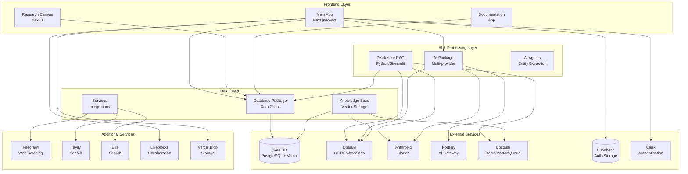
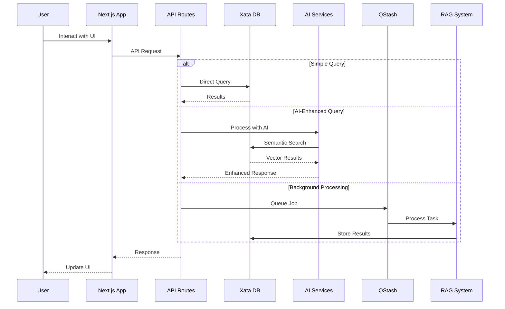

# Current Architecture Overview

## Repository: ultraterrestrial-resurrection

### Overview
The ultraterrestrial-resurrection project is a monorepo containing multiple applications and packages focused on UFO/UAP research, data management, and knowledge discovery. The architecture follows a modern web application pattern with separate frontend, backend services, and data processing pipelines.

### Component Architecture Diagram



### Directory Structure

```
ultraterrestrial-resurrection/
├── apps/
│   ├── app/                    # Main Next.js application
│   │   ├── src/
│   │   │   ├── app/            # App router pages
│   │   │   ├── components/     # React components
│   │   │   ├── features/       # Feature modules
│   │   │   ├── services/       # Service integrations
│   │   │   └── lib/            # Utilities
│   │   └── scripts/            # Data import/export scripts
│   ├── disclosure-rag/         # Python RAG system
│   │   ├── agents/             # AI agents
│   │   ├── lib/                # Core libraries
│   │   ├── processing/         # Data processing
│   │   └── utils/              # Utilities
│   ├── research-canvas/        # Research interface
│   └── docs/                   # Documentation app
├── packages/
│   ├── ai/                     # AI integrations
│   │   ├── integrations/       # Provider integrations
│   │   ├── prometheus/         # AI orchestration
│   │   └── prompts/            # Prompt templates
│   ├── db/                     # Database package
│   │   ├── xata/               # Xata client & models
│   │   └── types/              # TypeScript types
│   ├── knowledge-base/         # Knowledge management
│   │   ├── vector_storage/     # Vector DB operations
│   │   └── transcripts/        # Transcript processing
│   └── services/               # External services
│       ├── firecrawl/          # Web scraping
│       ├── exa/                # Search integration
│       └── document-library/   # Document management
└── Configuration Files

```

### Technology Stack

#### Frontend (apps/app)
- **Framework**: Next.js 15 with App Router
- **UI Libraries**: 
  - React 19
  - Tailwind CSS 4
  - Radix UI components
  - Shadcn/ui patterns
  - Framer Motion
  - Three.js/R3F for 3D
- **State Management**: Zustand
- **Forms**: React Hook Form + Zod
- **Real-time**: Liveblocks, PartySocket
- **Maps**: Mapbox GL, Deck.gl

#### Backend Services
- **Runtime**: Bun (primary), Node.js compatible
- **API Routes**: Next.js API routes
- **Background Jobs**: 
  - Upstash QStash (queuing)
  - Inngest (workflows)
- **Authentication**: Clerk
- **File Storage**: Vercel Blob, Supabase Storage

#### Data Processing (apps/disclosure-rag)
- **Language**: Python 3.11+
- **Framework**: Streamlit (UI)
- **AI Libraries**:
  - OpenAI SDK
  - Anthropic SDK
  - LangChain
  - Sentence Transformers
- **Vector Storage**: 
  - FAISS (local)
  - PgVector (remote)
  - Upstash Vector
- **Data Processing**: Pandas, NumPy

#### Database Layer
- **Primary Database**: Xata
  - PostgreSQL-based
  - Native vector support (1536 dimensions)
  - Full-text search
  - AI-powered queries (Ask SDK)
  - File storage
  - Branch-based development
- **Caching**: Upstash Redis
- **Vector Search**: Multiple providers
  - Xata vectors
  - Upstash Vector
  - OpenAI vector stores

### External Service Integrations

#### AI/ML Services
1. **OpenAI**
   - GPT models for text generation
   - Embeddings (text-embedding-3-small)
   - Assistants API
   - Vector stores
   
2. **Anthropic**
   - Claude models
   - Long-context processing
   
3. **Portkey**
   - AI gateway/router
   - Model management
   - Observability
   - Cost tracking

4. **Additional AI**
   - Groq (fast inference)
   - Together AI
   - Perplexity
   - Cohere
   - Google Gemini

#### Search & Data Services
1. **Firecrawl** - Web scraping & extraction
2. **Tavily** - AI-powered search
3. **Exa** - Semantic search
4. **Serper** - Google search API
5. **Jina** - Document processing

#### Infrastructure Services
1. **Upstash**
   - Redis (caching)
   - Vector (semantic search)
   - QStash (message queue)
   
2. **Supabase**
   - Authentication (backup)
   - File storage
   - Real-time subscriptions
   
3. **Clerk**
   - Primary authentication
   - User management
   - Organizations
   
4. **Liveblocks**
   - Real-time collaboration
   - Presence tracking
   - Shared state

#### Development Tools
1. **Vercel** - Hosting & deployment
2. **PostHog** - Analytics
3. **Langchain/Langsmith** - LLM observability
4. **GitHub** - Version control
5. **ngrok** - Local tunneling

### Data Flow Architecture



### Key Features by Component

#### Main Application (apps/app)
- Multi-tab research interface
- Real-time collaboration
- AI-powered chat & search
- Document processing pipeline
- Interactive visualizations (maps, graphs, 3D)
- Theory building tools
- Mindmap creation

#### Disclosure RAG (apps/disclosure-rag)
- Entity extraction from documents
- Multi-source RAG pipeline
- YouTube transcript processing
- CSV data import/export
- Interactive chat interface
- Knowledge graph generation

#### Database Package (packages/db)
- Type-safe database client
- Model definitions for 25+ tables
- AI-powered queries (Ask SDK)
- Vector search capabilities
- Migration management
- Cross-table search

#### AI Package (packages/ai)
- Multi-provider support via Portkey
- Prompt management
- Streaming responses
- Cost tracking
- Model routing
- Fallback handling

### Security & Authentication
- **Clerk** for primary authentication
- API key management for services
- Environment-based configuration
- Webhook signature verification
- Role-based access control (planned)

### Development Workflow
1. **Local Development**: Bun dev server
2. **Type Safety**: Full TypeScript coverage
3. **Database Branches**: Xata branch workflow
4. **Testing**: Jest, React Testing Library
5. **CI/CD**: Vercel deployments
6. **Monitoring**: PostHog analytics, Portkey AI monitoring

### Performance Optimizations
- Edge runtime for API routes
- Streaming AI responses
- Vector index optimization
- Client-side caching
- Image optimization
- Code splitting
- Lazy loading

### Scalability Considerations
- Serverless architecture
- Queue-based processing
- Multi-provider AI fallbacks
- Database connection pooling
- CDN for static assets
- Incremental static regeneration

## Summary

The ultraterrestrial-resurrection project represents a sophisticated, modern web application architecture designed for UFO/UAP research and knowledge management. It leverages cutting-edge AI technologies, vector databases, and real-time collaboration tools to create a comprehensive research platform. The monorepo structure allows for shared code and consistent development practices across multiple applications while maintaining clear separation of concerns.

Key strengths:
- Modern tech stack with Next.js 15 and React 19
- Comprehensive AI integration with multiple providers
- Robust data layer with vector search capabilities
- Real-time collaboration features
- Scalable serverless architecture
- Strong type safety throughout

Areas for potential improvement:
- Consider implementing a unified API gateway
- Add comprehensive testing coverage
- Implement centralized logging/monitoring
- Consider GraphQL for complex data fetching
- Add data validation middleware layer
