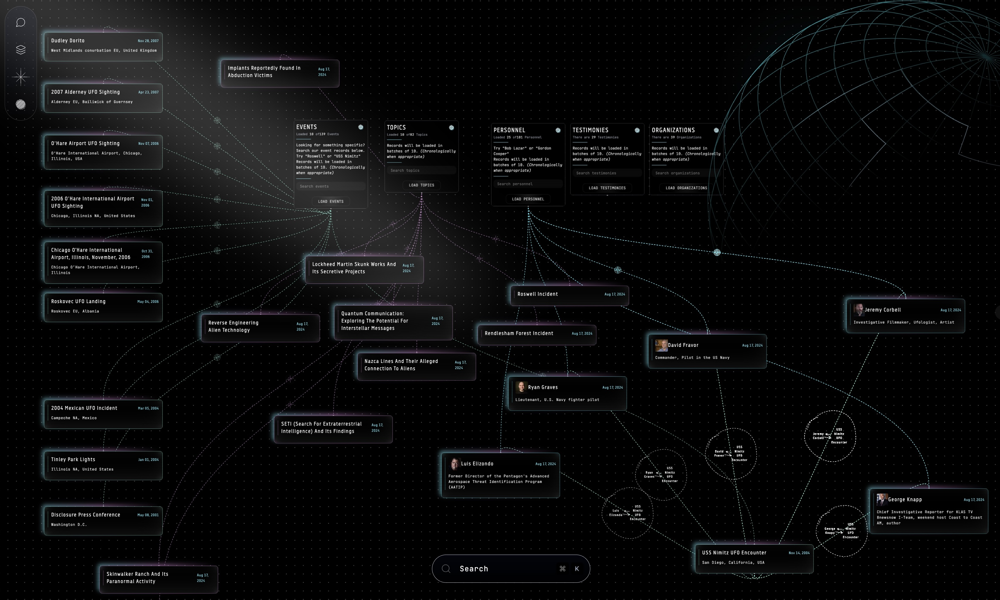
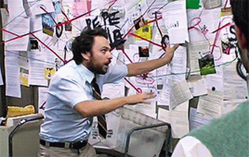

# UltraTerrestrial

**Tracking the State of Disclosure**
_Striving to document, explore and disseminate the past, present and future of the UFO topic and its bearing on humanity, the universe and our place within it._

{: height="400px" width="100%"}

# Initial Idea

How it started ...

Essentially I was thinking it might be cool to build a "state of disclosure" application that provided engaging visual displays and interactions across the following general areas:

1. Major Historical UFO Event Chronology
    - Interactive 3D visualization of global UFO sightings
    - Timeline navigation and filtering capabilities
    - Detailed event documentation and analysis

2. Disclosure Status Dashboard
    - Real-time tracking of claims, hearings and news
    - Progress indicators and milestone tracking
    - Historical context and developments

3. Topic Analysis & Correlation Engine
    - Network visualization of connected topics
    - Pattern recognition and trend analysis
    - Machine learning-powered insight generation

4. Key Figures Database
    - Comprehensive profiles of notable individuals
    - Timeline of involvement and contributions
    - Network analysis of relationships and connections

5. Investigation Hub
    - Interactive evidence mapping and visualization
    - Collaborative research and analysis tools
    - Pattern recognition across disparate data points

6. Digital Archive
    - Searchable repository of documents and artifacts
    - Metadata tagging and cross-referencing
    - Chain of custody tracking

7. Open Questions Framework
    - Structured database of unresolved questions
    - Impact analysis and implications tracking
    - Progress monitoring and updates

8. Classified Locations Registry
    - Mapping of suspected facilities
    - Historical activity analysis
    - Geospatial correlation with events

9. Contractor Intelligence Database
    - Profiles of relevant organizations
    - Project and program tracking
    - Network analysis of relationships

## Formal Pitch

At its core, Ultraterrestrial is designed to chronicle major historical UFO events with stunning 3D visuals that map sightings across the globe. Picture an interactive world map where you can zoom in and out, explore sightings by location, and navigate through time using a dynamic slider that showcases how these phenomena have evolved over the decades. Heatmaps will highlight regions with high densities of sightings, and for those who love immersive experiences, augmented reality features will let you visualize historical sightings in your current surroundings.

Each event isn’t just a pinpoint on a map; it comes alive with detailed descriptions, eyewitness accounts, official reports, and multimedia elements like photos, videos, and audio recordings. Users can dive deep into geospatial data, view satellite imagery, and even add their own annotations, making the exploration both informative and interactive.

Keeping up with the latest developments is crucial, and Ultraterrestrial excels in status reporting on claims, hearings, news items, and events. A real-time dashboard offers an overview of recent developments, ongoing investigations, and upcoming events. Imagine visual timelines tracking the progression of key claims and hearings, complemented by a notification system that keeps you updated on specific topics or events you care about most.

One of the standout features is the Topic Tracker. This dynamic tool maps out interconnected topics using network graphs, highlighting trending subjects and organizing them into subtopics for easy navigation. Users can engage in discussions, participate in polls, and contribute their own insights, fostering a vibrant community of like-minded individuals.

No comprehensive platform would be complete without a Who’s Who roster, and Ultraterrestrial delivers with detailed profiles of key figures in the UFO disclosure space. From Bob Lazar to Jeremy Corbell, each profile includes biographies, contributions, claims, and multimedia content like interviews and documentaries. An interactive network map shows how these figures connect with each other, organizations, and major events, providing a clear picture of the landscape.

For those who crave deeper investigation, Ultraterrestrial offers an Investigative Hub. Think of it as a central place where you can follow complex threads weaving through various events, people, and evidence. Interactive diagrams and mind maps make it easy to visualize these connections, while in-depth case studies allow for thorough exploration of specific phenomena or incidents. Users can collaborate on investigations, contribute findings, and even participate in verifying information to ensure credibility.

The Library is another cornerstone of Ultraterrestrial, housing major documents, letters, artifacts, and evidence in a meticulously organized digital repository. With features like document scanning, OCR, and detailed metadata, users can easily search and access a wealth of information. Interactive exhibits and guided tours provide curated experiences, making the library both a resource and an educational tool.

Addressing the big questions is essential, and Ultraterrestrial presents an official list of “unanswered questions” along with their implications. These questions are categorized by themes such as technology, origin, and intent, and each one links to relevant people, places, and events. Users can track the progress of these questions, submit new ones, and vote on which should be prioritized, ensuring that the platform remains dynamic and responsive to community interests.

When it comes to the more mysterious aspects, Ultraterrestrial includes lists of suspected “black” bases and contractors involved in retrieving materials. Interactive maps provide detailed location data, while base profiles offer background information, theories, sightings, and photographic evidence. Contractor profiles document affiliations and evidence linking them to retrieved materials, complete with network mapping to show connections to various bases and events.

[ERD](packages/docs/erd-diagram.svg)
[Feature Roadmap](./roadmap.md)
[Pitch](./pitch.md)

## Tech Stack

OpenAI
AI.SDK
NextJS
Xata
OpenAI
Anthropic
Tailwind
ThreeJS
React Three Fiber
Framer Motion

### Prompt Storage

<https://us.cloud.langfuse.com/project/cm383h71b00ko9czugbg17ss6>
