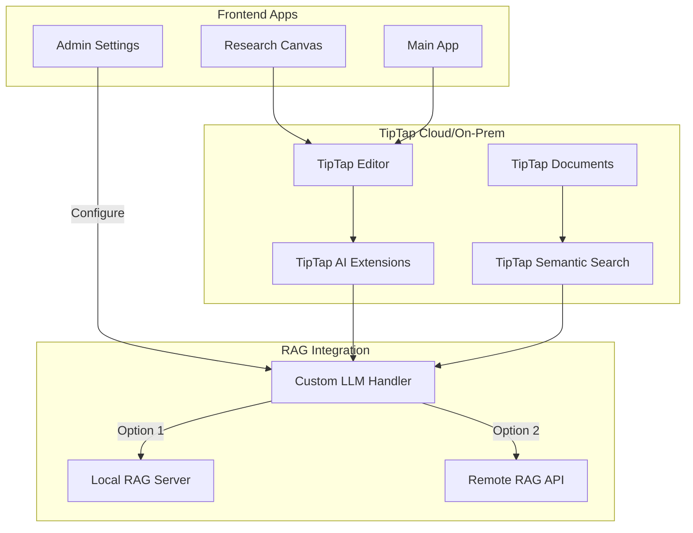

# TipTap AI RAG Integration Plan V2

**Generated:** June 28, 2025  
**Version:** 2.0  
**Target Implementation:** @apps/app/ and @apps/research-canvas/  
**Lead Architect:** Claude  

---

## Executive Summary

This updated implementation plan integrates TipTap's native AI capabilities with the existing Disclosure RAG system. The plan leverages TipTap's built-in document management, authentication, and AI extensions, eliminating the need for custom API gateways. Admin users can choose between local RAG server or remote cloud integration.

## Architecture Overview



## Key Changes from V1

1. **No API Gateway Required** - TipTap handles authentication, rate limiting, and API management
2. **Admin Configuration** - Toggle between local/remote RAG servers
3. **Native TipTap Extensions** - Use AI Generation, AI Suggestion, and AI Agent extensions
4. **Built-in Semantic Search** - Leverage TipTap's semantic search (when available)
5. **Document Storage Options** - Cloud or on-premises with TipTap Documents

## Implementation Plan

### Phase 1: Admin Configuration & Setup (Days 1-2)

#### 1.1 Admin Settings Interface
```typescript
// @apps/app/src/components/admin/rag-settings.tsx
import { useState } from 'react'
import { Switch } from '@/components/ui/switch'
import { Input } from '@/components/ui/input'
import { Button } from '@/components/ui/button'
import { toast } from 'sonner'

interface RAGSettings {
  mode: 'local' | 'remote'
  localUrl: string
  remoteUrl: string
  apiKey?: string
  enabled: boolean
}

export function RAGSettingsPanel() {
  const [settings, setSettings] = useState<RAGSettings>({
    mode: 'local',
    localUrl: 'http://localhost:8000',
    remoteUrl: '',
    apiKey: '',
    enabled: false
  })

  const saveSettings = async () => {
    try {
      // Save to secure storage (server-side)
      await fetch('/api/admin/rag-settings', {
        method: 'POST',
        headers: { 'Content-Type': 'application/json' },
        body: JSON.stringify(settings)
      })
      toast.success('RAG settings saved')
    } catch (error) {
      toast.error('Failed to save settings')
    }
  }

  return (
    <div className="space-y-6">
      <div className="flex items-center justify-between">
        <h3 className="text-lg font-medium">RAG Integration</h3>
        <Switch
          checked={settings.enabled}
          onCheckedChange={(enabled) => setSettings({ ...settings, enabled })}
        />
      </div>

      {settings.enabled && (
        <>
          <div className="space-y-4">
            <label className="text-sm font-medium">Connection Mode</label>
            <div className="flex gap-4">
              <Button
                variant={settings.mode === 'local' ? 'default' : 'outline'}
                onClick={() => setSettings({ ...settings, mode: 'local' })}
              >
                Local Server
              </Button>
              <Button
                variant={settings.mode === 'remote' ? 'default' : 'outline'}
                onClick={() => setSettings({ ...settings, mode: 'remote' })}
              >
                Remote API
              </Button>
            </div>
          </div>

          {settings.mode === 'local' ? (
            <Input
              label="Local RAG Server URL"
              value={settings.localUrl}
              onChange={(e) => setSettings({ ...settings, localUrl: e.target.value })}
              placeholder="http://localhost:8000"
            />
          ) : (
            <>
              <Input
                label="Remote RAG API URL"
                value={settings.remoteUrl}
                onChange={(e) => setSettings({ ...settings, remoteUrl: e.target.value })}
                placeholder="https://api.example.com/rag"
              />
              <Input
                label="API Key"
                type="password"
                value={settings.apiKey}
                onChange={(e) => setSettings({ ...settings, apiKey: e.target.value })}
              />
            </>
          )}

          <Button onClick={saveSettings}>Save Settings</Button>
        </>
      )}
    </div>
  )
}
```

#### 1.2 Server-Side Settings API
```typescript
// @apps/app/src/app/api/admin/rag-settings/route.ts
import { NextRequest, NextResponse } from 'next/server'
import { getServerSession } from 'next-auth'
import { authOptions } from '@/lib/auth'

export async function POST(request: NextRequest) {
  const session = await getServerSession(authOptions)
  
  // Check if user is admin
  if (!session?.user?.role || session.user.role !== 'admin') {
    return NextResponse.json({ error: 'Unauthorized' }, { status: 403 })
  }

  const settings = await request.json()
  
  // Store in secure environment or database
  // For production, use proper secret management
  process.env.RAG_MODE = settings.mode
  process.env.RAG_LOCAL_URL = settings.localUrl
  process.env.RAG_REMOTE_URL = settings.remoteUrl
  
  if (settings.apiKey) {
    // Encrypt before storing
    process.env.RAG_API_KEY = encrypt(settings.apiKey)
  }

  return NextResponse.json({ success: true })
}

export async function GET(request: NextRequest) {
  const session = await getServerSession(authOptions)
  
  if (!session?.user?.role || session.user.role !== 'admin') {
    return NextResponse.json({ error: 'Unauthorized' }, { status: 403 })
  }

  return NextResponse.json({
    mode: process.env.RAG_MODE || 'local',
    localUrl: process.env.RAG_LOCAL_URL || 'http://localhost:8000',
    remoteUrl: process.env.RAG_REMOTE_URL || '',
    enabled: process.env.RAG_ENABLED === 'true'
  })
}
```

### Phase 2: TipTap Custom LLM Integration (Days 3-4)

#### 2.1 Custom LLM Handler for RAG
```typescript
// @apps/app/src/lib/tiptap/custom-llm-handler.ts
import { CustomLLMHandler } from '@tiptap/extension-ai'

export class RAGLLMHandler implements CustomLLMHandler {
  private settings: RAGSettings
  
  constructor() {
    this.loadSettings()
  }

  private async loadSettings() {
    const response = await fetch('/api/admin/rag-settings')
    this.settings = await response.json()
  }

  async generateText(prompt: string, options?: any) {
    if (!this.settings.enabled) {
      throw new Error('RAG integration is disabled')
    }

    const baseUrl = this.settings.mode === 'local' 
      ? this.settings.localUrl 
      : this.settings.remoteUrl

    const response = await fetch(`${baseUrl}/api/rag/generate`, {
      method: 'POST',
      headers: {
        'Content-Type': 'application/json',
        ...(this.settings.apiKey && { 'Authorization': `Bearer ${this.settings.apiKey}` })
      },
      body: JSON.stringify({
        prompt,
        context: options?.context,
        maxTokens: options?.maxTokens || 500
      })
    })

    const data = await response.json()
    return data.text
  }

  async getSuggestions(text: string, context?: any) {
    const baseUrl = this.settings.mode === 'local' 
      ? this.settings.localUrl 
      : this.settings.remoteUrl

    const response = await fetch(`${baseUrl}/api/rag/suggestions`, {
      method: 'POST',
      headers: {
        'Content-Type': 'application/json',
        ...(this.settings.apiKey && { 'Authorization': `Bearer ${this.settings.apiKey}` })
      },
      body: JSON.stringify({
        text,
        contextBefore: context?.before,
        contextAfter: context?.after,
        maxSuggestions: 5
      })
    })

    return response.json()
  }

  async searchDocuments(query: string, filters?: any) {
    const baseUrl = this.settings.mode === 'local' 
      ? this.settings.localUrl 
      : this.settings.remoteUrl

    const response = await fetch(`${baseUrl}/api/rag/search`, {
      method: 'POST',
      headers: {
        'Content-Type': 'application/json',
        ...(this.settings.apiKey && { 'Authorization': `Bearer ${this.settings.apiKey}` })
      },
      body: JSON.stringify({
        query,
        filters,
        topK: 5
      })
    })

    return response.json()
  }
}
```

#### 2.2 TipTap AI Extension Configuration
```typescript
// @apps/app/src/components/tiptap-templates/research-editor-enhanced.tsx
import { useEditor } from '@tiptap/react'
import { AIGeneration } from '@tiptap/extension-ai-generation'
import { AISuggestion } from '@tiptap/extension-ai-suggestion'
import { AIAgent } from '@tiptap/extension-ai-agent'
import { RAGLLMHandler } from '@/lib/tiptap/custom-llm-handler'

export function ResearchEditorEnhanced() {
  const ragHandler = new RAGLLMHandler()
  
  const editor = useEditor({
    extensions: [
      // ... existing extensions
      
      AIGeneration.configure({
        llmHandler: ragHandler,
        commands: {
          generateFromKnowledge: {
            label: 'Generate from Knowledge Base',
            prompt: async (text) => {
              const docs = await ragHandler.searchDocuments(text)
              return `Based on these documents: ${docs.map(d => d.title).join(', ')}, ${text}`
            }
          },
          expandWithContext: {
            label: 'Expand with UFO Context',
            prompt: (text) => `Expand this text with relevant UFO/UAP information: ${text}`
          }
        }
      }),

      AISuggestion.configure({
        llmHandler: ragHandler,
        suggestionTypes: {
          factCheck: {
            label: 'Fact Check',
            prompt: (text) => `Verify this claim against the knowledge base: ${text}`
          },
          addCitation: {
            label: 'Add Citation',
            prompt: (text) => `Find citations for: ${text}`
          }
        }
      }),

      AIAgent.configure({
        llmHandler: ragHandler,
        agents: {
          researcher: {
            name: 'UFO Research Assistant',
            description: 'Search and analyze UFO/UAP information',
            systemPrompt: 'You are a UFO/UAP research assistant with access to a comprehensive knowledge base.',
            capabilities: ['search', 'analyze', 'cite']
          }
        }
      })
    ]
  })

  return <EditorContent editor={editor} />
}
```

### Phase 3: Enhanced Mention System (Days 5-6)

#### 3.1 RAG-Enhanced Mention Extension
```typescript
// @apps/app/src/components/tiptap-extension/rag-mention.ts
import { Mention } from '@tiptap/extension-mention'
import { ReactRenderer } from '@tiptap/react'
import tippy from 'tippy.js'
import { RAGLLMHandler } from '@/lib/tiptap/custom-llm-handler'
import { RAGSuggestionList } from './rag-suggestion-list'

export const RAGMention = Mention.extend({
  name: 'ragMention',

  addOptions() {
    return {
      ...this.parent?.(),
      suggestion: {
        char: '@@',
        allowSpaces: true,
        
        items: async ({ query }) => {
          if (query.length < 3) return []
          
          const ragHandler = new RAGLLMHandler()
          
          // Search both local entities and RAG knowledge base
          const [localResults, ragResults] = await Promise.all([
            this.searchLocalEntities(query),
            ragHandler.searchDocuments(query)
          ])
          
          return [
            ...localResults.map(r => ({ ...r, type: 'local' })),
            ...ragResults.map(r => ({ ...r, type: 'rag' }))
          ]
        },

        render: () => {
          let component
          let popup

          return {
            onStart: props => {
              component = new ReactRenderer(RAGSuggestionList, {
                props,
                editor: props.editor,
              })

              popup = tippy('body', {
                getReferenceClientRect: props.clientRect,
                appendTo: () => document.body,
                content: component.element,
                showOnCreate: true,
                interactive: true,
                trigger: 'manual',
                placement: 'bottom-start',
              })
            },

            onUpdate(props) {
              component.updateProps(props)

              popup[0].setProps({
                getReferenceClientRect: props.clientRect,
              })
            },

            onKeyDown(props) {
              if (props.event.key === 'Escape') {
                popup[0].hide()
                return true
              }

              return component.ref?.onKeyDown(props)
            },

            onExit() {
              popup[0].destroy()
              component.destroy()
            },
          }
        },
      },
    }
  },

  async searchLocalEntities(query: string) {
    // Search existing database entities
    const response = await fetch(`/api/search/entities?q=${query}`)
    return response.json()
  }
})
```

#### 3.2 RAG Suggestion List Component
```typescript
// @apps/app/src/components/tiptap-extension/rag-suggestion-list.tsx
import { forwardRef, useEffect, useImperativeHandle, useState } from 'react'
import { Badge } from '@/components/ui/badge'
import { ScrollArea } from '@/components/ui/scroll-area'
import { FileText, Database, Search } from 'lucide-react'

export const RAGSuggestionList = forwardRef((props: any, ref) => {
  const [selectedIndex, setSelectedIndex] = useState(0)

  const selectItem = (index: number) => {
    const item = props.items[index]

    if (item) {
      if (item.type === 'rag') {
        // Insert RAG document reference
        props.command({
          id: item.id,
          label: item.title,
          type: 'rag-document',
          content: item.summary
        })
      } else {
        // Insert local entity mention
        props.command({
          id: item.id,
          label: item.name,
          type: item.type
        })
      }
    }
  }

  useImperativeHandle(ref, () => ({
    onKeyDown: ({ event }: { event: KeyboardEvent }) => {
      if (event.key === 'ArrowUp') {
        setSelectedIndex((selectedIndex + props.items.length - 1) % props.items.length)
        return true
      }

      if (event.key === 'ArrowDown') {
        setSelectedIndex((selectedIndex + 1) % props.items.length)
        return true
      }

      if (event.key === 'Enter') {
        selectItem(selectedIndex)
        return true
      }

      return false
    },
  }))

  return (
    <div className="bg-popover border rounded-lg shadow-lg overflow-hidden">
      <ScrollArea className="max-h-[300px]">
        {props.items.length ? (
          props.items.map((item: any, index: number) => (
            <button
              className={`flex items-start gap-3 w-full px-3 py-2 text-left hover:bg-accent ${
                index === selectedIndex ? 'bg-accent' : ''
              }`}
              key={index}
              onClick={() => selectItem(index)}
            >
              {item.type === 'rag' ? (
                <>
                  <FileText className="w-4 h-4 mt-0.5 text-muted-foreground" />
                  <div className="flex-1">
                    <div className="font-medium">{item.title}</div>
                    <div className="text-sm text-muted-foreground line-clamp-2">
                      {item.summary}
                    </div>
                    <Badge variant="secondary" className="mt-1">
                      Knowledge Base
                    </Badge>
                  </div>
                </>
              ) : (
                <>
                  <Database className="w-4 h-4 mt-0.5 text-muted-foreground" />
                  <div className="flex-1">
                    <div className="font-medium">{item.name}</div>
                    <Badge variant="outline" className="mt-1">
                      {item.type}
                    </Badge>
                  </div>
                </>
              )}
            </button>
          ))
        ) : (
          <div className="px-3 py-2 text-sm text-muted-foreground">
            No results found
          </div>
        )}
      </ScrollArea>
    </div>
  )
})

RAGSuggestionList.displayName = 'RAGSuggestionList'
```

### Phase 4: AI Dropdown Integration (Days 7-8)

#### 4.1 Enhanced AI Dropdown with RAG Commands
```typescript
// @apps/app/src/features/mindmap/components/note/menus/TextMenu/components/AIDropdown.tsx
import { DropdownButton } from '@/components/ui/Dropdown'
import { Icon } from '@/components/ui/Icon'
import { Surface } from '@/components/ui/Surface'
import { Toolbar } from '@/components/9-ui/toolbar'
import { useRAGSettings } from '@/hooks/use-rag-settings'

export const AIDropdown = ({ 
  // ... existing props
  onRAGSearch,
  onRAGFactCheck,
  onRAGCite,
  onRAGElaborate,
  onRAGSummarize,
}: AIDropdownProps) => {
  const { enabled: ragEnabled } = useRAGSettings()
  
  return (
    <Dropdown.Root>
      <Dropdown.Trigger asChild>
        <Toolbar.Button
          className='text-purple-500 hover:text-purple-600 active:text-purple-600 dark:text-purple-400 dark:hover:text-purple-300 dark:active:text-purple-400'
          activeClassname='text-purple-600 hover:text-purple-600 dark:text-purple-400 dark:hover:text-purple-200'>
          <Icon name='Sparkles' className='mr-1' />
          AI Tools
          <Icon name='ChevronDown' className='w-2 h-2 ml-1' />
        </Toolbar.Button>
      </Dropdown.Trigger>
      <Dropdown.Content asChild>
        <Surface className='p-2 min-w-[10rem]'>
          {/* Existing AI commands */}
          <Dropdown.Item onClick={onSimplify}>
            <DropdownButton>
              <Icon name='CircleSlash' />
              Simplify
            </DropdownButton>
          </Dropdown.Item>
          {/* ... other existing commands ... */}

          {ragEnabled && (
            <>
              <Dropdown.Separator />
              <Dropdown.Label>
                <span className="text-xs text-muted-foreground px-2">Knowledge Base</span>
              </Dropdown.Label>
              
              <Dropdown.Item onClick={onRAGSearch}>
                <DropdownButton>
                  <Icon name='Search' />
                  Search Knowledge
                </DropdownButton>
              </Dropdown.Item>
              
              <Dropdown.Item onClick={onRAGFactCheck}>
                <DropdownButton>
                  <Icon name='CheckCircle' />
                  Fact Check
                </DropdownButton>
              </Dropdown.Item>
              
              <Dropdown.Item onClick={onRAGCite}>
                <DropdownButton>
                  <Icon name='Quote' />
                  Add Citation
                </DropdownButton>
              </Dropdown.Item>
              
              <Dropdown.Item onClick={onRAGElaborate}>
                <DropdownButton>
                  <Icon name='Expand' />
                  Elaborate with Context
                </DropdownButton>
              </Dropdown.Item>
              
              <Dropdown.Item onClick={onRAGSummarize}>
                <DropdownButton>
                  <Icon name='FileText' />
                  Summarize with Sources
                </DropdownButton>
              </Dropdown.Item>
            </>
          )}
        </Surface>
      </Dropdown.Content>
    </Dropdown.Root>
  )
}
```

#### 4.2 RAG Command Handlers
```typescript
// @apps/app/src/hooks/use-rag-commands.ts
import { useEditor } from '@tiptap/react'
import { RAGLLMHandler } from '@/lib/tiptap/custom-llm-handler'
import { toast } from 'sonner'

export function useRAGCommands(editor: Editor) {
  const ragHandler = new RAGLLMHandler()

  const handleRAGSearch = async () => {
    const { from, to } = editor.state.selection
    const selectedText = editor.state.doc.textBetween(from, to)
    
    if (!selectedText) {
      toast.error('Please select text to search')
      return
    }

    try {
      const results = await ragHandler.searchDocuments(selectedText)
      
      // Show results in a modal or sidebar
      showRAGSearchResults(results)
    } catch (error) {
      toast.error('Search failed')
    }
  }

  const handleRAGFactCheck = async () => {
    const { from, to } = editor.state.selection
    const selectedText = editor.state.doc.textBetween(from, to)
    
    try {
      const factCheck = await ragHandler.getSuggestions(selectedText, {
        type: 'factCheck'
      })
      
      // Insert fact check results as a comment or annotation
      editor.chain()
        .focus()
        .setMark('highlight', { color: factCheck.verified ? '#10b981' : '#ef4444' })
        .insertContent({
          type: 'factCheckAnnotation',
          attrs: {
            text: factCheck.explanation,
            sources: factCheck.sources
          }
        })
        .run()
    } catch (error) {
      toast.error('Fact check failed')
    }
  }

  const handleRAGCite = async () => {
    const { from, to } = editor.state.selection
    const selectedText = editor.state.doc.textBetween(from, to)
    
    try {
      const citations = await ragHandler.searchDocuments(selectedText, {
        type: 'citation'
      })
      
      // Show citation picker
      showCitationPicker(citations, (citation) => {
        editor.chain()
          .focus()
          .insertContent({
            type: 'citation',
            attrs: {
              documentId: citation.id,
              title: citation.title,
              authors: citation.authors,
              year: citation.year
            }
          })
          .run()
      })
    } catch (error) {
      toast.error('Citation search failed')
    }
  }

  return {
    handleRAGSearch,
    handleRAGFactCheck,
    handleRAGCite,
    // ... other handlers
  }
}
```

### Phase 5: TipTap Documents Integration (Days 9-10)

#### 5.1 Document Sync with RAG
```typescript
// @apps/app/src/lib/tiptap/document-sync.ts
import { TiptapDocumentAPI } from '@tiptap/documents'
import { RAGLLMHandler } from './custom-llm-handler'

export class DocumentRAGSync {
  private documentAPI: TiptapDocumentAPI
  private ragHandler: RAGLLMHandler
  
  constructor(config: TiptapConfig) {
    this.documentAPI = new TiptapDocumentAPI({
      appId: config.appId,
      apiSecret: config.apiSecret
    })
    this.ragHandler = new RAGLLMHandler()
  }

  async syncDocument(documentId: string) {
    // Fetch document from TipTap
    const document = await this.documentAPI.getDocument(documentId)
    
    // Extract text content
    const content = this.extractTextContent(document.content)
    
    // Send to RAG for indexing
    await this.ragHandler.indexDocument({
      id: documentId,
      content,
      metadata: {
        title: document.name,
        createdAt: document.createdAt,
        updatedAt: document.updatedAt
      }
    })
  }

  async setupWebhook() {
    // Configure webhook to sync on document updates
    await this.documentAPI.createWebhook({
      url: '/api/webhooks/tiptap-document-update',
      events: ['document.created', 'document.updated'],
      secret: process.env.WEBHOOK_SECRET
    })
  }
}
```

#### 5.2 Webhook Handler
```typescript
// @apps/app/src/app/api/webhooks/tiptap-document-update/route.ts
import { NextRequest, NextResponse } from 'next/server'
import { DocumentRAGSync } from '@/lib/tiptap/document-sync'
import crypto from 'crypto'

export async function POST(request: NextRequest) {
  // Verify webhook signature
  const signature = request.headers.get('x-tiptap-signature')
  const body = await request.text()
  
  const expectedSignature = crypto
    .createHmac('sha256', process.env.WEBHOOK_SECRET!)
    .update(body)
    .digest('hex')
  
  if (signature !== expectedSignature) {
    return NextResponse.json({ error: 'Invalid signature' }, { status: 401 })
  }

  const event = JSON.parse(body)
  
  if (event.type === 'document.created' || event.type === 'document.updated') {
    const sync = new DocumentRAGSync(tiptapConfig)
    await sync.syncDocument(event.document.id)
  }

  return NextResponse.json({ success: true })
}
```

## Testing Strategy

### Unit Tests
```typescript
// @apps/app/src/tests/rag-integration.test.ts
import { RAGLLMHandler } from '@/lib/tiptap/custom-llm-handler'
import { mockLocalServer, mockRemoteAPI } from './mocks'

describe('RAG Integration', () => {
  it('should connect to local server when configured', async () => {
    mockLocalServer()
    const handler = new RAGLLMHandler()
    
    const result = await handler.searchDocuments('UFO sightings')
    expect(result).toBeDefined()
    expect(result[0].source).toBe('local')
  })

  it('should connect to remote API when configured', async () => {
    mockRemoteAPI()
    const handler = new RAGLLMHandler()
    
    const result = await handler.searchDocuments('UFO sightings')
    expect(result).toBeDefined()
    expect(result[0].source).toBe('remote')
  })

  it('should handle connection failures gracefully', async () => {
    const handler = new RAGLLMHandler()
    
    // Simulate network failure
    jest.spyOn(global, 'fetch').mockRejectedValue(new Error('Network error'))
    
    await expect(handler.searchDocuments('test')).rejects.toThrow()
  })
})
```

## Deployment Options

### Option 1: Local Development
```bash
# Start local RAG server
cd apps/disclosure-rag
./launch_api.sh

# Configure TipTap to use local server
# Admin panel: Set mode to "local"
# URL: http://localhost:8000
```

### Option 2: Cloud Deployment
```bash
# Deploy RAG API to cloud provider
# Configure TipTap to use remote server
# Admin panel: Set mode to "remote"
# URL: https://your-rag-api.com
# Add API key for authentication
```

### Option 3: Hybrid (Recommended)
- Use local server for development
- Use remote API for production
- TipTap Documents handle authentication
- No need for custom API gateway

## Performance Optimizations

1. **Client-Side Caching**
   - Cache RAG search results for 5 minutes
   - Debounce mention searches (300ms)
   - Prefetch common queries

2. **Server-Side Optimizations**
   - Use TipTap's built-in caching
   - Batch document indexing
   - Async webhook processing

3. **Network Optimizations**
   - Compress API responses
   - Use HTTP/2 for multiplexing
   - CDN for static assets

## Security Considerations

1. **Authentication**
   - Admin-only access to RAG settings
   - JWT tokens for API access
   - Secure storage of API keys

2. **Data Protection**
   - Encrypt sensitive data at rest
   - Use HTTPS for all communications
   - Validate and sanitize inputs

3. **Access Control**
   - Role-based permissions
   - Document-level access control
   - Audit logging for admin actions

## Migration Path

For existing users:
1. Keep current editor functionality
2. RAG features are opt-in via admin panel
3. Gradual rollout with feature flags
4. No breaking changes to existing documents

## Success Metrics

1. **Performance**
   - Search latency < 200ms
   - 99.9% uptime
   - < 50KB bundle size increase

2. **Adoption**
   - 50% of admins enable RAG within 30 days
   - 10+ RAG interactions per session
   - 80% user satisfaction

3. **Quality**
   - 90% search relevance
   - 95% citation accuracy
   - < 1% error rate

---

**End of Implementation Plan V2**

This updated plan leverages TipTap's native capabilities while providing flexibility for admins to choose between local and remote RAG servers.