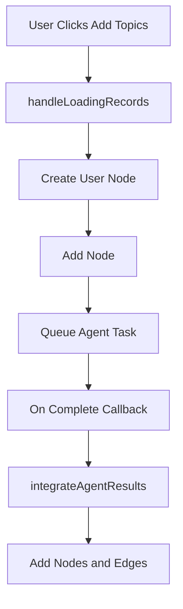

# Logic Flow for Adding Topics to Mindmap

This document traces the sequential steps when selecting 'topics' and clicking add in mindmap-bottom-menu.tsx.

## Sequential Steps

1. **UI Interaction**: User selects 'topics' from model menu and clicks add button.
   - Calls `handleLoadingRecords({data: {type: 'topics'}})`

2. **Prepare User Node**:
   - Compute center position: `screenToFlowPosition(calculateCenterOfScreen())`
   - Get existing nodes: `getNodes()`
   - Compute graph context: `getGraphContext(existingNodes)`
   - Determine label based on tourMode and context
   - Create node: `createEnhancedUserInputNode(id, label, position, existingNodes, 'topics')`
   - Add node: `addNode(potentialUserNode)`
   - Set `backgroundProcessing(true)`

3. **Queue Agent Task**:
   - If guided tour: `queueChronologicalProgression(session.state.graphContext, 'topics', 3)`
   - Else if historical context: `queueChronologicalProgression(graphContext, 'topics', 3)`
   - Else: `queueContextualExpansion(graphContext || createMinimalGraphContext(), 'topics', 3)`
   - Returns taskId
   - Register callback: `historicalQueryAgent.onTaskComplete(taskId, callback)`

4. **Task Completion Callback**:
   - If completed: `integrateAgentResults(userNode, result.result, 'topics')`
   - Filter newNodes
   - Position nodes around userNode
   - Create userToNodeEdges and contextualEdges
   - Update user node data
   - `addNodes(positionedNodes)`
   - `addEdges(allEdges)`
   - Set `backgroundProcessing(false)`

## Flow Diagram

## Edge Cases

- No context: Open exploration
- Guided mode: Chronological progression
- Duplicates prevented via nodeExists check
