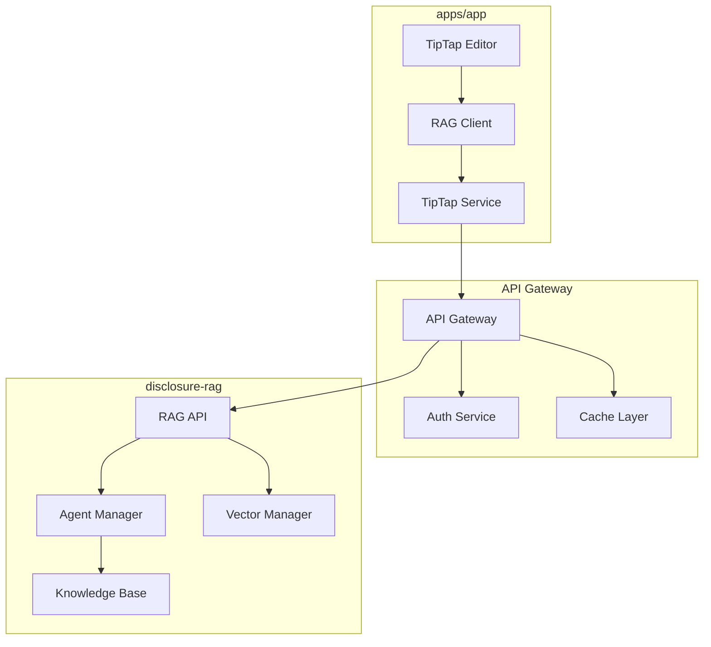

# RAG + TipTap AI Integration Plan

## Executive Summary

This document outlines the integration architecture for connecting the disclosure-rag RAG system with TipTap AI in the ultraterrestrial-resurrection project. The integration will enable AI-powered research assistance within the TipTap editor while maintaining security and performance.

## Current State Analysis

### RAG System (disclosure-rag)
- **Architecture**: Multi-agent system with specialized agents (EntityExtraction, ContentAnalysis, etc.)
- **Storage**: Hybrid vector manager supporting FAISS, OpenAI, Chroma, Pinecone
- **Processing**: NER with confidence scoring, multi-modal content support
- **APIs**: OpenAI Assistant API integration, local embeddings

### TipTap Implementation (apps/app)
- **Editor**: Research-focused with mention functionality
- **Extensions**: Custom research features, context-aware editing
- **Integration Points**: @ mentions, card selection handlers

## Architecture Design

### 1. Service Architecture



### 2. API Design

#### Core Endpoints

```typescript
// RAG API Endpoints
interface RAGAPIEndpoints {
  // Real-time operations
  '/api/v1/rag/search': {
    method: 'POST'
    body: {
      query: string
      context?: ResearchContext
      filters?: SearchFilters
      limit?: number
    }
    response: SearchResult[]
  }
  
  '/api/v1/rag/analyze': {
    method: 'POST'
    body: {
      content: string
      analysisType: 'entity' | 'summary' | 'topics'
      options?: AnalysisOptions
    }
    response: AnalysisResult
  }
  
  '/api/v1/rag/suggest': {
    method: 'POST'
    body: {
      context: EditorContext
      cursorPosition: number
      previousContent: string
    }
    response: Suggestion[]
  }
  
  // Async operations
  '/api/v1/rag/process': {
    method: 'POST'
    body: {
      documentId: string
      processingType: ProcessingType[]
    }
    response: { jobId: string }
  }
  
  '/api/v1/rag/job/:jobId': {
    method: 'GET'
    response: JobStatus
  }
}
```

### 3. TipTap Extensions

#### RAG-Enhanced Mention Extension

```typescript
// apps/app/src/components/tiptap/extensions/rag-mention.ts
import { Extension } from '@tiptap/core'
import { RAGClient } from '@/lib/rag/client'

export const RAGMentionExtension = Extension.create({
  name: 'ragMention',
  
  addOptions() {
    return {
      ragClient: null as RAGClient | null,
      debounceMs: 300,
      minQueryLength: 3
    }
  },
  
  addCommands() {
    return {
      ragSearch: (query: string) => async ({ editor }) => {
        const results = await this.options.ragClient.search(query)
        // Handle results
        return true
      }
    }
  }
})
```

#### AI Assistant Extension

```typescript
// apps/app/src/components/tiptap/extensions/ai-assistant.ts
export const AIAssistantExtension = Extension.create({
  name: 'aiAssistant',
  
  addOptions() {
    return {
      tiptapConfig: {
        appSecret: process.env.TIPTAP_APP_SECRET,
        documentServerId: process.env.TIPTAP_DOC_SERVER_ID,
        apiSecret: process.env.TIPTAP_API_SECRET
      }
    }
  },
  
  addCommands() {
    return {
      aiSuggest: () => async ({ editor, state }) => {
        const context = extractContext(state)
        const suggestions = await ragClient.getSuggestions(context)
        return showSuggestionPopup(suggestions)
      },
      
      aiAnalyze: () => async ({ editor }) => {
        const selection = editor.state.selection
        const content = editor.state.doc.textBetween(selection.from, selection.to)
        const analysis = await ragClient.analyze(content)
        return insertAnalysis(analysis)
      }
    }
  }
})
```

### 4. Security Implementation

#### Environment Configuration

```bash
# apps/app/.env.local
# TipTap AI Configuration
TIPTAP_APP_SECRET=<encrypted>
TIPTAP_DOC_SERVER_ID=09xopqy9
TIPTAP_API_SECRET=<encrypted>
TIPTAP_ENV_NAME=ultraterrestrial-doc-server

# RAG API Configuration
RAG_API_URL=http://localhost:8000/api/v1
RAG_API_KEY=<generated>
```

#### Security Measures

1. **Credential Storage**
   - Use environment variables with encryption at rest
   - Implement secret rotation mechanism
   - Never expose credentials to client-side code

2. **API Authentication**
   - JWT tokens with short expiration
   - API key validation for service-to-service
   - Request signing for critical operations

3. **Data Protection**
   - TLS for all API communications
   - Input validation and sanitization
   - Rate limiting per user/API key

### 5. Implementation Phases

#### Phase 1: Foundation (Week 1-2)
- [ ] Set up API gateway infrastructure
- [ ] Create RAG API service wrapper
- [ ] Implement authentication layer
- [ ] Basic TipTap extension structure

#### Phase 2: Core Integration (Week 3-4)
- [ ] Implement search endpoint
- [ ] Create mention extension with RAG
- [ ] Add context-aware suggestions
- [ ] Basic caching layer

#### Phase 3: Advanced Features (Week 5-6)
- [ ] Entity extraction integration
- [ ] Real-time analysis features
- [ ] Async processing for documents
- [ ] Performance optimization

#### Phase 4: Polish & Deploy (Week 7-8)
- [ ] Error handling and fallbacks
- [ ] Monitoring and logging
- [ ] Documentation
- [ ] Production deployment

### 6. Performance Optimization

1. **Caching Strategy**
   - Redis for frequent queries
   - Local LRU cache in TipTap client
   - Vector embedding cache

2. **Query Optimization**
   - Debounce user input (300ms)
   - Batch similar requests
   - Preload common contexts

3. **Async Processing**
   - Background jobs for heavy analysis
   - WebSocket for real-time updates
   - Progressive enhancement

### 7. Error Handling

```typescript
// Graceful degradation example
class RAGClient {
  async search(query: string): Promise<SearchResult[]> {
    try {
      return await this.apiCall('/search', { query })
    } catch (error) {
      // Fallback to local search
      if (this.localFallback) {
        return this.localSearch(query)
      }
      // Show user-friendly error
      this.showError('Search temporarily unavailable')
      return []
    }
  }
}
```

### 8. Monitoring & Observability

- **Metrics**: API latency, cache hit rates, error rates
- **Logging**: Structured logs with correlation IDs
- **Tracing**: Distributed tracing for request flow
- **Alerts**: Performance degradation, error spikes

### 9. Future Enhancements

1. **Multi-modal Support**
   - Image analysis in editor
   - Audio transcription
   - Video processing

2. **Collaborative Features**
   - Shared RAG contexts
   - Team knowledge bases
   - Real-time collaboration

3. **Advanced AI Features**
   - Custom agent creation
   - Fine-tuned models
   - Domain-specific training

## Next Steps

1. Review and approve architecture design
2. Set up development environment
3. Create API gateway infrastructure
4. Begin Phase 1 implementation

## Appendix

### A. Configuration Templates
### B. API Documentation
### C. Security Checklist
### D. Performance Benchmarks