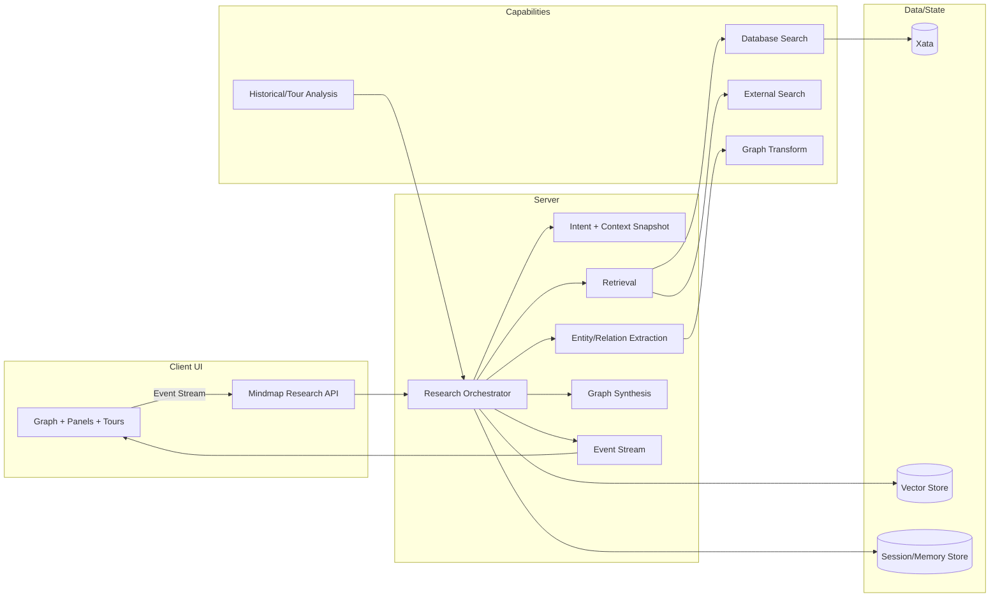
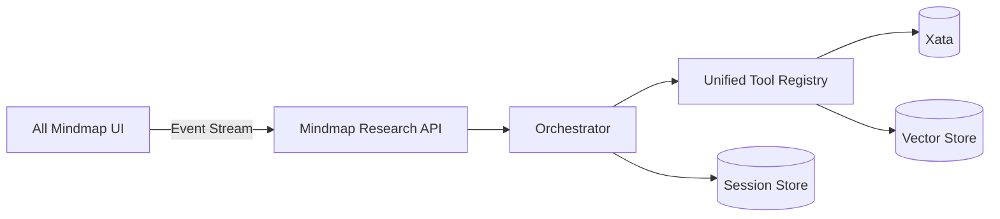
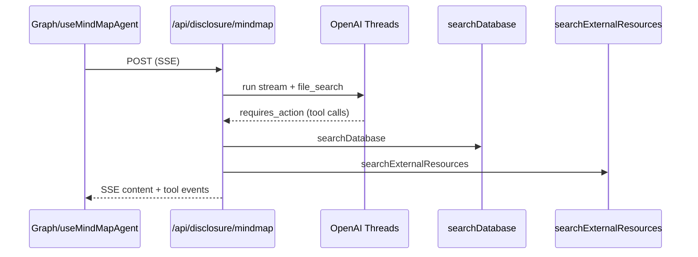
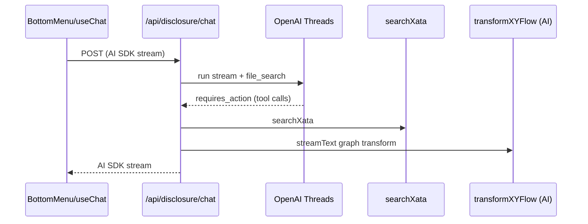
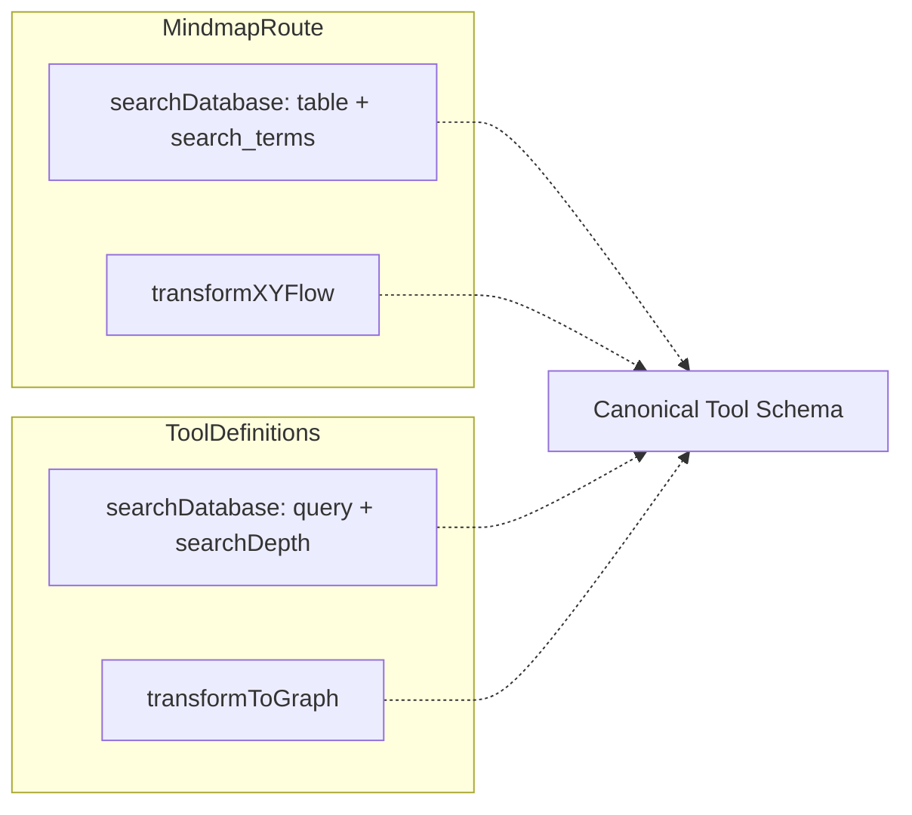
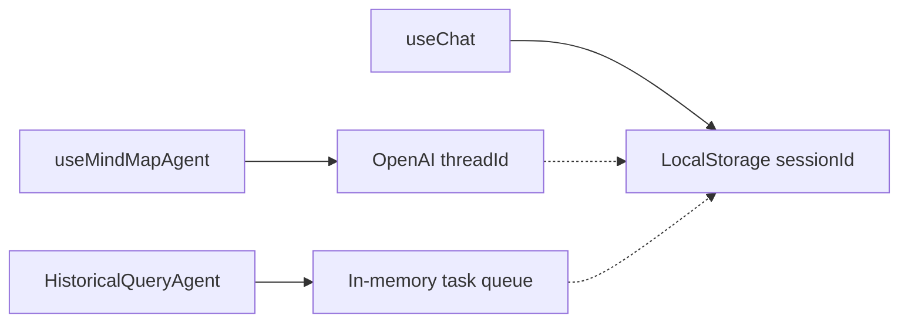
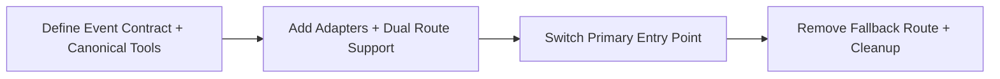

# Architecture Simplification Review - Mindmap Research

**Last Updated**: 2026-01-22 06:01:41 CST
**Scope**: Mindmap research flow, AI orchestration, tools, tours
**Audience**: Architecture review and decision support

---

## Purpose

Capture the current architecture, summarize issues and risks, describe the natural
library-agnostic shape of the system, and present concrete options for
simplification with diagrams.

---

## Summary of Issues (From Review)

- **Multiple entry points** drive separate pipelines: mindmap query hook, bottom menu chat,
  and historical/tour agents. This blocks consolidation and leads to drift.
- **Tool schemas diverge** (`search_terms`/`transformXYFlow` vs `query`/`transformToGraph`),
  creating integration risk and fragile adapters.
- **Streaming contracts differ** (custom SSE parsing vs AI SDK streaming),
  locking UI to different payload shapes.
- **Graph synthesis depends on freeform `analysis` text** which may vanish if tool-first outputs
  become primary; edge reasoning can be lost.
- **State persistence is fragmented** (`threadId`, `sessionId`, and in-memory queues).

---

## Natural, Library-Agnostic Design (Core Functionality)

At its core, the feature is a **research orchestrator for a live graph**.
The most natural implementation is a small, explicit pipeline with an evented runtime.

**Primary contract**: `GraphDelta + Evidence + Rationale`, not raw text.

**Pipeline (idealized)**:
1. **Intent parsing** (expand, summarize, timeline, tour, doc ingest).
2. **Context snapshot** (current graph, selected nodes, session notes).
3. **Retrieval** (database + external sources, with provenance).
4. **Entity/relationship extraction** (structured entities + edge candidates).
5. **Graph synthesis** (dedupe nodes, merge edges, attach rationale).
6. **Event stream** (progress, tool events, graph delta, summary).

**Why this shape is natural**:
- The product’s UX is graph growth, not chat-only output.
- Every entry point can use the same pipeline.
- Failures are localized (retrieval can fail without breaking graph output).

---

## Current Architecture Diagram

```mermaid
flowchart LR
  subgraph UI[Client UI]
    A1[Graph + useMindMapAgent] -->|POST SSE| R1[/api/disclosure/mindmap]
    A2[Bottom Menu useChat] -->|POST AI SDK| R2[/api/disclosure/chat]
    A3[ConnectedRecordsPanel] --> A1
    A4[HistoricalQueryAgent] --> S1[Server Actions]
    A5[Tours Hooks] --> T1[Mock Tool Impl]
  end

  subgraph API[Server/API]
    R1 --> O1[OpenAI Threads + file_search]
    R1 --> D1[searchDatabase]
    R1 --> X1[searchExternalResources]
    R1 --> G1[transformXYFlow]

    R2 --> O2[OpenAI Threads + file_search]
    R2 --> D2[searchXata]
    R2 --> G2[transformXYFlow via AI]
  end

  subgraph Data[Data/State]
    DB[(Xata)]
    VS[(Vector Store)]
    LS[(LocalStorage sessionId)]
    TH[(threadId)]
  end

  D1 --> DB
  D2 --> DB
  O1 --> VS
  O2 --> VS
  A1 --> TH
  A2 --> LS
  A4 --> DB
```

---

## Target Architecture Diagram (Unified, Evented Pipeline)



---

## Options Going Forward (With Diagrams)

### Option A: Single API + Canonical Event Contract (Hard Consolidation)

**Idea**: Move all mindmap research entry points to one API, one tool schema,
one event stream contract. Keep the old route only as a fallback during rollout.



**Pros**: Lowest long-term complexity, simplest mental model.
**Cons**: Higher short-term migration risk.

---

### Option B: Shared Event Adapter + Dual Routes (Soft Migration)

**Idea**: Keep both `/api/disclosure/mindmap` and `/api/disclosure/chat` temporarily,
but normalize outputs to a single event schema using adapters.

```mermaid
flowchart LR
  U1[Graph useMindMapAgent] --> R1[/api/disclosure/mindmap]
  U2[Bottom Menu useChat] --> R2[/api/disclosure/chat]
  R1 --> A1[Event Adapter]
  R2 --> A2[Event Adapter]
  A1 --> Ev[Unified Event Contract]
  A2 --> Ev
  Ev --> UI[Shared UI Consumers]
```

**Pros**: Reduced risk, incremental rollout.
**Cons**: Temporary complexity remains until full consolidation.

---

### Option C: Client Orchestrator + Server Tools (Hybrid)

**Idea**: Client runtime orchestrates the pipeline using a shared tool registry,
calling server endpoints for retrieval/extraction/graph synthesis.

```mermaid
flowchart LR
  UI[Client Orchestrator] --> T1[/search]
  UI --> T2[/external-search]
  UI --> T3[/graph-transform]
  UI --> T4[/historical-context]
  T1 --> DB[(Xata)]
  T2 --> VS[(Vector Store)]
  T3 --> DB
```

**Pros**: Faster UI iteration, more local control over orchestration.
**Cons**: Higher client complexity, weaker server-side observability.

---

## Additional Visuals

### Current Request Sequence (Mindmap Query)



### Current Request Sequence (Bottom Menu Chat)



### Tool Schema Mismatch (Why Adapters Are Needed)



### Session State Fragmentation (Current)



### Rollout Path (Logical Stages)



---

## Recommended Next Steps (Simplification Path)

1. **Define a canonical event schema** (progress, tool events, graph delta, summary).
2. **Introduce adapters** to map the current SSE and AI SDK responses to the schema.
3. **Normalize tool inputs/outputs** into a single registry.
4. **Unify entry points** (Graph + bottom menu) to a single API.
5. **Refactor tours/historical agents** to consume the shared tool registry instead
   of local mocks.

---

## Open Questions

- Should the canonical tool schema follow the current mindmap route or the
  ultraterrestrial tool definitions?
- Must OpenAI thread + file_search be preserved, or can a session/memory store
  replace it?
- Do you want a server-only orchestrator, or a hybrid client orchestrator?
