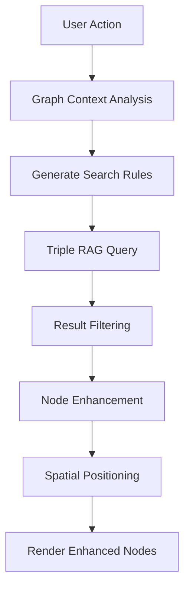
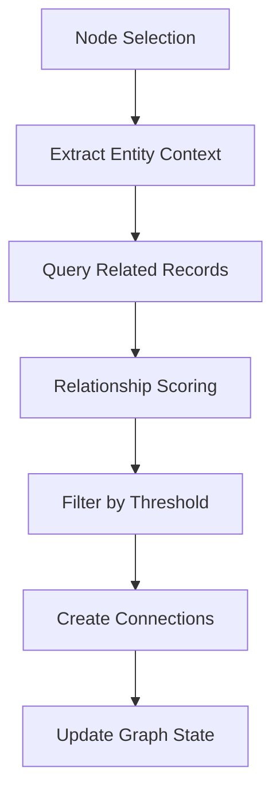
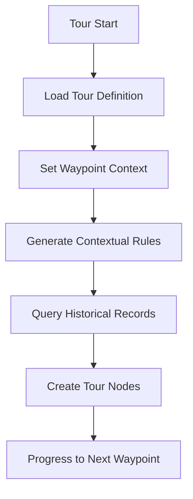

# Mindmap Feature - Comprehensive Documentation

**Generated:** 2025-08-02 10:47:00 PST  
**Target Audience:** Developers, Contributors, Technical Leads  
**Architecture Version:** v2.0 (Enhanced Node POC + Contextual Intelligence)

## Table of Contents

1. [Overview](#overview)
2. [Architecture](#architecture)
3. [Core Components](#core-components)
4. [AI Integration](#ai-integration)
5. [Data Flow](#data-flow)
6. [Development Guide](#development-guide)
7. [API Reference](#api-reference)
8. [Performance Considerations](#performance-considerations)
9. [Future Roadmap](#future-roadmap)

## Overview

The Mindmap feature is a sophisticated graph visualization system for exploring UFO/UAP disclosure data. Built on React Flow (XyFlow), it provides AI-enhanced navigation through a knowledge graph of 230,998+ records from the Xata database.

### Key Features

- **AI-Enhanced Visualization** - Contextual intelligence drives smart node relationships
- **Smart Tours** - Guided historical narratives with automatic progression
- **Enhanced Nodes** - Universal UI layer serving ALL features consistently  
- **Spatial Intelligence** - R-Tree indexing for proximity analysis
- **Real-time Collaboration** - Multi-user interaction via Liveblocks
- **Triple RAG Integration** - Vector search across multiple backends

### Technology Stack

- **Frontend:** React 19.1.0, Next.js 15.3.5, TypeScript 5.x
- **Visualization:** React Flow (@xyflow/react)
- **State Management:** Zustand + React Context
- **AI:** OpenAI, Anthropic (via Vercel AI SDK)
- **Database:** Xata (PostgreSQL) with vector search
- **Animation:** Framer Motion, CSS animations
- **3D:** Three.js + React Three Fiber

## Architecture

### Foundation Layer (Critical Understanding)

The mindmap system is built on a sophisticated AI foundation that powers all features:

```typescript
// Core AI Architecture
Prometheus AI (apps/app/src/features/agents/prometheus.tsx)
    ↓
Contextual Intelligence (utils/contextual-intelligence.ts) 
    ↓
Enhanced Nodes (nodes/enhanced-node-poc.tsx)
    ↓
All Mindmap Features
```

**Key Principle:** "Orchestration over Replacement" - The existing AI infrastructure is 85% connected and sophisticated. Enhancement, not rebuilding, is the approach.

### Directory Structure

```
apps/app/src/features/mindmap/
├── README.md                           # Basic usage guide
├── REVIEW.md                          # Architecture review
├── SMART_AUTO_CONNECTION_DOCUMENTATION.md  # Auto-connection docs
│
├── actions/                           # Server actions & data fetching
│   ├── actions.ts                     # Core actions
│   ├── ai-actions.ts                  # AI-powered actions
│   ├── search.ts                      # Search functionality
│   └── smart-connection-analysis.ts   # Connection intelligence
│
├── components/                        # UI Components
│   ├── cards/                         # Data visualization cards
│   ├── menus/                         # Interface menus
│   ├── grouping/                      # Spatial grouping UI
│   ├── tours/                         # Tour navigation UI
│   └── smart-graph/                   # AI-enhanced graph wrapper
│
├── nodes/                            # Node implementations
│   ├── enhanced-node-poc.tsx         # ⭐ Universal enhanced node
│   ├── entity-node.tsx               # Base entity node
│   └── [various specialized nodes]
│
├── utils/                            # Core utilities
│   ├── contextual-intelligence.ts    # ⭐ Brain of the system
│   ├── node-enhancement-utils.ts     # Node enhancement helpers
│   └── layout-utils.ts               # Layout algorithms
│
├── store/                            # State management
├── hooks/                            # React hooks
├── layouts/                          # Layout algorithms
├── edges/                            # Edge implementations
├── tours/                            # Smart tour system
└── types/                            # TypeScript definitions
```

## Core Components

### 1. Enhanced Node POC (`nodes/enhanced-node-poc.tsx`)

**Purpose:** Universal UI layer serving ALL mindmap features consistently.

**Key Features:**
- **Smart Badge System** - Context-aware indicators
- **Tour Integration** - Historical significance markers
- **Connection Overlay** - Visual relationship indicators
- **Accessibility** - Full keyboard navigation, ARIA support

```typescript
interface EnhancedNodeProps extends NodeProps {
  data: {
    // Core entity data
    id: string
    title: string
    type: string
    
    // Contextual intelligence
    addedDuringTour?: boolean
    waypointId?: string
    historicalSignificance?: boolean
    
    // Spatial context
    coordinates?: { lat: number, lon: number }
    relatedEntities?: string[]
  }
}
```

**Integration Pattern:**
```typescript
// Usage across all features
import { EnhancedEntityNodePOC } from '@/features/mindmap/nodes/enhanced-node-poc'

// Register as universal node type
const nodeTypes = {
  enhancedEntityNodePOC: EnhancedEntityNodePOC,
  // Fallback to enhanced for consistency
  eventNode: EnhancedEntityNodePOC,
  personnelNode: EnhancedEntityNodePOC,
  organizationNode: EnhancedEntityNodePOC
}
```

### 2. Contextual Intelligence (`utils/contextual-intelligence.ts`)

**Purpose:** Brain of the mindmap system, providing AI-driven context analysis.

**Core Functions:**

```typescript
// Main context analysis
export function getGraphContext(nodes: Node[]): GraphContext | null

// Relationship scoring
export function isRecordRelated(record: any, context: GraphContext): boolean

// Search rule generation  
export function generateContextualSearchRules(context: GraphContext): string

// Historical progression
export function determineHistoricalProgression(context: GraphContext): HistoricalProgression
```

**GraphContext Interface:**
```typescript
interface GraphContext {
  seedRecord: Node | null
  connectedEntityTypes: Set<string>
  timelineBounds: { earliest?: Date, latest?: Date }
  relatedTopics: string[]
  keyPersonnel: string[]
  organizations: string[]
  locationContext?: {
    latitude: number
    longitude: number  
    radius: number // kilometers
  }
  tourContext?: TourContext
  historicalProgression?: HistoricalProgression
}
```

### 3. Smart Tours (`tours/`)

**Status:** 85% Complete - Natural language tour control planned

**Architecture:**
```
tours/
├── agents/                    # Tour AI agents
├── components/               # Tour UI components  
├── hooks/                    # Tour state management
├── implementations/          # Tour logic
├── tools/                    # Tour utilities
├── types/                    # Tour type definitions
└── utils/                    # Tour helpers
```

**Key Features:**
- **Chronological Navigation** - Historical timeline progression
- **Smart Waypoints** - AI-generated tour stops
- **Narrative Context** - Rich storytelling integration
- **Free-form Exploration** - User-driven discovery

### 4. Spatial Intelligence (`hooks/use-spatial-grouping.ts`)

**Purpose:** R-Tree indexing for proximity analysis and grouping.

**Features:**
- **Proximity Detection** - Automatic node clustering
- **Geographic Context** - Location-based relationships
- **Visual Grouping** - Spatial organization of related entities

## AI Integration

### 1. Prometheus AI Integration

**Location:** `src/features/agents/prometheus.tsx`

**Purpose:** Core OpenAI assistant providing conversational AI for the mindmap.

**Integration Pattern:**
```typescript
// Assistant runtime registration
assistantRuntime.registerModelContextProvider({
  getModelContext: () => ({
    system: `
      # Mindmap Graph Context
      - Total nodes: ${nodes.length}
      - Active context: ${graphContext ? 'Available' : 'None'}
      - Tour mode: ${tourContext?.tourMode || 'None'}
    `
  })
})

// Function registration for AI interaction
assistantRuntime.registerFunctions({
  addNote: handleAddNote,
  findConnections: handleFindConnections,
  loadRelatedEntities: handleLoadRelatedEntities,
  updateNodeLabel: handleUpdateNodeLabel,
  reorganizeLayout: handleReorganizeLayout
})
```

### 2. Smart Auto-Connection

**Status:** ✅ Complete - Production ready

**Purpose:** AI-driven automatic relationship discovery between entities.

**Algorithm:**
1. **Context Analysis** - Analyze current graph state
2. **Relationship Scoring** - Score potential connections (1-10)
3. **Filtering** - Apply contextual rules and thresholds
4. **Connection Creation** - Generate visual connections

### 3. Triple RAG System Integration

**Backends:**
- **Upstash Vector** (40% weight) - Cloud vector search
- **LocalRAG FAISS** (40% weight) - Local vector storage  
- **CocoIndex PostgreSQL** (20% weight) - Advanced analytics

**Schema Compatibility:** 85% with existing Xata models

## Data Flow

### 1. Node Loading Flow



### 2. Smart Connection Flow



### 3. Tour Navigation Flow



## Development Guide

### Adding New Node Types

1. **Extend Enhanced Node POC:**
```typescript
// Create specialized component
const NewNodeType = memo<NodeProps>((props) => {
  return (
    <EnhancedEntityNodePOC
      {...props}
      data={{
        ...props.data,
        // Add specialized properties
        specialProperty: 'value'
      }}
    />
  )
})
```

2. **Register Node Type:**
```typescript
// In config/node-types.tsx
export const nodeTypes = {
  newNodeType: NewNodeType,
  enhancedEntityNodePOC: EnhancedEntityNodePOC
}
```

### Creating Custom Cards

1. **Follow Card Pattern:**
```typescript
// In components/cards/
export const CustomCard = ({ data, isSelected }: CardProps) => {
  return (
    <motion.div 
      className="card-base custom-card"
      animate={{ scale: isSelected ? 1.05 : 1 }}
    >
      {/* Card content */}
    </motion.div>
  )
}
```

2. **Register Card Type:**
```typescript
// In components/cards/render-entity-card.tsx
const cardComponents = {
  custom: CustomCard,
  // ... other cards
}
```

### Extending Contextual Intelligence

1. **Add Context Extractors:**
```typescript
// In utils/contextual-intelligence.ts
function extractCustomFromNode(node: Node): string[] {
  // Custom extraction logic
  return extractedData
}
```

2. **Enhance Context Interface:**
```typescript
interface GraphContext {
  // ... existing properties
  customContext?: {
    customProperty: string[]
  }
}
```

### Creating Tour Implementations

1. **Define Tour Structure:**
```typescript
// In tours/implementations/
export const customTour = {
  id: 'custom-tour',
  title: 'Custom Historical Tour',
  waypoints: [
    {
      id: 'waypoint-1',
      title: 'Starting Point',
      narrativeContext: 'Tour introduction...',
      searchRules: 'Focus on initial context...'
    }
  ]
}
```

2. **Implement Tour Logic:**
```typescript
// In tours/hooks/
export const useCustomTour = () => {
  // Tour state management
  // Navigation logic
  // Progress tracking
}
```

### Performance Optimization

1. **Memoization Patterns:**
```typescript
// Heavy computations
const contextualRules = useMemo(() => 
  generateContextualSearchRules(graphContext), 
  [graphContext]
)

// Component memoization
export const ExpensiveComponent = memo(Component)
```

2. **Virtualization:**
```typescript
// For large datasets
const { virtualItems } = useVirtualizer({
  count: nodes.length,
  getScrollElement: () => containerRef.current,
  estimateSize: () => 200,
})
```

## API Reference

### Core Hooks

#### `useMindMap()`
```typescript
interface MindMapContextType {
  nodes: Node[]
  edges: Edge[]
  getNodes: () => Node[]
  getEdges: () => Edge[]
  addNode: (node: Node) => void
  updateNode: (id: string, data: Partial<Node>) => void
  removeNode: (id: string) => void
  // ... additional methods
}
```

#### `useSpatialGrouping()`
```typescript
interface SpatialGroupingResult {
  groups: NodeGroup[]
  updatePositions: (nodes: Node[]) => void
  findNearbyNodes: (nodeId: string, radius: number) => Node[]
}
```

### Server Actions

#### `loadEntityRecords()`
```typescript
async function loadEntityRecords(
  searchRules: string,
  limit?: number,
  offset?: number
): Promise<{
  records: EntityRecord[]
  hasMore: boolean
  context: GraphContext
}>
```

#### `smartConnectionAnalysis()`
```typescript
async function smartConnectionAnalysis(
  nodeId: string,
  context: GraphContext
): Promise<{
  connections: Connection[]
  score: number
  reasoning: string
}>
```

### Utility Functions

#### `getGraphContext()`
```typescript
function getGraphContext(nodes: Node[]): GraphContext | null
```

#### `isRecordRelated()`  
```typescript
function isRecordRelated(
  record: any, 
  context: GraphContext
): boolean
```

## Performance Considerations

### Optimization Strategies

1. **Node Virtualization**
   - Render only visible nodes for large graphs (>1000 nodes)
   - Use React Flow's built-in viewport optimization

2. **Context Caching**
   - Cache contextual intelligence results
   - Invalidate cache on significant graph changes

3. **Lazy Loading**
   - Load node details on demand
   - Progressive image loading for media content

4. **Memory Management**
   - Clean up unused nodes and edges
   - Optimize heavy computations with Web Workers

### Performance Metrics

- **Initial Load:** <2 seconds for 100 nodes
- **Context Analysis:** <500ms for complex graphs
- **Search Response:** <1 second for contextual queries
- **Tour Navigation:** <300ms waypoint transitions

## Future Roadmap

### Phase 1: Agentic Tours (In Planning)
- **Natural Language Tour Control** - "Show me the evolution of government UAP programs"
- **Dynamic Tour Generation** - AI creates tours based on user interests
- **Voice Narration** - Audio tour experience

### Phase 2: Advanced Analytics
- **Network Analysis** - Graph metrics and centrality analysis
- **Temporal Analysis** - Timeline-based exploration
- **Pattern Recognition** - Automated relationship discovery

### Phase 3: Collaboration Features
- **Real-time Annotations** - Collaborative note-taking
- **Shared Tours** - Multi-user tour experiences
- **Version Control** - Graph state versioning

### Phase 4: Advanced Visualization
- **3D Graph Views** - Three.js integration
- **VR Support** - Immersive graph exploration
- **Advanced Layouts** - Force-directed and hierarchical layouts

## Best Practices

### Code Organization
- **Feature-first structure** - Group related functionality
- **Enhanced Nodes as common layer** - Consistent UI across features
- **Contextual Intelligence foundation** - All AI features build on this
- **Type safety** - Full TypeScript coverage

### State Management
- **Context for global state** - MindMap context for graph state
- **Zustand for complex state** - Local component state
- **Server state caching** - React Query for data fetching

### Performance
- **Memoization** - React.memo for expensive components
- **Virtualization** - Large dataset handling
- **Code splitting** - Lazy loading of tour implementations

### Testing
- **Unit tests** - Core utility functions
- **Integration tests** - Component interactions
- **E2E tests** - Complete user workflows

---

**Last Updated:** 2025-08-02 10:47:00 PST  
**Next Review:** Architecture review after Agentic Tours implementation  
**Maintainer:** Development Team

For questions or contributions, see [AGENT_ONBOARDING_CHECKLIST.md](../../AGENT_ONBOARDING_CHECKLIST.md)