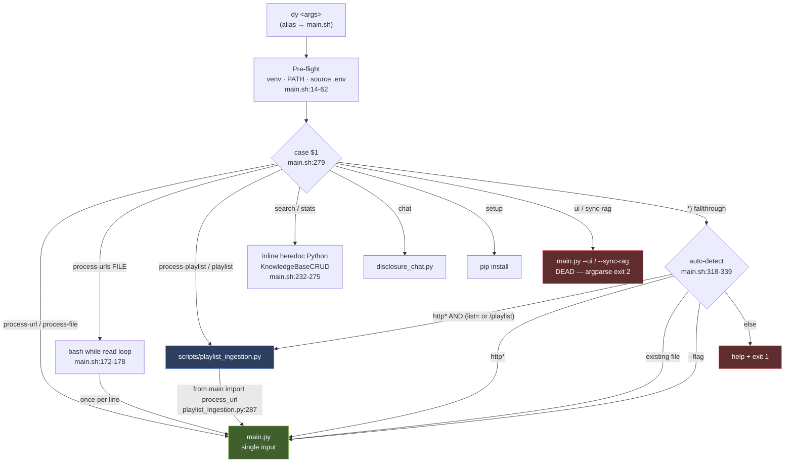
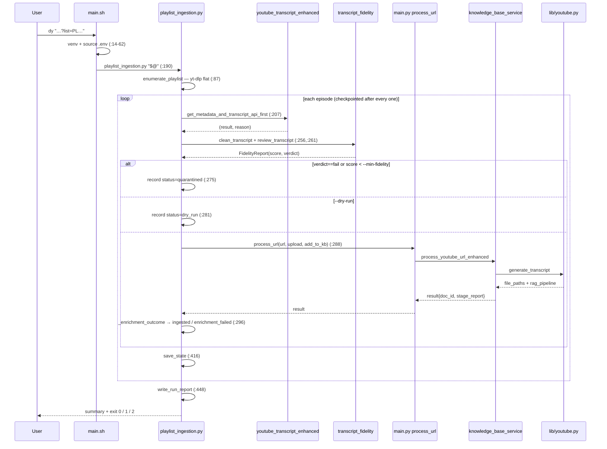

# `dy` — Call Chain Explainer

**What this documents:** every code path reached when the shell command `dy` is run, across
[`apps/disclosure-rag/main.sh`](apps/disclosure-rag/main.sh), [`apps/disclosure-rag/main.py`](apps/disclosure-rag/main.py), and [`apps/disclosure-rag/scripts/playlist_ingestion.py`](apps/disclosure-rag/scripts/playlist_ingestion.py).

**KB layers** (service vs CRUD vs vector store): [`apps/disclosure-rag/docs/KNOWLEDGE_BASE_LAYERS.md`](apps/disclosure-rag/docs/KNOWLEDGE_BASE_LAYERS.md).

**Written:** 2026-08-08 · **Lane:** A — Corpus & Ingestion · **Method:** static trace. No `dy`
invocation was executed (it ingests, writes the KB, uploads to OpenAI, POSTs to QStash, and
`shutil.move`s files out of `processing_queue`). Every arrow below is anchored to `file:line`.

---

## 0. `dy` is a machine-local alias

```
~/.zshrc:135
alias dy='/Users/liamellis/Desktop/apps/ultraterrestrial-resurrection/apps/disclosure-rag/main.sh'
```

It is **not** in the repo. `dy <args>` is exactly `apps/disclosure-rag/main.sh <args>`. On any other
machine, substitute `./main.sh`. Everything below applies identically to both.

---

## 1. The single most important structural fact

The directive frames `main.py` and `playlist_ingestion.py` as two chains. They are **one chain with a
fan-out wrapper**. `playlist_ingestion.py` sits *above* `main.py`, not beside it:

```
playlist_ingestion.py:287    from main import process_url
playlist_ingestion.py:288    result = process_url(url, upload=args.upload, add_to_kb=not args.no_kb)
```

Every playlist episode re-enters the same `main.process_url()` that a bare `dy <video-url>` calls
directly. The difference is only **depth of entry**, chosen by a substring test in bash.

The citation that this nesting is deliberate is `main.py:86–93`:

> *"Idempotent so it's safe to call from `main()`, `process_url()`, and `process_file()` alike — the
> latter two are also imported directly by `scripts/playlist_ingestion.py` (`from main import
> process_url`), which never calls `main()` and would otherwise hit NameError on these globals."*

`_import_heavy_dependencies()` (`main.py:86`) is the mechanical seam that makes the nesting work:
`playlist_ingestion.py` skips `main()` entirely, so `process_url()` must bootstrap its own globals.

---

## 2. Pre-flight — runs on *every* `dy`, before any dispatch

| Step | Lines | Behaviour |
| --- | --- | --- |
| Resolve script dir | `main.sh:14` | `SCRIPT_DIR` via `BASH_SOURCE` |
| Require `python3` | `main.sh:17–20` | hard exit 1 if absent |
| Bootstrap venv if missing | `main.sh:26–35` | creates `.venv`, upgrades pip, installs `requirements.txt` |
| Export venv, **not** `activate` | `main.sh:37–41` | `export VIRTUAL_ENV` + `PATH` prepend |
| Load `.env` | `main.sh:44–53` | `set -a; source .env; set +a` — auto-exports every var |
| Soft credential warnings | `main.sh:56–62` | warns on empty `OPENAI_API_KEY`, `UFO_DATA_STORE_ID`; does **not** exit |

**Design note worth preserving** (`main.sh:37–39`): `.venv/bin/activate` is deliberately *not*
sourced. The repo has been moved before and `activate` hard-codes absolute paths; every Python call
is routed through `$VENV_PYTHON` directly so shell aliases / conda cannot hijack execution.

---

## 3. Dispatch table — where each `dy <arg>` lands

Dispatch is the `case "$1"` at `main.sh:279–339`.

| `dy` invocation | Branch | Lands in |
| --- | --- | --- |
| *(no args)* | `*)` — all tests fail | `show_help` + **exit 1** (`main.sh:335–337`) |
| `setup` | `main.sh:280` | pip install loop (`main.sh:102–115`) |
| `process-url <url>` | `main.sh:283` | `main.py <url>` (`main.sh:129`) |
| `process-file <path>` | `main.sh:287` | `main.py <path>` (`main.sh:149`) |
| `process-urls <file>` | `main.sh:291` | bash `while read` → **`main.py` once per line** (`main.sh:172–178`) |
| `process-playlist` \| `playlist <url>` | `main.sh:295` | `scripts/playlist_ingestion.py` (`main.sh:190`) |
| `ui` | `main.sh:299` | `main.py --ui` → **DEAD**, see §10 |
| `chat` | `main.sh:302` | `disclosure_chat.py` (file exists; else falls back to `launch_ui`) |
| `sync-rag` | `main.sh:305` | `main.py --sync-rag` → **DEAD**, see §10 |
| `search <query>` | `main.sh:308` | inline heredoc Python — **never touches `main.py`** (`main.sh:232–248`) |
| `stats` | `main.sh:312` | inline heredoc Python — **never touches `main.py`** (`main.sh:255–275`) |
| `--help` \| `help` | `main.sh:315` | `show_help` |
| bare `http*` **and** (`list=` or `/playlist`) | `main.sh:320` | `playlist_ingestion.py` |
| bare `http*` | `main.sh:325` | `main.py <url>` |
| bare existing file | `main.sh:328` | `main.py <path>` |
| bare `--*` | `main.sh:331` | `main.py` (legacy flag passthrough) |
| anything else | `main.sh:334` | error + help + **exit 1** |

### The fork that matters

`main.sh:320` is the whole reason the two Python entry points exist as separate depths:

```bash
if [[ "$1" == http* && ( "$1" == *"/playlist"* || "$1" == *"list="* ) ]]; then
```

Its own comment (`main.sh:321–322`) states why: *"Playlist URLs would be treated as a single
(id-less) video by `main.py` — route them to the playlist pipeline instead."*

---

## 4. Diagram 1 — the router



---

## 5. Depth A — `main.py`, one input per invocation

Reached by `dy <url>`, `dy <file>`, `dy process-url …`, `dy process-file …`, each line of
`dy process-urls …`, and **each episode of a playlist run**.

### 5.1 `main()` — `main.py:960–1121`

| Order | Step | Lines |
| --- | --- | --- |
| 1 | `argparse` — accepts only `input`, `--upload`, `--no-kb`, `--status`, `--dry-run` | `main.py:962–976` |
| 2 | `_import_heavy_dependencies()` — deferred so `--help`/bad args cost nothing (`main.py:975`) | `main.py:978` |
| 3 | `display.print_header()` | `main.py:981` |
| 4 | `--status` → integration report, then `return` | `main.py:983–1052` |
| 5 | missing input → help + **exit 1** | `main.py:1055–1058` |
| 6 | `_validate_credentials(require_upload=args.upload)` | `main.py:1064` |
| 7 | `--dry-run` → print plan from `_build_dry_run_plan()`, then `return` (**genuinely inert**) | `main.py:1066–1072` |
| 8 | hard credential errors → **exit 1** | `main.py:1074–1078` |
| 9 | route: `http(s)://` → `process_url()`, else → `process_file()` | `main.py:1082–1088` |
| 10 | `None` result → `❌ Processing failed!` + **exit 1** | `main.py:1090–1092` |
| 11 | banner + `_print_stage_report()`; any `failed` stage → **exit 1** | `main.py:1101–1120` |

`_validate_credentials` (`main.py:838`) does presence/shape checks only and never logs key material.
Missing `OPENAI_API_KEY` is a **hard error** (`main.py:851–855`); a malformed-looking key is only a
warning, because a *revoked but well-formed* key is undetectable without an API call
(`main.py:856–861`).

### 5.2 `process_url()` — `main.py:312–431`

```
process_url(url, upload, add_to_kb)
├─ _import_heavy_dependencies()                                  main.py:314
├─ is_youtube_url(url)  ← hostname parse, NOT substring          main.py:154-166
├─ try:
│    youtube → process_youtube_url_enhanced(url, upload, add_to_kb)   main.py:331
│    else    → process_web_url_enhanced(url, upload, add_to_kb)       main.py:333
│  except → stage(extraction, failed) and return {stage_report}       main.py:334-337
├─ [web only] mem0 add_web_article_memory                        main.py:345-357
├─ [YouTube only] trigger_cocoindex_processing(doc_id)           main.py:365-411
│    └─ + mem0 add_knowledge_graph_memory                        main.py:383-393
├─ mem0 add_processing_summary_memory                            main.py:415-428
└─ result['stage_report'] = stages ; return result               main.py:430-431
```

**The CocoIndex asymmetry** — the knowledge-graph pass at `main.py:365` is gated on `and youtube`.
Comment at `main.py:360–364`: `process_web_with_enhanced_workflow()` already runs CocoIndex
internally (`knowledge_base_service.py:~735–785`), so triggering it here for web results ran a
second, global `cocoindex update` on every web ingestion. **The two branches of `process_url` emit
different stage lists.** This is the single most commonly misread part of the chain.

`is_youtube_url` (`main.py:154`) parses the hostname rather than substring-matching, so
`https://evil.com/?x=youtube.com/watch` is correctly rejected.

### 5.3 Into `lib/` — the YouTube branch

```
process_youtube_url_enhanced()                 lib/kb/knowledge_base_service.py:1135
└─ KnowledgeBaseService.process_youtube_with_enhanced_workflow()   :303-508
   ├─ generate_transcript(url)                 lib/youtube.py:200      (:310 in workflow)
   │   ├─ get_video_info_and_transcript(url)   lib/youtube.py:132
   │   ├─ analyzer.analyze_content(transcript)          ← OpenAI
   │   ├─ analyzer.process_for_rag(...)                 ← classification → chunk → NER → validate
   │   ├─ write_transcript_to_file() ×2 (transcript + summary)   lib/youtube.py:157
   │   ├─ write <name>_rag_pipeline.json
   │   └─ mem0 add_youtube_summary_memory
   ├─ upload_file_to_openai(file_path)         [--upload only]         :413
   ├─ add_processed_content_to_queue(...)      QStash → vector upload   :444
   ├─ self.add_youtube_to_knowledge_base(data, file_paths)              :464 → :71
   └─ search_syncer.sync_document_to_search(doc)                        :486
```

### 5.4 `process_file()` — `main.py:434–835`

Reached by `dy <path>` / `dy process-file`. Never reached from a playlist run.

| Stage | Lines |
| --- | --- |
| PDF text extraction (`PyPDF2`) or UTF-8 read | `main.py:452–467` |
| Title from filename, or first `#` heading for `.md` | `main.py:470–476` |
| `ContentAnalysisEngine().process_for_rag(...)` → writes `<stem>_rag_pipeline.json` | `main.py:498–518` |
| `upload_file_to_openai` + QStash enqueue *(PDF → temp UTF-8 file, then unlinked)* | `main.py:541–587` |
| `add_to_knowledge_base(data, doc_type)` — `research` for PDF, else `case_file` | `main.py:591–606` |
| mem0 `add_file_content_memory` | `main.py:609–620` |
| `process_summary_file_interactive(..., interactive=False)` — entity extraction (Xata match path is dead) | `main.py:623–712` |
| `trigger_cocoindex_processing(doc_id)` — knowledge graph | `main.py:715–764` |
| **File relocation**: `processing_queue/` → `packages/knowledge-base/sources/files/` | `main.py:766–801` |
| mem0 `add_processing_summary_memory` | `main.py:803–817` |

Relocation containment is checked on the **resolved** path and the move operates on the resolved
path too (`main.py:766–772`) — moving the raw argument would relocate a symlink instead of the
queued file.

---

## 6. Diagram 2 — one input through `main.py` (the CocoIndex asymmetry made visible)

```mermaid
flowchart TD
    E["main.py main&#40;&#41;<br/>main.py:960"] --> V{"input starts with http?<br/>main.py:1082"}
    V -->|no| PF["process_file&#40;&#41;<br/>main.py:434"]
    V -->|yes| PU["process_url&#40;&#41;<br/>main.py:312"]

    PU --> YT{"is_youtube_url&#40;&#41;<br/>hostname parse<br/>main.py:154"}

    YT -->|YouTube| Y1["process_youtube_url_enhanced<br/>knowledge_base_service.py:1135"]
    Y1 --> Y2["generate_transcript<br/>lib/youtube.py:200"]
    Y2 --> Y3["analyze_content + process_for_rag<br/>OpenAI"]
    Y3 --> Y4["write transcript / summary / rag_pipeline.json"]
    Y4 --> Y5["upload_file_to_openai<br/>--upload only"]
    Y5 --> Y6["QStash enqueue + vector upload"]
    Y6 --> Y7["add_youtube_to_knowledge_base<br/>:71"]
    Y7 --> Y8["search_syncer.sync_document_to_search"]
    Y8 --> KG["trigger_cocoindex_processing<br/>main.py:365 — GATED ON youtube"]

    YT -->|web| W1["process_web_url_enhanced<br/>knowledge_base_service.py:1140"]
    W1 --> W2["web extraction + AI summary + KB write"]
    W2 --> W3["CocoIndex runs INTERNALLY here<br/>knowledge_base_service.py ~735-785"]
    W3 --> WM["mem0 add_web_article_memory<br/>main.py:345"]

    PF --> F1["PDF/UTF-8 read → process_for_rag<br/>main.py:452-518"]
    F1 --> F2["upload + QStash<br/>main.py:541-587"]
    F2 --> F3["add_to_knowledge_base<br/>main.py:599"]
    F3 --> F4["entity extraction<br/>main.py:651"]
    F4 --> F5["trigger_cocoindex_processing<br/>main.py:721"]
    F5 --> F6["relocate processing_queue → knowledge-base/sources/files<br/>main.py:787"]

    KG --> SR["stage_report attached<br/>main.py:430"]
    WM --> SR
    F6 --> SR
    SR --> OUT{"any stage failed?<br/>main.py:1102"}
    OUT -->|yes| X1["'completed with failures' + exit 1"]
    OUT -->|no| X0["'Processing complete!' + exit 0"]

    style KG fill:#4a3a1f,stroke:#e0af68,color:#fff
    style W3 fill:#4a3a1f,stroke:#e0af68,color:#fff
    style X1 fill:#5f2d2d,stroke:#f7768e,color:#fff
```



The two amber nodes are the same capability reached two different ways — that is the asymmetry.

---

## 7. Depth B — `scripts/playlist_ingestion.py`, the fan-out wrapper

Reached by `dy process-playlist <url>`, `dy playlist <url>`, or a bare URL containing `list=` /
`/playlist`. All args pass through untouched (`main.sh:190`).

### 7.1 Its own CLI — `playlist_ingestion.py:351–367`

`playlists` (nargs `*`), `--from-file`, `--upload`, `--no-kb`, `--limit`, `--force`, `--dry-run`,
`--min-fidelity` (default `0.45`), `--llm-review`, `--delay` (default `2.0`), `--state-file`.

### 7.2 Per-playlist loop — `playlist_ingestion.py:388–446`

```
for playlist_url in urls:                                          :388
  enumerate_playlist(url)                                          :87
    ├─ yt_dlp flat extraction (extract_flat="in_playlist")          :95-113
    │    NOTE process=False must NOT be used — it returns an
    │    unresolved stub whose PLAYLIST id gets mistaken for a
    │    video id (:107-112)
    ├─ is_video_id() guard — exactly 11 chars [A-Za-z0-9_-]         :80-84
    └─ fallback: pytube Playlist                                    :143-153
  for video in videos:                                             :401
    ├─ skip if state[status] in DONE_STATUSES and not --force      :404
    ├─ stop if --limit reached                                     :408
    ├─ process_episode(...)                                        :413 → :241
    ├─ save_state() after EVERY episode  ← checkpoint              :416
    ├─ blocked-breaker bookkeeping                                 :427-442
    └─ time.sleep(--delay)                                         :444
write_run_report(runs, counts, reports_dir)                        :448 → :325
```

### 7.3 `process_episode()` — `playlist_ingestion.py:241–320`

| Step | Call | Lines |
| --- | --- | --- |
| 1 | `fetch_transcript(url)` → `get_metadata_and_transcript_api_first` (`lib/youtube_transcript_enhanced.py:433`) | `:199–213` |
| 2 | on failure → `REASON_STATUS` map → `blocked` / `unavailable` / `no_transcript` | `:250–253` |
| 3 | `clean_transcript(raw)` (`lib/transcript_fidelity.py:48`) → write `transcripts/<vid>.txt` | `:256–259` |
| 4 | `review_transcript(...)` (`lib/transcript_fidelity.py:175`), optional LLM pass via `--llm-review` → write `reports/<vid>.fidelity.json` | `:261–270` |
| 5 | **quality gate**: `verdict == "fail"` or `score < --min-fidelity` → `quarantined` | `:274–278` |
| 6 | `--dry-run` → record `dry_run`, return | `:280–283` |
| 7 | **`from main import process_url`** → full pipeline for this episode | `:287–288` |
| 8 | `_enrichment_outcome(result)` → `enrichment_failed` unless `ok`/`unknown` | `:296–308` |
| 9 | success → `ingested` with `doc_id` + `rag_status` | `:309–312` |

### 7.4 Episode state machine

`ingested` · `quarantined` · `unavailable` · `blocked` · `no_transcript` · `dry_run` ·
`enrichment_failed` · `failed` · `skipped` · `enumeration_failed`

`DONE_STATUSES = {"ingested", "quarantined", "unavailable"}` (`:57`) are terminal without `--force`.
`unavailable` is terminal by design (`:54–56`): a private/deleted video does not come back, and
re-listing it spends a request against the same quota that gets the IP blocked.

`record()` (`:184`) clears `_OUTCOME_KEYS` before every write (`:181`) so a later failed attempt
cannot inherit an earlier success's `fidelity`/`doc_id` — a `no_transcript` retry was previously
leaving a prior run's `doc_id` in place, reading as though a fetch that never happened had produced
a document.

### 7.5 The IP-block circuit breaker — `playlist_ingestion.py:422–442`

`BLOCKED_ABORT_THRESHOLD` (env `YT_BLOCKED_ABORT_THRESHOLD`, default `3`). Only `blocked` increments
the counter; only a status *other than* `blocked` **and** `unavailable` resets it. The comment at
`:422–426` is the reason: a private video fails before any transcript request, so treating it as
evidence that egress works would let a playlist with private episodes sprinkled through it reset the
breaker forever while every real fetch fails. On trip, the run aborts with a remedy message
(proxy rotation vs. `YT_WEBSHARE_PROXY_*`) and **exit 2**.

---

## 8. Diagram 3 — playlist fan-out and its re-entry into `main.py`



---

## 9. How status travels — the load-bearing part

This repo's Definition of Done is about honest reporting, and the `dy` chain implements that in
code. Status is not decoration; it is the payload that crosses the `main.py` ↔ `playlist_ingestion.py`
boundary.

```
main.py stage helpers                              main.py:219-234
  _stage(name, ok, detail)      → success | failed
  _skipped(name, reason)        → skipped
  _unknown(name, reason)        → unknown   ← used when an upstream dict's
                                              shape isn't recognized, rather
                                              than guessing ✅
        │
        ├─ _summarize_queue_result()               main.py:262-285
        │    reconciles TWO disagreeing shapes: the real
        │    lib/upstash/queue.py returns {"qstash_response":…} with no
        │    top-level "success"; the not-configured fallback returns
        │    {"success": False, "skipped": True}. A naive .get('success')
        │    is falsy for a SUCCESSFUL real call.
        ├─ _call_mem0()                            main.py:237-259
        │    checks _is_enabled() first so "skipped, not configured" is
        │    distinguishable from "attempted"
        ▼
result['stage_report'] = [ {name,status,detail}, … ]      main.py:430 / :819
        │
        ├── consumed by main() ────────────────────────────► banner + exit code
        │     failed_stages = [s for s if status=='failed']  main.py:1102
        │     "⚠️ completed with failures" + sys.exit(1)     main.py:1104,1119
        │
        └── consumed by playlist_ingestion._enrichment_outcome()   :216-238
              searches THREE containers for rag_pipeline.status
                  result / result['metadata'] / result['file_metadata']
              then falls back to scanning stage_report for
                  "RAG prompt pipeline"  (success→ok, failed→error)
              returns "unknown" when no signal exists — reporting
              `ingested` on absence is precisely how a run whose
              enrichment had 401'd got recorded as successful (:224-227)
                          │
                          ▼
              rag_status not in ("ok","unknown") → status=enrichment_failed  :297
```

**Why `unknown` exists at both ends:** a `doc_id` only proves the transcript was stored. LLM
enrichment (classification, NER, embeddable texts) fails independently — and did, silently, for a
whole run when `OPENAI_API_KEY` was revoked (`playlist_ingestion.py:290–295`). Both files refuse to
print ✅ for a stage they have no positive evidence for.

Note the same principle inside `main.py`: RAG pipeline `status` is `ok | hold | rejected | error`
and only `ok` prints ✅ (`main.py:520–535`); entity extraction `status` is
`completed | no_entities | error`, and `no_entities` is deliberately *not* a success because an
invalid OpenAI key surfaces there as `no_entities` rather than as an exception
(`main.py:657–680`).

---

## 10. Dead and half-dead branches (verified, not inferred)

| Branch | Status | Evidence |
| --- | --- | --- |
| `dy ui` → `main.py --ui` (`main.sh:197`) | **DEAD** | `main.py` argparse defines no `--ui` (`main.py:962–973`). `.venv/bin/python main.py --ui` → `error: unrecognized arguments: --ui`, **exit 2** |
| `dy sync-rag` → `main.py --sync-rag` (`main.sh:216`) | **DEAD** | same; `error: unrecognized arguments: --sync-rag`, **exit 2** |
| `dy chat` fallback → `launch_ui` (`main.sh:208–209`) | dead *fallback* | only reached if `disclosure_chat.py` is missing; it exists today, so the live path is fine |
| `dy search "…"` | fragile | the query is string-interpolated into heredoc Python source (`main.sh:238`), so a `"` or newline in the query breaks the generated script |

`argparse` exits before `_import_heavy_dependencies()` (`main.py:975`), which is why these two
failures are instant and cost nothing — and why they were easy to miss.

---

## 11. Exit codes

| Code | From | Meaning |
| --- | --- | --- |
| `1` | `main.sh:19` | `python3` not on PATH |
| `1` | `main.sh:337` | unknown command |
| `1` | `main.sh:125/139/145/160/166/187` | required argument missing / file not found |
| `1` | `main.py:1058` | no input and no `--status` |
| `1` | `main.py:1078` | hard credential error (`OPENAI_API_KEY` unset) |
| `1` | `main.py:1092` | pipeline returned `None` |
| `1` | `main.py:1120` | at least one stage reported `failed` |
| `2` | argparse | unrecognized flag (see §10) |
| `0` | `playlist_ingestion.py:453` | run finished, no `failed` episodes |
| `1` | `playlist_ingestion.py:453` | run finished with ≥1 `failed` episode |
| `2` | `playlist_ingestion.py:452` | aborted by the IP-block breaker |

`dy process-urls` is the exception: the bash `while` loop (`main.sh:172–178`) does not check per-URL
exit status, so the command's overall status is that of the **last** URL only.

---

## 12. Traps

1. **`--dry-run` is safe in `main.py` and NOT safe in `playlist_ingestion.py`.**
   `main.py` returns at `:1072` before touching anything. `playlist_ingestion.py` checks
   `args.dry_run` at `:280` — *after* `fetch_transcript()` (`:249`) and `review_transcript()`
   (`:261`). A playlist dry run therefore hits YouTube, writes `transcripts/<vid>.txt` and
   `reports/<vid>.fidelity.json`, can burn quota, and can trip the IP block.
2. **`dy <playlist-url>` and `dy process-url <playlist-url>` do different things.** The explicit
   `process-url` subcommand bypasses the `list=` auto-detect at `main.sh:320` and hands the playlist
   URL straight to `main.py`, which treats it as one id-less video.
3. **A green `ingested` needs two signals, not one.** `doc_id` plus `rag_status == "ok"`. A row with
   `rag_status: unknown` in the run report is *not* a confirmed enrichment (`:305–308`).
4. **`dy` is machine-local.** On another machine use `./main.sh` from `apps/disclosure-rag/`.
5. **Every `dy` sources `.env` with `set -a`** (`main.sh:45–47`), so everything in that file becomes
   an exported environment variable for the Python process — including `YT_BLOCKED_ABORT_THRESHOLD`
   and the `YT_WEBSHARE_PROXY_*` credentials the breaker's remedy message refers to.

---

## 13. Evidence

| Claim | Command | Output |
| --- | --- | --- |
| `dy` is a zsh alias to `main.sh` | `grep -n "\bdy\b" ~/.zshrc` | `135:alias dy='…/apps/disclosure-rag/main.sh'` |
| `main.py --ui` is dead | `.venv/bin/python main.py --ui; echo $?` | `main.py: error: unrecognized arguments: --ui` / `2` |
| `main.py --sync-rag` is dead | `.venv/bin/python main.py --sync-rag; echo $?` | `main.py: error: unrecognized arguments: --sync-rag` / `2` |
| File sizes traced | `wc -l main.py scripts/playlist_ingestion.py` | `1124` / `457` |

**Not done:** no `dy` run was executed end-to-end, so no runtime trace confirms the deeper
`lib/kb/knowledge_base_service.py` → `lib/youtube.py` arrows — those are read from source. The
`--ui`/`--sync-rag` findings above are the only claims here backed by execution. Diagrams were
authored but not visually reviewed in a renderer; treat their layout (not their content, which is
line-anchored) as **UNVERIFIED**.
