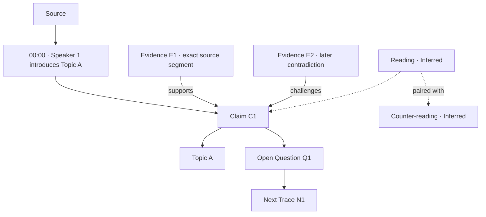

# Trace Map Output Specification

**Status:** Implemented, deterministic subset  
**Written:** 2026-08-08 21:39:59 CDT  
**Implemented:** 2026-08-10  
**Scope:** Add a source-bounded visual reasoning artifact to the `dy` processing chain.

**Implementation status:** Implemented in `apps/disclosure-rag/lib/trace_map.py`, wired into
both ingest paths (`lib/youtube.py:generate_transcript` for URLs, `main.py:process_file` for
documents) and graded as a `Trace map` stage in the run summary. Tests:
`apps/disclosure-rag/tests/test_trace_map.py`.

The build is **deterministic** — it projects artifacts the RAG prompt pipeline already produces
and aligns them against the timed transcript sidecar. No LLM call is made. Consequently the
interpretive node types below (`reading`, `counter_reading`, `next_trace`) and `speaker` are
**not produced**; nothing in the current chain emits them. `validate_trace_map()` reports their
absence as *gaps* rather than errors, because a map that fabricated them to satisfy a gate would
defeat the artifact's purpose. See "Validation gates" below for the two-list split.

## Decision

Every processed video, conversation, article, document, or other source should produce a **Trace
Map** in addition to its transcript/content, structured analysis, and research report.

A Trace Map is a provenance-first graph of one processed source. It preserves the source's original
sequence while exposing its topical branches, source-extracted Claims, supporting or challenging
Evidence, named entities, agent-produced Inferences, contradictions, Open Questions, and Next
Traces.

It is deliberately narrower than a **Constellation**, which is the assembled graph of an entire
Investigation. A Trace Map explains one source; a Constellation connects many sources.

## Output contract

The Trace Map is one logical artifact with two synchronized representations:

```text
trace-map.json   canonical machine-readable graph
trace-map.md     human-readable projection with Mermaid views and trace tables
```

As built, both land beside the rest of the bundle as `<stem>_trace_map.json` and
`<stem>_trace_map.md`, matching the existing `<stem>_rag_pipeline.json` /
`<stem>_segments.json` naming.

`trace-map.md` must be generated only from `trace-map.json`. The Markdown file is never a second
semantic source of truth.

The complete review bundle becomes:

```text
manifest.json
transcript.md        or source-content.md
transcript.json      or source-content.json
analysis.json
report.md
trace-map.json       new
trace-map.md         new
```

The bundle remains staged for review. Producing a Trace Map does not authorize database, vector,
search, or knowledge-graph ingestion.

## What the map must answer

A useful Trace Map lets a human or an agent answer six questions without rereading the entire
source:

1. What was discussed, and in what order?
2. Where did each Topic begin, branch, recur, and end?
3. Which exact source segment contains each Claim?
4. What Evidence supports, qualifies, challenges, contradicts, or disconfirms it?
5. Which connections are source-derived and which are Inferences?
6. What remains unresolved, and what source should be checked next?

## Four synchronized views

### 1. Source spine

The chronological or document-order backbone. For audio/video, every segment retains speaker,
start time, and end time. For conversations, it retains turn number and speaker. For articles and
documents, it retains heading, paragraph, and character range.

### 2. Topic tree

A hierarchical view of Topics and subtopics. Topics branch from the first segment that introduces
them and may explicitly rejoin later segments. Topic order is descriptive, not evidentiary.

### 3. Claim and Evidence graph

Source segments assert Claims. Evidence may support, corroborate, qualify, challenge, contradict,
or disconfirm those Claims. Inferences are visually and structurally distinct and may never be
stored as Claims or Evidence.

### 4. Unresolved frontier

Open Questions and Next Traces form the map's frontier. The map ends here rather than manufacturing
closure. Every Next Trace names the Claim, contradiction, or missing source it would help evaluate.

## Canonical graph model

### Node types

| Type | Meaning | Required trace |
|---|---|---|
| `source` | The processed video, conversation, article, document, or media item | URL/path, content hash, source type |
| `segment` | The smallest stable source passage used for citation | timestamps, turn, paragraph, or character range |
| `speaker` | A diarized or explicitly named participant | speaker label and naming confidence |
| `topic` | A thematic branch used to organize the source | introducing segment |
| `claim` | A discrete assertion extracted from source material | one or more asserting segments |
| `evidence` | Source-derived material relevant to a Claim | segment or external-source anchor |
| `entity` | A Key Figure, Organization, Event, Location, Document, Artifact, technology, or term | mentioning segment |
| `reading` | An agent-produced interpretive frame | related Evidence and `[Inferred]` state |
| `counter_reading` | The strongest rival interpretation of a Reading | same evidentiary field as its paired Reading |
| `inference` | Any other agent-produced analytical connection | basis nodes and `[Inferred]` state |
| `open_question` | A question the current source cannot resolve | triggering nodes |
| `next_trace` | A concrete source, record, or search path that could resolve an Open Question | target and rationale |

### Edge types

| Edge | From → to | Meaning |
|---|---|---|
| `contains` | source/topic → segment/topic | Structural containment |
| `precedes` | segment → segment | Source-order sequence |
| `introduced_by` | topic → segment | First explicit introduction of a Topic |
| `reappears_at` | topic → segment | Later return to a Topic |
| `spoken_by` | segment → speaker | Speaker attribution |
| `mentions` | segment → entity | Explicit source mention |
| `asserts` | segment → claim | The segment contains the Claim |
| `supports` | evidence → claim | Evidence weighs in favor |
| `corroborates` | evidence → claim | Independent source support |
| `qualifies` | evidence/claim → claim | Narrows or conditions another Claim |
| `challenges` | evidence/claim → claim | Raises a substantive problem |
| `contradicts` | evidence/claim → claim | Cannot coexist as stated |
| `disconfirms` | evidence → claim | Stronger Evidence contradicts the Claim |
| `depends_on` | claim → claim | One Claim logically requires another |
| `elaborates` | claim → claim | Adds detail without changing truth conditions |
| `about` | claim/reading/question → topic/entity | Semantic subject relationship |
| `paired_with` | reading → counter_reading | Required rival interpretation |
| `based_on` | inference/reading → evidence/claim | Declares analytical basis |
| `raises` | node → open_question | Produces an unresolved question |
| `pursued_by` | open_question → next_trace | Names a concrete next research action |

## Epistemic contract

- A Claim must originate in source material and have at least one exact segment anchor.
- An Inference or Reading must identify its basis and carry `[Inferred]`.
- Symbolic or folkloric connections carry `[Resonant]`; they are never Evidence.
- Contradictions remain explicit graph objects. The renderer must not merge them into consensus.
- The eight canonical states are the only evidentiary states: `Observed`, `Corroborated`,
  `Contested`, `Inferred`, `Speculative`, `Resonant`, `Unverified`, `Disconfirmed`.
- Absence of a state means unassigned, never implicitly `Observed` or `Corroborated`.
- Every Reading must have a Counter-reading.
- The graph must end with Open Questions and Next Traces, even when the valid result is that no
  anomalous residue remains.

## Provenance and stable identity

Every node and edge requires a deterministic ID so reruns can be compared:

```text
src:<source-id>
seg:<source-id>:<ordinal>
spk:<source-id>:<speaker-label>
top:<normalized-topic-hash>
clm:<source-id>:<normalized-claim-hash>
evd:<source-id>:<segment-id>:<content-hash>
inf:<source-id>:<basis-hash>
oq:<source-id>:<question-hash>
nt:<source-id>:<target-hash>
```

Each graph records:

- source URL or path;
- source and transcript/content hashes;
- transcript/content version;
- extraction and rendering timestamps;
- model IDs and prompt/methodology versions;
- exact segment anchors;
- short source excerpts for review;
- naming and diarization confidence where applicable;
- graph schema version;
- review state.

If a transcript changes, generate a new Trace Map version. Never silently mutate the old graph.

## `trace-map.json` shape

```json
{
  "schemaVersion": "trace-map.v1",
  "sourceId": "src:example",
  "sourceType": "video",
  "sourceHash": "sha256:...",
  "contentVersion": 1,
  "reviewState": "unreviewed",
  "nodes": [],
  "edges": [],
  "views": {
    "sourceSpine": [],
    "topicRoots": [],
    "claimRoots": [],
    "openQuestionRoots": []
  },
  "generation": {
    "createdAt": "ISO-8601",
    "models": [],
    "methodologyVersion": "..."
  }
}
```

The `views` object contains node IDs only. It controls projection and ordering without duplicating
semantic content.

## `trace-map.md` rendering contract

The Markdown projection contains, in order:

1. source identity and provenance;
2. a legend separating source material from agent-produced analysis;
3. a compact source-spine Mermaid diagram;
4. one Topic tree per major Topic rather than one unreadable mega-graph;
5. focused Claim/Evidence subgraphs capped at roughly 10–12 nodes each;
6. an Open Questions and Next Traces frontier;
7. a complete node/edge trace index for agents and reviewers;
8. limitations and unresolved attribution warnings.

Large sources must be progressively disclosed. The overview stays small; detailed branches follow
as separate diagrams and trace tables. A thousand-node hairball is technically a graph and
practically a confession of defeat.

## Example projection



## Validation gates

`validate_trace_map()` returns two lists, and the distinction is load-bearing.

**`errors`** mean the artifact is *wrong* and must not be trusted. Every condition in the list
below is checked as an error.

**`gaps`** mean the spec asks for something no pipeline stage produces: no Next Traces, no
Readings or Counter-readings, no speaker attribution, no evidence→claim linkage, and partial
source coverage. A map with gaps is honest and useful. A map whose gaps were filled in to turn
a gate green would be neither — fabricating a Next Trace to satisfy "the graph must end with
Open Questions and Next Traces" is precisely the failure this artifact exists to prevent. Gaps
are printed in the Markdown projection's Limitations section and counted in the run summary.

A Trace Map is invalid when any of the following is true:

- a Claim has no source segment;
- an Evidence node has no provenance anchor;
- an Inference is typed as Claim or Evidence;
- a Reading lacks a Counter-reading;
- a diagram node cannot be resolved to a canonical JSON node ID;
- the Markdown projection contains semantic information absent from the JSON graph;
- source order cannot be reconstructed;
- a contradiction was flattened or omitted;
- a Next Trace has no target or rationale;
- an evidentiary state falls outside the canonical eight-state set.

## Recommended generation sequence

```text
canonical transcript/content
  → stable source segments
  → Topics and entities
  → source-extracted Claims
  → Evidence relationships and contradictions
  → Readings, Counter-readings, and other Inferences
  → Open Questions and Next Traces
  → validate trace-map.json
  → render trace-map.md from validated JSON
  → stage both for human review
```

## Deliberately not decided here

- Which model performs graph extraction.
- Whether the future application renders the graph interactively.
- Whether an approved Trace Map is promoted into an Investigation Constellation.
- Database storage or ingestion behavior.
- UI placement.

Those are implementation decisions. This document defines the artifact and its epistemic boundary
without changing the processing code.
