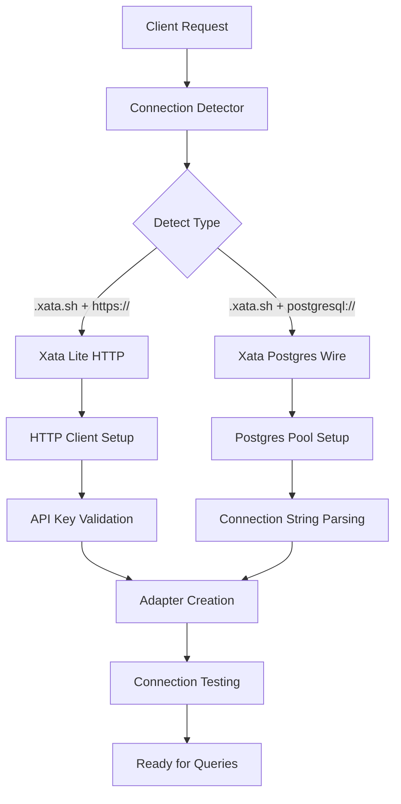
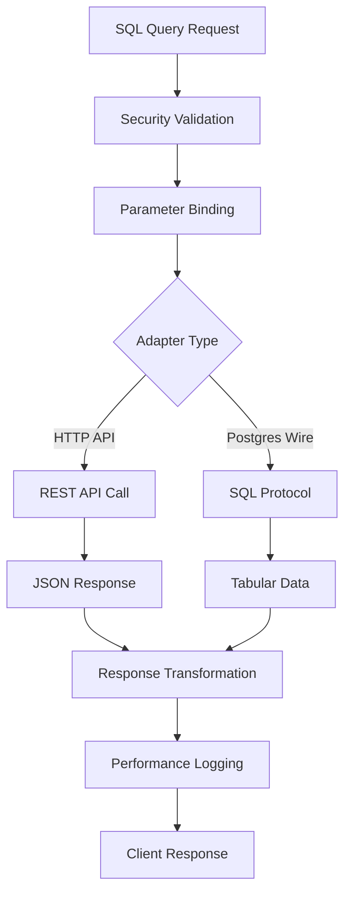
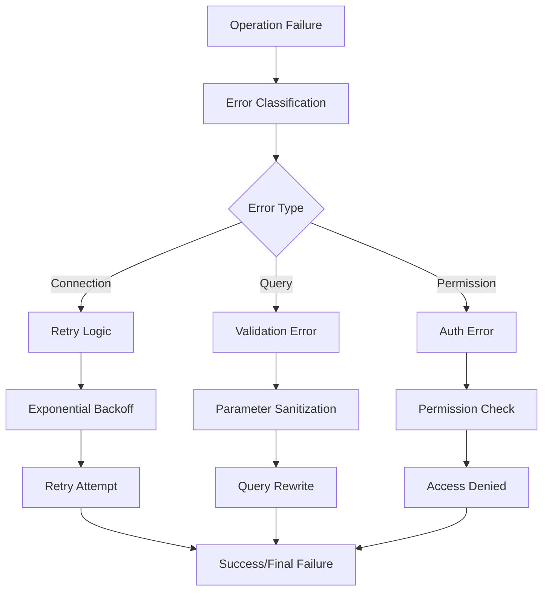

# Xata SQL Documentation - Summary & Architecture

## Project Overview
Created comprehensive documentation for Xata SQL methods integration with the Ultraterrestrial Database Agent, covering both HTTP API and Postgres Wire Protocol implementations.

## Key Modules

### 1. **Core Documentation Modules**
```
XataSqlDocumentation/
├── XataSqlDocumentation.md          # Main API reference (14KB)
├── XataSqlExamples.md              # Practical implementations (21KB) 
├── XataSqlArchitecture.md          # System design patterns (24KB)
├── XataSqlDocumentation_PSEUDOCODE.md # Planning structure (6KB)
└── README_XataSqlDocumentation.md   # Overview and index (8KB)
```

### 2. **Adapter Architecture Modules**
```typescript
DatabaseAdapterLayer {
  BaseDatabaseAdapter              // Abstract base class
  ├── XataLiteAdapter             // HTTP API implementation
  ├── XataPostgresAdapter         // Postgres Wire implementation  
  └── DatabaseAdapterFactory      // Factory pattern for creation
}

ConnectionManagement {
  ConnectionDetector              // Auto-detection logic
  ├── detectXata()               // Xata-specific detection
  ├── detectPostgres()           // Postgres pattern matching
  └── generateAdapterConfig()    // Configuration generation
}

QueryExecution {
  QueryPerformanceMonitor        // Performance tracking
  ├── monitorQuery()            // Execution monitoring
  ├── recordMetrics()           // Performance metrics
  └── generateReport()          // Performance reporting
}
```

### 3. **Integration Modules**
```typescript
MCPIntegration {
  XataMCPTools                   // MCP server tools
  ├── executeQuery()            // SQL execution tool
  ├── searchContent()           // Search functionality  
  └── getTableInfo()            // Schema introspection
}

WebUIIntegration {
  DatabaseConnectionUI          // Frontend components
  ├── testConnection()         // Connection testing
  ├── displayStats()           // Database statistics
  └── handleErrors()           // Error management
}

SecurityLayer {
  SecurityValidator             // SQL injection prevention
  ├── validateQuery()          // Query validation
  ├── sanitizeParameters()     // Parameter sanitization
  └── checkPermissions()       // Access control
}
```

## Process Architecture

### 1. **Connection Establishment Process**


### 2. **Query Execution Process**


### 3. **Error Handling Process**


## Component Architecture

### 1. **Layered Architecture Design**
```
┌─────────────────────────────────────────────────────────────────┐
│                     Presentation Layer                          │
│  ┌─────────────┐  ┌─────────────┐  ┌─────────────┐             │
│  │   Web UI    │  │ API Routes  │  │ MCP Servers │             │
│  └─────────────┘  └─────────────┘  └─────────────┘             │
├─────────────────────────────────────────────────────────────────┤
│                      Service Layer                              │
│  ┌─────────────┐  ┌─────────────┐  ┌─────────────┐             │
│  │UserService  │  │ContentServ. │  │AnalyticsSrv │             │
│  └─────────────┘  └─────────────┘  └─────────────┘             │
├─────────────────────────────────────────────────────────────────┤
│                    Repository Layer                             │
│  ┌─────────────┐  ┌─────────────┐  ┌─────────────┐             │
│  │UserRepo     │  │DocumentRepo │  │ SearchRepo  │             │
│  └─────────────┘  └─────────────┘  └─────────────┘             │
├─────────────────────────────────────────────────────────────────┤
│                   Database Adapter Layer                       │
│  ┌─────────────┐  ┌─────────────┐  ┌─────────────┐             │
│  │XataLiteAdap │  │XataPostgres │  │AdapterFact. │             │
│  └─────────────┘  └─────────────┘  └─────────────┘             │
├─────────────────────────────────────────────────────────────────┤
│                   Infrastructure Layer                         │
│  ┌─────────────┐  ┌─────────────┐  ┌─────────────┐             │
│  │HTTP Client  │  │PG Pool      │  │Cache Manager│             │
│  └─────────────┘  └─────────────┘  └─────────────┘             │
└─────────────────────────────────────────────────────────────────┘
```

### 2. **Adapter Pattern Components**
```typescript
interface AdapterComponents {
  // Base abstraction
  BaseDatabaseAdapter: {
    responsibilities: [
      'Connection management',
      'Query execution interface', 
      'Error handling patterns',
      'Performance monitoring'
    ]
  }

  // HTTP API implementation
  XataLiteAdapter: {
    responsibilities: [
      'REST API communication',
      'JSON request/response handling',
      'Built-in search features',
      'Rate limiting management'
    ]
  }

  // Postgres Wire implementation  
  XataPostgresAdapter: {
    responsibilities: [
      'SQL protocol communication',
      'Connection pooling',
      'Transaction management',
      'Advanced query optimization'
    ]
  }

  // Factory for creation
  DatabaseAdapterFactory: {
    responsibilities: [
      'Adapter type detection',
      'Configuration parsing',
      'Instance management',
      'Resource cleanup'
    ]
  }
}
```

### 3. **Cross-Cutting Concerns**
```typescript
interface CrossCuttingConcerns {
  // Logging system
  XataLogger: {
    captures: ['Query execution', 'Performance metrics', 'Error tracking'],
    outputs: ['Console', 'File', 'Monitoring systems']
  }

  // Security validation
  SecurityValidator: {
    validates: ['SQL injection patterns', 'Parameter bounds', 'Query complexity'],
    enforces: ['Parameterized queries', 'Input sanitization', 'Access control']
  }

  // Performance monitoring
  QueryPerformanceMonitor: {
    tracks: ['Execution time', 'Memory usage', 'Query frequency'],
    reports: ['Slow queries', 'Error rates', 'Resource utilization']
  }

  // Caching layer
  XataCacheManager: {
    caches: ['Query results', 'Connection metadata', 'Schema information'],
    strategies: ['TTL-based', 'LRU eviction', 'Cache invalidation']
  }
}
```

## Data Flow Architecture

### 1. **Request Processing Flow**
```
Client Request → API Gateway → Service Layer → Repository → Adapter → Database
     ↓              ↓            ↓             ↓          ↓        ↓
  Validation → Authentication → Business Logic → Query → Protocol → Storage
     ↓              ↓            ↓             ↓          ↓        ↓  
  Formatted ← Response ← Transform ← Mapping ← Result ← Response ← Data
```

### 2. **Data Transformation Pipeline**
```typescript
interface DataTransformationFlow {
  input: {
    source: 'Web UI | API | MCP Server',
    format: 'HTTP Request | Function Call',
    validation: 'Schema validation | Parameter checking'
  }

  processing: {
    businessLogic: 'Service layer operations',
    dataAccess: 'Repository pattern queries',
    adapterTranslation: 'Protocol-specific formatting'
  }

  execution: {
    connectionManagement: 'Pool selection | HTTP client',
    queryExecution: 'SQL | REST API call',
    resultProcessing: 'Raw data transformation'
  }

  output: {
    transformation: 'Business object mapping',
    serialization: 'JSON | Response format',
    delivery: 'Client response | Callback'
  }
}
```

### 3. **Error Propagation Flow**
```
Database Error → Adapter → Repository → Service → API → Client
      ↓            ↓         ↓           ↓        ↓      ↓
  Low-level → Translation → Business → HTTP → User-friendly
   Details     to Common    Context    Code     Message
      ↓            ↓         ↓           ↓        ↓
   Logging →  Monitoring → Analytics → Alerts → Response
```

## Key Design Decisions

### 1. **Dual Protocol Support**
- **Rationale**: Support both Xata Lite (HTTP) and Postgres Wire for different use cases
- **Implementation**: Adapter pattern with protocol-specific implementations
- **Benefits**: Flexibility, migration path, feature compatibility

### 2. **Factory Pattern for Adapters**
- **Rationale**: Dynamic adapter creation based on connection string analysis
- **Implementation**: Auto-detection logic with configuration validation
- **Benefits**: Simplified client code, automatic optimization

### 3. **Comprehensive Error Handling**
- **Rationale**: Robust error management across all layers
- **Implementation**: Typed errors, retry logic, graceful degradation
- **Benefits**: Improved reliability, better debugging, user experience

### 4. **Performance Monitoring**
- **Rationale**: Proactive performance management and optimization
- **Implementation**: Built-in metrics collection and reporting
- **Benefits**: Query optimization, resource planning, SLA monitoring

### 5. **Security-First Design**
- **Rationale**: Prevent SQL injection and unauthorized access
- **Implementation**: Parameter validation, query sanitization, access control
- **Benefits**: Data protection, compliance, risk mitigation

## Documentation Compliance with SOLID Principles

### Single Responsibility Principle (SRP)
- Each adapter handles only its specific protocol
- Security validation is isolated in dedicated classes
- Performance monitoring is a separate concern

### Open/Closed Principle (OCP)
- Base adapter class is open for extension via inheritance
- New database types can be added without modifying existing code
- Plugin architecture for additional features

### Liskov Substitution Principle (LSP)
- All adapters implement the same interface contract
- Clients can use any adapter without modification
- Behavioral consistency across implementations

### Interface Segregation Principle (ISP)
- Focused interfaces for specific capabilities
- Optional features are separate from core functionality
- Clients depend only on methods they actually use

### Dependency Inversion Principle (DIP)
- High-level modules depend on adapter abstractions
- Concrete implementations are injected via factory
- Configuration drives implementation selection

---

**Architecture Summary**: The Xata SQL documentation implements a robust, scalable architecture that supports multiple database protocols while maintaining clean separation of concerns, comprehensive error handling, and performance optimization throughout the system. 