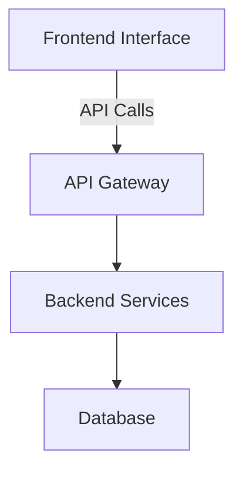

# Technical Design Document Template

Our Technical Design Document Template provides software engineers with a structured framework for creating detailed design documents. It standardizes documentation for clarity and consistency, fostering smooth collaboration among team members. This uniform approach enhances understanding and execution, improving efficiency and speeding up the product development lifecycle.

## What is a Technical Design Document?

Technical Design Documents (TDDs) are essential artifacts in product and feature development as they provide a comprehensive blueprint for building and enhancing products. They ensure that engineers, designers, and other stakeholders have a clear, unified understanding of the technical details, requirements, and constraints. By standardizing the TDD process, you can minimize miscommunication, streamline development, and ensure that critical aspects of the design are not overlooked.

By leveraging a well-structured TDD template, product managers can foster clear communication and alignment among cross-functional teams. The template serves as a guide, ensuring that all necessary elements—from system architecture and data models to security protocols and user flows—are meticulously documented. This approach not only accelerates the development cycle but also enhances the overall quality and reliability of the final product.

## When to use a Technical Design Document:

- Kick off the development phase for a new product or significant feature, ensuring all technical aspects are covered.
- Communicate design changes or enhancements of existing products or features to engineering teams effectively.
- Reinforce alignment between cross-functional teams before beginning detailed technical work on complex projects.
- Document technical architecture and workflows during initial stages of product development to avoid ambiguities.
- Create a comprehensive reference document for new team members joining the project to understand the technical foundation.
- Mitigate risks by detailing technical requirements and design decisions early in the product lifecycle.
- Facilitate more accurate project planning and estimation by clearly outlining technical specifications and constraints.

## The Technical Design Document Template

You can copy and paste this Technical Design Document template to create your own.

## Technical Design Document

**Author:** Your Name Here

### Product Overview

This section provides a concise summary of the product or feature. Outline its purpose, the specific user needs it addresses, and the expected outcomes from its use. High-level context will help stakeholders understand the product's strategic value.

#### Purpose

- Define the primary purpose of the product or feature.
- Explain the problem it solves or the opportunity it captures.
- Concretize with examples or scenarios.

#### Target Audience

- Identify the key user personas.
- Discuss their needs, pain points, and how the product addresses them.
- Mention any relevant market segments.

#### Expected Outcomes

- Specify the tangible and intangible benefits of the product.
- Discuss any key metrics or KPIs that will measure the success.
- Address both short-term and long-term impacts.

### Design Details

This section should outline the product's design in detail. Describe the structure, interactions between different components, data structures, and algorithms that will be used. It provides a clear blueprint for development and helps ensure the design aligns with the product goals.

#### Architectural Overview

- Provide a high-level diagram of the product architecture.
- Describe how different components communicate with each other.
- Highlight any design patterns or principles used.

#### Data Structures and Algorithms

- Detail the data structures and algorithms that will underpin the product.
- Justify their selection in the context of the product goals.
- Discuss efficiency, scalability, and performance considerations.

#### System Interfaces

- Describe the various system interfaces involved.
- Include details on API endpoints, third-party services, and internal modules.
- Note any standards or protocols followed.

#### User Interfaces

- Outline the main user interface components.
- Provide wireframes or mockups if available.
- Explain how the UI aligns with user needs and product goals.

#### Hardware Interfaces

- Detail any hardware interfaces that are relevant.
- Mention specific hardware components or devices that interact with the product.
- Discuss communication protocols or data exchange methods.

### Testing Plan

Outline the comprehensive plan to test the product, ensuring all functionalities meet the quality standards. This includes defining the testing strategies, tools, and environments required to validate the product.

#### Test Strategies

- Define the types of tests to be conducted: unit, integration, system, and acceptance tests.
- Explain the rationale behind selecting specific testing methodologies.
- Discuss any specific scenarios or edge cases.

#### Testing Tools

- List the tools and frameworks that will be used.
- Justify the choice of these tools considering the project needs.
- Include any automation tools for continuous testing.

#### Testing Environments

- Describe the environments in which tests will be conducted: development, staging, and production.
- Explain the setup and configuration of these environments.
- Mention any considerations for scalability and performance testing.

#### Test Cases

- Provide examples of critical test cases to be executed.
- Describe the expected outcomes for these test cases.
- Discuss how these cases cover key functionalities and user journeys.

#### Reporting and Metrics

- Define the metrics that will be tracked during testing.
- Explain how test results will be reported to stakeholders.
- Mention any tools or dashboards used for reporting.

### Deployment Plan

Detail the steps and considerations to deploy the product or feature seamlessly. Address the deployment environment, tools, and the specific actions required to ensure a smooth transition to production.

#### Deployment Environment

- Describe the target deployment environment(s).
- Specify any requirements for infrastructure or configurations.
- Discuss considerations for high availability and disaster recovery.

#### Deployment Tools

- List the tools and platforms used for deployment.
- Justify the choice of these tools, considering the project demands.
- Include any continuous integration/continuous deployment (CI/CD) pipelines.

#### Deployment Steps

- Provide a step-by-step guide for the deployment process.
- Highlight important checkpoints and validation steps.
- Discuss any rollback strategies or contingency plans.

#### Post-Deployment Verification

- Outline the verification process post-deployment.
- Describe the critical checks to ensure the deployment is successful.
- Mention any monitoring or alerting mechanisms.

#### Continuous Deployment

- Describe the approach to continuous deployment if applicable.
- Discuss the automation tools and scripts used.
- Highlight the benefits and any specific requirements.

## Example Technical Design Document

The example below follows our TDD template to lay out the technical design for a hypothetical new feature called 'Smart Assistant' in a product named 'WorkEasy'.

# Product Overview

## Purpose

The primary purpose of the 'Smart Assistant' feature in WorkEasy is to help users automate their routine tasks. This feature aims to solve the problem of time-consuming repetitive tasks, enabling users to focus on more strategic work. For example, a user can create a custom workflow that organizes emails, schedules meetings, and generates reports automatically.

## Target Audience

The main users of this feature are office workers who rely heavily on digital tools for their daily activities. These users often face challenges managing their workload efficiently. The Smart Assistant targets the following personas:

- **Mid-level Managers:** Need to streamline their administrative tasks to focus on team management and strategic planning.
- **Administrative Assistants:** Seek to automate routine data entry and scheduling tasks.
- **Sales Representatives:** Look for ways to automate customer follow-ups and CRM updates.

## Expected Outcomes

The expected outcomes from implementing the Smart Assistant feature are:

- **Increased Efficiency:** Reduce time spent on routine tasks by at least 30%.
- **Improved Productivity:** Allow users to allocate more time to high-value activities.
- **Enhanced User Satisfaction:** Increased adoption of WorkEasy due to enhanced capabilities.
- **KPIs:** Monitor average task completion time, user engagement rate, and feature adoption metrics to measure success.

# Design Details

## Architectural Overview

The Smart Assistant feature will be integrated into the existing WorkEasy architecture. The high-level architecture involves multiple components:

- **Backend Services:** Handle task execution and automation logic.
- **Frontend Interface:** User interface for setting up and managing automations.
- **Database:** Store user preferences and automation configurations.
- **API Gateway:** Facilitate communication between frontend and backend services.



## Data Structures and Algorithms

We will use a tree-like data structure to represent the hierarchy of tasks. Each node represents a task, and edges represent dependencies between tasks. The Depth-First Search (DFS) algorithm will be used to traverse the tree and execute tasks in the correct order. This approach ensures that all dependencies are resolved before a task is marked as complete.

**Data Structures:**

```
class TaskNode {
  String taskId;
  String taskName;
  List<TaskNode> dependencies;
  TaskStatus status;
}

enum TaskStatus {
  PENDING,
  IN_PROGRESS,
  COMPLETED
}
```

## System Interfaces

**System Interfaces:**

- **API Endpoints:**
  - `POST /createAutomation`: Create a new automation workflow.
  - `GET /getAutomations`: Retrieve list of user automations.
  - `PUT /updateAutomation`: Update existing automation.
  - `DELETE /deleteAutomation`: Delete an automation workflow.
- **Third-Party Services:** Integration with calendar services, email servers, and CRM systems.
- **Internal Modules:** Communication with WorkEasy's core modules for task management and notifications.

## User Interfaces

**User Interfaces:**

- **Automation Builder:** A drag-and-drop interface within a new 'Automation' tab in WorkEasy. Users can add, modify, and sequence tasks.
- **Notification Center:** Alerts users of automation status and any needed interventions.
- **Dashboard:** Provides analytics and performance metrics of the automated tasks.

## Hardware Interfaces

No special hardware interfaces are required as this is a purely software-based feature.

# Testing Plan

## Test Strategies

A combination of unit testing, integration testing, system testing, and user acceptance testing (UAT) will be employed to ensure the feature meets all quality standards:

- **Unit Testing:** Verify individual components like task creation, modification, and deletion functionalities.
- **Integration Testing:** Test the interaction between the automation builder and backend services.
- **System Testing:** Validate the feature works as intended within the broader WorkEasy system.
- **User Acceptance Testing:** Conduct sessions with a subset of users to gather feedback and ensure the feature meets user needs.

## Testing Tools

- **Unit Testing:** JUnit for backend, Jest for frontend.
- **Integration Testing:** Postman for API testing.
- **System Testing:** Selenium for end-to-end testing.
- **UAT:** Use of feedback tools such as UserTesting.com.

## Testing Environments

- **Development Environment:** Local machines for initial development and unit testing.
- **Staging Environment:** A cloud-based environment that mirrors production for integration and system testing.
- **Production Environment:** Limited rollout in the live environment for UAT and feature flagging.

## Test Cases

1. **Create Automation:** Validate that a new automation can be created, saved, and retrieved correctly.
2. **Execute Automation:** Ensure tasks are executed in the correct order using the DFS algorithm.
3. **Error Handling:** Trigger and handle errors gracefully when dependencies are not met.
4. **User Interface:** Verify that the drag-and-drop interface works smoothly across different browsers and devices.

## Reporting and Metrics

- **Test Coverage:** Target at least 90% code coverage for critical components.
- **Bug Reports:** Use Jira for tracking and resolving bugs.
- **Performance Metrics:** Monitor response times and resource usage to ensure efficiency.

# Deployment Plan

## Deployment Environment

- **Staging Environment:** Kubernetes cluster with auto-scaling for pre-production testing.
- **Production Environment:** High-availability cluster with disaster recovery configurations.

## Deployment Tools

- **CI/CD Pipeline:** Jenkins for automating the build, test, and deployment processes.
- **Containerization:** Docker for consistent application packaging across environments.
- **Version Control:** Git for code management and version tracking.

## Deployment Steps

1. **Code Review:** Ensure all code changes are peer-reviewed and approved.
2. **Unit Tests:** Run automated unit tests and ensure all pass.
3. **Build and Package:** Use Jenkins to build and package the application into Docker containers.
4. **Deploy to Staging:** Deploy the Docker containers to the staging environment and run integration and system tests.
5. **UAT:** Conduct user acceptance testing in the staging environment.
6. **Deploy to Production:** Once approved, deploy the application to the production environment.

## Post-Deployment Verification

- **Smoke Testing:** Perform basic tests to ensure critical features work as expected.
- **Monitoring:** Use monitoring tools like Prometheus and Grafana to keep an eye on performance and errors.
- **Feedback Collection:** Gather user feedback to identify any issues or areas for improvement.

## Continuous Deployment

- **Automation Tools:** Use Jenkins and Docker for automated testing and deployment.
- **Scripts and Configurations:** Maintain scripts for automated rollback in case of deployment failures.
- **Benefits:** Increased deployment frequency, reduced time to market, and quicker user feedback. 