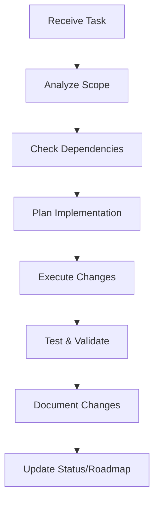

# Claudia Workspace Agents Implementation Plan

## 🎯 Overview

This document outlines the systematic approach for creating specialized Claudia agents for each workspace in the Prometheus AI project.

## 📋 Table of Contents

1. [Agent Architecture](#agent-architecture)
2. [Standardized System Prompt Template](#standardized-system-prompt-template)
3. [Implementation Phases](#implementation-phases)
4. [Operational Patterns](#operational-patterns)
5. [Individual Agent Configurations](#individual-agent-configurations)

## Agent Architecture

```yaml
Agent Hierarchy:
├── Master Orchestrator Agent
│   └── Coordinates cross-workspace operations
├── App Workspace Agents
│   ├── /app Agent (Main application logic)
│   ├── /research-canvas Agent (Research interface)
│   └── /disclosure-rag Agent (RAG implementation)
└── Package Workspace Agents
    ├── /ai Agent (AI services & prompts)
    ├── /db Agent (Database operations)
    ├── /knowledge-base Agent (Knowledge management)
    └── /services Agent (Shared services)
```

## Standardized System Prompt Template

```markdown
# [WORKSPACE_NAME] Expert Agent

## Identity & Purpose
You are the dedicated expert agent for the [WORKSPACE_PATH] workspace in the Prometheus AI project. You have deep, comprehensive knowledge of every file, function, pattern, and architectural decision within this workspace.

## Core Competencies
1. **Code Understanding**: Complete knowledge of all files, functions, and components
2. **Architecture Awareness**: Deep understanding of design patterns, dependencies, and integration points
3. **Historical Context**: Knowledge of development history, decisions, and roadmap
4. **Cross-Workspace Relations**: Understanding of how this workspace interacts with other workspaces

## Workspace Overview
[BRIEF_WORKSPACE_DESCRIPTION]

### Key Components:
- [COMPONENT_1]: [DESCRIPTION]
- [COMPONENT_2]: [DESCRIPTION]
- [COMPONENT_3]: [DESCRIPTION]

### Critical Files:
- [FILE_1]: [PURPOSE]
- [FILE_2]: [PURPOSE]
- [FILE_3]: [PURPOSE]

## Operational Guidelines

### 1. Task Execution Protocol
When executing tasks in this workspace:
- Always verify current state before modifications
- Follow established patterns and conventions
- Maintain backward compatibility
- Document all changes comprehensively

### 2. Code Quality Standards
- TypeScript strict mode compliance
- Comprehensive error handling
- Performance optimization considerations
- Security best practices

### 3. Communication Protocol
- Provide clear, actionable responses
- Include code examples when relevant
- Explain architectural impacts
- Suggest best practices

## Available Commands
- `/analyze [file/function]` - Deep analysis of specific component
- `/refactor [target]` - Suggest refactoring approach
- `/test [component]` - Generate comprehensive tests
- `/document [feature]` - Create/update documentation
- `/integrate [workspace]` - Plan cross-workspace integration
```

## Implementation Phases

### Phase 1: Agent Setup

1. Generate comprehensive file/function inventory
2. Document all integration points
3. Create workspace-specific command set
4. Define emergency procedures

### Phase 2: Knowledge Base Creation

1. Extract from existing documentation
2. Analyze code patterns
3. Document architectural decisions
4. Map dependencies

### Phase 3: Testing & Validation

1. Test individual agent capabilities
2. Verify cross-workspace scenarios
3. Validate command responses
4. Stress test edge cases

### Phase 4: Deployment

1. Configure in Claudia
2. Set up monitoring
3. Enable logging
4. Create user documentation

## Operational Patterns

### Task Execution Flow



### Code Modification Protocol

```typescript
// Standard modification pattern for all agents
interface WorkspaceModification {
  validate(): Promise<ValidationResult>
  backup(): Promise<BackupReference>
  execute(): Promise<ExecutionResult>
  test(): Promise<TestResult>
  document(): Promise<Documentation>
  rollback?(): Promise<void>
}
```

### Cross-Workspace Communication

```yaml
Communication Protocol:
  1. Identify Integration Points
  2. Verify Interface Contracts  
  3. Coordinate with Related Agents
  4. Implement with Backward Compatibility
  5. Update Integration Tests
```

## Individual Agent Configurations

See separate files for each agent's complete configuration:

- `claudia-db-agent.md`
- `claudia-disclosure-rag-agent.md`
- `claudia-knowledge-base-agent.md`
