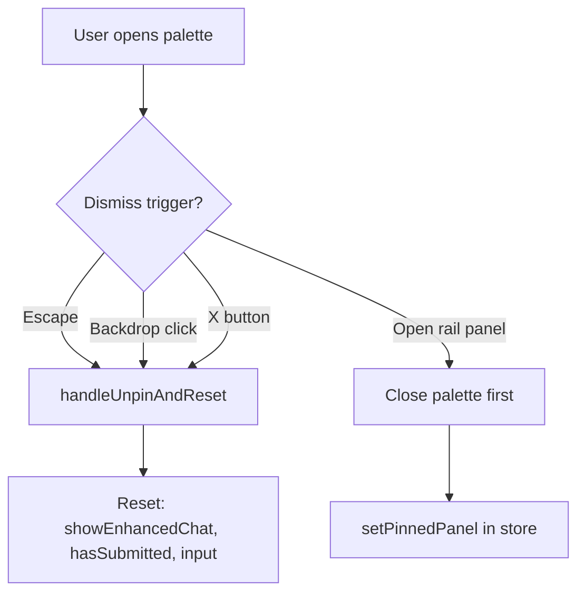

# Dogfood → Mindmap Integration Assessment

**Created:** 2026-06-26  
**Source:** `docs/dogfood-output/report.md` (v0 deploy, 2026-06-21)  
**Target:** `apps/app/src/features/mindmap/`  
**Related:** `docs/plans/2026-06-20-ufo-ui-cannibalization-audit.md` (CANN-1/2/3)

---

## Executive Summary

| Dimension | v0 Deploy (dogfood) | apps/app mindmap today |
|-----------|---------------------|-------------------------|
| Core query flow | Dead end — no API | **Wired** via `useMindMapAgent` → `/api/disclosure/mindmap` |
| Sub-views (search, timeline, sightings, detail) | Separate URL routes, mostly work | **ViewSwitcher** + Zustand — no URL sync |
| Command palette dismiss | Broken | **Same bug ported** |
| Search autocomplete overlap | Broken | **Same bug ported** |
| Timeline Explorer nav | Routes to `/` | **Partially fixed** — menu opens network graph, not 3D timeline |
| Avatar placeholder | `128 × 128` leak | **Fixed** (Dicebear) |

**Bottom line:** Two high-severity dogfood issues are still relevant in apps/app (**ISSUE-002**, **ISSUE-001 UX polish**). ISSUE-003 is done. ISSUE-004 and ISSUE-005 need targeted fixes plus a navigation/product decision. The journey map aligns with **CANN-1/2/3** from the cannibalization audit.

The dogfood report is a **valid cannibalization checklist**, not a list of bugs to fix in the v0 deploy. **apps/app already solves ISSUE-001 at the API layer** but must fix **feedback and dismiss UX** before merging more ufo-ui design. **ISSUE-002 and ISSUE-004 are live regressions in the port.** **ISSUE-005 needs a product split** between the existing 3D timeline at `/timeline` and the network graph already in ViewSwitcher.

---

## Canonical Architecture (Integration Target)

All dogfood flows should converge on this path — not ghost routes or donor apps:

```
research-canvas/page.tsx
  → mind-map.tsx
    → ViewSwitcher
      ├── canvas → graph.tsx (EmptyCanvas | Graph + console + toolbar)
      ├── timeline → views/timeline/page.tsx (NetworkTimelineExplorer)
      ├── globe → views/ufo-sightings/page.tsx
      ├── search → views/search-and-discovery-interface/page.tsx
      └── detail → views/content-card-detail-view/page.tsx
    → FullScreenMenu (setActiveView — not router.push)
```

Navigation is **`mindmap-ui-store.navigation.activeView`**, not URL. That fixes v0's broken top-nav links but creates **ISSUE-005-style confusion** when menu copy promises "3D scrolling" while the view is a 2D network graph.

**Reference:** `apps/app/src/features/mindmap/CLAUDE.md`

---

## Issue-by-Issue Integration Plan

### ISSUE-001 — Core Research Query Dead End

**Dogfood:** Submit does nothing (static prototype).

**apps/app status:** Functionally wired; UX still weak.

**Key files:**

- `apps/app/src/features/mindmap/graph.tsx` — `handleEmptyCanvasSubmit` → `runAgentQueryAndAddNodes`
- `apps/app/src/features/mindmap/hooks/use-mindmap-agent.ts` — SSE stream to `/api/disclosure/mindmap`
- `apps/app/src/features/mindmap/research-canvas/EnhancedAnimatedChat.tsx` — shows fake placeholder text while streaming with no analysis yet

**Gaps to close (CANN-1):**

| Gap | Fix | Files |
|-----|-----|-------|
| Fake "AI thinking" placeholder while streaming | Show spinner + "Searching database…" when `agentStatus === 'streaming' && !agentAnalysis`; surface `agentToolEvents` | `EnhancedAnimatedChat.tsx`, `EmptyCanvas.tsx` |
| Animation before API | Call `onSubmit` at submit time, not after expand animation completes | `research-canvas-console.tsx`, `EnhancedAnimatedChat.tsx` |
| Empty graph → populated transition | Ensure first nodes appear with visible feedback (toast or canvas pulse) | `graph.tsx` `runAgentQueryAndAddNodes` |
| Legacy dead path | Do **not** wire `OracleInput` / `MindMapBottomMenu` — they use a different chat stack | Leave unmounted |

**Acceptance:** Type query → immediate loading → streamed analysis → nodes on canvas; error state on failure.

---

### ISSUE-002 — Command Palette Cannot Be Dismissed (P0)

**Dogfood + apps/app:** Expanded palette has no Escape, outside-click, or close button. Left-rail panels stack on top.

Dismiss exists only via **PinnedCard unpin** in `use-typer.ts` — easy to miss.

**Integration design:**



**Implementation:**

1. **`use-typer.ts`** — export `resetPalette()` (unpin + clear input + `hasSubmitted`).
2. **`research-canvas-console.tsx`** — global `keydown` Escape; semi-transparent backdrop when `showChat`.
3. **`EnhancedAnimatedChat.tsx`** — explicit close (X) calling parent reset.
4. **`mindmap-ui-store.ts`** — when `setPinnedPanel(id)` / `setActiveTool`, call palette reset (callback from console or shared slice flag `paletteOpen`).
5. **`FloatingToolbar.tsx`** — z-index: palette backdrop below rail (`z-30` palette, `z-40` rail) or close palette on rail open.

**Acceptance:** Escape, outside-click, and X all dismiss; opening Timeline/Filter rail closes palette; no text bleed-through.

---

### ISSUE-003 — Avatar Placeholder (Done)

**apps/app:** Uses Dicebear SVG in `FloatingToolbar.tsx` — fixed.

**Action:** No mindmap work. On CANN-2 merge from `apps/ufo-ui`, **do not** reintroduce `placehold.co/128x128`.

---

### ISSUE-004 — Search Autocomplete Overlaps Results (P1)

**Root cause:** Independent conditions — suggestions when focused, results when query non-empty.

**File:** `apps/app/src/features/mindmap/research-canvas/views/search-and-discovery-interface/page.tsx`

- Suggestions: `isSearchFocused && suggestions.length > 0`
- Results: `searchQuery.trim()` — both can be true simultaneously

**Fix (pick one, prefer A):**

- **A:** Hide results while `isSearchFocused && suggestions.length > 0`
- **B:** Hide suggestions after first result render / on blur with delay
- **C:** Single combobox (Radix Command) — suggestions OR results, never both

**Follow-up (CANN + data):** Replace static `UFO_SIGHTINGS` with `@db/postgres` `searchDatabase()`; wire detail links via `setActiveView('detail')` + entity id in store, not ghost `/content-card-detail-view?id=…` hrefs.

**Files:** `views/search-and-discovery-interface/page.tsx`, eventually a `useSearchDiscover` hook.

---

### ISSUE-005 — Timeline Explorer Nav Confusion (P1, Product Decision)

**Three timeline surfaces today:**

| Surface | Location | What it is |
|---------|----------|------------|
| FullScreenMenu "Timeline Explorer" | `activeView: 'timeline'` | Network spiral graph (`views/timeline/page.tsx`) |
| v0 top-nav "Timeline Explorer" | `/` | Broken in v0 |
| True 3D Z-axis | `/timeline` route | `TimelineViews` + `ZAxisTimeline3D`, **live Postgres data** |

`FullScreenMenu.tsx` describes "Timeline Explorer" as "immersive 3D scrolling" but ViewSwitcher loads the network graph — same class of bug as v0, different symptom.

**Recommended integration (Option A — clearest):**

| Menu item | `activeView` | Component | Data |
|-----------|--------------|-----------|------|
| **3D Timeline Explorer** | `timeline-3d` (new) | Embed or lazy-load `ZAxisTimeline3D` | `getHistoricEvents` |
| **Network Timeline** | `timeline` | Existing network explorer | `@db/postgres` via adapter (CANN-3) |

**Changes:**

1. Extend `ActiveView` in `mindmap-ui-store.ts`.
2. Add lazy view in `ViewSwitcher.tsx`.
3. Split/rename entries in `FullScreenMenu.tsx` (remove misleading "3D scrolling" from network item).
4. Optionally redirect `/timeline` → research-canvas with `?view=timeline-3d` for bookmarkability.

**Do not** use stale `VIEWS[].path` for routing — decorative only per `CLAUDE.md`.

---

## CANN Task Alignment

From `docs/plans/2026-06-20-ufo-ui-cannibalization-audit.md`:

| CANN | Scope | Dogfood issues | Integration status |
|------|-------|----------------|-------------------|
| **CANN-1** | Research canvas UX (`EmptyCanvas`, typer, console, chat) | ISSUE-001, ISSUE-002 | Partial port; **fix dismiss + loading before merge more ufo-ui deltas** |
| **CANN-2** | 13 hover panels | ISSUE-002 stacking | Panels live in `FloatingToolbar`; merge visual deltas after palette dismiss |
| **CANN-3** | NetworkTimelineExplorer | ISSUE-005 (partial) | **Already in** `views/timeline/page.tsx`; still on static `UFO_SIGHTINGS` — wire `@db/postgres` |

**Data wiring rule (audit):** All ported UI must use `@db/postgres` + `/api/disclosure/mindmap`, not ufo-ui static datasets.

---

## Phased Implementation Roadmap

### Phase 0 — UX Blockers (1–2 days)

1. Palette dismiss (ISSUE-002) — console + store coordination
2. Streaming feedback (ISSUE-001 polish) — real loading, no fake placeholder
3. Search overlap (ISSUE-004) — one-line mutual exclusion

### Phase 1 — Navigation Clarity (1 day)

1. Split timeline menu items + new `timeline-3d` view (ISSUE-005)
2. Fix SearchView detail links → `setActiveView('detail')`

### Phase 2 — CANN-3 Data (2–3 days)

1. `NetworkIncident` adapter: `loadEntityGraph` / events → `UFOSighting` shape
2. Search view → `searchDatabase` with FTS + vector
3. Sightings globe view → paginated events from Postgres

### Phase 3 — CANN-1/2 Polish (ongoing)

1. Merge remaining ufo-ui visual deltas (only after Phase 0)
2. Delete `apps/ufo-ui` when deletion gate passes

---

## Key Files Touch Matrix

| File | Issues | Action |
|------|--------|--------|
| `research-canvas/research-canvas-console.tsx` | 001, 002 | Dismiss, submit timing |
| `research-canvas/typer/use-typer.ts` | 002 | `resetPalette()` |
| `research-canvas/EnhancedAnimatedChat.tsx` | 001, 002 | Loading UI, close button |
| `research-canvas/FloatingToolbar.tsx` | 002, 003 | Palette coordination, keep Dicebear |
| `store/mindmap-ui-store.ts` | 002, 005 | Palette flag, new `ActiveView` |
| `research-canvas/ViewSwitcher.tsx` | 005 | Lazy 3D timeline view |
| `navigation/FullScreenMenu.tsx` | 005 | Rename/split timeline entries |
| `views/search-and-discovery-interface/page.tsx` | 004 | Overlap fix + live search |
| `views/timeline/page.tsx` | 005, CANN-3 | Postgres adapter |
| `graph.tsx` | 001 | Agent feedback on empty → populated |
| `hooks/use-mindmap-agent.ts` | 001 | Already correct — consume tool events in UI |

**Do not extend:** `smart-graph.tsx`, ghost routes, `OracleInput` path.

---

## Risks & Open Decisions

1. **Two timeline products** — Need explicit naming: "3D Journey" vs "Network Graph". Until decided, ISSUE-005 persists in spirit.
2. **No URL sync** — Dogfood used routable URLs; mindmap uses Zustand only. Consider optional `?view=` for shareable links without `router.push` for in-canvas nav.
3. **Static data debt** — Search/timeline/sightings still use `UFO_SIGHTINGS` (15 rows). Fixing UX without data wiring looks good in demo, fails at scale.
4. **Animation vs latency** — `EnhancedAnimatedChat` multi-second expand delays time-to-first-byte perception; tune or parallelize.
5. **Duplicate panel trees** — `hover-panel/` vs `hover-panels/` vs ufo-ui copies — consolidate during CANN-2 to avoid fixing dismiss in three places.

---

## Recommended Task Tickets (for TODO.md)

| ID | Title | Priority | Depends |
|----|-------|----------|---------|
| MMAP-001 | Palette dismiss (Escape, backdrop, X, rail coordination) | P0 | — |
| MMAP-002 | Real streaming/loading states in EnhancedAnimatedChat | P0 | — |
| MMAP-003 | Search suggestions/results mutual exclusion | P1 | — |
| MMAP-004 | Split Timeline Explorer vs Network Timeline in nav + ViewSwitcher | P1 | Product sign-off |
| MMAP-005 | Wire NetworkTimelineExplorer to `@db/postgres` | P1 | CANN-3 adapter design |
| MMAP-006 | Wire SearchView to `searchDatabase` + in-app detail nav | P2 | MMAP-005 patterns |

---

## Dogfood Journey Map (Reference)

From `docs/dogfood-output/report.md`:

| Route | View | v0 state | apps/app target |
|-------|------|----------|-----------------|
| `/` | Research Canvas | Query dead (ISSUE-001) | Wired; polish loading/dismiss |
| `/timeline` | NetworkTimelineExplorer | ✅ functional | ViewSwitcher `timeline` view |
| `/ufo-sightings` | Sightings Database | ✅ functional | ViewSwitcher `globe` view |
| `/search-and-discovery-interface` | Search & Discover | ✅; overlap (ISSUE-004) | ViewSwitcher `search` view |
| `/content-card-detail-view?id=…` | Incident detail | ✅ functional | ViewSwitcher `detail` view |
| "Timeline Explorer" (3D) | — | ❌ routes to `/` | New `timeline-3d` ActiveView |
| left rail (13) | hover-panels | ✅; stacks with palette | Fix ISSUE-002 coordination |

---

## Verdict

Highest ROI next step: **Phase 0** (palette dismiss + real streaming feedback + search overlap). These are isolated UX fixes in the research-canvas shell that unblock CANN-1/2 merges without touching data layer.
