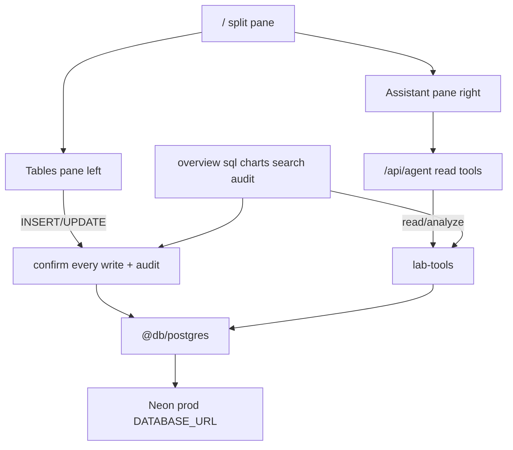

# Disclosure Lab — Canonical Spec

**Source:** grilling plan (`.cursor/plans/neon_lab_next_app_133476f6.plan.md`), closed 2026-08-09.
**Linear:** [DMGD-216](https://linear.app/digital-mischief-group/issue/DMGD-216/lane-b-build-appsdisclosure-lab-neon-admin-console-read-only-assistant)
**Ledger:** T-052 in `docs/plans/TODO.md`
**Architecture decision:** FEATURES Decision 10

# Disclosure Lab (Next.js in apps/)

**Linear:** [DMGD-216](https://linear.app/digital-mischief-group/issue/DMGD-216/lane-b-build-appsdisclosure-lab-neon-admin-console-read-only-assistant)

## Grilling settlements

### Round 1 — 2026-08-08

| Q | Decision |
|---|----------|
| **Q1 Context** | **Database-context admin layer** — not Research Canvas. Ops console over `@db/postgres`. Canvas inference-only write rule scopes to **apps/app**. |
| **Q2 Writer** | **Human operator** writes. Agent assists only. Agent writes deferred. |
| **Q3 Allowlist** | **Entity tables only**. `agent_inferences` / `document_chunks` deferred. |
| **Q4 Neon** | **Live shared `DATABASE_URL`** intentionally. |

### Round 2 — 2026-08-08

| Q | Decision |
|---|----------|
| **Q5 Home** | **Split pane on `/`**: tables (left) + assistant (right). |
| **Q6 Confirm** | **Confirm every INSERT/UPDATE** — including single-field saves. |
| **Q7 Agent SQL** | **`runSqlRead` + typed tools** (search/list/aggregate/schema). |
| **Q8 Delete** | **No delete in v1** — insert/update only. |

### Round 3 — 2026-08-09

| Q | Decision |
|---|----------|
| **Q9 Selection context** | **Auto-attach selected row** to assistant + visible clearable **context chip**. |
| **Q10 SQL DELETE** | **Hard-block `DELETE`/`TRUNCATE`** in `/sql` (same as GUI). |
| **Q11 Close** | **Done** — grilling closed 2026-08-09; shared understanding reached. |

## Decision lock

- **Name / location:** [`apps/disclosure-lab`](apps/disclosure-lab) (`@disclosure-lab`)
- **Stack:** Next.js 15 App Router, TypeScript, Tailwind, Recharts, Vercel AI SDK
- **Data access:** `@db/postgres` only — never `@db/xata`
- **Posture:** Admin lab — GUI mutations (insert/update); assistant analysis (read-only)
- **Home:** Split pane — record browser + Assistant console
- **Selection:** Left-pane row selection feeds assistant context (chip, clearable)
- **Deletes:** Blocked in GUI and SQL for v1

## Architecture



## Agent v1 (read / assist only)

Right pane on `/` (also usable full-page if needed). Tools:

| Tool | Purpose | Writes? |
|------|---------|---------|
| `listTables` / `describeSchema` | Schema inventory | no |
| `searchDatabase` | FTS + pgvector | no |
| `runSqlRead` | SELECT / WITH / EXPLAIN only | no |
| `getRecord` / `listRecords` | Paginated rows | no |
| `aggregate` | Counts, events-by-year, embedding coverage | no |

No upsert/delete/mutating SQL for the agent in v1.

## Human write / edit model (v1)

- **Writable:** `events`, `key_figures` (`personnel`), `topics`, `organizations`, `sightings`, `testimonies`, `documents`, `artifacts`, `locations`
- **Not writable:** `document_chunks`, `agent_inferences`, join tables, DDL
- **Mutations allowed:** INSERT, UPDATE only
- **Mutations blocked:** DELETE (GUI + SQL), plus `DROP|ALTER|TRUNCATE|GRANT|REVOKE|CREATE`
- **Confirm:** every INSERT/UPDATE (including single-field save) → confirm card → execute → audit
- Reject UPDATE without `WHERE`
- **Audit:** JSONL under `apps/disclosure-lab/.data/audit.jsonl`
- Cap SELECT rows (e.g. 500)

## GUI routes

| Route | Purpose |
|-------|---------|
| `/` | **Split pane**: tables left + assistant right |
| `/overview` | Counts + embedding coverage |
| `/sql` | Human SQL (INSERT/UPDATE/SELECT; DELETE blocked) |
| `/charts` | Aggregates (Recharts) |
| `/search` | FTS/vector smoke |
| `/audit` | Write trail |

## Scaffold (lean)

```
apps/disclosure-lab/
  package.json, next.config.ts, tsconfig.json, .env.example, README.md
  src/app/layout.tsx
  src/app/page.tsx                    # split pane home
  src/app/{overview,sql,charts,search,audit}/...
  src/app/api/{agent,overview,tables,sql,search,confirm}/route.ts
  src/lib/{db,write-policy,audit}.ts
  src/lib/lab-tools/
  src/components/{assistant,lab}/
```

Root scripts: `dev:disclosure-lab`, `build:disclosure-lab`

## Safety

- Live Neon by design; confirm-every-write; no deletes v1
- No Clerk; no public deploy assumed
- README states admin/live-DB risk

## Out of scope (v1)

- Agent write / HITL agent mutations
- DELETE (any path)
- `agent_inferences` / chunk writes
- Clerk, Canvas chrome, Streamlit, DDL studio, multi-agent swarm

## Verification

- Split pane loads; assistant read tools work live
- Human INSERT/UPDATE with confirm + audit; DELETE rejected everywhere
- Agent cannot mutate
- Dogfood in browser; UNVERIFIED for shared deploy

## Domain follow-ups

- Applied 2026-08-09: **Disclosure Lab** glossary + CONTEXT-MAP Canvas-vs-Lab write scope
- Skip prod-URL ADR (Q4 intentional live Neon)
