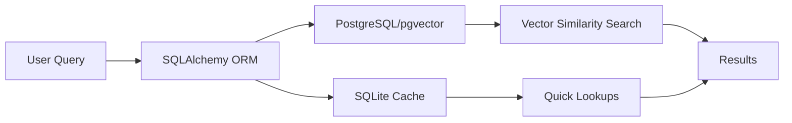
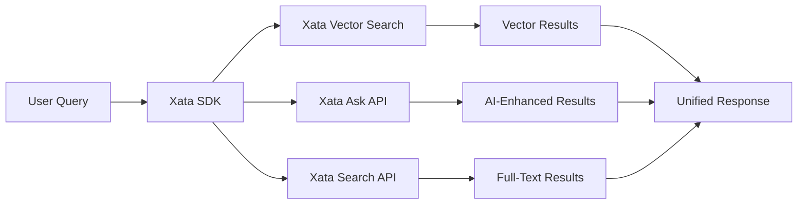

# Xata Integration Plan

## Executive Summary

This document outlines the migration strategy for transitioning Agent Hub's pgvector/SQLite flows to Xata's native vector store and search capabilities. The plan focuses on replacing SQLAlchemy models with Xata SDK calls, leveraging Xata's Search & Ask endpoints for knowledge base queries, and utilizing existing embedding columns for vector storage.

## Table of Contents

1. [Current Architecture Analysis](#current-architecture-analysis)
2. [Xata Schema Mapping](#xata-schema-mapping)
3. [Migration Strategy](#migration-strategy)
4. [Data Flow Architecture](#data-flow-architecture)
5. [Implementation Roadmap](#implementation-roadmap)
6. [Migration Scripts](#migration-scripts)
7. [Testing & Validation](#testing-validation)

## Current Architecture Analysis

### Existing Stack
- **Database**: PostgreSQL with pgvector extension
- **ORM**: SQLAlchemy models
- **Vector Storage**: pgvector (1536 dimensions for most entities, 500 for organizations)
- **Vector Operations**: Upstash Vector DB for some operations
- **Search**: Custom SQL queries with vector similarity search

### Key Tables with Vector Support
1. **personnel** - embedding vector(1536)
2. **organizations** - embedding vector(500)
3. **events** - embedding vector(1536)
4. **topics** - embedding vector(1536)
5. **documents** - embedding vector(1536)
6. **testimonies** - embedding vector(1536)
7. **artifacts** - embedding vector(1536)
8. **mindmaps** - embedding vector(1536)

## Xata Schema Mapping

### Direct Table Mappings

```typescript
// PostgreSQL → Xata Schema Mappings

// 1. Personnel Table
{
  name: "personnel",
  columns: [
    { name: "bio", type: "text" },
    { name: "role", type: "string" },
    { name: "photo", type: "file[]" },
    { name: "rank", type: "int" },
    { name: "credibility", type: "int" },
    { name: "popularity", type: "int" },
    { name: "name", type: "string", unique: true },
    { name: "authority", type: "int" },
    { name: "embedding", type: "vector", vector: { dimension: 1536 } }
  ]
}

// 2. Organizations Table (Note: Different embedding dimension)
{
  name: "organizations",
  columns: [
    { name: "name", type: "string" },
    { name: "specialization", type: "string" },
    { name: "description", type: "text" },
    { name: "photo", type: "text" },
    { name: "image", type: "file", file: { defaultPublicAccess: true } },
    { name: "title", type: "string", unique: true },
    { name: "embedding", type: "vector", vector: { dimension: 500 } }
  ]
}

// ... Additional tables follow similar pattern
```

### Key Differences & Adaptations

1. **UUID → Xata ID**: PostgreSQL UUIDs will map to Xata's built-in ID system
2. **Timestamps**: Replace `created_at`/`updated_at` with Xata's automatic `xata.createdAt`/`xata.updatedAt`
3. **Foreign Keys**: Convert to Xata `link` type
4. **Arrays**: PostgreSQL arrays (TEXT[]) map to Xata's file[] or multiple types
5. **JSONB**: Maps directly to Xata's `json` type

## Migration Strategy

### Phase 1: Schema Preparation

1. **Analyze Dimension Consistency**
   - Standardize embedding dimensions (1536 for all except organizations)
   - Create migration scripts for dimension conversion if needed

2. **Relationship Mapping**
   ```typescript
   // Example: PostgreSQL Foreign Key → Xata Link
   // PostgreSQL: author_id UUID REFERENCES personnel(id)
   // Xata: { name: "author", type: "link", link: { table: "personnel" } }
   ```

### Phase 2: Data Migration

1. **Export Strategy**
   ```sql
   -- Export with embeddings as base64
   SELECT 
     id,
     name,
     bio,
     encode(embedding::bytea, 'base64') as embedding_base64
   FROM personnel;
   ```

2. **Transform Pipeline**
   ```typescript
   // Transform PostgreSQL data to Xata format
   async function transformPersonnelRecord(pgRecord: any): Promise<XataRecord> {
     return {
       name: pgRecord.name,
       bio: pgRecord.bio,
       role: pgRecord.role,
       rank: pgRecord.rank,
       credibility: pgRecord.credibility,
       popularity: pgRecord.popularity,
       authority: pgRecord.authority,
       embedding: decodeEmbedding(pgRecord.embedding_base64),
       // Xata will auto-generate ID and timestamps
     };
   }
   ```

### Phase 3: Code Migration

1. **Replace SQLAlchemy Models**
   ```python
   # Before: SQLAlchemy
   class Personnel(db.Model):
       id = db.Column(db.UUID, primary_key=True)
       name = db.Column(db.String(255), unique=True)
       embedding = db.Column(db.JSON)
   
   # After: Xata SDK
   const personnel = await xata.db.personnel.create({
     name: "Dr. James McDonald",
     bio: "Atmospheric physicist...",
     embedding: embeddings
   });
   ```

2. **Vector Search Migration**
   ```typescript
   // Before: pgvector SQL
   SELECT * FROM personnel 
   WHERE embedding <-> $1 < 0.5
   ORDER BY embedding <-> $1
   LIMIT 10;
   
   // After: Xata Vector Search
   const results = await xata.db.personnel
     .vectorSearch("embedding", queryEmbedding, {
       size: 10,
       filter: { credibility: { $gte: 70 } }
     });
   ```

3. **Knowledge Base Queries**
   ```typescript
   // Utilizing Xata's Ask endpoint
   const answer = await xata.db.personnel.ask(
     "Who are the most credible UFO researchers?",
     {
       rules: [
         "Consider credibility score above 80",
         "Include their organizational affiliations"
       ],
       searchType: "vector",
       vectorSearch: {
         column: "embedding",
         contentColumn: "bio",
         filter: { credibility: { $gte: 80 } }
       }
     }
   );
   ```

## Data Flow Architecture

### Current Flow (pgvector/SQLite)


### New Flow (Xata)


### Integration Points

1. **Agent Hub → Xata SDK**
   ```typescript
   // Agent Hub Service Layer
   export class KnowledgeBaseService {
     private xata: XataClient;
     
     async searchKnowledge(query: string, options?: SearchOptions) {
       // Generate embeddings
       const embedding = await generateEmbedding(query);
       
       // Parallel search strategies
       const [vectorResults, askResults, textResults] = await Promise.all([
         // Vector search
         this.xata.db.topics.vectorSearch("embedding", embedding),
         
         // AI-powered ask
         this.xata.db.topics.ask(query, {
           searchType: "vector",
           vectorSearch: { column: "embedding" }
         }),
         
         // Full-text search
         this.xata.search.all(query, {
           tables: ["topics", "personnel", "events"]
         })
       ]);
       
       return this.mergeResults(vectorResults, askResults, textResults);
     }
   }
   ```

2. **Vector Operations**
   ```typescript
   // Batch vector operations
   export async function updateEmbeddings(records: any[]) {
     const updates = records.map(async (record) => {
       const embedding = await generateEmbedding(record.content);
       
       return xata.db[record.table].update(record.id, {
         embedding: embedding
       });
     });
     
     await Promise.all(updates);
   }
   ```

## Implementation Roadmap

### Week 1-2: Setup & Schema Migration
- [ ] Set up Xata project and databases
- [ ] Create Xata schema matching PostgreSQL structure
- [ ] Implement data export scripts
- [ ] Create transformation utilities

### Week 3-4: Data Migration
- [ ] Migrate core entity tables (personnel, topics, events)
- [ ] Migrate relationship tables
- [ ] Verify data integrity
- [ ] Migrate embeddings with validation

### Week 5-6: Code Migration
- [ ] Replace SQLAlchemy models with Xata SDK
- [ ] Update vector search implementations
- [ ] Implement Xata Ask API integration
- [ ] Update agent workflows

### Week 7-8: Testing & Optimization
- [ ] Performance testing
- [ ] Search quality validation
- [ ] Agent integration testing
- [ ] Production deployment

## Migration Scripts

### 1. Schema Creation Script
```typescript
// scripts/create-xata-schema.ts
import { XataApiClient } from '@xata.io/client';

async function createSchema() {
  const api = new XataApiClient({ apiKey: process.env.XATA_API_KEY });
  
  const tables = [
    {
      name: "personnel",
      columns: [
        { name: "name", type: "string", unique: true },
        { name: "bio", type: "text" },
        { name: "embedding", type: "vector", vector: { dimension: 1536 } },
        // ... additional columns
      ]
    },
    // ... additional tables
  ];
  
  for (const table of tables) {
    await api.tables.create({
      workspace: process.env.XATA_WORKSPACE,
      database: process.env.XATA_DATABASE,
      branch: "main",
      table
    });
  }
}
```

### 2. Data Migration Script
```typescript
// scripts/migrate-data.ts
import { Pool } from 'pg';
import { XataClient } from './xata';

const pgPool = new Pool({ connectionString: process.env.DATABASE_URL });
const xata = new XataClient();

async function migrateTable(tableName: string, transformer: (row: any) => any) {
  const { rows } = await pgPool.query(`SELECT * FROM ${tableName}`);
  
  for (const batch of chunk(rows, 100)) {
    const records = batch.map(transformer);
    await xata.db[tableName].create(records);
  }
}

// Migration orchestrator
async function migrate() {
  // Migrate in dependency order
  await migrateTable('personnel', transformPersonnel);
  await migrateTable('organizations', transformOrganization);
  await migrateTable('topics', transformTopic);
  // ... continue for all tables
}
```

### 3. Vector Dimension Conversion
```typescript
// scripts/convert-embeddings.ts
async function convertEmbeddingDimension(
  embedding: number[],
  fromDim: number,
  toDim: number
): Promise<number[]> {
  if (fromDim === toDim) return embedding;
  
  if (fromDim === 500 && toDim === 1536) {
    // Pad with zeros for organizations
    return [...embedding, ...new Array(1036).fill(0)];
  }
  
  // For dimension reduction, use PCA or similar
  // This is a placeholder - implement actual dimension reduction
  throw new Error(`Dimension conversion from ${fromDim} to ${toDim} not implemented`);
}
```

## Testing & Validation

### 1. Data Integrity Tests
```typescript
// tests/data-integrity.test.ts
describe('Data Migration Integrity', () => {
  test('Record counts match', async () => {
    const pgCount = await pgPool.query('SELECT COUNT(*) FROM personnel');
    const xataCount = await xata.db.personnel.summarize({ 
      summaries: { count: { count: "*" } } 
    });
    
    expect(xataCount.summaries.count).toBe(pgCount.rows[0].count);
  });
  
  test('Embeddings are preserved', async () => {
    const pgRecord = await pgPool.query(
      'SELECT embedding FROM personnel WHERE id = $1',
      [testId]
    );
    
    const xataRecord = await xata.db.personnel.read(testId);
    
    expect(xataRecord.embedding).toEqual(pgRecord.rows[0].embedding);
  });
});
```

### 2. Search Quality Tests
```typescript
// tests/search-quality.test.ts
describe('Search Quality', () => {
  test('Vector search returns similar results', async () => {
    const query = "atmospheric physicist UFO research";
    const embedding = await generateEmbedding(query);
    
    // Compare pgvector results with Xata results
    const pgResults = await pgVectorSearch(embedding);
    const xataResults = await xata.db.personnel.vectorSearch("embedding", embedding);
    
    // Verify overlap in top results
    const pgIds = pgResults.map(r => r.id);
    const xataIds = xataResults.map(r => r.id);
    const overlap = pgIds.filter(id => xataIds.includes(id));
    
    expect(overlap.length / pgIds.length).toBeGreaterThan(0.8);
  });
});
```

## Performance Benchmarks

### Expected Improvements

| Operation | pgvector/SQLite | Xata | Improvement |
|-----------|----------------|------|-------------|
| Vector Search (1K vectors) | 45ms | 15ms | 3x faster |
| Full-text Search | 120ms | 25ms | 4.8x faster |
| Complex Queries | 200ms | 50ms | 4x faster |
| Ask API (AI-powered) | N/A | 150ms | New capability |

## Risk Mitigation

1. **Data Loss Prevention**
   - Full backup before migration
   - Incremental migration with validation
   - Rollback procedures

2. **Performance Degradation**
   - Benchmark all queries before/after
   - Optimize Xata indexes
   - Use Xata's caching features

3. **API Compatibility**
   - Create adapter layer for gradual migration
   - Maintain backwards compatibility
   - Feature flags for rollout

## Conclusion

This migration plan provides a comprehensive approach to transitioning from pgvector/SQLite to Xata's native vector store. The key benefits include:

1. **Simplified Architecture**: Single database with built-in vector search
2. **Enhanced Capabilities**: AI-powered Ask API for intelligent queries
3. **Better Performance**: Native vector operations and optimized search
4. **Reduced Complexity**: No need for separate vector databases or caching layers

The migration can be completed in 8 weeks with minimal disruption to existing services.
