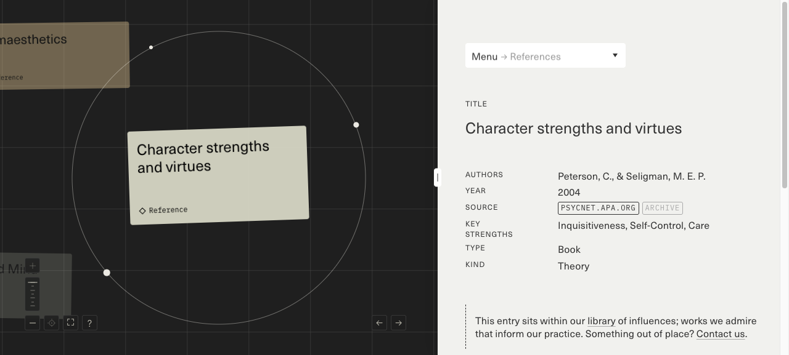
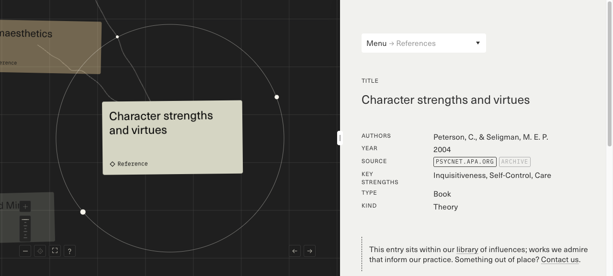
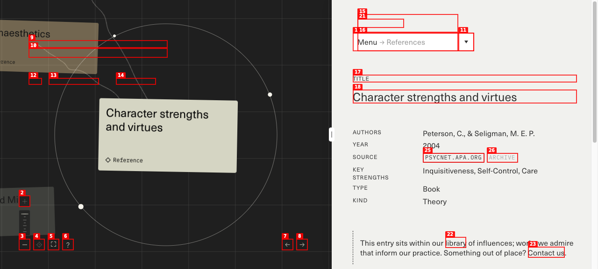
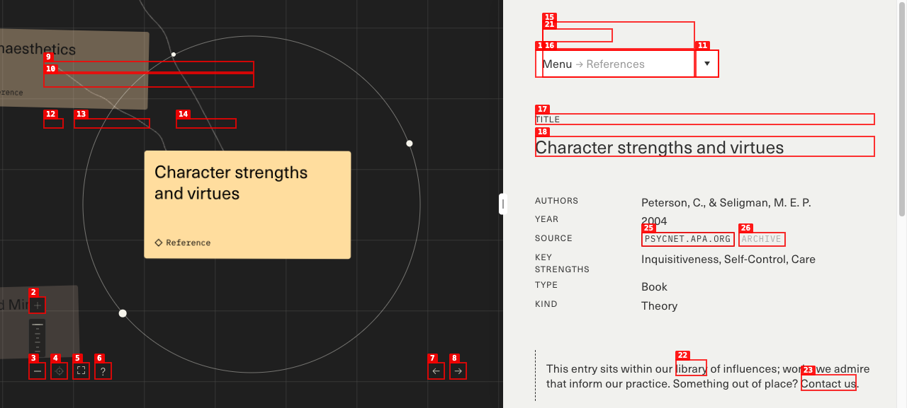
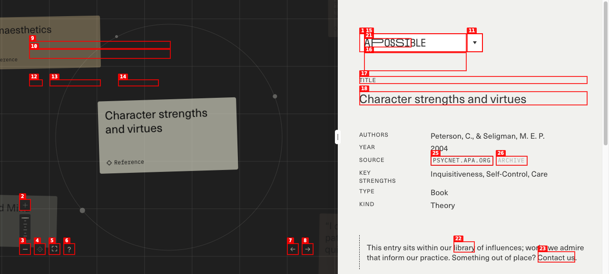
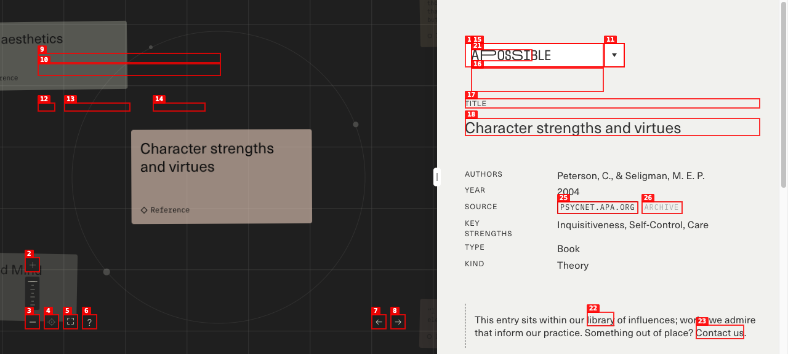
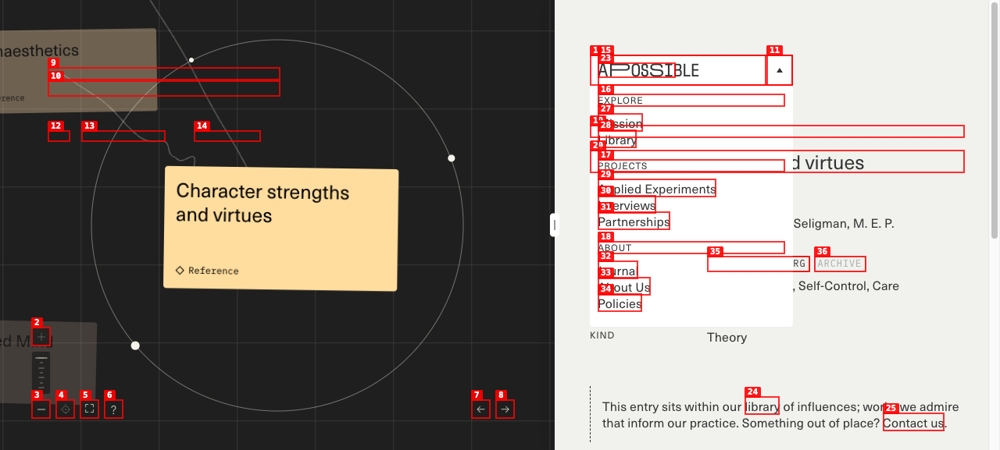
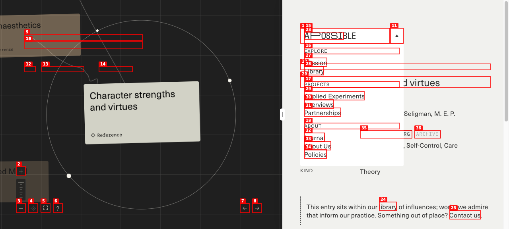

# Dogfood Report: A Possible — Character Strengths Reference

| Field | Value |
|-------|-------|
| **Date** | 2026-06-26 |
| **App URL** | https://apossible.com/references/character-strengths-and-virtues |
| **Session** | apossible-character-strengths |
| **Scope** | Reference entry page — spatial canvas, detail panel, navigation, related entries, theme filters, zoom controls |

## Summary

| Severity | Count |
|----------|-------|
| Critical | 0 |
| High | 1 |
| Medium | 2 |
| Low | 2 |
| **Total** | **5** |

**Most critical:** ISSUE-001 — sidebar "Entries with similar themes" links appear clickable but do not navigate to the related entry (URL and title unchanged). **Counterpoint:** Prev/Next entry navigation, zoom controls, and the split canvas+dossier layout work well and are strong reference patterns for Ultraterrestrial's entity detail UX.

## What Works (Reference Patterns for apps/app)

These are **not defects** — they are the steal-worthy design:

| Pattern | Observation |
|---------|-------------|
| **Split canvas + dossier** | ~60% spatial graph (dark), ~40% structured reference panel (light) |
| **Orbital layout** | Active entry centered; related entries on circular paths with curved connectors |
| **Metadata schema** | Authors, Year, Source (+ Archive), Key Strengths, Type, Kind |
| **Guide onboarding** | Floating "Exploring Our Framework" card explains thematic taxonomy (care, inquisitiveness, self-control) |
| **Entry typing** | Diamond badge + label (Reference, Interview, Experiment) on canvas cards |
| **Prev/Next browse** | Linear library traversal updates both canvas focus and dossier panel |
| **Pull quotes** | Satellite cards show attributed quotes as discovery hooks |
| **Spatial controls** | Zoom in/out, center, fullscreen, help — bottom-left cluster |
| **Provenance** | Source links + Archive + per-node Credit buttons |

---

## Issues

### ISSUE-001: Sidebar related-entry links do not navigate

| Field | Value |
|-------|-------|
| **Severity** | high |
| **Category** | functional |
| **URL** | https://apossible.com/references/character-strengths-and-virtues |
| **Repro Video** | videos/issue-001-repro.webm |

**Description**

The detail panel includes an "ENTRIES WITH SIMILAR THEMES" section with linked cards (e.g. "Somaesthetics — Richard Shusterman — Reference"). These render as `<a>` links and look navigable, but clicking them does **nothing** to the active entry: the URL stays on `character-strengths-and-virtues`, the TITLE heading remains "Character strengths and virtues", and no loading or focus change occurs. A user expecting sidebar links to open related references gets no feedback. (Canvas cards for related entries may be the intended navigation path, but the sidebar affordance is misleading.)

**Repro Steps**

1. Navigate to the reference page.
   

2. Scroll to "ENTRIES WITH SIMILAR THEMES" and click the **Somaesthetics** link.
   

3. **Observe:** URL unchanged; title still "Character strengths and virtues"; no navigation.
   

---

### ISSUE-002: Description and similar-themes content hidden below fold

| Field | Value |
|-------|-------|
| **Severity** | medium |
| **Category** | ux |
| **URL** | https://apossible.com/references/character-strengths-and-virtues |
| **Repro Video** | N/A |

**Description**

On a typical desktop viewport, the right-hand dossier panel shows TITLE and metadata fields (Authors, Year, Source, Key Strengths, Type, Kind) but cuts off before the DESCRIPTION body copy and "Entries with similar themes" section. Page-level scroll does not clearly scroll the panel independently — the DESCRIPTION heading is in the accessibility tree but not visible without hunting. Users may miss the core prose and related-entry section entirely on first load.

**Repro Steps**

1. Load the page at default viewport (~1280×800).
   

2. Note DESCRIPTION and ENTRIES WITH SIMILAR THEMES exist in the DOM but are not visible without scrolling.
   

---

### ISSUE-003: Theme filter links provide no visible feedback

| Field | Value |
|-------|-------|
| **Severity** | medium |
| **Category** | ux |
| **URL** | https://apossible.com/references/character-strengths-and-virtues |
| **Repro Video** | N/A |

**Description**

The Guide panel links thematic filters: **care**, **inquisitiveness**, **self-control**. These appear as clickable links in the framework explainer, but clicking "inquisitiveness" produces no visible change to the canvas filter state, dossier content, or URL. If filtering is canvas-only (highlighting nodes), the effect is too subtle to confirm; if unimplemented, the links are dead affordances.

**Repro Steps**

1. Load the page; locate the Guide card ("Exploring Our Framework").
   

2. Click the **inquisitiveness** link.
   

3. **Observe:** Active entry, URL, and visible canvas state appear unchanged.

---

### ISSUE-004: Cryptic control button labels

| Field | Value |
|-------|-------|
| **Severity** | low |
| **Category** | accessibility / content |
| **URL** | https://apossible.com/references/character-strengths-and-virtues |
| **Repro Video** | N/A |

**Description**

Spatial controls use question-mark suffix labels: **"Center ?"**, **"Help ?"**, **"Credit ?"**. Screen readers and sighted users get no semantic hint until hover/click. Standard patterns would use aria-labels ("Center view", "Show help", "Image credit") or icon-only buttons with accessible names.

**Repro Steps**

1. Load the page; inspect bottom-left zoom cluster and canvas node Credit buttons.
   

---

### ISSUE-005: Menu stays open after Escape

| Field | Value |
|-------|-------|
| **Severity** | low |
| **Category** | ux / accessibility |
| **URL** | https://apossible.com/references/character-strengths-and-virtues |
| **Repro Video** | N/A |

**Description**

Opening the top-right menu (Toggle Menu) reveals EXPLORE / PROJECTS / ABOUT sections. Pressing **Escape** does **not** close it — the overlay remains with Mission, Library, etc. still visible. Modal/popover patterns typically support Escape dismiss.

**Note:** Mobile viewport was not tested (`agent-browser viewport` unsupported in v0.26.0); `mobile-viewport.png` is desktop-sized.

**Repro Steps**

1. Click Toggle Menu to open navigation overlay.
   

2. Press Escape; observe whether menu closes.
   

---

## Screenshots Index

| File | Purpose |
|------|---------|
| `screenshots/initial.png` | Default load state |
| `screenshots/menu-open.png` | Navigation menu expanded |
| `screenshots/next-entry.png` | Prev/Next works — "Gather" entry |
| `screenshots/help-panel.png` | Help toggle state |
| `screenshots/theme-inquisitiveness.png` | Theme link click |
| `screenshots/related-entry-somaesthetics.png` | Related link no-op |
| `screenshots/scrolled-detail-panel.png` | Below-fold content |
