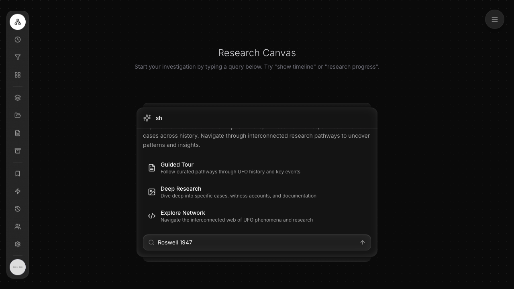
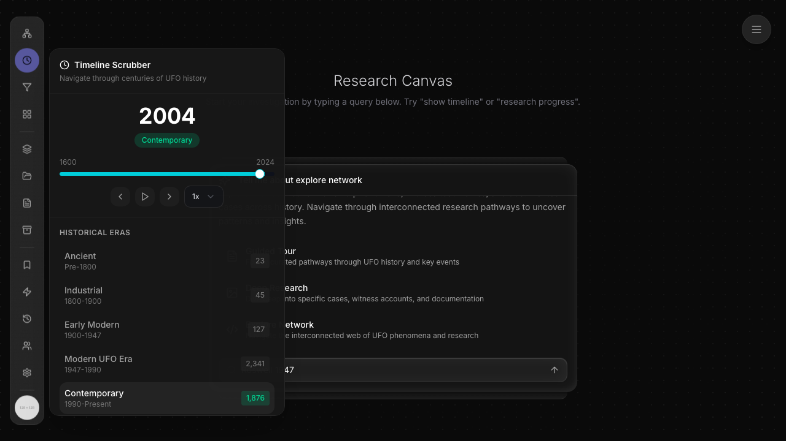
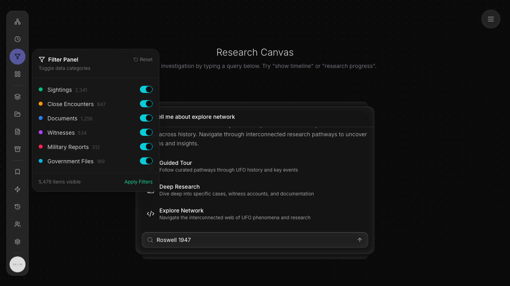
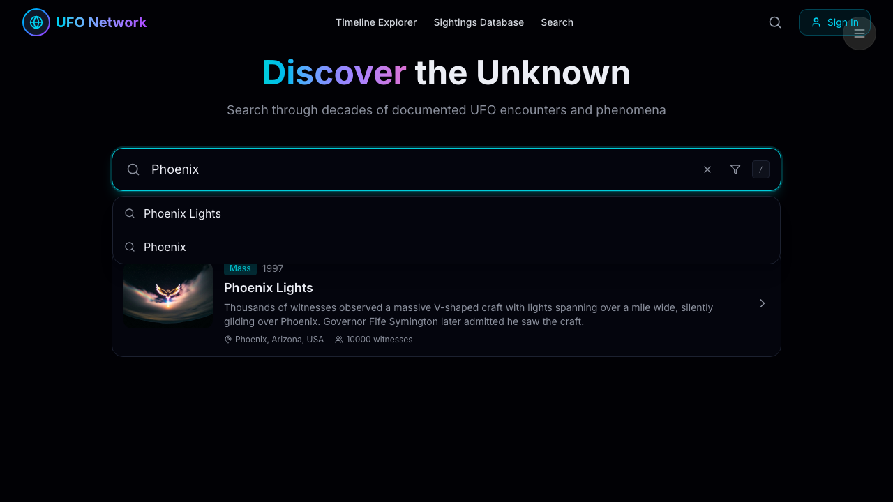
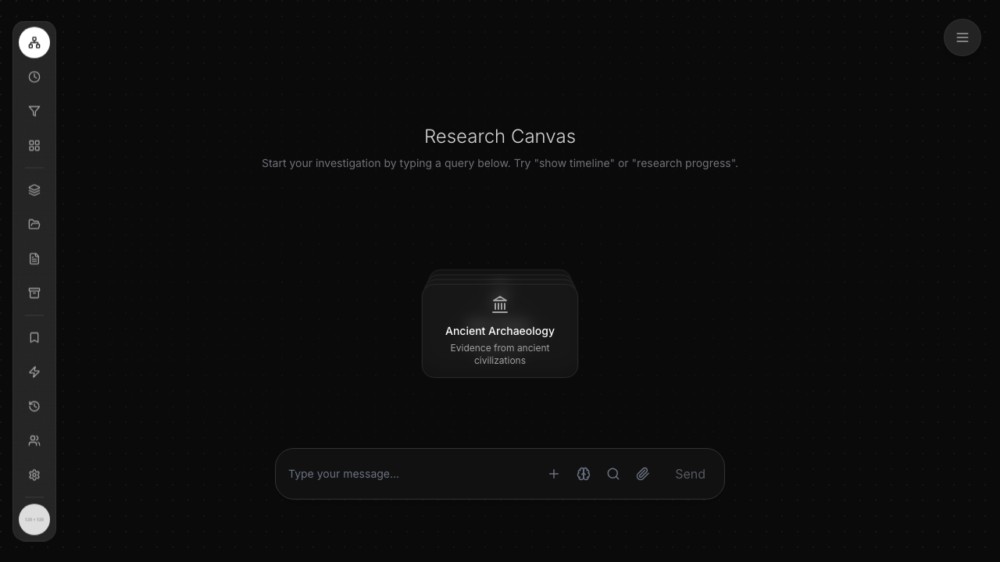

# Dogfood Report: UFO Disclosure Network (deployed v0 UFO UI)

| Field | Value |
|-------|-------|
| **Date** | 2026-06-21 |
| **App URL** | https://v0-ultraterrestrial-research-canva.vercel.app/ |
| **Session** | ufo-ui-deployed |
| **Scope** | Full app — Research Canvas, left-rail panels, nav menu, message flow. Doubles as a user-journey map for the apps/app cannibalization (CANN-1/2/3). |

> Note: the second argument `https://v0.app/chat/build-error-fix-JS4c7uft7SA` is the v0 editor chat (auth-gated, not a runnable app) — not dogfooded.

## Summary

| Severity | Count |
|----------|-------|
| Critical | 0 |
| High | 2 |
| Medium | 2 |
| Low | 1 |
| **Total** | **5** |

**Most critical:** ISSUE-001 (core research query is a dead end — no result/feedback) and ISSUE-002 (command palette can't be dismissed; surfaces stack). Both are in the headline Research Canvas flow. Counterpoint: the dedicated Search, Sightings DB, Network Timeline, and detail-view routes all work — the broken parts are concentrated in the home canvas's query/palette.

## Issues

<!-- appended incrementally as found -->

### ISSUE-001: Core research query produces no result or feedback (submit is a dead end)

| Field | Value |
|-------|-------|
| **Severity** | high |
| **Category** | functional |
| **URL** | https://v0-ultraterrestrial-research-canva.vercel.app/ |
| **Repro Video** | N/A (agent-browser 0.5.0 has no record cmd; step screenshots below) |

**Description**

The Research Canvas's primary feature is "type a query → investigate." Typing a query and submitting it — via either the submit arrow or the Enter key — does **nothing**: no results render, no loading indicator appears, no "no results" empty state, and no console/network activity. The query text just sits in the field. A first-time user has no signal that anything happened or that the feature is non-functional. (Likely root cause: this is a static v0 prototype with no backend wired — but the UX gives zero feedback either way, which is the defect.)

**Repro Steps**

1. Navigate to the app; click the message input and type `Roswell 1947`. The input expands into a command palette with a search field holding the query.
   

2. Click the submit arrow (▲) at the right of the search field. Nothing changes — query remains, no result.
   

3. Press **Enter** instead. Same dead end — no result, no loading, no error.
   

---

### ISSUE-002: Command palette cannot be dismissed; surfaces stack on top of it

| Field | Value |
|-------|-------|
| **Severity** | high |
| **Category** | ux / functional |
| **URL** | https://v0-ultraterrestrial-research-canva.vercel.app/ |
| **Repro Video** | N/A |

**Description**

Once the message input expands into the command palette (Guided Tour / Deep Research / Explore Network + search field), there is no way to dismiss it. Pressing **Escape** does nothing; clicking outside it (on `body`/empty canvas) does nothing; and opening a left-rail panel does **not** close it — instead the rail panel (Timeline Scrubber, Filter Panel) renders on top while the palette stays open underneath, with its text bleeding through. A user who opens the palette is effectively stuck with it on screen for the rest of the session. Modals/popovers must be dismissible via Escape and outside-click.

**Repro Steps**

1. Click the input and type any query → the command palette opens.
   

2. Press Escape and click outside the palette, then click the Timeline (clock) rail icon. The Timeline Scrubber opens **on top of** the still-open palette (palette "explore network" header + "Roswell 1947" field visible behind/beside it).
   

3. Click the Filter rail icon. Filter Panel swaps in, palette **still** open behind it. The palette never closed.
   

---

### ISSUE-003: User avatar shows "128 × 128" placeholder text instead of an image

| Field | Value |
|-------|-------|
| **Severity** | low |
| **Category** | visual / content |
| **URL** | https://v0-ultraterrestrial-research-canva.vercel.app/ |
| **Repro Video** | N/A (static, visible on load) |

**Description**

The "Researcher Avatar" control at the bottom of the left rail renders a placeholder image that displays its raw dimensions, "128 × 128", instead of an actual avatar or a designed fallback (initials/icon). This is a leaked placeholder asset visible on every screen.

**Repro Steps**

1. Load the app. Observe the bottom-left avatar circle reads "128 × 128".
   

---

### ISSUE-004: Search autocomplete dropdown overlaps and obscures result cards

| Field | Value |
|-------|-------|
| **Severity** | medium |
| **Category** | visual / ux |
| **URL** | https://v0-ultraterrestrial-research-canva.vercel.app/search-and-discovery-interface |
| **Repro Video** | N/A |

**Description**

On the Search & Discover page, typing a query shows an autocomplete suggestion dropdown AND renders matching result cards below the search bar at the same time. The dropdown renders on top of the first result card, covering its classification badge and date ("Mass / 1997" partially hidden behind the "Phoenix Lights / Phoenix" suggestions). The two surfaces collide instead of one suppressing the other. (Note: unlike the Research Canvas, this search **does** return real results — confirming ISSUE-001's dead-end is a genuine defect, not merely "no backend.")

**Repro Steps**

1. Go to Search & Discover, click the search field, type `Phoenix`. The suggestion dropdown ("Phoenix Lights", "Phoenix") overlaps the "Phoenix Lights" result card beneath it.
   

---

### ISSUE-005: "Timeline Explorer" nav link routes to the home canvas, not a timeline view

| Field | Value |
|-------|-------|
| **Severity** | medium |
| **Category** | functional / navigation |
| **URL** | https://v0-ultraterrestrial-research-canva.vercel.app/ |
| **Repro Video** | N/A |

**Description**

The navigation exposes two distinct timeline destinations: "Timeline Explorer" (described as "immersive 3D Z-axis scrolling") and "Network Timeline" (the network graph). Clicking "Network Timeline" correctly opens `/timeline` (the node graph). But clicking the top-nav **"Timeline Explorer"** link navigates to `/` — the generic home Research Canvas — not any timeline explorer view. The promised 3D timeline destination has no page; the link silently lands on home, which is confusing and looks broken.

**Repro Steps**

1. From any page, click "Timeline Explorer" in the top navigation. The URL becomes `/` and the home Research Canvas renders instead of a timeline explorer.
   

---

## Journey map (for cannibalization — CANN tasks)

Routes confirmed live in the deployed donor app:

| Route | View | State |
|-------|------|-------|
| `/` | Research Canvas (left-rail + command palette + suggestion cards) | renders; query flow dead (ISSUE-001) |
| `/timeline` | **NetworkTimelineExplorer** (node graph + legend + node-detail panel) | ✅ fully functional incl. node click → Roswell detail |
| `/ufo-sightings` | Sightings Database (card grid + search/filter/sort) | ✅ search filters (15 incidents) |
| `/search-and-discovery-interface` | Search & Discover (autocomplete + categories) | ✅ returns results; dropdown overlap (ISSUE-004) |
| `/content-card-detail-view?id=…` | Incident detail (hero, summary, classification, quick stats) | ✅ functional |
| "Timeline Explorer" (3D) | — | ❌ no page; routes to `/` (ISSUE-005) |
| left rail (13) | hover-panels: Timeline Scrubber, Filter Panel, … | ✅ panels open/swap; data is static (15 incidents / counts) |
