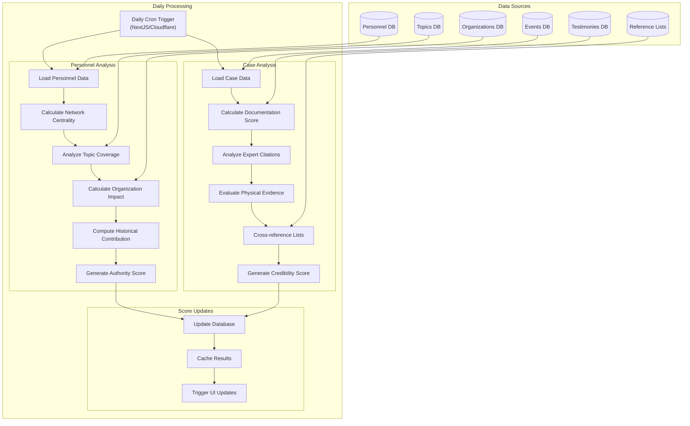

# Key Figures Analysis

# Here's a brief example of the structure of the data across the CSV files

- Topics: Contains information about various topics related to advanced propulsion technologies, alien abductions, ancient aliens theory, Area 51, and specific cases like Betty and Barney Hill abduction.
- Key Figures: Contains details about subject matter experts, including names and IDs.
- Events: Contains details about events, including names and IDs.
- Event-Subject-Matter-Experts: Maps subject matter experts to events.
- Topic-Subject-Matter-Experts: Maps subject matter experts to topics.
- Testimonies: Contains details about testimonies, including names and IDs, events and witnesses and organizations.
- Organizations: Contains details about organizations, including names and IDs.
- Topic-Testimonies: Maps testimonies to topics.

The connections between topics, personnel, testimonies and events make it far easier to identify which key figures are linked to which events,  which topics, and which testimonies AND which combintations of all three. By visualizing these connections it will be easier to beginning determining a ranking system for key figures.

Here's an example of the connections identified between topics, personnel, and events:

**Topic-Subject Matter Experts:**
Advanced Propulsion Technologies: Bob Lazar
Bob Lazar and His Claims About S-4 (Sector Four): Bob Lazar
Element 115 and Its Alien Origin: Bob Lazar
Reverse Engineering Alien Technology: Bob Lazar
Event-Subject Matter Experts:
Nimitz UFO Encounter: George Knapp, Jeremy Corbell
The Roswell Incident: George Knapp
Battle of Los Angeles: George Knapp
Phoenix Lights: George Knapp

A visualization of these connections would be extremely illustrative of the following key observations:

- Bob Lazar is a subject matter expert on several topics related to advanced propulsion technologies and reverse engineering alien technology.
- George Knapp and Jeremy Corbell are experts associated with multiple significant UFO events such as the Nimitz UFO Encounter, The Roswell Incident, and the Battle of Los Angeles.

So...

**Key Perspectives for the goal of our key figure data analysis:**

1. Identify Key Topics and Events: Determine which topics and events have the most subject matter experts associated with them.
2. Expert Distribution: Analyze the distribution of subject matter experts across different topics and events.
3. Temporal Analysis: If dates are available, analyze trends over time related to events and topics.
4. Geographical Analysis: If location data is available, visualize the geographical distribution of events and experts.
5. Network Analysis: Further explore the relationships between experts, topics, and events to find central nodes or key influencers.

## Key Topics and Events By Expert Distribution Analysis

Analyze how key figures as witnesses, subject matter experts, and researchers are distributed across different topics and events. (What are the proper SQL queries to answer this?)

**Perspectives:**
*Distribution Across Topics:* How many experts are associated with each topic?
*Distribution Across Events:* How many experts are associated with each event?
*Distribution Across Testimonies:* How many experts are associated with each testimony?
*Distribution or Mention Across Other Key Figures:* How many times is each expert mentioned or associated with other key figures?

**Network Analysis:** Further explore the relationships between experts, topics, and events to identify key influencers and central nodes in the network.

**Distribution Across Topics Example:**
Roswell Incident: 7 experts
Skinwalker Ranch and Its Paranormal Activity: 5 experts
Advanced Propulsion Technologies: 4 experts
Area 51 and Its Alleged Extraterrestrial Technology: 4 experts
The Pentagon UFO Videos and Their Public Release: 4 experts

**Distribution Across Events:**
Nimitz UFO Encounter: 5 experts
The Roswell Incident: 4 experts
Betty and Barney Hill Abduction: 2 experts
Other events: 1 expert each

*Key observations from the network:*

Central Nodes: Topics and events with multiple connections to experts are central in the network. For example, the Roswell Incident and Nimitz UFO Encounter have multiple experts associated with them.
Key Influencers: Experts who are linked to multiple topics and events, such as Bob Lazar and George Knapp, are central influencers in this network.

Next Step...

### Assigning the Rank and Authority Scores to Key Figures

To update the rank column in the personnel table based on the expert distribution analysis we could do something like this:

First, calculate the Expert Distribution Weight: Use the total connections (topics + events + testimonies + topics_testimonies) from the expert distribution analysis as the ranking metric.

Them, update the Rank Column: Assign the rank to each expert based on their calculated weight.

**Parameters:**
Total Connections: The sum of topics, testimonies, organizations, and events an expert is linked to.
Topics Count: Number of topics associated with the expert.
Testimonies Count: Number of testimonies associated with the expert.
Organizations Count: Number of organizations associated with the expert.
Events Count: Number of events associated with the expert.

**Calculation:**

1. Aggregate Counts:

We aggregated the number of topics and events each expert is associated with.
Formula: Total Connections = Topics Count + Events Count + Testimonies Count + Topics Testimonies Count

2. Rank Assignment:

We assigned the rank based on the total connections, with higher counts receiving a higher rank.
The ranks are essentially the total connection counts, representing the expert's influence and involvement across topics and events.

3. Numerical Assignment:

- Identify All Connections: We looked at the connections for each expert across the topic-subject-matter-experts and event-subject-matter-experts tables.
- Count Connections: Summed the number of unique topics, testimonies, organizations, and events each expert is linked to.
- Assign Rank: The rank is simply the total count of connections.

## Alternative Ranking System Approach

**Personnel and Case Ranking System Architecture**

1. Core Ranking Components

```
interface RankingMetrics {
  // Personnel Metrics
  credibility: {
    eventParticipation: number;    // From event_subject_matter_experts
    topicExpertise: number;        // From topic_subject_matter_experts
    organizationalAuthority: number;// From organization_members
    peerRecognition: number;       // From cross-references
    documentedContributions: number;// From testimonies
  };
  
  // Case Metrics
  caseEvidence: {
    documentationQuality: number;   // Based on available evidence
    witnessCredibility: number;     // Linked to personnel credibility
    historicalSignificance: number; // From Koi's analysis and other lists
    scientificAnalysis: number;     // From research references
    crossValidation: number;        // Multiple source verification
  };
}
```

2. Analysis Engine

```
// workers/dailyAnalysis.ts
async function runDailyAnalysis() {
  // 1. Data Collection
  const [
    personnelData,
    caseData, //(testimonies)
    topicsData,
    historicalReferences, //(events)
    consensusLists
  ] = await gatherAnalysisData();

  // 2. Personnel Analysis
  const personnelRankings = await analyzePersonnel({
    weightingFactors: {
      EVENT_PARTICIPATION: 0.25,
      TOPIC_EXPERTISE: 0.25,
      ORGANIZATIONAL_ROLE: 0.20,
      PEER_RECOGNITION: 0.15,
      DOCUMENTED_EVIDENCE: 0.15,
      DISTRIBUTION_WEIGHT: 0.15
    }
  });

  // 3. Case Analysis
  const caseRankings = await analyzeCases({
    weightingFactors: {
      DOCUMENTATION: 0.30,
      WITNESS_CREDIBILITY: 0.25,
      HISTORICAL_SIGNIFICANCE: 0.25,
      SCIENTIFIC_ANALYSIS: 0.20,
      TOPIC_DISTRIBUTION: 0.20,
      TESTIMONY_DISTRIBUTION: 0.20
    }
  });

  // 4. Cross-Reference Validation
  const validatedResults = await validateRankings(
    personnelRankings,
    caseRankings,
    eventRankings
  );

  // 5. Update Database
  await updateRankings(validatedResults);
}
```

**NOTE:**
This approach and the one prior have not taken our AI and Vector Database pipeline, RAG and Fine Tuning into account.

3. Data Flow
graph TD
    A[Data Layer(Database Tables)] -->|Raw Data/SQL Query Results| B[Daily Analysis Worker]
    C[Knowledge Layer(RAG + Fine Tuning + Vector DB)] -->|AI/Agentic Analysis| B
    B --> D[Synthesis & Analysis Engine]
    D --> E[Validation Layer]
    E --> F[Ranking System]
    F --> G[Database Update]
    F --> H[API Endpoints]
    H --> I[UI Components]


