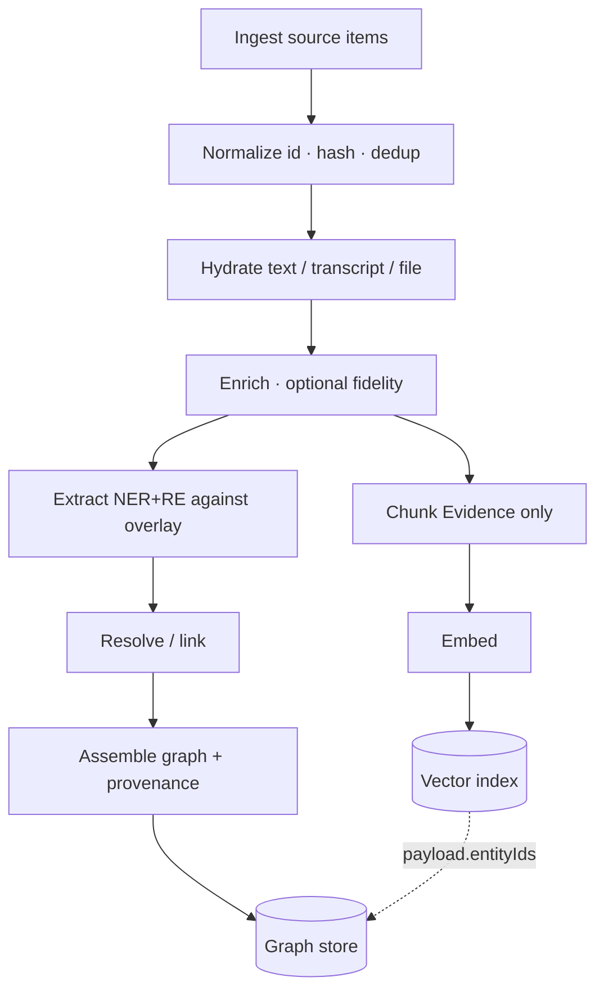
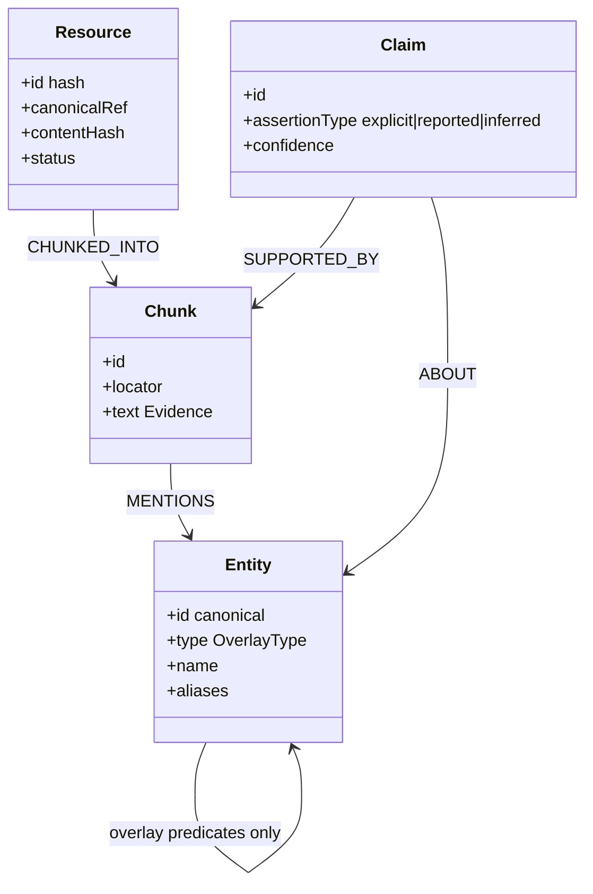
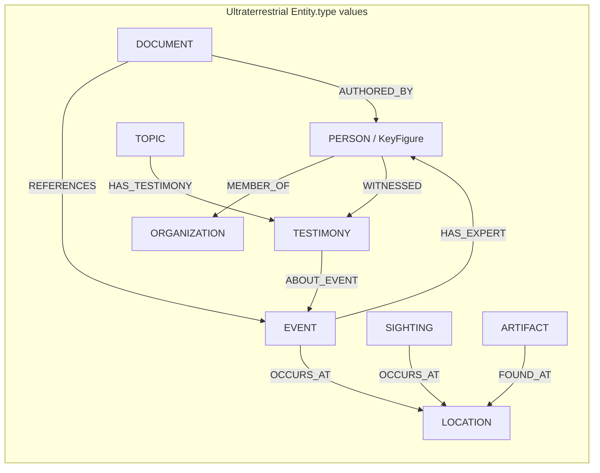
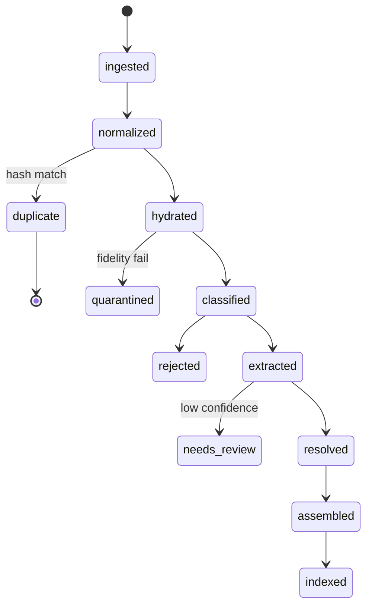

# Diagrams — kernel pipeline + Ultraterrestrial overlay

## 1. Kernel pipeline (same in every applied pack)

## 2. Kernel data model (innate)

## 3. This domain's overlay ontology

`AUTHORED_BY` targets a KeyFigure, not a kernel `Author` node.

## 4. Resource lifecycle (kernel)

