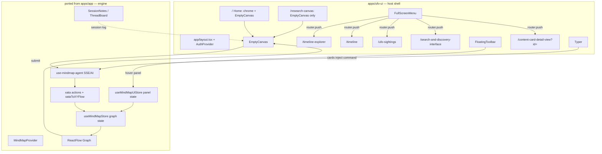

# Marriage plan — ufo-ui shell × mindmap functionality

> Integration strategy for merging `apps/ufo-ui/`'s UI/UX with the mindmap feature
> currently living in `apps/app/src/features/mindmap/`. Default host shell: **ufo-ui**.

## Premise

- **ufo-ui is the host shell.** Its routes, chrome, EmptyCanvas/Typer state,
  FullScreenMenu, FloatingToolbar, and visual language are the source of truth
  for what the user sees.
- **Mindmap is the engine.** `MindMapProvider` + `useMindMapStore` + actions /
  agents / Xata bring the data, AI workflows, and the actual graph.
- `apps/app/src/features/mindmap/research-canvas/` on `origin/dev` is a **prior
  attempt** at the same marriage. It's a useful donor for wiring
  (FloatingToolbar → hover-panels → `mindmap-ui-store`, `use-mindmap-agent`,
  `ai-context`), but its EmptyCanvas/Typer shape diverges from the ufo-ui docs —
  discard that part and keep ufo-ui's UX.

## Shape of the merge



The line `GRAPH --> EC` is the key change: **EmptyCanvas hosts the
`<MindMap />` graph as its primary state** once the user has submitted
anything. Idle = hero + cards; active = graph + session log + Typer at bottom.

## Decisions

### D1. Typer submit bug — fix by deferring `showEnhancedChat`

Currently `use-typer.ts` (in both ufo-ui and the dev stub) does:

```ts
useEffect(() => {
  setActive(input.length > 0)
  if (input.length > 0) setShowEnhancedChat(true)
}, [input])
```

Change to: `showEnhancedChat` only flips on **submit** (form submit *or* card
pin → command injection *followed by* an explicit submit call). Fixes both
keyboard-typed timeline reveals and card-pinned commands at once. Card-keyword
matching is the wrong fix because cards inject non-keyword commands.

### D2. `ResearchTimeline` is a *view* over real session state, not its own state machine

Drop the static `UFO_RESEARCH_EVENTS` hardcoded weeks. Back `ResearchTimeline`
with the real session log already produced by mindmap: every user query, every
node added, every edge formed, every AI tool call. Port from
`apps/app/src/features/mindmap/components/status-ui/{session-notes,thread-board,case-files-and-evidence-board}.tsx`
— these already emit (or are intended to emit) the event stream
`ResearchTimeline` needs.

Keep the monospace ASCII visual style from ufo-ui's `ResearchTimeline.tsx` —
apply it to live data.

### D3. Two command surfaces collapse to one — Typer wins, OracleCommandList's commands port in as Typer suggestions

`MindMapBottomMenu` + `OracleCommandList` (`/chat /search /add /connect
/analyze /scrape`) and Typer + `AnimatedChatWithSuggestions` (Guided Tour /
Deep Research / Explore Network) do the same job. Pick Typer for the shell.
Migrate the OracleCommandList commands into Typer as additional suggestion
chips, keyed off `/`:

| Source | Becomes |
|---|---|
| `/search` + ENTITY_TYPES model selection | Typer suggestion → opens model picker chip → submits search |
| `/add` | Typer suggestion → ENTITY_TYPES grid → mindmap entity load |
| `/analyze` | Typer suggestion → analyze selected nodes (existing context fn) |
| `/scrape` | Typer suggestion → URL input → existing scrape action |
| `/chat` | Default behavior — no chip needed |
| `/connect` | Drop (low-utility, ambiguous with mindmap connections) |

Delete `MindMapBottomMenu`, `OracleCommandList`, `UltraterrestrialModelSelection`,
`oracle-command-menu/`. Keep `oracle-sphere` as an optional Typer ornament.

### D4. FloatingToolbar panels wire to mindmap context — no fresh prototypes

`apps/app` on `origin/dev` already wired this. Port the wiring, not the components:

| Panel (ufo-ui) | Source on origin/dev | Hooks into |
|---|---|---|
| Explore → Network | `NetworkPanel` | `useMindMapStore` nodes/edges + `useReactFlow().fitView()` |
| Explore → Timeline | `TimelinePanel` | `useMindMapStore` filtered by date |
| Explore → Filter | `FilterPanel` | `useMindMapUiStore` filter state → derived graph |
| Explore → Layout | `LayoutPanel` | `organizeLayout()` from `MindMapProvider` |
| Content → Layers | new — ENTITY_TYPES from `mindmap-bottom-menu.tsx:65` | Visibility toggles per layer |
| Content → Assets | `AssetLibraryPanel` | Xata documents/artifacts |
| Manage → Saved views | `SavedViewsPanel` | `saveMindMap`/`restore` from `mindmap-context.tsx:315` |
| Manage → Quick actions | `QuickActionsPanel` | Common context fns (addEntities, analyze, etc.) |
| Manage → History | new | SessionNotes-backed event log |
| Manage → Collaboration | existing Liveblocks setup | Liveblocks already in repo |
| Manage → Settings | new | User prefs |

Toolbar exists on `/` only in current ufo-ui. **Recommendation:** extend to
`/research-canvas` once the graph mounts — otherwise the bare RC route can't
reach the panels.

### D5. State ownership — three stores, clear boundaries

| Store / context | Owns | Survives |
|---|---|---|
| `useMindMapStore` (Zustand) | nodes, edges, graph operations | Page navigation (global singleton) |
| `useMindMapUiStore` (Zustand, ported from dev) | active toolbar panel, view mode, filter state | Page navigation |
| `MindMapProvider` (React context) | ReactFlow instance, derived helpers, agent bindings | Inside `<MindMap />` mount only |
| URL `searchParams` | `?id=`, `?view=`, `?q=` | Bookmarkable / shareable |
| `useTyper` local state | `pinnedCard`, `showEnhancedChat`, ephemeral input | Component lifetime |

The session log lives in `useMindMapStore` (or a sibling `useSessionStore` if
cleaner — TBD when wiring). Typer state stays local — it's UI-only.

### D6. Case Files menu dead-end — make it a real index

The doc-noted `/content-card-detail-view` with no `?id=` is wrong. Two options:

1. **New `/case-files` index route** that lists cases (grid of UFO_SIGHTINGS
   records eventually backed by Xata `documents`/`case-files` tables).
   FullScreenMenu Case Files entry points here. Detail keeps current
   `/content-card-detail-view?id=` shape.
2. Have FullScreenMenu's Case Files entry point at `/ufo-sightings` directly.

**Recommendation:** Option 1, but Option 2 is the cheap escape hatch.

### D7. Data layer — graduate static datasets to Xata via existing actions

- `UFO_SIGHTINGS` static → `fetch-next-mindmap-records.ts` with `table:
  'sightings'` or equivalent. Existing actions on `apps/app` side handle the
  pagination/cursor pattern.
- ResearchTimeline static `UFO_RESEARCH_EVENTS` → session log (D2).
- FloatingToolbar panels → already-wired panels on `origin/dev` (D4).
- Sightings/search → `initiateDatabaseTableQuery`, `askAIAction`,
  `xataToXYFlow` (already used by `MindMapBottomMenu`).

This is the *largest* delivery item — port everything under
`apps/app/src/features/mindmap/actions/`, `agents/`, `ai-context/`,
`workflows/`, and the API routes under
`apps/app/src/app/api/{ai,disclosure,sse,workflow}/` into the ufo-ui app's
`src/`. Keep the import path conventions (`@/features/mindmap/*`); ufo-ui's
`tsconfig.paths` should resolve them after a small alias update.

### D8. Acceptance frame for the previously-failing Storyboard 11b

After D1 + D2, the storyboard's missing Frame 11b becomes:

> User submits any query → `EmptyCanvas` swaps from hero to **graph + session
> log** layout. `ResearchTimeline` panel renders alongside or below the graph,
> populated by real session events. Typer collapses to its `MessageInput`-only
> form at the bottom of the canvas.

Add a target wireframe to `STORYBOARD.md` so the fix is testable.

### D9. Auth — adopt Clerk from apps/app

ufo-ui's `AuthProvider` is a placeholder with no guards. Replace with
`@clerk/nextjs` already wired in `apps/app`. Route guards on `/research-canvas`,
`/admin` only; everything else stays public.

### D10. Where the merged code lives

Two viable layouts:

- **A. ufo-ui absorbs mindmap** — `apps/ufo-ui/src/features/mindmap/` ports from
  `apps/app/src/features/mindmap/`. `apps/app/` is then deprecated, eventually
  deleted.
- **B. Shared package** — extract mindmap engine into `packages/mindmap/` and
  consume from `apps/ufo-ui/`. Heavier; only worthwhile if you'll keep multiple
  consumer apps.

**Recommendation:** Option A. You have one product post-merge.

## Routes, post-merge

| Path | Page module | Shell | Backing data |
|---|---|---|---|
| `/` | `(site)/page.tsx` | Full chrome + EmptyCanvas | Live mindmap (idle hero until first submit) |
| `/research-canvas` | `(site)/research-canvas/page.tsx` | Toolbar + EmptyCanvas (menu added per D4) | Live mindmap |
| `/timeline-explorer` | unchanged | Full | ZAxisTimeline over Xata events |
| `/timeline` | unchanged | Full | Network graph over Xata events |
| `/ufo-sightings` | unchanged | Floating header + menu | Xata sightings |
| `/search-and-discovery-interface` | unchanged | Search hub | `askAIAction` + Xata |
| `/case-files` | **new** (D6) | Floating header + menu | Xata documents/case-files |
| `/content-card-detail-view` | `?id=` required | Detail layout | Xata fetch by id |

## What gets deleted (or moved)

- `apps/app/src/features/mindmap/research-canvas/EmptyCanvas.tsx` and the rest
  of that subdir — superseded by ufo-ui's EmptyCanvas/Typer post-fix.
- `apps/app/src/features/mindmap/components/menus/mindmap-bottom-menu.tsx`,
  `oracle-command-menu/`, `UltraterrestrialModelSelection.tsx` — superseded by
  Typer.
- ufo-ui's `ResearchTimeline.tsx` keeps its shell, swaps its data source (D2).
- ufo-ui's static `@/data/ufo-sightings` becomes a temporary fallback; remove
  once Xata wiring lands.

## Implementation order

1. **Sync the monorepo.** Make `apps/ufo-ui/` and `apps/app/` cohabit on one
   branch. The merge has to happen inside one repo to share dependencies.
2. **Fix the Typer submit bug (D1).** Smallest, highest-signal change. Unblocks
   every demo.
3. **Port `MindMapProvider`, `useMindMapStore`, ReactFlow `<MindMap />` into
   ufo-ui.** Mount it inside `EmptyCanvas` once the user has submitted (borrow
   the `agentStatus` pattern from the dev stub). Hero stays for idle; graph
   appears post-submit. **Slice this into three commits:** store only → graph
   mounts with hardcoded nodes → agent wired.
4. **Wire `use-mindmap-agent` to Typer's onSubmit.** Submitted text → agent →
   `xataToXYFlow` → store updates → graph renders.
5. **Replace `ResearchTimeline` data source (D2).** Session log from store.
6. **Migrate FloatingToolbar panels to wired versions (D4).**
7. **Fix Case Files (D6).** New `/case-files` index.
8. **Graduate sightings/search to Xata (D7).**
9. **Migrate OracleCommandList commands to Typer suggestions (D3).** Then delete
   the old menu.
10. **Auth via Clerk (D9).**
11. **Delete `apps/app/`** once nothing imports from it.

## Verification

- Each step has a single user-visible behavior to test in the browser. After
  step 3, the graph should mount post-submit. After step 5, the session log
  should reflect actions. After step 6, every toolbar panel should mutate the
  graph.
- Storyboard regen: re-capture frames `01`, `02`, `09`, `11b` (new), `12`
  (delete) using the same `agent-browser` workflow already documented.
- Type-check + `bun lint` after each migration step. The mindmap codebase has
  loose typing (lots of `@ts-ignore`) — tighten incrementally where the new
  boundary touches new code; don't refactor existing types in this pass.

## Open questions worth deciding before step 3

- Does `/research-canvas` host the toolbar + menu, or stay bare? *Lean: gain
  them once the graph mounts.*
- Session log persistence: localStorage (current `saveMindMap` pattern) or
  Xata? *Lean: localStorage now; Xata when collaboration matters.*
- ResearchTimeline placement: alongside graph (split view) or below as a docked
  panel? *Affects EmptyCanvas layout — decide before D2.*

---

# Honest review of this plan

## Where this plan is solid

- **D1 (defer `showEnhancedChat` until submit)** is unambiguously right. The
  bug survived the dev port — same `useEffect` triggers on input length, same
  MessageInput unmount risk. Small fix, big unlock.
- **D3 (one command surface, Typer wins)** is the right call given "default to
  ufo-ui." `OracleCommandList` is more powerful but uglier; Typer is the better
  demo surface and the commands port cleanly as suggestion chips.
- **D10 option A (ufo-ui absorbs mindmap, delete apps/app)** — one product, not
  a platform. Packages are premature.

## Where this plan is hedging

- **D2 (ResearchTimeline backed by session log).** Confident in the shape, less
  confident in the existing wiring. The plan assumes `SessionNotes` /
  `ThreadBoard` / `CaseFilesAndEvidenceBoard` emit a queryable event stream;
  they might just be ad-hoc panels with their own state. If so, a new
  `useSessionStore` is needed and the migration grows. **30-minute audit before
  committing.**
- **D7 (graduate static UFO_SIGHTINGS to Xata).** Assumes the Xata schema
  already has a `sightings`-shaped table. If it doesn't, this is a data-import
  task, not a wiring task. `scripts/data-import/` exists but hasn't been
  audited for sightings coverage.
- **D4 (wire FloatingToolbar to mindmap-ui-store).** The dev branch has panels
  wired by import, but "wired" might mean "imports the right module" without
  "produces the right behavior." Mid-migration code.

## Where this plan is honest but unsatisfying

- **The ordering is linear and step 3 is huge.** "Port `MindMapProvider`,
  `useMindMapStore`, ReactFlow `<MindMap />` into ufo-ui" hides work. It's the
  load-bearing step and the one most likely to slip. The implementation order
  splits it into three commits; respect that.

## What to push back on

- **Two Zustand stores may be one too many.** `useMindMapStore` (graph) and
  `useMindMapUiStore` (panel state) is the dev-branch architecture, not
  necessarily the right one. Panel state is small and tied to graph state — one
  store with namespaced slices would be cleaner. Cost of merging later is low,
  so it's not a blocker, but worth questioning while the merge is open.
- **Case Files index (D6) might be scope creep.** Simplest fix is Option 2
  (menu entry points at `/ufo-sightings`). A real `/case-files` index is a
  separate product decision about whether case files and sightings are distinct
  entities. If tight on time, take Option 2.
- **Clerk migration (D9) doesn't have to happen during the merge.** Bundled
  because both apps use auth, but separable. If the merge is already big, defer
  Clerk to a follow-up.

## What to actually do first

Spend an afternoon on **just D1 + step 3 slice 1** (port `useMindMapStore` into
ufo-ui, no UI yet). That tells you whether the import paths, tsconfig, and
dependency surface area work. If those two land cleanly, the rest of the plan
is mechanical. If they don't — if Xata or ReactFlow or Liveblocks fights the
ufo-ui setup — you'll discover that in a day instead of two weeks in.

The plan is good. It just needs you to start small enough to find out what's
wrong with it.
