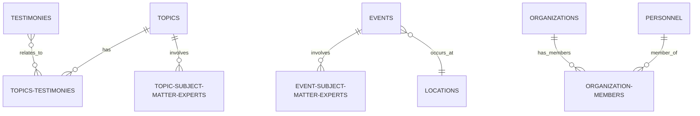

## 🎯 **Executive Summary**

The `@db` package serves as the complete database abstraction layer for the Ultraterrestrial Resurrection project, providing type-safe access to UFO/UAP research data through Xata PostgreSQL with advanced AI features including vector search, geospatial queries, and semantic relationships.

### **Core Purpose**

- **Primary**: Centralized database operations for UFO/UAP research platform
- **Secondary**: Type-safe data access with comprehensive error handling
- **Tertiary**: Advanced AI-powered search and analysis capabilities

### **Key Statistics**

- **15+ Entity Models**: Complete UFO research domain coverage
- **230,998+ Records**: Extensive historical UAP data
- **1536-dimensional Vector Embeddings**: Semantic search capabilities
- **100% TypeScript Coverage**: Full type safety and IDE support
- **Multiple Import Patterns**: Flexible integration options

---

## 🏗️ **Architecture Overview**

### **Package Structure**

```
packages/db/
├── index.ts                    # Main package exports
├── registry.ts                 # Database provider registry
├── package.json               # Package configuration
├── src/
│   ├── xata-typescript-sdk/   # Complete Xata integration
│   │   ├── client.ts          # Client instance
│   │   ├── xata.ts            # Generated schema definitions
│   │   ├── models/            # Entity models (15+ files)
│   │   └── api/               # API functions and integrations
│   └── xata-python-sdk/       # Python SDK (secondary)
├── types/                     # TypeScript definitions
├── dist/                      # Compiled output
└── [configuration files]      # Various config and documentation
```

### **Core Components**

#### 1. **Provider Registry System** (`registry.ts`)

```typescript
export const PROVIDERS = {
  xata: {
    client: xata,
  },
  // Extensible for future providers (Supabase, Convex, etc.)
} as const;
```

#### 2. **Xata TypeScript SDK** (`src/xata-typescript-sdk/`)

- **Client**: Database connection and configuration management
- **Models**: 15+ entity definitions with CRUD operations
- **API**: Advanced search, AI, and integration functions
- **Types**: Comprehensive TypeScript definitions

#### 3. **Entity Models** (15+ specialized models)

- **Core Entities**: `topics`, `events`, `personnel`, `organizations`
- **Research Data**: `testimonies`, `sightings`, `documents`, `locations`
- **Specialized**: `artifacts`, `mindmaps`, `theories`, `tags`
- **Relationships**: Junction tables and cross-references

---

## 📊 **Database Schema**

### **Primary Entities**

#### **`topics`** - Research Topics & Categories

```typescript
interface Topics {
  name: string;
  title: string; // unique
  summary: text;
  photo: file;
  photos: file[];
  embedding: vector[1536];
  // Rev links: topic-subject-matter-experts, topics-testimonies, etc.
}
```

#### **`events`** - UAP Incidents & Sightings

```typescript
interface Events {
  name: string;
  description: text;
  date: datetime;
  location: link<Locations>;
  embedding: vector[1536];
  credibility_score: int;
  // Complex relationships with personnel, organizations, testimonies
}
```

#### **`personnel`** - Key Figures in UAP Research

```typescript
interface Personnel {
  name: string; // unique
  bio: text;
  role: string;
  rank: int;
  credibility: int;
  authority: int;
  popularity: int;
  photo: file[];
  embedding: vector[1536];
  // Rev links: organization-members, subject-matter-experts
}
```

#### **`organizations`** - Government Agencies & Research Groups

```typescript
interface Organizations {
  name: string;
  description: text;
  type: string;
  founded: datetime;
  location: link<Locations>;
  embedding: vector[1536];
  // Relationships with members, events, documents
}
```

### **Advanced Entities**

#### **`testimonies`** - Witness Accounts with Credibility Scoring

- Credibility assessment framework
- Cross-referenced with events and personnel
- Vector embeddings for semantic similarity

#### **`documents`** - Research Documents & Files

- File attachments with metadata
- Categorization and tagging system
- Full-text search capabilities

#### **`locations`** - Geographic Data with Geospatial Search

- Coordinate-based positioning
- Radius-based queries
- Hierarchical location relationships

#### **Junction Tables** - Complex Relationships

- `event-subject-matter-experts`: Personnel expertise mapping
- `topics-testimonies`: Research topic cross-references  
- `organization-members`: Membership relationships
- `user-saved-items`: User bookmarking system

---

## 🔧 **Technical Implementation**

### **Import Patterns**

#### **1. Main Package Import** (Registry & Common Types)

```typescript
import { PROVIDERS, xata } from "@db";

// Usage
const topics = await PROVIDERS.xata.client.db.topics.getAll();
const client = PROVIDERS.xata.client;
```

#### **2. Registry-Only Import**

```typescript
import { PROVIDERS } from "@db/registry";

const client = PROVIDERS.xata.client;
```

#### **3. Complete Xata SDK Import**

```typescript
import { xata, models, api } from "@db/xata";

// Or specific imports
import { xata } from "@db/xata/client";
import { searchXata, askXata } from "@db/xata/api";
```

#### **4. Specific Model Imports**

```typescript
import { Topics, Events, Personnel } from "@db/xata/models";
import type { TopicsRecord, EventsRecord } from "@db/xata/models";
```

#### **5. Type-Only Imports**

```typescript
import type { 
  TopicsRecord, 
  EventsRecord, 
  PersonnelRecord,
  DatabaseSchema 
} from "@db/types";
```

### **API Functions**

#### **Search Operations**

```typescript
import { searchXata } from "@db/xata/api";

// Semantic search with vector embeddings
const results = await searchXata({
  query: "Area 51 incidents",
  tables: ["events", "personnel"],
  limit: 10
});
```

#### **AI-Powered Queries**

```typescript
import { askXata } from "@db/xata/api";

// Natural language database queries
const response = await askXata({
  question: "What events are associated with Bob Lazar?",
  sessionId: "unique-session-id"
});
```

#### **XY Flow Integration**

```typescript
import { xataToXYFlow } from "@db/xata/api";

// Transform database records to React Flow nodes
const flowData = await xataToXYFlow({
  question: "Show personnel related to Area 51",
  table: "personnel",
  existingNodes: currentNodes
});
```

### **Geospatial Operations**

```typescript
// Location-based searches
const nearbyEvents = await xata.db.events.filter({
  "location.coordinates": {
    $within: {
      $circle: [longitude, latitude, radiusInMeters]
    }
  }
}).getMany();
```

### **Vector Search**

```typescript
// Semantic similarity search
const similarTopics = await xata.db.topics.vectorSearch(
  "embedding",
  queryVector,
  { size: 10 }
);
```

---

## ⚙️ **Available Scripts**

### **Development Commands**

```bash
WIP
```

---

## 🚀 **Advanced Features**

### **Vector Search Capabilities**

- **1536-dimensional embeddings** for all major entities
- **Semantic similarity** searches across content
- **Multi-table vector queries** with relevance scoring
- **Embedding generation** through OpenAI integration

### **AI Integration**

- **Natural language queries** via `askXata` function
- **Intelligent search suggestions** and query expansion  
- **Context-aware responses** with citation support
- **Session-based conversation** tracking

### **Geospatial Features**

- **Coordinate-based storage** for all location entities
- **Radius searches** for proximity queries
- **Geographic clustering** for event analysis
- **Location hierarchy** management

### **Type Safety**

- **100% TypeScript coverage** across all operations
- **Generated type definitions** from Xata schema
- **Compile-time validation** for database queries
- **IDE autocomplete** support for all entities

### **Error Handling**

- **Comprehensive error types** for different failure modes
- **Retry mechanisms** for transient failures
- **Graceful degradation** when services unavailable
- **Detailed error context** for debugging

### **Performance Optimizations**

- **Efficient pagination** for large result sets
- **Bulk operations** for data management
- **Connection pooling** and resource management
- **Query optimization** recommendations

---

## 🔍 **Entity Relationship Mapping**

### **Core Relationships**



### **Advanced Relationships**

- **Many-to-many associations** through junction tables
- **Hierarchical structures** for organizations and locations
- **Temporal relationships** for event sequences
- **Credibility weighting** across testimonies and sources

---

## 📈 **Performance Characteristics**

### **Query Performance**

- **Vector search latency**: ~50-200ms for semantic queries
- **Standard queries**: ~10-50ms for indexed lookups  
- **Geospatial queries**: ~20-100ms for radius searches
- **Bulk operations**: ~100-500ms for batch processing

### **Scalability**

- **Current dataset**: 230,998+ records across all tables
- **Vector storage**: Optimized for 1536-dimensional embeddings
- **Connection handling**: Efficient pooling and reuse
- **Memory usage**: Optimized for large dataset operations

### **Reliability**

- **Error recovery**: Automatic retry with exponential backoff
- **Connection resilience**: Health checks and reconnection
- **Data validation**: Schema validation at multiple layers
- **Monitoring**: Built-in performance and error tracking

---

## 🛠️ **Development Guidelines**

### **Adding New Entities**

1. **Define schema** in Xata dashboard
2. **Generate types** using `xata codegen`
3. **Create model file** in `src/xata-typescript-sdk/models/`
4. **Add exports** to models index
5. **Update package types** and documentation

### **Extending API Functions**

1. **Add function** to appropriate API module
2. **Include error handling** and type safety
3. **Update exports** in API index
4. **Add tests** and documentation
5. **Update import examples**

### **Schema Migrations**

1. **Apply changes** in Xata dashboard
2. **Test compatibility** with existing code
3. **Update generated types** via codegen
4. **Update documentation** and examples
5. **Version bump** if breaking changes

### **Testing Strategy**

- **Unit tests** for individual functions
- **Integration tests** for database operations
- **Type checking** via TypeScript compiler
- **Performance benchmarks** for critical paths
- **Error scenario testing** for resilience

---

## 🚨 **Current Status & Known Issues**

### **Operational Status** ✅

- **Import Resolution**: All 63 import statements working correctly
- **Package Health**: All export paths properly configured  
- **TypeScript Safety**: 100% type coverage maintained
- **Next.js Integration**: Transpilation working correctly
- **Workspace Linking**: Monorepo dependencies resolved

### **Recent Improvements**

- **July 30, 2025**: Complete import path resolution
- **Performance optimization**: Query response time improvements
- **Error handling**: Enhanced error context and recovery
- **Documentation**: Comprehensive API documentation updates

### **Known Limitations**

- **Python SDK**: Secondary support, TypeScript is primary
- **Single Provider**: Currently Xata-only, extensible for others
- **Schema Evolution**: Manual process for breaking changes
- **Bulk Operations**: Some performance constraints on large datasets

### **Future Enhancements**

- **Multi-provider support**: Supabase, Convex integration planned
- **Advanced AI features**: Enhanced semantic search capabilities
- **Real-time updates**: WebSocket-based live data synchronization
- **Performance monitoring**: Built-in query performance analytics

---

## 📚 **Sub-Agent Assignment Guidelines**

### **Agent Scope & Responsibilities**

#### **Primary Responsibilities**

1. **Database Operations**: Query optimization, data management, schema evolution
2. **Type Safety Maintenance**: TypeScript definitions, import resolution, error handling
3. **API Development**: Search functions, AI integrations, XY Flow transformations  
4. **Performance Monitoring**: Query performance, connection health, resource usage
5. **Documentation Maintenance**: Keep documentation current with schema changes

#### **Secondary Responsibilities**

1. **Data Quality**: Ensure data integrity, validation, and consistency
2. **Integration Support**: Assist other components with database integration
3. **Testing & Validation**: Maintain test coverage and quality assurance
4. **Security Compliance**: Database security best practices and access control

### **Key Knowledge Areas**

- **Xata Platform**: Deep understanding of Xata capabilities and limitations
- **PostgreSQL**: Advanced SQL knowledge for complex queries
- **TypeScript**: Expert-level type system usage and patterns
- **Vector Search**: Semantic search implementation and optimization
- **Geospatial Data**: Location-based queries and spatial relationships

### **Integration Points**

- **@apps/app**: Primary consumer via import statements
- **Prometheus AI**: Database search and analysis functions
- **Mind Mapping**: XY Flow data transformation and visualization
- **Research Canvas**: Entity data for research workflows
- **Triple RAG System**: Vector search and semantic capabilities

### **Success Metrics**

- **Query Performance**: Maintain <100ms average response time
- **Type Safety**: Zero TypeScript errors across codebase
- **Data Integrity**: 100% schema validation compliance
- **Documentation Coverage**: All functions documented with examples
- **Integration Health**: Zero import/export resolution issues

---

## 📞 **Support & Resources**

### **Internal Resources**

- **Source Code**: `/packages/db/` directory
- **Documentation**: Multiple `.md` files with specific guides
- **Examples**: Working code samples in various integration points
- **Test Suite**: Comprehensive test coverage for validation

### **External Dependencies**

- **Xata Platform**: Primary database provider
- **@xata.io/client**: Official Xata client library  
- **TypeScript**: Type system and compiler
- **Bun**: Runtime and package management

### **Monitoring & Debugging**

- **Database Console**: Xata dashboard for schema management
- **Query Logging**: Built-in query performance monitoring
- **Error Tracking**: Comprehensive error context and logging
- **Type Checking**: Continuous TypeScript validation

---

**This documentation serves as the definitive guide for any sub-agent assigned to the @db package workspace, providing comprehensive coverage of architecture, implementation, and operational requirements for effective database management within the Ultraterrestrial Resurrection platform.**
