# Trace Map — Robert Bigelow and George Knapp discuss UFO disclosure

- **Source ID:** `src:c579d55ac7d4273a`
- **Source:** https://youtu.be/q0N33jb7Bhk
- **Source type:** video · content type: interview_transcript
- **Source hash:** `sha256:1fb20c803701db6b2673879afb4c0e12afe1fc558a69190e15723ca5743b04ad`
- **Schema:** `trace-map.v1` · content version 1 · review state **unreviewed**
- **Generated:** 2026-08-10T17:03:45.412364+00:00 · methodology `rag-prompt-pipeline/ADR-0001`
- **Served by:** openrouter/glm-5.2
- **Integrity flags:** transcript_speaker_tags, filler_words_present, truncated_for_pipeline

## Legend

| Marker | Meaning |
| --- | --- |
| **Source material** | `segment`, `claim`, `evidence`, `entity` — every one carries an exact character span and, where timing exists, a timestamp |
| **[Inferred]** | `inference` — produced by a model, never by the source. Never Evidence, never a Claim |
| **Frontier** | `open_question` — what this source cannot resolve |
| Solid arrow | source-derived relationship |
| Dotted arrow | agent-produced relationship |

## Coverage

The chunker anchored **39%** of the source — 23,848 of 60,574 characters, 769 of 2,030 timed segments.

The pipeline truncates its input at 24,000 characters, so a fraction below that ratio is expected; anything lower is the chunker skipping material.

Anchor methods across segments: `exact` ×11

## Source spine

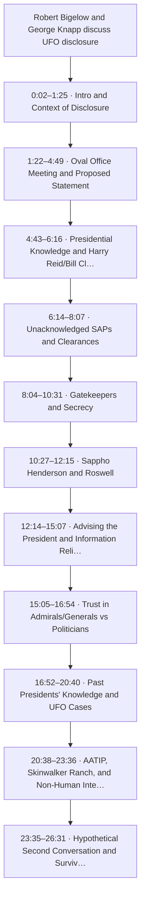

| Segment | Time | Chars | Heading | Density | Anchor |
| --- | --- | --- | --- | --- | --- |
| `c01` | 0:02–1:25 | 0–1431 | Intro and Context of Disclosure | medium | `exact` |
| `c02` | 1:22–4:49 | 1432–4305 | Oval Office Meeting and Proposed Statement | high | `exact` |
| `c03` | 4:43–6:16 | 4306–5799 | Presidential Knowledge and Harry Reid/Bill Clinton | high | `exact` |
| `c04` | 6:14–8:07 | 5803–7775 | Unacknowledged SAPs and Clearances | high | `exact` |
| `c05` | 8:04–10:31 | 7776–9530 | Gatekeepers and Secrecy | high | `exact` |
| `c06` | 10:27–12:15 | 9531–11106 | Sappho Henderson and Roswell | high | `exact` |
| `c07` | 12:14–15:07 | 11110–13583 | Advising the President and Information Reliability | medium | `exact` |
| `c08` | 15:05–16:54 | 13587–15047 | Trust in Admirals/Generals vs Politicians | high | `exact` |
| `c09` | 16:52–20:40 | 15051–18791 | Past Presidents' Knowledge and UFO Cases | high | `exact` |
| `c10` | 20:38–23:36 | 18795–21545 | AATIP, Skinwalker Ranch, and Non-Human Intelligence | high | `exact` |
| `c11` | 23:35–26:31 | 21549–23876 | Hypothetical Second Conversation and Survival | — | `exact` |

## Topics

- **Intro and Context of Disclosure** — introduced at 0:02–1:25 (`c01`)
- **Oval Office Meeting and Proposed Statement** — introduced at 1:22–4:49 (`c02`)
- **Presidential Knowledge and Harry Reid/Bill Clinton** — introduced at 4:43–6:16 (`c03`)
- **Unacknowledged SAPs and Clearances** — introduced at 6:14–8:07 (`c04`)
- **Gatekeepers and Secrecy** — introduced at 8:04–10:31 (`c05`)
- **Sappho Henderson and Roswell** — introduced at 10:27–12:15 (`c06`)
- **Advising the President and Information Reliability** — introduced at 12:14–15:07 (`c07`)
- **Trust in Admirals/Generals vs Politicians** — introduced at 15:05–16:54 (`c08`)
- **Past Presidents' Knowledge and UFO Cases** — introduced at 16:52–20:40 (`c09`)
- **AATIP, Skinwalker Ranch, and Non-Human Intelligence** — introduced at 20:38–23:36 (`c10`)
- **Hypothetical Second Conversation and Survival** — introduced at 23:35–26:31 (`c11`)

## Claims and evidence

### Intro and Context of Disclosure · 0:02–1:25

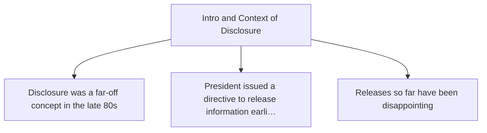

### Oval Office Meeting and Proposed Statement · 1:22–4:49

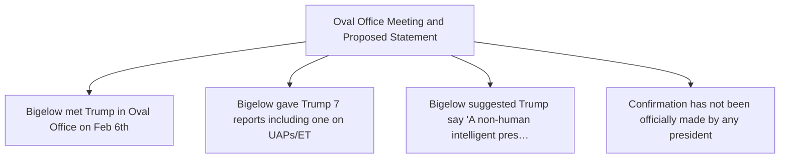

### Presidential Knowledge and Harry Reid/Bill Clinton · 4:43–6:16

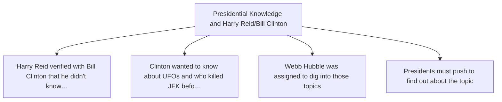

### Unacknowledged SAPs and Clearances · 6:14–8:07

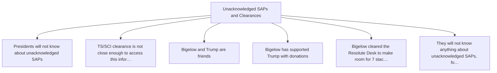

### Gatekeepers and Secrecy · 8:04–10:31

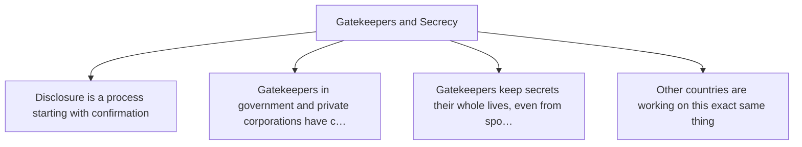

### Sappho Henderson and Roswell · 10:27–12:15

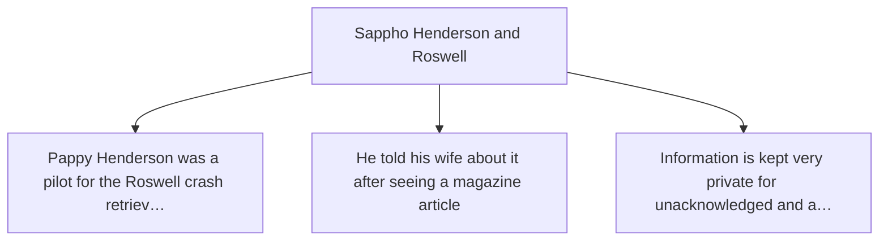

### Advising the President and Information Reliability · 12:14–15:07

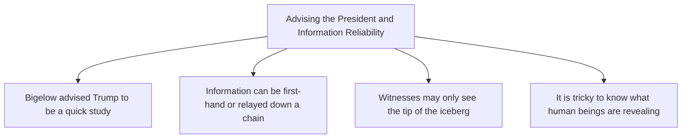

### Trust in Admirals/Generals vs Politicians · 15:05–16:54

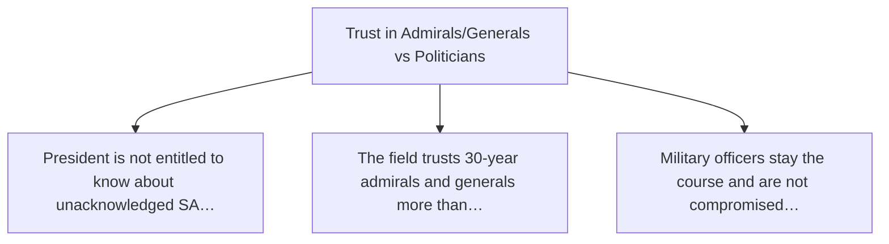

### Past Presidents' Knowledge and UFO Cases · 16:52–20:40

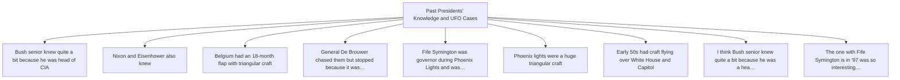

### AATIP, Skinwalker Ranch, and Non-Human Intelligence · 20:38–23:36

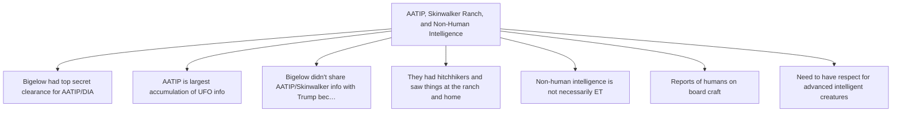

## Open questions

- Verify the date of the Oval Office meeting (stated as Jan- or February 6th) and attendees (William Scharf, Susie Wiles) against White House visitor logs or official schedules.
- Cross-reference Bigelow's account of Harry Reid's conversation with Bill Clinton against Reid's memoir or other public statements.
- Verify the existence and scope of the AATIP/BAS program under DIA and Bigelow's specific role and clearance level.

### Next traces

_None. No stage in this pipeline proposes concrete next sources, so the frontier stops at the questions above rather than naming records to pull._

## Agent-produced readings [Inferred]

Nothing below is Evidence or a Claim. Each is a model's restatement or interpretation, kept because it is useful and labelled because it is not source material.

- **[Inferred]** I was in the Oval Office with the president... Jan- or February the 6th... there was a staff secretary by the name of William Schärf... who was also there with the president, myself. — basis `analysis.primary_claims`
- **[Inferred]** I told him I wanted him to say verbatim... A non-human intelligent presence has been on Earth for a very long time. Using spacecraft and with performances completely beyond our capabilities and our human physics. — basis `analysis.primary_claims`
- **[Inferred]** Harry Reid... verified with Bill Clinton that he didn't know about the subject... President Clinton said to him... before I leave office, there are two things I really want to know. What the hell is the UFO subject all about? And who really killed JFK? — basis `analysis.primary_claims`
- **[Inferred]** He [Pappy Henderson] was one of the pilots of one of the cargo planes taking from Roswell in the crash retrieval of Roswell in '47. — basis `analysis.primary_claims`
- **[Inferred]** I related conversations I have had with General De Brouwer who was a chief of the Air Force for Belgium and there was a very interesting flap that it was about 18 months long with triangle triangular craft. — basis `analysis.primary_claims`
- **[Inferred]** It [AATIP/BAS] operated under the DIA... It's the largest accumulation of UFO info of any government-funded UFO program ever. — basis `analysis.primary_claims`
- **[Inferred]** We have no ability to control anything [regarding UAPs]. We haven't been in control of anything, ever, for this 80 years of modern history. — basis `analysis.primary_claims`
- **[Inferred]** Meeting date stated as Jan- or February 6th during the Trump administration. — basis `analysis.key_findings`
- **[Inferred]** Meeting attendees: Robert Bigelow, President Trump, William Scharf (Staff Secretary), Susie Wiles (mentioned as advising Bigelow). — basis `analysis.key_findings`
- **[Inferred]** Bigelow presented 7 reports to the President, one specifically on UAP/ET/disclosure. — basis `analysis.key_findings`
- **[Inferred]** Bigelow states he held TS/SCI clearance for the AATIP/BAS program under DIA. — basis `analysis.key_findings`
- **[Inferred]** Bigelow references unacknowledged Special Access Programs (SAPs) and claims presidents are not entitled to know about them. — basis `analysis.key_findings`
- **[Inferred]** Historical figures mentioned in relation to UFO knowledge: Harry Reid, Bill Clinton, George H.W. Bush, Richard Nixon, Dwight Eisenhower. — basis `analysis.key_findings`
- **[Inferred]** Bigelow describes 'gatekeepers' in government and private corporations who hold custody of UFO/ET information and hardware. — basis `analysis.key_findings`
- **[Inferred]** Bigelow cites Harry Reid's direct interaction with Bill Clinton regarding Clinton's interest in UFOs and JFK. — basis `analysis.supporting_evidence`
- **[Inferred]** Bigelow cites Sappho Henderson's account of her husband Pappy Henderson's role in the Roswell crash retrieval. — basis `analysis.supporting_evidence`
- **[Inferred]** Bigelow cites General De Brouwer's account of the Belgian UFO wave. — basis `analysis.supporting_evidence`
- **[Inferred]** Bigelow cites Fife Symington's witness status during the Phoenix Lights. — basis `analysis.supporting_evidence`
- **[Inferred]** Bigelow states Clinton didn't know about the subject, but also says 'I think Bush senior knew quite a bit... I think Nixon did. I think Eisenhower did,' indicating varying levels of presidential knowledge across administrations. — basis `analysis.contradictory_evidence`
- **[Inferred]** The consistent theme across Reid, Clinton, and Hubbell accounts suggests a pattern of presidential curiosity met with non-disclosure, which may indicate information compartmentalization outside normal executive channels. — basis `ner.analysis_summary[c03]`
- **[Inferred]** The unnamed staffer/book represents the weakest evidentiary link; identifying this published source would strengthen the corroboration chain. — basis `ner.analysis_summary[c03]`
- **[Inferred]** The narrative's value is anecdotal and contextual rather than evidentiary. It demonstrates how even peripheral participants in alleged crash retrieval operations maintained silence, and how tabloid media could inadvertently trigger disclosures. — basis `ner.analysis_summary[c06]`
- **[Inferred]** Pat Henderson's credibility as a pilot is plausible but unverified in this source; no military records, flight logs, or unit assignments are cited. — basis `ner.analysis_summary[c06]`
- **[Inferred]** The 'businessman' president context strongly suggests Donald Trump, but the text does not name him explicitly; confidence is moderate but not textually grounded. — basis `ner.analysis_summary[c07]`
- **[Inferred]** The interviewee appears to have had direct access to the president, suggesting an institutional or advisory role, but no specific affiliation is stated. — basis `ner.analysis_summary[c07]`
- **[Inferred]** The interviewee's mention of 'survival of consciousness beyond permanent bodily death' alongside UFOs/ETs suggests a broader parapsychological/consciousness research background. — basis `ner.analysis_summary[c07]`

## Trace index

Every diagram ID above resolves here. This table is the contract that makes the Mermaid views inspectable rather than decorative.

| Diagram ID | Node ID | Type | Segments | Time | Label |
| --- | --- | --- | --- | --- | --- |
| `n0` | `src:c579d55ac7d4273a` | source | — | — | Robert Bigelow and George Knapp discuss UFO disclosure |
| `n1` | `seg:c579d55ac7d4273a:c01` | segment | 0–44 | 0:02–1:25 | c01 |
| `n2` | `seg:c579d55ac7d4273a:c02` | segment | 45–134 | 1:22–4:49 | c02 |
| `n3` | `seg:c579d55ac7d4273a:c03` | segment | 134–178 | 4:43–6:16 | c03 |
| `n4` | `seg:c579d55ac7d4273a:c04` | segment | 179–236 | 6:14–8:07 | c04 |
| `n5` | `seg:c579d55ac7d4273a:c05` | segment | 236–307 | 8:04–10:31 | c05 |
| `n6` | `seg:c579d55ac7d4273a:c06` | segment | 307–357 | 10:27–12:15 | c06 |
| `n7` | `seg:c579d55ac7d4273a:c07` | segment | 358–434 | 12:14–15:07 | c07 |
| `n8` | `seg:c579d55ac7d4273a:c08` | segment | 435–484 | 15:05–16:54 | c08 |
| `n9` | `seg:c579d55ac7d4273a:c09` | segment | 485–596 | 16:52–20:40 | c09 |
| `n10` | `seg:c579d55ac7d4273a:c10` | segment | 597–684 | 20:38–23:36 | c10 |
| `n11` | `seg:c579d55ac7d4273a:c11` | segment | 685–768 | 23:35–26:31 | c11 |
| `n12` | `top:e0e803485860` | topic | — | — | Intro and Context of Disclosure |
| `n13` | `top:e47a8ee73209` | topic | — | — | Oval Office Meeting and Proposed Statement |
| `n14` | `top:485f7f52be7a` | topic | — | — | Presidential Knowledge and Harry Reid/Bill Clinton |
| `n15` | `top:d10fc3bc2ee8` | topic | — | — | Unacknowledged SAPs and Clearances |
| `n16` | `top:3b6a5cfc725f` | topic | — | — | Gatekeepers and Secrecy |
| `n17` | `top:6bebf7264643` | topic | — | — | Sappho Henderson and Roswell |
| `n18` | `top:eda3b7bcb2de` | topic | — | — | Advising the President and Information Reliability |
| `n19` | `top:aae493f1abf2` | topic | — | — | Trust in Admirals/Generals vs Politicians |
| `n20` | `top:519178b2e47e` | topic | — | — | Past Presidents' Knowledge and UFO Cases |
| `n21` | `top:05564a2c4f24` | topic | — | — | AATIP, Skinwalker Ranch, and Non-Human Intelligence |
| `n22` | `top:c6ef0e3f12f8` | topic | — | — | Hypothetical Second Conversation and Survival |
| `n23` | `clm:c579d55ac7d4273a:3e353f3a68c0` | claim | 0–44 | 0:02–1:25 | Disclosure was a far-off concept in the late 80s |
| `n24` | `clm:c579d55ac7d4273a:d137fb1fa4b4` | claim | 0–44 | 0:02–1:25 | President issued a directive to release information earlier this year |
| `n25` | `clm:c579d55ac7d4273a:fc8600125c75` | claim | 0–44 | 0:02–1:25 | Releases so far have been disappointing |
| `n26` | `clm:c579d55ac7d4273a:187e45f36c4a` | claim | 45–134 | 1:22–4:49 | Bigelow met Trump in Oval Office on Feb 6th |
| `n27` | `clm:c579d55ac7d4273a:4a5dfc6d86f7` | claim | 45–134 | 1:22–4:49 | Bigelow gave Trump 7 reports including one on UAPs/ET |
| `n28` | `clm:c579d55ac7d4273a:5d743fb9f9d2` | claim | 45–134 | 1:22–4:49 | Bigelow suggested Trump say 'A non-human intelligent presence has been on Earth for a ver… |
| `n29` | `clm:c579d55ac7d4273a:1704494cb612` | claim | 45–134 | 1:22–4:49 | Confirmation has not been officially made by any president |
| `n30` | `clm:c579d55ac7d4273a:26f59727c24b` | claim | 134–178 | 4:43–6:16 | Harry Reid verified with Bill Clinton that he didn't know about the subject |
| `n31` | `clm:c579d55ac7d4273a:a2b4fddd413c` | claim | 134–178 | 4:43–6:16 | Clinton wanted to know about UFOs and who killed JFK before leaving office |
| `n32` | `clm:c579d55ac7d4273a:a9d06e0bde58` | claim | 134–178 | 4:43–6:16 | Webb Hubble was assigned to dig into those topics |
| `n33` | `clm:c579d55ac7d4273a:16f331b9db50` | claim | 134–178 | 4:43–6:16 | Presidents must push to find out about the topic |
| `n34` | `clm:c579d55ac7d4273a:362387b3d725` | claim | 179–236 | 6:14–8:07 | Presidents will not know about unacknowledged SAPs |
| `n35` | `clm:c579d55ac7d4273a:6d099fa70702` | claim | 179–236 | 6:14–8:07 | TS/SCI clearance is not close enough to access this information |
| `n36` | `clm:c579d55ac7d4273a:dc2c94a34f01` | claim | 179–236 | 6:14–8:07 | Bigelow and Trump are friends |
| `n37` | `clm:c579d55ac7d4273a:cff51681f3fb` | claim | 179–236 | 6:14–8:07 | Bigelow has supported Trump with donations |
| `n38` | `clm:c579d55ac7d4273a:0249261fce3c` | claim | 179–236 | 6:14–8:07 | Bigelow cleared the Resolute Desk to make room for 7 stacks of reports |
| `n39` | `clm:c579d55ac7d4273a:cbe5c0d65c78` | claim | 236–307 | 8:04–10:31 | Disclosure is a process starting with confirmation |
| `n40` | `clm:c579d55ac7d4273a:b55a4fc328bd` | claim | 236–307 | 8:04–10:31 | Gatekeepers in government and private corporations have custody of goods/hardware |
| `n41` | `clm:c579d55ac7d4273a:8144511328a9` | claim | 236–307 | 8:04–10:31 | Gatekeepers keep secrets their whole lives, even from spouses |
| `n42` | `clm:c579d55ac7d4273a:3367c30efed3` | claim | 236–307 | 8:04–10:31 | Other countries are working on this exact same thing |
| `n43` | `clm:c579d55ac7d4273a:c16592ece74b` | claim | 307–357 | 10:27–12:15 | Pappy Henderson was a pilot for the Roswell crash retrieval in '47 |
| `n44` | `clm:c579d55ac7d4273a:d2c3762bf276` | claim | 307–357 | 10:27–12:15 | He told his wife about it after seeing a magazine article |
| `n45` | `clm:c579d55ac7d4273a:0da823f9d3a4` | claim | 307–357 | 10:27–12:15 | Information is kept very private for unacknowledged and acknowledged SAPs |
| `n46` | `clm:c579d55ac7d4273a:1fe454596293` | claim | 358–434 | 12:14–15:07 | Bigelow advised Trump to be a quick study |
| `n47` | `clm:c579d55ac7d4273a:20e3979baab6` | claim | 358–434 | 12:14–15:07 | Information can be first-hand or relayed down a chain |
| `n48` | `clm:c579d55ac7d4273a:13e88cdfdaea` | claim | 358–434 | 12:14–15:07 | Witnesses may only see the tip of the iceberg |
| `n49` | `clm:c579d55ac7d4273a:d148c8820204` | claim | 358–434 | 12:14–15:07 | It is tricky to know what human beings are revealing |
| `n50` | `clm:c579d55ac7d4273a:30e9cc2e6186` | claim | 435–484 | 15:05–16:54 | President is not entitled to know about unacknowledged SAPs |
| `n51` | `clm:c579d55ac7d4273a:7811544b731c` | claim | 435–484 | 15:05–16:54 | The field trusts 30-year admirals and generals more than politicians |
| `n52` | `clm:c579d55ac7d4273a:7c7e97f6769f` | claim | 435–484 | 15:05–16:54 | Military officers stay the course and are not compromised by politics |
| `n53` | `clm:c579d55ac7d4273a:cb120d6772be` | claim | 485–596 | 16:52–20:40 | Bush senior knew quite a bit because he was head of CIA |
| `n54` | `clm:c579d55ac7d4273a:8daef79fb60b` | claim | 485–596 | 16:52–20:40 | Nixon and Eisenhower also knew |
| `n55` | `clm:c579d55ac7d4273a:22880cfddea5` | claim | 485–596 | 16:52–20:40 | Belgium had an 18-month flap with triangular craft |
| `n56` | `clm:c579d55ac7d4273a:43a504da9307` | claim | 485–596 | 16:52–20:40 | General De Brouwer chased them but stopped because it was burning fuel |
| `n57` | `clm:c579d55ac7d4273a:2d30c865af74` | claim | 485–596 | 16:52–20:40 | Fife Symington was governor during Phoenix Lights and was an eyewitness |
| `n58` | `clm:c579d55ac7d4273a:1a6ee067bb63` | claim | 485–596 | 16:52–20:40 | Phoenix lights were a huge triangular craft |
| `n59` | `clm:c579d55ac7d4273a:3dacd5bd4e4e` | claim | 485–596 | 16:52–20:40 | Early 50s had craft flying over White House and Capitol |
| `n60` | `clm:c579d55ac7d4273a:1d025c9124d2` | claim | 597–684 | 20:38–23:36 | Bigelow had top secret clearance for AATIP/DIA |
| `n61` | `clm:c579d55ac7d4273a:3752df7c897c` | claim | 597–684 | 20:38–23:36 | AATIP is largest accumulation of UFO info |
| `n62` | `clm:c579d55ac7d4273a:7286be9aba1f` | claim | 597–684 | 20:38–23:36 | Bigelow didn't share AATIP/Skinwalker info with Trump because it wasn't credible enough f… |
| `n63` | `clm:c579d55ac7d4273a:0f2e7cc33d55` | claim | 597–684 | 20:38–23:36 | They had hitchhikers and saw things at the ranch and home |
| `n64` | `clm:c579d55ac7d4273a:5e6566c6ee8a` | claim | 597–684 | 20:38–23:36 | Non-human intelligence is not necessarily ET |
| `n65` | `clm:c579d55ac7d4273a:aa8ea9f86dd0` | claim | 597–684 | 20:38–23:36 | Reports of humans on board craft |
| `n66` | `clm:c579d55ac7d4273a:d4a7f8ce2f67` | claim | 597–684 | 20:38–23:36 | Need to have respect for advanced intelligent creatures |
| `n67` | `inf:c579d55ac7d4273a:8622dc25e2f7` | inference | — | — | I was in the Oval Office with the president... Jan- or February the 6th... there was a st… |
| `n68` | `inf:c579d55ac7d4273a:75b817fae49e` | inference | — | — | I told him I wanted him to say verbatim... A non-human intelligent presence has been on E… |
| `n69` | `inf:c579d55ac7d4273a:bf4209cd3eec` | inference | — | — | Harry Reid... verified with Bill Clinton that he didn't know about the subject... Preside… |
| `n70` | `inf:c579d55ac7d4273a:192c85cda07b` | inference | — | — | He (Pappy Henderson) was one of the pilots of one of the cargo planes taking from Roswell… |
| `n71` | `clm:c579d55ac7d4273a:80d140d3fc93` | claim | 521–524 | 18:03–18:13 | I think Bush senior knew quite a bit because he was a head of CIA. I think Nixon did. I t… |
| `n72` | `inf:c579d55ac7d4273a:989ac5a39894` | inference | — | — | I related conversations I have had with General De Brouwer who was a chief of the Air For… |
| `n73` | `clm:c579d55ac7d4273a:96fa839d119f` | claim | 561–567 | 19:22–19:38 | The one with Fife Symington is in '97 was so interesting because there you had a governor… |
| `n74` | `inf:c579d55ac7d4273a:bcb2a6c120ff` | inference | — | — | It (AATIP/BAS) operated under the DIA... It's the largest accumulation of UFO info of any… |
| `n75` | `clm:c579d55ac7d4273a:f67df9cdb853` | claim | 183–188 | 6:21–6:34 | They will not know anything about unacknowledged SAPs, for sure. And only on a really ser… |
| `n76` | `inf:c579d55ac7d4273a:1825ed5830df` | inference | — | — | We have no ability to control anything (regarding UAPs). We haven't been in control of an… |
| `n77` | `inf:c579d55ac7d4273a:b7d026afb5d6` | inference | — | — | Meeting date stated as Jan- or February 6th during the Trump administration. |
| `n78` | `inf:c579d55ac7d4273a:703483e2d1a8` | inference | — | — | Meeting attendees: Robert Bigelow, President Trump, William Scharf (Staff Secretary), Sus… |
| `n79` | `inf:c579d55ac7d4273a:3f00af1f0fa2` | inference | — | — | Bigelow presented 7 reports to the President, one specifically on UAP/ET/disclosure. |
| `n80` | `inf:c579d55ac7d4273a:0a8e1ed9b10e` | inference | — | — | Bigelow states he held TS/SCI clearance for the AATIP/BAS program under DIA. |
| `n81` | `inf:c579d55ac7d4273a:2aefae3d2916` | inference | — | — | Bigelow references unacknowledged Special Access Programs (SAPs) and claims presidents ar… |
| `n82` | `inf:c579d55ac7d4273a:367378b869f5` | inference | — | — | Historical figures mentioned in relation to UFO knowledge: Harry Reid, Bill Clinton, Geor… |
| `n83` | `inf:c579d55ac7d4273a:823909fe639f` | inference | — | — | Bigelow describes 'gatekeepers' in government and private corporations who hold custody o… |
| `n84` | `inf:c579d55ac7d4273a:2d348e09ee53` | inference | — | — | Bigelow cites Harry Reid's direct interaction with Bill Clinton regarding Clinton's inter… |
| `n85` | `inf:c579d55ac7d4273a:cd45689dbb74` | inference | — | — | Bigelow cites Sappho Henderson's account of her husband Pappy Henderson's role in the Ros… |
| `n86` | `inf:c579d55ac7d4273a:624544fc2ee9` | inference | — | — | Bigelow cites General De Brouwer's account of the Belgian UFO wave. |
| `n87` | `inf:c579d55ac7d4273a:3925280f3d86` | inference | — | — | Bigelow cites Fife Symington's witness status during the Phoenix Lights. |
| `n88` | `inf:c579d55ac7d4273a:ee6cb8ceb291` | inference | — | — | Bigelow states Clinton didn't know about the subject, but also says 'I think Bush senior… |
| `n89` | `ent:c579d55ac7d4273a:personnel:4007d4629229` | entity | 1–5 | 0:11–0:21 | Robert |
| `n90` | `ent:c579d55ac7d4273a:personnel:f8d54da16db4` | entity | 35–37 | 1:04–1:11 | The President |
| `n91` | `ent:c579d55ac7d4273a:event:26b9cb148efa` | entity | 35–39 | 1:04–1:15 | Presidential directive to release UFO/UAP files |
| `n92` | `ent:c579d55ac7d4273a:organization:721c9525ade2` | entity | 26–27 | 0:52–0:55 | Media |
| `n93` | `ent:c579d55ac7d4273a:personnel:762028ec52fb` | entity | 62–65 | 1:59–2:15 | William Schärf |
| `n94` | `ent:c579d55ac7d4273a:personnel:1ad9c0a88fc8` | entity | 68–74 | 2:18–2:34 | Susie Wiles |
| `n95` | `ent:c579d55ac7d4273a:personnel:8df6c3b11a37` | entity | 61–62 | 1:57–2:06 | Unnamed Speaker |
| `n96` | `ent:c579d55ac7d4273a:event:f6c095f404e2` | entity | 61–64 | 1:57–2:14 | Oval Office UAP/ET Disclosure Briefing |
| `n97` | `ent:c579d55ac7d4273a:evidence:a5ec8c672628` | entity | 50–57 | 1:33–1:51 | Seven Topic Reports including UAP/ET/Disclosure |
| `n98` | `ent:c579d55ac7d4273a:evidence:f174b6258e19` | entity | 119–123 | 4:04–4:21 | Proposed Presidential Disclosure Statement |
| `n99` | `ent:c579d55ac7d4273a:location:7279d4ac28bf` | entity | 61–62 | 1:57–2:06 | Oval Office |
| `n100` | `ent:c579d55ac7d4273a:location:d7365df1fa1f` | entity | 107–110 | 3:39–3:49 | Air Force One |
| `n101` | `ent:c579d55ac7d4273a:personnel:839872963a8e` | entity | 136–139 | 4:49–5:00 | Harry Reid |
| `n102` | `ent:c579d55ac7d4273a:personnel:605fb1aa4266` | entity | 148–152 | 5:15–5:28 | Bill Clinton |
| `n103` | `ent:c579d55ac7d4273a:personnel:3ff4f9dcfadb` | entity | 153–156 | 5:26–5:33 | Webb Hubbell |
| `n104` | `ent:c579d55ac7d4273a:personnel:7f5b9b605ee7` | entity | 141–143 | 5:00–5:10 | Unnamed staffer / book author |
| `n105` | `ent:c579d55ac7d4273a:event:ce54f438b40b` | entity | 148–152 | 5:15–5:28 | Bill Clinton pre-departure UFO inquiry |
| `n106` | `ent:c579d55ac7d4273a:event:a835d3aa2374` | entity | 153–156 | 5:26–5:33 | Webb Hubbell investigation assignment |
| `n107` | `ent:c579d55ac7d4273a:evidence:e5d8090caa12` | entity | 141–143 | 5:00–5:10 | Staffer's book referencing Clinton conversation |
| `n108` | `ent:c579d55ac7d4273a:evidence:c58cff3b652e` | entity | — | — | Harry Reid–Bill Clinton verification conversation |
| `n109` | `inf:c579d55ac7d4273a:3862ade3413d` | inference | — | — | The consistent theme across Reid, Clinton, and Hubbell accounts suggests a pattern of pre… |
| `n110` | `inf:c579d55ac7d4273a:22637738f3bf` | inference | — | — | The unnamed staffer/book represents the weakest evidentiary link; identifying this publis… |
| `n111` | `ent:c579d55ac7d4273a:personnel:08682370eb8a` | entity | 194–197 | 6:44–6:52 | Donald Trump |
| `n112` | `ent:c579d55ac7d4273a:personnel:d0784c6b1785` | entity | 228–230 | 7:46–7:55 | William |
| `n113` | `ent:c579d55ac7d4273a:personnel:e7cbb589a7b2` | entity | 190–193 | 6:34–6:46 | Unidentified Interviewee |
| `n114` | `ent:c579d55ac7d4273a:event:def82c5bfc82` | entity | 206–210 | 7:04–7:19 | Oval Office Briefing of President Trump on Sensitive Topics |
| `n115` | `ent:c579d55ac7d4273a:organization:c75bae7088ed` | entity | 206–207 | 7:04–7:11 | White House |
| `n116` | `ent:c579d55ac7d4273a:location:d8184317cda3` | entity | 200–202 | 6:54–7:02 | Mar-a-Lago |
| `n117` | `ent:c579d55ac7d4273a:evidence:144daa95e485` | entity | 233–236 | 7:57–8:07 | Seven stacks of reports left at Resolute Desk |
| `n118` | `ent:c579d55ac7d4273a:evidence:3f29803e9f83` | entity | 216–220 | 7:25–7:34 | Briefing document prepared for Trump |
| `n119` | `ent:c579d55ac7d4273a:personnel:e07cf77b2c31` | entity | 252–255 | 8:40–8:48 | President of the United States |
| `n120` | `ent:c579d55ac7d4273a:organization:c6d23004e73d` | entity | 264–267 | 9:00–9:10 | government locations |
| `n121` | `ent:c579d55ac7d4273a:organization:1c90eda2e9a8` | entity | 264–267 | 9:00–9:10 | private corporation locations |
| `n122` | `ent:c579d55ac7d4273a:evidence:323e4a68fa6f` | entity | — | — | gatekeeper-held UAP information and hardware |
| `n123` | `ent:c579d55ac7d4273a:event:cdcdcc4e0168` | entity | 247–251 | 8:29–8:42 | UAP disclosure process |
| `n124` | `ent:c579d55ac7d4273a:personnel:eeda826bf4cd` | entity | 308–310 | 10:29–10:38 | Sappho Henderson |
| `n125` | `ent:c579d55ac7d4273a:personnel:4f29de7d12f2` | entity | 322–327 | 11:02–11:18 | Pat Henderson |
| `n126` | `ent:c579d55ac7d4273a:personnel:32a708b05cf2` | entity | 330–332 | 11:19–11:27 | Henderson daughter |
| `n127` | `ent:c579d55ac7d4273a:event:f9998c009d19` | entity | 326–327 | 11:10–11:18 | Roswell crash retrieval 1947 |
| `n128` | `ent:c579d55ac7d4273a:event:44a9fe01522f` | entity | — | — | Henderson grocery store disclosure incident |
| `n129` | `ent:c579d55ac7d4273a:evidence:942341187a21` | entity | 340–341 | 11:37–11:42 | Tabloid magazine article (grocery store) |
| `n130` | `ent:c579d55ac7d4273a:organization:01a34efc8d4e` | entity | 340–341 | 11:37–11:42 | Weekly World News |
| `n131` | `ent:c579d55ac7d4273a:location:56046694c3d5` | entity | 325–327 | 11:09–11:18 | Roswell |
| `n132` | `inf:c579d55ac7d4273a:4a9f5e484967` | inference | — | — | The narrative's value is anecdotal and contextual rather than evidentiary. It demonstrate… |
| `n133` | `inf:c579d55ac7d4273a:79ae218d4536` | inference | — | — | Pat Henderson's credibility as a pilot is plausible but unverified in this source; no mil… |
| `n134` | `ent:c579d55ac7d4273a:personnel:508aaae07231` | entity | 380–384 | 12:57–13:13 | Unnamed Presidential Advisor (Interviewee) |
| `n135` | `ent:c579d55ac7d4273a:personnel:993e85b7ddc9` | entity | — | — | Unnamed President (referred to as businessman) |
| `n136` | `ent:c579d55ac7d4273a:event:f88eb3cb8600` | entity | 358–362 | 12:14–12:25 | Presidential briefing meeting on seven topics including UAP/ET disclosure |
| `n137` | `ent:c579d55ac7d4273a:organization:4f3a1cb13356` | entity | 402–403 | 13:52–13:55 | Government agencies (unspecified) |
| `n138` | `inf:c579d55ac7d4273a:fcf4a8fddf89` | inference | — | — | The 'businessman' president context strongly suggests Donald Trump, but the text does not… |
| `n139` | `inf:c579d55ac7d4273a:6078130c5078` | inference | — | — | The interviewee appears to have had direct access to the president, suggesting an institu… |
| `n140` | `inf:c579d55ac7d4273a:4afe5fe318c2` | inference | — | — | The interviewee's mention of 'survival of consciousness beyond permanent bodily death' al… |
| `n141` | `ent:c579d55ac7d4273a:organization:e3d932b06cd8` | entity | — | — | Unacknowledged Special Access Programs |
| `n142` | `ent:c579d55ac7d4273a:organization:5ff711f055ea` | entity | — | — | Intelligence Agency |
| `n143` | `oq:c579d55ac7d4273a:0aa2f7581f24` | open_question | — | — | Verify the date of the Oval Office meeting (stated as Jan- or February 6th) and attendees… |
| `n144` | `oq:c579d55ac7d4273a:0c1637e79fe0` | open_question | — | — | Cross-reference Bigelow's account of Harry Reid's conversation with Bill Clinton against… |
| `n145` | `oq:c579d55ac7d4273a:ce34c9a25e52` | open_question | — | — | Verify the existence and scope of the AATIP/BAS program under DIA and Bigelow's specific… |

**Edges:** 213 across 8 types — `about`, `asserts`, `based_on`, `contains`, `introduced_by`, `mentions`, `precedes`, `raises`

## Limitations

- ⚠️ no next_trace nodes — no pipeline stage proposes concrete next sources
- ⚠️ no reading nodes — no interpretive stage exists; readings are never inferred here
- ⚠️ no counter_reading nodes — paired with reading; unproduced for the same reason
- ⚠️ no speaker nodes — diarisation is unavailable — the transcript carries '>>' turn markers but no speaker identities
- ⚠️ no evidence→claim edges — the analysis prompt emits supporting and contradictory evidence as flat lists with no target claim, so evidence carries a stance but names no claim it bears on
- ⚠️ chunk coverage is 39% of the source (23848 of 60574 chars); the pipeline truncates at 24000 chars

