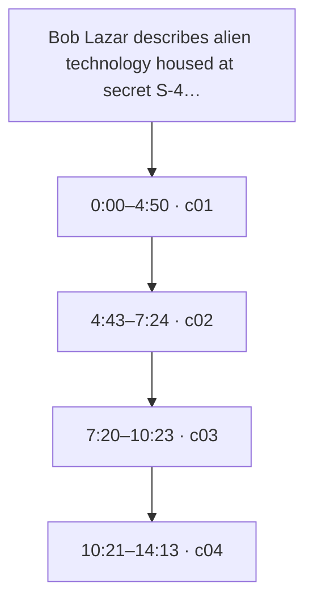
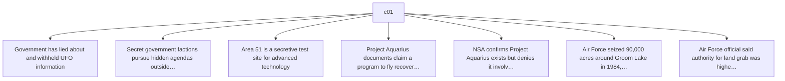
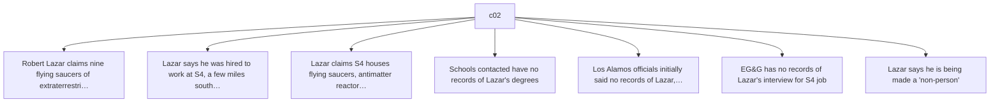
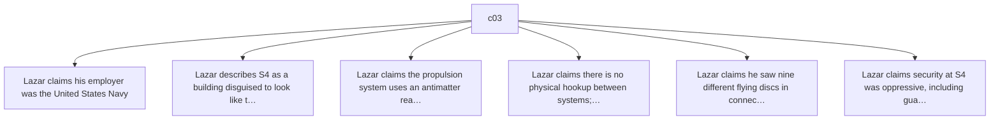
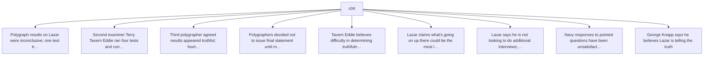

# Trace Map — Bob Lazar describes alien technology housed at secret S-4 base in Nevada -- Part 5

- **Source ID:** `src:785ad6c321102be9`
- **Source:** https://www.youtube.com/watch?v=4UjqFaQq_7I
- **Source type:** video · content type: media
- **Source hash:** `sha256:ffbdfabd1dd0396ed75466c26cf2bd2c5dcf285be6893648b345bd8e34e4c7cf`
- **Schema:** `trace-map.v1` · content version 1 · review state **unreviewed**
- **Generated:** 2026-08-18T06:50:15.296882+00:00 · methodology `rag-prompt-pipeline/ADR-0001`
- **Served by:** deepseek/deepseek-chat
- **Integrity flags:** secondary_repost, transcript_auto

## Legend

| Marker | Meaning |
| --- | --- |
| **Source material** | `segment`, `claim`, `evidence`, `entity` — every one carries an exact character span and, where timing exists, a timestamp |
| **[Inferred]** | `inference` — produced by a model, never by the source. Never Evidence, never a Claim |
| **Frontier** | `open_question` — what this source cannot resolve |
| Solid arrow | source-derived relationship |
| Dotted arrow | agent-produced relationship |

## Coverage

The chunker anchored **100%** of the source — 14,178 of 14,181 characters, 379 of 379 timed segments.

The pipeline truncates its input at 24,000 characters, so a fraction below that ratio is expected; anything lower is the chunker skipping material.

Anchor methods across segments: `exact` ×4

## Source spine

| Segment | Time | Chars | Heading | Density | Anchor |
| --- | --- | --- | --- | --- | --- |
| `c01` | 0:00–4:50 | 0–4744 | — | high | `exact` |
| `c02` | 4:43–7:24 | 4745–7302 | — | high | `exact` |
| `c03` | 7:20–10:23 | 7303–10187 | — | high | `exact` |
| `c04` | 10:21–14:13 | 10188–14181 | — | high | `exact` |

## Topics

_The chunker emitted no heading paths, so no topic tree exists._

## Claims and evidence

### c01 · 0:00–4:50

### c02 · 4:43–7:24

### c03 · 7:20–10:23

### c04 · 10:21–14:13

## Open questions

_None recorded. That is a gap, not closure — see limitations._

### Next traces

_None. No stage in this pipeline proposes concrete next sources, so the frontier stops at the questions above rather than naming records to pull._

## Agent-produced readings [Inferred]

_None._

## Trace index

Every diagram ID above resolves here. This table is the contract that makes the Mermaid views inspectable rather than decorative.

| Diagram ID | Node ID | Type | Segments | Time | Label |
| --- | --- | --- | --- | --- | --- |
| `n0` | `src:785ad6c321102be9` | source | — | — | Bob Lazar describes alien technology housed at secret S-4 base in Nevada -- Part 5 |
| `n1` | `seg:785ad6c321102be9:c01` | segment | 0–127 | 0:00–4:50 | c01 |
| `n2` | `seg:785ad6c321102be9:c02` | segment | 127–196 | 4:43–7:24 | c02 |
| `n3` | `seg:785ad6c321102be9:c03` | segment | 196–270 | 7:20–10:23 | c03 |
| `n4` | `seg:785ad6c321102be9:c04` | segment | 271–378 | 10:21–14:13 | c04 |
| `n5` | `clm:785ad6c321102be9:98e319f46262` | claim | 0–127 | 0:00–4:50 | Government has lied about and withheld UFO information |
| `n6` | `clm:785ad6c321102be9:f3b619a5fa8e` | claim | 0–127 | 0:00–4:50 | Secret government factions pursue hidden agendas outside the law |
| `n7` | `clm:785ad6c321102be9:c8b655611846` | claim | 0–127 | 0:00–4:50 | Area 51 is a secretive test site for advanced technology |
| `n8` | `clm:785ad6c321102be9:78e177a7a2be` | claim | 0–127 | 0:00–4:50 | Project Aquarius documents claim a program to fly recovered alien spacecraft was establis… |
| `n9` | `clm:785ad6c321102be9:614f4b23098a` | claim | 0–127 | 0:00–4:50 | NSA confirms Project Aquarius exists but denies it involves flying saucers |
| `n10` | `clm:785ad6c321102be9:92358ef570c5` | claim | 0–127 | 0:00–4:50 | Air Force seized 90,000 acres around Groom Lake in 1984, allegedly illegally |
| `n11` | `clm:785ad6c321102be9:392e17e35dbe` | claim | 0–127 | 0:00–4:50 | Air Force official said authority for land grab was higher than the Air Force, only answe… |
| `n12` | `clm:785ad6c321102be9:e23d44cfc3f6` | claim | 127–196 | 4:43–7:24 | Robert Lazar claims nine flying saucers of extraterrestrial origin are at S4 |
| `n13` | `clm:785ad6c321102be9:a094b3815f78` | claim | 127–196 | 4:43–7:24 | Lazar says he was hired to work at S4, a few miles south of Groom Lake |
| `n14` | `clm:785ad6c321102be9:cd2e2346afb6` | claim | 127–196 | 4:43–7:24 | Lazar claims S4 houses flying saucers, antimatter reactors, and technology beyond human c… |
| `n15` | `clm:785ad6c321102be9:bd219b4c3edc` | claim | 127–196 | 4:43–7:24 | Schools contacted have no records of Lazar's degrees |
| `n16` | `clm:785ad6c321102be9:535b71fbda08` | claim | 127–196 | 4:43–7:24 | Los Alamos officials initially said no records of Lazar, but a 1982 phone book and newspa… |
| `n17` | `clm:785ad6c321102be9:abe3afe62c2a` | claim | 127–196 | 4:43–7:24 | EG&G has no records of Lazar's interview for S4 job |
| `n18` | `clm:785ad6c321102be9:1ff2a70da845` | claim | 127–196 | 4:43–7:24 | Lazar says he is being made a 'non-person' |
| `n19` | `clm:785ad6c321102be9:398daacda551` | claim | 196–270 | 7:20–10:23 | Lazar claims his employer was the United States Navy |
| `n20` | `clm:785ad6c321102be9:fc83a00c9a06` | claim | 196–270 | 7:20–10:23 | Lazar describes S4 as a building disguised to look like the side of a mountain |
| `n21` | `clm:785ad6c321102be9:966d62002c85` | claim | 196–270 | 7:20–10:23 | Lazar claims the propulsion system uses an antimatter reactor and gravity amplifiers |
| `n22` | `clm:785ad6c321102be9:7ee392c4fc96` | claim | 196–270 | 7:20–10:23 | Lazar claims there is no physical hookup between systems; gravity is used as a wave via w… |
| `n23` | `clm:785ad6c321102be9:adee51e628ec` | claim | 196–270 | 7:20–10:23 | Lazar claims he saw nine different flying discs in connected hangars |
| `n24` | `clm:785ad6c321102be9:4631d3b9eca2` | claim | 196–270 | 7:20–10:23 | Lazar claims security at S4 was oppressive, including guards with M16s and threats |
| `n25` | `clm:785ad6c321102be9:43af2f3f00bf` | claim | 271–378 | 10:21–14:13 | Polygraph results on Lazar were inconclusive; one test truthful, one deceitful |
| `n26` | `clm:785ad6c321102be9:a56fdb054175` | claim | 271–378 | 10:21–14:13 | Second examiner Terry Tavern Eddie ran four tests and concluded no attempt to deceive |
| `n27` | `clm:785ad6c321102be9:5b528eb4e931` | claim | 271–378 | 10:21–14:13 | Third polygrapher agreed results appeared truthful; fourth disagreed, suggesting Lazar mi… |
| `n28` | `clm:785ad6c321102be9:5351d3195ba4` | claim | 271–378 | 10:21–14:13 | Polygraphers decided not to issue final statement until more specific testing |
| `n29` | `clm:785ad6c321102be9:74126a54f6e7` | claim | 271–378 | 10:21–14:13 | Tavern Eddie believes difficulty in determining truthfulness stems from fear drilled into… |
| `n30` | `clm:785ad6c321102be9:89337c5f1cd5` | claim | 271–378 | 10:21–14:13 | Lazar claims what's going on up there could be the most important event in history - phys… |
| `n31` | `clm:785ad6c321102be9:cb40fcc7b936` | claim | 271–378 | 10:21–14:13 | Lazar says he is not looking to do additional interviews; did this one because he feels S… |
| `n32` | `clm:785ad6c321102be9:e4b940d9eabe` | claim | 271–378 | 10:21–14:13 | Navy responses to pointed questions have been unsatisfactory; FOIA requests filed |
| `n33` | `clm:785ad6c321102be9:9cf909089167` | claim | 271–378 | 10:21–14:13 | George Knapp says he believes Lazar is telling the truth |

**Edges:** 36 across 3 types — `asserts`, `contains`, `precedes`

## Limitations

- ⚠️ no next_trace nodes — no pipeline stage proposes concrete next sources
- ⚠️ no reading nodes — no interpretive stage exists; readings are never inferred here
- ⚠️ no counter_reading nodes — paired with reading; unproduced for the same reason
- ⚠️ no speaker nodes — diarisation is unavailable — the transcript carries '>>' turn markers but no speaker identities
- ⚠️ no open questions — the map manufactures closure it has no basis for
- ⚠️ no evidence→claim edges — the analysis prompt emits supporting and contradictory evidence as flat lists with no target claim, so evidence carries a stance but names no claim it bears on

