# Trace Map — Jacques Vallee — Lessons learned after lifetime of investigation

- **Source ID:** `src:fecc118dcbb46285`
- **Source:** https://www.youtube.com/watch?v=_mWPuffi_hc
- **Source type:** video · content type: youtube_video_transcript
- **Source hash:** `sha256:d794a3f8fba62e77c2e8876c812dd6866fd37ba9f4a6413c325bbccd504de957`
- **Schema:** `trace-map.v1` · content version 1 · review state **unreviewed**
- **Generated:** 2026-09-10T22:15:04.922855+00:00 · methodology `rag-prompt-pipeline/ADR-0001`
- **Served by:** openai/gpt-5.6
- **Integrity flags:** automated_transcript_noise, speaker_labels_incomplete, proper_name_transcription_variants, truncated_source, missing_ending

## Legend

| Marker | Meaning |
| --- | --- |
| **Source material** | `segment`, `claim`, `evidence`, `entity` — every one carries an exact character span and, where timing exists, a timestamp |
| **[Inferred]** | `inference` — produced by a model, never by the source. Never Evidence, never a Claim |
| **Frontier** | `open_question` — what this source cannot resolve |
| Solid arrow | source-derived relationship |
| Dotted arrow | agent-produced relationship |

## Coverage

The chunker anchored **29%** of the source — 23,991 of 84,136 characters, 655 of 2,326 timed segments.

The pipeline truncates its input at 24,000 characters, so a fraction below that ratio is expected; anything lower is the chunker skipping material.

Anchor methods across segments: `exact` ×10

## Source spine

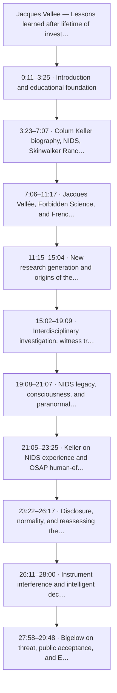

| Segment | Time | Chars | Heading | Density | Anchor |
| --- | --- | --- | --- | --- | --- |
| `c01` | 0:11–3:25 | 0–2839 | Introduction and educational foundation | medium | `exact` |
| `c02` | 3:23–7:07 | 2840–5685 | Colum Keller biography, NIDS, Skinwalker Ranch, and OSAP | high | `exact` |
| `c03` | 7:06–11:17 | 5686–9141 | Jacques Vallée, Forbidden Science, and French space agency research | high | `exact` |
| `c04` | 11:15–15:04 | 9142–12105 | New research generation and origins of the Bigelow–Vallée collaboration | medium | `exact` |
| `c05` | 15:02–19:09 | 12106–15281 | Interdisciplinary investigation, witness trauma, and biological complexity | medium | `exact` |
| `c06` | 19:08–21:07 | 15282–16972 | NIDS legacy, consciousness, and paranormal research | medium | `exact` |
| `c07` | 21:05–23:25 | 16973–19030 | Keller on NIDS experience and OSAP human-effects research | high | `exact` |
| `c08` | 23:22–26:17 | 19031–21043 | Disclosure, normality, and reassessing the phenomenon | medium | `exact` |
| `c09` | 26:11–28:00 | 21044–22506 | Instrument interference and intelligent deception | medium | `exact` |
| `c10` | 27:58–29:48 | 22507–24000 | Bigelow on threat, public acceptance, and ET behavior | medium | `exact` |

## Topics

- **Introduction and educational foundation** — introduced at 0:11–3:25 (`c01`)
- **Colum Keller biography, NIDS, Skinwalker Ranch, and OSAP** — introduced at 3:23–7:07 (`c02`)
- **Jacques Vallée, Forbidden Science, and French space agency research** — introduced at 7:06–11:17 (`c03`)
- **New research generation and origins of the Bigelow–Vallée collaboration** — introduced at 11:15–15:04 (`c04`)
- **Interdisciplinary investigation, witness trauma, and biological complexity** — introduced at 15:02–19:09 (`c05`)
- **NIDS legacy, consciousness, and paranormal research** — introduced at 19:08–21:07 (`c06`)
- **Keller on NIDS experience and OSAP human-effects research** — introduced at 21:05–23:25 (`c07`)
- **Disclosure, normality, and reassessing the phenomenon** — introduced at 23:22–26:17 (`c08`)
- **Instrument interference and intelligent deception** — introduced at 26:11–28:00 (`c09`)
- **Bigelow on threat, public acceptance, and ET behavior** — introduced at 27:58–29:48 (`c10`)

## Claims and evidence

### Introduction and educational foundation · 0:11–3:25

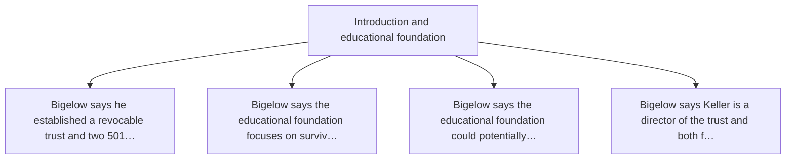

### Colum Keller biography, NIDS, Skinwalker Ranch, and OSAP · 3:23–7:07

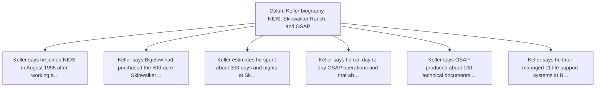

### Jacques Vallée, Forbidden Science, and French space agency research · 7:06–11:17

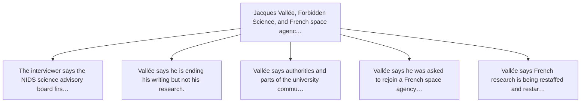

### New research generation and origins of the Bigelow–Vallée collaboration · 11:15–15:04

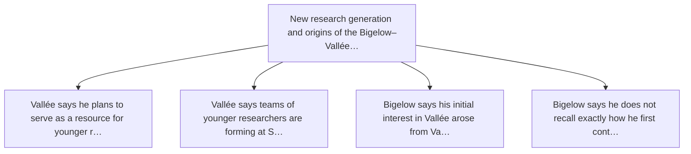

### Interdisciplinary investigation, witness trauma, and biological complexity · 15:02–19:09

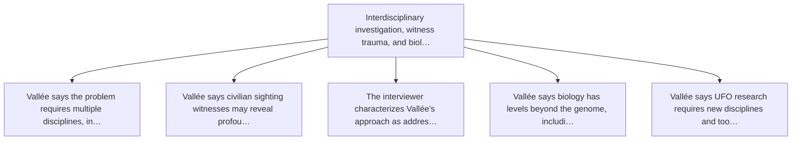

### NIDS legacy, consciousness, and paranormal research · 19:08–21:07

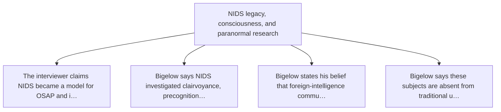

### Keller on NIDS experience and OSAP human-effects research · 21:05–23:25

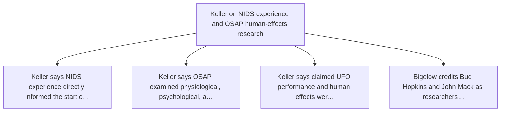

### Disclosure, normality, and reassessing the phenomenon · 23:22–26:17

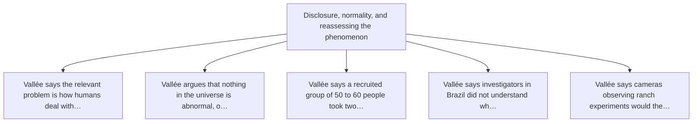

### Instrument interference and intelligent deception · 26:11–28:00

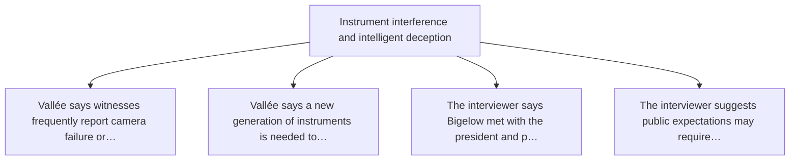

### Bigelow on threat, public acceptance, and ET behavior · 27:58–29:48

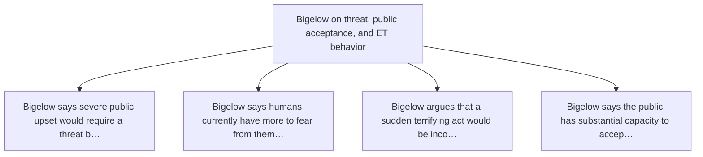

## Open questions

- Obtain the complete video, verify speaker identities and the transcript against the audio, and capture the channel name, publication date, description, and any linked primary documents before ingestion.
- Verify Kelleher's employment and roles through NIDS records, the relevant DIA contract and task documentation, Bigelow Aerospace records, and contemporaneous biographies.
- Resolve all acronyms and names, especially whether 'OSAP' means AAWSAP and whether references to AATIP are being used distinctly or interchangeably.
- Create a document-level inventory of the claimed approximately 100 technical products and reconcile it with the claimed 35 to 38 public releases.
- Verify Vallée's claimed reappointment to the relevant French space-agency committee through CNES or GEIPAN records.
- Verify the legal existence, directors, mission statements, tax status, and funding claims of Bigelow's trust and two 501(c)(3) foundations.
- Seek independent documentation of Bigelow's claimed presidential meeting and identify which president, meeting date, attendees, and materials were provided.
- For any physiological or psychological-effect claims, require de-identified case records, diagnostic criteria, exposure timelines, comparison groups, and alternative-cause assessments.
- For any sensor or performance claims, obtain original files, metadata, calibration histories, platform data, environmental conditions, and chain-of-custody records.
- Run duplicate detection against earlier NIDS, Skinwalker Ranch, AAWSAP/AATIP, and Bigelow interviews to isolate genuinely new statements.

### Next traces

_None. No stage in this pipeline proposes concrete next sources, so the frontier stops at the questions above rather than naming records to pull._

## Agent-produced readings [Inferred]

Nothing below is Evidence or a Claim. Each is a model's restatement or interpretation, kept because it is useful and labelled because it is not source material.

- **[Inferred]** {"signal": "Date", "value": "August 1996", "context": "Kelleher states that he joined NIDS in that month."} — basis `analysis.key_findings`
- **[Inferred]** {"signal": "Date", "value": "January 1996", "context": "The host states that the NIDS science advisory board held its fi — basis `analysis.key_findings`
- **[Inferred]** {"signal": "Location", "value": "Northeastern Utah", "context": "Location of the approximately 500-acre property later k — basis `analysis.key_findings`
- **[Inferred]** {"signal": "Government actor", "value": "Defense Intelligence Agency", "context": "Named as associated with the program  — basis `analysis.key_findings`
- **[Inferred]** {"signal": "Program staffing", "value": "Approximately 50 personnel", "context": "Kelleher's estimate covering scientist — basis `analysis.key_findings`
- **[Inferred]** {"signal": "Program duration", "value": "Just under two and a half years", "context": "Kelleher's estimate for the DIA-a — basis `analysis.key_findings`
- **[Inferred]** {"signal": "Document corpus", "value": "Approximately 100 technical documents", "context": "Claimed program output."} — basis `analysis.key_findings`
- **[Inferred]** {"signal": "Public-release count", "value": "Approximately 35 to 38 documents", "context": "Kelleher's estimate of relea — basis `analysis.key_findings`
- **[Inferred]** {"signal": "Institution", "value": "National Institute for Discovery Science", "context": "Private organization describe — basis `analysis.key_findings`
- **[Inferred]** {"signal": "Institution", "value": "Bigelow Aerospace", "context": "Kelleher states that he managed its life-support sys — basis `analysis.key_findings`
- **[Inferred]** {"signal": "Institution", "value": "Bigelow Institute for Consciousness Studies", "context": "Kelleher identifies it as  — basis `analysis.key_findings`
- **[Inferred]** {"signal": "Foreign-government-related institution", "value": "French space agency committee", "context": "Vallée says h — basis `analysis.key_findings`
- **[Inferred]** {"signal": "Sensor modalities", "value": "Cameras, power supplies, and unspecified instruments", "context": "Discussed i — basis `analysis.key_findings`
- **[Inferred]** {"signal": "Classification marks", "value": "None present", "context": "The supplied excerpt contains no visible classif — basis `analysis.key_findings`

## Trace index

Every diagram ID above resolves here. This table is the contract that makes the Mermaid views inspectable rather than decorative.

| Diagram ID | Node ID | Type | Segments | Time | Label |
| --- | --- | --- | --- | --- | --- |
| `n0` | `src:fecc118dcbb46285` | source | — | — | Jacques Vallee — Lessons learned after lifetime of investigation |
| `n1` | `seg:fecc118dcbb46285:c01` | segment | 0–77 | 0:11–3:25 | c01 |
| `n2` | `seg:fecc118dcbb46285:c02` | segment | 78–158 | 3:23–7:07 | c02 |
| `n3` | `seg:fecc118dcbb46285:c03` | segment | 159–255 | 7:06–11:17 | c03 |
| `n4` | `seg:fecc118dcbb46285:c04` | segment | 256–335 | 11:15–15:04 | c04 |
| `n5` | `seg:fecc118dcbb46285:c05` | segment | 336–421 | 15:02–19:09 | c05 |
| `n6` | `seg:fecc118dcbb46285:c06` | segment | 422–466 | 19:08–21:07 | c06 |
| `n7` | `seg:fecc118dcbb46285:c07` | segment | 467–521 | 21:05–23:25 | c07 |
| `n8` | `seg:fecc118dcbb46285:c08` | segment | 522–576 | 23:22–26:17 | c08 |
| `n9` | `seg:fecc118dcbb46285:c09` | segment | 576–614 | 26:11–28:00 | c09 |
| `n10` | `seg:fecc118dcbb46285:c10` | segment | 615–654 | 27:58–29:48 | c10 |
| `n11` | `top:0f9c090dfa52` | topic | — | — | Introduction and educational foundation |
| `n12` | `top:9125f05511ce` | topic | — | — | Colum Keller biography, NIDS, Skinwalker Ranch, and OSAP |
| `n13` | `top:dc32cca9ee06` | topic | — | — | Jacques Vallée, Forbidden Science, and French space agency research |
| `n14` | `top:1c5c329d1b1d` | topic | — | — | New research generation and origins of the Bigelow–Vallée collaboration |
| `n15` | `top:29f2752ca15c` | topic | — | — | Interdisciplinary investigation, witness trauma, and biological complexity |
| `n16` | `top:bce8eecc5a52` | topic | — | — | NIDS legacy, consciousness, and paranormal research |
| `n17` | `top:1b1e55b54619` | topic | — | — | Keller on NIDS experience and OSAP human-effects research |
| `n18` | `top:e6276eb2bc55` | topic | — | — | Disclosure, normality, and reassessing the phenomenon |
| `n19` | `top:c7eee0df8544` | topic | — | — | Instrument interference and intelligent deception |
| `n20` | `top:5851a45bbcdf` | topic | — | — | Bigelow on threat, public acceptance, and ET behavior |
| `n21` | `clm:fecc118dcbb46285:c4cff66d9ee1` | claim | 0–77 | 0:11–3:25 | Bigelow says he established a revocable trust and two 501(c)(3) foundations. |
| `n22` | `clm:fecc118dcbb46285:f5d437b7a3fc` | claim | 0–77 | 0:11–3:25 | Bigelow says the educational foundation focuses on survival of human consciousness and ET… |
| `n23` | `clm:fecc118dcbb46285:f2f5e657f4f3` | claim | 0–77 | 0:11–3:25 | Bigelow says the educational foundation could potentially have over one billion dollars i… |
| `n24` | `clm:fecc118dcbb46285:e14c5ee83517` | claim | 0–77 | 0:11–3:25 | Bigelow says Keller is a director of the trust and both foundations. |
| `n25` | `clm:fecc118dcbb46285:01848b5a8089` | claim | 78–158 | 3:23–7:07 | Keller says he joined NIDS in August 1996 after working as an immunologist in Denver. |
| `n26` | `clm:fecc118dcbb46285:df85f34ec013` | claim | 78–158 | 3:23–7:07 | Keller says Bigelow had purchased the 500-acre Skinwalker Ranch property in northeastern… |
| `n27` | `clm:fecc118dcbb46285:5b7d31a0a3ac` | claim | 78–158 | 3:23–7:07 | Keller estimates he spent about 300 days and nights at Skinwalker Ranch over six years. |
| `n28` | `clm:fecc118dcbb46285:4ab2372f9322` | claim | 78–158 | 3:23–7:07 | Keller says he ran day-to-day OSAP operations and that about 50 personnel investigated UF… |
| `n29` | `clm:fecc118dcbb46285:d81a5ac680e9` | claim | 78–158 | 3:23–7:07 | Keller says OSAP produced about 100 technical documents, of which roughly 35 to 38 were r… |
| `n30` | `clm:fecc118dcbb46285:79370dac501c` | claim | 78–158 | 3:23–7:07 | Keller says he later managed 11 life-support systems at Bigelow Aerospace. |
| `n31` | `clm:fecc118dcbb46285:0509d3116c7a` | claim | 159–255 | 7:06–11:17 | The interviewer says the NIDS science advisory board first met in January 1996. |
| `n32` | `clm:fecc118dcbb46285:a15c317c5f6c` | claim | 159–255 | 7:06–11:17 | Vallée says he is ending his writing but not his research. |
| `n33` | `clm:fecc118dcbb46285:f9135f7eee84` | claim | 159–255 | 7:06–11:17 | Vallée says authorities and parts of the university community now recognize the subject a… |
| `n34` | `clm:fecc118dcbb46285:3651ee357747` | claim | 159–255 | 7:06–11:17 | Vallée says he was asked to rejoin a French space agency committee researching the proble… |
| `n35` | `clm:fecc118dcbb46285:48f61fe8ba0a` | claim | 159–255 | 7:06–11:17 | Vallée says French research is being restaffed and restarted and that he will spend more… |
| `n36` | `clm:fecc118dcbb46285:f3f16bc647a5` | claim | 256–335 | 11:15–15:04 | Vallée says he plans to serve as a resource for younger researchers entering the field. |
| `n37` | `clm:fecc118dcbb46285:8b158e7ae5fa` | claim | 256–335 | 11:15–15:04 | Vallée says teams of younger researchers are forming at Stanford, Harvard, and Colombia. |
| `n38` | `clm:fecc118dcbb46285:46418cc6105c` | claim | 256–335 | 11:15–15:04 | Bigelow says his initial interest in Vallée arose from Vallée's close research relationsh… |
| `n39` | `clm:fecc118dcbb46285:ebfdc0e84b18` | claim | 256–335 | 11:15–15:04 | Bigelow says he does not recall exactly how he first contacted Vallée. |
| `n40` | `clm:fecc118dcbb46285:c78240662efd` | claim | 336–421 | 15:02–19:09 | Vallée says the problem requires multiple disciplines, including consciousness research. |
| `n41` | `clm:fecc118dcbb46285:f35545e2d967` | claim | 336–421 | 15:02–19:09 | Vallée says civilian sighting witnesses may reveal profound trauma when investigators spe… |
| `n42` | `clm:fecc118dcbb46285:508273fdd540` | claim | 336–421 | 15:02–19:09 | The interviewer characterizes Vallée's approach as addressing long-term human effects in… |
| `n43` | `clm:fecc118dcbb46285:ce24394f57d5` | claim | 336–421 | 15:02–19:09 | Vallée says biology has levels beyond the genome, including the proteome. |
| `n44` | `clm:fecc118dcbb46285:baa4ca941838` | claim | 336–421 | 15:02–19:09 | Vallée says UFO research requires new disciplines and tools and has suffered repeated set… |
| `n45` | `clm:fecc118dcbb46285:bcb33b7b7b53` | claim | 422–466 | 19:08–21:07 | The interviewer claims NIDS became a model for OSAP and influenced later UFO developments. |
| `n46` | `clm:fecc118dcbb46285:56724d1902df` | claim | 422–466 | 19:08–21:07 | Bigelow says NIDS investigated clairvoyance, precognition, remote viewing, and psychokine… |
| `n47` | `clm:fecc118dcbb46285:d5a8227d2c65` | claim | 422–466 | 19:08–21:07 | Bigelow states his belief that foreign-intelligence communication is nearly entirely tele… |
| `n48` | `clm:fecc118dcbb46285:113a3de7aba0` | claim | 422–466 | 19:08–21:07 | Bigelow says these subjects are absent from traditional university education. |
| `n49` | `clm:fecc118dcbb46285:298c0cd26f02` | claim | 467–521 | 21:05–23:25 | Keller says NIDS experience directly informed the start of OSAP. |
| `n50` | `clm:fecc118dcbb46285:573a1af3657a` | claim | 467–521 | 21:05–23:25 | Keller says OSAP examined physiological, psychological, and paranormal effects of UFOs on… |
| `n51` | `clm:fecc118dcbb46285:41833b94efbb` | claim | 467–521 | 21:05–23:25 | Keller says claimed UFO performance and human effects were treated as a continuum. |
| `n52` | `clm:fecc118dcbb46285:a34a12ea7a6d` | claim | 467–521 | 21:05–23:25 | Bigelow credits Bud Hopkins and John Mack as researchers whose work they learned from and… |
| `n53` | `clm:fecc118dcbb46285:08b6e7fc23ae` | claim | 522–576 | 23:22–26:17 | Vallée says the relevant problem is how humans deal with the phenomenon and associated ps… |
| `n54` | `clm:fecc118dcbb46285:7fd4dca31a80` | claim | 522–576 | 23:22–26:17 | Vallée argues that nothing in the universe is abnormal, only unrecognized. |
| `n55` | `clm:fecc118dcbb46285:6d20d4500006` | claim | 522–576 | 23:22–26:17 | Vallée says a recruited group of 50 to 60 people took two years to understand the problem. |
| `n56` | `clm:fecc118dcbb46285:d9c2a1df1525` | claim | 522–576 | 23:22–26:17 | Vallée says investigators in Brazil did not understand what they observed. |
| `n57` | `clm:fecc118dcbb46285:7464cede0492` | claim | 522–576 | 23:22–26:17 | Vallée says cameras observing ranch experiments would themselves need to be watched. |
| `n58` | `clm:fecc118dcbb46285:0694be07232b` | claim | 576–614 | 26:11–28:00 | Vallée says witnesses frequently report camera failure or drained power supplies. |
| `n59` | `clm:fecc118dcbb46285:c552f1d467ea` | claim | 576–614 | 26:11–28:00 | Vallée says a new generation of instruments is needed to engage an intelligent phenomenon… |
| `n60` | `clm:fecc118dcbb46285:e029e5c0c975` | claim | 576–614 | 26:11–28:00 | The interviewer says Bigelow met with the president and provided UFO materials earlier in… |
| `n61` | `clm:fecc118dcbb46285:8d16c991f089` | claim | 576–614 | 26:11–28:00 | The interviewer suggests public expectations may require bodies, saucers, or crash eviden… |
| `n62` | `clm:fecc118dcbb46285:da7dc0ca59f5` | claim | 615–654 | 27:58–29:48 | Bigelow says severe public upset would require a threat beyond anything seen in 80 years. |
| `n63` | `clm:fecc118dcbb46285:a7cda669f391` | claim | 615–654 | 27:58–29:48 | Bigelow says humans currently have more to fear from themselves than from ETs. |
| `n64` | `clm:fecc118dcbb46285:98a44907574b` | claim | 615–654 | 27:58–29:48 | Bigelow argues that a sudden terrifying act would be inconsistent with 80 years of allege… |
| `n65` | `clm:fecc118dcbb46285:076240a175b2` | claim | 615–654 | 27:58–29:48 | Bigelow says the public has substantial capacity to accept the situation and become curio… |
| `n66` | `inf:fecc118dcbb46285:2a7146d94fd9` | inference | — | — | {'signal': 'Date', 'value': 'August 1996', 'context': 'Kelleher states that he joined NID… |
| `n67` | `inf:fecc118dcbb46285:41cf592331b6` | inference | — | — | {'signal': 'Date', 'value': 'January 1996', 'context': 'The host states that the NIDS sci… |
| `n68` | `inf:fecc118dcbb46285:b7ed8fc49a49` | inference | — | — | {'signal': 'Location', 'value': 'Northeastern Utah', 'context': 'Location of the approxim… |
| `n69` | `inf:fecc118dcbb46285:234e257c116e` | inference | — | — | {'signal': 'Government actor', 'value': 'Defense Intelligence Agency', 'context': 'Named… |
| `n70` | `inf:fecc118dcbb46285:70ab9ef5a463` | inference | — | — | {'signal': 'Program staffing', 'value': 'Approximately 50 personnel', 'context': 'Kellehe… |
| `n71` | `inf:fecc118dcbb46285:3e29e8f0090a` | inference | — | — | {'signal': 'Program duration', 'value': 'Just under two and a half years', 'context': 'Ke… |
| `n72` | `inf:fecc118dcbb46285:ca2e7d55b9d6` | inference | — | — | {'signal': 'Document corpus', 'value': 'Approximately 100 technical documents', 'context'… |
| `n73` | `inf:fecc118dcbb46285:56b2292c9036` | inference | — | — | {'signal': 'Public-release count', 'value': 'Approximately 35 to 38 documents', 'context'… |
| `n74` | `inf:fecc118dcbb46285:96c1ab6fdfa3` | inference | — | — | {'signal': 'Institution', 'value': 'National Institute for Discovery Science', 'context':… |
| `n75` | `inf:fecc118dcbb46285:f4a0b3146b6b` | inference | — | — | {'signal': 'Institution', 'value': 'Bigelow Aerospace', 'context': 'Kelleher states that… |
| `n76` | `inf:fecc118dcbb46285:ad2e8ef8020a` | inference | — | — | {'signal': 'Institution', 'value': 'Bigelow Institute for Consciousness Studies', 'contex… |
| `n77` | `inf:fecc118dcbb46285:8438440ea555` | inference | — | — | {'signal': 'Foreign-government-related institution', 'value': 'French space agency commit… |
| `n78` | `inf:fecc118dcbb46285:16413ef3163a` | inference | — | — | {'signal': 'Sensor modalities', 'value': 'Cameras, power supplies, and unspecified instru… |
| `n79` | `inf:fecc118dcbb46285:7218b6521b64` | inference | — | — | {'signal': 'Classification marks', 'value': 'None present', 'context': 'The supplied exce… |
| `n80` | `ent:fecc118dcbb46285:personnel:09b04cad7db8` | entity | 11–11 | 0:30–0:38 | Dr. Colum Keller |
| `n81` | `ent:fecc118dcbb46285:organization:f5a7cc006ad9` | entity | — | — | Revocable trust |
| `n82` | `ent:fecc118dcbb46285:organization:203706d133a3` | entity | — | — | Medical foundation |
| `n83` | `ent:fecc118dcbb46285:organization:c82ae14c743d` | entity | 24–28 | 1:08–1:21 | Educational foundation |
| `n84` | `ent:fecc118dcbb46285:event:98e853fe2100` | entity | — | — | Formation of the trust and two foundations |
| `n85` | `ent:fecc118dcbb46285:evidence:10655787ee69` | entity | — | — | Interview testimony about the trust and foundations |
| `n86` | `ent:fecc118dcbb46285:personnel:2cf063267fd7` | entity | — | — | Colum Keller |
| `n87` | `ent:fecc118dcbb46285:personnel:73f6669c3a4f` | entity | 99–102 | 4:21–4:39 | Robert Bigalow |
| `n88` | `ent:fecc118dcbb46285:organization:d84422dba271` | entity | 82–84 | 3:31–3:42 | National Institute for Discovery Science |
| `n89` | `ent:fecc118dcbb46285:organization:6801f5ac14c6` | entity | 85–87 | 3:39–3:49 | National Jewish Center |
| `n90` | `ent:fecc118dcbb46285:organization:6f0b89e05cb0` | entity | 474–477 | 21:22–21:37 | OSAP program |
| `n91` | `ent:fecc118dcbb46285:organization:fd783868e5c0` | entity | 113–114 | 5:07–5:17 | Defense Intelligence Agency |
| `n92` | `ent:fecc118dcbb46285:organization:3a1f531dc538` | entity | — | — | Bigalow Aerospace |
| `n93` | `ent:fecc118dcbb46285:organization:683e09e5b52c` | entity | — | — | Bigalow Institute for consciousness studies |
| `n94` | `ent:fecc118dcbb46285:event:63a43c8d5ee8` | entity | 101–102 | 4:28–4:39 | Colum Keller joins the National Institute for Discovery Science |
| `n95` | `ent:fecc118dcbb46285:event:ab3bc0afd0fc` | entity | 108–111 | 4:50–5:07 | Skinwalker Ranch investigation |
| `n96` | `ent:fecc118dcbb46285:event:3c9ccfb4a7c6` | entity | — | — | OSAP UFO investigation |
| `n97` | `ent:fecc118dcbb46285:evidence:680910052d61` | entity | 126–129 | 5:47–6:03 | OSAP technical documents |
| `n98` | `ent:fecc118dcbb46285:location:88b842fe0285` | entity | — | — | Skinwalker Ranch |
| `n99` | `ent:fecc118dcbb46285:location:03887adee58d` | entity | — | — | Northeastern Utah |
| `n100` | `ent:fecc118dcbb46285:location:4c6eb87b502e` | entity | 86–87 | 3:42–3:49 | Denver |
| `n101` | `ent:fecc118dcbb46285:location:702e1c9fc717` | entity | — | — | Las Vegas |
| `n102` | `ent:fecc118dcbb46285:personnel:ca1b521b8b69` | entity | 165–167 | 7:20–7:29 | Jacques Vallée |
| `n103` | `ent:fecc118dcbb46285:organization:cee807fc56f2` | entity | 159–161 | 7:06–7:14 | NIDS |
| `n104` | `ent:fecc118dcbb46285:organization:87a966aa5f26` | entity | 175–177 | 7:40–7:48 | NIDS Science Advisory Board |
| `n105` | `ent:fecc118dcbb46285:event:f2a48cbc2556` | entity | 161–163 | 7:09–7:20 | NIDS Science Advisory Board first meeting |
| `n106` | `ent:fecc118dcbb46285:event:d2ec28914d95` | entity | — | — | January 1996 |
| `n107` | `ent:fecc118dcbb46285:evidence:de149d3e2a7f` | entity | 175–177 | 7:40–7:48 | NIDS Science Advisory Board group photograph |
| `n108` | `ent:fecc118dcbb46285:evidence:fa4dd17dce20` | entity | 190–191 | 8:12–8:19 | Forbidden Science |
| `n109` | `ent:fecc118dcbb46285:organization:a688817ace0b` | entity | — | — | French space agency |
| `n110` | `ent:fecc118dcbb46285:organization:d44d997b15a1` | entity | — | — | French space agency UAP research committee |
| `n111` | `ent:fecc118dcbb46285:location:f70e7012ddc0` | entity | 254–255 | 11:13–11:17 | Paris, France |
| `n112` | `ent:fecc118dcbb46285:personnel:624dbcf95b06` | entity | 298–300 | 13:26–13:34 | Robert Bigelow |
| `n113` | `ent:fecc118dcbb46285:personnel:f2c9a912ec04` | entity | 327–329 | 14:43–14:51 | J. Allen Hynek |
| `n114` | `ent:fecc118dcbb46285:personnel:46566fbedfef` | entity | — | — | Dr. Nolan |
| `n115` | `ent:fecc118dcbb46285:personnel:70d7dbc9dedc` | entity | 282–283 | 12:30–12:41 | Dr. Lo |
| `n116` | `ent:fecc118dcbb46285:organization:ac23f5b79054` | entity | — | — | J. Allen Hynek's research team |
| `n117` | `ent:fecc118dcbb46285:organization:de19c97d557a` | entity | 395–396 | 17:43–17:52 | Stanford |
| `n118` | `ent:fecc118dcbb46285:organization:5d84cdf12b52` | entity | — | — | Stanford multidisciplinary research team |
| `n119` | `ent:fecc118dcbb46285:organization:4727010b0ff5` | entity | 282–283 | 12:30–12:41 | Harvard |
| `n120` | `ent:fecc118dcbb46285:organization:c91bd9c288c0` | entity | 282–283 | 12:30–12:41 | Colombia |
| `n121` | `ent:fecc118dcbb46285:event:e180b9047266` | entity | 303–305 | 13:36–13:46 | NIDS formation and initial operation |
| `n122` | `ent:fecc118dcbb46285:evidence:4337bf6d31e3` | entity | 332–333 | 14:54–15:00 | Interview testimony on the origins of the Bigelow–Vallée collaboration |
| `n123` | `ent:fecc118dcbb46285:evidence:a11365dea1d0` | entity | — | — | Jacques Vallée's unnamed new book |
| `n124` | `ent:fecc118dcbb46285:location:b05563f28b69` | entity | 294–296 | 13:16–13:26 | Silicon Valley |
| `n125` | `ent:fecc118dcbb46285:personnel:c7d22edfb875` | entity | — | — | Gary Noland |
| `n126` | `ent:fecc118dcbb46285:personnel:31c58be6d4de` | entity | 374–376 | 16:47–16:55 | Heinek |
| `n127` | `ent:fecc118dcbb46285:evidence:29f2752ca15c` | entity | — | — | Interdisciplinary investigation, witness trauma, and biological complexity |
| `n128` | `ent:fecc118dcbb46285:personnel:4007d4629229` | entity | 422–423 | 19:08–19:13 | Robert |
| `n129` | `ent:fecc118dcbb46285:personnel:881d5fb60090` | entity | 465–466 | 21:02–21:07 | column |
| `n130` | `ent:fecc118dcbb46285:organization:88f43328537b` | entity | 428–429 | 19:19–19:28 | Osap |
| `n131` | `ent:fecc118dcbb46285:organization:ad021d369ce0` | entity | 429–430 | 19:21–19:30 | OAP |
| `n132` | `ent:fecc118dcbb46285:organization:7cd2e9f086f7` | entity | 430–431 | 19:26–19:32 | ATIP |
| `n133` | `ent:fecc118dcbb46285:organization:b78877a21275` | entity | 430–431 | 19:26–19:32 | New York Times |
| `n134` | `ent:fecc118dcbb46285:event:4cd7608f53c4` | entity | 424–426 | 19:12–19:19 | NIDS start period |
| `n135` | `ent:fecc118dcbb46285:event:11dfafca5fb4` | entity | 431–432 | 19:28–19:33 | Tic Tac case investigation |
| `n136` | `ent:fecc118dcbb46285:evidence:c19c15621df7` | entity | 430–431 | 19:26–19:32 | New York Times story |
| `n137` | `ent:fecc118dcbb46285:evidence:70060526cb56` | entity | 436–437 | 19:37–19:45 | Robert interview testimony |
| `n138` | `ent:fecc118dcbb46285:location:a792613c42d4` | entity | 434–436 | 19:33–19:43 | this building |
| `n139` | `ent:fecc118dcbb46285:location:c1cfa5d69aa2` | entity | 465–466 | 21:02–21:07 | the ranch |
| `n140` | `ent:fecc118dcbb46285:personnel:ffa7e158c872` | entity | — | — | Keller |
| `n141` | `ent:fecc118dcbb46285:personnel:742b9bb2306e` | entity | 471–474 | 21:15–21:28 | Jacques |
| `n142` | `ent:fecc118dcbb46285:personnel:b08717ab95eb` | entity | 496–499 | 22:22–22:35 | Bud Hopkins |
| `n143` | `ent:fecc118dcbb46285:personnel:b026e7e9ea0f` | entity | 496–499 | 22:22–22:35 | John Mack |
| `n144` | `ent:fecc118dcbb46285:personnel:9c307db4e836` | entity | 503–505 | 22:38–22:47 | Stephen Spielberg |
| `n145` | `ent:fecc118dcbb46285:evidence:312f2c8c5279` | entity | 503–507 | 22:38–22:52 | Disclosure Day |
| `n146` | `ent:fecc118dcbb46285:organization:3db20e1df89a` | entity | 512–515 | 22:59–23:11 | Congress |
| `n147` | `ent:fecc118dcbb46285:evidence:722eb10d4186` | entity | 486–490 | 21:58–22:13 | Keller statement on NIDS and OSAP human-effects research |
| `n148` | `ent:fecc118dcbb46285:evidence:26c15dd571d5` | entity | — | — | Disclosure, normality, and reassessing the phenomenon testimony excerpt |
| `n149` | `ent:fecc118dcbb46285:personnel:7df395e98fb2` | entity | — | — | Spielberg |
| `n150` | `ent:fecc118dcbb46285:organization:04e027e4990a` | entity | 561–562 | 25:27–25:37 | bus |
| `n151` | `ent:fecc118dcbb46285:event:89b8ca498050` | entity | 564–566 | 25:37–25:48 | Brazil field visit by recruited personnel |
| `n152` | `ent:fecc118dcbb46285:location:5c8f52ca2896` | entity | — | — | Brazil |
| `n153` | `ent:fecc118dcbb46285:event:e2ace73d0348` | entity | — | — | Ranch camera-instrumentation planning session |
| `n154` | `oq:fecc118dcbb46285:bf090c8eeb27` | open_question | — | — | Obtain the complete video, verify speaker identities and the transcript against the audio… |
| `n155` | `oq:fecc118dcbb46285:99e5fc17d5f1` | open_question | — | — | Verify Kelleher's employment and roles through NIDS records, the relevant DIA contract an… |
| `n156` | `oq:fecc118dcbb46285:e8643edba964` | open_question | — | — | Resolve all acronyms and names, especially whether 'OSAP' means AAWSAP and whether refere… |
| `n157` | `oq:fecc118dcbb46285:20ddbb4b1fcf` | open_question | — | — | Create a document-level inventory of the claimed approximately 100 technical products and… |
| `n158` | `oq:fecc118dcbb46285:560c0dcb05cf` | open_question | — | — | Verify Vallée's claimed reappointment to the relevant French space-agency committee throu… |
| `n159` | `oq:fecc118dcbb46285:4708ded6b620` | open_question | — | — | Verify the legal existence, directors, mission statements, tax status, and funding claims… |
| `n160` | `oq:fecc118dcbb46285:9d6191bdd298` | open_question | — | — | Seek independent documentation of Bigelow's claimed presidential meeting and identify whi… |
| `n161` | `oq:fecc118dcbb46285:f965258daa3c` | open_question | — | — | For any physiological or psychological-effect claims, require de-identified case records,… |
| `n162` | `oq:fecc118dcbb46285:8b31a83bf7db` | open_question | — | — | For any sensor or performance claims, obtain original files, metadata, calibration histor… |
| `n163` | `oq:fecc118dcbb46285:ef6285814cd5` | open_question | — | — | Run duplicate detection against earlier NIDS, Skinwalker Ranch, AAWSAP/AATIP, and Bigelow… |

**Edges:** 235 across 8 types — `about`, `asserts`, `based_on`, `contains`, `introduced_by`, `mentions`, `precedes`, `raises`

## Limitations

- ⚠️ no next_trace nodes — no pipeline stage proposes concrete next sources
- ⚠️ no reading nodes — no interpretive stage exists; readings are never inferred here
- ⚠️ no counter_reading nodes — paired with reading; unproduced for the same reason
- ⚠️ no speaker nodes — diarisation is unavailable — the transcript carries '>>' turn markers but no speaker identities
- ⚠️ no evidence→claim edges — the analysis prompt emits supporting and contradictory evidence as flat lists with no target claim, so evidence carries a stance but names no claim it bears on
- ⚠️ chunk coverage is 29% of the source (23991 of 84136 chars); the pipeline truncates at 24000 chars

