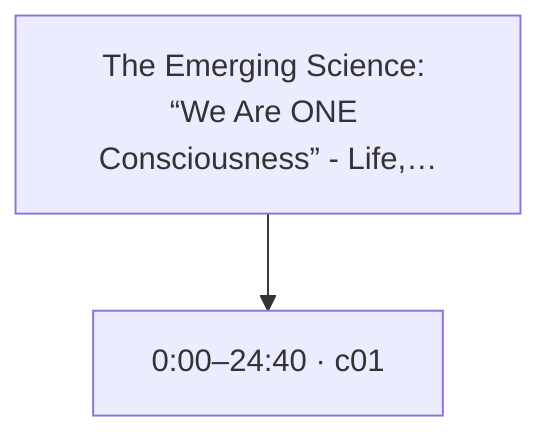

# Trace Map — The Emerging Science: “We Are ONE Consciousness” - Life, Death & The Simulation | Donald Hoffman

- **Source ID:** `src:05c7bac7f29bb50b`
- **Source:** https://www.youtube.com/watch?v=ffgzkHCGZGE
- **Source type:** video · content type: media
- **Source hash:** `sha256:040421ef7f902e497529bbd40093db599b15b52707f9f07f1922b5a975337942`
- **Schema:** `trace-map.v1` · content version 1 · review state **unreviewed**
- **Generated:** 2026-08-18T06:52:06.684052+00:00 · methodology `rag-prompt-pipeline/ADR-0001`
- **Served by:** deepseek/deepseek-chat
- **Integrity flags:** transcript_noise, truncated_source

## Legend

| Marker | Meaning |
| --- | --- |
| **Source material** | `segment`, `claim`, `evidence`, `entity` — every one carries an exact character span and, where timing exists, a timestamp |
| **[Inferred]** | `inference` — produced by a model, never by the source. Never Evidence, never a Claim |
| **Frontier** | `open_question` — what this source cannot resolve |
| Solid arrow | source-derived relationship |
| Dotted arrow | agent-produced relationship |

## Coverage

The chunker anchored **18%** of the source — 24,000 of 130,324 characters, 649 of 3,587 timed segments.

The pipeline truncates its input at 24,000 characters, so a fraction below that ratio is expected; anything lower is the chunker skipping material.

Anchor methods across segments: `prefix_suffix` ×1

## Source spine

| Segment | Time | Chars | Heading | Density | Anchor |
| --- | --- | --- | --- | --- | --- |
| `c01` | 0:00–24:40 | 0–24000 | — | high | `prefix_suffix` |

## Topics

_The chunker emitted no heading paths, so no topic tree exists._

## Claims and evidence

### c01 · 0:00–24:40

```mermaid
flowchart TD
  n1["c01"]
  n2["Evolution shapes sensory systems for adaptive behavior, n…"]
  n1 --> n2
  n3["Probability is precisely zero that evolution shaped us to…"]
  n1 --> n3
  n4["SpaceTime is not fundamental; it is a headset or interfac…"]
  n1 --> n4
  n5["Local realism is false, supported by Nobel Prize."]
  n1 --> n5
  n6["Quantum states are degrees of subjective belief (QBism)."]
  n1 --> n6
  n7["Positive geometries like amplitudhedron may have billions…"]
  n1 --> n7
  n8["Simulation theory (Bostrom) assumes physicalism and compu…"]
  n1 --> n8
  n9["No computational theory explains even one specific consci…"]
  n1 --> n9
  n10["Neurons are a headset projection; neuroscience needs to r…"]
  n1 --> n10
  n11["Panpsychism (as described) ties consciousness to particle…"]
  n1 --> n11
```

## Open questions

_None recorded. That is a gap, not closure — see limitations._

### Next traces

_None. No stage in this pipeline proposes concrete next sources, so the frontier stops at the questions above rather than naming records to pull._

## Agent-produced readings [Inferred]

_None._

## Trace index

Every diagram ID above resolves here. This table is the contract that makes the Mermaid views inspectable rather than decorative.

| Diagram ID | Node ID | Type | Segments | Time | Label |
| --- | --- | --- | --- | --- | --- |
| `n0` | `src:05c7bac7f29bb50b` | source | — | — | The Emerging Science: “We Are ONE Consciousness” - Life, Death & The Simulation | Donald… |
| `n1` | `seg:05c7bac7f29bb50b:c01` | segment | 0–648 | 0:00–24:40 | c01 |
| `n2` | `clm:05c7bac7f29bb50b:dffdc8623a27` | claim | 0–648 | 0:00–24:40 | Evolution shapes sensory systems for adaptive behavior, not objective truth. |
| `n3` | `clm:05c7bac7f29bb50b:091f2935655a` | claim | 0–648 | 0:00–24:40 | Probability is precisely zero that evolution shaped us to see reality as it is. |
| `n4` | `clm:05c7bac7f29bb50b:d0b1dbd081b0` | claim | 0–648 | 0:00–24:40 | SpaceTime is not fundamental; it is a headset or interface. |
| `n5` | `clm:05c7bac7f29bb50b:8765b67efd84` | claim | 0–648 | 0:00–24:40 | Local realism is false, supported by Nobel Prize. |
| `n6` | `clm:05c7bac7f29bb50b:0be33324dc90` | claim | 0–648 | 0:00–24:40 | Quantum states are degrees of subjective belief (QBism). |
| `n7` | `clm:05c7bac7f29bb50b:5cfb25f332e5` | claim | 0–648 | 0:00–24:40 | Positive geometries like amplitudhedron may have billions of dimensions. |
| `n8` | `clm:05c7bac7f29bb50b:6389cc013875` | claim | 0–648 | 0:00–24:40 | Simulation theory (Bostrom) assumes physicalism and computational consciousness, both fal… |
| `n9` | `clm:05c7bac7f29bb50b:7dccb3b9588a` | claim | 0–648 | 0:00–24:40 | No computational theory explains even one specific conscious experience. |
| `n10` | `clm:05c7bac7f29bb50b:2b5676f20e76` | claim | 0–648 | 0:00–24:40 | Neurons are a headset projection; neuroscience needs to reverse engineer deeper reality. |
| `n11` | `clm:05c7bac7f29bb50b:5d1096e37b9a` | claim | 0–648 | 0:00–24:40 | Panpsychism (as described) ties consciousness to particles of the standard model, which i… |

**Edges:** 11 across 2 types — `asserts`, `contains`

## Limitations

- ⚠️ no next_trace nodes — no pipeline stage proposes concrete next sources
- ⚠️ no reading nodes — no interpretive stage exists; readings are never inferred here
- ⚠️ no counter_reading nodes — paired with reading; unproduced for the same reason
- ⚠️ no speaker nodes — diarisation is unavailable — the transcript carries '>>' turn markers but no speaker identities
- ⚠️ no open questions — the map manufactures closure it has no basis for
- ⚠️ no evidence→claim edges — the analysis prompt emits supporting and contradictory evidence as flat lists with no target claim, so evidence carries a stance but names no claim it bears on
- ⚠️ chunk coverage is 18% of the source (24000 of 130324 chars); the pipeline truncates at 24000 chars

