# Trace Map — The "Horrible Truth" about The Alien Deal - DEBRIEFED ep. 20

- **Source ID:** `src:1038c3089e3136ea`
- **Source:** https://www.youtube.com/watch?v=5neRAsS0nrY
- **Source type:** video · content type: media
- **Source hash:** `sha256:c74eb3a13eab92f7eb4dbe6b17fd7ea612563d71a4fb36eed43968a8dde2c0af`
- **Schema:** `trace-map.v1` · content version 1 · review state **unreviewed**
- **Generated:** 2026-08-18T06:55:56.014811+00:00 · methodology `rag-prompt-pipeline/ADR-0001`
- **Served by:** deepseek/deepseek-chat
- **Integrity flags:** secondary_repost, transcript_noise

## Legend

| Marker | Meaning |
| --- | --- |
| **Source material** | `segment`, `claim`, `evidence`, `entity` — every one carries an exact character span and, where timing exists, a timestamp |
| **[Inferred]** | `inference` — produced by a model, never by the source. Never Evidence, never a Claim |
| **Frontier** | `open_question` — what this source cannot resolve |
| Solid arrow | source-derived relationship |
| Dotted arrow | agent-produced relationship |

## Coverage

The chunker anchored **42%** of the source — 23,984 of 57,379 characters, 644 of 1,543 timed segments.

The pipeline truncates its input at 24,000 characters, so a fraction below that ratio is expected; anything lower is the chunker skipping material.

Anchor methods across segments: `exact` ×17

## Source spine

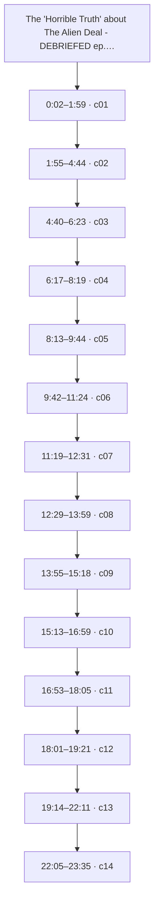

_Showing the first 14 of 17 segments; the full spine is in the trace index below._

| Segment | Time | Chars | Heading | Density | Anchor |
| --- | --- | --- | --- | --- | --- |
| `c01` | 0:02–1:59 | 0–1656 | — | low | `exact` |
| `c02` | 1:55–4:44 | 1657–4158 | — | medium | `exact` |
| `c03` | 4:40–6:23 | 4159–5585 | — | medium | `exact` |
| `c04` | 6:17–8:19 | 5586–7299 | — | high | `exact` |
| `c05` | 8:13–9:44 | 7300–8600 | — | high | `exact` |
| `c06` | 9:42–11:24 | 8601–10123 | — | high | `exact` |
| `c07` | 11:19–12:31 | 10124–11028 | — | high | `exact` |
| `c08` | 12:29–13:59 | 11029–12537 | — | medium | `exact` |
| `c09` | 13:55–15:18 | 12538–13875 | — | medium | `exact` |
| `c10` | 15:13–16:59 | 13876–15425 | — | high | `exact` |
| `c11` | 16:53–18:05 | 15426–16445 | — | high | `exact` |
| `c12` | 18:01–19:21 | 16446–17647 | — | high | `exact` |
| `c13` | 19:14–22:11 | 17648–20267 | — | high | `exact` |
| `c14` | 22:05–23:35 | 20268–21211 | — | high | `exact` |
| `c15` | 23:29–24:42 | 21212–22202 | — | high | `exact` |
| `c16` | 24:37–25:49 | 22203–23240 | — | high | `exact` |
| `c17` | 25:44–26:44 | 23241–24000 | — | high | `exact` |

## Topics

_The chunker emitted no heading paths, so no topic tree exists._

## Claims and evidence

### c01 · 0:02–1:59

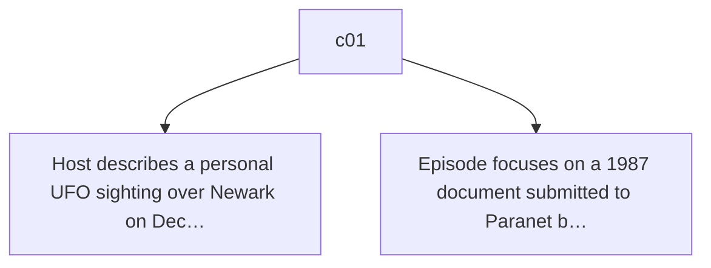

### c02 · 1:55–4:44

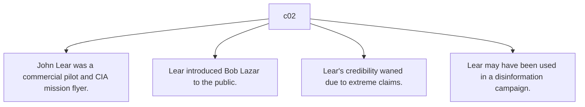

### c03 · 4:40–6:23

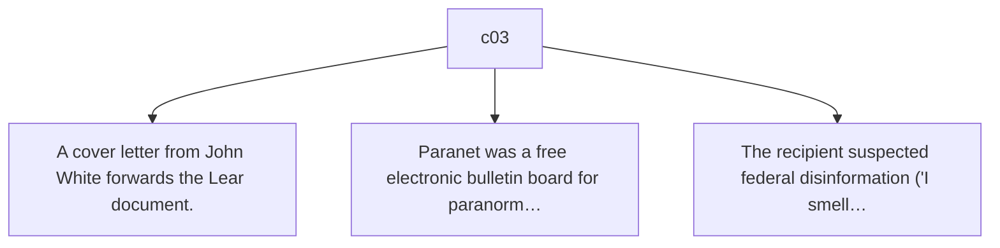

### c04 · 6:17–8:19

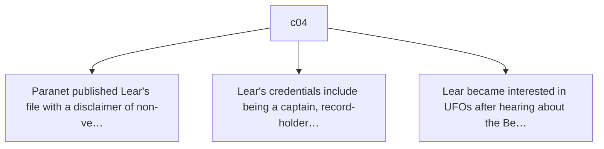

### c05 · 8:13–9:44

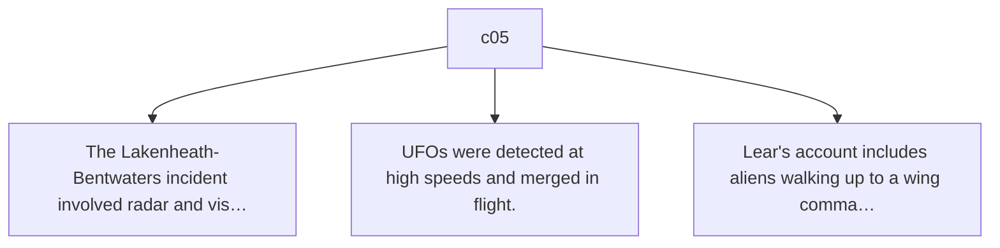

### c06 · 9:42–11:24

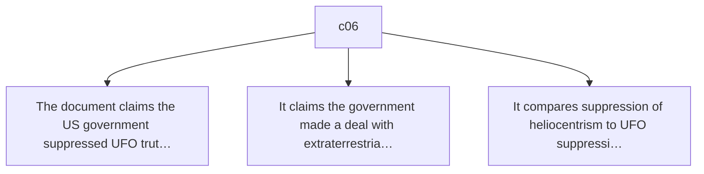

### c07 · 11:19–12:31

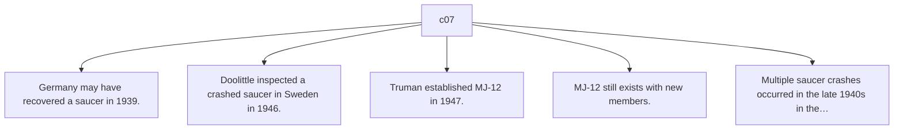

### c08 · 12:29–13:59

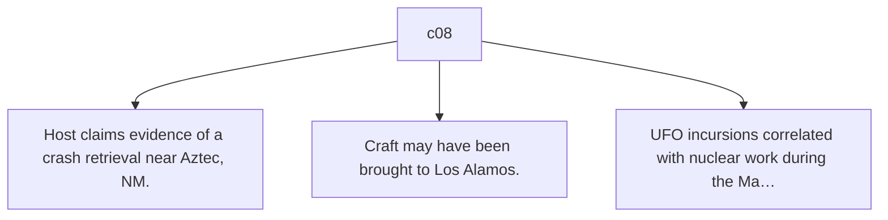

### c09 · 13:55–15:18

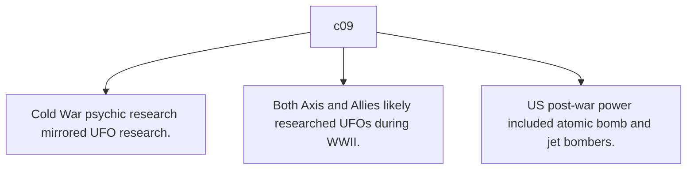

### c10 · 15:13–16:59

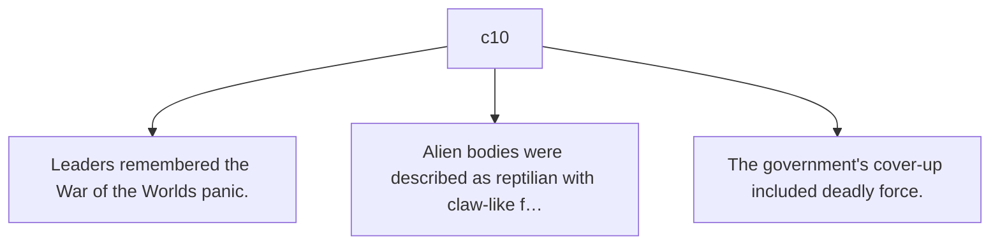

### c11 · 16:53–18:05

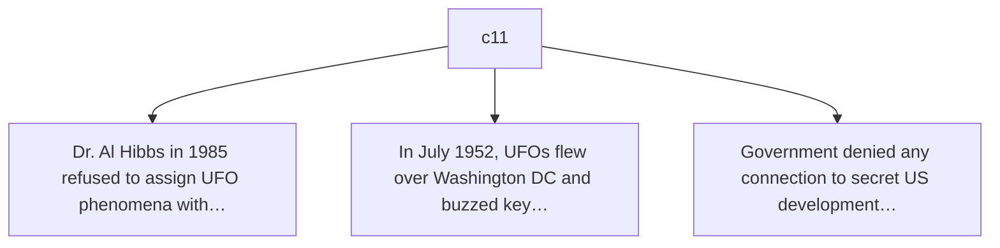

### c12 · 18:01–19:21

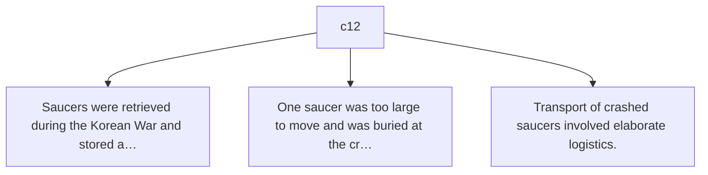

### c13 · 19:14–22:11

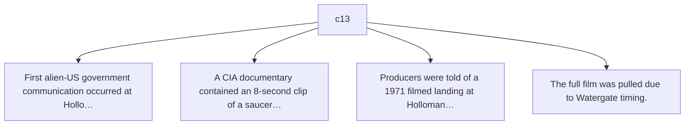

### c14 · 22:05–23:35

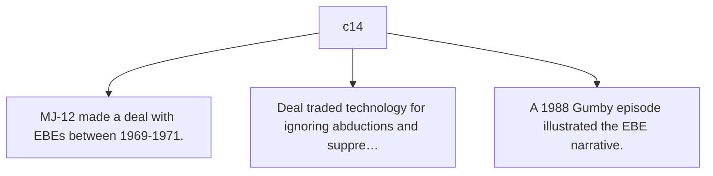

### c15 · 23:29–24:42

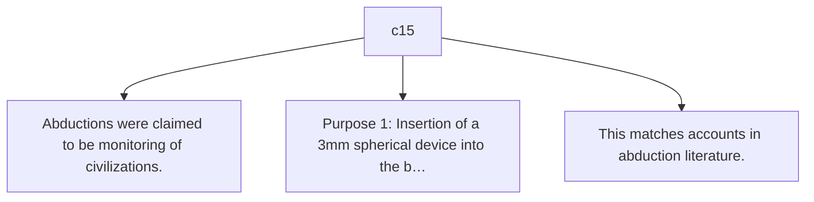

### c16 · 24:37–25:49

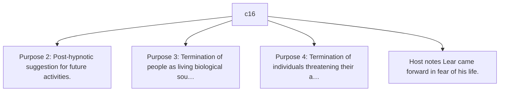

### c17 · 25:44–26:44

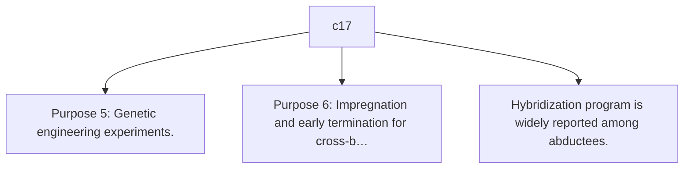

## Open questions

_None recorded. That is a gap, not closure — see limitations._

### Next traces

_None. No stage in this pipeline proposes concrete next sources, so the frontier stops at the questions above rather than naming records to pull._

## Agent-produced readings [Inferred]

_None._

## Trace index

Every diagram ID above resolves here. This table is the contract that makes the Mermaid views inspectable rather than decorative.

| Diagram ID | Node ID | Type | Segments | Time | Label |
| --- | --- | --- | --- | --- | --- |
| `n0` | `src:1038c3089e3136ea` | source | — | — | The 'Horrible Truth' about The Alien Deal - DEBRIEFED ep. 20 |
| `n1` | `seg:1038c3089e3136ea:c01` | segment | 0–43 | 0:02–1:59 | c01 |
| `n2` | `seg:1038c3089e3136ea:c02` | segment | 43–109 | 1:55–4:44 | c02 |
| `n3` | `seg:1038c3089e3136ea:c03` | segment | 109–147 | 4:40–6:23 | c03 |
| `n4` | `seg:1038c3089e3136ea:c04` | segment | 147–191 | 6:17–8:19 | c04 |
| `n5` | `seg:1038c3089e3136ea:c05` | segment | 191–225 | 8:13–9:44 | c05 |
| `n6` | `seg:1038c3089e3136ea:c06` | segment | 226–267 | 9:42–11:24 | c06 |
| `n7` | `seg:1038c3089e3136ea:c07` | segment | 267–293 | 11:19–12:31 | c07 |
| `n8` | `seg:1038c3089e3136ea:c08` | segment | 294–334 | 12:29–13:59 | c08 |
| `n9` | `seg:1038c3089e3136ea:c09` | segment | 334–371 | 13:55–15:18 | c09 |
| `n10` | `seg:1038c3089e3136ea:c10` | segment | 371–413 | 15:13–16:59 | c10 |
| `n11` | `seg:1038c3089e3136ea:c11` | segment | 413–441 | 16:53–18:05 | c11 |
| `n12` | `seg:1038c3089e3136ea:c12` | segment | 441–472 | 18:01–19:21 | c12 |
| `n13` | `seg:1038c3089e3136ea:c13` | segment | 472–542 | 19:14–22:11 | c13 |
| `n14` | `seg:1038c3089e3136ea:c14` | segment | 542–568 | 22:05–23:35 | c14 |
| `n15` | `seg:1038c3089e3136ea:c15` | segment | 568–594 | 23:29–24:42 | c15 |
| `n16` | `seg:1038c3089e3136ea:c16` | segment | 594–622 | 24:37–25:49 | c16 |
| `n17` | `seg:1038c3089e3136ea:c17` | segment | 622–643 | 25:44–26:44 | c17 |
| `n18` | `clm:1038c3089e3136ea:d235de41f3f1` | claim | 0–43 | 0:02–1:59 | Host describes a personal UFO sighting over Newark on Dec 12, 2024. |
| `n19` | `clm:1038c3089e3136ea:f00a13e35b58` | claim | 0–43 | 0:02–1:59 | Episode focuses on a 1987 document submitted to Paranet by John Lear. |
| `n20` | `clm:1038c3089e3136ea:e11ab1a652df` | claim | 43–109 | 1:55–4:44 | John Lear was a commercial pilot and CIA mission flyer. |
| `n21` | `clm:1038c3089e3136ea:5a8332daaba7` | claim | 43–109 | 1:55–4:44 | Lear introduced Bob Lazar to the public. |
| `n22` | `clm:1038c3089e3136ea:f4c544883a4b` | claim | 43–109 | 1:55–4:44 | Lear's credibility waned due to extreme claims. |
| `n23` | `clm:1038c3089e3136ea:7298644e3749` | claim | 43–109 | 1:55–4:44 | Lear may have been used in a disinformation campaign. |
| `n24` | `clm:1038c3089e3136ea:b672d2c3d42b` | claim | 109–147 | 4:40–6:23 | A cover letter from John White forwards the Lear document. |
| `n25` | `clm:1038c3089e3136ea:f2148224d2bf` | claim | 109–147 | 4:40–6:23 | Paranet was a free electronic bulletin board for paranormal topics. |
| `n26` | `clm:1038c3089e3136ea:60c41984b9c5` | claim | 109–147 | 4:40–6:23 | The recipient suspected federal disinformation ('I smell Federal deceit'). |
| `n27` | `clm:1038c3089e3136ea:72a5e5a37dc8` | claim | 147–191 | 6:17–8:19 | Paranet published Lear's file with a disclaimer of non-verification. |
| `n28` | `clm:1038c3089e3136ea:4bcf194dfd7b` | claim | 147–191 | 6:17–8:19 | Lear's credentials include being a captain, record-holder, and CIA flyer. |
| `n29` | `clm:1038c3089e3136ea:9d2df2fad6a5` | claim | 147–191 | 6:17–8:19 | Lear became interested in UFOs after hearing about the Bentwaters incident. |
| `n30` | `clm:1038c3089e3136ea:aebfdad37d2e` | claim | 191–225 | 8:13–9:44 | The Lakenheath-Bentwaters incident involved radar and visual UFO contacts in 1956. |
| `n31` | `clm:1038c3089e3136ea:c94f71d95c91` | claim | 191–225 | 8:13–9:44 | UFOs were detected at high speeds and merged in flight. |
| `n32` | `clm:1038c3089e3136ea:93070a0a368c` | claim | 191–225 | 8:13–9:44 | Lear's account includes aliens walking up to a wing commander. |
| `n33` | `clm:1038c3089e3136ea:8a0003c2730b` | claim | 226–267 | 9:42–11:24 | The document claims the US government suppressed UFO truth for 40 years. |
| `n34` | `clm:1038c3089e3136ea:08333afa0629` | claim | 226–267 | 9:42–11:24 | It claims the government made a deal with extraterrestrials. |
| `n35` | `clm:1038c3089e3136ea:4aebd7ee7de6` | claim | 226–267 | 9:42–11:24 | It compares suppression of heliocentrism to UFO suppression. |
| `n36` | `clm:1038c3089e3136ea:6118b4ec6518` | claim | 267–293 | 11:19–12:31 | Germany may have recovered a saucer in 1939. |
| `n37` | `clm:1038c3089e3136ea:cfd058844a5b` | claim | 267–293 | 11:19–12:31 | Doolittle inspected a crashed saucer in Sweden in 1946. |
| `n38` | `clm:1038c3089e3136ea:853891498f10` | claim | 267–293 | 11:19–12:31 | Truman established MJ-12 in 1947. |
| `n39` | `clm:1038c3089e3136ea:80c9fa7e2d72` | claim | 267–293 | 11:19–12:31 | MJ-12 still exists with new members. |
| `n40` | `clm:1038c3089e3136ea:ee4244232df5` | claim | 267–293 | 11:19–12:31 | Multiple saucer crashes occurred in the late 1940s in the US Southwest. |
| `n41` | `clm:1038c3089e3136ea:ba2b1d63b09d` | claim | 294–334 | 12:29–13:59 | Host claims evidence of a crash retrieval near Aztec, NM. |
| `n42` | `clm:1038c3089e3136ea:f739bc063c4f` | claim | 294–334 | 12:29–13:59 | Craft may have been brought to Los Alamos. |
| `n43` | `clm:1038c3089e3136ea:caa995a05fe3` | claim | 294–334 | 12:29–13:59 | UFO incursions correlated with nuclear work during the Manhattan Project. |
| `n44` | `clm:1038c3089e3136ea:32562837bf6e` | claim | 334–371 | 13:55–15:18 | Cold War psychic research mirrored UFO research. |
| `n45` | `clm:1038c3089e3136ea:784f774211fe` | claim | 334–371 | 13:55–15:18 | Both Axis and Allies likely researched UFOs during WWII. |
| `n46` | `clm:1038c3089e3136ea:bf168011afef` | claim | 334–371 | 13:55–15:18 | US post-war power included atomic bomb and jet bombers. |
| `n47` | `clm:1038c3089e3136ea:e2d5855fa18b` | claim | 371–413 | 15:13–16:59 | Leaders remembered the War of the Worlds panic. |
| `n48` | `clm:1038c3089e3136ea:aef40152e241` | claim | 371–413 | 15:13–16:59 | Alien bodies were described as reptilian with claw-like fingers. |
| `n49` | `clm:1038c3089e3136ea:96f2c50cc1d5` | claim | 371–413 | 15:13–16:59 | The government's cover-up included deadly force. |
| `n50` | `clm:1038c3089e3136ea:be6edc310393` | claim | 413–441 | 16:53–18:05 | Dr. Al Hibbs in 1985 refused to assign UFO phenomena without more data. |
| `n51` | `clm:1038c3089e3136ea:727b77827f24` | claim | 413–441 | 16:53–18:05 | In July 1952, UFOs flew over Washington DC and buzzed key buildings. |
| `n52` | `clm:1038c3089e3136ea:096a6a6a87d5` | claim | 413–441 | 16:53–18:05 | Government denied any connection to secret US developments. |
| `n53` | `clm:1038c3089e3136ea:d4761027bf4c` | claim | 441–472 | 18:01–19:21 | Saucers were retrieved during the Korean War and stored at Wright-Patterson. |
| `n54` | `clm:1038c3089e3136ea:643f8dc193f5` | claim | 441–472 | 18:01–19:21 | One saucer was too large to move and was buried at the crash site. |
| `n55` | `clm:1038c3089e3136ea:30ffcecc3d99` | claim | 441–472 | 18:01–19:21 | Transport of crashed saucers involved elaborate logistics. |
| `n56` | `clm:1038c3089e3136ea:bff59ee5d352` | claim | 472–542 | 19:14–22:11 | First alien-US government communication occurred at Holloman AFB on April 30, 1964. |
| `n57` | `clm:1038c3089e3136ea:c58a54022f59` | claim | 472–542 | 19:14–22:11 | A CIA documentary contained an 8-second clip of a saucer landing. |
| `n58` | `clm:1038c3089e3136ea:ca0df218ad2d` | claim | 472–542 | 19:14–22:11 | Producers were told of a 1971 filmed landing at Holloman from three vantage points. |
| `n59` | `clm:1038c3089e3136ea:7f116c0e60d7` | claim | 472–542 | 19:14–22:11 | The full film was pulled due to Watergate timing. |
| `n60` | `clm:1038c3089e3136ea:c6242a723e34` | claim | 542–568 | 22:05–23:35 | MJ-12 made a deal with EBEs between 1969-1971. |
| `n61` | `clm:1038c3089e3136ea:f0d8b18fac27` | claim | 542–568 | 22:05–23:35 | Deal traded technology for ignoring abductions and suppressing cattle mutilation info. |
| `n62` | `clm:1038c3089e3136ea:5f6fbe7b1be9` | claim | 542–568 | 22:05–23:35 | A 1988 Gumby episode illustrated the EBE narrative. |
| `n63` | `clm:1038c3089e3136ea:0659f0d9a3a0` | claim | 568–594 | 23:29–24:42 | Abductions were claimed to be monitoring of civilizations. |
| `n64` | `clm:1038c3089e3136ea:0793f51acc27` | claim | 568–594 | 23:29–24:42 | Purpose 1: Insertion of a 3mm spherical device into the brain via nasal cavity for monito… |
| `n65` | `clm:1038c3089e3136ea:83d97ab7610e` | claim | 568–594 | 23:29–24:42 | This matches accounts in abduction literature. |
| `n66` | `clm:1038c3089e3136ea:f9f05afc9890` | claim | 594–622 | 24:37–25:49 | Purpose 2: Post-hypnotic suggestion for future activities. |
| `n67` | `clm:1038c3089e3136ea:b406013604a3` | claim | 594–622 | 24:37–25:49 | Purpose 3: Termination of people as living biological sources. |
| `n68` | `clm:1038c3089e3136ea:0c4d50643e1b` | claim | 594–622 | 24:37–25:49 | Purpose 4: Termination of individuals threatening their activity. |
| `n69` | `clm:1038c3089e3136ea:ee47df02be80` | claim | 594–622 | 24:37–25:49 | Host notes Lear came forward in fear of his life. |
| `n70` | `clm:1038c3089e3136ea:9ab30e9babe0` | claim | 622–643 | 25:44–26:44 | Purpose 5: Genetic engineering experiments. |
| `n71` | `clm:1038c3089e3136ea:33fc34f16c65` | claim | 622–643 | 25:44–26:44 | Purpose 6: Impregnation and early termination for cross-breed infants. |
| `n72` | `clm:1038c3089e3136ea:eb317522aa77` | claim | 622–643 | 25:44–26:44 | Hybridization program is widely reported among abductees. |

**Edges:** 88 across 3 types — `asserts`, `contains`, `precedes`

## Limitations

- ⚠️ no next_trace nodes — no pipeline stage proposes concrete next sources
- ⚠️ no reading nodes — no interpretive stage exists; readings are never inferred here
- ⚠️ no counter_reading nodes — paired with reading; unproduced for the same reason
- ⚠️ no speaker nodes — diarisation is unavailable — the transcript carries '>>' turn markers but no speaker identities
- ⚠️ no open questions — the map manufactures closure it has no basis for
- ⚠️ no evidence→claim edges — the analysis prompt emits supporting and contradictory evidence as flat lists with no target claim, so evidence carries a stance but names no claim it bears on
- ⚠️ chunk coverage is 42% of the source (23984 of 57379 chars); the pipeline truncates at 24000 chars

