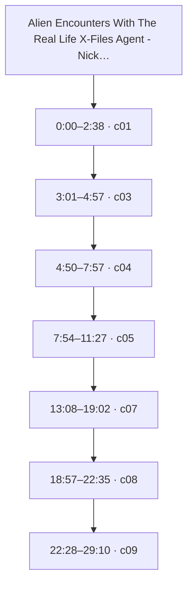
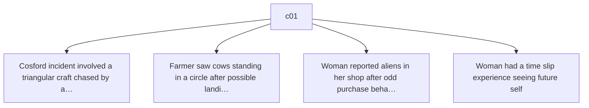
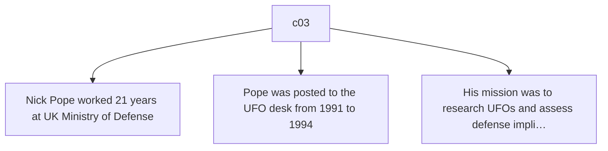
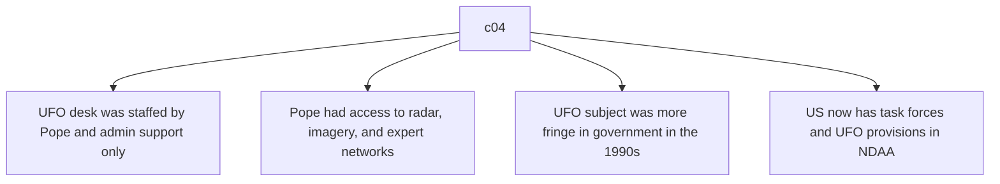
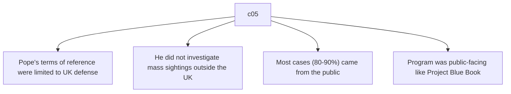
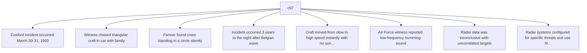
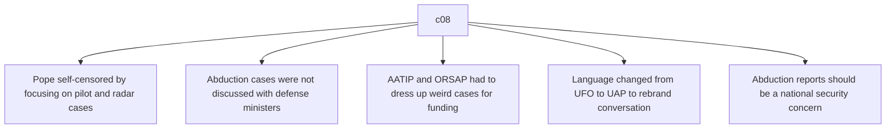
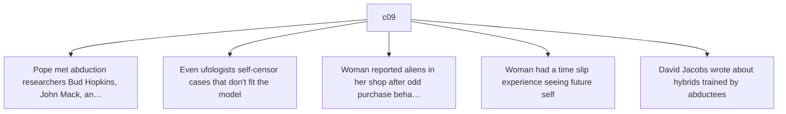

# Trace Map — Alien Encounters With The Real Life X-Files Agent - Nick Pope - DEBRIEFED ep. 34

- **Source ID:** `src:e1688ad476d99745`
- **Source:** https://www.youtube.com/watch?v=B6WFLOIkyho
- **Source type:** video · content type: media
- **Source hash:** `sha256:7a4f7f2392c086209bf957ea70f2c105850ba7b211808eeec77073faf4344d5b`
- **Schema:** `trace-map.v1` · content version 1 · review state **unreviewed**
- **Generated:** 2026-08-18T06:59:35.422895+00:00 · methodology `rag-prompt-pipeline/ADR-0001`
- **Served by:** deepseek/deepseek-chat
- **Integrity flags:** secondary_repost, ad_insertions

## Legend

| Marker | Meaning |
| --- | --- |
| **Source material** | `segment`, `claim`, `evidence`, `entity` — every one carries an exact character span and, where timing exists, a timestamp |
| **[Inferred]** | `inference` — produced by a model, never by the source. Never Evidence, never a Claim |
| **Frontier** | `open_question` — what this source cannot resolve |
| Solid arrow | source-derived relationship |
| Dotted arrow | agent-produced relationship |

## Coverage

The chunker anchored **20%** of the source — 22,103 of 112,433 characters, 594 of 3,062 timed segments.

The pipeline truncates its input at 24,000 characters, so a fraction below that ratio is expected; anything lower is the chunker skipping material.

Anchor methods across segments: `exact` ×6, `prefix_suffix` ×1

## Source spine

| Segment | Time | Chars | Heading | Density | Anchor |
| --- | --- | --- | --- | --- | --- |
| `c01` | 0:00–2:38 | 0–1896 | — | high | `exact` |
| `c03` | 3:01–4:57 | 2300–3938 | — | medium | `exact` |
| `c04` | 4:50–7:57 | 3939–6558 | — | medium | `exact` |
| `c05` | 7:54–11:27 | 6559–9445 | — | medium | `prefix_suffix` |
| `c07` | 13:08–19:02 | 10934–15678 | — | high | `exact` |
| `c08` | 18:57–22:35 | 15679–18584 | — | medium | `exact` |
| `c09` | 22:28–29:10 | 18585–24000 | — | high | `exact` |

## Topics

_The chunker emitted no heading paths, so no topic tree exists._

## Claims and evidence

### c01 · 0:00–2:38

### c03 · 3:01–4:57

### c04 · 4:50–7:57

### c05 · 7:54–11:27

### c07 · 13:08–19:02

### c08 · 18:57–22:35

### c09 · 22:28–29:10

## Open questions

_None recorded. That is a gap, not closure — see limitations._

### Next traces

_None. No stage in this pipeline proposes concrete next sources, so the frontier stops at the questions above rather than naming records to pull._

## Agent-produced readings [Inferred]

_None._

## Trace index

Every diagram ID above resolves here. This table is the contract that makes the Mermaid views inspectable rather than decorative.

| Diagram ID | Node ID | Type | Segments | Time | Label |
| --- | --- | --- | --- | --- | --- |
| `n0` | `src:e1688ad476d99745` | source | — | — | Alien Encounters With The Real Life X-Files Agent - Nick Pope - DEBRIEFED ep. 34 |
| `n1` | `seg:e1688ad476d99745:c01` | segment | 0–51 | 0:00–2:38 | c01 |
| `n2` | `seg:e1688ad476d99745:c03` | segment | 63–106 | 3:01–4:57 | c03 |
| `n3` | `seg:e1688ad476d99745:c04` | segment | 106–176 | 4:50–7:57 | c04 |
| `n4` | `seg:e1688ad476d99745:c05` | segment | 177–253 | 7:54–11:27 | c05 |
| `n5` | `seg:e1688ad476d99745:c07` | segment | 295–421 | 13:08–19:02 | c07 |
| `n6` | `seg:e1688ad476d99745:c08` | segment | 421–499 | 18:57–22:35 | c08 |
| `n7` | `seg:e1688ad476d99745:c09` | segment | 499–645 | 22:28–29:10 | c09 |
| `n8` | `clm:e1688ad476d99745:b7b70109ced7` | claim | 0–51 | 0:00–2:38 | Cosford incident involved a triangular craft chased by a witness |
| `n9` | `clm:e1688ad476d99745:ec2cb9218041` | claim | 0–51 | 0:00–2:38 | Farmer saw cows standing in a circle after possible landing |
| `n10` | `clm:e1688ad476d99745:f7dfac26c117` | claim | 0–51 | 0:00–2:38 | Woman reported aliens in her shop after odd purchase behavior |
| `n11` | `clm:e1688ad476d99745:ce2dc82a3f9e` | claim | 0–51 | 0:00–2:38 | Woman had a time slip experience seeing future self |
| `n12` | `clm:e1688ad476d99745:4feaf822949b` | claim | 63–106 | 3:01–4:57 | Nick Pope worked 21 years at UK Ministry of Defense |
| `n13` | `clm:e1688ad476d99745:072f8a092dab` | claim | 63–106 | 3:01–4:57 | Pope was posted to the UFO desk from 1991 to 1994 |
| `n14` | `clm:e1688ad476d99745:5b5bb253d45c` | claim | 63–106 | 3:01–4:57 | His mission was to research UFOs and assess defense implications |
| `n15` | `clm:e1688ad476d99745:93740ead809a` | claim | 106–176 | 4:50–7:57 | UFO desk was staffed by Pope and admin support only |
| `n16` | `clm:e1688ad476d99745:f7dece1d2709` | claim | 106–176 | 4:50–7:57 | Pope had access to radar, imagery, and expert networks |
| `n17` | `clm:e1688ad476d99745:d67f9ff89449` | claim | 106–176 | 4:50–7:57 | UFO subject was more fringe in government in the 1990s |
| `n18` | `clm:e1688ad476d99745:fe72d842f2f0` | claim | 106–176 | 4:50–7:57 | US now has task forces and UFO provisions in NDAA |
| `n19` | `clm:e1688ad476d99745:506e973424c5` | claim | 177–253 | 7:54–11:27 | Pope's terms of reference were limited to UK defense |
| `n20` | `clm:e1688ad476d99745:034ebd063178` | claim | 177–253 | 7:54–11:27 | He did not investigate mass sightings outside the UK |
| `n21` | `clm:e1688ad476d99745:6f87e786f7ca` | claim | 177–253 | 7:54–11:27 | Most cases (80-90%) came from the public |
| `n22` | `clm:e1688ad476d99745:78e9189c51f7` | claim | 177–253 | 7:54–11:27 | Program was public-facing like Project Blue Book |
| `n23` | `clm:e1688ad476d99745:17b506cff7b5` | claim | 295–421 | 13:08–19:02 | Cosford incident occurred March 30-31, 1993 |
| `n24` | `clm:e1688ad476d99745:b530417cad02` | claim | 295–421 | 13:08–19:02 | Witness chased triangular craft in car with family |
| `n25` | `clm:e1688ad476d99745:0a0015f5fc76` | claim | 295–421 | 13:08–19:02 | Farmer found cows standing in a circle silently |
| `n26` | `clm:e1688ad476d99745:cc5c59207b10` | claim | 295–421 | 13:08–19:02 | Incident occurred 3 years to the night after Belgian wave |
| `n27` | `clm:e1688ad476d99745:126442a26cd4` | claim | 295–421 | 13:08–19:02 | Craft moved from slow to high speed instantly with no sonic boom |
| `n28` | `clm:e1688ad476d99745:55011d30cb12` | claim | 295–421 | 13:08–19:02 | Air Force witness reported low-frequency humming sound |
| `n29` | `clm:e1688ad476d99745:f551780fd8e0` | claim | 295–421 | 13:08–19:02 | Radar data was inconclusive with uncorrelated targets |
| `n30` | `clm:e1688ad476d99745:dab0c63a5238` | claim | 295–421 | 13:08–19:02 | Radar systems configured for specific threats and use filter programs |
| `n31` | `clm:e1688ad476d99745:b442abf546d1` | claim | 421–499 | 18:57–22:35 | Pope self-censored by focusing on pilot and radar cases |
| `n32` | `clm:e1688ad476d99745:642a2c727fa7` | claim | 421–499 | 18:57–22:35 | Abduction cases were not discussed with defense ministers |
| `n33` | `clm:e1688ad476d99745:a6ae5eb1f03a` | claim | 421–499 | 18:57–22:35 | AATIP and ORSAP had to dress up weird cases for funding |
| `n34` | `clm:e1688ad476d99745:1fd5978a3310` | claim | 421–499 | 18:57–22:35 | Language changed from UFO to UAP to rebrand conversation |
| `n35` | `clm:e1688ad476d99745:539b2e2a8cd2` | claim | 421–499 | 18:57–22:35 | Abduction reports should be a national security concern |
| `n36` | `clm:e1688ad476d99745:f83517407715` | claim | 499–645 | 22:28–29:10 | Pope met abduction researchers Bud Hopkins, John Mack, and David Jacobs |
| `n37` | `clm:e1688ad476d99745:8f4c1a259aa7` | claim | 499–645 | 22:28–29:10 | Even ufologists self-censor cases that don't fit the model |
| `n38` | `clm:e1688ad476d99745:08e7658d4727` | claim | 499–645 | 22:28–29:10 | David Jacobs wrote about hybrids trained by abductees |
| `n39` | `ent:e1688ad476d99745:personnel:e295b702d36a` | entity | 68–71 | 3:12–3:26 | Nicholas Pope |
| `n40` | `ent:e1688ad476d99745:organization:153e60515f44` | entity | 94–96 | 4:17–4:27 | Ministry of Defence |
| `n41` | `ent:e1688ad476d99745:organization:46fd27e22e9b` | entity | 100–104 | 4:32–4:50 | UFO desk |
| `n42` | `ent:e1688ad476d99745:event:0a7f6faae4b9` | entity | 77–78 | 3:37–3:44 | Rendlesham case |
| `n43` | `ent:e1688ad476d99745:location:0e98cc0b1589` | entity | 94–96 | 4:17–4:27 | United Kingdom |
| `n44` | `ent:e1688ad476d99745:evidence:b85e28ea81da` | entity | 100–101 | 4:32–4:42 | Nicholas Pope's testimony on MoD UFO desk work |

**Edges:** 52 across 4 types — `asserts`, `contains`, `mentions`, `precedes`

## Limitations

- ⚠️ no next_trace nodes — no pipeline stage proposes concrete next sources
- ⚠️ no reading nodes — no interpretive stage exists; readings are never inferred here
- ⚠️ no counter_reading nodes — paired with reading; unproduced for the same reason
- ⚠️ no speaker nodes — diarisation is unavailable — the transcript carries '>>' turn markers but no speaker identities
- ⚠️ no open questions — the map manufactures closure it has no basis for
- ⚠️ no evidence→claim edges — the analysis prompt emits supporting and contradictory evidence as flat lists with no target claim, so evidence carries a stance but names no claim it bears on
- ⚠️ chunk coverage is 20% of the source (22103 of 112433 chars); the pipeline truncates at 24000 chars

