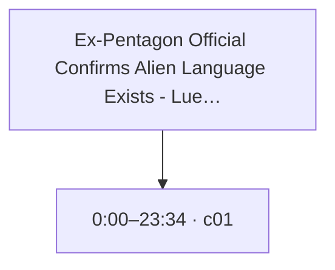

# Trace Map — Ex-Pentagon Official Confirms Alien Language Exists - Lue Elizondo - DEBRIEFED ep. 24

- **Source ID:** `src:62de7539372ab486`
- **Source:** https://www.youtube.com/watch?v=WGUb1JKxBDo
- **Source type:** video · content type: media
- **Source hash:** `sha256:34747f71b77c9f09d682b4408378f673e348d003e2e7ffa47dde5ce345bb8e08`
- **Schema:** `trace-map.v1` · content version 1 · review state **unreviewed**
- **Generated:** 2026-08-18T07:01:33.943822+00:00 · methodology `rag-prompt-pipeline/ADR-0001`
- **Served by:** deepseek/deepseek-chat
- **Integrity flags:** transcript_auto_generated, truncated_source

## Legend

| Marker | Meaning |
| --- | --- |
| **Source material** | `segment`, `claim`, `evidence`, `entity` — every one carries an exact character span and, where timing exists, a timestamp |
| **[Inferred]** | `inference` — produced by a model, never by the source. Never Evidence, never a Claim |
| **Frontier** | `open_question` — what this source cannot resolve |
| Solid arrow | source-derived relationship |
| Dotted arrow | agent-produced relationship |

## Coverage

The chunker anchored **14%** of the source — 24,000 of 169,156 characters, 636 of 4,542 timed segments.

The pipeline truncates its input at 24,000 characters, so a fraction below that ratio is expected; anything lower is the chunker skipping material.

Anchor methods across segments: `prefix_suffix` ×1

## Source spine

| Segment | Time | Chars | Heading | Density | Anchor |
| --- | --- | --- | --- | --- | --- |
| `c01` | 0:00–23:34 | 0–24000 | — | high | `prefix_suffix` |

## Topics

_The chunker emitted no heading paths, so no topic tree exists._

## Claims and evidence

### c01 · 0:00–23:34

```mermaid
flowchart TD
  n1["c01"]
  n2["UAPs observed moving 450-550 knots underwater"]
  n1 --> n2
  n3["Psionic teams used to bring UAPs into range"]
  n1 --> n3
  n4["Egg-shaped crafts exist"]
  n1 --> n4
  n5["Crafts have engraved script"]
  n1 --> n5
  n6["Elizondo researched ancient script at the Pentagon"]
  n1 --> n6
  n7["Disclosure involves religion, life and death, why we are…"]
  n1 --> n7
  n8["Elizondo does not support leaking classified information"]
  n1 --> n8
  n9["Classification system has been abused to hide truth"]
  n1 --> n9
  n10["UAP topic started in high gear after WWII and atomic bomb"]
  n1 --> n10
  n11["US and Russia had secret memo to call each other before n…"]
  n1 --> n11
  n12["Government feared UAP topic would destabilize society"]
  n1 --> n12
```

_13 claims in this segment; 11 shown. All appear in the trace index._

## Open questions

_None recorded. That is a gap, not closure — see limitations._

### Next traces

_None. No stage in this pipeline proposes concrete next sources, so the frontier stops at the questions above rather than naming records to pull._

## Agent-produced readings [Inferred]

_None._

## Trace index

Every diagram ID above resolves here. This table is the contract that makes the Mermaid views inspectable rather than decorative.

| Diagram ID | Node ID | Type | Segments | Time | Label |
| --- | --- | --- | --- | --- | --- |
| `n0` | `src:62de7539372ab486` | source | — | — | Ex-Pentagon Official Confirms Alien Language Exists - Lue Elizondo - DEBRIEFED ep. 24 |
| `n1` | `seg:62de7539372ab486:c01` | segment | 0–635 | 0:00–23:34 | c01 |
| `n2` | `clm:62de7539372ab486:97220a9b40a6` | claim | 0–635 | 0:00–23:34 | UAPs observed moving 450-550 knots underwater |
| `n3` | `clm:62de7539372ab486:fe5ca72cc9fb` | claim | 0–635 | 0:00–23:34 | Psionic teams used to bring UAPs into range |
| `n4` | `clm:62de7539372ab486:9f1d9fb9be24` | claim | 0–635 | 0:00–23:34 | Egg-shaped crafts exist |
| `n5` | `clm:62de7539372ab486:78c3be951c8c` | claim | 0–635 | 0:00–23:34 | Crafts have engraved script |
| `n6` | `clm:62de7539372ab486:cda01b49f0c8` | claim | 0–635 | 0:00–23:34 | Elizondo researched ancient script at the Pentagon |
| `n7` | `clm:62de7539372ab486:02cf94da47e5` | claim | 0–635 | 0:00–23:34 | Disclosure involves religion, life and death, why we are here |
| `n8` | `clm:62de7539372ab486:0576295fe28f` | claim | 0–635 | 0:00–23:34 | Elizondo does not support leaking classified information |
| `n9` | `clm:62de7539372ab486:63e4845784dc` | claim | 0–635 | 0:00–23:34 | Classification system has been abused to hide truth |
| `n10` | `clm:62de7539372ab486:2990ec4c13ed` | claim | 0–635 | 0:00–23:34 | UAP topic started in high gear after WWII and atomic bomb |
| `n11` | `clm:62de7539372ab486:72c54b6b97c5` | claim | 0–635 | 0:00–23:34 | US and Russia had secret memo to call each other before nuclear strike if UFO seen |
| `n12` | `clm:62de7539372ab486:bff16491a65a` | claim | 0–635 | 0:00–23:34 | Government feared UAP topic would destabilize society |
| `n13` | `clm:62de7539372ab486:3e69050ebef3` | claim | 0–635 | 0:00–23:34 | Secrets are perishable and have a shelf life |
| `n14` | `clm:62de7539372ab486:b88be63f72d4` | claim | 0–635 | 0:00–23:34 | Government trust is at an all-time low |

**Edges:** 14 across 2 types — `asserts`, `contains`

## Limitations

- ⚠️ no next_trace nodes — no pipeline stage proposes concrete next sources
- ⚠️ no reading nodes — no interpretive stage exists; readings are never inferred here
- ⚠️ no counter_reading nodes — paired with reading; unproduced for the same reason
- ⚠️ no speaker nodes — diarisation is unavailable — the transcript carries '>>' turn markers but no speaker identities
- ⚠️ no open questions — the map manufactures closure it has no basis for
- ⚠️ no evidence→claim edges — the analysis prompt emits supporting and contradictory evidence as flat lists with no target claim, so evidence carries a stance but names no claim it bears on
- ⚠️ chunk coverage is 14% of the source (24000 of 169156 chars); the pipeline truncates at 24000 chars

