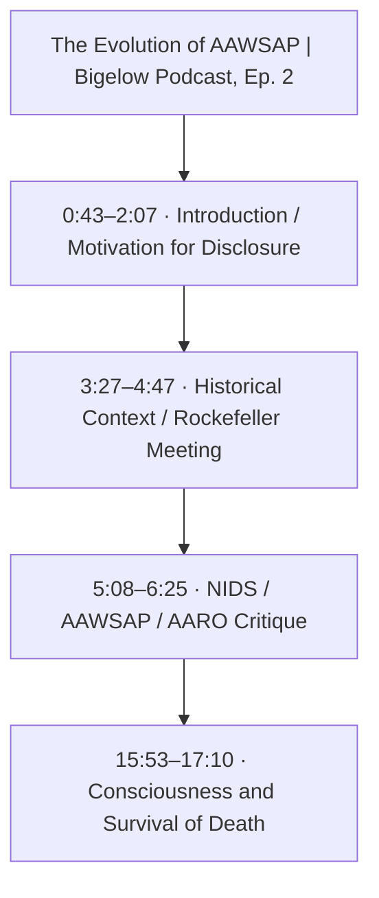
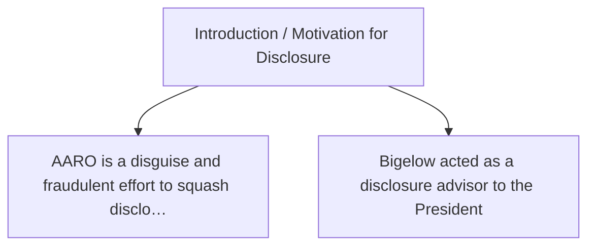
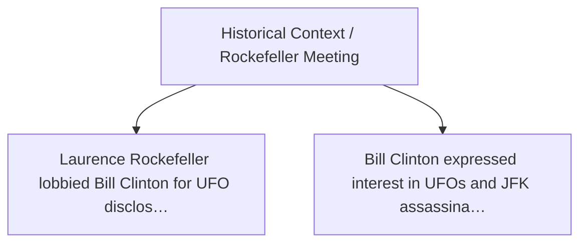
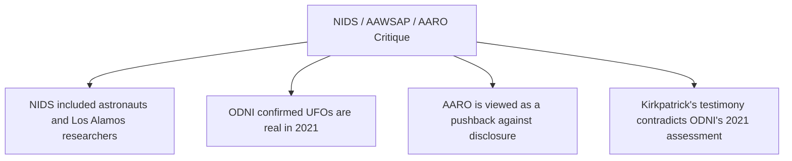
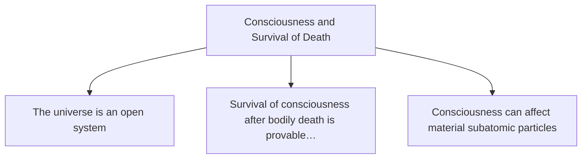

# Trace Map — The Evolution of AAWSAP | Bigelow Podcast, Ep. 2

- **Source ID:** `src:f92db1888648fe27`
- **Source:** https://www.youtube.com/watch?v=hz7jHEgYzQw&t=3s
- **Source type:** video · content type: Interview Transcript
- **Source hash:** `sha256:376ec001b9c364f6c585e9bc99c473725db448a5c4f9f0c2271f77411ecac6ff`
- **Schema:** `trace-map.v1` · content version 1 · review state **unreviewed**
- **Generated:** 2026-08-16T20:28:38.724823+00:00 · methodology `rag-prompt-pipeline/ADR-0001`
- **Served by:** google/gemini-3-flash, deepseek/deepseek-v4-pro (degraded)
- **Integrity flags:** transcript_artifacts, conversational_filler

## Legend

| Marker | Meaning |
| --- | --- |
| **Source material** | `segment`, `claim`, `evidence`, `entity` — every one carries an exact character span and, where timing exists, a timestamp |
| **[Inferred]** | `inference` — produced by a model, never by the source. Never Evidence, never a Claim |
| **Frontier** | `open_question` — what this source cannot resolve |
| Solid arrow | source-derived relationship |
| Dotted arrow | agent-produced relationship |

## Coverage

The chunker anchored **6%** of the source — 3,707 of 61,568 characters, 134 of 2,035 timed segments.

The pipeline truncates its input at 24,000 characters, so a fraction below that ratio is expected; anything lower is the chunker skipping material.

Anchor methods across segments: `prefix_only` ×3, `prefix_suffix` ×1

## Source spine

| Segment | Time | Chars | Heading | Density | Anchor |
| --- | --- | --- | --- | --- | --- |
| `c01` | 0:43–2:07 | 510–1494 | Introduction / Motivation for Disclosure | medium | `prefix_suffix` |
| `c02` | 3:27–4:47 | 2946–3939 | Historical Context / Rockefeller Meeting | high | `prefix_only` |
| `c03` | 5:08–6:25 | 4309–5232 | NIDS / AAWSAP / AARO Critique | high | `prefix_only` |
| `c04` | 15:53–17:10 | 13391–14198 | Consciousness and Survival of Death | medium | `prefix_only` |

## Topics

- **Introduction / Motivation for Disclosure** — introduced at 0:43–2:07 (`c01`)
- **Historical Context / Rockefeller Meeting** — introduced at 3:27–4:47 (`c02`)
- **NIDS / AAWSAP / AARO Critique** — introduced at 5:08–6:25 (`c03`)
- **Consciousness and Survival of Death** — introduced at 15:53–17:10 (`c04`)

## Claims and evidence

### Introduction / Motivation for Disclosure · 0:43–2:07

### Historical Context / Rockefeller Meeting · 3:27–4:47

### NIDS / AAWSAP / AARO Critique · 5:08–6:25

### Consciousness and Survival of Death · 15:53–17:10

## Open questions

_None recorded. That is a gap, not closure — see limitations._

### Next traces

_None. No stage in this pipeline proposes concrete next sources, so the frontier stops at the questions above rather than naming records to pull._

## Agent-produced readings [Inferred]

Nothing below is Evidence or a Claim. Each is a model's restatement or interpretation, kept because it is useful and labelled because it is not source material.

- **[Inferred]** Robert Bigelow provided 'disclosure advisory' help to a sitting US President. — basis `analysis.primary_claims`
- **[Inferred]** AARO (All-domain Anomaly Resolution Office) is a 'disguise' and 'fraudulent effort' to squash disclosure. — basis `analysis.primary_claims`
- **[Inferred]** Laurence Rockefeller convened a meeting at the Teton Ranch with Linda Howe, John Mack, and Bruce Maccabee to lobby President Bill Clinton on disclosure. — basis `analysis.primary_claims`
- **[Inferred]** Senator Harry Reid asked President Clinton if he really wanted to know who killed JFK and the truth about UFOs; Clinton allegedly confirmed interest. — basis `analysis.primary_claims`
- **[Inferred]** The AAWSAP program (2008-2009) was the 'mother of all programs' and an honest discovery process compared to previous 'cover-up' efforts like Blue Book. — basis `analysis.primary_claims`
- **[Inferred]** The universe is an 'open system' without a beginning or end; the Big Bang is an unsatisfactory theory. — basis `analysis.primary_claims`
- **[Inferred]** The Bigelow Institute for Consciousness Studies (BICS) claims to have provided proof 'beyond a reasonable doubt' for the survival of consciousness after permanent bodily death. — basis `analysis.primary_claims`
- **[Inferred]** {"label": "AAWSAP", "date": "2008-09-01", "description": "Program described as the only honest discovery effort since Bl — basis `analysis.key_findings`
- **[Inferred]** {"label": "ODNI Preliminary Assessment", "date": "2021-06-25", "description": "Official announcement that UFOs are physi — basis `analysis.key_findings`
- **[Inferred]** {"label": "AARO Establishment", "date": "2022-07-15", "description": "Kathleen Hicks renames the UAP office to All-domai — basis `analysis.key_findings`
- **[Inferred]** {"label": "BICS Essay Contest", "date": "2021-12-04", "description": "Awards ceremony for essays proving survival of con — basis `analysis.key_findings`
- **[Inferred]** Cites ODNI 2021 report as confirmation of physical UAP reality. — basis `analysis.supporting_evidence`
- **[Inferred]** Mentions specific participants in the Rockefeller meeting: John Mack, Linda Howe, Bruce Maccabee. — basis `analysis.supporting_evidence`
- **[Inferred]** Mentions specific participants in NIDS/AAWSAP meetings: Edgar Mitchell, Jack Schmitt, Hal Puthoff, Jacques Vallée, Kit Green. — basis `analysis.supporting_evidence`
- **[Inferred]** Dr. Sean Kirkpatrick’s April 19, 2023 testimony stating no credible evidence of extraterrestrial activity or physics-defying objects. — basis `analysis.contradictory_evidence`
- **[Inferred]** Bigelow notes the 'stink' of the AARO report (Jan 12, 2023) as a pushback against the 2021 ODNI findings. — basis `analysis.contradictory_evidence`

## Trace index

Every diagram ID above resolves here. This table is the contract that makes the Mermaid views inspectable rather than decorative.

| Diagram ID | Node ID | Type | Segments | Time | Label |
| --- | --- | --- | --- | --- | --- |
| `n0` | `src:f92db1888648fe27` | source | — | — | The Evolution of AAWSAP | Bigelow Podcast, Ep. 2 |
| `n1` | `seg:f92db1888648fe27:c01` | segment | 17–50 | 0:43–2:07 | c01 |
| `n2` | `seg:f92db1888648fe27:c02` | segment | 99–130 | 3:27–4:47 | c02 |
| `n3` | `seg:f92db1888648fe27:c03` | segment | 141–175 | 5:08–6:25 | c03 |
| `n4` | `seg:f92db1888648fe27:c04` | segment | 437–469 | 15:53–17:10 | c04 |
| `n5` | `top:9dc3c8f5e04b` | topic | — | — | Introduction / Motivation for Disclosure |
| `n6` | `top:3f646e0d0e72` | topic | — | — | Historical Context / Rockefeller Meeting |
| `n7` | `top:f845e436ae13` | topic | — | — | NIDS / AAWSAP / AARO Critique |
| `n8` | `top:5e889b8da067` | topic | — | — | Consciousness and Survival of Death |
| `n9` | `clm:f92db1888648fe27:9bde33f518a0` | claim | 17–50 | 0:43–2:07 | AARO is a disguise and fraudulent effort to squash disclosure |
| `n10` | `clm:f92db1888648fe27:66cf5b068a1f` | claim | 17–50 | 0:43–2:07 | Bigelow acted as a disclosure advisor to the President |
| `n11` | `clm:f92db1888648fe27:023ba9e2ed27` | claim | 99–130 | 3:27–4:47 | Laurence Rockefeller lobbied Bill Clinton for UFO disclosure |
| `n12` | `clm:f92db1888648fe27:693f0f832b3f` | claim | 99–130 | 3:27–4:47 | Bill Clinton expressed interest in UFOs and JFK assassination to Harry Reid |
| `n13` | `clm:f92db1888648fe27:59c91a7bd93d` | claim | 141–175 | 5:08–6:25 | NIDS included astronauts and Los Alamos researchers |
| `n14` | `clm:f92db1888648fe27:a5235577d952` | claim | 141–175 | 5:08–6:25 | ODNI confirmed UFOs are real in 2021 |
| `n15` | `clm:f92db1888648fe27:4aa428eaf7aa` | claim | 141–175 | 5:08–6:25 | AARO is viewed as a pushback against disclosure |
| `n16` | `clm:f92db1888648fe27:6f3179e5f66c` | claim | 141–175 | 5:08–6:25 | Kirkpatrick's testimony contradicts ODNI's 2021 assessment |
| `n17` | `clm:f92db1888648fe27:36576cc2d386` | claim | 437–469 | 15:53–17:10 | The universe is an open system |
| `n18` | `clm:f92db1888648fe27:ae640651b30a` | claim | 437–469 | 15:53–17:10 | Survival of consciousness after bodily death is provable beyond a reasonable doubt |
| `n19` | `clm:f92db1888648fe27:f7cf40e316c9` | claim | 437–469 | 15:53–17:10 | Consciousness can affect material subatomic particles |
| `n20` | `inf:f92db1888648fe27:e135f66f919d` | inference | — | — | Robert Bigelow provided 'disclosure advisory' help to a sitting US President. |
| `n21` | `inf:f92db1888648fe27:bddf7d35583e` | inference | — | — | AARO (All-domain Anomaly Resolution Office) is a 'disguise' and 'fraudulent effort' to sq… |
| `n22` | `inf:f92db1888648fe27:9743a727f91d` | inference | — | — | Laurence Rockefeller convened a meeting at the Teton Ranch with Linda Howe, John Mack, an… |
| `n23` | `inf:f92db1888648fe27:3dbfcbefdefc` | inference | — | — | Senator Harry Reid asked President Clinton if he really wanted to know who killed JFK and… |
| `n24` | `inf:f92db1888648fe27:9ec3d3437d42` | inference | — | — | The AAWSAP program (2008-2009) was the 'mother of all programs' and an honest discovery p… |
| `n25` | `inf:f92db1888648fe27:d6aa619e5be2` | inference | — | — | The universe is an 'open system' without a beginning or end; the Big Bang is an unsatisfa… |
| `n26` | `inf:f92db1888648fe27:3cbfd92848b9` | inference | — | — | The Bigelow Institute for Consciousness Studies (BICS) claims to have provided proof 'bey… |
| `n27` | `inf:f92db1888648fe27:bb4156b6d445` | inference | — | — | {'label': 'AAWSAP', 'date': '2008-09-01', 'description': 'Program described as the only h… |
| `n28` | `inf:f92db1888648fe27:b086e4ba99f8` | inference | — | — | {'label': 'ODNI Preliminary Assessment', 'date': '2021-06-25', 'description': 'Official a… |
| `n29` | `inf:f92db1888648fe27:f246a70d7fb3` | inference | — | — | {'label': 'AARO Establishment', 'date': '2022-07-15', 'description': 'Kathleen Hicks rena… |
| `n30` | `inf:f92db1888648fe27:c0fac0b210fc` | inference | — | — | {'label': 'BICS Essay Contest', 'date': '2021-12-04', 'description': 'Awards ceremony for… |
| `n31` | `evd:f92db1888648fe27:2a924b47968d` | evidence | 62–62 | 2:29–2:34 | Skinwalkers at the Pentagon |
| `n32` | `inf:f92db1888648fe27:30bee27f86c0` | inference | — | — | Cites ODNI 2021 report as confirmation of physical UAP reality. |
| `n33` | `inf:f92db1888648fe27:7991c6972ff8` | inference | — | — | Mentions specific participants in the Rockefeller meeting: John Mack, Linda Howe, Bruce M… |
| `n34` | `inf:f92db1888648fe27:7b1cf4b89572` | inference | — | — | Mentions specific participants in NIDS/AAWSAP meetings: Edgar Mitchell, Jack Schmitt, Hal… |
| `n35` | `inf:f92db1888648fe27:295a1e4f36a4` | inference | — | — | Dr. Sean Kirkpatrick’s April 19, 2023 testimony stating no credible evidence of extraterr… |
| `n36` | `inf:f92db1888648fe27:2187fe533a44` | inference | — | — | Bigelow notes the 'stink' of the AARO report (Jan 12, 2023) as a pushback against the 202… |
| `n37` | `ent:f92db1888648fe27:personnel:55552f162c68` | entity | 22–24 | 0:52–1:02 | Jim McCaskey |
| `n38` | `ent:f92db1888648fe27:personnel:f8d54da16db4` | entity | 29–31 | 1:08–1:17 | The President |
| `n39` | `ent:f92db1888648fe27:organization:f17b55e55903` | entity | 37–39 | 1:24–1:39 | The Pentagon |
| `n40` | `ent:f92db1888648fe27:organization:89c5235051cf` | entity | 39–42 | 1:30–1:46 | AARO |
| `n41` | `ent:f92db1888648fe27:evidence:90e94a397128` | entity | 21–22 | 0:49–0:57 | McCaskey Book (2023) |
| `n42` | `ent:f92db1888648fe27:event:8bcaf2df75f6` | entity | 30–32 | 1:10–1:19 | Disclosure Advisory |
| `n43` | `ent:f92db1888648fe27:personnel:67cd806d2450` | entity | — | — | Laurence Rockefeller |
| `n44` | `ent:f92db1888648fe27:personnel:517be93721e2` | entity | — | — | Linda Howe |
| `n45` | `ent:f92db1888648fe27:personnel:b026e7e9ea0f` | entity | — | — | John Mack |
| `n46` | `ent:f92db1888648fe27:personnel:785c5be5d9e2` | entity | 111–112 | 3:54–4:00 | Bruce Maccabee |
| `n47` | `ent:f92db1888648fe27:personnel:605fb1aa4266` | entity | 114–117 | 4:00–4:16 | Bill Clinton |
| `n48` | `ent:f92db1888648fe27:personnel:839872963a8e` | entity | 141–143 | 5:08–5:17 | Harry Reid |
| `n49` | `ent:f92db1888648fe27:event:b6ad1ee5f317` | entity | 100–103 | 3:29–3:40 | Rockefeller Ranch Meeting |
| `n50` | `ent:f92db1888648fe27:location:e086cced3fbc` | entity | 101–103 | 3:32–3:40 | Rockefeller Ranch |
| `n51` | `ent:f92db1888648fe27:evidence:137e8d97be3c` | entity | — | — | Unnamed Book |
| `n52` | `ent:f92db1888648fe27:personnel:507dc651bb2e` | entity | 152–153 | 5:32–5:40 | Edgar Mitchell |
| `n53` | `ent:f92db1888648fe27:personnel:0e847a30566e` | entity | 152–153 | 5:32–5:40 | Jack Schmitt |
| `n54` | `ent:f92db1888648fe27:personnel:b92f69a15c01` | entity | — | — | Luis Elizondo |
| `n55` | `ent:f92db1888648fe27:personnel:fb384d2e6f03` | entity | 254–256 | 9:02–9:12 | Kathleen Hicks |
| `n56` | `ent:f92db1888648fe27:personnel:957609e15e34` | entity | — | — | Sean Kirkpatrick |
| `n57` | `ent:f92db1888648fe27:organization:d84422dba271` | entity | — | — | National Institute for Discovery Science |
| `n58` | `ent:f92db1888648fe27:organization:bc26687ad082` | entity | 231–233 | 8:06–8:15 | Office of the Director of National Intelligence |
| `n59` | `ent:f92db1888648fe27:organization:de5df1761989` | entity | 271–274 | 9:38–9:50 | All-domain Anomaly Resolution Office |
| `n60` | `ent:f92db1888648fe27:organization:3f1caf813235` | entity | 257–258 | 9:10–9:16 | Airborne Object Identification and Management Synchronization Group |
| `n61` | `ent:f92db1888648fe27:event:1bf640cacd67` | entity | 229–233 | 7:59–8:15 | ODNI UAP Announcement |
| `n62` | `ent:f92db1888648fe27:event:1a660330304e` | entity | — | — | AARO Rebranding |
| `n63` | `ent:f92db1888648fe27:location:e2a3af9c1d2a` | entity | 149–149 | 5:27–5:32 | Los Alamos |
| `n64` | `ent:f92db1888648fe27:organization:2951d9acb233` | entity | 707–708 | 26:04–26:09 | Bigelow Institute for Consciousness Studies |
| `n65` | `ent:f92db1888648fe27:event:8058bb22dc46` | entity | — | — | Bigelow Institute for Consciousness Studies Contest on Survival of Bodily Death |
| `n66` | `ent:f92db1888648fe27:personnel:cade8915ae0a` | entity | 701–701 | 25:50–25:56 | Jeffrey Mishlove |
| `n67` | `ent:f92db1888648fe27:personnel:91e7dac980f2` | entity | — | — | Leo Ruickbie |
| `n68` | `ent:f92db1888648fe27:personnel:0b5d3c66a26a` | entity | — | — | Wim Lom Pummell |
| `n69` | `ent:f92db1888648fe27:evidence:96ad338a993f` | entity | — | — | Contest submissions on survival of bodily death |
| `n70` | `ent:f92db1888648fe27:topic:5e889b8da067` | entity | — | — | Consciousness and survival of death |
| `n71` | `ent:f92db1888648fe27:topic:eccc4249bf1e` | entity | — | — | Consciousness effects on matter |

**Edges:** 89 across 7 types — `about`, `asserts`, `based_on`, `contains`, `introduced_by`, `mentions`, `precedes`

## Limitations

- ⚠️ no next_trace nodes — no pipeline stage proposes concrete next sources
- ⚠️ no reading nodes — no interpretive stage exists; readings are never inferred here
- ⚠️ no counter_reading nodes — paired with reading; unproduced for the same reason
- ⚠️ no speaker nodes — diarisation is unavailable — the transcript carries '>>' turn markers but no speaker identities
- ⚠️ no open questions — the map manufactures closure it has no basis for
- ⚠️ no evidence→claim edges — the analysis prompt emits supporting and contradictory evidence as flat lists with no target claim, so evidence carries a stance but names no claim it bears on
- ⚠️ chunk coverage is 6% of the source (3707 of 61568 chars); the pipeline truncates at 24000 chars

