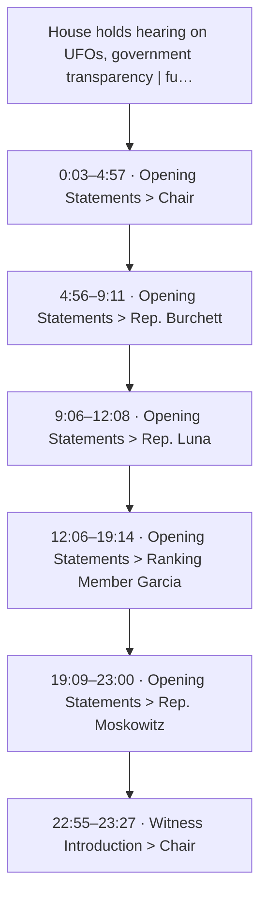
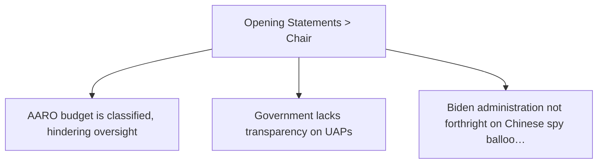
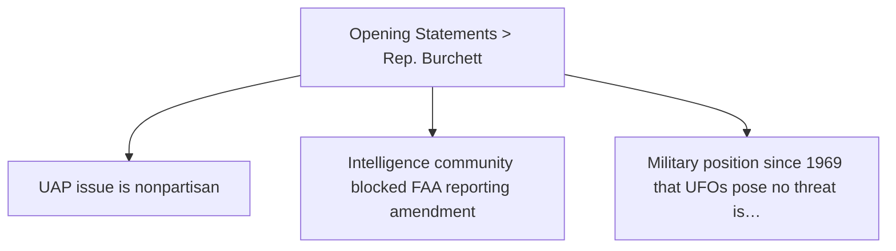
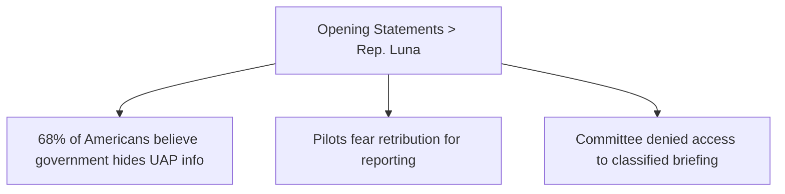
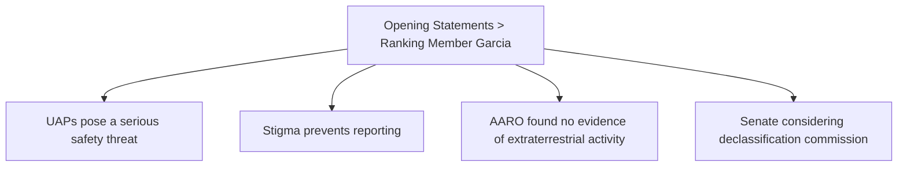
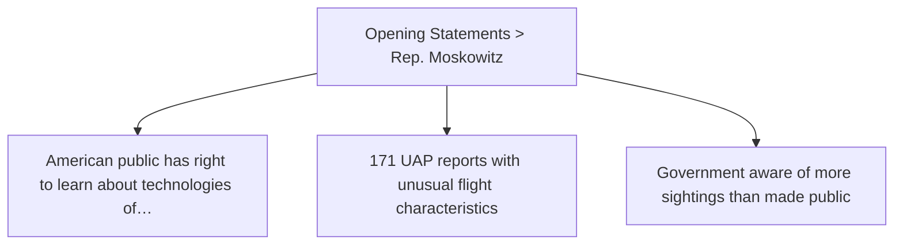

# Trace Map — House holds hearing on UFOs, government transparency | full video

- **Source ID:** `src:0aa1308d9bcb36a4`
- **Source:** https://www.youtube.com/watch?v=SNgoul4vyDM
- **Source type:** video · content type: government
- **Source hash:** `sha256:22c47a928e5b94a80192fb26e2d971ee95a379ee4bd1253e6e3a19a10575f571`
- **Schema:** `trace-map.v1` · content version 1 · review state **unreviewed**
- **Generated:** 2026-08-18T07:04:27.139911+00:00 · methodology `rag-prompt-pipeline/ADR-0001`
- **Served by:** deepseek/deepseek-chat
- **Integrity flags:** transcript_auto_generated, truncated_for_pipeline

## Legend

| Marker | Meaning |
| --- | --- |
| **Source material** | `segment`, `claim`, `evidence`, `entity` — every one carries an exact character span and, where timing exists, a timestamp |
| **[Inferred]** | `inference` — produced by a model, never by the source. Never Evidence, never a Claim |
| **Frontier** | `open_question` — what this source cannot resolve |
| Solid arrow | source-derived relationship |
| Dotted arrow | agent-produced relationship |

## Coverage

The chunker anchored **18%** of the source — 23,995 of 131,237 characters, 666 of 3,750 timed segments.

The pipeline truncates its input at 24,000 characters, so a fraction below that ratio is expected; anything lower is the chunker skipping material.

Anchor methods across segments: `exact` ×5, `prefix_suffix` ×1

## Source spine

| Segment | Time | Chars | Heading | Density | Anchor |
| --- | --- | --- | --- | --- | --- |
| `c01` | 0:03–4:57 | 0–4608 | Opening Statements > Chair | high | `exact` |
| `c02` | 4:56–9:11 | 4609–8718 | Opening Statements > Rep. Burchett | high | `exact` |
| `c03` | 9:06–12:08 | 8719–12060 | Opening Statements > Rep. Luna | high | `exact` |
| `c04` | 12:06–19:14 | 12061–19983 | Opening Statements > Ranking Member Garcia | high | `prefix_suffix` |
| `c05` | 19:09–23:00 | 19984–23600 | Opening Statements > Rep. Moskowitz | high | `exact` |
| `c06` | 22:55–23:27 | 23601–24000 | Witness Introduction > Chair | low | `exact` |

## Topics

- **Opening Statements > Chair** — introduced at 0:03–4:57 (`c01`)
- **Opening Statements > Rep. Burchett** — introduced at 4:56–9:11 (`c02`)
- **Opening Statements > Rep. Luna** — introduced at 9:06–12:08 (`c03`)
- **Opening Statements > Ranking Member Garcia** — introduced at 12:06–19:14 (`c04`)
- **Opening Statements > Rep. Moskowitz** — introduced at 19:09–23:00 (`c05`)
- **Witness Introduction > Chair** — introduced at 22:55–23:27 (`c06`)

## Claims and evidence

### Opening Statements > Chair · 0:03–4:57

### Opening Statements > Rep. Burchett · 4:56–9:11

### Opening Statements > Rep. Luna · 9:06–12:08

### Opening Statements > Ranking Member Garcia · 12:06–19:14

### Opening Statements > Rep. Moskowitz · 19:09–23:00

## Open questions

_None recorded. That is a gap, not closure — see limitations._

### Next traces

_None. No stage in this pipeline proposes concrete next sources, so the frontier stops at the questions above rather than naming records to pull._

## Agent-produced readings [Inferred]

_None._

## Trace index

Every diagram ID above resolves here. This table is the contract that makes the Mermaid views inspectable rather than decorative.

| Diagram ID | Node ID | Type | Segments | Time | Label |
| --- | --- | --- | --- | --- | --- |
| `n0` | `src:0aa1308d9bcb36a4` | source | — | — | House holds hearing on UFOs, government transparency | full video |
| `n1` | `seg:0aa1308d9bcb36a4:c01` | segment | 0–126 | 0:03–4:57 | c01 |
| `n2` | `seg:0aa1308d9bcb36a4:c02` | segment | 127–246 | 4:56–9:11 | c02 |
| `n3` | `seg:0aa1308d9bcb36a4:c03` | segment | 246–338 | 9:06–12:08 | c03 |
| `n4` | `seg:0aa1308d9bcb36a4:c04` | segment | 339–552 | 12:06–19:14 | c04 |
| `n5` | `seg:0aa1308d9bcb36a4:c05` | segment | 552–654 | 19:09–23:00 | c05 |
| `n6` | `seg:0aa1308d9bcb36a4:c06` | segment | 654–665 | 22:55–23:27 | c06 |
| `n7` | `top:f3e1e1cab13d` | topic | — | — | Opening Statements > Chair |
| `n8` | `top:299b57616318` | topic | — | — | Opening Statements > Rep. Burchett |
| `n9` | `top:272edf61e4aa` | topic | — | — | Opening Statements > Rep. Luna |
| `n10` | `top:1ae83d276cee` | topic | — | — | Opening Statements > Ranking Member Garcia |
| `n11` | `top:080c4f1d437e` | topic | — | — | Opening Statements > Rep. Moskowitz |
| `n12` | `top:119e2fd5fade` | topic | — | — | Witness Introduction > Chair |
| `n13` | `clm:0aa1308d9bcb36a4:2c75b43dc0df` | claim | 0–126 | 0:03–4:57 | AARO budget is classified, hindering oversight |
| `n14` | `clm:0aa1308d9bcb36a4:74c98f5ec4a7` | claim | 0–126 | 0:03–4:57 | Government lacks transparency on UAPs |
| `n15` | `clm:0aa1308d9bcb36a4:ed4e607555bf` | claim | 0–126 | 0:03–4:57 | Biden administration not forthright on Chinese spy balloon incident |
| `n16` | `clm:0aa1308d9bcb36a4:08ab2d53c835` | claim | 127–246 | 4:56–9:11 | UAP issue is nonpartisan |
| `n17` | `clm:0aa1308d9bcb36a4:6b735a164514` | claim | 127–246 | 4:56–9:11 | Intelligence community blocked FAA reporting amendment |
| `n18` | `clm:0aa1308d9bcb36a4:bf3b25fac782` | claim | 127–246 | 4:56–9:11 | Military position since 1969 that UFOs pose no threat is an understatement |
| `n19` | `clm:0aa1308d9bcb36a4:f58ff96d47b2` | claim | 246–338 | 9:06–12:08 | 68% of Americans believe government hides UAP info |
| `n20` | `clm:0aa1308d9bcb36a4:73f5c2014d53` | claim | 246–338 | 9:06–12:08 | Pilots fear retribution for reporting |
| `n21` | `clm:0aa1308d9bcb36a4:f67ef59dbf8c` | claim | 246–338 | 9:06–12:08 | Committee denied access to classified briefing |
| `n22` | `clm:0aa1308d9bcb36a4:37de874657b6` | claim | 339–552 | 12:06–19:14 | UAPs pose a serious safety threat |
| `n23` | `clm:0aa1308d9bcb36a4:880c404bdf47` | claim | 339–552 | 12:06–19:14 | Stigma prevents reporting |
| `n24` | `clm:0aa1308d9bcb36a4:12132bb47f89` | claim | 339–552 | 12:06–19:14 | AARO found no evidence of extraterrestrial activity |
| `n25` | `clm:0aa1308d9bcb36a4:dcc40d2aabef` | claim | 339–552 | 12:06–19:14 | Senate considering declassification commission |
| `n26` | `clm:0aa1308d9bcb36a4:58764b337be5` | claim | 552–654 | 19:09–23:00 | American public has right to learn about technologies of unknown origins |
| `n27` | `clm:0aa1308d9bcb36a4:2422c954826c` | claim | 552–654 | 19:09–23:00 | 171 UAP reports with unusual flight characteristics |
| `n28` | `clm:0aa1308d9bcb36a4:cf028f7d5ee9` | claim | 552–654 | 19:09–23:00 | Government aware of more sightings than made public |
| `n29` | `ent:0aa1308d9bcb36a4:personnel:2b5ead5b326d` | entity | 656–661 | 23:00–23:17 | Ryan Graves |
| `n30` | `ent:0aa1308d9bcb36a4:personnel:12dfe374966d` | entity | 661–665 | 23:12–23:27 | David Grusch |
| `n31` | `ent:0aa1308d9bcb36a4:organization:3af567c6fc4f` | entity | 657–658 | 23:02–23:09 | Americans for Safe Aerospace |
| `n32` | `ent:0aa1308d9bcb36a4:organization:ad007ec1f7b2` | entity | 662–664 | 23:15–23:24 | National Geospatial Intelligence Agency |
| `n33` | `ent:0aa1308d9bcb36a4:event:a663fb01756c` | entity | 655–656 | 22:58–23:04 | Witness Introduction |

**Edges:** 60 across 6 types — `about`, `asserts`, `contains`, `introduced_by`, `mentions`, `precedes`

## Limitations

- ⚠️ no next_trace nodes — no pipeline stage proposes concrete next sources
- ⚠️ no reading nodes — no interpretive stage exists; readings are never inferred here
- ⚠️ no counter_reading nodes — paired with reading; unproduced for the same reason
- ⚠️ no speaker nodes — diarisation is unavailable — the transcript carries '>>' turn markers but no speaker identities
- ⚠️ no open questions — the map manufactures closure it has no basis for
- ⚠️ no evidence→claim edges — the analysis prompt emits supporting and contradictory evidence as flat lists with no target claim, so evidence carries a stance but names no claim it bears on
- ⚠️ chunk coverage is 18% of the source (23995 of 131237 chars); the pipeline truncates at 24000 chars

