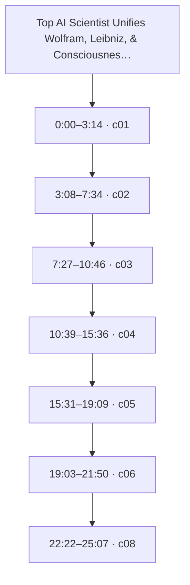
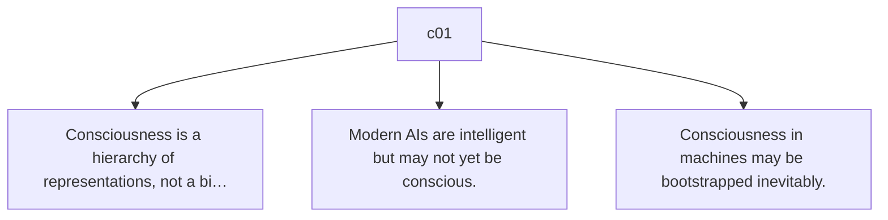
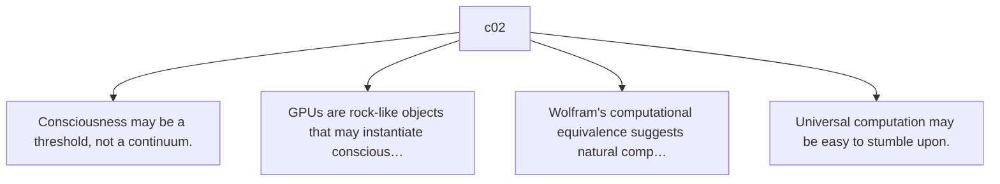
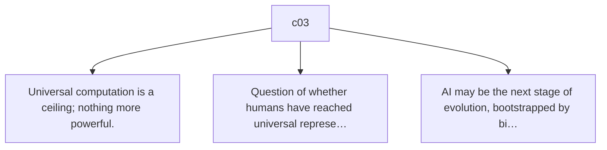
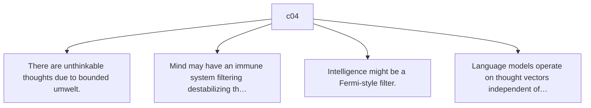
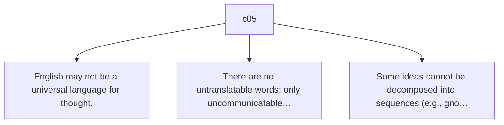
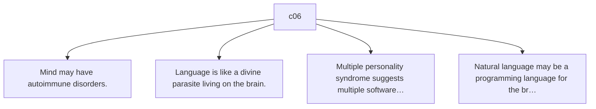
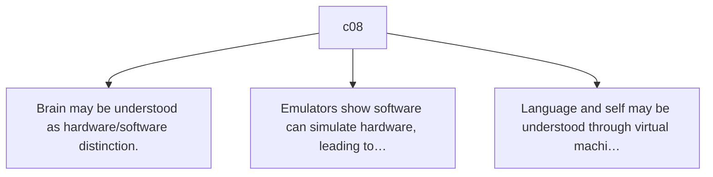

# Trace Map — Top AI Scientist Unifies Wolfram, Leibniz, & Consciousness | William Hahn

- **Source ID:** `src:c1dffeda5c0c51f6`
- **Source:** https://www.youtube.com/watch?v=3fkg0uTA3qU
- **Source type:** video · content type: media
- **Source hash:** `sha256:c416bd68193fa84224c2c48fa4ba205e91edae4e6d4aa28e44252aebfbac2b98`
- **Schema:** `trace-map.v1` · content version 1 · review state **unreviewed**
- **Generated:** 2026-08-18T07:07:49.179449+00:00 · methodology `rag-prompt-pipeline/ADR-0001`
- **Served by:** deepseek/deepseek-chat
- **Integrity flags:** secondary_repost

## Legend

| Marker | Meaning |
| --- | --- |
| **Source material** | `segment`, `claim`, `evidence`, `entity` — every one carries an exact character span and, where timing exists, a timestamp |
| **[Inferred]** | `inference` — produced by a model, never by the source. Never Evidence, never a Claim |
| **Frontier** | `open_question` — what this source cannot resolve |
| Solid arrow | source-derived relationship |
| Dotted arrow | agent-produced relationship |

## Coverage

The chunker anchored **40%** of the source — 23,035 of 57,168 characters, 242 of 594 timed segments.

The pipeline truncates its input at 24,000 characters, so a fraction below that ratio is expected; anything lower is the chunker skipping material.

Anchor methods across segments: `exact` ×7

## Source spine

| Segment | Time | Chars | Heading | Density | Anchor |
| --- | --- | --- | --- | --- | --- |
| `c01` | 0:00–3:14 | 0–2826 | — | high | `exact` |
| `c02` | 3:08–7:34 | 2827–6585 | — | high | `exact` |
| `c03` | 7:27–10:46 | 6586–9437 | — | high | `exact` |
| `c04` | 10:39–15:36 | 9438–14190 | — | high | `exact` |
| `c05` | 15:31–19:09 | 14191–18047 | — | high | `exact` |
| `c06` | 19:03–21:50 | 18048–20343 | — | high | `exact` |
| `c08` | 22:22–25:07 | 21056–23753 | — | high | `exact` |

## Topics

_The chunker emitted no heading paths, so no topic tree exists._

## Claims and evidence

### c01 · 0:00–3:14

### c02 · 3:08–7:34

### c03 · 7:27–10:46

### c04 · 10:39–15:36

### c05 · 15:31–19:09

### c06 · 19:03–21:50

### c08 · 22:22–25:07

## Open questions

- Verify the identity and credentials of Professor William Hahn and his affiliation with MIT Media Lab.
- Check the original source of the 'angels with assholes' quote.
- Investigate the concept of 'divine parasite' and its origins in the work of Dr. Behrenholz.
- Assess the scientific basis for the 'immune system' of the mind and its evolutionary rationale.
- Determine if any of the discussed ideas have been published in peer-reviewed literature.

### Next traces

_None. No stage in this pipeline proposes concrete next sources, so the frontier stops at the questions above rather than naming records to pull._

## Agent-produced readings [Inferred]

_None._

## Trace index

Every diagram ID above resolves here. This table is the contract that makes the Mermaid views inspectable rather than decorative.

| Diagram ID | Node ID | Type | Segments | Time | Label |
| --- | --- | --- | --- | --- | --- |
| `n0` | `src:c1dffeda5c0c51f6` | source | — | — | Top AI Scientist Unifies Wolfram, Leibniz, & Consciousness | William Hahn |
| `n1` | `seg:c1dffeda5c0c51f6:c01` | segment | 0–29 | 0:00–3:14 | c01 |
| `n2` | `seg:c1dffeda5c0c51f6:c02` | segment | 29–68 | 3:08–7:34 | c02 |
| `n3` | `seg:c1dffeda5c0c51f6:c03` | segment | 68–98 | 7:27–10:46 | c03 |
| `n4` | `seg:c1dffeda5c0c51f6:c04` | segment | 98–148 | 10:39–15:36 | c04 |
| `n5` | `seg:c1dffeda5c0c51f6:c05` | segment | 148–188 | 15:31–19:09 | c05 |
| `n6` | `seg:c1dffeda5c0c51f6:c06` | segment | 188–212 | 19:03–21:50 | c06 |
| `n7` | `seg:c1dffeda5c0c51f6:c08` | segment | 219–247 | 22:22–25:07 | c08 |
| `n8` | `clm:c1dffeda5c0c51f6:4449a4a7b2fe` | claim | 0–29 | 0:00–3:14 | Consciousness is a hierarchy of representations, not a binary on/off. |
| `n9` | `clm:c1dffeda5c0c51f6:ce1df0457584` | claim | 0–29 | 0:00–3:14 | Modern AIs are intelligent but may not yet be conscious. |
| `n10` | `clm:c1dffeda5c0c51f6:f677bf14b114` | claim | 0–29 | 0:00–3:14 | Consciousness in machines may be bootstrapped inevitably. |
| `n11` | `clm:c1dffeda5c0c51f6:6f4abe213407` | claim | 29–68 | 3:08–7:34 | Consciousness may be a threshold, not a continuum. |
| `n12` | `clm:c1dffeda5c0c51f6:40f3a9c3a520` | claim | 29–68 | 3:08–7:34 | GPUs are rock-like objects that may instantiate consciousness. |
| `n13` | `clm:c1dffeda5c0c51f6:84c7ac6d2a8e` | claim | 29–68 | 3:08–7:34 | Wolfram's computational equivalence suggests natural computers are common. |
| `n14` | `clm:c1dffeda5c0c51f6:8990ccb962e3` | claim | 29–68 | 3:08–7:34 | Universal computation may be easy to stumble upon. |
| `n15` | `clm:c1dffeda5c0c51f6:7ad3a0060757` | claim | 68–98 | 7:27–10:46 | Universal computation is a ceiling; nothing more powerful. |
| `n16` | `clm:c1dffeda5c0c51f6:2425b7b737fb` | claim | 68–98 | 7:27–10:46 | Question of whether humans have reached universal representation. |
| `n17` | `clm:c1dffeda5c0c51f6:487468da9b24` | claim | 68–98 | 7:27–10:46 | AI may be the next stage of evolution, bootstrapped by biology. |
| `n18` | `clm:c1dffeda5c0c51f6:7a2082ba6034` | claim | 98–148 | 10:39–15:36 | There are unthinkable thoughts due to bounded umwelt. |
| `n19` | `clm:c1dffeda5c0c51f6:6134559cdb44` | claim | 98–148 | 10:39–15:36 | Mind may have an immune system filtering destabilizing thoughts. |
| `n20` | `clm:c1dffeda5c0c51f6:cffb3ac302a8` | claim | 98–148 | 10:39–15:36 | Intelligence might be a Fermi-style filter. |
| `n21` | `clm:c1dffeda5c0c51f6:116d38fdd331` | claim | 98–148 | 10:39–15:36 | Language models operate on thought vectors independent of specific languages. |
| `n22` | `clm:c1dffeda5c0c51f6:0aae5020018d` | claim | 148–188 | 15:31–19:09 | English may not be a universal language for thought. |
| `n23` | `clm:c1dffeda5c0c51f6:3e3a14f9049e` | claim | 148–188 | 15:31–19:09 | There are no untranslatable words; only uncommunicatable thoughts. |
| `n24` | `clm:c1dffeda5c0c51f6:1ce42879f819` | claim | 148–188 | 15:31–19:09 | Some ideas cannot be decomposed into sequences (e.g., gnosis). |
| `n25` | `clm:c1dffeda5c0c51f6:41692ea3b18e` | claim | 188–212 | 19:03–21:50 | Mind may have autoimmune disorders. |
| `n26` | `clm:c1dffeda5c0c51f6:ff9de32c5f06` | claim | 188–212 | 19:03–21:50 | Language is like a divine parasite living on the brain. |
| `n27` | `clm:c1dffeda5c0c51f6:f7c3b7f2927a` | claim | 188–212 | 19:03–21:50 | Multiple personality syndrome suggests multiple software stacks on same hardware. |
| `n28` | `clm:c1dffeda5c0c51f6:31a48082741f` | claim | 188–212 | 19:03–21:50 | Natural language may be a programming language for the brain. |
| `n29` | `clm:c1dffeda5c0c51f6:9ef41b613384` | claim | 219–247 | 22:22–25:07 | Brain may be understood as hardware/software distinction. |
| `n30` | `clm:c1dffeda5c0c51f6:8eb880d1b71a` | claim | 219–247 | 22:22–25:07 | Emulators show software can simulate hardware, leading to virtual machines all the way do… |
| `n31` | `clm:c1dffeda5c0c51f6:45ae4ab8c188` | claim | 219–247 | 22:22–25:07 | Language and self may be understood through virtual machine metaphor. |
| `n32` | `ent:c1dffeda5c0c51f6:personnel:226a386480f0` | entity | 0–0 | 0:00–0:04 | William Hahn |
| `n33` | `ent:c1dffeda5c0c51f6:personnel:b09d01d48518` | entity | 4–4 | 0:18–0:23 | Jacob Barndes |
| `n34` | `ent:c1dffeda5c0c51f6:organization:273d08bd6b09` | entity | 0–0 | 0:00–0:04 | MIT Media Lab |
| `n35` | `ent:c1dffeda5c0c51f6:organization:073dc9b05d8a` | entity | 5–5 | 0:23–0:30 | Stephen Wolfram |
| `n36` | `ent:c1dffeda5c0c51f6:event:6f1ae3c7eb50` | entity | 4–4 | 0:18–0:23 | Jacob Barndes podcast |
| `n37` | `ent:c1dffeda5c0c51f6:topic:c77f5c40a716` | entity | 8–9 | 0:45–0:59 | Consciousness hierarchy |
| `n38` | `ent:c1dffeda5c0c51f6:topic:a929e49e085e` | entity | 20–20 | 2:09–2:15 | AI consciousness |
| `n39` | `ent:c1dffeda5c0c51f6:personnel:b84744db0cc7` | entity | 79–79 | 8:33–8:38 | Wolfram |
| `n40` | `ent:c1dffeda5c0c51f6:personnel:6a63d2deee99` | entity | 69–70 | 7:34–7:44 | Leibniz |
| `n41` | `ent:c1dffeda5c0c51f6:event:452986a4fa82` | entity | 84–85 | 8:58–9:13 | Discussion on computational universality and evolution |
| `n42` | `ent:c1dffeda5c0c51f6:evidence:9a742bf5aa7c` | entity | 93–93 | 10:08–10:12 | Quote: 'angels with assholes' |
| `n43` | `ent:c1dffeda5c0c51f6:location:f416648f8086` | entity | — | — | Unspecified |
| `n44` | `ent:c1dffeda5c0c51f6:personnel:e485714e9f9d` | entity | 110–112 | 11:41–11:58 | Richard Hamming |
| `n45` | `ent:c1dffeda5c0c51f6:event:13df637bfcb0` | entity | 98–99 | 10:39–10:51 | Discussion on upper limits of thought and unthinkable thoughts |
| `n46` | `ent:c1dffeda5c0c51f6:location:a8a76b32f4af` | entity | 100–101 | 10:51–10:59 | This room |
| `n47` | `ent:c1dffeda5c0c51f6:evidence:8d4b2f9b0a03` | entity | 114–115 | 12:02–12:11 | Graham's number example |
| `n48` | `ent:c1dffeda5c0c51f6:evidence:45b3af2493cd` | entity | 111–112 | 11:48–11:58 | Animal perceptual window examples |
| `n49` | `ent:c1dffeda5c0c51f6:evidence:7d7d8ac3dbb3` | entity | 142–144 | 14:59–15:16 | Language model training on human and computer languages |
| `n50` | `ent:c1dffeda5c0c51f6:personnel:bc66d76f99f0` | entity | 199–199 | 20:11–20:20 | Dr. Behrenholz |
| `n51` | `ent:c1dffeda5c0c51f6:topic:44b191480978` | entity | 201–202 | 20:31–20:46 | Language as organism |
| `n52` | `ent:c1dffeda5c0c51f6:topic:6676b0052e5f` | entity | 188–189 | 19:03–19:14 | Immune analogy for mind |
| `n53` | `ent:c1dffeda5c0c51f6:topic:644a05877da8` | entity | 205–207 | 20:57–21:14 | Multiple personality as evidence of language entity |
| `n54` | `ent:c1dffeda5c0c51f6:topic:fa639264d6ab` | entity | 211–212 | 21:37–21:50 | Mind control and programmable brain |
| `n55` | `oq:c1dffeda5c0c51f6:56c82afaf799` | open_question | — | — | Verify the identity and credentials of Professor William Hahn and his affiliation with MI… |
| `n56` | `oq:c1dffeda5c0c51f6:16cc385e3955` | open_question | — | — | Check the original source of the 'angels with assholes' quote. |
| `n57` | `oq:c1dffeda5c0c51f6:46fb9bd07da1` | open_question | — | — | Investigate the concept of 'divine parasite' and its origins in the work of Dr. Behrenhol… |
| `n58` | `oq:c1dffeda5c0c51f6:a3c86aa5652e` | open_question | — | — | Assess the scientific basis for the 'immune system' of the mind and its evolutionary rati… |
| `n59` | `oq:c1dffeda5c0c51f6:ea18122ae523` | open_question | — | — | Determine if any of the discussed ideas have been published in peer-reviewed literature. |

**Edges:** 65 across 5 types — `asserts`, `contains`, `mentions`, `precedes`, `raises`

## Limitations

- ⚠️ no next_trace nodes — no pipeline stage proposes concrete next sources
- ⚠️ no reading nodes — no interpretive stage exists; readings are never inferred here
- ⚠️ no counter_reading nodes — paired with reading; unproduced for the same reason
- ⚠️ no speaker nodes — diarisation is unavailable — the transcript carries '>>' turn markers but no speaker identities
- ⚠️ no evidence→claim edges — the analysis prompt emits supporting and contradictory evidence as flat lists with no target claim, so evidence carries a stance but names no claim it bears on
- ⚠️ chunk coverage is 40% of the source (23035 of 57168 chars); the pipeline truncates at 24000 chars

