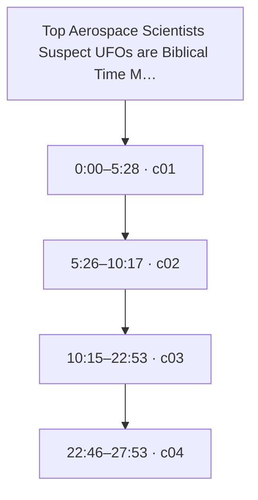
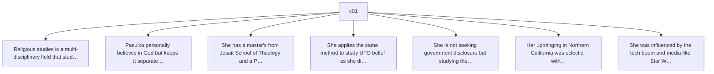
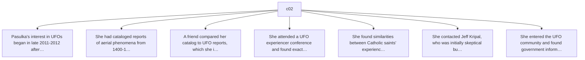
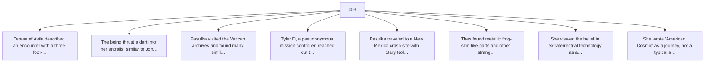
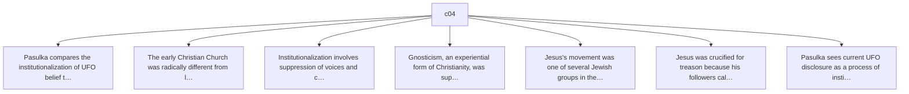

# Trace Map — Top Aerospace Scientists Suspect UFOs are Biblical Time Machines | Diana Walsh Pasulka

- **Source ID:** `src:9d6cf70e3325a42d`
- **Source:** https://www.youtube.com/watch?v=aQhikls5Ye8
- **Source type:** video · content type: media
- **Source hash:** `sha256:71a2b48598d70349f624294ab2bb0a36763cc19aee99ee4ddac83574231eb6f7`
- **Schema:** `trace-map.v1` · content version 1 · review state **unreviewed**
- **Generated:** 2026-08-18T07:10:55.190490+00:00 · methodology `rag-prompt-pipeline/ADR-0001`
- **Served by:** deepseek/deepseek-chat
- **Integrity flags:** transcript_auto_generated, truncated

## Legend

| Marker | Meaning |
| --- | --- |
| **Source material** | `segment`, `claim`, `evidence`, `entity` — every one carries an exact character span and, where timing exists, a timestamp |
| **[Inferred]** | `inference` — produced by a model, never by the source. Never Evidence, never a Claim |
| **Frontier** | `open_question` — what this source cannot resolve |
| Solid arrow | source-derived relationship |
| Dotted arrow | agent-produced relationship |

## Coverage

The chunker anchored **17%** of the source — 23,996 of 139,568 characters, 682 of 3,951 timed segments.

The pipeline truncates its input at 24,000 characters, so a fraction below that ratio is expected; anything lower is the chunker skipping material.

Anchor methods across segments: `exact` ×4

## Source spine

| Segment | Time | Chars | Heading | Density | Anchor |
| --- | --- | --- | --- | --- | --- |
| `c01` | 0:00–5:28 | 0–4606 | — | high | `exact` |
| `c02` | 5:26–10:17 | 4607–8924 | — | high | `exact` |
| `c03` | 10:15–22:53 | 8925–19537 | — | high | `exact` |
| `c04` | 22:46–27:53 | 19538–23999 | — | high | `exact` |

## Topics

_The chunker emitted no heading paths, so no topic tree exists._

## Claims and evidence

### c01 · 0:00–5:28

### c02 · 5:26–10:17

### c03 · 10:15–22:53

### c04 · 22:46–27:53

## Open questions

_None recorded. That is a gap, not closure — see limitations._

### Next traces

_None. No stage in this pipeline proposes concrete next sources, so the frontier stops at the questions above rather than naming records to pull._

## Agent-produced readings [Inferred]

_None._

## Trace index

Every diagram ID above resolves here. This table is the contract that makes the Mermaid views inspectable rather than decorative.

| Diagram ID | Node ID | Type | Segments | Time | Label |
| --- | --- | --- | --- | --- | --- |
| `n0` | `src:9d6cf70e3325a42d` | source | — | — | Top Aerospace Scientists Suspect UFOs are Biblical Time Machines | Diana Walsh Pasulka |
| `n1` | `seg:9d6cf70e3325a42d:c01` | segment | 0–130 | 0:00–5:28 | c01 |
| `n2` | `seg:9d6cf70e3325a42d:c02` | segment | 131–249 | 5:26–10:17 | c02 |
| `n3` | `seg:9d6cf70e3325a42d:c03` | segment | 250–556 | 10:15–22:53 | c03 |
| `n4` | `seg:9d6cf70e3325a42d:c04` | segment | 556–681 | 22:46–27:53 | c04 |
| `n5` | `clm:9d6cf70e3325a42d:b79f2f3752e4` | claim | 0–130 | 0:00–5:28 | Religious studies is a multi-disciplinary field that studies belief and its impact, not a… |
| `n6` | `clm:9d6cf70e3325a42d:6d07f949e057` | claim | 0–130 | 0:00–5:28 | Pasulka personally believes in God but keeps it separate from her academic work. |
| `n7` | `clm:9d6cf70e3325a42d:b4b0add43ac4` | claim | 0–130 | 0:00–5:28 | She has a master's from Jesuit School of Theology and a PhD from Syracuse University. |
| `n8` | `clm:9d6cf70e3325a42d:9d304fc33704` | claim | 0–130 | 0:00–5:28 | She applies the same method to study UFO belief as she did to Catholic history. |
| `n9` | `clm:9d6cf70e3325a42d:bcf6c3fb1f53` | claim | 0–130 | 0:00–5:28 | She is not seeking government disclosure but studying the impact of UFO belief on populat… |
| `n10` | `clm:9d6cf70e3325a42d:790a4152ba34` | claim | 0–130 | 0:00–5:28 | Her upbringing in Northern California was eclectic, with parents interested in philosophy. |
| `n11` | `clm:9d6cf70e3325a42d:e8161e576ef8` | claim | 0–130 | 0:00–5:28 | She was influenced by the tech boom and media like Star Wars in studying technology and r… |
| `n12` | `clm:9d6cf70e3325a42d:68d8ad8ff1d9` | claim | 131–249 | 5:26–10:17 | Pasulka's interest in UFOs began in late 2011-2012 after finishing a book on purgatory. |
| `n13` | `clm:9d6cf70e3325a42d:7277316b3c10` | claim | 131–249 | 5:26–10:17 | She had cataloged reports of aerial phenomena from 1400-1700 European Catholicism. |
| `n14` | `clm:9d6cf70e3325a42d:11fb70fed0b3` | claim | 131–249 | 5:26–10:17 | A friend compared her catalog to UFO reports, which she initially dismissed. |
| `n15` | `clm:9d6cf70e3325a42d:4037c857bd35` | claim | 131–249 | 5:26–10:17 | She attended a UFO experiencer conference and found exact matches with her historical cat… |
| `n16` | `clm:9d6cf70e3325a42d:e7a307ac9083` | claim | 131–249 | 5:26–10:17 | She found similarities between Catholic saints' experiences and John Mack's abduction acc… |
| `n17` | `clm:9d6cf70e3325a42d:7c4672413505` | claim | 131–249 | 5:26–10:17 | She contacted Jeff Kripal, who was initially skeptical but later convinced. |
| `n18` | `clm:9d6cf70e3325a42d:91575fcfc6cd` | claim | 131–249 | 5:26–10:17 | She entered the UFO community and found government information and high-level scientists… |
| `n19` | `clm:9d6cf70e3325a42d:2af0e372b6b1` | claim | 250–556 | 10:15–22:53 | Teresa of Avila described an encounter with a three-foot-tall shiny being she thought was… |
| `n20` | `clm:9d6cf70e3325a42d:6f845aacc537` | claim | 250–556 | 10:15–22:53 | The being thrust a dart into her entrails, similar to John Mack's accounts of examination. |
| `n21` | `clm:9d6cf70e3325a42d:cc9dcb73a409` | claim | 250–556 | 10:15–22:53 | Pasulka visited the Vatican archives and found many similar accounts in old manuscripts. |
| `n22` | `clm:9d6cf70e3325a42d:0adb93be2ee1` | claim | 250–556 | 10:15–22:53 | Tyler D, a pseudonymous mission controller, reached out to Pasulka and connected her to t… |
| `n23` | `clm:9d6cf70e3325a42d:1f82a13be8bc` | claim | 250–556 | 10:15–22:53 | Pasulka traveled to a New Mexico crash site with Gary Nolan and Tyler D, blindfolded. |
| `n24` | `clm:9d6cf70e3325a42d:9e22886f2342` | claim | 250–556 | 10:15–22:53 | They found metallic frog-skin-like parts and other strange debris, but Pasulka remained s… |
| `n25` | `clm:9d6cf70e3325a42d:77f2d746a659` | claim | 250–556 | 10:15–22:53 | She viewed the belief in extraterrestrial technology as a modern Promethean myth. |
| `n26` | `clm:9d6cf70e3325a42d:3ce8e438d4af` | claim | 250–556 | 10:15–22:53 | She wrote 'American Cosmic' as a journey, not a typical academic book, published by Oxfor… |
| `n27` | `clm:9d6cf70e3325a42d:0e0b0b9585c9` | claim | 556–681 | 22:46–27:53 | Pasulka compares the institutionalization of UFO belief to the institutionalization of Ch… |
| `n28` | `clm:9d6cf70e3325a42d:c7901fec234c` | claim | 556–681 | 22:46–27:53 | The early Christian Church was radically different from later institutionalized forms. |
| `n29` | `clm:9d6cf70e3325a42d:f1047635f2d1` | claim | 556–681 | 22:46–27:53 | Institutionalization involves suppression of voices and control of information. |
| `n30` | `clm:9d6cf70e3325a42d:c86fe2fc8a32` | claim | 556–681 | 22:46–27:53 | Gnosticism, an experiential form of Christianity, was suppressed or submerged. |
| `n31` | `clm:9d6cf70e3325a42d:9b229a70088f` | claim | 556–681 | 22:46–27:53 | Jesus's movement was one of several Jewish groups in the first century. |
| `n32` | `clm:9d6cf70e3325a42d:a1c7ef68ec14` | claim | 556–681 | 22:46–27:53 | Jesus was crucified for treason because his followers called him Son of God, challenging… |
| `n33` | `clm:9d6cf70e3325a42d:38973fa5396d` | claim | 556–681 | 22:46–27:53 | Pasulka sees current UFO disclosure as a process of institutionalization with misinformat… |

**Edges:** 36 across 3 types — `asserts`, `contains`, `precedes`

## Limitations

- ⚠️ no next_trace nodes — no pipeline stage proposes concrete next sources
- ⚠️ no reading nodes — no interpretive stage exists; readings are never inferred here
- ⚠️ no counter_reading nodes — paired with reading; unproduced for the same reason
- ⚠️ no speaker nodes — diarisation is unavailable — the transcript carries '>>' turn markers but no speaker identities
- ⚠️ no open questions — the map manufactures closure it has no basis for
- ⚠️ no evidence→claim edges — the analysis prompt emits supporting and contradictory evidence as flat lists with no target claim, so evidence carries a stance but names no claim it bears on
- ⚠️ chunk coverage is 17% of the source (23996 of 139568 chars); the pipeline truncates at 24000 chars

