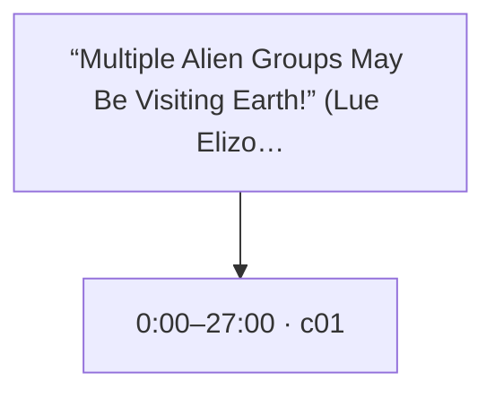

# Trace Map — “Multiple Alien Groups May Be Visiting Earth!” (Lue Elizondo Documentary)

- **Source ID:** `src:ed656a3251499aa7`
- **Source:** https://www.youtube.com/watch?v=1f16VvXaSSE
- **Source type:** video · content type: media
- **Source hash:** `sha256:0a2f6f052f15c3fbfed37d7c91f0797a7c20800f52aa63d58cc5adfb6a0a1bb4`
- **Schema:** `trace-map.v1` · content version 1 · review state **unreviewed**
- **Generated:** 2026-08-18T06:46:21.541178+00:00 · methodology `rag-prompt-pipeline/ADR-0001`
- **Served by:** deepseek/deepseek-chat (degraded)
- **Integrity flags:** secondary_repost, transcript_noise

## Legend

| Marker | Meaning |
| --- | --- |
| **Source material** | `segment`, `claim`, `evidence`, `entity` — every one carries an exact character span and, where timing exists, a timestamp |
| **[Inferred]** | `inference` — produced by a model, never by the source. Never Evidence, never a Claim |
| **Frontier** | `open_question` — what this source cannot resolve |
| Solid arrow | source-derived relationship |
| Dotted arrow | agent-produced relationship |

## Coverage

The chunker anchored **21%** of the source — 23,999 of 116,144 characters, 655 of 3,149 timed segments.

The pipeline truncates its input at 24,000 characters, so a fraction below that ratio is expected; anything lower is the chunker skipping material.

Anchor methods across segments: `exact` ×1

## Source spine

| Segment | Time | Chars | Heading | Density | Anchor |
| --- | --- | --- | --- | --- | --- |
| `c01` | 0:00–27:00 | 0–23999 | — | high | `exact` |

## Topics

_The chunker emitted no heading paths, so no topic tree exists._

## Claims and evidence

### c01 · 0:00–27:00

```mermaid
flowchart TD
  n1["c01"]
  n2["UAP are either real or mass hysteria"]
  n1 --> n2
  n3["Elizondo is a Pentagon whistleblower"]
  n1 --> n3
  n4["Elizondo was director of ATIP"]
  n1 --> n4
  n5["Elizondo worked with David Grusch"]
  n1 --> n5
  n6["UAP are interested in nuclear capabilities"]
  n1 --> n6
  n7["Elizondo handled an implant that moved under its own meta…"]
  n1 --> n7
  n8["Maurice Hill witnessed 1952 DC flyover and a jellyfish UF…"]
  n1 --> n8
  n9["Jellyfish UFOs have multiple accounts"]
  n1 --> n9
  n10["Craft may have ablative sacrificial outer layer"]
  n1 --> n10
  n11["Edgar Mitchell's UFO footage was confiscated"]
  n1 --> n11
  n12["Senator Stevens encountered Foo Fighters"]
  n1 --> n12
```

_12 claims in this segment; 11 shown. All appear in the trace index._

## Open questions

_None recorded. That is a gap, not closure — see limitations._

### Next traces

_None. No stage in this pipeline proposes concrete next sources, so the frontier stops at the questions above rather than naming records to pull._

## Agent-produced readings [Inferred]

_None._

## Trace index

Every diagram ID above resolves here. This table is the contract that makes the Mermaid views inspectable rather than decorative.

| Diagram ID | Node ID | Type | Segments | Time | Label |
| --- | --- | --- | --- | --- | --- |
| `n0` | `src:ed656a3251499aa7` | source | — | — | “Multiple Alien Groups May Be Visiting Earth!” (Lue Elizondo Documentary) |
| `n1` | `seg:ed656a3251499aa7:c01` | segment | 0–654 | 0:00–27:00 | c01 |
| `n2` | `clm:ed656a3251499aa7:292f7415607f` | claim | 0–654 | 0:00–27:00 | UAP are either real or mass hysteria |
| `n3` | `clm:ed656a3251499aa7:254bfabcf0af` | claim | 0–654 | 0:00–27:00 | Elizondo is a Pentagon whistleblower |
| `n4` | `clm:ed656a3251499aa7:284443c45c6c` | claim | 0–654 | 0:00–27:00 | Elizondo was director of ATIP |
| `n5` | `clm:ed656a3251499aa7:5d59e4cca2ce` | claim | 0–654 | 0:00–27:00 | Elizondo worked with David Grusch |
| `n6` | `clm:ed656a3251499aa7:c79fc6dcf661` | claim | 0–654 | 0:00–27:00 | UAP are interested in nuclear capabilities |
| `n7` | `clm:ed656a3251499aa7:cf9c1bd0a85d` | claim | 0–654 | 0:00–27:00 | Elizondo handled an implant that moved under its own metabolism |
| `n8` | `clm:ed656a3251499aa7:23e00123c849` | claim | 0–654 | 0:00–27:00 | Maurice Hill witnessed 1952 DC flyover and a jellyfish UFO in the 1970s |
| `n9` | `clm:ed656a3251499aa7:dbe17e7d0e9a` | claim | 0–654 | 0:00–27:00 | Jellyfish UFOs have multiple accounts |
| `n10` | `clm:ed656a3251499aa7:b5b3accd1c78` | claim | 0–654 | 0:00–27:00 | Craft may have ablative sacrificial outer layer |
| `n11` | `clm:ed656a3251499aa7:9ff273f6c6ad` | claim | 0–654 | 0:00–27:00 | Edgar Mitchell's UFO footage was confiscated |
| `n12` | `clm:ed656a3251499aa7:88b27bd8bdf2` | claim | 0–654 | 0:00–27:00 | Senator Stevens encountered Foo Fighters |
| `n13` | `clm:ed656a3251499aa7:cc9a03c16065` | claim | 0–654 | 0:00–27:00 | Wernher von Braun showed Yuri Gagarin a piece of a crashed UFO |

**Edges:** 13 across 2 types — `asserts`, `contains`

## Limitations

- ⚠️ no next_trace nodes — no pipeline stage proposes concrete next sources
- ⚠️ no reading nodes — no interpretive stage exists; readings are never inferred here
- ⚠️ no counter_reading nodes — paired with reading; unproduced for the same reason
- ⚠️ no speaker nodes — diarisation is unavailable — the transcript carries '>>' turn markers but no speaker identities
- ⚠️ no open questions — the map manufactures closure it has no basis for
- ⚠️ no evidence→claim edges — the analysis prompt emits supporting and contradictory evidence as flat lists with no target claim, so evidence carries a stance but names no claim it bears on
- ⚠️ chunk coverage is 21% of the source (23999 of 116144 chars); the pipeline truncates at 24000 chars

