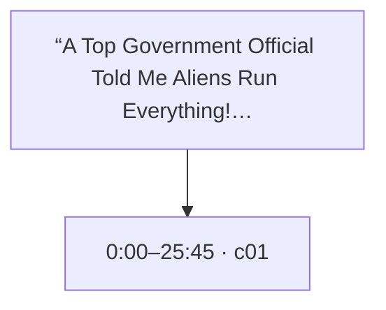

# Trace Map — “A Top Government Official Told Me Aliens Run Everything!” -Dylan Borland UNLEASHED

- **Source ID:** `src:e3b9802412182630`
- **Source:** https://www.youtube.com/watch?v=K4gYHs84BIc
- **Source type:** video · content type: interview_transcript
- **Source hash:** `sha256:4a70852cbfe6cbc6de8c1c0295effc491d374549e6d9ad5e2f284251f1469cf4`
- **Schema:** `trace-map.v1` · content version 1 · review state **unreviewed**
- **Generated:** 2026-09-10T17:49:19.713455+00:00 · methodology `rag-prompt-pipeline/ADR-0001`
- **Served by:** deepseek/deepseek-chat (degraded)
- **Integrity flags:** truncated_for_pipeline

## Legend

| Marker | Meaning |
| --- | --- |
| **Source material** | `segment`, `claim`, `evidence`, `entity` — every one carries an exact character span and, where timing exists, a timestamp |
| **[Inferred]** | `inference` — produced by a model, never by the source. Never Evidence, never a Claim |
| **Frontier** | `open_question` — what this source cannot resolve |
| Solid arrow | source-derived relationship |
| Dotted arrow | agent-produced relationship |

## Coverage

The chunker anchored **13%** of the source — 24,000 of 190,203 characters, 684 of 5,443 timed segments.

The pipeline truncates its input at 24,000 characters, so a fraction below that ratio is expected; anything lower is the chunker skipping material.

Anchor methods across segments: `prefix_suffix` ×1

## Source spine

| Segment | Time | Chars | Heading | Density | Anchor |
| --- | --- | --- | --- | --- | --- |
| `c01` | 0:00–25:45 | 0–24000 | — | high | `prefix_suffix` |

## Topics

_The chunker emitted no heading paths, so no topic tree exists._

## Claims and evidence

### c01 · 0:00–25:45

```mermaid
flowchart TD
  n1["c01"]
  n2["Dylan Borland witnessed a 100 ft equilateral triangle UAP…"]
  n1 --> n2
  n3["The UAP moved from 100 ft to 30,000 ft in 2-3 seconds."]
  n1 --> n3
  n4["Borland was a 1N1 geospatial intelligence specialist in t…"]
  n1 --> n4
  n5["Borland was told by an ODNI agent that a UFO program is c…"]
  n1 --> n5
  n6["ODNI allegedly disclosed whistleblower testimony to journ…"]
  n1 --> n6
  n7["Whistleblowers who disclose CIA/DOE secrets to ICIG are p…"]
  n1 --> n7
  n8["Borland experienced reprisals and administrative terroris…"]
  n1 --> n8
  n9["Borland was medically discharged in 2013."]
  n1 --> n9
  n10["Drone program had higher suicide rates than other militar…"]
  n1 --> n10
  n11["Borland worked with special forces and special operations…"]
  n1 --> n11
  n12["Borland's father was a Navy vet on nuclear aircraft carri…"]
  n1 --> n12
```

_21 claims in this segment; 11 shown. All appear in the trace index._

## Open questions

_None recorded. That is a gap, not closure — see limitations._

### Next traces

_None. No stage in this pipeline proposes concrete next sources, so the frontier stops at the questions above rather than naming records to pull._

## Agent-produced readings [Inferred]

_None._

## Trace index

Every diagram ID above resolves here. This table is the contract that makes the Mermaid views inspectable rather than decorative.

| Diagram ID | Node ID | Type | Segments | Time | Label |
| --- | --- | --- | --- | --- | --- |
| `n0` | `src:e3b9802412182630` | source | — | — | “A Top Government Official Told Me Aliens Run Everything!” -Dylan Borland UNLEASHED |
| `n1` | `seg:e3b9802412182630:c01` | segment | 0–683 | 0:00–25:45 | c01 |
| `n2` | `clm:e3b9802412182630:a9c83049ea45` | claim | 0–683 | 0:00–25:45 | Dylan Borland witnessed a 100 ft equilateral triangle UAP take off near NASA hanger at La… |
| `n3` | `clm:e3b9802412182630:17a1c48ffd7c` | claim | 0–683 | 0:00–25:45 | The UAP moved from 100 ft to 30,000 ft in 2-3 seconds. |
| `n4` | `clm:e3b9802412182630:a339ac6ba25c` | claim | 0–683 | 0:00–25:45 | Borland was a 1N1 geospatial intelligence specialist in the USAF from 2010-2013. |
| `n5` | `clm:e3b9802412182630:41d2475bf575` | claim | 0–683 | 0:00–25:45 | Borland was told by an ODNI agent that a UFO program is called 'Rubik's Cube'. |
| `n6` | `clm:e3b9802412182630:6c426d1c02c0` | claim | 0–683 | 0:00–25:45 | ODNI allegedly disclosed whistleblower testimony to journalists Jeremy Corbel and George… |
| `n7` | `clm:e3b9802412182630:025fe8e0b72b` | claim | 0–683 | 0:00–25:45 | Whistleblowers who disclose CIA/DOE secrets to ICIG are protected from espionage prosecut… |
| `n8` | `clm:e3b9802412182630:7d40fb7f2fc9` | claim | 0–683 | 0:00–25:45 | Borland experienced reprisals and administrative terrorism, including polygraph with air… |
| `n9` | `clm:e3b9802412182630:cca8f91752b2` | claim | 0–683 | 0:00–25:45 | Borland was medically discharged in 2013. |
| `n10` | `clm:e3b9802412182630:0353173540bc` | claim | 0–683 | 0:00–25:45 | Drone program had higher suicide rates than other military units. |
| `n11` | `clm:e3b9802412182630:0a0ccca3f9f0` | claim | 0–683 | 0:00–25:45 | Borland worked with special forces and special operations in the drone program. |
| `n12` | `clm:e3b9802412182630:9ece27a6136e` | claim | 0–683 | 0:00–25:45 | Borland's father was a Navy vet on nuclear aircraft carriers. |
| `n13` | `clm:e3b9802412182630:e1b0262efad5` | claim | 0–683 | 0:00–25:45 | Borland's father worked on museums including the Constitution display. |
| `n14` | `clm:e3b9802412182630:4b018264fef1` | claim | 0–683 | 0:00–25:45 | Borland is from Pittsburgh area. |
| `n15` | `clm:e3b9802412182630:b5febe12fbe8` | claim | 0–683 | 0:00–25:45 | Bettis research lab developed nuclear power for Navy in 1950s. |
| `n16` | `clm:e3b9802412182630:1887a167d97b` | claim | 0–683 | 0:00–25:45 | I-81 corridor has historical UFO flaps. |
| `n17` | `clm:e3b9802412182630:7f2a39e4f81f` | claim | 0–683 | 0:00–25:45 | Roscoe Hillenkoetter was first CIA director and on board of New Fork. |
| `n18` | `clm:e3b9802412182630:83fff7a5b02e` | claim | 0–683 | 0:00–25:45 | Hillenkoetter was frustrated about not getting proper information about Roswell. |
| `n19` | `clm:e3b9802412182630:2d68c69e3256` | claim | 0–683 | 0:00–25:45 | Majestic 12 may be tied to National Security Council. |
| `n20` | `clm:e3b9802412182630:9d4f3ea18b4e` | claim | 0–683 | 0:00–25:45 | Borland testified before Congress in September 2025. |
| `n21` | `clm:e3b9802412182630:df12c0e5ca8f` | claim | 0–683 | 0:00–25:45 | Borland believes 90-95% of UFO information is already out there. |
| `n22` | `clm:e3b9802412182630:947113ec7f18` | claim | 0–683 | 0:00–25:45 | Borland experienced collateral damage in drone operations and thinks about it daily. |

**Edges:** 22 across 2 types — `asserts`, `contains`

## Limitations

- ⚠️ no next_trace nodes — no pipeline stage proposes concrete next sources
- ⚠️ no reading nodes — no interpretive stage exists; readings are never inferred here
- ⚠️ no counter_reading nodes — paired with reading; unproduced for the same reason
- ⚠️ no speaker nodes — diarisation is unavailable — the transcript carries '>>' turn markers but no speaker identities
- ⚠️ no open questions — the map manufactures closure it has no basis for
- ⚠️ no evidence→claim edges — the analysis prompt emits supporting and contradictory evidence as flat lists with no target claim, so evidence carries a stance but names no claim it bears on
- ⚠️ chunk coverage is 13% of the source (24000 of 190203 chars); the pipeline truncates at 24000 chars

