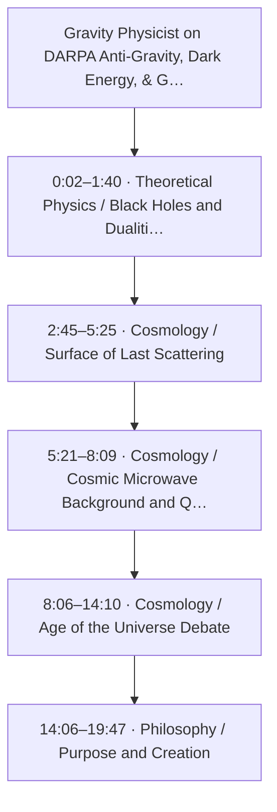
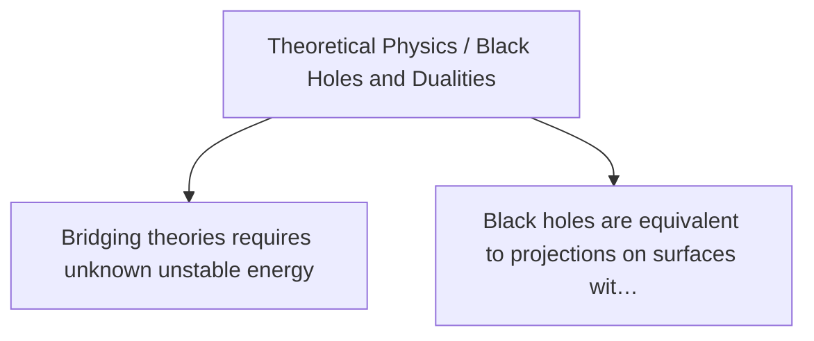
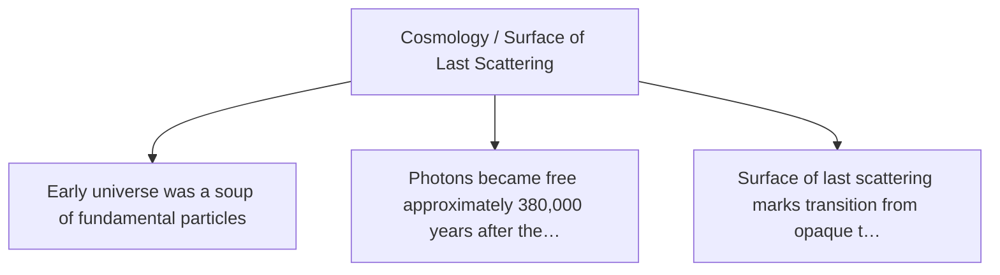
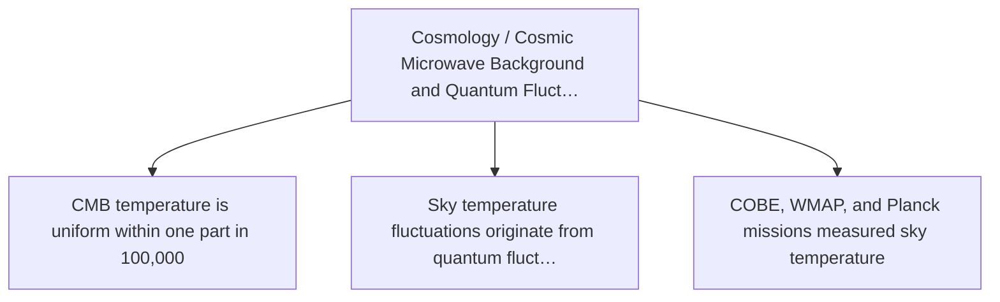
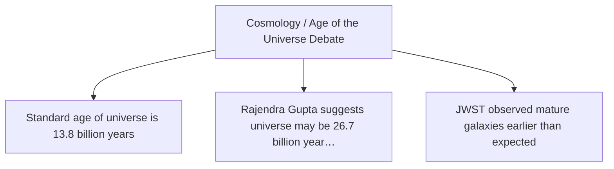
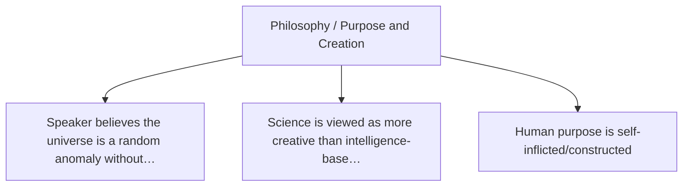

# Trace Map — Gravity Physicist on DARPA Anti-Gravity, Dark Energy, & God | Claudia de Rham

- **Source ID:** `src:911ba513e9ff855d`
- **Source:** https://www.youtube.com/watch?v=4N_DcI0s_-U
- **Source type:** video · content type: media transcript
- **Source hash:** `sha256:c0183d931d6634a126f3ab83355590c718371dbc5e9612b030211ecd9961f543`
- **Schema:** `trace-map.v1` · content version 1 · review state **unreviewed**
- **Generated:** 2026-08-16T03:37:45.327686+00:00 · methodology `rag-prompt-pipeline/ADR-0001`
- **Served by:** deepseek/deepseek-v4-pro, google/gemini-3-flash (degraded)
- **Integrity flags:** transcript_artifacts, conversational_filler

## Legend

| Marker | Meaning |
| --- | --- |
| **Source material** | `segment`, `claim`, `evidence`, `entity` — every one carries an exact character span and, where timing exists, a timestamp |
| **[Inferred]** | `inference` — produced by a model, never by the source. Never Evidence, never a Claim |
| **Frontier** | `open_question` — what this source cannot resolve |
| Solid arrow | source-derived relationship |
| Dotted arrow | agent-produced relationship |

## Coverage

The chunker anchored **31%** of the source — 18,307 of 59,125 characters, 576 of 1,838 timed segments.

The pipeline truncates its input at 24,000 characters, so a fraction below that ratio is expected; anything lower is the chunker skipping material.

Anchor methods across segments: `interpolated` ×1, `prefix_suffix` ×4

## Source spine

| Segment | Time | Chars | Heading | Density | Anchor |
| --- | --- | --- | --- | --- | --- |
| `c01` | 0:02–1:40 | 16–1570 | Theoretical Physics / Black Holes and Dualities | medium | `prefix_suffix` |
| `c02` | 2:45–5:25 | 2650–5015 | Cosmology / Surface of Last Scattering | high | `prefix_suffix` |
| `c03` | 5:21–8:09 | 5016–7594 | Cosmology / Cosmic Microwave Background and Quantum Fluctuations | high | `prefix_suffix` |
| `c04` | 8:06–14:10 | 7594–13628 | Cosmology / Age of the Universe Debate | medium | `interpolated` |
| `c05` | 14:06–19:47 | 13628–19404 | Philosophy / Purpose and Creation | low | `prefix_suffix` |

## Topics

- **Theoretical Physics / Black Holes and Dualities** — introduced at 0:02–1:40 (`c01`)
- **Cosmology / Surface of Last Scattering** — introduced at 2:45–5:25 (`c02`)
- **Cosmology / Cosmic Microwave Background and Quantum Fluctuations** — introduced at 5:21–8:09 (`c03`)
- **Cosmology / Age of the Universe Debate** — introduced at 8:06–14:10 (`c04`)
- **Philosophy / Purpose and Creation** — introduced at 14:06–19:47 (`c05`)

## Claims and evidence

### Theoretical Physics / Black Holes and Dualities · 0:02–1:40

### Cosmology / Surface of Last Scattering · 2:45–5:25

### Cosmology / Cosmic Microwave Background and Quantum Fluctuations · 5:21–8:09

### Cosmology / Age of the Universe Debate · 8:06–14:10

### Philosophy / Purpose and Creation · 14:06–19:47

## Open questions

- Verify the identity and credentials of the speaker (physicist) from the YouTube video metadata.
- Verify the exact publication details of Rajendra Gupta's study in Monthly Notices of the Royal Astronomical Society (2023).
- Verify the claim about the uniformity of CMB temperature to one part in 100,000 against Planck mission results.
- Check if the transcript is complete and accurate; note any truncation or missing segments.

### Next traces

_None. No stage in this pipeline proposes concrete next sources, so the frontier stops at the questions above rather than naming records to pull._

## Agent-produced readings [Inferred]

_None._

## Trace index

Every diagram ID above resolves here. This table is the contract that makes the Mermaid views inspectable rather than decorative.

| Diagram ID | Node ID | Type | Segments | Time | Label |
| --- | --- | --- | --- | --- | --- |
| `n0` | `src:911ba513e9ff855d` | source | — | — | Gravity Physicist on DARPA Anti-Gravity, Dark Energy, & God | Claudia de Rham |
| `n1` | `seg:911ba513e9ff855d:c01` | segment | 1–44 | 0:02–1:40 | c01 |
| `n2` | `seg:911ba513e9ff855d:c02` | segment | 78–146 | 2:45–5:25 | c02 |
| `n3` | `seg:911ba513e9ff855d:c03` | segment | 146–228 | 5:21–8:09 | c03 |
| `n4` | `seg:911ba513e9ff855d:c04` | segment | 228–431 | 8:06–14:10 | c04 |
| `n5` | `seg:911ba513e9ff855d:c05` | segment | 431–609 | 14:06–19:47 | c05 |
| `n6` | `top:a9c7890d06f9` | topic | — | — | Theoretical Physics / Black Holes and Dualities |
| `n7` | `top:f7e608744982` | topic | — | — | Cosmology / Surface of Last Scattering |
| `n8` | `top:cc6811299619` | topic | — | — | Cosmology / Cosmic Microwave Background and Quantum Fluctuations |
| `n9` | `top:764a03c55727` | topic | — | — | Cosmology / Age of the Universe Debate |
| `n10` | `top:b70c725bd4d9` | topic | — | — | Philosophy / Purpose and Creation |
| `n11` | `clm:911ba513e9ff855d:9a6ae4e919d1` | claim | 1–44 | 0:02–1:40 | Bridging theories requires unknown unstable energy |
| `n12` | `clm:911ba513e9ff855d:986f904d34a5` | claim | 1–44 | 0:02–1:40 | Black holes are equivalent to projections on surfaces without gravity |
| `n13` | `clm:911ba513e9ff855d:45adf49c667a` | claim | 78–146 | 2:45–5:25 | Early universe was a soup of fundamental particles |
| `n14` | `clm:911ba513e9ff855d:e6caa7a704a7` | claim | 78–146 | 2:45–5:25 | Photons became free approximately 380,000 years after the Big Bang |
| `n15` | `clm:911ba513e9ff855d:85fc12e5bde2` | claim | 78–146 | 2:45–5:25 | Surface of last scattering marks transition from opaque to transparent universe |
| `n16` | `clm:911ba513e9ff855d:3427e471326d` | claim | 146–228 | 5:21–8:09 | CMB temperature is uniform within one part in 100,000 |
| `n17` | `clm:911ba513e9ff855d:ff00a736fd82` | claim | 146–228 | 5:21–8:09 | Sky temperature fluctuations originate from quantum fluctuations after the Big Bang |
| `n18` | `clm:911ba513e9ff855d:8d734c581cbc` | claim | 146–228 | 5:21–8:09 | COBE, WMAP, and Planck missions measured sky temperature |
| `n19` | `clm:911ba513e9ff855d:fc9ca592e3f0` | claim | 228–431 | 8:06–14:10 | Standard age of universe is 13.8 billion years |
| `n20` | `clm:911ba513e9ff855d:5a3799de653e` | claim | 228–431 | 8:06–14:10 | Rajendra Gupta suggests universe may be 26.7 billion years old |
| `n21` | `clm:911ba513e9ff855d:b6641d817d9c` | claim | 228–431 | 8:06–14:10 | JWST observed mature galaxies earlier than expected |
| `n22` | `clm:911ba513e9ff855d:2c6f8f8ada7f` | claim | 431–609 | 14:06–19:47 | Speaker believes the universe is a random anomaly without inherent purpose |
| `n23` | `clm:911ba513e9ff855d:7e09228d3d20` | claim | 431–609 | 14:06–19:47 | Science is viewed as more creative than intelligence-based creation theories |
| `n24` | `clm:911ba513e9ff855d:0dd1fa83b602` | claim | 431–609 | 14:06–19:47 | Human purpose is self-inflicted/constructed |
| `n25` | `ent:911ba513e9ff855d:topic:574914a1c748` | entity | 139–146 | 5:07–5:25 | Surface of Last Scattering |
| `n26` | `ent:911ba513e9ff855d:event:e54f7ba616c2` | entity | 88–96 | 3:07–3:29 | Decoupling of photons from matter |
| `n27` | `ent:911ba513e9ff855d:location:d874b26a9132` | entity | 78–83 | 2:45–3:03 | Early Universe |
| `n28` | `ent:911ba513e9ff855d:evidence:3b8e2f037cb4` | entity | — | — | Cosmic Microwave Background |
| `n29` | `ent:911ba513e9ff855d:evidence:3196a7e48741` | entity | — | — | Planck |
| `n30` | `ent:911ba513e9ff855d:evidence:44c8cdb0b8d1` | entity | — | — | WMAP |
| `n31` | `ent:911ba513e9ff855d:evidence:82390f91b58f` | entity | — | — | COBE |
| `n32` | `ent:911ba513e9ff855d:event:97d81fbe0ba1` | entity | — | — | Big Bang |
| `n33` | `ent:911ba513e9ff855d:location:574914a1c748` | entity | — | — | Surface of last scattering |
| `n34` | `ent:911ba513e9ff855d:topic:adec6614cb9e` | entity | — | — | Quantum fluctuations |
| `n35` | `ent:911ba513e9ff855d:personnel:3ca9e6cfc965` | entity | 368–373 | 12:08–12:21 | Rajendra Gupta |
| `n36` | `ent:911ba513e9ff855d:organization:a49e75ace15c` | entity | 368–369 | 12:08–12:13 | University of Ottawa |
| `n37` | `ent:911ba513e9ff855d:organization:680bc16c79c9` | entity | 369–372 | 12:10–12:19 | Monthly Notices of the Royal Astronomical Society |
| `n38` | `ent:911ba513e9ff855d:organization:1ac23fcbdbe6` | entity | 374–376 | 12:19–12:28 | James Webb Space Telescope |
| `n39` | `ent:911ba513e9ff855d:evidence:4a2865ac6f06` | entity | 374–378 | 12:19–12:30 | JWST observations of early mature galaxies |
| `n40` | `ent:911ba513e9ff855d:event:bdc5b242abd6` | entity | — | — | 2023 debate on universe age |
| `n41` | `ent:911ba513e9ff855d:topic:c0eb4fd7bd99` | entity | 313–315 | 10:39–10:48 | Age of the universe |
| `n42` | `oq:911ba513e9ff855d:73ba515a3a52` | open_question | — | — | Verify the identity and credentials of the speaker (physicist) from the YouTube video met… |
| `n43` | `oq:911ba513e9ff855d:a87981db8200` | open_question | — | — | Verify the exact publication details of Rajendra Gupta's study in Monthly Notices of the… |
| `n44` | `oq:911ba513e9ff855d:667210e49b32` | open_question | — | — | Verify the claim about the uniformity of CMB temperature to one part in 100,000 against P… |
| `n45` | `oq:911ba513e9ff855d:eb79a935f382` | open_question | — | — | Check if the transcript is complete and accurate; note any truncation or missing segments. |

**Edges:** 68 across 7 types — `about`, `asserts`, `contains`, `introduced_by`, `mentions`, `precedes`, `raises`

## Limitations

- ⚠️ no next_trace nodes — no pipeline stage proposes concrete next sources
- ⚠️ no reading nodes — no interpretive stage exists; readings are never inferred here
- ⚠️ no counter_reading nodes — paired with reading; unproduced for the same reason
- ⚠️ no speaker nodes — diarisation is unavailable — the transcript carries '>>' turn markers but no speaker identities
- ⚠️ no evidence→claim edges — the analysis prompt emits supporting and contradictory evidence as flat lists with no target claim, so evidence carries a stance but names no claim it bears on
- ⚠️ chunk coverage is 31% of the source (18307 of 59125 chars); the pipeline truncates at 24000 chars

