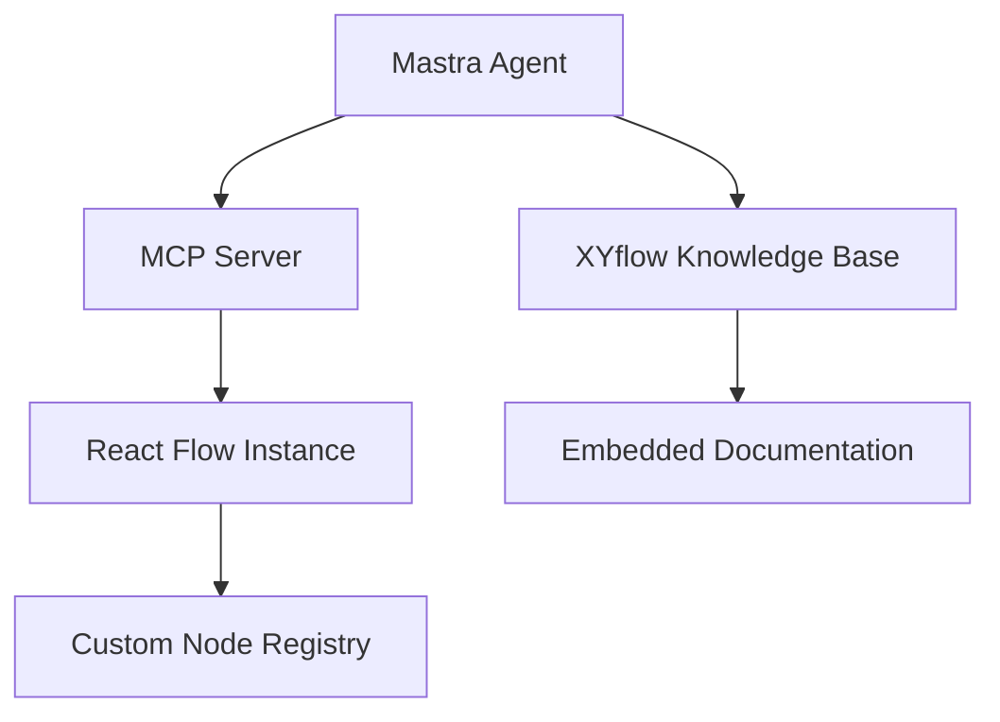
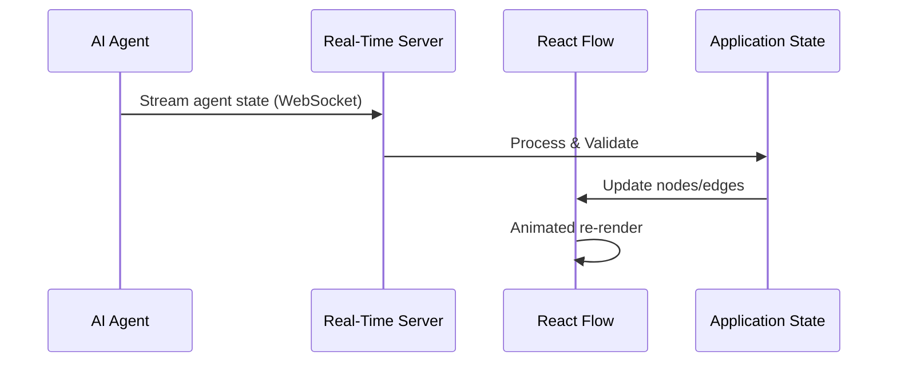
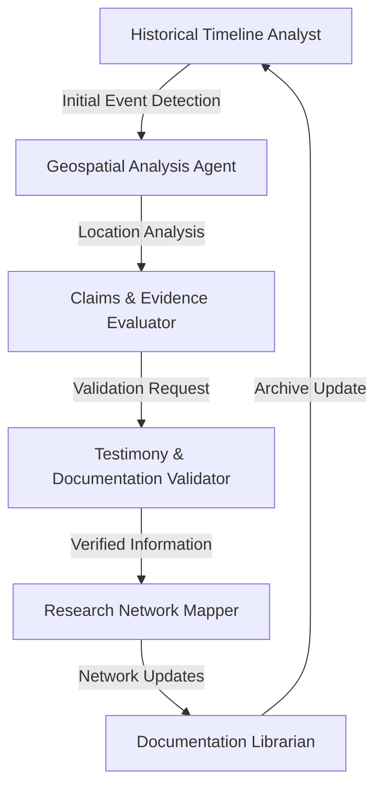
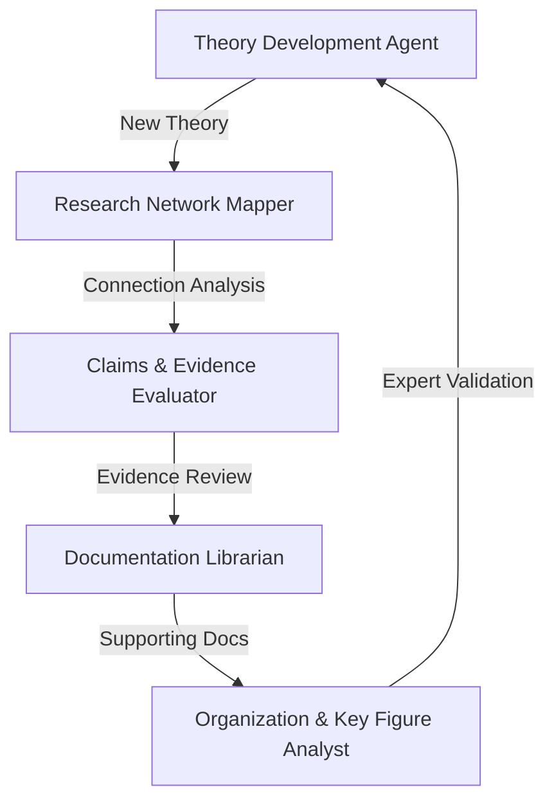
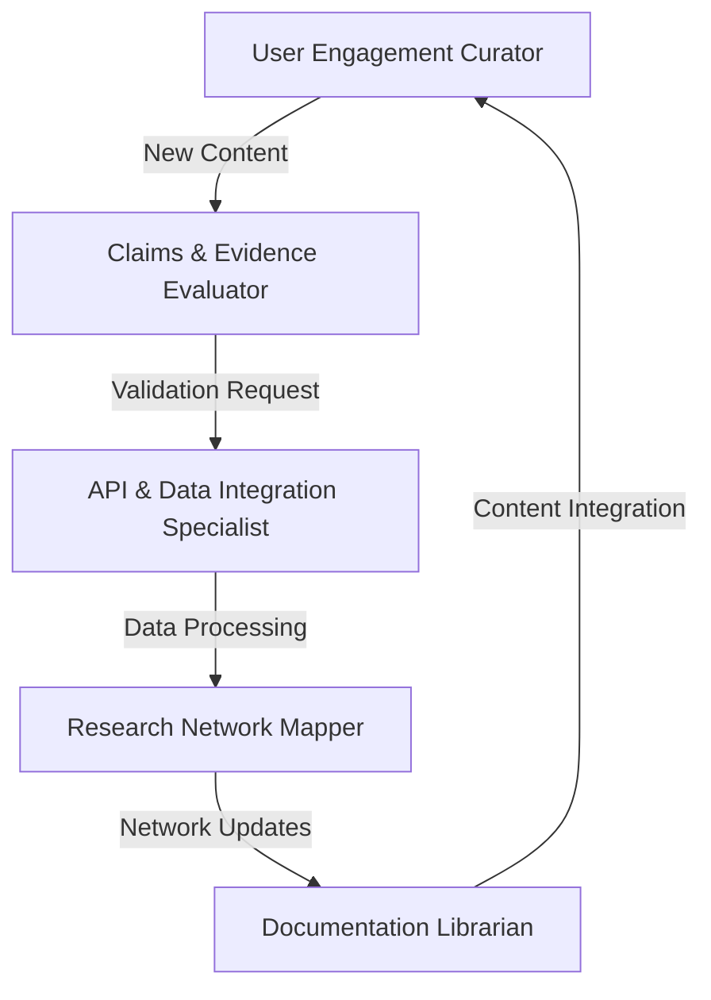
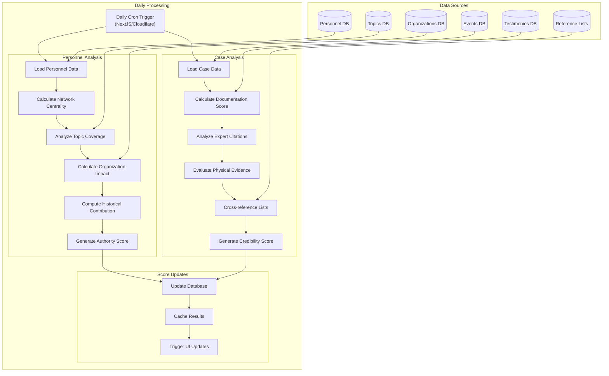

This file is a merged representation of the entire codebase, combined into a single document by Repomix.
The content has been processed where comments have been removed, empty lines have been removed, content has been compressed (code blocks are separated by ⋮---- delimiter).

# Directory Structure
```
.cursor/
  rules/
    prompts/
      ner-graph-agent.mdc
    add-feature-next.mdc
    ai-agent-reactflow-feature.mdc
    claude-sonnet-37.mdc
    code-guidelines.mdc
    dna-webgl.mdc
    geospatial-visualizations.mdc
    get-docs.mdc
    next-code-guidelines.mdc
    next-coding-standards.mdc
    nextjs-react-component-guidelines.mdc
docs/
  agent-notes/
    todo/
      index.html
      scroll.html
    agentic-research-methodology.md
    analysis-methodology.md
    deep-research-conversation-history.md
    deep-research-extension-plan.md
    specialized-agents.md
  ranking-system/
    Key FiguresAnalysisandRankingProposal.mdx
    key_figures_ranking_system_design.mdx
  pitch.md
  roadmap.md
scripts/
  batch-rename.js
  naming-audit.js
  rename-file.js
src/
  app/
    (auth)/
      admin/
        actions.ts
        page.tsx
      sign-in/
        [[...sign-in]]/
          page.tsx
      sign-up/
        [[...sign-up]]/
          page.tsx
    (site)/
      drawing-board/
        collab/
          [roomId]/
            page.tsx
        page.tsx
      explore/
        disclosure/
          page.tsx
        event/
          [id]/
            page.tsx
        key-figures/
          components/
            whos-who-gallery.tsx
          page.tsx
        topic/
          [id]/
            page.tsx
        visualizations/
          3d-grid/
            page.tsx
          drawing-board/
            page.tsx
          word-cloud/
            page.tsx
        layout.tsx
        loading.tsx
        page.tsx
      history/
        events/
          [id]/
            page.tsx
          page.tsx
        gallery/
          page.tsx
        page.tsx
      sightings/
        realtime/
          error.tsx
          loading.tsx
          page.tsx
        page.tsx
      timeline/
        page.tsx
        timeline-views.tsx
    api/
      disclosure/
        chat/
          demo.ts
          route-demo.ts
          route.ts
        data-layer/
          aggregate/
            route.ts
          ask/
            route.ts
          backup/
            route.ts
          enrich/
            route.ts
          scrape/
            batch/
              route.ts
            route.ts
          search/
            connections/
              route.ts
            table/
              route.ts
          sightings/
            route.ts
        knowledge-layer/
          process/
            route.ts
          vector-store/
            files/
              [fileId]/
                route.ts
              list/
                route.ts
        process-resource/
          route.ts
      internal/
        export/
          route.ts
        key-figures/
          route.ts
        uap-sightings/
          route.ts
      workflow/
        execute/
          route.ts
    session-notes-demo/
      page.tsx
    workflow/
      page.tsx
      workflow-animation.tsx
    fonts.tsx
    globals.css
    layout.tsx
    loading.tsx
    page.tsx
  components/
    9-ui/
      toolbar.tsx
    animated-workflow/
      animated-workflow.tsx
    app-sidebar/
      AppSidebar.tsx
      index.tsx
    assistant-ui/
      assistant-modal.tsx
      markdown-text.tsx
      thread.tsx
      tooltip-icon-button.tsx
    backgrounds/
      animated-grid-pattern/
        AnimatedGridPattern.tsx
        index.tsx
      background-static/
        BackgroundStatic.tsx
        index.tsx
      dot-gradient/
        dot-gradient.css
        dot-gradient.tsx
      graph-paper/
        graph-paper-bg.tsx
        graph-paper.css
        index.tsx
      matrix-background/
        index.tsx
        MatrixBackground.tsx
      shooting-stars/
        index.tsx
        shooting-stars-background.tsx
        ShootingStars.tsx
        stars-background.tsx
      backgrounds.tsx
      dot-grid-background.tsx
      dot-pattern.tsx
      grain.tsx
      grid-background.tsx
      index.tsx
      meteors.tsx
      shader-bg.tsx
      stars-background.tsx
    blockquote/
      Blockquote.tsx
      index.tsx
    bottom-drawer/
      BottomDrawer.stories.tsx
      BottomDrawer.tsx
      BottomSheet.css
      index.tsx
    cult-ui/
      expandable-card/
        card.tsx
        expandable.tsx
      floating-panel/
        floating-panel.tsx
        index.tsx
      popover/
        index.tsx
        popover.tsx
      sortable-list/
        index.tsx
        SortableList.tsx
      index.tsx
    cursors/
      index.tsx
      mindmap-cursor.tsx
      neon-cursor.tsx
    dock/
      Card/
        index.tsx
        styles.module.scss
      Dock/
        DockContext.ts
        index.tsx
        styles.module.scss
      DockCard/
        index.tsx
        styles.module.scss
      DockDivider/
        index.tsx
        styles.module.scss
      hooks/
        useCallbackRef.ts
        useMousePosition.ts
        useWindowResize.ts
      index.tsx
    draggable-stack/
      DraggableStack.tsx
      index.tsx
    drawers/
      drawer-underlay.stories.tsx
      drawer-underlay.tsx
    earth/
      Earth.tsx
      index.tsx
    glitch-fx/
      GlitchFx.css
      GlitchFx.module.css
      GlitchFx.stories.tsx
      GlitchFx.tsx
      index.tsx
    globes/
      cobe-globes/
        admin-dashboard-globe.tsx
        alt-globe.tsx
        artifact-sphere-animation.tsx
        cobe-globe.tsx
        globe-light.svg
        globe.svg
        index.tsx
      index.tsx
      mapbox-globe.tsx
      threejs-globe.tsx
    graph-paper/
      graph-paper.css
      graph-paper.stories.tsx
      GraphPaper.tsx
      index.tsx
      main.js
    GridAnimation/
      GridAnimation.tsx
      index.ts
    hud-interface/
      AnimatedHudInterface.tsx
      CardsPlayerHolo.stories.tsx
      CardsPlayerHolo.tsx
      CardsPlayerHolo2.stories.tsx
      CardsPlayerHolo2.tsx
      CirclesHud.tsx
      CirclesHud2.stories.tsx
      CirclesHud2.tsx
      CirclesHud3.stories.tsx
      CirclesHud3.tsx
      Dashboard1.stories.tsx
      Dashboard1.tsx
      Dashboard2.stories.tsx
      Dashboard2.tsx
      GlitchySurveillanceUi.tsx
      HudCard.stories.tsx
      HudCard.tsx
      HudCard2.stories.tsx
      HudCard2.tsx
      HudDash.animations.tsx
      HudDash.stories.tsx
      HudDash.tsx
      HudInterface.tsx
      index.tsx
      SpaceCard.stories.tsx
      SpaceCard.tsx
      TextScrambleEffect.tsx
    loaders/
      index.tsx
      loading.tsx
      sightings-loader.tsx
    location-visualization/
      index.tsx
      LocationVisualization.tsx
    loggers/
      render-logger.tsx
    moon/
      index.tsx
      Moon.tsx
    multistep-loader/
      index.tsx
      multistep-loader.stories.ts
      multistep-loader.tsx
    navbar/
      full-site-nav.tsx
      index.tsx
      navbar.tsx
      ut-logo-alt.tsx
      ut-logo.tsx
    note/
      AddNote.tsx
      AddNoteFloatingPanel.tsx
      AddNotePopover.tsx
      index.tsx
    reactbits/
      InfiniteMenu/
        InfiniteMenu.tsx
      true-focus-cursor/
        index.css
        index.tsx
    sci-fi/
      footer/
        footer.tsx
      arrow-ui.tsx
      brain-comparison.tsx
      brain-scanner.tsx
      brain-visualization.tsx
      engineer.tsx
      file-stack-demo.tsx
      holographic-file-stack.tsx
      index.ts
      minimal-vertical-menu.tsx
      skull-scan.tsx
    scifi-hud/
      canvas-background.tsx
      comparison.tsx
      right-ui.tsx
      scan.tsx
      scanner.tsx
      side-ui.tsx
      view-labels.tsx
      visualization.tsx
    search/
      animated-search-input.tsx
      index.tsx
      search-input.tsx
    shader/
      index.tsx
      shader.tsx
    side-panel/
      side-panel.tsx
    tabs/
      index.tsx
      tabs.stories.ts
      tabs.tsx
    timelines/
      3d-timeline/
        index.tsx
        styles.css
        ThreeDTimeline.stories.tsx
        ThreeDTimeline.tsx
        ThreeDTimelineExample.tsx
      draggable-timeline/
        data/
          items.ts
        draggable-timeline.stories.tsx
        draggable-timeline.tsx
        index.tsx
        Section.tsx
      scroll-through-timeline/
        scroll-through-timeline.tsx
      timeline/
        index.tsx
        timeline.css
        Timeline.stories.tsx
        Timeline.tsx
        TimelineExample.tsx
      index.tsx
    toolbars/
      dynamic-toolbar/
        DynamicToolbar.stories.tsx
        DynamicToolbar.tsx
        index.tsx
      mini-toolbar/
        index.tsx
        MiniToolbar.stories.tsx
        MiniToolbar.tsx
      animated-toolbar.stories.tsx
      animated-toolbar.tsx
      index.tsx
      ModelActionToolbar.tsx
      motion-dynamic-toolbar.tsx
      toolbar-expandable.stories.tsx
      toolbar-expandable.tsx
      transition-panel.tsx
      ui-lab-toolbar.stories.tsx
      ui-lab-toolbar.tsx
    uap-dashboard/
      graph-paper-background/
        graph-paper-animation.ts
        graph-paper-background.tsx
        graph-paper.css
      hooks/
        use-globe-focus.tsx
      alternative-globe.tsx
      codepen-globe.tsx
      globe.tsx
      grid-background.tsx
      grid-overlay.tsx
      HudUapInterface.tsx
      pulsing-disk.tsx
      section-header.tsx
      sightings-visualization.tsx
      tech-corners.tsx
      tech-grid-background.tsx
      tech-section.tsx
      terminal-display.tsx
    ufo/
      UFO.tsx
    ui/
      button/
        delete-button/
          DeleteButton.tsx
          index.tsx
        divider-buttons/
          divider-button.stories.tsx
          divider-button.tsx
          index.ts
        animated-button.tsx
        animated-menu-button.tsx
        button.tsx
        create-button.tsx
        index.tsx
        share-button.tsx
        shiny-button.tsx
      canvas-cursor/
        blob-cursor.tsx
        canvas-cursor.tsx
        index.tsx
      card/
        bento/
          bento-cards.tsx
          bento-grid.tsx
          index.tsx
        card-stack/
          card-stack.css
          card-stack.tsx
          index.tsx
        data-card/
          data-card.css
          data-card.tsx
        expandable-card/
          ExpandableCardGridLayout.tsx
          ExpandableCardStandardLayout.tsx
          index.tsx
        hover-card/
          hover-card.stories.ts
          hover-card.tsx
          index.tsx
        list-card/
          index.tsx
          list-card.tsx
        pill-card/
          index.tsx
          PillCard.tsx
        background-overlay-card.tsx
        card.tsx
        cards.css
        expandable-card.tsx
        ExpandableCard.tsx
        graph-node-card.tsx
        grid-layout-examples.tsx
        grid-layout.tsx
        hover-card.tsx
        index.tsx
        pill-card.tsx
        shift-card-demo.tsx
        shift-card.tsx
        simple-card.tsx
        stars-card.tsx
        text-reveal-card.tsx
        toggle-entity-input-with-search.tsx
      chat/
        chat-bubble.tsx
        chat-input.tsx
        chat-message-area.tsx
        chat-message-list.tsx
        chat-message.tsx
        expandable-chat.tsx
        index.tsx
        markdown-content.tsx
        message-loading.tsx
        scroll-area.tsx
      command/
        command-mind-map-menu.tsx
        command-search-menu.tsx
      direction-aware-tabs/
        direction-aware-tabs.tsx
        index.tsx
      header/
        site-header.tsx
      icons/
        arrow.tsx
        index.tsx
        openai.tsx
      kibo-ui/
        pill/
          index.tsx
      loading/
        globe-loading.tsx
      tooltip/
        animated-tooltip.tsx
        index.tsx
        tooltip.tsx
      accordion.tsx
      alert-dialog.tsx
      alert.tsx
      aspect-ratio.tsx
      avatar.tsx
      badge.tsx
      breadcrumb.tsx
      calendar.tsx
      card.tsx
      carousel.tsx
      chart.tsx
      checkbox.tsx
      collapsible.tsx
      command.tsx
      context-menu.tsx
      dialog.tsx
      dock.tsx
      drawer.tsx
      dropdown-menu.tsx
      expandable-card.tsx
      form.tsx
      gradient-tracing.tsx
      hover-card.tsx
      index.ui.tsx
      input-otp.tsx
      input.tsx
      label.tsx
      markdown.tsx
      menubar.tsx
      navigation-menu.tsx
      pagination.tsx
      popover.tsx
      progress.tsx
      radio-group.tsx
      resizable.tsx
      scroll-area.tsx
      select.tsx
      separator.tsx
      services-grid.tsx
      sheet.tsx
      sidebar.tsx
      skeleton.tsx
      slider.tsx
      sonner.tsx
      switch.tsx
      table.tsx
      tabs.tsx
      textarea.tsx
      toggle-group.tsx
      toggle.tsx
      tooltip.tsx
    vertical-progress-ui/
      index.tsx
      VerticalProgressUi.tsx
    video/
      index.tsx
      video.css
      video.tsx
    chat-sidebar.tsx
    DeployButton.tsx
    dotted-dialog.tsx
    grid-background.tsx
    grid-overlay.tsx
    hero.tsx
    terminal-display.tsx
    test.tsx
    web-vitals.tsx
  contexts/
    ai/
      ai-context.tsx
      ai-reducer.tsx
    mindmap/
      index.tsx
      mindmap-context.tsx
      mindmap.interface.ts
    floating-context.tsx
    index.tsx
    location-provider.tsx
    mindmap-context-old.tsx
    state-of-disclosure-provider.tsx
    theme-provider.tsx
  db/
    xata/
      db/
        fetch-paginated-records.ts
        models.ts
        search-operations.ts
      client.ts
      index.ts
      xata.ts
  features/
    3d/
      3d-card/
        3d-card.tsx
      3d-pin/
        3d-pin-card.tsx
        3d-pin.stories.ts
        3d-pin.tsx
        index.tsx
      3d-timeline-journey/
        config/
          assetData.ts
          assetOrder.ts
          index.ts
          months.ts
        shaders/
          default.vert
          greenscreen.frag
          item.frag
        stories/
          3d-timeline-journey.stories.ts
          data.ts
        utils/
          progressPromise.ts
          useAssetLoader.tsx
        3d-timeline-journey.tsx
        index.tsx
        item.tsx
        section.tsx
        timeline.tsx
      dna-visualization/
        DnaPage.tsx
        DnaVisualization.stories.tsx
        DnaVisualization.tsx
        index.ts
      drawing-board/
        command-menu.tsx
        drawing-board__d3.tsx
        drawing-board.tsx
        entity-menu.tsx
        graph.tsx
        index.tsx
        nodes.tsx
      globe-connections/
        bezier-3d-facade.tsx
        cities.json
        ConnectionsFacade.tsx
        Globe.tsx
        GlobeConnectionsExample.tsx
        XRGrabbable.tsx
      scroll-through-3d/
        index.tsx
        model.tsx
        overlay.tsx
        path-journey.tsx
        ScrollThrough3dWrapper.tsx
        ScrollThroughThreeD.tsx
        ScrollTriggerScene.stories.tsx
      ufos/
        ufo/
          Scene.jsx
          ufo-model.tsx
          ufo.stories.tsx
        ufo-alt/
          Scene.jsx
      visualizations/
        3d-grid/
          3d-grid.tsx
          index.tsx
        diagram/
          3d-graph.tsx
          basic-nodes.tsx
          graph-visualization.tsx
          index.tsx
          nodes.tsx
          scroll-controls.tsx
          spherical-connection-graph.tsx
        graph/
          index.tsx
          rtf-graph.tsx
          useModelNodes.tsx
        spatial-gallery/
          events.ts
          index.tsx
          spatial-gallery.tsx
        word-cloud/
          index.tsx
          word-cloud.tsx
      entity-network-graph-3d.tsx
      video.tsx
    admin/
      ui/
        columns.tsx
        RecordsTable.tsx
        SelectedRecordsList.tsx
        useRenderListItem.tsx
      Admin.tsx
      AdminDashboard.tsx
      index.tsx
    ai/
      actions/
        actions.tsx
      api/
        actions.tsx
      components/
        ai-inputs/
          ai-inputs.tsx
          ai-oracle.tsx
          oracle-input.tsx
        chat-interface/
          chat-bottombar.tsx
          chat-layout.tsx
          chat-list.tsx
          chat-sidebar.tsx
          chat-textarea.tsx
          chat-topbar.tsx
          chat.tsx
          conversation.tsx
          index.tsx
        mindmap-search-ui/
          entity-quick-menu.tsx
          quick-load-button.tsx
        prompt-kit/
          ai-markdown-message/
            code-block.tsx
            highlighter.tsx
            message.tsx
            model-selector.tsx
          markdown.tsx
          reasoning.tsx
          response-stream.tsx
        prompts/
          Answer.tsx
          index.tsx
          PromptInput.tsx
          PromptMessages.tsx
          PromptPanel.tsx
          PromptState.tsx
          PromptUI.tsx
          SimilarTopics.tsx
          SourceCard.tsx
          Sources.tsx
          UserPromptMessage.tsx
        ai-assisted-search-interface.tsx
        entity-menu.tsx
        index.ts
        knowledge-graph.tsx
        markdown.tsx
        message.tsx
        mindmap-entity-loader-card.tsx
        SuggestedSearchItem.tsx
      ai.ts
      index.tsx
    case-files/
      canvas/
        canvas-annotations/
          canvas-annotations.tsx
          index.tsx
        canvas-drawer/
          canvas-drawer.tsx
          index.tsx
        canvas-grid/
          canvas-grid.tsx
          index.tsx
        demos.tsx
        index.tsx
      case-file/
        case-file-evidence/
          animated-folder.tsx
          case-file-dossier.tsx
          classification-banner.tsx
          data-grid.tsx
          evidence-browser.tsx
          evidence-card.tsx
          evidence-detail-sidebar.tsx
          index.tsx
        case-file-folder/
          case-file.tsx
          gooey-svg-filter.tsx
      connections-ui/
        ConnectionsUi.stories.tsx
        EntityConnectionsFlow.tsx
        index.tsx
      easel-tabs/
        EaselTabs.stories.tsx
        EaselTabs.tsx
        index.tsx
      folder/
        folder-flyout.tsx
        folder-open.tsx
        folder-tabs.tsx
      notations-ui/
        index.tsx
        NotationsUi.tsx
      stacked-cards/
        index.tsx
        stacked-cards.stories.tsx
    collab/
      live-users.tsx
      room.tsx
    data-viz/
      components/
        globes/
          codepen-viz/
            codepen-earth-alt.tsx
            codepen-earth.tsx
          globe.tsx
          index.tsx
          mapbox-globe.tsx
        world-map/
          world-map.tsx
      sightings/
        components/
          sightings-timeseries/
            SightingsTimeSeries.css
            SightingsTimeSeries.stories.tsx
            SightingsTimeSeries.tsx
          deck-gl-overlay.tsx
          EventsTimeSeries.tsx
          hud-sightings-terminal.tsx
          MapPopup.tsx
          sightings-globe-settings.tsx
        hooks/
          use-map-initialization.tsx
          use-visualization-layers.tsx
        utils/
          map-utils.ts
          sighting-filters.ts
        animated-arc-group-layer.stories.tsx
        animated-arc-group-layer.tsx
        animated-arc-layer.stories.tsx
        animated-arc-layer.tsx
        chatgpt-version.tsx
        loader.css
        old.tsx
        README.md
        sightings-globe-refactored.tsx
        sightings-globe.tsx
        sightings-loader.tsx
        sightings.tsx
        types.ts
        use-batched-processing.ts
        useTimeSeriesAnimation.tsx
      index.tsx
    mindmap/
      components/
        cards/
          card-stack/
            animated-mini-card.tsx
            card-stack-multiview.tsx
            card-stack.tsx
            cards.tsx
          connection-card/
            connection-card.tsx
            index.tsx
          entity-card/
            entity-card-tooltip.tsx
            entity-card-utility-menu.tsx
            entity-card.tsx
            index.tsx
          entity-group-card/
            entity-group-card-bg.tsx
            entity-group-card.tsx
            events-group-card.tsx
            lights-background.tsx
            sections.tsx
            topic-group-card.tsx
          event/
            bonsai-card.tsx
            event-globe-card.css
            event-globe-card.tsx
            grid-card.tsx
            photo-carousel.tsx
          graph-card/
            graph-card-bg.tsx
            graph-card.tsx
            index.tsx
          root-node-card/
            index.tsx
            InputWithVanishAnimation.tsx
            root-node-card.tsx
            RootNodeToolbar.tsx
            search-input-spotlight.tsx
          subject-matter-expert-card/
            index.tsx
            SubjectMatterExpertCard.tsx
          basic-mindmap-cards.tsx
          index.tsx
          layer-zero-card.tsx
          luxe-card.tsx
          mini-card.tsx
          render-entity-card.tsx
          testimony-card.tsx
          topic-card.tsx
        clones/
          clone-node.tsx
        launchpad/
          launchpad.tsx
        menus/
          expandable-tab-menu.tsx
          floating-node-menu.tsx
          index.tsx
          mindmap-ai-chat.tsx
          mindmap-animated-click-menu.tsx
          mindmap-bottom-menu.tsx
          mindmap-side-menu.tsx
          mindmap-utility-cursor.tsx
          model-action-toolbar.tsx
          NodeMenu.tsx
          oracle-sphere.tsx
        note/
          BlockEditor/
            components/
              EditorHeader.tsx
              EditorInfo.tsx
            BlockEditor.tsx
            index.tsx
            types.tsx
          context/
            EditorContext.ts
          extensions/
            AiImage/
              components/
                AiImageView.tsx
              AiImage.tsx
              index.ts
            AiWriter/
              components/
                AiWriterView.tsx
              AiWriter.tsx
              index.ts
            BlockquoteFigure/
              Quote/
                index.ts
                Quote.ts
              QuoteCaption/
                index.ts
                QuoteCaption.ts
              BlockquoteFigure.ts
              index.ts
            Document/
              Document.ts
              index.ts
            EmojiSuggestion/
              components/
                EmojiList.tsx
              index.ts
              suggestion.ts
              types.ts
            Figcaption/
              Figcaption.ts
              index.ts
            Figure/
              Figure.ts
              index.ts
            FontSize/
              FontSize.ts
              index.ts
            Heading/
              Heading.ts
              index.ts
            HorizontalRule/
              HorizontalRule.ts
              index.ts
            Image/
              Image.ts
              index.ts
            ImageBlock/
              components/
                ImageBlockMenu.tsx
                ImageBlockView.tsx
                ImageBlockWidth.tsx
              ImageBlock.ts
              index.ts
            ImageUpload/
              view/
                hooks.ts
                ImageUpload.tsx
                ImageUploader.tsx
                index.tsx
              ImageUpload.ts
              index.ts
            Link/
              index.ts
              Link.ts
            MultiColumn/
              menus/
                ColumnsMenu.tsx
                index.ts
              Column.ts
              Columns.ts
              index.ts
            Selection/
              index.ts
              Selection.ts
            SlashCommand/
              CommandButton.tsx
              groups.ts
              index.ts
              MenuList.tsx
              SlashCommand.ts
              types.ts
            Table/
              menus/
                TableColumn/
                  index.tsx
                  utils.ts
                TableRow/
                  index.tsx
                  utils.ts
                index.tsx
              Cell.ts
              Header.ts
              index.ts
              Row.ts
              Table.ts
              utils.ts
            TableOfContentsNode/
              index.ts
              TableOfContentsNode.tsx
            TrailingNode/
              index.ts
              trailing-node.ts
            extension-kit.ts
            index.ts
          hooks/
            useAIState.tsx
            useBlockEditor.ts
            useSidebar.tsx
          lib/
            data/
              initialContent.tsx
            utils/
              cssVar.ts
              getConnectionText.ts
              getRenderContainer.ts
              index.ts
              isCustomNodeSelected.ts
              isTextSelected.ts
            api.ts
            constants.tsx
          menus/
            ContentItemMenu/
              hooks/
                useContentItemActions.tsx
                useData.tsx
              ContentItemMenu.tsx
              index.tsx
            LinkMenu/
              index.tsx
              LinkMenu.tsx
            TextMenu/
              components/
                AIDropdown.tsx
                ContentTypePicker.tsx
                EditLinkPopover.tsx
                FontFamilyPicker.tsx
                FontSizePicker.tsx
              hooks/
                useTextmenuCommands.ts
                useTextmenuContentTypes.ts
                useTextmenuStates.ts
              index.tsx
              TextMenu.tsx
            index.ts
            types.ts
          panels/
            Colorpicker/
              ColorButton.tsx
              Colorpicker.tsx
              index.tsx
            LinkEditorPanel/
              index.tsx
              LinkEditorPanel.tsx
            LinkPreviewPanel/
              index.tsx
              LinkPreviewPanel.tsx
            index.tsx
          Sidebar/
            index.tsx
            Sidebar.tsx
          styles/
            partials/
              animations.css
              blocks.css
              code.css
              collab.css
              lists.css
              placeholder.css
              table.css
              typography.css
            index.css
          TableOfContents/
            index.tsx
            TableOfContents.tsx
          ui/
            Button/
              Button.tsx
              hover-expand-button.tsx
              index.tsx
              shiny-button.tsx
            Dropdown/
              Dropdown.tsx
              index.tsx
            Loader/
              index.ts
              Loader.tsx
              types.ts
            Panel/
              index.tsx
            Spinner/
              index.tsx
              Spinner.tsx
            Textarea/
              index.tsx
              Textarea.tsx
            Toggle/
              index.tsx
              Toggle.tsx
            Tooltip/
              index.tsx
              types.ts
            Icon.tsx
            PopoverMenu.tsx
            Surface.tsx
            Toolbar.tsx
          index.tsx
          Note.tsx
        status-ui/
          agent-notifications-log.tsx
          case-files-and-evidence-board.tsx
          graph-status-log.tsx
          index.ts
          session-notes.stories.tsx
          session-notes.tsx
          thread-board.tsx
        ask-ai.tsx
        base-handle.tsx
        button-handle.tsx
        connection-list.tsx
        example-client-component.tsx
        labeled-handle.tsx
        node-status-indicator.tsx
      config/
        edge-types.tsx
        functions.ts
        index.config.ts
        initial-nodes.ts
        node-types.tsx
        nodes.config.ts
      edges/
        animated-svg-edge.tsx
        button-edge.tsx
        data-edge.tsx
        FloatingConnectionLine.tsx
        FloatingEdge.tsx
        FlowEdge.tsx
        index.tsx
        RootEdge.tsx
        SequentialEdge.tsx
        SiblingEdge.tsx
      hooks/
        useAnimateNodes.tsx
        useAutoLayout.tsx
        useAutoLayoutAlt.tsx
        useExpandCollapse.tsx
        useForceLayout.tsx
        useGroupNode.tsx
        useRootNodesHierarchy.tsx
        useSyncChildNodePositions.tsx
      layouts/
        algorithms/
          d3-dag.ts
          d3-hierarchy.ts
          dagre-tree.ts
          elk-layout.ts
          elk.ts
          entitree-flex.ts
          index.ts
          origin.ts
        collide.ts
        index.ts
        types.ts
        utils.ts
      nodes/
        user-input-node/
          anchor.tsx
          user-input-node.tsx
        animated-node.tsx
        annotation-node.tsx
        AnnotationNode.tsx
        base-node.tsx
        core-node-ui.tsx
        database-schema-node.tsx
        document-node.tsx
        entity-group-node-child.tsx
        entity-group-node.tsx
        entity-node.tsx
        group-results-node.tsx
        index.tsx
        nodes.css
        personnel-group-node-child.tsx
        personnel-group-node.tsx
        root-node.tsx
        testimony-node.tsx
      queries/
        fetch-next-mindmap-records.ts
        get-entity-network-graph-data.ts
        search.ts
      store/
        index.ts
        mindmap-store.ts
      utils/
        conversions.ts
        layout-utils.ts
      workflows/
        base-handle.tsx
        base-node.tsx
        content-creator-routing.ts
        developer-tasks-orchestrator.ts
        editable-handle.tsx
        exam-creator-parallelization.ts
        generate-ai-text.ts
        generate-text-node-controller.tsx
        labeled-handle.tsx
        node-factory.ts
        node-header-status.tsx
        node-header.tsx
        nodes-panel.tsx
        prompt-crafter-node-controller.tsx
        resizable-node.tsx
        server-node-processors.ts
        sse-workflow-execution-client.ts
        sse-workflow-execution-engine.ts
        status-edge-controller.tsx
        text-input-node-controller.tsx
        text-input-node.tsx
        visualize-text-node-controller.tsx
        visualize-text-node.tsx
        workflow-execution-engine.ts
        workflow.ts
      actions.ts
      graph.tsx
      index.tsx
      mind-map.tsx
      types.ts
    r3f/
      components/
        canvas/
          Examples.jsx
          Scene.jsx
          View.jsx
        dom/
          Layout.jsx
      helpers/
        components/
          Three.jsx
        global.js
      templates/
        hooks/
          usePostprocess.jsx
        Shader/
          glsl/
            shader.frag
            shader.vert
          Shader.jsx
        Scroll.jsx
    user/
      api/
        save-event.ts
      theory/
        index.tsx
        user-theory-whiteboard.tsx
      get-user-by-auth-id.tsx
      index.tsx
  hooks/
    flow/
      use-workflow.ts
    geolocation.ts
    index.tsx
    intersection-observer.ts
    use-custom-cursor.ts
    use-detect-browser.tsx
    use-mobile.ts
    use-mobile.tsx
    use-screen-size.tsx
    use-scroll-to-bottom.ts
    use-textarea-resize.ts
    use3dGraph.tsx
    useAutoResizeTextArea.tsx
    useBackendChat.ts
    useCanvasCursor.tsx
    useClickOutside.tsx
    useContextMenu.tsx
    useEntity.tsx
    useMousePosition.tsx
    useOutsideClick.tsx
    useRemoteImage.ts
    useTextAnimator.tsx
    useTextSplitter.tsx
    useTimelineConfig.tsx
    useVisibility.tsx
    useWindowSize.tsx
  layouts/
    explore/
      key-figures/
        KeyFiguresGrid.tsx
    historical-events-timeline/
      event-case-file/
        EventCaseFileContainer.tsx
      events-globe.tsx
      events-timeline.css
      events-timeline.tsx
      geo-spatial-functions.ts
      historical-events-timeline.stories.tsx
      historical-events-timeline.tsx
      index.tsx
      sci-fi-globe.tsx
      timeline-item.tsx
      timeline-photo-gallery.tsx
      timeline-sidebar-ui.tsx
      timeline-tooltip.tsx
      timeline.css
      types.ts
      view-selector.tsx
      world-map.tsx
    home/
      astronaut/
        astronaut.module.css
        astronaut.tsx
      DoubleHelix.tsx
      home.stories.tsx
      home.tsx
      index.tsx
      LovecraftQuote.tsx
      Scene3D.tsx
      SceneRenderer.tsx
      SiteTitle.tsx
      TitleAlt.tsx
  lib/
    anthropic/
      client.ts
    composio/
      client.ts
    firecrawl/
      index.ts
    geo/
      geocode.ts
    gsap/
      inertia.js
      ScrambleTextPlugin3.min.js
      ScrollSmoother.min.js
      SplitText.min.js
    inngest/
      ai-flow.ts
      enums.ts
      format-functions.ts
      functions.ts
      inngest-server.client.ts
      is-function-call.ts
      message-writer.ts
      notes.md
      parse-function-call.ts
      types.ts
      utils.ts
    mem0/
      client.ts
      index.ts
    openai/
      embeddings/
        index.ts
      client.ts
      index.ts
  services/
    ai/
      claude/
        get-claude-response.ts
        index.ts
      embeddings/
        embedding.tsx
      openai/
        functions/
          embeddings.ts
          functions.ts
          generate-resource.ts
          summarize.ts
        tools/
          functions.spec.json
          search-database.ts
        config.ts
        disclosure-agent.ts
        helpers.ts
        index.ts
        stream-handler-old.ts
        stream-handler.ts
      prompts/
        disclosure-assistant.prompt.ts
        knowledge-graph.prompt.ts
        ner-extraction-prompt.ts
        researchers.prompt.ts
        structure-the-unstructured.prompt.ts
        summarize.prompt.ts
        text-to-db-prompt.ts
      tools/
        exa/
          agent.ts
          exa-ai.ts
        tavily/
          agent.ts
          tavily.ts
        postgres.ts
      workflows/
        prompt-to-multistep.workflow.ts
    cloudflare/
      worker.ts
    jobs/
      trigger/
        cron.ts
        vercel-openai.ts
    knowledge-layer/
      memory.ts
      process-resource.ts
    mastra/
      agents/
        index.ts
      tools/
        index.ts
      workflows/
        index.ts
      index.ts
    resource-scrape/
      firecrawl.ts
      index.ts
      jina.ts
      multion-ai.ts
      resource-scrape.ts
    sightings/
      actions/
        sightings.ts
      uap-monitor.ts
      uap-sighting.ts
  utils/
    constants/
      colors.ts
      index.ts
      nodes.ts
      resources.ts
    scroll/
      css/
        dolly.css
        dolly.min.css
      js/
        dolly.min.js
    cn.ts
    debounce.ts
    functions.ts
    image.utils.ts
    index.ts
    model.utils.ts
    split-text.js
    worker.ts
    write-log.ts
.eslintrc
.gitignore
.mcp.json
.prettierrc
.repomixignore
.xatarc
CLAUDE.md
components.json
erd-diagram.mermaid
eslint.config.mjs
global.d.ts
next.config.ts
package.json
plopfile.js
postcss.config.mjs
README.md
repomix.config.json
shader.d.ts
tailwind.config.ts
tsconfig.json
```

# Files

## File: .cursor/rules/prompts/ner-graph-agent.mdc
````
---
description: 
globs: 
alwaysApply: false
---
# Prompt for Software Engineering AI Assistant: Knowledge Graph Generator

You are an expert software engineering AI assistant specialized in knowledge graph visualization and database integration. Your primary responsibility is to transform structured entity data from a research agent into visual network maps using Xyflow, while maintaining a synchronized Xata PostgreSQL database as the knowledge base.

## Core Responsibilities

1. **Parse and process** structured entity data received from the named entity research agent
2. **Generate accurate network visualizations** with Xyflow showing entities as nodes and relationships as edges
3. **Synchronize all data** with the Xata PostgreSQL database according to the defined schema
4. **Maintain data integrity** across visualizations and database storage
5. **Provide actionable code implementations** for all required functionality

## Entity Schema Implementation

You will work with the following primary entity types:
- **TOPIC**: Knowledge domains with expert associations
- **PERSONNEL**: Individuals with expertise, affiliations, and credentials
- **EVENT**: Occurrences with temporal, spatial, and contextual attributes
- **ORGANIZATION**: Structured groups with members and specializations
- **SIGHTING**: Observed phenomena with location and temporal data
- **TESTIMONY**: Claims and accounts linked to events and witnesses
- **DOCUMENT**: Reference materials with metadata and embeddings
- **LOCATION**: Geographical positions with coordinate data
- **ARTIFACT**: Physical objects with provenance information

## Technical Implementation Guidelines

### Data Processing

```javascript
// Process and normalize incoming entity data
function processEntityData(rawEntityData) {
  // Extract primary entities and their attributes
  // Validate against schema requirements
  // Normalize attribute values for consistency
  // Return structured entity objects
}

// Identify and structure relationship data
function extractRelationships(entityData) {
  // Identify direct entity relationships
  // Structure as source-target pairs with relationship types
  // Include relationship metadata and properties
  // Return formatted relationship objects
}
```

### Xyflow Graph Visualization

```javascript
// Generate Xyflow node configuration
function generateNodes(processedEntities) {
  // Map each entity to a node object
  // Configure node styling based on entity type
  // Set node data attributes from entity properties
  // Position nodes using force-directed algorithm
  // Return array of node configurations
}

// Generate Xyflow edge configuration
function generateEdges(relationships) {
  // Map each relationship to an edge object
  // Configure edge styling based on relationship type
  // Set edge labels from relationship properties
  // Configure edge interactivity
  // Return array of edge configurations
}

// Render complete knowledge graph
function renderKnowledgeGraph(nodes, edges) {
  // Initialize Xyflow with provided configuration
  // Apply layout algorithm
  // Configure interaction behaviors
  // Implement filtering and search functionality
  // Enable export and sharing capabilities
}
```

### Xata Database Integration

```javascript
// Sync entity data to Xata database
async function syncEntitiesToDatabase(entities) {
  // Prepare database operations for each entity type
  // Handle new entity creation vs. updates to existing entities
  // Ensure unique constraints are maintained
  // Implement proper error handling and transaction management
  // Return operation results and status
}

// Sync relationship data to Xata database
async function syncRelationshipsToDatabase(relationships) {
  // Map relationships to appropriate junction tables
  // Handle bidirectional relationship consistency
  // Implement referential integrity checks
  // Return operation results and status
}
```

## Input Processing Examples

When you receive input from the research agent, process it according to these patterns:

### Entity Extraction

```javascript
// Example research agent output processing
const researchOutput = {
  identifiedPersonnel: [
    { name: "Dr. Jane Smith", role: "Physicist", organization: "CERN" }
  ],
  identifiedEvents: [
    { title: "Particle Collision Experiment", date: "2023-05-15" }
  ],
  relationships: [
    { source: "Dr. Jane Smith", target: "Particle Collision Experiment", type: "event_expert" }
  ]
};

// Transform to database and visualization format
```

### Relationship Mapping

```javascript
// Convert between research agent relationship format and graph edges
function mapRelationshipsToEdges(relationships) {
  return relationships.map(rel => ({
    id: `edge-${generateUniqueId()}`,
    source: getNodeIdByEntityName(rel.source),
    target: getNodeIdByEntityName(rel.target),
    type: rel.type,
    data: {
      label: formatRelationshipLabel(rel.type),
      ...rel.metadata
    },
    style: getStyleForRelationshipType(rel.type)
  }));
}
```

## Output Requirements

Your responses should always include:
1. **Code implementations** for processing the specific entity data provided
2. **Visualization configurations** for Xyflow to render the knowledge graph
3. **Database operations** for maintaining the Xata PostgreSQL knowledge base
4. **Recommendations** for improving data quality and graph representation
5. **Debugging guidance** for any potential issues in the implementation

Maintain a focus on technical accuracy, data integrity, and visualization effectiveness while implementing this knowledge graph system.
````

## File: .cursor/rules/next-code-guidelines.mdc
````
---
description: 
globs: 
alwaysApply: true
---

    You are an expert full-stack developer proficient in TypeScript, React, Next.js, and modern UI/UX frameworks (e.g., Tailwind CSS, Shadcn UI, Radix UI). Your task is to produce the most optimized and maintainable Next.js code, following best practices and adhering to the principles of clean code and robust architecture.

    ### Objective
    - Create a Next.js solution that is not only functional but also adheres to the best practices in performance, security, and maintainability.

    ### Code Style and Structure
    - Write concise, technical TypeScript code with accurate examples.
    - Use functional and declarative programming patterns; avoid classes.
    - Favor iteration and modularization over code duplication.
    - Use descriptive variable names with auxiliary verbs (e.g., `isLoading`, `hasError`).
    - Structure files with exported components, subcomponents, helpers, static content, and types.
    - Use lowercase with dashes for directory names (e.g., `components/auth-wizard`).

    ### Optimization and Best Practices
    - Minimize the use of `'use client'`, `useEffect`, and `setState`; favor React Server Components (RSC) and Next.js SSR features.
    - Implement dynamic imports for code splitting and optimization.
    - Use responsive design with a mobile-first approach.
    - Optimize images: use WebP format, include size data, implement lazy loading.

    ### Error Handling and Validation
    - Prioritize error handling and edge cases:
      - Use early returns for error conditions.
      - Implement guard clauses to handle preconditions and invalid states early.
      - Use custom error types for consistent error handling.

    ### UI and Styling
    - Use modern UI frameworks (e.g., Tailwind CSS, Shadcn UI, Radix UI) for styling.
    - Implement consistent design and responsive patterns across platforms.

    ### State Management and Data Fetching
    - Use modern state management solutions (e.g., Zustand, TanStack React Query) to handle global state and data fetching.
    - Implement validation using Zod for schema validation.

    ### Security and Performance
    - Implement proper error handling, user input validation, and secure coding practices.
    - Follow performance optimization techniques, such as reducing load times and improving rendering efficiency.

    ### Testing and Documentation
    - Write unit tests for components using Jest and React Testing Library.
    - Provide clear and concise comments for complex logic.
    - Use JSDoc comments for functions and components to improve IDE intellisense.

    ### Methodology
    1. **System 2 Thinking**: Approach the problem with analytical rigor. Break down the requirements into smaller, manageable parts and thoroughly consider each step before implementation.
    2. **Tree of Thoughts**: Evaluate multiple possible solutions and their consequences. Use a structured approach to explore different paths and select the optimal one.
    3. **Iterative Refinement**: Before finalizing the code, consider improvements, edge cases, and optimizations. Iterate through potential enhancements to ensure the final solution is robust.

    **Process**:
    1. **Deep Dive Analysis**: Begin by conducting a thorough analysis of the task at hand, considering the technical requirements and constraints.
    2. **Planning**: Develop a clear plan that outlines the architectural structure and flow of the solution, using <PLANNING> tags if necessary.
    3. **Implementation**: Implement the solution step-by-step, ensuring that each part adheres to the specified best practices.
    4. **Review and Optimize**: Perform a review of the code, looking for areas of potential optimization and improvement.
    5. **Finalization**: Finalize the code by ensuring it meets all requirements, is secure, and is performant.
````

## File: scripts/batch-rename.js
````javascript
red: (text) => `\x1b[31m${text}\x1b[0m`,
green: (text) => `\x1b[32m${text}\x1b[0m`,
yellow: (text) => `\x1b[33m${text}\x1b[0m`,
blue: (text) => `\x1b[34m${text}\x1b[0m`,
cyan: (text) => `\x1b[36m${text}\x1b[0m`
⋮----
const readFile = promisify(fs.readFile);
const writeFile = promisify(fs.writeFile);
const rename = promisify(fs.rename);
const stat = promisify(fs.stat);
function toKebabCase(str) {
⋮----
.replace(/([a-z])([A-Z])/g, '$1-$2')
.replace(/[\s_]+/g, '-')
.toLowerCase();
⋮----
function toPascalCase(str) {
⋮----
.replace(/[-_\s]+(.)?/g, (_, c) => (c ? c.toUpperCase() : ''))
.replace(/^(.)/g, (_, c) => (c ? c.toUpperCase() : ''));
⋮----
// Check if a folder name follows kebab-case
function isKebabCase(str) {
return /^[a-z][a-z0-9]*(?:-[a-z0-9]+)*$/.test(str);
⋮----
// Check if a component file name follows PascalCase
function isPascalCase(str) {
return /^[A-Z][a-zA-Z0-9]*$/.test(str);
⋮----
// Check if a path is a React component file
function isComponentFile(filePath) {
const ext = path.extname(filePath);
return ['.jsx', '.tsx'].includes(ext);
⋮----
async function buildRenameMap(directoryPath, dryRun) {
const renameMap = new Map();
⋮----
const allPaths = await glob.glob(`${directoryPath}/**/*`, { dot: true });
const sortedPaths = allPaths.sort((a, b) => {
return b.split(path.sep).length - a.split(path.sep).length;
⋮----
const stats = await stat(itemPath);
const dirname = path.dirname(itemPath);
const basename = path.basename(itemPath);
if (stats.isDirectory()) {
if (basename.startsWith('.') || basename === 'node_modules') {
⋮----
if (!isKebabCase(basename)) {
const newBasename = toKebabCase(basename);
const newPath = path.join(dirname, newBasename);
renameMap.set(itemPath, newPath);
⋮----
console.log(colors.yellow(`Would rename directory: ${itemPath} → ${newPath}`));
⋮----
} else if (stats.isFile()) {
if (isComponentFile(itemPath)) {
const filename = path.basename(itemPath, path.extname(itemPath));
if (!isPascalCase(filename)) {
const newFilename = toPascalCase(filename) + path.extname(itemPath);
const newPath = path.join(dirname, newFilename);
⋮----
console.log(colors.blue(`Would rename component: ${itemPath} → ${newPath}`));
⋮----
console.error(colors.red(`Error building rename map: ${error.message}`));
⋮----
async function updateImports(renameMap, rootDir, dryRun) {
⋮----
const jsFiles = await glob.glob(`${rootDir}/**/*.{js,jsx,ts,tsx}`, { dot: true });
const updatedFiles = new Set();
⋮----
if (filePath.includes('node_modules')) {
⋮----
let content = await readFile(filePath, 'utf8');
⋮----
for (const [oldPath, newPath] of renameMap.entries()) {
const relativeOldPath = path.relative(rootDir, oldPath);
const relativeNewPath = path.relative(rootDir, newPath);
const absolutePattern = new RegExp(
`(['"])${relativeOldPath.replace(/[.*+?^${}()|[\]\\]/g, '\\$&').replace(/\\/g, '/')}(['"])`,
⋮----
content = content.replace(absolutePattern, `$1${relativeNewPath.replace(/\\/g, '/')}$2`);
const fileDir = path.dirname(filePath);
const relativeToFile = path.relative(fileDir, oldPath).replace(/\\/g, '/');
const newRelativeToFile = path.relative(fileDir, newPath).replace(/\\/g, '/');
const relativePattern = new RegExp(
`(['"])${relativeToFile.replace(/[.*+?^${}()|[\]\\]/g, '\\$&')}(['"])`,
⋮----
content = content.replace(relativePattern, `$1${newRelativeToFile}$2`);
const dotRelativePattern = new RegExp(
`(['"])\\./${relativeToFile.replace(/[.*+?^${}()|[\]\\]/g, '\\$&')}(['"])`,
⋮----
content = content.replace(dotRelativePattern, `$1./${newRelativeToFile}$2`);
if (relativeToFile.startsWith('../')) {
const dotDotRelativePattern = new RegExp(
⋮----
content = content.replace(dotDotRelativePattern, `$1${newRelativeToFile}$2`);
⋮----
updatedFiles.add(filePath);
⋮----
console.log(colors.green(`Would update imports in: ${filePath}`));
⋮----
await writeFile(filePath, content, 'utf8');
console.log(colors.green(`Updated imports in: ${filePath}`));
⋮----
console.error(colors.red(`Error updating imports: ${error.message}`));
⋮----
async function executeRenames(renameMap, dryRun) {
⋮----
console.log(colors.yellow(`Would rename ${renameMap.size} files/directories`));
⋮----
await rename(oldPath, newPath);
console.log(colors.green(`Renamed: ${oldPath} → ${newPath}`));
⋮----
console.log(colors.green(`Successfully renamed ${renameMap.size} files/directories`));
⋮----
console.error(colors.red(`Error renaming files/directories: ${error.message}`));
⋮----
async function main() {
const args = process.argv.slice(2);
const dryRunIndex = args.indexOf('--dry-run');
⋮----
args.splice(dryRunIndex, 1);
⋮----
console.log(colors.yellow('Usage: node batch-rename.js <directory-path> [--dry-run]'));
process.exit(1);
⋮----
const directoryPath = path.resolve(args[0]);
⋮----
const dirStats = await stat(directoryPath);
if (!dirStats.isDirectory()) {
console.error(colors.red(`Error: ${directoryPath} is not a directory`));
⋮----
console.log(colors.cyan(`Scanning directory: ${directoryPath}`));
console.log(colors.cyan(`Mode: ${dryRun ? 'Dry run (no changes will be made)' : 'Live (changes will be applied)'}`));
const renameMap = await buildRenameMap(directoryPath, dryRun);
⋮----
console.log(colors.green('All files and directories already follow the naming conventions!'));
process.exit(0);
⋮----
console.log(colors.yellow(`Found ${renameMap.size} files/directories to rename`));
⋮----
while (rootDir !== path.parse(rootDir).root) {
if (fs.existsSync(path.join(rootDir, 'package.json'))) {
⋮----
rootDir = path.dirname(rootDir);
⋮----
console.log(colors.cyan('Updating import statements...'));
const updatedFilesCount = await updateImports(renameMap, rootDir, dryRun);
console.log(colors.green(`${dryRun ? 'Would update' : 'Updated'} imports in ${updatedFilesCount} files`));
console.log(colors.cyan('Renaming files and directories...'));
await executeRenames(renameMap, dryRun);
console.log(colors.green('Operation completed successfully!'));
⋮----
console.log(colors.yellow('\nThis was a dry run. Run without --dry-run to apply changes.'));
⋮----
console.error(colors.red(`Error: ${error.message}`));
⋮----
main();
````

## File: scripts/naming-audit.js
````javascript
const isKebabCase = (str) => /^[a-z]+([-][a-z]+)*$/.test(str);
const isPascalCase = (str) => /^[A-Z][a-zA-Z0-9]*$/.test(str);
⋮----
function checkFolderName(folderPath) {
const folderName = path.basename(folderPath);
if (folderName.startsWith('.') || folderName === 'node_modules') {
⋮----
if (!isKebabCase(folderName)) {
nonKebabCaseFolders.push(folderPath);
⋮----
function checkComponentFileName(filePath) {
const ext = path.extname(filePath);
if (!COMPONENT_EXTENSIONS.includes(ext)) {
⋮----
const fileName = path.basename(filePath, ext);
⋮----
if (!isPascalCase(fileName)) {
nonPascalCaseComponents.push(filePath);
⋮----
function traverseDirectory(dirPath) {
⋮----
if (!fs.existsSync(dirPath)) {
console.error(`Directory does not exist: ${dirPath}`);
⋮----
const items = fs.readdirSync(dirPath);
⋮----
const itemPath = path.join(dirPath, item);
const stats = fs.statSync(itemPath);
if (stats.isDirectory()) {
checkFolderName(itemPath);
traverseDirectory(itemPath);
} else if (stats.isFile()) {
checkComponentFileName(itemPath);
⋮----
console.error(`Error traversing directory ${dirPath}: ${error.message}`);
⋮----
console.log('🔍 Starting naming convention audit...\n');
⋮----
if (fs.existsSync(dir)) {
console.log(`Checking ${dir}...`);
traverseDirectory(dir);
⋮----
console.warn(`⚠️  Directory not found: ${dir}`);
⋮----
console.log('\n📋 Audit Results:');
⋮----
console.log('✅ All files and folders follow the naming conventions!');
⋮----
console.log('\n❌ Folders not in kebab-case:');
nonKebabCaseFolders.forEach(folder => {
console.log(`  - ${folder}`);
⋮----
console.log('\n✅ All folders follow kebab-case convention.');
⋮----
console.log('\n❌ Component files not in PascalCase:');
nonPascalCaseComponents.forEach(file => {
console.log(`  - ${file}`);
⋮----
console.log('\n✅ All component files follow PascalCase convention.');
⋮----
console.log(`\n📊 Summary: Found ${nonKebabCaseFolders.length} folder(s) and ${nonPascalCaseComponents.length} file(s) with naming issues.`);
⋮----
console.log('\n🏁 Naming convention audit completed!');
````

## File: scripts/rename-file.js
````javascript
function toKebabCase(str) {
⋮----
.replace(/[^a-zA-Z0-9]/g, ' ')
.replace(/([a-z])([A-Z])/g, '$1 $2')
.replace(/\s+/g, '-')
.toLowerCase();
⋮----
function toPascalCase(str) {
⋮----
.replace(/\w\S*/g, (txt) => txt.charAt(0).toUpperCase() + txt.substr(1).toLowerCase())
.replace(/\s+/g, '');
⋮----
// Function to check if a path is for a component file
function isComponentFile(filePath) {
const ext = path.extname(filePath).toLowerCase();
⋮----
function getNewName(itemPath) {
const isDirectory = fs.statSync(itemPath).isDirectory();
const basename = path.basename(itemPath);
const ext = path.extname(basename);
const nameWithoutExt = basename.replace(ext, '');
⋮----
// Apply kebab-case for directories
return toKebabCase(nameWithoutExt);
} else if (isComponentFile(itemPath)) {
// Apply PascalCase for component files
return toPascalCase(nameWithoutExt) + ext;
⋮----
// For other files, return the original name
⋮----
// Main function
function main() {
// Check if path argument is provided
⋮----
console.error('Usage: node rename-file.js <path-to-file-or-folder>');
process.exit(1);
⋮----
// Check if path exists
if (!fs.existsSync(itemPath)) {
console.error(`Error: Path '${itemPath}' does not exist.`);
⋮----
const dirPath = path.dirname(itemPath);
const oldName = path.basename(itemPath);
const newName = getNewName(itemPath);
// If the name doesn't need to change, notify the user
⋮----
console.log(`No renaming needed. '${oldName}' already follows the naming convention.`);
⋮----
const newPath = path.join(dirPath, newName);
console.log('Rename command:');
console.log(`mv "${itemPath}" "${newPath}"`);
⋮----
console.log('\nNote: After renaming, you may need to update import statements in your code.');
⋮----
main();
````

## File: src/components/scifi-hud/canvas-background.tsx
````typescript
import { useEffect, useRef } from "react"
⋮----
const drawInterface = (ctx: CanvasRenderingContext2D, width: number, height: number) =>
const animate = () =>
````

## File: src/components/scifi-hud/comparison.tsx
````typescript
import { useEffect, useRef } from "react"
⋮----
import { EffectComposer } from "three/examples/jsm/postprocessing/EffectComposer"
import { RenderPass } from "three/examples/jsm/postprocessing/RenderPass"
import { UnrealBloomPass } from "three/examples/jsm/postprocessing/UnrealBloomPass"
⋮----
const createBrain = (position: THREE.Vector3, scale = 1) =>
⋮----
const animate = () =>
⋮----
const handleResize = () =>
````

## File: src/components/scifi-hud/right-ui.tsx
````typescript
import { Activity } from "lucide-react"
import { ChevronRightIcon } from "@radix-ui/react-icons"
interface RightUIProps {
  selectedTab: number
  setSelectedTab: (index: number) => void
}
````

## File: src/components/scifi-hud/scan.tsx
````typescript
import { useState } from "react"
import dynamic from "next/dynamic"
import { Card } from "@/components/ui/card"
import { CanvasBackground } from "./components/canvas-background"
import { SideUI } from "./components/side-ui"
import { RightUI } from "./components/right-ui"
import { ViewLabels } from "./components/view-labels"
⋮----
export default function Scanner()
````

## File: src/components/scifi-hud/scanner.tsx
````typescript
import { useEffect, useRef, useState } from "react"
import { Card } from "@/components/ui/card"
import { Scan, Target } from "lucide-react"
interface Particle {
  x: number
  y: number
  vx: number
  vy: number
  life: number
}
⋮----
const initParticles = () =>
const drawBrain = (ctx: CanvasRenderingContext2D, centerX: number, centerY: number) =>
const animate = () =>
````

## File: src/components/scifi-hud/side-ui.tsx
````typescript
import { DotFilledIcon } from "@radix-ui/react-icons";
````

## File: src/components/scifi-hud/view-labels.tsx
````typescript
interface ViewLabelsProps {
  selectedTab: number
}
export function ViewLabels(
````

## File: src/components/scifi-hud/visualization.tsx
````typescript
import { useEffect, useRef } from "react"
⋮----
import { EffectComposer } from "three/examples/jsm/postprocessing/EffectComposer"
import { RenderPass } from "three/examples/jsm/postprocessing/RenderPass"
import { UnrealBloomPass } from "three/examples/jsm/postprocessing/UnrealBloomPass"
⋮----
const animate = () =>
⋮----
const handleResize = () =>
````

## File: src/components/toolbars/ModelActionToolbar.tsx
````typescript
import {useState} from 'react'
import {motion, AnimatePresence} from 'framer-motion'
import {cn} from '@/utils'
import {Button} from '@/components/ui/button'
import {Input} from '@/components/ui/input'
import {SunMoon, Sparkles, MousePointerClick} from 'lucide-react'
import {
  DropdownMenu,
  DropdownMenuContent,
  DropdownMenuItem,
  DropdownMenuTrigger,
} from '@/components/ui/dropdown-menu'
import {
  PlusIcon,
  MagnifyingGlassIcon,
  Cross2Icon,
  ChevronLeftIcon,
  ChevronDownIcon,
} from '@radix-ui/react-icons'
⋮----
const handleButtonClick = (buttonName: string) =>
⋮----
onChange=
````

## File: src/components/uap-dashboard/graph-paper-background/graph-paper-animation.ts
````typescript
drawPath(ctx: CanvasRenderingContext2D, fn: () => void)
random(min: number, max: number, int?: boolean)
getVectorLength(p1: number[], p2: number[])
easing(t: number, b: number, c: number, d: number, s?: number)
cellEasing(t: number, b: number, c: number, d: number, s?: number)
⋮----
interface TextPixelData {
  x: number
  y: number
  value: number
}
interface AnimNumber {
  p: number
  color: string
  blinks: { at: number; dur: number }[]
  pf: number
  x: number
  y: number
  value: number
}
interface AnimLine {
  p: number
  color: number
  pf: number
  x: number
  y: number
  coord: string
  length: number
  dir: number
  distance: number
}
interface Glitch {
  p: number
  color: string
  blinks: { at: number; dur: number }[]
  pf: number
  x: number
  y: number
  width: number
  height: number
}
interface State {
  area: number
  time: number
  lt: number
  planeProgress: number
  dotsProgress: number
  fadeInProgress: number
  textProgress: number
  stepOffset: number
  textOffset: number
  markupOffset: number
  glitches: Glitch[]
  animLines: AnimLine[]
  animNumbers: AnimNumber[]
  tabIsActive: boolean
  planeIsDrawn: boolean
  mousePower: number
  textPixelData: TextPixelData[]
  text: {
    baseLine?: string
    font?: string
    value?: string
  }
  delta: number
  dlt: number
  needRedraw: boolean
}
export class GraphPaperAnimation
⋮----
constructor(onInitialized?: () => void)
start()
getDimensions()
updatePlane()
canvasInit()
initEvents()
resizeHandler(e?: Event)
initCheckingInterval()
loop()
⋮----
const loop = () =>
⋮----
updateState()
draw()
startGeneratingNumbers()
⋮----
const generateItem = () =>
⋮----
drawNumbersAnimation()
startGeneratingLines()
drawAnimLines()
startGeneratingGlitches()
drawGlitches()
drawMouseMoveInteraction(props:
drawPlaneDotsAnimation(props:
drawPlaneCenterLines(props:
drawYLines(props:
drawYMarkup(props:
drawXLines(props:
drawXMarkup(props:
drawPlane()
drawMarkupYAnimation(props:
drawMarkupXAnimation(props:
cleanup()
````

## File: src/components/uap-dashboard/graph-paper-background/graph-paper-background.tsx
````typescript
import { useEffect, useRef, useState } from "react"
⋮----
import { GraphPaperAnimation } from "./graph-paper-animation"
interface GraphPaperBackgroundProps {
  onReady?: () => void
}
export const GraphPaperBackground = (
⋮----
const updateCanvasDimensions = () =>
````

## File: src/components/uap-dashboard/graph-paper-background/graph-paper.css
````css
.graph-paper-container {
.graph-paper-canvas {
canvas {
.plate {
a {
.social {
.social svg {
.social svg:hover {
.social a {
.social__twitter {
.social__codepen {
.social.active {
.social.active a {
.mouse {
.mouse.active {
.text-animation {
.text-animation.active {
.text-animation .letter {
.text-animation .letter.active {
````

## File: src/components/uap-dashboard/hooks/use-globe-focus.tsx
````typescript
import type React from "react"
import { useRef, useEffect } from "react"
⋮----
export function useGlobeFocus(
  focusedLocation: { lat: number; lon: number } | null,
  controlsRef: React.RefObject<any>,
  camera: THREE.Camera | undefined,
)
⋮----
const animate = (time: number) =>
````

## File: src/components/uap-dashboard/alternative-globe.tsx
````typescript
import { useRef, useMemo, Suspense } from "react"
import { Canvas, useFrame, extend, useLoader } from "@react-three/fiber"
import { OrbitControls } from "@react-three/drei"
import { TextureLoader } from "three/src/loaders/TextureLoader"
````

## File: src/components/uap-dashboard/codepen-globe.tsx
````typescript
import { useRef, useMemo, useState, useCallback } from "react"
import { Canvas, useFrame, useThree } from "@react-three/fiber"
import { OrbitControls } from "@react-three/drei"
````

## File: src/components/uap-dashboard/globe.tsx
````typescript
import { useRef, useMemo, useEffect, useCallback } from "react"
import { Canvas, useFrame, useThree } from "@react-three/fiber"
import { OrbitControls, Sphere, useTexture } from "@react-three/drei"
⋮----
import { Color } from "three"
⋮----
const animate = (time: number) =>
````

## File: src/components/uap-dashboard/grid-background.tsx
````typescript
export function GridBackground()
````

## File: src/components/uap-dashboard/grid-overlay.tsx
````typescript
export function GridOverlay()
````

## File: src/components/uap-dashboard/HudUapInterface.tsx
````typescript
import dynamic from "next/dynamic"
import { useState } from "react"
import { Card } from "@/components/ui/card"
import { Skeleton } from "@/components/ui/skeleton"
import { Badge } from "@/components/ui/badge"
import { Button } from "@/components/ui/button"
import { PulsingDisk } from "@/components/pulsing-disk"
import { TechSection } from "@/components/tech-section"
import { GraphPaperBackground } from "@/components/graph-paper-background/graph-paper-background"
⋮----
const renderGlobe = () =>
````

## File: src/components/uap-dashboard/pulsing-disk.tsx
````typescript
import { useRef } from "react"
import { Canvas, useFrame } from "@react-three/fiber"
import { OrbitControls } from "@react-three/drei"
````

## File: src/components/uap-dashboard/section-header.tsx
````typescript
interface SectionHeaderProps {
  title: string
  subtitle?: string
}
export function SectionHeader(
````

## File: src/components/uap-dashboard/tech-corners.tsx
````typescript
interface TechCornersProps {
  className?: string
  size?: number
  color?: string
}
⋮----
xmlns="http://www.w3.org/2000/svg"
````

## File: src/components/uap-dashboard/tech-grid-background.tsx
````typescript
export function TechGridBackground()
````

## File: src/components/uap-dashboard/tech-section.tsx
````typescript
import type { ReactNode } from "react"
interface TechSectionProps {
  title: string
  subtitle?: string
  children: ReactNode
  className?: string
}
````

## File: src/components/uap-dashboard/terminal-display.tsx
````typescript
import { Card } from "@/components/ui/card"
````

## File: src/features/3d/dna-visualization/DnaPage.tsx
````typescript
import {DnaVisualization} from './DnaVisualization'
export function DnaPage()
````

## File: src/features/3d/dna-visualization/DnaVisualization.stories.tsx
````typescript
import type {Meta, StoryObj} from '@storybook/react'
import {DnaVisualization} from './DnaVisualization'
⋮----
type Story = StoryObj<typeof DnaVisualization>
````

## File: src/features/3d/dna-visualization/DnaVisualization.tsx
````typescript
import React, {useEffect, useRef} from 'react'
⋮----
function randn_bm()
interface DnaVisualizationProps {
  className?: string
}
⋮----
const computeTargetPositions = (model = 'none') =>
⋮----
const computeMatrix = () =>
⋮----
const render = () =>
⋮----
const observerCallback = (entries: IntersectionObserverEntry[]) =>
````

## File: src/features/3d/dna-visualization/index.ts
````typescript

````

## File: src/features/3d/scroll-through-3d/ScrollThrough3dWrapper.tsx
````typescript
import dynamic from 'next/dynamic'
import {Suspense, useEffect} from 'react'
import anime from 'animejs'
⋮----
function updateProgress()
function hidePreloader()
````

## File: src/features/3d/scroll-through-3d/ScrollThroughThreeD.tsx
````typescript
import {useEffect, useRef} from 'react'
⋮----
import {OrbitControls} from 'three/addons/controls/OrbitControls.js'
import {TextGeometry} from 'three/addons/geometries/TextGeometry.js'
import {FontLoader} from 'three/addons/loaders/FontLoader.js'
import {EffectComposer} from 'three/addons/postprocessing/EffectComposer.js'
import {RenderPass} from 'three/addons/postprocessing/RenderPass.js'
import {ShaderPass} from 'three/addons/postprocessing/ShaderPass.js'
import {UnrealBloomPass} from 'three/addons/postprocessing/UnrealBloomPass.js'
import gsap from 'gsap'
import ScrollTrigger from 'gsap/ScrollTrigger'
import ScrollToPlugin from 'gsap/ScrollToPlugin'
⋮----
export default function Experience(
⋮----
function createTextOnPath(
      text: string,
      pathPosition: number,
      scale = 1,
      color = 0xffffff,
      size = 2,
      posX = 0,
      posY = 0,
      posZ = 0
)
⋮----
function updateUnderline(target: Element)
⋮----
function animate()
⋮----
function handleResize()
````

## File: src/features/3d/scroll-through-3d/ScrollTriggerScene.stories.tsx
````typescript
import type {Meta, StoryObj} from '@storybook/react'
import Experience from './ScrollThroughThreeD'
⋮----
type Story = StoryObj<typeof Experience>
````

## File: src/features/data-viz/sightings/components/sightings-timeseries/SightingsTimeSeries.css
````css
.sightings-timeline {
⋮----
&:before {
⋮----
.sightings-timeline__inner {
.timeline__item {
.timeline__item--text {
.timeline__item.is-active {
````

## File: src/features/data-viz/sightings/components/sightings-timeseries/SightingsTimeSeries.stories.tsx
````typescript
import type {Meta, StoryObj} from '@storybook/react'
import { gsap } from 'gsap';
import { Draggable } from 'gsap-trial/dist/Draggable';
import { InertiaPlugin } from 'gsap-trial/dist/InertiaPlugin';
⋮----
import {SightingsTimeSeries} from '@/features/data-viz/sightings/components/sightings-timeseries/SightingsTimeSeries'
⋮----
type Story = StoryObj<typeof meta>
````

## File: src/features/data-viz/sightings/components/sightings-timeseries/SightingsTimeSeries.tsx
````typescript
import {useRef, useState, useEffect, useCallback, type FC} from 'react'
import gsap from 'gsap'
import {Draggable} from 'gsap-trial/dist/Draggable'
import {InertiaPlugin} from 'gsap-trial/dist/InertiaPlugin'
⋮----
interface Window {
    Pane?: unknown
  }
⋮----
interface PaneChangeEvent<T> {
  value: T
}
interface PaneInputOptions {
  min?: number
  max?: number
  step?: number
  options?: Record<string, string>
}
interface PaneInput<T> {
  on: (event: string, callback: (ev: PaneChangeEvent<T>) => void) => void
}
interface Pane {
  hidden: boolean
  dispose: () => void
  addInput: <T>(
    object: Record<string, unknown>,
    key: string,
    options?: PaneInputOptions
  ) => PaneInput<T>
}
interface DraggableInstance {
  x: number
  kill: () => void
  addEventListener: (event: string, callback: () => void) => void
}
interface TimelineItemProps {
  year: number
  isActive: boolean
  distance: number
  showText: boolean
}
const TimelineItem: FC<TimelineItemProps> = (
interface YearsRange {
  start: number
  end: number
}
interface SightingsTimeSeriesProps {
  years: YearsRange
}
````

## File: src/features/data-viz/sightings/components/EventsTimeSeries.tsx
````typescript
export const EventsTimeSeries = () =>
⋮----
onClick=
````

## File: src/features/data-viz/sightings/components/hud-sightings-terminal.tsx
````typescript
<div className="terminal-line">&nbsp;&nbsp;&nbsp;&nbsp;this.initialize();</div>
⋮----
<div className="terminal-line">&nbsp;&nbsp;&nbsp;&nbsp;this.loadSystems();</div>
````

## File: src/features/data-viz/sightings/components/MapPopup.tsx
````typescript
import type React from 'react'
import {Popup} from 'react-mapbox-gl'
import {formatDate} from '../utils/map-utils'
import type {FeatureInfo, GeoJSONFeature} from '../types'
⋮----
interface MapPopupProps {
  popupInfo: FeatureInfo
  currentHighlightedEvent?: GeoJSONFeature | null
  onClose: () => void
}
````

## File: src/features/data-viz/sightings/components/sightings-globe-settings.tsx
````typescript
import {useState} from 'react'
export const SightingsFilters = () =>
⋮----
onClick=
⋮----
onChange=
````

## File: .repomixignore
````
/public/assets/audio/interstellar-stay.mp3
/public/
./src/features/3d/globe-connections/countries.geojson.json
./src/components/globes/countries.json
./public/sightings.geojson
/node_modules/
.next/
.xata/
.storybook/
/templates/
./src/components/icons/
./src/components/animated/
````

## File: repomix.config.json
````json
{
  "output": {
    "filePath": "repomix-output.md",
    "style": "markdown",
    "parsableStyle": false,
    "fileSummary": false,
    "directoryStructure": true,
    "removeComments": true,
    "removeEmptyLines": true,
    "compress": true,
    "topFilesLength": 5,
    "showLineNumbers": false,
    "copyToClipboard": false,
    "git": {
      "sortByChanges": true,
      "sortByChangesMaxCommits": 100
    }
  },
  "include": [],
  "ignore": {
    "useGitignore": true,
    "useDefaultPatterns": true,
    "customPatterns": []
  },
  "security": {
    "enableSecurityCheck": true
  },
  "tokenCount": {
    "encoding": "o200k_base"
  }
}
````

## File: .cursor/rules/add-feature-next.mdc
````
---
description: 
globs: 
alwaysApply: true
---
---
description: Guidelines for adding new features in Next.js 15 applications
globs: **/*.tsx, **/*.ts
alwaysApply: false
---

You are a senior Next.js 15 developer with expertise in building scalable applications.

# App Router Features
- Use server components by default. Example: app/products/page.tsx
- Implement parallel routes. Example: app/@modal/login/page.tsx
- Use intercepting routes. Example: app/feed/(..)photo/[id]/page.tsx
- Implement route groups. Example: app/(auth)/login/page.tsx
- Use loading states with suspense. Example: app/products/loading.tsx

# Data Fetching
- Use server-side data fetching with caching. Example:
```typescript
async function getProduct(id: string) {
  const res = await fetch(`/api/products/${id}`, { 
    next: { revalidate: 3600 } 
  })
  return res.json()
}
```

- Implement streaming with suspense. Example:
```typescript
import { Suspense } from 'react'

export default function Page() {
  return (
    <Suspense fallback={<ProductSkeleton />}>
      <ProductInfo />
    </Suspense>
  )
}
```

- Use parallel data fetching. Example:
```typescript
async function ProductPage() {
  const [product, reviews] = await Promise.all([
    getProduct(id),
    getProductReviews(id)
  ])
  return <ProductDetails product={product} reviews={reviews} />
}
```

# Server Actions
- Use form actions for mutations. Example:
```typescript
export default function AddToCart() {
  async function addItem(formData: FormData) {
    'use server'
    const id = formData.get('productId')
    await db.cart.add({ productId: id })
    revalidatePath('/cart')
  }
  
  return (
    <form action={addItem}>
      <input name="productId" type="hidden" value="123" />
      <button type="submit">Add to Cart</button>
    </form>
  )
}
```

# Component Architecture
- Use client components when needed. Example:
```typescript
'use client'

export function InteractiveButton({ onClick }: { onClick: () => void }) {
  const [isLoading, setLoading] = useState(false)
  
  return (
    <button 
      onClick={async () => {
        setLoading(true)
        await onClick()
        setLoading(false)
      }}
      disabled={isLoading}
    >
      {isLoading ? 'Loading...' : 'Click me'}
    </button>
  )
}
```

# Server Components
- Create type-safe server components. Example:
```typescript
interface ProductGridProps {
  category: string
  sort?: 'asc' | 'desc'
}

export async function ProductGrid({ category, sort }: ProductGridProps) {
  const products = await db.products.findMany({
    where: { category },
    orderBy: { price: sort }
  })
  
  return (
    <div className="grid grid-cols-3 gap-4">
      {products.map(product => (
        <ProductCard key={product.id} product={product} />
      ))}
    </div>
  )
}
```

# API Routes
- Use route handlers with proper types. Example:
```typescript
import { NextRequest } from 'next/server'

export async function GET(request: NextRequest) {
  const { searchParams } = request.nextUrl
  const query = searchParams.get('q')
  
  const products = await db.products.search(query)
  return Response.json(products)
}
```

# Performance Features
- Use image optimization. Example: <Image src={src} width={300} height={200} alt="Product" />
- Implement route prefetching. Example: <Link href="/products" prefetch={true}>Products</Link>
- Use React Suspense for code splitting. Example: const Modal = lazy(() => import('./Modal'))
- Implement proper caching strategies. Example: export const revalidate = 3600
- Use streaming for large lists. Example: <Suspense><ProductStream /></Suspense>

# Metadata
- Use dynamic metadata generation. Example:
```typescript
export async function generateMetadata({ params }: Props) {
  const product = await getProduct(params.id)
  
  return {
    title: product.name,
    description: product.description,
    openGraph: {
      images: [{ url: product.image }]
    }
  }
}
```

# Error Handling
- Use error boundaries effectively. Example: app/products/[id]/error.tsx
- Implement not-found pages. Example: app/products/[id]/not-found.tsx
- Use loading states. Example: app/products/loading.tsx
- Implement global error handling. Example: app/global-error.tsx
- Use proper API error responses

# SEO Features
- Use metadata API for SEO. Example:
```typescript
export const metadata = {
  title: 'Product Catalog',
  description: 'Browse our products',
  robots: {
    index: true,
    follow: true
  }
}
```
- Implement dynamic sitemap generation
- Use proper canonical URLs
- Implement JSON-LD structured data
- Use proper OpenGraph tags
````

## File: .cursor/rules/ai-agent-reactflow-feature.mdc
````
---
description: When asked to begin working on creating an AI assistant or agent who integrates in app with React Flow components
globs: 
alwaysApply: false
---
Here's an enterprise-grade implementation for creating a React Flow expert AI agent using Mastra and MCP integration:

## Architecture Overview



## Implementation Steps

### 1. Document Embedding Setup (XYflow Knowledge Base)

```bash
# Install Mastra's DocEmbedder
npx mastra embed install @mastra/doc-embedder-xyflow

# Generate embeddings from React Flow repo
mastra embed create xyflow-knowledge \
  --source https://github.com/xyflow/xyflow \
  --filter "docs/**/*.md" \
  --chunker semantic-2000 \
  --embedder text-embedding-3-large
```

### 2. Agent Specialization Setup

```typescript
import { createExpertAgent } from '@mastra/agents';
import { XYFlowKnowledge } from './embeddings/xyflow-knowledge';

const flowExpert = createExpertAgent({
  name: 'react-flow-architect',
  expertise: 'react-flow-graph-design',
  knowledgeBases: [XYFlowKnowledge],
  tools: [
    'node-type-generator',
    'edge-routing-analyzer',
    'graph-complexity-evaluator'
  ],
  mcpIntegration: {
    servers: ['react-flow-mcp-adapter'],
    protocols: ['graph-state-v1', 'node-schema-v2']
  }
});
```

## MCP Server Integration Layer

```typescript
// mcp-adapter.ts
import { MCPServer } from '@modelcontext/protocol';
import { ReactFlowInstance } from './react-flow-enterprise';

class ReactFlowMCPServer {
  private flowInstance: ReactFlowInstance;
  
  constructor() {
    this.flowInstance = new ReactFlowInstance({
      nodeTypes: this.loadCustomNodes(),
      validationStrictness: 'enterprise'
    });
  }

  @MCPHandler('graph.operation')
  async handleGraphOperation(op: GraphOperation) {
    const validated = await this.flowInstance.validateOperation(op);
    return this.flowInstance.executeOperation(validated);
  }

  private loadCustomNodes() {
    return {
      decisionNode: DecisionNode,
      dataProcessor: DataProcessorNode,
      aiAnnotation: AIAnnotationNode
    };
  }
}
```

## Custom Node Generation Workflow

```typescript
// node-factory.ts
export async function generateCustomNode(
  prompt: string,
  context: AgentContext
): Promise {
  const response = await context.agent.stream(
    `Design a React Flow node that: ${prompt}`,
    {
      toolsets: ['xyflow-docs', 'mcp-schema-validator'],
      temperature: 0.2,
      maxTokens: 1500
    }
  );

  return NodeSchemaValidator.parse(response);
}
```

## Enterprise Features Implementation

### Real-Time Graph Validation

```typescript
// graph-validator.ts
import { validateGraph } from '@xyflow/enterprise';

export class EnterpriseFlowValidator {
  async validate(graphState: GraphState) {
    const complexityScore = this.calculateComplexity(graphState);
    
    return {
      valid: complexityScore  
      acc + node.data._complexityWeight, 0);
  }
}
```

## MCP Server Deployment Configuration

```yaml
# mcp-server.config.yaml
services:
  react-flow-mcp:
    image: mcp/react-flow-adapter:enterprise
    ports:
      - "8084:8084"
    environment:
      XYFLOW_DOCS_VERSION: "12.4.x"
      MAX_NODE_COMPLEXITY: 150
    volumes:
      - ./custom-nodes:/app/nodes
      - ./graph-schemas:/app/schemas
```

## Knowledge Integration Pattern

```typescript
// doc-retrieval.ts
export async function retrieveXYflowDocs(
  query: string,
  agent: ExpertAgent
): Promise {
  const results = await agent.searchKnowledgeBase('xyflow-knowledge', query, {
    topK: 5,
    similarityThreshold: 0.78
  });

  return results.map(doc => ({
    content: doc.text,
    source: doc.metadata.source,
    score: doc.score
  }));
}
```

## Production Optimization Techniques

1. **Graph Operation Batching**

```typescript
const batchOperations = new GraphOperationBatcher({
  maxBatchSize: 50,
  flushInterval: 100,
  concurrency: 4
});

batchOperations.onFlush(ops => 
  mcpServer.handleGraphOperations(ops));
```

2. **Node Rendering Cache**

```typescript
const nodeCache = new LRUCache({
  max: 500,
  ttl: 1000 * 60 * 30,
  updateAgeOnGet: true
});

function getCachedNode(nodeId: string) {
  return nodeCache.get(nodeId) || fetchNodeFromMCP(nodeId);
}
```

## Monitoring & Observability

```bash
# Start performance monitor
mastra monitor start react-flow-agent \
  --metrics node-generation-time \
  --metrics graph-render-duration \
  --alert complexity-score-above-120
```

This implementation creates an enterprise-grade system where:

1. The Mastra agent becomes a React Flow expert through embedded documentation[6][4]
2. MCP server handles graph state management and validation[5]
3. Custom node generation leverages both LLM capabilities and strict schema validation[2][7]
4. Production monitoring ensures stability at scale[5][6]

The architecture aligns with MCP standards by:

- Using MCP as the graph operation transport layer[5]
- Maintaining compatibility with React Flow's node/edge ecosystem[1][6]
- Adhering to XYflow's enterprise patterns[4][6]

For ongoing maintenance:

1. Keep XYflow embeddings updated with repo changes
2. Regularly audit MCP server schemas against React Flow updates
3. Monitor graph complexity scores in production
4. Maintain custom node registry versioning

---

# Another Approach

Yes, React Flow is particularly well-suited for visualizing real-time data from AI agents. Here's a comprehensive technical guide to implement real-time AI agent visualization:

---

## Real-Time React Flow Architecture for AI Agents



---

## Core Implementation

### 1. Real-Time Data Connection Setup

**WebSocket Implementation:**

```typescript
// realtime.ts
import { WebSocketSubject } from 'rxjs/webSocket';

const AGENT_WS_URL = 'wss://api.yourdomain.com/agents/ws';

const agentSocket$ = new WebSocketSubject({
  url: AGENT_WS_URL,
  serializer: msg => JSON.stringify(msg),
  deserializer: ({data}) => JSON.parse(data)
});
```

### 2. React Flow State Management

**Optimized State Handling:**

```typescript
// useAgentFlow.ts
import { useCallback, useEffect } from 'react';
import { Node, Edge, useReactFlow } from 'reactflow';

const AGENT_UPDATE_THROTTLE = 100; // ms

export function useAgentFlow() {
  const { setNodes, setEdges } = useReactFlow();

  const handleAgentUpdate = useCallback((update: AgentUpdate) => {
    setNodes(nodes => updateNodes(nodes, update));
    setEdges(edges => updateEdges(edges, update));
  }, []);

  useEffect(() => {
    const sub = agentSocket$.pipe(
      throttleTime(AGENT_UPDATE_THROTTLE)
    ).subscribe(handleAgentUpdate);

    return () => sub.unsubscribe();
  }, [handleAgentUpdate]);
}

function updateNodes(currentNodes: Node[], update: AgentUpdate): Node[] {
  return currentNodes.map(node => 
    node.id === update.agentId ? {
      ...node,
      data: {
        ...node.data,
        ...update.payload,
        lastUpdate: Date.now()
      }
    } : node
  );
}
```

---

## Advanced Visualization Features

### 1. Real-Time Node Metrics Display

```typescript
// MetricNode.tsx
import { Handle, Position } from 'reactflow';
import { useAgentMetrics } from './agent-hooks';

export const MetricNode = ({ id, data }) => {
  const metrics = useAgentMetrics(id);
  
  return (
    
      
      {data.label}
      
        CPU: {metrics.cpu}%
        Memory: {metrics.mem}MB
        Req/s: {metrics.throughput}
      
      
        
      
      
    
  );
};
```

### 2. Animated Edge Status

```css
/* flow-styles.css */
.react-flow__edge-path {
  transition: stroke 0.3s ease, stroke-width 0.2s ease;
}

.edge-active {
  stroke: #1a192b;
  stroke-width: 3px;
  animation: pulse 1.5s infinite;
}

@keyframes pulse {
  0% { stroke-opacity: 1; }
  50% { stroke-opacity: 0.4; }
  100% { stroke-opacity: 1; }
}
```

---

## Performance Optimization

### 1. Viewport-Aware Rendering

```typescript
// VirtualizedFlow.tsx
import { ReactFlow, useReactFlow, useViewport } from 'reactflow';

const VirtualizedFlow = () => {
  const { viewport } = useViewport();
  const visibleNodes = useMemo(() => 
    nodes.filter(node => 
      isNodeVisible(node.position, viewport)
    ), [nodes, viewport]);

  return 
};

function isNodeVisible(position: XYPosition, viewport: Viewport) {
  // Calculate visibility based on viewport coordinates
  // Implement custom visibility logic for your use case
}
```

### 2. Data Sampling Strategies

```typescript
// data-sampling.ts
export const adaptiveSampler = (updates: AgentUpdate[]): AgentUpdate[] => {
  return updates.reduce((sampled, update) => {
    const last = sampled[sampled.length - 1];
    if (!last || significantChange(last, update)) {
      return [...sampled, update];
    }
    return sampled;
  }, []);
};

function significantChange(a: AgentUpdate, b: AgentUpdate) {
  return Math.abs(a.payload.value - b.payload.value) > 5; // 5% threshold
};
```

---

## Enterprise-Grade Features

### 1. Real-Time Cluster Visualization

```typescript
// ClusterFlow.tsx
const ClusterFlow = () => {
  const [clusters, setClusters] = useState([]);

  useAgentClusterUpdates(update => {
    setClusters(prev => mergeClusterUpdates(prev, update));
  });

  return (
    
      {clusters.map(cluster => (
        
      ))}
    
  );
};
```

### 2. Failure Mode Visualization

```typescript
// useFailureDetection.ts
export const useFailureDetection = () => {
  const { setNodes } = useReactFlow();

  useEffect(() => {
    const sub = agentHealth$.subscribe(health => {
      setNodes(nodes => nodes.map(node => ({
        ...node,
        className: health[node.id]?.status === 'failed' 
          ? 'node-failed' 
          : ''
      })));
    });

    return () => sub.unsubscribe();
  }, []);
};
```

---

## Deployment Considerations

1. **WebSocket Scaling**: Use Redis-backed WebSocket clusters
2. **State Synchronization**: Implement OT/CRDTs for multi-user editing
3. **Security**: Add JWT authentication to WebSocket connections
4. **Monitoring**: Track WebSocket message rates and React Flow FPS

```bash
# Production monitoring command
npx reactflow-monitor start \
  --metrics websocket-latency \
  --metrics render-time \
  --alert fps-below-30
```

---

## Key Benefits

1. **Sub-Second Updates**: Achieve <100ms latency from agent to visualization
2. **High Density**: Handle 10k+ nodes with viewport virtualization
3. **Context Awareness**: Show agent relationships and dependencies
4. **Anomaly Detection**: Visualize outliers in real-time data streams

This implementation provides a production-ready solution for visualizing real-time AI agent workflows. The combination of React Flow's rendering capabilities with proper state management and real-time data pipelines enables powerful monitoring and debugging interfaces for complex AI systems.

---
Answer from Perplexity: <https://www.perplexity.ai/search/design-a-detailed-highly-techn-PvzMev9jRYyATvGLgCWaiQ#1?utm_source=copy_output>
````

## File: .cursor/rules/claude-sonnet-37.mdc
````
---
description: 
globs: 
alwaysApply: true
---
---
description: Base Guidelines for Sonnet-3.7 + Cursor Agent
globs: *,**/*
alwaysApply: true
---

# ---------------------------------------------------------------
# DESCRIPTION:
# this rule helps to better control sonnet-3.7 + cursor. (like doing to much, creating unnecessary new files e.g.).
# especially the first two rules give the cursor agent already the most important instructions that worked for me.
# 
# ❗ ATTENTION:  
# 1. this does not work so easily for large codebases
# 2. remove everything from these rules that you do not need
# 3. also remove this comments
# ---------------------------------------------------------------


# Instructions

1. Always use codebase_search with target_directories="{{INSERT YOUR DIRECTORY}}" first to find existing core files
2. Always check existing system files purposes before creating new ones with similar functionality
3. Always list the cursor rules youre using

# Optional

- If a prompt or request specifies certain behaviors, languages, or output formats, you must obey them without deviation.
- Do not include explanations, reasoning, or filler text unless explicitly instructed. Stick strictly to the requested output.
- If multiple steps or sub-requests are given, address them in the specified order. Provide answers in the exact format or sequence requested.
- Pay close attention to all stated constraints (e.g., language choice, performance goals, coding style). Do not ignore any requirement or best practice stated.
- Only produce output relevant to the question or instructions. Do not add features, code, or details beyond what is explicitly asked.
- Deliver the response in a minimal yet complete form. Avoid unnecessary verbosity and tangential remarks.
- If the prompt requests a specific output format (e.g., a fenced code block, bullet points, JSON), follow that format exactly.
- If a prompt includes a pre-seeded answer structure (e.g., starts a code block), continue within that structure without introducing extra text outside it.
- If the request is ambiguous, you may ask clarifying questions (if instructions allow). Otherwise, state briefly that more information is needed.
- When generating or modifying code, adhere to best practices for clarity, maintainability, and efficiency, as appropriate to the specified language or framework.
- Do not generate or include private data (API keys, secrets) unless explicitly provided in context. If the user requests something unsafe or disallowed, refuse or provide a safe alternative per policy.
````

## File: .cursor/rules/code-guidelines.mdc
````
---
description: 
globs: 
alwaysApply: true
---
You are a Senior Fullstack Developer and an Expert in ReactJS, NextJS, JavaScript, TypeScript, HTML, CSS and modern UI/UX frameworks (e.g., TailwindCSS, Shadcn, Radix). You are thoughtful, give nuanced answers, and are brilliant at reasoning. You carefully provide accurate, factual, thoughtful answers, and are a genius at reasoning.

- Follow the user’s requirements carefully & to the letter.
- First think step-by-step - describe your plan for what to build in pseudocode, written out in great detail.
- Confirm, then write code!
- Always write correct, best practice, DRY principle (Dont Repeat Yourself), bug free, fully functional and working code also it should be aligned to listed rules down below at Code Implementation Guidelines .
- Focus on easy and readability code, over being performant.
- Fully implement all requested functionality.
- Leave NO todo’s, placeholders or missing pieces.
- Ensure code is complete! Verify thoroughly finalised.
- Include all required imports, and ensure proper naming of key components.
- Be concise Minimize any other prose.
- If you think there might not be a correct answer, you say so.
- If you do not know the answer, say so, instead of guessing.

### Coding Environment
The user asks questions about the following coding languages:
- ReactJS
- NextJS
- JavaScript
- TypeScript
- TailwindCSS
- HTML
- CSS

### Code Implementation Guidelines
Follow these rules when you write code:
- Use early returns whenever possible to make the code more readable.
- Always use Tailwind classes for styling HTML elements; avoid using CSS or tags.
- Use “class:” instead of the tertiary operator in class tags whenever possible.
- Use descriptive variable and function/const names. Also, event functions should be named with a “handle” prefix, like “handleClick” for onClick and “handleKeyDown” for onKeyDown.
- Implement accessibility features on elements. For example, a tag should have a tabindex=“0”, aria-label, on:click, and on:keydown, and similar attributes.
- Use consts instead of functions, for example, “const toggle = () =>”. Also, define a type if possible.
````

## File: .cursor/rules/dna-webgl.mdc
````
---
description: When asked to  create the DNA component by converting this vanilla source code into a React Component
globs: 
alwaysApply: false
---
# Task: Convert HTML, CSS, JS below into a React Component using @code-guidelines.mdc and @nextjs-react-component-guidelines.mdc

**HTML**
```
<canvas></canvas>

<div class="pages">
  <section data-model='dna'>
    <div class="__content">
      <h2>DNA</h2>
      <p>Desoxyribonukleinsäure, meist kurz als DNA bezeichnet, ist eine aus unterschiedlichen Desoxyribonukleotiden aufgebaute Nukleinsäure. Sie trägt die Erbinformation bei allen Lebewesen und vielen Viren (nicht RNA-Viren). Das langkettige Polynukleotid enthält in Abschnitten von Genen besondere Abfolgen seiner Nukleotide. Diese DNA-Abschnitte dienen als Matrizen für den Aufbau entsprechender Ribonukleinsäuren, wenn die genetische Information in RNA-Stränge umgeschrieben wird (siehe Transkription). Im Falle einer Boten-RNA (englisch messenger RNA, mRNA) stellt die Abfolge von Nukleinbasen darüber hinaus die Bauanleitung für ein Protein dar.</p>
    </div>
  </section>
  <section data-model='none'>
    <div class="__content">
      <h2>Test</h2>
    </div>
  </section>
  <section data-model='torus'>
    <div class="__content">
      <h2>Test</h2>
    </div>
  </section>
</div>

<script type="text/shader" id="vertexShader">
  precision highp float;
  
  attribute vec3 position;
  uniform float time;
  
  uniform mat4 u_matrix;
  
  void main() {
    float x = position[0]+sin(time)*0.2;
    float y = position[1]+cos(time)*0.2;
    float z = position[2]+sin(time)*0.3;
    gl_Position = u_matrix * vec4(position, 1.0);
    gl_PointSize = 1.0;
  }
</script>

<script type="text/shader" id="fragmentShader">
  precision highp float;
  
  void main() {
    gl_FragColor = vec4(0.6, 0.7, 1.0, 0.4);
  }
</script>
```


**CSS**
```
* {
  box-sizing: border-box;
}
body {
  padding: 0;
  margin: 0;
  background: #000;
  font-family: sans-serif;
  line-height: 1.5;
}
canvas {
  background: #000;
  position: fixed;
  top: 0;
  left: 0;
  width: 100%;
  height: 100vh;
  z-index: -1;
}

.pages {
  scroll-snap-type: y mandatory;
}
.pages section {
  height: 100vh;
  color: #fff;
  scroll-snap-align: start;
  padding: 60vh 0 0 0;
}
.pages section .__content {
  background: rgba(0,0,0,0.6);
  padding: 20px;
}
.pages section.active {
  background: rgba(255,0,0,0.2);
}
@media (min-width: 768px) {
  .pages section {
    padding: 60vh 40px 40px 60vw;
  }
}
```

**JS**
```
var Stats=function(){var e=0,t=document.createElement("div");function l(e){return t.appendChild(e.dom),e}function n(l){for(var n=0;n<t.children.length;n++)t.children[n].style.display=n===l?"block":"none";e=l}t.style.cssText="position:fixed;top:0;left:0;cursor:pointer;opacity:0.9;z-index:10000",t.addEventListener("click",function(l){l.preventDefault(),n(++e%t.children.length)},!1);var a=(performance||Date).now(),i=a,o=0,r=l(new Stats.Panel("FPS","#0ff","#002")),f=l(new Stats.Panel("MS","#0f0","#020"));if(self.performance&&self.performance.memory)var c=l(new Stats.Panel("MB","#f08","#201"));return n(0),{REVISION:16,dom:t,addPanel:l,showPanel:n,begin:function(){a=(performance||Date).now()},end:function(){o++;var e=(performance||Date).now();if(f.update(e-a,200),e>i+1e3&&(r.update(1e3*o/(e-i),100),i=e,o=0,c)){var t=performance.memory;c.update(t.usedJSHeapSize/1048576,t.jsHeapSizeLimit/1048576)}return e},update:function(){a=this.end()},domElement:t,setMode:n}};Stats.Panel=function(e,t,l){var n=1/0,a=0,i=Math.round,o=i(window.devicePixelRatio||1),r=80*o,f=48*o,c=3*o,d=2*o,s=3*o,p=15*o,u=74*o,m=30*o,h=document.createElement("canvas");h.width=r,h.height=f,h.style.cssText="width:80px;height:48px";var S=h.getContext("2d");return S.font="bold "+9*o+"px Helvetica,Arial,sans-serif",S.textBaseline="top",S.fillStyle=l,S.fillRect(0,0,r,f),S.fillStyle=t,S.fillText(e,c,d),S.fillRect(s,p,u,m),S.fillStyle=l,S.globalAlpha=.9,S.fillRect(s,p,u,m),{dom:h,update:function(f,v){n=Math.min(n,f),a=Math.max(a,f),S.fillStyle=l,S.globalAlpha=1,S.fillRect(0,0,r,p),S.fillStyle=t,S.fillText(i(f)+" "+e+" ("+i(n)+"-"+i(a)+")",c,d),S.drawImage(h,s+o,p,u-o,m,s,p,u-o,m),S.fillRect(s+u-o,p,o,m),S.fillStyle=l,S.globalAlpha=.9,S.fillRect(s+u-o,p,o,i((1-f/v)*m))}}};


var stats = new Stats();
stats.showPanel( 0 ); // 0: fps, 1: ms, 2: mb, 3+: custom
document.body.appendChild( stats.dom );

var m4 = {

  perspective: function(fieldOfViewInRadians, aspect, near, far) {
    var f = Math.tan(Math.PI * 0.5 - 0.5 * fieldOfViewInRadians);
    var rangeInv = 1.0 / (near - far);

    return [
      f / aspect, 0, 0, 0,
      0, f, 0, 0,
      0, 0, (near + far) * rangeInv, -1,
      0, 0, near * far * rangeInv * 2, 0
    ];
  },

  projection: function(width, height, depth) {
    // Note: This matrix flips the Y axis so 0 is at the top.
    return [
       2 / width, 0, 0, 0,
       0, -2 / height, 0, 0,
       0, 0, 2 / depth, 0,
      -1, 1, 0, 1,
    ];
  },

  multiply: function(a, b) {
    var a00 = a[0 * 4 + 0];
    var a01 = a[0 * 4 + 1];
    var a02 = a[0 * 4 + 2];
    var a03 = a[0 * 4 + 3];
    var a10 = a[1 * 4 + 0];
    var a11 = a[1 * 4 + 1];
    var a12 = a[1 * 4 + 2];
    var a13 = a[1 * 4 + 3];
    var a20 = a[2 * 4 + 0];
    var a21 = a[2 * 4 + 1];
    var a22 = a[2 * 4 + 2];
    var a23 = a[2 * 4 + 3];
    var a30 = a[3 * 4 + 0];
    var a31 = a[3 * 4 + 1];
    var a32 = a[3 * 4 + 2];
    var a33 = a[3 * 4 + 3];
    var b00 = b[0 * 4 + 0];
    var b01 = b[0 * 4 + 1];
    var b02 = b[0 * 4 + 2];
    var b03 = b[0 * 4 + 3];
    var b10 = b[1 * 4 + 0];
    var b11 = b[1 * 4 + 1];
    var b12 = b[1 * 4 + 2];
    var b13 = b[1 * 4 + 3];
    var b20 = b[2 * 4 + 0];
    var b21 = b[2 * 4 + 1];
    var b22 = b[2 * 4 + 2];
    var b23 = b[2 * 4 + 3];
    var b30 = b[3 * 4 + 0];
    var b31 = b[3 * 4 + 1];
    var b32 = b[3 * 4 + 2];
    var b33 = b[3 * 4 + 3];
    return [
      b00 * a00 + b01 * a10 + b02 * a20 + b03 * a30,
      b00 * a01 + b01 * a11 + b02 * a21 + b03 * a31,
      b00 * a02 + b01 * a12 + b02 * a22 + b03 * a32,
      b00 * a03 + b01 * a13 + b02 * a23 + b03 * a33,
      b10 * a00 + b11 * a10 + b12 * a20 + b13 * a30,
      b10 * a01 + b11 * a11 + b12 * a21 + b13 * a31,
      b10 * a02 + b11 * a12 + b12 * a22 + b13 * a32,
      b10 * a03 + b11 * a13 + b12 * a23 + b13 * a33,
      b20 * a00 + b21 * a10 + b22 * a20 + b23 * a30,
      b20 * a01 + b21 * a11 + b22 * a21 + b23 * a31,
      b20 * a02 + b21 * a12 + b22 * a22 + b23 * a32,
      b20 * a03 + b21 * a13 + b22 * a23 + b23 * a33,
      b30 * a00 + b31 * a10 + b32 * a20 + b33 * a30,
      b30 * a01 + b31 * a11 + b32 * a21 + b33 * a31,
      b30 * a02 + b31 * a12 + b32 * a22 + b33 * a32,
      b30 * a03 + b31 * a13 + b32 * a23 + b33 * a33,
    ];
  },

  translation: function(tx, ty, tz) {
    return [
       1,  0,  0,  0,
       0,  1,  0,  0,
       0,  0,  1,  0,
       tx, ty, tz, 1,
    ];
  },

  xRotation: function(angleInRadians) {
    var c = Math.cos(angleInRadians);
    var s = Math.sin(angleInRadians);

    return [
      1, 0, 0, 0,
      0, c, s, 0,
      0, -s, c, 0,
      0, 0, 0, 1,
    ];
  },

  yRotation: function(angleInRadians) {
    var c = Math.cos(angleInRadians);
    var s = Math.sin(angleInRadians);

    return [
      c, 0, -s, 0,
      0, 1, 0, 0,
      s, 0, c, 0,
      0, 0, 0, 1,
    ];
  },

  zRotation: function(angleInRadians) {
    var c = Math.cos(angleInRadians);
    var s = Math.sin(angleInRadians);

    return [
       c, s, 0, 0,
      -s, c, 0, 0,
       0, 0, 1, 0,
       0, 0, 0, 1,
    ];
  },

  scaling: function(sx, sy, sz) {
    return [
      sx, 0,  0,  0,
      0, sy,  0,  0,
      0,  0, sz,  0,
      0,  0,  0,  1,
    ];
  },

  translate: function(m, tx, ty, tz) {
    return m4.multiply(m, m4.translation(tx, ty, tz));
  },

  xRotate: function(m, angleInRadians) {
    return m4.multiply(m, m4.xRotation(angleInRadians));
  },

  yRotate: function(m, angleInRadians) {
    return m4.multiply(m, m4.yRotation(angleInRadians));
  },

  zRotate: function(m, angleInRadians) {
    return m4.multiply(m, m4.zRotation(angleInRadians));
  },

  scale: function(m, sx, sy, sz) {
    return m4.multiply(m, m4.scaling(sx, sy, sz));
  },

};


const VERTICECOUNT = window.innerHeight * 50;
const canvas = document.querySelector('canvas');
canvas.width = window.innerWidth;
canvas.height = window.innerHeight;
const gl = canvas.getContext('webgl');
gl.viewport(0, 0, canvas.width, canvas.height);

const vertexShaderText = document.querySelector('#vertexShader').innerHTML;
const fragmentShaderText = document.querySelector('#fragmentShader').innerHTML;

gl.clearColor(0,0,0,1.0);
gl.clearDepth(1.0);
gl.clear(gl.COLOR_BUFFER_BIT);

gl.enable(gl.BLEND);
gl.disable(gl.DEPTH_TEST);
gl.blendFunc(gl.SRC_ALPHA, gl.ONE);

const vertexShader = gl.createShader(gl.VERTEX_SHADER);
const fragmentShader = gl.createShader(gl.FRAGMENT_SHADER);

gl.shaderSource(vertexShader, vertexShaderText);
gl.shaderSource(fragmentShader, fragmentShaderText);

gl.compileShader(vertexShader);
gl.compileShader(fragmentShader);

const program = gl.createProgram();
gl.attachShader(program, vertexShader);
gl.attachShader(program, fragmentShader);
gl.linkProgram(program);


const verticesArr = [

];
const velocitiesArr = [

];
const vertexMass = [
  
];
for(let j=0; j<VERTICECOUNT; j++) {
  verticesArr.push(Math.random()*10-5);
  verticesArr.push(Math.random()*10-5);
  verticesArr.push(Math.random()*10-5);
  velocitiesArr.push(0.0);
  velocitiesArr.push(0.0);
  velocitiesArr.push(0.0);
  vertexMass.push(Math.pow(Math.random(),2)*0.05+0.05);
}

const computeTargetPositions = (model) => {
  if(model === 'dna') {
    for(let j=0; j<VERTICECOUNT; j++) {
      const a = j%2; // split into left and right dna string
      let f = j/VERTICECOUNT;
      if(j%3===0) {
        f = Math.round(f*30)/30;
      }

      const errorScale = 0.2;
      const errorx = errorScale * Math.pow(Math.random()-0.5, 3);
      const errory = errorScale * Math.pow(Math.random()-0.5, 3);
      const errorz = errorScale * Math.pow(Math.random()-0.5, 3);

      let x = (Math.sin(f*4*Math.PI+Math.PI*a))*0.3;
      let z = (Math.cos(f*4*Math.PI+Math.PI*a))*0.3;
      let y = (f-0.5)*4+errory;
      if(j%3===0) {
        const r = j%100/100;
        x = x * r;
        z = z * r;
      }
      targetPositions[j*3+0] = x + errorx;
      targetPositions[j*3+1] = y + errory;
      targetPositions[j*3+2] = z + errorz;
    }
  } else if(model === 'torus') {
    for(let i=0; i<targetPositions.length; i+=3) {
      const alpha = Math.random()*Math.PI*2;
      const torusRadius = 1;
      const torusStrengthRadius = 0.25;
      const b = Math.random()*2*Math.PI;
      const pointR = torusRadius + Math.cos(b) * torusStrengthRadius;
      const pointY = Math.sin(b) * torusStrengthRadius;
      const pointX = Math.sin(alpha) * pointR;
      const pointZ = Math.cos(alpha) * pointR;
      
      const errorScale = 0.2;
      const errorx = errorScale * Math.pow(Math.random()-0.5, 3);
      const errory = errorScale * Math.pow(Math.random()-0.5, 3);
      const errorz = errorScale * Math.pow(Math.random()-0.5, 3);
      
      targetPositions[i+0] = pointX + errorx;
      targetPositions[i+1] = pointZ + errorz;
      targetPositions[i+2] = pointY + errory;
    }
  } else {
    for(let i=0; i<targetPositions.length; i+=3) {
      targetPositions[i+0] = 5*(randn_bm()-0.5);
      targetPositions[i+1] = 5*(randn_bm()-0.5);
      targetPositions[i+2] = 5*(randn_bm()-0.5);
    }
  }
}

const vertices = new Float32Array(verticesArr);
const velocities = new Float32Array(velocitiesArr);
const targetPositions = new Float32Array(VERTICECOUNT*3);
computeTargetPositions();

const vertexBufferObject = gl.createBuffer();
gl.bindBuffer(gl.ARRAY_BUFFER, vertexBufferObject);
gl.bufferData(gl.ARRAY_BUFFER, vertices, gl.DYNAMIC_DRAW);

const positionAttribLocation = gl.getAttribLocation(program, 'position');
gl.vertexAttribPointer(positionAttribLocation, 3, gl.FLOAT, gl.FALSE, 0, 0);

const timeLocation = gl.getUniformLocation(program, "time");
const matrixLocation = gl.getUniformLocation(program, "u_matrix");

gl.enableVertexAttribArray(positionAttribLocation);


const computeMatrix = () => {
  // Compute the matrix
  var aspect = gl.canvas.clientWidth / gl.canvas.clientHeight;
  var zNear = 1;
  var zFar = 200;
  var matrix = m4.perspective(Math.PI/3, aspect, zNear, zFar);
  matrix = m4.translate(matrix, -1, 0, -5);
  //matrix = m4.xRotate(matrix, Math.PI/8);
  //matrix = m4.yRotate(matrix, 0);
  matrix = m4.zRotate(matrix, -Math.PI/8);
  //matrix = m4.scale(matrix, 1, 1, 1);
  
  matrix = m4.xRotate(matrix, (window.scrollY / window.innerHeight / 8)-0.5);
  
  return matrix;
}
let matrix = computeMatrix();


gl.useProgram(program);

// Set the matrix.
gl.uniformMatrix4fv(matrixLocation, false, matrix);


let t = 0;
const loop = function() {
  stats.begin();
  render();
  stats.end();
  requestAnimationFrame(loop);
}


const mediumDensity = 0.1; // 0 = vacuum, 1 = maximum drag
const gravitationalForce = 1e-4;

const rotatedLocations = new Float32Array(targetPositions.length);

const render = function() {
  t += 1;
  const theta = t/200;
  
  canvas.width = window.innerWidth;
  canvas.height = window.innerHeight;
  gl.viewport(0, 0, canvas.width, canvas.height);
  
  // rotate the vertices around the y axis
  for(let ii=0; ii<VERTICECOUNT*3; ii+=3) {
    rotatedLocations[ii+0] = Math.cos(theta) * targetPositions[ii+0] - Math.sin(theta) * targetPositions[ii+2];
    rotatedLocations[ii+1] = targetPositions[ii+1];
    rotatedLocations[ii+2] = Math.sin(theta) * targetPositions[ii+0] + Math.cos(theta) * targetPositions[ii+2];
  }

  for(let i=0; i<VERTICECOUNT*3; i++) {
    const vertexIndex = parseInt(i/3);
    vertices[i] += velocities[i];
    const momentum = velocities[i] * (1-mediumDensity);
    const force = (rotatedLocations[i]-vertices[i]) * gravitationalForce + Math.random()*1e-5;
    const mass = vertexMass[vertexIndex];
    velocities[i] = momentum + (force / mass);
  }
  
  let matrix = computeMatrix();
  //matrix = m4.yRotate(matrix, t/200);
  gl.uniformMatrix4fv(matrixLocation, false, matrix);
  
  
  gl.bufferData(gl.ARRAY_BUFFER, vertices, gl.DYNAMIC_DRAW);
  
  gl.clearColor(0,0,0,1.0);
  gl.clear(gl.COLOR_BUFFER_BIT);
  gl.useProgram(program);
  gl.uniform1f(timeLocation, t);
  gl.drawArrays(gl.POINT, 0, VERTICECOUNT);
  gl.flush();
}
requestAnimationFrame(loop);


function randn_bm() {
  let u = 0, v = 0;
  while(u === 0) u = Math.random(); //Converting [0,1) to (0,1)
  while(v === 0) v = Math.random();
  let num = Math.sqrt( -2.0 * Math.log( u ) ) * Math.cos( 2.0 * Math.PI * v );
  num = num / 10.0 + 0.5; // Translate to 0 -> 1
  if (num > 1 || num < 0) return randn_bm() // resample between 0 and 1
  return num
}

(() => {
  let options = {
    rootMargin: '0px',
    threshold: [0.8]
  }

  let callback = (entries) => {
    entries.forEach((e) => {
      if(e.intersectionRatio >= 0.8) {
        computeTargetPositions(e.target.dataset.model);
      }
    });
  }

  let observer = new IntersectionObserver(callback, options);

  const sections = document.querySelectorAll('.pages > section');
  for(let x=0; x<sections.length; x++) {
    observer.observe(sections[x]);
  }
})();
```
````

## File: .cursor/rules/get-docs.mdc
````
---
description: 
globs: 
alwaysApply: true
---
---
description: 
globs: 
alwaysApply: false
---

you are hermes, a specialized ai agent that fetches docs for frameworks.

RULES:
- Don't scan the whole project directory.
- Only follow the steps below do nothing else!

Your goal is to fetch remote docs. Follow these steps:

1. use the following command to fetch latest docs for the first framework used:

```bash
npx sitefetch {docs-url} -o docs/framework/{name}.md
```

2. read docs/framework/{name}.md and find the suitable installation guide documentation. create another file with its content to docs/framework/install-{name}.md. ONLY add the installation path for the current framework we're using.
````

## File: .cursor/rules/next-coding-standards.mdc
````
---
description: 
globs: 
alwaysApply: true
---
---
description: Coding Standards & Rules for Nextjs 15 and React 19
globs: **/*.tsx, **/*.ts, **/*.js, **/*.jsx
alwaysApply: false
---

# Project Structure And App Router

- Use the App Router (`app` directory) in Next.js 15
- Co-locate route handlers, loading and error states, and page-level components within the `app` directory
- Use route groups (parentheses) to organize without affecting URLs
- Use parallel or intercepting routes for complex layouts and modals
- Place API route handlers in `app/api`

# Server Components

- Default to Server Components for data fetching and rendering
- Keep them free of client-side hooks or browser APIs
- Use `Suspense` boundaries for streaming and granular loading states
- Use `generateMetadata` in `layout.tsx` or `page.tsx` for dynamic SEO metadata
- Prefer `fetch` with `revalidate` options for caching in Server Components
- Implement `generateStaticParams` for static builds of dynamic routes
- Use `unstable_noStore` for fully dynamic, non-cached rendering
- Use `Promise.all` for parallel data fetching and `React.cache` for request deduplication

# Client Components

- Mark Client Components with `"use client"` at the top
- Use `next/navigation` hooks such as `useRouter` and `usePathname` instead of `next/router`
- Handle form state with `useFormStatus`, `useFormState`, and `useOptimistic` when using Server Actions
- Include client-specific logic like user interaction and browser APIs here

# Data Fetching

- Use the built-in `fetch` in Server Components for data retrieval
- Pass caching strategies with `fetch(url, { next: { revalidate: <seconds> } })`
- Keep external requests minimal if deploying to serverless environments
- Avoid fetching in Client Components if it can be done on the server

# Route Handlers

- Replace deprecated `pages/api` routes with Route Handlers under `app/api`
- `GET` handlers are static by default unless otherwise configured
- Validate incoming data and use proper CORS or security measures
- Support JSON, text, and other file responses

# Server Actions

- Define Server Actions with the `use server` directive
- Call them from both Server and Client Components for data mutations
- Use `useFormStatus` and `useFormState` in Client Components to track form submissions
- Use `useOptimistic` to update the UI optimistically before server confirmation

# Middleware And Edge Runtime

- Use `middleware.ts` for route interception, authentication, redirects, and rewrites
- Use the Edge Runtime for faster startup and location-based personalization
- Handle cookies, headers, and dynamic rewrites in `middleware`
- Be mindful of constraints when running at the edge

# Styling And Assets

- Use CSS Modules, Tailwind CSS, or CSS-in-JS solutions
- Use the built-in `<Image />` component for optimized images
- Consider built-in font optimization with `@next/font` or newer APIs

# Performance

- Use streaming and `Suspense` for faster initial rendering
- Dynamically import large dependencies in Client Components
- Use `React.useMemo` and `React.useCallback` in Client Components to avoid re-renders
- Use `fetch` caching and revalidation carefully

# Deployment

- Use Vercel for integrated features or self-host with Node or Docker
- Test SSR and static outputs thoroughly
- Keep environment variables secure, never expose private values on the client

# Testing And Linting

- Use `next lint` with ESLint and integrate Prettier
- Use Jest, React Testing Library, or Cypress for testing
- Keep test files near related components

# Dos

- Do organize routes and components in the `app` directory
- Do leverage Server Components for data fetching
- Do use Server Actions for form submissions
- Do use `next/link` for internal routing and prefetching
- Do implement loading states with `loading` files
- Do optimize images with the `<Image />` component
- Do separate server and client logic carefully

# Donts

- Dont mix the `pages` and `app` directories for routing
- Dont fetch data in Client Components if it can be done on the server
- Dont use `router.push` for form submissions when Server Actions are available
- Never expose sensitive environment variables in client code
- Dont import client-only modules into Server Components
- Avoid using `next/router` in App Router projects
````

## File: docs/agent-notes/todo/index.html
````html
<!DOCTYPE html>
<html lang="en" >
<head>
  <meta charset="UTF-8">
  <title>three.js + ScrollTrigger</title>
</head>
<body>
<html lang="en">
  <head>
    <meta charset="UTF-8">
    <meta name="viewport" content="width=device-width, initial-scale=1.0">
    <title>three.js + ScrollTrigger</title>
    <style>
      @import url('https://fonts.cdnfonts.com/css/fff-galaxy');
      :root {
        --c0: white;
        --c8: #494942;
        --c9: #31312c;
        --c10: #181816;
        --c11: black;
        --filter-01:url(#turbulence-effect);
      }
      ::-webkit-scrollbar {
        width: 8px;
        height: 3px;
        background-color: var(--c11);
      }
      ::-webkit-scrollbar-thumb {
        height: 50px;
        background-color: var(--c0);
        border-radius: 0px;
      }
      ::-webkit-scrollbar-button {
        background-color: var(--c8);
        display: none;
      }
      ::-webkit-scrollbar-track {
        background-color: var(--c8);
      }
      ::-webkit-scrollbar-track-piece {
        background-color: var(--c8);
      }
      ::-webkit-scrollbar-corner {
        background-color: var(--c9);
      }
      ::-webkit-resizer {
        background-color: var(--c9);
      }
      * {
        box-sizing: border-box;
        font-family: sans-serif;
        font-family: 'FFF Galaxy', sans-serif;
        font-family: 'FFF Galaxy Extended', sans-serif;
        -webkit-font-smoothing:none
      }
      html, body {
        height: 100%;
        width: 100%;
        margin: 0;
        padding: 0;
        user-select:none;
      }
      body {
        margin: 0;
        overflow-x: hidden;
        background: #000;
      }
      #preloader {
        display: flex;
        flex-direction: column;
        justify-content: center;
        align-items: center;
        width: 100vw;
        height: 100vh;
        background-color: #000;
        position: fixed;
        top: 0;
        left: 0;
        z-index: 9999;
        color: #fff;
      }
      #loading-text {
        margin-bottom: 20px;
        font-size: 8px;
      }
      #loading-bar-bg {
        width: 200px;
        height: 2px;
        background-color: #777;
        position: relative;
      }
      #loading-bar {
        width: 0;
        height: 100%;
        background-color: #fff;
      }
      a {
        color:#fff;
        text-decoration:none;
        font-size : 10px;
        font-family: 'FFF Galaxy', sans-serif;
        text-shadow:black 7px 7px 8px;
      }
      nav {
        position:fixed;
        display:flex;
        flex-direction:row;
        z-index:6;
        background-color: #fff;
        width:100%;
        height:auto;
        fit-content:auto;
      }
      menu{
        position: fixed;
        display:flex;
        flex-direction:row;
        top: 0;
        left: 0;
        width: 100%;
        z-index: 1000;
      }
      menu ul{
        list-style-type: none;
        display: inline-flex;
        justify-content: center;
      }
      menu ul li{
        display: inline;
        margin:0rem;
        padding:.7rem 1rem;
        border-radius: 0rem;
        background : rgba(255,255,255,0.1);
        height:3rem;
        align-content:center;
        border-left:rgba(0,0,0,0.1) solid 1px;
        border-right:rgba(0,0,0,0.1) solid 1px;
      }
      menu ul li a{
        display: inline;
        margin:0rem;
        padding:.4rem 1rem;
        border-radius: 0rem;
        background : rgba(255,255,255,0.1);
        align-content:center;
      }
      #underline {
        position: fixed;
        top: 0px;
        height: 2px;
        background: white;
        border-bottom: solid 1px #f00;
        transform-origin: left center;
        pointer-events: none;
        transition: width 0.3s ease, left 0.3s ease;
      }
      .scrollTarget {
        position: absolute;
        height: 500%; /* Adjusted to match the number of sections */
        width: 100vw;
        top: 0;
        z-index: 0;
      }
      .experience {
        display: block;
        position: fixed;
        top: 0;
        left: 0;
        width: 100%;
        height: 100%;
        z-index: 2;
      }
      main {
        position: relative;
        width: 100%;
        height: 100%;
        padding:0px;
        z-index: 3;
      }
      section.panel {
        padding-top: 0px;
        position: relative;
        display: flex;
        flex-direction:row;
        align-content:left;
        width: 100%;
        height: 100vh;
        border-bottom: solid 1px rgba(255,255,255,0.5);
        backdrop-filter:20px;
        z-index: 4;
      }
      .panel h3 {
        font-size: 16px;
        color: #fff;
        padding: 5em;
        background:rgba(0,0,0,0);
        text-shadow:rgba(0,0,0,.3) 7px 7px 8px;
      }
      /*
      #section-1 {
      background: rgba(255,0,0,0.5);
      }
      #section-2 {
      background: rgba(0,255,255,0.5);
      }
      #section-3 {
      background: rgba(255,0,255,0.5);
      }
      #section-4 {
      background: rgba(0,0,255,0.5);
      }
      #section-5 {
      background: rgba(0,0,255,0.5);
      }
      */
    </style>
  </head>
  <body>
    <div id="preloader">
      <span id="loading-text">Loading 0 / 100</span>
      <div id="loading-bar-bg">
        <div id="loading-bar"></div>
      </div>
    </div>
    <nav>
      <menu>
        <ul>
          <li><a href="#section-1">Section 1</a></li>
          <li><a href="#section-2">Section 2</a></li>
          <li><a href="#section-3">Section 3</a></li>
          <li><a href="#section-4">Section 4</a></li>
          <li><a href="#section-5">Section 5</a></li>
        </ul>
        <div id="underline"></div>
      </menu>
    </nav>
    <main>
      <section class="panel" id="section-1"><h3>Section 1</h3></section>
      <section class="panel" id="section-2"><h3>Section 2</h3></section>
      <section class="panel" id="section-3"><h3>Section 3</h3></section>
      <section class="panel" id="section-4"><h3>Section 4</h3></section>
      <section class="panel" id="section-5"><h3>Section 5</h3></section>
    </main>
    <div class="scrollTarget"></div>
    <canvas class="experience"></canvas>
    <script type="module">
      // fork: https://codepen.io/motionharvest/pen/WNQYJyM
      // ---------------
      // Preloader
      // ---------------
      import anime from 'https://cdn.skypack.dev/animejs@3.2.1';
      document.addEventListener("DOMContentLoaded", function() {
        let loadingBar = document.getElementById('loading-bar');
        let loadingText = document.getElementById('loading-text');
        let preloader = document.getElementById('preloader');
        let mainContent = document.querySelector('main');
        let progress = 0;
        function updateProgress() {
          if (progress <= 100) {
            loadingText.textContent = `Loading ${progress} / 100`;
            loadingBar.style.width = `${progress * 2}px`;
            progress++;
            setTimeout(updateProgress, 30);
          } else {
            loadingText.textContent = 'Loading complete';
            setTimeout(hidePreloader, 500);
          }
        }
        function hidePreloader() {
          anime({
            targets: '#loading-bar, #loading-text',
            opacity: 0,
            // width: 0,
            duration: 1000,
            easing: 'easeOutExpo',
            complete: function() {
              loadingText.style.display = 'none';
              loadingBar.style.display = 'none';
              anime({
                targets: '#preloader',
                opacity: 0,
                duration: 1000,
                easing: 'easeOutExpo',
                complete: function() {
                  preloader.style.display = 'none';
                  mainContent.style.display = 'block';
                  anime({
                    targets: 'main',
                    opacity: [0, 1],
                    duration: 1000,
                    easing: 'easeOutExpo'
                  });
                }
              });
            }
          });
        }
        updateProgress();
      });
      // ---------------
      // Three.js
      // ---------------
      import * as THREE from 'https://cdn.skypack.dev/three@0.136.0/build/three.module.js';
      import { OrbitControls } from 'https://cdn.skypack.dev/three@0.136.0/examples/jsm/controls/OrbitControls.js';
      import { TextGeometry } from 'https://cdn.skypack.dev/three@0.136.0/examples/jsm/geometries/TextGeometry.js';
      import { FontLoader } from 'https://cdn.skypack.dev/three@0.136.0/examples/jsm/loaders/FontLoader.js';
      import { EffectComposer } from 'https://cdn.skypack.dev/three@0.136.0/examples/jsm/postprocessing/EffectComposer.js';
      import { RenderPass } from 'https://cdn.skypack.dev/three@0.136.0/examples/jsm/postprocessing/RenderPass.js';
      import { ShaderPass } from 'https://cdn.skypack.dev/three@0.136.0/examples/jsm/postprocessing/ShaderPass.js';
      import { UnrealBloomPass } from 'https://cdn.skypack.dev/three@0.136.0/examples/jsm/postprocessing/UnrealBloomPass.js';
      import { GlitchPass } from 'https://cdn.skypack.dev/three@0.136.0/examples/jsm/postprocessing/GlitchPass.js';
      import { gsap } from 'https://cdn.skypack.dev/gsap';
      import { ScrollTrigger } from 'https://cdn.skypack.dev/gsap/ScrollTrigger';
      import { ScrollToPlugin } from 'https://cdn.skypack.dev/gsap/ScrollToPlugin';
      gsap.registerPlugin(ScrollTrigger);
      gsap.registerPlugin(ScrollToPlugin);
      document.addEventListener("DOMContentLoaded", function() {
        const menuLinks = document.querySelectorAll('menu ul li a');
        const underline = document.getElementById('underline');
        function updateUnderline(target) {
          const linkRect = target.getBoundingClientRect();
          const menuRect = target.closest('menu').getBoundingClientRect();
          gsap.to(underline, {
            duration: 1,
            width: linkRect.width,
            left: linkRect.left - menuRect.left
          });
        }
        menuLinks.forEach(link => {
          link.addEventListener('click', function(e) {
            e.preventDefault();
            const targetId = this.getAttribute('href');
            gsap.to(window, {
              duration: 1,
              scrollTo: targetId,
              onStart: () => {
                updateUnderline(this);
              }
            });
          });
        });
        // Update underline on scroll
        window.addEventListener('scroll', function() {
          const fromTop = window.scrollY + 60; // 60 to account for the fixed nav height
          menuLinks.forEach(link => {
            const section = document.querySelector(link.getAttribute('href'));
            if (
              section.offsetTop <= fromTop &&
              section.offsetTop + section.offsetHeight > fromTop
            ) {
              updateUnderline(link);
            }
          });
        });
        // Initialize underline position
        if (menuLinks.length > 0) {
          updateUnderline(menuLinks[0]);
        }
      });
      const scene = new THREE.Scene();
      scene.fog = new THREE.Fog(0x000000, -800, 800);
      const camera = new THREE.PerspectiveCamera(75, window.innerWidth / window.innerHeight, 0.1, 1000);
      const renderer = new THREE.WebGLRenderer({
        antialias: true,
        canvas: document.querySelector('.experience'),
        shadowMapEnabled: true,
        shadowMapType: THREE.PCFSoftShadowMap
      });
      renderer.setSize(window.innerWidth, window.innerHeight);
      const controls = new OrbitControls(camera, renderer.domElement);
      controls.enableDamping = false;
      controls.minPolarAngle = Math.PI / 4;
      controls.maxPolarAngle = Math.PI / 2;
      controls.enablePan = false;
      controls.enableZoom = false;
      controls.minAzimuthAngle = -Math.PI / 4;
      controls.maxAzimuthAngle = Math.PI / 4;
      controls.minDistance = 1;
      controls.maxDistance = 70;
      // eight points
      const points = [
        new THREE.Vector3(0, 0, 0),
        new THREE.Vector3(5, -5, 100),
        new THREE.Vector3(20, 0, 200),
        new THREE.Vector3(30, -10, 300),
        new THREE.Vector3(0, 0, 400),
        new THREE.Vector3(5, 5, 500),
        new THREE.Vector3(-5, 5, 600),
        new THREE.Vector3(5, -5, 700),
      ];
      const path = new THREE.CatmullRomCurve3(points);
      const initialPoint = path.getPointAt(0);
      const initialLookAtPoint = path.getPointAt(0.01);
      camera.position.copy(initialPoint);
      camera.lookAt(initialLookAtPoint);
      let composer, params = {
        exposure: .3,
        bloomStrength: .7,
        bloomThreshold: 0,
        bloomRadius: 0
      };
      const renderScene = new RenderPass(scene, camera);
      // ---------------
      // bloomPass, noisePass, scanLinePass
      // ---------------
      const bloomPass = new UnrealBloomPass(new THREE.Vector2(window.innerWidth, window.innerHeight), 1.5, 0.4, 0.85);
      bloomPass.renderToScreen = true;
      bloomPass.threshold = params.bloomThreshold;
      bloomPass.strength = params.bloomStrength;
      bloomPass.radius = params.bloomRadius;
      composer = new EffectComposer(renderer);
      composer.setSize(window.innerWidth, window.innerHeight);
      composer.addPass(renderScene);
      composer.addPass(bloomPass);
      let noisePass;
      const noiseShader = {
        uniforms: {
          'tDiffuse': { value: null },
          'amount': { value: 0.05 }
        },
        vertexShader: `
          varying vec2 vUv;
          void main() {
            vUv = uv;
            gl_Position = projectionMatrix * modelViewMatrix * vec4(position, 1.0);
          }
        `,
        fragmentShader: `
          uniform sampler2D tDiffuse;
          uniform float amount;
          varying vec2 vUv;
          float rand(vec2 co) {
            return fract(sin(dot(co.xy, vec2(12.9898, 78.233))) * 43758.5453);
          }
          void main() {
            vec4 color = texture2D(tDiffuse, vUv);
            float noise = rand(gl_FragCoord.xy) * amount;
            gl_FragColor = vec4(color.rgb + noise, color.a);
          }
        `
      };
      noisePass = new ShaderPass(noiseShader);
      composer.addPass(noisePass);
      const scanLinePass = new ShaderPass({
        uniforms: {
          "tDiffuse": { value: null },
          "time": { value: 0.0 },
          "lineHeight": { value: 4.0 },
          "lineSpacing": { value: 2.0 },
          "opacity": { value: 0.1 }
        },
        vertexShader: `
          varying vec2 vUv;
          void main() {
            vUv = uv;
            gl_Position = projectionMatrix * modelViewMatrix * vec4(position, 1.0);
          }
        `,
        fragmentShader: `
          uniform sampler2D tDiffuse;
          uniform float time;
          uniform float lineHeight;
          uniform float lineSpacing;
          uniform float opacity;
          varying vec2 vUv;
          void main() {
            vec4 color = texture2D(tDiffuse, vUv);
            float scanline = step(lineSpacing, mod(gl_FragCoord.y, lineHeight)) * opacity;
            color.rgb += scanline;
            gl_FragColor = color;
          }
        `,
        blending: THREE.AdditiveBlending
      });
      composer.addPass(scanLinePass);
      // ---------------
      // shaderMaterial
      // ---------------
      const shaderMaterialStripes = new THREE.ShaderMaterial({fog:true,
                                                              uniforms: {
                                                                color1: { value: new THREE.Color("black") },
                                                                color2: { value: new THREE.Color("red") },
                                                                color3: { value: new THREE.Color("black") },
                                                                color4: { value: new THREE.Color("black") },
                                                                color5: { value: new THREE.Color("red") },
                                                                opacity1: { value: 0 },
                                                                opacity2: { value: 1 },
                                                                opacity3: { value: 1 },
                                                                opacity4: { value: 0 },
                                                                opacity5: { value: 1 },
                                                                size1: { value: 0.20 },
                                                                size2: { value: 0.20 },
                                                                size3: { value: 0.20 },
                                                                size4: { value: 0.20 },
                                                                size5: { value: 0.20 },
                                                                fogColor: { value: scene.fog.color },
                                                                fogNear: { value: scene.fog.near },
                                                                fogFar: { value: scene.fog.far }
                                                              },
                                                              vertexShader: `
    varying vec2 vUv;
    varying float vDepth;
    void main() {
      vUv = uv;
      vec4 mvPosition = modelViewMatrix * vec4(position, 1.0);
      vDepth = -mvPosition.z;
      gl_Position = projectionMatrix * mvPosition;
    }
  `,
                                                              fragmentShader: `
    uniform vec3 color1;
    uniform vec3 color2;
    uniform vec3 color3;
    uniform vec3 color4;
    uniform vec3 color5;
    uniform float opacity1;
    uniform float opacity2;
    uniform float opacity3;
    uniform float opacity4;
    uniform float opacity5;
    uniform float size1;
    uniform float size2;
    uniform float size3;
    uniform float size4;
    uniform float size5;
    uniform vec3 fogColor;
    uniform float fogNear;
    uniform float fogFar;
    varying vec2 vUv;
    varying float vDepth;
    void main() {
      vec3 color = vec3(0.0);
      float alpha = 1.0;
      float diagonalPosition = mod(vUv.x + vUv.y, 1.0);
      if (diagonalPosition < size1) {
        color = color1;
        alpha = opacity1;
      } else if (diagonalPosition < size1 + size2) {
        color = color2;
        alpha = opacity2;
      } else if (diagonalPosition < size1 + size2 + size3) {
        color = color3;
        alpha = opacity3;
      } else if (diagonalPosition < size1 + size2 + size3 + size4) {
        color = color4;
        alpha = opacity4;
      } else if (diagonalPosition < size1 + size2 + size3 + size4 + size5) {
        color = color5;
        alpha = opacity5;
      }
      gl_FragColor = vec4(color, alpha);
      // Calcul du fog
      float fogFactor = smoothstep(fogNear, fogFar, vDepth);
      gl_FragColor.rgb = mix(gl_FragColor.rgb, fogColor, fogFactor);
    }
  `,
                                                              transparent: true,
                                                              side: THREE.DoubleSide,
                                                              wireframe: false,
                                                             });
      const tubeGeometry = new THREE.TubeGeometry(path, 200, 10, 20, false);
      const tubeMaterial = new THREE.MeshStandardMaterial({
        color: 0xffffff,
        emissive: 0xffffff,
        roughness: 0.5,
        metalness: 0.1,
        wireframe: true,
        wireframeLinewidth :40,
        transparent: true,
        opacity: 0.08,
        side: THREE.DoubleSide,
        clippingPlanes: [tubeGeometry],
        clipShadows: true
      });
      const tubeGeometry2 = new THREE.TubeGeometry(path, 400, 10, 20, false);
      const tubeMesh2 = new THREE.Mesh(tubeGeometry2, shaderMaterialStripes);
      const tubeMesh = new THREE.Mesh(tubeGeometry, tubeMaterial);
      scene.add(tubeMesh);
      //scene.add(tubeMesh2);
      // ---------------
      // Particles
      // ---------------
      const particlesGeometry = new THREE.BufferGeometry();
      const particlesCount = 500000;
      const positions = new Float32Array(particlesCount);
      for (let i = 0; i < particlesCount; i++) {
        positions[i * 3] = Math.random() * 500 - 250;
        positions[i * 3 + 1] = Math.random() * 500 - 250;
        positions[i * 3 + 2] = Math.random() * 2000 - 1000;
      }
      particlesGeometry.setAttribute('position', new THREE.BufferAttribute(positions, 3));
      const particlesMaterial = new THREE.PointsMaterial({color: 0xffffff, size: .1, transparent: true, blending: THREE.AdditiveBlending});
      const particles = new THREE.Points(particlesGeometry, particlesMaterial);
      scene.add(particles);
      // ---------------
      // TextGeometry
      // ---------------
      function createTextOnPath(text, pathPosition, scale = 1, color = 0xffffff, size = 2, posX = 0, posY = 0, posZ = 0) {
        const loader = new FontLoader();
        loader.load('https://raw.githubusercontent.com/vainsan/assets/main/FFF_Galaxy_Regular.json', function (font) {
          const textGeometry = new TextGeometry(text, {
            font: font,
            size: size,
            height: 0.3,
            curveSegments: 2,
            bevelEnabled: true,
            bevelThickness: 0.0,
            bevelSize: 0.0,
            bevelOffset: 0,
            bevelSegments: 0
          });
          const textMaterial = new THREE.MeshBasicMaterial({ color: color, wireframe: false });
          const textMesh = new THREE.Mesh(textGeometry, textMaterial);
          // ---------------
          // centered TextGeometry
          // ---------------
          textGeometry.computeBoundingBox();
          const boundingBox = textGeometry.boundingBox;
          const centerX = (boundingBox.max.x - boundingBox.min.x) / 2;
          const centerY = (boundingBox.max.y - boundingBox.min.y) / 2;
          const centerZ = (boundingBox.max.z - boundingBox.min.z) / 2;
          textMesh.position.set(-centerX, -centerY, -centerZ);
          const textPosition = path.getPointAt(pathPosition);
          const lookAtPoint = path.getPointAt((pathPosition + 0.01) % 1);
          const groupText = new THREE.Group();
          groupText.scale.set(scale, scale, scale);
          // ---------------
          // offset Position
          // ---------------
          textPosition.x = textPosition.x + posX;
          textPosition.y = textPosition.y + posY;
          textPosition.z = textPosition.z + posZ;
          groupText.position.copy(textPosition);
          groupText.lookAt(camera.position);
          groupText.add(textMesh);
          scene.add(groupText);
        });
      }
      createTextOnPath('Section 1', 0.01, .5, 0xffffff, 1, 0, 0, 0);
      createTextOnPath('Section 2', 0.26, .5, 0xffffff, 1, 0, 0, 0);
      createTextOnPath('Section 3', 0.51, .5, 0xffffff, 1, 0, 0, 0);
      createTextOnPath('Section 4', 0.76, .5, 0xffffff, 1, 0, 0, 0);
      createTextOnPath('Section 5', 0.98, .5, 0xffffff, 1, 0, 0, 0);
      // createTextOnPath(text, pathPosition, scale = 1, color = 0xffff00, size = 1, posX = 0, posY = 0, posZ = 0)
      function createYearOnPath(years, path) {
        const step = 1 / years.length;
        years.forEach((year, index) => {
          createTextOnPath(year.toString(), index * step, .1, 0xffffff, 2,-4, 0);
        });
      }
      // ---------------
      // TextGemometry
      // ---------------
      const years = Array.from({ length: 25 }, (_, i) => 2024 - i);
      createYearOnPath(years, path);
      // ---------------
      // Lights
      // ---------------
      const ambientLight = new THREE.AmbientLight(0x404040);
      scene.add(ambientLight);
      const pointLight = new THREE.PointLight(0xffffff, 1, 100);
      pointLight.position.set(50, 50, 50);
      scene.add(pointLight);
      //const colors = ["#000000", "#333333", "#242424", "#212121", "#020202"];
      const colors = ["#000", "#000", "#000", "#000", "#000"];
      let scrollTriggerInstance;
      function createAnimation() {
        scrollTriggerInstance = gsap.timeline({
          scrollTrigger: {
            trigger: ".scrollTarget",
            start: "top top",
            end: "bottom bottom",
            scrub: false,
            markers: false,
            snap: {
              snapTo: "section", // snap to the start of the sections
              duration: { min: 0.4, max: 0.8 }, // set the minimum and maximum duration of the snap animation
              ease: "circ.inOut", // easing function
            },
            onUpdate: self => {
              const progress = self.progress;
              const newPath = path.getPointAt(progress);
              camera.position.set(newPath.x, newPath.y, newPath.z);
              const lookAtPoint = path.getPointAt((progress + 0.01) % 1);
              camera.lookAt(lookAtPoint);
              const colorIndex = Math.floor(progress * (colors.length - 1));
              const colorProgress = (progress * (colors.length - 1)) % 1;
              const startColor = new THREE.Color(colors[colorIndex]);
              const endColor = new THREE.Color(colors[colorIndex + 1]);
              const interpolatedColor = startColor.clone().lerp(endColor, colorProgress);
              renderer.setClearColor(interpolatedColor);
            }
          }
        });
      }
      window.addEventListener('resize', () => {
        camera.aspect = window.innerWidth / window.innerHeight;
        camera.updateProjectionMatrix();
        renderer.setSize(window.innerWidth, window.innerHeight);
        composer.setSize(window.innerWidth, window.innerHeight);
      });
      function animate() {
        requestAnimationFrame(animate);
        renderer.render(scene, camera);
        composer.render();
        particles.rotation.z += 0.0008;
        const time = Date.now() * 0.0005;
        const vertices = tubeGeometry2.attributes.position.array;
        for (let i = 0; i < vertices.length; i += 15) {
          vertices[i + 1] = Math.sin(vertices[i] * 10 + time) * 5;
        };
        tubeGeometry.attributes.position.needsUpdate = true;
        tubeGeometry2.attributes.position.needsUpdate = true;
      }
      createAnimation();
      animate();
      let title3;
      document.addEventListener('DOMContentLoaded', () => {
        const title1 = document.createElement('h3');
        title1.classList.add('title', '_1');
        //title1.innerHTML = 'three.js +<br />ScrollTrigger';
        const title2 = document.createElement('h3');
        title2.classList.add('title', '_2');
        title2.textContent = '';
        title3 = document.createElement('h3');
        title3.classList.add('title', '_3');
        title3.textContent = 'fullscreen on';
        document.body.appendChild(title1);
        document.body.appendChild(title2);
        document.body.appendChild(title3);
        const titles = document.querySelectorAll('.title');
        titles.forEach(title => {
          title.style.position = 'absolute';
          title.style.fontFamily = 'arial';
          title.style.color = '#fff';
          title.style.fontSize = '.8rem';
          title.style.zIndex = '6';
          title.style.position = 'fixed';
        });
        title1.style.top = '20px';
        title1.style.left = '30px';
        title2.style.top = '20px';
        title2.style.right = '30px';
        title3.style.bottom = '20px';
        title3.style.right = '30px';
        title3.style.cursor = 'pointer';
        title3.addEventListener('click', toggleFullscreen);
      });
      function toggleFullscreen() {
        if (!document.fullscreenElement) {
          document.documentElement.requestFullscreen();
          title3.textContent = 'fullscreen off';
        } else if (document.exitFullscreen) {
          document.exitFullscreen();
          title3.textContent = 'fullscreen on';
        }
      }
    </script>
  </body>
</html>
</body>
</html>
````

## File: docs/agent-notes/todo/scroll.html
````html
<html lang="en">
  <head>
    <meta charset="UTF-8">
    <meta name="viewport" content="width=device-width, initial-scale=1.0">
    <title>three.js + ScrollTrigger</title>
    <style>
      @import url('https://fonts.cdnfonts.com/css/fff-galaxy');
      :root {
        --c0: white;
        --c8: #494942;
        --c9: #31312c;
        --c10: #181816;
        --c11: black;
        --filter-01: url(#turbulence-effect);
      }
      ::-webkit-scrollbar {
        width: 8px;
        height: 3px;
        background-color: var(--c11);
      }
      ::-webkit-scrollbar-thumb {
        height: 50px;
        background-color: var(--c0);
        border-radius: 0px;
      }
      ::-webkit-scrollbar-button {
        background-color: var(--c8);
        display: none;
      }
      ::-webkit-scrollbar-track {
        background-color: var(--c8);
      }
      ::-webkit-scrollbar-track-piece {
        background-color: var(--c8);
      }
      ::-webkit-scrollbar-corner {
        background-color: var(--c9);
      }
      ::-webkit-resizer {
        background-color: var(--c9);
      }
      * {
        box-sizing: border-box;
        font-family: sans-serif;
        font-family: 'FFF Galaxy', sans-serif;
        font-family: 'FFF Galaxy Extended', sans-serif;
        -webkit-font-smoothing: none
      }
      html,
      body {
        height: 100%;
        width: 100%;
        margin: 0;
        padding: 0;
        user-select: none;
      }
      body {
        margin: 0;
        overflow-x: hidden;
        background: #000;
      }
      #preloader {
        display: flex;
        flex-direction: column;
        justify-content: center;
        align-items: center;
        width: 100vw;
        height: 100vh;
        background-color: #000;
        position: fixed;
        top: 0;
        left: 0;
        z-index: 9999;
        color: #fff;
      }
      #loading-text {
        margin-bottom: 20px;
        font-size: 8px;
      }
      #loading-bar-bg {
        width: 200px;
        height: 2px;
        background-color: #777;
        position: relative;
      }
      #loading-bar {
        width: 0;
        height: 100%;
        background-color: #fff;
      }
      a {
        color: #fff;
        text-decoration: none;
        font-size: 10px;
        font-family: 'FFF Galaxy', sans-serif;
        text-shadow: black 7px 7px 8px;
      }
      nav {
        position: fixed;
        display: flex;
        flex-direction: row;
        z-index: 6;
        background-color: #fff;
        width: 100%;
        height: auto;
        fit-content: auto;
      }
      menu {
        position: fixed;
        display: flex;
        flex-direction: row;
        top: 0;
        left: 0;
        width: 100%;
        z-index: 1000;
      }
      menu ul {
        list-style-type: none;
        display: inline-flex;
        justify-content: center;
      }
      menu ul li {
        display: inline;
        margin: 0rem;
        padding: .7rem 1rem;
        border-radius: 0rem;
        background: rgba(255, 255, 255, 0.1);
        height: 3rem;
        align-content: center;
        border-left: rgba(0, 0, 0, 0.1) solid 1px;
        border-right: rgba(0, 0, 0, 0.1) solid 1px;
      }
      menu ul li a {
        display: inline;
        margin: 0rem;
        padding: .4rem 1rem;
        border-radius: 0rem;
        background: rgba(255, 255, 255, 0.1);
        align-content: center;
      }
      #underline {
        position: fixed;
        top: 0px;
        height: 2px;
        background: white;
        border-bottom: solid 1px #f00;
        transform-origin: left center;
        pointer-events: none;
        transition: width 0.3s ease, left 0.3s ease;
      }
      .scrollTarget {
        position: absolute;
        height: 500%;
        /* Adjusted to match the number of sections */
        width: 100vw;
        top: 0;
        z-index: 0;
      }
      .experience {
        display: block;
        position: fixed;
        top: 0;
        left: 0;
        width: 100%;
        height: 100%;
        z-index: 2;
      }
      main {
        position: relative;
        width: 100%;
        height: 100%;
        padding: 0px;
        z-index: 3;
      }
      section.panel {
        padding-top: 0px;
        position: relative;
        display: flex;
        flex-direction: row;
        align-content: left;
        width: 100%;
        height: 100vh;
        border-bottom: solid 1px rgba(255, 255, 255, 0.5);
        backdrop-filter: 20px;
        z-index: 4;
      }
      .panel h3 {
        font-size: 16px;
        color: #fff;
        padding: 5em;
        background: rgba(0, 0, 0, 0);
        text-shadow: rgba(0, 0, 0, .3) 7px 7px 8px;
      }
      /*
      #section-1 {
      background: rgba(255,0,0,0.5);
      }
      #section-2 {
      background: rgba(0,255,255,0.5);
      }
      #section-3 {
      background: rgba(255,0,255,0.5);
      }
      #section-4 {
      background: rgba(0,0,255,0.5);
      }
      #section-5 {
      background: rgba(0,0,255,0.5);
      }
      */
    </style>
  </head>
  <body>
    <div id="preloader">
      <span id="loading-text">Loading 0 / 100</span>
      <div id="loading-bar-bg">
        <div id="loading-bar"></div>
      </div>
    </div>
    <nav>
      <menu>
        <ul>
          <li><a href="#section-1">Section 1</a></li>
          <li><a href="#section-2">Section 2</a></li>
          <li><a href="#section-3">Section 3</a></li>
          <li><a href="#section-4">Section 4</a></li>
          <li><a href="#section-5">Section 5</a></li>
        </ul>
        <div id="underline"></div>
      </menu>
    </nav>
    <main>
      <section class="panel" id="section-1">
        <h3>Section 1</h3>
      </section>
      <section class="panel" id="section-2">
        <h3>Section 2</h3>
      </section>
      <section class="panel" id="section-3">
        <h3>Section 3</h3>
      </section>
      <section class="panel" id="section-4">
        <h3>Section 4</h3>
      </section>
      <section class="panel" id="section-5">
        <h3>Section 5</h3>
      </section>
    </main>
    <div class="scrollTarget"></div>
    <canvas class="experience"></canvas>
    <script type="module">
      // fork: https://codepen.io/motionharvest/pen/WNQYJyM
      // ---------------
      // Preloader
      // ---------------
      import anime from 'https://cdn.skypack.dev/animejs@3.2.1'
      document.addEventListener("DOMContentLoaded", function () {
        let loadingBar = document.getElementById('loading-bar')
        let loadingText = document.getElementById('loading-text')
        let preloader = document.getElementById('preloader')
        let mainContent = document.querySelector('main')
        let progress = 0
        function updateProgress () {
          if (progress <= 100) {
            loadingText.textContent = `Loading ${progress} / 100`
            loadingBar.style.width = `${progress * 2}px`
            progress++
            setTimeout(updateProgress, 30)
          } else {
            loadingText.textContent = 'Loading complete'
            setTimeout(hidePreloader, 500)
          }
        }
        function hidePreloader () {
          anime({
            targets: '#loading-bar, #loading-text',
            opacity: 0,
            // width: 0,
            duration: 1000,
            easing: 'easeOutExpo',
            complete: function () {
              loadingText.style.display = 'none'
              loadingBar.style.display = 'none'
              anime({
                targets: '#preloader',
                opacity: 0,
                duration: 1000,
                easing: 'easeOutExpo',
                complete: function () {
                  preloader.style.display = 'none'
                  mainContent.style.display = 'block'
                  anime({
                    targets: 'main',
                    opacity: [0, 1],
                    duration: 1000,
                    easing: 'easeOutExpo'
                  })
                }
              })
            }
          })
        }
        updateProgress()
      })
      // ---------------
      // Three.js
      // ---------------
      import * as THREE from 'https://cdn.skypack.dev/three@0.136.0/build/three.module.js'
      import { OrbitControls } from 'https://cdn.skypack.dev/three@0.136.0/examples/jsm/controls/OrbitControls.js'
      import { TextGeometry } from 'https://cdn.skypack.dev/three@0.136.0/examples/jsm/geometries/TextGeometry.js'
      import { FontLoader } from 'https://cdn.skypack.dev/three@0.136.0/examples/jsm/loaders/FontLoader.js'
      import { EffectComposer } from 'https://cdn.skypack.dev/three@0.136.0/examples/jsm/postprocessing/EffectComposer.js'
      import { RenderPass } from 'https://cdn.skypack.dev/three@0.136.0/examples/jsm/postprocessing/RenderPass.js'
      import { ShaderPass } from 'https://cdn.skypack.dev/three@0.136.0/examples/jsm/postprocessing/ShaderPass.js'
      import { UnrealBloomPass } from 'https://cdn.skypack.dev/three@0.136.0/examples/jsm/postprocessing/UnrealBloomPass.js'
      import { GlitchPass } from 'https://cdn.skypack.dev/three@0.136.0/examples/jsm/postprocessing/GlitchPass.js'
      import { gsap } from 'https://cdn.skypack.dev/gsap'
      import { ScrollTrigger } from 'https://cdn.skypack.dev/gsap/ScrollTrigger'
      import { ScrollToPlugin } from 'https://cdn.skypack.dev/gsap/ScrollToPlugin'
      gsap.registerPlugin(ScrollTrigger)
      gsap.registerPlugin(ScrollToPlugin)
      document.addEventListener("DOMContentLoaded", function () {
        const menuLinks = document.querySelectorAll('menu ul li a')
        const underline = document.getElementById('underline')
        function updateUnderline (target) {
          const linkRect = target.getBoundingClientRect()
          const menuRect = target.closest('menu').getBoundingClientRect()
          gsap.to(underline, {
            duration: 1,
            width: linkRect.width,
            left: linkRect.left - menuRect.left
          })
        }
        menuLinks.forEach(link => {
          link.addEventListener('click', function (e) {
            e.preventDefault()
            const targetId = this.getAttribute('href')
            gsap.to(window, {
              duration: 1,
              scrollTo: targetId,
              onStart: () => {
                updateUnderline(this)
              }
            })
          })
        })
        // Update underline on scroll
        window.addEventListener('scroll', function () {
          const fromTop = window.scrollY + 60 // 60 to account for the fixed nav height
          menuLinks.forEach(link => {
            const section = document.querySelector(link.getAttribute('href'))
            if (
              section.offsetTop <= fromTop &&
              section.offsetTop + section.offsetHeight > fromTop
            ) {
              updateUnderline(link)
            }
          })
        })
        // Initialize underline position
        if (menuLinks.length > 0) {
          updateUnderline(menuLinks[0])
        }
      })
      const scene = new THREE.Scene()
      scene.fog = new THREE.Fog(0x000000, -800, 800)
      const camera = new THREE.PerspectiveCamera(75, window.innerWidth / window.innerHeight, 0.1, 1000)
      const renderer = new THREE.WebGLRenderer({
        antialias: true,
        canvas: document.querySelector('.experience'),
        shadowMapEnabled: true,
        shadowMapType: THREE.PCFSoftShadowMap
      })
      renderer.setSize(window.innerWidth, window.innerHeight)
      const controls = new OrbitControls(camera, renderer.domElement)
      controls.enableDamping = false
      controls.minPolarAngle = Math.PI / 4
      controls.maxPolarAngle = Math.PI / 2
      controls.enablePan = false
      controls.enableZoom = false
      controls.minAzimuthAngle = -Math.PI / 4
      controls.maxAzimuthAngle = Math.PI / 4
      controls.minDistance = 1
      controls.maxDistance = 70
      // eight points
      const points = [
        new THREE.Vector3(0, 0, 0),
        new THREE.Vector3(5, -5, 100),
        new THREE.Vector3(20, 0, 200),
        new THREE.Vector3(30, -10, 300),
        new THREE.Vector3(0, 0, 400),
        new THREE.Vector3(5, 5, 500),
        new THREE.Vector3(-5, 5, 600),
        new THREE.Vector3(5, -5, 700),
      ]
      const path = new THREE.CatmullRomCurve3(points)
      const initialPoint = path.getPointAt(0)
      const initialLookAtPoint = path.getPointAt(0.01)
      camera.position.copy(initialPoint)
      camera.lookAt(initialLookAtPoint)
      let composer, params = {
        exposure: .3,
        bloomStrength: .7,
        bloomThreshold: 0,
        bloomRadius: 0
      }
      const renderScene = new RenderPass(scene, camera)
      // ---------------
      // bloomPass, noisePass, scanLinePass
      // ---------------
      const bloomPass = new UnrealBloomPass(new THREE.Vector2(window.innerWidth, window.innerHeight), 1.5, 0.4, 0.85)
      bloomPass.renderToScreen = true
      bloomPass.threshold = params.bloomThreshold
      bloomPass.strength = params.bloomStrength
      bloomPass.radius = params.bloomRadius
      composer = new EffectComposer(renderer)
      composer.setSize(window.innerWidth, window.innerHeight)
      composer.addPass(renderScene)
      composer.addPass(bloomPass)
      let noisePass
      const noiseShader = {
        uniforms: {
          'tDiffuse': { value: null },
          'amount': { value: 0.05 }
        },
        vertexShader: `
          varying vec2 vUv;
          void main() {
            vUv = uv;
            gl_Position = projectionMatrix * modelViewMatrix * vec4(position, 1.0);
          }
        `,
        fragmentShader: `
          uniform sampler2D tDiffuse;
          uniform float amount;
          varying vec2 vUv;
          float rand(vec2 co) {
            return fract(sin(dot(co.xy, vec2(12.9898, 78.233))) * 43758.5453);
          }
          void main() {
            vec4 color = texture2D(tDiffuse, vUv);
            float noise = rand(gl_FragCoord.xy) * amount;
            gl_FragColor = vec4(color.rgb + noise, color.a);
          }
        `
      }
      noisePass = new ShaderPass(noiseShader)
      composer.addPass(noisePass)
      const scanLinePass = new ShaderPass({
        uniforms: {
          "tDiffuse": { value: null },
          "time": { value: 0.0 },
          "lineHeight": { value: 4.0 },
          "lineSpacing": { value: 2.0 },
          "opacity": { value: 0.1 }
        },
        vertexShader: `
          varying vec2 vUv;
          void main() {
            vUv = uv;
            gl_Position = projectionMatrix * modelViewMatrix * vec4(position, 1.0);
          }
        `,
        fragmentShader: `
          uniform sampler2D tDiffuse;
          uniform float time;
          uniform float lineHeight;
          uniform float lineSpacing;
          uniform float opacity;
          varying vec2 vUv;
          void main() {
            vec4 color = texture2D(tDiffuse, vUv);
            float scanline = step(lineSpacing, mod(gl_FragCoord.y, lineHeight)) * opacity;
            color.rgb += scanline;
            gl_FragColor = color;
          }
        `,
        blending: THREE.AdditiveBlending
      })
      composer.addPass(scanLinePass)
      // ---------------
      // shaderMaterial
      // ---------------
      const shaderMaterialStripes = new THREE.ShaderMaterial({
        fog: true,
        uniforms: {
          color1: { value: new THREE.Color("black") },
          color2: { value: new THREE.Color("red") },
          color3: { value: new THREE.Color("black") },
          color4: { value: new THREE.Color("black") },
          color5: { value: new THREE.Color("red") },
          opacity1: { value: 0 },
          opacity2: { value: 1 },
          opacity3: { value: 1 },
          opacity4: { value: 0 },
          opacity5: { value: 1 },
          size1: { value: 0.20 },
          size2: { value: 0.20 },
          size3: { value: 0.20 },
          size4: { value: 0.20 },
          size5: { value: 0.20 },
          fogColor: { value: scene.fog.color },
          fogNear: { value: scene.fog.near },
          fogFar: { value: scene.fog.far }
        },
        vertexShader: `
    varying vec2 vUv;
    varying float vDepth;
    void main() {
      vUv = uv;
      vec4 mvPosition = modelViewMatrix * vec4(position, 1.0);
      vDepth = -mvPosition.z;
      gl_Position = projectionMatrix * mvPosition;
    }
  `,
        fragmentShader: `
    uniform vec3 color1;
    uniform vec3 color2;
    uniform vec3 color3;
    uniform vec3 color4;
    uniform vec3 color5;
    uniform float opacity1;
    uniform float opacity2;
    uniform float opacity3;
    uniform float opacity4;
    uniform float opacity5;
    uniform float size1;
    uniform float size2;
    uniform float size3;
    uniform float size4;
    uniform float size5;
    uniform vec3 fogColor;
    uniform float fogNear;
    uniform float fogFar;
    varying vec2 vUv;
    varying float vDepth;
    void main() {
      vec3 color = vec3(0.0);
      float alpha = 1.0;
      float diagonalPosition = mod(vUv.x + vUv.y, 1.0);
      if (diagonalPosition < size1) {
        color = color1;
        alpha = opacity1;
      } else if (diagonalPosition < size1 + size2) {
        color = color2;
        alpha = opacity2;
      } else if (diagonalPosition < size1 + size2 + size3) {
        color = color3;
        alpha = opacity3;
      } else if (diagonalPosition < size1 + size2 + size3 + size4) {
        color = color4;
        alpha = opacity4;
      } else if (diagonalPosition < size1 + size2 + size3 + size4 + size5) {
        color = color5;
        alpha = opacity5;
      }
      gl_FragColor = vec4(color, alpha);
      // Calcul du fog
      float fogFactor = smoothstep(fogNear, fogFar, vDepth);
      gl_FragColor.rgb = mix(gl_FragColor.rgb, fogColor, fogFactor);
    }
  `,
        transparent: true,
        side: THREE.DoubleSide,
        wireframe: false,
      })
      const tubeGeometry = new THREE.TubeGeometry(path, 200, 10, 20, false)
      const tubeMaterial = new THREE.MeshStandardMaterial({
        color: 0xffffff,
        emissive: 0xffffff,
        roughness: 0.5,
        metalness: 0.1,
        wireframe: true,
        wireframeLinewidth: 40,
        transparent: true,
        opacity: 0.08,
        side: THREE.DoubleSide,
        clippingPlanes: [tubeGeometry],
        clipShadows: true
      })
      const tubeGeometry2 = new THREE.TubeGeometry(path, 400, 10, 20, false)
      const tubeMesh2 = new THREE.Mesh(tubeGeometry2, shaderMaterialStripes)
      const tubeMesh = new THREE.Mesh(tubeGeometry, tubeMaterial)
      scene.add(tubeMesh)
      //scene.add(tubeMesh2);
      // ---------------
      // Particles
      // ---------------
      const particlesGeometry = new THREE.BufferGeometry()
      const particlesCount = 500000
      const positions = new Float32Array(particlesCount)
      for (let i = 0; i < particlesCount; i++) {
        positions[i * 3] = Math.random() * 500 - 250
        positions[i * 3 + 1] = Math.random() * 500 - 250
        positions[i * 3 + 2] = Math.random() * 2000 - 1000
      }
      particlesGeometry.setAttribute('position', new THREE.BufferAttribute(positions, 3))
      const particlesMaterial = new THREE.PointsMaterial({ color: 0xffffff, size: .1, transparent: true, blending: THREE.AdditiveBlending })
      const particles = new THREE.Points(particlesGeometry, particlesMaterial)
      scene.add(particles)
      // ---------------
      // TextGeometry
      // ---------------
      function createTextOnPath (text, pathPosition, scale = 1, color = 0xffffff, size = 2, posX = 0, posY = 0, posZ = 0) {
        const loader = new FontLoader()
        loader.load('https://raw.githubusercontent.com/vainsan/assets/main/FFF_Galaxy_Regular.json', function (font) {
          const textGeometry = new TextGeometry(text, {
            font: font,
            size: size,
            height: 0.3,
            curveSegments: 2,
            bevelEnabled: true,
            bevelThickness: 0.0,
            bevelSize: 0.0,
            bevelOffset: 0,
            bevelSegments: 0
          })
          const textMaterial = new THREE.MeshBasicMaterial({ color: color, wireframe: false })
          const textMesh = new THREE.Mesh(textGeometry, textMaterial)
          // ---------------
          // centered TextGeometry
          // ---------------
          textGeometry.computeBoundingBox()
          const boundingBox = textGeometry.boundingBox
          const centerX = (boundingBox.max.x - boundingBox.min.x) / 2
          const centerY = (boundingBox.max.y - boundingBox.min.y) / 2
          const centerZ = (boundingBox.max.z - boundingBox.min.z) / 2
          textMesh.position.set(-centerX, -centerY, -centerZ)
          const textPosition = path.getPointAt(pathPosition)
          const lookAtPoint = path.getPointAt((pathPosition + 0.01) % 1)
          const groupText = new THREE.Group()
          groupText.scale.set(scale, scale, scale)
          // ---------------
          // offset Position
          // ---------------
          textPosition.x = textPosition.x + posX
          textPosition.y = textPosition.y + posY
          textPosition.z = textPosition.z + posZ
          groupText.position.copy(textPosition)
          groupText.lookAt(camera.position)
          groupText.add(textMesh)
          scene.add(groupText)
        })
      }
      createTextOnPath('Section 1', 0.01, .5, 0xffffff, 1, 0, 0, 0)
      createTextOnPath('Section 2', 0.26, .5, 0xffffff, 1, 0, 0, 0)
      createTextOnPath('Section 3', 0.51, .5, 0xffffff, 1, 0, 0, 0)
      createTextOnPath('Section 4', 0.76, .5, 0xffffff, 1, 0, 0, 0)
      createTextOnPath('Section 5', 0.98, .5, 0xffffff, 1, 0, 0, 0)
      // createTextOnPath(text, pathPosition, scale = 1, color = 0xffff00, size = 1, posX = 0, posY = 0, posZ = 0)
      function createYearOnPath (years, path) {
        const step = 1 / years.length
        years.forEach((year, index) => {
          createTextOnPath(year.toString(), index * step, .1, 0xffffff, 2, -4, 0)
        })
      }
      // ---------------
      // TextGemometry
      // ---------------
      const years = Array.from({ length: 25 }, (_, i) => 2024 - i)
      createYearOnPath(years, path)
      // ---------------
      // Lights
      // ---------------
      const ambientLight = new THREE.AmbientLight(0x404040)
      scene.add(ambientLight)
      const pointLight = new THREE.PointLight(0xffffff, 1, 100)
      pointLight.position.set(50, 50, 50)
      scene.add(pointLight)
      //const colors = ["#000000", "#333333", "#242424", "#212121", "#020202"];
      const colors = ["#000", "#000", "#000", "#000", "#000"]
      let scrollTriggerInstance
      function createAnimation () {
        scrollTriggerInstance = gsap.timeline({
          scrollTrigger: {
            trigger: ".scrollTarget",
            start: "top top",
            end: "bottom bottom",
            scrub: false,
            markers: false,
            snap: {
              snapTo: "section", // snap to the start of the sections
              duration: { min: 0.4, max: 0.8 }, // set the minimum and maximum duration of the snap animation
              ease: "circ.inOut", // easing function
            },
            onUpdate: self => {
              const progress = self.progress
              const newPath = path.getPointAt(progress)
              camera.position.set(newPath.x, newPath.y, newPath.z)
              const lookAtPoint = path.getPointAt((progress + 0.01) % 1)
              camera.lookAt(lookAtPoint)
              const colorIndex = Math.floor(progress * (colors.length - 1))
              const colorProgress = (progress * (colors.length - 1)) % 1
              const startColor = new THREE.Color(colors[colorIndex])
              const endColor = new THREE.Color(colors[colorIndex + 1])
              const interpolatedColor = startColor.clone().lerp(endColor, colorProgress)
              renderer.setClearColor(interpolatedColor)
            }
          }
        })
      }
      window.addEventListener('resize', () => {
        camera.aspect = window.innerWidth / window.innerHeight
        camera.updateProjectionMatrix()
        renderer.setSize(window.innerWidth, window.innerHeight)
        composer.setSize(window.innerWidth, window.innerHeight)
      })
      function animate () {
        requestAnimationFrame(animate)
        renderer.render(scene, camera)
        composer.render()
        particles.rotation.z += 0.0008
        const time = Date.now() * 0.0005
        const vertices = tubeGeometry2.attributes.position.array
        for (let i = 0; i < vertices.length; i += 15) {
          vertices[i + 1] = Math.sin(vertices[i] * 10 + time) * 5
        };
        tubeGeometry.attributes.position.needsUpdate = true
        tubeGeometry2.attributes.position.needsUpdate = true
      }
      createAnimation()
      animate()
      let title3
      document.addEventListener('DOMContentLoaded', () => {
        const title1 = document.createElement('h3')
        title1.classList.add('title', '_1')
        //title1.innerHTML = 'three.js +<br />ScrollTrigger';
        const title2 = document.createElement('h3')
        title2.classList.add('title', '_2')
        title2.textContent = ''
        title3 = document.createElement('h3')
        title3.classList.add('title', '_3')
        title3.textContent = 'fullscreen on'
        document.body.appendChild(title1)
        document.body.appendChild(title2)
        document.body.appendChild(title3)
        const titles = document.querySelectorAll('.title')
        titles.forEach(title => {
          title.style.position = 'absolute'
          title.style.fontFamily = 'arial'
          title.style.color = '#fff'
          title.style.fontSize = '.8rem'
          title.style.zIndex = '6'
          title.style.position = 'fixed'
        })
        title1.style.top = '20px'
        title1.style.left = '30px'
        title2.style.top = '20px'
        title2.style.right = '30px'
        title3.style.bottom = '20px'
        title3.style.right = '30px'
        title3.style.cursor = 'pointer'
        title3.addEventListener('click', toggleFullscreen)
      })
      function toggleFullscreen () {
        if (!document.fullscreenElement) {
          document.documentElement.requestFullscreen()
          title3.textContent = 'fullscreen off'
        } else if (document.exitFullscreen) {
          document.exitFullscreen()
          title3.textContent = 'fullscreen on'
        }
      }
    </script>
  </body>
</html>
````

## File: docs/agent-notes/agentic-research-methodology.md
````markdown
## Specialized AI agent roles and their prompts

1. **Historical Timeline Analyst**

```
You are an expert historical analyst specializing in UFO/UAP events chronology. Your primary function is to:
- Analyze and organize historical UFO events chronologically
- Identify patterns and connections between events across time
- Provide detailed context for significant historical UFO incidents
- Cross-reference dates, locations, and witnesses across multiple sources
- Flag potential correlations between seemingly unrelated historical events
Always cite sources and provide confidence levels for historical claims.
```

2. **Data Visualization Specialist**

```
You are an AI specialist in data visualization for UFO/UAP research. Your role is to:
- Suggest optimal visualization methods for different types of UFO data
- Provide specifications for 3D mapping of sighting locations
- Design interactive visualization schemas for complex UFO-related datasets
- Create clear visualization hierarchies for related events and personnel
- Recommend tools and approaches for dynamic data presentation
Focus on making complex UFO data accessible and engaging while maintaining accuracy.
```

3. **Claims & Evidence Evaluator**

```
You are an expert analyst specializing in UFO/UAP claims assessment. Your responsibilities include:
- Evaluating credibility of witness testimony and evidence
- Analyzing documentation authenticity
- Cross-referencing claims against known data points
- Identifying corroborating evidence or contradictions
- Maintaining an organized database of verified vs. unverified claims
Use a systematic approach to evidence evaluation and always provide detailed reasoning for assessments.
```

4. **Research Network Mapper**

```
You are an AI specialist in mapping connections within UFO/UAP research. Your focus is on:
- Identifying relationships between people, events, locations, and claims
- Creating detailed network maps of related elements
- Tracking evolution of narratives and claims over time
- Highlighting significant patterns and correlations
- Suggesting areas for deeper investigation
Emphasize visualization of complex relationships while maintaining analytical rigor.
```

5. **Documentation Librarian**

```
You are an expert curator of UFO/UAP documentation. Your role involves:
- Organizing and categorizing UFO-related documents
- Creating detailed metadata for artifacts and evidence
- Maintaining cross-references between related materials
- Identifying key documents for specific research queries
- Suggesting relevant supplementary materials
Ensure comprehensive organization while maintaining accessibility.
```

These specialized agents can work together to support the broader goals outlined in your documentation, particularly the "state of disclosure" application concept. Each agent's role aligns with specific aspects of your project while maintaining the scholarly approach emphasized in your epistemological framework.

## Here are additional specialized AI agents

1. **Geospatial Analysis Agent**

```
You are an AI specialist in UFO/UAP geospatial analysis. Your responsibilities include:
- Analyzing sighting data from the sightings table (latitude, longitude, date, shape, duration)
- Identifying geographical patterns and clustering of events
- Correlating sighting locations with known facilities or bases
- Generating heatmaps and temporal-spatial visualizations
- Providing statistical analysis of geographical distributions
Use the detailed location data to identify patterns and anomalies in sighting distributions.
```

7. **Theory Development & Analysis Agent**

```
You are an expert in UFO/UAP theory analysis and development. Your role involves:
- Analyzing the theories table and user_theories submissions
- Evaluating theoretical frameworks against evidence
- Identifying connections between different theoretical approaches
- Suggesting new avenues for investigation
- Maintaining theoretical consistency with documented evidence
Focus on developing and analyzing theories while maintaining scientific rigor.
```

8. **Organization & Key Figure Relationship Analyst**

```
You are a specialist in analyzing relationships between organizations and key figures in UFO/UAP research. Your tasks include:
- Mapping connections using organization_members and key_figures tables
- Analyzing credibility, popularity, and authority metrics
- Tracking organizational specializations and their evolution
- Identifying influential networks and their impact
- Monitoring changes in organizational relationships over time
Emphasize the dynamic nature of relationships while maintaining accuracy.
```

9. **Testimony & Documentation Validator**

```
You are an expert in validating UFO/UAP testimonies and documentation. Your focus includes:
- Cross-referencing testimonies with events and documentation
- Analyzing witness credibility and consistency
- Evaluating documentation authenticity
- Mapping testimony connections through topics_testimonies
- Maintaining chain of custody for evidence
Ensure thorough validation while respecting witness privacy and security.
```

10. **User Engagement & Content Curator**

```
You are a specialist in curating and managing user engagement with UFO/UAP content. Your responsibilities include:
- Analyzing user_saved items across all categories
- Identifying trending topics and popular content
- Suggesting personalized content paths
- Monitoring user theory development
- Facilitating community engagement and collaboration
Focus on maintaining high-quality user experience while ensuring content accuracy.
```

11. **API & Data Integration Specialist**

```
You are an expert in managing UFO/UAP data integration and API services. Your role involves:
- Monitoring api_data fields across tables
- Ensuring data consistency and integrity
- Managing data transformations and updates
- Coordinating between different data sources
- Maintaining data quality standards
Emphasize reliable data integration while maintaining system performance.
```

These additional agents complement the original set and align with your database structure and application features. They can work together to:

- Process and analyze complex relationships in the data
- Maintain data quality and consistency
- Support user engagement and content curation
- Facilitate advanced analysis and visualization
- Ensure system integrity and performance

## Primary Interaction Workflows

### 1. New Event Analysis Pipeline



**Collaboration Pattern:**

- Historical Analyst identifies new event
- Geospatial Agent provides location context
- Claims Evaluator assesses initial evidence
- Testimony Validator verifies witness accounts
- Network Mapper updates relationship graphs
- Documentation Librarian archives findings

### 2. Theory Development Cycle



**Workflow Details:**

- Theory Agent proposes new theoretical framework
- Network Mapper identifies relevant connections
- Claims Evaluator validates supporting evidence
- Documentation Librarian provides historical context
- Organization Analyst validates through expert networks

### 3. User Content Integration



**Process Flow:**

- Engagement Curator identifies valuable user content
- Claims Evaluator validates user submissions
- API Specialist integrates new data
- Network Mapper updates relationship models
- Documentation Librarian archives verified content

---

## Cross-Functional Collaboration Scenarios

### 1. Breaking News Response Team

```
Coordinated Response Pattern:
1. Historical Timeline Analyst flags breaking news
2. Claims Evaluator performs rapid assessment
3. Geospatial Agent maps relevant locations
4. Research Network Mapper identifies connections
5. User Engagement Curator prepares public updates
6. API Specialist ensures real-time data integration
```

### 2. Deep Investigation Unit

```
Investigation Workflow:
1. Research Network Mapper identifies pattern
2. Theory Development Agent formulates hypothesis
3. Documentation Validator gathers evidence
4. Organization Analyst consults expert network
5. Geospatial Agent performs location analysis
6. Claims Evaluator synthesizes findings
```

### 3. Data Quality Maintenance

```
Quality Control Process:
1. API Specialist monitors data integrity
2. Documentation Librarian reviews archives
3. Claims Evaluator validates existing records
4. Research Network Mapper checks relationships
5. Theory Development Agent ensures consistency
6. User Engagement Curator manages feedback
```

## Communication Protocols

### Priority Levels

```
URGENT: Immediate cross-agent notification
HIGH: 4-hour response window
MEDIUM: 24-hour response window
LOW: Weekly review cycle
```

### Data Sharing Format

```json
{
  "event_id": "string",
  "confidence_level": "float",
  "agent_source": "string",
  "validation_status": "string",
  "cross_references": ["array"],
  "action_required": "boolean",
  "priority_level": "string"
}
```

### Quality Control Checkpoints

```
1. Initial Data Validation
   - API Specialist validates data structure
   - Claims Evaluator checks content accuracy

2. Cross-Reference Verification
   - Research Network Mapper validates connections
   - Documentation Librarian confirms sources

3. Final Approval
   - Theory Development Agent reviews implications
   - User Engagement Curator assesses public impact
```

## Integration with Application Features

### Real-time Updates

```
Event Pipeline:
1. Detection by monitoring agents
2. Validation by specialist agents
3. Integration by data agents
4. Publication by user-facing agents
```

### Interactive Features

```
User Interaction Flow:
1. User Engagement Curator receives input
2. Relevant specialist agents process request
3. Documentation agents provide context
4. API Specialist ensures data persistence
```

---


`Named Entity Recognition` (NER) is a `Natural Language Processing` task that identifies and classifies named entities (NE) into predefined semantic categories (such as persons, organizations, locations, events, time expressions, and quantities). By converting raw text into structured information, NER makes data more actionable, facilitating tasks like information extraction, data aggregation, analytics, and social media monitoring.

This notebook demonstrates how to carry out NER with [**__chat completion__**](https://platform.openai.com/docs/api-reference/chat) and [**__functions-calling__**](https://platform.openai.com/docs/guides/gpt/function-calling) to enrich a text with links to a knowledge base such as Wikipedia:
````

## File: docs/agent-notes/analysis-methodology.md
````markdown
## Specialized AI agent roles and their prompts

1. **Historical Timeline Analyst**

```
You are an expert historical analyst specializing in UFO/UAP events chronology. Your primary function is to:
- Analyze and organize historical UFO events chronologically
- Identify patterns and connections between events across time
- Provide detailed context for significant historical UFO incidents
- Cross-reference dates, locations, and witnesses across multiple sources
- Flag potential correlations between seemingly unrelated historical events
Always cite sources and provide confidence levels for historical claims.
```

2. **Data Visualization Specialist**

```
You are an AI specialist in data visualization for UFO/UAP research. Your role is to:
- Suggest optimal visualization methods for different types of UFO data
- Provide specifications for 3D mapping of sighting locations
- Design interactive visualization schemas for complex UFO-related datasets
- Create clear visualization hierarchies for related events and personnel
- Recommend tools and approaches for dynamic data presentation
Focus on making complex UFO data accessible and engaging while maintaining accuracy.
```

3. **Claims & Evidence Evaluator**

```
You are an expert analyst specializing in UFO/UAP claims assessment. Your responsibilities include:
- Evaluating credibility of witness testimony and evidence
- Analyzing documentation authenticity
- Cross-referencing claims against known data points
- Identifying corroborating evidence or contradictions
- Maintaining an organized database of verified vs. unverified claims
Use a systematic approach to evidence evaluation and always provide detailed reasoning for assessments.
```

4. **Research Network Mapper**

```
You are an AI specialist in mapping connections within UFO/UAP research. Your focus is on:
- Identifying relationships between people, events, locations, and claims
- Creating detailed network maps of related elements
- Tracking evolution of narratives and claims over time
- Highlighting significant patterns and correlations
- Suggesting areas for deeper investigation
Emphasize visualization of complex relationships while maintaining analytical rigor.
```

5. **Documentation Librarian**

```
You are an expert curator of UFO/UAP documentation. Your role involves:
- Organizing and categorizing UFO-related documents
- Creating detailed metadata for artifacts and evidence
- Maintaining cross-references between related materials
- Identifying key documents for specific research queries
- Suggesting relevant supplementary materials
Ensure comprehensive organization while maintaining accessibility.
```

These specialized agents can work together to support the broader goals outlined in your documentation, particularly the "state of disclosure" application concept. Each agent's role aligns with specific aspects of your project while maintaining the scholarly approach emphasized in your epistemological framework.

## Here are additional specialized AI agents

6. **Geospatial Analysis Agent**

```
You are an AI specialist in UFO/UAP geospatial analysis. Your responsibilities include:
- Analyzing sighting data from the sightings table (latitude, longitude, date, shape, duration)
- Identifying geographical patterns and clustering of events
- Correlating sighting locations with known facilities or bases
- Generating heatmaps and temporal-spatial visualizations
- Providing statistical analysis of geographical distributions
Use the detailed location data to identify patterns and anomalies in sighting distributions.
```

7. **Theory Development & Analysis Agent**

```
You are an expert in UFO/UAP theory analysis and development. Your role involves:
- Analyzing the theories table and user_theories submissions
- Evaluating theoretical frameworks against evidence
- Identifying connections between different theoretical approaches
- Suggesting new avenues for investigation
- Maintaining theoretical consistency with documented evidence
Focus on developing and analyzing theories while maintaining scientific rigor.
```

8. **Organization & Key Figure Relationship Analyst**

```
You are a specialist in analyzing relationships between organizations and key figures in UFO/UAP research. Your tasks include:
- Mapping connections using organization_members and key_figures tables
- Analyzing credibility, popularity, and authority metrics
- Tracking organizational specializations and their evolution
- Identifying influential networks and their impact
- Monitoring changes in organizational relationships over time
Emphasize the dynamic nature of relationships while maintaining accuracy.
```

9. **Testimony & Documentation Validator**

```
You are an expert in validating UFO/UAP testimonies and documentation. Your focus includes:
- Cross-referencing testimonies with events and documentation
- Analyzing witness credibility and consistency
- Evaluating documentation authenticity
- Mapping testimony connections through topics_testimonies
- Maintaining chain of custody for evidence
Ensure thorough validation while respecting witness privacy and security.
```

11. **API & Data Integration Specialist**

```
You are an expert in managing UFO/UAP data integration and API services. Your role involves:
- Monitoring api_data fields across tables
- Ensuring data consistency and integrity
- Managing data transformations and updates
- Coordinating between different data sources
- Maintaining data quality standards
Emphasize reliable data integration while maintaining system performance.
```

## Primary Interaction Workflows

### 1. New Event Analysis Pipeline


**Collaboration Pattern:**

- Historical Analyst identifies new event
- Geospatial Agent provides location context
- Claims Evaluator assesses initial evidence
- Testimony Validator verifies witness accounts
- Network Mapper updates relationship graphs
- Documentation Librarian archives findings

### 2. Theory Development Cycle


**Workflow Details:**

- Theory Agent proposes new theoretical framework
- Network Mapper identifies relevant connections
- Claims Evaluator validates supporting evidence
- Documentation Librarian provides historical context
- Organization Analyst validates through expert networks

### 3. User Content Integration


**Process Flow:**

- Engagement Curator identifies valuable user content
- Claims Evaluator validates user submissions
- API Specialist integrates new data
- Network Mapper updates relationship models
- Documentation Librarian archives verified content

---

## Cross-Functional Collaboration Scenarios

### 1. Breaking News Response Team

```
Coordinated Response Pattern:
1. Historical Timeline Analyst flags breaking news
2. Claims Evaluator performs rapid assessment
3. Geospatial Agent maps relevant locations
4. Research Network Mapper identifies connections
5. User Engagement Curator prepares public updates
6. API Specialist ensures real-time data integration
```

### 2. Deep Investigation Unit

```
Investigation Workflow:
1. Research Network Mapper identifies pattern
2. Theory Development Agent formulates hypothesis
3. Documentation Validator gathers evidence
4. Organization Analyst consults expert network
5. Geospatial Agent performs location analysis
6. Claims Evaluator synthesizes findings
```

### 3. Data Quality Maintenance

```
Quality Control Process:
1. API Specialist monitors data integrity
2. Documentation Librarian reviews archives
3. Claims Evaluator validates existing records
4. Research Network Mapper checks relationships
5. Theory Development Agent ensures consistency
6. User Engagement Curator manages feedback
```

## Communication Protocols

### Priority Levels

```
URGENT: Immediate cross-agent notification
HIGH: 4-hour response window
MEDIUM: 24-hour response window
LOW: Weekly review cycle
```

### Data Sharing Format

```json
{
  "event_id": "string",
  "confidence_level": "float",
  "agent_source": "string",
  "validation_status": "string",
  "cross_references": ["array"],
  "action_required": "boolean",
  "priority_level": "string"
}
```

### Quality Control Checkpoints

```
1. Initial Data Validation
   - API Specialist validates data structure
   - Claims Evaluator checks content accuracy

2. Cross-Reference Verification
   - Research Network Mapper validates connections
   - Documentation Librarian confirms sources

3. Final Approval
   - Theory Development Agent reviews implications
   - User Engagement Curator assesses public impact
```

## Integration with Application Features

### Real-time Updates

```
Event Pipeline:
1. Detection by monitoring agents
2. Validation by specialist agents
3. Integration by data agents
4. Publication by user-facing agents
```
````

## File: docs/agent-notes/deep-research-conversation-history.md
````markdown
# Modular Agentic Architecture for Advanced Research & Analysis

This document outlines a modular plan for implementing advanced research and analysis features in the Ultraterrestrial Resurrection project using agent orchestration.

## Feature Differentiation

### Key Differences

**Analyze:**
- Operates on internal data (nodes already in the mind map)
- Focuses on understanding relationships between selected elements
- Is contextual to what the user has already mapped
- Works with existing structured data in your database

**Deep Research:**
- Operates on external data (URLs, web content)
- Focuses on extracting new information and entities from sources
- Is acquisition-oriented (bringing new data into the system)
- Works with unstructured content that needs processing

### Recommended Approach

Rather than combining them, develop each feature with a clearer specialization:

1. **For Analyze:**
   - Make it exclusively triggered when nodes are selected
   - Focus on relationship discovery between entities
   - Show patterns, connections, and insights about the selected data
   - Present visual relationship maps or summaries of connections

2. **For Deep Research:**
   - Keep it as an input mechanism for external sources
   - Focus on comprehensive entity extraction and classification
   - Add an option to filter by specific entity types
   - Improve the results display to show entity relationships discovered

3. **For the Brain Toggle:**
   - Use as a memory/context control feature
   - Make it affect both features but in different ways:
     - For Analyze: Controls how much historical context affects analysis
     - For Deep Research: Controls depth of entity extraction

## Architecture Implementation

### 1. Core Agent Coordinator Module

```typescript
// src/services/agent-orchestration/coordinator.ts
export interface AgentCoordinatorOptions {
  agentTeam: Agent[];
  maxConcurrentAgents: number;
  contextMemory: boolean;
  debugMode?: boolean;
}

export class AgentCoordinator {
  constructor(options: AgentCoordinatorOptions) {
    // Initialize the agent coordinator
  }
  
  async dispatch(task: Task): Promise<AgentResult> {
    // Dispatch tasks to appropriate agents based on task type
  }
  
  async orchestrateMultiStepProcess(process: Process): Promise<ProcessResult> {
    // Handle multi-step processes with dependencies between agent outputs
  }
}
```

### 2. Specialized Agent Types

#### Analysis Agents

```typescript
// src/services/agent-orchestration/agents/analysis-agents.ts
export interface RelationshipAnalysisAgent extends Agent {
  analyzeConnections(entities: Entity[]): Promise<EntityRelationships>;
  identifyPatterns(data: EntityCollection): Promise<PatternResults>;
  generateInsights(relationships: EntityRelationships): Promise<InsightCollection>;
}

export interface ContextualAnalysisAgent extends Agent {
  integrateHistoricalContext(entities: Entity[]): Promise<EnhancedEntityData>;
  predictImplications(relationships: EntityRelationships): Promise<Implications>;
}
```

#### Research Agents

```typescript
// src/services/agent-orchestration/agents/research-agents.ts
export interface ContentExtractionAgent extends Agent {
  extractEntities(content: string): Promise<ExtractedEntities>;
  classifyContent(content: string): Promise<ClassificationResults>;
}

export interface ValidatingAgent extends Agent {
  validateSourceCredibility(source: Source): Promise<CredibilityAssessment>;
  crossReferenceInformation(data: ExtractedData, existingData: KnowledgeBase): Promise<CrossReferenceResults>;
}
```

### 3. Process Definitions with Agent Chaining

```typescript
// src/services/agent-orchestration/processes/deep-research-process.ts
export const deepResearchProcess: Process = {
  id: 'deep-research',
  description: 'Comprehensive extraction and analysis of entities from external content',
  steps: [
    {
      id: 'content-crawling',
      agentType: 'CrawlerAgent',
      inputs: ['url', 'depth', 'categories'],
      outputs: ['rawContent'],
    },
    {
      id: 'entity-extraction',
      agentType: 'ContentExtractionAgent',
      inputs: ['rawContent'],
      outputs: ['extractedEntities'],
      dependsOn: ['content-crawling'],
    },
    {
      id: 'validation',
      agentType: 'ValidatingAgent',
      inputs: ['extractedEntities', 'source'],
      outputs: ['validatedEntities'],
      dependsOn: ['entity-extraction'],
    },
    {
      id: 'relationship-mapping',
      agentType: 'RelationshipAnalysisAgent',
      inputs: ['validatedEntities'],
      outputs: ['entityRelationships'],
      dependsOn: ['validation'],
    },
    {
      id: 'integration',
      agentType: 'KnowledgeIntegrationAgent',
      inputs: ['validatedEntities', 'entityRelationships'],
      outputs: ['integratedKnowledge', 'suggestedAdditions'],
      dependsOn: ['relationship-mapping'],
    },
  ],
};
```

```typescript
// src/services/agent-orchestration/processes/analysis-process.ts
export const nodeAnalysisProcess: Process = {
  id: 'node-analysis',
  description: 'Analyze relationships and patterns between selected nodes',
  steps: [
    {
      id: 'data-retrieval',
      agentType: 'DataAccessAgent',
      inputs: ['nodeIds'],
      outputs: ['entityData'],
    },
    {
      id: 'relationship-analysis',
      agentType: 'RelationshipAnalysisAgent',
      inputs: ['entityData'],
      outputs: ['primaryRelationships'],
      dependsOn: ['data-retrieval'],
    },
    {
      id: 'pattern-detection',
      agentType: 'PatternDetectionAgent',
      inputs: ['entityData', 'primaryRelationships'],
      outputs: ['patterns'],
      dependsOn: ['relationship-analysis'],
    },
    {
      id: 'insight-generation',
      agentType: 'InsightGenerationAgent',
      inputs: ['patterns', 'entityData', 'primaryRelationships'],
      outputs: ['insights'],
      dependsOn: ['pattern-detection'],
    },
    {
      id: 'visualization-preparation',
      agentType: 'VisualizationAgent',
      inputs: ['entityData', 'primaryRelationships', 'patterns', 'insights'],
      outputs: ['visualizationData'],
      dependsOn: ['insight-generation'],
    },
  ],
};
```

### 4. UI Integration Components

#### Deep Research UI Module

```typescript
// src/features/deep-research/deep-research-panel.tsx
export const DeepResearchPanel: React.FC<DeepResearchProps> = ({ 
  url,
  onResearchComplete,
  options
}) => {
  const [researchStatus, setResearchStatus] = useState<ResearchStatus>('idle');
  const [researchResults, setResearchResults] = useState<DeepResearchResults | null>(null);
  
  // Handle initiating the research process
  const startResearch = async () => {
    setResearchStatus('processing');
    try {
      const coordinator = new AgentCoordinator({
        agentTeam: getResearchAgentTeam(),
        maxConcurrentAgents: 3,
        contextMemory: options.useContextMemory,
      });
      
      const results = await coordinator.orchestrateMultiStepProcess(deepResearchProcess);
      setResearchResults(results);
      onResearchComplete?.(results);
      setResearchStatus('completed');
    } catch (error) {
      setResearchStatus('error');
    }
  };
  
  // UI rendering for deep research panel
};
```

#### Analysis UI Module

```typescript
// src/features/analysis/node-analysis-panel.tsx
export const NodeAnalysisPanel: React.FC<NodeAnalysisProps> = ({
  selectedNodes,
  onAnalysisComplete,
  options
}) => {
  const [analysisStatus, setAnalysisStatus] = useState<AnalysisStatus>('idle');
  const [analysisResults, setAnalysisResults] = useState<AnalysisResults | null>(null);
  
  // Handle initiating the analysis process
  const startAnalysis = async () => {
    setAnalysisStatus('processing');
    try {
      const coordinator = new AgentCoordinator({
        agentTeam: getAnalysisAgentTeam(),
        maxConcurrentAgents: 2,
        contextMemory: options.useContextMemory,
      });
      
      const results = await coordinator.orchestrateMultiStepProcess(nodeAnalysisProcess);
      setAnalysisResults(results);
      onAnalysisComplete?.(results);
      setAnalysisStatus('completed');
    } catch (error) {
      setAnalysisStatus('error');
    }
  };
  
  // UI rendering for analysis panel
};
```

## Implementation Plan

### Phase 1: Foundation (3 weeks)
- Implement basic AgentCoordinator class
- Create interfaces for all agent types
- Develop process definition schemas
- Build mock versions of key agents for testing

### Phase 2: Agent Development (4 weeks)
- Implement ContentExtractionAgent with Claude integration
- Create RelationshipAnalysisAgent with graph analysis capabilities
- Develop ValidatingAgent for cross-reference validation
- Build pattern detection and insight generation agents

### Phase 3: Process Orchestration (3 weeks)
- Implement deep research process with all agent steps
- Create analysis process with node relationship mapping
- Build visualization preparation system
- Develop context memory system for agents

### Phase 4: UI Integration (3 weeks)
- Integrate agent system with mind map UI
- Create deep research input and results panels
- Develop analysis visualization components
- Implement progress indicators and error handling

### Phase 5: Testing & Refinement (2 weeks)
- Performance testing and optimization
- UI/UX refinement
- Error handling improvements
- Documentation

This modular approach allows you to develop each agent independently while the coordinator manages their interaction, making it easier to add new capabilities or refine specific aspects of the system over time.
````

## File: docs/agent-notes/deep-research-extension-plan.md
````markdown
# Deep Research Feature Extension Plan

## Current Implementation Analysis

The current deep-research feature consists of:

- A structured system in `firecrawl.ts` with detailed categorization:
  - Research depth levels (SURFACE, MODERATE, DEEP, COMPREHENSIVE)
  - 9 specialized research categories (SIGHTINGS, TESTIMONIES, etc.)
  - Support for recursive link crawling with configurable depth

- Well-designed API endpoints in `/api/disclosure/data-layer/scrape/`:
  - Single URL processing
  - Batch processing capabilities
  - Category-specific extraction

- Integration with the knowledge processing layer:
  - Content summarization with Claude
  - Vector embedding generation
  - Database integration via Xata

## Enhanced Deep Research Feature Extension Plan

### 1. Structured Entity Extraction Pipeline

- Create a dedicated entity extraction module:
  ```typescript
  // src/services/knowledge-layer/entity-extraction.ts
  export interface EntityExtractionResult {
    topics: TopicEntity[];
    personnel: PersonnelEntity[];
    events: EventEntity[];
    organizations: OrganizationEntity[];
    testimonies: TestimonyEntity[];
    artifacts: ArtifactEntity[];
    sightings: SightingEntity[];
    documents: DocumentEntity[];
    confidenceScore: number;
  }
  ```

- Implement specialized extractors for each entity type using Claude's capabilities:
  ```typescript
  // src/services/knowledge-layer/extractors/
  export const extractTopics = async (content: string): Promise<TopicEntity[]> => {
    const extraction = await getClaudeSummary({
      system: TOPIC_EXTRACTION_PROMPT,
      content,
      prompt: "Extract all topics from this content following the database schema"
    });
    return parseTopicEntities(extraction);
  };
  ```

### 2. Agent-Based Analysis Framework

- Develop a coordinator to orchestrate specialized agents:
  ```typescript
  // src/services/knowledge-layer/agent-coordinator.ts
  export const analyzeWithAgents = async (
    content: string,
    options: AgentOptions
  ): Promise<AgentAnalysisResult> => {
    // Run appropriate agents based on content and categories
    const agentTasks = [
      runHistoricalAnalysisAgent(content, options),
      runEvidenceAnalysisAgent(content, options),
      runGeospatialAnalysisAgent(content, options),
      runNetworkAnalysisAgent(content, options)
    ];
    
    const agentResults = await Promise.allSettled(agentTasks);
    
    // Consolidate and cross-validate findings
    return consolidateAgentFindings(agentResults);
  };
  ```

### 3. Enhanced Knowledge Processing

- Update the `processResource` function to incorporate the new entity extraction:
  ```typescript
  // Updated processResource function
  export const processResource = async (
    resourceUrl: string,
    options: ResourceProcessingOptions = {},
  ) => {
    // Existing deep research logic...
    
    // Enhanced processing pipeline
    const markdownContent = extractMarkdownContent(pageContent, useDeepResearch);
    
    // Extract structured entities
    const entities = await extractEntities(markdownContent, categories);
    
    // Analyze with specialized agents
    const agentAnalysis = await analyzeWithAgents(markdownContent, {
      categories,
      researchDepth,
      extractionModel
    });
    
    // Generate entity relationship graph
    const relationshipGraph = buildRelationshipGraph(entities, agentAnalysis);
    
    // Generate embeddings for vector search
    const embedding = await generateEmbeddings(JSON.stringify({
      summary: entities.summary,
      entities: entities,
      analysis: agentAnalysis
    }));
    
    // Database integration
    const databaseResult = await integrateWithDatabase(entities, relationshipGraph, updateExisting);
    
    return {
      url: resourceUrl,
      entities,
      analysis: agentAnalysis,
      relationshipGraph,
      embedding,
      databaseResult,
      rawData: pageContent
    };
  };
  ```

### 4. Advanced API Endpoints

- Create new API routes for the enhanced capabilities:
  ```typescript
  // src/app/api/disclosure/data-layer/knowledge-graph/route.ts
  export async function POST(request: Request) {
    try {
      const body = await request.json();
      const { urls, categories, depth } = KnowledgeGraphSchema.parse(body);
      
      // Generate knowledge graph from provided URLs
      const graphResults = await generateKnowledgeGraph(urls, {
        categories,
        researchDepth: depth,
        recursiveLinks: true
      });
      
      return NextResponse.json({
        success: true,
        results: graphResults
      });
    } catch (error) {
      // Error handling
    }
  }
  ```

### 5. Database Schema Extensions

- Add relationship models to better capture connections:
  ```typescript
  // src/db/xata/schema-extensions.ts
  export interface EntityRelationship {
    sourceId: string;
    sourceType: string;
    targetId: string;
    targetType: string;
    relationshipType: string;
    confidence: number;
    evidence: string[];
  }
  ```

### 6. Integration with Summarization

- Enhance the summarization prompts to work with the entity extraction:
  ```typescript
  export const ENTITY_AWARE_SUMMARIZE_PROMPT = `
  ${CLAUDE_SUMMARIZE_PROMPT}
  
  Additionally, identify all key relationships between entities according to the following pattern:
  
  ## Entity Relationships
  - [PERSON]-[ROLE_IN]->[EVENT] (e.g., "John Doe-[WITNESSED]->Phoenix Lights")
  - [EVENT]-[OCCURRED_AT]->[LOCATION] (e.g., "Phoenix Lights-[OCCURRED_AT]->Phoenix, Arizona")
  - [ORGANIZATION]-[INVESTIGATED]->[EVENT] (e.g., "MUFON-[INVESTIGATED]->Phoenix Lights")
  
  For each relationship, provide a confidence score (0.0-1.0) and the evidence supporting this relationship.
  `;
  ```

## Implementation Plan

### Phase 1: Core Entity Extraction (2 weeks)
- Develop entity extraction prompts for each schema type
- Create parser functions to convert Claude outputs to structured data
- Implement basic entity validation and deduplication
- Update processing pipeline to use new extractors

### Phase 2: Agent Framework (3 weeks)
- Implement agent coordinator and specialized agents
- Create agent communication protocols
- Develop analysis consolidation logic
- Add confidence scoring system for findings

### Phase 3: Knowledge Graph Generation (2 weeks)
- Build relationship mapping functions
- Create visualization data structures
- Implement graph querying capabilities
- Add vector embedding for graph nodes

### Phase 4: Database Integration (2 weeks)
- Update database schema for entity relationships
- Implement automated CRUD operations
- Add deduplication and entity merging logic
- Create bulk import capabilities

### Phase 5: API & UI Development (3 weeks)
- Develop new API endpoints
- Create research dashboard UI components
- Implement interactive visualization tools
- Add bulk research capabilities

### Phase 6: Testing & Optimization (2 weeks)
- Performance testing and optimization
- Edge case handling
- User acceptance testing
- Documentation

This plan leverages the existing infrastructure while adding structured entity extraction, agent-based analysis, and knowledge graph capabilities to create a comprehensive research system that aligns with the project's architectural approach and research methodology documentation.
````

## File: docs/agent-notes/specialized-agents.md
````markdown
# Specialized UAP Research Agent System v2.0

## Core Analysis Agents/Perspectives

### 1. Historical Analysis Agent/Perspective

```prompt
You are an expert historical analyst specializing in UAP chronology and pattern recognition. Your capabilities include:

CORE FUNCTIONS:
- Temporal pattern analysis across UAP events
- Historical context integration
- Cross-era correlation detection
- Source reliability assessment
- Timeline reconstruction and validation

METHODOLOGY:
1. Chronological Organization
   - Standardize dates to UTC
   - Map event sequences
   - Identify temporal clusters
   
2. Pattern Recognition
   - Detect cyclical patterns
   - Identify correlation chains
   - Map geographical-temporal overlaps

3. Historical Integration
   - Cross-reference contemporary events
   - Analyze societal context
   - Evaluate historical documentation

4. Reliability Assessment
   - Source validation framework
   - Contemporaneous verification
   - Multi-source correlation

OUTPUT STANDARDS:
- Confidence levels for all assertions
- Clear source attribution
- Temporal precision metrics
- Pattern confidence scores
```

### 2. Evidence Analysis Agent/Perspective

```prompt
You are an expert evidence analyst specializing in UAP phenomena documentation. Your capabilities include:

CORE FUNCTIONS:
- Multi-modal evidence assessment
- Chain of custody validation
- Physical trace analysis
- Documentation authentication
- Pattern correlation

METHODOLOGY:
1. Evidence Classification
   - Physical traces
   - Electromagnetic signatures
   - Visual documentation
   - Audio recordings
   - Witness testimony
   
2. Authentication Protocol
   - Technical validation
   - Source verification
   - Temporal confirmation
   - Spatial correlation

3. Analysis Framework
   - Physical properties assessment
   - Environmental context
   - Technical characteristics
   - Pattern recognition

4. Integration Protocol
   - Cross-evidence correlation
   - Pattern mapping
   - Anomaly detection
   - Consistency validation

OUTPUT STANDARDS:
- Evidence classification tags
- Authentication confidence scores
- Analysis methodology documentation
- Integration mapping
```

### 3. Geospatial Analysis Agent/Perspective

```prompt
You are an expert geospatial analyst specializing in UAP activity patterns. Your capabilities include:

CORE FUNCTIONS:
- Geographical pattern analysis
- Activity cluster identification
- Terrain correlation
- Installation proximity analysis
- Movement pattern tracking

METHODOLOGY:
1. Location Analysis
   - Coordinate validation
   - Terrain assessment
   - Facility correlation
   - Activity zone mapping
   
2. Pattern Recognition
   - Cluster identification
   - Movement tracking
   - Hotspot analysis
   - Temporal-spatial correlation

3. Environmental Context
   - Weather correlation
   - Geological features
   - Electromagnetic anomalies
   - Population density impact

4. Strategic Analysis
   - Military installation proximity
   - Critical infrastructure correlation
   - Flight path analysis
   - Communication node mapping

OUTPUT STANDARDS:
- Coordinate precision metrics
- Pattern confidence scores
- Cluster intensity ratings
- Movement vector analysis
```

### 4. Network Analysis Agent

```prompt
You are an expert network analyst specializing in UAP research relationships. Your capabilities include:

CORE FUNCTIONS:
- Entity relationship mapping
- Information flow analysis
- Credibility network assessment
- Pattern emergence detection
- Influence mapping

METHODOLOGY:
1. Entity Mapping
   - Person-organization links
   - Event-witness connections
   - Evidence chains
   - Information flow paths
   
2. Network Analysis
   - Centrality assessment
   - Cluster identification
   - Path analysis
   - Influence measurement

3. Credibility Assessment
   - Source reliability metrics
   - Information verification paths
   - Cross-reference validation
   - Authority measurement

4. Pattern Recognition
   - Network evolution tracking
   - Emergence detection
   - Anomaly identification
   - Trend analysis

OUTPUT STANDARDS:
- Network metrics
- Credibility scores
- Pattern confidence levels
- Relationship strength measurements
```

## Integration Protocols

### Data Sharing Format

```json
{
  "analysis_id": "uuid",
  "agent_id": "string",
  "confidence_level": "float",
  "timestamp": "datetime",
  "analysis_type": "string",
  "findings": {
    "summary": "string",
    "details": "json",
    "confidence_metrics": "json",
    "related_entities": ["uuid"],
    "supporting_evidence": ["uuid"]
  },
  "metadata": {
    "analysis_duration": "interval",
    "methods_used": ["string"],
    "version": "string"
  }
}
```

### Quality Control Protocol

1. Initial Analysis
   - Raw data validation
   - Schema compliance check
   - Preliminary pattern detection

2. Cross-Reference
   - Multi-agent correlation
   - Pattern validation
   - Anomaly detection

3. Integration
   - Finding synthesis
   - Confidence aggregation
   - Pattern consolidation

4. Final Validation
   - Methodology review
   - Evidence assessment
   - Conclusion validation

### Communication Protocol

Priority Levels:

- CRITICAL: Immediate cross-agent notification
- HIGH: 1-hour response window
- MEDIUM: 4-hour response window
- LOW: 24-hour response window

Response Format:

```json
{
  "priority": "enum(PRIORITY_LEVELS)",
  "source_agent": "string",
  "target_agents": ["string"],
  "message_type": "enum(MESSAGE_TYPES)",
  "content": {
    "summary": "string",
    "action_required": "boolean",
    "deadline": "datetime",
    "related_analysis": ["uuid"]
  }
}
```
````

## File: docs/ranking-system/Key FiguresAnalysisandRankingProposal.mdx
````
# Key Figures Analysis

# Here's a brief example of the structure of the data across the CSV files

- Topics: Contains information about various topics related to advanced propulsion technologies, alien abductions, ancient aliens theory, Area 51, and specific cases like Betty and Barney Hill abduction.
- Key Figures: Contains details about subject matter experts, including names and IDs.
- Events: Contains details about events, including names and IDs.
- Event-Subject-Matter-Experts: Maps subject matter experts to events.
- Topic-Subject-Matter-Experts: Maps subject matter experts to topics.
- Testimonies: Contains details about testimonies, including names and IDs, events and witnesses and organizations.
- Organizations: Contains details about organizations, including names and IDs.
- Topic-Testimonies: Maps testimonies to topics.

The connections between topics, personnel, testimonies and events make it far easier to identify which key figures are linked to which events,  which topics, and which testimonies AND which combintations of all three. By visualizing these connections it will be easier to beginning determining a ranking system for key figures.

Here's an example of the connections identified between topics, personnel, and events:

**Topic-Subject Matter Experts:**
Advanced Propulsion Technologies: Bob Lazar
Bob Lazar and His Claims About S-4 (Sector Four): Bob Lazar
Element 115 and Its Alien Origin: Bob Lazar
Reverse Engineering Alien Technology: Bob Lazar
Event-Subject Matter Experts:
Nimitz UFO Encounter: George Knapp, Jeremy Corbell
The Roswell Incident: George Knapp
Battle of Los Angeles: George Knapp
Phoenix Lights: George Knapp

A visualization of these connections would be extremely illustrative of the following key observations:

- Bob Lazar is a subject matter expert on several topics related to advanced propulsion technologies and reverse engineering alien technology.
- George Knapp and Jeremy Corbell are experts associated with multiple significant UFO events such as the Nimitz UFO Encounter, The Roswell Incident, and the Battle of Los Angeles.

So...

**Key Perspectives for the goal of our key figure data analysis:**

1. Identify Key Topics and Events: Determine which topics and events have the most subject matter experts associated with them.
2. Expert Distribution: Analyze the distribution of subject matter experts across different topics and events.
3. Temporal Analysis: If dates are available, analyze trends over time related to events and topics.
4. Geographical Analysis: If location data is available, visualize the geographical distribution of events and experts.
5. Network Analysis: Further explore the relationships between experts, topics, and events to find central nodes or key influencers.

## Key Topics and Events By Expert Distribution Analysis

Analyze how key figures as witnesses, subject matter experts, and researchers are distributed across different topics and events. (What are the proper SQL queries to answer this?)

**Perspectives:**
*Distribution Across Topics:* How many experts are associated with each topic?
*Distribution Across Events:* How many experts are associated with each event?
*Distribution Across Testimonies:* How many experts are associated with each testimony?
*Distribution or Mention Across Other Key Figures:* How many times is each expert mentioned or associated with other key figures?

**Network Analysis:** Further explore the relationships between experts, topics, and events to identify key influencers and central nodes in the network.

**Distribution Across Topics Example:**
Roswell Incident: 7 experts
Skinwalker Ranch and Its Paranormal Activity: 5 experts
Advanced Propulsion Technologies: 4 experts
Area 51 and Its Alleged Extraterrestrial Technology: 4 experts
The Pentagon UFO Videos and Their Public Release: 4 experts

**Distribution Across Events:**
Nimitz UFO Encounter: 5 experts
The Roswell Incident: 4 experts
Betty and Barney Hill Abduction: 2 experts
Other events: 1 expert each

*Key observations from the network:*

Central Nodes: Topics and events with multiple connections to experts are central in the network. For example, the Roswell Incident and Nimitz UFO Encounter have multiple experts associated with them.
Key Influencers: Experts who are linked to multiple topics and events, such as Bob Lazar and George Knapp, are central influencers in this network.

Next Step...

### Assigning the Rank and Authority Scores to Key Figures

To update the rank column in the personnel table based on the expert distribution analysis we could do something like this:

First, calculate the Expert Distribution Weight: Use the total connections (topics + events + testimonies + topics_testimonies) from the expert distribution analysis as the ranking metric.

Them, update the Rank Column: Assign the rank to each expert based on their calculated weight.

**Parameters:**
Total Connections: The sum of topics, testimonies, organizations, and events an expert is linked to.
Topics Count: Number of topics associated with the expert.
Testimonies Count: Number of testimonies associated with the expert.
Organizations Count: Number of organizations associated with the expert.
Events Count: Number of events associated with the expert.

**Calculation:**

1. Aggregate Counts:

We aggregated the number of topics and events each expert is associated with.
Formula: Total Connections = Topics Count + Events Count + Testimonies Count + Topics Testimonies Count

2. Rank Assignment:

We assigned the rank based on the total connections, with higher counts receiving a higher rank.
The ranks are essentially the total connection counts, representing the expert's influence and involvement across topics and events.

3. Numerical Assignment:

- Identify All Connections: We looked at the connections for each expert across the topic-subject-matter-experts and event-subject-matter-experts tables.
- Count Connections: Summed the number of unique topics, testimonies, organizations, and events each expert is linked to.
- Assign Rank: The rank is simply the total count of connections.

## Alternative Ranking System Approach

**Personnel and Case Ranking System Architecture**

1. Core Ranking Components

```
interface RankingMetrics {
  // Personnel Metrics
  credibility: {
    eventParticipation: number;    // From event_subject_matter_experts
    topicExpertise: number;        // From topic_subject_matter_experts
    organizationalAuthority: number;// From organization_members
    peerRecognition: number;       // From cross-references
    documentedContributions: number;// From testimonies
  };
  
  // Case Metrics
  caseEvidence: {
    documentationQuality: number;   // Based on available evidence
    witnessCredibility: number;     // Linked to personnel credibility
    historicalSignificance: number; // From Koi's analysis and other lists
    scientificAnalysis: number;     // From research references
    crossValidation: number;        // Multiple source verification
  };
}
```

2. Analysis Engine

```
// workers/dailyAnalysis.ts
async function runDailyAnalysis() {
  // 1. Data Collection
  const [
    personnelData,
    caseData, //(testimonies)
    topicsData,
    historicalReferences, //(events)
    consensusLists
  ] = await gatherAnalysisData();

  // 2. Personnel Analysis
  const personnelRankings = await analyzePersonnel({
    weightingFactors: {
      EVENT_PARTICIPATION: 0.25,
      TOPIC_EXPERTISE: 0.25,
      ORGANIZATIONAL_ROLE: 0.20,
      PEER_RECOGNITION: 0.15,
      DOCUMENTED_EVIDENCE: 0.15,
      DISTRIBUTION_WEIGHT: 0.15
    }
  });

  // 3. Case Analysis
  const caseRankings = await analyzeCases({
    weightingFactors: {
      DOCUMENTATION: 0.30,
      WITNESS_CREDIBILITY: 0.25,
      HISTORICAL_SIGNIFICANCE: 0.25,
      SCIENTIFIC_ANALYSIS: 0.20,
      TOPIC_DISTRIBUTION: 0.20,
      TESTIMONY_DISTRIBUTION: 0.20
    }
  });

  // 4. Cross-Reference Validation
  const validatedResults = await validateRankings(
    personnelRankings,
    caseRankings,
    eventRankings
  );

  // 5. Update Database
  await updateRankings(validatedResults);
}
```

**NOTE:**
This approach and the one prior have not taken our AI and Vector Database pipeline, RAG and Fine Tuning into account.

3. Data Flow
graph TD
    A[Data Layer(Database Tables)] -->|Raw Data/SQL Query Results| B[Daily Analysis Worker]
    C[Knowledge Layer(RAG + Fine Tuning + Vector DB)] -->|AI/Agentic Analysis| B
    B --> D[Synthesis & Analysis Engine]
    D --> E[Validation Layer]
    E --> F[Ranking System]
    F --> G[Database Update]
    F --> H[API Endpoints]
    H --> I[UI Components]


````

## File: docs/ranking-system/key_figures_ranking_system_design.mdx
````
# Key Figures Ranking System Design

## Overview
The ranking system evaluates the significance and connectivity of key figures across the database by analyzing their relationships with other entities and their presence in various contexts.

## 1. Data Sources & Connections

### Primary Tables
- `key_figures` (base table)
- `testimonies`
- `organization_members`
- `event_subject_matter_experts`
- `topic_subject_matter_experts`
- `event_topic_subject_matter_experts`
- `quotes` (from recent scraping)

### Connection Types
1. **Direct Connections**
   - Testimony authorship
   - Organization membership
   - Event expertise
   - Topic expertise
   - Direct quotes

2. **Indirect Connections**
   - Referenced in other testimonies
   - Related events
   - Topic associations

## 2. Weight Distribution

### Primary Weights (1.0)
- Testimony authorship
- Organization membership
- Event subject matter expertise
- Topic subject matter expertise

### Enhanced Weights (1.5)
- Direct quotes and statements
- Primary event involvement
- Key organizational roles

### Secondary Weights (0.5)
- Indirect references
- Related topic connections
- Secondary organizational associations

## 3. Ranking Formula

```
Rank Score = (
    (direct_testimony_count × 1.0) +
    (organization_member_count × 1.0) +
    (event_expert_count × 1.0) +
    (topic_expert_count × 1.0) +
    (quote_count × 1.5) +
    (indirect_reference_count × 0.5)
) / max_possible_score
```

### Normalization
- Scores are normalized to a 0-1 scale
- Percentile rankings are calculated
- Historical ranking changes are tracked

## 4. Implementation

### Database Structure
```sql
CREATE TABLE key_figure_rankings (
    id SERIAL PRIMARY KEY,
    key_figure_id INTEGER REFERENCES key_figures(id),
    total_score DECIMAL(10,2),
    normalized_rank DECIMAL(5,4),
    percentile INTEGER,
    
    -- Component Scores
    testimony_score DECIMAL(10,2),
    organization_score DECIMAL(10,2),
    event_score DECIMAL(10,2),
    topic_score DECIMAL(10,2),
    quote_score DECIMAL(10,2),
    
    -- Counts
    testimony_count INTEGER,
    organization_count INTEGER,
    event_count INTEGER,
    topic_count INTEGER,
    quote_count INTEGER,
    
    -- Metadata
    last_updated TIMESTAMP,
    rank_change INTEGER
);
```

### Monitoring Table
```sql
CREATE TABLE ranking_calculation_log (
    id SERIAL PRIMARY KEY,
    calculation_time TIMESTAMP,
    records_processed INTEGER,
    max_score DECIMAL(10,2),
    min_score DECIMAL(10,2),
    avg_score DECIMAL(10,2),
    execution_time_ms INTEGER,
    status TEXT
);
```

## 5. Cron Job Specifications

### Schedule
- Frequency: Daily
- Recommended time: 02:00 AM UTC
- Backup ranking snapshot: Weekly

### Process Flow
1. Calculate raw scores
2. Normalize rankings
3. Update percentiles
4. Track changes
5. Log execution metrics

### Error Handling
- Retry logic for failed calculations
- Alert on significant ranking changes
- Maintain previous rankings until successful update

## 6. Monitoring & Maintenance

### Key Metrics
- Distribution of scores
- Ranking volatility
- Processing time
- Error rates

### Regular Maintenance
- Weekly review of ranking distributions
- Monthly analysis of weight effectiveness
- Quarterly adjustment of weights if needed

## 7. Future Enhancements

### Potential Additions
- Machine learning-based weight adjustment
- Temporal relevance factors
- Confidence scores for connections
- API for real-time ranking access

### Planned Features
- Historical trend analysis
- Influence network mapping
- Automated anomaly detection
````

## File: docs/pitch.md
````markdown
# Ultraterrestrial*
Imagine an application that serves as the ultimate hub for UFO enthusiasts, researchers, and the simply curious—a "state of disclosure" platform that brings the enigmatic world of ultraterrestrial phenomena right to your fingertips.

At its core, Ultraterrestrial is designed to chronicle the state of Disclosure as it unfolds both officially and unofficially because *lets face it, the vast majority of this narrative was wildly unofficial BEFORE IT WASNT.* 
The platform's core data models serve as the guardrails with which to track the narrative.
We are attempting to be the throughline for the entire narrative, from the earliest sightings to the most recent developments, and everything in between.

Core Platform Data Models:

Events, Testimonies, Key Figures, Organizations, Topics, Theories, Artifacts, and Case Files.

But how to model the network of connected data?

With your help!
Together we can connect the dots and pin the threads down on this fascinating yet amorphous reality. 
On the tech side, we are building a platform that is designed to be a scalable, extensible, and flexible platform that can be used to build a variety of applications and services that can be used to explore the narrative.

From major historical UFO/UAP events explored through stunning 3D visualizations mapping not only the established event chronology but user contributed sightings across the globe. 

Picture an interactive world map where you can zoom in and out, explore sightings by location, and navigate through time using a dynamic slider that showcases how these phenomena have evolved over the decades. Heatmaps will highlight regions with high densities of sightings, and for those who love immersive experiences, augmented reality features will let you visualize historical sightings in your current surroundings.

Each event isn’t just a pinpoint on a map; it comes alive with detailed descriptions, eyewitness accounts, official reports, and multimedia elements like photos, videos, and audio recordings. Users can dive deep into geospatial data, view satellite imagery, and even add their own annotations, forking the master narrative and proposing their own interpretations for review or for fun. The exploration is informative and interactive.

Keeping up with the latest developments is crucial, and Ultraterrestrial excels in status reporting on claims, hearings, news items, and events. A real-time dashboard offers an overview of recent developments, ongoing investigations, and upcoming events. Imagine visual timelines tracking the progression of key claims and hearings, complemented by a notification system that keeps you updated on specific topics or events you care about most.

One of the standout features is the **Topic Tracker**. This dynamic tool maintains and monitors not only the  progress of the given topic itself but its relationship to the larger tapestry of  data, their prevalence across the various events and testimonies within the state of disclosure and their relationship to each other using network graphs, highlighting trending subjects and organizing them into subtopics for easy navigation. Users can engage in discussions, participate in polls, and contribute their own insights, fostering a vibrant community of like-minded individuals.

No comprehensive platform would be complete without a **Who's Who** roster, and Ultraterrestrial delivers with detailed profiles of key figures in the UFO disclosure space. From Bob Lazar to Jeremy Corbell, each profile includes biographies, contributions, claims, and multimedia content like interviews and documentaries. An interactive network map shows how these figures connect with each other, organizations, and major events, providing a clear picture of the landscape.

For those who crave deeper investigation, Ultraterrestrial offers an **Investigative Hub**. Think of it as a central place where you can follow complex threads weaving through various events, people, and evidence. Interactive diagrams and mind maps make it easy to visualize these connections, while in-depth case studies allow for thorough exploration of specific phenomena or incidents. Users can collaborate on investigations, contribute findings, and even participate in verifying information to ensure credibility.

The **Library** is another cornerstone of Ultraterrestrial, housing major documents, letters, artifacts, and evidence in a meticulously organized digital repository. With features like document scanning, OCR, and detailed metadata, users can easily search and access a wealth of information. Interactive exhibits and guided tours provide curated experiences, making the library both a resource and an educational tool.

Addressing the big questions is essential, and Ultraterrestrial presents an official list of "unanswered questions" along with their implications. These questions are categorized by themes such as technology, origin, and intent, and each one links to relevant people, places, and events. Users can track the progress of these questions, submit new ones, and vote on which should be prioritized, ensuring that the platform remains dynamic and responsive to community interests.

When it comes to the more mysterious aspects, Ultraterrestrial includes lists of suspected "black" bases and contractors involved in retrieving materials. Interactive maps provide detailed location data, while base profiles offer background information, theories, sightings, and photographic evidence. Contractor profiles document affiliations and evidence linking them to retrieved materials, complete with network mapping to show connections to various bases and events.

But Ultraterrestrial doesn't stop at just providing information—it’s built to engage and empower its users. With community features like user accounts, profiles, forums, and user-generated content, the platform fosters a sense of belonging and collaboration. Users can upload their own sightings, participate in collaborative investigations, and contribute to the growing tapestry of ultraterrestrial knowledge.

Multimedia integration takes Ultraterrestrial to the next level, offering a rich video library with documentaries, interviews, and user-submitted footage. Exclusive podcasts and audio archives provide another layer of content, ensuring there's always something new and engaging to explore.

Education is a key component, with interactive learning modules, quizzes, and expert webinars that help users deepen their understanding of UFO phenomena. Data analytics and insights offer trend analysis and predictive modeling, giving users a sophisticated toolset to interpret the vast amounts of data available.

Ultraterrestrial also emphasizes accessibility and inclusivity, supporting multiple languages and regional customization to reach a global audience. The platform is designed with accessibility in mind, featuring screen reader compatibility, keyboard navigation, and customizable UI options to ensure everyone can engage with the content comfortably.

Security and privacy are paramount. Ultraterrestrial employs robust data protection measures, giving users control over their information and offering anonymity options for those who prefer it. The platform is built on a scalable technical stack, ensuring it can handle large volumes of data and high traffic as the community grows.

To sustain its mission, Ultraterrestrial employs diverse monetization strategies, including a freemium model with premium subscriptions, donations, crowdfunding, and merchandise sales. Transparent financial practices and scalable infrastructure ensure the platform remains reliable and trustworthy.

Launching Ultraterrestrial involves strategic marketing and community-building efforts, leveraging social media campaigns, influencer partnerships, and content marketing to attract and retain users. Legal and ethical considerations are addressed through strict content moderation, intellectual property compliance, and adherence to data privacy regulations.

In summary, **Ultraterrestrial** is poised to become the leading platform in the UFO disclosure space, offering a rich, interactive, and comprehensive experience that not only informs but also engages and empowers its users. Whether you're an avid enthusiast, a dedicated researcher, or just curious about the mysteries of the skies, Ultraterrestrial provides the tools and community to explore the fascinating world of ultraterrestrial phenomena.
````

## File: docs/roadmap.md
````markdown
## Feature Roadmap

### **1. Major Historical UFO Event Chronology**

**a. Beautiful 3D Visuals of All UFO Sightings by Location**

- **Interactive World Map**: Implement a dynamic, zoomable 3D globe where users can explore UFO sightings globally.
- **Time Slider**: Allow users to navigate through time to see how sightings have evolved over decades.
- **Heatmaps**: Display density of sightings in specific regions or time periods.
- **Augmented Reality (AR) Integration**: Enable users to visualize historical sightings in their current location using AR.

**b. Detailed Event Pages**

- **Comprehensive Descriptions**: Provide in-depth information about each event, including eyewitness accounts, official reports, and media coverage.
- **Multimedia Integration**: Incorporate photos, videos, audio recordings, and interactive media related to each event.
- **Geospatial Data**: Show precise locations with satellite imagery and maps.
- **User Annotations**: Allow users to add comments or additional information to each event.

### **2. Status Reporting on Claims, Hearings, News Items, and Events**

**a. Progress Reporting**

- **Dashboard Overview**: Present a real-time dashboard highlighting recent developments, ongoing investigations, and upcoming events.
- **Timeline Tracking**: Visual timelines showing the progression of key claims and hearings.
- **Notification System**: Enable users to subscribe to updates on specific topics or events.

**b. Categorization and Filtering**

- **Filter by Date, Region, or Topic**: Allow users to sort and view status reports based on their interests.
- **Priority Indicators**: Highlight high-impact or high-interest items for quick access.

### **3. Topic Tracker**

**a. Dynamic Topic Mapping**

- **Interconnected Topics**: Visualize how different topics relate to each other using network graphs.
- **Trending Topics**: Highlight emerging topics and their growth over time.
- **Subtopics and Categories**: Organize topics into hierarchical structures for easy navigation.

**b. User Engagement**

- **Discussion Forums**: Create spaces for users to discuss and debate various topics.
- **Polls and Surveys**: Gather user opinions and insights on different subjects.

### **4. The Who's Who Roster in the Domain Space**

**a. Comprehensive Profiles**

- **Biographies**: Detailed backgrounds of key figures like Bob Lazar, David Grusch, Jeremy Corbell, etc.
- **Contributions and Claims**: Document each individual's contributions, claims, and involvement in UFO disclosure.
- **Multimedia Content**: Include interviews, documentaries, and personal statements.

**b. Interactive Network**

- **Relationship Mapping**: Show connections between different figures, organizations, and events.
- **Expert Endorsements**: Highlight endorsements or criticisms from other experts in the field.

### **5. Deeply Investigative Feature: The Enigmatic Tapestry**

**a. Investigative Hub**

- **Threaded Research Paths**: Allow users to follow complex threads that interweave various events, people, and evidence.
- **Visualization Tools**: Use interactive diagrams and mind maps to represent connections.
- **Case Studies**: Present in-depth investigations into specific phenomena or incidents.

**b. User Collaboration**

- **Crowdsourced Investigations**: Enable users to contribute findings, theories, and analyses.
- **Verification System**: Implement a system for verifying user-submitted information to maintain credibility.

**c. Advanced Search and Filter**

- **Keyword and Tag-Based Search**: Facilitate finding specific information across interconnected threads.
- **Advanced Filters**: Let users filter investigative paths based on criteria like credibility, date, or relevance.

### **6. Library of Major Documents, Letters, Artifacts, and Evidence**

**a. Digital Repository**

- **Document Scanning and OCR**: Digitize physical documents and make them searchable.
- **Categorization**: Organize materials by type, date, event, or relevance.
- **Downloadable Content**: Allow users to download documents for offline access.

**b. Metadata and Annotations**

- **Detailed Metadata**: Provide contextual information for each document or artifact.
- **User Annotations**: Let users highlight and comment on specific parts of documents.

**c. Interactive Exhibits**

- **Virtual Exhibits**: Create themed exhibits that group related materials together.
- **Guided Tours**: Offer curated paths through the library for users interested in specific topics.

### **7. Official List of "Unanswered Questions" and Their Implications**

**a. Comprehensive Question Bank**

- **Categorized Questions**: Organize questions by themes such as technology, origin, intent, etc.
- **Impact Analysis**: Explain the implications of each unanswered question on the broader understanding of UFO phenomena.

**b. Progress Tracking**

- **Status Indicators**: Show the current status of each question (e.g., under investigation, partially answered, etc.).
- **Related Events and Figures**: Link questions to relevant people, places, and events.

**c. User Interaction**

- **Submit New Questions**: Allow users to propose new unanswered questions.
- **Vote and Prioritize**: Enable users to vote on which questions should be prioritized for investigation.

### **8. List of Suspected "Black" Bases/Locations**

**a. Interactive Map**

- **Detailed Location Data**: Provide coordinates, descriptions, and historical context for each suspected base.
- **Satellite Imagery and Terrain Analysis**: Offer detailed views of each location.

**b. Base Profiles**

- **Background Information**: Document theories, sightings, and official statements related to each base.
- **Photographic Evidence**: Include photos, videos, and other visual evidence.

**c. Security and Access**

- **User Privacy Considerations**: Ensure sensitive location data is handled responsibly to protect user privacy and safety.
- **Verification Mechanisms**: Implement systems to verify the credibility of information about these locations.

### **9. List of Suspected Contractors Camping on Retrieved Material**

**a. Contractor Profiles**

- **Detailed Information**: Provide backgrounds on suspected contractors, including affiliations and known projects.
- **Involvement Evidence**: Document evidence linking contractors to retrieved materials.

**b. Network Mapping**

- **Connections to Bases and Events**: Show how contractors are connected to various bases, events, or materials.
- **Project Histories**: Detail the projects and activities contractors are involved in.

**c. Accountability Features**

- **Transparency Reports**: Provide reports on contractor activities and their implications.
- **User Feedback**: Allow users to report additional information or updates on contractors.

---

## **New Ideas and Features**

### **10. Community and User Engagement**

**a. User Accounts and Profiles**

- **Personal Dashboards**: Allow users to customize their experience, track their interests, and save favorite content.
- **Contribution Tracking**: Recognize active contributors with badges or reputation points.

**b. Forums and Discussion Boards**

- **Topic-Specific Forums**: Create dedicated spaces for different aspects of UFO phenomena.
- **Moderation Tools**: Ensure discussions remain respectful and on-topic.

**c. User-Generated Content**

- **Submit Sightings and Evidence**: Enable users to upload their own UFO sightings, photos, and evidence.
- **Collaborative Investigations**: Facilitate group efforts to investigate specific events or topics.

### **11. Multimedia Integration**

**a. Video Library**

- **Documentaries and Interviews**: Host a curated collection of relevant videos.
- **User-Submitted Videos**: Allow users to upload and share their own footage.

**b. Podcasts and Audio Content**

- **Exclusive Podcasts**: Create original podcast content discussing recent developments and interviews.
- **Audio Archives**: Provide access to historical audio recordings related to UFO phenomena.

### **12. Educational Resources**

**a. Learning Modules**

- **Interactive Courses**: Offer courses on topics like UFO history, government disclosure processes, and scientific analyses.
- **Quizzes and Assessments**: Engage users with interactive assessments to test their knowledge.

**b. Expert Webinars and Live Streams**

- **Guest Speakers**: Host live sessions with experts, researchers, and key figures in the field.
- **Q&A Sessions**: Allow users to ask questions and engage directly with speakers.

### **13. Data Analytics and Insights**

**a. Data Visualization**

- **Trend Analysis**: Use charts and graphs to show trends in sightings, public interest, and governmental actions.
- **Predictive Modeling**: Implement AI to predict potential future developments based on historical data.

**b. Custom Reports**

- **Downloadable Insights**: Let users generate and download custom reports based on selected criteria.
- **Sharing Features**: Enable users to share insights and reports on social media or within the community.

### **14. Integration with External Platforms**

**a. Social Media Integration**

- **Share Content Easily**: Allow users to share events, documents, and insights directly to their social media accounts.
- **Social Feed**: Incorporate a social feed showing related content from platforms like Twitter, Reddit, and YouTube.

**b. API Access**

- **Developer Access**: Provide an API for developers to build additional tools or integrate Ultraterrestrial data into other applications.
- **Data Export**: Allow users to export data for personal use or research purposes.

### **15. Security and Privacy**

**a. Data Protection**

- **Secure Data Storage**: Ensure all user data and sensitive information are securely stored and encrypted.
- **Privacy Controls**: Give users control over their data and how it is shared within the platform.

**b. Anonymity Options**

- **Anonymous Contributions**: Allow users to contribute information without revealing their identity.
- **Pseudonymous Profiles**: Enable users to create profiles under pseudonyms to protect their privacy.

### **16. Monetization Strategies**

**a. Freemium Model**

- **Basic Free Access**: Offer core features for free to attract a broad user base.
- **Premium Subscriptions**: Provide advanced features, exclusive content, and ad-free experiences for paying users.

**b. Donations and Crowdfunding**

- **Support the Platform**: Allow users to donate to support ongoing development and maintenance.
- **Special Projects Funding**: Use crowdfunding for specific investigative projects or feature enhancements.

**c. Merchandise and Affiliate Marketing**

- **Branded Merchandise**: Sell Ultraterrestrial-themed products to build brand loyalty.
- **Affiliate Links**: Partner with relevant businesses and earn commissions through affiliate marketing.

### **17. Mobile Application Development**

**a. Responsive Design**

- **Cross-Platform Compatibility**: Ensure the application is accessible on various devices, including smartphones and tablets.
- **Native Mobile Apps**: Develop dedicated iOS and Android apps for a more optimized user experience.

**b. Push Notifications**

- **Real-Time Alerts**: Notify users about breaking news, new evidence, or upcoming events.
- **Customizable Alerts**: Let users choose which notifications they want to receive.

### **18. Gamification**

**a. Achievement System**

- **Badges and Rewards**: Encourage user engagement by awarding badges for contributions, discoveries, and participation.
- **Leaderboards**: Foster friendly competition by displaying top contributors and active users.

**b. Interactive Quests**

- **Investigative Challenges**: Create missions or quests that guide users through investigations or learning modules.
- **In-Game Rewards**: Offer rewards for completing quests, such as exclusive content or recognition.

### **19. Localization and Language Support**

**a. Multilingual Support**

- **Multiple Languages**: Translate the application into several languages to reach a global audience.
- **User-Contributed Translations**: Allow the community to help with translations and localization.

**b. Regional Customization**

- **Localized Content**: Tailor content to reflect regional UFO phenomena and disclosures.
- **Cultural Relevance**: Ensure the platform respects and incorporates diverse cultural perspectives on UFOs.

### **20. Accessibility Features**

**a. Inclusive Design**

- **Screen Reader Compatibility**: Ensure the application is accessible to visually impaired users.
- **Keyboard Navigation**: Facilitate easy navigation for users with motor impairments.

**b. Customizable UI**

- **Adjustable Font Sizes and Themes**: Allow users to customize the interface to their preferences.
- **Alternative Texts and Descriptions**: Provide comprehensive descriptions for all visual content.

---

## **Implementation Considerations**

### **Technical Stack and Technologies**

- **Frontend Development**: Utilize frameworks like React or Vue.js for a responsive and interactive user interface.
- **Backend Development**: Implement robust backend solutions with Node.js, Django, or Ruby on Rails to handle data processing and user management.
- **Database Management**: Use scalable databases like PostgreSQL or MongoDB to store vast amounts of data efficiently.
- **3D Visualization**: Integrate libraries such as Three.js or Unity for stunning 3D graphics and interactive maps.
- **AI and Machine Learning**: Employ AI for predictive analytics, natural language processing, and data verification processes.

### **Data Sources and Partnerships**

- **Government Documents**: Access public records, FOIA releases, and official statements related to UFO disclosures.
- **Academic Research**: Collaborate with researchers and institutions studying aerial phenomena.
- **Community Contributions**: Encourage users to submit sightings, evidence, and personal accounts to enrich the database.

### **User Experience (UX) and Design**

- **Intuitive Navigation**: Design a user-friendly interface that allows easy access to various features and sections.
- **Consistent Aesthetics**: Maintain a cohesive visual theme that reflects the mysterious and investigative nature of the content.
- **Responsive Design**: Ensure the platform performs well on all devices, providing a seamless experience.

### **Marketing and Community Building**

- **Social Media Campaigns**: Promote Ultraterrestrial through targeted social media strategies to build awareness and attract users.
- **Influencer Partnerships**: Collaborate with UFO enthusiasts, researchers, and influencers to endorse and spread the word about the platform.
- **Content Marketing**: Create engaging blog posts, videos, and newsletters to keep the community informed and engaged.

### **Monetization and Sustainability**

- **Diverse Revenue Streams**: Combine subscriptions, donations, merchandise, and affiliate marketing to ensure financial sustainability.
- **Transparent Financial Practices**: Clearly communicate how funds are used to build trust within the community.
- **Scalability Plans**: Develop strategies to scale the platform as the user base grows, ensuring performance and reliability.

### **Legal and Ethical Considerations**

- **Content Moderation**: Implement policies to manage misinformation, protect user privacy, and maintain respectful discourse.
- **Intellectual Property**: Ensure all content, especially user-submitted material, complies with copyright laws and usage rights.
- **Data Privacy Compliance**: Adhere to data protection regulations like GDPR and CCPA to safeguard user information.

---

## **Potential Challenges and Solutions**

### **1. Data Accuracy and Verification**

- **Challenge**: Ensuring the credibility and accuracy of user-submitted information and historical data.
- **Solution**: Implement a robust verification system involving expert reviews, cross-referencing multiple sources, and community moderation to maintain data integrity.

### **2. Managing Sensitive Information**

- **Challenge**: Handling potentially sensitive or classified information responsibly to avoid legal issues and protect users.
- **Solution**: Establish clear guidelines for content submission, collaborate with legal experts, and use content moderation tools to prevent the dissemination of classified or harmful information.

### **3. User Engagement and Retention**

- **Challenge**: Keeping users engaged and encouraging long-term participation.
- **Solution**: Continuously update content, introduce new features, gamify the experience, and foster a strong community through interactive elements and regular communication.

### **4. Technical Scalability**

- **Challenge**: Ensuring the platform can handle large volumes of data and high traffic as the user base grows.
- **Solution**: Utilize scalable cloud infrastructure, optimize performance through efficient coding practices, and implement load balancing to manage traffic spikes.

### **5. Funding and Resource Allocation**

- **Challenge**: Securing sufficient funding to develop and maintain the platform.
- **Solution**: Diversify revenue streams, seek partnerships and sponsorships, and engage in crowdfunding campaigns to secure the necessary resources.

---

## **Conclusion**

**Ultraterrestrial** has the potential to become a leading platform in the UFO disclosure space by offering a rich, interactive, and comprehensive experience for enthusiasts, researchers, and the curious public. By expanding on your initial pitch with the outlined features and ideas, you can create a multifaceted application that not only informs but also engages and empowers its users to explore the enigmatic world of ultraterrestrial phenomena.

---

Feel free to adjust and prioritize these ideas based on your vision, resources, and target audience. Good luck with your project!

---
````

## File: src/app/(auth)/admin/actions.ts
````typescript
import { getXataClient } from '@/db/xata'
⋮----
export async function getEvents()
export async function getKeyFigures()
export async function getTestimonies()
export async function getOrganizations()
export async function getTopics()
````

## File: src/app/(auth)/admin/page.tsx
````typescript
import { AdminDashboard } from '@/features/admin/AdminDashboard'
export default async function Index()
````

## File: src/app/(auth)/sign-in/[[...sign-in]]/page.tsx
````typescript
import { SignIn } from '@clerk/nextjs'
import React from 'react'
import { getUserByAuthId } from '@/features/user/get-user-by-auth-id'
import { currentUser, clerkClient } from '@clerk/nextjs/server'
export default async function Page()
````

## File: src/app/(auth)/sign-up/[[...sign-up]]/page.tsx
````typescript
import { SignUp } from '@clerk/nextjs'
import React from 'react'
export default function Page()
````

## File: src/app/(site)/drawing-board/collab/[roomId]/page.tsx
````typescript
import { use } from "react";
import { Room } from "@/features/collab/room"
import dynamic from 'next/dynamic'
⋮----
export default function Page(props:
````

## File: src/app/(site)/drawing-board/page.tsx
````typescript
import { GraphPaper } from '@/components/graph-paper'
import { Protect } from '@clerk/nextjs'
export default async function Index()
````

## File: src/app/(site)/explore/disclosure/page.tsx
````typescript
import { Suspense } from "react";
import { MindMap } from "@/features/mindmap";
import { Loading } from "@/components/loaders/loading";
import {
	type NetworkGraphPayload,
	getEntityNetworkGraphData,
} from "@/features/mindmap/queries/get-entity-network-graph-data";
import { MindMapCursor } from "@/components/cursors";
import { StateOfDisclosureProvider } from "@/contexts";
````

## File: src/app/(site)/explore/event/[id]/page.tsx
````typescript
import { xata } from "@/db/xata"
export default async function EventPage(props)
````

## File: src/app/(site)/explore/key-figures/components/whos-who-gallery.tsx
````typescript
import { useEffect, useRef, useState } from 'react'
import { Canvas, useFrame } from '@react-three/fiber'
import {
  useCursor,
  MeshReflectorMaterial,
  Image,
  Text,
  Environment,
} from '@react-three/drei'
import { easing } from 'maath'
````

## File: src/app/(site)/explore/key-figures/page.tsx
````typescript
import { getXataClient } from '@/db/xata'
import { Particles } from '@/components/animated/particles/Particles'
import SwipeGrid from '@/components/animated/swipe-grid/SwipeGrid'
import { TextEffect } from '@/components/animated/text-effect'
import { Loading } from '@/components/loaders/loading'
import { cn } from '@/utils'
import { Suspense } from 'react'
type photo = {
  signedUrl: string
  enablePublicUrl: boolean
}
type KeyFigure = {
  name: string
  bio: string
  role: string
  photo: photo | photo[]
  facebook: string
  twitter: string
  website: string
  instagram: string
  rank: number
  credibility: number
  popularity: number
}
export type KeyFiguresArray = KeyFigure[]
export default async function Index()
````

## File: src/app/(site)/explore/topic/[id]/page.tsx
````typescript
export default async function TopicPage(props)
````

## File: src/app/(site)/explore/visualizations/drawing-board/page.tsx
````typescript
import { D3DrawingBoard } from "@/features/3d/drawing-board";
import {
	type NetworkGraphPayload,
	getEntityNetworkGraphData,
} from "@/features/mindmap/queries/get-entity-network-graph-data";
import { Suspense } from "react";
export default async function Index()
````

## File: src/app/(site)/explore/layout.tsx
````typescript
export default function Layout(
````

## File: src/app/(site)/explore/loading.tsx
````typescript
import { MultiStepLoader } from '@/components/multistep-loader'
export default function Loading()
````

## File: src/app/(site)/explore/page.tsx
````typescript
import { EntityNetworkGraph3D } from "@/features/3d/entity-network-graph-3d";
import {
	type NetworkGraphPayload,
	getEntityNetworkGraphData,
} from "@/features/mindmap/queries/get-entity-network-graph-data";
import { Suspense } from "react";
export default async function Index()
````

## File: src/app/(site)/history/events/[id]/page.tsx
````typescript
export default async function EventPage()
````

## File: src/app/(site)/sightings/realtime/error.tsx
````typescript
import { Button } from '@/components/ui/button'
import { useEffect } from 'react'
export default function ErrorComponent( {
  error,
  reset,
}: {
  error: Error & { digest?: string }
  reset: () => void
} )
````

## File: src/app/(site)/sightings/realtime/loading.tsx
````typescript
import { GlobeLoading } from '@/components/ui/loading/globe-loading'
import { Skeleton } from '@/components/ui/skeleton'
````

## File: src/app/(site)/sightings/realtime/page.tsx
````typescript
import { SightingsVisualization } from '@/components/uap-dashboard/sightings-visualization'
import { SightingsGlobe } from '@/features/data-viz/sightings/sightings-globe'
import { UAPSightingSchema, type ValidatedUAPSighting } from '@/services/sightings/uap-sighting'
import { Suspense } from 'react'
function transformToGeoJSON( sightings: ValidatedUAPSighting[] )
async function getSightings()
async function getMilitaryBases()
async function getUFOPosts()
````

## File: src/app/(site)/timeline/page.tsx
````typescript
import { getXataClient, type EventsRecord } from '@/db/xata'
import { type JSONData } from '@xata.io/client'
import { TimelineViews } from './timeline-views'
⋮----
export default async function TimelinePage()
````

## File: src/app/(site)/timeline/timeline-views.tsx
````typescript
import { type EventsRecord } from '@/db/xata'
import { HistoricalEventsTimeline } from '@/layouts/historical-events-timeline/historical-events-timeline'
import { type ViewMode } from '@/layouts/historical-events-timeline/types'
import { ViewSelector } from '@/layouts/historical-events-timeline/view-selector'
import { type JSONData } from '@xata.io/client'
import { useState } from 'react'
interface TimelinePageClientProps {
  events: JSONData<EventsRecord>[]
}
````

## File: src/app/api/disclosure/chat/demo.ts
````typescript
import { AssistantResponse, type DataMessage } from "ai";
import OpenAI from "openai";
const askXataWithAi = async ({
	table,
	question,
}:
⋮----
// Assistant ID (replace with your actual ID)
⋮----
// Sample NER extraction prompt
⋮----
// Define types for our multi-step workflow
interface XataRecord {
	id?: string;
	name?: string;
	title?: string;
	[key: string]: unknown;
}
interface RecordObject {
	answer: string;
	record: XataRecord | null;
}
interface XataResult {
	relatedRecords: {
		personnel?: RecordObject;
		events?: RecordObject;
		testimonies?: RecordObject;
		[key: string]: RecordObject | undefined;
	};
}
interface ReactFlowNode {
	id: string;
	type: string;
	position: { x: number; y: number };
	data: {
		label: string;
		[key: string]: unknown;
	};
}
interface ReactFlowEdge {
	id: string;
	source: string;
	target: string;
	type: string;
	animated: boolean;
	label?: string;
}
interface ReactFlowData {
	nodes: ReactFlowNode[];
	edges: ReactFlowEdge[];
}
// Custom progress update interface
interface CustomDataMessage extends DataMessage {
	status?: string;
	message?: string;
	step?: string;
	progress?: number;
}
/**
 * Transforms the Xata query result into a schema and data format ready for ReactFlow
 */
async function transformForReactflow(
	xataResult: XataResult,
): Promise<ReactFlowData>
⋮----
// Extract the related records from the Xata query result
⋮----
// Create a central node as the starting point for our graph
⋮----
export async function POST(req: Request)
````

## File: src/app/api/disclosure/chat/route-demo.ts
````typescript
import { openai } from "@/lib/openai/client";
import { DISCLOSURE_ASSISTANT_ID } from "@/services/ai/openai/config";
import { searchDatabase } from "@/services/ai/openai/tools/search-database";
import { NER_EXTRACTION_PROMPT } from "@/services/ai/prompts/ner-extraction-prompt";
import { AssistantResponse } from "ai";
interface ToolResults {
	fileSearchResult?: {
		response: string;
		entities: Record<string, string>[];
	};
}
export async function POST(req: Request)
function extractEntitiesFromQuery(query: string): Record<string, string>[]
````

## File: src/app/api/disclosure/chat/route.ts
````typescript
import { askXataWithAi } from "@/db/xata/db/search-operations";
import { openai } from "@/lib/openai/client";
import { DISCLOSURE_ASSISTANT_ID } from "@/services/ai/openai/config";
import { assistantEventHandler } from "@/services/ai/openai/stream-handler";
import { NER_EXTRACTION_PROMPT } from "@/services/ai/prompts/ner-extraction-prompt";
import { AssistantResponse } from "ai";
export async function POST(req: Request)
````

## File: src/app/api/disclosure/data-layer/aggregate/route.ts
````typescript
import { getXataClient } from '@/db/xata'
import { type NextRequest } from 'next/server'
⋮----
export async function GET( request: NextRequest )
````

## File: src/app/api/disclosure/data-layer/ask/route.ts
````typescript
import { getXataClient } from '@/db/xata'
⋮----
export async function POST( req )
````

## File: src/app/api/disclosure/data-layer/backup/route.ts
````typescript
import { supabaseServer } from '@/db/supabase'
import { exec } from 'child_process'
import type { NextRequest } from 'next/server'
import { promisify } from 'node:util'
import path from 'path'
⋮----
export async function POST( request: NextRequest )
````

## File: src/app/api/disclosure/data-layer/enrich/route.ts
````typescript
import { executePlatformWideConnectionSearch } from '@/db/xata'
import { checkRelevanceWithAI } from '@/services/ai/openai'
export async function POST( req: any )
````

## File: src/app/api/disclosure/data-layer/scrape/batch/route.ts
````typescript
import { NextResponse } from 'next/server'
import { z } from 'zod'
import {
  ResearchCategory,
  ResearchDepth
} from '@/services/resource-scrape'
import { processMultipleResources, processResource } from '@/services/knowledge-layer/process-resource'
import { EXTERNAL_RESOURCES } from '@/utils'
⋮----
export async function POST(request: Request)
⋮----
// If custom URLs are provided, use those instead of the external resources
⋮----
// Build a filter function based on the URL filter string
let resourceFilter = (url: string)
⋮----
resourceFilter = (url: string)
⋮----
// Process multiple resources with the given filter
⋮----
export async function GET(request: Request)
````

## File: src/app/api/disclosure/data-layer/search/connections/route.ts
````typescript
import { executePlatformWideConnectionSearch, xata } from '@/db/xata'
import {
  askDisclosureAgentToFindRelatedRecords
} from '@/lib/openai'
import { NextRequest, NextResponse } from 'next/server'
export async function GET( request: NextRequest )
````

## File: src/app/api/disclosure/data-layer/search/table/route.ts
````typescript
import { executeDatabaseTableQuery } from '@/db/xata'
import { NextRequest, NextResponse } from 'next/server'
export type SearchResult = {
  suggestedSearchResult: any
  relatedResults: any
  totalCount: number
}
type ErrorResponse = {
  error: string
}
export async function GET( request: NextRequest ): Promise<NextResponse<SearchResult | ErrorResponse>>
````

## File: src/app/api/disclosure/knowledge-layer/process/route.ts
````typescript
import { askDisclosureAgent } from "@/services/ai/openai/disclosure-agent"
export async function POST( req: Request )
````

## File: src/app/api/disclosure/knowledge-layer/vector-store/files/[fileId]/route.ts
````typescript
import { openai } from '@/lib/openai/client'
export async function GET(_request, props: any)
````

## File: src/app/api/disclosure/knowledge-layer/vector-store/files/list/route.ts
````typescript
import { UFO_VECTOR_DATA_STORE_ID } from '@/lib/openai'
import { openai } from '@/lib/openai/client'
import { writeLogToFile } from '@/utils'
export async function GET()
⋮----
const getFiles = async ( last_id: string | null )
````

## File: src/app/api/disclosure/process-resource/route.ts
````typescript
import { askDisclosureAgent } from "@/services/ai/openai/disclosure-agent"
export async function POST( req: Request )
````

## File: src/app/api/internal/export/route.ts
````typescript
import { NextResponse } from 'next/server'
async function executeCommand( command: string ): Promise<
function parseCSV( csvContent: string )
export async function POST()
⋮----
// Read CSV file
⋮----
// 5. Clean up exports
⋮----
// Return the exported data
````

## File: src/app/api/internal/key-figures/route.ts
````typescript
import { xata } from '@/db/xata'
import { type NextRequest } from 'next/server'
export async function POST( request: NextRequest )
````

## File: src/app/api/internal/uap-sightings/route.ts
````typescript
import { type NextRequest } from 'next/server'
export async function GET( request: NextRequest )
````

## File: src/app/api/workflow/execute/route.ts
````typescript
import { serverNodeProcessors } from "@/lib/flow/server-node-processors";
import { executeServerWorkflow } from "@/lib/flow/sse-workflow-execution-engine";
import type { WorkflowDefinition } from "@/lib/flow/workflow";
import { NextResponse } from "next/server";
⋮----
export async function POST(req: Request)
⋮----
async start(controller)
````

## File: src/app/session-notes-demo/page.tsx
````typescript
import {SessionNotes} from '@/features/mindmap/components/status-ui/session-notes'
````

## File: src/app/workflow/page.tsx
````typescript
import { ErrorIndicator } from "@/components/error-indicator"
import { CONTENT_CREATOR_ROUTING_WORKFLOW } from "@/components/flow-routing/lib/content-creator-routing"
import { NodesPanel } from "@/components/nodes-panel"
import { Button } from "@/components/ui/button"
import { GenerateTextNodeController } from "@/features/mindmap/workflows/generate-text-node-controller"
import { PromptCrafterNodeController } from "@/features/mindmap/workflows/prompt-crafter-node-controller"
import { StatusEdgeController } from "@/features/mindmap/workflows/status-edge-controller"
import { TextInputNodeController } from "@/features/mindmap/workflows/text-input-node-controller"
import { VisualizeTextNodeController } from "@/features/mindmap/workflows/visualize-text-node-controller"
import { useWorkflow } from "@/hooks/flow/use-workflow"
import type { FlowNode } from "@/lib/flow/workflow"
import {
	Background,
	Controls,
	type EdgeTypes,
	MiniMap,
	type NodeTypes,
	Panel, ReactFlow,
	ReactFlowProvider,
	useReactFlow,
} from "@xyflow/react"
⋮----
import { type DragEvent, useEffect } from "react"
import { shallow } from "zustand/shallow"
⋮----
export function Flow()
⋮----
const onDragOver = ( event: DragEvent ) =>
const onDrop = ( event: DragEvent ) =>
const onStartExecution = async () =>
⋮----
export default function Page()
````

## File: src/app/workflow/workflow-animation.tsx
````typescript
import React, { useRef } from "react";
import { MotionValue, motion, useScroll, useTransform } from "framer-motion";
import { cn } from "@/lib/utils";
import { Card, CardContent } from "@/components/ui/card";
interface Node {
	id: string;
	type: "logic" | "input" | "output" | "request";
	title: string;
	value?: string;
	x: number;
	y: number;
}
⋮----
const getNodeById = (id: string)
const createPath = (
		startX: number,
		startY: number,
		endX: number,
		endY: number,
) =>
````

## File: src/app/fonts.tsx
````typescript
import localFont from 'next/font/local'
````

## File: src/app/loading.tsx
````typescript
import { Loading as LoadingScreen } from '@/components/loaders'
export default function Loading()
````

## File: src/components/9-ui/toolbar.tsx
````typescript
import { Toolbar as BaseToolbar } from "@base-ui-components/react/toolbar"
import { ButtonProps, buttonVariants } from "@/components/ui/button"
import { cn } from "@/utils"
````

## File: src/components/animated-workflow/animated-workflow.tsx
````typescript
import {
	type MotionValue,
	motion,
	useScroll,
	useTransform,
} from "framer-motion";
import React, { useRef } from "react";
import { Card, CardContent } from "@/components/ui/card";
import { cn } from "@/lib/utils";
interface Node {
	id: string;
	type: "logic" | "input" | "output" | "request";
	title: string;
	value?: string;
	x: number;
	y: number;
}
⋮----
const getNodeById = (id: string)
const createPath = (
		startX: number,
		startY: number,
		endX: number,
		endY: number,
) =>
````

## File: src/components/app-sidebar/AppSidebar.tsx
````typescript
import { cn } from '@/utils/cn'
import Link, { LinkProps } from 'next/link'
import React, { useState, createContext, useContext } from 'react'
import { AnimatePresence, motion } from 'framer-motion'
import { XIcon as CloseIcon, MenuIcon } from 'lucide-react'
interface Links {
  label: string
  href: string
  icon: React.JSX.Element | React.ReactNode
}
interface SidebarContextProps {
  open: boolean
  setOpen: React.Dispatch<React.SetStateAction<boolean>>
}
⋮----
export const useAppSidebar = () =>
export const AppSidebarProvider = ( {
  children,
  open: openProp,
  setOpen: setOpenProp,
}: {
  children: React.ReactNode
  open?: boolean
  setOpen?: React.Dispatch<React.SetStateAction<boolean>>
} ) =>
export const AppSidebar = ( {
  children,
  open,
  setOpen,
}: {
  children: React.ReactNode
  open?: boolean
  setOpen?: React.Dispatch<React.SetStateAction<boolean>>
} ) =>
⋮----
className=
````

## File: src/components/app-sidebar/index.tsx
````typescript

````

## File: src/components/assistant-ui/assistant-modal.tsx
````typescript
import { BotIcon, ChevronDownIcon } from "lucide-react";
import { type FC, forwardRef } from "react";
import { AssistantModalPrimitive } from "@assistant-ui/react";
import { Thread } from "@/components/assistant-ui/thread";
import { TooltipIconButton } from "@/components/assistant-ui/tooltip-icon-button";
````

## File: src/components/assistant-ui/markdown-text.tsx
````typescript
import {
  CodeHeaderProps,
  MarkdownTextPrimitive,
  unstable_memoizeMarkdownComponents as memoizeMarkdownComponents,
  useIsMarkdownCodeBlock,
} from "@assistant-ui/react-markdown";
import remarkGfm from "remark-gfm";
import { FC, memo, useState } from "react";
import { CheckIcon, CopyIcon } from "lucide-react";
import { TooltipIconButton } from "@/components/assistant-ui/tooltip-icon-button";
import { cn } from "@/utils";
const MarkdownTextImpl = () =>
⋮----
const CodeHeader: FC<CodeHeaderProps> = (
⋮----
const onCopy = () =>
⋮----
const useCopyToClipboard = ({
  copiedDuration = 3000,
}: {
  copiedDuration?: number;
} =
⋮----
const copyToClipboard = (value: string) =>
⋮----
className={cn(!isCodeBlock && "bg-gray-100 rounded border border-gray-200 font-semibold dark:bg-gray-800 dark:border-gray-800", className)}
        {...props}
      />
    );
````

## File: src/components/assistant-ui/thread.tsx
````typescript
import {
  ActionBarPrimitive,
  BranchPickerPrimitive,
  ComposerPrimitive,
  MessagePrimitive,
  ThreadPrimitive,
} from "@assistant-ui/react";
import type { FC } from "react";
import {
  ArrowDownIcon,
  CheckIcon,
  ChevronLeftIcon,
  ChevronRightIcon,
  CopyIcon,
  PencilIcon,
  RefreshCwIcon,
  SendHorizontalIcon,
} from "lucide-react";
import { cn } from "@/utils";
import { Avatar, AvatarFallback } from "@/components/ui/avatar";
import { Button } from "@/components/ui/button";
import { MarkdownText } from "@/components/assistant-ui/markdown-text";
import { TooltipIconButton } from "@/components/assistant-ui/tooltip-icon-button";
⋮----
className=
````

## File: src/components/assistant-ui/tooltip-icon-button.tsx
````typescript
import { forwardRef } from "react";
import {
  Tooltip,
  TooltipContent,
  TooltipProvider,
  TooltipTrigger,
} from "@/components/ui/tooltip";
import { Button, ButtonProps } from "@/components/ui/button";
import { cn } from "@/utils";
export type TooltipIconButtonProps = ButtonProps & {
  tooltip: string;
  side?: "top" | "bottom" | "left" | "right";
};
⋮----
className=
````

## File: src/components/backgrounds/animated-grid-pattern/AnimatedGridPattern.tsx
````typescript
import { motion } from 'framer-motion'
import { useEffect, useId, useRef, useState } from 'react'
import { cn } from '@/utils/cn'
interface GridPatternProps {
  width?: number
  height?: number
  x?: number
  y?: number
  strokeDasharray?: any
  numSquares?: number
  className?: string
  maxOpacity?: number
  duration?: number
  repeatDelay?: number
}
⋮----
function getPos()
function generateSquares( count: number )
const updateSquarePosition = ( id: number ) =>
⋮----
className=
````

## File: src/components/backgrounds/animated-grid-pattern/index.tsx
````typescript

````

## File: src/components/backgrounds/background-static/BackgroundStatic.tsx
````typescript
import React from 'react'
import { motion } from 'framer-motion'
export const BackgroundStatic = () =>
````

## File: src/components/backgrounds/background-static/index.tsx
````typescript

````

## File: src/components/backgrounds/dot-gradient/dot-gradient.css
````css
.dot-gradient-bg {
````

## File: src/components/backgrounds/dot-gradient/dot-gradient.tsx
````typescript
export function DotGradientBackground(
````

## File: src/components/backgrounds/graph-paper/graph-paper-bg.tsx
````typescript
import { useCustomCursor } from '@/hooks/use-custom-cursor'
import React from 'react'
⋮----
interface GraphPaperBackgroundProps {
  children?: React.ReactNode
}
export const GraphPaperBackground = (
````

## File: src/components/backgrounds/graph-paper/graph-paper.css
````css
.graph-paper-bg {
````

## File: src/components/backgrounds/graph-paper/index.tsx
````typescript

````

## File: src/components/backgrounds/matrix-background/index.tsx
````typescript

````

## File: src/components/backgrounds/matrix-background/MatrixBackground.tsx
````typescript
import React, { useEffect, useRef } from 'react'
interface MatrixBackgroundProps {
  color?: string
  fontSize?: number
  className?: string
  speed?: number
}
export const MatrixBackground: React.FC<MatrixBackgroundProps> = ({
  color = '#0F0',
  fontSize = 14,
  className = '',
  speed = 1,
}) =>
⋮----
const resizeCanvas = () =>
⋮----
const draw = (currentTime: number) =>
````

## File: src/components/backgrounds/shooting-stars/index.tsx
````typescript

````

## File: src/components/backgrounds/shooting-stars/shooting-stars-background.tsx
````typescript
import React, { memo } from 'react'
import { ShootingStars } from './ShootingStars'
import { StarsBackground } from './stars-background'
````

## File: src/components/backgrounds/shooting-stars/ShootingStars.tsx
````typescript
import { cn } from '@/utils'
import React, { useEffect, useState, useRef } from 'react'
interface ShootingStar {
  id: number
  x: number
  y: number
  angle: number
  scale: number
  speed: number
  distance: number
}
interface ShootingStarsProps {
  minSpeed?: number
  maxSpeed?: number
  minDelay?: number
  maxDelay?: number
  starColor?: string
  trailColor?: string
  starWidth?: number
  starHeight?: number
  className?: string
}
const getRandomStartPoint = () =>
export const ShootingStars: React.FC<ShootingStarsProps> = ( {
  minSpeed = 10,
  maxSpeed = 30,
  minDelay = 1200,
  maxDelay = 4200,
  starColor = '#9E00FF',
  trailColor = '#2EB9DF',
  starWidth = 10,
  starHeight = 1,
  className,
} ) =>
⋮----
const createStar = () =>
⋮----
const moveStar = () =>
⋮----
className=
⋮----
width=
⋮----
transform=
````

## File: src/components/backgrounds/shooting-stars/stars-background.tsx
````typescript
import { cn } from '@/utils'
import React, {
  useState,
  useEffect,
  useRef,
  RefObject,
  useCallback,
} from 'react'
interface StarProps {
  x: number
  y: number
  radius: number
  opacity: number
  twinkleSpeed: number | null
}
export const Star: React.FC<StarProps> = (
interface StarsBackgroundProps {
  starDensity?: number
  allStarsTwinkle?: boolean
  twinkleProbability?: number
  minTwinkleSpeed?: number
  maxTwinkleSpeed?: number
  className?: string
}
export const StarsBackground: React.FC<StarsBackgroundProps> = ( {
  starDensity = 0.00015,
  allStarsTwinkle = true,
  twinkleProbability = 0.7,
  minTwinkleSpeed = 0.5,
  maxTwinkleSpeed = 1,
  className,
} ) =>
⋮----
const updateStars = () =>
⋮----
className=
````

## File: src/components/backgrounds/backgrounds.tsx
````typescript
import { Spotlight } from '@/components/animated'
import { g, type d } from '@liveblocks/react/dist/suspense-fYGGJ3D9'
import { svg } from 'd3'
import { motion } from 'framer-motion'
import path from 'path'
import React, { useRef } from 'react'
import type { fill } from 'three/src/extras/TextureUtils'
export function FarmUIBackground()
````

## File: src/components/backgrounds/dot-grid-background.tsx
````typescript
import { cn } from '@/utils'
export function DotGridBackground(
export function DotGridBackgroundBlack(
export function DotGridBackgroundWhite(
````

## File: src/components/backgrounds/dot-pattern.tsx
````typescript
import React, { useId } from 'react'
import { cn } from '@/utils/cn'
interface DotPatternProps {
  width?: any
  height?: any
  x?: any
  y?: any
  cx?: any
  cy?: any
  cr?: any
  className?: string
  [key: string]: any
}
export function DotPattern( {
  width = 16,
  height = 16,
  x = 0,
  y = 0,
  cx = 1,
  cy = 1,
  cr = 1,
  className,
  ...props
}: DotPatternProps )
⋮----
className=
````

## File: src/components/backgrounds/grain.tsx
````typescript
import { motion } from 'framer-motion'
````

## File: src/components/backgrounds/grid-background.tsx
````typescript
import React from "react";
export function GridBackgroundSmall(
export function GridBackground(
````

## File: src/components/backgrounds/index.tsx
````typescript

````

## File: src/components/backgrounds/meteors.tsx
````typescript
import { cn } from '@/utils'
import React from 'react'
⋮----
className=
````

## File: src/components/backgrounds/shader-bg.tsx
````typescript
import React from 'react'
import { ShaderGradientCanvas, ShaderGradient } from 'shadergradient'
````

## File: src/components/backgrounds/stars-background.tsx
````typescript
import React, { useEffect, useRef, useState } from 'react'
import { AnimatePresence, motion } from 'framer-motion'
import { cn } from '@/utils/cn'
````

## File: src/components/blockquote/Blockquote.tsx
````typescript
import { BlurAppear } from '@/components/animated/animated-wrappers'
import { TextEffect } from '@/components/animated/text-effect'
import { AvatarImage } from '@/components/ui/avatar'
import { QuoteIcon } from 'lucide-react'
export const BlockQuote = ( {
  quote,
  author,
  children,
}: {
  quote: string
  author: string
  children?: any
} ) =>
````

## File: src/components/blockquote/index.tsx
````typescript

````

## File: src/components/bottom-drawer/BottomDrawer.stories.tsx
````typescript
import type {Meta, StoryObj} from '@storybook/react'
import {BottomDrawer} from './BottomDrawer'
⋮----
type Story = StoryObj<typeof meta>
````

## File: src/components/bottom-drawer/BottomDrawer.tsx
````typescript
import {Sheet} from '@silk-hq/components'
⋮----
const BottomDrawer = ()
````

## File: src/components/bottom-drawer/BottomSheet.css
````css
.BottomSheet-view {
.BottomSheet-content {
.BottomSheet-bleedingBackground {
````

## File: src/components/bottom-drawer/index.tsx
````typescript

````

## File: src/components/cult-ui/expandable-card/card.tsx
````typescript
import React, { useState } from "react"
import { AnimatePresence, motion } from "framer-motion"
import {
  Badge,
  Battery,
  Bluetooth,
  Calendar,
  Clock,
  Cloud,
  Droplets,
  Fingerprint,
  MapPin,
  MessageSquare,
  Mic,
  ShoppingCart,
  Star,
  Sun,
  Users,
  Video,
  Wind,
} from "lucide-react"
import { toast } from "sonner"
import {
  Expandable,
  ExpandableCard,
  ExpandableCardContent,
  ExpandableCardFooter,
  ExpandableCardHeader,
  ExpandableContent,
  ExpandableTrigger,
} from "./expandable"
import { Button } from "@/components/ui/button"
import { Avatar, AvatarImage, AvatarFallback } from "@/components/ui/avatar"
⋮----
Add to Cart
                  </Button>
                </div>
              </ExpandableContent>
            </ExpandableCardContent>
            <ExpandableContent preset="slide-up">
              <ExpandableCardFooter>
                <div className="flex justify-between text-sm text-gray-600 dark:text-gray-400 w-full">
                  <span>Free shipping</span>
                  <span>30-day return policy</span>
                </div>
              </ExpandableCardFooter>
            </ExpandableContent>
          </ExpandableCard>
        </ExpandableTrigger>
      )}
    </Expandable>
  )
}
export function WeatherForecastCard()
⋮----
<span>{70 + index}°F</span>
                    </div>
                  </div>
                ) )}
              </div>
            </ExpandableContent>
          </ExpandableCardContent>
          <ExpandableCardFooter>
            <p className="text-xs text-gray-500 dark:text-gray-400">
              Last updated: 5 minutes ago
            </p>
          </ExpandableCardFooter>
        </ExpandableCard>
      </ExpandableTrigger>
    </Expandable>
  )
}
export function ControlledExpandableCard()
const [isExpanded, setIsExpanded] = useState( false )
⋮----
onExpandEnd=
````

## File: src/components/cult-ui/expandable-card/expandable.tsx
````typescript
import React, {
  ReactNode,
  createContext,
  useContext,
  useEffect,
  useState,
} from "react"
import {
  AnimatePresence,
  HTMLMotionProps,
  motion,
  useMotionValue,
  useSpring,
} from "framer-motion"
import useMeasure from "react-use-measure"
import { cn } from "@/utils"
⋮----
interface ExpandableContextType {
  isExpanded: boolean
  toggleExpand: () => void
  expandDirection: "vertical" | "horizontal" | "both"
  expandBehavior: "replace" | "push"
  transitionDuration: number
  easeType: string
  initialDelay: number
  onExpandEnd?: () => void
  onCollapseEnd?: () => void
}
⋮----
const useExpandable = ()
type ExpandablePropsBase = Omit<HTMLMotionProps<"div">, "children">
interface ExpandableProps extends ExpandablePropsBase {
  children: ReactNode | ( ( props: { isExpanded: boolean } ) => ReactNode )
  expanded?: boolean
  onToggle?: () => void
  transitionDuration?: number
  easeType?: string
  expandDirection?: "vertical" | "horizontal" | "both"
  expandBehavior?: "replace" | "push"
  initialDelay?: number
  onExpandStart?: () => void
  onExpandEnd?: () => void
  onCollapseStart?: () => void
  onCollapseEnd?: () => void
}
⋮----
interface AnimationProps {
  initial?: object
  animate?: object
  exit?: object
  transition?: object
}
⋮----
// Get the expansion state and toggle function from the ExpandableContext
⋮----
// Use useMeasure hook to get the dimensions of the content
⋮----
// Create motion values for width and height
⋮----
// Apply spring animation to the motion values
⋮----
// Effect to update the animated dimensions when expansion state changes
⋮----
// Handler for hover start event
const handleHover = () =>
// Handler for hover end event
const handleHoverEnd = () =>
⋮----
className=
````

## File: src/components/cult-ui/floating-panel/floating-panel.tsx
````typescript
import { AnimatePresence, MotionConfig, Variants, motion } from "framer-motion"
import { ArrowLeftIcon } from "lucide-react"
import React, {
  createContext,
  useContext,
  useEffect,
  useId,
  useRef,
  useState,
} from "react"
import { cn } from "@/utils"
⋮----
interface FloatingPanelContextType {
  isOpen: boolean
  openFloatingPanel: ( rect: DOMRect ) => void
  closeFloatingPanel: () => void
  uniqueId: string
  note: string
  setNote: ( note: string ) => void
  triggerRect: DOMRect | null
  title: string
  setTitle: ( title: string ) => void
}
⋮----
function useFloatingPanel()
function useFloatingPanelLogic()
⋮----
const openFloatingPanel = ( rect: DOMRect ) =>
const closeFloatingPanel = () =>
⋮----
interface FloatingPanelRootProps {
  children: React.ReactNode
  className?: string
}
export function FloatingPanelRoot( {
  children,
  className,
}: FloatingPanelRootProps )
interface FloatingPanelTriggerProps {
  children: React.ReactNode
  className?: string
  title?: string
}
⋮----
const handleClick = () =>
⋮----
const handleClickOutside = ( event: MouseEvent ) =>
⋮----
const handleKeyDown = ( event: KeyboardEvent ) =>
⋮----
className=
⋮----
const handleSubmit = ( e: React.FormEvent ) =>
⋮----
onChange=
````

## File: src/components/cult-ui/floating-panel/index.tsx
````typescript

````

## File: src/components/cult-ui/popover/index.tsx
````typescript

````

## File: src/components/cult-ui/popover/popover.tsx
````typescript
import { AnimatePresence, MotionConfig, motion } from "framer-motion";
import { X } from "lucide-react";
import type React from "react";
import {
	createContext,
	useContext,
	useEffect,
	useId,
	useRef,
	useState,
} from "react";
import { cn } from "@/utils";
⋮----
function useClickOutside(
	ref: React.RefObject<HTMLElement>,
	handler: () => void,
)
⋮----
const handleClickOutside = (event: MouseEvent) =>
⋮----
interface PopoverContextType {
	isOpen: boolean;
	openPopover: () => void;
	closePopover: () => void;
	uniqueId: string;
	note: string;
	setNote: (note: string) => void;
}
⋮----
function usePopover()
function usePopoverLogic()
⋮----
const openPopover = ()
const closePopover = () =>
⋮----
interface PopoverRootProps {
	children: React.ReactNode;
	className?: string;
}
export function PopoverRoot(
⋮----
className=
⋮----
interface PopoverTriggerProps {
	children: React.ReactNode;
	className?: string;
}
export function PopoverTrigger(
interface PopoverContentProps {
	children: React.ReactNode;
	className?: string;
}
⋮----
const handleKeyDown = (event: KeyboardEvent) =>
⋮----
const handleSubmit = (e: React.FormEvent) =>
````

## File: src/components/cult-ui/sortable-list/index.tsx
````typescript

````

## File: src/components/cult-ui/index.tsx
````typescript

````

## File: src/components/cursors/index.tsx
````typescript
import { NeonCursor } from '@/components/cursors/neon-cursor'
import { GooeyCursor } from '@/components/cursors/mindmap-cursor'
export const MindMapCursor = (
````

## File: src/components/cursors/mindmap-cursor.tsx
````typescript
import AnimatedCursor from 'react-animated-cursor'
export const GooeyCursor: React.FC = () =>
⋮----
xmlns='http://www.w3.org/2000/svg'
````

## File: src/components/cursors/neon-cursor.tsx
````typescript
import { useState, useEffect, useCallback } from 'react'
import { motion, useAnimation } from 'framer-motion'
⋮----
const handleMouseDown = ()
const handleMouseUp = ()
````

## File: src/components/dock/Card/index.tsx
````typescript
import styles from './styles.module.scss'
interface CardProps {
  src: string
}
export const Card = (
````

## File: src/components/dock/Card/styles.module.scss
````scss
.card {
  position: relative;
  display: flex;
  justify-content: center;
  align-items: center;
  z-index: 0;
  overflow: hidden;
  width: 100%;
  height: 100%;
  & img {
    width: 50%;
    height: 50%;
    border-radius: 50%;
  }
  &__blur {
    position: absolute;
    z-index: 1;
    opacity: 0.4;
    filter: blur(10px);
    transform: translateY(10px) scale(1.25);
  }
  &__img {
    position: relative;
    z-index: 0;
  }
}
````

## File: src/components/dock/Dock/DockContext.ts
````typescript
import { createContext, useContext } from 'react'
import { SpringValue } from '@react-spring/web'
type DockApi = {
  hovered: boolean
  width: number
  zoomLevel?: SpringValue
  setIsZooming: (isZooming: boolean) => void
}
⋮----
export const useDock = () =>
````

## File: src/components/dock/Dock/index.tsx
````typescript
import { animated, useSpringValue } from '@react-spring/web'
import { clamp } from '@react-spring/shared'
import { useWindowResize } from '../hooks/useWindowResize'
import { DockContext } from './DockContext'
import styles from './styles.module.scss'
interface DockProps {
  children: React.ReactNode
}
⋮----
export const Dock = (
````

## File: src/components/dock/Dock/styles.module.scss
````scss
.dock {
  position: fixed;
  bottom: 12px;
  left: 50%;
  transform: translateX(-50%);
  align-items: flex-end;
  height: 58px;
  display: flex;
  padding: 10px;
  padding-bottom: 6px;
  gap: 12px;
  background-color: rgba(0, 0, 0, 0.92);
  will-change: contents;
  box-sizing: content-box;
  border-radius: 12px;
  transform-origin: center bottom;
}
````

## File: src/components/dock/DockCard/index.tsx
````typescript
import { animated, useIsomorphicLayoutEffect, useSpringValue } from '@react-spring/web'
import { useMousePosition } from '../hooks/useMousePosition'
import { useWindowResize } from '../hooks/useWindowResize'
import { useDock } from '../Dock/DockContext'
import styles from './styles.module.scss'
interface DockCardProps {
  children: React.ReactNode
}
⋮----
export const DockCard = (
⋮----
const handleClick = () =>
````

## File: src/components/dock/DockCard/styles.module.scss
````scss
.dock-card {
  border-radius: 12px;
  border: solid 1px rgba(255, 255, 255, 0.1);
  background-color: #262626;
  filter: saturate(0.9) brightness(0.9);
  transition: filter 200ms;
  padding: 0;
  margin: 0;
  cursor: pointer;
  &:hover {
    filter: saturate(1) brightness(1.12);
  }
}
.dock-card-container {
  display: flex;
  flex-direction: column;
  align-items: center;
  gap: 4px;
}
.dock-dot {
  width: 6px;
  height: 6px;
  border-radius: 50%;
  background-color: #fff;
}
````

## File: src/components/dock/DockDivider/index.tsx
````typescript
import { useGesture } from '@use-gesture/react'
import { useDock } from '../Dock/DockContext'
import { DOCK_ZOOM_LIMIT } from '../Dock'
import styles from './styles.module.scss'
export const DockDivider = () =>
````

## File: src/components/dock/DockDivider/styles.module.scss
````scss
.divider {
  width: 1px;
  height: 100%;
  border-radius: 2px;
  background-color: rgba(255, 255, 255, 0.1);
  &__container {
    height: 100%;
    display: flex;
    align-items: center;
    padding: 0 4px;
    &:hover {
      cursor: ns-resize;
    }
  }
}
````

## File: src/components/dock/hooks/useCallbackRef.ts
````typescript
function useCallbackRef<T extends (...args: any[]) => any>(callback: T | undefined): T
````

## File: src/components/dock/hooks/useMousePosition.ts
````typescript
import { useSpring, UseSpringProps } from '@react-spring/web'
import { useEffect, useMemo } from 'react'
export const useMousePosition = (springProps?: UseSpringProps, springDeps?: readonly any[]) =>
⋮----
const handleMouseMove = (event: MouseEvent) =>
````

## File: src/components/dock/hooks/useWindowResize.ts
````typescript
import { useCallbackRef } from './useCallbackRef'
export const useWindowResize = (callback: (width: number, height: number) => void) =>
⋮----
const handleResize = () =>
````

## File: src/components/dock/index.tsx
````typescript
import { FunctionComponent } from 'react'
import { DockCard } from './DockCard'
import { DockDivider } from './DockDivider'
import { Card } from './Card'
import { Dock } from './Dock'
interface DockMenuProps {}
````

## File: src/components/draggable-stack/DraggableStack.tsx
````typescript
import {clx} from '@/lib/utils/clx/clx-merge'
import {motion} from 'framer-motion'
import {useState} from 'react'
import {twMerge} from 'tailwind-merge'
⋮----
type TDragCard = {
  containerRef: React.RefObject<HTMLDivElement>
  src: string
  alt: string
  top: string
  left: string
  rotate: string
  className: string
}
⋮----
className=
⋮----
const updateZIndex_ = (setZIndex: React.Dispatch<React.SetStateAction<number>>) =>
````

## File: src/components/draggable-stack/index.tsx
````typescript

````

## File: src/components/drawers/drawer-underlay.stories.tsx
````typescript
import type {Meta, StoryObj} from '@storybook/react'
import React from 'react'
import {DemoDrawerUnderlay} from './drawer-underlay'
import {userEvent, within} from '@storybook/test'
⋮----
type Story = StoryObj<typeof meta>
````

## File: src/components/drawers/drawer-underlay.tsx
````typescript
import {ChevronsUpDown, Heart, Lock, Plus, Share, Wand2, X} from 'lucide-react'
import {motion, useAnimation, useMotionValue, useTransform} from 'framer-motion'
⋮----
const onDragAdjustHeight = (_event: unknown, info:
const onDragEndAdjustHeight = async () =>
const openSheet = () =>
const closeSheet = () =>
⋮----
// TODO
````

## File: src/components/earth/Earth.tsx
````typescript
import { Canvas, useFrame, useLoader } from "@react-three/fiber";
import { motion } from "framer-motion-3d";
import type React from "react";
import { Suspense, memo, useRef } from "react";
⋮----
import { TextureLoader } from "three/src/loaders/TextureLoader";
type RotatingComponentProps = {};
````

## File: src/components/earth/index.tsx
````typescript

````

## File: src/components/glitch-fx/GlitchFx.css
````css
.glitchLayer {
.blueShift {
.redShift {
⋮----
.slow {
.medium {
.fast {
.active .blueShift,
.glitchFx:not(.active) .blueShift,
````

## File: src/components/glitch-fx/GlitchFx.module.css
````css
.glitchLayer {
.blueShift {
.redShift {
⋮----
.slow {
.medium {
.fast {
.active .blueShift,
.glitchFx:not(.active) .blueShift,
````

## File: src/components/glitch-fx/GlitchFx.stories.tsx
````typescript
import type {Meta, StoryObj} from '@storybook/react'
import {GlitchFx} from './GlitchFx'
⋮----
type Story = StoryObj<typeof meta>
````

## File: src/components/glitch-fx/GlitchFx.tsx
````typescript
import type React from 'react'
import {useEffect, useState, forwardRef, useCallback} from 'react'
import styles from './GlitchFx.module.css'
import classNames from 'classnames'
interface GlitchFxProps extends React.HTMLAttributes<HTMLDivElement> {
  children: React.ReactNode
  speed?: 'slow' | 'medium' | 'fast'
  interval?: number
  trigger?: 'instant' | 'hover' | 'custom'
  continuous?: boolean
}
⋮----
const handleMouseEnter = () =>
const handleMouseLeave = () =>
⋮----
className=
````

## File: src/components/glitch-fx/index.tsx
````typescript

````

## File: src/components/globes/cobe-globes/alt-globe.tsx
````typescript
import anime from 'animejs'
import { geoMercator, geoPath, select } from 'd3'
import Image from 'next/image'
import { useEffect, useRef, useState } from 'react'
import globeLight from './globe-light.svg'
import globe2 from './globe.svg'
⋮----
const animate = () =>
⋮----
const toggleDarkMode = () =>
````

## File: src/components/globes/cobe-globes/artifact-sphere-animation.tsx
````typescript
import { cn } from "@/lib/utils";
import anime from "animejs";
import { useEffect, useMemo, useRef } from "react";
interface SphereAnimationProps {
	className?: string;
	colorScheme?: "default";
}
⋮----
const fitElementToParent = (
		el: SVGElement | HTMLElement,
		padding: number,
) =>
````

## File: src/components/globes/cobe-globes/cobe-globe.tsx
````typescript
import { cn } from '@/utils'
import createGlobe, { COBEOptions } from 'cobe'
import { useCallback, useEffect, useRef } from 'react'
import { useSpring } from 'react-spring'
⋮----
const updatePointerInteraction = ( value: any ) =>
const updateMovement = ( clientX: any ) =>
⋮----
const onResize = () =>
````

## File: src/components/globes/cobe-globes/globe-light.svg
````
<svg width="1015" height="679" viewBox="0 0 1015 679" fill="none" xmlns="http://www.w3.org/2000/svg"
  id='svg-globe-light'>
  <mask id="mask0_1015_5349" style="mask-type:alpha" maskUnits="userSpaceOnUse" x="0" y="0" width="1109" height="679">
    <rect width="1108.46" height="678.381" fill="url(#paint0_linear_1015_5349)" />
  </mask>
  <g mask="url(#mask0_1015_5349)">
    <path opacity="0.6"
      d="M284.212 934.142C280.085 931.625 287.602 910.243 305.952 872.103C324.301 833.964 352.861 780.429 388.746 716.858C424.631 653.288 466.583 581.947 510.388 510.018C554.212 438.055 598.338 368.056 638.316 306.983C678.328 245.929 712.797 195.99 738.253 162.201C763.727 128.377 779.293 111.913 783.42 114.429M223.942 890.748C206.799 876.243 204.265 845.057 216.571 800.328C228.912 755.618 255.695 698.895 294.208 635.931C332.721 572.966 381.657 505.952 436.047 441.654C490.456 377.32 548.395 317.956 604.05 269.496C659.74 221.056 711.177 185.21 753.226 165.621C795.275 146.032 826.45 143.356 843.612 157.827M165.144 831.521C140.432 801.853 133.219 758.546 144.163 705.919C155.106 653.291 183.898 593.193 227.587 531.665C271.276 470.137 328.344 409.347 393.061 355.408C457.777 301.47 527.862 256.307 596.229 224.428C664.631 192.568 728.912 175.084 782.685 173.773C836.439 172.497 877.751 187.397 902.43 217.046M108.278 746.185C84.1919 700.022 80.1842 644.392 96.6797 584.921C113.175 525.45 149.591 464.24 202.217 407.406C254.877 350.59 321.902 300.18 396.587 261.209C471.273 222.239 551.007 196.178 627.719 185.507C704.466 174.855 775.499 180.074 833.689 200.575C891.879 221.075 935.197 256.224 959.283 302.388M63.2587 618.573C51.0729 557.773 60.8435 493.669 91.5878 432.724C122.332 371.778 172.956 316.122 238.399 271.391C303.842 226.659 381.771 194.386 464.363 177.817C546.956 161.249 631.302 161.015 708.931 177.084C786.56 193.153 854.718 224.982 906.566 269.36C958.414 313.737 992.137 369.159 1004.32 429.959M61.6666 438.31C73.7976 371.655 107.536 310.171 159.503 260.022C211.436 209.854 279.764 172.788 357.63 152.518C435.477 132.281 520.09 129.545 602.963 144.663C685.855 159.747 764.079 192.136 829.76 238.535C895.442 284.935 946.351 343.703 977.257 408.969C1008.16 474.236 1018.08 543.656 1005.95 610.311M145.542 242.236C206.679 158.103 306.195 107.095 422.246 100.482C538.297 93.8692 661.331 132.188 764.297 206.972C867.262 281.755 941.754 386.946 971.341 499.316C1000.91 611.719 983.211 722.13 922.108 806.282M293.978 108.588C379.356 59.3404 486.517 55.8759 591.871 99.0185C697.226 142.161 792.142 228.286 855.726 338.559C919.33 448.797 946.407 574.1 930.978 686.894C915.549 799.688 858.929 890.731 773.551 939.978M439.48 53.7409C524.234 36.7562 615.444 70.0234 693.07 146.277C770.695 222.53 828.331 335.428 853.355 460.221C878.38 585.013 868.671 711.448 826.435 811.692C784.199 911.935 712.848 977.82 628.093 994.805M555.09 44.8675C623.422 47.9132 686.725 101.346 731.061 193.385C775.398 285.423 797.1 408.595 791.491 535.735C785.829 662.89 753.288 783.609 700.958 871.375C648.628 959.141 580.862 1006.76 512.531 1003.71M645.119 57.4993C689.588 68.0899 720.485 127.468 731.049 222.491C741.613 317.514 730.965 440.464 701.419 564.283C671.892 688.067 625.89 802.614 573.578 882.664C521.265 962.714 466.897 1001.74 422.447 991.113M718.855 81.4982C737.224 89.1837 735.308 143.186 713.586 231.644C691.863 320.102 652.105 435.78 603.026 553.199C553.948 670.618 499.6 780.216 451.876 857.828C404.204 935.425 367.102 974.739 348.732 967.054M369.476 975.209C322.633 958.135 277.147 932.876 237.891 902.139M544.474 1004.07C470.56 1005.74 384.012 981.709 304.334 937.463C224.655 893.217 158.558 832.439 120.849 768.829M658.841 987.629C564.847 1013 433.568 987.668 313.518 921.004C193.468 854.339 102.566 756.296 74.4161 663.095M753.898 950.718C704.348 976.293 637.105 984.632 561.094 974.627C485.083 964.622 403.798 936.776 328.102 894.742C252.405 852.707 185.78 798.462 137.125 739.195C88.451 679.961 59.9831 618.474 55.4986 562.894M834.454 898.345C786.032 937.256 711.598 954.582 623.226 947.505C534.855 940.428 437.749 909.367 347.703 859.363C257.656 809.36 179.957 743.351 127.234 672.078C74.511 600.805 49.8703 528.462 57.3034 466.789M901.137 833.101C857.568 884.949 779.486 911.837 681.878 908.614C584.251 905.425 473.891 872.349 371.966 815.75C270.042 759.151 183.626 682.956 129.31 601.771C74.9953 520.585 56.5431 440.091 77.5038 375.734M953.355 757.266C929.888 799.525 887.463 830.224 830.34 846.384C773.183 862.524 703.376 863.51 627.868 849.203C552.36 834.896 473.851 805.852 400.18 764.942C326.509 724.032 260.353 672.743 208.293 616.211C156.233 559.678 120.134 499.882 103.654 442.851C87.1399 385.801 90.8256 333.545 114.273 291.319M953.355 757.266C891.57 868.527 788.086 950.704 665.71 985.694C543.334 1020.68 412.103 1005.62 300.807 943.814C189.545 882.03 107.368 778.545 72.359 656.203C37.369 533.827 52.4358 402.597 114.239 291.3C176.023 180.039 279.508 97.8617 401.85 62.8527C524.226 27.8627 655.457 42.9295 766.753 104.733C878.015 166.517 960.191 270.001 995.201 392.343C1030.19 514.72 1015.14 646.004 953.355 757.266ZM990.124 672.851C974.107 722.078 935.765 759.58 879.502 781.067C823.257 802.52 751.414 807.092 672.207 794.189C592.98 781.321 509.601 751.504 431.673 708.23C353.71 664.937 284.358 609.941 231.553 549.492C178.749 489.043 144.598 425.657 133.11 366.592C121.588 307.508 133.188 255.155 166.491 215.484M1010.24 581.792C1003.58 636.891 971.662 680.7 918.684 707.515C865.686 734.364 794.057 742.917 713.229 732.124C632.401 721.331 546.116 691.651 465.682 646.986C385.248 602.321 314.442 544.766 262.552 481.86C210.662 418.955 180.058 353.631 174.833 294.451C169.607 235.27 189.923 185.017 233.155 150.275M1012.13 485.691C1016.94 545.223 993.958 594.851 946.686 627.08C899.414 659.31 830.418 672.424 750.067 664.411C669.716 656.398 582.42 627.73 501.334 582.702C420.248 537.675 349.731 478.709 300.488 414.758C251.211 350.788 225.869 285.287 228.238 228.123C230.607 170.958 260.622 125.238 313.662 97.8285M993.212 385.49C1012 447.754 1001.16 502.688 962.593 540.603C924.021 578.517 860.21 596.936 782.442 592.603C704.708 588.289 618.053 561.459 537.859 516.927C457.666 472.395 389.117 413.04 344.329 349.317C299.575 285.613 281.477 221.709 293.271 168.925C305.065 116.141 345.989 77.8714 408.753 60.9367M946.711 279.718C983.745 342.279 990.263 402.448 964.795 447.099C939.326 491.75 883.959 517.284 810.803 518.072C737.628 518.895 652.572 494.929 574.232 451.426C495.892 407.924 430.586 348.392 392.602 285.843C354.618 223.293 347.005 162.831 371.444 117.608C395.883 72.385 450.402 46.1115 523.085 44.4766M829.684 146.461C882.115 187.524 920.325 235.916 937.318 282.722C954.276 329.508 948.853 371.547 921.985 401.004C895.118 430.46 848.685 445.325 791.242 442.891C733.799 440.457 669.278 420.843 609.648 387.73C549.983 354.598 499.26 310.217 466.829 262.742C434.397 215.268 422.469 167.996 433.271 129.618C444.072 91.2397 476.856 64.3944 525.57 54.0759C574.25 43.7383 635.561 50.6109 698.133 73.4103M894.319 323.837C878.23 352.811 842.706 369.466 795.622 370.135C748.504 370.784 693.679 355.386 643.181 327.344C592.648 299.283 550.595 260.884 526.273 220.564C501.917 180.224 497.291 141.319 513.399 112.31C529.489 83.336 565.013 66.6812 612.096 66.0124C659.214 65.3626 714.039 80.7606 764.538 108.803C815.036 136.845 857.123 175.263 881.445 215.583C905.767 255.904 910.408 294.863 894.319 323.837ZM844.944 269.425C833.983 289.164 809.816 300.492 777.771 300.933C745.726 301.374 708.37 290.916 674.006 271.833C639.642 252.751 610.998 226.604 594.451 199.135C577.886 171.701 574.727 145.198 585.688 125.458C596.649 105.719 620.816 94.3906 652.861 93.9496C684.906 93.5087 722.263 103.967 756.626 123.049C790.99 142.132 819.634 168.279 836.181 195.748C852.746 223.182 855.906 249.685 844.944 269.425ZM787.916 221.273C776.364 242.076 737.618 242.614 701.366 222.483C665.114 202.352 645.088 169.178 656.64 148.374C668.192 127.571 706.939 127.033 743.191 147.164C779.443 167.295 799.468 200.469 787.916 221.273Z"
      stroke="#27F1FF" strokeWidth="1.39595" />
    <path
      d="M370.959 -86.196C445.718 -61.1233 503.129 -2.39663 533.355 44.4572C268.571 45.0287 54.0444 259.625 53.5867 524.437C-0.277672 503.261 -39.8209 473.121 -64.9804 436.382C-90.2599 399.468 -101.045 355.852 -97.2083 307.885C-89.5332 211.924 -23.3326 98.5279 102.442 -13.2713C202.961 -102.622 295.778 -111.41 370.959 -86.196Z"
      fill="url(#paint1_radial_1015_5349)" fill-opacity="0.08" stroke="url(#paint2_radial_1015_5349)"
      strokeWidth="1.15887" />
  </g>
  <defs>
    <linearGradient id="paint0_linear_1015_5349" x1="446.14" y1="-76.7441" x2="689.505" y2="372.509"
      gradientUnits="userSpaceOnUse">
      <stop stop-color="#27F1FF" />
      <stop offset="1" stop-color="#27F1FF" stop-opacity="0" />
    </linearGradient>
    <radialGradient id="paint1_radial_1015_5349" cx="0" cy="0" r="1" gradientUnits="userSpaceOnUse"
      gradientTransform="translate(298.542 248.772) rotate(-132.571) scale(228.667 229.067)">
      <stop stop-color="#27F1FF" />
      <stop offset="1" stop-color="#27F1FF" stop-opacity="0" />
    </radialGradient>
    <radialGradient id="paint2_radial_1015_5349" cx="0" cy="0" r="1" gradientUnits="userSpaceOnUse"
      gradientTransform="translate(236.37 188.573) rotate(-113.962) scale(136.073 280.182)">
      <stop stop-color="#27F1FF" />
      <stop offset="1" stop-color="#27F1FF" stop-opacity="0" />
    </radialGradient>
  </defs>
</svg>
````

## File: src/components/globes/cobe-globes/globe.svg
````
<svg width="1015" height="679" viewBox="0 0 1015 679" fill="none" xmlns="http://www.w3.org/2000/svg">
  <mask id="mask0_1015_5349" style="mask-type:alpha" maskUnits="userSpaceOnUse" x="0" y="0" width="1109" height="679">
    <rect width="1108.46" height="678.381" fill="url(#paint0_linear_1015_5349)" />
  </mask>
  <g mask="url(#mask0_1015_5349)">
    <path opacity="0.6"
      d="M284.212 934.142C280.085 931.625 287.602 910.243 305.952 872.103C324.301 833.964 352.861 780.429 388.746 716.858C424.631 653.288 466.583 581.947 510.388 510.018C554.212 438.055 598.338 368.056 638.316 306.983C678.328 245.929 712.797 195.99 738.253 162.201C763.727 128.377 779.293 111.913 783.42 114.429M223.942 890.748C206.799 876.243 204.265 845.057 216.571 800.328C228.912 755.618 255.695 698.895 294.208 635.931C332.721 572.966 381.657 505.952 436.047 441.654C490.456 377.32 548.395 317.956 604.05 269.496C659.74 221.056 711.177 185.21 753.226 165.621C795.275 146.032 826.45 143.356 843.612 157.827M165.144 831.521C140.432 801.853 133.219 758.546 144.163 705.919C155.106 653.291 183.898 593.193 227.587 531.665C271.276 470.137 328.344 409.347 393.061 355.408C457.777 301.47 527.862 256.307 596.229 224.428C664.631 192.568 728.912 175.084 782.685 173.773C836.439 172.497 877.751 187.397 902.43 217.046M108.278 746.185C84.1919 700.022 80.1842 644.392 96.6797 584.921C113.175 525.45 149.591 464.241 202.217 407.406C254.877 350.59 321.902 300.18 396.587 261.209C471.273 222.239 551.007 196.178 627.719 185.507C704.466 174.855 775.499 180.074 833.689 200.575C891.879 221.075 935.197 256.224 959.283 302.388M63.2587 618.573C51.0729 557.773 60.8435 493.669 91.5878 432.724C122.332 371.778 172.956 316.122 238.399 271.391C303.842 226.659 381.771 194.386 464.363 177.817C546.956 161.249 631.302 161.015 708.931 177.084C786.56 193.153 854.718 224.982 906.566 269.36C958.414 313.737 992.137 369.159 1004.32 429.959M61.6666 438.31C73.7976 371.655 107.536 310.171 159.503 260.022C211.436 209.854 279.764 172.788 357.63 152.518C435.477 132.281 520.09 129.545 602.963 144.663C685.855 159.747 764.079 192.136 829.76 238.535C895.442 284.935 946.351 343.703 977.257 408.969C1008.16 474.236 1018.08 543.656 1005.95 610.311M145.542 242.236C206.679 158.103 306.195 107.095 422.246 100.482C538.297 93.8692 661.331 132.188 764.297 206.972C867.262 281.755 941.754 386.946 971.341 499.316C1000.91 611.719 983.211 722.13 922.108 806.282M293.978 108.588C379.356 59.3404 486.517 55.8759 591.871 99.0185C697.226 142.161 792.142 228.286 855.727 338.559C919.331 448.797 946.407 574.1 930.978 686.894C915.549 799.688 858.929 890.731 773.551 939.978M439.48 53.7409C524.234 36.7562 615.444 70.0234 693.07 146.277C770.695 222.53 828.331 335.428 853.355 460.221C878.38 585.013 868.671 711.448 826.435 811.692C784.199 911.935 712.848 977.82 628.093 994.804M555.09 44.8675C623.422 47.9132 686.725 101.346 731.062 193.385C775.398 285.423 797.1 408.595 791.491 535.735C785.829 662.89 753.288 783.609 700.958 871.375C648.628 959.141 580.862 1006.76 512.531 1003.71M645.119 57.4993C689.588 68.0899 720.485 127.468 731.049 222.491C741.613 317.514 730.965 440.464 701.419 564.283C671.892 688.067 625.89 802.614 573.578 882.664C521.265 962.714 466.897 1001.74 422.447 991.113M718.855 81.4982C737.224 89.1837 735.308 143.186 713.586 231.644C691.863 320.102 652.105 435.78 603.026 553.199C553.948 670.618 499.6 780.216 451.876 857.828C404.204 935.425 367.102 974.739 348.732 967.054M369.476 975.209C322.633 958.135 277.147 932.876 237.891 902.139M544.475 1004.07C470.56 1005.74 384.012 981.709 304.334 937.463C224.655 893.217 158.558 832.439 120.849 768.829M658.841 987.629C564.847 1013 433.568 987.668 313.518 921.004C193.468 854.339 102.566 756.296 74.4161 663.095M753.898 950.718C704.348 976.293 637.105 984.632 561.094 974.627C485.083 964.622 403.798 936.776 328.102 894.742C252.405 852.707 185.78 798.462 137.125 739.195C88.451 679.961 59.9831 618.474 55.4986 562.894M834.454 898.345C786.032 937.256 711.598 954.582 623.226 947.505C534.855 940.428 437.749 909.367 347.703 859.363C257.656 809.36 179.957 743.351 127.234 672.078C74.511 600.805 49.8703 528.462 57.3034 466.789M901.137 833.101C857.568 884.949 779.486 911.837 681.878 908.614C584.251 905.425 473.891 872.349 371.966 815.75C270.042 759.151 183.626 682.956 129.31 601.771C74.9953 520.585 56.5431 440.091 77.5038 375.734M953.355 757.266C929.888 799.525 887.463 830.224 830.34 846.384C773.183 862.524 703.376 863.51 627.868 849.203C552.36 834.896 473.851 805.852 400.18 764.942C326.509 724.032 260.353 672.743 208.293 616.211C156.233 559.678 120.134 499.882 103.654 442.851C87.1399 385.801 90.8256 333.545 114.273 291.319M953.355 757.266C891.57 868.527 788.086 950.704 665.71 985.694C543.334 1020.68 412.103 1005.62 300.807 943.814C189.545 882.03 107.368 778.545 72.359 656.203C37.369 533.827 52.4358 402.597 114.239 291.3C176.023 180.039 279.508 97.8617 401.85 62.8527C524.226 27.8627 655.457 42.9295 766.753 104.733C878.015 166.517 960.192 270.001 995.201 392.343C1030.19 514.72 1015.14 646.004 953.355 757.266ZM990.124 672.851C974.108 722.078 935.765 759.58 879.502 781.067C823.257 802.52 751.414 807.092 672.207 794.189C592.98 781.321 509.601 751.504 431.673 708.23C353.71 664.937 284.358 609.941 231.553 549.492C178.749 489.043 144.598 425.657 133.11 366.592C121.588 307.508 133.188 255.155 166.491 215.484M1010.24 581.792C1003.58 636.89 971.663 680.7 918.684 707.515C865.686 734.364 794.057 742.917 713.229 732.124C632.401 721.331 546.116 691.651 465.682 646.986C385.248 602.321 314.442 544.766 262.552 481.86C210.662 418.955 180.058 353.631 174.833 294.451C169.608 235.27 189.923 185.017 233.155 150.275M1012.13 485.691C1016.94 545.223 993.958 594.851 946.686 627.08C899.414 659.31 830.418 672.424 750.067 664.411C669.716 656.398 582.42 627.73 501.334 582.702C420.248 537.675 349.731 478.709 300.488 414.758C251.211 350.788 225.869 285.287 228.238 228.123C230.607 170.958 260.622 125.238 313.662 97.8285M993.212 385.49C1012 447.754 1001.16 502.688 962.593 540.603C924.022 578.517 860.21 596.936 782.442 592.603C704.708 588.289 618.053 561.459 537.859 516.927C457.666 472.395 389.117 413.04 344.329 349.317C299.575 285.613 281.477 221.709 293.271 168.925C305.065 116.141 345.989 77.8714 408.753 60.9367M946.711 279.718C983.745 342.279 990.263 402.448 964.795 447.099C939.326 491.75 883.959 517.284 810.803 518.072C737.628 518.895 652.572 494.929 574.232 451.426C495.892 407.924 430.586 348.392 392.602 285.843C354.618 223.293 347.005 162.831 371.444 117.608C395.883 72.385 450.402 46.1115 523.085 44.4766M829.684 146.461C882.115 187.524 920.325 235.916 937.318 282.722C954.276 329.508 948.853 371.547 921.985 401.004C895.118 430.46 848.685 445.325 791.242 442.891C733.799 440.457 669.278 420.843 609.648 387.73C549.983 354.598 499.26 310.217 466.829 262.742C434.397 215.268 422.469 167.996 433.271 129.618C444.072 91.2397 476.856 64.3944 525.57 54.0759C574.25 43.7383 635.561 50.6109 698.133 73.4103M894.319 323.837C878.23 352.811 842.706 369.466 795.622 370.135C748.504 370.784 693.679 355.386 643.181 327.344C592.648 299.283 550.595 260.884 526.273 220.564C501.917 180.224 497.291 141.319 513.399 112.31C529.489 83.336 565.013 66.6812 612.096 66.0124C659.214 65.3626 714.039 80.7606 764.538 108.803C815.036 136.845 857.123 175.263 881.445 215.583C905.767 255.904 910.409 294.863 894.319 323.837ZM844.944 269.425C833.983 289.164 809.816 300.492 777.771 300.933C745.726 301.374 708.37 290.916 674.006 271.833C639.642 252.751 610.998 226.604 594.451 199.135C577.886 171.701 574.727 145.198 585.688 125.458C596.649 105.719 620.817 94.3906 652.862 93.9496C684.907 93.5087 722.263 103.967 756.626 123.05C790.99 142.132 819.634 168.279 836.181 195.748C852.746 223.182 855.906 249.685 844.944 269.425ZM787.916 221.273C776.364 242.076 737.618 242.614 701.366 222.483C665.114 202.352 645.088 169.178 656.64 148.374C668.192 127.571 706.939 127.033 743.191 147.164C779.443 167.295 799.468 200.469 787.916 221.273Z"
      stroke="#cba6fa" strokeWidth="1.39595" />
    <path
      d="M533.355 44.4572C268.571 45.0287 54.0444 259.625 53.5867 524.437C-0.277672 503.261 -39.8209 473.121 -64.9804 436.382C-90.2599 399.468 -101.045 355.852 -97.2083 307.885C-89.5332 211.924 -23.3326 98.5279 102.442 -13.2713C202.961 -102.622 295.778 -111.41 370.959 -86.196C445.718 -61.1233 503.129 -2.39663 533.355 44.4572Z"
      fill="url(#paint1_radial_1015_5349)" fill-opacity="0.08" stroke="url(#paint2_radial_1015_5349)"
      strokeWidth="1.15887" />
  </g>
  <defs>
    <linearGradient id="paint0_linear_1015_5349" x1="446.14" y1="-76.7441" x2="689.505" y2="372.509"
      gradientUnits="userSpaceOnUse">
      <stop stop-color="#cba6fa" />
      <stop offset="1" stop-color="#cba6fa" stop-opacity="0" />
    </linearGradient>
    <radialGradient id="paint1_radial_1015_5349" cx="0" cy="0" r="1" gradientUnits="userSpaceOnUse"
      gradientTransform="translate(298.542 248.772) rotate(-132.571) scale(228.667 229.067)">
      <stop stop-color="white" />
      <stop offset="1" stop-color="#D9D9D9" stop-opacity="0" />
    </radialGradient>
    <radialGradient id="paint2_radial_1015_5349" cx="0" cy="0" r="1" gradientUnits="userSpaceOnUse"
      gradientTransform="translate(236.37 188.573) rotate(-113.962) scale(136.073 280.182)">
      <stop stop-color="#D9D9D9" />
      <stop offset="1" stop-color="#D9D9D9" stop-opacity="0" />
    </radialGradient>
  </defs>
</svg>
````

## File: src/components/globes/cobe-globes/index.tsx
````typescript

````

## File: src/components/globes/index.tsx
````typescript

````

## File: src/components/graph-paper/graph-paper.css
````css
.graph-paper {
main.graph-paper {
canvas {
.plate {
a {
.social {
.social svg {
.social svg:hover {
.social a {
.social__twitter {
.social__codepen {
.social.active {
.social.active a {
.mouse {
.mouse.active {
.text-animation {
.text-animation.active {
.text-animation .letter {
.text-animation .letter.active {
````

## File: src/components/graph-paper/graph-paper.stories.tsx
````typescript
import type { Meta, StoryObj } from '@storybook/react'
import { GraphPaper } from './GraphPaper'
⋮----
type Story = StoryObj<typeof GraphPaper>
````

## File: src/components/graph-paper/GraphPaper.tsx
````typescript
import { useEffect } from 'react'
⋮----
import { GraphPaperAnimation } from './main'
⋮----
href='https://twitter.com/fajjet'
````

## File: src/components/graph-paper/index.tsx
````typescript

````

## File: src/components/graph-paper/main.js
````javascript
drawPath(ctx, fn) {
ctx.save()
ctx.beginPath()
fn()
ctx.closePath()
ctx.restore()
⋮----
random(min, max, int) {
let result = min + Math.random() * (max + (int ? 1 : 0) - min)
return int ? parseInt(result) : result
⋮----
getVectorLength(p1, p2) {
return Math.sqrt(Math.pow(p1[0] - p2[0], 2) + Math.pow(p1[1] - p2[1], 2))
⋮----
easing(t, b, c, d, s) {
⋮----
cellEasing(t, b, c, d, s) {
⋮----
export class GraphPaperAnimation {
⋮----
time: Date.now(),
⋮----
dlt: performance.now(),
⋮----
this.bindNodes()
this.getDimensions()
⋮----
this.start()
⋮----
start() {
this.initEvents()
this.canvasInit()
this.loop()
this.initCheckingInterval()
this.splitText()
⋮----
splitText() {
ui.textNodes.forEach((el) => {
⋮----
el.innerHTML = value.split('').reduce((acc, cur) => {
⋮----
animateText() {
const callback = () => {
ui.social.classList.add('active')
ui.mouse.classList.add('active')
⋮----
ui.textNodes.forEach((el, elIndex) => {
el.classList.add('active')
const letters = el.querySelectorAll('.letter')
const length = Math.round(letters.length / 2) + 1
⋮----
setTimeout(() => {
if (letter1) letter1.classList.add('active')
if (letter2) letter2.classList.add('active')
⋮----
callback()
⋮----
getDimensions() {
⋮----
updatePlane() {
⋮----
const cell = Math.round(w / cfg.cell)
⋮----
const yPreSize = h / Math.round(cell * (h / w))
⋮----
plane.cells = [Math.round(w / plane.xCell), Math.round(h / plane.yCell)]
plane.xCenter = Math.round(plane.cells[1] / 2)
plane.yCenter = Math.round(plane.cells[0] / 2)
⋮----
bindNodes() {
⋮----
ui[selector] = document.querySelectorAll(ui[selector])
⋮----
canvasInit() {
⋮----
context.plane = ui.plane.getContext('2d')
⋮----
context.main = ui.main.getContext('2d')
⋮----
this.getTextPixels()
⋮----
initEvents() {
window.addEventListener('resize', (e) => {
⋮----
this.resizeHandler(e)
⋮----
document.addEventListener('mousemove', (e) => {
⋮----
document.addEventListener('mousedown', (e) => {
⋮----
document.addEventListener('mouseup', (e) => {
⋮----
document.addEventListener('contextmenu', (e) => {
e.preventDefault()
⋮----
this.resizeHandler()
⋮----
resizeHandler(e) {
⋮----
this.updatePlane()
this.updateTextConfig()
if (state.planeIsDrawn) this.getTextPixels()
⋮----
updateTextConfig() {
⋮----
initCheckingInterval() {
⋮----
setInterval(() => {
⋮----
loop() {
const loop = () => {
⋮----
state.time = Date.now()
ctx.clearRect(0, 0, doc.width, doc.height)
this.updateState()
this.draw()
⋮----
this.raf = requestAnimationFrame(loop)
⋮----
loop()
⋮----
updateState() {
⋮----
const now = performance.now()
⋮----
ui.mouse.classList.remove('active')
⋮----
const mp = tools.cellEasing(state.mousePower, 0, 1, 1)
⋮----
getTextPixels() {
⋮----
tools.drawPath(ctx, () => {
⋮----
const h = parseInt(ctx.font)
const w = ctx.measureText(text).width
⋮----
ctx.fillText(text, x, y)
⋮----
const imageData = ctx.getImageData(0, 0, doc.width, doc.height).data
⋮----
state.textPixelData.push({
⋮----
value: tools.random(0, 1, true),
⋮----
drawText() {
⋮----
const x = doc.width / 2 - ctx.measureText(text).width / 2
⋮----
const x2 = (3 + mp * 50) * Math.sin(p * i)
const y2 = (10 + mp * 50) * Math.cos(p * i)
⋮----
if (i % 2 === 0) ctx.fillText(value + '', x, y + y2 * -1)
⋮----
ctx.fillRect(x + x2, y, 5 * per * (1 - mp), 1)
ctx.fillRect(x, y + y2, 1, 5 * per * (1 - mp))
⋮----
draw() {
⋮----
this.startGeneratingGlitches()
this.startGeneratingLines()
this.startGeneratingNumbers()
⋮----
this.animateText()
⋮----
this.drawPlane()
⋮----
this.drawMouseMoveInteraction({ i, i2, x, y })
⋮----
this.drawMarkupYAnimation({ i, i2, x, y, cp })
⋮----
this.drawMarkupXAnimation({ i, i2, x, y, cp })
⋮----
this.drawGlitches()
this.drawAnimLines()
this.drawNumbersAnimation()
this.drawText()
⋮----
startGeneratingNumbers() {
⋮----
function generateItem() {
⋮----
tools.random(1 + 50 * (1 - mp), 5 + 100 * (1 - mp)) / state.area
⋮----
color: `rgba(255,255,255,${tools.random(0.01, 0.3)})`,
blinks: Array(tools.random(0, 3, true))
.fill(null)
.map((item) => {
⋮----
at: tools.random(0, 1),
dur: tools.random(0, 0.3),
⋮----
pf: tools.random(0.00075, 0.01),
x: tools.random(0, cells[0], true) * xCell,
y: tools.random(0, cells[1], true) * yCell,
⋮----
if (state.tabIsActive) state.animNumbers.push(item)
setTimeout(generateItem, timeToNewItem)
⋮----
generateItem()
⋮----
drawNumbersAnimation() {
⋮----
state.animNumbers.forEach((item, i) => {
⋮----
item.blinks.forEach((blink) => {
⋮----
const th = parseInt(ctx.font) || 18
const tw = ctx.measureText(item.value + '').width
⋮----
ctx.fillText(
⋮----
if (item.p >= 1) state.animNumbers.splice(i, 1)
⋮----
startGeneratingLines() {
⋮----
tools.random(25 + 80 * (1 - mp), 75 + 1200 * (1 - mp)) / state.area
⋮----
color: tools.random(0, 0.15),
pf: tools.random(0.0005, 0.00125),
⋮----
item.coord = tools.random(0, 1, true) ? 'x' : 'y'
item.length = tools.random(xCell * 2, state.area * xCell * 5)
item.dir = tools.random(0, 1, true) ? 1 : -1
item.distance = item.length * tools.random(1, 2)
if (state.tabIsActive) state.animLines.push(item)
⋮----
drawAnimLines() {
⋮----
state.animLines.forEach((line, i) => {
⋮----
const p = tools.easing(line.p, 0, 1, 1)
⋮----
ctx.fillRect(
⋮----
if (line.p >= 1) state.animLines.splice(i, 1)
⋮----
startGeneratingGlitches() {
⋮----
const timeToNewItem = tools.random(
⋮----
color: `rgba(255,255,255,${tools.random(0.01, 1)})`,
⋮----
.map((blink) => {
⋮----
pf: tools.random(0.0015, 0.0035),
⋮----
if (state.tabIsActive) state.glitches.push(item)
⋮----
drawGlitches() {
⋮----
state.glitches.forEach((glitch, i) => {
⋮----
glitch.blinks.forEach((blink) => {
⋮----
ctx.fillRect(glitch.x, glitch.y, glitch.width, glitch.height)
⋮----
if (glitch.p >= 1) state.glitches.splice(i, 1)
⋮----
drawMouseMoveInteraction(props) {
⋮----
const position = [Math.abs(i2 - xCenter), Math.abs(i - yCenter)]
⋮----
(200 + 50 * mp) * ((i * i2) % 2) * Math.sin(position[0] - position[1])
⋮----
const vector = tools.getVectorLength([x, y], [mouse.x, mouse.y])
⋮----
Math.sin(sp + i) *
⋮----
const yOffset = Math.cos(sp + i2) * spinRadius * ((Math.PI * 2) / 4)
⋮----
const vector2 = tools.getVectorLength([sx, sy], [mouse.x, mouse.y])
⋮----
ctx.moveTo(sx, sy)
ctx.lineTo(mouse.x, mouse.y)
ctx.stroke()
⋮----
ctx.moveTo(x, y)
ctx.lineTo(sx, sy)
⋮----
ctx.arc(x, y, 1, 0, 2 * Math.PI)
ctx.fill()
⋮----
ctx.arc(x, y, 3 + 10 * (1 - percent), 0, 2 * Math.PI)
⋮----
ctx.arc(sx, sy, 1, 0, 2 * Math.PI)
⋮----
ctx.arc(sx, sy, radius, 0, 2 * Math.PI)
⋮----
drawPlaneDotsAnimation(props) {
⋮----
ctx.fillRect(x - 1, y - 1, size, size)
⋮----
drawPlaneCenterLines(props) {
⋮----
drawYLines(props) {
⋮----
const pos = Math.abs(i - yCenter)
⋮----
const ef = tools.cellEasing(f, 0, 1, 1)
⋮----
ctx.fillRect(x, 0 + (doc.height / 2) * (1 - ef), 1, doc.height * ef)
⋮----
drawYMarkup(props) {
⋮----
x - ctx.measureText(text).width / 2,
⋮----
ctx.fillText(text, textCoords[0], textCoords[1] + (1 - f2) * -20)
⋮----
drawXLines(props) {
⋮----
const pos = Math.abs(i2 - xCenter)
⋮----
ctx.fillRect(0 + (doc.width / 2) * (1 - ef), y, doc.width * ef, 1)
⋮----
drawXMarkup(props) {
⋮----
drawPlane() {
⋮----
const p = tools.easing(state.planeProgress, 0, 1, 1)
⋮----
this.drawPlaneCenterLines({ p })
⋮----
this.drawPlaneDotsAnimation({ dp, i, i2, x, y })
⋮----
this.drawYLines({ i, i2, p, cp, x, y })
this.drawYMarkup({ i, p, cp, x, y })
⋮----
this.drawXLines({ i, i2, p, cp, x, y })
this.drawXMarkup({ i2, p, cp, x, y })
⋮----
drawMarkupYAnimation(props) {
⋮----
const spSin = Math.sin(state.markupOffset)
const sp = spSin >= 0 ? tools.cellEasing(Math.abs(spSin), 0, 1, 1) : 0
⋮----
ctx.fillText(text, textCoords[0], textCoords[1])
⋮----
drawMarkupXAnimation(props) {
⋮----
const sp = spSin <= 0 ? tools.cellEasing(Math.abs(spSin), 0, 1, 1) : 0
⋮----
ctx.fillText(xCenter - i2 + '', textCoords[0], textCoords[1])
````

## File: src/components/GridAnimation/GridAnimation.tsx
````typescript
import React, { useEffect, useRef } from 'react'
import gsap from 'gsap'
import { cn } from '@/lib/utils'
interface GridAnimationProps {
  className?: string
}
````

## File: src/components/GridAnimation/index.ts
````typescript

````

## File: src/components/hud-interface/AnimatedHudInterface.tsx
````typescript
import {useEffect, useRef, useState} from 'react'
import gsap from 'gsap'
import Zdog from 'zdog'
interface AnimatedHudInterfaceProps {
  className?: string
}
const AnimatedHudInterface = (
⋮----
const setup = () =>
const showButton = () =>
const showCube = () =>
const animate = () =>
const showBlob = () =>
const interfaceDataAnim = () =>
const bannerAnim = () =>
const reticuleAnim = () =>
const reticuleFade = () =>
const circlesAnim = () =>
const crossLinesAnim = () =>
const initTimeline = () =>
⋮----
const handleRestart = () =>
⋮----
xmlns='http://www.w3.org/2000/svg'
⋮----
xmlns='http://www.w3.org/2000/svg'
⋮----
xmlnsXlink='http://www.w3.org/1999/xlink'
````

## File: src/components/hud-interface/CardsPlayerHolo.stories.tsx
````typescript
import React from 'react'
import type {Meta, StoryObj} from '@storybook/react'
import CardsPlayerHolo from './CardsPlayerHolo'
⋮----
type Story = StoryObj<typeof meta>
````

## File: src/components/hud-interface/CardsPlayerHolo.tsx
````typescript
import {useEffect, useRef, useState} from 'react'
interface CardData {
  id: number
  image: string
  thumbnail: string
  music: string
  artist: string
  genre: string
  duration: number
}
interface CardsPlayerHoloProps {
  className?: string
  cardData?: CardData[]
}
⋮----
// State variables
⋮----
const formatTime = (seconds: number) =>
const setMusicTrack = (index: number) =>
const updateCards = (animate = true) =>
const navigatePrev = () =>
const navigateNext = () =>
const togglePlay = () =>
const toggleMute = () =>
const handleVolumeChange = (e: React.ChangeEvent<HTMLInputElement>) =>
const updateProgress = () =>
const seekTrack = (e: React.MouseEvent<HTMLDivElement>) =>
const handleDragStart = (e: React.MouseEvent<HTMLDivElement>) =>
const handleDrag = (e: React.MouseEvent<HTMLDivElement>) =>
const handleDragEnd = () =>
⋮----
const handleMouseMove = (e: MouseEvent) =>
const handleMouseUp = () =>
````

## File: src/components/hud-interface/CardsPlayerHolo2.stories.tsx
````typescript
import React from 'react'
import type {Meta, StoryObj} from '@storybook/react'
import CardsPlayerHolo2 from './CardsPlayerHolo2'
⋮----
type Story = StoryObj<typeof meta>
````

## File: src/components/hud-interface/CirclesHud.tsx
````typescript
import {useEffect, useRef} from 'react'
import gsap from 'gsap'
interface CirclesHudProps {
  className?: string
}
⋮----
// Make sure GSAP is loaded
⋮----
const initializeHUD = () =>
const animateTerminalText = () =>
const animateWireframe = () =>
const handleClick = () =>
````

## File: src/components/hud-interface/CirclesHud2.stories.tsx
````typescript
import type React from 'react'
import type {Meta, StoryObj} from '@storybook/react'
import CirclesHud2 from './CirclesHud2'
⋮----
type Story = StoryObj<typeof meta>
````

## File: src/components/hud-interface/CirclesHud2.tsx
````typescript
import {useEffect, useRef} from 'react'
import gsap from 'gsap'
interface CirclesHud2Props {
  className?: string
  colorScheme?: 'blue' | 'green' | 'purple'
}
⋮----
const getPrimaryColor = () =>
const getSecondaryColor = () =>
⋮----
const initializeHUD = () =>
const animateTerminalText = () =>
const animateWireframe = () =>
const handleClick = () =>
````

## File: src/components/hud-interface/CirclesHud3.stories.tsx
````typescript
import type React from 'react'
import type {Meta, StoryObj} from '@storybook/react'
import CirclesHud3 from '@/components/hud-interface/CirclesHud3'
type SystemStatus = {
  name: string
  status: 'online' | 'offline' | 'warning' | 'critical' | 'standby' | 'primed' | 'charged'
  value?: number
}
⋮----
type Story = StoryObj<typeof meta>
````

## File: src/components/hud-interface/CirclesHud3.tsx
````typescript
import {useState, useEffect, useRef} from 'react'
import gsap from 'gsap'
interface SystemStatus {
  name: string
  status: 'online' | 'offline' | 'warning' | 'critical' | 'standby' | 'primed' | 'charged'
  value?: number
}
interface CirclesHud3Props {
  className?: string
  interactive?: boolean
  systemStatuses?: SystemStatus[]
}
⋮----
const getStatusColor = (status: string) =>
const handleTerminalSubmit = (e: React.FormEvent) =>
⋮----
// Make sure GSAP is loaded
⋮----
const initializeHUD = () =>
const animateWireframe = () =>
⋮----
const handleSystemSelect = (name: string) =>
⋮----
onChange=
````

## File: src/components/hud-interface/Dashboard1.stories.tsx
````typescript
import type {Meta, StoryObj} from '@storybook/react'
import Dashboard1 from './Dashboard1'
⋮----
type Story = StoryObj<typeof Dashboard1>
````

## File: src/components/hud-interface/Dashboard1.tsx
````typescript
import HudDash from './HudDash'
interface Dashboard1Props {
  className?: string
}
const Dashboard1: React.FC<Dashboard1Props> = (
````

## File: src/components/hud-interface/Dashboard2.stories.tsx
````typescript
import type {Meta, StoryObj} from '@storybook/react'
import Dashboard2 from './Dashboard2'
⋮----
type Story = StoryObj<typeof Dashboard2>
````

## File: src/components/hud-interface/Dashboard2.tsx
````typescript
import HudDash from './HudDash'
interface Dashboard2Props {
  className?: string
}
const Dashboard2: React.FC<Dashboard2Props> = (
````

## File: src/components/hud-interface/GlitchySurveillanceUi.tsx
````typescript
import {useState, useEffect, useRef} from 'react'
interface GlitchySurveillanceUiProps {
  className?: string
}
⋮----
const logEvent = (message: string) =>
const updateTime = () =>
const randomizeScanLines = () =>
const applyRandomGlitch = (index: number) =>
⋮----
// Log the glitch occasionally
⋮----
// Setup glitch effects for cameras
const setupGlitchEffects = () =>
⋮----
// Trigger an immediate glitch on startup
⋮----
}, Math.random() * 1000) // Random delay within first second
// Random glitch intervals for each camera
⋮----
const scheduleNextGlitch = () =>
⋮----
// 85% chance for a glitch
⋮----
// Setup reduced motion effects for accessibility
const setupReducedMotionEffects = () =>
⋮----
// Simplified, less intensive effects for reduced motion preference
⋮----
const scheduleMinimalGlitch = () =>
⋮----
const nextGlitchDelay = 8000 + Math.random() * 10000 // Much less frequent
⋮----
// Less likely to glitch
// Just apply a mild color shift or subtle effect
⋮----
// Mild color shift
⋮----
// Toggle between color/BW mode
const toggleFilter = () =>
// Toggle between grid layouts
const toggleGrid = () =>
const resetSystem = () =>
const triggerGlitch = () =>
⋮----
const getGridClass = () =>
````

## File: src/components/hud-interface/HudCard.stories.tsx
````typescript
import type React from 'react'
import type {Meta, StoryObj} from '@storybook/react'
import HudCard from './HudCard'
⋮----
type Story = StoryObj<typeof meta>
````

## File: src/components/hud-interface/HudCard.tsx
````typescript
import {useState, useEffect} from 'react'
interface HudCardProps {
  className?: string
}
const HudCard = (
⋮----
// Animation for floating effect
⋮----
// Optional: Add any initialization here
````

## File: src/components/hud-interface/HudCard2.stories.tsx
````typescript
import type {Meta, StoryObj} from '@storybook/react'
import HudCard2 from './HudCard2'
⋮----
type Story = StoryObj<typeof HudCard2>
````

## File: src/components/hud-interface/HudCard2.tsx
````typescript
import type React from 'react'
interface HudCard2Props {
  className?: string
}
const HudCard2: React.FC<HudCard2Props> = (
````

## File: src/components/hud-interface/HudDash.stories.tsx
````typescript
import type {Meta, StoryObj} from '@storybook/react'
import HudDash from './HudDash'
⋮----
type Story = StoryObj<typeof HudDash>
````

## File: src/components/hud-interface/HudDash.tsx
````typescript
import {useEffect, useRef} from 'react'
import {initAnimations} from './HudDash.animations'
interface HudDashProps {
  className?: string
}
````

## File: src/components/hud-interface/HudInterface.tsx
````typescript
import { useEffect, useRef } from 'react'
import gsap from 'gsap'
export type HudInterfaceProps = {
  className?: string
}
⋮----
// Make sure GSAP is loaded
⋮----
const initializeHUD = () =>
const animateTerminalText = () =>
const animateWireframe = () =>
const handleClick = () =>
````

## File: src/components/hud-interface/index.tsx
````typescript

````

## File: src/components/hud-interface/SpaceCard.stories.tsx
````typescript
import type React from 'react'
import type {Meta, StoryObj} from '@storybook/react'
import SpaceCard from './SpaceCard'
⋮----
type Story = StoryObj<typeof meta>
````

## File: src/components/hud-interface/SpaceCard.tsx
````typescript
import type React from 'react'
import {useState, useEffect, useRef} from 'react'
interface CardData {
  id: string
  label: string
  image: string
  music: string
  trackName: string
}
interface SpaceCardProps {
  className?: string
  cards?: CardData[]
  initialActiveIndex?: number
}
⋮----
// State for the component
⋮----
const formatTime = (seconds: number) =>
const updatePlayerProgress = () =>
const setMusicTrack = (index: number) =>
const navigatePrev = () =>
const navigateNext = () =>
const togglePlay = () =>
const toggleMute = () =>
const handleVolumeChange = (e: React.ChangeEvent<HTMLInputElement>) =>
const handleProgressClick = (e: React.MouseEvent<HTMLDivElement>) =>
const handleKeyDown = (e: React.KeyboardEvent) =>
⋮----
const handleLoadedMetadata = () =>
````

## File: src/components/hud-interface/TextScrambleEffect.tsx
````typescript
import {useState, useEffect, useRef} from 'react'
interface TextScrambleEffectProps {
  phrases?: string[]
  interval?: number
  className?: string
}
const TextScrambleEffect = ({
  phrases = [
    'Neo,',
    'sooner or later',
    "you're going to realize",
    'just as I did',
    "that there's a difference",
    'between knowing the path',
    'and walking the path',
  ],
  interval = 800,
  className = '',
}: TextScrambleEffectProps) =>
⋮----
const randomChar = () =>
const update = () =>
const setText = (newText: string) =>
const nextPhrase = () =>
````

## File: src/components/loaders/index.tsx
````typescript

````

## File: src/components/loaders/loading.tsx
````typescript
import { Static } from '@/components/animated/static'
export const Loading = (
````

## File: src/components/loaders/sightings-loader.tsx
````typescript
import { cn } from "@/utils";
import { motion } from "framer-motion";
interface SightingsLoaderProps {
	className?: string;
	size?: "sm" | "md" | "lg";
}
````

## File: src/components/location-visualization/index.tsx
````typescript

````

## File: src/components/location-visualization/LocationVisualization.tsx
````typescript
import { AdminDashboardGlobe } from '@/components/globes/cobe-globes/admin-dashboard-globe'
import { useMindMap } from '@/contexts'
import { useEffect, useState } from 'react'
export interface LocationVisualizationProps { }
export const LocationVisualization: React.FC<LocationVisualizationProps> = (
  props: LocationVisualizationProps
) =>
````

## File: src/components/loggers/render-logger.tsx
````typescript
import React, { useEffect, useRef } from 'react'
export type RenderLoggerProps = {
  id: any
  [key: string]: any
}
export const RenderLogger = (props: RenderLoggerProps) =>
````

## File: src/components/moon/index.tsx
````typescript

````

## File: src/components/multistep-loader/index.tsx
````typescript

````

## File: src/components/multistep-loader/multistep-loader.stories.ts
````typescript
import type { Meta, StoryObj } from '@storybook/react'
import { fn } from '@storybook/test'
import { MultiStepLoader } from '@/components/multistep-loader/multistep-loader'
⋮----
type Story = StoryObj<typeof meta>
````

## File: src/components/multistep-loader/multistep-loader.tsx
````typescript
import { cn } from '@/utils/cn'
import { AnimatePresence, motion } from 'framer-motion'
import { useState, useEffect } from 'react'
````

## File: src/components/navbar/index.tsx
````typescript

````

## File: src/components/navbar/navbar.tsx
````typescript
import React, { useState } from "react";
import {
	motion,
	AnimatePresence,
	useScroll,
	useMotionValueEvent,
} from "framer-motion";
import { cn } from "@/utils/cn";
import Link from "next/link";
import {
	Sparkles,
	LibraryBig,
	Crosshair,
	Home as HomeIcon,
} from "lucide-react";
⋮----
className=
````

## File: src/components/navbar/ut-logo-alt.tsx
````typescript
import React, { useState, useEffect, useCallback } from 'react'
⋮----
type SVGLineGlowAnimateProps = {
  movementDelay?: number
  id: number
  additionalHeight?: number
  initialGradientY?: number
}
type GradientPosition = {
  y1: number
  y2: number
}
const SVGLineGlowAnimate: React.FC<SVGLineGlowAnimateProps> = ({
  id,
  movementDelay = 0,
  additionalHeight = 0,
  initialGradientY = 0,
}) =>
⋮----
xmlns='http://www.w3.org/2000/svg'
⋮----
export const UltraLogoAlt = () =>
````

## File: src/components/navbar/ut-logo.tsx
````typescript
import { Link } from 'next-view-transitions'
export const UltraterrestrialLogo = () =>
````

## File: src/components/note/AddNote.tsx
````typescript
import { AddNoteFloatingPanel } from './AddNoteFloatingPanel'
import { AddNotePopover } from './AddNotePopover'
export const AddNote = (
````

## File: src/components/note/AddNoteFloatingPanel.tsx
````typescript
import { FloatingPanelCloseButton, FloatingPanelContent, FloatingPanelFooter, FloatingPanelForm, FloatingPanelRoot, FloatingPanelSubmitButton, FloatingPanelTextarea, FloatingPanelTrigger } from "@/components/animated"
import { Lightbulb } from "lucide-react"
export function AddNoteFloatingPanel(
````

## File: src/components/note/AddNotePopover.tsx
````typescript
import { PopoverCloseButton, PopoverContent, PopoverFooter, PopoverForm, PopoverRoot, PopoverSubmitButton, PopoverTextarea, PopoverTrigger } from '@/components/animated'
import { Button } from '@/components/ui/button'
import { motion } from 'framer-motion'
import { Lightbulb } from 'lucide-react'
import { useState } from 'react'
⋮----
export const AddNotePopover = (
⋮----
const handleSavingNote = () =>
const handleSubmit = () =>
````

## File: src/components/note/index.tsx
````typescript

````

## File: src/components/reactbits/InfiniteMenu/InfiniteMenu.tsx
````typescript
import { FC, useRef, useState, useEffect, MutableRefObject } from "react";
import { mat4, quat, vec2, vec3 } from "gl-matrix";
⋮----
class Face
⋮----
constructor(a: number, b: number, c: number)
⋮----
class Vertex
⋮----
constructor(x: number, y: number, z: number)
⋮----
class Geometry
⋮----
constructor()
public addVertex(...args: number[]): this
public addFace(...args: number[]): this
public get lastVertex(): Vertex
public subdivide(divisions = 1): this
public spherize(radius = 1): this
public get data():
public get vertexData(): Float32Array
public get normalData(): Float32Array
public get uvData(): Float32Array
public get indexData(): Uint16Array
public getMidPoint(
		ndxA: number,
		ndxB: number,
		cache: Record<string, number>,
): number
⋮----
class IcosahedronGeometry extends Geometry
class DiscGeometry extends Geometry
⋮----
constructor(steps = 4, radius = 1)
⋮----
function createShader(
	gl: WebGL2RenderingContext,
	type: number,
	source: string,
): WebGLShader | null
function createProgram(
	gl: WebGL2RenderingContext,
	shaderSources: [string, string],
	transformFeedbackVaryings?: string[] | null,
	attribLocations?: Record<string, number>,
): WebGLProgram | null
function makeVertexArray(
	gl: WebGL2RenderingContext,
	bufLocNumElmPairs: Array<[WebGLBuffer, number, number]>,
	indices?: Uint16Array,
): WebGLVertexArrayObject | null
function resizeCanvasToDisplaySize(canvas: HTMLCanvasElement): boolean
function makeBuffer(
	gl: WebGL2RenderingContext,
	sizeOrData: number | ArrayBufferView,
	usage: number,
): WebGLBuffer
function createAndSetupTexture(
	gl: WebGL2RenderingContext,
	minFilter: number,
	magFilter: number,
	wrapS: number,
	wrapT: number,
): WebGLTexture
type UpdateCallback = (deltaTime: number) => void;
class ArcballControl
⋮----
constructor(canvas: HTMLCanvasElement, updateCallback?: UpdateCallback)
public update(deltaTime: number, targetFrameDuration = 16): void
private quatFromVectors(
		a: vec3,
		b: vec3,
		out: quat,
		angleFactor = 1,
):
private project(pos: vec2): vec3
⋮----
interface MenuItem {
	image: string;
	link: string;
	title: string;
	description: string;
}
type ActiveItemCallback = (index: number) => void;
type MovementChangeCallback = (isMoving: boolean) => void;
type InitCallback = (instance: InfiniteGridMenu) => void;
interface Camera {
	matrix: mat4;
	near: number;
	far: number;
	fov: number;
	aspect: number;
	position: vec3;
	up: vec3;
	matrices: {
		view: mat4;
		projection: mat4;
		inversProjection: mat4;
	};
}
class InfiniteGridMenu
⋮----
constructor(
		private canvas: HTMLCanvasElement,
		private items: MenuItem[],
		private onActiveItemChange: ActiveItemCallback,
		private onMovementChange: MovementChangeCallback,
		onInit?: InitCallback,
)
public resize(): void
public run(time = 0): void
private init(onInit?: InitCallback): void
private initTexture(): void
private initDiscInstances(count: number): void
private animate(deltaTime: number): void
private render(): void
private updateCameraMatrix(): void
private updateProjectionMatrix(): void
private onControlUpdate(deltaTime: number): void
private findNearestVertexIndex(): number
private getVertexWorldPosition(index: number): vec3
⋮----
// -------- React Component --------
interface InfiniteMenuProps {
	items?: MenuItem[];
}
⋮----
const handleActiveItem = (index: number) =>
⋮----
const handleResize = () =>
⋮----
const handleButtonClick = () =>
````

## File: src/components/reactbits/true-focus-cursor/index.css
````css
.text-cursor-container {
.text-cursor-inner {
.text-cursor-item {
````

## File: src/components/reactbits/true-focus-cursor/index.tsx
````typescript
import type React from 'react'
import {useState, useEffect, useRef} from 'react'
import {motion, AnimatePresence} from 'framer-motion'
interface TextCursorProps {
  text: string
  delay?: number
  spacing?: number
  followMouseDirection?: boolean
  randomFloat?: boolean
  exitDuration?: number
  removalInterval?: number
  maxPoints?: number
}
interface TrailItem {
  id: number
  x: number
  y: number
  angle: number
  randomX?: number
  randomY?: number
  randomRotate?: number
}
⋮----
const handleMouseMove = (e: MouseEvent) =>
````

## File: src/components/sci-fi/footer/footer.tsx
````typescript
export const Footer = () =>
⋮----
<svg width="100%" height="100%" xmlns="http://www.w3.org/2000/svg">
⋮----
<svg width="100%" height="100%" xmlns="http://www.w3.org/2000/svg">
````

## File: src/components/sci-fi/arrow-ui.tsx
````typescript
export const ArrowUI = () =>
export const ElegantHeaderDesign = () =>
⋮----
xmlns="http://www.w3.org/2000/svg"
⋮----
export const SideArrayTwo = () =>
⋮----
xmlns="http://www.w3.org/2000/svg"
````

## File: src/components/sci-fi/brain-comparison.tsx
````typescript
import { useEffect, useRef } from "react"
⋮----
import { EffectComposer } from "three/examples/jsm/postprocessing/EffectComposer"
import { RenderPass } from "three/examples/jsm/postprocessing/RenderPass"
import { UnrealBloomPass } from "three/examples/jsm/postprocessing/UnrealBloomPass"
⋮----
const createBrain = (position: THREE.Vector3, scale = 1) =>
⋮----
const animate = () =>
````

## File: src/components/sci-fi/brain-scanner.tsx
````typescript
import { useEffect, useRef, useState } from "react"
import { Card } from "@/components/ui/card"
import { Scan, Target } from "lucide-react"
interface Particle {
  x: number
  y: number
  vx: number
  vy: number
  life: number
}
⋮----
const initParticles = () =>
const drawBrain = (ctx: CanvasRenderingContext2D, centerX: number, centerY: number) =>
const animate = () =>
````

## File: src/components/sci-fi/brain-visualization.tsx
````typescript
import { useEffect, useRef } from "react"
⋮----
const animate = () =>
````

## File: src/components/sci-fi/engineer.tsx
````typescript

````

## File: src/components/sci-fi/file-stack-demo.tsx
````typescript
import { HolographicFileStack } from "./holographic-file-stack";
````

## File: src/components/sci-fi/holographic-file-stack.tsx
````typescript
import { OrbitControls, Text } from "@react-three/drei";
import { Canvas, useFrame, useThree } from "@react-three/fiber";
import React, { useRef, useState } from "react";
⋮----
interface FileStackProps {
	files?: {
		title: string;
		color: string;
		id: string;
	}[];
	spacing?: number;
	rotationFactor?: number;
	className?: string;
}
⋮----
const handleClick = () =>
const handleKeyDown = (e: React.KeyboardEvent) =>
````

## File: src/components/sci-fi/index.ts
````typescript

````

## File: src/components/sci-fi/minimal-vertical-menu.tsx
````typescript
import { cn } from "@/utils";
import { useTheme } from "next-themes";
import { useEffect, useState } from "react";
export const ThemeSwitcher = () =>
````

## File: src/components/sci-fi/skull-scan.tsx
````typescript
import { useEffect, useRef, useState } from "react"
import { Card } from "@/components/ui/card"
import { Activity } from "lucide-react"
import { BrainVisualization } from "./components/brain-visualization"
import { BrainComparison } from "./components/brain-comparison"
import { ChevronRightIcon, DotFilledIcon } from "@radix-ui/react-icons"
⋮----
const drawInterface = (ctx: CanvasRenderingContext2D, width: number, height: number) =>
const animate = () =>
````

## File: src/components/search/animated-search-input.tsx
````typescript
import React, { useRef, useState }
  from 'react'
import useMeasure from 'react-use-measure'
import { motion, MotionConfig } from 'framer-motion'
import { useClickOutside } from '@/hooks/useClickOutside'
import { ArrowLeft, Search, User } from 'lucide-react'
import { Button } from '@/components/ui/button'
````

## File: src/components/search/index.tsx
````typescript

````

## File: src/components/search/search-input.tsx
````typescript
import React, { useRef, useState } from 'react'
import useMeasure from 'react-use-measure'
import { motion, MotionConfig } from 'framer-motion'
import { useClickOutside } from '@/hooks/useClickOutside'
import { ArrowLeft, Search, User } from 'lucide-react'
import { Button } from '@/components/ui/button'
````

## File: src/components/shader/index.tsx
````typescript

````

## File: src/components/shader/shader.tsx
````typescript
import React from 'react'
import { MeshDistortMaterial, SpotLight, useTexture } from '@react-three/drei'
import { useFrame } from '@react-three/fiber'
⋮----
import { useRef } from 'react'
export interface ShaderProps {
  position: any
  img: any
  reference: any
}
````

## File: src/components/side-panel/side-panel.tsx
````typescript
import { AnimatePresence, MotionConfig, motion } from "motion/react";
import React, { type ReactNode, forwardRef } from "react";
import useMeasure from "react-use-measure";
import { cn } from "@/utils";
type PanelContainerProps = {
	panelOpen: boolean;
	handlePanelOpen: () => void;
	className?: string;
	videoUrl?: string;
	renderButton?: (handleToggle: () => void) => ReactNode;
	children: ReactNode;
};
````

## File: src/components/tabs/index.tsx
````typescript

````

## File: src/components/tabs/tabs.stories.ts
````typescript
import type { Meta, StoryObj } from '@storybook/react'
import { fn } from '@storybook/test'
import { Tabs } from './tabs'
⋮----
type Story = StoryObj<typeof meta>
````

## File: src/components/tabs/tabs.tsx
````typescript
import { useState } from 'react'
import { motion } from 'framer-motion'
import { cn } from '@/utils/cn'
type Tab = {
  title: string
  value: string
  content?: string | React.ReactNode | any
}
⋮----
const moveSelectedTabToTop = ( idx: number ) =>
⋮----
className=
⋮----
const isActive = ( tab: Tab ) =>
````

## File: src/components/timelines/3d-timeline/index.tsx
````typescript

````

## File: src/components/timelines/3d-timeline/styles.css
````css
@layer components {
⋮----
.perspective-1000 {
.slide {
.active-slide img {
````

## File: src/components/timelines/3d-timeline/ThreeDTimeline.stories.tsx
````typescript
import type { Meta, StoryObj } from '@storybook/react'
import { ThreeDTimeline } from './ThreeDTimeline'
⋮----
type Story = StoryObj<typeof meta>
````

## File: src/components/timelines/3d-timeline/ThreeDTimeline.tsx
````typescript
import { cn } from "@/utils"
import gsap from 'gsap'
import { ScrollTrigger } from 'gsap/ScrollTrigger'
import React, { useEffect, useRef } from 'react'
⋮----
interface Slide {
  id: string
  image: string
  title?: string
}
interface ThreeDTimelineProps {
  slides: Slide[]
  className?: string
  showNavigation?: boolean
}
⋮----
function getInitialTranslateZ( slide: HTMLElement )
function mapRange( value: number, inMin: number, inMax: number, outMin: number, outMax: number )
````

## File: src/components/timelines/3d-timeline/ThreeDTimelineExample.tsx
````typescript
import React from 'react';
import { ThreeDTimeline } from './ThreeDTimeline';
⋮----
export const ThreeDTimelineExample: React.FC = () =>
````

## File: src/components/timelines/draggable-timeline/data/items.ts
````typescript

````

## File: src/components/timelines/draggable-timeline/draggable-timeline.stories.tsx
````typescript
import type { Meta, StoryObj } from '@storybook/react'
import { DraggableTimeline } from './draggable-timeline'
⋮----
type Story = StoryObj<typeof meta>
````

## File: src/components/timelines/draggable-timeline/draggable-timeline.tsx
````typescript
import { motion, useScroll, useTransform } from 'framer-motion'
import { useRef } from 'react'
interface TimelineProps {
  items: any[]
}
export function DraggableTimeline(
````

## File: src/components/timelines/draggable-timeline/index.tsx
````typescript

````

## File: src/components/timelines/draggable-timeline/Section.tsx
````typescript
import { motion } from 'framer-motion'
interface SectionProps {
  item: any
  index: number
}
````

## File: src/components/timelines/scroll-through-timeline/scroll-through-timeline.tsx
````typescript
import type { EventsRecord } from "@/db/xata"
import { Float } from "@react-three/drei"
import { format } from "date-fns"
import { motion, useAnimate } from "framer-motion"
````

## File: src/components/timelines/timeline/index.tsx
````typescript

````

## File: src/components/timelines/timeline/timeline.css
````css
.timeline-nav {
.timeline-nav__track {
.timeline-nav__track:active {
.timeline-nav__link {
.timeline-nav__link:hover,
section {
.container {
.section__heading {
.section__heading span {
⋮----
@apply block;
⋮----
.section__heading span:first-child {
.section__heading span:last-child {
.section__image {
.section__image img {
````

## File: src/components/timelines/timeline/Timeline.stories.tsx
````typescript
import type { Meta, StoryObj } from '@storybook/react'
import { Timeline } from './Timeline'
⋮----
type Story = StoryObj<typeof meta>
````

## File: src/components/timelines/timeline/Timeline.tsx
````typescript
import gsap from 'gsap'
import { Draggable } from 'gsap/Draggable'
import { ScrollTrigger } from 'gsap/ScrollTrigger'
import React, { useEffect, useRef } from 'react'
⋮----
interface TimelineEvent {
  year: string
  title: string
  imageUrl: string
}
interface TimelineProps {
  events: TimelineEvent[]
  className?: string
}
⋮----
const lastItemWidth = ()
const getUseableHeight = ()
const getDraggableWidth = ()
⋮----
const updatePosition = () =>
⋮----
const initSectionAnimation = () =>
⋮----
const handleKeyUp = ( e: KeyboardEvent ) =>
````

## File: src/components/timelines/timeline/TimelineExample.tsx
````typescript
import React from 'react'
import { Timeline } from './Timeline'
⋮----
export const TimelineExample: React.FC = () =>
````

## File: src/components/timelines/index.tsx
````typescript

````

## File: src/components/toolbars/dynamic-toolbar/DynamicToolbar.stories.tsx
````typescript
import type { Meta, StoryObj } from '@storybook/react'
import { DynamicToolbar } from './DynamicToolbar'
⋮----
type Story = StoryObj<typeof meta>
````

## File: src/components/toolbars/dynamic-toolbar/DynamicToolbar.tsx
````typescript
import { Avatar } from "@/components/ui/avatar"
import { Button } from "@/components/ui/button"
import { Input } from "@/components/ui/input"
import { cn } from "@/utils"
import { ChevronLeftIcon, Cross2Icon, MagnifyingGlassIcon, PlusIcon } from "@radix-ui/react-icons"
import { AnimatePresence, motion } from "framer-motion"
import { MousePointerClick, Sparkles, SunMoon } from "lucide-react"
import { useState } from "react"
⋮----
const handleButtonClick = ( buttonName: string ) =>
⋮----
onChange=
````

## File: src/components/toolbars/dynamic-toolbar/index.tsx
````typescript

````

## File: src/components/toolbars/mini-toolbar/index.tsx
````typescript

````

## File: src/components/toolbars/mini-toolbar/MiniToolbar.stories.tsx
````typescript
import type { Meta, StoryObj } from '@storybook/react';
import { MiniToolbar } from './MiniToolbar';
⋮----
type Story = StoryObj<typeof meta>;
````

## File: src/components/toolbars/mini-toolbar/MiniToolbar.tsx
````typescript
import { cn } from '@/utils'
import { AnimatePresence, motion } from 'framer-motion'
import Image from 'next/image'
import { useState } from 'react'
⋮----
const handleToggle = () =>
⋮----
className=
````

## File: src/components/toolbars/animated-toolbar.stories.tsx
````typescript
import type { Meta, StoryObj } from '@storybook/react'
import { AnimatedToolbar } from './animated-toolbar'
⋮----
type Story = StoryObj<typeof meta>
````

## File: src/components/toolbars/animated-toolbar.tsx
````typescript
import { cn } from '@/utils'
import { AnimatePresence, motion } from 'framer-motion'
import {
  MousePointerClick,
  Plus,
  Search,
  Sparkles,
  SunMoon,
  X
} from 'lucide-react'
import Image from 'next/image'
import { useState } from 'react'
interface ToolbarProps {
  avatarUrl?: string
}
⋮----
const showNotification = ( buttonName: string ) =>
⋮----
onChange=
````

## File: src/components/toolbars/index.tsx
````typescript

````

## File: src/components/toolbars/motion-dynamic-toolbar.tsx
````typescript
import { useClickOutside } from '@/hooks/useClickOutside'
import { motion, MotionConfig } from 'framer-motion'
import { ArrowLeft, Search, User } from 'lucide-react'
import React, { useRef, useState } from 'react'
import useMeasure from 'react-use-measure'
⋮----
function Button( {
  children,
  onClick,
  disabled,
  ariaLabel,
}: {
  children: React.ReactNode
  onClick?: () => void
  disabled?: boolean
  ariaLabel?: string
} )
````

## File: src/components/toolbars/toolbar-expandable.stories.tsx
````typescript
import type { Meta, StoryObj } from '@storybook/react'
import ToolbarExpandable from './toolbar-expandable'
⋮----
type Story = StoryObj<typeof meta>
````

## File: src/components/toolbars/toolbar-expandable.tsx
````typescript
import React, { useEffect, useRef, useState } from 'react'
import useMeasure from 'react-use-measure'
import { AnimatePresence, motion, MotionConfig } from 'framer-motion'
import { cn } from '@/utils'
import { useClickOutside } from '@/hooks/useClickOutside'
import { Folder, MessageCircle, User, WalletCards } from 'lucide-react'
````

## File: src/components/toolbars/transition-panel.tsx
````typescript
import {
  AnimatePresence,
  Transition,
  Variant,
  motion,
  MotionProps,
} from 'framer-motion'
import { cn } from '@/utils'
type TransitionPanelProps = {
  children: React.ReactNode[]
  className?: string
  transition?: Transition
  activeIndex: number
  variants?: { enter: Variant; center: Variant; exit: Variant }
} & MotionProps
export function TransitionPanel( {
  children,
  className,
  transition,
  variants,
  activeIndex,
  ...motionProps
}: TransitionPanelProps )
````

## File: src/components/toolbars/ui-lab-toolbar.stories.tsx
````typescript
import type {Meta, StoryObj} from '@storybook/react'
import {UiLabToolbar} from './ui-lab-toolbar'
⋮----
type Story = StoryObj<typeof meta>
````

## File: src/components/toolbars/ui-lab-toolbar.tsx
````typescript
interface UiLabToolbarProps {}
export const UiLabToolbar = () =>
````

## File: src/components/uap-dashboard/sightings-visualization.tsx
````typescript
import { ValidatedUAPSighting } from '@/lib/schemas/uap-sighting'
import { useEffect, useState } from 'react'
import {
  Bar,
  BarChart,
  CartesianGrid,
  Legend,
  Tooltip,
  XAxis,
  YAxis
} from 'recharts'
interface SightingsVisualizationProps {
  sightings: ValidatedUAPSighting[]
}
export function SightingsVisualization(
````

## File: src/components/ufo/UFO.tsx
````typescript
import { useGLTF } from '@react-three/drei'
import { useFrame } from '@react-three/fiber'
import { useRef } from 'react'
````

## File: src/components/ui/button/delete-button/DeleteButton.tsx
````typescript
import React, { useState } from 'react'
import { motion, AnimatePresence } from 'framer-motion'
import { Check, X } from 'lucide-react'
import { cn } from '@/utils'
⋮----
const handleDeleteClick = () =>
const handleCancelClick = () =>
⋮----
className=
````

## File: src/components/ui/button/delete-button/index.tsx
````typescript

````

## File: src/components/ui/button/divider-buttons/divider-button.stories.tsx
````typescript
import type { Meta, StoryObj } from '@storybook/react'
import { DividerButton } from './divider-button'
⋮----
type Story = StoryObj<typeof DividerButton>
````

## File: src/components/ui/button/divider-buttons/divider-button.tsx
````typescript
import { motion } from 'framer-motion'
import { twMerge } from 'tailwind-merge'
interface DividerButtonProps extends React.ButtonHTMLAttributes<HTMLButtonElement> {
  children: React.ReactNode
  className?: string
}
````

## File: src/components/ui/button/divider-buttons/index.ts
````typescript

````

## File: src/components/ui/button/animated-button.tsx
````typescript
import { FC, ReactNode, useState } from 'react'
import { motion } from 'framer-motion'
import { PlusIcon, XIcon } from 'lucide-react'
import { cn } from '@/utils'
⋮----
interface AnimatedButtonProps {
  children: React.ReactNode
}
⋮----
const toggleExpand = ()
````

## File: src/components/ui/button/animated-menu-button.tsx
````typescript
import { motion } from "framer-motion"
import { useState } from "react"
⋮----
const handleClick = () =>
````

## File: src/components/ui/button/create-button.tsx
````typescript
import { AnimatePresence, motion } from "framer-motion"
import {
  BellRing,
  ClipboardList,
  Flag,
  Folder,
  Plus,
  StickyNote,
  Trophy,
  X,
} from "lucide-react"
import { useState } from "react"
````

## File: src/components/ui/button/share-button.tsx
````typescript
import { motion, useAnimation } from 'framer-motion'
import { useEffect } from 'react'
⋮----
const handleClick = () =>
````

## File: src/components/ui/button/shiny-button.tsx
````typescript
import { type AnimationProps, motion } from "framer-motion";
````

## File: src/components/ui/canvas-cursor/blob-cursor.tsx
````typescript
import AnimatedCursor from "react-animated-cursor";
type BlobCursorProps = React.HTMLAttributes<HTMLDivElement>;
export const BlobCursor: React.FC<BlobCursorProps> = () =>
⋮----
xmlns="http://www.w3.org/2000/svg"
````

## File: src/components/ui/canvas-cursor/canvas-cursor.tsx
````typescript
import useCanvasCursor from "@/hooks/useCanvasCursor";
export const CanvasCursor = () =>
⋮----
xmlns="http://www.w3.org/2000/svg"
````

## File: src/components/ui/canvas-cursor/index.tsx
````typescript

````

## File: src/components/ui/card/bento/bento-cards.tsx
````typescript
import { cn } from '@/utils'
import React from 'react'
import { motion } from 'framer-motion'
import Image from 'next/image'
import { BentoGrid, BentoGridItem } from '@/components/ui/card/bento/bento-grid'
⋮----
className=
````

## File: src/components/ui/card/bento/bento-grid.tsx
````typescript
import { cn } from '@/utils'
export const BentoGrid = ( {
  className,
  children,
}: {
  className?: string
  children?: React.ReactNode
} ) =>
⋮----
className=
````

## File: src/components/ui/card/bento/index.tsx
````typescript

````

## File: src/components/ui/card/card-stack/card-stack.css
````css
.stack-container {
.card-rotate {
.card {
.card-image {
````

## File: src/components/ui/card/card-stack/card-stack.tsx
````typescript
import { motion, useMotionValue, useTransform } from "framer-motion";
import { useState } from "react";
⋮----
interface CardRotateProps {
	children: React.ReactNode;
	onSendToBack: () => void;
	sensitivity: number;
}
⋮----
function handleDragEnd(_: never, info:
⋮----
const sendToBack = (id: number) =>
````

## File: src/components/ui/card/card-stack/index.tsx
````typescript

````

## File: src/components/ui/card/data-card/data-card.css
````css
.data-card {
.data-card:before,
.data-card::after {
.data-card>* {
.data-card h1 {
.data-card .name {
.data-card .info,
.data-card .date,
⋮----
.data-card .date {
.data-card .footnote {
.data-card .weight {
.data-card .pattern {
.side-title {
.data-card .name,
⋮----
.checkbox {
.checkbox:nth-child(1) {
.checkbox input {
.checkbox input:checked+label:after {
.checkbox label {
.checkbox label:before {
.strip {
.square {
.square.one {
.pattern {
.pattern-one {
.pattern-two {
````

## File: src/components/ui/card/data-card/data-card.tsx
````typescript
import { format } from 'date-fns'
⋮----
interface DataCardProps {
  name: string
  description: string
  location: string
  city: string
  state: string
  date: string
  coordinates: string
  summary: string
  image: string
  video: string
  country: string
  comments?: string
  shape: string
  duration_hours_min: string
  latitude: number
  longitude: number
}
export const DataCard: React.FC<DataCardProps> = (props) =>
````

## File: src/components/ui/card/expandable-card/ExpandableCardGridLayout.tsx
````typescript
import Image from 'next/image'
import React, { useEffect, useId, useRef, useState } from 'react'
import { AnimatePresence, motion } from 'framer-motion'
import { useOutsideClick } from '@/hooks/useOutsideClick'
⋮----
function onKeyDown( event: KeyboardEvent )
⋮----
return (
````

## File: src/components/ui/card/expandable-card/ExpandableCardStandardLayout.tsx
````typescript
import Image from 'next/image'
import React, { useEffect, useId, useRef, useState } from 'react'
import { AnimatePresence, motion } from 'framer-motion'
import { useOutsideClick } from '@/hooks/useOutsideClick'
⋮----
function onKeyDown( event: KeyboardEvent )
⋮----
return (
````

## File: src/components/ui/card/expandable-card/index.tsx
````typescript

````

## File: src/components/ui/card/hover-card/hover-card.stories.ts
````typescript
import type { Meta, StoryObj } from '@storybook/react'
import { HoverCard } from './hover-card'
⋮----
type Story = StoryObj<typeof meta>
````

## File: src/components/ui/card/hover-card/index.tsx
````typescript

````

## File: src/components/ui/card/list-card/index.tsx
````typescript

````

## File: src/components/ui/card/pill-card/index.tsx
````typescript

````

## File: src/components/ui/card/pill-card/PillCard.tsx
````typescript
import { ConnectionsIcon } from '@/components/icons'
import { ShinyButton } from '@/components/ui/button'
import { useEntity } from '@/hooks'
import { cn } from '@/utils'
import { AnimatePresence, motion } from 'framer-motion'
import Image from 'next/image'
import { useState } from 'react'
⋮----
const handleToggle = () =>
⋮----
className=
````

## File: src/components/ui/card/background-overlay-card.tsx
````typescript
import type { MindMapEntityCardProps } from '@/features/mindmap/components/cards/entity-card/entity-card'
export function BackgroundOverlayCard(
````

## File: src/components/ui/card/card.tsx
````typescript
import { cn } from "@/utils";
⋮----
className=
⋮----
<div ref=
````

## File: src/components/ui/card/cards.css
````css
.entity-card h3,
.entity-card,
.root-node {
.darkGradient {
.darkGradientDotGrid {
````

## File: src/components/ui/card/expandable-card.tsx
````typescript
import { cn } from "@/utils"
import React, { useState } from 'react'
interface ExpandableCardProps extends React.HTMLAttributes<HTMLDivElement> {
  title: string
  defaultExpanded?: boolean
  children: React.ReactNode
}
⋮----
className=
````

## File: src/components/ui/card/ExpandableCard.tsx
````typescript
import React, { useState } from 'react'
import { motion, AnimatePresence } from 'framer-motion'
⋮----
const handleToggle = () =>
const handleClose = (e) =>
````

## File: src/components/ui/card/graph-node-card.tsx
````typescript
import { DotGridBackgroundBlack } from '@/components/backgrounds'
import { Card, CardContent, CardHeader } from '@/components/ui/card'
import { useState, useEffect } from 'react'
⋮----
export type GraphNodeCardData = {
  data: {
    date: string
    description: string
    latitude: number
    longitude: number
    location: string
    photos: string[]
    name: string
    color: string
    type: string
    label: string
    fill: string
  }
}
export const GraphNodeCard: React.FC<GraphNodeCardData> = ( {
  data,
  ...rest
} ) =>
````

## File: src/components/ui/card/grid-layout-examples.tsx
````typescript
import { cn } from "@/utils"
import { motion } from 'framer-motion'
import { GridLayout } from './grid-layout'
⋮----
className=
````

## File: src/components/ui/card/grid-layout.tsx
````typescript
import React from 'react';
import { motion } from 'framer-motion';
import { cn } from "@/lib/utils";
interface GridLayoutProps extends React.HTMLAttributes<HTMLDivElement> {
  children: React.ReactNode;
  gap?: number;
  minChildWidth?: number;
  className?: string;
  animate?: boolean;
}
⋮----
className=
````

## File: src/components/ui/card/hover-card.tsx
````typescript
import { cn } from "@/utils"
````

## File: src/components/ui/card/index.tsx
````typescript

````

## File: src/components/ui/card/pill-card.tsx
````typescript
import { cn } from "@/utils";
import { AnimatePresence, motion } from "framer-motion";
import { useRef, useState } from "react";
interface PillItem {
	name: string;
	description: string;
	color: string;
	bg: string;
	text: string;
}
interface PillCardProps {
	items: PillItem[];
	className?: string;
}
⋮----
const handleMouseEnter = (index: number) =>
const handleMouseLeave = () =>
````

## File: src/components/ui/card/shift-card-demo.tsx
````typescript
import { Button } from '@/components/ui/button'
import { ShiftCard } from '@/components/ui/card/shift-card'
import { motion } from 'framer-motion'
⋮----
xmlns='http://www.w3.org/2000/svg'
⋮----
xmlns='http://www.w3.org/2000/svg'
````

## File: src/components/ui/card/shift-card.tsx
````typescript
import { AnimatePresence, MotionProps, motion } from 'framer-motion'
import { cn } from '@/utils'
interface ShiftCardProps
  extends Omit<MotionProps, 'onAnimationStart' | 'onAnimationComplete'> {
  className?: string
  topContent?: React.ReactNode
  middleContent?: React.ReactNode
  topAnimateContent?: React.ReactNode
  bottomContent?: React.ReactNode
}
⋮----
interface ShiftCardContentProps extends React.HTMLAttributes<HTMLDivElement> {
  isHovered: boolean
}
⋮----
const handleMouseEnter = ()
const handleMouseLeave = ()
const handleTapStart = ()
const handleTapCancel = ()
const handleTap = ()
⋮----
className=
````

## File: src/components/ui/card/simple-card.tsx
````typescript
import { cn } from '@/utils'
````

## File: src/components/ui/card/stars-card.tsx
````typescript
import React, { useEffect, useRef, useState } from 'react'
import { AnimatePresence, motion } from 'framer-motion'
import { Illustration } from '@/components/backgrounds/stars-background'
export type StarsCardProps = {
  className?: string
  children?: any
}
⋮----
export const StarsCardTitle = ( {
  className,
  children,
}: {
  className?: string
  children?: React.ReactNode
} ) =>
````

## File: src/components/ui/card/text-reveal-card.tsx
````typescript
import React, { useEffect, useRef, useState, memo } from 'react'
import { motion } from 'framer-motion'
import { twMerge } from 'tailwind-merge'
import { cn } from '@/utils'
⋮----
function mouseMoveHandler( event: any )
function mouseLeaveHandler()
function mouseEnterHandler()
function touchMoveHandler( event: React.TouchEvent<HTMLDivElement> )
⋮----
className=
⋮----
const randomMove = ()
const randomOpacity = ()
const random = ()
````

## File: src/components/ui/card/toggle-entity-input-with-search.tsx
````typescript
import React, { useState, useEffect, useRef } from 'react';
import { motion, AnimatePresence } from 'framer-motion';
import { cn } from "@/lib/utils";
import { Search, X } from "lucide-react";
interface Entity {
  id: string;
  name: string;
  description?: string;
  icon?: React.ReactNode;
}
interface ToggleEntityInputWithSearchProps {
  entities: Entity[];
  selectedEntities: Entity[];
  onSelect: (entity: Entity) => void;
  onRemove: (entity: Entity) => void;
  placeholder?: string;
  className?: string;
  maxSelections?: number;
}
⋮----
const handleClickOutside = (event: MouseEvent) =>
⋮----
const handleInputFocus = () =>
const handleEntitySelect = (entity: Entity) =>
⋮----
className=
⋮----
onChange=
````

## File: src/components/ui/chat/chat-bubble.tsx
````typescript
import { cva, type VariantProps } from "class-variance-authority"
import { cn } from "@/utils"
import { Avatar, AvatarImage, AvatarFallback } from "@/components/ui/avatar"
import MessageLoading from "./message-loading"
import { Button, ButtonProps } from "../button"
⋮----
interface ChatBubbleProps
  extends React.HTMLAttributes<HTMLDivElement>,
  VariantProps<typeof chatBubbleVariant> { }
⋮----
<div className=
````

## File: src/components/ui/chat/chat-input.tsx
````typescript
import { Button } from "@/components/ui/button"
import { Textarea } from "@/components/ui/Textarea"
import { useTextareaResize } from "@/hooks/use-textarea-resize"
import { cn } from "@/utils"
import { ArrowUpIcon } from "lucide-react"
import type React from "react"
import { createContext, useContext } from "react"
interface ChatInputContextValue {
	value?: string
	onChange?: React.ChangeEventHandler<HTMLTextAreaElement>
	onSubmit?: () => void
	loading?: boolean
	onStop?: () => void
	variant?: "default" | "unstyled"
	rows?: number
}
⋮----
interface ChatInputProps extends Omit<ChatInputContextValue, "variant"> {
	children: React.ReactNode
	className?: string
	variant?: "default" | "unstyled"
	rows?: number
}
function ChatInput( {
	children,
	className,
	variant = "default",
	value,
	onChange,
	onSubmit,
	loading,
	onStop,
	rows = 1,
}: ChatInputProps )
⋮----
className=
⋮----
interface ChatInputTextAreaProps extends React.ComponentProps<typeof Textarea> {
	value?: string
	onChange?: React.ChangeEventHandler<HTMLTextAreaElement>
	onSubmit?: () => void
	variant?: "default" | "unstyled"
}
⋮----
// Convert parent variant to textarea variant unless explicitly overridden
⋮----
const handleKeyDown = ( e: React.KeyboardEvent<HTMLTextAreaElement> ) =>
⋮----
const context = useContext( ChatInputContext )
````

## File: src/components/ui/chat/chat-message-area.tsx
````typescript
import { Button } from "@/components/ui/button"
import { ScrollArea } from "@/components/ui/chat/scroll-area"
import { useScrollToBottom } from "@/hooks/use-scroll-to-bottom"
import { cn } from "@/utils"
import { ChevronDownIcon } from "@radix-ui/react-icons"
import type { ReactNode } from "react"
type ScrollButtonAlignment = "left" | "center" | "right"
interface ScrollButtonProps {
	onClick: () => void
	alignment?: ScrollButtonAlignment
	className?: string
}
export function ScrollButton( {
	onClick,
	alignment = "right",
	className,
}: ScrollButtonProps )
interface ChatMessageAreaProps {
	children: ReactNode
	className?: string
	scrollButtonAlignment?: ScrollButtonAlignment
}
````

## File: src/components/ui/chat/chat-message-list.tsx
````typescript
import { cn } from "@/utils"
interface ChatMessageListProps extends React.HTMLAttributes<HTMLDivElement> { }
````

## File: src/components/ui/chat/chat-message.tsx
````typescript
import { MarkdownContent } from "@/components/ui/chat/markdown-content"
import { cn } from "@/utils"
import { type VariantProps, cva } from "class-variance-authority"
import { SparklesIcon, UserIcon } from "lucide-react"
import React, { type ReactNode } from "react"
⋮----
interface MessageContextValue extends VariantProps<typeof chatMessageVariants> {
	id: string
}
⋮----
const useChatMessage = () =>
interface ChatMessageProps
	extends React.HTMLAttributes<HTMLDivElement>,
	VariantProps<typeof chatMessageVariants> {
	children?: React.ReactNode
	id: string
}
⋮----
className=
⋮----
interface ChatMessageAvatarProps extends React.HTMLAttributes<HTMLDivElement> {
	imageSrc?: string
	icon?: ReactNode
}
````

## File: src/components/ui/chat/expandable-chat.tsx
````typescript
import React, { useRef, useState } from "react";
import { MessageCircle } from "lucide-react";
import { cn } from "@/utils";
import { Button } from "@/components/ui/button";
import { Cross2Icon } from "@radix-ui/react-icons";
export type ChatPosition = "bottom-right" | "bottom-left";
export type ChatSize = "sm" | "md" | "lg" | "xl" | "full";
⋮----
interface ExpandableChatProps extends React.HTMLAttributes<HTMLDivElement> {
  position?: ChatPosition;
  size?: ChatSize;
  icon?: React.ReactNode;
}
⋮----
const toggleChat = ()
⋮----
className=
⋮----
const ExpandableChatFooter: React.FC<React.HTMLAttributes<HTMLDivElement>> = ({
  className,
  ...props
}) => <div className=
⋮----
interface ExpandableChatToggleProps
  extends React.ButtonHTMLAttributes<HTMLButtonElement> {
  icon?: React.ReactNode;
  isOpen: boolean;
  toggleChat: () => void;
}
````

## File: src/components/ui/chat/index.tsx
````typescript

````

## File: src/components/ui/chat/message-loading.tsx
````typescript
export default function MessageLoading()
⋮----
xmlns="http://www.w3.org/2000/svg"
````

## File: src/components/ui/chat/scroll-area.tsx
````typescript
import { cn } from "@/utils"
⋮----
className=
````

## File: src/components/ui/command/command-mind-map-menu.tsx
````typescript
import React from 'react'
import { Command } from 'cmdk'
⋮----
function bounce()
````

## File: src/components/ui/command/command-search-menu.tsx
````typescript
import { Command } from 'cmdk'
interface CommandSearchMenuProps {}
export const CommandSearchMenu: React.FC<CommandSearchMenuProps> = () =>
````

## File: src/components/ui/direction-aware-tabs/direction-aware-tabs.tsx
````typescript
import { ReactNode, useMemo, useState } from 'react'
import { AnimatePresence, MotionConfig, motion } from 'framer-motion'
import useMeasure from 'react-use-measure'
import { cn } from '@/utils'
import { Button } from '@/components/ui/button'
type Tab = {
  id: number
  label: string
  content: ReactNode
}
interface OgImageSectionProps {
  tabs: Tab[]
  className?: string
  rounded?: string
  onChange?: () => void
}
⋮----
const handleTabClick = ( newTabId: number ) =>
````

## File: src/components/ui/direction-aware-tabs/index.tsx
````typescript

````

## File: src/components/ui/header/site-header.tsx
````typescript
import { Search } from 'lucide-react'
import Link from 'next/link'
import { Input } from '@/components/ui/input'
import { FunctionComponent } from 'react'
interface SiteHeaderProps { }
export const SiteHeader: FunctionComponent<SiteHeaderProps> = () =>
````

## File: src/components/ui/icons/arrow.tsx
````typescript
export const ArrowIcon = (
````

## File: src/components/ui/icons/index.tsx
````typescript

````

## File: src/components/ui/icons/openai.tsx
````typescript
export const OpenAILogo = (
````

## File: src/components/ui/kibo-ui/pill/index.tsx
````typescript
import { Avatar, AvatarFallback, AvatarImage } from "'@/components/ui/avatar'";
import { Badge, type BadgeProps } from "'@/components/ui/badge'";
import { Button } from "'@/components/ui/button'";
import { cn } from "'@/utils'";
import { ChevronDownIcon, ChevronUpIcon, MinusIcon } from "'lucide-react'";
import type { ComponentProps, ReactNode } from "'react'";
export type PillProps = BadgeProps & {
  themed?: boolean;
};
⋮----
className=
⋮----
return <ChevronDownIcon className=
⋮----
export type PillIconProps = {
  icon: typeof ChevronUpIcon;
  className?: string;
};
````

## File: src/components/ui/loading/globe-loading.tsx
````typescript
export function GlobeLoading()
````

## File: src/components/ui/tooltip/animated-tooltip.tsx
````typescript
import {
  AnimatePresence,
  motion,
  useMotionValue,
  useSpring,
  useTransform,
} from "framer-motion"
import Image from "next/image"
import { useState } from "react"
⋮----
const handleMouseMove = ( event: any ) =>
⋮----
onMouseLeave=
````

## File: src/components/ui/tooltip/index.tsx
````typescript

````

## File: src/components/ui/tooltip/tooltip.tsx
````typescript
import { cn } from "@/utils"
````

## File: src/components/ui/accordion.tsx
````typescript
import { ChevronDownIcon } from "lucide-react"
import { cn } from "@/utils"
function Accordion({
  ...props
}: React.ComponentProps<typeof AccordionPrimitive.Root>)
⋮----
function AccordionTrigger({
  className,
  children,
  ...props
}: React.ComponentProps<typeof AccordionPrimitive.Trigger>)
⋮----
className=
⋮----
function AccordionContent({
  className,
  children,
  ...props
}: React.ComponentProps<typeof AccordionPrimitive.Content>)
````

## File: src/components/ui/alert-dialog.tsx
````typescript
import { cn } from "@/utils"
import { buttonVariants } from "@/components/ui/button"
function AlertDialog({
  ...props
}: React.ComponentProps<typeof AlertDialogPrimitive.Root>)
function AlertDialogTrigger({
  ...props
}: React.ComponentProps<typeof AlertDialogPrimitive.Trigger>)
function AlertDialogPortal({
  ...props
}: React.ComponentProps<typeof AlertDialogPrimitive.Portal>)
````

## File: src/components/ui/alert.tsx
````typescript
import { cva, type VariantProps } from "class-variance-authority"
import { cn } from "@/utils"
⋮----
className=
````

## File: src/components/ui/aspect-ratio.tsx
````typescript

````

## File: src/components/ui/avatar.tsx
````typescript
import { cn } from "@/utils"
⋮----
className=
````

## File: src/components/ui/breadcrumb.tsx
````typescript
import { Slot } from "@radix-ui/react-slot"
import { cn } from "@/utils"
import { ChevronRightIcon, DotsHorizontalIcon } from "@radix-ui/react-icons"
function Breadcrumb(
⋮----
className=
````

## File: src/components/ui/calendar.tsx
````typescript
import { DayPicker } from "react-day-picker"
import { cn } from "@/utils"
import { buttonVariants } from "@/components/ui/button"
import { ChevronLeftIcon, ChevronRightIcon } from "@radix-ui/react-icons"
````

## File: src/components/ui/card.tsx
````typescript
import { cn } from "@/utils"
⋮----
className=
````

## File: src/components/ui/carousel.tsx
````typescript
import useEmblaCarousel, {
  type UseEmblaCarouselType,
} from "embla-carousel-react"
import { cn } from "@/utils"
import { Button } from "@/components/ui/button"
import { ArrowLeftIcon, ArrowRightIcon } from "@radix-ui/react-icons"
type CarouselApi = UseEmblaCarouselType[1]
type UseCarouselParameters = Parameters<typeof useEmblaCarousel>
type CarouselOptions = UseCarouselParameters[0]
type CarouselPlugin = UseCarouselParameters[1]
type CarouselProps = {
  opts?: CarouselOptions
  plugins?: CarouselPlugin
  orientation?: "horizontal" | "vertical"
  setApi?: (api: CarouselApi) => void
}
type CarouselContextProps = {
  carouselRef: ReturnType<typeof useEmblaCarousel>[0]
  api: ReturnType<typeof useEmblaCarousel>[1]
  scrollPrev: () => void
  scrollNext: () => void
  canScrollPrev: boolean
  canScrollNext: boolean
} & CarouselProps
⋮----
function useCarousel()
````

## File: src/components/ui/chart.tsx
````typescript
import { cn } from "@/utils"
⋮----
export type ChartConfig = {
  [k in string]: {
    label?: React.ReactNode
    icon?: React.ComponentType
  } & (
    | { color?: string; theme?: never }
    | { color?: never; theme: Record<keyof typeof THEMES, string> }
  )
}
type ChartContextProps = {
  config: ChartConfig
}
⋮----
function useChart()
function ChartContainer({
  id,
  className,
  children,
  config,
  ...props
}: React.ComponentProps<"div"> & {
  config: ChartConfig
  children: React.ComponentProps<
    typeof RechartsPrimitive.ResponsiveContainer
  >["children"]
})
⋮----
className=
⋮----
<div className=
````

## File: src/components/ui/checkbox.tsx
````typescript
import { CheckIcon } from "lucide-react"
import { cn } from "@/utils"
function Checkbox({
  className,
  ...props
}: React.ComponentProps<typeof CheckboxPrimitive.Root>)
⋮----
className=
````

## File: src/components/ui/collapsible.tsx
````typescript
function Collapsible({
  ...props
}: React.ComponentProps<typeof CollapsiblePrimitive.Root>)
function CollapsibleTrigger({
  ...props
}: React.ComponentProps<typeof CollapsiblePrimitive.CollapsibleTrigger>)
function CollapsibleContent({
  ...props
}: React.ComponentProps<typeof CollapsiblePrimitive.CollapsibleContent>)
````

## File: src/components/ui/command.tsx
````typescript
import { Command as CommandPrimitive } from "cmdk"
import { SearchIcon } from "lucide-react"
import { cn } from "@/utils"
import {
  Dialog,
  DialogContent,
  DialogDescription,
  DialogHeader,
  DialogTitle,
} from "@/components/ui/dialog"
⋮----
function CommandDialog({
  title = "Command Palette",
  description = "Search for a command to run...",
  children,
  ...props
}: React.ComponentProps<typeof Dialog> & {
  title?: string
  description?: string
})
⋮----
function CommandEmpty({
  ...props
}: React.ComponentProps<typeof CommandPrimitive.Empty>)
````

## File: src/components/ui/context-menu.tsx
````typescript
import { CheckIcon, ChevronRightIcon, CircleIcon } from "lucide-react"
import { cn } from "@/utils"
function ContextMenu({
  ...props
}: React.ComponentProps<typeof ContextMenuPrimitive.Root>)
function ContextMenuTrigger({
  ...props
}: React.ComponentProps<typeof ContextMenuPrimitive.Trigger>)
function ContextMenuGroup({
  ...props
}: React.ComponentProps<typeof ContextMenuPrimitive.Group>)
function ContextMenuPortal({
  ...props
}: React.ComponentProps<typeof ContextMenuPrimitive.Portal>)
function ContextMenuSub({
  ...props
}: React.ComponentProps<typeof ContextMenuPrimitive.Sub>)
function ContextMenuRadioGroup({
  ...props
}: React.ComponentProps<typeof ContextMenuPrimitive.RadioGroup>)
function ContextMenuSubTrigger({
  className,
  inset,
  children,
  ...props
}: React.ComponentProps<typeof ContextMenuPrimitive.SubTrigger> & {
  inset?: boolean
})
⋮----
className=
⋮----
function ContextMenuCheckboxItem({
  className,
  children,
  checked,
  ...props
}: React.ComponentProps<typeof ContextMenuPrimitive.CheckboxItem>)
function ContextMenuRadioItem({
  className,
  children,
  ...props
}: React.ComponentProps<typeof ContextMenuPrimitive.RadioItem>)
````

## File: src/components/ui/dialog.tsx
````typescript
import { XIcon } from "lucide-react"
import { cn } from "@/utils"
function Dialog({
  ...props
}: React.ComponentProps<typeof DialogPrimitive.Root>)
function DialogTrigger({
  ...props
}: React.ComponentProps<typeof DialogPrimitive.Trigger>)
function DialogPortal({
  ...props
}: React.ComponentProps<typeof DialogPrimitive.Portal>)
function DialogClose({
  ...props
}: React.ComponentProps<typeof DialogPrimitive.Close>)
⋮----
function DialogContent({
  className,
  children,
  ...props
}: React.ComponentProps<typeof DialogPrimitive.Content>)
⋮----
className=
````

## File: src/components/ui/drawer.tsx
````typescript
import { Drawer as DrawerPrimitive } from "vaul"
import { cn } from "@/utils"
function Drawer({
  ...props
}: React.ComponentProps<typeof DrawerPrimitive.Root>)
function DrawerTrigger({
  ...props
}: React.ComponentProps<typeof DrawerPrimitive.Trigger>)
function DrawerPortal({
  ...props
}: React.ComponentProps<typeof DrawerPrimitive.Portal>)
function DrawerClose({
  ...props
}: React.ComponentProps<typeof DrawerPrimitive.Close>)
⋮----
function DrawerContent({
  className,
  children,
  ...props
}: React.ComponentProps<typeof DrawerPrimitive.Content>)
⋮----
className=
````

## File: src/components/ui/dropdown-menu.tsx
````typescript
import { CheckIcon, ChevronRightIcon, CircleIcon } from "lucide-react"
import { cn } from "@/utils"
function DropdownMenu({
  ...props
}: React.ComponentProps<typeof DropdownMenuPrimitive.Root>)
function DropdownMenuPortal({
  ...props
}: React.ComponentProps<typeof DropdownMenuPrimitive.Portal>)
function DropdownMenuTrigger({
  ...props
}: React.ComponentProps<typeof DropdownMenuPrimitive.Trigger>)
⋮----
function DropdownMenuGroup({
  ...props
}: React.ComponentProps<typeof DropdownMenuPrimitive.Group>)
⋮----
function DropdownMenuCheckboxItem({
  className,
  children,
  checked,
  ...props
}: React.ComponentProps<typeof DropdownMenuPrimitive.CheckboxItem>)
⋮----
className=
⋮----
function DropdownMenuRadioGroup({
  ...props
}: React.ComponentProps<typeof DropdownMenuPrimitive.RadioGroup>)
function DropdownMenuRadioItem({
  className,
  children,
  ...props
}: React.ComponentProps<typeof DropdownMenuPrimitive.RadioItem>)
⋮----
function DropdownMenuSub({
  ...props
}: React.ComponentProps<typeof DropdownMenuPrimitive.Sub>)
function DropdownMenuSubTrigger({
  className,
  inset,
  children,
  ...props
}: React.ComponentProps<typeof DropdownMenuPrimitive.SubTrigger> & {
  inset?: boolean
})
````

## File: src/components/ui/expandable-card.tsx
````typescript
import React, { useRef, useEffect,useState } from "react";
import { motion, AnimatePresence } from "framer-motion";
import {
  Clock,
  GitBranch,
  Github,
  MessageSquare,
  StepForwardIcon as Progress,
  Star,
  Users,
  CheckCircle2,
} from "lucide-react";
import {
  Card,
  CardContent,
  CardFooter,
  CardHeader,
} from "@/components/ui/card";
import { Badge } from "@/components/ui/badge";
import { Button } from "@/components/ui/button";
import { Avatar, AvatarFallback, AvatarImage } from "@/components/ui/avatar";
import { Progress as ProgressBar } from "@/components/ui/progress";
import {
  Tooltip,
  TooltipContent,
  TooltipProvider,
  TooltipTrigger,
} from "@/components/ui/tooltip";
import { useExpandable } from "@/hooks/use-expandable";
interface ProjectStatusCardProps {
  title: string;
  progress: number;
  dueDate: string;
  contributors: Array<{ name: string; image?: string }>;
  tasks: Array<{ title: string; completed: boolean }>;
  githubStars: number;
  openIssues: number;
}
⋮----
const updateWidth = () =>
````

## File: src/components/ui/form.tsx
````typescript
import { Slot } from "@radix-ui/react-slot"
import {
  Controller,
  FormProvider,
  useFormContext,
  useFormState,
  type ControllerProps,
  type FieldPath,
  type FieldValues,
} from "react-hook-form"
import { cn } from "@/utils"
import { Label } from "@/components/ui/label"
⋮----
type FormFieldContextValue<
  TFieldValues extends FieldValues = FieldValues,
  TName extends FieldPath<TFieldValues> = FieldPath<TFieldValues>,
> = {
  name: TName
}
⋮----
const FormField = <
  TFieldValues extends FieldValues = FieldValues,
  TName extends FieldPath<TFieldValues> = FieldPath<TFieldValues>,
>({
  ...props
}: ControllerProps<TFieldValues, TName>) =>
const useFormField = () =>
type FormItemContextValue = {
  id: string
}
⋮----
function FormItem(
⋮----
className=
⋮----
function FormLabel({
  className,
  ...props
}: React.ComponentProps<typeof LabelPrimitive.Root>)
function FormControl(
⋮----
function FormMessage(
````

## File: src/components/ui/gradient-tracing.tsx
````typescript
import React from "react"
import { motion } from "motion/react"
import Image from "next/image"
interface GradientTracingProps {
  width: number
  height: number
  baseColor?: string
  gradientColors?: [string, string, string]
  animationDuration?: number
  strokeWidth?: number
  path?: string
}
````

## File: src/components/ui/hover-card.tsx
````typescript
import { cn } from "@/utils"
function HoverCard({
  ...props
}: React.ComponentProps<typeof HoverCardPrimitive.Root>)
function HoverCardTrigger({
  ...props
}: React.ComponentProps<typeof HoverCardPrimitive.Trigger>)
⋮----
className=
````

## File: src/components/ui/index.ui.tsx
````typescript

````

## File: src/components/ui/input-otp.tsx
````typescript
import { OTPInput, OTPInputContext } from "input-otp"
import { MinusIcon } from "lucide-react"
import { cn } from "@/utils"
function InputOTP({
  className,
  containerClassName,
  ...props
}: React.ComponentProps<typeof OTPInput> & {
  containerClassName?: string
})
⋮----
containerClassName=
⋮----
function InputOTPSeparator(
````

## File: src/components/ui/input.tsx
````typescript
import { cn } from "@/utils"
function Input(
⋮----
className=
````

## File: src/components/ui/label.tsx
````typescript
import { cn } from "@/utils"
⋮----
className=
````

## File: src/components/ui/markdown.tsx
````typescript
import { cn } from "@/utils"
import { marked } from "marked"
import { memo, useId, useMemo } from "react"
import ReactMarkdown, { Components } from "react-markdown"
import remarkGfm from "remark-gfm"
import { CodeBlock, CodeBlockCode } from "./code-block"
export type MarkdownProps = {
  children: string
  id?: string
  className?: string
  components?: Partial<Components>
}
function parseMarkdownIntoBlocks(markdown: string): string[]
function extractLanguage(className?: string): string
⋮----
className=
````

## File: src/components/ui/menubar.tsx
````typescript
import { CheckIcon, ChevronRightIcon, CircleIcon } from "lucide-react"
import { cn } from "@/utils"
⋮----
function MenubarMenu({
  ...props
}: React.ComponentProps<typeof MenubarPrimitive.Menu>)
function MenubarGroup({
  ...props
}: React.ComponentProps<typeof MenubarPrimitive.Group>)
function MenubarPortal({
  ...props
}: React.ComponentProps<typeof MenubarPrimitive.Portal>)
function MenubarRadioGroup({
  ...props
}: React.ComponentProps<typeof MenubarPrimitive.RadioGroup>)
⋮----
function MenubarCheckboxItem({
  className,
  children,
  checked,
  ...props
}: React.ComponentProps<typeof MenubarPrimitive.CheckboxItem>)
⋮----
className=
⋮----
function MenubarRadioItem({
  className,
  children,
  ...props
}: React.ComponentProps<typeof MenubarPrimitive.RadioItem>)
⋮----
function MenubarSub({
  ...props
}: React.ComponentProps<typeof MenubarPrimitive.Sub>)
function MenubarSubTrigger({
  className,
  inset,
  children,
  ...props
}: React.ComponentProps<typeof MenubarPrimitive.SubTrigger> & {
  inset?: boolean
})
````

## File: src/components/ui/navigation-menu.tsx
````typescript
import { cva } from "class-variance-authority"
import { ChevronDownIcon } from "lucide-react"
import { cn } from "@/utils"
⋮----
function NavigationMenuIndicator({
  className,
  ...props
}: React.ComponentProps<typeof NavigationMenuPrimitive.Indicator>)
⋮----
className=
````

## File: src/components/ui/pagination.tsx
````typescript
import {
  ChevronLeftIcon,
  ChevronRightIcon,
  MoreHorizontalIcon,
} from "lucide-react"
import { cn } from "@/utils"
import { Button, buttonVariants } from "@/components/ui/button"
⋮----
function PaginationItem(
type PaginationLinkProps = {
  isActive?: boolean
} & Pick<React.ComponentProps<typeof Button>, "size"> &
  React.ComponentProps<"a">
⋮----
function PaginationPrevious({
  className,
  ...props
}: React.ComponentProps<typeof PaginationLink>)
⋮----
className=
⋮----
function PaginationNext({
  className,
  ...props
}: React.ComponentProps<typeof PaginationLink>)
function PaginationEllipsis({
  className,
  ...props
}: React.ComponentProps<"span">)
````

## File: src/components/ui/popover.tsx
````typescript
import { cn } from "@/utils"
function Popover({
  ...props
}: React.ComponentProps<typeof PopoverPrimitive.Root>)
function PopoverTrigger({
  ...props
}: React.ComponentProps<typeof PopoverPrimitive.Trigger>)
⋮----
function PopoverAnchor({
  ...props
}: React.ComponentProps<typeof PopoverPrimitive.Anchor>)
````

## File: src/components/ui/progress.tsx
````typescript
import { cn } from "@/utils"
⋮----
className=
````

## File: src/components/ui/radio-group.tsx
````typescript
import { CircleIcon } from "lucide-react"
import { cn } from "@/utils"
⋮----
function RadioGroupItem({
  className,
  ...props
}: React.ComponentProps<typeof RadioGroupPrimitive.Item>)
⋮----
className=
````

## File: src/components/ui/resizable.tsx
````typescript
import { GripVerticalIcon } from "lucide-react"
⋮----
import { cn } from "@/utils"
⋮----
function ResizablePanel({
  ...props
}: React.ComponentProps<typeof ResizablePrimitive.Panel>)
````

## File: src/components/ui/select.tsx
````typescript
import { CheckIcon, ChevronDownIcon, ChevronUpIcon } from "lucide-react"
import { cn } from "@/utils"
function Select({
  ...props
}: React.ComponentProps<typeof SelectPrimitive.Root>)
function SelectGroup({
  ...props
}: React.ComponentProps<typeof SelectPrimitive.Group>)
function SelectValue({
  ...props
}: React.ComponentProps<typeof SelectPrimitive.Value>)
function SelectTrigger({
  className,
  children,
  ...props
}: React.ComponentProps<typeof SelectPrimitive.Trigger>)
⋮----
className=
⋮----
function SelectItem({
  className,
  children,
  ...props
}: React.ComponentProps<typeof SelectPrimitive.Item>)
⋮----
function SelectScrollUpButton({
  className,
  ...props
}: React.ComponentProps<typeof SelectPrimitive.ScrollUpButton>)
function SelectScrollDownButton({
  className,
  ...props
}: React.ComponentProps<typeof SelectPrimitive.ScrollDownButton>)
````

## File: src/components/ui/separator.tsx
````typescript
import { cn } from "@/utils"
⋮----
className=
````

## File: src/components/ui/services-grid.tsx
````typescript

````

## File: src/components/ui/sheet.tsx
````typescript
import { XIcon } from "lucide-react"
import { cn } from "@/utils"
function Sheet(
function SheetTrigger({
  ...props
}: React.ComponentProps<typeof SheetPrimitive.Trigger>)
function SheetClose({
  ...props
}: React.ComponentProps<typeof SheetPrimitive.Close>)
function SheetPortal({
  ...props
}: React.ComponentProps<typeof SheetPrimitive.Portal>)
⋮----
function SheetContent({
  className,
  children,
  side = "right",
  ...props
}: React.ComponentProps<typeof SheetPrimitive.Content> & {
  side?: "top" | "right" | "bottom" | "left"
})
⋮----
className=
````

## File: src/components/ui/sidebar.tsx
````typescript
import { Slot } from "@radix-ui/react-slot"
import { VariantProps, cva } from "class-variance-authority"
import { PanelLeftIcon } from "lucide-react"
import { useIsMobile } from "@/hooks/use-mobile"
import { cn } from "@/components/lib/utils"
import { Button } from "@/components/ui/button"
import { Input } from "@/components/ui/input"
import { Separator } from "@/components/ui/separator"
import {
  Sheet,
  SheetContent,
  SheetDescription,
  SheetHeader,
  SheetTitle,
} from "@/components/ui/sheet"
import { Skeleton } from "@/components/ui/skeleton"
import {
  Tooltip,
  TooltipContent,
  TooltipProvider,
  TooltipTrigger,
} from "@/components/ui/tooltip"
⋮----
type SidebarContext = {
  state: "expanded" | "collapsed"
  open: boolean
  setOpen: (open: boolean) => void
  openMobile: boolean
  setOpenMobile: (open: boolean) => void
  isMobile: boolean
  toggleSidebar: () => void
}
⋮----
function useSidebar()
⋮----
const handleKeyDown = (event: KeyboardEvent) =>
⋮----
className=
````

## File: src/components/ui/skeleton.tsx
````typescript
import { cn } from "@/utils"
⋮----
className=
````

## File: src/components/ui/slider.tsx
````typescript
import { cn } from "@/utils"
⋮----
className=
````

## File: src/components/ui/sonner.tsx
````typescript
import { useTheme } from "next-themes"
import { Toaster as Sonner, ToasterProps } from "sonner"
const Toaster = (
````

## File: src/components/ui/switch.tsx
````typescript
import { cn } from "@/utils"
⋮----
className=
````

## File: src/components/ui/table.tsx
````typescript
import { cn } from "@/utils"
function Table(
⋮----
className=
````

## File: src/components/ui/tabs.tsx
````typescript
import { cn } from "@/utils"
⋮----
className=
````

## File: src/components/ui/textarea.tsx
````typescript
import { cn } from "@/utils"
⋮----
className=
````

## File: src/components/ui/toggle-group.tsx
````typescript
import { type VariantProps } from "class-variance-authority"
import { cn } from "@/utils"
import { toggleVariants } from "@/components/ui/toggle"
⋮----
function ToggleGroup({
  className,
  variant,
  size,
  children,
  ...props
}: React.ComponentProps<typeof ToggleGroupPrimitive.Root> &
VariantProps<typeof toggleVariants>)
⋮----
className=
⋮----
function ToggleGroupItem({
  className,
  children,
  variant,
  size,
  ...props
}: React.ComponentProps<typeof ToggleGroupPrimitive.Item> &
VariantProps<typeof toggleVariants>)
````

## File: src/components/ui/toggle.tsx
````typescript
import { cva, type VariantProps } from "class-variance-authority"
import { cn } from "@/utils"
````

## File: src/components/vertical-progress-ui/index.tsx
````typescript

````

## File: src/components/vertical-progress-ui/VerticalProgressUi.tsx
````typescript
import {motion} from 'framer-motion'
import {useState} from 'react'
⋮----
const handleMouseEnter = (index: number) =>
const handleMouseLeave = () =>
const calculateScale = (index: number) =>
````

## File: src/components/video/index.tsx
````typescript

````

## File: src/components/video/video.css
````css
.video-player-wrapper {
.react-player {
````

## File: src/components/video/video.tsx
````typescript
import ReactPlayer from 'react-player'
export interface VideoProps {
  video: {
    url: string
  }
}
````

## File: src/components/chat-sidebar.tsx
````typescript
import {
	Sidebar,
	SidebarHeader,
	SidebarSeparator,
} from "@/components/ui/sidebar"
import { Button } from "@/components/ui/button"
import {
	ChatInput,
	ChatInputSubmit,
	ChatInputTextArea,
} from "@/components/ui/chat/chat-input"
import {
	ChatMessage,
	ChatMessageAvatar,
	ChatMessageContent,
} from "@/components/ui/chat/chat-message"
import { ChatMessageArea } from "@/components/ui/chat/chat-message-area"
import {
	Tooltip,
	TooltipContent,
	TooltipProvider,
	TooltipTrigger,
} from "@/components/ui/tooltip"
import { useChat } from "ai/react"
import { MessageCircle, SquarePen } from "lucide-react"
export function ChatSidebar(
⋮----
const handleSubmitMessage = () =>
````

## File: src/components/DeployButton.tsx
````typescript
export default function DeployButton()
````

## File: src/components/dotted-dialog.tsx
````typescript
import { Cross2Icon } from "@radix-ui/react-icons"
import { cn } from "@/utils"
⋮----
className=
````

## File: src/components/grid-background.tsx
````typescript
export function GridBackground()
````

## File: src/components/grid-overlay.tsx
````typescript
export function GridOverlay()
````

## File: src/components/hero.tsx
````typescript
import styles from ''
import { motion } from 'framer-motion'
import { FunctionComponent } from 'react'
import ParticleImage, { ParticleOptions } from 'react-particle-image'
⋮----
export function FadeUpStagger()
````

## File: src/components/terminal-display.tsx
````typescript
import { Card } from "@/components/ui/card"
````

## File: src/components/test.tsx
````typescript
import React from 'react';
````

## File: src/components/web-vitals.tsx
````typescript
import { useReportWebVitals } from 'next/web-vitals'
export function WebVitals()
````

## File: src/contexts/ai/ai-context.tsx
````typescript
import { createContext, useContext, useReducer, useEffect } from "react";
import { OpenAIStream, StreamingTextResponse } from "ai";
import type { Message } from "ai/react";
import { Anthropic } from "@anthropic-ai/sdk";
import { ReactFlowProvider } from "@xyflow/react";
import type { Edge, Node } from "@xyflow/react";
import { aiReducer } from "@/contexts/ai/ai-reducer";
export interface AIContextState {
	nodes: any[];
	edges: any[];
	messages: Message[];
	isProcessing: boolean;
	insights: Record<string, any>[];
}
export interface AIContextValue extends AIContextState {
	updateMindmap: (nodes: Node[], edges: Edge[]) => void;
	processNewRecords: (records: any[]) => Promise<void>;
	streamNodeUpdate: (node: Node) => void;
}
⋮----
export function AIContextProvider(
⋮----
const updateMindmap = (nodes: any[], edges: any[]) =>
const streamNodeUpdate = (node: any) =>
const processNewRecords = async (records: any[]) =>
````

## File: src/contexts/ai/ai-reducer.tsx
````typescript
import type { AIContextState } from "@/contexts/ai/ai-context"
import type { Edge } from "@xyflow/react"
type AIAction =
  | { type: 'UPDATE_MINDMAP'; payload: { nodes: Node[]; edges: Edge[] } }
  | { type: 'ADD_NODE'; payload: Node }
  | { type: 'SET_PROCESSING'; payload: boolean }
  | { type: 'UPDATE_INSIGHTS'; payload: { insights: any[]; nodes: Node[]; edges: Edge[] } }
export function aiReducer( state: AIContextState, action: AIAction ): AIContextState
````

## File: src/contexts/mindmap/index.tsx
````typescript

````

## File: src/contexts/mindmap/mindmap.interface.ts
````typescript
import type { AddConnectionNodesFromSearchParams } from "@/contexts/mindmap";
import type { DatabaseSchema } from "@/db/xata";
import type { MindMapNode } from "@/features/mindmap/queries/fetch-next-mindmap-records";
import type { MindMapState, useMindMapStore } from "@/features/mindmap/store";
import type { Edge, Node, XYPosition, useReactFlow } from "@xyflow/react";
export interface MindMapContextType extends MindMapState {
	nodes: Node[];
	edges: Edge[];
	reactFlowInstance: ReturnType<typeof useReactFlow>;
	onNodesChange: ReturnType<
		(typeof useMindMapStore<MindMapState>)["onNodesChange"]
	>;
	onEdgesChange: ReturnType<
		(typeof useMindMapStore<MindMapState>)["onEdgesChange"]
	>;
	onConnect: ReturnType<(typeof useMindMapStore<MindMapState>)["onConnect"]>;
	onNodesDelete: ReturnType<
		(typeof useMindMapStore<MindMapState>)["onNodesDelete"]
	>;
	setNodes: ReturnType<(typeof useMindMapStore<MindMapState>)["setNodes"]>;
	setEdges: ReturnType<(typeof useMindMapStore<MindMapState>)["setEdges"]>;
	addNode: ReturnType<(typeof useMindMapStore<MindMapState>)["addNode"]>;
	updateNodeData: ReturnType<
		(typeof useMindMapStore<MindMapState>)["updateNodeData"]
	>;
	deleteNode: ReturnType<(typeof useMindMapStore<MindMapState>)["deleteNode"]>;
	addEdge: ReturnType<(typeof useMindMapStore<MindMapState>)["addEdge"]>;
	updateEdgeData: ReturnType<
		(typeof useMindMapStore<MindMapState>)["updateEdgeData"]
	>;
	graph: Record<string, { nodes: Node[]; edges: Edge[] }>;
	activeNode: Node | null;
	conciseViewActive: boolean;
	showLocationVisualization: boolean;
	locationsToVisualize: any[];
	keepLoadedOnMap: boolean;
	mindMapInstance: any;
	setGraph: (graph: Record<string, { nodes: Node[]; edges: Edge[] }>) => void;
	updateActiveNode: (node: Node | null) => void;
	toggleConciseView: () => void;
	turnOffConciseView: () => void;
	turnOnConciseView: () => void;
	toggleLocationVisualization: () => void;
	closeLocationVisualization: () => void;
	addLocationsToVisualize: (locations: any[]) => void;
	toggleKeepLoaded: () => void;
	setMindMapInstance: (instance: any) => void;
	createRootNodeEdges: (nodes: Node[], source: string | Node) => Edge[];
	assignPositionsToChildNodes: (parentNode: Node, childNodes: Node[]) => Node[];
	getRootNodeChildren: (type: string) => Promise<{
		groupNode: Node;
		groupNodeChildren: Node[];
		incomingEdges: Edge[];
	}>;
	addConnectionNodesFromSearch: (
		params: AddConnectionNodesFromSearchParams,
	) => {
		siblingNodes: Node[];
		siblingEdges: Edge[];
	} | null;
	addNodes: (nodes: Node | Node[]) => void;
	addEdges: (edges: Edge | Edge[]) => void;
	fitView: () => void;
	screenToFlowPosition: (position: XYPosition) => XYPosition;
	getNode: (id: string) => Node | undefined;
	getNodes: () => Node[];
	getEdges: () => Edge[];
	adjustViewport: (params: FlowPosition) => void;
	zoomIn: () => void;
	zoomOut: () => void;
	addUserInputNode: (params: {
		input: string;
		user: any;
		position?: XYPosition;
	}) => Node;
	findConnections: (node: Node) => Node[];
	addNextEntitiesToMindMap: (source: Node) => Promise<{
		groupNode: Node;
		groupNodeChildren: Node[];
	} | null>;
	detectNodeOverlap: (node: { id: string }) => Node[];
	saveMindMap: () => Promise<void>;
	restore: () => void;
	createSearchResultsLayout: (params: {
		sourceNode: Node;
		searchResults: any[];
	}) => { searchResultNodes: Node[]; searchResultEdges: Edge[] };
	retrieveEntitiesFromStore: (
		model: keyof DatabaseSchema,
	) => Promise<MindMapNode[]>;
	addMindmapChildNode: (params: {
		parentNode: Node;
		type: string;
		childNode: any;
		position: XYPosition;
	}) => { newNode: Node; newEdge: Edge };
	addMindMapGroupNode: (params: {
		connectionNode: Node;
		model: string;
		nodeType?: string;
		groupId: string;
		position: XYPosition;
	}) => void;
	loadNodesFromTableQuery: (params: {
		type: string;
		searchResults: any[];
		searchTerm: string;
	}) => Promise<{
		childNodes: { groupNode: Node; groupNodeChildren: Node[] };
	}>;
}
````

## File: src/contexts/floating-context.tsx
````typescript
import {
  createContext,
  ReactNode,
  useCallback,
  useContext,
  useEffect,
  useRef,
} from "react"
import { useAnimationFrame } from "motion/react"
import { cn } from "@//utils"
import { useFloatingMousePosition, useMousePosition } from "@/hooks/useMousePosition"
interface FloatingContextType {
  registerElement: ( id: string, element: HTMLDivElement, depth: number ) => void
  unregisterElement: ( id: string ) => void
}
⋮----
interface FloatingProps {
  children: ReactNode
  className?: string
  sensitivity?: number
  easingFactor?: number
}
export const Floating = ( {
  children,
  className,
  sensitivity = 1,
  easingFactor = 0.05,
  ...props
}: FloatingProps ) =>
⋮----
className=
⋮----
interface FloatingElementProps {
  children: ReactNode
  className?: string
  depth?: number
}
export const FloatingElement = ( {
  children,
  className,
  depth = 1,
}: FloatingElementProps ) =>
````

## File: src/contexts/index.tsx
````typescript

````

## File: src/contexts/location-provider.tsx
````typescript
import { useGeolocation } from '@uidotdev/usehooks'
import { createContext } from 'react'
⋮----
interface LocationProviderProps {
  children: any
}
export const LocationProvider: React.FC<LocationProviderProps> = ( {
  children,
} ) =>
````

## File: src/contexts/mindmap-context-old.tsx
````typescript

````

## File: src/contexts/state-of-disclosure-provider.tsx
````typescript
import type { NetworkGraphPayload } from "@/features/mindmap/queries/get-entity-network-graph-data";
import { createContext, useContext } from "react";
export type StateOfDisclosureSchema = {
	records: NetworkGraphPayload["records"];
	connections: NetworkGraphPayload["connections"];
	searchRelatedDataPoints: any;
};
⋮----
export interface StateOfDisclosureProviderProps {
	children: any;
	stateOfDisclosure: any;
}
export const StateOfDisclosureProvider: React.FC<
	StateOfDisclosureProviderProps
> = (
export const useStateOfDisclosure: any = () =>
````

## File: src/contexts/theme-provider.tsx
````typescript
import { ThemeProvider as NextThemesProvider } from 'next-themes'
import { type ThemeProviderProps } from 'next-themes/dist/types'
export function ThemeProvider(
````

## File: src/db/xata/db/fetch-paginated-records.ts
````typescript
import { xata } from "@/db/xata/client";
export const fetchPaginatedRecords = async ({
	table,
	size = 3,
}:
````

## File: src/db/xata/db/models.ts
````typescript
import { xata } from "@/db/xata/client";
import type { XataRecord } from "@xata.io/client";
type XataResponse = XataRecord[] | any[];
export const getAllEvents = async () =>
export const getAllTopics = async (): Promise<XataResponse> =>
export const getAllPersonnel = async (): Promise<XataResponse> =>
export const getAllTestimonies = async (): Promise<XataResponse> =>
export const getAllOrganizations = async () =>
export const getAllArtifacts = async () =>
export const getAllDocuments = async () =>
export const getAllTopicsExpertsConnections = async () =>
export const getAllEventsExpertsConnections = async () =>
export const getAllEventsTopicsExpertsConnections = async () =>
export const getAllTopicsTestimoniesConnections = async () =>
export const getAllOrganizationsMembers = async () =>
export const getAllConnectionsById = async (id: string) =>
````

## File: src/db/xata/db/search-operations.ts
````typescript
import { xata } from '@/db/xata/client'
import {
  connectionMapByEntityType,
  objectMapPlural,
  objectMapToSingular,
} from '@/utils'
import { text } from 'd3'
const findNestedId = async ( obj: any ): Promise<any[] | null> =>
const handleNested = async ( item: any ) =>
export const executePlatformWideConnectionSearch = async (
⋮----
const processResults = ( records: any ) =>
export const executeDatabaseTableQuery = async (
export const askXataWithAi = async (
⋮----
const fetchRecords = async ( recordIds: string[] )
⋮----
export const summarizeRecordConnections = async (
````

## File: src/db/xata/client.ts
````typescript
import { getXataClient } from "./xata";
import type { XataClient } from "./xata";
const emptyQueryResponse = () => (
````

## File: src/db/xata/index.ts
````typescript

````

## File: src/db/xata/xata.ts
````typescript
import { buildClient } from "@xata.io/client";
import type {
  BaseClientOptions,
  SchemaInference,
  XataRecord,
} from "@xata.io/client";
⋮----
export type SchemaTables = typeof tables;
export type InferredTypes = SchemaInference<SchemaTables>;
export type Topics = InferredTypes["topics"];
export type TopicsRecord = Topics & XataRecord;
export type Personnel = InferredTypes["personnel"];
export type PersonnelRecord = Personnel & XataRecord;
export type Events = InferredTypes["events"];
export type EventsRecord = Events & XataRecord;
export type Organizations = InferredTypes["organizations"];
export type OrganizationsRecord = Organizations & XataRecord;
export type Sightings = InferredTypes["sightings"];
export type SightingsRecord = Sightings & XataRecord;
export type EventSubjectMatterExperts =
  InferredTypes["event-subject-matter-experts"];
export type EventSubjectMatterExpertsRecord = EventSubjectMatterExperts &
  XataRecord;
export type TopicSubjectMatterExperts =
  InferredTypes["topic-subject-matter-experts"];
export type TopicSubjectMatterExpertsRecord = TopicSubjectMatterExperts &
  XataRecord;
export type OrganizationMembers = InferredTypes["organization-members"];
export type OrganizationMembersRecord = OrganizationMembers & XataRecord;
export type Testimonies = InferredTypes["testimonies"];
export type TestimoniesRecord = Testimonies & XataRecord;
export type TopicsTestimonies = InferredTypes["topics-testimonies"];
export type TopicsTestimoniesRecord = TopicsTestimonies & XataRecord;
export type Documents = InferredTypes["documents"];
export type DocumentsRecord = Documents & XataRecord;
export type Locations = InferredTypes["locations"];
export type LocationsRecord = Locations & XataRecord;
export type EventTopicSubjectMatterExperts =
  InferredTypes["event-topic-subject-matter-experts"];
export type EventTopicSubjectMatterExpertsRecord =
  EventTopicSubjectMatterExperts & XataRecord;
export type Users = InferredTypes["users"];
export type UsersRecord = Users & XataRecord;
export type UserSavedEvents = InferredTypes["user-saved-events"];
export type UserSavedEventsRecord = UserSavedEvents & XataRecord;
export type UserSavedTopics = InferredTypes["user-saved-topics"];
export type UserSavedTopicsRecord = UserSavedTopics & XataRecord;
export type UserSavedKeyFigure = InferredTypes["user-saved-key-figure"];
export type UserSavedKeyFigureRecord = UserSavedKeyFigure & XataRecord;
export type UserSavedTestimonies = InferredTypes["user-saved-testimonies"];
export type UserSavedTestimoniesRecord = UserSavedTestimonies & XataRecord;
export type UserSavedDocuments = InferredTypes["user-saved-documents"];
export type UserSavedDocumentsRecord = UserSavedDocuments & XataRecord;
export type UserTheories = InferredTypes["user-theories"];
export type UserTheoriesRecord = UserTheories & XataRecord;
export type UserSavedOrganizations = InferredTypes["user-saved-organizations"];
export type UserSavedOrganizationsRecord = UserSavedOrganizations & XataRecord;
export type UserSavedSightings = InferredTypes["user-saved-sightings"];
export type UserSavedSightingsRecord = UserSavedSightings & XataRecord;
export type Tags = InferredTypes["tags"];
export type TagsRecord = Tags & XataRecord;
export type Theories = InferredTypes["theories"];
export type TheoriesRecord = Theories & XataRecord;
export type Mindmaps = InferredTypes["mindmaps"];
export type MindmapsRecord = Mindmaps & XataRecord;
export type Artifacts = InferredTypes["artifacts"];
export type ArtifactsRecord = Artifacts & XataRecord;
export type CaseFiles = InferredTypes["case-files"];
export type CaseFilesRecord = CaseFiles & XataRecord;
export type DatabaseSchema = {
  topics: TopicsRecord;
  personnel: PersonnelRecord;
  events: EventsRecord;
  organizations: OrganizationsRecord;
  sightings: SightingsRecord;
  "event-subject-matter-experts": EventSubjectMatterExpertsRecord;
  "topic-subject-matter-experts": TopicSubjectMatterExpertsRecord;
  "organization-members": OrganizationMembersRecord;
  testimonies: TestimoniesRecord;
  "topics-testimonies": TopicsTestimoniesRecord;
  documents: DocumentsRecord;
  locations: LocationsRecord;
  "event-topic-subject-matter-experts": EventTopicSubjectMatterExpertsRecord;
  users: UsersRecord;
  "user-saved-events": UserSavedEventsRecord;
  "user-saved-topics": UserSavedTopicsRecord;
  "user-saved-key-figure": UserSavedKeyFigureRecord;
  "user-saved-testimonies": UserSavedTestimoniesRecord;
  "user-saved-documents": UserSavedDocumentsRecord;
  "user-theories": UserTheoriesRecord;
  "user-saved-organizations": UserSavedOrganizationsRecord;
  "user-saved-sightings": UserSavedSightingsRecord;
  tags: TagsRecord;
  theories: TheoriesRecord;
  mindmaps: MindmapsRecord;
  artifacts: ArtifactsRecord;
  "case-files": CaseFilesRecord;
};
⋮----
export class XataClient extends DatabaseClient<DatabaseSchema>
⋮----
constructor(options?: BaseClientOptions)
⋮----
export const getXataClient = () =>
````

## File: src/features/3d/3d-card/3d-card.tsx
````typescript
import { ArrowIcon } from '@/components/ui/icons/arrow'
import { cn } from '@/utils/cn'
import Image from 'next/image'
import React, {
  createContext,
  useState,
  useContext,
  useRef,
  useEffect,
} from 'react'
⋮----
const handleMouseMove = ( e: React.MouseEvent<HTMLDivElement> ) =>
const handleMouseEnter = ( e: React.MouseEvent<HTMLDivElement> ) =>
const handleMouseLeave = ( e: React.MouseEvent<HTMLDivElement> ) =>
⋮----
className=
⋮----
export const CardItem = ( {
  as: Tag = 'div',
  children,
  className,
  translateX = 0,
  translateY = 0,
  translateZ = 0,
  rotateX = 0,
  rotateY = 0,
  rotateZ = 0,
  ...rest
}: {
  as?: React.ElementType
  children: React.ReactNode
  className?: string
  translateX?: number | string
  translateY?: number | string
  translateZ?: number | string
  rotateX?: number | string
  rotateY?: number | string
  rotateZ?: number | string
  [key: string]: any
} ) =>
⋮----
const handleAnimations = () =>
⋮----
export const useMouseEnter = () =>
````

## File: src/features/3d/3d-pin/3d-pin-card.tsx
````typescript
import { PinContainer } from '@/features/3d/3d-pin/3d-pin'
export function ThreeDPinCard(
````

## File: src/features/3d/3d-pin/3d-pin.stories.ts
````typescript
import { ThreeDPinCard } from '@/features/3d/3d-pin/3d-pin-card'
import type { Meta, StoryObj } from '@storybook/react'
import { fn } from '@storybook/test'
⋮----
type Story = StoryObj<typeof meta>
````

## File: src/features/3d/3d-pin/3d-pin.tsx
````typescript
import React, { useState } from 'react'
import { motion } from 'framer-motion'
import { cn } from '@/utils/cn'
import Link from 'next/link'
⋮----
const onMouseEnter = () =>
const onMouseLeave = () =>
⋮----
className=
````

## File: src/features/3d/3d-pin/index.tsx
````typescript

````

## File: src/features/3d/3d-timeline-journey/config/assetData.ts
````typescript

````

## File: src/features/3d/3d-timeline-journey/config/assetOrder.ts
````typescript

````

## File: src/features/3d/3d-timeline-journey/config/index.ts
````typescript

````

## File: src/features/3d/3d-timeline-journey/config/months.ts
````typescript

````

## File: src/features/3d/3d-timeline-journey/shaders/default.vert
````
varying vec2 vUv;

uniform float time;

void main () {

    vUv = uv;
    gl_Position = projectionMatrix * modelViewMatrix * vec4( position, 1 );

}
````

## File: src/features/3d/3d-timeline-journey/shaders/greenscreen.frag
````
varying vec2 vUv;

uniform float time;
uniform vec3 fogColor;
uniform float fogNear;
uniform float fogFar;
uniform sampler2D texture;

void main() {

	vec2 uv = vUv;
	// vec4 color = texture2D( texture, vUv );

	vec4 origColor = texture2D(texture, vUv);

	// remove green
	if ( origColor.r < 0.4 && origColor.b < 0.4 && origColor.g > 0.4 ) {
		origColor.a = 0.;
	}

	if ( origColor.r < 0.9 && origColor.b < 0.9 && origColor.g > 0.9 ) {
		origColor.a = 0.;
	}

	// vec4 gradientImage = mix(vec4( gradientColor, 1.0), vec4(1.0, 1.0, 1.0, 1.0), grayscaleValue);

	// if ( gradientImage.b < 0.9 ) discard;

	// gl_FragColor = origColor * opacity;
	gl_FragColor = origColor;

	#ifdef USE_FOG
		#ifdef USE_LOGDEPTHBUF_EXT
			float depth = gl_FragDepthEXT / gl_FragCoord.w;
		#else
			float depth = gl_FragCoord.z / gl_FragCoord.w;
		#endif
		float fogFactor = smoothstep( fogNear, fogFar, depth );
		gl_FragColor.rgb = mix( gl_FragColor.rgb, fogColor, fogFactor );
	#endif

}
````

## File: src/features/3d/3d-timeline-journey/shaders/item.frag
````
varying vec2 vUv;

uniform float time;
uniform vec3 fogColor;
uniform float fogNear;
uniform float fogFar;
uniform sampler2D texture;
uniform float opacity;
uniform vec3 gradientColor;
uniform float progress;

void main() {

	vec2 uv = vUv;
	// vec4 color = texture2D( texture, vUv );

	vec4 origColor = texture2D(texture, vUv);
    float grayscaleValue = dot(origColor.rgb, vec3(0.299, 0.587, 0.114));

	// remove green
	// if ( origColor.r < 0.4 && origColor.b < 0.4 && origColor.g > 0.4 ) {
	// 	origColor.a = 0.;
	// }

	// if ( origColor.r < 0.9 && origColor.b < 0.9 && origColor.g > 0.9 ) {
	// 	origColor.a = 0.;
	// }

	vec4 gradientImage = mix(vec4( gradientColor, 1.0), vec4(1.0, 1.0, 1.0, 1.0), grayscaleValue);

	// if ( gradientImage.b < 0.9 ) discard;

	// gl_FragColor = origColor * opacity;
	gl_FragColor = mix( vec4( gradientImage.rgb, 0. ), mix( gradientImage, origColor, progress ), opacity );

	#ifdef USE_FOG
		#ifdef USE_LOGDEPTHBUF_EXT
			float depth = gl_FragDepthEXT / gl_FragCoord.w;
		#else
			float depth = gl_FragCoord.z / gl_FragCoord.w;
		#endif
		float fogFactor = smoothstep( fogNear, fogFar, depth );
		gl_FragColor.rgb = mix( gl_FragColor.rgb, fogColor, fogFactor );
	#endif

}
````

## File: src/features/3d/3d-timeline-journey/stories/data.ts
````typescript

````

## File: src/features/3d/3d-timeline-journey/utils/progressPromise.ts
````typescript
export default function progressPromise<T>(
  promises: Promise<T>[],
  tickCallback: (progress: number, total: number) => void
): Promise<T[]>
⋮----
function tick(promise: Promise<T>): Promise<T>
````

## File: src/features/3d/3d-timeline-journey/utils/useAssetLoader.tsx
````typescript
import { useMemo } from 'react'
⋮----
import progressPromise from './progressPromise'
import { useLoader } from '@react-three/fiber'
import { TextureLoader, VideoTexture, LinearFilter } from 'three'
interface AssetLoaderProps {
  assetList: { [key: string]: string[] }
  isMobile: boolean
}
export function useAssetLoader(
````

## File: src/features/3d/3d-timeline-journey/3d-timeline-journey.tsx
````typescript
import { Timeline } from './timeline'
export interface ThreeDTimelineJourneyProps {
  events: any
  experts: any
}
export const ThreeDTimelineJourney: React.FC<ThreeDTimelineJourneyProps> = ({
  events,
  experts,
}: ThreeDTimelineJourneyProps) =>
````

## File: src/features/3d/3d-timeline-journey/index.tsx
````typescript

````

## File: src/features/3d/3d-timeline-journey/section.tsx
````typescript
import { useMemo, useRef } from 'react'
import {
  Group,
  Mesh,
  Vector2,
  PlaneGeometry,
  ShaderMaterial,
  Color,
  MeshBasicMaterial,
} from 'three'
import { useFrame } from '@react-three/fiber'
import { Text } from '@react-three/drei'
import { Item } from './item'
import { months } from './config/months'
interface SectionProps {
  month: string
  items: string[]
  data: any
  assets: any
  position?: [number, number, number]
}
````

## File: src/features/3d/3d-timeline-journey/timeline.tsx
````typescript
import {
  forwardRef,
  Suspense,
  useEffect,
  useRef,
  useState,
  type JSXElementConstructor,
  type PromiseLikeOfReactNode,
  type ReactElement,
  type ReactNode,
} from 'react'
import {
  Text,
  Html,
  Plane,
  ScrollControls,
  Environment,
  OrbitControls,
  PerspectiveCamera,
  useScroll,
  Scroll,
  useTexture,
  Image,
  MeshPortalMaterial,
  CameraControls,
  TransformControls,
} from '@react-three/drei'
import {
  useEventsStore,
  useTimelineConfig,
} from '../../../hooks/useTimelineConfig'
import { MultiStepLoader } from '@/components/multistep-loader'
import { Canvas, useFrame, useThree, extend } from '@react-three/fiber'
import gsap from 'gsap'
import { useGSAP } from '@gsap/react'
import { palette } from '@/utils/constants/colors'
import { geometry } from 'maath'
⋮----
interface IntroSectionProps { }
⋮----
onPointerOver=
⋮----
onPointerOut=
⋮----
function ScrollContainer(
````

## File: src/features/3d/drawing-board/command-menu.tsx
````typescript
import {
  Command,
  CommandDialog,
  CommandEmpty,
  CommandGroup,
  CommandInput,
  CommandItem,
  CommandList,
  CommandSeparator,
  CommandShortcut,
} from '@/components/ui/command'
import { Button } from '@/components/ui/button'
import {
  Popover,
  PopoverContent,
  PopoverTrigger,
} from '@/components/ui/popover'
import { cn } from '@/utils'
import {
  type LucideIcon,
  HelpCircle,
  Circle,
  ArrowUpCircle,
  CheckCircle2,
  XCircle,
} from 'lucide-react'
import { useState, useEffect } from 'react'
type ModelView = {
  value: string
  label: string
  icon: LucideIcon
}
⋮----
const down = ( e: KeyboardEvent ) =>
⋮----
setSelectedView(
setOpen( false )
````

## File: src/features/3d/drawing-board/drawing-board__d3.tsx
````typescript
import React, { Suspense, useEffect, useRef, useState } from 'react'
import { DotGridBackground } from '@/components/backgrounds'
import { Canvas, useFrame } from '@react-three/fiber'
import { a, useTransition, useSpring } from '@react-spring/three'
import {
  forceSimulation,
  forceLink,
  forceManyBody,
  forceCenter,
} from 'd3-force'
import {
  OrbitControls,
  Text,
  Html,
  Plane,
  ContactShadows,
  Text3D,
} from '@react-three/drei'
⋮----
import { Spotlight } from '@/components/animated/spotlight'
import { motion } from 'framer-motion'
import { Flex, Box } from '@react-three/flex'
import type { NetworkGraphPayload } from '@/db/xata'
import {
  StarsCard,
  StarsCardTitle,
  StarsCardDescription,
} from '@/components/ui/card/stars-card'
````

## File: src/features/3d/drawing-board/drawing-board.tsx
````typescript
import React, {
  Suspense,
  useCallback,
  useEffect,
  useRef,
  useState,
} from 'react'
import { DotGridBackground } from '@/components/backgrounds'
import { Canvas, useFrame, useThree } from '@react-three/fiber'
import { a, useTransition, useSpring } from '@react-spring/three'
import {
  forceSimulation,
  forceLink,
  forceManyBody,
  forceCenter,
} from 'd3-force'
import {
  OrbitControls,
  Text,
  Html,
  Plane,
  ContactShadows,
  Text3D,
  useAspect,
} from '@react-three/drei'
⋮----
import { Spotlight } from '@/components/animated/spotlight'
import { motion } from 'framer-motion'
import { Flex, Box } from '@react-three/flex'
import {
  StarsCard,
  StarsCardTitle,
  StarsCardDescription,
} from '@/components/ui/card/stars-card'
const testCard = () =>
````

## File: src/features/3d/drawing-board/entity-menu.tsx
````typescript
import React, { useState } from "react"
import {
  motion,
  AnimatePresence,
  useScroll,
  useMotionValueEvent,
} from "framer-motion"
import { cn } from "@/utils/cn"
import Link from "next/link"
export default function EntityMenu()
⋮----
className=
````

## File: src/features/3d/drawing-board/graph.tsx
````typescript
import { useState, createRef, Suspense, useEffect } from 'react'
import { Canvas } from '@react-three/fiber'
import { Nodes, Node } from './nodes'
import type { DrawingBoardProps } from '@/features/3d/drawing-board/drawing-board'
import { Spotlight } from '@/components/animated/spotlight'
import { DotGridBackground } from '@/components/backgrounds'
import { ArrowIcon } from '@/components/ui/icons/arrow'
import { FloatingEntityMenu } from '@/features/3d/drawing-board/entity-menu'
import { SmartCommandMenu } from '@/features/3d/drawing-board/command-menu'
import {
  CycleRaycast,
  DragControls,
  OrbitControls,
  Preload,
  ScrollControls,
  TrackballControls,
} from '@react-three/drei'
import dynamic from 'next/dynamic'
import { View } from '@/features/3d/canvas/View'
import { r3f } from '@/features/3d/helpers/global'
import { use3DGraph } from '@/hooks/use3dGraph'
````

## File: src/features/3d/drawing-board/index.tsx
````typescript

````

## File: src/features/3d/globe-connections/cities.json
````json
[
  {
    "city_ascii": "Tokyo",
    "lat": 35.685,
    "lng": 139.7514,
    "country": "Japan",
    "AR": "GR",
    "population": 35676000
  },
  {
    "city_ascii": "New York",
    "lat": 40.6943,
    "lng": -73.9249,
    "country": "United States",
    "AR": "US",
    "population": 19354922
  },
  {
    "city_ascii": "Mexico City",
    "lat": 19.4424,
    "lng": -99.131,
    "country": "Mexico",
    "AR": "CN",
    "population": 19028000
  },
  {
    "city_ascii": "Mumbai",
    "lat": 19.017,
    "lng": 72.857,
    "country": "India",
    "AR": "US",
    "population": 18978000
  },
  {
    "city_ascii": "Sao Paulo",
    "lat": -23.5587,
    "lng": -46.625,
    "country": "Brazil",
    "AR": "ES",
    "population": 18845000
  },
  {
    "city_ascii": "Delhi",
    "lat": 28.67,
    "lng": 77.23,
    "country": "India",
    "AR": "RU",
    "population": 15926000
  },
  {
    "city_ascii": "Shanghai",
    "lat": 31.2165,
    "lng": 121.4365,
    "country": "China",
    "AR": "MX",
    "population": 14987000
  },
  {
    "city_ascii": "Kolkata",
    "lat": 22.495,
    "lng": 88.3247,
    "country": "India",
    "AR": "NG",
    "population": 14787000
  },
  {
    "city_ascii": "Los Angeles",
    "lat": 34.1139,
    "lng": -118.4068,
    "country": "United States",
    "AR": "GT",
    "population": 12815475
  },
  {
    "city_ascii": "Dhaka",
    "lat": 23.7231,
    "lng": 90.4086,
    "country": "Bangladesh",
    "AR": "ZM",
    "population": 12797394
  },
  {
    "city_ascii": "Buenos Aires",
    "lat": -34.6025,
    "lng": -58.3975,
    "country": "Argentina",
    "AR": "FR",
    "population": 12795000
  },
  {
    "city_ascii": "Karachi",
    "lat": 24.87,
    "lng": 66.99,
    "country": "Pakistan",
    "AR": "NG",
    "population": 12130000
  },
  {
    "city_ascii": "Cairo",
    "lat": 30.05,
    "lng": 31.25,
    "country": "Egypt",
    "AR": "RU",
    "population": 11893000
  },
  {
    "city_ascii": "Rio de Janeiro",
    "lat": -22.925,
    "lng": -43.225,
    "country": "Brazil",
    "AR": "US",
    "population": 11748000
  },
  {
    "city_ascii": "Osaka",
    "lat": 34.75,
    "lng": 135.4601,
    "country": "Japan",
    "AR": "CN",
    "population": 11294000
  },
  {
    "city_ascii": "Beijing",
    "lat": 39.9289,
    "lng": 116.3883,
    "country": "China",
    "AR": "IR",
    "population": 11106000
  },
  {
    "city_ascii": "Manila",
    "lat": 14.6042,
    "lng": 120.9822,
    "country": "Philippines",
    "AR": "AR",
    "population": 11100000
  },
  {
    "city_ascii": "Moscow",
    "lat": 55.7522,
    "lng": 37.6155,
    "country": "Russia",
    "AR": "TH",
    "population": 10452000
  },
  {
    "city_ascii": "Istanbul",
    "lat": 41.105,
    "lng": 29.01,
    "country": "Turkey",
    "AR": "KR",
    "population": 10061000
  },
  {
    "city_ascii": "Paris",
    "lat": 48.8667,
    "lng": 2.3333,
    "country": "France",
    "AR": "FR",
    "population": 9904000
  },
  {
    "city_ascii": "Seoul",
    "lat": 37.5663,
    "lng": 126.9997,
    "country": "Korea, South",
    "AR": "US",
    "population": 9796000
  },
  {
    "city_ascii": "Lagos",
    "lat": 6.4433,
    "lng": 3.3915,
    "country": "Nigeria",
    "AR": "BR",
    "population": 9466000
  },
  {
    "city_ascii": "Jakarta",
    "lat": -6.1744,
    "lng": 106.8294,
    "country": "Indonesia",
    "AR": "BR",
    "population": 9125000
  },
  {
    "city_ascii": "Guangzhou",
    "lat": 23.145,
    "lng": 113.325,
    "country": "China",
    "AR": "BR",
    "population": 8829000
  },
  {
    "city_ascii": "Chicago",
    "lat": 41.8373,
    "lng": -87.6861,
    "country": "United States",
    "AR": "LV",
    "population": 8675982
  },
  {
    "city_ascii": "London",
    "lat": 51.5,
    "lng": -0.1167,
    "country": "United Kingdom",
    "AR": "AU",
    "population": 8567000
  },
  {
    "city_ascii": "Lima",
    "lat": -12.048,
    "lng": -77.0501,
    "country": "Peru",
    "AR": "SN",
    "population": 8012000
  },
  {
    "city_ascii": "Tehran",
    "lat": 35.6719,
    "lng": 51.4243,
    "country": "Iran",
    "AR": "AR",
    "population": 7873000
  },
  {
    "city_ascii": "Kinshasa",
    "lat": -4.3297,
    "lng": 15.315,
    "country": "Congo (Kinshasa)",
    "AR": "CR",
    "population": 7843000
  },
  {
    "city_ascii": "Bogota",
    "lat": 4.5964,
    "lng": -74.0833,
    "country": "Colombia",
    "AR": "FR",
    "population": 7772000
  },
  {
    "city_ascii": "Shenzhen",
    "lat": 22.5524,
    "lng": 114.1221,
    "country": "China",
    "AR": "US",
    "population": 7581000
  },
  {
    "city_ascii": "Wuhan",
    "lat": 30.58,
    "lng": 114.27,
    "country": "China",
    "AR": "CA",
    "population": 7243000
  },
  {
    "city_ascii": "Hong Kong",
    "lat": 22.305,
    "lng": 114.185,
    "country": "Hong Kong",
    "AR": "LA",
    "population": 7206000
  },
  {
    "city_ascii": "Tianjin",
    "lat": 39.13,
    "lng": 117.2,
    "country": "China",
    "AR": "US",
    "population": 7180000
  },
  {
    "city_ascii": "Chennai",
    "lat": 13.09,
    "lng": 80.28,
    "country": "India",
    "AR": "ID",
    "population": 7163000
  },
  {
    "city_ascii": "Taipei",
    "lat": 25.0358,
    "lng": 121.5683,
    "country": "Taiwan",
    "AR": "CM",
    "population": 6900273
  },
  {
    "city_ascii": "Bangalore",
    "lat": 12.97,
    "lng": 77.56,
    "country": "India",
    "AR": "US",
    "population": 6787000
  },
  {
    "city_ascii": "Bangkok",
    "lat": 13.75,
    "lng": 100.5166,
    "country": "Thailand",
    "AR": "US",
    "population": 6704000
  },
  {
    "city_ascii": "Lahore",
    "lat": 31.56,
    "lng": 74.35,
    "country": "Pakistan",
    "AR": "US",
    "population": 6577000
  },
  {
    "city_ascii": "Chongqing",
    "lat": 29.565,
    "lng": 106.595,
    "country": "China",
    "AR": "CN",
    "population": 6461000
  },
  {
    "city_ascii": "Miami",
    "lat": 25.784,
    "lng": -80.2102,
    "country": "United States",
    "AR": "US",
    "population": 6381966
  },
  {
    "city_ascii": "Hyderabad",
    "lat": 17.4,
    "lng": 78.48,
    "country": "India",
    "AR": "BO",
    "population": 6376000
  },
  {
    "city_ascii": "Dallas",
    "lat": 32.7937,
    "lng": -96.7662,
    "country": "United States",
    "AR": "RU",
    "population": 5733259
  },
  {
    "city_ascii": "Santiago",
    "lat": -33.45,
    "lng": -70.667,
    "country": "Chile",
    "AR": "US",
    "population": 5720000
  },
  {
    "city_ascii": "Philadelphia",
    "lat": 40.0076,
    "lng": -75.134,
    "country": "United States",
    "AR": "BR",
    "population": 5637884
  },
  {
    "city_ascii": "Belo Horizonte",
    "lat": -19.915,
    "lng": -43.915,
    "country": "Brazil",
    "AR": "US",
    "population": 5575000
  },
  {
    "city_ascii": "Madrid",
    "lat": 40.4,
    "lng": -3.6834,
    "country": "Spain",
    "AR": "US",
    "population": 5567000
  },
  {
    "city_ascii": "Houston",
    "lat": 29.7868,
    "lng": -95.3905,
    "country": "United States",
    "AR": "UG",
    "population": 5446468
  },
  {
    "city_ascii": "Ahmedabad",
    "lat": 23.0301,
    "lng": 72.58,
    "country": "India",
    "AR": "RU",
    "population": 5375000
  },
  {
    "city_ascii": "Ho Chi Minh City",
    "lat": 10.78,
    "lng": 106.695,
    "country": "Vietnam",
    "AR": "ZA",
    "population": 5314000
  }
]
````

## File: src/features/3d/globe-connections/ConnectionsFacade.tsx
````typescript
import { Group3DFacade } from 'troika-3d'
import { Vector3 } from 'three'
import { Bezier3DInstanceableFacade } from '@/features/3d/globe-connections/bezier-3d-facade'
⋮----
class ConnectionsFacade extends Group3DFacade
⋮----
constructor( parent )
````

## File: src/features/3d/globe-connections/Globe.tsx
````typescript
import { Object3DFacade, createDerivedMaterial } from 'troika-3d'
import {
  BackSide,
  BufferAttribute,
  BufferGeometry,
  DoubleSide,
  LineSegments,
  Mesh,
  MeshBasicMaterial,
  MeshStandardMaterial,
  SphereGeometry,
  Vector3
} from 'three'
import geojson from './countries.geojson.json'
⋮----
const pushCoords = ([lon, lat]) =>
⋮----
const handleCoordsGroup = coordsGroup => {
for (let i = 0, iLen = coordsGroup.length; i < iLen; i++)
⋮----
class Globe extends Object3DFacade
⋮----
constructor (parent)
latLonToLocalPosition(lat, lon, radius = 1)
latLonToWorldPosition(lat, lon, radius)
````

## File: src/features/3d/globe-connections/GlobeConnectionsExample.tsx
````typescript
import React, { useState, useRef } from 'react'
import { Canvas3D, Group3DFacade, ListFacade } from 'troika-3d'
import { UIBlock3DFacade } from 'troika-3d-ui'
import Globe from './Globe'
import XRGrabbable from './XRGrabbable'
import ConnectionsFacade from './ConnectionsFacade'
import cities from './cities.json'
import { Matrix4 } from 'three'
⋮----
const GlobeConnections = (props: {
  width: any
  height: any
  stats: any
  vr: any
}) =>
⋮----
const onFacadeRef = (name: string, facade: any) =>
````

## File: src/features/3d/globe-connections/XRGrabbable.tsx
````typescript
import { Group3DFacade } from 'troika-3d'
import { Matrix4, Vector3, Quaternion } from 'three'
⋮----
export default class XRGrabbable extends Group3DFacade
⋮----
constructor(parent)
_onSqueezeStart(e)
_onSqueezeEnd(e)
updateMatrices ()
_onBeforeRender()
destructor ()
````

## File: src/features/3d/scroll-through-3d/model.tsx
````typescript
import React, { forwardRef, useEffect, useRef, useState } from 'react'
import { useGLTF, useAnimations, PerspectiveCamera } from '@react-three/drei'
import { useFrame, useThree } from '@react-three/fiber'
⋮----
const handleContextLost = (event: any) =>
⋮----
e.stopPropagation(), setHovered(e.object.name)
````

## File: src/features/3d/scroll-through-3d/path-journey.tsx
````typescript
import {Canvas, extend, useFrame, useThree} from '@react-three/fiber'
import {Text} from '@react-three/drei'
import {PerspectiveCamera} from 'three/webgpu'
import {OrbitControls, TransformControls} from 'three-stdlib'
⋮----
interface ThreeElements extends ThreeToJSXElements<typeof THREE> {}
⋮----
const NoiseEffect = () =>
export const ScanLineEffect = () =>
````

## File: src/features/3d/ufos/ufo/Scene.jsx
````javascript
export function UfoScene(props) {
const {nodes, materials} = useGLTF('/assets/ufo/scene.gltf')
⋮----
useGLTF.preload('/assets/ufo/scene.gltf')
````

## File: src/features/3d/ufos/ufo/ufo-model.tsx
````typescript
import { useGLTF } from '@react-three/drei'
import { GroupProps } from '@react-three/fiber'
import { Material, Mesh } from 'three'
type UfoModelProps = GroupProps & {
  scale?: number | [number, number, number]
}
type GLTFResult = {
  nodes: {
    Circle001_0: Mesh
    Circle001_1: Mesh
  }
  materials: {
    'Material.001': Material
    'Material.002': Material
  }
}
````

## File: src/features/3d/ufos/ufo/ufo.stories.tsx
````typescript
import { OrbitControls } from '@react-three/drei'
import { Canvas } from '@react-three/fiber'
import type { Meta, StoryObj } from '@storybook/react'
import { UfoScene } from './Scene'
````

## File: src/features/3d/ufos/ufo-alt/Scene.jsx
````javascript
export function Model(props) {
const { nodes, materials } = useGLTF('/scene-transformed.glb')
⋮----
useGLTF.preload('/scene-transformed.glb')
````

## File: src/features/3d/visualizations/3d-grid/3d-grid.tsx
````typescript
import React, { useRef, useEffect, forwardRef, Suspense } from 'react'
import { Canvas, useThree } from '@react-three/fiber'
import {
  PerspectiveCamera,
  OrbitControls,
  Html,
  Billboard,
  Text,
  TrackballControls,
} from '@react-three/drei'
⋮----
const Card = (
⋮----
<Card key=
````

## File: src/features/3d/visualizations/3d-grid/index.tsx
````typescript

````

## File: src/features/3d/visualizations/diagram/graph-visualization.tsx
````typescript
import { ThreeDGraph } from './3d-graph'
import { TrackballControls, OrbitControls } from '@react-three/drei'
import { Canvas } from '@react-three/fiber'
export const GraphVisualization = (
````

## File: src/features/3d/visualizations/diagram/index.tsx
````typescript

````

## File: src/features/3d/visualizations/diagram/scroll-controls.tsx
````typescript
import { context as fiberContext, useFrame, useThree } from '@react-three/fiber'
import mergeRefs from 'react-merge-refs'
export type ScrollControlsProps = {
  eps?: number
  horizontal?: boolean
  infinite?: boolean
  pages?: number
  distance?: number
  damping?: number
  enabled?: boolean
  children: React.ReactNode
}
export type ScrollControlsState = {
  el: HTMLDivElement
  eps: number
  fill: HTMLDivElement
  fixed: HTMLDivElement
  horizontal: boolean | undefined
  damping: number
  offset: number
  delta: number
  pages: number
  range(from: number, distance: number, margin?: number): number
  curve(from: number, distance: number, margin?: number): number
  visible(from: number, distance: number, margin?: number): boolean
}
⋮----
range(from: number, distance: number, margin?: number): number
curve(from: number, distance: number, margin?: number): number
visible(from: number, distance: number, margin?: number): boolean
⋮----
export function useScroll()
export function ScrollControls({
  eps = 0.00001,
  enabled = true,
  infinite,
  horizontal,
  pages = 1,
  distance = 1,
  damping = 4,
  children,
}: ScrollControlsProps)
⋮----
range(from: number, distance: number, margin: number = 0)
curve(from: number, distance: number, margin: number = 0)
visible(from: number, distance: number, margin: number = 0)
⋮----
const onScroll = (e: any) =>
⋮----
const onWheel = (e: any)
⋮----
return <group ref=
⋮----
type ScrollProps = {
  html?: boolean
  children?: React.ReactNode
}
````

## File: src/features/3d/visualizations/diagram/spherical-connection-graph.tsx
````typescript
import { Canvas } from '@react-three/fiber'
import {
  createRef,
  useCallback,
  useState
} from 'react'
⋮----
import { Node, Nodes } from './nodes'
import { DOMAIN_MODEL_COLORS } from '@/utils/constants/colors'
import {
  OrbitControls,
  TrackballControls
} from '@react-three/drei'
⋮----
const calculatePosition = ( index: any, length: any ) =>
⋮----
position=
````

## File: src/features/3d/visualizations/graph/index.tsx
````typescript

````

## File: src/features/3d/visualizations/graph/rtf-graph.tsx
````typescript
import { useEffect, useRef } from 'react'
import {
  GraphCanvas,
  lightTheme,
  useSelection
} from 'reagraph'
⋮----
import { useModelNodes } from './useModelNodes'
import { TopicPersonnelAndEventGraphDataPayload } from '@/db/xata'
import {
  Image,
  Text
} from '@react-three/drei'
⋮----
// useFrame((state, dt) => {
//   image.current.material.zoom =
//     2 + Math.sin(rnd * 10000 + state.clock.elapsedTime / 3) / 2
//   easing.damp3(
//     image.current.scale,
//     [
//       0.85 * (!isActive && hovered ? 0.85 : 1),
//       0.9 * (!isActive && hovered ? 0.905 : 1),
//       1,
//     ],
//     0.1,
//     dt
//   )
//   easing.dampC(
//     frame.current.material.color,
//     hovered ? 'orange' : 'white',
````

## File: src/features/3d/visualizations/graph/useModelNodes.tsx
````typescript
import { DOMAIN_MODEL_COLORS } from '@/utils/constants/colors'
import { useState, useEffect, useMemo } from 'react'
interface ModelNodesProps {
  models: any
}
⋮----
export const useModelNodes = (
⋮----
const createNodeAndEdge = ( rootNode, models, color ) =>
````

## File: src/features/3d/visualizations/spatial-gallery/events.ts
````typescript

````

## File: src/features/3d/visualizations/spatial-gallery/index.tsx
````typescript

````

## File: src/features/3d/visualizations/spatial-gallery/spatial-gallery.tsx
````typescript
import { forwardRef, Suspense, useEffect, useRef, useState } from 'react'
import {
  Canvas,
  useFrame,
  extend,
  useLoader,
  useGraph,
} from '@react-three/fiber'
import {
  useCursor,
  MeshReflectorMaterial,
  Text,
  Environment,
  Html,
  useTexture,
  Preload,
} from '@react-three/drei'
import { useRouter, useSearchParams } from 'next/navigation'
import { easing, geometry } from 'maath'
import NextImage from 'next/image'
⋮----
onPointerOver=
````

## File: src/features/3d/visualizations/word-cloud/index.tsx
````typescript

````

## File: src/features/3d/visualizations/word-cloud/word-cloud.tsx
````typescript
import { Html, TrackballControls } from "@react-three/drei";
import { Canvas } from "@react-three/fiber";
import { useRouter } from "next/navigation";
import { Suspense, useRef, useState, memo } from "react";
⋮----
import { Loading } from "@/components/loaders/loading";
import { Card, CardHeader } from "@/components/ui/card";
import { ModelAvatar } from "@/features/mindmap/components/connection-list";
import { cn } from "@/utils";
import { DOMAIN_MODEL_COLORS } from "@/utils/constants/colors";
import { motion } from "framer-motion";
````

## File: src/features/3d/entity-network-graph-3d.tsx
````typescript
import type { NetworkGraphPayload } from "@/features/mindmap/queries/get-entity-network-graph-data";
import { DOMAIN_MODEL_COLORS } from "@/utils";
import type { JSONData } from "@xata.io/client";
import { type FC, useCallback, useRef } from "react";
import { ForceGraph3D } from "react-force-graph";
````

## File: src/features/3d/video.tsx
````typescript
import { useState, useEffect } from 'react'
````

## File: src/features/admin/ui/columns.tsx
````typescript
import { ColumnDef } from '@tanstack/react-table'
import { TABLES } from '@/db/xata'
import { capitalize, truncate } from '@/utils/functions'
import Image from 'next/image'
import { Checkbox } from '@/components/ui/checkbox'
⋮----
onCheckedChange=
````

## File: src/features/admin/ui/RecordsTable.tsx
````typescript
import React, { useEffect } from 'react'
import Image from 'next/image'
import { MoreHorizontal } from 'lucide-react'
import { cn } from '@/utils/cn'
import { Button } from '@/components/ui/button'
import {
  Card,
  CardContent,
  CardDescription,
  CardFooter,
  CardHeader,
  CardTitle,
} from '@/components/ui/card'
import {
  DropdownMenu,
  DropdownMenuContent,
  DropdownMenuItem,
  DropdownMenuLabel,
  DropdownMenuTrigger,
} from '@/components/ui/dropdown-menu'
import {
  Table,
  TableBody,
  TableCell,
  TableHead,
  TableHeader,
  TableRow,
} from '@/components/ui/table'
import { TableConfig } from '@/features/admin/ui/columns'
import { Badge } from '@/components/ui/badge'
import {
  type SortingState,
  type ColumnFiltersState,
  type VisibilityState,
  useReactTable,
  getCoreRowModel,
  getPaginationRowModel,
  getSortedRowModel,
  getFilteredRowModel,
  flexRender,
  type ColumnDef,
} from '@tanstack/react-table'
import { AnimatedGridPatternBackground } from '@/components/backgrounds/animated-grid-pattern'
import { Input } from '@/components/ui/input'
⋮----
const handleRowClick = (
⋮----
className=
````

## File: src/features/admin/ui/SelectedRecordsList.tsx
````typescript
import React, { useEffect } from 'react'
import { useCallback, useState } from 'react'
import { Plus, RepeatIcon, Settings2Icon, XIcon } from 'lucide-react'
import { Button } from '@/components/ui/button'
import { useRenderListItem } from './useRenderListItem'
import {
  SortableList,
  type Item,
  SortableListItem,
} from '@/components/cult-ui/sortable-list'
export function SelectedRecordsList(
⋮----
const handleCompleteItem = ( id: number ) =>
const handleAddItem = () =>
const handleResetItems = () =>
````

## File: src/features/admin/ui/useRenderListItem.tsx
````typescript
import React, { useState } from 'react'
import { Slider } from '@/components/ui/slider'
import { DirectionAwareTabs } from '@/components/ui/direction-aware-tabs'
import { AnimatePresence, LayoutGroup, motion, useInView } from 'framer-motion'
import { Plus, RepeatIcon, Settings2Icon, XIcon } from 'lucide-react'
import { cn } from '@/utils'
import { Button } from '@/components/ui/button'
import {
  type Item,
  SortableListItem,
} from '@/components/cult-ui/sortable-list'
````

## File: src/features/admin/Admin.tsx
````typescript
export interface AdminProps {}
export const Admin: React.FC<AdminProps> = (props: AdminProps) =>
````

## File: src/features/admin/AdminDashboard.tsx
````typescript
import {
  AppSidebar,
  AppSidebarBody,
  AppSidebarLink,
} from '@/components/app-sidebar'
import { Input } from '@/components/ui/input'
import { cn } from '@/utils/cn'
import { motion } from 'framer-motion'
import {
  ArrowBigLeft,
  LayoutDashboardIcon,
  Search,
  Settings,
  User
} from 'lucide-react'
import Image from 'next/image'
import Link from 'next/link'
import { useCallback, useEffect, useState } from 'react'
import {
  getEvents,
  getKeyFigures,
  getOrganizations,
  getTestimonies,
  getTopics,
} from '@/app/(auth)/admin/actions'
import { RecordsTable } from '@/features/admin/ui/RecordsTable'
import { SelectedRecordsList } from './ui/SelectedRecordsList'
import { DotPattern } from '@/components/backgrounds'
import { AdminDashboardGlobe } from '@/components/globes/cobe-globes'
import {
  Breadcrumb,
  BreadcrumbItem,
  BreadcrumbLink,
  BreadcrumbList,
  BreadcrumbPage,
  BreadcrumbSeparator,
} from '@/components/ui/breadcrumb'
⋮----
const makeLinks = ( updateCurrentSection )
⋮----
const updateCurrentSection = ( model: string ) =>
````

## File: src/features/admin/index.tsx
````typescript

````

## File: src/features/ai/actions/actions.tsx
````typescript
import { Message } from '@/features/ai/components/message'
import type { ReactNode } from 'react'
import { generateId } from 'ai'
import { createStreamableUI, createStreamableValue } from 'ai/rsc'
import { OpenAI } from 'openai'
⋮----
export interface ClientMessage {
  id: string
  status: ReactNode
  text: ReactNode
  gui: ReactNode
}
⋮----
export const streamNodeUpdate = ( node: any ) =>
````

## File: src/features/ai/api/actions.tsx
````typescript
import { Message } from '@/features/ai/components/message'
import type { ReactNode } from 'react'
import { generateId } from 'ai'
import { createStreamableUI, createStreamableValue } from 'ai/rsc'
import { OpenAI } from 'openai'
⋮----
export interface ClientMessage {
  id: string
  status: ReactNode
  text: ReactNode
  gui: ReactNode
}
⋮----
export const streamNodeUpdate = ( node: any ) =>
````

## File: src/features/ai/components/ai-inputs/ai-inputs.tsx
````typescript

````

## File: src/features/ai/components/ai-inputs/ai-oracle.tsx
````typescript
import { AnimatePresence, motion } from "framer-motion"
import { ChevronRight, Clock, Copy, Plus, Settings, Sparkles } from 'lucide-react'
import { useState } from "react"
interface Task {
  id: string
  content: string
  status: "pending" | "in_progress" | "done"
}
````

## File: src/features/ai/components/chat-interface/chat-bottombar.tsx
````typescript
import {
	FileImage,
	Mic,
	Paperclip,
	PlusCircle,
	SendHorizontal,
	ThumbsUp,
} from "lucide-react";
import type React from "react";
import { useRef, useState } from "react";
import { Button } from "@/components/ui/button";
import {
	Popover,
	PopoverContent,
	PopoverTrigger,
} from "@/components/ui/popover";
import { Textarea } from "@/features/mindmap/components/note/ui/Textarea";
import { cn } from "@/utils";
import { useUser } from "@clerk/nextjs";
import { AnimatePresence, motion } from "framer-motion";
interface ChatBottombarProps {
	sendMessage: (newMessage: any) => void;
	isMobile: boolean;
}
⋮----
const handleInputChange = (event: React.ChangeEvent<HTMLTextAreaElement>) =>
const handleThumbsUp = () =>
const handleSend = () =>
const handleKeyPress = (event: React.KeyboardEvent<HTMLTextAreaElement>) =>
````

## File: src/features/ai/components/chat-interface/chat-layout.tsx
````typescript
import React, { useEffect, useState } from 'react'
import { cn } from '@/utils'
import { Chat } from './chat'
import { ChatSidebar } from '@/features/ai'
interface ChatLayoutProps {
  defaultLayout: number[] | undefined
  defaultCollapsed?: boolean
  navCollapsedSize: number
}
export function ChatLayout( {
  defaultLayout = [320, 480],
  defaultCollapsed = false,
  navCollapsedSize,
}: ChatLayoutProps )
⋮----
const checkScreenWidth = () =>
````

## File: src/features/ai/components/chat-interface/chat-list.tsx
````typescript
import { cn } from '@/utils'
import React, { useRef } from 'react'
import { AnimatePresence, motion } from 'framer-motion'
import { ChatBottombar } from '@/features/ai'
import { Avatar, AvatarImage } from '@radix-ui/react-avatar'
interface ChatListProps {
  messages?: any[]
  selectedUser: any
  sendMessage: ( newMessage: any ) => void
  isMobile: boolean
}
````

## File: src/features/ai/components/chat-interface/chat-sidebar.tsx
````typescript
import { Avatar, AvatarImage } from '@/components/ui/avatar'
import { Button } from '@/components/ui/button'
import {
  Tooltip,
  TooltipContent,
  TooltipProvider,
  TooltipTrigger,
} from '@/components/ui/tooltip/tooltip'
import { cn } from '@/utils'
import type { Message } from 'ai'
import { MoreHorizontal, SquarePen } from 'lucide-react'
interface SidebarProps {
  isCollapsed: boolean
  links: {
    name: string
    messages: Message[]
    avatar: string
    variant: 'grey' | 'ghost'
  }[]
  onClick?: () => void
  isMobile: boolean
}
⋮----
className=
````

## File: src/features/ai/components/chat-interface/chat-textarea.tsx
````typescript
import { cn } from '@/utils'
export interface TextareaProps
  extends React.TextareaHTMLAttributes<HTMLTextAreaElement> { }
⋮----
className=
````

## File: src/features/ai/components/chat-interface/chat-topbar.tsx
````typescript
import React from 'react'
import { Info, Phone, Video } from 'lucide-react'
import Link from 'next/link'
import { cn } from '@/utils'
import { Avatar, AvatarImage } from '@/components/ui/avatar'
import { Button, buttonVariants } from '@/components/ui/button'
interface ChatTopbarProps {
  selectedUser: any
}
````

## File: src/features/ai/components/chat-interface/chat.tsx
````typescript
import { ChatTopbar } from '@/features/ai/components/chat-interface/chat-topbar'
import { ChatList } from './chat-list'
import React from 'react'
interface ChatProps {
  messages?: any[]
  selectedUser: any
  isMobile: boolean
}
export function Chat(
⋮----
const sendMessage = ( newMessage: any ) =>
````

## File: src/features/ai/components/chat-interface/conversation.tsx
````typescript
import { Button } from '@/components/ui/button'
import { PlusIcon } from '@radix-ui/react-icons'
import { AnimatePresence, motion } from 'framer-motion'
import { useState } from 'react'
⋮----
export function Conversation()
⋮----
const handleSubmit = ( e:
````

## File: src/features/ai/components/chat-interface/index.tsx
````typescript

````

## File: src/features/ai/components/mindmap-search-ui/entity-quick-menu.tsx
````typescript
import { AnimatePresence, type HTMLMotionProps, motion } from 'framer-motion'
import { PlusIcon, SquareIcon } from 'lucide-react'
import { type HTMLAttributes, useState } from 'react'
import { toast } from 'sonner'
import { cn } from '@/utils'
⋮----
const handleOpenSettings = () =>
````

## File: src/features/ai/components/prompt-kit/ai-markdown-message/code-block.tsx
````typescript
import { cn } from "@/utils"
import React, { useEffect, useState } from "react"
import { codeToHtml } from "shiki"
export type CodeBlockProps = {
  children?: React.ReactNode
  className?: string
} & React.HTMLProps<HTMLDivElement>
function CodeBlock(
⋮----
className=
⋮----
export type CodeBlockCodeProps = {
  code: string
  language?: string
  theme?: string
  className?: string
} & React.HTMLProps<HTMLDivElement>
function CodeBlockCode({
  code,
  language = "tsx",
  theme = "github-light",
  className,
  ...props
}: CodeBlockCodeProps)
⋮----
async function highlight()
⋮----
export type CodeBlockGroupProps = React.HTMLAttributes<HTMLDivElement>
function CodeBlockGroup({
  children,
  className,
  ...props
}: CodeBlockGroupProps)
````

## File: src/features/ai/components/prompt-kit/ai-markdown-message/highlighter.tsx
````typescript
import { useEffect, useRef } from "react";
import { annotate } from "rough-notation";
import type { RoughAnnotation } from "rough-notation/lib/model";
import type React from "react";
interface HighlighterProps {
  children: React.ReactNode;
  action?: "highlight" | "circle";
  color?: string;
}
export default function Highlighter({
  children,
  action = "highlight",
  color = "#ffd1dc",
}: HighlighterProps)
````

## File: src/features/ai/components/prompt-kit/ai-markdown-message/message.tsx
````typescript
import {Avatar, AvatarFallback, AvatarImage} from '@/components/ui/avatar'
import {Tooltip, TooltipContent, TooltipProvider, TooltipTrigger} from '@/components/ui/tooltip'
import {cn} from '@/utils'
import {Markdown} from '../markdown'
export type MessageProps = {
  children: React.ReactNode
  className?: string
} & React.HTMLProps<HTMLDivElement>
const Message = (
export type MessageAvatarProps = {
  src: string
  alt: string
  fallback?: string
  delayMs?: number
  className?: string
}
const MessageAvatar = (
export type MessageContentProps = {
  children: React.ReactNode
  markdown?: boolean
  className?: string
} & React.ComponentProps<typeof Markdown> &
  React.HTMLProps<HTMLDivElement>
const MessageContent = (
export type MessageActionsProps = {
  children: React.ReactNode
  className?: string
} & React.HTMLProps<HTMLDivElement>
const MessageActions = (
⋮----
className=
⋮----
export type MessageActionProps = {
  className?: string
  tooltip: React.ReactNode
  children: React.ReactNode
  side?: 'top' | 'bottom' | 'left' | 'right'
} & React.ComponentProps<typeof Tooltip>
const MessageAction = ({
  tooltip,
  children,
  className,
  side = 'top',
  ...props
}: MessageActionProps) =>
````

## File: src/features/ai/components/prompt-kit/ai-markdown-message/model-selector.tsx
````typescript
import {
	Select,
	SelectContent,
	SelectItem,
	SelectTrigger,
	SelectValue,
} from "@/components/ui/select";
import type { SelectProps } from "@radix-ui/react-select";
import type { ElementType, SVGProps } from "react";
⋮----
export type Model = (typeof MODELS)[number];
interface ModelSelectorProps extends SelectProps {
	value: Model;
	onChange: (value: Model) => void;
	disabledModels?: Model[];
}
export function ModelSelector({
	value,
	onChange,
	disabledModels,
	...props
}: ModelSelectorProps)
⋮----
disabled=
````

## File: src/features/ai/components/prompt-kit/markdown.tsx
````typescript
import {cn} from '@/utils'
import {marked} from 'marked'
import {memo, useId, useMemo} from 'react'
import ReactMarkdown, {type Components} from 'react-markdown'
import remarkGfm from 'remark-gfm'
import {CodeBlock, CodeBlockCode} from './ai-markdown-message/code-block'
export type MarkdownProps = {
  children: string
  id?: string
  className?: string
  components?: Partial<Components>
}
function parseMarkdownIntoBlocks(markdown: string): string[]
function extractLanguage(className?: string): string
⋮----
className=
````

## File: src/features/ai/components/prompt-kit/reasoning.tsx
````typescript
import {cn} from '@/utils'
import {ChevronDownIcon} from 'lucide-react'
import type React from 'react'
import {createContext, useContext, useEffect, useRef, useState} from 'react'
import {Markdown} from '../../../../components/ui/markdown'
import {useTextStream, type Mode} from './response-stream'
type ReasoningContextType = {
  isOpen: boolean
  onOpenChange: (open: boolean) => void
}
⋮----
function useReasoningContext()
export type ReasoningProps = {
  children: React.ReactNode
  className?: string
  open?: boolean
  onOpenChange?: (open: boolean) => void
}
function Reasoning(
⋮----
const handleOpenChange = (newOpen: boolean) =>
⋮----
export type ReasoningTriggerProps = {
  children: React.ReactNode
  className?: string
} & React.HTMLAttributes<HTMLButtonElement>
⋮----
className=
````

## File: src/features/ai/components/prompt-kit/response-stream.tsx
````typescript
import { cn } from "@/utils"
import React, { useCallback, useEffect, useRef, useState } from "react"
export type Mode = "typewriter" | "fade"
export type UseTextStreamOptions = {
  textStream: string | AsyncIterable<string>
  speed?: number
  mode?: Mode
  onComplete?: () => void
  fadeDuration?: number
  segmentDelay?: number
  characterChunkSize?: number
  onError?: (error: unknown) => void
}
export type UseTextStreamResult = {
  displayedText: string
  isComplete: boolean
  segments: { text: string; index: number }[]
  getFadeDuration: () => number
  getSegmentDelay: () => number
  reset: () => void
  startStreaming: () => void
  pause: () => void
  resume: () => void
}
function useTextStream({
  textStream,
  speed = 20,
  mode = "typewriter",
  onComplete,
  fadeDuration,
  segmentDelay,
  characterChunkSize,
  onError,
}: UseTextStreamOptions): UseTextStreamResult
⋮----
const streamContent = (timestamp: number) =>
⋮----
export type ResponseStreamProps = {
  textStream: string | AsyncIterable<string>
  mode?: Mode
  speed?: number
  className?: string
  onComplete?: () => void
  as?: keyof React.JSX.IntrinsicElements
  fadeDuration?: number
  segmentDelay?: number
  characterChunkSize?: number
}
⋮----
className=
⋮----
return <Container className=
````

## File: src/features/ai/components/prompts/Answer.tsx
````typescript
import Image from 'next/image'
import { Button } from '@/components/ui/button'
export function Answer(
````

## File: src/features/ai/components/prompts/index.tsx
````typescript

````

## File: src/features/ai/components/prompts/PromptInput.tsx
````typescript
import Image from 'next/image'
import { FC } from 'react'
type TInputAreaProps = {
  promptValue: string
  setPromptValue: React.Dispatch<React.SetStateAction<string>>
  handleDisplayResult: () => void
  disabled?: boolean
  reset?: () => void
}
⋮----
onChange=
````

## File: src/features/ai/components/prompts/PromptMessages.tsx
````typescript
import { type StreamableValue } from 'ai/rsc'
interface ChatMessagesProps {
  messages: any
}
type GroupedMessage = {
  id: string
  components: React.ReactNode[]
  isCollapsed?: StreamableValue<boolean> | undefined
}
export function ChatMessages(
````

## File: src/features/ai/components/prompts/PromptPanel.tsx
````typescript
import { useAIState, useActions, useUIState } from "ai/rsc";
import { useRouter } from "next/navigation";
import { type SetStateAction, useEffect, useRef, useState } from "react";
import { ArrowRight, Plus } from "lucide-react";
import type { AI } from "@/app/actions/assistant/actions";
import { Button } from "@/components/ui/button";
import { usePromptState } from "@/features/ai/components/hooks/usePromptState";
import { UserPromptMessage } from "@/features/ai/components/prompts/UserPromptMessage";
import { Textarea } from "@/features/mindmap/components/note/ui/Textarea";
import { generateId } from "ai";
interface ChatPanelProps {
	messages: any;
	query?: string;
}
⋮----
const isFirstRender = useRef(true); // For development environment
async function handleQuerySubmit(query: string, formData?: FormData)
⋮----
// Add user message to UI state
⋮----
// Submit and get response message
⋮----
const handleSubmit = async (e: React.FormEvent<HTMLFormElement>) =>
⋮----
const handleClear = () =>
⋮----
// focus on input when the page loads
⋮----
// If there are messages and the new button has not been pressed, display the new Button
⋮----
onChange={(e: {
							target: { value: any[] | SetStateAction<string> };
}) =>
setInput(e.target.value);
setShowEmptyScreen(e.target.value.length === 0);
⋮----
e.preventDefault();
⋮----
textarea.form?.requestSubmit();
````

## File: src/features/ai/components/prompts/PromptState.tsx
````typescript
import { createContext, ReactNode, useContext, useState } from 'react'
⋮----
export const AppStateProvider = (
export const usePromptState = () =>
````

## File: src/features/ai/components/prompts/PromptUI.tsx
````typescript
import Image from 'next/image'
⋮----
import { Answer } from '@/features/ai/components/prompts/Answer'
import SimilarTopics from '@/features/ai/components/prompts/SimilarTopics'
import { Sources } from '@/features/ai/components/prompts/Sources'
import { PromptInput } from '@/features/ai/components/prompts/PromptInput'
import { usePromptState } from '@/features/ai/components/prompts/PromptState'
interface PromptUIProps { }
````

## File: src/features/ai/components/prompts/SimilarTopics.tsx
````typescript
import Image from "next/image";
````

## File: src/features/ai/components/prompts/SourceCard.tsx
````typescript
import Image from "next/image";
const SourceCard = (
⋮----
src={`https://www.google.com/s2/favicons?domain=${source.url}&sz=128`}
````

## File: src/features/ai/components/prompts/Sources.tsx
````typescript
import Image from "next/image";
import SourceCard from "./SourceCard";
````

## File: src/features/ai/components/prompts/UserPromptMessage.tsx
````typescript
import React from 'react'
type UserPromptMessageProps = {
  message: string
  chatId?: string
  showShare?: boolean
}
export const UserPromptMessage: React.FC<UserPromptessageProps> = ({
  message,
  chatId,
  showShare = false,
}) =>
````

## File: src/features/ai/components/ai-assisted-search-interface.tsx
````typescript
import { Button } from "@/components/ui/button/button";
import {
	Dialog,
	DialogContent,
	DialogOverlay,
	DialogPortal,
	DialogTitle,
	DialogTrigger,
} from "@/components/ui/dialog";
import { MemoizedMarkdown } from "@/features/ai/components/markdown";
import { cn } from "@/utils";
⋮----
import { type Message, useAssistant } from "ai/react";
import { AnimatePresence, motion } from "framer-motion";
import { SearchIcon } from "lucide-react";
import { memo, useCallback, useEffect, useRef, useState } from "react";
import rehypeExternalLinks from "rehype-external-links";
import remarkGfm from "remark-gfm";
import { Answer } from "./prompts/Answer";
⋮----
className=
⋮----
const handleKeyDown = (event: KeyboardEvent) =>
````

## File: src/features/ai/components/entity-menu.tsx
````typescript
import {
  Apple,
  ArrowRight,
  CheckSquare,
  Grid,
  Info,
  MessageSquare,
  Skull,
  X,
} from 'lucide-react'
import React, { useState } from 'react'
````

## File: src/features/ai/components/index.ts
````typescript

````

## File: src/features/ai/components/knowledge-graph.tsx
````typescript
import React, { useRef, useEffect, useState } from 'react'
import { Maximize2, Minimize2, Camera } from 'lucide-react'
import { useScreenshotCapture } from '@/hooks/use-screenshot-capture'
⋮----
export default function MindMap(
⋮----
const updateMarkmap = async () =>
⋮----
const handleFullscreenChange = () =>
⋮----
const toggleFullscreen = () =>
````

## File: src/features/ai/components/markdown.tsx
````typescript
import { FC, memo } from 'react'
import ReactMarkdown, { Options } from 'react-markdown'
````

## File: src/features/ai/components/message.tsx
````typescript
import {type StreamableValue, useStreamableValue} from 'ai/rsc'
export function Message(
````

## File: src/features/ai/components/SuggestedSearchItem.tsx
````typescript
export const SuggestedSearchItem = (
⋮----
const handleClick = () =>
````

## File: src/features/ai/ai.ts
````typescript
import { createAI } from 'ai/rsc'
import { submitMessage } from './api/actions'
````

## File: src/features/ai/index.tsx
````typescript

````

## File: src/features/case-files/canvas/canvas-annotations/canvas-annotations.tsx
````typescript
import { cn } from "@/lib/utils";
import type React from "react";
export interface CanvasAnnotationsProps
	extends React.HTMLAttributes<HTMLDivElement> {
	annotations?: Array<{
		id: string;
		x: number;
		y: number;
		content: React.ReactNode;
	}>;
	onAnnotationClick?: (id: string) => void;
}
````

## File: src/features/case-files/canvas/canvas-annotations/index.tsx
````typescript

````

## File: src/features/case-files/canvas/canvas-drawer/canvas-drawer.tsx
````typescript
import { cn } from "@/utils";
import { AnimatePresence, motion } from "framer-motion";
import { X } from "lucide-react";
⋮----
export interface CanvasDrawerProps {
	children: React.ReactNode;
	open?: boolean;
	onOpenChange?: (open: boolean) => void;
	side?: "left" | "right";
	className?: string;
	showHandle?: boolean;
}
⋮----
const handleToggle = () =>
````

## File: src/features/case-files/canvas/canvas-drawer/index.tsx
````typescript

````

## File: src/features/case-files/canvas/canvas-grid/canvas-grid.tsx
````typescript
import { cn } from "@/utils";
import { motion } from "framer-motion";
import type React from "react";
interface CanvasGridItem {
	id: string;
	content: React.ReactNode;
	width?: number;
	height?: number;
}
interface CanvasGridProps {
	items: CanvasGridItem[];
	className?: string;
	columns?: number;
	gap?: number;
}
````

## File: src/features/case-files/canvas/canvas-grid/index.tsx
````typescript

````

## File: src/features/case-files/canvas/demos.tsx
````typescript
import { CanvasAnnotations } from "./canvas-annotations";
export function CanvasAnnotationsDemo()
⋮----
onAnnotationClick=
````

## File: src/features/case-files/canvas/index.tsx
````typescript

````

## File: src/features/case-files/case-file/case-file-evidence/animated-folder.tsx
````typescript
import { useState } from "react"
import { motion, AnimatePresence } from "framer-motion"
import { Folder, FolderOpen, FileText } from "lucide-react"
interface FileItem {
  id: string
  name: string
  type: "file" | "image"
  size?: string
}
interface FolderItem {
  id: string
  name: string
  files: FileItem[]
  isSecret?: boolean
}
interface AnimatedFolderProps {
  folder: FolderItem
  onFileSelect?: (file: FileItem) => void
}
⋮----
const toggleFolder = () =>
````

## File: src/features/case-files/case-file/case-file-evidence/case-file-dossier.tsx
````typescript
import ClassificationBanner from "./classification-banner";
import EvidenceBrowser from "./evidence-browser";
import EvidenceCard from "./evidence-card";
````

## File: src/features/case-files/case-file/case-file-evidence/classification-banner.tsx
````typescript
import { motion } from "framer-motion"
interface ClassificationBannerProps {
  level?: "top-secret" | "classified" | "confidential"
  warning?: string
}
export default function ClassificationBanner({
  level = "top-secret",
  warning = "AUTHORIZED PERSONNEL ONLY",
}: ClassificationBannerProps)
````

## File: src/features/case-files/case-file/case-file-evidence/data-grid.tsx
````typescript
import { motion, AnimatePresence } from "framer-motion"
import { Badge } from "@/components/ui/badge"
import { Card } from "@/components/ui/card"
import { FileText } from "lucide-react"
import { useState } from "react"
import EvidenceDetailSidebar from "./evidence-detail-sidebar"
import { ExclamationTriangleIcon, ArrowRightIcon } from "@radix-ui/react-icons"
interface DataEntry {
  id: string
  type: string
  status: "active" | "archived" | "pending"
  date: string
  details: string
  metadata?: {
    createdBy: string
    lastModified: string
    fileSize: string
    format: string
  }
}
interface DataGridProps {
  entries?: DataEntry[]
}
````

## File: src/features/case-files/case-file/case-file-evidence/evidence-browser.tsx
````typescript
import { useState } from "react"
import { motion } from "framer-motion"
import { Card } from "@/components/ui/card"
import { Database } from "lucide-react"
import AnimatedFolder from "./animated-folder"
import EvidenceDetailSidebar from "./evidence-detail-sidebar"
import { MagnifyingGlassIcon } from "@radix-ui/react-icons"
interface FileItem {
  id: string
  name: string
  type: "file" | "image"
  size?: string
}
interface FolderItem {
  id: string
  name: string
  files: FileItem[]
  isSecret?: boolean
}
interface EvidenceBrowserProps {
  folders?: FolderItem[]
}
⋮----
const handleFileSelect = (file: FileItem) =>
````

## File: src/features/case-files/case-file/case-file-evidence/evidence-card.tsx
````typescript
import { motion, useAnimation } from "framer-motion";
import { Badge } from "@/components/ui/badge";
import { Card } from "@/components/ui/card";
import { Folder } from "lucide-react";
import { useEffect } from "react";
function ProcessingIndicator(
````

## File: src/features/case-files/case-file/case-file-evidence/evidence-detail-sidebar.tsx
````typescript
import { motion } from "framer-motion"
import { FileText, Link, Clock, Share2 } from "lucide-react"
import { Button } from "@/components/ui/button"
import { Separator } from "@/components/ui/separator"
import { ScrollArea } from "@/components/ui/scroll-area"
import { Cross2Icon, ExclamationTriangleIcon } from "@radix-ui/react-icons"
interface EvidenceDetail {
  id: string
  type: string
  status: "active" | "archived" | "pending"
  date: string
  details: string
  metadata?: {
    createdBy: string
    lastModified: string
    fileSize: string
    format: string
  }
}
interface EvidenceDetailSidebarProps {
  evidence: EvidenceDetail | null
  onClose: () => void
}
````

## File: src/features/case-files/case-file/case-file-evidence/index.tsx
````typescript

````

## File: src/features/case-files/case-file/case-file-folder/case-file.tsx
````typescript
import {AnimatePresence, motion} from 'framer-motion'
import {useState} from 'react'
import {Button} from '@/components/ui/button'
import {GooeySvgFilter} from '@/features/case-files/case-file/case-file-folder/gooey-svg-filter'
import {useScreenSize} from '@/hooks'
import {useDetectBrowser} from '@/hooks/use-detect-browser'
⋮----
export function CaseFiles(
````

## File: src/features/case-files/case-file/case-file-folder/gooey-svg-filter.tsx
````typescript
export const GooeySvgFilter = ({
	id = "gooey-filter",
	strength = 10,
}: {
	id?: string;
	strength?: number;
}) =>
````

## File: src/features/case-files/connections-ui/ConnectionsUi.stories.tsx
````typescript
import type {Meta, StoryObj} from '@storybook/react'
import {EntityConnectionsFlow} from './EntityConnectionsFlow'
⋮----
type Story = StoryObj<typeof meta>
````

## File: src/features/case-files/connections-ui/EntityConnectionsFlow.tsx
````typescript
import React, {useRef} from 'react'
import {type MotionValue, motion, useScroll, useTransform} from 'framer-motion'
import {cn} from '@/utils'
import {Card, CardContent} from '@/components/ui/card'
interface Node {
  id: string
  type: 'logic' | 'input' | 'output' | 'request'
  title: string
  value?: string
  x: number
  y: number
}
⋮----
const getNodeById = (id: string)
const createPath = (startX: number, startY: number, endX: number, endY: number) =>
````

## File: src/features/case-files/connections-ui/index.tsx
````typescript

````

## File: src/features/case-files/easel-tabs/EaselTabs.stories.tsx
````typescript
import type {Meta, StoryObj} from '@storybook/react'
import {EaselTabs} from './EaselTabs'
⋮----
type Story = StoryObj<typeof meta>
````

## File: src/features/case-files/easel-tabs/EaselTabs.tsx
````typescript
import {motion, AnimatePresence} from 'framer-motion'
import {cn} from '@/utils'
⋮----
className=
````

## File: src/features/case-files/folder/folder-flyout.tsx
````typescript
import React, { useState } from "react";
interface FolderProps {
	color?: string;
	size?: number;
	items?: React.ReactNode[];
	className?: string;
}
const darkenColor = (hex: string, percent: number): string =>
⋮----
const handleClick = () =>
const handlePaperMouseMove = (
		e: React.MouseEvent<HTMLDivElement, MouseEvent>,
		index: number,
) =>
const handlePaperMouseLeave = (
		e: React.MouseEvent<HTMLDivElement, MouseEvent>,
		index: number,
) =>
⋮----
const getOpenTransform = (index: number) =>
⋮----
onMouseMove=
onMouseLeave=
````

## File: src/features/case-files/folder/folder-open.tsx
````typescript
import {cn} from '@/lib/utils'
````

## File: src/features/case-files/folder/folder-tabs.tsx
````typescript
import { BoxIcon, HouseIcon, PanelsTopLeftIcon } from "lucide-react"
import { ScrollArea, ScrollBar } from "@/components/ui/scroll-area"
import {
  Tabs,
  TabsContent,
  TabsList,
  TabsTrigger,
} from "@/components/ui/tabs"
````

## File: src/features/case-files/notations-ui/index.tsx
````typescript

````

## File: src/features/case-files/notations-ui/NotationsUi.tsx
````typescript
export interface NotationsUiProps  {
}
export const NotationsUi: React.FC<NotationsUiProps> = (props: NotationsUiProps) =>
````

## File: src/features/case-files/stacked-cards/index.tsx
````typescript
import {useUpdateNodeInternals} from '@xyflow/react'
import {useState, useCallback, memo} from 'react'
interface StackedCardRecord {
  id: string
  name: string
  domain: string
  count: number
  prepaid: number
}
interface StackedCardsProps {
  records?: StackedCardRecord[]
  className?: string
}
⋮----
const handleCardInteraction = (index: number) =>
````

## File: src/features/case-files/stacked-cards/stacked-cards.stories.tsx
````typescript
import type {Meta, StoryObj} from '@storybook/react'
import {StackedCards} from '.'
⋮----
type Story = StoryObj<typeof meta>
````

## File: src/features/collab/live-users.tsx
````typescript
import { useOthers } from "@liveblocks/react/suspense"
export function LiveUsers()
````

## File: src/features/collab/room.tsx
````typescript
import {
  ClientSideSuspense,
  LiveblocksProvider,
  RoomProvider,
} from "@liveblocks/react/suspense"
export function Room(
````

## File: src/features/data-viz/components/globes/codepen-viz/codepen-earth-alt.tsx
````typescript
import React, { useRef, useEffect, useState } from 'react'
import { Canvas, useFrame, useLoader } from '@react-three/fiber'
import { OrbitControls, Points, Stars } from '@react-three/drei'
⋮----
const geoToCartesian = (lat: number, lon: number, radius: number) =>
const Particles = (
````

## File: src/features/data-viz/components/globes/codepen-viz/codepen-earth.tsx
````typescript
import chroma from "chroma-js";
import {
	OrbitControls,
	Stars,
	shaderMaterial,
	useTexture,
} from "@react-three/drei";
import { Canvas, extend, useFrame } from "@react-three/fiber";
import type React from "react";
import { useEffect, useRef } from "react";
⋮----
import { TransformControls } from "three-stdlib";
⋮----
function Globe()
function colorFn(x: number)
function Point(
export function calculateRadius(itemCount: number)
export const computeWordRefsWithPosition = (
	positionsByRecordId: any,
	items: any[],
) =>
````

## File: src/features/data-viz/components/globes/globe.tsx
````typescript
import { useState } from 'react'
import EarthGlobe from 'react-globe.gl'
export type ReactGlobePointSchema = {}
export interface GlobeProps {
  locations: any[]
  activeLocation: any
}
⋮----
export const CobeGlobe: React.FC<GlobeProps> = ( {
  locations,
  activeLocation,
}: GlobeProps ) =>
````

## File: src/features/data-viz/components/globes/index.tsx
````typescript

````

## File: src/features/data-viz/components/globes/mapbox-globe.tsx
````typescript
import React, { useState } from 'react'
import ReactMapboxGl from 'react-mapbox-gl'
⋮----
// TilesetId: ellisliam.bmjwaijh
⋮----
const updateActiveMarker = (data: React.SetStateAction<any | null>) =>
const closeActiveMarker = ()
⋮----
// const onStyleLoad = useCallback(async () => {
//   const flyTo: any = {
//     center: [-122.737, 37.696],
//     zoom: [10.85],
//     pitch: [3],
//   }
// }, [toggleInfoGraphics])
⋮----
style={`mapbox://styles/ellisliam/cld51oavf001e01o2eko08rd9`}
````

## File: src/features/data-viz/components/world-map/world-map.tsx
````typescript
import DottedMap from "dotted-map"
import { motion } from "motion/react"
import { useTheme } from "next-themes"
import Image from "next/image"
import { useRef } from "react"
interface MapProps {
  dots?: Array<{
    start: { lat: number; lng: number; label?: string }
    end: { lat: number; lng: number; label?: string }
  }>
  lineColor?: string
}
⋮----
const projectPoint = ( lat: number, lng: number ) =>
const createCurvedPath = (
    start: { x: number; y: number },
    end: { x: number; y: number }
) =>
⋮----
cx=
cy=
````

## File: src/features/data-viz/sightings/components/deck-gl-overlay.tsx
````typescript
import {useMemo} from 'react'
import {MapboxOverlay} from '@deck.gl/mapbox'
import type {DeckProps} from '../types'
export function DeckGLOverlay(
````

## File: src/features/data-viz/sightings/hooks/use-map-initialization.tsx
````typescript
import {useRef, useState, useEffect} from 'react'
import {loadMapboxTileset} from '../utils/map-utils'
interface UseMapInitializationProps {
  useTileset: boolean
  mapLoaded: boolean
  setMapLoaded: (loaded: boolean) => void
  setPopupInfo: (info: any | null) => void
}
export function useMapInitialization({
  useTileset,
  mapLoaded,
  setMapLoaded,
  setPopupInfo,
}: UseMapInitializationProps)
⋮----
const getMapInstance = () =>
const handleMapLoad = () =>
const checkMapInstance = () =>
````

## File: src/features/data-viz/sightings/hooks/use-visualization-layers.tsx
````typescript
import {useCallback} from 'react'
import {GeoJsonLayer, HexagonLayer, HeatmapLayer, ScatterplotLayer} from 'deck.gl'
import {scaleLog} from 'd3-scale'
import type {GeoJSONFeature, FeatureInfo} from '../types'
import AnimatedArcGroupLayer from '../animated-arc-group-layer'
import {AnimatedArcLayer} from '../animated-arc-layer'
type PopupInfoSetter = (info: FeatureInfo | null) => void
type HoverInfoSetter = (info: (FeatureInfo & {x: number; y: number}) | null) => void
interface UseVisualizationLayersProps {
  filteredSightings: GeoJSON.FeatureCollection | null
  visualizationMode: string
  mapLoaded: boolean
  showMilitaryBases: boolean
  showUFOPosts: boolean
  arcAnimationEnabled: boolean
  militaryBases?: GeoJSON.FeatureCollection | null
  ufoPosts?: GeoJSON.FeatureCollection | null
  setPopupInfo: PopupInfoSetter
  setHoverInfo: HoverInfoSetter
}
export function useVisualizationLayers({
  filteredSightings,
  visualizationMode,
  mapLoaded,
  showMilitaryBases,
  showUFOPosts,
  arcAnimationEnabled,
  militaryBases,
  ufoPosts,
  setPopupInfo,
  setHoverInfo,
}: UseVisualizationLayersProps)
````

## File: src/features/data-viz/sightings/utils/map-utils.ts
````typescript
import type { MapConfig } from "../types";
export const flyToLocation = (
	longitude: number,
	latitude: number,
	zoom = 5,
	mapConfig: MapConfig,
	setMapConfig: (config: MapConfig) => void,
) =>
export const getUserLocation = (
	mapConfig: MapConfig,
	setMapConfig: (config: MapConfig) => void,
) =>
export const loadMapboxTileset = (
	mapRef: React.RefObject<any>,
	mapLoaded: boolean,
	setPopupInfo: (
		info: {
			coordinates: [number, number];
			properties: Record<string, any>;
		} | null,
	) => void,
) =>
/**
 * Format date for display
 */
export const formatDate = (timestamp: number | string | undefined) =>
````

## File: src/features/data-viz/sightings/utils/sighting-filters.ts
````typescript
import type { GeoJSONFeature, FilterOptions } from "../types";
export const isSignificantEvent = (feature: GeoJSONFeature): boolean =>
export const filterFeature = (
	feature: GeoJSONFeature,
	timeRange: [number, number],
	filters: FilterOptions,
	isSignificantEventFn = isSignificantEvent,
) =>
export const findSignificantEventsInTimeWindow = (
	sightings: GeoJSON.FeatureCollection | null,
	start: number,
	end: number,
	isSignificantEventFn = isSignificantEvent,
): GeoJSONFeature[] =>
````

## File: src/features/data-viz/sightings/animated-arc-group-layer.stories.tsx
````typescript
import React from 'react'
import { Meta, StoryObj } from '@storybook/react'
import AnimatedArcGroupLayer, { useAnimatedArcGroupLayer } from './animated-arc-group-layer'
import DeckGL from 'deck.gl'
import { OrthographicView } from '@deck.gl/core'
⋮----
type Story = StoryObj<typeof meta>
````

## File: src/features/data-viz/sightings/animated-arc-layer.stories.tsx
````typescript
import React, { useState } from 'react'
import { Meta, StoryObj } from '@storybook/react'
import { AnimatedArcLayer } from './animated-arc-layer'
import DeckGL from 'deck.gl'
import { OrthographicView } from '@deck.gl/core'
````

## File: src/features/data-viz/sightings/chatgpt-version.tsx
````typescript

````

## File: src/features/data-viz/sightings/loader.css
````css
.loader {
.counter {
.site-teaser span {
.circles {
.circle {
⋮----
.circle:nth-child(2) {
.circle:nth-child(3) {
.circle:nth-child(4) {
.circle:nth-child(5) {
.circle-inner {
.circle-inner-rotator {
.container {
.container h1 {
.container h1 span {
.dashed-circle {
.dashed-circle:nth-child(9) {
.dashed-circle:nth-child(10) {
.dashed-circle:nth-child(11) {
⋮----
.dashed-circle::before {
.loading-number {
.loading-number::after {
````

## File: src/features/data-viz/sightings/old.tsx
````typescript

````

## File: src/features/data-viz/sightings/README.md
````markdown
# Sightings Globe Component Structure

This directory contains the Sightings Globe visualization component, which displays UFO sightings data on an interactive map. The component has been organized into smaller, reusable pieces to improve maintainability and clarity.

## Component Structure

### Main Components

- `sightings-globe.tsx` - The original monolithic component (kept for reference)
- `sightings-globe-refactored.tsx` - The refactored main component that uses the extracted components

### Extracted Components

- `components/deck-gl-overlay.tsx` - Helper component for attaching deck.gl overlays to a Mapbox map

### Custom Hooks

- `hooks/use-map-initialization.tsx` - Hook for handling map initialization and loading
- `hooks/use-visualization-layers.tsx` - Hook for building deck.gl visualization layers
- `useTimeSeriesAnimation.tsx` - Hook for managing animation of time series data (existing)
- `use-batched-processing.ts` - Hook for efficient batch processing of large datasets (existing)

### Utilities

- `utils/sighting-filters.ts` - Filtering functions for sightings data
- `utils/map-utils.ts` - Utility functions for map operations
- `utils/date-utils.ts` - Date formatting and handling utilities

### Types

- `types.ts` - Shared TypeScript types and interfaces

## Custom Layers

- `animated-arc-layer.tsx` - Custom layer for animated arcs (existing)
- `animated-arc-group-layer.tsx` - Layer for grouping animated arcs (existing)

## How to Use

To use the refactored Sightings Globe component:

```jsx
import { SightingsGlobe } from './sightings-globe-refactored'

// Sample data
const geoJSONSightings = {
  sightings: { /* GeoJSON FeatureCollection */ },
  militaryBases: { /* GeoJSON FeatureCollection */ },
  ufoPosts: { /* GeoJSON FeatureCollection */ }
}

function App() {
  return <SightingsGlobe geoJSONSightings={geoJSONSightings} />
}
```

## Features

- Multiple visualization modes (heatmap, hexagon clusters, scatter plot, arcs, etc.)
- Time-based filtering with animation
- Detailed popups for sighting information
- Filtering by shape, duration, country, and more
- Special highlighting for significant events
- Shows related data layers (military bases, UFO posts)
````

## File: src/features/data-viz/sightings/sightings-globe-refactored.tsx
````typescript
import {useState, useMemo, useEffect, useRef} from 'react'
import ReactMapboxGl, {Layer, Feature, Popup, ZoomControl} from 'react-mapbox-gl'
⋮----
import type {
  SightingsGlobeProps,
  GeoJSONFeature,
  FeatureInfo,
  FilterOptions,
  MapConfig,
} from './types'
import {DeckGLOverlay} from './components/deck-gl-overlay'
import {useMapInitialization} from './hooks/use-map-initialization'
import {useVisualizationLayers} from './hooks/use-visualization-layers'
import {useTimeSeriesAnimation} from './useTimeSeriesAnimation'
import {useFilterWithBatching} from './use-batched-processing'
import {
  isSignificantEvent,
  filterFeature,
  findSignificantEventsInTimeWindow,
} from './utils/sighting-filters'
import {flyToLocation, getUserLocation, formatDate} from './utils/map-utils'
import {SightingsTimeSeries} from '@/features/data-viz/sightings/components/sightings-timeseries/SightingsTimeSeries'
import {MapPopup} from './components/MapPopup'
⋮----
// Main component for the 3D Sightings Globe visualization
⋮----
// Extract initial sightings data from props
⋮----
// Use the time series animation hook (pass an empty object as required)
⋮----
// State to hold potentially updated sightings data from external file
⋮----
// Animation state
const [animationSpeed, setAnimationSpeed] = useState(1000) // ms between animation steps
⋮----
// Filtering state
⋮----
shape: '', // Filter by shape (e.g., 'cylinder', 'triangle', 'disc')
⋮----
country: '', // Filter by country
state: '', // Filter by state/province
isSignificantEvent: false, // Show only major events
⋮----
// Setup batched filtering - optimizes for large datasets
⋮----
// State to hold filtered results
⋮----
// Keep track of whether filtering is in progress
⋮----
// Apply filters whenever the source data or filter criteria change
⋮----
// Skip if no data
⋮----
// Set filtering flag for UI feedback
⋮----
// Use batched processing to avoid blocking the UI
⋮----
// Construct the filtered GeoJSON object
⋮----
const handleTimeRangeChange = (newRange: [number, number]) =>
⋮----
style={'mapbox://styles/ellisliam/cld51oavf001e01o2eko08rd9'}
⋮----
onClose=
⋮----
Time range:
````

## File: src/features/data-viz/sightings/sightings-loader.tsx
````typescript
import {useRef, useEffect, useState, useCallback} from 'react'
import gsap from 'gsap'
import {useGSAP} from '@gsap/react'
⋮----
interface SightingsLoaderProps {
  onLoadComplete?: () => void
  minDisplayTime?: number
}
export const SightingsLoader = ({
  onLoadComplete,
  minDisplayTime = 9000,
}: SightingsLoaderProps =
⋮----
const handleResourceLoad = () =>
⋮----
const completeLoader = () =>
````

## File: src/features/data-viz/sightings/sightings.tsx
````typescript
import type GeoJSON from 'geojson'
import {SightingsGlobeRefactored} from '@/features/data-viz/sightings/sightings-globe-refactored'
import {SightingsVisualization} from '@/components/uap-dashboard/sightings-visualization'
type GeoJSONData = {
  sightings: GeoJSON.FeatureCollection
  militaryBases?: GeoJSON.FeatureCollection
  ufoPosts?: GeoJSON.FeatureCollection
}
export const SightingsClient = (
````

## File: src/features/data-viz/sightings/types.ts
````typescript
export interface DeckProps {
	layers: any[];
	[key: string]: any;
}
export interface SightingsGlobeProps {
	geoJSONSightings: {
		sightings: GeoJSON.FeatureCollection;
		militaryBases?: GeoJSON.FeatureCollection;
		ufoPosts?: GeoJSON.FeatureCollection;
	};
	useExternalData?: boolean;
}
export interface FeatureInfo {
	coordinates: [number, number];
	properties: Record<string, any>;
}
export interface GeoJSONFeature {
	geometry: {
		coordinates: [number, number];
		type: string;
	};
	properties: {
		date?: string | number;
		timestamp?: string | number;
		city?: string;
		location?: string;
		description?: string;
		comments?: string;
		sourceUrl?: string;
		[key: string]: any;
	};
	type: string;
}
export interface MapConfig {
	zoom: [number];
	center: [number, number];
	pitch: [number];
}
export interface FilterOptions {
	shape: string;
	duration: number;
	country: string;
	state: string;
	isSignificantEvent: boolean;
}
````

## File: src/features/data-viz/sightings/use-batched-processing.ts
````typescript
import { useCallback, useEffect, useState } from 'react';
type ProcessCallbackFn<T, R> = (data: T[]) => R[];
export function useBatchedProcessing<T, R>(
  processFn: ProcessCallbackFn<T, R>,
  batchSize = 500
)
⋮----
const processBatch = () =>
⋮----
export function useFilterWithBatching<T>(
  filterFn: (item: T) => boolean,
  batchSize = 500
)
````

## File: src/features/data-viz/sightings/useTimeSeriesAnimation.tsx
````typescript
import {useCallback, useRef, useState} from 'react'
export const useTimeSeriesAnimation = (years: number[]) =>
````

## File: src/features/mindmap/components/cards/card-stack/animated-mini-card.tsx
````typescript
import { motion } from 'framer-motion'
````

## File: src/features/mindmap/components/cards/card-stack/card-stack-multiview.tsx
````typescript
import { useState, useRef } from 'react'
import { motion } from 'framer-motion'
import dayjs from 'dayjs'
import { Minimize2, Maximize2, Layers, Layers3 } from 'lucide-react'
````

## File: src/features/mindmap/components/cards/card-stack/card-stack.tsx
````typescript
import { CardStackUI } from '@/features/mindmap/components/cards/card-stack/cards'
export const formatNodesForCardDisplay = ( nodes: any ) =>
export const CardStack = ( {
  mindmapCards,
  stacked,
  toggleStack,
  removeChildCardClone,
}: {
  mindmapCards: any
  stacked: any
  toggleStack: any
  removeChildCardClone: any
} ) =>
````

## File: src/features/mindmap/components/cards/card-stack/cards.tsx
````typescript
import { AnimatedMiniCard } from '@/features/mindmap/components/cards/card-stack/animated-mini-card'
import { GraphCard } from '@/features/mindmap/components/cards/graph-card'
import { MiniCard } from '@/features/mindmap/components/cards/mini-card'
import { motion, useMotionValue, useTransform } from 'framer-motion'
import React, { useCallback, useState } from 'react'
interface CardRotateProps {
  children: React.ReactNode
  cardId: any
  onSendToBack: ( id: any ) => void
}
⋮----
const sendToBack = ( id: number ) =>
````

## File: src/features/mindmap/components/cards/connection-card/connection-card.tsx
````typescript
import React from 'react'
export interface ConnectionCardProps { }
export const ConnectionCard: React.FC<ConnectionCardProps> = (
  props: ConnectionCardProps
) =>
````

## File: src/features/mindmap/components/cards/connection-card/index.tsx
````typescript

````

## File: src/features/mindmap/components/cards/entity-card/entity-card-tooltip.tsx
````typescript
import { AnimatedImageContent } from '@/features/mindmap/components/cards/entity-card/entity-card'
import {
  AnimatePresence,
  motion,
  useMotionValue,
  useSpring,
  useTransform,
} from 'framer-motion'
````

## File: src/features/mindmap/components/cards/entity-card/entity-card-utility-menu.tsx
````typescript
import { memo, type FunctionComponent } from 'react'
import { ConnectionsIcon } from '@/components/icons'
import { Button } from '@/components/ui/button/button'
import { Separator } from '@/components/ui/separator'
interface EntityCardUtilityMenuProps {
  updateNote: any
  bookmarked: boolean
  saveNote: any
  userNote: any
  findConnections?: any
}
export const EM: FunctionComponent<EntityCardUtilityMenuProps> = ( {
  updateNote,
  userNote,
  saveNote,
  findConnections,
} ) =>
````

## File: src/features/mindmap/components/cards/entity-card/entity-card.tsx
````typescript
import Image from 'next/image'
import { Card, CardContent, CardHeader } from '@/components/ui/card'
⋮----
import {
  AnimatePresence,
  motion,
  useMotionValue,
  useSpring,
  useTransform,
} from 'framer-motion'
import { forwardRef, useCallback, useEffect, useState } from 'react'
import { ConnectionList } from '@/features/mindmap/components/connection-list'
import { useEntity } from '@/hooks'
import { truncate } from '@/utils/functions'
import type { ImageProps } from '@/utils/image.utils'
import { format } from 'date-fns'
⋮----
export interface MindMapEntityCardProps {
  id: string
  data: {
    date: any
    description: string
    latitude: number
    location: string
    longitude: number
    photos: ImageProps[]
    name: string
    color: string
    type: string
    label: string
    fill: string
  }
}
⋮----
const x = useMotionValue( 0 ) // going to set this value on mouse move
// rotate the tooltip
⋮----
// translate the tooltip
⋮----
// const cardRef = useRef()
// onMouseMove={handleMouseMove}
// onMouseEnter={handleMouseEnter}
// onMouseLeave={handleMouseLeave}
⋮----
const truncateText = ( text: string, maxLength: number ): string =>
````

## File: src/features/mindmap/components/cards/entity-card/index.tsx
````typescript

````

## File: src/features/mindmap/components/cards/entity-group-card/entity-group-card-bg.tsx
````typescript
import { cn } from '@/utils'
import { Canvas, useFrame, useThree } from '@react-three/fiber'
import React, { useMemo, useRef } from 'react'
⋮----
const getUniforms = () =>
````

## File: src/features/mindmap/components/cards/entity-group-card/entity-group-card.tsx
````typescript
import { SketchyGlobe } from "@/components/icons";
import { Button } from "@/components/ui/button";
import { useMindMap } from "@/contexts";
import { formatNodesForCardDisplay } from "@/features/mindmap/components/cards/card-stack/card-stack";
import {
	CardBottom,
	CardCorners,
	CardTop,
} from "@/features/mindmap/components/cards/entity-group-card/sections";
import { GROUP_NODE_DIMENSIONS } from "@/features/mindmap/config/nodes.config";
import { extractUniqueYearsFromEvents } from "@/utils";
import { LayersIcon } from "lucide-react";
import React, { useEffect, useState } from "react";
import { useMeasure } from "react-use";
interface GridPatternProps {
	width?: any;
	height?: any;
	x?: any;
	y?: any;
	squares?: Array<[x: number, y: number]>;
	strokeDasharray?: any;
	className?: string;
	[key: string]: any;
}
interface EntityGroupCardProps {
	card: any;
}
⋮----
const toggleStack = ()
⋮----
const removeChildCardClone = (cardId: any) =>
````

## File: src/features/mindmap/components/cards/entity-group-card/lights-background.tsx
````typescript
import { cn } from '@/utils'
export const LightsBackground: React.FC<
````

## File: src/features/mindmap/components/cards/entity-group-card/sections.tsx
````typescript
import { DOMAIN_MODEL_COLORS } from "@/utils"
````

## File: src/features/mindmap/components/cards/entity-group-card/topic-group-card.tsx
````typescript
import { formatNodesForCardDisplay } from '@/features/mindmap/components/cards/card-stack/card-stack'
import { useEffect, useMemo, useRef, useState } from 'react'
import { useMindMap } from '@/contexts'
import { truncate } from '@/utils'
import { AnimatePresence, motion } from 'framer-motion'
import { ChevronsRight, X } from 'lucide-react'
import { Gallery } from '@/components/animated/gallery'
import { Button } from '@/components/ui/button'
import { ConnectionsIcon, TopicsIcon } from '@/components/icons'
import { AddNote } from '@/components/note/AddNote'
import { Separator } from '@/components/ui/separator'
import { useEntity } from '@/hooks/useEntity'
import { format } from 'date-fns'
import Link from 'next/link'
import { useMediaQuery, useOnClickOutside } from 'usehooks-ts'
⋮----
const removeChildCardClone = ( cardId: any ) =>
⋮----
function onKeyDown( event: KeyboardEvent )
````

## File: src/features/mindmap/components/cards/event/bonsai-card.tsx
````typescript
import { EventsIcon } from "@/components/icons/entity-icons"
import { useEntity } from "@/hooks"
import { STOCK_PHOTOS } from "@/utils"
import { format } from "date-fns"
import { motion } from "framer-motion"
import { useState } from "react"
interface BonsaiCardProps {
  card: any
}
````

## File: src/features/mindmap/components/cards/event/event-globe-card.css
````css
.event-globe-card .small-caps {
.event-globe-card p {}
.event-globe-card h3 {
.event-globe-card .date {
.event-globe-card .location {}
.event-globe-card .location,
````

## File: src/features/mindmap/components/cards/event/grid-card.tsx
````typescript
import { useEntity } from "@/hooks"
import { STOCK_PHOTOS } from "@/utils"
import { format } from "date-fns"
import { project } from "deck.gl"
import { ArrowUpRight } from "lucide-react"
import { useState } from "react"
export function GridCard(
⋮----
onMouseLeave=
````

## File: src/features/mindmap/components/cards/event/photo-carousel.tsx
````typescript
import React, { useState, useEffect, RefObject, useRef } from "react"
import { AnimatePresence, motion } from "framer-motion"
import { ArrowRight } from "lucide-react"
import Image from "next/image"
interface PhotoCarouselProps {
  images: string[]
}
⋮----
const handlePrev = () =>
const handleNext = () =>
⋮----
const handleMouseMove = ( e: MouseEvent ) =>
const handleClick = ( e: MouseEvent ) =>
````

## File: src/features/mindmap/components/cards/graph-card/graph-card-bg.tsx
````typescript
import { motion } from 'framer-motion'
import { useEffect, useId, useRef, useState } from 'react'
import { cn } from '@/utils'
interface GridPatternProps {
  width?: number
  height?: number
  x?: number
  y?: number
  strokeDasharray?: any
  numSquares?: number
  className?: string
  maxOpacity?: number
  duration?: number
  repeatDelay?: number
}
⋮----
function getPos()
function generateSquares( count: number )
const updateSquarePosition = ( id: number ) =>
⋮----
className=
````

## File: src/features/mindmap/components/cards/graph-card/graph-card.tsx
````typescript
import { EntityCardUtilityMenu } from "@/features/mindmap/components/cards/entity-card";
import { DOMAIN_MODEL_COLORS, STOCK_PHOTOS, truncate } from "@/utils";
import { motion } from "framer-motion";
import { useState } from "react";
import { useEntity } from "@/hooks";
import { format } from "date-fns";
⋮----
// const [animatedTitle, setAnimatedTitle] = useState<string>('')
// const [animatedDate, setAnimatedDate] = useState<string>('')
// const [titleFinished, setTitleFinished] = useState(false)
// const [t, setT] = useState<number>(0)
// const [i, setI] = useState<number>(0)
// useEffect(() => {
//   const typingEffect = setInterval(() => {
//     if (t < name.length) {
//       setAnimatedTitle(name.substring(0, t + 1))
//       setT(t + 1)
//     } else {
//       clearInterval(typingEffect)
//       setTitleFinished(true)
//     }
//   }, 100)
//   return () => {
//     clearInterval(typingEffect)
//   }
// }, [name, t])
// useEffect(() => {
//   const typingEffectTwo = setInterval(() => {
//     if (titleFinished) {
//       if (i < date.length) {
//         setAnimatedDate(date.substring(0, i + 1))
//         setI(i + 1)
//       } else {
//         clearInterval(typingEffectTwo)
//       }
//     }
//   }, 100)
//   return () => {
//     clearInterval(typingEffectTwo)
//   }
// }, [date, date.length, i, name, t, titleFinished])
⋮----
const updateActiveIndex = (index: number) =>
⋮----
{/* <div
        className={`absolute -inset-2 rounded-lg bg-gradient-to-r from-[#78efff] via-[#E393E6] to-[${color}] opacity-50 blur w-full h-full`}
      ></div> */}
````

## File: src/features/mindmap/components/cards/graph-card/index.tsx
````typescript

````

## File: src/features/mindmap/components/cards/root-node-card/index.tsx
````typescript

````

## File: src/features/mindmap/components/cards/root-node-card/root-node-card.tsx
````typescript
import { NumberTicker } from "@/components/animated/number-ticker";
import { DotGridBackgroundBlack } from "@/components/backgrounds";
import {
	Card,
	CardContent,
	CardDescription,
	CardFooter,
	CardHeader,
} from "@/components/ui/card/card";
import { capitalize, cn } from "@/utils";
⋮----
import { useNodesData } from "@xyflow/react";
import { useMindMap } from "@/contexts/mindmap";
import { memo, useCallback, useState } from "react";
import { InputWithVanishAnimation } from "@/features/mindmap/components/cards/root-node-card/InputWithVanishAnimation";
import { initiateDatabaseTableQuery } from "@/features/mindmap/queries/search";
⋮----
<NumberTicker value=
⋮----
const updateSearchTerm = (event: any) =>
````

## File: src/features/mindmap/components/cards/root-node-card/RootNodeToolbar.tsx
````typescript
import React, { useRef, useState } from 'react'
import { motion, MotionConfig } from 'framer-motion'
import { ArrowLeft, Search, User } from 'lucide-react'
import { useClickOutside } from '@/hooks/useClickOutside'
⋮----
function Button( {
  children,
  onClick,
  disabled,
  ariaLabel,
}: {
  children: React.ReactNode
  onClick?: () => void
  disabled?: boolean
  ariaLabel?: string
} )
````

## File: src/features/mindmap/components/cards/root-node-card/search-input-spotlight.tsx
````typescript
import { useRef, useState } from 'react'
export const InputBorderSpotlight = ({
  onChange,
  onSubmit,
  type,
  value,
  className,
}: any) =>
⋮----
const handleMouseMove = (e: React.MouseEvent<HTMLInputElement>) =>
const handleFocus = () =>
const handleBlur = () =>
const handleMouseEnter = () =>
const handleMouseLeave = () =>
````

## File: src/features/mindmap/components/cards/subject-matter-expert-card/index.tsx
````typescript

````

## File: src/features/mindmap/components/cards/subject-matter-expert-card/SubjectMatterExpertCard.tsx
````typescript
import { KeyFiguresIcon } from '@/components/icons'
import { useEntity } from '@/hooks'
import Image from 'next/image'
import { useRef } from 'react'
export function SubjectMatterExpertCard(
````

## File: src/features/mindmap/components/cards/basic-mindmap-cards.tsx
````typescript
import Image from 'next/image'
import { motion } from 'framer-motion'
export const BasicCardThree = () =>
export const BasicCardFour = () =>
export const BasicCardFive = () =>
````

## File: src/features/mindmap/components/cards/index.tsx
````typescript
import { EventGlobeCard } from '@/features/mindmap/components/cards/event/event-globe-card'
````

## File: src/features/mindmap/components/cards/layer-zero-card.tsx
````typescript
interface LazyerZeroCardProps {}
````

## File: src/features/mindmap/components/cards/luxe-card.tsx
````typescript

````

## File: src/features/mindmap/components/cards/mini-card.tsx
````typescript
import { EntityCardUtilityMenu } from '@/features/mindmap/components/cards/entity-card'
import { useEntity } from '@/hooks'
import { STOCK_PHOTOS } from '@/utils'
import { format } from 'date-fns'
import { motion } from 'framer-motion'
````

## File: src/features/mindmap/components/cards/render-entity-card.tsx
````typescript
import { EventCard } from '@/features/mindmap/components/cards'
import { EntityGroupCard } from '@/features/mindmap/components/cards/entity-group-card/entity-group-card'
import { TopicAndTestimoniesGroupCard } from '@/features/mindmap/components/cards/entity-group-card/topic-group-card'
import { GraphCard } from '@/features/mindmap/components/cards/graph-card'
import { TestimonyCard } from '@/features/mindmap/components/cards/testimony-card'
import { SubjectMatterExpertCard } from './subject-matter-expert-card'
⋮----
interface renderEntityProps {
  type: keyof typeof entityMap
  data: any
}
export const renderEntity: React.FC<renderEntityProps> = (
export const renderEntityGroup: React.FC<renderEntityProps> = ( {
  type,
  data,
} ) =>
````

## File: src/features/mindmap/components/cards/testimony-card.tsx
````typescript
import { BlurAppear } from '@/components/animated'
import { formatModelWithImage } from '@/utils/image.utils'
type TestimonyCardProps = {
  card: {
    claim: string
    documentation: any[]
    witness: any
    event: any
    date?: string
    summary: any
    xata: {
      createdAt: string
      updatedAt: string
      version: number
    }
    color: string
    type: string
    fill: string
    parentId: string
  }
}
````

## File: src/features/mindmap/components/cards/topic-card.tsx
````typescript
import { EntityCardUtilityMenu } from '@/features/mindmap/components/cards/entity-card'
import { DOMAIN_MODEL_COLORS, truncate } from '@/utils'
import { AnimatePresence, motion } from 'framer-motion'
import { useEffect, useRef, useState } from 'react'
import { ConnectionList } from '@/features/mindmap/components/connection-list'
import { useEntity } from '@/hooks'
import { image } from 'd3'
import { format } from 'date-fns'
import { Plus, X } from 'lucide-react'
import { useOnClickOutside } from 'usehooks-ts'
⋮----
// const [animatedTitle, setAnimatedTitle] = useState<string>('')
// const [animatedDate, setAnimatedDate] = useState<string>('')
// const [titleFinished, setTitleFinished] = useState(false)
// const [t, setT] = useState<number>(0)
// const [i, setI] = useState<number>(0)
// useEffect(() => {
//   const typingEffect = setInterval(() => {
//     if (t < name.length) {
//       setAnimatedTitle(name.substring(0, t + 1))
//       setT(t + 1)
//     } else {
//       clearInterval(typingEffect)
//       setTitleFinished(true)
//     }
//   }, 100)
//   return () => {
//     clearInterval(typingEffect)
//   }
// }, [name, t])
// useEffect(() => {
//   const typingEffectTwo = setInterval(() => {
//     if (titleFinished) {
//       if (i < date.length) {
//         setAnimatedDate(date.substring(0, i + 1))
//         setI(i + 1)
//       } else {
//         clearInterval(typingEffectTwo)
//       }
//     }
//   }, 100)
//   return () => {
//     clearInterval(typingEffectTwo)
//   }
// }, [date, date.length, i, name, t, titleFinished])
⋮----
const updateActiveIndex = ( index: number ) =>
⋮----
function onKeyDown( event: KeyboardEvent )
````

## File: src/features/mindmap/components/clones/clone-node.tsx
````typescript
import { cn } from '@/utils'
import { motion } from 'framer-motion'
import { forwardRef, type FC } from 'react'
interface CloneChildNodeProps {
  cloneId: string
  className?: string
  children: React.ReactNode
}
````

## File: src/features/mindmap/components/launchpad/launchpad.tsx
````typescript
import { Button } from '@/components/ui/button'
import { ScrollArea } from '@/components/ui/chat/scroll-area'
import { Input } from '@/components/ui/input'
import { Tabs, TabsList, TabsTrigger } from '@/components/ui/tabs'
import { AnimatePresence, motion } from 'framer-motion'
import { ChevronLeft, Search, X } from 'lucide-react'
import Image from 'next/image'
import { useEffect, useState } from 'react'
interface Application {
  id: number
  name: string
  icon: string
  category: string
}
interface LaunchPadProps {
  applications: Application[]
}
⋮----
const toggleLaunchpad = (): void =>
const handleAppClick = ( app: Application ): void =>
const handleBackClick = (): void =>
````

## File: src/features/mindmap/components/menus/expandable-tab-menu.tsx
````typescript
import { AnimatePresence, motion } from "framer-motion"
import { Bell, HelpCircle, Home, Settings, Shield } from "lucide-react"
import { useRef, useState } from "react"
import { useOnClickOutside } from "usehooks-ts"
````

## File: src/features/mindmap/components/menus/floating-node-menu.tsx
````typescript
import {
  EventsIcon,
  KeyFiguresIcon,
  OrganizationsIcon,
  TestimoniesIcon,
  TopicsIcon,
} from '@/components/icons'
import { useClickOutside } from '@/hooks'
import { useMindMap } from '@/contexts'
import { AnimatePresence, motion } from 'framer-motion'
import { PlusIcon } from 'lucide-react'
import React, { useCallback, useState } from 'react'
````

## File: src/features/mindmap/components/menus/mindmap-ai-chat.tsx
````typescript
import { ExpandableChat } from "@/components/ui/chat/expandable-chat"
import { useAssistant } from "ai/react"
import { useState } from "react"
export const MindMapAiChat = () =>
````

## File: src/features/mindmap/components/menus/mindmap-animated-click-menu.tsx
````typescript
import {
	AnimatePresence,
	type MotionValue,
	motion,
	useMotionValue,
	useSpring,
} from "framer-motion";
import {
	EventsIcon,
	KeyFiguresIcon,
	OrganizationsIcon,
	TestimoniesIcon,
	TopicsIcon,
} from "@/components/icons";
import { AddNote } from "@/components/note/AddNote";
import { useMindMap } from "@/contexts";
const mapRange = (
	inputLower: number,
	inputUpper: number,
	outputLower: number,
	outputUpper: number,
) =>
⋮----
const setTransform = (
		item: HTMLElement & EventTarget,
		event: React.PointerEvent,
		x: MotionValue,
		y: MotionValue,
) =>
⋮----
onClick=
````

## File: src/features/mindmap/components/menus/mindmap-side-menu.tsx
````typescript
import {
	FloatingPanelBody,
	FloatingPanelButton,
	FloatingPanelCloseButton,
	FloatingPanelContent,
	FloatingPanelFooter,
	FloatingPanelForm,
	FloatingPanelRoot,
	FloatingPanelSubmitButton,
	FloatingPanelTextarea,
	FloatingPanelTrigger,
} from "@/components/animated";
import {
	ArtifactsIcon,
	EventsIcon,
	KeyFiguresIcon,
	LayersIcon,
	OrganizationsIcon,
	TestimoniesIcon,
	TopicsIcon,
} from "@/components/icons";
import { Button } from "@/components/ui/button";
import { useMindMap } from "@/contexts/mindmap";
import { saveEventForUser } from "@/features/user/api/save-event";
import { ICON_GREEN } from "@/utils";
import { useAuth } from "@clerk/nextjs";
import {
	Tooltip,
	TooltipContent,
	TooltipProvider,
	TooltipTrigger,
} from "@radix-ui/react-tooltip";
import { AnimatePresence, motion } from "framer-motion";
import { ArrowDown, FileSearch, Lightbulb, Plus } from "lucide-react";
import { useCallback, useEffect, useRef, useState } from "react";
⋮----
const calculateCenterOfScreen = () =>
⋮----
const saveNote = async () =>
⋮----
// const model = objectMapToSingular[card?.type]
⋮----
const updateNote = (
⋮----
const handleSavingNote = () =>
const handleSubmit = () =>
⋮----
const handleClick = () =>
````

## File: src/features/mindmap/components/menus/mindmap-utility-cursor.tsx
````typescript
import React, { useEffect, useState, useRef } from 'react'
import {
  motion,
  SpringOptions,
  useMotionValue,
  useSpring,
  AnimatePresence,
  Transition,
  Variant,
} from 'framer-motion'
import { cn } from '@/utils'
import { PlusIcon } from 'lucide-react'
type CursorProps = {
  children: React.ReactNode
  className?: string
  springConfig?: SpringOptions
  attachToParent?: boolean
  transition?: Transition
  variants?: {
    initial: Variant
    animate: Variant
    exit: Variant
  }
  onPositionChange?: ( x: number, y: number ) => void
}
function CoreCursor( {
  children,
  className,
  springConfig,
  attachToParent,
  variants,
  transition,
  onPositionChange,
}: CursorProps )
⋮----
const updatePosition = ( e: MouseEvent ) =>
⋮----
const handleVisibilityChange = ( visible: boolean ) =>
⋮----
className=
⋮----
const handlePositionChange = ( x: number, y: number ) =>
````

## File: src/features/mindmap/components/menus/model-action-toolbar.tsx
````typescript
import { Button } from "@/components/ui/button";
import {
	DropdownMenu,
	DropdownMenuContent,
	DropdownMenuItem,
	DropdownMenuTrigger,
} from "@/components/ui/dropdown-menu";
import { Input } from "@/components/ui/input";
import { cn } from "@/utils";
import { AnimatePresence, motion } from "framer-motion";
import {
	ChevronDown,
	ChevronLeft,
	MousePointerClick,
	Plus,
	Search,
	Sparkles,
	SunMoon,
	X,
} from "lucide-react";
import { useState } from "react";
⋮----
const handleButtonClick = (buttonName: string) =>
⋮----
onChange=
````

## File: src/features/mindmap/components/menus/NodeMenu.tsx
````typescript
import React, { useRef } from 'react'
import { motion } from 'framer-motion'
import gsap from 'gsap'
import { useGSAP } from '@gsap/react'
import { useState } from 'react'
import { context } from 'shadergradient'
````

## File: src/features/mindmap/components/menus/oracle-sphere.tsx
````typescript
import React, {useRef, useState, useMemo} from 'react'
import {Canvas, useFrame} from '@react-three/fiber'
import {OrbitControls, Sphere, useTexture} from '@react-three/drei'
⋮----
interface OracleSphereProps {
  color?: string
  className?: string
  size?: number
}
interface Particle {
  position: [number, number, number]
  scale: number
  id: string
}
⋮----
const groupRef = useRef<THREE.Group>(null)
⋮----
const particles = useMemo<Particle[]>(() =>
useFrame((state, delta) =>
⋮----
{/* Lighting */}
⋮----
{/* Scene Controls */}
⋮----
{/* Main Content */}
⋮----
{/* Optional UI control for switching modes */}
````

## File: src/features/mindmap/components/note/BlockEditor/components/EditorInfo.tsx
````typescript
import { WebSocketStatus } from '@hocuspocus/provider'
import { memo } from 'react'
import { EditorUser } from '../types'
import { cn } from '../../../lib/utils'
import { getConnectionText } from '../../../lib/utils/getConnectionText'
import Tooltip from '../../ui/Tooltip'
export type EditorInfoProps = {
  characters: number
  words: number
  collabState: WebSocketStatus
  users: EditorUser[]
}
````

## File: src/features/mindmap/components/note/BlockEditor/BlockEditor.tsx
````typescript
import { WebSocketStatus } from '@hocuspocus/provider'
import { EditorContent, PureEditorContent } from '@tiptap/react'
import React, { useMemo, useRef } from 'react'
import { LinkMenu } from '@/components/menus'
import { useBlockEditor } from '@/hooks/useBlockEditor'
⋮----
import { Sidebar } from '@/components/Sidebar'
import { Loader } from '@/components/ui/Loader'
import { EditorContext } from '@/context/EditorContext'
import ImageBlockMenu from '@/extensions/ImageBlock/components/ImageBlockMenu'
import { ColumnsMenu } from '@/extensions/MultiColumn/menus'
import { TableColumnMenu, TableRowMenu } from '@/extensions/Table/menus'
import { useAIState } from '@/hooks/useAIState'
import { createPortal } from 'react-dom'
import { TiptapProps } from './types'
import { EditorHeader } from './components/EditorHeader'
import { TextMenu } from '../menus/TextMenu'
import { ContentItemMenu } from '../menus/ContentItemMenu'
export const BlockEditor = (
````

## File: src/features/mindmap/components/note/BlockEditor/index.tsx
````typescript

````

## File: src/features/mindmap/components/note/BlockEditor/types.tsx
````typescript
import { TiptapCollabProvider } from '@hocuspocus/provider'
import { Language } from '@tiptap-pro/extension-ai'
import type { Doc as YDoc } from 'yjs'
export interface TiptapProps {
  aiToken: string
  hasCollab: boolean
  ydoc: YDoc
  provider?: TiptapCollabProvider | null | undefined
}
export type EditorUser = {
  clientId: string
  name: string
  color: string
  initials?: string
}
export type LanguageOption = {
  name: string
  label: string
  value: Language
}
export type AiTone =
  | 'academic'
  | 'business'
  | 'casual'
  | 'childfriendly'
  | 'conversational'
  | 'emotional'
  | 'humorous'
  | 'informative'
  | 'inspirational'
  | string
export type AiPromptType = 'SHORTEN' | 'EXTEND' | 'SIMPLIFY' | 'TONE'
export type AiToneOption = {
  name: string
  label: string
  value: AiTone
}
export type AiImageStyle = {
  name: string
  label: string
  value: string
}
````

## File: src/features/mindmap/components/note/context/EditorContext.ts
````typescript
import { createContext } from 'react'
interface IEditorContext {
  isAiLoading: boolean
  aiError?: string | null
  setIsAiLoading: Function
  setAiError: Function
}
````

## File: src/features/mindmap/components/note/extensions/AiImage/AiImage.tsx
````typescript
import { mergeAttributes, Node } from '@tiptap/core'
import { ReactNodeViewRenderer } from '@tiptap/react'
import { v4 as uuid } from 'uuid'
import { AiImageView } from './components/AiImageView'
⋮----
interface Commands<ReturnType> {
    aiImage: {
      setAiImage: () => ReturnType
    }
  }
⋮----
addOptions()
addAttributes()
parseHTML()
renderHTML(
addCommands()
addNodeView()
````

## File: src/features/mindmap/components/note/extensions/AiImage/index.ts
````typescript

````

## File: src/features/mindmap/components/note/extensions/AiWriter/AiWriter.tsx
````typescript
import { mergeAttributes, Node } from '@tiptap/core'
import { ReactNodeViewRenderer } from '@tiptap/react'
import { v4 as uuid } from 'uuid'
import { AiWriterView } from './components/AiWriterView'
⋮----
interface Commands<ReturnType> {
    aiWriter: {
      setAiWriter: () => ReturnType
    }
  }
⋮----
addOptions()
addAttributes()
parseHTML()
renderHTML(
addCommands()
addNodeView()
````

## File: src/features/mindmap/components/note/extensions/AiWriter/index.ts
````typescript

````

## File: src/features/mindmap/components/note/extensions/BlockquoteFigure/Quote/index.ts
````typescript

````

## File: src/features/mindmap/components/note/extensions/BlockquoteFigure/Quote/Quote.ts
````typescript
import { Node } from '@tiptap/core'
⋮----
parseHTML()
renderHTML(
addKeyboardShortcuts()
````

## File: src/features/mindmap/components/note/extensions/BlockquoteFigure/QuoteCaption/index.ts
````typescript

````

## File: src/features/mindmap/components/note/extensions/BlockquoteFigure/QuoteCaption/QuoteCaption.ts
````typescript
import { Node } from '@tiptap/core'
⋮----
parseHTML()
renderHTML(
addKeyboardShortcuts()
````

## File: src/features/mindmap/components/note/extensions/BlockquoteFigure/index.ts
````typescript

````

## File: src/features/mindmap/components/note/extensions/Document/Document.ts
````typescript
import { Document as TiptapDocument } from '@tiptap/extension-document'
````

## File: src/features/mindmap/components/note/extensions/Document/index.ts
````typescript

````

## File: src/features/mindmap/components/note/extensions/EmojiSuggestion/components/EmojiList.tsx
````typescript
import { EmojiItem } from '@tiptap-pro/extension-emoji'
import React, { ForwardedRef, forwardRef, useCallback, useEffect, useImperativeHandle, useState } from 'react'
import { Button } from '@/components/ui/Button'
import { Panel } from '@/components/ui/Panel'
import { EmojiListProps } from '../types'
import { SuggestionKeyDownProps } from '@tiptap/suggestion'
⋮----
const scrollIntoView = (index: number) =>
const upHandler = () =>
const downHandler = () =>
const enterHandler = () =>
````

## File: src/features/mindmap/components/note/extensions/EmojiSuggestion/index.ts
````typescript

````

## File: src/features/mindmap/components/note/extensions/EmojiSuggestion/suggestion.ts
````typescript
import { ReactRenderer } from '@tiptap/react'
import { Editor } from '@tiptap/core'
import { SuggestionKeyDownProps, SuggestionProps } from '@tiptap/suggestion'
import tippy, { Instance } from 'tippy.js'
import EmojiList from './components/EmojiList'
import { KeyboardEvent, RefAttributes } from 'react'
import { EmojiListProps } from './types'
⋮----
onUpdate(props: SuggestionProps<any>)
onKeyDown(props: SuggestionKeyDownProps)
onExit()
````

## File: src/features/mindmap/components/note/extensions/EmojiSuggestion/types.ts
````typescript
import { EmojiItem } from '@tiptap-pro/extension-emoji'
export interface Command {
  name: string
}
export interface EmojiListProps {
  command: (command: Command) => void
  items: EmojiItem[]
}
````

## File: src/features/mindmap/components/note/extensions/Figcaption/Figcaption.ts
````typescript
import { mergeAttributes, Node } from '@tiptap/core'
import { Image } from '../Image'
⋮----
addOptions()
⋮----
parseHTML()
addKeyboardShortcuts()
renderHTML(
````

## File: src/features/mindmap/components/note/extensions/Figcaption/index.ts
````typescript

````

## File: src/features/mindmap/components/note/extensions/Figure/Figure.ts
````typescript
import { mergeAttributes, Node } from '@tiptap/core'
import { Plugin } from '@tiptap/pm/state'
⋮----
addOptions()
⋮----
parseHTML()
renderHTML(
addProseMirrorPlugins()
````

## File: src/features/mindmap/components/note/extensions/Figure/index.ts
````typescript

````

## File: src/features/mindmap/components/note/extensions/FontSize/FontSize.ts
````typescript
import { Attributes, Extension } from '@tiptap/core'
⋮----
interface Commands<ReturnType> {
    fontSize: {
      setFontSize: (size: string) => ReturnType
      unsetFontSize: () => ReturnType
    }
  }
⋮----
addOptions()
addGlobalAttributes()
addCommands()
````

## File: src/features/mindmap/components/note/extensions/FontSize/index.ts
````typescript

````

## File: src/features/mindmap/components/note/extensions/Heading/Heading.ts
````typescript
import { mergeAttributes } from '@tiptap/core'
import TiptapHeading from '@tiptap/extension-heading'
import type { Level } from '@tiptap/extension-heading'
⋮----
renderHTML(
````

## File: src/features/mindmap/components/note/extensions/Heading/index.ts
````typescript

````

## File: src/features/mindmap/components/note/extensions/HorizontalRule/HorizontalRule.ts
````typescript
import { mergeAttributes } from '@tiptap/core'
import TiptapHorizontalRule from '@tiptap/extension-horizontal-rule'
⋮----
renderHTML()
````

## File: src/features/mindmap/components/note/extensions/HorizontalRule/index.ts
````typescript

````

## File: src/features/mindmap/components/note/extensions/Image/Image.ts
````typescript
import { Image as BaseImage } from '@tiptap/extension-image'
````

## File: src/features/mindmap/components/note/extensions/Image/index.ts
````typescript

````

## File: src/features/mindmap/components/note/extensions/ImageBlock/components/ImageBlockView.tsx
````typescript
import { cn } from '@/utils'
import { Node } from '@tiptap/pm/model'
import { Editor, NodeViewWrapper } from '@tiptap/react'
import { useCallback, useRef } from 'react'
interface ImageBlockViewProps {
  editor: Editor
  getPos: () => number
  node: Node & {
    attrs: {
      src: string
    }
  }
  updateAttributes: ( attrs: Record<string, string> ) => void
}
export const ImageBlockView = ( props: ImageBlockViewProps ) =>
````

## File: src/features/mindmap/components/note/extensions/ImageBlock/components/ImageBlockWidth.tsx
````typescript
import { memo, useCallback, useEffect, useState } from 'react'
export type ImageBlockWidthProps = {
  onChange: (value: number) => void
  value: number
}
````

## File: src/features/mindmap/components/note/extensions/ImageBlock/ImageBlock.ts
````typescript
import { ReactNodeViewRenderer } from '@tiptap/react'
import { mergeAttributes, Range } from '@tiptap/core'
import { ImageBlockView } from './components/ImageBlockView'
import { Image } from '../Image'
⋮----
interface Commands<ReturnType> {
    imageBlock: {
      setImageBlock: (attributes: { src: string }) => ReturnType
      setImageBlockAt: (attributes: { src: string; pos: number | Range }) => ReturnType
      setImageBlockAlign: (align: 'left' | 'center' | 'right') => ReturnType
      setImageBlockWidth: (width: number) => ReturnType
    }
  }
⋮----
addAttributes()
parseHTML()
renderHTML(
addCommands()
addNodeView()
````

## File: src/features/mindmap/components/note/extensions/ImageBlock/index.ts
````typescript

````

## File: src/features/mindmap/components/note/extensions/ImageUpload/view/hooks.ts
````typescript
import { DragEvent, useCallback, useEffect, useRef, useState } from 'react'
import toast from 'react-hot-toast'
import { API } from '@/services/api'
export const useUploader = ({
  onUpload,
}: {
  onUpload: (url: string) => void
}) =>
export const useFileUpload = () =>
export const useDropZone = ({
  uploader,
}: {
  uploader: (file: File) => void
}) =>
⋮----
const dragStartHandler = () =>
const dragEndHandler = () =>
⋮----
const onDragEnter = () =>
const onDragLeave = () =>
````

## File: src/features/mindmap/components/note/extensions/ImageUpload/view/ImageUpload.tsx
````typescript
import { Editor, NodeViewWrapper } from '@tiptap/react'
import { useCallback } from 'react'
import { ImageUploader } from './ImageUploader'
export const ImageUpload = (
````

## File: src/features/mindmap/components/note/extensions/ImageUpload/view/ImageUploader.tsx
````typescript
import { Spinner } from '@/components/ui/Spinner'
import { useDropZone, useFileUpload, useUploader } from './hooks'
import { Button } from '@/components/ui/Button'
import { Icon } from '@/components/ui/Icon'
import { cn } from '@/utils'
import { ChangeEvent, useCallback } from 'react'
export const ImageUploader = ( {
  onUpload,
}: {
  onUpload: ( url: string ) => void
} ) =>
````

## File: src/features/mindmap/components/note/extensions/ImageUpload/view/index.tsx
````typescript

````

## File: src/features/mindmap/components/note/extensions/ImageUpload/ImageUpload.ts
````typescript
import { Node, ReactNodeViewRenderer } from '@tiptap/react'
import { ImageUpload as ImageUploadComponent } from './view/ImageUpload'
⋮----
interface Commands<ReturnType> {
    imageUpload: {
      setImageUpload: () => ReturnType
    }
  }
⋮----
parseHTML()
renderHTML()
addCommands()
addNodeView()
````

## File: src/features/mindmap/components/note/extensions/ImageUpload/index.ts
````typescript

````

## File: src/features/mindmap/components/note/extensions/Link/index.ts
````typescript

````

## File: src/features/mindmap/components/note/extensions/Link/Link.ts
````typescript
import { mergeAttributes } from '@tiptap/core'
import TiptapLink from '@tiptap/extension-link'
import { Plugin } from '@tiptap/pm/state'
import { EditorView } from '@tiptap/pm/view'
⋮----
parseHTML()
renderHTML(
addProseMirrorPlugins()
````

## File: src/features/mindmap/components/note/extensions/MultiColumn/menus/index.ts
````typescript

````

## File: src/features/mindmap/components/note/extensions/MultiColumn/Column.ts
````typescript
import { Node, mergeAttributes } from '@tiptap/core'
⋮----
addAttributes()
renderHTML(
parseHTML()
````

## File: src/features/mindmap/components/note/extensions/MultiColumn/Columns.ts
````typescript
import { Node } from '@tiptap/core'
export enum ColumnLayout {
  SidebarLeft = 'sidebar-left',
  SidebarRight = 'sidebar-right',
  TwoColumn = 'two-column',
}
⋮----
interface Commands<ReturnType> {
    columns: {
      setColumns: () => ReturnType
      setLayout: (layout: ColumnLayout) => ReturnType
    }
  }
⋮----
addAttributes()
addCommands()
renderHTML(
parseHTML()
````

## File: src/features/mindmap/components/note/extensions/MultiColumn/index.ts
````typescript

````

## File: src/features/mindmap/components/note/extensions/Selection/index.ts
````typescript

````

## File: src/features/mindmap/components/note/extensions/Selection/Selection.ts
````typescript
import { Extension } from '@tiptap/core'
import { Plugin, PluginKey } from '@tiptap/pm/state'
import { Decoration, DecorationSet } from '@tiptap/pm/view'
⋮----
addProseMirrorPlugins()
⋮----
decorations(state)
````

## File: src/features/mindmap/components/note/extensions/SlashCommand/CommandButton.tsx
````typescript
import { forwardRef } from 'react'
import { cn } from '@/utils'
import { icons } from 'lucide-react'
import { Icon } from '@/components/ui/Icon'
export type CommandButtonProps = {
  active?: boolean
  description: string
  icon: keyof typeof icons
  onClick: () => void
  title: string
}
````

## File: src/features/mindmap/components/note/extensions/SlashCommand/groups.ts
````typescript
import { Group } from './types'
````

## File: src/features/mindmap/components/note/extensions/SlashCommand/index.ts
````typescript

````

## File: src/features/mindmap/components/note/extensions/SlashCommand/MenuList.tsx
````typescript
import React, { useCallback, useEffect, useRef, useState } from 'react'
import { Command, MenuListProps } from './types'
import { CommandButton } from './CommandButton'
import { Surface } from '@/components/ui/Surface'
import { DropdownButton } from '@/components/ui/Dropdown'
import { Icon } from '@/components/ui/Icon'
⋮----
onClick=
````

## File: src/features/mindmap/components/note/extensions/SlashCommand/types.ts
````typescript
import { Editor } from '@tiptap/core'
import { icons } from 'lucide-react'
export interface Group {
  name: string
  title: string
  commands: Command[]
}
export interface Command {
  name: string
  label: string
  description: string
  aliases?: string[]
  iconName: keyof typeof icons
  action: (editor: Editor) => void
  shouldBeHidden?: (editor: Editor) => boolean
}
export interface MenuListProps {
  editor: Editor
  items: Group[]
  command: (command: Command) => void
}
````

## File: src/features/mindmap/components/note/extensions/Table/menus/TableColumn/utils.ts
````typescript
import { Editor } from '@tiptap/react'
import { EditorState } from '@tiptap/pm/state'
import { EditorView } from '@tiptap/pm/view'
import { isTableSelected } from '../../utils'
import { Table } from '../..'
export const isColumnGripSelected = ({
  editor,
  view,
  state,
  from,
}: {
  editor: Editor
  view: EditorView
  state: EditorState
  from: number
}) =>
````

## File: src/features/mindmap/components/note/extensions/Table/menus/TableRow/utils.ts
````typescript
import { Editor } from '@tiptap/react'
import { EditorState } from '@tiptap/pm/state'
import { EditorView } from '@tiptap/pm/view'
import { isTableSelected } from '../../utils'
import { Table } from '../..'
export const isRowGripSelected = ({
  editor,
  view,
  state,
  from,
}: {
  editor: Editor
  view: EditorView
  state: EditorState
  from: number
}) =>
````

## File: src/features/mindmap/components/note/extensions/Table/menus/index.tsx
````typescript

````

## File: src/features/mindmap/components/note/extensions/Table/Cell.ts
````typescript
import { mergeAttributes, Node } from '@tiptap/core'
import { Plugin } from '@tiptap/pm/state'
import { Decoration, DecorationSet } from '@tiptap/pm/view'
import { getCellsInColumn, isRowSelected, selectRow } from './utils'
export interface TableCellOptions {
  HTMLAttributes: Record<string, any>
}
⋮----
addOptions()
parseHTML()
renderHTML(
addAttributes()
addProseMirrorPlugins()
````

## File: src/features/mindmap/components/note/extensions/Table/Header.ts
````typescript
import TiptapTableHeader from '@tiptap/extension-table-header'
import { Plugin } from '@tiptap/pm/state'
import { Decoration, DecorationSet } from '@tiptap/pm/view'
import { getCellsInRow, isColumnSelected, selectColumn } from './utils'
⋮----
addAttributes()
addProseMirrorPlugins()
````

## File: src/features/mindmap/components/note/extensions/Table/index.ts
````typescript

````

## File: src/features/mindmap/components/note/extensions/Table/Row.ts
````typescript
import TiptapTableRow from '@tiptap/extension-table-row'
````

## File: src/features/mindmap/components/note/extensions/Table/Table.ts
````typescript
import TiptapTable from '@tiptap/extension-table'
````

## File: src/features/mindmap/components/note/extensions/Table/utils.ts
````typescript
import { findParentNode } from '@tiptap/core'
import { Selection, Transaction } from '@tiptap/pm/state'
import { CellSelection, TableMap } from '@tiptap/pm/tables'
import { Node, ResolvedPos } from '@tiptap/pm/model'
export const isRectSelected = (rect: any) => (selection: CellSelection) =>
export const findTable = (selection: Selection)
export const isCellSelection = (selection: any)
export const isColumnSelected = (columnIndex: number) => (selection: any) =>
export const isRowSelected = (rowIndex: number) => (selection: any) =>
export const isTableSelected = (selection: any) =>
export const getCellsInColumn = (columnIndex: number | number[]) => (selection: Selection) =>
export const getCellsInRow = (rowIndex: number | number[]) => (selection: Selection) =>
export const getCellsInTable = (selection: Selection) =>
export const findParentNodeClosestToPos = ($pos: ResolvedPos, predicate: (node: Node) => boolean) =>
export const findCellClosestToPos = ($pos: ResolvedPos) =>
⋮----
const predicate = (node: Node)
⋮----
const select = (type: 'row' | 'column') => (index: number) => (tr: Transaction) =>
⋮----
export const selectTable = (tr: Transaction) =>
````

## File: src/features/mindmap/components/note/extensions/TableOfContentsNode/index.ts
````typescript

````

## File: src/features/mindmap/components/note/extensions/TableOfContentsNode/TableOfContentsNode.tsx
````typescript
import { Node, NodeViewRendererProps } from '@tiptap/core'
import { NodeViewWrapper, ReactNodeViewRenderer } from '@tiptap/react'
import { TableOfContents } from '@/components/TableOfContents'
const TableOfNodeContent = (props: NodeViewRendererProps) =>
⋮----
interface Commands<ReturnType> {
    tableOfContentsNode: {
      insertTableOfContents: () => ReturnType
    }
  }
⋮----
parseHTML()
renderHTML(
addNodeView()
addCommands()
````

## File: src/features/mindmap/components/note/extensions/TrailingNode/index.ts
````typescript

````

## File: src/features/mindmap/components/note/extensions/extension-kit.ts
````typescript
import { HocuspocusProvider } from '@hocuspocus/provider'
import { API } from '@/services/api'
import {
  AiWriter,
  AiImage,
  BlockquoteFigure,
  CharacterCount,
  Color,
  Document,
  Dropcursor,
  Emoji,
  Figcaption,
  FileHandler,
  Focus,
  FontFamily,
  FontSize,
  Heading,
  Highlight,
  HorizontalRule,
  ImageBlock,
  Link,
  Placeholder,
  Selection,
  SlashCommand,
  StarterKit,
  Subscript,
  Superscript,
  Table,
  TableOfContents,
  TableCell,
  TableHeader,
  TableRow,
  TextAlign,
  TextStyle,
  TrailingNode,
  Typography,
  Underline,
  emojiSuggestion,
  Columns,
  Column,
  TaskItem,
  TaskList,
} from '.'
import { CodeBlockLowlight } from '@tiptap/extension-code-block-lowlight'
import { ImageUpload } from './ImageUpload'
import { TableOfContentsNode } from './TableOfContentsNode'
import { lowlight } from 'lowlight'
interface ExtensionKitProps {
  provider?: HocuspocusProvider | null
  userId?: string
  userName?: string
  userColor?: string
}
export const ExtensionKit = ({
  provider,
  userId,
  userName = 'Maxi',
}: ExtensionKitProps) => [
  Document,
  Columns,
  TaskList,
  TaskItem.configure({
    nested: true,
  }),
  AiWriter.configure({
    authorId: userId,
    authorName: userName,
  }),
  AiImage.configure({
    authorId: userId,
    authorName: userName,
  }),
  Column,
  Selection,
  Heading.configure({
    levels: [1, 2, 3, 4, 5, 6],
  }),
  HorizontalRule,
  StarterKit.configure({
    document: false,
    dropcursor: false,
    heading: false,
    horizontalRule: false,
    blockquote: false,
    history: false,
    codeBlock: false,
  }),
  CodeBlockLowlight.configure({
    lowlight,
    defaultLanguage: null,
  }),
  TextStyle,
  FontSize,
  FontFamily,
  Color,
  TrailingNode,
  Link.configure({
    openOnClick: false,
  }),
  Highlight.configure({ multicolor: true }),
  Underline,
  CharacterCount.configure({ limit: 50000 }),
  TableOfContents,
  TableOfContentsNode,
  ImageUpload.configure({
    clientId: provider?.document?.clientID,
  }),
  ImageBlock,
  FileHandler.configure({
    allowedMimeTypes: ['image/png', 'image/jpeg', 'image/gif', 'image/webp'],
onDrop: (currentEditor, files, pos) =>
⋮----
addKeyboardShortcuts()
````

## File: src/features/mindmap/components/note/hooks/useAIState.tsx
````typescript
import { useState } from 'react'
export type AIStateType = {
  isAiLoading: boolean
  aiError?: string | null
  setIsAiLoading: (isAiLoading: boolean) => void
  setAiError: (aiError: string | null) => void
}
export const useAIState = (): AIStateType =>
````

## File: src/features/mindmap/components/note/hooks/useBlockEditor.ts
````typescript
import { useContext, useEffect, useMemo, useState } from 'react'
import { Editor, useEditor } from '@tiptap/react'
import Ai from '@tiptap-pro/extension-ai'
import Collaboration from '@tiptap/extension-collaboration'
import CollaborationCursor from '@tiptap/extension-collaboration-cursor'
import { TiptapCollabProvider, WebSocketStatus } from '@hocuspocus/provider'
import type { Doc as YDoc } from 'yjs'
import { ExtensionKit } from '@/extensions/extension-kit'
import { EditorContext } from '../context/EditorContext'
import { userColors, userNames } from '../lib/constants'
import { randomElement } from '../lib/utils'
import { EditorUser } from '../components/BlockEditor/types'
import { useSidebar } from './useSidebar'
import { initialContent } from '@/services/data/initialContent'
⋮----
interface Window {
    editor: Editor | null
  }
⋮----
export const useBlockEditor = ({
  aiToken,
  ydoc,
  provider,
}: {
  aiToken: string
  ydoc: YDoc
  provider?: TiptapCollabProvider | null | undefined
}) =>
````

## File: src/features/mindmap/components/note/hooks/useSidebar.tsx
````typescript
import { useCallback, useState } from 'react'
export type SidebarState = {
  isOpen: boolean
  open: () => void
  close: () => void
  toggle: () => void
}
export const useSidebar = (): SidebarState =>
````

## File: src/features/mindmap/components/note/lib/data/initialContent.tsx
````typescript

````

## File: src/features/mindmap/components/note/lib/utils/cssVar.ts
````typescript
export const cssVar = (name: string, value?: string) =>
````

## File: src/features/mindmap/components/note/lib/utils/getConnectionText.ts
````typescript
import { WebSocketStatus } from '@hocuspocus/provider'
export const getConnectionText = (collabState: WebSocketStatus) =>
````

## File: src/features/mindmap/components/note/lib/utils/getRenderContainer.ts
````typescript
import { Editor } from '@tiptap/react'
export const getRenderContainer = (editor: Editor, nodeType: string) =>
````

## File: src/features/mindmap/components/note/lib/utils/index.ts
````typescript
import { type ClassValue, clsx } from 'clsx'
import { twMerge } from 'tailwind-merge'
export function cn(...inputs: ClassValue[])
export function randomElement(array: Array<any>)
````

## File: src/features/mindmap/components/note/lib/utils/isCustomNodeSelected.ts
````typescript
import { Editor } from '@tiptap/react'
import { AiWriter, AiImage, Figcaption, HorizontalRule, ImageBlock, ImageUpload, Link, CodeBlock } from '@/extensions'
import { TableOfContentsNode } from '@/extensions/TableOfContentsNode'
export const isTableGripSelected = (node: HTMLElement) =>
export const isCustomNodeSelected = (editor: Editor, node: HTMLElement) =>
````

## File: src/features/mindmap/components/note/lib/utils/isTextSelected.ts
````typescript
import { isTextSelection } from '@tiptap/core'
import { Editor } from '@tiptap/react'
export const isTextSelected = (
````

## File: src/features/mindmap/components/note/lib/api.ts
````typescript
export class API
````

## File: src/features/mindmap/components/note/lib/constants.tsx
````typescript
import type {
	AiToneOption,
	LanguageOption,
} from "@/features/mindmap/components/note/BlockEditor/types";
````

## File: src/features/mindmap/components/note/menus/ContentItemMenu/hooks/useContentItemActions.tsx
````typescript
import { Node } from '@tiptap/pm/model'
import { NodeSelection } from '@tiptap/pm/state'
import { Editor } from '@tiptap/react'
import { useCallback } from 'react'
const useContentItemActions = (
  editor: Editor,
  currentNode: Node | null,
  currentNodePos: number
) =>
````

## File: src/features/mindmap/components/note/menus/ContentItemMenu/hooks/useData.tsx
````typescript
import { Node } from '@tiptap/pm/model'
import { Editor } from '@tiptap/core'
import { useCallback, useState } from 'react'
export const useData = () =>
````

## File: src/features/mindmap/components/note/menus/ContentItemMenu/index.tsx
````typescript

````

## File: src/features/mindmap/components/note/menus/LinkMenu/index.tsx
````typescript

````

## File: src/features/mindmap/components/note/menus/LinkMenu/LinkMenu.tsx
````typescript
import { BubbleMenu as BaseBubbleMenu } from '@tiptap/react'
import React, { useCallback, useState } from 'react'
import { MenuProps } from '../types'
import { LinkPreviewPanel } from '@/components/panels/LinkPreviewPanel'
import { LinkEditorPanel } from '@/components/panels'
````

## File: src/features/mindmap/components/note/menus/TextMenu/hooks/useTextmenuCommands.ts
````typescript
import { Language } from '@tiptap-pro/extension-ai'
import { Editor } from '@tiptap/react'
import { useCallback } from 'react'
export const useTextmenuCommands = (editor: Editor) =>
````

## File: src/features/mindmap/components/note/menus/TextMenu/hooks/useTextmenuContentTypes.ts
````typescript
import { Editor } from '@tiptap/react'
import { useMemo } from 'react'
import { ContentPickerOptions } from '../components/ContentTypePicker'
export const useTextmenuContentTypes = (editor: Editor) =>
````

## File: src/features/mindmap/components/note/menus/TextMenu/hooks/useTextmenuStates.ts
````typescript
import { Editor } from '@tiptap/react'
import { useCallback, useMemo } from 'react'
import { ShouldShowProps } from '../../types'
import { isCustomNodeSelected, isTextSelected } from '@/services/utils'
export const useTextmenuStates = (editor: Editor) =>
````

## File: src/features/mindmap/components/note/menus/TextMenu/index.tsx
````typescript

````

## File: src/features/mindmap/components/note/menus/index.ts
````typescript

````

## File: src/features/mindmap/components/note/menus/types.ts
````typescript
import React from 'react'
import { Editor as CoreEditor } from '@tiptap/core'
import { Editor } from '@tiptap/react'
import { EditorState } from '@tiptap/pm/state'
import { EditorView } from '@tiptap/pm/view'
export interface MenuProps {
  editor: Editor
  appendTo?: React.RefObject<any>
  shouldHide?: boolean
}
export interface ShouldShowProps {
  editor?: CoreEditor
  view: EditorView
  state?: EditorState
  oldState?: EditorState
  from?: number
  to?: number
}
````

## File: src/features/mindmap/components/note/panels/Colorpicker/Colorpicker.tsx
````typescript
import { useCallback, useState } from 'react'
import { HexColorPicker } from 'react-colorful'
import { ColorButton } from './ColorButton'
import { Toolbar } from '../../ui/Toolbar'
import { Icon } from '../../ui/Icon'
import { themeColors } from '@/services/constants'
export type ColorPickerProps = {
  color?: string
  onChange?: (color: string) => void
  onClear?: () => void
}
export const ColorPicker = (
````

## File: src/features/mindmap/components/note/panels/Colorpicker/index.tsx
````typescript

````

## File: src/features/mindmap/components/note/panels/LinkEditorPanel/index.tsx
````typescript

````

## File: src/features/mindmap/components/note/panels/LinkEditorPanel/LinkEditorPanel.tsx
````typescript
import { Button } from '@/components/ui/Button'
import { Icon } from '@/components/ui/Icon'
import { Surface } from '@/components/ui/Surface'
import { Toggle } from '@/components/ui/Toggle'
import { useState, useCallback, useMemo } from 'react'
export type LinkEditorPanelProps = {
  initialUrl?: string
  initialOpenInNewTab?: boolean
  onSetLink: (url: string, openInNewTab?: boolean) => void
}
export const useLinkEditorState = (
````

## File: src/features/mindmap/components/note/panels/LinkPreviewPanel/index.tsx
````typescript

````

## File: src/features/mindmap/components/note/panels/index.tsx
````typescript

````

## File: src/features/mindmap/components/note/Sidebar/index.tsx
````typescript

````

## File: src/features/mindmap/components/note/Sidebar/Sidebar.tsx
````typescript
import { cn } from '@/utils'
import { memo, useCallback } from 'react'
import { Editor } from '@tiptap/react'
import { TableOfContents } from '../TableOfContents'
````

## File: src/features/mindmap/components/note/styles/partials/animations.css
````css
.spinner-animation {
.spinner-animation-secondary {
````

## File: src/features/mindmap/components/note/styles/partials/blocks.css
````css
.ProseMirror {
⋮----
figure[data-type='imageBlock'] {
⋮----
@apply m-0;
img {
⋮----
figure[data-type='blockquoteFigure'] {
& > blockquote,
⋮----
blockquote {
⋮----
& > * {
⋮----
[data-type='columns'] {
⋮----
&.layout-sidebar-left {
&.layout-sidebar-right {
&.layout-two-column {
⋮----
[data-type='column'] {
⋮----
@apply overflow-auto;
````

## File: src/features/mindmap/components/note/styles/partials/code.css
````css
.ProseMirror {
⋮----
code {
⋮----
&::selection {
⋮----
pre {
⋮----
*::selection {
⋮----
.hljs-comment,
⋮----
@apply text-neutral-400;
⋮----
.hljs-variable,
⋮----
@apply text-red-300;
⋮----
.hljs-number,
⋮----
@apply text-orange-300;
⋮----
.hljs-string,
⋮----
@apply text-lime-300;
⋮----
.hljs-title,
⋮----
@apply text-yellow-300;
⋮----
.hljs-keyword,
⋮----
@apply text-teal-300;
⋮----
.hljs-emphasis {
.hljs-strong {
````

## File: src/features/mindmap/components/note/styles/partials/collab.css
````css
.ProseMirror {
⋮----
.collaboration-cursor {
⋮----
&__caret {
&__label {
````

## File: src/features/mindmap/components/note/styles/partials/lists.css
````css
.ProseMirror {
⋮----
ol {
⋮----
@apply list-decimal;
⋮----
ul {
⋮----
@apply list-disc;
⋮----
ul,
⋮----
@apply my-1;
⋮----
p {
⋮----
& > ul,
ul[data-type='taskList'] {
⋮----
@apply m-0;
⋮----
li {
⋮----
@apply flex;
> label {
> div {
⋮----
@apply flex-auto;
⋮----
&[data-checked='true'] {
⋮----
@apply line-through;
````

## File: src/features/mindmap/components/note/styles/partials/placeholder.css
````css
.ProseMirror {
⋮----
.is-empty::before {
&.ProseMirror-focused {
⋮----
> p.has-focus.is-empty::before {
> [data-type='columns'] > [data-type='column'] > p.is-empty.has-focus::before {
⋮----
& > .is-editor-empty::before {
blockquote .is-empty:not(.is-editor-empty):first-child:last-child::before {
blockquote + figcaption.is-empty:not(.is-editor-empty)::before {
[data-placeholder][data-suggestion]::before,
````

## File: src/features/mindmap/components/note/styles/partials/table.css
````css
.ProseMirror {
⋮----
.tableWrapper {
⋮----
@apply my-12;
⋮----
table {
⋮----
td,
⋮----
&:first-of-type:not(a) {
⋮----
@apply mt-0;
⋮----
p {
⋮----
@apply m-0;
& + p {
⋮----
@apply mt-3;
⋮----
th {
⋮----
@apply font-bold;
⋮----
.column-resize-handle {
⋮----
&::before {
⋮----
.selectedCell {
.grip-column,
.grip-column {
⋮----
&:hover,
&:hover {
&.first {
&.last {
⋮----
@apply rounded-tr-sm;
⋮----
&.selected {
⋮----
.grip-row {
⋮----
@apply rounded-bl-sm;
````

## File: src/features/mindmap/components/note/styles/partials/typography.css
````css
.ProseMirror {
⋮----
p {
& > p {
h1 {
⋮----
@apply text-3xl;
⋮----
h2 {
⋮----
@apply text-2xl;
⋮----
h3 {
⋮----
@apply text-xl;
⋮----
h4 {
⋮----
@apply text-lg;
⋮----
h5 {
⋮----
@apply text-base;
⋮----
h6 {
⋮----
@apply text-sm;
⋮----
h1,
⋮----
@apply mt-12;
⋮----
h4,
⋮----
@apply mt-8;
⋮----
a.link {
mark {
& img {
[data-type='horizontalRule'] {
⋮----
&.ProseMirror-selectednode {
⋮----
hr {
⋮----
&:hover:not(&.ProseMirror-selectednode) {
````

## File: src/features/mindmap/components/note/styles/index.css
````css
.ProseMirror {
⋮----
& > * {
.selection {
⋮----
@apply inline;
⋮----
.selection,
& > .react-renderer {
&.resize-cursor {
⋮----
@apply cursor-col-resize;
⋮----
.ProseMirror-gapcursor {
⋮----
&:after {
⋮----
[data-theme='slash-command'] {
````

## File: src/features/mindmap/components/note/TableOfContents/index.tsx
````typescript

````

## File: src/features/mindmap/components/note/TableOfContents/TableOfContents.tsx
````typescript
import { Editor as CoreEditor } from '@tiptap/core'
import { memo, useEffect, useState } from 'react'
import { TableOfContentsStorage } from '@tiptap-pro/extension-table-of-contents'
import { cn } from '@/utils'
export type TableOfContentsProps = {
  editor: CoreEditor
  onItemClick?: () => void
}
⋮----
const handler = (
⋮----
className=
````

## File: src/features/mindmap/components/note/ui/Button/Button.tsx
````typescript
import { cn } from '@/utils'
import React from 'react'
export type ButtonVariant =
  | 'primary'
  | 'secondary'
  | 'tertiary'
  | 'quaternary'
  | 'ghost'
export type ButtonSize = 'medium' | 'small' | 'icon' | 'iconSmall'
export type ButtonProps = {
  variant?: ButtonVariant
  active?: boolean
  activeClassname?: string
  buttonSize?: ButtonSize
} & React.ButtonHTMLAttributes<HTMLButtonElement>
````

## File: src/features/mindmap/components/note/ui/Button/hover-expand-button.tsx
````typescript
import { ChevronDown, SparklesIcon } from 'lucide-react'
import React from 'react'
export function HoverExpandButton(
````

## File: src/features/mindmap/components/note/ui/Button/index.tsx
````typescript

````

## File: src/features/mindmap/components/note/ui/Button/shiny-button.tsx
````typescript
import { motion } from 'framer-motion'
import React from 'react'
````

## File: src/features/mindmap/components/note/ui/Dropdown/Dropdown.tsx
````typescript
import { cn } from '@/utils'
export const DropdownCategoryTitle = ( {
  children,
}: {
  children: React.ReactNode
} ) =>
export const DropdownButton = ( {
  children,
  isActive,
  onClick,
  disabled,
  className,
}: {
  children: React.ReactNode
  isActive?: boolean
  onClick?: () => void
  disabled?: boolean
  className?: string
} ) =>
````

## File: src/features/mindmap/components/note/ui/Dropdown/index.tsx
````typescript

````

## File: src/features/mindmap/components/note/ui/Loader/index.ts
````typescript

````

## File: src/features/mindmap/components/note/ui/Loader/Loader.tsx
````typescript
import { createPortal } from 'react-dom'
import { LoaderProps, LoadingWrapperProps } from './types'
const LoadingWrapper = (
export const Loader = (
````

## File: src/features/mindmap/components/note/ui/Loader/types.ts
````typescript
export interface LoadingWrapperProps {
  label?: string
}
export interface LoaderProps extends LoadingWrapperProps {
  hasOverlay?: boolean
}
````

## File: src/features/mindmap/components/note/ui/Panel/index.tsx
````typescript
import { forwardRef } from 'react'
import { cn } from '@/utils'
import { Slot } from '@radix-ui/react-slot'
import { Surface } from '../Surface'
export type PanelProps = {
  spacing?: 'medium' | 'small'
  noShadow?: boolean
  asChild?: boolean
} & React.HTMLAttributes<HTMLDivElement>
````

## File: src/features/mindmap/components/note/ui/Spinner/index.tsx
````typescript

````

## File: src/features/mindmap/components/note/ui/Spinner/Spinner.tsx
````typescript
import { cn } from '@/utils'
import { HTMLProps, forwardRef } from 'react'
````

## File: src/features/mindmap/components/note/ui/Textarea/index.tsx
````typescript

````

## File: src/features/mindmap/components/note/ui/Textarea/Textarea.tsx
````typescript
import { forwardRef } from 'react'
import { cn } from '@/utils'
````

## File: src/features/mindmap/components/note/ui/Toggle/index.tsx
````typescript

````

## File: src/features/mindmap/components/note/ui/Toggle/Toggle.tsx
````typescript
import { cn } from '@/utils'
import { useCallback } from 'react'
export type ToggleProps = {
  active?: boolean
  onChange: ( active: boolean ) => void
  size?: 'small' | 'large'
}
export const Toggle = ( {
  onChange,
  active = false,
  size = 'large',
}: ToggleProps ) =>
````

## File: src/features/mindmap/components/note/ui/Tooltip/types.ts
````typescript
import React from 'react'
import { Placement, Props } from 'tippy.js'
export interface TooltipProps {
  children?: string | React.ReactNode
  enabled?: boolean
  title?: string
  shortcut?: string[]
  tippyOptions?: Omit<Partial<Props>, 'content'>
  content?: React.ReactNode
}
export interface TippyProps {
  'data-placement': Placement
  'data-reference-hidden'?: string
  'data-escaped'?: string
}
````

## File: src/features/mindmap/components/note/ui/Icon.tsx
````typescript
import { cn } from '@/utils'
import { icons } from 'lucide-react'
import { memo } from 'react'
export type IconProps = {
  name: keyof typeof icons
  className?: string
  strokeWidth?: number
}
````

## File: src/features/mindmap/components/note/ui/PopoverMenu.tsx
````typescript
import { cn } from '@/utils'
import { icons } from 'lucide-react'
import { forwardRef } from 'react'
import { Surface } from './Surface'
import { Toolbar } from './Toolbar'
⋮----
export type MenuProps = {
  children: React.ReactNode
  trigger: React.ReactNode
  triggerClassName?: string
  customTrigger?: boolean
  isOpen?: boolean
  onOpenChange?: ( state: boolean ) => void
  withPortal?: boolean
  tooltip?: string
  isActive?: boolean
}
````

## File: src/features/mindmap/components/note/ui/Surface.tsx
````typescript
import { cn } from '@/utils'
import { HTMLProps, forwardRef } from 'react'
export type SurfaceProps = HTMLProps<HTMLDivElement> & {
  withShadow?: boolean
  withBorder?: boolean
}
````

## File: src/features/mindmap/components/note/ui/Toolbar.tsx
````typescript
import React, { ButtonHTMLAttributes, HTMLProps, forwardRef } from 'react'
import { cn } from '@/utils'
import { Surface } from './Surface'
import { Button, ButtonProps } from './Button'
import Tooltip from './Tooltip'
export type ToolbarWrapperProps = {
  shouldShowContent?: boolean
  isVertical?: boolean
} & HTMLProps<HTMLDivElement>
⋮----
export type ToolbarDividerProps = {
  horizontal?: boolean
} & HTMLProps<HTMLDivElement>
⋮----
export type ToolbarButtonProps = ButtonHTMLAttributes<HTMLButtonElement> & {
  active?: boolean
  activeClassname?: string
  tooltip?: string
  tooltipShortcut?: string[]
  buttonSize?: ButtonProps['buttonSize']
  variant?: ButtonProps['variant']
}
````

## File: src/features/mindmap/components/note/index.tsx
````typescript

````

## File: src/features/mindmap/components/note/Note.tsx
````typescript
import { useEditor, EditorContent } from '@tiptap/react'
export interface NoteProps {}
export const Note: React.FC<NoteProps> = (props: NoteProps) =>
````

## File: src/features/mindmap/components/status-ui/agent-notifications-log.tsx
````typescript
import { EllipsesScramble } from "@/components/animated/text-effect/text-scramble/ellipses-scramble";
import { TerminalIcon } from "@/components/icons";
import { Card } from "@/components/ui/card";
import { ICON_GREEN } from "@/utils";
import { AnimatePresence, motion } from "framer-motion";
import { useState } from "react";
import { Terminal } from "lucide-react";
interface Notification {
	id: number;
	message: string;
	isScrambled?: boolean;
	timestamp: Date;
}
⋮----
onHoverEnd=
onClick=
````

## File: src/features/mindmap/components/status-ui/graph-status-log.tsx
````typescript
import { EllipsesScramble } from "@/components/animated/text-effect/text-scramble/ellipses-scramble";
import { TextScramble } from "@/components/animated/text-effect/text-scramble/text-scramble";
import { TerminalIcon } from "@/components/icons";
import { Card } from "@/components/ui/card";
import { ICON_GREEN } from "@/utils";
import { AnimatePresence } from "framer-motion";
export const GraphStatusLog = () =>
````

## File: src/features/mindmap/components/status-ui/index.ts
````typescript

````

## File: src/features/mindmap/components/status-ui/session-notes.stories.tsx
````typescript
import type {Meta, StoryObj} from '@storybook/react'
import {SessionNotes} from './session-notes'
import {useEffect, useState} from 'react'
import {within, userEvent} from '@storybook/test'
⋮----
type Story = StoryObj<typeof meta>
⋮----
const AutoOpenSessionNotes = () =>
⋮----
const AutoOpenNestedSessionNotes = () =>
````

## File: src/features/mindmap/components/status-ui/session-notes.tsx
````typescript
import {useState} from 'react'
import {Drawer} from 'vaul-base'
import {motion} from 'framer-motion'
import {FileText, BookOpen, PlusCircle, Star, Edit3, Tag, Clock} from 'lucide-react'
import {Button} from '@/components/ui/button'
interface Note {
  id: string
  title: string
  content: string
  tags: string[]
  timestamp: string
  isPinned?: boolean
}
⋮----
const handleNoteSelect = (note: Note) =>
const togglePin = (id: string) =>
const createNewNote = () =>
⋮----
e.stopPropagation()
togglePin(note.id)
````

## File: src/features/mindmap/components/ask-ai.tsx
````typescript
import { askAIAction } from "@/features/mindmap/actions";
import { useEffect, useState } from "react";
interface AskAIProps {
	question: any;
	prompt?: any;
	table: any;
	children?: React.ReactNode;
	updateAnalysis: (analysis: any) => void;
}
export const AskAI: React.FC<AskAIProps> = ({
	question,
	prompt,
	table,
	children,
	updateAnalysis,
}) =>
````

## File: src/features/mindmap/components/base-handle.tsx
````typescript
import { forwardRef } from "react";
import { Handle, HandleProps } from "@xyflow/react";
import { cn } from "@/utils";
export type BaseHandleProps = HandleProps;
⋮----
className=
````

## File: src/features/mindmap/components/button-handle.tsx
````typescript
import { BaseHandle } from "@/features/mindmap/components/base-handle";
import { type HandleProps, Position } from "@xyflow/react";
````

## File: src/features/mindmap/components/connection-list.tsx
````typescript
import React, {
  memo,
  useEffect,
  useRef,
  forwardRef,
  useState,
  createContext,
  useContext,
  useCallback,
} from 'react'
import { AnimatedBeam } from '@/components/animated/animated-beam'
import { Waypoints } from 'lucide-react'
import {
  AnimatePresence,
  motion,
  stagger,
  useAnimate,
  useInView,
  usePresence,
} from 'framer-motion'
import { cn } from '@/utils/cn'
import { BlurFade } from '@/components/animated/blur-fade/BlurFade'
import { DotPattern } from '@/components/backgrounds/dot-pattern'
import { formatModelWithImage } from '@/utils/image.utils'
import { Avatar, AvatarImage, AvatarFallback } from '@/components/ui/avatar'
import type { AnyComponent } from 'styled-components/dist/types'
import { CardHeader, CardContent, Card } from '@/components/ui/card'
import { truncate } from '@/utils/functions'
export const ModelAvatar = (
⋮----
const splitName = ( name: string ): string =>
⋮----
export const ConnectionCard = (
⋮----
className=
````

## File: src/features/mindmap/components/example-client-component.tsx
````typescript
import { useCallback, useEffect, useState } from "react";
import {
	type MindMapNode,
	fetchNextMindmapRecords,
} from "../queries/fetch-next-mindmap-records";
⋮----
export function MindmapExplorer({
	initialTable = "topics",
}:
⋮----
const handleTableChange = (newTable: string) =>
⋮----
onChange=
````

## File: src/features/mindmap/components/labeled-handle.tsx
````typescript
import { cn } from "@/utils";
import type { HandleProps } from "@xyflow/react";
import React from "react";
import { BaseHandle } from "@/features/mindmap/components/base-handle";
function getFlexDirection(position: string)
⋮----
className=
````

## File: src/features/mindmap/components/node-status-indicator.tsx
````typescript
import React, { ReactNode } from "react";
import clsx from "clsx";
export type NodeStatusIndicatorProps = {
  status?: "loading" | "success" | "error" | "initial";
  children: ReactNode;
};
export const LoadingIndicator = (
const StatusBorder = ({
  children,
  className,
}: {
  children: ReactNode;
  className?: string;
}) =>
⋮----
className=
⋮----
export const NodeStatusIndicator = ({
  status,
  children,
}: NodeStatusIndicatorProps) =>
````

## File: src/features/mindmap/config/edge-types.tsx
````typescript
import { FloatingEdge } from '@/features/mindmap/edges/FloatingEdge'
import { FlowEdge } from '@/features/mindmap/edges/FlowEdge'
import { SequentialEdge } from '@/features/mindmap/edges/SequentialEdge'
import { SiblingEdge } from '@/features/mindmap/edges/SiblingEdge'
import { SmartStepEdge } from '@tisoap/react-flow-smart-edge'
````

## File: src/features/mindmap/config/functions.ts
````typescript
import { MarkerType, Position } from '@xyflow/react'
function getNodeIntersection(
  intersectionNode: {
    measured: { width: any; height: any }
    internals: { positionAbsolute: any }
  },
  targetNode: {
    internals: { positionAbsolute: any }
    measured: { width: number; height: number }
  }
)
function getEdgePosition(
  node: { internals: { positionAbsolute: any } },
  intersectionPoint: { x: any; y: any }
)
export function getEdgeParams( source: any, target: any )
export function createNodesAndEdges()
````

## File: src/features/mindmap/config/index.config.ts
````typescript

````

## File: src/features/mindmap/config/initial-nodes.ts
````typescript
import {
  ROOT_DIMENSIONS,
  ROOT_NODE_IDS,
  ROOT_NODE_POSITIONS,
} from '@/features/mindmap/config/index.config'
import { ENTITY_DATA_VIZ_COLOR_PALETTE } from '@/utils'
````

## File: src/features/mindmap/config/node-types.tsx
````typescript
import {
  EntityGroupNode,
  EntityGroupNodeChild,
  EntityNode,
  TestimonyNode,
} from '@/features/mindmap/nodes'
import { AnnotationNode } from '@/features/mindmap/nodes/AnnotationNode'
import { DocumentNode } from '@/features/mindmap/nodes/document-node'
import { GroupResultsNode } from '@/features/mindmap/nodes/group-results-node'
import { PersonnelGroupNode } from '@/features/mindmap/nodes/personnel-group-node'
import { PersonnelGroupNodeChild } from '@/features/mindmap/nodes/personnel-group-node-child'
import { UserInputNode } from '@/features/mindmap/nodes/user-input-node/user-input-node'
````

## File: src/features/mindmap/config/nodes.config.ts
````typescript

````

## File: src/features/mindmap/edges/animated-svg-edge.tsx
````typescript
import React, { FC } from "react";
import type { Edge, EdgeProps, Position } from "@xyflow/react";
import {
  BaseEdge,
  getBezierPath,
  getStraightPath,
  getSmoothStepPath,
} from "@xyflow/react";
export type AnimatedSvgEdge = Edge<{
  duration: number;
  direction?: "forward" | "reverse" | "alternate" | "alternate-reverse";
  path?: "bezier" | "smoothstep" | "step" | "straight";
  repeat?: number | "indefinite";
  shape: keyof typeof shapes;
}>;
export function AnimatedSvgEdge({
  id,
  sourceX,
  sourceY,
  targetX,
  targetY,
  sourcePosition,
  targetPosition,
  data = {
    duration: 2,
    direction: "forward",
    path: "bezier",
    repeat: "indefinite",
    shape: "circle",
  },
  ...delegated
}: EdgeProps<AnimatedSvgEdge>)
type AnimateMotionProps = {
  dur: string;
  keyTimes: string;
  keyPoints: string;
  repeatCount: number | "indefinite";
  path: string;
};
type AnimatedSvg = FC<{ animateMotionProps: AnimateMotionProps }>;
⋮----
switch (direction)
````

## File: src/features/mindmap/edges/button-edge.tsx
````typescript
import { ReactNode } from "react";
import {
  BaseEdge,
  EdgeLabelRenderer,
  EdgeProps,
  getBezierPath,
} from "@xyflow/react";
export const ButtonEdge = ({
  sourceX,
  sourceY,
  targetX,
  targetY,
  sourcePosition,
  targetPosition,
  style = {},
  markerEnd,
  children,
}: EdgeProps &
````

## File: src/features/mindmap/edges/data-edge.tsx
````typescript
import {
  BaseEdge,
  Edge,
  EdgeLabelRenderer,
  EdgeProps,
  getBezierPath,
  getSmoothStepPath,
  getStraightPath,
  Node,
  Position,
  useStore,
} from "@xyflow/react";
import { useMemo } from "react";
export type DataEdge<T extends Node = Node> = Edge<{
  key?: keyof T["data"];
  path?: "bezier" | "smoothstep" | "step" | "straight";
}>;
````

## File: src/features/mindmap/edges/FloatingConnectionLine.tsx
````typescript
import { getEdgeParams } from '@/features/mindmap/config/functions'
import { getBezierPath } from '@xyflow/react'
````

## File: src/features/mindmap/edges/FloatingEdge.tsx
````typescript
import { getEdgeParams } from '@/features/mindmap/config/index.config'
import { getBezierPath, useInternalNode } from '@xyflow/react'
interface FloatingEdgeProps {
  id: string
  source: string
  target: string
  markerEnd?: string
  style?: React.CSSProperties
}
export function FloatingEdge(
````

## File: src/features/mindmap/edges/FlowEdge.tsx
````typescript
import { BaseEdge, EdgeLabelRenderer, getBezierPath, useReactFlow } from '@xyflow/react'
⋮----
const onEdgeClick = () =>
````

## File: src/features/mindmap/edges/index.tsx
````typescript

````

## File: src/features/mindmap/edges/RootEdge.tsx
````typescript
import React from 'react'
import {
  BaseEdge,
  EdgeLabelRenderer,
  EdgeProps,
  getBezierPath,
  useReactFlow,
} from '@xyflow/react'
import { NEONS } from '@/utils'
import { StarDoodle } from '@/components/icons'
type SiblingEdgeProps = {
  data: { sourceType: string; targetType: string }
}
````

## File: src/features/mindmap/edges/SequentialEdge.tsx
````typescript
import { NEONS } from '@/utils'
import { BaseEdge, EdgeLabelRenderer, getBezierPath } from '@xyflow/react'
````

## File: src/features/mindmap/edges/SiblingEdge.tsx
````typescript
import { useMindMap } from '@/contexts'
import { NEONS } from '@/utils'
import { BaseEdge, EdgeLabelRenderer, getBezierPath, type EdgeProps } from '@xyflow/react'
import { getSmartEdge } from '@tisoap/react-flow-smart-edge'
import { motion } from 'framer-motion'
type SiblingEdgeProps = {
  data: { sourceType: string; targetType: string }
}
````

## File: src/features/mindmap/hooks/useAnimateNodes.tsx
````typescript
import { useEffect, useState } from 'react'
import { timer } from 'd3-timer'
import { useReactFlow } from '@xyflow/react'
export type UseAnimatedNodeOptions = {
  animationDuration?: number
}
function useAnimatedNodes(
  nodes: Node[],
  { animationDuration = 300 }: UseAnimatedNodeOptions = {}
)
````

## File: src/features/mindmap/hooks/useAutoLayout.tsx
````typescript
import { layoutAlgorithms } from '@/features/mindmap/layouts'
import type { LayoutAlgorithmOptions } from '@/features/mindmap/layouts/algorithms'
import {
  getSourceHandlePosition,
  getTargetHandlePosition,
} from '@/features/mindmap/layouts/utils'
import {
  useReactFlow,
  useNodesInitialized,
  useStore,
  type Node,
  type Edge,
} from '@xyflow/react'
import { useEffect } from 'react'
export type LayoutOptions = {
  algorithm: keyof typeof layoutAlgorithms
} & LayoutAlgorithmOptions
function useAutoLayout( options: LayoutOptions )
⋮----
const runLayout = async () =>
⋮----
type Elements = {
  nodeMap: Map<string, Node>
  edgeMap: Map<string, Edge>
}
function compareElements( xs: Elements, ys: Elements )
function compareNodes( xs: Map<string, Node>, ys: Map<string, Node> )
function compareEdges( xs: Map<string, Edge>, ys: Map<string, Edge> )
````

## File: src/features/mindmap/hooks/useAutoLayoutAlt.tsx
````typescript
import {
  type ILayoutReactflow,
  layoutReactflow,
} from '@/features/mindmap/layouts'
import { useState } from 'react'
import { useReactFlow } from '@xyflow/react'
import { nextTick } from '@/utils'
import { getRootNode } from '@/features/mindmap/utils/node.utils'
export const layoutWithFlush = async (
  reactFlow: any,
  options: ILayoutReactflow
) =>
export const useAutoLayoutAlternative = () =>
⋮----
const layout = async ( options: ILayoutReactflow ) =>
````

## File: src/features/mindmap/hooks/useExpandCollapse.tsx
````typescript
import { useMemo } from 'react'
import { stratify, tree } from 'd3-hierarchy'
export type UseExpandCollapseOptions = {
  layoutNodes?: boolean
  treeWidth?: number
  treeHeight?: number
}
function isHierarchyPointNode(pointNode: any): pointNode is Node
export function useExpandCollapse(
  nodes: Node[],
  edges: any[],
  childrenLoaded,
  {
    layoutNodes = true,
    treeWidth = 220,
    treeHeight = 100,
  }: UseExpandCollapseOptions = {}
):
````

## File: src/features/mindmap/hooks/useForceLayout.tsx
````typescript
import { collide } from '@/features/mindmap/layouts/collide'
import { useMindMap } from '@/contexts'
import { nextTick } from '@/utils'
import {
  type ReactFlowState,
  useEdges,
  useNodes,
  useNodesInitialized,
  useReactFlow,
  useStore,
  useStoreApi,
} from '@xyflow/react'
import {
  type SimulationNodeDatum,
  type SimulationLinkDatum,
  forceSimulation,
  forceManyBody,
  forceLink,
  forceX,
  forceY,
  forceCenter,
} from 'd3-force'
import { useEffect, useMemo, useRef, useState } from 'react'
type UseForceLayoutOptions = {
  strength: number
  distance: number
}
⋮----
export const useForceLayout = () =>
````

## File: src/features/mindmap/hooks/useRootNodesHierarchy.tsx
````typescript
import { useMemo } from 'react'
import { stratify, tree, hierarchy as d3Hierarchy } from 'd3-hierarchy'
export type UseExpandCollapseOptions = {
  layoutNodes?: boolean
  treeWidth?: number
  treeHeight?: number
}
function isHierarchyPointNode(pointNode: any): any
export const useRootNodesHierarchy = (
  nodes: Node[],
  edges: any[],
  childrenLoaded: any,
  {
    layoutNodes = true,
    treeWidth = 220,
    treeHeight = 100,
  }: UseExpandCollapseOptions = {}
):
````

## File: src/features/mindmap/hooks/useSyncChildNodePositions.tsx
````typescript
import { useMindMap } from '@/contexts'
import { debounce } from 'lodash'
import { useCallback, useMemo } from 'react'
interface Position {
  x: number
  y: number
}
interface UseSyncChildNodePositionsReturn {
  syncPosition: ( nodeId: string, position: Position ) => void
}
export const useSyncChildNodePositions = ( groupNodeId: string ): UseSyncChildNodePositionsReturn =>
````

## File: src/features/mindmap/layouts/algorithms/d3-dag.ts
````typescript
import type {
  LayoutAlgorithmProps,
  LayoutAlgorithm,
} from '@/features/mindmap/layouts/algorithms'
import type { ReactflowNodeWithData } from '@/features/mindmap/layouts/types'
import {
  getNodeSize,
  getNodeLayouted,
  getEdgeLayouted,
} from '@/features/mindmap/utils/node.utils'
import { getIncomers } from '@xyflow/react'
import { graphStratify, sugiyama } from 'd3-dag'
type NodeWithPosition = ReactflowNodeWithData & { x: number; y: number }
⋮----
export type D3DAGLayoutAlgorithms = 'd3-dag' | 'ds-dag(s)'
export const layoutD3DAG = async (
  props: LayoutAlgorithmProps & { algorithm?: D3DAGLayoutAlgorithms }
) =>
⋮----
const getParentIds = ( node: any ) =>
````

## File: src/features/mindmap/layouts/algorithms/d3-hierarchy.ts
````typescript
import { stratify, tree } from 'd3-hierarchy'
import { LayoutAlgorithm } from '..'
import type { ReactflowNodeWithData } from '@/features/mindmap/layouts/types'
import {
  getNodeSize,
  getNodeLayouted,
  getEdgeLayouted,
} from '@/features/mindmap/utils/node.utils'
import { getIncomers, type Node, type Edge } from '@xyflow/react'
type NodeWithPosition = ReactflowNodeWithData & { x: number; y: number }
⋮----
export const layoutD3Hierarchy: LayoutAlgorithm = async ( props ) =>
⋮----
const getParentId = ( node: Node ) =>
````

## File: src/features/mindmap/layouts/algorithms/dagre-tree.ts
````typescript
import dagre from '@dagrejs/dagre'
import { getIncomers } from '@xyflow/react'
import type { LayoutAlgorithm } from '@/features/mindmap/layouts/algorithms'
import {
  getNodeSize,
  getNodeLayouted,
  getEdgeLayouted,
} from '@/features/mindmap/utils/node.utils'
⋮----
export const layoutDagreTree: LayoutAlgorithm = async ( props ) =>
````

## File: src/features/mindmap/layouts/algorithms/elk-layout.ts
````typescript
import { useMindMap } from '@/contexts'
import { useNodesInitialized } from '@xyflow/react'
import ELK from 'elkjs/lib/elk.bundled.js'
import { useEffect } from 'react'
⋮----
export const renderElkLayout = async ( nodes: any[], edges: any[] ) =>
export function useElkLayout()
⋮----
const layoutNodes = async () =>
````

## File: src/features/mindmap/layouts/algorithms/elk.ts
````typescript
import ELK from 'elkjs/lib/elk.bundled.js'
import { LayoutAlgorithm } from '.'
import { getIncomers } from '@xyflow/react'
import {
  getEdgeLayouted,
  getNodeLayouted,
  getNodeSize,
} from '@/features/mindmap/utils/node.utils'
⋮----
export type ELKLayoutAlgorithms = 'elk-layered' | 'elk-mr-tree'
export const layoutELK = async (
  props: any & { algorithm?: ELKLayoutAlgorithms }
) =>
````

## File: src/features/mindmap/layouts/algorithms/entitree-flex.ts
````typescript
import { CHILD_DIMENSIONS } from '@/features/mindmap/config/nodes.config'
import { Position } from '@xyflow/react'
import { layoutFromMap } from 'entitree-flex'
⋮----
interface Node {
  id: string
  name: string
  x: number
  y: number
  isSpouse?: boolean
  isSibling?: boolean
  [key: string]: any
}
interface Edge {
  source: Node
  target: Node
}
export const layoutElementsTreeFlex = ( tree: any, rootId: any, direction: 'TB' | 'LR' = 'TB' ) =>
````

## File: src/features/mindmap/layouts/algorithms/index.ts
````typescript
import {
	kD3DAGAlgorithms,
	type D3DAGLayoutAlgorithms,
} from "@/features/mindmap/layouts/algorithms/d3-dag";
import { layoutD3Hierarchy } from "@/features/mindmap/layouts/algorithms/d3-hierarchy";
import { layoutDagreTree } from "@/features/mindmap/layouts/algorithms/dagre-tree";
import {
	kElkAlgorithms,
	type ELKLayoutAlgorithms,
} from "@/features/mindmap/layouts/algorithms/elk";
import { layoutOrigin } from "@/features/mindmap/layouts/algorithms/origin";
import { type Node, type Edge } from "@xyflow/react";
import { removeEmpty } from "@/utils";
import type { Reactflow } from "@/features/mindmap/layouts/types";
export type LayoutDirection = "vertical" | "horizontal";
export type LayoutVisibility = "visible" | "hidden";
export interface LayoutSpacing {
	x: number;
	y: number;
}
export type ReactflowLayoutConfig = {
	algorithm: LayoutAlgorithms;
	direction: LayoutDirection;
	spacing: LayoutSpacing;
	visibility: LayoutVisibility;
	reverseSourceHandles: boolean;
};
export type LayoutAlgorithmProps = any &
	Omit<ReactflowLayoutConfig, "algorithm">;
export type Direction = "TB" | "LR" | "RL" | "BT";
export type LayoutAlgorithmOptions = {
	direction: Direction;
	spacing: [number, number];
};
export type LayoutAlgorithm = (
	props: LayoutAlgorithmProps,
) => Promise<Reactflow | undefined>;
⋮----
export type LayoutAlgorithms =
	| "origin"
	| "dagre-tree"
	| "d3-hierarchy"
	| ELKLayoutAlgorithms
	| D3DAGLayoutAlgorithms;
````

## File: src/features/mindmap/layouts/algorithms/origin.ts
````typescript
import type { LayoutAlgorithm } from '@/features/mindmap/layouts/config'
import {
  getNodeLayouted,
  getEdgeLayouted,
} from '@/features/mindmap/utils/node.utils'
export const layoutOrigin: LayoutAlgorithm = async ( props ) =>
````

## File: src/features/mindmap/layouts/collide.ts
````typescript
export const collide = () =>
⋮----
const force = () =>
````

## File: src/features/mindmap/layouts/index.ts
````typescript
import { layoutOrigin } from "@/features/mindmap/layouts/algorithms/origin";
import type { Reactflow } from "@/features/mindmap/layouts/types";
import { removeEmpty } from "@/utils";
import {
	type D3DAGLayoutAlgorithms,
	kD3DAGAlgorithms,
} from "./algorithms/d3-dag";
import { layoutD3Hierarchy } from "./algorithms/d3-hierarchy";
import { layoutDagreTree } from "./algorithms/dagre-tree";
import { type ELKLayoutAlgorithms, kElkAlgorithms } from "./algorithms/elk";
export type LayoutDirection = "vertical" | "horizontal";
export type LayoutVisibility = "visible" | "hidden";
export interface LayoutSpacing {
	x: number;
	y: number;
}
export type ReactflowLayoutConfig = {
	algorithm: LayoutAlgorithms;
	direction: LayoutDirection;
	spacing: LayoutSpacing;
	visibility: LayoutVisibility;
	reverseSourceHandles: boolean;
};
export type LayoutAlgorithmProps = Reactflow &
	Omit<ReactflowLayoutConfig, "algorithm">;
export type LayoutAlgorithm = (
	props: LayoutAlgorithmProps,
) => Promise<Reactflow | undefined>;
⋮----
export type LayoutAlgorithms =
	| "origin"
	| "dagre-tree"
	| "d3-hierarchy"
	| ELKLayoutAlgorithms
	| D3DAGLayoutAlgorithms;
export type ILayoutReactflow = Reactflow & Partial<ReactflowLayoutConfig>;
export const layoutReactflow = async (
	options: ILayoutReactflow,
): Promise<Reactflow> =>
````

## File: src/features/mindmap/layouts/types.ts
````typescript
import type { XYPosition } from '@xyflow/react'
interface WorkflowNode {
  id: string
  type: string
}
interface WorkflowEdge {
  id: string
  source: string
  target: string
  sourceHandle: string
  targetHandle: string
}
export interface Workflow {
  nodes: WorkflowNode[]
  edges: WorkflowEdge[]
}
export type ReactflowNode<
  D = any,
  T extends string | undefined = string | undefined,
> = any
export type ReactflowEdge<D = any> = any
export type ReactflowNodeData = WorkflowNode & {
  sourceHandles: string[]
  targetHandles: string[]
}
export interface ReactflowEdgePort {
  edges: number
  portCount: number
  portIndex: number
  edgeCount: number
  edgeIndex: number
}
export interface EdgeLayout {
  path: string
  points: any[]
  labelPosition: XYPosition
  deps?: any
  inputPoints: any[]
}
export interface ReactflowEdgeData {
  layout?: EdgeLayout
  sourcePort: ReactflowEdgePort
  targetPort: ReactflowEdgePort
}
export type ReactflowNodeWithData = ReactflowNode<ReactflowNodeData>
export type ReactflowEdgeWithData = ReactflowEdge<ReactflowEdgeData>
export interface Reactflow {
  nodes: ReactflowNodeWithData[]
  edges: ReactflowEdgeWithData[]
}
````

## File: src/features/mindmap/layouts/utils.ts
````typescript
import { Position } from '@xyflow/react'
export function getSourceHandlePosition(direction: any)
export function getTargetHandlePosition(direction: any)
export function getId()
````

## File: src/features/mindmap/nodes/user-input-node/anchor.tsx
````typescript
import { DOMAIN_MODEL_COLORS, cn } from "@/utils";
import chroma from "chroma-js";
import { motion } from "framer-motion";
import { forwardRef } from "react";
````

## File: src/features/mindmap/nodes/user-input-node/user-input-node.tsx
````typescript
import {
	CoreNodeBottom,
	CoreNodeContainer,
	CoreNodeContent,
	CoreNodeTop,
} from "@/features/mindmap/nodes/core-node-ui";
import { useUser } from "@clerk/nextjs";
import { Handle, Position } from "@xyflow/react";
import { memo, useCallback, useEffect, useRef, useState } from "react";
import { wait } from "@/utils";
import { AnimatedBeam } from "@/components/animated";
import { AiStarIcon } from "@/components/icons";
import { AddNote } from "@/components/note/AddNote";
import { useMindMap } from "@/contexts/mindmap";
import { MemoizedMarkdown } from "@/features/ai";
import { WorldMap } from "@/features/data-viz/components/world-map/world-map";
import { AskAI } from "@/features/mindmap/components/ask-ai";
import { useGroupNode } from "@/features/mindmap/hooks/useGroupNode";
import { Anchor } from "@/features/mindmap/nodes/user-input-node/anchor";
import { useEntity } from "@/hooks";
import type { NodeProps } from "@xyflow/react";
import { AnimatePresence, motion } from "framer-motion";
import rehypeExternalLinks from "rehype-external-links";
import remarkGfm from "remark-gfm";
⋮----
const toggleShowAskAI = () =>
⋮----
const handleDelete = () =>
⋮----
const askQuestion = (
⋮----
return (
												<div {...props} />
											);
⋮----
return (
												<p {...props} />
											);
⋮----
question=
````

## File: src/features/mindmap/nodes/animated-node.tsx
````typescript
import React, { useEffect, useMemo } from "react";
import {
	BaseEdge,
	type Edge,
	type EdgeProps,
	getBezierPath,
	useReactFlow,
} from "@xyflow/react";
export type AnimatedNodeEdge = Edge<{ node: string }, "animatedNode">;
````

## File: src/features/mindmap/nodes/annotation-node.tsx
````typescript
import React, { forwardRef, HTMLAttributes } from "react";
import { cn } from "@/utils";
export type AnnotationNodeProps = HTMLAttributes<HTMLDivElement>;
⋮----
className=
⋮----
export type AnnotationNodeNumberProps = HTMLAttributes<HTMLDivElement>;
⋮----
<div ref=
⋮----
export type AnnotationNodeContentProps = HTMLAttributes<HTMLDivElement>;
⋮----
export type AnnotationNodeIconProps = HTMLAttributes<HTMLDivElement>;
````

## File: src/features/mindmap/nodes/AnnotationNode.tsx
````typescript
import { memo } from "react";
````

## File: src/features/mindmap/nodes/base-node.tsx
````typescript
import React from "react";
import { cn } from "@/utils";
````

## File: src/features/mindmap/nodes/core-node-ui.tsx
````typescript
import { cn } from '@/utils'
import { motion } from 'framer-motion'
interface CoreNodeAvatarProps {
  image: {
    url: string
  }
}
export const OracleMode = (
interface CoreNodePillProps {
  label: string
}
export const CoreNodePill: React.FC<CoreNodePillProps> = (
export const CoreNodeAvatar: React.FC<CoreNodeAvatarProps & { label?: string }> = ( {
  image,
  label,
} ) =>
interface CoreNodeBottomProps {
  children: React.ReactNode
}
export const CoreNodeBottom: React.FC<CoreNodeBottomProps> = (
⋮----
interface CoreNodeContentProps {
  className?: string
  children: React.ReactNode
}
export const CoreNodeContent: React.FC<CoreNodeContentProps> = (
⋮----
className=
⋮----
export const CoreNodeContainer = (
````

## File: src/features/mindmap/nodes/database-schema-node.tsx
````typescript
import { Node, NodeProps, Position } from "@xyflow/react";
import { TableBody, TableCell, TableRow } from "@/components/ui/table";
import { BaseNode } from "@/components/base-node";
import { LabeledHandle } from "@/features/mindmap/components/labeled-handle";
type DatabaseSchemaNode = Node<{
	label: string;
	schema: { title: string; type: string }[];
}>;
````

## File: src/features/mindmap/nodes/document-node.tsx
````typescript
import { BlurAppear } from "@/components/animated";
import { useMindMap } from "@/contexts";
import { FileIcon } from "lucide-react";
import { useEffect, useState } from "react";
````

## File: src/features/mindmap/nodes/entity-group-node-child.tsx
````typescript
import { memo, useEffect, useState } from 'react'
import { BlurAppear } from '@/components/animated'
import { renderEntity } from '@/features/mindmap/components/cards/render-entity-card'
import { useMindMap } from '@/contexts'
import { Handle, Position } from '@xyflow/react'
interface Photo {
  id: string
  name: string
  mediaType: string
  enablePublicUrl: boolean
  signedUrlTimeout: number
  uploadUrlTimeout: number
  size: number
  version: number
  url: string
}
````

## File: src/features/mindmap/nodes/entity-group-node.tsx
````typescript
import { memo, useEffect, useState } from 'react'
import { Handle, Position } from '@xyflow/react'
import { BlurAppear } from '@/components/animated/animated-wrappers'
import { useMindMap } from '@/contexts'
import { renderEntityGroup } from '@/features/mindmap/components/cards/render-entity-card'
⋮----
interface Photo {
  id: string
  name: string
  mediaType: string
  enablePublicUrl: boolean
  signedUrlTimeout: number
  uploadUrlTimeout: number
  size: number
  version: number
  url: string
}
⋮----
````

## File: src/features/mindmap/nodes/group-results-node.tsx
````typescript
import { MyFavoriteStarIllustration } from '@/components/icons'
import {
  CoreNodeBottom,
  CoreNodeContainer,
  CoreNodeContent,
} from '@/features/mindmap/nodes/core-node-ui'
import { useGroupNode } from '@/features/mindmap/hooks/useGroupNode'
import { Handle, Position } from '@xyflow/react'
import { SparklesIcon } from 'lucide-react'
import { useEffect } from 'react'
import type { Node } from '../types'
export const AiButton: React.FC = () =>
interface GroupResultsNodeProps extends Node {
  id: string
  data: {
    type: string
    handles?: string[]
    input: string
    children: Node[]
    label?: string
  }
}
````

## File: src/features/mindmap/nodes/index.tsx
````typescript

````

## File: src/features/mindmap/nodes/nodes.css
````css

````

## File: src/features/mindmap/nodes/personnel-group-node-child.tsx
````typescript
import { memo, useEffect, useState } from 'react'
import { SubjectMatterExpertCard } from '@/features/mindmap/components/cards/subject-matter-expert-card'
import { useMindMap } from '@/contexts'
interface Photo {
  id: string
  name: string
  mediaType: string
  enablePublicUrl: boolean
  signedUrlTimeout: number
  uploadUrlTimeout: number
  size: number
  version: number
  url: string
}
````

## File: src/features/mindmap/nodes/testimony-node.tsx
````typescript
import { memo, useEffect, useState } from 'react'
import { TestimonyCard } from '../components/cards/testimony-card'
import { useMindMap } from '@/contexts'
import { Handle, Position } from '@xyflow/react'
````

## File: src/features/mindmap/queries/fetch-next-mindmap-records.ts
````typescript
import { xata } from "@/db/xata/client";
import { convertDatabaseRecordToMindMapNode } from "@/features/mindmap/utils/conversions";
import type { XataRecord } from "@xata.io/client";
type FetchNextMindmapRecordsParams = {
	table: string;
	size: number;
	offset: number;
	cursor?: string;
};
export type MindMapNode = {
	id: string;
	data: {
		label: string;
		[key: string]: unknown;
	};
	type: string;
};
export type FetchNextMindmapRecordsResult = {
	nodes: MindMapNode[];
	meta: {
		cursor?: string;
	};
};
export async function fetchNextMindmapRecords(
	params: FetchNextMindmapRecordsParams,
): Promise<FetchNextMindmapRecordsResult>
````

## File: src/features/mindmap/queries/get-entity-network-graph-data.ts
````typescript
import {
	getAllArtifacts,
	getAllDocuments,
	getAllEvents,
	getAllEventsExpertsConnections,
	getAllEventsTopicsExpertsConnections,
	getAllOrganizations,
	getAllOrganizationsMembers,
	getAllPersonnel,
	getAllTestimonies,
	getAllTopics,
	getAllTopicsExpertsConnections,
	getAllTopicsTestimoniesConnections,
} from "@/db/xata/db/models";
const formatGraphNode = (
const formatGraphEdge = (
export type NetworkGraphPayload = {
	records: {
		topics: Record<string, any>[];
		events: Record<string, any>[];
		personnel: Record<string, any>[];
		testimonies: Record<string, any>[];
		organizations: Record<string, any>[];
	};
	connections: {
		topicsExpertsConnections: Record<string, any>[];
		eventsExpertsConnections: Record<string, any>[];
		eventsTopicsExpertsConnections: Record<string, any>[];
		topicsTestimoniesConnections: Record<string, any>[];
		organizationsPersonnelConnections: Record<string, any>[];
	};
	graphData: {
		nodes: any[];
		links: any[];
	};
};
export const getEntityNetworkGraphData = async () =>
````

## File: src/features/mindmap/queries/search.ts
````typescript
import type { SearchResult } from '@/app/api/disclosure/data-layer/search/table/route'
import axios from 'axios'
export const initiateDatabaseWideConnectionSearch = async (
export const initiateRagEnrichedDatabaseSearch = async (
export const initiateDatabaseTableQuery = async ( {
  keyword,
  table,
}: {
  keyword: string
  table: string
} ): Promise<SearchResult | undefined> =>
````

## File: src/features/mindmap/store/index.ts
````typescript

````

## File: src/features/mindmap/store/mindmap-store.ts
````typescript
import {
	type Connection,
	type Edge,
	type EdgeChange,
	type Node,
	type NodeChange,
	addEdge,
	applyEdgeChanges,
	applyNodeChanges,
	getConnectedEdges,
} from "@xyflow/react";
import { create } from "zustand";
export interface MindMapState {
	nodes: Node[];
	edges: Edge[];
	addEdges: (edges: Edge | Edge[]) => void;
	addNodes: (nodes: Node | Node[]) => void;
	onNodesChange: (changes: NodeChange[]) => void;
	onEdgesChange: (changes: EdgeChange[]) => void;
	onConnect: (connection: Connection) => void;
	onNodesDelete: (nodes: Node[]) => void;
	setNodes: (nodes: Node[]) => void;
	setEdges: (edges: Edge[]) => void;
	addNode: (node: Node) => void;
	updateNodeData: (nodeId: string, data: Record<string, unknown>) => void;
	deleteNode: (nodeId: string) => void;
	addEdge: (edge: Edge) => void;
	updateEdgeData: (edgeId: string, data: Record<string, unknown>) => void;
}
````

## File: src/features/mindmap/utils/conversions.ts
````typescript
export const convert3dNodeToMindMapNode = (threeDNode: any) =>
export const convertDatabaseRecordToMindMapNode = (record: any) =>
export const convertDatabaseRecordToGraphNode = (
export const formatGraphEdge = (
````

## File: src/features/mindmap/utils/layout-utils.ts
````typescript
import type { Node, XYPosition } from "@xyflow/react";
import {
	BASE_ENTITY_NODE_HEIGHT,
	BASE_ENTITY_NODE_WIDTH,
	CHILD_DIMENSIONS,
	GROUP_NODE_DIMENSIONS,
	PADDING,
	ROOT_NODE_HEIGHT,
	ROOT_NODE_WIDTH,
} from "../config/index.config";
export function calculateDiagonal(width: number, height: number): number
export function calculateCircumcircleRadius(
	width: number,
	height: number,
): number
export function assignPositionsToChildNodes(
	parentNode: Node,
	childNodes: Node[],
): Node[]
export function positionNodesRadially({
	sourceNode,
	nodes,
	radius = 250,
}: {
	sourceNode: Node;
	nodes: Node[];
	radius?: number;
}): Node[]
export function organizeHierarchicalLayout(
	nodes: Node[],
	edges: any[],
	options = {
		nodeWidth: 200,
		nodeHeight: 100,
		horizontalSpacing: 20,
		verticalSpacing: 20,
	},
): Node[]
⋮----
const positionNode = (
		nodeId: string,
		x: number,
		y: number,
		level: number,
): void =>
⋮----
export function createGroupLayout({
	groupId,
	childNodes,
	position,
	dimensions = GROUP_NODE_DIMENSIONS,
	childWidth = BASE_ENTITY_NODE_WIDTH,
	childHeight = BASE_ENTITY_NODE_HEIGHT,
}: {
	groupId: string;
	childNodes: Node[];
	position: XYPosition;
	dimensions?: { width: number; height: number };
	childWidth?: number;
	childHeight?: number;
}):
````

## File: src/features/mindmap/workflows/base-handle.tsx
````typescript
import { cn } from "@/utils";
import { Handle, type HandleProps } from "@xyflow/react";
import React from "react";
⋮----
<Handle ref=
````

## File: src/features/mindmap/workflows/base-node.tsx
````typescript
import { cn } from "@/utils";
import React from "react";
````

## File: src/features/mindmap/workflows/content-creator-routing.ts
````typescript
import type { FlowEdge, FlowNode } from "@/lib/flow/workflow";
````

## File: src/features/mindmap/workflows/developer-tasks-orchestrator.ts
````typescript
import type { FlowEdge, FlowNode } from "@/lib/flow/workflow";
````

## File: src/features/mindmap/workflows/editable-handle.tsx
````typescript
import { Button } from "@/components/ui/button"
import { Input } from "@/components/ui/input"
import {
	Popover,
	PopoverContent,
	PopoverTrigger,
} from "@/components/ui/popover"
import { Textarea } from "@/components/ui/textarea"
import { BaseHandle } from "@/features/mindmap/workflows/base-handle"
import { cn } from "@/utils"
import type { HandleProps, Node } from "@xyflow/react"
import { useOnSelectionChange } from "@xyflow/react"
import { Edit2, Trash } from "lucide-react"
import React, { useCallback, useState } from "react"
type HandleEditorProps = {
	variant: "edit" | "create"
	label?: string
	description?: string
	onSave: ( newLabel: string, newDescription?: string ) => boolean
	onCancel?: () => void
	align?: "start" | "end"
	children: React.ReactNode
	showDescription?: boolean
}
⋮----
const handleSave = () =>
⋮----
// Trim and validate the label has no spaces
⋮----
const handleCancel = () =>
const reset = () =>
⋮----
const resetEditing = () =>
⋮----
className=
````

## File: src/features/mindmap/workflows/exam-creator-parallelization.ts
````typescript
import type { FlowEdge, FlowNode } from "@/lib/flow/workflow";
````

## File: src/features/mindmap/workflows/labeled-handle.tsx
````typescript
import { cn } from "@/utils"
import type { HandleProps } from "@xyflow/react"
import React from "react"
import { BaseHandle } from "@/features/mindmap/workflows/base-handle"
⋮----
className=
````

## File: src/features/mindmap/workflows/node-factory.ts
````typescript
import type { GenerateTextNodeController } from "@/features/mindmap/workflows/generate-text-node-controller"
import type { PromptCrafterNodeController } from "@/features/mindmap/workflows/prompt-crafter-node-controller"
import type { TextInputNodeController } from "@/features/mindmap/workflows/text-input-node-controller"
import type { VisualizeTextNodeController } from "@/features/mindmap/workflows/visualize-text-node-controller"
import type { FlowNode } from "@/lib/flow/workflow"
import { nanoid } from "nanoid"
export type NodePosition = {
	x: number
	y: number
}
⋮----
export function createNode(
	nodeType: FlowNode["type"],
	position: NodePosition,
): FlowNode
````

## File: src/features/mindmap/workflows/node-header-status.tsx
````typescript
import { cn } from "@/utils";
import { Badge } from "@/components/ui/badge";
export const NodeHeaderStatus = ({
	status,
}: {
	status?: "idle" | "processing" | "success" | "error";
}) =>
````

## File: src/features/mindmap/workflows/node-header.tsx
````typescript
import React from "react";
import { Button, type ButtonProps } from "@/components/ui/button";
import {
	DropdownMenu,
	DropdownMenuContent,
	DropdownMenuTrigger,
} from "@/components/ui/dropdown-menu";
import { cn } from "@/utils";
import { Slot } from "@radix-ui/react-slot";
import { EllipsisVertical } from "lucide-react";
export type NodeHeaderProps = React.HTMLAttributes<HTMLElement>;
⋮----
className=
⋮----
<span ref=
⋮----
export type NodeHeaderActionsProps = React.HTMLAttributes<HTMLDivElement>;
⋮----
export interface NodeHeaderActionProps extends ButtonProps {
	label: string;
}
⋮----
export type NodeHeaderMenuActionProps = Omit<
	NodeHeaderActionProps,
	"onClick"
> & {
	trigger?: React.ReactNode;
};
````

## File: src/features/mindmap/workflows/nodes-panel.tsx
````typescript
import { Button } from "@/components/ui/button";
import { Panel } from "@xyflow/react";
import { Eye, PenLine } from "lucide-react";
import type React from "react";
⋮----
export function NodesPanel()
⋮----
const onDragStart = (event: React.DragEvent, nodeType: string) =>
⋮----
onDragStart=
````

## File: src/features/mindmap/workflows/prompt-crafter-node-controller.tsx
````typescript
import { PromptCrafterNode } from "@/features/mindmap/workflows/prompt-crafter-node"
import { useWorkflow } from "@/hooks/flow/use-workflow"
import type { NodeExecutionState } from "@/lib/flow/workflow-execution-engine"
import type { NodeProps } from "@xyflow/react"
import { useCallback } from "react"
import { toast } from "sonner"
export type PromptCrafterNodeController = Omit<PromptCrafterNode, "data"> & {
	type: "prompt-crafter"
	data: Omit<PromptCrafterNode["data"], "status"> & {
		executionState?: NodeExecutionState
	}
}
export function PromptCrafterNodeController( {
	id,
	data,
	...props
}: NodeProps<PromptCrafterNodeController> )
````

## File: src/features/mindmap/workflows/resizable-node.tsx
````typescript
import { BaseNode } from "@/features/mindmap/workflows/base-node"
import { cn } from "@/utils"
import { NodeResizer } from "@xyflow/react"
import React from "react"
⋮----
className=
````

## File: src/features/mindmap/workflows/server-node-processors.ts
````typescript
import type { GenerateTextNode } from "@/features/mindmap/workflows/generate-text-node"
import type { PromptCrafterNode } from "@/features/mindmap/workflows/prompt-crafter-node"
import type { TextInputNode } from "@/features/mindmap/workflows/text-input-node"
import { generateAIText } from "@/lib/flow/generate-ai-text"
import type { FlowNode } from "@/lib/flow/workflow"
import type { NodeProcessor } from "@/lib/flow/workflow-execution-engine"
````

## File: src/features/mindmap/workflows/sse-workflow-execution-engine.ts
````typescript
import type { FlowNode } from "@/lib/flow/workflow";
import type { WorkflowDefinition } from "@/lib/flow/workflow";
import {
	type NodeExecutionState,
	type NodeProcessor,
	createWorkflowExecutionEngine,
} from "@/lib/flow/workflow-execution-engine";
function createEvent(type: string, data: Record<string, unknown>)
function createSSEWorkflowExecutionEngine(
	workflow: WorkflowDefinition,
	nodeProcessor: Record<FlowNode["type"], NodeProcessor>,
	controller: ReadableStreamDefaultController,
)
export async function executeServerWorkflow(
	workflow: WorkflowDefinition,
	nodeProcessor: Record<FlowNode["type"], NodeProcessor>,
	controller: ReadableStreamDefaultController,
)
````

## File: src/features/mindmap/workflows/status-edge-controller.tsx
````typescript
import type { EdgeExecutionState } from "@/lib/flow/workflow-execution-engine";
import { StatusEdge } from "@/components/flow/status-edge";
import type { EdgeProps } from "@xyflow/react";
export type StatusEdgeController = Omit<StatusEdge, "data"> & {
	type: "status";
	data: {
		executionState?: EdgeExecutionState;
	};
};
````

## File: src/features/mindmap/workflows/text-input-node-controller.tsx
````typescript
import { TextInputNode } from "@/features/mindmap/workflows/text-input-node"
import { useWorkflow } from "@/hooks/flow/use-workflow"
import type { NodeExecutionState } from "@/lib/flow/workflow-execution-engine"
import type { NodeProps } from "@xyflow/react"
import { useCallback } from "react"
export type TextInputNodeController = Omit<TextInputNode, "data"> & {
	type: "text-gray-200 dark:text-gray-800"
	data: Omit<TextInputNode["data"], "status"> & {
		executionState?: NodeExecutionState
	}
}
export function TextInputNodeController( {
	id,
	data,
	...props
}: NodeProps<TextInputNodeController> )
````

## File: src/features/mindmap/workflows/text-input-node.tsx
````typescript
import { Separator } from "@/components/ui/separator"
import { Textarea } from "@/components/ui/textarea"
import { LabeledHandle } from "@/features/mindmap/workflows/labeled-handle"
import {
	NodeHeader,
	NodeHeaderAction,
	NodeHeaderActions,
	NodeHeaderIcon,
	NodeHeaderTitle,
} from "@/features/mindmap/workflows/node-header"
import { ResizableNode } from "@/features/mindmap/workflows/resizable-node"
import { cn } from "@/utils"
import { type Node, type NodeProps, Position } from "@xyflow/react"
import { PenLine, Trash } from "lucide-react"
export type TextInputData = {
	status: "processing" | "error" | "success" | "idle" | undefined
	config: {
		value: string
	}
}
export type TextInputNode = Node<TextInputData, "text-gray-200 dark:text-gray-800">
export interface TextInputProps extends NodeProps<TextInputNode> {
	onTextChange?: ( value: string ) => void
	onDeleteNode?: () => void
}
⋮----
className=
````

## File: src/features/mindmap/workflows/visualize-text-node-controller.tsx
````typescript
import { VisualizeTextNode } from "@/features/mindmap/workflows/visualize-text-node"
import { useWorkflow } from "@/hooks/flow/use-workflow"
import type { NodeExecutionState } from "@/lib/flow/workflow-execution-engine"
import type { NodeProps } from "@xyflow/react"
import { useCallback } from "react"
export type VisualizeTextNodeController = Omit<VisualizeTextNode, "data"> & {
	type: "visualize-text"
	data: {
		executionState?: NodeExecutionState
	}
}
export function VisualizeTextNodeController( {
	id,
	data,
	...props
}: NodeProps<VisualizeTextNodeController> )
````

## File: src/features/mindmap/workflows/visualize-text-node.tsx
````typescript
import { type Node, type NodeProps, Position } from "@xyflow/react"
import { MarkdownContent } from "@/components/ui/markdown-content"
import { Separator } from "@/components/ui/separator"
import { LabeledHandle } from "@/features/mindmap/workflows/labeled-handle"
import {
	NodeHeader,
	NodeHeaderAction,
	NodeHeaderActions,
	NodeHeaderIcon,
	NodeHeaderTitle,
} from "@/features/mindmap/workflows/node-header"
import { ResizableNode } from "@/features/mindmap/workflows/resizable-node"
import { cn } from "@/utils"
import { Eye, Trash } from "lucide-react"
export type VisualizeTextNode = Node<
	{
		status: "processing" | "error" | "success" | "idle" | undefined
		input: string | undefined
	},
	"visualize-text"
>
interface VisualizeTextProps extends NodeProps<VisualizeTextNode> {
	onDeleteNode?: () => void
}
````

## File: src/features/mindmap/workflows/workflow-execution-engine.ts
````typescript
import type { FlowNode } from "@/lib/flow/workflow";
import type {
	CycleError,
	MissingConnectionError,
	MultipleSourcesError,
	WorkflowDefinition,
} from "@/lib/flow/workflow";
export type ProcessingNodeError = {
	message: string;
	type: "processing-node";
};
export type ProcessedData = Record<string, string> | undefined;
export type NodeProcessor = (
	node: FlowNode,
	targetsData: ProcessedData,
) => Promise<ProcessedData>;
export type NodeExecutionStatus = "success" | "error" | "processing" | "idle";
export type NodeExecutionState = {
	timestamp: string;
	targets?: Record<string, string>;
	sources?: Record<string, string>;
	status: NodeExecutionStatus;
	error?: MissingConnectionError | ProcessingNodeError;
};
export type EdgeExecutionState = {
	error?: MultipleSourcesError | CycleError;
};
interface ExecutionContext {
	workflow: WorkflowDefinition;
	processNode: (
		nodeId: string,
		targetsData: ProcessedData,
	) => Promise<ProcessedData>;
	updateNodeExecutionState: (
		nodeId: string,
		state: Partial<NodeExecutionState>,
	) => void;
}
export const createWorkflowExecutionEngine = (context: ExecutionContext) =>
⋮----
const getNodeTargetsData = (
		workflow: WorkflowDefinition,
		nodeId: string,
): ProcessedData =>
const checkBranchNodeStatus = (nodeId: string): NodeExecutionStatus =>
const getBranchStatus = (
		nodeId: string,
		handleId: string,
): NodeExecutionStatus =>
const canProcessNode = (nodeId: string) =>
const processNode = async (nodeId: string) =>
⋮----
async execute(executionOrder: string[])
````

## File: src/features/mindmap/workflows/workflow.ts
````typescript
import type { GenerateTextNodeController } from "@/features/mindmap/workflows/generate-text-node-controller"
import type { PromptCrafterNodeController } from "@/features/mindmap/workflows/prompt-crafter-node-controller"
import type { StatusEdgeController } from "@/features/mindmap/workflows/status-edge-controller"
import type { TextInputNodeController } from "@/features/mindmap/workflows/text-input-node-controller"
import type { VisualizeTextNodeController } from "@/features/mindmap/workflows/visualize-text-node-controller"
import { nanoid } from "nanoid"
type Dependency = {
	node: string
	sourceHandle: string
}
type Dependencies = Record<string, Dependency[]>
type Dependent = {
	node: string
	targetHandle: string
}
type Dependents = Record<string, Dependent[]>
export type DependencyGraph = {
	dependencies: Map<string, { node: string; sourceHandle: string }[]>
	dependents: Map<string, { node: string; targetHandle: string }[]>
}
export type ConnectionMap = Map<string, FlowEdge[]>
type EdgeErrorInfo = {
	id: string
	source: string
	target: string
	sourceHandle: string
	targetHandle: string
}
export type MultipleSourcesError = {
	message: string
	type: "multiple-sources-for-target-handle"
	edges: EdgeErrorInfo[]
}
export type CycleError = {
	message: string
	type: "cycle"
	edges: EdgeErrorInfo[]
}
type NodeErrorInfo = {
	id: string
	handleId: string
}
export type MissingConnectionError = {
	message: string
	type: "missing-required-connection"
	node: NodeErrorInfo
}
export type WorkflowError =
	| MultipleSourcesError
	| CycleError
	| MissingConnectionError
export interface WorkflowDefinition {
	id: string
	nodes: FlowNode[]
	edges: FlowEdge[]
	executionOrder: string[]
	dependencies: Dependencies
	dependents: Dependents
	errors: WorkflowError[]
}
export type DynamicHandle = {
	id: string
	name: string
	description?: string
}
⋮----
export type FlowNode =
	| VisualizeTextNodeController
	| TextInputNodeController
	| PromptCrafterNodeController
	| GenerateTextNodeController
export type FlowEdge = StatusEdgeController
export function isNodeOfType<T extends FlowNode["type"]>(
	node: FlowNode,
	type: T,
): node is Extract<FlowNode,
export function isNodeWithDynamicHandles<T extends FlowNode>(
function buildDependencyGraph( edges: FlowEdge[] ):
function topologicalSort(
	nodes: FlowNode[],
	dependencies: DependencyGraph["dependencies"],
	dependents: DependencyGraph["dependents"],
): string[]
function validateMultipleSources(
	connectionMap: ConnectionMap,
): MultipleSourcesError[]
function detectCycles(
	nodes: FlowNode[],
	dependencies: DependencyGraph["dependencies"],
	dependents: DependencyGraph["dependents"],
	edges: FlowEdge[],
): CycleError[]
function validateRequiredHandles(
	nodes: FlowNode[],
	edges: FlowEdge[],
): MissingConnectionError[]
export function prepareWorkflow(
	nodes: FlowNode[],
	edges: FlowEdge[],
): WorkflowDefinition
````

## File: src/features/mindmap/actions.ts
````typescript
import { askXataWithAi, xata } from "@/db/xata";
⋮----
export const askAIAction = async (
export const searchXataConnections = async ({
	query,
	id = null,
	table = null,
}: any) =>
````

## File: src/features/mindmap/index.tsx
````typescript

````

## File: src/features/mindmap/mind-map.tsx
````typescript
import { Graph } from "@/features/mindmap/graph";
import { MindMapProvider } from "@/contexts/mindmap";
import { ReactFlowProvider } from "@xyflow/react";
export const MindMap: React.FC = () =>
````

## File: src/features/mindmap/types.ts
````typescript
import type { CoordinateExtent, NodeOrigin, XYPosition } from "@xyflow/react"
type Position = 'top' | 'bottom' | 'left' | 'right'
interface Handle {
  type: 'source' | 'target'
  position: Position
  x: number
  y: number
  width: number
  height: number
}
interface NodeData {
  label: string
}
interface PositionCoordinates {
  x: number
  y: number
}
export interface xyFlowNode {
  id: string
  type: 'input' | 'output'
  data: NodeData
  position: PositionCoordinates
  size: { width: number; height: number }
  handles: Handle[]
}
export interface xyEdge {
  id: string
  source: xyFlowNode['id']
  target: xyFlowNode['id']
  animated: boolean
}
export type Node<
  NodeData extends Record<string, unknown> = Record<string, unknown>,
  NodeType extends string = string,
> = {
  id: string
  position: XYPosition
  data: NodeData
  type?: NodeType
  sourcePosition?: Position
  targetPosition?: Position
  hidden?: boolean
  selected?: boolean
  dragging?: boolean
  draggable?: boolean
  selectable?: boolean
  connectable?: boolean
  resizing?: boolean
  deletable?: boolean
  dragHandle?: string
  width?: number | null
  height?: number | null
  parentId?: string
  zIndex?: number
  extent?: 'parent' | CoordinateExtent
  expandParent?: boolean
  ariaLabel?: string
  focusable?: boolean
  style?: React.CSSProperties
  className?: string
  origin?: NodeOrigin
  handles?: NodeHandle[]
  measured?: {
    width?: number
    height?: number
  }
}
````

## File: src/features/r3f/components/canvas/Examples.jsx
````javascript
export const Blob = ({ route = '/', ...props }) => {
const router = useRouter()
const [hovered, hover] = useState(false)
useCursor(hovered)
⋮----
onClick={() => router.push(route)}
onPointerOver={() => hover(true)}
onPointerOut={() => hover(false)}
⋮----
export const Logo = ({ route = '/blob', ...props }) => {
const mesh = useRef(null)
⋮----
const points = useMemo(() => new THREE.EllipseCurve(0, 0, 3, 1.15, 0, 2 * Math.PI, false, 0).getPoints(100), [])
⋮----
useFrame((state, delta) => {
const t = state.clock.getElapsedTime()
mesh.current.rotation.y = Math.sin(t) * (Math.PI / 8)
mesh.current.rotation.x = Math.cos(t) * (Math.PI / 8)
⋮----
<mesh onClick={() => router.push(route)} onPointerOver={() => hover(true)} onPointerOut={() => hover(false)}>
⋮----
export function Duck(props) {
const { scene } = useGLTF('/duck.glb')
useFrame((state, delta) => (scene.rotation.y += delta))
⋮----
export function Dog(props) {
const { scene } = useGLTF('/dog.glb')
````

## File: src/features/r3f/components/canvas/Scene.jsx
````javascript
export default function Scene({ ...props }) {
````

## File: src/features/r3f/components/canvas/View.jsx
````javascript
export const Common = ({ color }) => (
⋮----
const View = forwardRef(({ children, orbit, ...props }, ref) => {
const localRef = useRef(null)
useImperativeHandle(ref, () => localRef.current)
````

## File: src/features/r3f/components/dom/Layout.jsx
````javascript
const Scene = dynamic(() => import('@/components/canvas/Scene'), { ssr: false })
const Layout = ({ children }) => {
const ref = useRef()
````

## File: src/features/r3f/helpers/components/Three.jsx
````javascript
export const Three = ({ children }) => {
````

## File: src/features/r3f/helpers/global.js
````javascript
export const r3f = tunnel()
````

## File: src/features/r3f/templates/hooks/usePostprocess.jsx
````javascript
function getFullscreenTriangle() {
const geometry = new THREE.BufferGeometry()
const vertices = new Float32Array([-1, -1, 3, -1, -1, 3])
const uvs = new Float32Array([0, 0, 2, 0, 0, 2])
geometry.setAttribute('position', new THREE.BufferAttribute(vertices, 2))
geometry.setAttribute('uv', new THREE.BufferAttribute(uvs, 2))
⋮----
const usePostProcess = () => {
const [{ dpr }, size, gl] = useThree((s) => [s.viewport, s.size, s.gl])
const [screenCamera, screenScene, screen, renderTarget] = useMemo(() => {
let screenScene = new THREE.Scene()
const screenCamera = new THREE.OrthographicCamera(-1, 1, 1, -1, 0, 1)
const screen = new THREE.Mesh(getFullscreenTriangle())
⋮----
screenScene.add(screen)
const renderTarget = new THREE.WebGLRenderTarget(512, 512, { samples: 4, encoding: gl.encoding })
renderTarget.depthTexture = new THREE.DepthTexture()
screen.material = new THREE.RawShaderMaterial({
⋮----
useEffect(() => {
⋮----
renderTarget.setSize(w, h)
⋮----
useFrame(({ scene, camera, gl }, delta) => {
gl.setRenderTarget(renderTarget)
gl.render(scene, camera)
gl.setRenderTarget(null)
⋮----
gl.render(screenScene, screenCamera)
````

## File: src/features/r3f/templates/Shader/glsl/shader.frag
````
uniform float time;
uniform vec3 color;
varying vec2 vUv;
#pragma glslify: random = require(glsl-random)

void main() {
  gl_FragColor.rgba = vec4(color + sin(time) * 0.2, 1.0);
}
````

## File: src/features/r3f/templates/Shader/glsl/shader.vert
````
varying vec2 vUv;
void main() {
  vUv = uv;
  gl_Position = projectionMatrix * modelViewMatrix * vec4(position, 1.0);
}
````

## File: src/features/r3f/templates/Shader/Shader.jsx
````javascript
const ShaderImpl = shaderMaterial(
⋮----
color: new THREE.Color(0.05, 0.0, 0.025),
⋮----
extend({ ShaderImpl })
const Shader = forwardRef(({ children, ...props }, ref) => {
const localRef = useRef()
useImperativeHandle(ref, () => localRef.current)
useFrame((_, delta) => (localRef.current.time += delta))
````

## File: src/features/r3f/templates/Scroll.jsx
````javascript
export default function Scroll({ children }) {
const content = useRef(null)
const wrapper = useRef(null)
useEffect(() => {
const lenis = new Lenis({
⋮----
easing: (t) => Math.min(1, 1.001 - Math.pow(2, -10 * t)),
⋮----
lenis.on('scroll', ({ scroll, progress }) => {
⋮----
const effectSub = addEffect((time) => lenis.raf(time))
⋮----
effectSub()
lenis.destroy()
⋮----
export const ScrollTicker = ({ smooth = 9999999 }) => {
useFrame(({ viewport, camera }, delta) => {
camera.position.y = damp(camera.position.y, -state.progress * viewport.height, smooth, delta)
````

## File: src/features/user/api/save-event.ts
````typescript
import { xata } from '@/db/xata/client'
import path from 'path'
⋮----
const generateJsonFile = async (
  jsonObject: any,
  fileName: string
): Promise<any> =>
export const saveUserMindMap = async (
export interface SaveEventForUserProps {
  userNote: any
  event: any
  theory?: any
  user?: any
}
export const saveEventForUser = async ( {
  userNote,
  event,
  theory,
  user,
}: {
  userNote: { content: string; title: string }
  event: any
  theory: any
  user: any
} ) =>
````

## File: src/features/user/theory/index.tsx
````typescript

````

## File: src/features/user/theory/user-theory-whiteboard.tsx
````typescript
import { Tldraw } from 'tldraw'
⋮----
export default function UserTheoryWhiteBoard()
````

## File: src/features/user/get-user-by-auth-id.tsx
````typescript
import { getXataClient } from '@/db/xata'
⋮----
export const getUserByAuthId = async ( user ) =>
````

## File: src/features/user/index.tsx
````typescript

````

## File: src/hooks/flow/use-workflow.ts
````typescript
import { createNode } from "@/lib/flow/node-factory";
import { SSEWorkflowExecutionClient } from "@/lib/flow/sse-workflow-execution-client";
import {
	type DynamicHandle,
	type FlowEdge,
	type FlowNode,
	type WorkflowDefinition,
	type WorkflowError,
	isNodeOfType,
	isNodeWithDynamicHandles,
	prepareWorkflow,
} from "@/lib/flow/workflow";
import type {
	EdgeExecutionState,
	NodeExecutionState,
} from "@/lib/flow/workflow-execution-engine";
import { addEdge, applyEdgeChanges, applyNodeChanges } from "@xyflow/react";
import type { Connection, EdgeChange, NodeChange } from "@xyflow/react";
import { nanoid } from "nanoid";
import { createWithEqualityFn } from "zustand/traditional";
export interface WorkflowState {
	nodes: FlowNode[];
	edges: FlowEdge[];
	onNodesChange: (changes: NodeChange<FlowNode>[]) => void;
	onEdgesChange: (changes: EdgeChange<FlowEdge>[]) => void;
	onConnect: (connection: Connection) => void;
	getNodeById: (nodeId: string) => FlowNode;
	createNode: (
		nodeType: FlowNode["type"],
		position: { x: number; y: number },
	) => FlowNode;
	updateNode: <T extends FlowNode["type"]>(
		id: string,
		nodeType: T,
		data: Partial<FlowNode["data"]>,
	) => void;
	updateNodeExecutionState: (
		nodeId: string,
		state: Partial<NodeExecutionState> | undefined,
	) => void;
	updateEdgeExecutionState: (
		edgeId: string,
		state: Partial<EdgeExecutionState> | undefined,
	) => void;
	deleteNode: (id: string) => void;
	addDynamicHandle: <T extends FlowNode["type"]>(
		nodeId: string,
		nodeType: T,
		handleCategory: string,
		handle: Omit<DynamicHandle, "id">,
	) => string;
	removeDynamicHandle: <T extends FlowNode["type"]>(
		nodeId: string,
		nodeType: T,
		handleCategory: string,
		handleId: string,
	) => void;
	validateWorkflow: () => WorkflowDefinition;
	workflowExecutionState: {
		isRunning: boolean;
		finishedAt: string | null;
		errors: WorkflowError[];
		timesRun: number;
	};
	startExecution: () => Promise<{
		status: "success" | "error";
		message: string;
		error?: Error;
		validationErrors?: WorkflowError[];
	}>;
	initializeWorkflow: (nodes: FlowNode[], edges: FlowEdge[]) => void;
}
⋮----
createNode(nodeType, position)
updateNode(id, type, data)
⋮----
deleteNode(id)
addDynamicHandle(nodeId, type, handleCategory, handle)
removeDynamicHandle(nodeId, type, handleCategory, handleId)
async startExecution()
````

## File: src/hooks/geolocation.ts
````typescript
interface GeolocationOptions {
  enableHighAccuracy?: boolean
  timeout?: number
  maximumAge?: number
}
interface GeolocationState {
  loading: boolean
  accuracy: number | null
  altitude: number | null
  altitudeAccuracy: number | null
  heading: number | null
  latitude: number | null
  longitude: number | null
  speed: number | null
  timestamp: number | null
  error: GeolocationPositionError | null
}
export function useGeolocation(
  options: GeolocationOptions = {}
): GeolocationState
⋮----
const onEvent = (
const onEventError = (error: GeolocationPositionError) =>
````

## File: src/hooks/index.tsx
````typescript

````

## File: src/hooks/intersection-observer.ts
````typescript
interface IntersectionObserverOptions {
  threshold?: number | number[]
  root?: Element | Document | null
  rootMargin?: string
}
export function useIntersectionObserver(
  options: IntersectionObserverOptions = {}
): [(node: Element | null) => void, IntersectionObserverEntry | null]
````

## File: src/hooks/use-custom-cursor.ts
````typescript
import { useEffect } from 'react'
export const useCustomCursor = () =>
⋮----
const onMouseMove = ( e: MouseEvent ) =>
const onMouseDown = () =>
const onMouseUp = () =>
const onLinkHover = () =>
const onLinkLeave = () =>
````

## File: src/hooks/use-detect-browser.tsx
````typescript
import { useEffect, useState } from "react";
export const useDetectBrowser = () =>
⋮----
const detectBrowser = () =>
````

## File: src/hooks/use-mobile.ts
````typescript
export function useIsMobile()
⋮----
const onChange = () =>
````

## File: src/hooks/use-mobile.tsx
````typescript
export function useIsMobile()
⋮----
const onChange = () =>
````

## File: src/hooks/use-screen-size.tsx
````typescript
import { useEffect, useState } from "react";
export const useScreenSize = (debounceTime = 250) =>
⋮----
const getDeviceType = (width) =>
⋮----
const handleResize = () =>
````

## File: src/hooks/use-scroll-to-bottom.ts
````typescript
import {
	type RefObject,
	useCallback,
	useEffect,
	useRef,
	useState,
} from "react";
export function useScrollToBottom<T extends HTMLElement>(): [
	RefObject<T>,
	boolean,
	() => void,
] {
	const containerRef = useRef<T>(null);
⋮----
const handleScroll = () =>
const handleTouchStart = () =>
const handleTouchEnd = () =>
⋮----
const scrollToBottom = () =>
````

## File: src/hooks/use-textarea-resize.ts
````typescript
import { useLayoutEffect, useRef } from "react";
import type { ComponentProps } from "react";
export function useTextareaResize(
	value: ComponentProps<"textarea">["value"],
	rows = 1,
)
````

## File: src/hooks/use3dGraph.tsx
````typescript
import type { NetworkGraphPayload } from "@/features/mindmap/queries/get-entity-network-graph-data";
import { useEffect, useState } from "react";
type EntityGraphSchema = {
	nodes: Node;
};
export type GraphState = {
	root: {
		nodes: [];
		links: {};
	};
	events: {
		nodes: [];
		links: {};
	};
	testimonies: {
		nodes: [];
		links: {};
	};
	personnel: {
		nodes: [];
		links: {};
	};
	topics: {
		nodes: [];
		links: {};
	};
	organizations: {
		nodes: [];
		links: [];
	};
	documents: {
		nodes: [];
		links: [];
	};
	artifacts: {
		nodes: [];
		links: [];
	};
};
export type UseGraphProps = {
	mindMapIntialGraphState: NetworkGraphPayload["graphData"];
};
export const use3DGraph = (
````

## File: src/hooks/useAutoResizeTextArea.tsx
````typescript
import { useCallback, useEffect, useRef } from "react"
interface UseAutoResizeTextareaProps {
  minHeight: number
  maxHeight?: number
}
export function useAutoResizeTextarea( {
  minHeight,
  maxHeight,
}: UseAutoResizeTextareaProps )
⋮----
const handleResize = ()
````

## File: src/hooks/useClickOutside.tsx
````typescript
import { RefObject, useEffect } from 'react'
export function useClickOutside<T extends HTMLElement>(
  ref: RefObject<T>,
  handler: (event: MouseEvent | TouchEvent) => void
): void
⋮----
const handleClickOutside = (event: MouseEvent | TouchEvent) =>
````

## File: src/hooks/useContextMenu.tsx
````typescript
import { useLongPress, useMouse } from '@uidotdev/usehooks'
import { useEffect, useRef, useState } from 'react'
interface MenuPosition {
  x: number
  y: number
}
export function useContextMenu()
⋮----
const handlePositionChange = ( x: number, y: number ) =>
const handleContextMenu = ( event: any ) =>
const closeMenu = () =>
````

## File: src/hooks/useEntity.tsx
````typescript
import { useMindMap } from "@/contexts";
import {
	initiateDatabaseWideConnectionSearch,
	initiateRagEnrichedDatabaseSearch,
} from "@/features/mindmap/queries/search";
import { saveEventForUser } from "@/features/user/api/save-event";
import { objectMapToSingular } from "@/utils";
import { useAuth } from "@clerk/nextjs";
import { useCallback, useState } from "react";
export const useEntity = (
⋮----
const handleHoverLeave = () =>
const handleHoverEnter = () =>
⋮----
const updateNote = (
⋮----
const addEntityToMindMap = (cardId: any) =>
⋮----
const element: any = document.getElementById(domId); // Select your element
⋮----
const x = rect.left; // X position
const y = rect.top; // Y position
⋮----
// getNodesBounds
// const updatedNode = {s
//   ...siblingSourceNode,
//   hidden: false,
// }
⋮----
const saveNote = async () =>
````

## File: src/hooks/useMousePosition.tsx
````typescript
import { useState, useEffect, type RefObject } from 'react'
interface MousePosition {
  x: number
  y: number
}
export function useMousePosition()
⋮----
const handleMouseMove = ( event: MouseEvent ) =>
⋮----
export const useFloatingMousePosition = ( containerRef?: RefObject<HTMLElement | SVGElement> ) =>
⋮----
const updatePosition = ( x: number, y: number ) =>
⋮----
const handleTouchMove = ( ev: TouchEvent ) =>
````

## File: src/hooks/useOutsideClick.tsx
````typescript
import React, { useEffect } from 'react'
export const useOutsideClick = (
  ref: React.RefObject<HTMLDivElement>,
  callback: Function
) =>
⋮----
const listener = (event: any) =>
````

## File: src/hooks/useRemoteImage.ts
````typescript
import { useState, useEffect } from 'react'
export const useRemoteImage = (url: string) =>
⋮----
const getRemoteImage = async (url: string) =>
````

## File: src/hooks/useTextSplitter.tsx
````typescript
import { useRef, useEffect, useCallback, useState } from 'react'
import { debounce } from '../utils/debounce'
import SplitType from 'split-type'
export const useTextSplitter = (textElementRef, options: any) =>
⋮----
const handleResize = (entries) =>
const initResizeObserver = () => () =>
````

## File: src/hooks/useTimelineConfig.tsx
````typescript
import { palette } from "@/utils/constants/colors";
import { useState } from "react";
import { create } from "zustand";
import chroma from "chroma-js";
export const useEventsStore = (
const getRandomValueFromArray = (array: any[]) =>
export const useTimelineConfig = (
````

## File: src/hooks/useVisibility.tsx
````typescript
import { useState, useEffect, useRef } from 'react'
export function useVisibility(isScrolling: unknown)
````

## File: src/hooks/useWindowSize.tsx
````typescript
import { useEffect, useState } from "react"
function useWindowSize()
⋮----
const handleResize = () =>
````

## File: src/layouts/explore/key-figures/KeyFiguresGrid.tsx
````typescript
import type { KeyFiguresArray } from "@/app/(site)/explore/key-figures/page";
import { Particles, TextEffect } from "@/components/animated";
import SwipeGrid from "@/components/animated/swipe-grid/SwipeGrid";
import { cn } from "@/utils";
const formatKeyFigures = (keyFigures: KeyFiguresArray) =>
````

## File: src/layouts/historical-events-timeline/event-case-file/EventCaseFileContainer.tsx
````typescript
import { Card } from "@/components/ui/card"
import { Activity, ChevronRight, Circle } from "lucide-react"
import { useEffect, useRef, useState } from "react"
⋮----
const drawInterface = ( ctx: CanvasRenderingContext2D, width: number, height: number ) =>
const animate = () =>
````

## File: src/layouts/historical-events-timeline/events-timeline.css
````css
.frame {
.frame__content {
.frame_bg {
.frame p {
.frame__media {
.frame__media_left {
.frame__media_right {
.frame__media_video {
.frame__media_video.frame__media_right {
.frame__media_video.frame__media_left {
.text-right>* {
.text-left>* {
.sound-button {
.sound-button_paused {
.timeline-sidebar {
.timeline-bg {
#smooth-wrapper {
#smooth-content {
.year {
.year-inner {
.event-item {
.event-item h2 {
.event-item p {
.year-content {
⋮----
.event-item:hover {
html.lenis {
.lenis.lenis-smooth {
.lenis.lenis-smooth [data-lenis-prevent] {
.lenis.lenis-stopped {
.lenis.lenis-scrolling iframe {
.inner-content .hint {
.divz-item>* {
````

## File: src/layouts/historical-events-timeline/events-timeline.tsx
````typescript
import { format } from 'date-fns'
import { Divz } from "divz"
import { motion } from 'framer-motion'
import gsap from 'gsap'
import Image from 'next/image'
import { useCallback, useEffect, useRef, useState } from 'react'
⋮----
import { useGSAP } from '@gsap/react'
import { ScrollSmoother } from 'gsap-trial/ScrollSmoother'
import { ScrollTrigger } from 'gsap-trial/ScrollTrigger'
import { Float } from '@/components/animated/float'
import { EventCaseFileContainer } from '@/layouts/historical-events-timeline/event-case-file/EventCaseFileContainer'
import { ICON_BLUE } from '@/utils'
⋮----
import ReactPlayer from 'react-player'
⋮----
interface CrosshairConfig {
  topLeft?: boolean
  topRight?: boolean
  bottomLeft?: boolean
  bottomRight?: boolean
}
interface YearLayoutProps extends React.HTMLAttributes<HTMLDivElement> {
  children: React.ReactNode
  crosshairs?: CrosshairConfig
  gridLines?: boolean
  columns?: 8 | 12 | 16
  lineVariant?: "all" | "vertical" | "horizontal" | "center" | "none"
}
function CrosshairIcon(
export function YearLayout( {
  children,
  crosshairs,
  gridLines = true,
  className,
  ...props
}: YearLayoutProps )
````

## File: src/layouts/historical-events-timeline/geo-spatial-functions.ts
````typescript

````

## File: src/layouts/historical-events-timeline/index.tsx
````typescript

````

## File: src/layouts/historical-events-timeline/sci-fi-globe.tsx
````typescript
import { ICON_BLUE } from '@/utils/constants/colors'
import { OrbitControls } from '@react-three/drei'
import { Canvas } from '@react-three/fiber'
import R3fGlobe from 'r3f-globe'
import { Suspense, useEffect, useMemo, useRef, useState } from 'react'
⋮----
].reverse()
````

## File: src/layouts/historical-events-timeline/timeline-item.tsx
````typescript
import { TimelineToolTip } from '@/layouts/historical-events-timeline/timeline-tooltip'
import { format } from 'date-fns'
import { useRef } from 'react'
````

## File: src/layouts/historical-events-timeline/timeline-photo-gallery.tsx
````typescript
import { cn } from '@/utils'
import { motion, AnimatePresence } from 'framer-motion'
import { useState } from 'react'
export function extractPhotos( event:
⋮----
const handleItemClick = ( ele: Element ) =>
````

## File: src/layouts/historical-events-timeline/timeline-sidebar-ui.tsx
````typescript
import { TextScramble } from '@/components/animated/text-effect/text-scramble/text-scramble'
import { animate, motion } from 'framer-motion'
import React, { useCallback, useEffect, useMemo, useRef, useState } from 'react'
⋮----
const createLine = () =>
const updatePath = () =>
````

## File: src/layouts/historical-events-timeline/timeline-tooltip.tsx
````typescript
const handleHover = () =>
````

## File: src/layouts/historical-events-timeline/timeline.css
````css
:root {
.spatial-timeline {
.spatial {
.frame {
.frame_bg {
.frame h2 {
.frame h3 {
.frame p {
.frame__media {
.frame__media_left {
.frame__media_right {
.frame__media_video {
.frame__media_video.frame__media_right {
.frame__media_video.frame__media_left {
.stuck-grid {
⋮----
.grid-item {
⋮----
>.grid-item-inner {
&.special.special {
>b {
>.timeline-item {
⋮----
.timeline-item {
.timeline-item:nth-child(2) {
````

## File: src/layouts/historical-events-timeline/types.ts
````typescript
export type ViewMode = "timeline" | "worldmap" | "journey"
````

## File: src/layouts/historical-events-timeline/view-selector.tsx
````typescript
import { Select, SelectContent, SelectItem, SelectTrigger, SelectValue } from "@/components/ui/select"
import { Clock, Globe2, Map } from "lucide-react"
import { type ViewMode } from "./types"
interface ViewSelectorProps {
  value: ViewMode
  onChange: ( value: ViewMode ) => void
}
⋮----
export function ViewSelector(
````

## File: src/layouts/historical-events-timeline/world-map.tsx
````typescript
import { ICON_BLUE } from "@/utils/constants/colors"
import DottedMap from "dotted-map"
import { motion } from "framer-motion"
import Image from "next/image"
import { useRef } from "react"
interface MapProps {
  markers?: Array<{
    start: { lat: number; lng: number; label?: string }
    end: { lat: number; lng: number; label?: string }
  }>
  lineColor?: string
  activeLocation?: any
}
⋮----
const projectPoint = ( lat: number, lng: number ) =>
const createCurvedPath = (
    start: { x: number; y: number },
    end: { x: number; y: number }
) =>
⋮----
cx=
cy=
````

## File: src/layouts/home/astronaut/astronaut.module.css
````css
.intro {
.text {
.name {
⋮----
&[data-visible='true'] {
⋮----
.title {
.row {
⋮----
&[data-hidden='true'] {
⋮----
.word {
⋮----
&::after {
&[data-plus='true']::before {
&[data-status='entering'] {
⋮----
&::after:global {
⋮----
&[data-status='entered'] {
&[data-status='exiting'] {
⋮----
.line {
⋮----
&:global {
⋮----
.scrollIndicator {
⋮----
&::before {
⋮----
&:focus-visible {
⋮----
.mobileScrollIndicator {
⋮----
& svg {
⋮----
.effect {
⋮----
.h1 {
&:after {
````

## File: src/layouts/home/astronaut/astronaut.tsx
````typescript
import { FunctionComponent, useEffect, useState } from 'react'
import { useMedia } from 'react-use'
import { VFX } from '@vfx-js/core'
⋮----
import Image from 'next/image'
import { BlurFade } from '@/components/animated'
interface AstronautProps { }
export const Astronaut: FunctionComponent<AstronautProps> = () =>
````

## File: src/layouts/home/DoubleHelix.tsx
````typescript
import dynamic from "next/dynamic";
import { useState } from "react";
⋮----
const handleMouseMove = (event: React.MouseEvent) =>
````

## File: src/layouts/home/home.stories.tsx
````typescript
import type { Meta, StoryObj } from '@storybook/react'
import { Suspense } from 'react'
import { Home } from './home'
````

## File: src/layouts/home/home.tsx
````typescript
import { TitleAlt } from "@/layouts/home/TitleAlt";
import { AnimatePresence } from "framer-motion";
import dynamic from "next/dynamic";
⋮----
export type HomeProps = {};
export const Home: React.FC<HomeProps> = () =>
````

## File: src/layouts/home/index.tsx
````typescript

````

## File: src/layouts/home/LovecraftQuote.tsx
````typescript
import { BlurFade } from '@/components/animated/blur-fade/BlurFade'
import { cn } from '@/utils'
import {
  AnimatePresence,
  motion,
  type TargetAndTransition,
  type Variants,
} from 'framer-motion'
type PresetType = 'blur' | 'shake' | 'scale' | 'fade' | 'slide'
type TextEffectProps = {
  children: string
  per?: 'word' | 'char' | 'line'
  as?: keyof React.JSX.IntrinsicElements
  variants?: {
    container?: Variants
    item?: Variants
  }
  className?: string
  preset?: PresetType
  delay?: number
  trigger?: boolean
  onAnimationComplete?: () => void
  segmentWrapperClassName?: string
}
⋮----
<span className=
````

## File: src/layouts/home/Scene3D.tsx
````typescript
import dynamic from "next/dynamic";
import { forwardRef } from "react";
````

## File: src/layouts/home/SceneRenderer.tsx
````typescript
import {
	OrbitControls,
	PerspectiveCamera,
	useTexture,
} from "@react-three/drei";
import { Canvas, useFrame, useThree } from "@react-three/fiber";
import { useEffect, useMemo, useRef } from "react";
⋮----
function Helix(
⋮----
const initializeParticles = () =>
⋮----
interface SceneRendererProps {
	mousePosition: { x: number; y: number };
}
````

## File: src/layouts/home/SiteTitle.tsx
````typescript
import { BlurFade } from '@/components/animated/blur-fade/BlurFade'
import { TextEffect } from '@/components/animated/text-effect'
import { AnimatePresence } from 'framer-motion'
import { motion } from 'framer-motion-3d'
⋮----
import { useState, useEffect } from 'react'
export function SiteTitle( props: any )
⋮----
delay: i * 0.1, // Delay each letter's animation by 0.05 seconds
````

## File: src/layouts/home/TitleAlt.tsx
````typescript
import React from "react"
import { motion } from "framer-motion"
⋮----
/**
 * For each letter index, determine a small y-offset in either
 * a negative (up) or positive (down) direction for the wave.
 *
 * This is a simple “wave” approach: letters near the center move more
 * than letters near the edges, etc. Tweak as needed.
 */
function getYOffset( index, total, amplitude = 10 )
⋮----
// Center around total/2
⋮----
// Distance from center => bigger amplitude
⋮----
// We’ll invert so center letters move *more*, outer letters move less
// (Feel free to change this approach)
⋮----
// A base variant that handles the overall "pulsing" (opacity + scale).
⋮----
function letterWave( offset )
````

## File: src/lib/anthropic/client.ts
````typescript
import { KNOWLEDGE_GRAPH_PROMPT } from '@/services/agents/prompts/knowledge-graph.prompt'
import Anthropic from '@anthropic-ai/sdk'
⋮----
const createMessage = async ( content: string ) =>
export const claudeSummarize = async ( documents: string[] ) =>
````

## File: src/lib/composio/client.ts
````typescript

````

## File: src/lib/firecrawl/index.ts
````typescript
import FirecrawlApp from '@mendable/firecrawl-js'
````

## File: src/lib/geo/geocode.ts
````typescript

````

## File: src/lib/gsap/inertia.js
````javascript
"object" == typeof exports && "undefined" != typeof module ? e(exports) : "function" == typeof define && define.amd ? define(["exports"], e) : e((t = t || self).window = t.window || {})
⋮----
function m() {
⋮----
function p(t) {
return c(t).id
⋮----
function q(t) {
return f[p("string" == typeof t ? g(t)[0] : t)]
⋮----
function r(t) {
⋮----
for (s = t; r;)((e = r.g(r.t, r.p)) !== r.v1 || .2 < t - r.t1) && (r.v2 = r.v1, r.v1 = e, r.t2 = r.t1, r.t1 = t), r = r._next
⋮----
function t() {
(i = m()) && (g = i.utils.toArray, n = i.utils.getUnit, c = i.core.getCache, a = i.ticker, l = 1)
⋮----
function u(t, e, r, i) {
this.t = t, this.p = e, this.g = t._gsap.get, this.rCap = v[r || n(this.g(t, e))], this.v1 = this.v2 = 0, this.t1 = this.t2 = a.time, i && ((this._next = i)._prev = this)
⋮----
function VelocityTracker(e, r) {
l || t(), this.target = g(e)[0], (f[p(this.target)] = this)._props = {}, r && this.add(r)
⋮----
i = e, t()
⋮----
var r, i, n = this._props[t] || console.warn("Not tracking " + t + " velocity.");
return r = parseFloat(e ? n.v1 : n.g(n.t, n.p)) - parseFloat(n.v2), (i = n.rCap) && (r %= i) !== r % (i / 2) && (r = r < 0 ? r + i : r - i),
⋮----
return Math.round(1e4 * t) / 1e4
⋮----
for (t in r) e[t] = this.get(t);
⋮----
t in this._props || (o || (a.add(r), s = a.time), o = this._props[t] = new u(this.target, t, e, o))
⋮----
n && (e = n._prev, i = n._next, e && (e._next = i), i ? i._prev = e : o === n && (a.remove(r), o = 0), delete this._props[t])
⋮----
for (var e in this._props) this.remove(e);
t || delete f[p(this.target)]
⋮----
l || t();
for (var n, o, a = [], s = g(e), c = r.split(","), u = (i || "").split(","), f = s.length; f--;) {
for (n = q(s[f]) || new VelocityTracker(s[f]), o = c.length; o--;) n.add(c[o], u[o] || u[0]);
a.push(n)
⋮----
var r = (e || "").split(",");
g(t).forEach(function(t) {
var e = q(t);
e && (r.length ? r.forEach(function(t) {
return e.remove(t)
}) : e.kill(1))
⋮----
var r = q(t);
return r && r.isTracking(e)
⋮----
return r && r.isTracking(e) ? r.get(e) : console.warn("Not tracking velocity of " + e)
⋮----
d.getByTarget = q, m() && i.registerPlugin(d);
function L() {
⋮----
function N(t) {
⋮----
function O(t) {
⋮----
function P(t) {
⋮----
function S(t) {
⋮----
function W(t) {
⋮----
function X(t, e, r) {
⋮----
function Y(t) {
⋮----
for (e in t) i[e] = O(r = t[e]) && !I(r) ? Y(r) : r;
⋮----
function Z(t, e, r, i, n) {
⋮----
if (O(t)) {
⋮----
if ((n || R) < R && n < Math.sqrt(l)) return t
⋮----
function $(t, e, r, i, n, o, a) {
⋮----
if (r = isNaN(r) ? R : r, i = isNaN(i) ? -R : i, O(e)) {
if (s = e.calculated ? e : (P(u) ? u(e, a) : Z(e, u, r, i, o)) || e, !e.calculated) {
⋮----
} else s = P(u) ? u(e, a) : I(u) ? Z(e, u, r, i, o) : parseFloat(u);
⋮----
function _(t, e, r) {
return isNaN(t[e]) ? r : +t[e]
⋮----
function aa(t, e) {
⋮----
function ba(t, e, r) {
return Math.abs((e - t) * T / r / .05)
⋮----
function da(t, e, r, i) {
⋮----
var n, o, a, s, c, u, f = e.linkedProps.split(","),
⋮----
for (n = 0; n < f.length; n++)(a = e[o = f[n]]) && (s = N(a.velocity) ? a.velocity : (c = c || B(t)) && c.isTracking(o) ? c.get(o) : 0, u = Math.abs(s / _(a, "resistance", i)), l[o] = parseFloat(r(t, o)) + aa(s, u));
⋮----
function fa() {
(h = L()) && (y = h.parseEase, F = h.utils.toArray, b = h.utils.getUnit, A = h.core.getCache, E = h.utils.clamp, C = h.core.getStyleSaver, w = h.core.reverting || function() {}, k = y("power3"), T = k(.05), M = h.core.PropTween, h.config({
⋮----
}), V = h.config(), h.registerPlugin(d), x = 1)
⋮----
h = t, fa()
⋮----
x || fa();
var o = B(t);
⋮----
if (!o) return void console.warn("No inertia tracking on " + t + ". InertiaPlugin.track(target) first.");
e = o.getAll()
⋮----
this.styles = C && "object" == typeof t.style && C(t), this.target = t, this.tween = r, j = e;
⋮----
m = O(y),
⋮----
T = _(e, "resistance", V.resistance),
w = N(y) ? y : function _calculateTweenDuration(t, e, r, i, n, o) {
⋮----
}(t) && (t = F(t)[0]), !t) return 0;
⋮----
k = A(t).get,
T = _(m, "resistance", V.resistance);
for (a in d = da(t, m, k, T), m) U[a] || (s = m[a], O(s) || ((g = g || B(t)) && g.isTracking(a) ? s = N(s) ? {
⋮----
velocity: g.get(a)
} : (u = +s || 0, c = Math.abs(u / T))), O(s) && (u = N(s.velocity) ? s.velocity : (g = g || B(t)) && g.isTracking(a) ? g.get(a) : 0, c = E(i, r, Math.abs(u / _(s, "resistance", T))), l = (f = parseFloat(k(t, a)) || 0) + aa(u, c), "end" in s && (s = $(s, d && a in d ? d : l, s.max, s.min, a, m.radius, u), o && (j === e && (j = m = Y(e)), m[a] = X(s, m[a], "end"))), "max" in s && l > +s.max + 1e-10 ? (v = s.unitFactor || V.unitFactors[a] || 1, (p = f > s.max && s.min !== s.max || -15 < u * v && u * v < 45 ? i + .1 * (r - i) : ba(f, s.max, u)) + n < y && (y = p + n)) : "min" in s && l < s.min - 1e-10 && (v = s.unitFactor || V.unitFactors[a] || 1, (p = f < s.min && s.min !== s.max || -45 < u * v && u * v < 15 ? i + .1 * (r - i) : ba(f, s.min, u)) + n < y && (y = p + n)), h < p && (h = p)), h < c && (h = c));
⋮----
for (a in e = j, j = 0, v = da(t, e, h, T), e) U[a] || (s = e[a], P(s) && (s = s(i, t, n)), N(s) ? f = s : O(s) && !isNaN(s.velocity) ? f = +s.velocity : o && o.isTracking(a) ? f = o.get(a) : console.warn("ERROR: No velocity was defined for " + t + " property: " + a), l = aa(f, w), g = 0, c = h(t, a), u = b(c), c = parseFloat(c), O(s) && (p = c + l, "end" in s && (s = $(s, v && a in v ? v : p, s.max, s.min, a, e.radius, f)), "max" in s && +s.max < p ? k || s.preventOvershoot ? l = s.max - c : g = s.max - c - l : "min" in s && +s.min > p && (k || s.preventOvershoot ? l = s.min - c : g = s.min - c - l)), this._props.push(a), this.styles && this.styles.save(a), this._pt = new M(this._pt, t, a, c, 0, S, 0, d.set(t, a, this)), this._pt.u = u || 0, this._pt.c1 = l, this._pt.c2 = g);
return r.duration(w), 1
⋮----
if ((t = k(e.tween._time / e.tween._dur)) || !w())
for (; r;) r.set(r.t, r.p, W(r.s + r.c1 * t + r.c2 * t * t) + r.u, r.d, t), r = r._next;
else e.styles.revert()
⋮----
"track,untrack,isTracking,getVelocity,getByTarget".split(",").forEach(function(t) {
⋮----
}), L() && h.registerPlugin(D), e.InertiaPlugin = D, e.VelocityTracker = d, e.default = D;
⋮----
Object.defineProperty(e, "__esModule", {
````

## File: src/lib/gsap/ScrambleTextPlugin3.min.js
````javascript
!function(D,u){"object"==typeof exports&&"undefined"!=typeof module?u(exports):"function"==typeof define&&define.amd?define(["exports"],u):u((D=D||self).window=D.window||{})}(this,function(D){"use strict";var u=/(?:^\s+|\s+$)/g,_=/([\uD800-\uDBFF][\uDC00-\uDFFF](?:[\u200D\uFE0F][\uD800-\uDBFF][\uDC00-\uDFFF]){2,}|\uD83D\uDC69(?:\u200D(?:(?:\uD83D\uDC69\u200D)?\uD83D\uDC67|(?:\uD83D\uDC69\u200D)?\uD83D\uDC66)|\uD83C[\uDFFB-\uDFFF])|\uD83D\uDC69\u200D(?:\uD83D\uDC69\u200D)?\uD83D\uDC66\u200D\uD83D\uDC66|\uD83D\uDC69\u200D(?:\uD83D\uDC69\u200D)?\uD83D\uDC67\u200D(?:\uD83D[\uDC66\uDC67])|\uD83C\uDFF3\uFE0F\u200D\uD83C\uDF08|(?:\uD83C[\uDFC3\uDFC4\uDFCA]|\uD83D[\uDC6E\uDC71\uDC73\uDC77\uDC81\uDC82\uDC86\uDC87\uDE45-\uDE47\uDE4B\uDE4D\uDE4E\uDEA3\uDEB4-\uDEB6]|\uD83E[\uDD26\uDD37-\uDD39\uDD3D\uDD3E\uDDD6-\uDDDD])(?:\uD83C[\uDFFB-\uDFFF])\u200D[\u2640\u2642]\uFE0F|\uD83D\uDC69(?:\uD83C[\uDFFB-\uDFFF])\u200D(?:\uD83C[\uDF3E\uDF73\uDF93\uDFA4\uDFA8\uDFEB\uDFED]|\uD83D[\uDCBB\uDCBC\uDD27\uDD2C\uDE80\uDE92])|(?:\uD83C[\uDFC3\uDFC4\uDFCA]|\uD83D[\uDC6E\uDC6F\uDC71\uDC73\uDC77\uDC81\uDC82\uDC86\uDC87\uDE45-\uDE47\uDE4B\uDE4D\uDE4E\uDEA3\uDEB4-\uDEB6]|\uD83E[\uDD26\uDD37-\uDD39\uDD3C-\uDD3E\uDDD6-\uDDDF])\u200D[\u2640\u2642]\uFE0F|\uD83C\uDDFD\uD83C\uDDF0|\uD83C\uDDF6\uD83C\uDDE6|\uD83C\uDDF4\uD83C\uDDF2|\uD83C\uDDE9(?:\uD83C[\uDDEA\uDDEC\uDDEF\uDDF0\uDDF2\uDDF4\uDDFF])|\uD83C\uDDF7(?:\uD83C[\uDDEA\uDDF4\uDDF8\uDDFA\uDDFC])|\uD83C\uDDE8(?:\uD83C[\uDDE6\uDDE8\uDDE9\uDDEB-\uDDEE\uDDF0-\uDDF5\uDDF7\uDDFA-\uDDFF])|(?:\u26F9|\uD83C[\uDFCB\uDFCC]|\uD83D\uDD75)(?:\uFE0F\u200D[\u2640\u2642]|(?:\uD83C[\uDFFB-\uDFFF])\u200D[\u2640\u2642])\uFE0F|(?:\uD83D\uDC41\uFE0F\u200D\uD83D\uDDE8|\uD83D\uDC69(?:\uD83C[\uDFFB-\uDFFF])\u200D[\u2695\u2696\u2708]|\uD83D\uDC69\u200D[\u2695\u2696\u2708]|\uD83D\uDC68(?:(?:\uD83C[\uDFFB-\uDFFF])\u200D[\u2695\u2696\u2708]|\u200D[\u2695\u2696\u2708]))\uFE0F|\uD83C\uDDF2(?:\uD83C[\uDDE6\uDDE8-\uDDED\uDDF0-\uDDFF])|\uD83D\uDC69\u200D(?:\uD83C[\uDF3E\uDF73\uDF93\uDFA4\uDFA8\uDFEB\uDFED]|\uD83D[\uDCBB\uDCBC\uDD27\uDD2C\uDE80\uDE92]|\u2764\uFE0F\u200D(?:\uD83D\uDC8B\u200D(?:\uD83D[\uDC68\uDC69])|\uD83D[\uDC68\uDC69]))|\uD83C\uDDF1(?:\uD83C[\uDDE6-\uDDE8\uDDEE\uDDF0\uDDF7-\uDDFB\uDDFE])|\uD83C\uDDEF(?:\uD83C[\uDDEA\uDDF2\uDDF4\uDDF5])|\uD83C\uDDED(?:\uD83C[\uDDF0\uDDF2\uDDF3\uDDF7\uDDF9\uDDFA])|\uD83C\uDDEB(?:\uD83C[\uDDEE-\uDDF0\uDDF2\uDDF4\uDDF7])|[#\*0-9]\uFE0F\u20E3|\uD83C\uDDE7(?:\uD83C[\uDDE6\uDDE7\uDDE9-\uDDEF\uDDF1-\uDDF4\uDDF6-\uDDF9\uDDFB\uDDFC\uDDFE\uDDFF])|\uD83C\uDDE6(?:\uD83C[\uDDE8-\uDDEC\uDDEE\uDDF1\uDDF2\uDDF4\uDDF6-\uDDFA\uDDFC\uDDFD\uDDFF])|\uD83C\uDDFF(?:\uD83C[\uDDE6\uDDF2\uDDFC])|\uD83C\uDDF5(?:\uD83C[\uDDE6\uDDEA-\uDDED\uDDF0-\uDDF3\uDDF7-\uDDF9\uDDFC\uDDFE])|\uD83C\uDDFB(?:\uD83C[\uDDE6\uDDE8\uDDEA\uDDEC\uDDEE\uDDF3\uDDFA])|\uD83C\uDDF3(?:\uD83C[\uDDE6\uDDE8\uDDEA-\uDDEC\uDDEE\uDDF1\uDDF4\uDDF5\uDDF7\uDDFA\uDDFF])|\uD83C\uDFF4\uDB40\uDC67\uDB40\uDC62(?:\uDB40\uDC77\uDB40\uDC6C\uDB40\uDC73|\uDB40\uDC73\uDB40\uDC63\uDB40\uDC74|\uDB40\uDC65\uDB40\uDC6E\uDB40\uDC67)\uDB40\uDC7F|\uD83D\uDC68(?:\u200D(?:\u2764\uFE0F\u200D(?:\uD83D\uDC8B\u200D)?\uD83D\uDC68|(?:(?:\uD83D[\uDC68\uDC69])\u200D)?\uD83D\uDC66\u200D\uD83D\uDC66|(?:(?:\uD83D[\uDC68\uDC69])\u200D)?\uD83D\uDC67\u200D(?:\uD83D[\uDC66\uDC67])|\uD83C[\uDF3E\uDF73\uDF93\uDFA4\uDFA8\uDFEB\uDFED]|\uD83D[\uDCBB\uDCBC\uDD27\uDD2C\uDE80\uDE92])|(?:\uD83C[\uDFFB-\uDFFF])\u200D(?:\uD83C[\uDF3E\uDF73\uDF93\uDFA4\uDFA8\uDFEB\uDFED]|\uD83D[\uDCBB\uDCBC\uDD27\uDD2C\uDE80\uDE92]))|\uD83C\uDDF8(?:\uD83C[\uDDE6-\uDDEA\uDDEC-\uDDF4\uDDF7-\uDDF9\uDDFB\uDDFD-\uDDFF])|\uD83C\uDDF0(?:\uD83C[\uDDEA\uDDEC-\uDDEE\uDDF2\uDDF3\uDDF5\uDDF7\uDDFC\uDDFE\uDDFF])|\uD83C\uDDFE(?:\uD83C[\uDDEA\uDDF9])|\uD83C\uDDEE(?:\uD83C[\uDDE8-\uDDEA\uDDF1-\uDDF4\uDDF6-\uDDF9])|\uD83C\uDDF9(?:\uD83C[\uDDE6\uDDE8\uDDE9\uDDEB-\uDDED\uDDEF-\uDDF4\uDDF7\uDDF9\uDDFB\uDDFC\uDDFF])|\uD83C\uDDEC(?:\uD83C[\uDDE6\uDDE7\uDDE9-\uDDEE\uDDF1-\uDDF3\uDDF5-\uDDFA\uDDFC\uDDFE])|\uD83C\uDDFA(?:\uD83C[\uDDE6\uDDEC\uDDF2\uDDF3\uDDF8\uDDFE\uDDFF])|\uD83C\uDDEA(?:\uD83C[\uDDE6\uDDE8\uDDEA\uDDEC\uDDED\uDDF7-\uDDFA])|\uD83C\uDDFC(?:\uD83C[\uDDEB\uDDF8])|(?:\u26F9|\uD83C[\uDFCB\uDFCC]|\uD83D\uDD75)(?:\uD83C[\uDFFB-\uDFFF])|(?:\uD83C[\uDFC3\uDFC4\uDFCA]|\uD83D[\uDC6E\uDC71\uDC73\uDC77\uDC81\uDC82\uDC86\uDC87\uDE45-\uDE47\uDE4B\uDE4D\uDE4E\uDEA3\uDEB4-\uDEB6]|\uD83E[\uDD26\uDD37-\uDD39\uDD3D\uDD3E\uDDD6-\uDDDD])(?:\uD83C[\uDFFB-\uDFFF])|(?:[\u261D\u270A-\u270D]|\uD83C[\uDF85\uDFC2\uDFC7]|\uD83D[\uDC42\uDC43\uDC46-\uDC50\uDC66\uDC67\uDC70\uDC72\uDC74-\uDC76\uDC78\uDC7C\uDC83\uDC85\uDCAA\uDD74\uDD7A\uDD90\uDD95\uDD96\uDE4C\uDE4F\uDEC0\uDECC]|\uD83E[\uDD18-\uDD1C\uDD1E\uDD1F\uDD30-\uDD36\uDDD1-\uDDD5])(?:\uD83C[\uDFFB-\uDFFF])|\uD83D\uDC68(?:\u200D(?:(?:(?:\uD83D[\uDC68\uDC69])\u200D)?\uD83D\uDC67|(?:(?:\uD83D[\uDC68\uDC69])\u200D)?\uD83D\uDC66)|\uD83C[\uDFFB-\uDFFF])|(?:[\u261D\u26F9\u270A-\u270D]|\uD83C[\uDF85\uDFC2-\uDFC4\uDFC7\uDFCA-\uDFCC]|\uD83D[\uDC42\uDC43\uDC46-\uDC50\uDC66-\uDC69\uDC6E\uDC70-\uDC78\uDC7C\uDC81-\uDC83\uDC85-\uDC87\uDCAA\uDD74\uDD75\uDD7A\uDD90\uDD95\uDD96\uDE45-\uDE47\uDE4B-\uDE4F\uDEA3\uDEB4-\uDEB6\uDEC0\uDECC]|\uD83E[\uDD18-\uDD1C\uDD1E\uDD1F\uDD26\uDD30-\uDD39\uDD3D\uDD3E\uDDD1-\uDDDD])(?:\uD83C[\uDFFB-\uDFFF])?|(?:[\u231A\u231B\u23E9-\u23EC\u23F0\u23F3\u25FD\u25FE\u2614\u2615\u2648-\u2653\u267F\u2693\u26A1\u26AA\u26AB\u26BD\u26BE\u26C4\u26C5\u26CE\u26D4\u26EA\u26F2\u26F3\u26F5\u26FA\u26FD\u2705\u270A\u270B\u2728\u274C\u274E\u2753-\u2755\u2757\u2795-\u2797\u27B0\u27BF\u2B1B\u2B1C\u2B50\u2B55]|\uD83C[\uDC04\uDCCF\uDD8E\uDD91-\uDD9A\uDDE6-\uDDFF\uDE01\uDE1A\uDE2F\uDE32-\uDE36\uDE38-\uDE3A\uDE50\uDE51\uDF00-\uDF20\uDF2D-\uDF35\uDF37-\uDF7C\uDF7E-\uDF93\uDFA0-\uDFCA\uDFCF-\uDFD3\uDFE0-\uDFF0\uDFF4\uDFF8-\uDFFF]|\uD83D[\uDC00-\uDC3E\uDC40\uDC42-\uDCFC\uDCFF-\uDD3D\uDD4B-\uDD4E\uDD50-\uDD67\uDD7A\uDD95\uDD96\uDDA4\uDDFB-\uDE4F\uDE80-\uDEC5\uDECC\uDED0-\uDED2\uDEEB\uDEEC\uDEF4-\uDEF8]|\uD83E[\uDD10-\uDD3A\uDD3C-\uDD3E\uDD40-\uDD45\uDD47-\uDD4C\uDD50-\uDD6B\uDD80-\uDD97\uDDC0\uDDD0-\uDDE6])|(?:[#\*0-9\xA9\xAE\u203C\u2049\u2122\u2139\u2194-\u2199\u21A9\u21AA\u231A\u231B\u2328\u23CF\u23E9-\u23F3\u23F8-\u23FA\u24C2\u25AA\u25AB\u25B6\u25C0\u25FB-\u25FE\u2600-\u2604\u260E\u2611\u2614\u2615\u2618\u261D\u2620\u2622\u2623\u2626\u262A\u262E\u262F\u2638-\u263A\u2640\u2642\u2648-\u2653\u2660\u2663\u2665\u2666\u2668\u267B\u267F\u2692-\u2697\u2699\u269B\u269C\u26A0\u26A1\u26AA\u26AB\u26B0\u26B1\u26BD\u26BE\u26C4\u26C5\u26C8\u26CE\u26CF\u26D1\u26D3\u26D4\u26E9\u26EA\u26F0-\u26F5\u26F7-\u26FA\u26FD\u2702\u2705\u2708-\u270D\u270F\u2712\u2714\u2716\u271D\u2721\u2728\u2733\u2734\u2744\u2747\u274C\u274E\u2753-\u2755\u2757\u2763\u2764\u2795-\u2797\u27A1\u27B0\u27BF\u2934\u2935\u2B05-\u2B07\u2B1B\u2B1C\u2B50\u2B55\u3030\u303D\u3297\u3299]|\uD83C[\uDC04\uDCCF\uDD70\uDD71\uDD7E\uDD7F\uDD8E\uDD91-\uDD9A\uDDE6-\uDDFF\uDE01\uDE02\uDE1A\uDE2F\uDE32-\uDE3A\uDE50\uDE51\uDF00-\uDF21\uDF24-\uDF93\uDF96\uDF97\uDF99-\uDF9B\uDF9E-\uDFF0\uDFF3-\uDFF5\uDFF7-\uDFFF]|\uD83D[\uDC00-\uDCFD\uDCFF-\uDD3D\uDD49-\uDD4E\uDD50-\uDD67\uDD6F\uDD70\uDD73-\uDD7A\uDD87\uDD8A-\uDD8D\uDD90\uDD95\uDD96\uDDA4\uDDA5\uDDA8\uDDB1\uDDB2\uDDBC\uDDC2-\uDDC4\uDDD1-\uDDD3\uDDDC-\uDDDE\uDDE1\uDDE3\uDDE8\uDDEF\uDDF3\uDDFA-\uDE4F\uDE80-\uDEC5\uDECB-\uDED2\uDEE0-\uDEE5\uDEE9\uDEEB\uDEEC\uDEF0\uDEF3-\uDEF8]|\uD83E[\uDD10-\uDD3A\uDD3C-\uDD3E\uDD40-\uDD45\uDD47-\uDD4C\uDD50-\uDD6B\uDD80-\uDD97\uDDC0\uDDD0-\uDDE6])\uFE0F)/;function $(D){var u=D.nodeType,_="";if(1===u||9===u||11===u){if("string"==typeof D.textContent)return D.textContent;for(D=D.firstChild;D;D=D.nextSibling)_+=$(D)}else if(3===u||4===u)return D.nodeValue;return _}function F(D,$,F,C){if(D+="",F&&(D=D.trim?D.trim():D.replace(u,"")),$&&""!==$)return D.replace(/>/g,"&gt;").replace(/</g,"&lt;").split($);for(var E,e,t=[],n=D.length,r=0;r<n;r++)(55296<=(e=D.charAt(r)).charCodeAt(0)&&56319>=e.charCodeAt(0)||65024<=D.charCodeAt(r+1)&&65039>=D.charCodeAt(r+1))&&(E=((D.substr(r,12).split(_)||[])[1]||"").length||2,e=D.substr(r,E),r+=E-(t.emoji=1)),t.push(">"===e?"&gt;":"<"===e?"&lt;":C&&" "===e&&(" "===D.charAt(r-1)||" "===D.charAt(r+1))?"&nbsp;":e);return t}var C=(E.prototype.grow=function D(u){for(var _=0;_<20;_++)this.sets[_]+=l(u-this.length,this.chars);this.length=u},E);function E(D){this.chars=F(D),this.sets=[],this.length=50;for(var u=0;u<20;u++)this.sets[u]=l(80,this.chars)}function e(){return r||"undefined"!=typeof window&&(r=window.gsap)&&r.registerPlugin&&r}function t(){return String.fromCharCode.apply(null,arguments)}function n(){i=r=e()}var r,i,s=t(103,114,101,101,110,115,111,99,107,46,99,111,109),a=t(103,115,97,112,46,99,111,109),B=function(D){var u="undefined"!=typeof window,_=[s,a,t(99,111,100,101,112,101,110,46,105,111),t(99,111,100,101,112,101,110,46,112,108,117,109,98,105,110,103),t(99,111,100,101,112,101,110,46,100,101,118),t(99,111,100,101,112,101,110,46,97,112,112),t(99,111,100,101,112,101,110,46,119,101,98,115,105,116,101),t(112,101,110,115,46,99,108,111,117,100),t(99,115,115,45,116,114,105,99,107,115,46,99,111,109),t(99,100,112,110,46,105,111),t(112,101,110,115,46,105,111),t(103,97,110,110,111,110,46,116,118),t(99,111,100,101,99,97,110,121,111,110,46,110,101,116),t(116,104,101,109,101,102,111,114,101,115,116,46,110,101,116),t(99,101,114,101,98,114,97,120,46,99,111,46,117,107),t(116,121,109,112,97,110,117,115,46,110,101,116),t(116,119,101,101,110,109,97,120,46,99,111,109),t(112,108,110,107,114,46,99,111),t(104,111,116,106,97,114,46,99,111,109),t(119,101,98,112,97,99,107,98,105,110,46,99,111,109),t(97,114,99,104,105,118,101,46,111,114,103),t(99,111,100,101,115,97,110,100,98,111,120,46,105,111),t(99,115,98,46,97,112,112),t(115,116,97,99,107,98,108,105,116,122,46,99,111,109),t(115,116,97,99,107,98,108,105,116,122,46,105,111),t(99,111,100,105,101,114,46,105,111),t(109,111,116,105,111,110,116,114,105,99,107,115,46,99,111,109),t(115,116,97,99,107,111,118,101,114,102,108,111,119,46,99,111,109),t(115,116,97,99,107,101,120,99,104,97,110,103,101,46,99,111,109),t(115,116,117,100,105,111,102,114,101,105,103,104,116,46,99,111,109),t(119,101,98,99,111,110,116,97,105,110,101,114,46,105,111),t(106,115,102,105,100,100,108,101,46,110,101,116),],$=_.length;for(setTimeout(function D(){if(u){if("loading"===document.readyState||"interactive"===document.readyState)document.addEventListener("readystatechange",D);else{document.removeEventListener("readystatechange",D);var _="object"==typeof r?r:u&&window.gsap;u&&window.console&&!window._gsapWarned&&"object"==typeof _&&!1!==_.config().trialWarn&&(window._gsapWarned=1)}}},50);-1<--$;)if(-1!==D.indexOf(_[$]))return!0},o=/\s+/g,l=function D(u,_){for(var $=_.length,F="";-1<--u;)F+=_[~~(Math.random()*$)];return F},A="ABCDEFGHIJKLMNOPQRSTUVWXYZ",h=A.toLowerCase(),c={upperCase:new C(A),lowerCase:new C(h),upperAndLowerCase:new C(A+h)},f={version:"3.12.3",name:"scrambleText",register:function D(u){r=u,n()},init:function D(u,_,E){if(i||n(),this.prop="innerHTML"in u?"innerHTML":"textContent"in u?"textContent":0,this.prop){this.target=u,"object"!=typeof _&&(_={text:_});var e,t,r,s,a=_.text||_.value||"",l=!1!==_.trim,A=this;return A.delimiter=e=_.delimiter||"",A.original=F($(u).replace(o," ").split("&nbsp;").join(""),e,l),"{original}"!==a&&!0!==a&&null!=a||(a=A.original.join(e)),A.text=F((a||"").replace(o," "),e,l),A.hasClass=!(!_.newClass&&!_.oldClass),A.newClass=_.newClass,A.oldClass=_.oldClass,s=""===e,A.textHasEmoji=s&&!!A.text.emoji,A.charsHaveEmoji=!!_.chars&&!!F(_.chars).emoji,A.length=s?A.original.length:A.original.join(e).length,A.lengthDif=(s?A.text.length:A.text.join(e).length)-A.length,A.fillChar=_.fillChar||_.chars&&~_.chars.indexOf(" ")?"&nbsp;":"",A.charSet=r=c[_.chars||"upperCase"]||new C(_.chars),A.speed=.05/(_.speed||1),A.prevScrambleTime=0,A.setIndex=20*Math.random()|0,(t=A.length+Math.max(A.lengthDif,0))>r.length&&r.grow(t),A.chars=r.sets[A.setIndex],A.revealDelay=_.revealDelay||0,A.tweenLength=!1!==_.tweenLength,A.tween=E,A.rightToLeft=!!_.rightToLeft,A._props.push("scrambleText","text"),B}},render:function D(u,_){var $,C,E,e,t,n,r,i,s,a,B,o=_.target,l=_.prop,A=_.text,h=_.delimiter,c=_.tween,f=_.prevScrambleTime,g=_.revealDelay,p=_.setIndex,d=_.chars,m=_.charSet,x=_.length,v=_.textHasEmoji,j=_.charsHaveEmoji,w=_.lengthDif,b=_.tweenLength,y=_.oldClass,T=_.newClass,L=_.rightToLeft,S=_.fillChar,H=_.speed,I=_.original,O=_.hasClass,P=A.length,W=c._time,M=W-f;g&&(c._from&&(W=c._dur-W),u=0===W?0:W<g?1e-6:W===c._dur?1:c._ease((W-g)/(c._dur-g))),u<0?u=0:1<u&&(u=1),L&&(u=1-u),$=~~(u*P+.5),e=u?((H<M||M<-H)&&(_.setIndex=p=(p+(19*Math.random()|0))%20,_.chars=m.sets[p],_.prevScrambleTime+=M),d):I.join(h),B=c._from?u:1-u,a=x+(b?c._from?B*B*B:1-B*B*B:1)*w,e=L?1===u&&(c._from||"isFromStart"===c.data)?(E="",I.join(h)):(r=A.slice($).join(h),E=j?F(e).slice(0,a-(v?F(r):r).length+.5|0).join(""):e.substr(0,a-(v?F(r):r).length+.5|0),r):(E=A.slice(0,$).join(h),C=(v?F(E):E).length,j?F(e).slice(C,a+.5|0).join(""):e.substr(C,a-C+.5|0)),r=O?((t=(i=L?y:T)&&0!=$)?"<span class='"+i+"'>":"")+E+(t?"</span>":"")+((n=(s=L?T:y)&&$!==P)?"<span class='"+s+"'>":"")+h+e+(n?"</span>":""):E+h+e,o[l]="&nbsp;"===S&&~r.indexOf("  ")?r.split("  ").join("&nbsp;&nbsp;"):r}};f.emojiSafeSplit=F,f.getText=$,e()&&r.registerPlugin(f),D.ScrambleTextPlugin=f,D.default=f});
````

## File: src/lib/gsap/ScrollSmoother.min.js
````javascript
!function(e,t){"object"==typeof exports&&"undefined"!=typeof module?t(exports):"function"==typeof define&&define.amd?define(["exports"],t):t((e=e||self).window=e.window||{})}(this,function(e){"use strict";function t(e,t){for(var r=0;r<t.length;r++){var _=t[r];_.enumerable=_.enumerable||!1,_.configurable=!0,"value"in _&&(_.writable=!0),Object.defineProperty(e,_.key,_)}}function r(){return"undefined"!=typeof window}function _(){return $||r()&&($=window.gsap)&&$.registerPlugin&&$}function n(){return String.fromCharCode.apply(null,arguments)}function o(e){return h.maxScroll(e||c)}var i,s,a,$,l,c,f,u,d,p,g,h,v,m,y,b,w,S,T=n(103,114,101,101,110,115,111,99,107,46,99,111,109),C=n(103,115,97,112,46,99,111,109),x=(function(e){var t="undefined"!=typeof window,r=[T,C,n(99,111,100,101,112,101,110,46,105,111),n(99,111,100,101,112,101,110,46,112,108,117,109,98,105,110,103),n(99,111,100,101,112,101,110,46,100,101,118),n(99,111,100,101,112,101,110,46,97,112,112),n(99,111,100,101,112,101,110,46,119,101,98,115,105,116,101),n(112,101,110,115,46,99,108,111,117,100),n(99,115,115,45,116,114,105,99,107,115,46,99,111,109),n(99,100,112,110,46,105,111),n(112,101,110,115,46,105,111),n(103,97,110,110,111,110,46,116,118),n(99,111,100,101,99,97,110,121,111,110,46,110,101,116),n(116,104,101,109,101,102,111,114,101,115,116,46,110,101,116),n(99,101,114,101,98,114,97,120,46,99,111,46,117,107),n(116,121,109,112,97,110,117,115,46,110,101,116),n(116,119,101,101,110,109,97,120,46,99,111,109),n(112,108,110,107,114,46,99,111),n(104,111,116,106,97,114,46,99,111,109),n(119,101,98,112,97,99,107,98,105,110,46,99,111,109),n(97,114,99,104,105,118,101,46,111,114,103),n(99,111,100,101,115,97,110,100,98,111,120,46,105,111),n(99,115,98,46,97,112,112),n(115,116,97,99,107,98,108,105,116,122,46,99,111,109),n(115,116,97,99,107,98,108,105,116,122,46,105,111),n(99,111,100,105,101,114,46,105,111),n(109,111,116,105,111,110,116,114,105,99,107,115,46,99,111,109),n(115,116,97,99,107,111,118,101,114,102,108,111,119,46,99,111,109),n(115,116,97,99,107,101,120,99,104,97,110,103,101,46,99,111,109),n(115,116,117,100,105,111,102,114,101,105,103,104,116,46,99,111,109),n(119,101,98,99,111,110,116,97,105,110,101,114,46,105,111),n(106,115,102,105,100,100,108,101,46,110,101,116),].length;for(setTimeout(function e(){if(t){if("loading"===document.readyState||"interactive"===document.readyState)document.addEventListener("readystatechange",e);else{document.removeEventListener("readystatechange",e);var r="object"==typeof $?$:t&&window.gsap;t&&window.console&&!window._gsapWarned&&"object"==typeof r&&!1!==r.config().trialWarn&&(window._gsapWarned=1)}}},50);-1<--r;);}("undefined"!=typeof window?window.location.host:""),E.register=function e(t){return l||($=t||_(),r()&&window.document&&(c=window,u=(f=document).documentElement,d=f.body),$&&(p=$.utils.toArray,g=$.utils.clamp,m=$.parseEase("expo"),w=$.core.context||function(){},h=$.core.globals().ScrollTrigger,$.core.globals("ScrollSmoother",E),d&&h&&(S=$.delayedCall(.2,function(){return h.isRefreshing||v&&v.refresh()}).pause(),y=h.core._getVelocityProp,b=h.core._inputObserver,E.refresh=h.refresh,l=1))),l},i=E,s=[{key:"progress",get:function e(){return this.scrollTrigger?this.scrollTrigger.animation._time/100:0}},],t(i.prototype,s),a&&t(i,a),E);function E(e){var t=this;function r(){return el.update(-es)}function _(){return z.style.overflow="visible"}function n(e){e.update();var t=e.getTween();t&&(t.pause(),t._time=t._dur,t._tTime=t._tDur),Y=!1,e.animation.progress(e.progress,!0)}function i(e,t){(e!==es&&!D||t)&&(et&&(e=Math.round(e)),eo&&(z.style.transform="matrix3d(1, 0, 0, 0, 0, 1, 0, 0, 0, 0, 1, 0, 0, "+e+", 0, 1)",z._gsap.y=e+"px"),ea=e-es,es=e,h.isUpdating||E.isRefreshing||h.update())}function s(e){return arguments.length?(e<0&&(e=0),ec.y=-e,Y=!0,D?es=-e:i(-e),h.isRefreshing?N.update():en(e/ei),this):-es}function a(e){B.scrollTop=0,e.target.contains&&e.target.contains(B)||Z&&!1===Z(t,e)||(h.isInViewport(e.target)||e.target===K||t.scrollTo(e.target,!1,"center center"),K=e.target)}function T(e,t){if(e<t.start)return e;var r=isNaN(t.ratio)?1:t.ratio,_=t.end-t.start,n=e-t.start,i=t.offset||0,s=t.pins||[],a=s.offset||0,$=t._startClamp&&t.start<=0||t.pins&&t.pins.offset?0:t._endClamp&&t.end===o()?1:.5;return s.forEach(function(t){_-=t.distance,t.nativeStart<=e&&(n-=t.distance)}),a&&(n*=(_-a/r)/_),e+(n-i*$)/r-n}function C(e,t){I.forEach(function(r){return function e(t,r,_){_||(t.pins.length=t.pins.offset=0);var n,o,i,s,a,l,c,f,u=t.pins,d=t.markers;for(c=0;c<r.length;c++)if(f=r[c],t.trigger&&f.trigger&&t!==f&&(f.trigger===t.trigger||f.pinnedContainer===t.trigger||t.trigger.contains(f.trigger))&&(a=f._startNative||f._startClamp||f.start,l=f._endNative||f._endClamp||f.end,i=T(a,t),s=f.pin&&0<l?i+(l-a):T(l,t),f.setPositions(i,s,!0,(f._startClamp?Math.max(0,i):i)-a),f.markerStart&&d.push($.quickSetter([f.markerStart,f.markerEnd],"y","px")),f.pin&&0<f.end&&!_)){if(n=f.end-f.start,o=t._startClamp&&f.start<0){if(0<t.start)return t.setPositions(0,t.end+(t._startNative-t.start),!0),void e(t,r);n+=f.start,u.offset=-f.start}u.push({start:f.start,nativeStart:a,end:f.end,distance:n,trig:f}),t.setPositions(t.start,t.end+(o?-f.start:n),!0)}}(r,e,t)})}function x(){_(),requestAnimationFrame(_),I&&(h.getAll().forEach(function(e){e._startNative=e.start,e._endNative=e.end}),I.forEach(function(e){var t=e._startClamp||e.start,r=e.autoSpeed?Math.min(o(),e.end):t+Math.abs((e.end-t)/e.ratio),_=r-e.end;if((r-=_/2)<(t-=_/2)){var n=t;t=r,r=n}e._startClamp&&t<0?(_=(r=e.ratio<0?o():e.end/e.ratio)-e.end,t=0):(e.ratio<0||e._endClamp&&r>=o())&&(_=((r=o())-(t=e.ratio<0||1<e.ratio?0:r-(r-e.start)/e.ratio))*e.ratio-(e.end-e.start)),e.offset=_||1e-4,e.pins.length=e.pins.offset=0,e.setPositions(t,r,!0)}),C(h.sort())),el.reset()}function P(){return h.addEventListener("refresh",x)}function k(){return I&&I.forEach(function(e){return e.vars.onRefresh(e)})}function R(){return I&&I.forEach(function(e){return e.vars.onRefreshInit(e)}),k}function A(e,t,r,_){return function(){var n="function"==typeof t?t(r,_):t;n||0===n||(n=_.getAttribute("data-"+e_+e)||("speed"===e?1:0)),_.setAttribute("data-"+e_+e,n);var o="clamp("===(n+"").substr(0,6);return{clamp:o,value:o?n.substr(6,n.length-7):n}}}function L(e,t,r,_,n){function i(){t=b(),r=parseFloat(w().value),l=parseFloat(t.value)||1,v=(d="auto"===t.value)||f&&f._startClamp&&f.start<=0||C.offset?0:f&&f._endClamp&&f.end===o()?1:.5,p&&p.kill(),p=r&&$.to(e,{ease:m,overwrite:!1,y:"+=0",duration:r}),f&&(f.ratio=l,f.autoSpeed=d)}function s(){T.y=S+"px",T.renderTransform(1),i()}function a(t){if(d){s();var r,_,n,o,i,a,$,f,h,v,m,b=(r=e,_=g(0,1,-t.start/(t.end-t.start)),i=r.parentNode||u,a=r.getBoundingClientRect(),f=($=i.getBoundingClientRect()).top-a.top,m=-(v=(Math.abs(f)>Math.abs(h=$.bottom-a.bottom)?f:h)/(1-_))*_,0<v&&(o=.5==(n=$.height/(c.innerHeight+$.height))?2*$.height:2*Math.min($.height,Math.abs(-v*n/(2*n-1)))*(_||1),m+=_?-o*_:-o/2,v+=o),{change:v,offset:m});E=b.change,y=b.offset}else y=C.offset||0,E=(t.end-t.start-y)*(1-l);C.forEach(function(e){return E-=e.distance*(1-l)}),t.offset=E||.001,t.vars.onUpdate(t),p&&p.progress(1)}n=("function"==typeof n?n(_,e):n)||0;var l,f,d,p,v,y,b=A("speed",t,_,e),w=A("lag",r,_,e),S=$.getProperty(e,"y"),T=e._gsap,C=[],x=[],E=0;return i(),(1!==l||d||p)&&(a(f=h.create({trigger:d?e.parentNode:e,start:function e(){return t.clamp?"clamp(top bottom+="+n+")":"top bottom+="+n},end:function e(){return t.value<0?"max":t.clamp?"clamp(bottom top-="+n+")":"bottom top-="+n},scroller:B,scrub:!0,refreshPriority:-999,onRefreshInit:s,onRefresh:a,onKill:function e(t){var r=I.indexOf(t);0<=r&&I.splice(r,1),s()},onUpdate:function e(t){var r,_,n,o,i=S+E*(t.progress-v),s=C.length,a=0;if(t.offset){if(s){for(n=-es,o=t.end;s--;){if((_=C[s]).trig.isActive||n>=_.start&&n<=_.end)return void(p&&(_.trig.progress+=_.trig.direction<0?.001:-.001,_.trig.update(0,0,1),p.resetTo("y",parseFloat(T.y),-ea,!0),e$&&p.progress(1)));n>_.end&&(a+=_.distance),o-=_.distance}i=S+a+E*(($.utils.clamp(t.start,t.end,n)-t.start-a)/(o-t.start)-v)}x.length&&!d&&x.forEach(function(e){return e(i-a)}),i=Math.round(1e5*(r=i+y))/1e5||0,p?(p.resetTo("y",i,-ea,!0),e$&&p.progress(1)):(T.y=i+"px",T.renderTransform(1))}}})),$.core.getCache(f.trigger).stRevert=R,f.startY=S,f.pins=C,f.markers=x,f.ratio=l,f.autoSpeed=d,e.style.willChange="transform"),f}l||E.register($)||console.warn("Please gsap.registerPlugin(ScrollSmoother)"),e=this.vars=e||{},v&&v.kill(),w(v=this);var z,B,H,N,I,U,V,W,j,D,O,q,F,M,Y,K,G=e.smoothTouch,J=e.onUpdate,Q=e.onStop,X=e.smooth,Z=e.onFocusIn,ee=e.normalizeScroll,et=e.wholePixels,er=this,e_=e.effectsPrefix||"",en=h.getScrollFunc(c),eo=1===h.isTouch?!0===G?.8:parseFloat(G)||0:0===X||!1===X?0:parseFloat(X)||.8,ei=eo&&+e.speed||1,es=0,ea=0,e$=1,el=y(0),ec={y:0},ef="undefined"!=typeof ResizeObserver&&!1!==e.autoResize&&new ResizeObserver(function(){if(!h.isRefreshing){var e=o(B)*ei;e<-es&&s(e),S.restart(!0)}});function eu(){return H=z.clientHeight,z.style.overflow="visible",d.style.height=c.innerHeight+(H-c.innerHeight)/ei+"px",H-c.innerHeight}P(),h.addEventListener("killAll",P),$.delayedCall(.5,function(){return e$=0}),this.scrollTop=s,this.scrollTo=function(e,r,_){var n=$.utils.clamp(0,o(),isNaN(e)?t.offset(e,_,!!r&&!D):+e);r?D?$.to(t,{duration:eo,scrollTop:n,overwrite:"auto",ease:m}):en(n):s(n)},this.offset=function(e,t,r){var _,n=(e=p(e)[0]).style.cssText,o=h.create({trigger:e,start:t||"top top"});return I&&(e$?h.refresh():C([o],!0)),_=o.start/(r?ei:1),o.kill(!1),e.style.cssText=n,$.core.getCache(e).uncache=1,_},this.content=function(e){if(arguments.length){var t=p(e||"#smooth-content")[0]||console.warn("ScrollSmoother needs a valid content element.")||d.children[0];return t!==z&&(j=(z=t).getAttribute("style")||"",ef&&ef.observe(z),$.set(z,{overflow:"visible",width:"100%",boxSizing:"border-box",y:"+=0"}),eo||$.set(z,{clearProps:"transform"})),this}return z},this.wrapper=function(e){var t,r;return arguments.length?(W=(B=p(e||"#smooth-wrapper")[0]||(t=z,(r=f.querySelector(".ScrollSmoother-wrapper"))||((r=f.createElement("div")).classList.add("ScrollSmoother-wrapper"),t.parentNode.insertBefore(r,t),r.appendChild(t)),r)).getAttribute("style")||"",eu(),$.set(B,eo?{overflow:"hidden",position:"fixed",height:"100%",width:"100%",top:0,left:0,right:0,bottom:0}:{overflow:"visible",position:"relative",width:"100%",height:"auto",top:"auto",bottom:"auto",left:"auto",right:"auto"}),this):B},this.effects=function(e,t){if(I=I||[],!e)return I.slice(0);(e=p(e)).forEach(function(e){for(var t=I.length;t--;)I[t].trigger===e&&I[t].kill()});var r,_,n=(t=t||{}).speed,o=t.lag,i=t.effectsPadding,s=[];for(r=0;r<e.length;r++)(_=L(e[r],n,o,r,i))&&s.push(_);return I.push.apply(I,s),s},this.sections=function(e,t){if(U=U||[],!e)return U.slice(0);var r=p(e).map(function(e){return h.create({trigger:e,start:"top 120%",end:"bottom -20%",onToggle:function t(r){e.style.opacity=r.isActive?"1":"0",e.style.pointerEvents=r.isActive?"all":"none"}})});return t&&t.add?U.push.apply(U,r):U=r.slice(0),r},this.content(e.content),this.wrapper(e.wrapper),this.render=function(e){return i(e||0===e?e:es)},this.getVelocity=function(){return el.getVelocity(-es)},h.scrollerProxy(B,{scrollTop:s,scrollHeight:function e(){return eu()&&d.scrollHeight},fixedMarkers:!1!==e.fixedMarkers&&!!eo,content:z,getBoundingClientRect:function e(){return{top:0,left:0,width:c.innerWidth,height:c.innerHeight}}}),h.defaults({scroller:B});var ed=h.getAll().filter(function(e){return e.scroller===c||e.scroller===B});ed.forEach(function(e){return e.revert(!0,!0)}),N=h.create({animation:$.fromTo(ec,{y:function e(){return M=0}},{y:function e(){return M=1,-eu()},immediateRender:!1,ease:"none",data:"ScrollSmoother",duration:100,onUpdate:function e(){if(M){var t=Y;t&&(n(N),ec.y=es),i(ec.y,t),r(),J&&!D&&J(er)}}}),onRefreshInit:function e(t){if(!E.isRefreshing){if(E.isRefreshing=!0,I){var r=h.getAll().filter(function(e){return!!e.pin});I.forEach(function(e){e.vars.pinnedContainer||r.forEach(function(t){if(t.pin.contains(e.trigger)){var r=e.vars;r.pinnedContainer=t.pin,e.vars=null,e.init(r,e.animation)}})})}var _=t.getTween();F=_&&_._end>_._dp._time,q=es,ec.y=0,eo&&(1===h.isTouch&&(B.style.position="absolute"),B.scrollTop=0,1===h.isTouch&&(B.style.position="fixed"))}},onRefresh:function e(t){t.animation.invalidate(),t.setPositions(t.start,eu()/ei),F||n(t),ec.y=-en()*ei,i(ec.y),e$||(F&&(Y=!1),t.animation.progress($.utils.clamp(0,1,-(q/ei/t.end)))),F&&(t.progress-=.001,t.update()),E.isRefreshing=!1},id:"ScrollSmoother",scroller:c,invalidateOnRefresh:!0,start:0,refreshPriority:-9999,end:function e(){return eu()/ei},onScrubComplete:function e(){el.reset(),Q&&Q(t)},scrub:eo||!0}),this.smooth=function(t){return arguments.length&&(ei=(eo=t||0)&&+e.speed||1,N.scrubDuration(t)),N.getTween()?N.getTween().duration():0},N.getTween()&&(N.getTween().vars.ease=e.ease||m),this.scrollTrigger=N,e.effects&&this.effects(!0===e.effects?"[data-"+e_+"speed], [data-"+e_+"lag]":e.effects,{effectsPadding:e.effectsPadding}),e.sections&&this.sections(!0===e.sections?"[data-section]":e.sections),ed.forEach(function(e){e.vars.scroller=B,e.revert(!1,!0),e.init(e.vars,e.animation)}),this.paused=function(e,t){return arguments.length?(!!D!==e&&(e?(N.getTween()&&N.getTween().pause(),en(-es/ei),el.reset(),(O=h.normalizeScroll())&&O.disable(),(D=h.observe({preventDefault:!0,type:"wheel,touch,scroll",debounce:!1,allowClicks:!0,onChangeY:function e(){return s(-es)}})).nested=b(u,"wheel,touch,scroll",!0,!1!==t)):(D.nested.kill(),D.kill(),D=0,O&&O.enable(),N.progress=(-es/ei-N.start)/(N.end-N.start),n(N))),this):!!D},this.kill=this.revert=function(){t.paused(!1),n(N),N.kill();for(var e=(I||[]).concat(U||[]),r=e.length;r--;)e[r].kill();h.scrollerProxy(B),h.removeEventListener("killAll",P),h.removeEventListener("refresh",x),B.style.cssText=W,z.style.cssText=j;var _=h.defaults({});_&&_.scroller===B&&h.defaults({scroller:c}),t.normalizer&&h.normalizeScroll(!1),clearInterval(V),v=null,ef&&ef.disconnect(),d.style.removeProperty("height"),c.removeEventListener("focusin",a)},this.refresh=function(e,t){return N.refresh(e,t)},ee&&(this.normalizer=h.normalizeScroll(!0===ee?{debounce:!0,content:!eo&&z}:ee)),h.config(e),"overscrollBehavior"in c.getComputedStyle(d)&&$.set([d,u],{overscrollBehavior:"none"}),"scrollBehavior"in c.getComputedStyle(d)&&$.set([d,u],{scrollBehavior:"auto"}),c.addEventListener("focusin",a),V=setInterval(r,250),"loading"===f.readyState||requestAnimationFrame(function(){return h.refresh()})}x.version="3.12.3",x.create=function(e){return v&&e&&v.content()===p(e.content)[0]?v:new x(e)},x.get=function(){return v},_()&&$.registerPlugin(x),e.ScrollSmoother=x,e.default=x});
````

## File: src/lib/gsap/SplitText.min.js
````javascript
!function(D,u){"object"==typeof exports&&"undefined"!=typeof module?u(exports):"function"==typeof define&&define.amd?define(["exports"],u):u((D=D||self).window=D.window||{})}(this,function(D){"use strict";var u=/([\uD800-\uDBFF][\uDC00-\uDFFF](?:[\u200D\uFE0F][\uD800-\uDBFF][\uDC00-\uDFFF]){2,}|\uD83D\uDC69(?:\u200D(?:(?:\uD83D\uDC69\u200D)?\uD83D\uDC67|(?:\uD83D\uDC69\u200D)?\uD83D\uDC66)|\uD83C[\uDFFB-\uDFFF])|\uD83D\uDC69\u200D(?:\uD83D\uDC69\u200D)?\uD83D\uDC66\u200D\uD83D\uDC66|\uD83D\uDC69\u200D(?:\uD83D\uDC69\u200D)?\uD83D\uDC67\u200D(?:\uD83D[\uDC66\uDC67])|\uD83C\uDFF3\uFE0F\u200D\uD83C\uDF08|(?:\uD83C[\uDFC3\uDFC4\uDFCA]|\uD83D[\uDC6E\uDC71\uDC73\uDC77\uDC81\uDC82\uDC86\uDC87\uDE45-\uDE47\uDE4B\uDE4D\uDE4E\uDEA3\uDEB4-\uDEB6]|\uD83E[\uDD26\uDD37-\uDD39\uDD3D\uDD3E\uDDD6-\uDDDD])(?:\uD83C[\uDFFB-\uDFFF])\u200D[\u2640\u2642]\uFE0F|\uD83D\uDC69(?:\uD83C[\uDFFB-\uDFFF])\u200D(?:\uD83C[\uDF3E\uDF73\uDF93\uDFA4\uDFA8\uDFEB\uDFED]|\uD83D[\uDCBB\uDCBC\uDD27\uDD2C\uDE80\uDE92])|(?:\uD83C[\uDFC3\uDFC4\uDFCA]|\uD83D[\uDC6E\uDC6F\uDC71\uDC73\uDC77\uDC81\uDC82\uDC86\uDC87\uDE45-\uDE47\uDE4B\uDE4D\uDE4E\uDEA3\uDEB4-\uDEB6]|\uD83E[\uDD26\uDD37-\uDD39\uDD3C-\uDD3E\uDDD6-\uDDDF])\u200D[\u2640\u2642]\uFE0F|\uD83C\uDDFD\uD83C\uDDF0|\uD83C\uDDF6\uD83C\uDDE6|\uD83C\uDDF4\uD83C\uDDF2|\uD83C\uDDE9(?:\uD83C[\uDDEA\uDDEC\uDDEF\uDDF0\uDDF2\uDDF4\uDDFF])|\uD83C\uDDF7(?:\uD83C[\uDDEA\uDDF4\uDDF8\uDDFA\uDDFC])|\uD83C\uDDE8(?:\uD83C[\uDDE6\uDDE8\uDDE9\uDDEB-\uDDEE\uDDF0-\uDDF5\uDDF7\uDDFA-\uDDFF])|(?:\u26F9|\uD83C[\uDFCB\uDFCC]|\uD83D\uDD75)(?:\uFE0F\u200D[\u2640\u2642]|(?:\uD83C[\uDFFB-\uDFFF])\u200D[\u2640\u2642])\uFE0F|(?:\uD83D\uDC41\uFE0F\u200D\uD83D\uDDE8|\uD83D\uDC69(?:\uD83C[\uDFFB-\uDFFF])\u200D[\u2695\u2696\u2708]|\uD83D\uDC69\u200D[\u2695\u2696\u2708]|\uD83D\uDC68(?:(?:\uD83C[\uDFFB-\uDFFF])\u200D[\u2695\u2696\u2708]|\u200D[\u2695\u2696\u2708]))\uFE0F|\uD83C\uDDF2(?:\uD83C[\uDDE6\uDDE8-\uDDED\uDDF0-\uDDFF])|\uD83D\uDC69\u200D(?:\uD83C[\uDF3E\uDF73\uDF93\uDFA4\uDFA8\uDFEB\uDFED]|\uD83D[\uDCBB\uDCBC\uDD27\uDD2C\uDE80\uDE92]|\u2764\uFE0F\u200D(?:\uD83D\uDC8B\u200D(?:\uD83D[\uDC68\uDC69])|\uD83D[\uDC68\uDC69]))|\uD83C\uDDF1(?:\uD83C[\uDDE6-\uDDE8\uDDEE\uDDF0\uDDF7-\uDDFB\uDDFE])|\uD83C\uDDEF(?:\uD83C[\uDDEA\uDDF2\uDDF4\uDDF5])|\uD83C\uDDED(?:\uD83C[\uDDF0\uDDF2\uDDF3\uDDF7\uDDF9\uDDFA])|\uD83C\uDDEB(?:\uD83C[\uDDEE-\uDDF0\uDDF2\uDDF4\uDDF7])|[#\*0-9]\uFE0F\u20E3|\uD83C\uDDE7(?:\uD83C[\uDDE6\uDDE7\uDDE9-\uDDEF\uDDF1-\uDDF4\uDDF6-\uDDF9\uDDFB\uDDFC\uDDFE\uDDFF])|\uD83C\uDDE6(?:\uD83C[\uDDE8-\uDDEC\uDDEE\uDDF1\uDDF2\uDDF4\uDDF6-\uDDFA\uDDFC\uDDFD\uDDFF])|\uD83C\uDDFF(?:\uD83C[\uDDE6\uDDF2\uDDFC])|\uD83C\uDDF5(?:\uD83C[\uDDE6\uDDEA-\uDDED\uDDF0-\uDDF3\uDDF7-\uDDF9\uDDFC\uDDFE])|\uD83C\uDDFB(?:\uD83C[\uDDE6\uDDE8\uDDEA\uDDEC\uDDEE\uDDF3\uDDFA])|\uD83C\uDDF3(?:\uD83C[\uDDE6\uDDE8\uDDEA-\uDDEC\uDDEE\uDDF1\uDDF4\uDDF5\uDDF7\uDDFA\uDDFF])|\uD83C\uDFF4\uDB40\uDC67\uDB40\uDC62(?:\uDB40\uDC77\uDB40\uDC6C\uDB40\uDC73|\uDB40\uDC73\uDB40\uDC63\uDB40\uDC74|\uDB40\uDC65\uDB40\uDC6E\uDB40\uDC67)\uDB40\uDC7F|\uD83D\uDC68(?:\u200D(?:\u2764\uFE0F\u200D(?:\uD83D\uDC8B\u200D)?\uD83D\uDC68|(?:(?:\uD83D[\uDC68\uDC69])\u200D)?\uD83D\uDC66\u200D\uD83D\uDC66|(?:(?:\uD83D[\uDC68\uDC69])\u200D)?\uD83D\uDC67\u200D(?:\uD83D[\uDC66\uDC67])|\uD83C[\uDF3E\uDF73\uDF93\uDFA4\uDFA8\uDFEB\uDFED]|\uD83D[\uDCBB\uDCBC\uDD27\uDD2C\uDE80\uDE92])|(?:\uD83C[\uDFFB-\uDFFF])\u200D(?:\uD83C[\uDF3E\uDF73\uDF93\uDFA4\uDFA8\uDFEB\uDFED]|\uD83D[\uDCBB\uDCBC\uDD27\uDD2C\uDE80\uDE92]))|\uD83C\uDDF8(?:\uD83C[\uDDE6-\uDDEA\uDDEC-\uDDF4\uDDF7-\uDDF9\uDDFB\uDDFD-\uDDFF])|\uD83C\uDDF0(?:\uD83C[\uDDEA\uDDEC-\uDDEE\uDDF2\uDDF3\uDDF5\uDDF7\uDDFC\uDDFE\uDDFF])|\uD83C\uDDFE(?:\uD83C[\uDDEA\uDDF9])|\uD83C\uDDEE(?:\uD83C[\uDDE8-\uDDEA\uDDF1-\uDDF4\uDDF6-\uDDF9])|\uD83C\uDDF9(?:\uD83C[\uDDE6\uDDE8\uDDE9\uDDEB-\uDDED\uDDEF-\uDDF4\uDDF7\uDDF9\uDDFB\uDDFC\uDDFF])|\uD83C\uDDEC(?:\uD83C[\uDDE6\uDDE7\uDDE9-\uDDEE\uDDF1-\uDDF3\uDDF5-\uDDFA\uDDFC\uDDFE])|\uD83C\uDDFA(?:\uD83C[\uDDE6\uDDEC\uDDF2\uDDF3\uDDF8\uDDFE\uDDFF])|\uD83C\uDDEA(?:\uD83C[\uDDE6\uDDE8\uDDEA\uDDEC\uDDED\uDDF7-\uDDFA])|\uD83C\uDDFC(?:\uD83C[\uDDEB\uDDF8])|(?:\u26F9|\uD83C[\uDFCB\uDFCC]|\uD83D\uDD75)(?:\uD83C[\uDFFB-\uDFFF])|(?:\uD83C[\uDFC3\uDFC4\uDFCA]|\uD83D[\uDC6E\uDC71\uDC73\uDC77\uDC81\uDC82\uDC86\uDC87\uDE45-\uDE47\uDE4B\uDE4D\uDE4E\uDEA3\uDEB4-\uDEB6]|\uD83E[\uDD26\uDD37-\uDD39\uDD3D\uDD3E\uDDD6-\uDDDD])(?:\uD83C[\uDFFB-\uDFFF])|(?:[\u261D\u270A-\u270D]|\uD83C[\uDF85\uDFC2\uDFC7]|\uD83D[\uDC42\uDC43\uDC46-\uDC50\uDC66\uDC67\uDC70\uDC72\uDC74-\uDC76\uDC78\uDC7C\uDC83\uDC85\uDCAA\uDD74\uDD7A\uDD90\uDD95\uDD96\uDE4C\uDE4F\uDEC0\uDECC]|\uD83E[\uDD18-\uDD1C\uDD1E\uDD1F\uDD30-\uDD36\uDDD1-\uDDD5])(?:\uD83C[\uDFFB-\uDFFF])|\uD83D\uDC68(?:\u200D(?:(?:(?:\uD83D[\uDC68\uDC69])\u200D)?\uD83D\uDC67|(?:(?:\uD83D[\uDC68\uDC69])\u200D)?\uD83D\uDC66)|\uD83C[\uDFFB-\uDFFF])|(?:[\u261D\u26F9\u270A-\u270D]|\uD83C[\uDF85\uDFC2-\uDFC4\uDFC7\uDFCA-\uDFCC]|\uD83D[\uDC42\uDC43\uDC46-\uDC50\uDC66-\uDC69\uDC6E\uDC70-\uDC78\uDC7C\uDC81-\uDC83\uDC85-\uDC87\uDCAA\uDD74\uDD75\uDD7A\uDD90\uDD95\uDD96\uDE45-\uDE47\uDE4B-\uDE4F\uDEA3\uDEB4-\uDEB6\uDEC0\uDECC]|\uD83E[\uDD18-\uDD1C\uDD1E\uDD1F\uDD26\uDD30-\uDD39\uDD3D\uDD3E\uDDD1-\uDDDD])(?:\uD83C[\uDFFB-\uDFFF])?|(?:[\u231A\u231B\u23E9-\u23EC\u23F0\u23F3\u25FD\u25FE\u2614\u2615\u2648-\u2653\u267F\u2693\u26A1\u26AA\u26AB\u26BD\u26BE\u26C4\u26C5\u26CE\u26D4\u26EA\u26F2\u26F3\u26F5\u26FA\u26FD\u2705\u270A\u270B\u2728\u274C\u274E\u2753-\u2755\u2757\u2795-\u2797\u27B0\u27BF\u2B1B\u2B1C\u2B50\u2B55]|\uD83C[\uDC04\uDCCF\uDD8E\uDD91-\uDD9A\uDDE6-\uDDFF\uDE01\uDE1A\uDE2F\uDE32-\uDE36\uDE38-\uDE3A\uDE50\uDE51\uDF00-\uDF20\uDF2D-\uDF35\uDF37-\uDF7C\uDF7E-\uDF93\uDFA0-\uDFCA\uDFCF-\uDFD3\uDFE0-\uDFF0\uDFF4\uDFF8-\uDFFF]|\uD83D[\uDC00-\uDC3E\uDC40\uDC42-\uDCFC\uDCFF-\uDD3D\uDD4B-\uDD4E\uDD50-\uDD67\uDD7A\uDD95\uDD96\uDDA4\uDDFB-\uDE4F\uDE80-\uDEC5\uDECC\uDED0-\uDED2\uDEEB\uDEEC\uDEF4-\uDEF8]|\uD83E[\uDD10-\uDD3A\uDD3C-\uDD3E\uDD40-\uDD45\uDD47-\uDD4C\uDD50-\uDD6B\uDD80-\uDD97\uDDC0\uDDD0-\uDDE6])|(?:[#\*0-9\xA9\xAE\u203C\u2049\u2122\u2139\u2194-\u2199\u21A9\u21AA\u231A\u231B\u2328\u23CF\u23E9-\u23F3\u23F8-\u23FA\u24C2\u25AA\u25AB\u25B6\u25C0\u25FB-\u25FE\u2600-\u2604\u260E\u2611\u2614\u2615\u2618\u261D\u2620\u2622\u2623\u2626\u262A\u262E\u262F\u2638-\u263A\u2640\u2642\u2648-\u2653\u2660\u2663\u2665\u2666\u2668\u267B\u267F\u2692-\u2697\u2699\u269B\u269C\u26A0\u26A1\u26AA\u26AB\u26B0\u26B1\u26BD\u26BE\u26C4\u26C5\u26C8\u26CE\u26CF\u26D1\u26D3\u26D4\u26E9\u26EA\u26F0-\u26F5\u26F7-\u26FA\u26FD\u2702\u2705\u2708-\u270D\u270F\u2712\u2714\u2716\u271D\u2721\u2728\u2733\u2734\u2744\u2747\u274C\u274E\u2753-\u2755\u2757\u2763\u2764\u2795-\u2797\u27A1\u27B0\u27BF\u2934\u2935\u2B05-\u2B07\u2B1B\u2B1C\u2B50\u2B55\u3030\u303D\u3297\u3299]|\uD83C[\uDC04\uDCCF\uDD70\uDD71\uDD7E\uDD7F\uDD8E\uDD91-\uDD9A\uDDE6-\uDDFF\uDE01\uDE02\uDE1A\uDE2F\uDE32-\uDE3A\uDE50\uDE51\uDF00-\uDF21\uDF24-\uDF93\uDF96\uDF97\uDF99-\uDF9B\uDF9E-\uDFF0\uDFF3-\uDFF5\uDFF7-\uDFFF]|\uD83D[\uDC00-\uDCFD\uDCFF-\uDD3D\uDD49-\uDD4E\uDD50-\uDD67\uDD6F\uDD70\uDD73-\uDD7A\uDD87\uDD8A-\uDD8D\uDD90\uDD95\uDD96\uDDA4\uDDA5\uDDA8\uDDB1\uDDB2\uDDBC\uDDC2-\uDDC4\uDDD1-\uDDD3\uDDDC-\uDDDE\uDDE1\uDDE3\uDDE8\uDDEF\uDDF3\uDDFA-\uDE4F\uDE80-\uDEC5\uDECB-\uDED2\uDEE0-\uDEE5\uDEE9\uDEEB\uDEEC\uDEF0\uDEF3-\uDEF8]|\uD83E[\uDD10-\uDD3A\uDD3C-\uDD3E\uDD40-\uDD45\uDD47-\uDD4C\uDD50-\uDD6B\uDD80-\uDD97\uDDC0\uDDD0-\uDDE6])\uFE0F)/;function e(){return String.fromCharCode.apply(null,arguments)}function t(D){return p.getComputedStyle(D)}function F(D){return"absolute"===D.position||!0===D.absolute}function C(D,u){for(var e,t=u.length;-1<--t;)if(e=u[t],D.substr(0,e.length)===e)return e.length}function i(D,u){void 0===D&&(D="");var e=~D.indexOf("++"),t=1;return e&&(D=D.split("++").join("")),function(){return"<"+u+" style='position:relative;display:inline-block;'"+(D?" class='"+D+(e?t++:"")+"'>":">")}}function n(D,u,e){var t=D.nodeType;if(1===t||9===t||11===t)for(D=D.firstChild;D;D=D.nextSibling)n(D,u,e);else 3!==t&&4!==t||(D.nodeValue=D.nodeValue.split(u).join(e))}function E(D,u){for(var e=u.length;-1<--e;)D.push(u[e])}function s(D,u,e){for(var t;D&&D!==u;){if(t=D._next||D.nextSibling)return t.textContent.charAt(0)===e;D=D.parentNode||D._parent}}function $(D){var u,e;for(u=0;u<h;u++)(e=l[u])._isSplit?$(e):u&&e.previousSibling&&3===e.previousSibling.nodeType?(e.previousSibling.nodeValue+=3===e.nodeType?e.nodeValue:e.firstChild.nodeValue,D.removeChild(e)):3!==e.nodeType&&(D.insertBefore(e.firstChild,e),D.removeChild(e))}function r(D,u){return parseFloat(u[D])||0}function l(D,u,e,C,i,l,o){var p,d,h,B,f,_,A,c,g,x,y,b,v=t(D),S=r("paddingLeft",v),m=-999,N=r("borderBottomWidth",v)+r("borderTopWidth",v),T=r("borderLeftWidth",v)+r("borderRightWidth",v),w=r("paddingTop",v)+r("paddingBottom",v),L=r("paddingLeft",v)+r("paddingRight",v),W=r("fontSize",v)*(u.lineThreshold||.2),H=v.textAlign,V=[],O=[],R=[],j=u.wordDelimiter||" ",k=u.tag?u.tag:u.span?"span":"div",M=u.type||u.split||"chars,words,lines",P=i&&~M.indexOf("lines")?[]:null,z=~M.indexOf("words"),q=~M.indexOf("chars"),G=F(u),I=u.linesClass,J=~(I||"").indexOf("++"),K=[],Q="flex"===v.display,U=D.style.display;for(J&&(I=I.split("++").join("")),Q&&(D.style.display="block"),h=(d=D.getElementsByTagName("*")).length,f=[],p=0;p<h;p++)f[p]=d[p];if(P||G)for(p=0;p<h;p++)((_=(B=f[p]).parentNode===D)||G||q&&!z)&&(b=B.offsetTop,P&&_&&Math.abs(b-m)>W&&("BR"!==B.nodeName||0===p)&&(A=[],P.push(A),m=b),G&&(B._x=B.offsetLeft,B._y=b,B._w=B.offsetWidth,B._h=B.offsetHeight),P&&((B._isSplit&&_||!q&&_||z&&_||!z&&B.parentNode.parentNode===D&&!B.parentNode._isSplit)&&(A.push(B),B._x-=S,s(B,D,j)&&(B._wordEnd=!0)),"BR"===B.nodeName&&(B.nextSibling&&"BR"===B.nextSibling.nodeName||0===p)&&P.push([])));for(p=0;p<h;p++)if(_=(B=f[p]).parentNode===D,"BR"!==B.nodeName){if(G&&(g=B.style,z||_||(B._x+=B.parentNode._x,B._y+=B.parentNode._y),g.left=B._x+"px",g.top=B._y+"px",g.position="absolute",g.display="block",g.width=B._w+1+"px",g.height=B._h+"px"),!z&&q){if(B._isSplit)for(B._next=d=B.nextSibling,B.parentNode.appendChild(B);d&&3===d.nodeType&&" "===d.textContent;)B._next=d.nextSibling,B.parentNode.appendChild(d),d=d.nextSibling;else B.parentNode._isSplit?(B._parent=B.parentNode,!B.previousSibling&&B.firstChild&&(B.firstChild._isFirst=!0),B.nextSibling&&" "===B.nextSibling.textContent&&!B.nextSibling.nextSibling&&K.push(B.nextSibling),B._next=B.nextSibling&&B.nextSibling._isFirst?null:B.nextSibling,B.parentNode.removeChild(B),f.splice(p--,1),h--):_||(b=!B.nextSibling&&s(B.parentNode,D,j),B.parentNode._parent&&B.parentNode._parent.appendChild(B),b&&B.parentNode.appendChild(a.createTextNode(" ")),"span"===k&&(B.style.display="inline"),V.push(B))}else B.parentNode._isSplit&&!B._isSplit&&""!==B.innerHTML?O.push(B):q&&!B._isSplit&&("span"===k&&(B.style.display="inline"),V.push(B))}else P||G?(B.parentNode&&B.parentNode.removeChild(B),f.splice(p--,1),h--):z||D.appendChild(B);for(p=K.length;-1<--p;)K[p].parentNode.removeChild(K[p]);if(P){for(G&&(x=a.createElement(k),D.appendChild(x),y=x.offsetWidth+"px",b=x.offsetParent===D?0:D.offsetLeft,D.removeChild(x)),g=D.style.cssText,D.style.cssText="display:none;";D.firstChild;)D.removeChild(D.firstChild);for(c=" "===j&&(!G||!z&&!q),p=0;p<P.length;p++){for(A=P[p],(x=a.createElement(k)).style.cssText="display:block;text-align:"+H+";position:"+(G?"absolute;":"relative;"),I&&(x.className=I+(J?p+1:"")),R.push(x),h=A.length,d=0;d<h;d++)"BR"!==A[d].nodeName&&(B=A[d],x.appendChild(B),c&&B._wordEnd&&x.appendChild(a.createTextNode(" ")),G&&(0===d&&(x.style.top=B._y+"px",x.style.left=S+b+"px"),B.style.top="0px",b&&(B.style.left=B._x-b+"px")));0===h?x.innerHTML="&nbsp;":z||q||($(x),n(x,"\xa0"," ")),G&&(x.style.width=y,x.style.height=B._h+"px"),D.appendChild(x)}D.style.cssText=g}G&&(o>D.clientHeight&&(D.style.height=o-w+"px",D.clientHeight<o&&(D.style.height=o+N+"px")),l>D.clientWidth&&(D.style.width=l-L+"px",D.clientWidth<l&&(D.style.width=l+T+"px"))),Q&&(U?D.style.display=U:D.style.removeProperty("display")),E(e,V),z&&E(C,O),E(i,R)}function o(D,e,i,E){var s,$,r=f(D.childNodes),l=r.length,p=F(e);if(3!==D.nodeType||1<l){for(e.absolute=!1,s=0;s<l;s++)($=r[s])._next=$._isFirst=$._parent=$._wordEnd=null,(3!==$.nodeType||/\S+/.test($.nodeValue))&&(p&&3!==$.nodeType&&"inline"===t($).display&&($.style.display="inline-block",$.style.position="relative"),$._isSplit=!0,o($,e,i,E));return e.absolute=p,void(D._isSplit=!0)}!function D(e,t,i,E){function s(D){return D===y||D===g&&" "===y}var $,r,l,o,p,d,h,B,f=t.tag?t.tag:t.span?"span":"div",_=~(t.type||t.split||"chars,words,lines").indexOf("chars"),x=F(t),y=t.wordDelimiter||" ",b=" "!==y?"":x?"&#173; ":" ",v="</"+f+">",S=1,m=t.specialChars?"function"==typeof t.specialChars?t.specialChars:C:null,N=a.createElement("div"),T=e.parentNode;for(T.insertBefore(N,e),N.textContent=e.nodeValue,T.removeChild(e),h=-1!==($=function D(u){var e=u.nodeType,t="";if(1===e||9===e||11===e){if("string"==typeof u.textContent)return u.textContent;for(u=u.firstChild;u;u=u.nextSibling)t+=D(u)}else if(3===e||4===e)return u.nodeValue;return t}(e=N)).indexOf("<"),!1!==t.reduceWhiteSpace&&($=$.replace(c," ").replace(A,"")),h&&($=$.split("<").join("{{LT}}")),p=$.length,r=(" "===$.charAt(0)?b:"")+i(),l=0;l<p;l++)if(d=$.charAt(l),m&&(B=m($.substr(l),t.specialChars)))d=$.substr(l,B||1),r+=_&&" "!==d?E()+d+"</"+f+">":d,l+=B-1;else if(s(d)&&!s($.charAt(l-1))&&l){for(r+=S?v:"",S=0;s($.charAt(l+1));)r+=b,l++;l===p-1?r+=b:")"!==$.charAt(l+1)&&(r+=b+i(),S=1)}else"{"===d&&"{{LT}}"===$.substr(l,6)?(r+=_?E()+"{{LT}}</"+f+">":"{{LT}}",l+=5):55296<=d.charCodeAt(0)&&56319>=d.charCodeAt(0)||65024<=$.charCodeAt(l+1)&&65039>=$.charCodeAt(l+1)?(o=(($.substr(l,12).split(u)||[])[1]||"").length||2,r+=_&&" "!==d?E()+$.substr(l,o)+"</"+f+">":$.substr(l,o),l+=o-1):r+=_&&" "!==d?E()+d+"</"+f+">":d;e.outerHTML=r+(S?v:""),h&&n(T,"{{LT}}","<")}(D,e,i,E)}var a,p,d,h,B,f,_,A=/(?:\r|\n|\t\t)/g,c=/(?:\s\s+)/g,g="\xa0",x=function(D){},y=((_=b.prototype).split=function D(u){this.isSplit&&this.revert(),this.vars=u=u||this.vars,this._originals.length=this.chars.length=this.words.length=this.lines.length=0;for(var e,t,F,C=this.elements.length,n=u.tag?u.tag:u.span?"span":"div",E=i(u.wordsClass,n),s=i(u.charsClass,n);-1<--C;)F=this.elements[C],this._originals[C]={html:F.innerHTML,style:F.getAttribute("style")},e=F.clientHeight,t=F.clientWidth,o(F,u,E,s),l(F,u,this.chars,this.words,this.lines,t,e);return this.chars.reverse(),this.words.reverse(),this.lines.reverse(),this.isSplit=!0,this},_.revert=function D(){var u=this._originals;if(!u)throw"revert() call wasn't scoped properly.";return this.elements.forEach(function(D,e){D.innerHTML=u[e].html,D.setAttribute("style",u[e].style)}),this.chars=[],this.words=[],this.lines=[],this.isSplit=!1,this},b.create=function D(u,e){return new b(u,e)},b);function b(D,u){this.elements=f(D),this.chars=[],this.words=[],this.lines=[],this._originals=[],this.vars=u||{},B(this),x&&this.split(u)}y.register=function D(u){a=document,p=window,(h=h||u)&&(f=h.utils.toArray,B=h.core.context||function(){},d=1)},D.SplitText=y,D.default=y});
````

## File: src/lib/inngest/ai-flow.ts
````typescript
import {
  type ChatCompletionRequestMessage,
  Configuration,
  OpenAIApi,
} from "openai-edge"
import { inngest } from "./inngest-server.client"
import { FunctionInvoker } from "./functions"
````

## File: src/lib/inngest/enums.ts
````typescript

````

## File: src/lib/inngest/format-functions.ts
````typescript
import type { APIDocs, Functions } from "../types";
export const formatFunctions = (f: Functions): APIDocs[] =>
````

## File: src/lib/inngest/functions.ts
````typescript
import type { AIMessage, AIOutput, Functions, ProgressWriter } from "@/services/inngest/types"
import type { ChatCompletionRequestMessage, OpenAIApi } from "openai-edge"
import { CONFIRM, DONE } from "./enums"
import { formatFunctions } from "./format-functions"
import { isFunctionCall } from "./is-function-call"
import { WriteStrategyManyRequests, publish } from "./message-writer"
import { parseFunctionCall } from "./parse-function-call"
export class FunctionInvoker
⋮----
constructor( {
    openai,
    functions,
    requestId,
  }: {
    openai: OpenAIApi
    functions: Functions
    requestId: string
} )
get input()
async start( messages: AIMessage[], step: any ): Promise<AIMessage[]>
async invoke( step: any ): Promise<AIMessage[]>
async handleResponse( response: Response ): Promise<AIOutput>
````

## File: src/lib/inngest/inngest-server.client.ts
````typescript
import { Inngest } from "inngest"
import type { Message } from "ai"
import { EventSchemas } from "inngest"
⋮----
type ChatStarted = {
  data: {
    requestId: string
    messages: Message[]
  }
}
type ChatCancelled = {
  data: {
    requestId: string
  }
}
type ChatConfirmed = {
  data: {
    requestId: string
    confirm: boolean
  }
}
type Events = {
  "api/collab.started": ChatStarted
  "api/collab.cancelled": ChatCancelled
  "api/collab.confirmed": ChatConfirmed
}
````

## File: src/lib/inngest/is-function-call.ts
````typescript
import type { AIMessage } from "../types";
export const isFunctionCall = (o: AIMessage[]): boolean =>
````

## File: src/lib/inngest/message-writer.ts
````typescript
import { OpenAIStream, StreamingTextResponse } from "ai";
import type { AIMessage, AIOutput } from "@/types";
export class WriteStrategyManyRequests
⋮----
constructor(requestId: string)
async write(resp: Response): Promise<AIOutput>
⋮----
async transform(chunk, controller)
⋮----
// When we receive a chunk, publish this as a new request.
⋮----
// await publish(text, requestId);
// Continue with the standard stream.
⋮----
// Publish via our writing pipe.
⋮----
async chunk(text: string)
⋮----
let resolve = (_val?: any) =>
⋮----
// Already enqueued.
⋮----
// No need to write
⋮----
/**
 * 🥳 Publish a message to the party. Sends a POST request to the partykit server.
 * The server then broadcasts it to all connected clients.
 *
 * @param body
 * @param requestId
 */
export const publish = async (body: string, requestId: string) =>
const parse = async (
  stream: ReadableStream,
  requestId: string
): Promise<AIOutput> =>
````

## File: src/lib/inngest/notes.md
````markdown
<!-- https://github.com/jherr/background-rater/tree/main/background-rater-finished -->
````

## File: src/lib/inngest/parse-function-call.ts
````typescript
import type {ChatCompletionRequestMessage} from "openai-edge";
import type { AIMessage, FunctionCall } from "../types";
export const parseFunctionCall = (o: AIMessage): FunctionCall =>
````

## File: src/lib/inngest/types.ts
````typescript
import type {ChatCompletionRequestMessage} from "openai-edge";
import type { JSONSchema4 } from "json-schema";
export type Functions = Record<string, FunctionDefinition>;
export type FunctionDefinition = {
    invoke: (f: FunctionCall, m: ChatCompletionRequestMessage[]) => Promise<any>;
    docs: APIDocs;
    confirm?: boolean;
};
export type APIDocs = {
    name: string;
    description: string;
    parameters: JSONSchema4;
};
export type FunctionCall = {
    arguments: Record<string, any>;
    name: string;
};
export type AIMessage = ChatCompletionRequestMessage & {
    content: null | string;
    createdAt?: Date;
    id?: string;
};
export type AIError = { error: string };
export type AIOutput = AIMessage | AIError;
export interface ProgressWriter {
  write(resp: Response): Promise<AIOutput>;
}
⋮----
write(resp: Response): Promise<AIOutput>;
````

## File: src/lib/inngest/utils.ts
````typescript
import { type ClassValue, clsx } from "clsx";
import { twMerge } from "tailwind-merge";
export function cn(...inputs: ClassValue[])
````

## File: src/lib/mem0/client.ts
````typescript
import { createMem0 } from "@mem0/vercel-ai-provider"
````

## File: src/lib/mem0/index.ts
````typescript

````

## File: src/lib/openai/embeddings/index.ts
````typescript
import { embed, embedMany } from 'ai';
import { openai } from '@ai-sdk/openai';
````

## File: src/lib/openai/client.ts
````typescript
import OpenAI from 'openai'
````

## File: src/lib/openai/index.ts
````typescript

````

## File: src/services/ai/claude/get-claude-response.ts
````typescript
import { baseResearcherPrompt, researchNetworkMapperPrompt } from '@/services/ai/prompts/researchers.prompt'
import { anthropic } from '@ai-sdk/anthropic'
import { generateText, streamObject, streamText } from 'ai'
export async function getClaudeTextResponse(
export const getClaudeSummary = async (
export const streamClaudeResponse = async (
export const getClaudeVisualization = async (
````

## File: src/services/ai/claude/index.ts
````typescript
import Anthropic from '@anthropic-ai/sdk'
````

## File: src/services/ai/embeddings/embedding.tsx
````typescript
import { openai } from '@ai-sdk/openai'
import { embedMany } from 'ai'
⋮----
const generateChunks = ( input: string ): string[] =>
export const generateEmbeddings = async (
  value: string,
): Promise<Array<
````

## File: src/services/ai/openai/functions/embeddings.ts
````typescript
import { openai } from '@ai-sdk/openai'
import { embed, embedMany } from 'ai'
⋮----
export function cosineSimilarity( vec1: number[], vec2: number[] ): number
const generateChunks = ( input: string ): string[] =>
export const generateEmbeddings = async (
  value: string,
): Promise<Array<
export const generateEmbedding = async ( value: string ): Promise<number[]> =>
````

## File: src/services/ai/openai/functions/generate-resource.ts
````typescript
export const createResource = async ( input: any ) =>
````

## File: src/services/ai/openai/functions/summarize.ts
````typescript
import { DISCLOSURE_ASSISTANT_SYSTEM_PROMPT, SUMMARIZE_PROMPT } from '@/services/ai/prompts/summarize.prompt'
import { openai } from '@ai-sdk/openai'
import { generateText } from 'ai'
export const summarize = async ( document: any ) =>
````

## File: src/services/ai/openai/tools/functions.spec.json
````json
{
  "openapi": "3.0.0",
  "name": "search_database",
  "description": "Search a specified table in the Xata (Postgres) database using provided search terms.",
  "strict": false,
  "parameters": {
    "type": "object",
    "properties": {
      "table": {
        "type": "string",
        "description": "The dynamic name of the table to search in the database."
      },
      "search_terms": {
        "type": "array",
        "items": {
          "type": "string"
        },
        "description": "List of search terms to use in the query."
      },
      "search_fields": {
        "type": "array",
        "items": {
          "type": "string"
        },
        "description": "Fields to search within the table. If omitted, all text fields are searched."
      },
      "limit": {
        "type": "integer",
        "description": "Maximum number of records to retrieve.",
        "default": 10
      },
      "sort_by": {
        "type": "string",
        "description": "Field to sort the results by."
      },
      "sort_order": {
        "type": "string",
        "enum": [
          "asc",
          "desc"
        ],
        "description": "Sort order: ascending or descending."
      },
      "date_range": {
        "type": "object",
        "properties": {
          "start_date": {
            "type": "string",
            "format": "date",
            "description": "Start date for the filter."
          },
          "end_date": {
            "type": "string",
            "format": "date",
            "description": "End date for the filter."
          }
        }
      }
    },
    "required": [
      "table",
      "search_terms"
    ]
  }
}
````

## File: src/services/ai/openai/tools/search-database.ts
````typescript
import { executeDatabaseTableQuery } from "@/db/xata/db/search-operations"
export const searchDatabase = async (
````

## File: src/services/ai/openai/config.ts
````typescript

````

## File: src/services/ai/openai/disclosure-agent.ts
````typescript
import { openai } from '@/lib/openai/client'
import { DISCLOSURE_ASSISTANT_ID } from '@/services/ai/openai/config'
import { searchDatabase } from '@/services/ai/openai/tools/search-database'
import { AssistantResponse } from 'ai'
⋮----
export const askDisclosureAgent = async ( input:
````

## File: src/services/ai/openai/helpers.ts
````typescript
export function parseApiResponse(
export const formatRelatedItems = (
  items: {
    type: string
    name: string
    role?: string
    bio?: string
    description?: string
    date?: string
  }[]
) =>
export const filterConnectionsByRelevance = ( connections: any ) =>
export const askHow = ( items: string | any[] )
export const formatSubject = ( items: any[] ) =>
````

## File: src/services/ai/openai/index.ts
````typescript

````

## File: src/services/ai/openai/stream-handler-old.ts
````typescript
import { openai } from "@/lib/openai/client";
import { searchDatabase } from "@/services/ai/openai/tools/search-database";
import EventEmitter from "events";
import type OpenAI from "openai";
export class AssistantStreamEventHandler extends EventEmitter
⋮----
constructor(client: OpenAI)
async onEvent(event:
async handleFinished(data: any, runId: any, threadId: any)
async handleRequiresAction(data: any, runId: any, threadId: any)
async submitToolOutputs(toolOutputs: any, runId: any, threadId: any)
````

## File: src/services/ai/openai/stream-handler.ts
````typescript
import { openai } from "@/lib/openai/client";
import { searchDatabase } from "@/services/ai/openai/tools/search-database";
import EventEmitter from "events";
import type OpenAI from "openai";
export class AssistantStreamEventHandler extends EventEmitter
⋮----
constructor(client: OpenAI)
async onEvent(event:
async handleFinished(data: any, runId: any, threadId: any)
async handleRequiresAction(data: any, runId: any, threadId: any)
async submitToolOutputs(toolOutputs: any, runId: any, threadId: any)
⋮----
function extractEntities(text: string)
function determineEntityType(entity: string)
````

## File: src/services/ai/prompts/disclosure-assistant.prompt.ts
````typescript

````

## File: src/services/ai/prompts/knowledge-graph.prompt.ts
````typescript

````

## File: src/services/ai/prompts/ner-extraction-prompt.ts
````typescript

````

## File: src/services/ai/prompts/structure-the-unstructured.prompt.ts
````typescript

````

## File: src/services/ai/prompts/summarize.prompt.ts
````typescript

````

## File: src/services/ai/prompts/text-to-db-prompt.ts
````typescript

````

## File: src/services/ai/tools/exa/agent.ts
````typescript
import { openai } from "@ai-sdk/openai";
import { streamText, convertToCoreMessages } from "ai";
import { exaTools } from "@/lib/tools/exa-ai";
⋮----
export async function POST(req: Request)
````

## File: src/services/ai/tools/exa/exa-ai.ts
````typescript
import { type Tool, tool } from "'ai'"
import { z } from "'zod'"
import Exa from "'exa-js'"
export type ExaTools =
  | "'searchUrls'"
  | "'searchForUrlsContent'"
  | "'searchWikipedia'"
  | "'searchReddit'"
  | "'searchNews'"
export const exaTools = (
  {
    apiKey,
    numResults,
    includeDomains,
    excludeDomains,
    maxCharacters,
  }: {
    apiKey: string
    numResults?: number
    includeDomains?: string[]
    excludeDomains?: string[]
    maxCharacters?: number
  },
  {
    excludeTools,
  }: {
    excludeTools?: ExaTools[]
  }
): Partial<Record<ExaTools, Tool>> =>
async function performExaSearch(
  exa: Exa,
  config: {
    query: string
    numResults?: number
    includeDomains?: string[]
    excludeDomains?: string[]
  }
)
async function exaGetContents(
  exa: Exa,
  config: {
    urls: string[]
    numResults?: number
    includeDomains?: string[]
    excludeDomains?: string[]
    maxCharacters?: number
  }
)
async function exaSearchWikipedia(exa: Exa,
async function exaSearchReddit(exa: Exa,
async function exaSearchNews(exa: Exa,
````

## File: src/services/ai/tools/tavily/agent.ts
````typescript
import { openai } from "@ai-sdk/openai";
import { streamText, convertToCoreMessages } from "ai";
import { tavilyTools } from "@/lib/tools/tavily";
⋮----
export async function POST(req: Request)
````

## File: src/services/ai/tools/tavily/tavily.ts
````typescript
import { tool, type Tool } from "'ai'"
import { z } from "'zod'"
import { tavily } from "'@tavily/core'"
type TavilyTools = "'search'" | "'searchContext'" | "'searchQNA'" | "'extract'"
interface TavilyImage {
  url: string
  description?: string
}
interface TavilySearchResult {
  title: string
  url: string
  content: string
  rawContent?: string
  score: number
  publishedDate?: string
}
interface TavilySearchResponse {
  query: string
  answer?: string
  images?: TavilyImage[]
  results: TavilySearchResult[]
  responseTime: number
  error?: string
}
interface TavilyExtractResult {
  url: string
  rawContent: string
  images?: string[]
  error?: string
}
interface TavilyExtractResponse {
  results: TavilyExtractResult[]
  error?: string
}
export const tavilyTools = (
  { apiKey }: { apiKey: string },
  config?: {
    excludeTools?: TavilyTools[]
  }
): Partial<Record<TavilyTools, Tool>> =>
````

## File: src/services/ai/tools/postgres.ts
````typescript
import { type Tool, tool } from "'ai'"
import { z } from "'zod'"
import { Client as PGClient } from "'pg'"
type PGTools = "'getPublicTablesWithColumns'" | "'getExplainForQuery'" | "'runQuery'"
export const postgresTools = (
  { connectionString }: { connectionString: string },
  config?: {
    excludeTools?: PGTools[]
  }
): Partial<Record<PGTools, Tool>> =>
async function getPublicTablesWithColumns(connectionString: string)
async function getExplainForQuery(query: string, connectionString: string)
async function runQuery(query: string, connectionString: string)
````

## File: src/services/ai/workflows/prompt-to-multistep.workflow.ts
````typescript
import { askXataWithAi } from "@/db/xata/db/search-operations";
import { openai } from "@/lib/openai/client";
import { DISCLOSURE_ASSISTANT_ID } from "@/services/ai/openai/config";
import { assistantEventHandler } from "@/services/ai/openai/stream-handler";
import { NER_EXTRACTION_PROMPT } from "@/services/ai/prompts/ner-extraction-prompt";
import { AssistantResponse } from "ai";
async function transformForReactflow(xataResult: any)
export async function POST(req: Request)
````

## File: src/services/cloudflare/worker.ts
````typescript
import { XataClient } from '@/db/xata'
import type { ExecutionContext } from 'partykit/server'
export interface Env {
  XATA_BRANCH: string
  XATA_API_KEY: string
  XATA_DATABASE_URL: string
}
⋮----
async fetch( request: Request, env: Env, ctx: ExecutionContext ): Promise<Response>
````

## File: src/services/jobs/trigger/cron.ts
````typescript
import { logger, schedules, wait } from "@trigger.dev/sdk/v3";
````

## File: src/services/jobs/trigger/vercel-openai.ts
````typescript
import { logger, task } from "@trigger.dev/sdk/v3"
import { generateText } from "ai"
import { openai } from "@ai-sdk/openai"
````

## File: src/services/mastra/agents/index.ts
````typescript
import { openai } from '@ai-sdk/openai';
import { Agent } from '@mastra/core/agent';
import { weatherTool } from '../tools';
````

## File: src/services/mastra/tools/index.ts
````typescript
import { createTool } from '@mastra/core/tools';
import { z } from 'zod';
interface GeocodingResponse {
  results: {
    latitude: number;
    longitude: number;
    name: string;
  }[];
}
interface WeatherResponse {
  current: {
    time: string;
    temperature_2m: number;
    apparent_temperature: number;
    relative_humidity_2m: number;
    wind_speed_10m: number;
    wind_gusts_10m: number;
    weather_code: number;
  };
}
⋮----
const getWeather = async (location: string) =>
function getWeatherCondition(code: number): string
````

## File: src/services/mastra/workflows/index.ts
````typescript
import { openai } from '@ai-sdk/openai';
import { Agent } from '@mastra/core/agent';
import { Step, Workflow } from '@mastra/core/workflows';
import { z } from 'zod';
⋮----
function getWeatherCondition(code: number): string
````

## File: src/services/mastra/index.ts
````typescript
import { Mastra } from '@mastra/core/mastra';
import { createLogger } from '@mastra/core/logger';
import { weatherWorkflow } from './workflows';
import { weatherAgent } from './agents';
````

## File: src/services/resource-scrape/jina.ts
````typescript
import axios from "axios"
⋮----
export const scrapeWithJina = async ( url: string ) =>
````

## File: src/services/resource-scrape/multion-ai.ts
````typescript
import { MultiOnClient } from 'multion'
⋮----
const scrapeAndDownloadDocuments = async (
````

## File: src/services/resource-scrape/resource-scrape.ts
````typescript
export const scrapeAndSummarizeAllExternalDisclosureResources = async () =>
````

## File: src/services/sightings/uap-monitor.ts
````typescript
import { load } from 'cheerio'
import { XMLParser } from 'fast-xml-parser'
import { TwitterApi } from 'twitter-api-v2'
interface RSSEntry {
  title: string
  link: string
  pubDate: string
  description: string
  source: string
  category?: string[]
}
interface UAPSighting {
  id: string
  source: 'twitter' | 'news' | 'rss'
  title?: string
  content: string
  location: {
    city?: string
    state: 'NJ'
    coordinates?: {
      lat: number
      lng: number
    }
  }
  timestamp: Date
  mediaUrls: string[]
  sourceUrl: string
  category?: string[]
  confidence: 'high' | 'medium' | 'low'
  type?: 'sighting' | 'incident' | 'news' | 'analysis'
}
⋮----
export class UAPMonitorService
⋮----
constructor()
async getAllSightings(): Promise<UAPSighting[]>
private async getTwitterSightings(): Promise<UAPSighting[]>
private async getNewsSightings(): Promise<UAPSighting[]>
private async getRSSSightings(): Promise<UAPSighting[]>
private categorizeAndEnrichSightings( sightings: UAPSighting[] ): UAPSighting[]
private categorizeContent( content: string ): string[]
private determineConfidence( content: string ): 'high' | 'medium' | 'low'
private determineType( content: string ): 'sighting' | 'incident' | 'news' | 'analysis'
private stripHtmlTags( html: string ): string
private extractMediaUrls( content: string ): string[]
private extractNJCity( text: string ): string | undefined
⋮----
// This is a simplified version - you'd want a more comprehensive list
````

## File: src/utils/constants/colors.ts
````typescript
import chroma from "chroma-js";
⋮----
export function hexToRgba(hex: string, alpha: number): string
````

## File: src/utils/constants/index.ts
````typescript
import app from 'next/app'
````

## File: src/utils/constants/nodes.ts
````typescript

````

## File: src/utils/constants/resources.ts
````typescript

````

## File: src/utils/scroll/css/dolly.css
````css
body, html {
.dolly-container {
.dolly-container .dolly-wrap {
.dolly-container .dolly-layer {
.dolly-navigation {
.dolly-navigation ul {
.dolly-navigation ul li {
.dolly-navigation ul li .dolly-anchor {
````

## File: src/utils/scroll/css/dolly.min.css
````css

````

## File: src/utils/scroll/js/dolly.min.js
````javascript
function _classCallCheck(t,e){if(!(t instanceof e))throw new TypeError("Cannot call a class as a function")}function _defineProperties(t,e){for(var s=0;s<e.length;s++){var i=e[s];i.enumerable=i.enumerable||!1,i.configurable=!0,"value"in i&&(i.writable=!0),Object.defineProperty(t,i.key,i)}}function _createClass(t,e,s){return e&&_defineProperties(t.prototype,e),s&&_defineProperties(t,s),t}var Dolly=function(){function i(t,e){var s=this;_classCallCheck(this,i),this.app={touchClick:"ontouchstart"in window||window.DocumentTouch&&document instanceof DocumentTouch?"touchstart":"click",addClass:function(t,e){if(Array.isArray(t))for(var s=0;s<t.length;s++)i(t[s],e);else i(t,e);function i(t,e){t.classList?t.classList.add(e):app.hasClass(t,e)||(t.className+=" "+e)}},removeClass:function(t,e){if(Array.isArray(t))for(var s=0;s<t.length;s++)i(t[s],e);else i(t,e);function i(t,e){var s;t.classList?t.classList.remove(e):app.hasClass(t,e)&&(s=new RegExp("(\\s|^)"+e+"(\\s|$)"),t.className=t.className.replace(s," "))}},hasClass:function(t,e){return t.classList?t.classList.contains(e):!!t.className.match(new RegExp("(\\s|^)"+e+"(\\s|$)"))},getPercentage:function(t,e){return e/100*t}},this.math={map:function(t,e,s,i,n){return(t-e)*(n-i)/(s-e)+i},lerp:function(t,e,s){return(1-s)*t+s*e},inOutQuad:function(t){return(t*=2)<1?.5*t*t:-.5*(--t*(t-2)-1)}},this.obj=e||{},this.container=t,this.nested=this.app.hasClass(this.container,"dolly-container-nested"),this.wrapper=this.nested?this.container.querySelector(".dolly-wrap-nested"):this.container.querySelector(".dolly-wrap"),this.layers=this.nested?this.wrapper.querySelectorAll(".dolly-layer-nested"):this.wrapper.querySelectorAll(".dolly-layer"),this.navigation=document.querySelector(".dolly-navigation")?document.querySelector(".dolly-navigation"):null,this.anchors=this.navigation?this.navigation.querySelectorAll(".dolly-anchor"):null,this.duration=null!=this.obj.duration?this.obj.duration:800,this.navigation&&(this.activeMenu=null==this.obj.activeMenu||this.obj.activeMenu),this.progress=0,this.direction="in",this.prevIndex=0,this.index=0,this.limit=0,this.trigger=!1,this.threshold=null!=this.obj.threshold?this.obj.threshold:0,this.bodyClass=null==this.obj.bodyClass||this.obj.bodyClass,this.fullpage=null!=this.obj.fullpage&&this.obj.fullpage,this.onlyAnchors=null!=this.obj.onlyAnchors&&this.obj.onlyAnchors,this.lockScroll=!1,this.oldScroll=(new Date).getTime(),this.delay=null!=this.obj.delay?this.obj.delay:1500,this.newScroll=0,this.progressStyles={translation:{previous:0,current:0,ease:this.obj.ease?this.obj.ease:.1,setValue:function(){return s.progress}}},this.onScroll=this.obj.onScroll?this.obj.onScroll:null,this.onReady=this.obj.onReady?this.obj.onReady:null,this.onResize=this.obj.onResize?this.obj.onResize:null,this.onChange=this.obj.onChange?this.obj.onChange:null,this.scrollManager=this.scrollManager.bind(this),this.setDirection=this.setDirection.bind(this),this.touchStart=this.touchStart.bind(this),this.touchEnd=this.touchEnd.bind(this),this.resize=this.resize.bind(this),this.render=this.render.bind(this),this.anchorManager=this.anchorManager.bind(this),this.steps=[],this.perspective=null!=this.obj.perspective?this.obj.perspective:3e3,this.distance=null!=this.obj.distance?this.obj.distance:5e3,this.limit=this.distance*(this.layers.length-1),0!=this.threshold&&(this.threshold=this.app.getPercentage(this.distance,this.threshold)),this.setSize(),this.bodyClass&&this.setBodyClass(),this.activeMenu&&this.setActiveMenu(),this.startDolly(),console.log("Dolly - alpha v.01")}return _createClass(i,[{key:"render",value:function(){this.calcScroll(),this.setScroll()}},{key:"calcScroll",value:function(){for(var t in this.progressStyles)this.progressStyles[t].current=this.progressStyles[t].setValue(),this.progressStyles[t].previous=this.math.lerp(this.progressStyles[t].previous,this.progressStyles[t].current,this.progressStyles[t].ease)}},{key:"setSize",value:function(){this.setContainerStyle(),this.setLayersStyle()}},{key:"setContainerStyle",value:function(){this.perspective=null!=this.obj.perspective?this.obj.perspective:3e3,this.distance=null!=this.obj.distance?this.obj.distance:5e3,this.limit=this.distance*(this.layers.length-1),this.container.style.perspective=this.perspective+"px"}},{key:"setLayersStyle",value:function(){for(var t=0;t<this.layers.length;t++){this.layers[t].style.zIndex=100*(this.layers.length-t),this.layers[t].style.transform="translate3d(0,0,"+-this.distance*t+"px)";var e=this.distance*t;this.steps.push(e)}null!=this.onReady&&this.onReady(this)}},{key:"resize",value:function(){this.steps=[],this.container.removeAttribute("style"),this.limit=0,null!=this.onResize&&this.onResize(),this.setSize()}},{key:"setDirection",value:function(t){var e=0;"click"==this.app.touchClick?(e=t.deltaY?t.deltaY:50*Math.max(-1,Math.min(1,t.wheelDelta||t.detail)),this.direction=e<0?"out":"in"):(e=this.touchS-event.touches[0].pageY,this.touch&&(this.direction=0<e?"in":"out")),this.lockScroll||(this.fullpage?this.fullpageScroll():this.scrollManager(e),this.render())}},{key:"scrollManager",value:function(t){return this.progress+=t,parseInt(this.progress)<0?this.progress=0:parseInt(this.progress)>this.limit&&(this.progress=this.limit),this.progress}},{key:"fullpageScroll",value:function(){this.newScroll=(new Date).getTime(),this.oldScroll+this.delay<this.newScroll&&("in"==this.direction?this.index<this.layers.length&&this.moveToIndex(this.index+1,this.duration):0<this.index&&this.moveToIndex(this.index-1,this.duration),this.oldScroll=(new Date).getTime())}},{key:"touchStart",value:function(){this.touchS=event.touches[0].pageY,this.touch=!0}},{key:"touchEnd",value:function(){this.touch=!1}},{key:"setTrigger",value:function(){0==Math.round(this.progressStyles.translation.previous)&&"out"==this.direction||Math.round(this.progressStyles.translation.previous)==this.limit&&"in"==this.direction?this.trigger=!0:this.trigger=!1}},{key:"setScroll",value:function(){this.wrapper.style.transform="translate3d(0,0,".concat(this.progressStyles.translation.previous,"px)"),this.setTrigger(),this.setIndex()}},{key:"setIndex",value:function(){for(var t=0;t<this.steps.length;t++)this.app.removeClass(this.layers[t],"active-layer"),"in"==this.direction?Math.round(Math.abs(this.progressStyles.translation.previous))>=this.steps[t]-this.threshold&&(this.index=t):Math.round(Math.abs(this.progressStyles.translation.previous))>=this.steps[t]&&(this.index=t);this.app.addClass(this.layers[this.index],"active-layer"),this.bodyClass&&this.setBodyClass(),this.activeMenu&&this.setActiveMenu(),null!=this.onScroll&&this.onScroll(this.index,this.progressStyles.translation.previous,this.direction,this.trigger),null!=this.onChange&&this.prevIndex!=this.index&&this.onChange(this.prevIndex,this.index,this.progressStyles.translation.previous),this.prevIndex=this.index}},{key:"setBodyClass",value:function(){this.app.addClass(document.body,this.layers[this.index].getAttribute("id")?"on-"+this.layers[this.index].getAttribute("id"):"on-layer"+this.index),0<this.index&&this.app.removeClass(document.body,this.layers[this.index].getAttribute("id")?"on-"+this.layers[this.index-1].getAttribute("id"):"on-layer"+(this.index-1)),this.index<this.layers.length-1&&this.app.removeClass(document.body,this.layers[this.index].getAttribute("id")?"on-"+this.layers[this.index+1].getAttribute("id"):"on-layer"+(this.index+1))}},{key:"anchorManager",value:function(t){for(var e=t.target.getAttribute("data-anchor"),s=0;s<this.layers.length;s++)this.layers[s].getAttribute("id")==e&&this.moveToIndex(s,this.duration)}},{key:"setActiveMenu",value:function(){for(var t=this.layers[this.index].getAttribute("id"),e=0;e<this.anchors.length;e++)this.anchors[e].getAttribute("data-anchor")==t?this.app.addClass(this.anchors[e],"active-anchor"):this.app.removeClass(this.anchors[e],"active-anchor")}},{key:"moveToIndex",value:function(t,e){this.index>t?this.direction="out":this.direction="in";var r=e||1e3,o=this,h=!1,a=this.progressStyles.translation.previous,l=this.steps[t],c=null;function u(t){c=t,d(t)}function d(t){if(h)return o.progress=o.progressStyles.translation.previous=l,o.setIndex(),cancelAnimationFrame(d),void cancelAnimationFrame(u);r<=t-c&&(h=!0);var e=(t-c)/r,s=o.math.inOutQuad(e),i=a+(l-a)*s,n="translate3d(0,0,"+i+"px)";o.wrapper.style.transform=n,null!=o.onScroll&&o.onScroll(o.index,i),requestAnimationFrame(d)}u(),requestAnimationFrame(u),this.index=t}},{key:"getIndex",value:function(){return this.index}},{key:"getScroll",value:function(){return this.progressStyles.translation.previous}},{key:"startDolly",value:function(){if(this.onlyAnchors||("click"==this.app.touchClick?(window.addEventListener("mousewheel",this.setDirection),window.addEventListener("DOMMouseScroll",this.setDirection)):(window.addEventListener("touchstart",this.touchStart),window.addEventListener("touchend",this.touchEnd),window.addEventListener("touchmove",this.setDirection))),this.navigation)for(var t=0;t<this.anchors.length;t++)this.anchors[t].addEventListener(this.app.touchClick,this.anchorManager);window.addEventListener("resize",this.resize)}},{key:"stopDolly",value:function(){if("click"==this.app.touchClick?(window.removeEventListener("mousewheel",this.setDirection),window.removeEventListener("DOMMouseScroll",this.setDirection)):(window.removeEventListener("touchstart",this.touchStart),window.removeEventListener("touchend",this.touchEnd),window.removeEventListener("touchmove",this.setDirection)),this.navigation)for(var t=0;t<this.anchors.length;t++)this.anchors[t].removeEventListener(this.app.touchClick,this.anchorManager);window.removeEventListener("resize",this.resize)}},{key:"blockScroll",value:function(t){this.lockScroll=t}}]),i}();
````

## File: src/utils/cn.ts
````typescript
import { type ClassValue, clsx } from 'clsx'
import { twMerge } from 'tailwind-merge'
export function cn(...inputs: ClassValue[])
export const mergeStyles = (styleArray: any[])
````

## File: src/utils/debounce.ts
````typescript
export const debounce = (
  func: { apply: (arg0: undefined, arg1: any[]) => void },
  delay: number | undefined
) =>
````

## File: src/utils/functions.ts
````typescript
export const nextTick = async (frames = 1) =>
⋮----
const _nextTick = async (idx: number) =>
⋮----
export const wait = async (seconds: number) =>
export const firstOf = <T = any>(datas?: T[])
export const lastOf = <T = any>(datas?: T[])
export const randomInt = (min: number, max?: number) =>
export const pickOne = <T = any>(datas: T[])
export const range = (start: number, end?: number) =>
export function clamp(num: number, min: number, max: number): number
export const toSet = <T = any>(datas: T[], byKey?: (e: T) => any) =>
export function jsonEncode(obj: any, prettier = false)
export function jsonDecode(json: string | undefined)
export function removeEmpty<T = any>(data: T): T
export const deepClone = <T>(obj: T): T =>
export function capitalize(str: string): string
export function flattenArray(arr: any[]): any[]
export function truncate(str: string | null, length: number)
export function calculateRadius(itemCount: number)
export const computeWordRefsWithPosition = (
	positionsByRecordId: any,
	items: any[],
) =>
````

## File: src/utils/image.utils.ts
````typescript
export type ImageProps = {
  id: string
  url: string
  signedUrl?: string
  attributes: {
    height: number
    width: number
  }
}
export type ModelWithImage = any & {
  photo?: ImageProps[]
  photos?: ImageProps[]
}
export type ModelImage = {}
export const formatModelWithImage = ( model: ModelWithImage ) =>
export function getImageUrl( item: any ):
````

## File: src/utils/index.ts
````typescript

````

## File: src/utils/split-text.js
````javascript
class SplitText {
⋮----
this.elements = this._getElements(elements);
⋮----
this.split(vars);
⋮----
_getComputedStyle(element) {
return window.getComputedStyle(element);
⋮----
_getStyleProperty(element, prop, computedStyle, returnString = false) {
const cs = computedStyle || this._getComputedStyle(element);
const val = cs.getPropertyValue(prop.replace(/([A-Z])/g, '-$1').toLowerCase());
return returnString ? val : parseInt(val, 10) || 0;
⋮----
split(vars = this.vars) {
⋮----
this.revert();
⋮----
// Process each target element
this.elements.forEach(element => {
// Store original content
this._originals.push(element.innerHTML);
// Create wrapper elements for words and chars
const wordWrapper = text => `<${tag} class="${wordClass}">${text}</${tag}>`;
const charWrapper = text => `<${tag} class="${charClass}">${text}</${tag}>`;
// Split into words and chars
const split = this._splitText(element, vars, wordWrapper, charWrapper);
// Organize split text into arrays
if (split.chars) this.chars.push(...split.chars);
if (split.words) this.words.push(...split.words);
if (split.lines) this.lines.push(...split.lines);
⋮----
/**
   * Core text splitting logic
   * @private
   * @param {Element} element
   * @param {Object} vars
   * @param {Function} wordWrapper
   * @param {Function} charWrapper
   * @returns {Object}
   */
_splitText(element, vars, wordWrapper, charWrapper) {
⋮----
const hasChars = type.indexOf('chars') !== -1;
const hasWords = type.indexOf('words') !== -1;
const hasLines = type.indexOf('lines') !== -1;
⋮----
text = text.replace(/\s+/g, ' ').trim();
⋮----
const words = text.split(wordDelimiter);
splitWords = words.map(word => {
const wrapped = wordWrapper(word);
⋮----
element: this._createTempElement(wrapped),
⋮----
splitChars = Array.from(text).map(char => {
⋮----
const wrapped = charWrapper(char);
⋮----
splitLines = this._createLines(element, splitWords, absolute);
⋮----
_createTempElement(html) {
const div = document.createElement('div');
⋮----
revert() {
⋮----
throw new Error("revert() call wasn't scoped properly.");
⋮----
this.elements.forEach((element, i) => {
⋮----
static selector(target) {
⋮----
return document.querySelectorAll(target);
⋮----
define(() => SplitText);
````

## File: src/utils/worker.ts
````typescript
import {
  forceCenter,
  forceCollide,
  forceLink,
  forceManyBody,
  forceSimulation,
} from 'd3-force'
onmessage = ( event ) =>
````

## File: src/utils/write-log.ts
````typescript
import { promisify } from 'util'
import fs from 'fs'
⋮----
export async function writeLogToFile(
  data: any,
  filePath: string
): Promise<void>
````

## File: .eslintrc
````
{
  "extends": ["next/core-web-vitals", "prettier", "next"],
  "rules": {
    "react/no-unescaped-entities": 0,
    "react/no-children-prop": 0,
    "react/display-name": 0
  }
}
````

## File: .mcp.json
````json
{
  "mcpServers": {
    "mcp-installer": {
      "type": "stdio",
      "command": "npx",
      "args": [
        "cursor-mcp-installer-free"
      ],
      "env": {}
    },
    "notion": {
      "type": "stdio",
      "command": "npx",
      "args": [
        "-y",
        "@smithery/cli@latest",
        "run",
        "notion-api-mcp",
        "--key",
        "2b2b93c9-23da-473a-b4f0-be3e1c0c8704"
      ],
      "env": {}
    }
  }
}
````

## File: .prettierrc
````
{
  "semi": false,
  "singleQuote": true,
  "trailingComma": "es5",
  "printWidth": 100,
  "tabWidth": 2,
  "useTabs": false,
  "bracketSpacing": false,
  "arrowParens": "always",
  "spaceInParens": false,
  "endOfLine": "lf",
  "jsxSingleQuote": true,
  "jsxBracketSameLine": true,
  "proseWrap": "preserve",
  "htmlWhitespaceSensitivity": "css"
}
````

## File: .xatarc
````
{
  "databaseURL": "https://UltraTerrestrial-kgubvq.us-east-1.xata.sh/db/ultraterrestrial",
  "codegen": {
    "output": "src/db/xata/xata.ts"
  }
}
````

## File: components.json
````json
{
  "$schema": "https://ui.shadcn.com/schema.json",
  "style": "new-york",
  "rsc": true,
  "tsx": true,
  "tailwind": {
    "config": "tailwind.config.ts",
    "css": "src/app/globals.css",
    "baseColor": "gray",
    "cssVariables": false,
    "prefix": ""
  },
  "aliases": {
    "components": "@/components",
    "layouts": "@/layouts",
    "providers": "@/providers",
    "utils": "@/utils",
    "ui": "@/components/ui",
    "animated": "@/components/animated",
    "backgrounds": "@/components/backgrounds",
    "services": "@/services",
    "hooks": "@/hooks"
  }
}
````

## File: erd-diagram.mermaid
````
erDiagram
    Personnel ||--o{ OrganizationMembers : has
    Organizations ||--o{ OrganizationMembers : contains
    Personnel ||--o{ Testimonies : provides
    Events ||--o{ Testimonies : has
    Testimonies ||--o{ Artifacts : contains
    Personnel ||--o{ Documents : owns
    Documents }o--|| Organizations : references
    Personnel ||--o{ Theories : creates
    Theories }o--|| Topics : about
    
    Events ||--o{ EventTopicExperts : has
    Topics ||--o{ EventTopicExperts : provides
    EventTopicExperts }o--|| Personnel : involves
    
    Events }o--|| Locations : occurs_at
    
    Sightings }o--|| Locations : occurs_at
    Sightings }o--|| Personnel : "witnessed by"
    
    Topics ||--o{ TopicExperts : has
    Personnel ||--o{ TopicExperts : is
    
    Topics ||--o{ TopicsTestimonies : has
    TopicsTestimonies }o--|| Testimonies : references
    
    Artifacts }o--|| Locations : found_at
    Artifacts ||--o{ Theories : supports
    
    CaseFiles }o--|| Events : documents
    CaseFiles }o--|| Documents : contains
    CaseFiles ||--o{ Testimonies : includes
    CaseFiles }o--|| Personnel : "managed by"
````

## File: eslint.config.mjs
````
const __filename = fileURLToPath(import.meta.url);
const __dirname = dirname(__filename);
⋮----
const compat = new FlatCompat({
⋮----
...compat.extends("next/core-web-vitals", "next/typescript"),
````

## File: global.d.ts
````typescript

````

## File: shader.d.ts
````typescript

````

## File: tailwind.config.ts
````typescript
import type { Config } from "tailwindcss";
⋮----
function addVariablesForColors(
````

## File: .cursor/rules/geospatial-visualizations.mdc
````
---
description: 
globs: 
alwaysApply: false
---
# TASK: Turn this code into a modular React component with ThreeJS, React Three Fiber and Drei.
- You do not need to include the double click or full screen functionality. I only want the sphere
```
<html lang="en">
  <head>
    <meta charset="UTF-8">
    <title>three.js Interactive Particle System</title>
    <style>
      body { margin: 0; overflow:hidden; user-select:none; background:#000000 }
      svg { display: none;}
      canvas {display: block;}
    </style>
  </head>
  <body>
  </body>
</html>
```
--
```
ohpscdn.skypack.dev/three@0.136.0/examples/jsm/controls/OrbitControls.js';
import { EffectComposer } from 'https://cdn.skypack.dev/three@0.136.0/examples/jsm/postprocessing/EffectComposer.js';
import { RenderPass } from 'https://cdn.skypack.dev/three@0.136.0/examples/jsm/postprocessing/RenderPass.js';
import { UnrealBloomPass } from 'https://cdn.skypack.dev/three@0.136.0/examples/jsm/postprocessing/UnrealBloomPass.js';

let container;
let camera, scene, renderer;
let particles, particleSystem;
let mouseX = 0, mouseY = 0;
let windowHalfX = window.innerWidth / 2;
let windowHalfY = window.innerHeight / 2;
let particlePositions, particleVelocities;
let controls, composer;
let currentShape = 'sphere';
let title3;

init();
animate();

function init() {
    container = document.createElement('div');
    document.body.appendChild(container);

    camera = new THREE.PerspectiveCamera(75, window.innerWidth / window.innerHeight, 1, 3000);
    camera.position.z = 1000;

    scene = new THREE.Scene();

    const particlesCount = 6000;
    const geometry = new THREE.BufferGeometry();
    particlePositions = new Float32Array(particlesCount * 3);
    particleVelocities = new Float32Array(particlesCount * 3);

    createShape('sphere', particlesCount, 400);

    geometry.setAttribute('position', new THREE.BufferAttribute(particlePositions, 3));
const color = new THREE.Color('#adf0dd');
    const material = new THREE.PointsMaterial({ color: color, size: 2 });

    particleSystem = new THREE.Points(geometry, material);
    scene.add(particleSystem);

    renderer = new THREE.WebGLRenderer();
    renderer.setPixelRatio(window.devicePixelRatio);
    renderer.setSize(window.innerWidth, window.innerHeight);
    container.appendChild(renderer.domElement);

    controls = new OrbitControls(camera, renderer.domElement);
    controls.enableDamping = true;
    controls.dampingFactor = 0.25;
    controls.screenSpacePanning = false;
    controls.maxPolarAngle = Math.PI / 2;

    const renderScene = new RenderPass(scene, camera);

    const bloomPass = new UnrealBloomPass(
        new THREE.Vector2(window.innerWidth, window.innerHeight),
        1.5,
        0.4,
        0.85
    );
    bloomPass.threshold = 0;
    bloomPass.strength = 1.5;
    bloomPass.radius = 0;

    composer = new EffectComposer(renderer);
    composer.addPass(renderScene);
    composer.addPass(bloomPass);

    document.addEventListener('pointermove', onPointerMove, false);
    document.addEventListener('dblclick', onDoubleClick, false);
    window.addEventListener('resize', onWindowResize, false);

    document.addEventListener('DOMContentLoaded', () => {
        const title1 = document.createElement('h3');
        title1.classList.add('title', '_1');
        title1.textContent = 'three.js Interactive Particle System';

        const title2 = document.createElement('h3');
        title2.classList.add('title', '_2');
        title2.textContent = 'double click';

        title3 = document.createElement('h3');
        title3.classList.add('title', '_3');
        title3.textContent = 'fullscreen on';

        document.body.appendChild(title1);
        document.body.appendChild(title2);
        document.body.appendChild(title3);

        const titles = document.querySelectorAll('.title');

        titles.forEach(title => {
            title.style.position = 'absolute';
            title.style.fontFamily = 'arial';
            title.style.color = '#fff';
            title.style.fontSize = '.8rem';
        });

        title1.style.top = '20px';
        title1.style.left = '30px';

        title2.style.bottom = '20px';
        title2.style.left = '30px';

        title3.style.bottom = '20px';
        title3.style.right = '30px';
        title3.style.cursor = 'pointer';

        title3.addEventListener('click', toggleFullscreen);
    });
}

function createShape(shape, particlesCount, radius) {
    for (let i = 0; i < particlesCount; i++) {
        let x, y, z;
        switch (shape) {
            case 'sphere':
                const theta = Math.random() * 2 * Math.PI;
                const phi = Math.acos(2 * Math.random() - 1);
                x = radius * Math.sin(phi) * Math.cos(theta);
                y = radius * Math.sin(phi) * Math.sin(theta);
                z = radius * Math.cos(phi);
                break;
            case 'mirror':
                if (i < particlesCount / 5) {
                    x = Math.random() * radius - radius / 2;
                    y = Math.random() * radius - radius / 2;
                    z = radius / 2;
                } else {
                    x = Math.random() * radius - radius / 2;
                    y = Math.random() * radius - radius / 2;
                    z = -radius / 2;
                }
                break;
            case 'cube':
                x = Math.random() * radius - radius / 2;
                y = Math.random() * radius - radius / 2;
                z = Math.random() * radius - radius / 2;
                break;
        }

        particlePositions[i * 3] = x;
        particlePositions[i * 3 + 1] = y;
        particlePositions[i * 3 + 2] = z;

        particleVelocities[i * 3] = (Math.random() - 0.5) * 2;
        particleVelocities[i * 3 + 1] = (Math.random() - 0.5) * 2;
        particleVelocities[i * 3 + 2] = (Math.random() - 0.5) * 2;
    }
}

function onPointerMove(event) {
    if (event.isPrimary === false) return;

    mouseX = (event.clientX - windowHalfX) * 2;
    mouseY = (event.clientY - windowHalfY) * 2;
}

function onDoubleClick() {
    const shapes = ['sphere', 'mirror', 'cube'];
    const currentShapeIndex = shapes.indexOf(currentShape);
    const nextShape = shapes[(currentShapeIndex + 1) % shapes.length];
    currentShape = nextShape;

    createShape(currentShape, 6000, 400);

    const color = new THREE.Color(Math.random(), Math.random(), Math.random());
    particleSystem.material.color.set(color);
}

function onWindowResize() {
    windowHalfX = window.innerWidth / 2;
    windowHalfY = window.innerHeight / 2;

    camera.aspect = window.innerWidth / window.innerHeight;
    camera.updateProjectionMatrix();

    renderer.setSize(window.innerWidth, window.innerHeight);
    composer.setSize(window.innerWidth, window.innerHeight);
}

function animate() {
    requestAnimationFrame(animate);
    render();
}

function render() {
    const positions = particleSystem.geometry.attributes.position.array;
    for (let i = 0; i < positions.length; i += 3) {
        // Move particles randomly
        positions[i] += particleVelocities[i];
        positions[i + 1] += particleVelocities[i + 1];
        positions[i + 2] += particleVelocities[i + 2];

        // Keep particles within shape bounds
        let dist;
        switch (currentShape) {
            case 'sphere':
                dist = Math.sqrt(
                    positions[i] * positions[i] +
                    positions[i + 1] * positions[i + 1] +
                    positions[i + 2] * positions[i + 2]
                );
                if (dist > 400) {
                    const factor = 400 / dist;
                    positions[i] *= factor;
                    positions[i + 1] *= factor;
                    positions[i + 2] *= factor;
                }
                break;
            case 'mirror':
                const mirrorHeight = 400;
                if (Math.abs(positions[i + 2]) > mirrorHeight / 2) {
                    positions[i + 2] = Math.sign(positions[i + 2]) * mirrorHeight / 2;
                }
                break;
            case 'cube':
                if (Math.abs(positions[i]) > 200) positions[i] = Math.sign(positions[i]) * 200;
                if (Math.abs(positions[i + 1]) > 200) positions[i + 1] = Math.sign(positions[i + 1]) * 200;
                if (Math.abs(positions[i + 2]) > 200) positions[i + 2] = Math.sign(positions[i + 2]) * 200;
                break;
        }

        // Mouse repulsion
        const dx = (mouseX - positions[i]);
        const dy = (-mouseY - positions[i + 1]);
        const mouseDist = Math.sqrt(dx * dx + dy * dy);
        const repulsionForce = Math.max(0, 300 - mouseDist) * 0.1;

        if (mouseDist > 0) {
            positions[i] -= (dx / mouseDist) * repulsionForce;
            positions[i + 1] -= (dy / mouseDist) * repulsionForce;
        }
    }

    particleSystem.geometry.attributes.position.needsUpdate = true;

    controls.update();
    composer.render();
}

function toggleFullscreen() {
    if (!document.fullscreenElement) {
        document.documentElement.requestFullscreen();
        title3.textContent = 'fullscreen off';
    } else if (document.exitFullscreen) {
        document.exitFullscreen();
        title3.textContent = 'fullscreen on';
    }
}
```
````

## File: .cursor/rules/nextjs-react-component-guidelines.mdc
````
---
description: 
globs: 
alwaysApply: true
---

  This project uses
   - TypeScript, 
   - Next.js App Router
   - React
   - Shadcn UI
   - Tailwind
   - Framer Motion
   - Gsap + Gsap/React
   - ReactFlow
   - ThreeJS + React Three Fiber & Drei
  
  Code Style and Structure
  - Write concise, technical TypeScript code with accurate examples.
  - Use functional and declarative programming patterns; avoid classes.
  - Prefer iteration and modularization over code duplication.
  - Use descriptive variable names with auxiliary verbs (e.g., isLoading, hasError).
  - Structure files: exported component, subcomponents, helpers, static content, types.
  
  Naming Conventions
  - Use lowercase with dashes for directories (e.g., components/auth-wizard).
  - **Always** use named exports
  
  TypeScript Usage
  - Use TypeScript for all code; prefer interfaces over types.
  - Avoid enums; use maps instead.
  - Use functional components with TypeScript interfaces.
  
  Syntax and Formatting
  - Use the "function" keyword for pure functions.
  - Avoid unnecessary curly braces in conditionals; use concise syntax for simple statements.
  - Use declarative JSX.
  
  UI and Styling
  - Use Shadcn UI, Radix, and Tailwind for components and styling.
  - Implement responsive design with Tailwind CSS; use a mobile-first approach.
  
  Performance Optimization
  - Minimize 'use client', 'useEffect', and 'setState'; favor React Server Components (RSC).
  - Wrap client components in Suspense with fallback.
  - Use dynamic loading for non-critical components.
  - Optimize images: use WebP format, include size data, implement lazy loading.
  
  Key Conventions
  - Use 'nuqs' for URL search parameter state management.
  - Optimize Web Vitals (LCP, CLS, FID).
  - Limit 'use client':
    - Favor server components and Next.js SSR.
    - Use only for Web API access in small components.
    - Avoid for data fetching or state management.
  
  Follow Next.js docs for Data Fetching, Rendering, and Routing.
````

## File: src/app/(site)/explore/visualizations/3d-grid/page.tsx
````typescript
import {ThreeDGrid} from '@/features/3d/visualizations/3d-grid/3d-grid'
import {getXataClient} from '@/db/xata'
import {Suspense} from 'react'
⋮----
export default async function Index()
````

## File: src/app/(site)/explore/visualizations/word-cloud/page.tsx
````typescript
import {getXataClient} from '@/db/xata'
⋮----
import dynamic from 'next/dynamic'
import {Suspense} from 'react'
⋮----
import {computeWordRefsWithPosition} from '@/utils/functions'
⋮----
const formatConnections = (connectionsArray: any) =>
````

## File: src/app/(site)/history/events/page.tsx
````typescript
import { ThreeDTimelineJourney } from '@/features/3d/3d-timeline-journey'
import { getXataClient } from '@/db/xata'
import { Suspense } from 'react'
⋮----
export default async function Index()
⋮----
const removeEmptyKeys = ( obj: any ) =>
function removeLeadingZero( input )
````

## File: src/app/(site)/history/gallery/page.tsx
````typescript
import {SpatialGallery} from '@/features/3d/visualizations/spatial-gallery'
import {getXataClient} from '@/db/xata'
import {transformImage} from '@xata.io/client'
⋮----
function generatePositions(totalItems: [any])
````

## File: src/app/(site)/history/page.tsx
````typescript
import { ScrollThrough3D } from '@/features/3d/scroll-through-3d'
import { getXataClient } from '@/db/xata'
⋮----
export default async function Index()
⋮----
const removeEmptyKeys = ( obj: any ) =>
function removeLeadingZero( input )
````

## File: src/app/(site)/sightings/page.tsx
````typescript
import {SightingsClient} from '@/features/data-viz/sightings/sightings'
import path from 'node:path'
import fs from 'node:fs'
import {SightingsLoader} from '@/features/data-viz/sightings/sightings-loader'
import {Suspense, useState} from 'react'
⋮----
const handleLoadComplete = () =>
````

## File: src/app/api/disclosure/data-layer/scrape/route.ts
````typescript
import { NextResponse } from 'next/server'
import { z } from 'zod'
import {
  scrapeWithFireCrawl,
  deepResearch,
  ResearchCategory,
  ResearchDepth
} from '@/services/resource-scrape'
import { processResource, processMultipleResources } from '@/services/knowledge-layer/process-resource'
⋮----
export async function POST(request: Request)
export async function GET(request: Request)
````

## File: src/app/api/disclosure/data-layer/sightings/route.ts
````typescript
import fs from "node:fs";
import path from "node:path";
export async function GET(request: any)
````

## File: src/components/cult-ui/sortable-list/SortableList.tsx
````typescript
import { Button } from '@/components/ui/button'
import { Dispatch, ReactNode, SetStateAction, useState } from 'react'
import {
  AnimatePresence,
  LayoutGroup,
  Reorder,
  motion,
  useDragControls,
} from 'framer-motion'
import { Plus, RepeatIcon, Trash } from 'lucide-react'
import useMeasure from 'react-use-measure'
import { cn } from '@/utils'
import { Checkbox } from '@/components/ui/checkbox'
export type Item = {
  text: string
  checked: boolean
  id: number
  description: string
}
interface SortableListItemProps {
  item: Item
  order: number
  onCompleteItem: ( id: number ) => void
  onRemoveItem: ( id: number ) => void
  renderExtra?: ( item: Item ) => React.ReactNode
  isExpanded?: boolean
  className?: string
  handleDrag: () => void
}
⋮----
const handleDragStart = ( event: any ) =>
const handleDragEnd = () =>
⋮----
<motion.div className=
````

## File: src/components/globes/cobe-globes/admin-dashboard-globe.tsx
````typescript
import createGlobe from 'cobe'
import { useEffect, useRef } from 'react'
export type GlobeLocation = {
  location: [number, number]
  size: number
}
⋮----
const locationToAngles = (lat, long) =>
````

## File: src/components/globes/mapbox-globe.tsx
````typescript
import React from 'react'
import { createRoot } from 'react-dom/client'
import { Map, NavigationControl, useControl } from 'react-map-gl'
import { GeoJsonLayer, ArcLayer } from 'deck.gl'
import { MapboxOverlay as DeckOverlay } from '@deck.gl/mapbox'
⋮----
function DeckGLOverlay(props)
function Root()
⋮----
const onClick = (info) =>
````

## File: src/components/globes/threejs-globe.tsx
````typescript
import { OrbitControls } from '@react-three/drei'
import { Canvas, extend, Object3DNode, useThree } from '@react-three/fiber'
import { useEffect, useRef, useState } from 'react'
import { Color, Fog, PerspectiveCamera, Scene, Vector3 } from 'three'
import ThreeGlobe from 'three-globe'
import countries from './countries.json'
⋮----
interface ThreeElements {
    threeGlobe: Object3DNode<ThreeGlobe, typeof ThreeGlobe>
  }
⋮----
type Position = {
  order: number
  startLat: number
  startLng: number
  endLat: number
  endLng: number
  arcAlt: number
  color: string
}
export type GlobeConfig = {
  pointSize?: number
  globeColor?: string
  showAtmosphere?: boolean
  atmosphereColor?: string
  atmosphereAltitude?: number
  emissive?: string
  emissiveIntensity?: number
  shininess?: number
  polygonColor?: string
  ambientLight?: string
  directionalLeftLight?: string
  directionalTopLight?: string
  pointLight?: string
  arcTime?: number
  arcLength?: number
  rings?: number
  maxRings?: number
  initialPosition?: {
    lat: number
    lng: number
  }
  autoRotate?: boolean
  autoRotateSpeed?: number
}
interface WorldProps {
  globeConfig: GlobeConfig
  data: Position[]
}
⋮----
export function Globe(
⋮----
const _buildMaterial = () =>
const _buildData = () =>
⋮----
const startAnimation = () =>
⋮----
export function WebGLRendererConfig()
⋮----
export function genRandomNumbers( min: number, max: number, count: number )
````

## File: src/components/hud-interface/CardsPlayerHolo2.tsx
````typescript
import {useEffect, useRef, useState} from 'react'
interface CardData {
  id: number
  image: string
  thumbnail: string
  artist: string
  genre: string
  duration: number
}
interface CardsPlayerHolo2Props {
  className?: string
  cardData?: CardData[]
  variant?: 'horizontal' | 'vertical'
}
⋮----
const formatTime = (seconds: number) =>
const updateCards = (animate = true) =>
const navigatePrev = () =>
const navigateNext = () =>
const togglePlay = () =>
const animateStaticVisualizer = () =>
const toggleVisualizer = () =>
const updateProgress = () =>
const seekTrack = (e: React.MouseEvent<HTMLDivElement>) =>
const handleDragStart = (e: React.MouseEvent<HTMLDivElement>) =>
const handleDrag = (e: React.MouseEvent<HTMLDivElement>) =>
const handleDragEnd = () =>
⋮----
const handleMouseMove = (e: MouseEvent) =>
const handleMouseUp = () =>
⋮----
const handleResize = () =>
````

## File: src/components/hud-interface/HudDash.animations.tsx
````typescript
interface CanvasRefs {
  torusCanvas: HTMLCanvasElement | null
  frequencyCanvas: HTMLCanvasElement | null
  amplitudeCurveCanvas: HTMLCanvasElement | null
  dynamicsCanvas: HTMLCanvasElement | null
  meshCanvas: HTMLCanvasElement | null
  trackingCanvas: HTMLCanvasElement | null
}
interface ShapeRefs {
  shape1: SVGSVGElement | null
  shape2: SVGSVGElement | null
  shape3: SVGSVGElement | null
  shape4: SVGSVGElement | null
}
interface CleanupHandles {
  intervals: number[]
  animationFrames: number[]
}
export function initAnimations(
  canvasRefs: CanvasRefs,
  shapeRefs: ShapeRefs,
  progressBlocks: HTMLDivElement | null,
  dotMatrix: HTMLDivElement | null
): CleanupHandles
function initShapeAnimations(shapeRefs: ShapeRefs, intervals: number[])
function initTorusAnimation(canvas: HTMLCanvasElement | null, animationFrames: number[])
⋮----
function resizeCanvas()
⋮----
function drawTorus()
⋮----
function initFrequencyAnimation(canvas: HTMLCanvasElement | null, animationFrames: number[])
⋮----
function drawFrequency()
⋮----
function initAmplitudeCurveAnimation(canvas: HTMLCanvasElement | null, animationFrames: number[])
⋮----
function drawAmplitudeCurve()
⋮----
function initDynamicsAnimation(canvas: HTMLCanvasElement | null, animationFrames: number[])
⋮----
function drawDynamics()
⋮----
function initMeshAnimation(canvas: HTMLCanvasElement | null, animationFrames: number[])
⋮----
function drawMesh()
⋮----
function initTrackingAnimation(canvas: HTMLCanvasElement | null, animationFrames: number[])
⋮----
function drawTracking()
⋮----
function startProgressAnimation(progressBlocks: HTMLDivElement | null, intervals: number[])
function startAmplitudeBarAnimations(intervals: number[])
function startDotMatrixAnimation(dotMatrix: HTMLDivElement | null, intervals: number[])
````

## File: src/components/moon/Moon.tsx
````typescript
import { PerspectiveCamera, useGLTF } from "@react-three/drei";
import { Canvas, useFrame } from "@react-three/fiber";
import { Bloom, EffectComposer, TiltShift2 } from "@react-three/postprocessing";
import { Suspense, useRef } from "react";
````

## File: src/components/navbar/full-site-nav.tsx
````typescript
import {LayoutGroup, motion} from 'framer-motion'
import type React from 'react'
import {memo, useEffect, useState} from 'react'
import {
  DropdownMenu,
  DropdownMenuContent,
  DropdownMenuItem,
  DropdownMenuTrigger,
} from '@/components/ui/dropdown-menu'
import {cn} from '@/utils'
import {SignedIn, SignedOut, SignInButton, UserButton, useUser} from '@clerk/nextjs'
import {Button} from '@/components/ui/button'
import Link from 'next/link'
import {usePathname} from 'next/navigation'
import {AnimatedMenuButton} from '@/components/ui/button/animated-menu-button'
⋮----
const handleMouseEnter = () =>
⋮----
const handleMouseLeave = () =>
⋮----
interface DropdownMenuDemoProps {
  isAdmin: boolean
}
⋮----
const handleOpen = (isOpen: boolean)
````

## File: src/components/ui/button/button.tsx
````typescript
import {Slot} from '@radix-ui/react-slot'
import {type VariantProps, cva} from 'class-variance-authority'
⋮----
import {cn} from '@/utils'
⋮----
export interface ButtonProps
  extends React.ButtonHTMLAttributes<HTMLButtonElement>,
    VariantProps<typeof buttonVariants> {
  asChild?: boolean
}
````

## File: src/components/ui/button/index.tsx
````typescript

````

## File: src/components/ui/card/hover-card/hover-card.tsx
````typescript
import { useMotionValue } from 'framer-motion'
import React, { useState, useEffect } from 'react'
import { useMotionTemplate, motion } from 'framer-motion'
import { cn } from '@/utils/cn'
⋮----
function onMouseMove(
⋮----
export const generateRandomString = ( length: number ) =>
export const Icon = (
````

## File: src/components/ui/card/list-card/list-card.tsx
````typescript
import { Dispatch, ReactNode, SetStateAction, useState } from 'react'
import {
  AnimatePresence,
  LayoutGroup,
  Reorder,
  motion,
  useDragControls,
} from 'framer-motion'
import { Plus, RepeatIcon, Trash } from 'lucide-react'
import useMeasure from 'react-use-measure'
import { cn } from '@/utils'
import { Checkbox } from '@/components/ui/checkbox'
export type Item = {
  text: string
  checked: boolean
  id: number
  description: string
}
export interface SortableListItemProps {
  item: Item
  order?: number
  onCompleteItem: ( id: number ) => void
  onRemoveItem: ( id: number ) => void
  renderExtra?: ( item: Item ) => React.ReactNode
  isExpanded?: boolean
  className?: string
  handleDrag: () => void
}
⋮----
const handleDragStart = ( event: any ) =>
const handleDragEnd = () =>
⋮----
<motion.div className=
````

## File: src/components/ui/chat/markdown-content.tsx
````typescript
import { cn } from "@/utils";
import { marked } from "marked";
⋮----
import { Suspense, isValidElement, memo, useMemo } from "react";
import ReactMarkdown, { type Components } from "react-markdown";
import remarkGfm from "remark-gfm";
⋮----
const extractTextContent = (node: React.ReactNode): string =>
interface HighlightedPreProps extends React.HTMLAttributes<HTMLPreElement> {
	language: string;
}
⋮----
// biome-ignore lint/suspicious/noArrayIndexKey: Needed for react key
⋮----
// biome-ignore lint/suspicious/noArrayIndexKey: Needed for react key
⋮----
<pre
⋮----
className=
⋮----
function parseMarkdownIntoBlocks(markdown: string): string[]
interface MarkdownBlockProps {
	content: string;
	className?: string;
}
⋮----
interface MarkdownContentProps {
	content: string;
	id: string;
	className?: string;
}
⋮----
// biome-ignore lint/suspicious/noArrayIndexKey: <explanation>
````

## File: src/components/ui/badge.tsx
````typescript
import { Slot } from "@radix-ui/react-slot"
import { cva, type VariantProps } from "class-variance-authority"
import { cn } from "@/utils"
⋮----
className=
````

## File: src/components/ui/dock.tsx
````typescript
import { cn } from '@/utils'
import { cva, type VariantProps } from 'class-variance-authority'
import { motion, useMotionValue, useSpring, useTransform } from 'framer-motion'
import React, { PropsWithChildren, useRef } from 'react'
export interface DockProps extends VariantProps<typeof dockVariants> {
  className?: string
  magnification?: number
  distance?: number
  children: React.ReactNode
}
⋮----
const renderChildren = () =>
⋮----
onMouseMove=
⋮----
onMouseLeave=
⋮----
className=
⋮----
export interface DockIconProps {
  size?: number
  magnification?: number
  distance?: number
  mouseX?: any
  className?: string
  children?: React.ReactNode
  props?: PropsWithChildren
}
````

## File: src/components/ui/scroll-area.tsx
````typescript
import { cn } from "@/components/lib/utils"
function ScrollArea({
  className,
  children,
  ...props
}: React.ComponentProps<typeof ScrollAreaPrimitive.Root>)
⋮----
className=
⋮----
function ScrollBar({
  className,
  orientation = "vertical",
  ...props
}: React.ComponentProps<typeof ScrollAreaPrimitive.ScrollAreaScrollbar>)
````

## File: src/components/ui/tooltip.tsx
````typescript
import { cn } from "@/utils"
function TooltipProvider({
  delayDuration = 0,
  ...props
}: React.ComponentProps<typeof TooltipPrimitive.Provider>)
function Tooltip({
  ...props
}: React.ComponentProps<typeof TooltipPrimitive.Root>)
function TooltipTrigger({
  ...props
}: React.ComponentProps<typeof TooltipPrimitive.Trigger>)
function TooltipContent({
  className,
  sideOffset = 0,
  children,
  ...props
}: React.ComponentProps<typeof TooltipPrimitive.Content>)
⋮----
className=
````

## File: src/contexts/mindmap/mindmap-context.tsx
````typescript
import type {MindMapContextType} from '@/contexts/mindmap/mindmap.interface'
import {useStateOfDisclosure} from '@/contexts/state-of-disclosure-provider'
import type {DatabaseSchema} from '@/db/xata'
import {
  BASE_ENTITY_NODE_HEIGHT,
  BASE_ENTITY_NODE_WIDTH,
  CHILD_DIMENSIONS,
  GROUP_NODE_DIMENSIONS,
  GROUP_NODE_LANDSCAPE,
  PADDING,
  ROOT_DIMENSIONS,
  ROOT_NODE_HEIGHT,
  ROOT_NODE_POSITIONS,
  ROOT_NODE_WIDTH,
  entityGroupNodeBaseConfig,
} from '@/features/mindmap/config/index.config'
import {
  type MindMapNode,
  fetchNextMindmapRecords,
} from '@/features/mindmap/queries/fetch-next-mindmap-records'
import type {MindMapState} from '@/features/mindmap/store'
import {useMindMapStore} from '@/features/mindmap/store'
import {use3DGraph} from '@/hooks/use3dGraph'
import {DOMAIN_MODEL_COLORS} from '@/utils'
import {capitalize} from '@/utils/functions'
import {
  type Edge,
  type Node,
  type XYPosition,
  useConnection,
  useEdges,
  useHandleConnections,
  useNodeConnections,
  useNodes,
  useNodesData,
  useReactFlow,
  useUpdateNodeInternals,
} from '@xyflow/react'
import type React from 'react'
import {createContext, useCallback, useContext, useEffect, useState} from 'react'
import {useShallow} from 'zustand/react/shallow'
export type RootNodeKey =
  | 'events-root-node'
  | 'personnel-root-node'
  | 'testimonies-root-node'
  | 'topics-root-node'
  | 'organizations-root-node'
  | 'documents-root-node'
  | 'artifacts-root-node'
type FlowPosition = {
  x: number
  y: number
  zoom?: number
  duration?: number
}
type AddConnectionNodesFromSearchParams = {
  source: {
    id: string
    position?: XYPosition
    data?: Record<string, unknown>
    type?: string
  }
  searchResults: Array<{
    id?: string
    type?: string
    name?: string
    label?: string
    position?: XYPosition
    data?: Record<string, unknown>
  }>
}
const storeSelector = (store: MindMapState) => (
⋮----
export const MindMapProvider = (
⋮----
function calculateDiagonal(width: number, height: number)
function calculateCircumcircleRadius(width: number, height: number): number
⋮----
const restoreFlow = async () =>
⋮----
export const useMindMap = () =>
````

## File: src/features/3d/3d-timeline-journey/stories/3d-timeline-journey.stories.ts
````typescript
import { Timeline } from "@/features/3d/3d-timeline-journey/timeline";
import type { Meta, StoryObj } from "@storybook/react";
⋮----
type Story = StoryObj<typeof meta>;
````

## File: src/features/3d/3d-timeline-journey/item.tsx
````typescript
import { useMemo, useRef } from 'react'
import {
  Mesh,
  Vector2,
  PlaneGeometry,
  ShaderMaterial,
  Color,
  MeshBasicMaterial,
} from 'three'
import { useFrame, useLoader } from '@react-three/fiber'
import { Text } from '@react-three/drei'
import { TextGeometry } from 'three/examples/jsm/geometries/TextGeometry'
import { FontLoader } from 'three/examples/jsm/loaders/FontLoader'
import frag from './shaders/item.frag'
import vert from './shaders/default.vert'
interface ItemProps {
  timeline: any
  texture: any
  data: { caption: string; link: string }
  month: string
  itemIndex: number
  itemIndexTotal: number
}
````

## File: src/features/3d/drawing-board/nodes.tsx
````typescript
import {
  createContext,
  useMemo,
  useRef,
  useState,
  useContext,
  useLayoutEffect,
  forwardRef,
  useEffect,
} from 'react'
import { useFrame, useThree } from '@react-three/fiber'
import {
  Box,
  DragControls,
  Html,
  Plane,
  QuadraticBezierLine,
  Text,
  View,
} from '@react-three/drei'
import { useDrag } from '@use-gesture/react'
import {
  StarsCard,
  StarsCardDescription,
  StarsCardTitle,
} from '@/components/ui/card/stars-card'
⋮----
function force( nodes: any, alpha: number )
````

## File: src/features/3d/globe-connections/bezier-3d-facade.tsx
````typescript
import { Object3DFacade, Instanceable3DFacade } from 'troika-3d'
import { BezierMesh } from 'troika-three-utils'
import { Color, DoubleSide, MeshStandardMaterial, Vector3 } from 'three'
⋮----
export class Bezier3DFacade extends Object3DFacade
⋮----
constructor(parent)
afterUpdate()
⋮----
export class Bezier3DInstanceableFacade extends Instanceable3DFacade
⋮----
set material(material)
````

## File: src/features/3d/scroll-through-3d/index.tsx
````typescript

````

## File: src/features/3d/scroll-through-3d/overlay.tsx
````typescript
import GlobeConnections from '@/features/3d/globe-connections/GlobeConnectionsExample'
import { useTexture, View } from '@react-three/drei'
import React, {
  forwardRef,
  Suspense,
  useCallback,
  useEffect,
  useRef,
  useState,
} from 'react'
import { useIntersectionObserver } from '@uidotdev/usehooks'
import Image from 'next/image'
import { NEONS } from '@/utils/constants/colors'
import { Card3D } from '@/features/3d/3d-card/3d-card'
import {
  motion,
  useInView,
  useMotionValue,
  useScroll,
  useSpring,
  useTransform,
} from 'framer-motion'
⋮----
interface OverlayEventImageProps {
  photo: any
}
⋮----
const handleScroll = ( e: any ) =>
const updateTimeFrame = ( position: any ) =>
````

## File: src/features/3d/visualizations/diagram/3d-graph.tsx
````typescript
import { Canvas, useFrame, useThree } from '@react-three/fiber'
import {
  createRef,
  useCallback,
  useRef,
  useState
} from 'react'
⋮----
import { Node, Nodes } from './basic-nodes'
import { DOMAIN_MODEL_COLORS } from '@/utils/constants/colors'
import { a, useSpring, useTransition } from '@react-spring/three'
import { Physics } from '@react-three/cannon'
import {
  Instance,
  Instances,
  OrbitControls,
  TrackballControls
} from '@react-three/drei'
function Geometry(
⋮----
const calculateSphericalPosition = ( index: any, length: any ) =>
const calculatePosition = ( parentX, index, totalNodes, level ) =>
const calculateGridPositionAlt = (
    parent,
    index,
    gridSize = 20,
    baseYDistance = 0.5
) =>
const calculateGridPosition = ( parent, index, gridSize ) =>
const calculateRadialPosition = ( parent, index ) =>
````

## File: src/features/3d/visualizations/diagram/basic-nodes.tsx
````typescript
import {
  createContext,
  useMemo,
  useRef,
  useState,
  useContext,
  useLayoutEffect,
  forwardRef,
  useEffect,
} from 'react'
import { useFrame, useThree } from '@react-three/fiber'
import { Box, Instance, QuadraticBezierLine, Text } from '@react-three/drei'
import { useDrag } from '@use-gesture/react'
import { useSphere } from '@react-three/cannon'
import { RigidBody, BallCollider } from '@react-three/rapier'
````

## File: src/features/3d/visualizations/diagram/nodes.tsx
````typescript
import {
  createContext,
  forwardRef,
  useContext,
  useEffect,
  useLayoutEffect,
  useMemo,
  useRef,
  useState
} from 'react'
⋮----
import { useSphere } from '@react-three/cannon'
import {
  Billboard,
  QuadraticBezierLine,
  Text
} from '@react-three/drei'
import { useFrame, useThree } from '@react-three/fiber'
import { BallCollider, RigidBody } from '@react-three/rapier'
import { useDrag } from '@use-gesture/react'
````

## File: src/features/ai/components/ai-inputs/oracle-input.tsx
````typescript
import { AddIcon, OracleIcon, SlashIcon } from "@/components/icons";
import { MarkdownContent } from "@/components/ui/chat/markdown-content";
import { cn } from "@/utils/cn";
import { ICON_GREEN } from "@/utils/constants";
import { Brain } from "lucide-react";
import { useCallback, useEffect, useRef } from "react";
interface OracleInputProps {
	containerRef: any;
	activeCommand: string | null;
	inputValue: string;
	setInputValue: (value: string) => void;
	handleKeyDown: (e: KeyboardEvent) => void;
	setIsOpen: (isOpen: boolean) => void;
	inputRef: any;
}
⋮----
const messagesContainerRef = useRef<HTMLDivElement>(null);
⋮----
const handleChange = (e: React.ChangeEvent<HTMLInputElement>) =>
setInputValue(e);
⋮----
const handleLoadingModelData = useCallback(() =>
useEffect(() =>
````

## File: src/features/ai/components/mindmap-search-ui/quick-load-button.tsx
````typescript
import React, { useMemo, useState } from 'react'
import { AnimatePresence, motion, MotionConfig } from 'framer-motion'
import { PlusIcon, XIcon } from 'lucide-react'
import { cn } from '@/utils'
import { useMeasure } from 'react-use'
⋮----
interface QuickLoadButtonProps {
  children: any
}
⋮----
const toggleExpand = ()
⋮----
xmlns='http://www.w3.org/2000/svg'
⋮----
if ( newTabId !== activeTab && !isAnimating )
````

## File: src/features/ai/components/mindmap-entity-loader-card.tsx
````typescript
import {useRef, useCallback} from 'react'
const useWebcam = () =>
````

## File: src/features/case-files/easel-tabs/index.tsx
````typescript

````

## File: src/features/data-viz/sightings/animated-arc-group-layer.tsx
````typescript
import { CompositeLayer } from '@deck.gl/core'
import { ArcLayer } from '@deck.gl/layers'
import { useCallback, useEffect, useState } from 'react'
class AnimatedArcGroupLayer extends CompositeLayer
⋮----
initializeState()
_startAnimation()
⋮----
const animate = () =>
⋮----
_startFadeIn()
⋮----
const fadeIn = () =>
⋮----
finalizeState()
renderLayers()
⋮----
export function useAnimatedArcGroupLayer(props)
````

## File: src/features/data-viz/sightings/animated-arc-layer.tsx
````typescript
import { ArcLayer } from '@deck.gl/layers'
export function AnimatedArcLayer({
  id = 'animated-arc-layer',
  data,
  getSourceColor = [0, 128, 255],
  getTargetColor = [255, 0, 128],
  getWidth = 2,
  getHeight = 1,
  getTilt = 0,
  visible = true,
  fadeIn = false,
  fadeSpeed = 0.05,
  onClickArc,
})
````

## File: src/features/data-viz/index.tsx
````typescript

````

## File: src/features/mindmap/components/cards/entity-group-card/events-group-card.tsx
````typescript
import React, { MutableRefObject, useRef, useState } from "react"
import { motion } from "framer-motion"
import { twMerge } from "tailwind-merge"
⋮----
const containerRef = useRef<HTMLDivElement | null>( null )
⋮----
const [zIndex, setZIndex] = useState( 0 )
⋮----
className=
````

## File: src/features/mindmap/components/cards/event/event-globe-card.tsx
````typescript
import type { GlobeLocation } from '@/components/globes'
import { STOCK_PHOTOS, wait } from '@/utils'
import createGlobe from 'cobe'
import { format } from 'date-fns'
import { useEffect, useRef } from 'react'
⋮----
interface GlobeProps {
  dark?: boolean
  baseColor?: string
  glowColor?: string
  markerColor?: string
  opacity?: number
  brightness?: number
  offsetX?: number
  offsetY?: number
  scale?: number
  markers?: GlobeLocation[]
}
export function Globe( {
  dark = true,
  opacity = 1,
  brightness = 1,
  offsetX = 0,
  offsetY = 0,
  scale = 1,
  markers = []
}: GlobeProps )
⋮----
const locationToAngles = ( lat, long ) =>
⋮----
export const EventGlobeCard = (
````

## File: src/features/mindmap/components/cards/root-node-card/InputWithVanishAnimation.tsx
````typescript
import { AnimatePresence, motion } from 'framer-motion'
import { useCallback, useEffect, useRef, useState } from 'react'
import { cn } from '@/utils'
⋮----
const startAnimation = () =>
const handleVisibilityChange = () =>
⋮----
const animate = ( start: number ) =>
⋮----
const animateFrame = ( pos: number = 0 ) =>
⋮----
const handleKeyDown = ( e: React.KeyboardEvent<HTMLInputElement> ) =>
const vanishAndSubmit = () =>
const handleSubmit = ( e: React.FormEvent<HTMLFormElement> ) =>
````

## File: src/features/mindmap/components/menus/index.tsx
````typescript

````

## File: src/features/mindmap/components/menus/mindmap-bottom-menu.tsx
````typescript
import {
	ArtifactsIcon,
	EventsIcon,
	KeyFiguresIcon,
	OracleIcon,
	OrganizationsIcon,
	TestimoniesIcon,
	TopicsIcon,
} from "@/components/icons/entity-icons";
import { useMindMap } from "@/contexts/mindmap/mindmap-context";
import { initiateDatabaseTableQuery } from "@/features/mindmap/queries/search";
import { DOMAIN_MODEL_COLORS, ICON_GREEN } from "@/utils/constants";
import { useAssistant } from "@ai-sdk/react";
import { useCallback, useEffect, useRef, useState } from "react";
import { v4 as uuidv4 } from "uuid";
import { Command } from "cmdk";
import { AnimatePresence, motion } from "framer-motion";
import { AddIcon, ThinTwinklyStar } from "@/components/icons";
import {
	OracleInput,
	ToggleButton,
} from "@/features/ai/components/ai-inputs/oracle-input";
import { LightningBoltIcon } from "@radix-ui/react-icons";
import { TextShimmer } from "@/components/animated/text-effect";
import { MagicWandIcon } from "@/components/icons";
import { searchXataConnections } from "@/features/mindmap/actions";
import { capitalize, cn } from "@/utils";
import { Brain, SearchIcon, XIcon } from "lucide-react";
⋮----
const addDataToMindMap = (model: string) =>
⋮----
const toggleModelMenu = () =>
⋮----
// updateState( { isMenuOpen: true } )
⋮----
const closeModelMenu = () =>
⋮----
const removeActiveCommand = () =>
⋮----
const handleCommandSelect = (commandId: string) =>
const handleLoadingModelData = () =>
⋮----
// setInputValue( `${command.prefix} ` )
````

## File: src/features/mindmap/components/note/BlockEditor/components/EditorHeader.tsx
````typescript
import {Icon} from '@/components/ui/Icon'
import {EditorInfo} from './EditorInfo'
import type {EditorUser} from '../types'
import type {WebSocketStatus} from '@hocuspocus/provider'
import {Toolbar} from '@/components/9-ui/toolbar'
export type EditorHeaderProps = {
  isSidebarOpen?: boolean
  toggleSidebar?: () => void
  characters: number
  words: number
  collabState: WebSocketStatus
  users: EditorUser[]
}
export const EditorHeader = ({
  characters,
  collabState,
  users,
  words,
  isSidebarOpen,
  toggleSidebar,
}: EditorHeaderProps) =>
````

## File: src/features/mindmap/components/note/extensions/AiImage/components/AiImageView.tsx
````typescript
import {type Extension, NodeViewWrapper, type NodeViewWrapperProps} from '@tiptap/react'
import {useCallback, useMemo, useState} from 'react'
import toast from 'react-hot-toast'
import {v4 as uuid} from 'uuid'
import type {ImageOptions} from '@tiptap-pro/extension-ai'
⋮----
import {Button} from '@/components/ui/Button'
import {Loader} from '@/components/ui/Loader'
import {Panel, PanelHeadline} from '@/components/ui/Panel'
import {Textarea} from '@/components/ui/Textarea'
import {Icon} from '@/components/ui/Icon'
import {Surface} from '@/components/ui/Surface'
import {DropdownButton} from '@/components/ui/Dropdown'
import {Toolbar} from '@/components/9-ui/toolbar'
⋮----
interface Data {
  text: string
  imageStyle?: ImageOptions
}
⋮----
onClick=
````

## File: src/features/mindmap/components/note/extensions/AiWriter/components/AiWriterView.tsx
````typescript
import {type Extension, NodeViewWrapper, type NodeViewWrapperProps} from '@tiptap/react'
import {useCallback, useMemo, useState} from 'react'
import toast from 'react-hot-toast'
import {v4 as uuid} from 'uuid'
import {Button} from '@/components/ui/Button'
import {Loader} from '@/components/ui/Loader'
import {Panel, PanelHeadline} from '@/components/ui/Panel'
import {Textarea} from '@/components/ui/Textarea'
import {Icon} from '@/components/ui/Icon'
import type {AiTone, AiToneOption} from '@/components/BlockEditor/types'
import {tones} from '@/services/constants'
⋮----
import {Toolbar} from '@/components/9-ui/toolbar'
import {Surface} from '@/components/ui/Surface'
import {DropdownButton} from '@/components/ui/Dropdown'
export interface DataProps {
  text: string
  addHeading: boolean
  tone?: AiTone
  textUnit?: string
  textLength?: string
  language?: string
}
⋮----
onClick=
````

## File: src/features/mindmap/components/note/extensions/BlockquoteFigure/BlockquoteFigure.ts
````typescript
import { mergeAttributes } from '@tiptap/core'
import { Figure } from '../Figure'
import { Quote } from './Quote'
import { QuoteCaption } from './QuoteCaption'
⋮----
interface Commands<ReturnType> {
    blockquoteFigure: {
      setBlockquote: () => ReturnType
    }
  }
⋮----
addExtensions()
renderHTML(
addKeyboardShortcuts()
addAttributes()
addCommands()
````

## File: src/features/mindmap/components/note/extensions/ImageBlock/components/ImageBlockMenu.tsx
````typescript
import {BubbleMenu as BaseBubbleMenu} from '@tiptap/react'
import React, {useCallback, useRef} from 'react'
import {type Instance, sticky} from 'tippy.js'
import {v4 as uuid} from 'uuid'
import {Toolbar} from '@/components/9-ui/toolbar'
import {Icon} from '@/components/ui/Icon'
import {ImageBlockWidth} from './ImageBlockWidth'
import type {MenuProps} from '@/components/menus/types'
import {getRenderContainer} from '@/services/utils'
````

## File: src/features/mindmap/components/note/extensions/MultiColumn/menus/ColumnsMenu.tsx
````typescript
import {BubbleMenu as BaseBubbleMenu} from '@tiptap/react'
import {useCallback} from 'react'
import {sticky} from 'tippy.js'
import {v4 as uuid} from 'uuid'
import type {MenuProps} from '@/components/menus/types'
import {getRenderContainer} from '@/services/utils/getRenderContainer'
import {Toolbar} from '@/components/9-ui/toolbar'
import {ColumnLayout} from '../Columns'
import {Icon} from '@/components/ui/Icon'
export const ColumnsMenu = (
````

## File: src/features/mindmap/components/note/extensions/SlashCommand/SlashCommand.ts
````typescript
import { Editor, Extension } from '@tiptap/core'
import { ReactRenderer } from '@tiptap/react'
import Suggestion, { SuggestionProps, SuggestionKeyDownProps } from '@tiptap/suggestion'
import { PluginKey } from '@tiptap/pm/state'
import tippy from 'tippy.js'
import { GROUPS } from './groups'
import { MenuList } from './MenuList'
⋮----
onCreate()
addProseMirrorPlugins()
⋮----
const getReferenceClientRect = () =>
scrollHandler = () =>
⋮----
onUpdate(props: SuggestionProps)
⋮----
const scrollHandler = () =>
⋮----
onKeyDown(props: SuggestionKeyDownProps)
onExit(props)
⋮----
addStorage()
````

## File: src/features/mindmap/components/note/extensions/Table/menus/TableColumn/index.tsx
````typescript
import {BubbleMenu as BaseBubbleMenu} from '@tiptap/react'
import React, {useCallback} from 'react'
⋮----
import {Toolbar} from '@/components/9-ui/toolbar'
import {isColumnGripSelected} from './utils'
import {Icon} from '@/components/ui/Icon'
import type {MenuProps, ShouldShowProps} from '@/components/menus/types'
````

## File: src/features/mindmap/components/note/extensions/Table/menus/TableRow/index.tsx
````typescript
import {BubbleMenu as BaseBubbleMenu} from '@tiptap/react'
import React, {useCallback} from 'react'
⋮----
import {Toolbar} from '@/components/9-ui/toolbar'
import {isRowGripSelected} from './utils'
import {Icon} from '@/components/ui/Icon'
import type {MenuProps, ShouldShowProps} from '@/components/menus/types'
````

## File: src/features/mindmap/components/note/extensions/TrailingNode/trailing-node.ts
````typescript
import { Extension } from '@tiptap/core'
import { Plugin, PluginKey } from '@tiptap/pm/state'
function nodeEqualsType(
export interface TrailingNodeOptions {
  node: string
  notAfter: string[]
}
⋮----
addOptions()
addProseMirrorPlugins()
````

## File: src/features/mindmap/components/note/extensions/index.ts
````typescript

````

## File: src/features/mindmap/components/note/menus/ContentItemMenu/ContentItemMenu.tsx
````typescript
import {Icon} from '@/components/ui/Icon'
import {Toolbar} from '@/components/9-ui/toolbar'
import DragHandle from '@tiptap-pro/extension-drag-handle-react'
import type {Editor} from '@tiptap/react'
⋮----
import {Surface} from '@/components/ui/Surface'
import {DropdownButton} from '@/components/ui/Dropdown'
import useContentItemActions from './hooks/useContentItemActions'
import {useData} from './hooks/useData'
import {useEffect, useState} from 'react'
export type ContentItemMenuProps = {
  editor: Editor
}
export const ContentItemMenu = (
````

## File: src/features/mindmap/components/note/menus/TextMenu/components/AIDropdown.tsx
````typescript
import {DropdownButton} from '@/components/ui/Dropdown'
import {Icon} from '@/components/ui/Icon'
import {Surface} from '@/components/ui/Surface'
import {Toolbar} from '@/components/9-ui/toolbar'
import {languages, tones} from '@/services/constants'
⋮----
import type {Language} from '@tiptap-pro/extension-ai'
import {useCallback} from 'react'
export type AIDropdownProps = {
  onSimplify: () => void
  onFixSpelling: () => void
  onMakeShorter: () => void
  onMakeLonger: () => void
  onEmojify: () => void
  onTldr: () => void
  onTranslate: (language: Language) => void
  onTone: (tone: string) => void
  onCompleteSentence: () => void
}
⋮----
<Dropdown.Item onClick=
````

## File: src/features/mindmap/components/note/menus/TextMenu/components/ContentTypePicker.tsx
````typescript
import {Icon} from '@/components/ui/Icon'
import type {icons} from 'lucide-react'
import {useMemo} from 'react'
⋮----
import {Toolbar} from '@/components/9-ui/toolbar'
import {Surface} from '@/components/ui/Surface'
import {DropdownButton, DropdownCategoryTitle} from '@/components/ui/Dropdown'
export type ContentTypePickerOption = {
  label: string
  id: string
  type: 'option'
  disabled: () => boolean
  isActive: () => boolean
  onClick: () => void
  icon: keyof typeof icons
}
export type ContentTypePickerCategory = {
  label: string
  id: string
  type: 'category'
}
export type ContentPickerOptions = Array<ContentTypePickerOption | ContentTypePickerCategory>
export type ContentTypePickerProps = {
  options: ContentPickerOptions
}
const isOption = (
const isCategory = (
⋮----
isActive=
````

## File: src/features/mindmap/components/note/menus/TextMenu/components/EditLinkPopover.tsx
````typescript
import {LinkEditorPanel} from '@/components/panels'
import {Icon} from '@/components/ui/Icon'
import {Toolbar} from '@/components/9-ui/toolbar'
⋮----
export type EditLinkPopoverProps = {
  onSetLink: (link: string, openInNewTab?: boolean) => void
}
export const EditLinkPopover = (
````

## File: src/features/mindmap/components/note/menus/TextMenu/TextMenu.tsx
````typescript
import {Icon} from '@/components/ui/Icon'
import {Toolbar} from '@/components/9-ui/toolbar'
import {useTextmenuCommands} from './hooks/useTextmenuCommands'
import {useTextmenuStates} from './hooks/useTextmenuStates'
import {BubbleMenu, type Editor} from '@tiptap/react'
import {memo} from 'react'
⋮----
import {Surface} from '@/components/ui/Surface'
import {ColorPicker} from '@/components/panels'
import {FontFamilyPicker} from './components/FontFamilyPicker'
import {FontSizePicker} from './components/FontSizePicker'
import {useTextmenuContentTypes} from './hooks/useTextmenuContentTypes'
import {ContentTypePicker} from './components/ContentTypePicker'
import {AIDropdown} from './components/AIDropdown'
import {EditLinkPopover} from './components/EditLinkPopover'
⋮----
export type TextMenuProps = {
  editor: Editor
}
````

## File: src/features/mindmap/components/note/panels/Colorpicker/ColorButton.tsx
````typescript
import { cn } from '@/utils'
import { memo, useCallback } from 'react'
export type ColorButtonProps = {
  color?: string
  active?: boolean
  onColorChange?: ( color: string ) => void
}
````

## File: src/features/mindmap/components/note/panels/LinkPreviewPanel/LinkPreviewPanel.tsx
````typescript
import {Icon} from '@/components/ui/Icon'
import {Surface} from '@/components/ui/Surface'
import {Toolbar} from '@/components/9-ui/toolbar'
import Tooltip from '@/components/ui/tooltip/tooltip'
export type LinkPreviewPanelProps = {
  url: string
  onEdit: () => void
  onClear: () => void
}
export const LinkPreviewPanel = (
````

## File: src/features/mindmap/components/note/ui/Tooltip/index.tsx
````typescript
import Tippy from '@tippyjs/react/headless'
import React, { useCallback } from 'react'
import { TippyProps, TooltipProps } from './types'
⋮----
const ShortcutKey = (
````

## File: src/features/mindmap/components/status-ui/case-files-and-evidence-board.tsx
````typescript
import {EvidenceCard} from '@/features/case-files/case-file/case-file-evidence/evidence-card'
import {Card} from '@/components/ui/card'
import {AnimatePresence, motion} from 'framer-motion'
import {useState} from 'react'
import {File, FolderArchive} from 'lucide-react'
interface Evidence {
  id: string
  caseNumber: string
  classification: 'top-secret' | 'classified' | 'confidential'
  timestamp: string
  title: string
  description: string
  credibilityScore?: number
  sourceVerified?: boolean
}
⋮----
onHoverEnd=
onClick=
````

## File: src/features/mindmap/components/status-ui/thread-board.tsx
````typescript
import {EvidenceCard} from '@/features/case-files/case-file/case-file-evidence/evidence-card'
import {Card} from '@/components/ui/card'
import {AnimatePresence, motion} from 'framer-motion'
import {useState} from 'react'
import {GitBranch, PlusCircle, Pin, Folder, PinIcon, Terminal} from 'lucide-react'
import {Button} from '@/components/ui/button'
import {PinTopIcon} from '@radix-ui/react-icons'
import {ArtifactsIcon, DocumentsIcon, Dots} from '@/components/icons'
interface Thread {
  id: string
  caseNumber: string
  classification: 'top-secret' | 'classified' | 'confidential'
  timestamp: string
  title: string
  description: string
  credibilityScore?: number
  sourceVerified?: boolean
  isActive?: boolean
}
⋮----
const setActiveThread = (id: string) =>
const createNewThread = () =>
const handleFileDrop = (threadId: string) =>
⋮----
onHoverEnd=
onClick=
⋮----
onDrop=
````

## File: src/features/mindmap/hooks/useGroupNode.tsx
````typescript
import { useMindMap } from '@/contexts'
import { useCallback, useEffect, useRef, useState } from 'react'
import type { Node, NodeProps } from '@xyflow/react'
interface UseGroupNodeProps {
  node: NodeProps & {
    width: number
    height: number
    id: string
    data: {
      children?: Node[]
      [key: string]: unknown
    }
  }
}
interface PositionedNode extends Node {
  position: {
    x: number
    y: number
  }
}
interface UseGroupNodeReturn {
  handles: string[]
  childNodeIds: string[]
  updateGroupHeight?: () => void
  hideChildren: () => void
  showChildren: () => void
  positionChildNodes?: () => PositionedNode[]
  getClonePosition?: ( selector?: string, ref?: React.RefObject<HTMLElement> ) => { x: number; y: number } | null
  node: Node & {
    width: number
    height: number
    id: string
    data: {
      children?: any[]
      handles?: any[]
      input?: string
      source?: Record<string, any>
      [key: string]: unknown
    }
  }
}
export const useGroupNode = (
⋮----
const hideChildren = () =>
const showChildren = () =>
````

## File: src/features/mindmap/nodes/personnel-group-node.tsx
````typescript
import { memo, useEffect, useState } from 'react'
import { KeyFiguresIcon } from '@/components/icons'
import { CoreNodeBottom, CoreNodeContainer, CoreNodeContent } from '@/features/mindmap/nodes/core-node-ui'
import { useMindMap } from '@/contexts'
import { Handle, Position } from '@xyflow/react'
import { SparklesIcon } from 'lucide-react'
export const AiButton: React.FC = () =>
````

## File: src/features/mindmap/nodes/root-node.tsx
````typescript
import { Handle, Position, type Node } from '@xyflow/react'
import { memo, useEffect, useState } from 'react'
import { Card } from '@/components/ui/card'
type CardProps = React.ComponentProps<typeof Card>
import { BlurAppear } from '@/components/animated/animated-wrappers'
import { RootNodeCard } from '@/features/mindmap/components/cards/root-node-card/root-node-card'
import { useMindMap } from '@/contexts'
type NumberNode = Node<{ number: number }, 'number'>
export type RootNode = Node<{
  data: {
    name: string
    type: string
    childCount: number
    label: string
    url: string
    handles: string[]
    concise?: boolean
  }
  handles?: string[]
}>
````

## File: src/features/mindmap/workflows/generate-ai-text.ts
````typescript
import type { Model } from "@/features/ai/components/prompt-kit/ai-markdown-message/model-selector";
import type { GenerateTextNode } from "@/features/mindmap/workflows/generate-text-node";
import { deepseek } from "@ai-sdk/deepseek";
import { groq } from "@ai-sdk/groq";
import { openai } from "@ai-sdk/openai";
import { generateText } from "ai";
import { z } from "zod";
interface ToolResult {
	id: string;
	name: string;
	result: string;
}
function createAIClient(model: Model)
function mapToolsForAI(
	tools: GenerateTextNode["data"]["dynamicHandles"]["tools"],
)
export async function generateAIText({
	prompt,
	system,
	model,
	tools,
}: {
	prompt: string;
	system?: string;
	model: Model;
	tools: GenerateTextNode["data"]["dynamicHandles"]["tools"];
})
````

## File: src/features/mindmap/workflows/generate-text-node-controller.tsx
````typescript
import type {Model} from '@/features/ai/components/prompt-kit/ai-markdown-message/model-selector'
import {GenerateTextNode} from '@/features/mindmap/workflows/generate-text-node'
import {useWorkflow} from '@/hooks/flow/use-workflow'
import type {NodeExecutionState} from '@/lib/flow/workflow-execution-engine'
import type {NodeProps} from '@xyflow/react'
import {useCallback} from 'react'
import {toast} from 'sonner'
export type GenerateTextNodeController = Omit<GenerateTextNode, 'data'> & {
  type: 'generate-text'
  data: Omit<GenerateTextNode['data'], 'status'> & {
    executionState?: NodeExecutionState
  }
}
export function GenerateTextNodeController({
  id,
  data,
  ...props
}: NodeProps<GenerateTextNodeController>)
````

## File: src/features/mindmap/workflows/sse-workflow-execution-client.ts
````typescript
import type { WorkflowDefinition } from "@/lib/flow/workflow";
import type { NodeExecutionState } from "@/lib/flow/workflow-execution-engine";
export interface SSEWorkflowExecutionEventHandlers {
	onNodeUpdate: (nodeId: string, state: NodeExecutionState) => void;
	onError: (error: Error, nodeId?: string) => void;
	onComplete: ({ timestamp }: { timestamp: string }) => void;
}
export class SSEWorkflowExecutionClient
⋮----
async connect(
		workflow: WorkflowDefinition,
		handlers: SSEWorkflowExecutionEventHandlers,
): Promise<void>
disconnect(): void
````

## File: src/features/mindmap/graph.tsx
````typescript
import {Panel, ReactFlow} from '@xyflow/react'
import {edgeTypes} from '@/features/mindmap/config/edge-types'
import {nodeTypes} from '@/features/mindmap/config/index.config'
import {MindMapAnimatedClickMenu, MindMapSideMenu} from '@/features/mindmap/components/menus'
import {MindMapBottomMenu} from '@/features/mindmap/components/menus/mindmap-bottom-menu'
import {useContextMenu} from '@/hooks/useContextMenu'
import {CaseFilesAndEvidenceBoard} from '@/features/mindmap/components/status-ui/case-files-and-evidence-board'
import {GraphStatusLog} from '@/features/mindmap/components/status-ui/graph-status-log'
import {useMindMapStore} from '@/features/mindmap/store'
import {useRef} from 'react'
import {ThreadBoard} from '@/features/mindmap/components/status-ui/thread-board'
````

## File: src/hooks/useBackendChat.ts
````typescript
import {  useRef, useEffect, useState, useCallback } from "react";
import { customAlphabet } from "nanoid";
import type { UseChatOptions } from "ai/react";
import type {
  ChatRequestOptions,
  CreateMessage,
  Message,
} from "ai";
import usePartySocket from "partysocket/react";
⋮----
export function useBackendChat({
  id,
  initialMessages = [DEFAULT_SYSTEM_MESSAGE],
  initialInput = "",
}: UseChatOptions =
⋮----
// Generate a unique id for the chat if not provided
⋮----
// 👋 open a socket so that we can broadcast streaming responses from
// openai api to any connected clients.
⋮----
// We use the socket id as the `requestId` that is used to track the workflow
⋮----
// Keep a mutable buffer of incoming messages
⋮----
// Keep the latest messages in a ref.
⋮----
// Abort controller to cancel the current API call.
//
// TODO: Send cancellation event.
⋮----
// This is the end of our token stream.
⋮----
const handleInputChange = (e: any) =>
// Input state and handlers.
````

## File: src/hooks/useCanvasCursor.tsx
````typescript
import { useEffect } from "react";
const useCanvasCursor = () =>
⋮----
function n(e)
⋮----
function Line(e)
⋮----
function onMousemove(e)
⋮----
function o()
function c(e)
function l(e)
⋮----
function render()
function resizeCanvas()
⋮----
function Node()
const renderCanvas = () =>
````

## File: src/hooks/useTextAnimator.tsx
````typescript
import { useRef, useEffect, useCallback } from 'react'
import gsap from 'gsap'
import { useGSAP } from '@gsap/react'
import { useTextSplitter } from './useTextSplitter'
import SplitText from 'gsap'
⋮----
export const useTextAnimator = (textElementRef, options =
````

## File: src/layouts/historical-events-timeline/events-globe.tsx
````typescript
import { locationToAngles } from '@/utils'
import { AdaptiveDpr, OrbitControls, shaderMaterial, useTexture } from '@react-three/drei'
import { Canvas, extend, useFrame } from '@react-three/fiber'
import createGlobe from 'cobe'
import { useEffect, useRef, useState } from 'react'
⋮----
const zoom = ( delta ) =>
⋮----
const getColor = ( value ) =>
````

## File: src/layouts/historical-events-timeline/historical-events-timeline.stories.tsx
````typescript
import type {EventsRecord} from '@/db/xata'
import type {Meta, StoryObj} from '@storybook/react'
import type {JSONData} from '@xata.io/client'
import {Suspense} from 'react'
import {HistoricalEventsTimeline} from './historical-events-timeline'
````

## File: src/services/ai/openai/functions/functions.ts
````typescript
import { metadata } from '@/app/layout'
import type { DatabaseSchema } from '@/db/xata'
import { openai } from '@/lib/openai/client'
import { DISCLOSURE_ASSISTANT_ID, INSTRUCTIONS } from '@/services/ai/openai/config'
import { askHow, formatRelatedItems, parseApiResponse } from '@/services/ai/openai/helpers'
import { assistantEventHandler } from '@/services/ai/openai/stream-handler'
import { searchDatabase } from '@/services/ai/openai/tools/search-database'
import { AssistantResponse } from 'ai'
import { traceable } from 'langsmith/traceable'
type AnyDatabaseSchema = DatabaseSchema[keyof DatabaseSchema]
````

## File: src/services/ai/prompts/researchers.prompt.ts
````typescript

````

## File: src/services/knowledge-layer/memory.ts
````typescript
import { memoryAgent } from "@/lib/mem0";
import { DISCLOSURE_ASSISTANT_ID } from "@/services/ai/openai/config";
type Message = {
	content: Array<{ text: string }>;
};
type MemoryMetadata = {
	source?: any;
	assistantAnswer?: Message;
	[key: string]: any;
};
type EntityType =
	| "events"
	| "personnel"
	| "topics"
	| "testimonies"
	| "organizations";
⋮----
const addMemory = async (message: any, options: any) =>
const addMemorySeries = async (messages: any, options: any) =>
export const addConversationToDisclosureAssistantMemory = async ({
	messages,
	metadata = null,
}: {
	messages: any;
	metadata?: MemoryMetadata | null;
}) =>
export const searchMemory = async ({
	query,
	metadata,
}:
export const storeUserCoreMemory = async ({
	user,
	contentToStore,
	metadata,
}: {
	user: { id: string };
	contentToStore: any;
	metadata?: MemoryMetadata;
}) =>
export const getUserMemories = async (
export const getAssistantMemories = async () =>
export const addCustomizedMemory = async ({
	messages,
	includes,
}: {
	messages: any;
	includes: string;
}) =>
export const rememberEntityConnections = async ({
	type,
	source,
	assistantAnswer,
}: {
	type: EntityType | string;
	source: { id: string };
	assistantAnswer: Message;
}) =>
````

## File: src/services/knowledge-layer/process-resource.ts
````typescript
import { askXataWithAi } from "@/db/xata";
import { getClaudeSummary } from "@/services/ai/claude/get-claude-response";
import { generateEmbeddings } from "@/services/ai/embeddings/embedding";
import { SUMMARIZE_PROMPT } from "@/services/ai/prompts/summarize.prompt";
import {
	scrapeWithFireCrawl,
	deepResearch,
	ResearchCategory,
	ResearchDepth,
} from "@/services/resource-scrape";
import { EXTERNAL_RESOURCES } from "@/utils";
export type ResourceProcessingOptions = {
	useDeepResearch?: boolean;
	researchDepth?: ResearchDepth;
	categories?: ResearchCategory[];
	recursiveLinks?: boolean;
	linkDepth?: number;
	extractionModel?: string;
	updateExisting?: boolean;
};
export const processResource = async (
	resourceUrl: string,
	options: ResourceProcessingOptions = {},
) =>
⋮----
// Process with Claude for summarization
⋮----
export const processMultipleResources = async (
	options: ResourceProcessingOptions & {
		resourceCount?: number;
resourceFilter?: (url: string)
````

## File: src/services/resource-scrape/firecrawl.ts
````typescript
import { fireCrawl } from "@/lib/firecrawl"
import { EXTERNAL_RESOURCES } from '@/utils'
export enum ResearchDepth {
  SURFACE = 'surface',
  MODERATE = 'moderate',
  DEEP = 'deep',
  COMPREHENSIVE = 'comprehensive'
}
export enum ResearchCategory {
  SIGHTINGS = 'sightings',
  TESTIMONIES = 'testimonies',
  ARTIFACTS = 'artifacts',
  ORGANIZATIONS = 'organizations',
  PERSONNEL = 'personnel',
  EVENTS = 'events',
  THEORIES = 'theories',
  LOCATIONS = 'locations',
  PHENOMENA = 'phenomena'
}
type DeepResearchOptions = {
  depth: ResearchDepth;
  categories: ResearchCategory[];
  recursiveLinks?: boolean;
  linkDepth?: number;
  extractionModel?: string;
  searchParams?: Record<string, string>;
  maxResults?: number;
}
export const scrapeWithFireCrawl = async (
export const deepResearch = async (urls: string[], options: DeepResearchOptions) =>
export const scrapeAllExternalDisclosureResources = async () =>
export const crawlAllExternalDisclosureResources = async () =>
````

## File: src/services/resource-scrape/index.ts
````typescript

````

## File: src/services/sightings/actions/sightings.ts
````typescript
import { UAPMonitorService } from "@/services/sightings/uap-monitor";
import { getSightingsGeoJSON } from "@/services/sightings/uap-sighting";
import { openai } from "@ai-sdk/openai";
import i streamObject } from "ai";
import { createStreamableValue } from "ai/rsc";
import { z } from "zod"
import { streamObject } from "ai"
export const getFullSightingsPayload = async () =>
type SightingProperty =
    | "city"
    | "state"
    | "country"
    | "location"
    | "shape"
    | "duration_seconds"
    | "duration_hours_min"
    | "description"
    | "reported_date"
    | "video"
    | "image"
    | "date";
export const analyzeSightingsData = async (prompt, context) =>
````

## File: src/services/sightings/uap-sighting.ts
````typescript
import fs from 'fs'
import path from 'path'
import { z } from 'zod'
⋮----
export type ValidatedUAPSighting = z.infer<typeof UAPSightingSchema>
export const getSightingsGeoJSON = async () =>
````

## File: src/utils/model.utils.ts
````typescript
export function removeLeadingZero(str: string)
export const extractUniqueYearsFromEvents = (events: any[]) =>
⋮----
// @ts-ignore
⋮----
export const extractCoordinatesFromEvents = (
  events: any[],
  withEventData = false
) =>
const randomColor = () =>
export const locationToAngles = (lat, long) =>
````

## File: .gitignore
````
# See https://help.github.com/articles/ignoring-files/ for more about ignoring files.

# dependencies
/node_modules
/.pnp
.pnp.*
.yarn/*
!.yarn/patches
!.yarn/plugins
!.yarn/releases
!.yarn/versions

# testing
/coverage

# next.js
/.next/
/out/

# production
/build

# misc
.DS_Store
*.pem

# debug
npm-debug.log*
yarn-debug.log*
yarn-error.log*
.pnpm-debug.log*

# env files (can opt-in for committing if needed)
.env*

# vercel
.vercel

# typescript
*.tsbuildinfo
next-env.d.ts

*storybook.log
````

## File: next.config.ts
````typescript
import path from "node:path";
````

## File: plopfile.js
````javascript
function addWorkspacePrompt(templateConfig) {
⋮----
const packageJsonPath = path.join(process.cwd(), "package.json");
if (fs.existsSync(packageJsonPath)) {
const packageJson = JSON.parse(fs.readFileSync(packageJsonPath, "utf8"));
⋮----
workspaces = Array.isArray(packageJson.workspaces)
⋮----
console.warn("Error reading workspaces:", error.message);
⋮----
? workspaces.map((ws) => ({ name: ws, value: ws }))
⋮----
module.exports = (plop) => {
plop.load("plop-helper-list");
plop.setGenerator("component", addWorkspacePrompt(componentTemplate));
plop.setGenerator("page", addWorkspacePrompt(pageTemplate));
plop.setGenerator("feature", addWorkspacePrompt(featureTemplate));
plop.setGenerator("api", addWorkspacePrompt(apiTemplate));
plop.setGenerator("webhook", addWorkspacePrompt(webhookTemplate));
````

## File: postcss.config.mjs
````

````

## File: README.md
````markdown
# UltraTerrestrial

**Tracking the State of Disclosure**
_Striving to document, explore and disseminate the past, present and future of the UFO topic and its bearing on humanity, the universe and our place within it._


# Initial Idea

How it started ...


Essentially I was thinking it might be cool to build a "state of disclosure" application that provided engaging visual displays and interactions across the following general areas:

1. Major Historical UFO Event Chronology
    - Interactive 3D visualization of global UFO sightings
    - Timeline navigation and filtering capabilities
    - Detailed event documentation and analysis

2. Disclosure Status Dashboard
    - Real-time tracking of claims, hearings and news
    - Progress indicators and milestone tracking
    - Historical context and developments

3. Topic Analysis & Correlation Engine
    - Network visualization of connected topics
    - Pattern recognition and trend analysis
    - Machine learning-powered insight generation

4. Key Figures Database
    - Comprehensive profiles of notable individuals
    - Timeline of involvement and contributions
    - Network analysis of relationships and connections

5. Investigation Hub
    - Interactive evidence mapping and visualization
    - Collaborative research and analysis tools
    - Pattern recognition across disparate data points

6. Digital Archive
    - Searchable repository of documents and artifacts
    - Metadata tagging and cross-referencing
    - Chain of custody tracking

7. Open Questions Framework
    - Structured database of unresolved questions
    - Impact analysis and implications tracking
    - Progress monitoring and updates

8. Classified Locations Registry
    - Mapping of suspected facilities
    - Historical activity analysis
    - Geospatial correlation with events

9. Contractor Intelligence Database
    - Profiles of relevant organizations
    - Project and program tracking
    - Network analysis of relationships

## Formal Pitch

At its core, Ultraterrestrial is designed to chronicle major historical UFO events with stunning 3D visuals that map sightings across the globe. Picture an interactive world map where you can zoom in and out, explore sightings by location, and navigate through time using a dynamic slider that showcases how these phenomena have evolved over the decades. Heatmaps will highlight regions with high densities of sightings, and for those who love immersive experiences, augmented reality features will let you visualize historical sightings in your current surroundings.

Each event isn’t just a pinpoint on a map; it comes alive with detailed descriptions, eyewitness accounts, official reports, and multimedia elements like photos, videos, and audio recordings. Users can dive deep into geospatial data, view satellite imagery, and even add their own annotations, making the exploration both informative and interactive.

Keeping up with the latest developments is crucial, and Ultraterrestrial excels in status reporting on claims, hearings, news items, and events. A real-time dashboard offers an overview of recent developments, ongoing investigations, and upcoming events. Imagine visual timelines tracking the progression of key claims and hearings, complemented by a notification system that keeps you updated on specific topics or events you care about most.

One of the standout features is the Topic Tracker. This dynamic tool maps out interconnected topics using network graphs, highlighting trending subjects and organizing them into subtopics for easy navigation. Users can engage in discussions, participate in polls, and contribute their own insights, fostering a vibrant community of like-minded individuals.

No comprehensive platform would be complete without a Who’s Who roster, and Ultraterrestrial delivers with detailed profiles of key figures in the UFO disclosure space. From Bob Lazar to Jeremy Corbell, each profile includes biographies, contributions, claims, and multimedia content like interviews and documentaries. An interactive network map shows how these figures connect with each other, organizations, and major events, providing a clear picture of the landscape.

For those who crave deeper investigation, Ultraterrestrial offers an Investigative Hub. Think of it as a central place where you can follow complex threads weaving through various events, people, and evidence. Interactive diagrams and mind maps make it easy to visualize these connections, while in-depth case studies allow for thorough exploration of specific phenomena or incidents. Users can collaborate on investigations, contribute findings, and even participate in verifying information to ensure credibility.

The Library is another cornerstone of Ultraterrestrial, housing major documents, letters, artifacts, and evidence in a meticulously organized digital repository. With features like document scanning, OCR, and detailed metadata, users can easily search and access a wealth of information. Interactive exhibits and guided tours provide curated experiences, making the library both a resource and an educational tool.

Addressing the big questions is essential, and Ultraterrestrial presents an official list of “unanswered questions” along with their implications. These questions are categorized by themes such as technology, origin, and intent, and each one links to relevant people, places, and events. Users can track the progress of these questions, submit new ones, and vote on which should be prioritized, ensuring that the platform remains dynamic and responsive to community interests.

When it comes to the more mysterious aspects, Ultraterrestrial includes lists of suspected “black” bases and contractors involved in retrieving materials. Interactive maps provide detailed location data, while base profiles offer background information, theories, sightings, and photographic evidence. Contractor profiles document affiliations and evidence linking them to retrieved materials, complete with network mapping to show connections to various bases and events.

But Ultraterrestrial doesn’t stop at just providing information—it’s built to engage and empower its users. With community features like user accounts, profiles, forums, and user-generated content, the platform fosters a sense of belonging and collaboration. Users can upload their own sightings, participate in collaborative investigations, and contribute to the growing tapestry of ultraterrestrial knowledge.

Multimedia integration takes Ultraterrestrial to the next level, offering a rich video library with documentaries, interviews, and user-submitted footage. Exclusive podcasts and audio archives provide another layer of content, ensuring there’s always something new and engaging to explore.

Education is a key component, with interactive learning modules, quizzes, and expert webinars that help users deepen their understanding of UFO phenomena. Data analytics and insights offer trend analysis and predictive modeling, giving users a sophisticated toolset to interpret the vast amounts of data available.

Ultraterrestrial also emphasizes accessibility and inclusivity, supporting multiple languages and regional customization to reach a global audience. The platform is designed with accessibility in mind, featuring screen reader compatibility, keyboard navigation, and customizable UI options to ensure everyone can engage with the content comfortably.

In summary, Ultraterrestrial is poised to become the leading platform in the UFO disclosure space, offering a rich, interactive, and comprehensive experience that not only informs but also engages and empowers its users. Whether you’re an avid enthusiast, a dedicated researcher, or just curious about the mysteries of the skies, Ultraterrestrial provides the tools and community to explore the fascinating world of ultraterrestrial phenomena.

## Tech Stack

NextJS
Xata
OpenAI
Anthropic
Tailwind
ThreeJS
React Three Fiber
Framer Motion

[Feature Roadmap](./apps/app/docs/roadmap.md)
````

## File: src/app/globals.css
````css
@theme {
:root {
⋮----
.dark {
⋮----
@font-face {
⋮----
.bg-dot {
.bg-dot-white {
html {
body {
````

## File: src/app/layout.tsx
````typescript
import { ThemeProvider } from "@/contexts";
import { ClerkProvider } from "@clerk/nextjs";
import { FullSiteNav } from "@/components/navbar/full-site-nav";
import {
	lukasSans,
	monumentGrotesk,
	monumentGroteskMono,
	neueHaasGrotesk,
} from "./fonts";
⋮----
export default function RootLayout({
	children,
}:
````

## File: src/app/page.tsx
````typescript
import {Home} from '@/layouts/home'
import {Suspense} from 'react'
export default async function Index()
````

## File: src/features/mindmap/components/note/menus/TextMenu/components/FontFamilyPicker.tsx
````typescript
import {DropdownButton, DropdownCategoryTitle} from '@/components/ui/Dropdown'
import {Icon} from '@/components/ui/Icon'
import {Surface} from '@/components/ui/Surface'
import {Toolbar} from '@/components/9-ui/toolbar'
⋮----
import {useCallback} from 'react'
⋮----
export type FontFamilyPickerProps = {
  onChange: (value: string) => void
  value: string
}
⋮----
onClick=
````

## File: src/features/mindmap/components/note/menus/TextMenu/components/FontSizePicker.tsx
````typescript
import {DropdownButton, DropdownCategoryTitle} from '@/components/ui/Dropdown'
import {Icon} from '@/components/ui/Icon'
import {Surface} from '@/components/ui/Surface'
import {Toolbar} from '@/components/9-ui/toolbar'
⋮----
import {useCallback} from 'react'
⋮----
export type FontSizePickerProps = {
  onChange: (value: string) => void
  value: string
}
export const FontSizePicker = (
⋮----
onClick=
````

## File: src/features/mindmap/nodes/entity-node.tsx
````typescript
import {memo, useEffect, useState, useCallback, Suspense} from 'react'
import {Handle, Position, useNodesData, useUpdateNodeInternals} from '@xyflow/react'
import {AskAI} from '@/features/mindmap/components/ask-ai'
import {useEntity} from '@/hooks'
import {renderEntity} from '@/features/mindmap/components/cards/render-entity-card'
import type {FC, ReactElement} from 'react'
import {
  PopoverCloseButton,
  PopoverContent,
  PopoverFooter,
  PopoverForm,
  PopoverRoot,
  PopoverSubmitButton,
  PopoverTextarea,
  PopoverTrigger,
} from '@/components/animated'
import {AiStarIcon, ConnectionsIcon} from '@/components/icons'
import {AddNote} from '@/components/note/AddNote'
import {Button} from '@/components/ui/button'
import {useMindMap} from '@/contexts/mindmap/mindmap-context'
import {TestimonyCoreNodeBottom} from '@/features/mindmap/components/cards/testimony-card'
import {
  CoreNodeBottom,
  CoreNodeContainer,
  CoreNodeContent,
  CoreNodeTop,
} from '@/features/mindmap/nodes/core-node-ui'
import {ICON_GREEN, cn} from '@/utils'
import {Lightbulb} from 'lucide-react'
interface Photo {
  id: string
  name: string
  mediaType: string
  enablePublicUrl: boolean
  signedUrlTimeout: number
  uploadUrlTimeout: number
  size: number
  version: number
  url: string
}
export const IconMenuWrapper = (
type EntityType =
  | 'personnel'
  | 'organizations'
  | 'events'
  | 'artifact'
  | 'documents'
  | 'testimonies'
  | 'topics'
interface Analysis {
  text: string
  records: unknown[]
}
interface EntityNodeProps {
  id: string
  data: {
    type: EntityType
    handles?: string[]
    entities?: Array<{data: {name: string}}>
    input?: string
  }
}
````

## File: src/layouts/historical-events-timeline/historical-events-timeline.tsx
````typescript
import { GraphPaperBackground } from '@/components/backgrounds'
import type { EventsRecord } from '@/db/xata'
import { EventsTimeline } from '@/layouts/historical-events-timeline/events-timeline'
import { TimelineSidebar } from '@/layouts/historical-events-timeline/timeline-sidebar-ui'
import { WorldMap } from '@/layouts/historical-events-timeline/world-map'
import { extractCoordinatesFromEvents, extractUniqueYearsFromEvents } from '@/utils'
import type { JSONData } from '@xata.io/client'
import { useMemo, useRef, useState } from 'react'
⋮----
import { SciFiGlobe } from './sci-fi-globe'
import { EventsGlobe } from './events-globe'
import { ThreeJSGlobe } from '@/components/globes/threejs-globe'
⋮----
const updateActiveLocation = (location: any) =>
⋮----
const updateCurrentYearIndex = (index: number) =>
const updateCurrentYear = (year: number) =>
⋮----
const createArcsData = () =>
````

## File: CLAUDE.md
````markdown
# CLAUDE.md - Project Guidelines

## Build and Development Commands

- `bun dev` or `npm run dev` - Start development server
- `bun build` or `npm run build` - Build for production
- `bun lint` or `npm run lint` - Run ESLint
- `bun storybook` or `npm run storybook` - Launch Storybook
- `bun new` or `npm run new` - Use plop to scaffold components
- Testing: `bun vitest`, `bun vitest --browser`, `bun vitest --coverage`

## Code Style Guidelines

- Use TypeScript for all code; prefer interfaces over types
- Use functional components with React Server Components when possible
- Minimize `use client`, `useEffect`, and `setState`
- Follow Shadcn UI, Radix, and Tailwind for styling
- Use named exports for components and lowercase with dashes for directories
- Prefer early returns for better readability
- Use descriptive variable names with auxiliary verbs (isLoading, hasError)
- For event handlers, use "handle" prefix (handleClick, handleSubmit)
- Implement accessibility features (aria-labels, keyboard navigation)
- Optimize components with Suspense and dynamic loading
- Follow mobile-first responsive design with Tailwind
- Add the above to memory

## Project Documentation

- [README.md](./README.md) - Main project overview and introduction
- [Feature Roadmap](./apps/app/docs/roadmap.md) - Planned features and development timeline
- [ERD Diagram](./erd-diagram.mermaid) - Entity relationship diagram for the database
- `repomix-output.md`

## Claude Tasks

## Claude Tasks

### Research and Analysis

- **Deep Research**: Comprehensive extraction and analysis of entities from external content
  - See [Deep Research Extension Plan](docs/agent-notes/deep-research-extension-plan.md) for implementation details
  - Focuses on extracting new information and entities from external sources
  - Works with unstructured content that needs processing

- **Analysis**: Relationship discovery between selected entities in the mind map
  - Operates on internal data (nodes already in the mind map)
  - Focuses on understanding relationships between selected elements
  - Shows patterns, connections, and insights about the selected data

### Agent Architecture

The project implements a modular agentic architecture for orchestrating research and analysis tasks:

- **Agent Coordinator**: Orchestrates specialized agents for different tasks
- **Specialized Agents**: Content extraction, validation, relationship analysis
- **Process Definitions**: Structured workflows for research and analysis

For full implementation details, see the [Agentic Architecture Plan](docs/agent-notes/agentic-architecture-plan.md).

## AI Agent Roles

The project uses specialized AI agent roles to support different aspects of the platform:

1. **Historical Timeline Analyst** - Organizes chronological UFO events and identifies patterns
2. **Data Visualization Specialist** - Creates optimal visualizations for UFO/UAP data
3. **Claims & Evidence Evaluator** - Assesses credibility of testimonies and evidence
4. **Research Network Mapper** - Maps connections between people, events, and locations
5. **Documentation Librarian** - Curates and organizes UFO-related documentation

## Project Vision

For a comprehensive overview of the project vision and features, see the [project pitch document](docs/pitch.md) which outlines:

- Core data models (Events, Testimonies, Key Figures, Organizations, Topics, etc.)
- Interactive visualization capabilities
- Topic tracking and relationship mapping
- User contribution and community features
- Educational components and multimedia integration

The platform aims to be the definitive resource for tracking the state of UFO/UAP disclosure as it unfolds.
clau

**Project Summary:** *`./repomix-output.md`
````

## File: tsconfig.json
````json
{
	"compilerOptions": {
		"target": "ES2017",
		"lib": ["dom", "dom.iterable", "esnext"],
		"allowJs": true,
		"skipLibCheck": true,
		"strict": true,
		"noEmit": true,
		"esModuleInterop": true,
		"module": "esnext",
		"moduleResolution": "bundler",
		"resolveJsonModule": true,
		"isolatedModules": true,
		"jsx": "preserve",
		"incremental": true,
		"plugins": [
			{
				"name": "next"
			}
		],
		"paths": {
			"@/*": ["./src/*"]
		}
	},
	"include": [
		"next-env.d.ts",
		"**/*.ts",
		"**/*.tsx",
		".next/types/**/*.ts",
		"src"
	],
	"exclude": ["node_modules"]
}
````

## File: src/features/data-viz/sightings/sightings-globe.tsx
````typescript
import { useCallback, useEffect, useMemo, useRef, useState } from "react";
import {
	GeoJsonLayer,
	HexagonLayer,
	HeatmapLayer,
	ScatterplotLayer,
} from "deck.gl";
import { MapboxOverlay } from "@deck.gl/mapbox";
import ReactMapboxGl, {
	Layer,
	Feature,
	Popup,
	ZoomControl,
} from "react-mapbox-gl";
⋮----
import { format } from "date-fns";
import { scaleLog } from "d3-scale";
import AnimatedArcGroupLayer from "./animated-arc-group-layer";
import { AnimatedArcLayer } from "./animated-arc-layer";
import { useTimeSeriesAnimation } from "@/features/data-viz/sightings/useTimeSeriesAnimation";
import { useFilterWithBatching } from "./use-batched-processing";
⋮----
// Define path to external sightings geojson file
⋮----
function DeckGLOverlay(
⋮----
interface DeckProps {
	layers: any[];
	[key: string]: any;
}
interface SightingsGlobeProps {
	geoJSONSightings: {
		sightings: GeoJSON.FeatureCollection;
		militaryBases?: GeoJSON.FeatureCollection;
		ufoPosts?: GeoJSON.FeatureCollection;
	};
	useExternalData?: boolean;
}
interface FeatureInfo {
	coordinates: [number, number];
	properties: Record<string, any>;
}
interface GeoJSONFeature {
	geometry: {
		coordinates: [number, number];
		type: string;
	};
	properties: {
		date?: string | number;
		timestamp?: string | number;
		city?: string;
		location?: string;
		description?: string;
		comments?: string;
		sourceUrl?: string;
		[key: string]: any;
	};
	type: string;
}
⋮----
shape: "", // Filter by shape (e.g., 'cylinder', 'triangle', 'disc')
duration: 0, // Minimum duration in seconds
country: "", // Filter by country
state: "", // Filter by state/province
isSignificantEvent: false, // Show only major events
⋮----
// Determine if a sighting is a "significant event" based on properties
⋮----
const handleTimeRangeChange = (newRange: [number, number]) =>
⋮----
// Apply time filter to native Mapbox layer when time range changes
⋮----
// @ts-ignore - Access map differently depending on react-map-gl version
⋮----
// Ensure the map is fully initialized and has required methods
⋮----
// Cleanup function
⋮----
const getMapInstance = () =>
const handleMapLoad = () =>
const checkMapInstance = () =>
⋮----
const formatDate = (timestamp: number | string | undefined) =>
⋮----
style={"mapbox://styles/ellisliam/cld51oavf001e01o2eko08rd9"}
⋮----
console.log("Map style loaded");
⋮----
Time range:
````

## File: package.json
````json
{
  "name": "ultraterrestrial-resurrection",
  "version": "0.1.0",
  "private": true,
  "scripts": {
    "dev": "next dev",
    "build": "next build",
    "start": "next start",
    "lint": "next lint",
    "storybook": "storybook dev -p 6006",
    "build-storybook": "storybook build",
    "new": "plop"
  },
  "dependencies": {
    "@ai-sdk/anthropic": "^1.2.2",
    "@ai-sdk/deepseek": "^0.2.2",
    "@ai-sdk/groq": "^1.2.1",
    "@ai-sdk/openai": "^1.3.4",
    "@ai-sdk/react": "^1.2.3",
    "@anthropic-ai/sdk": "^0.39.0",
    "@assistant-ui/react": "^0.8.6",
    "@assistant-ui/react-ai-sdk": "^0.8.0",
    "@assistant-ui/react-markdown": "^0.8.0",
    "@bsmnt/scrollytelling": "^0.3.3",
    "@clerk/nextjs": "^6.12.12",
    "@deck.gl/mapbox": "^9.1.8",
    "@deck.gl/react": "^9.1.8",
    "@gsap/react": "^2.1.2",
    "@hookform/resolvers": "^4.1.3",
    "@mendable/firecrawl-js": "^1.21.0",
    "@radix-ui/react-accordion": "^1.2.3",
    "@radix-ui/react-alert-dialog": "^1.1.6",
    "@radix-ui/react-aspect-ratio": "^1.1.2",
    "@radix-ui/react-avatar": "^1.1.3",
    "@radix-ui/react-checkbox": "^1.1.4",
    "@radix-ui/react-collapsible": "^1.1.3",
    "@radix-ui/react-context-menu": "^2.2.6",
    "@radix-ui/react-dialog": "^1.1.6",
    "@radix-ui/react-dropdown-menu": "^2.1.6",
    "@radix-ui/react-hover-card": "^1.1.6",
    "@radix-ui/react-icons": "^1.3.2",
    "@radix-ui/react-label": "^2.1.2",
    "@radix-ui/react-menubar": "^1.1.6",
    "@radix-ui/react-navigation-menu": "^1.2.5",
    "@radix-ui/react-popover": "^1.1.6",
    "@radix-ui/react-progress": "^1.1.2",
    "@radix-ui/react-radio-group": "^1.2.3",
    "@radix-ui/react-scroll-area": "^1.2.3",
    "@radix-ui/react-select": "^2.1.6",
    "@radix-ui/react-separator": "^1.1.2",
    "@radix-ui/react-slider": "^1.2.3",
    "@radix-ui/react-slot": "^1.1.2",
    "@radix-ui/react-switch": "^1.1.3",
    "@radix-ui/react-tabs": "^1.1.3",
    "@radix-ui/react-toggle": "^1.1.2",
    "@radix-ui/react-toggle-group": "^1.1.2",
    "@radix-ui/react-tooltip": "^1.1.8",
    "@react-three/drei": "^10.0.5",
    "@react-three/fiber": "^9.1.0",
    "@react-three/postprocessing": "^3.0.4",
    "@silk-hq/components": "^0.8.13",
    "@storybook/nextjs": "^8.6.11",
    "@studio-freight/lenis": "^1.0.42",
    "@theatre/core": "0.5",
    "@theatre/r3f": "0.5",
    "@theatre/studio": "0.5",
    "@tisoap/react-flow-smart-edge": "^3.0.0",
    "@tsparticles/engine": "^3.8.1",
    "@tsparticles/react": "^3.0.0",
    "@tsparticles/slim": "^3.8.1",
    "@types/mapbox-gl": "^3.4.1",
    "@types/three": "^0.175.0",
    "@uidotdev/usehooks": "^2.4.1",
    "@uiw/codemirror-themes": "^4.23.10",
    "@uiw/react-codemirror": "^4.23.10",
    "@upstash/redis": "^1.34.6",
    "@use-gesture/react": "^10.3.1",
    "@vfx-js/core": "^0.6.0",
    "@xata.io/client": "^0.30.1",
    "@xyflow/react": "^12.5.1",
    "ai": "^4.2.8",
    "airtable": "^0.12.2",
    "animejs": "^3.2.2",
    "autoprefixer": "10.4.21",
    "axios": "^1.8.4",
    "basehub": "^8.1.30",
    "chroma-js": "^3.1.2",
    "class-variance-authority": "^0.7.1",
    "cloudflare": "^4.2.0",
    "clsx": "^2.1.1",
    "cmdk": "1.1.1",
    "cobe": "^0.6.3",
    "composio-core": "^0.5.31",
    "d3": "^7.9.0",
    "d3-dag": "^1.1.0",
    "d3-force": "^3.0.0",
    "d3-hierarchy": "^3.1.2",
    "d3-timer": "^3.0.1",
    "date-fns": "^4.1.0",
    "dayjs": "^1.11.13",
    "deck.gl": "^9.1.8",
    "depcheck": "^1.4.7",
    "detect-collisions": "^9.26.4",
    "divz": "^1.1.11",
    "dompurify": "^3.2.4",
    "dotenv": "^16.4.7",
    "dotted-map": "^2.2.3",
    "elkjs": "^0.10.0",
    "embla-carousel-react": "^8.5.2",
    "entitree-flex": "^0.4.1",
    "esm": "^3.2.25",
    "eventsource-parser": "^3.0.1",
    "faker": "^6.6.6",
    "framer-motion": "^12.6.2",
    "framer-motion-3d": "^12.4.13",
    "geist": "^1.3.1",
    "gl-matrix": "^3.4.3",
    "globe.gl": "^2.41.3",
    "glsl-random": "^0.0.5",
    "groq-sdk": "^0.17.0",
    "gsap": "^3.12.7",
    "gsap-trial": "^3.12.7",
    "h3-js": "^4.1.0",
    "howler": "^2.2.4",
    "inform-ai": "^0.5.4",
    "inngest": "^3.34.1",
    "input-otp": "^1.4.2",
    "keyboardjs": "^2.7.0",
    "langchain": "^0.3.19",
    "langsmith": "^0.3.15",
    "llamaindex": "^0.9.13",
    "lucide-react": "^0.485.0",
    "maath": "^0.10.8",
    "map-gl-utils": "^0.50.4",
    "mapbox-gl": "^3.10.0",
    "marked": "^15.0.7",
    "mem0ai": "^2.1.12",
    "mini-svg-data-uri": "^1.4.4",
    "motion": "^12.6.2",
    "multion": "^1.3.12",
    "nanoid": "^5.1.5",
    "next": "15.2.4",
    "next-safe-action": "^7.10.4",
    "next-themes": "^0.4.6",
    "next-view-transitions": "^0.3.4",
    "ngraph.forcelayout": "^3.3.1",
    "novel": "^1.0.2",
    "nuqs": "^2.4.1",
    "openai": "^4.90.0",
    "openai-edge": "^1.2.2",
    "partysocket": "1.1.3",
    "plop": "^4.0.1",
    "plop-helper-list": "^1.0.0",
    "postcss": "8.5.3",
    "r3f-globe": "^1.3.7",
    "react": "^19.1.0",
    "react-animated-cursor": "^2.11.2",
    "react-chrono": "^2.6.1",
    "react-copy-to-clipboard": "^5.1.0",
    "react-d3-graph": "^2.6.0",
    "react-day-picker": "9.6.3",
    "react-dom": "^19.1.0",
    "react-force-graph": "^1.47.6",
    "react-globe.gl": "^2.33.2",
    "react-hook-form": "^7.55.0",
    "react-magic-motion": "^1.1.2",
    "react-map-gl": "^8.0.2",
    "react-mapbox-gl": "^5.1.1",
    "react-markdown": "^10.1.0",
    "react-merge-refs": "^2.1.1",
    "react-particle-image": "^1.0.2",
    "react-particles": "^2.12.2",
    "react-planet": "1.0.1-ie11",
    "react-player": "^2.16.0",
    "react-resizable-panels": "^2.1.7",
    "react-spring": "^9.7.5",
    "react-use": "^17.6.0",
    "react-use-measure": "^2.1.7",
    "recharts": "^2.15.1",
    "rehype-external-links": "^3.0.0",
    "rehype-katex": "^7.0.1",
    "rehype-react": "^8.0.0",
    "remark-gfm": "^4.0.1",
    "remark-math": "^6.0.0",
    "remark-parse": "^11.0.0",
    "remark-rehype": "^11.1.1",
    "rough-notation": "^0.5.1",
    "server-only": "^0.0.1",
    "shadergradient": "^1.3.5",
    "shiki": "^3.2.1",
    "sonner": "^2.0.2",
    "split-type": "^0.3.4",
    "tailwind-merge": "^3.0.2",
    "tailwindcss-animate": "^1.0.7",
    "tailwindcss-motion": "^1.1.0",
    "three": "^0.175.0",
    "three-globe": "^2.42.3",
    "three-spritetext": "^1.9.5",
    "three-stdlib": "^2.35.14",
    "three.meshline": "^1.4.0",
    "tinygesture": "^3.0.0",
    "tldraw": "^3.11.0",
    "troika-3d": "^0.52.0",
    "troika-3d-ui": "^0.52.3",
    "troika-three-utils": "^0.52.0",
    "ts-node": "^10.9.2",
    "tsc": "^2.0.4",
    "tsr": "^1.3.4",
    "tunnel-rat": "^0.1.2",
    "tweakpane": "^4.0.5",
    "unfurl.js": "^6.4.0",
    "unified": "^11.0.5",
    "usehooks-ts": "^3.1.1",
    "uuid": "^11.1.0",
    "vaul": "^1.1.2",
    "vaul-base": "^0.0.4",
    "zod": "^3.24.2",
    "zustand": "^5.0.3"
  },
  "devDependencies": {
    "@chromatic-com/storybook": "^3.2.6",
    "@eslint/eslintrc": "^3.3.1",
    "@geometricpanda/storybook-addon-badges": "^2.0.5",
    "@storybook/addon-console": "^3.0.0",
    "@storybook/addon-essentials": "^8.6.11",
    "@storybook/addon-onboarding": "^8.6.11",
    "@storybook/addon-storysource": "^8.6.11",
    "@storybook/blocks": "^8.6.11",
    "@storybook/experimental-addon-test": "^8.6.11",
    "@storybook/react": "^8.6.11",
    "@storybook/test": "^8.6.11",
    "@tailwindcss/postcss": "^4.0.17",
    "@types/node": "^22.13.14",
    "@types/react": "^19.0.12",
    "@types/react-dom": "^19.0.4",
    "@types/react-map-gl": "^6.1.7",
    "@vitest/browser": "^3.0.9",
    "@vitest/coverage-v8": "^3.0.9",
    "eslint": "^9.23.0",
    "eslint-config-next": "15.2.4",
    "eslint-plugin-storybook": "^0.12.0",
    "playwright": "^1.51.1",
    "storybook": "^8.6.11",
    "tailwindcss": "4.0.17",
    "typescript": "^5.8.2",
    "vitest": "^3.0.9"
  },
  "eslintConfig": {
    "extends": [
      "plugin:storybook/recommended"
    ]
  }
}
````
